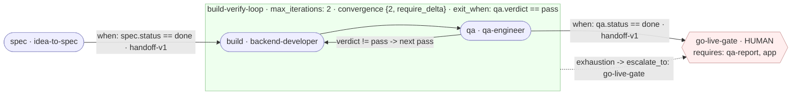
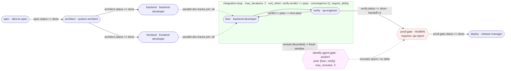
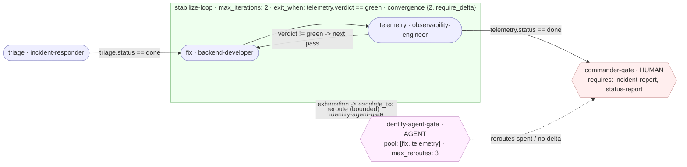

```mermaid
flowchart LR
    classDef skill fill:#eef,stroke:#99c
    classDef human fill:#fee,stroke:#c99
    classDef agent fill:#fef,stroke:#c9c
    classDef loop fill:#efe,stroke:#9c9

    S(["spec · idea-to-spec"]):::skill
    A(["architect · system-architect"]):::skill
    IM(["implement · backend-developer"]):::skill
    SE(["secure · security-engineer"]):::skill
    CO(["compliance · compliance-officer"]):::skill
    FX(["fixer · backend-developer"]):::skill
    V(["verify · qa-engineer"]):::skill
    AG{{"identify-agent-gate · AGENT\npool: [fixer, verify] · max_reroutes: 3"}}:::agent
    CG{{"compliance-gate · HUMAN\nrequires: qa-report, security-report, compliance-report"}}:::human
    DP(["deploy canary · release-manager"]):::skill
    OB(["observe · observability-engineer"]):::skill
    RB{{"release-board-gate · HUMAN\nrequires: canary-report"}}:::human

    S -- "spec.status == done" --> A
    A -- "architect.status == done" --> IM
    A -- "architect.status == done" --> SE
    A -- "architect.status == done" --> CO
    IM -.->|parallel readiness join: all| FX
    SE -.->|parallel readiness join: all| FX
    CO -.->|parallel readiness join: all| FX
    subgraph L ["integration-loop · max_iterations: 2 · exit_when: verify.verdict == pass · convergence {2, require_delta}"]
        direction TB
        FX --> V
        V -- "verdict != pass -> next pass" --> FX
    end
    V -- "verify.status == done" --> CG
    CG -- "compliance-gate.status == done" --> DP
    DP -- "deploy.status == done" --> OB
    OB -- "observe.status == done" --> RB
    L -. "exhaustion -> escalate_to: identify-agent-gate" .-> AG
    AG -- "reroute (bounded)" --> L
    AG -. "reroutes spent / no delta" .-> CG

    class L loop
```

```mermaid
flowchart LR
    classDef skill fill:#eef,stroke:#99c
    classDef human fill:#fee,stroke:#c99
    classDef agent fill:#fef,stroke:#c9c
    classDef loop fill:#efe,stroke:#9c9

    S(["spec · idea-to-spec"]):::skill
    A(["architect · system-architect"]):::skill
    B(["backend · backend-developer"]):::skill
    CR(["code-reviewer"]):::skill
    SR(["security-reviewer"]):::skill
    FX(["fixer · backend-developer"]):::skill
    Q(["qa · qa-engineer"]):::skill
    AG{{"identify-agent-gate · AGENT\npool: [fixer, qa] · max_reroutes: 3"}}:::agent
    RG{{"release-gate · HUMAN\nrequires: change, code-findings, security-findings, qa-report"}}:::human

    S -- "spec.status == done" --> A
    A -- "architect.status == done" --> B
    B -- "backend.status == done" --> CR
    B -- "backend.status == done" --> SR
    CR -.->|parallel auditors join: all| FX
    SR -.->|parallel auditors join: all| FX
    subgraph L ["fix-verify-loop · max_iterations: 2 · exit_when: qa.verdict == pass · convergence {2, require_delta}"]
        direction TB
        FX --> Q
        Q -- "verdict != pass -> next pass" --> FX
    end
    Q -- "qa.status == done" --> RG
    L -. "exhaustion -> escalate_to: identify-agent-gate" .-> AG
    AG -- "reroute (bounded)" --> L
    AG -. "reroutes spent / no delta" .-> RG

    class L loop
```

```mermaid
flowchart LR
    classDef skill fill:#eef,stroke:#99c
    classDef human fill:#fee,stroke:#c99
    classDef agent fill:#fef,stroke:#c9c
    classDef loop fill:#efe,stroke:#9c9

    AN(["analyze · migration-architect"]):::skill
    PG{{"plan-gate · HUMAN\nrequires: migration-plan"}}:::human
    DS(["design · api-designer"]):::skill
    IM(["implement · backend-developer"]):::skill
    V(["verify · qa-engineer"]):::skill
    AG{{"identify-agent-gate · AGENT\npool: [implement, verify] · max_reroutes: 3"}}:::agent
    CG{{"cutover-gate · HUMAN\nrequires: verify-report, slice"}}:::human
    DO(["docs-engineer · documentation-engineer"]):::skill
    DE(["deprecation-engineer"]):::skill

    AN -- "analyze.status == done" --> PG
    PG -- "plan-gate.status == done" --> DS
    DS -- "design.status == done" --> IM
    subgraph L ["implement-verify-loop · max_iterations: 2 · exit_when: verify.verdict == pass · convergence {2, require_delta}"]
        direction TB
        IM --> V
        V -- "verdict != pass -> next pass" --> IM
    end
    V -- "verify.status == done" --> CG
    CG -- "cutover-gate.status == done" --> DO
    CG -- "cutover-gate.status == done" --> DE
    L -. "exhaustion -> escalate_to: identify-agent-gate" .-> AG
    AG -- "reroute (bounded)" --> L
    AG -. "reroutes spent / no delta" .-> CG

    class L loop
```

# Detailed Annotated Diagrams — Runnable Examples

Field-accurate diagrams for the runnable examples. Each diagram is generated from the
**manifest as committed** — node ids, skills, gates, loops, budgets, edges, conditions and
payloads all match the YAML — so you can read the picture and the file side by side.

Six **deep-dive** examples (full annotated ASCII + Mermaid here) plus a **client-request
suite** (five compact examples whose diagrams live in their own READMEs, listed in the index
below).

Quick index (start → end, all the way to a production release or accepted delivery):

| # | Example | Scale / type | Start | Human gates | End |
|---|---|---|---|---|---|
| 1 | `solo-saas` | small project | `spec` | go-live | `go-live-gate` |
| 2 | `team-product` | mid project | `spec` | prod | `deploy` |
| 3 | `enterprise-platform` | large project | `spec` | compliance + release board | `release-board-gate` |
| 4 | `payments-api-ship` | new app / feature | `spec` | release | `release-gate` |
| 5 | `production-incident` | incident / ops | `triage` | commander | `commander-gate` |
| 6 | `strangler-migration` | DB / system migration | `analyze` | plan + cutover | `docs-engineer, deprecation-engineer` |
| 7 | `add-feature` *(request suite)* | feature on existing app | `scope` | accept | `accept-gate` |
| 8 | `ui-change` *(request suite)* | UI change | `ui` | accept | `accept-gate` |
| 9 | `api-change` *(request suite)* | API change/create | `contract` | accept | `accept-gate` |
| 10 | `db-create` *(request suite)* | DB create | `schema` | schema + release | `release-gate` |
| 11 | `support-maintain` *(request suite)* | support & maintain | `intake` | month close | `close-gate` |

The request-suite (#7–#11) maps 1:1 to `docs/client-request-playbook.md` rows; see each
folder's `README.md` for its diagram + real trace.

---

## How to read these diagrams (legend)

**Node shapes**

```
[ spec ]        skill node — one SKILL.md runs here  (label shows node id · skill)
{ human gate }  kind: human — a person decides; requires: <state fields>
{ agent gate }  kind: agent — identify-agent gate: pool + max_reroutes + escalate_to
( ... )         parallel block — fan-out with join: all | majority | any
[== loop ==]    loop — nodes inside repeat; exit_when decides when to stop
```

**Edges**

```
──►  normal edge        label:  when: <condition>   · payload: handoff-v1
╌╌►  escalation edge    (loop exhaustion routes to escalate_to)
```

**Annotated on the diagrams you will find**

- `max_steps` (global budget) and the manifest `end` node(s).
- Every loop: `nodes`, `exit_when`, `max_iterations`, `convergence {window, require_delta}`,
  `escalate_to`.
- Every agent gate: `pool`, `max_reroutes`, `escalate_to` (its terminal human gate).
- Every human gate: its `requires` list.
- Every parallel block: members + `join` policy + merged `outputs`.
- Every edge: its `when` condition and that it carries the `handoff-v1` payload
  (`status, summary, artifacts, decisions, open_questions, verification_evidence, context,
  budget, next`).

Colors are informational only (Mermaid `classDef`); ASCII diagrams use the shapes above.

---

## 1 · Solo SaaS (`examples/solo-saas`) — small

Budget `max_steps: 30` · start `spec` · end `[go-live-gate]`.

**Mermaid**



**ASCII**

```
 budget: max_steps 30            start: spec                end: go-live-gate
 [idea]
   │
   ▼
 [spec · idea-to-spec]
   │  when: spec.status == done · payload: handoff-v1
   ▼
 ╔═ build-verify-loop ───────────────────────────────╗
 ║  [build · backend-developer]                      ║
 ║        │                                          ║
 ║        ▼                                          ║
 ║  [qa · qa-engineer]   exit_when: qa.verdict==pass ║
 ║        │ no ────────► (next pass)                 ║
 ╚════════╪══════════════════════════════════════════╝
   green  │                        │ exhaustion (max 2 / stagnation)
          ▼                        ▼
 {go-live-gate · HUMAN} ◄──────────╌╌ escalate_to (straight to human —
  requires: qa-report, app            no agent pool at solo scale)
          │
          ▼
   in production
```

What to notice: no agent gate by design; the loop's `escalate_to` IS the human gate; single
handoff payload registry end to end; one human decision owns the release.

---

## 2 · Team Product (`examples/team-product`) — mid

Budget `max_steps: 60` · start `spec` · end `[deploy]`.

**Mermaid**



**ASCII**

```
 budget: max_steps 60               start: spec               end: deploy
 [spec · idea-to-spec]
   │  when: spec.status == done
   ▼
 [architect · system-architect]
   │                 │  when: architect.status == done · handoff-v1
   ▼                 ▼
 (parallel dev-tracks · join: all · outputs: build-artifacts)
 [backend · backend-developer]   [frontend · frontend-developer]
   │                 │  when: <member>.status == done · handoff-v1
   ▼                 ▼
 ╔═ integration-loop ───────────────────────────────────────────╗
 ║  [fixer · backend-developer]                                 ║
 ║      │                                                      ║
 ║      ▼                                                      ║
 ║  [verify · qa-engineer]  exit_when: verify.verdict == pass  ║
 ║      │ no ───────────► (next pass)                           ║
 ╚══════╪═══════════════════════════════════════════════════════╝
  green │                                   │ exhaustion
        ▼                                   ▼
 {identify-agent-gate · AGENT} ◄────────────╌╌ escalate_to
  pool: [fixer, verify] · max_reroutes: 3
        │ reroute (bounded) ──► (fresh loop window)
        │ reroutes spent / no delta
        ▼
 {prod-gate · HUMAN}        requires: qa-report
   │  when: prod-gate.status == done
   ▼
 [deploy · release-manager]
   │
   ▼
 production
```

What to notice: parallel fan-out + join feeds a single integration loop; agent gate sits
between loop exhaustion and the human; `deploy` is a real skill node after the human gate.

---

## 3 · Enterprise Platform (`examples/enterprise-platform`) — large

Budget `max_steps: 120` · start `spec` · end `[release-board-gate]`.

**Mermaid**



**ASCII**

```
 budget: max_steps 120              start: spec            end: release-board-gate
 [spec · idea-to-spec]
   │
   ▼
 [architect · system-architect]
   │             │             │  when: architect.status == done · handoff-v1
   ▼             ▼             ▼
 (parallel readiness · join: all · outputs: readiness-artifacts)
 [implement]  [secure · security-engineer]  [compliance · compliance-officer]
   │             │             │  when: <member>.status == done · handoff-v1
   ▼             ▼             ▼
 [fixer · backend-developer]              <- integrates audit findings
 ╔═ integration-loop ─────────────────────────────────────────────╗
 ║  fixer ⇄ verify · qa-engineer                                  ║
 ║  exit_when: verify.verdict == pass · max_iterations: 2         ║
 ║  convergence {window 2, require_delta}                         ║
 ╚═════════════╪══════════════════════════════════════════════════╝
  green        │                                   │ exhaustion
               ▼                                   ▼
 {identify-agent-gate · AGENT} ◄──────────────────╌╌ escalate_to
  pool: [fixer, verify] · max_reroutes: 3          (reroute -> fresh window)
               │ reroutes spent / no delta
               ▼
 {compliance-gate · HUMAN}    requires: qa-report, security-report, compliance-report
   │  when: compliance-gate.status == done
   ▼
 [deploy canary · release-manager]        (5% canary)
   │  when: deploy.status == done
   ▼
 [observe · observability-engineer]       (canary health gate)
   │  when: observe.status == done
   ▼
 {release-board-gate · HUMAN}   requires: canary-report
   │
   ▼
 full production rollout
```

What to notice: **two human gates at different risk points** (compliance before canary, board
before full rollout); canary→observability is a real gate between them; agent gate escalates to
the *first* human gate.

---

## 4 · Payments API Ship (`examples/payments-api-ship`) — mid feature

Budget `max_steps: 80` · start `spec` · end `[release-gate]`.

**Mermaid**



**ASCII**

```
 budget: max_steps 80        start: spec      end: release-gate
 [spec] -> [architect] -> [backend · backend-developer]
                              │                 │  when: backend.status == done
                              ▼                 ▼
              (parallel auditors · join: all · outputs: audit-findings)
            [code-reviewer]          [security-reviewer]
                              │                 │  when: <member>.status == done · handoff-v1
                              ▼                 ▼
 ╔═ fix-verify-loop ───────────────────────────────────────╗
 ║  [fixer · backend-developer]  ⇄  [qa · qa-engineer]     ║
 ║  exit_when: qa.verdict == pass · max_iterations: 2      ║
 ╚════════════╪════════════════════════════════════════════╝
   green       │                        │ exhaustion
               ▼                        ▼
 {identify-agent-gate · AGENT} ◄───────╌╌ escalate_to
  pool [fixer, qa] · max_reroutes 3     (reroute -> window; then)
               │ reroutes spent        {release-gate · HUMAN} ◄─╌ no delta
               ▼
 {release-gate · HUMAN}   requires: change, code-findings, security-findings, qa-report
   │
   ▼
 production release
```

What to notice: the canonical tutorial example — parallel audits, one loop, agent gate, single
human release gate. Full narrative: `README.md` + `TUTORIAL.md`.

---

## 5 · Production Incident (`examples/production-incident`) — ops

Budget `max_steps: 60` · start `triage` · end `[commander-gate]`.

**Mermaid**



**ASCII**

```
 budget: max_steps 60         start: triage      end: commander-gate
 [alert: checkout 5xx]
   │
   ▼
 [triage · incident-responder]        -> declares SEV-2 + scope (payload handoff-v1)
   │  when: triage.status == done
   ▼
 ╔═ stabilize-loop ─────────────────────────────────────────╗
 ║  [fix · backend-developer] ⇄ [telemetry · observability]║
 ║  exit_when: telemetry.verdict == green · max 2          ║
 ╚════════════╪═════════════════════════════════════════════╝
  green        │                         │ exhaustion (max-iterations / stagnation)
               ▼                         ▼
 {identify-agent-gate · AGENT} ◄─────────╌╌ escalate_to
  pool [fix, telemetry] · max_reroutes 3 (reroute -> window; then)
               │ no delta / reroutes spent
               ▼
 {commander-gate · HUMAN}      requires: incident-report, status-report
   │
   ▼
 declare / rollback / confirm stabilization
```

What to notice: escalation reasons matter — stagnation across reroutes escalates to the
commander; every pass carries `evidence`/`diagnostics` so the human report is never empty.

---

## 6 · Strangler Migration (`examples/strangler-migration`) — migration

Budget `max_steps: 80` · start `analyze` · end `[docs-engineer, deprecation-engineer]`.

**Mermaid**



**ASCII**

```
 budget: max_steps 80   start: analyze   end: [docs-engineer, deprecation-engineer]
 [analyze · migration-architect]      (which slice, routes/tables/flag)
   │  when: analyze.status == done
   ▼
 {plan-gate · HUMAN}                  requires: migration-plan    <- human 1
   │  when: plan-gate.status == done
   ▼
 [design · api-designer]
   │  when: design.status == done
   ▼
 ╔═ implement-verify-loop ─────────────────────────────────────╗
 ║  [implement · backend-developer] ⇄ [verify · qa-engineer]  ║
 ║  exit_when: verify.verdict == pass · max_iterations: 2      ║
 ╚════════════╪════════════════════════════════════════════════╝
  green        │                              │ exhaustion
               ▼                              ▼
 {identify-agent-gate · AGENT} ◄─────────────╌╌ escalate_to
  pool [implement, verify] · max_reroutes 3   (reroute -> window; then)
               │ no delta / reroutes spent
               ▼
 {cutover-gate · HUMAN}            requires: verify-report, slice   <- human 2
   │  when: cutover-gate.status == done
   ├─────────────► [docs-engineer · documentation-engineer]
   └─────────────► [deprecation-engineer]      (slice closed out)
```

What to notice: **two human gates that gate different risks** (plan = "are we doing the right
thing?", cutover = "is it safe to switch?"); the agent gate escalates to the *cutover* gate, not
the plan gate; two end nodes — the slice is only done when docs **and** deprecation are done.

---

## Seeing these live

Every diagram is backed by a runnable manifest and a deterministic executor:

```bash
# validate everything (all 18 manifests, incl. the eleven below)
python3 scripts/validate-workflows.py --all

# example: run one diagram end to end and watch its state.log
python3 scripts/workflow-runner.py \
    --manifest examples/enterprise-platform/enterprise-platform.yaml \
    --executor examples/enterprise-platform/executor_demo.py \
    --state /tmp/ent-clean.json     # then inspect /tmp/ent-clean.json
```

Escalation is drawn as a dashed ╌╌ / `-.->` arc: that is a *designed* path (bounded reroutes,
then a person), never an accident — see `workflow/templates/escalate.md` for what the human
receives on that path.
