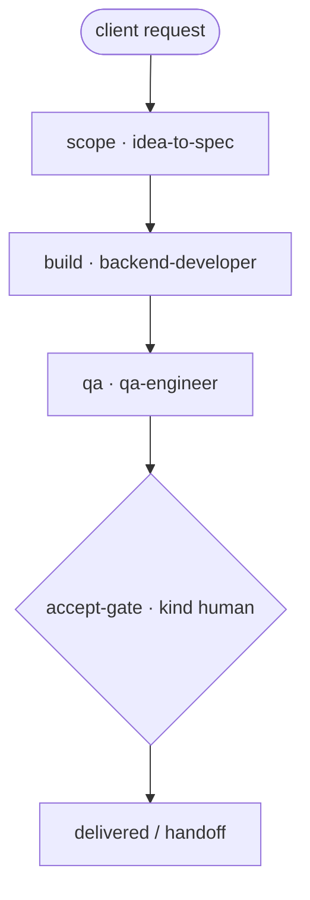

# Add Feature — "Client asked: add a feature to my app"

A runnable example of a small (S-class) feature engagement on an existing app: scope it,
implement it, verify it, and stop at a **human acceptance gate**. Serial, few nodes, one
client-facing decision — the shape a freelancer runs dozens of times a year.

> New to the repo? `examples/payments-api-ship/TUTORIAL.md` is the 45-minute onboarding.
> Price this engagement with `skills/15-sales/services-engagement-pricing`.

## Flow

```
 [client: add export-to-PDF]
        ▼
 scope · idea-to-spec              (feature spec + acceptance criteria)
        ▼   when: scope.status == done · handoff-v1
 build · backend-developer
        ▼   when: build.status == done · handoff-v1
 qa · qa-engineer
        ▼   when: qa.status == done · handoff-v1
 {accept-gate · HUMAN}             (approve or send back)
        ▼
   delivered
```

Mermaid:



Files: `add-feature.yaml` (manifest), `executor_demo.py` (deterministic stand-in). Skills:
`idea-to-spec`, `backend-developer`, `qa-engineer`.

## Run it

```bash
python3 scripts/workflow-runner.py --manifest examples/add-feature/add-feature.yaml   # stub
python3 scripts/workflow-runner.py \
    --manifest examples/add-feature/add-feature.yaml \
    --executor examples/add-feature/executor_demo.py --state /tmp/add-feature.json
```

## Real trace

`outcome: complete · steps_used: 4`

```
scope → build → qa → accept-gate (approved)
last handoff: {"from": "qa", "to": "accept-gate", "payload": "handoff-v1", "sha": "71762e29299a"}
```

What this teaches: the minimal viable engagement shape — scope → build → verify → **you
approve**. Same skeleton scales to any small feature; add a fix-verify loop and an agent gate
when the feature is big enough to iterate on (`examples/payments-api-ship`).
