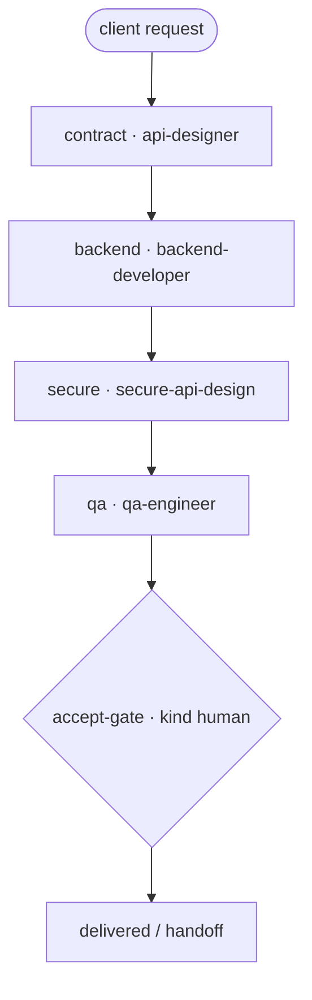

# API Change — "Client asked: change/create an API"

A runnable example of a contract-first API engagement: redesign the contract, implement,
harden (security), verify contract behavior, and stop at a **human acceptance gate**.

> New to the repo? `examples/payments-api-ship/TUTORIAL.md` is the 45-minute onboarding.
> Schema moves too? Start with `examples/db-create`; full system migration →
> `examples/strangler-migration`.

## Flow

```
 [client: change the payments API]
        ▼
 contract · api-designer             (v2 contract: pagination, error model, versioning)
        ▼   when: contract.status == done · handoff-v1
 backend · backend-developer
        ▼   when: backend.status == done · handoff-v1
 secure · secure-api-design          (auth, rate limits, exposure check)
        ▼   when: secure.status == done · handoff-v1
 qa · qa-engineer                    (contract tests)
        ▼   when: qa.status == done · handoff-v1
 {accept-gate · HUMAN}               (contract + impl + security sign-off)
        ▼
   delivered
```

Mermaid:



Files: `api-change.yaml` (manifest), `executor_demo.py` (deterministic stand-in). Skills:
`api-designer`, `backend-developer`, `secure-api-design`, `qa-engineer`.

## Run it

```bash
python3 scripts/workflow-runner.py --manifest examples/api-change/api-change.yaml          # stub
python3 scripts/workflow-runner.py \
    --manifest examples/api-change/api-change.yaml \
    --executor examples/api-change/executor_demo.py --state /tmp/api-change.json
```

## Real trace

`outcome: complete · steps_used: 5`

```
contract → backend → secure → qa → accept-gate (approved)
last handoff: {"from": "qa", "to": "accept-gate", "payload": "handoff-v1", "sha": "4574616fe60e"}
```

What this teaches: contract-first ordering is enforced by edges (schema/contract before
implementation), security review is a node — not a hope — and the client gate reviews
contract + implementation + security together.
