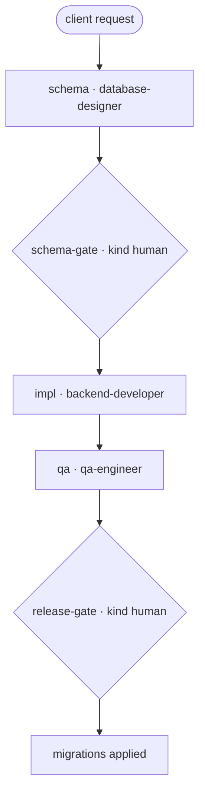

# DB Create — "Client asked: create a database for a new module"

A runnable example of a schema-first database engagement with **two human gates** (like a
mini migration): design the schema + migration plan, human reviews it before any DDL,
implement migrations, verify data integrity, and a second human approves the production
release.

> New to the repo? `examples/payments-api-ship/TUTORIAL.md` is the 45-minute onboarding.
> Migrating an existing DB instead → `examples/strangler-migration`.

## Flow

```
 [client: create a DB for the new module]
        ▼
 schema · database-designer          (schema v1 + forward/backward migration plan)
        ▼   when: schema.status == done · handoff-v1
 {schema-gate · HUMAN}               ← human 1: review BEFORE any DDL
        ▼   when: schema-gate.status == done · handoff-v1
 impl · backend-developer            (write migrations + rollback; run on staging copy)
        ▼   when: impl.status == done · handoff-v1
 qa · qa-engineer                    (data-integrity tests)
        ▼   when: qa.status == done · handoff-v1
 {release-gate · HUMAN}              ← human 2: approve production apply
        ▼
   migrations applied
```

Mermaid:



Files: `db-create.yaml` (manifest), `executor_demo.py` (deterministic stand-in). Skills:
`database-designer`, `backend-developer`, `qa-engineer`.

## Run it

```bash
python3 scripts/workflow-runner.py --manifest examples/db-create/db-create.yaml            # stub
python3 scripts/workflow-runner.py \
    --manifest examples/db-create/db-create.yaml \
    --executor examples/db-create/executor_demo.py --state /tmp/db-create.json
```

## Real trace

`outcome: complete · steps_used: 5`

```
schema → schema-gate (approved) → impl → qa → release-gate (approved)
last handoff: {"from": "qa", "to": "release-gate", "payload": "handoff-v1", "sha": "6122e16b59c7"}
```

What this teaches: database work is **two-decision** work — the schema is reviewed before it
exists anywhere real, and the apply is approved only after integrity verification. Never let a
schema reach an environment without a human design gate.
