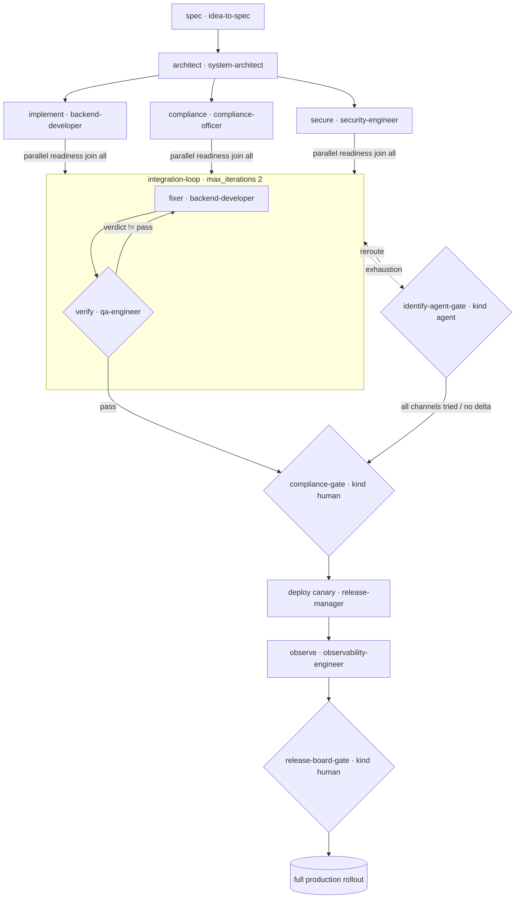

# Enterprise Platform — Large Project, Program to Production Release

A runnable example at **large / enterprise scale** (maps to the full-library thinking of
`examples/logsnap-solo-to-scale/` tier 3): one platform release with three parallel readiness
tracks (implementation, security, compliance) that join, a bounded integration loop with a
**kind: agent gate**, a **human compliance gate** before canary deploy, an observability check,
and a final **human release-board gate** for full rollout. Start to prod release.

> New to the repo? Read `examples/payments-api-ship/TUTORIAL.md` first (45-minute onboarding).

## The flow

```
 spec · idea-to-spec --> architect · system-architect
                              |
      ┌───────────────────────┼───────────────────────┐  readiness (parallel, join: all)
      v                       v                       v
 implement · backend    secure · security-engineer   compliance · compliance-officer
      └───────────────────────┬───────────────────────┘
                              v  fixer · backend-developer (integrates audit findings)
      ┌───────────── integration-loop (max_iterations: 2) ────────────┐
      │   fixer ⇄ verify · qa-engineer       exit: verify.verdict==pass │
      └─────────────┬───────────────────────────────────────────────────┘
               green (exit)                         exhaustion
                    v                                    v
      compliance-gate (kind: human)  <--- identify-agent-gate (kind: agent)
      security + compliance approve          reroute 1/3→fixer · 2/3→verify,
                    v                         then escalate (all channels tried)
      deploy canary · release-manager
                    v
      observe · observability-engineer   (canary healthy?)
                    v
      release-board-gate (kind: human)
                    v
             full production rollout
```

Mermaid:



Files: `enterprise-platform.yaml` (manifest), `executor_demo.py` (deterministic stand-in), this
README. Skills: `idea-to-spec`, `system-architect`, `backend-developer`, `security-engineer`,
`compliance-officer`, `qa-engineer`, `release-manager`, `observability-engineer`.

> **Detailed annotated diagrams for all six examples:** [`../DETAILED-DIAGRAMS.md`](../DETAILED-DIAGRAMS.md)

## Run it

```bash
# smoke (stub)
python3 scripts/workflow-runner.py --manifest examples/enterprise-platform/enterprise-platform.yaml

# clean — readiness joins, one agent reroute, compliance gate + release board both approve:
python3 scripts/workflow-runner.py \
    --manifest examples/enterprise-platform/enterprise-platform.yaml \
    --executor examples/enterprise-platform/executor_demo.py --state /tmp/ent-clean.json

# blocked — every channel tried, then the compliance gate reviews (no force cutover):
ENTERPRISE_SCENARIO=blocked python3 scripts/workflow-runner.py \
    --manifest examples/enterprise-platform/enterprise-platform.yaml \
    --executor examples/enterprise-platform/executor_demo.py --state /tmp/ent-blocked.json
```

## Real traces

Clean (`outcome: complete`, `steps_used: 15`):

```
spec → architect → implement → secure → compliance      (parallel readiness, join: all)
  → fixer → verify → fixer → verify                     (window 1: QA fails → exhaustion)
  → agent-gate | reroute 1/3 -> fixer
  → fixer → verify                                      (window 2: QA passes → exit)
  → compliance-gate (human approved)
  → deploy canary → observe (canary healthy)
  → release-board-gate (human approved) → full rollout
```

Blocked (`outcome: complete`, `steps_used: 21`):

```
9  agent-gate | reroute 1/3 -> fixer
13 agent-gate | reroute 2/3 -> verify
17 escalate   | all channels tried (fixer,verify) (reroutes 3/3)
   → compliance-gate (human reviews the escalation report; no automated canary)
```

What this teaches: three-way parallel readiness with one join, a loop + agent gate, **two human
gates at different risk points** (compliance before canary, release board before full rollout),
and a canary→observability gate before the final human sign-off — the release-train shape of a
regulated platform team.
