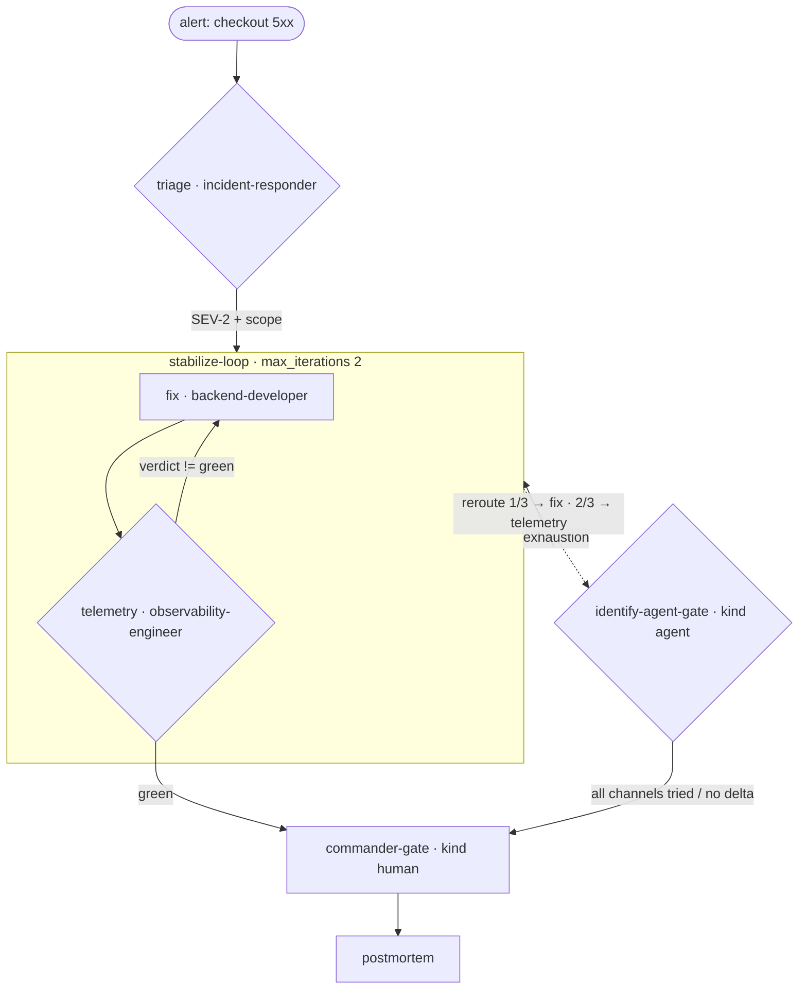

# Production Incident — The On-Call Firefight as a Workflow Graph

A real-world runnable example: a **payments checkout 5xx alert** arrives at 2 a.m. Watch the
graph triage the incident, run bounded mitigation windows, escalate to an **agent gate** that
picks the corrective channel, and — if automation can't stabilize — escalate to the **human
incident commander** for the declare/rollback call.

> New to the repo? Read `examples/payments-api-ship/TUTORIAL.md` first (45-minute onboarding).

## The flow

```
                    [alert: checkout 5xx]

                           ▼
              triage  ·  incident-responder
              declares SEV-2 + scope (handoff payload)

                           ▼
        ┌───────────── stabilize-loop (max_iterations: 2) ─────────────┐
        │   fix  · backend-developer                                   │
        │     ▼                                                        │
        │   telemetry  · observability-engineer                        │
        │     verdict == green? ──no──► (next pass)                    │
        └─────────────┬───────────────────────────────────────────────┘
                 green (exit)                     exhaustion / stagnation
                      │                                      ▼
                      ▼                    identify-agent-gate (kind: agent)
         commander-gate (kind: human) ◄── reroute 1/3 -> fix, 2/3 -> telemetry,
         confirms stabilization or            then escalate (all channels tried)
         declares rollback / SEV              = no-delta → commander-gate
                      │
                      ▼
                postmortem scheduled
```

Mermaid (renders on GitHub / editors with Mermaid support):



Files: `production-incident.yaml` (manifest), `executor_demo.py` (deterministic stand-in for
agentic content), this README.

> **Detailed annotated diagrams for all six examples:** [`../DETAILED-DIAGRAMS.md`](../DETAILED-DIAGRAMS.md)

## Run it

```bash
# smoke — stub passes everything (traversal + handoff only)
python3 scripts/workflow-runner.py \
    --manifest examples/production-incident/production-incident.yaml

# stabilized — QA-style loop exhausts once, agent gate reroutes a bounded window,
# telemetry goes green, the human commander confirms:
python3 scripts/workflow-runner.py \
    --manifest examples/production-incident/production-incident.yaml \
    --executor examples/production-incident/executor_demo.py \
    --state /tmp/pi-happy.json

# SEV — never stabilizes; every channel is tried, then the human commander decides:
INCIDENT_SCENARIO=sev python3 scripts/workflow-runner.py \
    --manifest examples/production-incident/production-incident.yaml \
    --executor examples/production-incident/executor_demo.py \
    --state /tmp/pi-sev.json
```

## Real traces

Stabilized (`outcome: complete`, `steps_used: 8`, telemetry `green`, commander `approved`):

```
triage → fix → telemetry → fix → telemetry          window 1: still degraded → exhaustion
5 identify-agent-gate agent-gate | reroute 1/3 -> fix (stabilize-loop, max-iterations)
      → fix → telemetry                            window 2: telemetry green on run 3 → exit
      → commander-gate (approved)                  human confirms stabilization
```

SEV escalation (`outcome: complete`, `steps_used: 14`):

```
5 identify-agent-gate agent-gate | reroute 1/3 -> fix
9 identify-agent-gate agent-gate | reroute 2/3 -> telemetry
13 identify-agent-gate escalate   | all channels tried (fix,telemetry) (reroutes 3/3)
   → commander-gate (declared)    # human owns rollback / severity, not automation
```

Why this matches the real world: incident response is **time-boxed** (loops + step budget),
**evidence-first** (each pass carries `evidence`/`diagnostics`; the commander never sees an
empty escalation report), and **authority-aware** — automation may stabilize, but the call to
declare or roll back is a person's.
