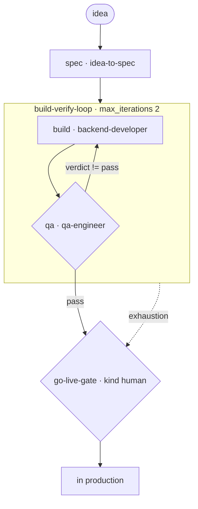

# Solo SaaS — Small Project, Idea to First Production Release

A runnable example at **small / solo scale** (maps to `skills-init --solo` thinking in
`examples/logsnap-solo-to-scale/`): one developer takes an idea to a live production release.
Serial, few nodes, one human decision. Escalation goes **straight to the human** — at solo scale
there is no specialist pool to reroute through, so the loop's `escalate_to` targets the go-live
gate directly.

> New to the repo? Read `examples/payments-api-ship/TUTORIAL.md` first (45-minute onboarding).

## The flow

```
  [idea] --> spec · idea-to-spec
                 |
                 v
   ┌──────────── build-verify-loop (max_iterations: 2) ────────────┐
   │   build · backend-developer                                   │
   │     |                                                        │
   │     v                                                        │
   │   qa · qa-engineer          exit_when: qa.verdict == pass     │
   └────────────┬───────────────────────────────────────────────────┘
        green (exit)                    exhaustion / stagnation
           |                                       |
           v                                       v
     go-live-gate (kind: human)  <-----------------+
     solo dev approves the release
           |
           v
      in production
```

Mermaid:



Files: `solo-saas.yaml` (manifest), `executor_demo.py` (deterministic stand-in for agentic
content), this README. Skills: `idea-to-spec`, `backend-developer`, `qa-engineer`.

> **Detailed annotated diagrams for all six examples:** [`../DETAILED-DIAGRAMS.md`](../DETAILED-DIAGRAMS.md)

## Run it

```bash
# smoke (stub)
python3 scripts/workflow-runner.py --manifest examples/solo-saas/solo-saas.yaml

# clean — one bounded window, then the solo dev approves go-live:
python3 scripts/workflow-runner.py \
    --manifest examples/solo-saas/solo-saas.yaml \
    --executor examples/solo-saas/executor_demo.py --state /tmp/solo-clean.json

# blocked — QA never passes; the loop exhausts and escalates STRAIGHT to the human
# (no agent pool at solo scale — the solo dev owns the call):
SOLO_SCENARIO=blocked python3 scripts/workflow-runner.py \
    --manifest examples/solo-saas/solo-saas.yaml \
    --executor examples/solo-saas/executor_demo.py --state /tmp/solo-blocked.json
```

## Real traces

Clean (`outcome: complete`, `steps_used: 6`):

```
spec → build → qa → build → qa → go-live-gate (approved)
```

Blocked (`outcome: complete`, `steps_used: 6`) — the escalation is to a person by design:

```
5 escalate | loop build-verify-loop: max-iterations   → go-live-gate (human decides)
```

What this teaches: at solo scale the loop still bounds iteration, handoffs still carry the
payload registry, and the release decision is one human gate — no extra machinery.
