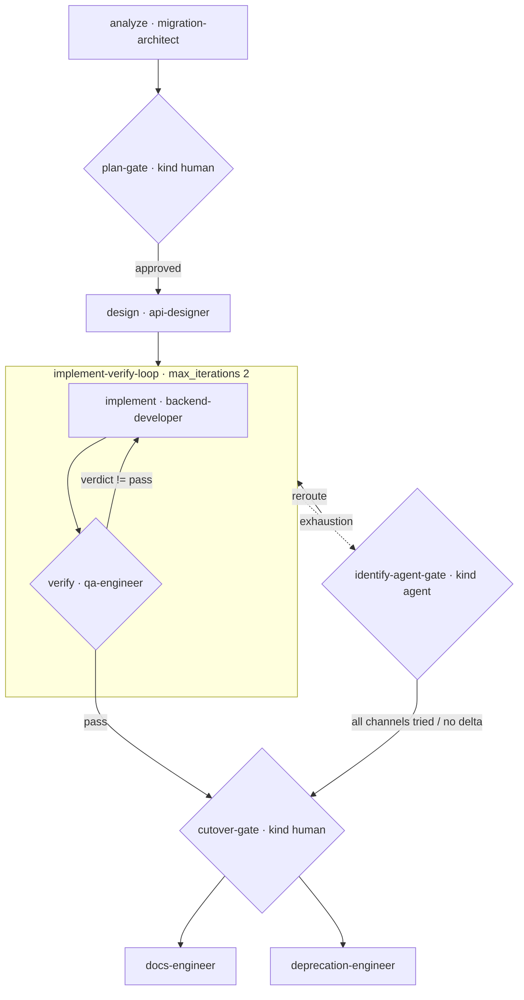

# Strangler Migration — Moving a Legacy Slice to a New Service

A real-world runnable example of a **strangler-fig migration**: migrate one slice of a legacy
monolith (checkout) to a new service without a big-bang rewrite. Human sign-off happens at two
points (plan, cutover), implementation is verified in a bounded loop, and exhaustion escalates
to an **agent gate** that picks the corrective channel before any cutover risk reaches a person.

> New to the repo? Read `examples/payments-api-ship/TUTORIAL.md` first (45-minute onboarding).

## The flow

```
 analyze · migration-architect          (which slice, what routes/tables/flag)
      ▼
 plan-gate · kind human                 (architecture owner approves the plan)
      ▼
 design · api-designer                  (target API for the slice)
      ▼
 ┌──────── implement-verify-loop (max_iterations: 2) ────────┐
 │   implement · backend-developer                           │
 │      ▼                                                    │
 │   verify · qa-engineer  (legacy parity suite)             │
 │      verdict == pass? ──no──► (next pass)                 │
 └───────┬───────────────────────────────────────────────────┘
    green (exit)                         exhaustion / stagnation
      ▼                                            ▼
 cutover-gate · kind human ◄──── identify-agent-gate (kind: agent)
 release owner approves       reroute 1/3 -> implement, 2/3 -> verify,
 (only after green; or           then escalate (all channels tried) / no-delta
  reviews the report)                  → cutover-gate
      ▼ approved
      ├────────────► docs-engineer · documentation-engineer
      └────────────► deprecation-engineer · deprecation-engineer
```

Mermaid (renders on GitHub / editors with Mermaid support):



Files: `strangler-migration.yaml` (manifest), `executor_demo.py` (deterministic stand-in for
agentic content), this README.

> **Detailed annotated diagrams for all six examples:** [`../DETAILED-DIAGRAMS.md`](../DETAILED-DIAGRAMS.md)

## Run it

```bash
# smoke — stub passes everything (two human gates still run in order)
python3 scripts/workflow-runner.py \
    --manifest examples/strangler-migration/strangler-migration.yaml

# clean — verify fails twice, agent gate reroutes a bounded window, parity passes,
# then BOTH humans approve (plan first, cutover second):
python3 scripts/workflow-runner.py \
    --manifest examples/strangler-migration/strangler-migration.yaml \
    --executor examples/strangler-migration/executor_demo.py \
    --state /tmp/sm-clean.json

# blocked — parity never passes; every channel tried, then the human cutover gate
# reviews instead of cutting over:
MIGRATION_SCENARIO=blocked python3 scripts/workflow-runner.py \
    --manifest examples/strangler-migration/strangler-migration.yaml \
    --executor examples/strangler-migration/executor_demo.py \
    --state /tmp/sm-blocked.json
```

## Real traces

Clean migration (`outcome: complete`, `steps_used: 12`):

```
analyze → plan-gate (human approved) → design
  → implement → verify → implement → verify      window 1: parity gap → exhaustion
  → identify-agent-gate: agent-gate | reroute 1/3 -> implement
  → implement → verify                            window 2: parity pass on run 3 → exit
  → cutover-gate (human approved)
  → docs-engineer → deprecation-engineer          slice closed out
```

Blocked migration (`outcome: complete`, `steps_used: 18`):

```
7  identify-agent-gate agent-gate | reroute 1/3 -> implement
11 identify-agent-gate agent-gate | reroute 2/3 -> verify
15 identify-agent-gate escalate   | all channels tried (implement,verify) (reroutes 3/3)
   → cutover-gate (human)          # do-not-cut-over review, not an automated cutover
   → docs-engineer → deprecation-engineer
```

Why this matches the real world: migrations are **phased and gated** (two human gates — plan and
cutover — each a real decision point), **verification-driven** (legacy-parity QA owns `exit_when`,
so you only cut over what you can prove), and **risk-averse by construction** (a blocked slice
escalates to the cutover owner with an evidence trail instead of force-cutting over).
