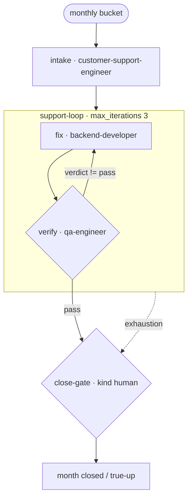

# Support & Maintain — "Client asked: support and maintain my app"

A runnable example of a **recurring engagement** (monthly): intake the ticket bucket,
fix and verify in a bounded loop, escalate to the human month-close gate when fixes stall, and
close the month with a human review of SLA + hours vs the retainer bucket.

> New to the repo? `examples/payments-api-ship/TUTORIAL.md` is the 45-minute onboarding.
> **Price this engagement** with `skills/15-sales/software-maintenance-support-estimator`
> (annual % of build, SLA tiers, retainer bucket, enhancement T&M lane). Prod firefights →
> `examples/production-incident`.

## Flow

```
 [monthly bucket: 12 tickets, SLA watch]
        ▼
 intake · customer-support-engineer   (triage: bug / config / small change)
        ▼   when: intake.status == done · handoff-v1
 ╔═ support-loop (max_iterations: 3, convergence {2, delta}) ════════╗
 ║  fix · backend-developer                                          ║
 ║    ▼                                                              ║
 ║  verify · qa-engineer   exit_when: verify.verdict == pass         ║
 ╚═══════════╪═══════════════════════════════════════════════════════╝
   green      │                             │ exhaustion / stagnation
              ▼                             ▼
 verify ──(handoff)──► {close-gate · HUMAN} ◄─╌ escalate_to (SLA/hours review)
   month close: approve or true-up
```

Mermaid:



Files: `support-maintain.yaml` (manifest), `executor_demo.py` (deterministic stand-in). Skills:
`customer-support-engineer`, `backend-developer`, `qa-engineer`.

## Run it

```bash
python3 scripts/workflow-runner.py --manifest examples/support-maintain/support-maintain.yaml # stub
python3 scripts/workflow-runner.py \
    --manifest examples/support-maintain/support-maintain.yaml \
    --executor examples/support-maintain/executor_demo.py --state /tmp/support-clean.json

# fixes never verify -> the loop exhausts and escalates to the human month-close gate:
SUPPORT_SCENARIO=stuck python3 scripts/workflow-runner.py \
    --manifest examples/support-maintain/support-maintain.yaml \
    --executor examples/support-maintain/executor_demo.py --state /tmp/support-stuck.json
```

## Real traces

Clean month (`outcome: complete · steps_used: 4`):

```
intake → fix → verify → close-gate (approved)
last handoff: {"from": "verify", "to": "close-gate", "payload": "handoff-v1", "sha": "741cfb28f597"}
```

Stuck month (`outcome: complete · steps_used: 8`) — fixes never verify; the loop exhausts and
escalates to the human (SLA/hours review, not silent absorption):

```
intake → fix → verify → fix → verify → fix → verify
7 None escalate | loop support-loop: max-iterations   → close-gate (human)
```

What this teaches: support is a **bounded, reviewed** recurring process — fixes iterate in a
loop with a budget, hours vs the retainer bucket are checked by a person at month close, and
real firefights route out to the incident workflow.
