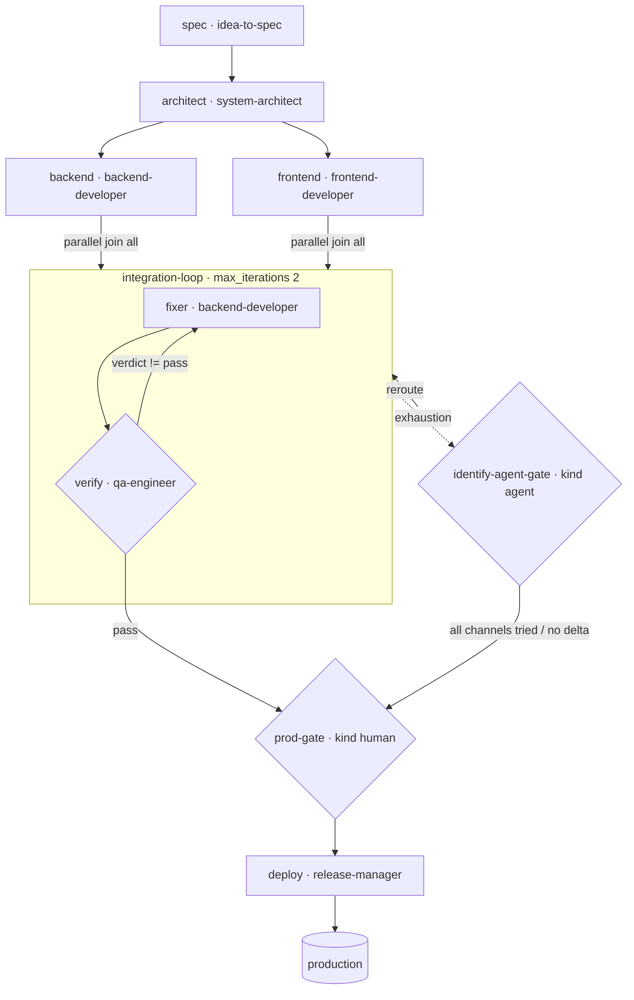

# Team Product — Mid Project, Feature to Production Release

A runnable example at **mid / small-team scale** (maps to `skills-init --grow` thinking in
`examples/logsnap-solo-to-scale/`): one product release built by a small team. Two parallel
tracks (backend + frontend) join, an integration loop keeps fixing until QA passes, exhaustion
escalates to a **kind: agent gate** that picks the corrective channel, and the team lead gives
the final human approval before a real deploy. Start to prod release.

> New to the repo? Read `examples/payments-api-ship/TUTORIAL.md` first (45-minute onboarding).

## The flow

```
 spec · idea-to-spec --> architect · system-architect
                              |
              ┌───────────────┴───────────────┐  dev-tracks (parallel, join: all)
              v                               v
      backend · backend-developer     frontend · frontend-developer
              └───────────────┬───────────────┘
                              v
        ┌────────── integration-loop (max_iterations: 2) ──────────┐
        │   fixer · backend-developer                              │
        │     v                                                    │
        │   verify · qa-engineer       exit_when: verify.verdict==pass
        └───────────┬──────────────────────────────────────────────┘
               green (exit)                      exhaustion
                    v                                   v
             prod-gate (kind: human)   <--- identify-agent-gate (kind: agent)
             team lead approves              reroute 1/3 → fixer · 2/3 → verify,
                    v                         then escalate (all channels tried)
              deploy · release-manager
                    v
               production
```

Mermaid:



Files: `team-product.yaml` (manifest), `executor_demo.py` (deterministic stand-in), this README.
Skills: `idea-to-spec`, `system-architect`, `backend-developer`, `frontend-developer`,
`qa-engineer`, `release-manager`.

> **Detailed annotated diagrams for all six examples:** [`../DETAILED-DIAGRAMS.md`](../DETAILED-DIAGRAMS.md)

## Run it

```bash
# smoke (stub)
python3 scripts/workflow-runner.py --manifest examples/team-product/team-product.yaml

# clean — parallel tracks join, one agent-gate reroute, QA passes, team lead approves, deploy:
python3 scripts/workflow-runner.py \
    --manifest examples/team-product/team-product.yaml \
    --executor examples/team-product/executor_demo.py --state /tmp/team-clean.json

# blocked — every channel tried, then the human prod gate reviews:
TEAM_SCENARIO=blocked python3 scripts/workflow-runner.py \
    --manifest examples/team-product/team-product.yaml \
    --executor examples/team-product/executor_demo.py --state /tmp/team-blocked.json
```

## Real traces

Clean (`outcome: complete`, `steps_used: 12`):

```
spec → architect → backend → frontend           (parallel dev-tracks, join: all)
  → fixer → verify → fixer → verify             (window 1: QA fails → exhaustion)
  → identify-agent-gate: agent-gate | reroute 1/3 -> fixer
  → fixer → verify                              (window 2: QA passes on run 3 → exit)
  → prod-gate (human approved) → deploy (release-manager) → production
```

Blocked (`outcome: complete`, `steps_used: 18`):

```
8  agent-gate | reroute 1/3 -> fixer
12 agent-gate | reroute 2/3 -> verify
16 escalate   | all channels tried (fixer,verify) (reroutes 3/3)
   → prod-gate (human reviews, does not auto-release)
```

What this teaches: multi-agent fan-out + join, a loop with an agent gate before the human, and a
terminal deploy node — the shape most product teams actually run.
