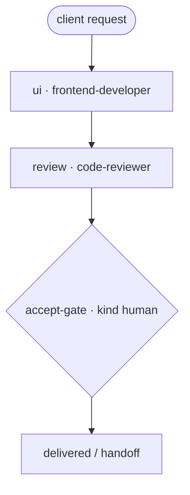

# UI Change — "Client asked: change the UI"

A runnable example of a small UI-change engagement: rebuild the view, review it, and stop at a
**human acceptance gate**. The shape a frontend freelancer runs constantly.

> New to the repo? `examples/payments-api-ship/TUTORIAL.md` is the 45-minute onboarding.

## Flow

```
 [client: redesign the checkout summary]
        ▼
 ui · frontend-developer            (responsive view, dark mode)
        ▼   when: ui.status == done · handoff-v1
 review · code-reviewer             (state handling, regressions)
        ▼   when: review.status == done · handoff-v1
 {accept-gate · HUMAN}              (approve or send back)
        ▼
   delivered
```

Mermaid:



Files: `ui-change.yaml` (manifest), `executor_demo.py` (deterministic stand-in). Skills:
`frontend-developer`, `code-reviewer`.

## Run it

```bash
python3 scripts/workflow-runner.py --manifest examples/ui-change/ui-change.yaml          # stub
python3 scripts/workflow-runner.py \
    --manifest examples/ui-change/ui-change.yaml \
    --executor examples/ui-change/executor_demo.py --state /tmp/ui-change.json
```

## Real trace

`outcome: complete · steps_used: 3`

```
ui → review → accept-gate (approved)
last handoff: {"from": "review", "to": "accept-gate", "payload": "handoff-v1", "sha": "55d884e9500e"}
```

What this teaches: UI work still gets a review node (agents commonly skip it) and a client
gate. Add `accessibility-auditor` for public-facing UIs, or a visual-QA node for large
redesigns (`examples/team-product` pattern with parallel tracks).
