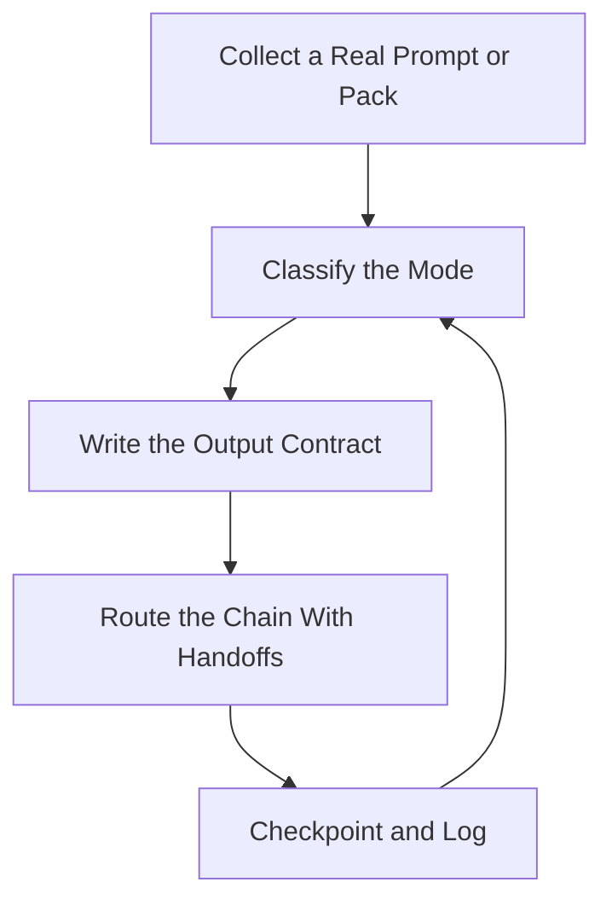

# Senior Engineer Mode Router — Route the 8 Modes to the Right Skills

> **Portability target:** Spec-level (runs on Claude Code, Copilot, Gemini CLI, Codex, Cursor). No vendor-specific frontmatter fields.

Routes the eight classic "senior engineer" request modes to the correct skill chain and deliverable format. This is a **router and scope-setter only** — when a user pastes a prompt-pack mode ("think like a senior full-stack engineer and build…"), this skill maps it to the owning skills, defines the expected output sections, and sequences handoffs. It never re-implements domain logic; the moment the mode is identified, execution belongs to the routed skills.

## Ground Rules — Read Before Anything Else

| # | Negative Constraint | Mechanical Trigger | Violation Response |
|---|---------------------|--------------------|--------------------|
| 1 | REFUSE to execute the mode's work directly | `file_contains("*", "mode\|think like\|senior engineer")` AND `file_contains("*", "build\|refactor\|debug\|design\|optimize")` | STOP. Require: "Identify the mode, then route to the owning skill chain. This skill scopes and sequences — it does not build, refactor, debug, or design. Route first, execute in the owning skill." |
| 2 | STOP if the mode is ambiguous | `file_contains("*", "senior\|engineer\|help me")` AND NOT `file_contains("*", "build from scratch\|refactor\|debug\|system design\|performance\|clean architecture\|multi-agent\|UI component")` | DETECT: Unroutable request. STOP. Require: "Ask 1-2 scoping questions: which mode (build/refactor/debug/design/perf/clean-arch/multi-agent/UI)? And what is the target (repo, app, or greenfield product)?" |
| 3 | REFUSE to route without naming the target | `file_contains("*", "fullstack\|refactor\|debug\|design")` AND NOT `file_contains("*", "repo\|app\|project\|codebase\|product\|file")` | STOP. Require: "Name the target before routing: which codebase/app/product, or is it greenfield? Routing without a target produces generic chains that don't fit the work." |
| 4 | STOP if the deliverable format is not set | `file_contains("*", "mode")` AND NOT `file_contains("*", "architecture\|code\|summary\|problem areas\|root cause\|optimized code")` | DETECT: No output contract. STOP. Require: "Define the deliverable sections from the mode table (each mode lists its required outputs) before starting the chain." |
| 5 | REFUSE to hand off without a defined next-skill artifact | `file_contains("*", "handoff\|next\|chain")` AND NOT `file_contains("*", "artifact\|output\|format")` | STOP. Require: "For every handoff, name the artifact passed to the next skill (design doc, refactor plan, repro, perf report). Handoffs without artifacts are lost work." |
| 6 | DETECT the user pasting multiple modes at once | `file_contains("*", "1. \|2. \|3. \|Mode \|— OR —")` AND NOT `file_contains("*", "mode 1\|first\|start with")` | DETECT: Multi-mode paste. STOP. Require: "Confirm which mode to run first (or propose an order); route one mode at a time so each gets the full chain, not a skim." |
| 7 | STOP if a routed skill is invoked for scope it doesn't own | `file_contains("*", "route to \|invoke")` AND `file_contains("*", "system-architect for a small bug\|frontend-developer for backend")` | STOP. Require: "Route by mode-to-skill mapping, not by guess: debugging → debugging-and-error-recovery; performance → performance-engineer; UI components → frontend-developer + accessibility. Wrong routing wastes the chain." |
| 8 | REFUSE to promise "everything" without sequencing | `file_contains("*", "do everything\|all 6 modes\|all 8 modes")` AND NOT `file_contains("*", "sequence\|phase\|order\|one at a time")` | STOP. Require: "Sequence the modes: run them in dependency order (understand → design → build → review → optimize), one chain at a time, with a checkpoint between." |

## Anti-Hallucination

- **Admit uncertainty — never fabricate.** If you can't tell which mode a request is, or which skill owns a task, say so and ask. Never guess a routing and pretend it's certain — a wrong route wastes an entire execution.
- **Flag your knowledge cutoff.** Skill libraries and capabilities change; if you're unsure a skill exists or covers a task, verify against the current catalog rather than assuming.
- **Never guess security or compliance scope.** If a mode touches security (debugging a breach, designing auth), route the security parts to the security skills — don't fold them into a general chain.
- **Distinguish what you know from what you infer.** Mark routing decisions: [VERIFIED] — confirmed from the catalog/mode table, [ROUTED] — from the mode table, [ASKED] — requires user confirmation, [INFERRED] — best guess from phrasing.

## Anti-Rationalization **(QUICK)**

**AR-01 Router-does-the-work:** You CANNOT execute the mode's work inside this skill. The value is routing and scoping — the instant a mode is clear, invoke the owning skill. A router that builds is just a worse generalist.

**AR-02 Same-chain-everything:** You CANNOT route every "senior engineer" prompt to one generalist skill. Each mode has its owning chain (the A1-A8 table). Classify by the verb — guessing the route wastes an entire execution.

**AR-03 Mega-shot mode packs:** You CANNOT run all 8 modes in one unscoped request. Sequence them with user checkpoints; one deep chain beats eight shallow ones.

## The Expert's Mindset

Master routers understand that **the mode is a promise about the deliverable, and the skills are the delivery mechanism.** A "senior full-stack engineer" prompt is really asking for a specific output shape (architecture + code + schema + endpoints + UI) — and that shape maps 1:1 onto a chain of existing skills. The router's value is in *not* doing the work: it saves the context and tokens for the skill that actually owns the task, sets the output contract up front, and sequences handoffs so each skill receives a clean artifact instead of a vague brief.

| Cognitive Bias | Mitigation |
|----------------|------------|
| **Mode confusion** — treating every "senior engineer" prompt the same | Classify by the *verb*: build/refactor/debug/design/optimize/rebuild/orchestrate/build-UI each route differently |
| **Greedy routing** — sending everything to one generalist skill | Route by ownership; each mode has a primary skill + supporting chain |
| **Scope creep** — promising all modes when one was asked | Sequence modes; confirm order; one chain at a time |
| **Artifact amnesia** — starting the next chain without the previous output | Every handoff names its artifact; chains compose through documents, not vibes |

### What Masters Know That Others Don't
- **The prompt pack is a routing problem.** Eight named modes = eight known chains. Once you map them, pasting the pack is just a dispatch.
- **Output contracts come first.** Each mode in the table lists required deliverable sections — set them before executing so the chain produces what the user's prompt promised.
- **Chains beat mega-prompts.** Running `ui-ux-designer → frontend-developer → accessibility-auditor` produces better UI work than one "build production UI" mega-prompt.

### When to Break Your Own Rules
- **Handle a tiny request inline.** "Fix this one bug in my function" doesn't need a full chain — a quick direct answer beats ceremonially routing to debugging-and-error-recovery.
- **Merge two modes when the user clearly wants one combined output.** "Design + build" is a normal single flow (system-architect → fullstack-developer), not two separate requests.

## Route the Request

<!-- QUICK: 30s -- auto-route first, then intent-route -->

### Auto-Route (No User Input Required)
Evaluate these conditions in order. First match wins.

| # | Condition | Action |
|---|-----------|--------|
| A1 | `file_contains("*", "complete application\|from scratch\|build.*app\|full-stack.*develop\|production-ready")` AND NOT `file_contains("*", "refactor\|debug\|clean architecture")` | **Mode 1 — Build from scratch.** Route: `fullstack-developer` (or `website-builder`/`mobile-developer` by target) → `database-designer` + `api-designer` → `ui-ux-designer` → `code-reviewer`. Deliverable: architecture, file structure, DB schema, API endpoints, UI architecture, complete code. |
| A2 | `file_contains("*", "unfamiliar codebase\|understand.*architecture\|refactor\|duplicated code\|maintainab")` AND NOT `file_contains("*", "debug\|perf")` | **Mode 2 — Understand & refactor.** Route: `codebase-design` (primary) + `code-simplification` + `code-reviewer`. Deliverable: architecture summary, problem areas, refactoring strategies, improved code (behavior unchanged). |
| A3 | `file_contains("*", "debug\|root cause\|production bug\|step by step")` | **Mode 3 — Debug.** Route: `debugging-and-error-recovery` (primary) + `qa-engineer` + `verification-before-completion`. Deliverable: code functionality, problem, why it fails, edge cases, fixed code. |
| A4 | `file_contains("*", "system design\|scalable system\|architecture.*design")` AND NOT `file_contains("*", "refactor")` | **Mode 4 — System design + impl.** Route: `system-architect` → `api-designer` → `database-designer` → `event-driven-architect` (if async) → `backend-developer`/`fullstack-developer`. Deliverable: architecture, components, data flow, API design, DB schema, caching strategy, code. |
| A5 | `file_contains("*", "performance\|bottleneck\|optimize\|speed up\|memory usage")` | **Mode 5 — Performance.** Route: `performance-engineer` (primary) + `observability-engineer` + `database-reliability-engineer`. Deliverable: bottlenecks, optimization strategies, improved code. |
| A6 | `file_contains("*", "clean architecture\|separation of concerns\|modularity\|reduce coupling")` | **Mode 6 — Clean arch rebuild.** Route: `codebase-design` + `domain-modeling` (+ platform patterns for mobile/desktop). Deliverable: new folder structure, architecture description, refactored code (behavior unchanged). |
| A7 | `file_contains("*", "multi-agent\|agents:\|architect.*engineer.*reviewer.*optimizer\|collaborating agents")` | **Mode 7 — Multi-agent.** Route: `agent-persona-orchestrator` (primary) + `multi-agent-orchestration` + `agent-handoff-protocol` + `agent-eval-pipeline`. Deliverable: architecture, implementation, review feedback, optimized version. |
| A8 | `file_contains("*", "UI component\|component builder\|reusable.*component\|accessible.*component")` | **Mode 8 — Production UI components.** Route: `frontend-developer` (primary) + `ui-ux-designer` + `accessibility-auditor` + `accessibility-testing`. Deliverable: component architecture, props design, implementation, usage examples. |
| A9 | No mode keyword matched but senior-engineer phrasing present | Ask: which mode (1-8)? which target? |

### Intent Route (Ask the User)
What are you trying to do?
├── Build a complete app from scratch → Mode 1 chain (A1)
├── Understand and refactor an existing codebase → Mode 2 chain (A2)
├── Debug a production issue → Mode 3 chain (A3)
├── Design a scalable system + implement it → Mode 4 chain (A4)
├── Optimize performance → Mode 5 chain (A5)
├── Rebuild with clean architecture → Mode 6 chain (A6)
├── Run a multi-agent workflow → Mode 7 chain (A7)
├── Build production UI components → Mode 8 chain (A8)
├── Not sure → Ask: what's the goal verb (build/refactor/debug/design/optimize/rebuild/orchestrate/UI)? Then route.
└── Multiple modes pasted → Confirm order; route one chain at a time (GR8).

Do not read the entire skill. Follow the route and read only the sections it points to.

## Operating at Different Levels

| Level | Scope | You... |
|-------|-------|--------|
| **L1** | Individual cases | Route single obvious modes to their primary skill |
| **L2** | Team/Function | Route full chains with output contracts and handoff artifacts |
| **L3** | Department | Sequence multi-mode requests; design chain templates per mode |
| **L4** | Organization | Maintain the mode→skill map as the library evolves; train others to route |
| **L5** | Industry | Define routing/orchestration practice for skill libraries |

**Default level for this skill:** L3
**Usage:** Invoke with your target level, e.g., "as an L3 router, handle this prompt pack."

For full level definitions, see `skills/00-framework/skill-levels/SKILL.md`.

## When to Use

<!-- QUICK: 30s — scan to decide if this skill fits -->

- A user pastes a "think like a senior X engineer" prompt pack or mode
- You must decide which skill chain owns a request before executing
- Multi-mode or compound requests need sequencing and output contracts
- You want consistent deliverable formats across modes (architecture, code, review)
- You need to hand off between skills with clean artifacts

### Cross-Skills Integration

| Step | Skill | What it produces for this skill |
|------|-------|---------------------------------|
| **Before** | using-agent-skills | The meta-router that finds skills — this router is a mode-specific refinement |
| **Before** | agent-persona-orchestrator | Persona knowledge for Mode 7 orchestration |
| **This** | senior-engineer-mode-router | Mode identification, output contract, chain sequence, handoff artifacts |
| **After** | fullstack-developer / codebase-design / debugging-and-error-recovery / system-architect / performance-engineer / frontend-developer / etc. | The owning skills execute the routed work |

Common chains:
- **Build:** senior-engineer-mode-router → fullstack-developer → database-designer/api-designer → code-reviewer
- **Debug:** senior-engineer-mode-router → debugging-and-error-recovery → qa-engineer
- **Multi-mode pack:** router → Mode N chain → checkpoint → Mode M chain

## When NOT to Use

**(QUICK)**

**Do NOT use this skill when:**

1. **The work itself is the request** — Use the owning skill directly (this router adds a hop for nothing when the mode is already obvious).
2. **A tiny, unambiguous task** — A one-line bug fix or a single component doesn't need routing ceremony.
3. **The request has no "mode" framing** — A direct domain question routes to its domain skill, not this router.
4. **Executing the routed work** — Once routed, execution belongs to the owning skill, not here.

## Decision Trees

<!-- QUICK: 30s — follow the ASCII tree to your scenario -->

### Which Mode?

```
What does the user want done?
├── CREATE something new
│   ├── A whole application → Mode 1 (build from scratch)
│   ├── A scalable system (design-first) → Mode 4
│   └── UI components → Mode 8
├── CHANGE something existing
│   ├── Understand + clean up → Mode 2 (refactor) or Mode 6 (clean arch)
│   └── Make it faster/leaner → Mode 5 (performance)
├── FIND something wrong → Mode 3 (debug)
├── ORCHESTRATE multiple roles → Mode 7 (multi-agent)
└── Unclear → Ask 1-2 scoping questions (mode? target? output?)
```

### One Mode or Many?

```
How many modes did the user paste?
├── One mode → Route to its chain. Done.
├── Multiple modes, one obvious intent
│   └── Merge if the chain is natural (design+build), else pick the first and checkpoint.
├── A numbered prompt pack (1-8)
│   └── Confirm which to run first; propose dependency order
│       (understand → design → build → review → optimize); route one at a time.
└── "Do everything"
    → Sequence all with checkpoints; never run 8 chains in one shot (GR8).
```

### Route or Do Inline?

```
How big and how clear is the task?
├── Large/ambiguous → ROUTE (this skill). Output contract + chain + handoffs.
├── Small and crystal clear → DO INLINE. A one-function fix needs no chain.
└── Medium → Route with a lean chain (primary skill only + one review).
```

## Core Workflow

**(STANDARD)**

<!-- STANDARD: 3min -->

### Phase 1: Identify the Mode (~2 min)
1. **Read the request's verb.** Build/create → Modes 1/4/8. Change/clean → 2/6. Find-fix → 3. Faster → 5. Orchestrate → 7. The verb classifies the mode.
2. **Match against the Auto-Route table (A1-A8).** First match wins; if none matches, ask 1-2 scoping questions.
3. **Detect compound requests.** Numbered packs, "and", or "— OR —" lists → multiple modes; note them all.
4. **Name the mode out loud** to the user with a one-line confirmation, so scope is agreed before any chain starts.
   Complete when: Mode identified from the Auto-Route table; compound requests detected; mode named and confirmed with the user.
   Complete when: If the verb was ambiguous, scoping questions were asked and answered before any route was proposed.

### Phase 2: Set the Output Contract (~2 min)
1. **Read the mode's deliverable list from the Auto-Route table** (e.g., Mode 1 → architecture, file structure, DB schema, API endpoints, UI architecture, complete code).
2. **Restate the deliverable sections** the chain must produce — the user's prompt promised these; the chain must deliver them.
3. **Note any extra asks** (scalability, production-ready, minimal-but-scalable) as explicit quality bars for the owning skill.
4. **Write the contract line**: "Routing Mode N to [skills]. Deliverables: [sections]. Quality bar: [asks]."
   Complete when: Deliverable sections listed; quality bars named; contract line written and shown to the user before execution.
   Complete when: The contract line mirrors the user's prompt promises — every deliverable they asked for appears in the output contract.

### Phase 3: Route the Chain (~1 min)
1. **Select the primary skill** from the Auto-Route table for the mode.
2. **Select the supporting chain** (design/data/quality/accessibility skills as the mode table lists).
3. **Order the chain in dependency sequence** — design → build → review; debug → verify; refactor → simplify → review.
4. **Name the handoff artifact per step** (design doc, repro, refactor plan, perf report) so each skill receives a clean input.
   Complete when: Primary + supporting skills selected; chain ordered; handoff artifact named per step; route shown to the user.
   Complete when: The chain routes to skills that actually own the mode's deliverables — no skill is invoked for scope it doesn't own.

### Phase 4: Hand Off and Monitor (~1 min + checkpoints)
1. **Invoke the first skill with the contract** (architecture/code/output sections + quality bar + target).
2. **Checkpoint between chain steps** — the owning skill's output becomes the next skill's input; verify the artifact exists before continuing.
3. **Multi-mode packs: checkpoint between modes** — confirm with the user before starting the next chain (GR8).
4. **Record the route** in the State Log so a resumed session can continue without re-deriving the plan.
   Complete when: First skill invoked with the contract; artifacts verified between steps; multi-mode checkpoints held; route logged.
   Complete when: Every invoked skill received its handoff artifact — no chain step started from a vague brief.

## Error Recovery

<!-- DEEP: 10+min -->

**(STANDARD)**

If routing fails, follow this escalation path before giving up:

| Symptom | First Action | If That Fails | Last Resort |
|---------|-------------|---------------|-------------|
| No Auto-Route row matches | Ask 1-2 scoping questions (mode verb? target?) | Match the closest mode and confirm with the user | Route to using-agent-skills for general discovery |
| Mode identified but target unknown | Ask "which repo/app/product, or greenfield?" | If greenfield, ask the product one-liner + platform | Route with an explicit assumption: "assuming a web app…" |
| User pasted all 8 modes | Propose dependency order; ask which to run first | Run Mode 1 (build) as the default first if the pack starts there | Sequence all with per-mode checkpoints, never in one shot |
| The owning skill seems wrong for the mode | Re-read the mode's deliverable list and re-match | Check the skill catalog for a better owner | Ask the user: "which output do you actually want?" |
| Handoff artifact missing between steps | Name the required artifact; re-invoke the producing skill | Ask the producing skill for the artifact explicitly | Re-run the producing step — never hand off empty |

**Hard failure boundary:** If 3 different approaches all fail, STOP. Do not iterate infinitely. Log what was tried and ask the user to clarify the mode/target directly.

## Cross-Skill Coordination

<!-- NEIGHBORS: The router is the switchboard — it touches every execution skill but owns none of the work -->

| Upstream Skill | What You Receive | When to Involve |
|---|---|---|
| `using-agent-skills` | General task→skill discovery | When no Auto-Route row matches |
| `agent-persona-orchestrator` | Persona orchestration knowledge | Mode 7 routing |

| Downstream Skill | What You Provide | Impact of Delay |
|---|---|---|
| `fullstack-developer` | Mode 1/4 contract + target | Build starts without a contract → wrong architecture |
| `codebase-design` | Mode 2/6 contract + target repo | Refactor without the target → churn |
| `debugging-and-error-recovery` | Mode 3 repro/context | Debug without context → wasted investigation |
| `performance-engineer` | Mode 5 contract + measured baseline | Optimization without a baseline → unverifiable |
| `frontend-developer` + `accessibility-*` | Mode 8 contract + design inputs | Components without a11y contract → inaccessible UI |

**Coordination cadence:**
- **Per request:** mode → contract → chain → checkpoint
- **Per chain step:** verify the handoff artifact before invoking the next skill
- **Per multi-mode pack:** user checkpoint between modes

**Decision Gates & Handoff Artifacts:**
- **Mode gate:** no chain starts before the mode is identified and confirmed. Artifact: mode line.
- **Contract gate:** no skill invoked before the deliverable sections are written. Artifact: contract line.
- **Handoff gate:** every chain step passes a named artifact. Artifact: per-step output.

## Proactive Triggers

- **User pastes a numbered prompt pack** → Offer to run it as sequenced modes with checkpoints rather than one mega-request. 🔴
- **A request mixes modes** ("debug it and make it faster") → Propose order (debug first, then perf) with a checkpoint. 🟠
- **The owning skill for a mode is unclear** → Verify against the catalog before routing; a wrong route wastes an execution. 🟡
- **Deliverable sections not stated in the prompt** → Set them from the mode table before executing. 🟠

## Anti-Patterns

| ❌ Anti-Pattern | ✅ Do This Instead |
|----------------|-------------------|
| ❌ Executing the mode's work inside the router | Route and scope only — execution belongs to the owning skill |
| ❌ Routing every "senior" prompt to one generalist | Classify by verb; each mode has its own chain |
| ❌ Starting a chain without an output contract | Set deliverable sections from the mode table first |
| ❌ Handing off between skills without an artifact | Name and verify the artifact per step |
| ❌ Running 8 modes in one shot | Sequence with user checkpoints between modes |
| ❌ Guessing the mode instead of asking | Ask 1-2 scoping questions when the verb is ambiguous |

## State Log

**(QUICK)**

| Turn | Action | Decision | Risk Accepted | Mitigation |
|------|--------|----------|---------------|-----------|
| 1 | Pasted 8-mode pack received | Route Mode 1 first (build) | User may want another order | Confirm order at checkpoint |
| 2 | Mode 1 routed: fullstack-developer chain | Contract: arch/file-tree/schema/API/UI/code | — | Contract line written first |
| 3 | Handoff design→build | Artifact: design doc verified | — | Next skill invoked with the doc |
| 4 | Pack resumed next session | Route log restored | — | State Log re-read before continuing |

**Anti-Drift Check:** Before each response, verify:
1. Did the last action match the route?
2. Are we scoping only, not executing the mode's work?
3. Has the user's intent (mode/target) changed since routing?

## Production Checklist

**(STANDARD)**

- [ ] **CR1: Mode identified** from the Auto-Route table. Verification method: mode line stated.
- [ ] **CR2: Compound requests detected** — numbered packs and "and" lists noted. Verification method: request scan.
- [ ] **CR3: Mode confirmed with the user.** Verification method: one-line confirmation.
- [ ] **CR4: Output contract written** — deliverable sections from the mode table. Verification method: contract line.
- [ ] **CR5: Quality bars named** (scalable, production-ready, minimal-but-scalable). Verification method: contract review.
- [ ] **CR6: Primary skill selected** per the mode table. Verification method: route line.
- [ ] **CR7: Supporting chain selected and ordered.** Verification method: chain list.
- [ ] **CR8: Handoff artifact named per step.** Verification method: route review.
- [ ] **CR9: First skill invoked with the contract.** Verification method: invocation log.
- [ ] **CR10: Artifacts verified between chain steps.** Verification method: checkpoint notes.
- [ ] **CR11: Multi-mode checkpoints held with the user.** Verification method: checkpoint log.
- [ ] **CR12: Route recorded in the State Log.** Verification method: state log entry.

## What Good Looks Like

**(QUICK)**

A user pastes a prompt pack and gets, in seconds, a clear reply: "That's Modes 1, 4, and 8. I'll run Mode 1 first — routing to fullstack-developer with the contract: architecture, file structure, DB schema, API endpoints, UI architecture, and complete code, at a minimal-but-scalable bar." Each chain step passes a clean artifact, checkpoints happen between modes, and the router never once does the work itself. The user always knows what's running, why that chain, and what the next checkpoint is.

**Signs of Excellence:**
- Mode is named and confirmed before any chain starts
- The output contract mirrors exactly what the user's prompt promised
- Chains route to the correct owning skills with ordered handoffs
- Multi-mode packs run one at a time with checkpoints
- The router scopes; it never executes the mode's work

**Signs of Dysfunction:**
- The router starts building/refactoring/debugging directly
- The same generic chain is used for every "senior" prompt
- Chains start with no output contract or target
- All 8 modes run in one unscoped mega-shot
- Handoffs happen with no artifact between skills

## Deliberate Practice

**(STANDARD)**



| Level | Routine | Time | Success Metric |
|-------|---------|------|---------------|
| Novice | Classify 10 pasted prompts into modes; state the route for each | 1 hr | Mode matches the Auto-Route table every time |
| Intermediate | For 5 requests, write the full contract + chain + handoffs | 2 hr | Contract sections mirror the prompt's promised outputs |
| Advanced | Handle 3 multi-mode packs end-to-end with checkpoints | 1 day | Every mode runs as its own chain; no merged mega-shot |
| Expert | Maintain the mode→skill map as the library evolves | ongoing | New skills get mapped; obsolete routes get removed |

## Gotchas

<!-- DEEP: 10+min -->

| Gotcha | Cost | Fix |
|--------|------|-----|
| The router starts executing the mode's work — building an app "because Mode 1" instead of routing to fullstack-developer | $500-$5,000 in wasted context and duplicated effort per occurrence | Route and scope only. The instant the mode is clear, invoke the owning skill; the router's job ends at the handoff |
| All 8 modes run in one shot with no checkpoint — the output is a mile wide and an inch deep | $1,000-$10,000 in unusable output and rework | Sequence modes in dependency order with a user checkpoint between each; one chain at a time (GR8) |
| Chains start with no output contract — the owning skill guesses what "production-ready" means | $500-$3,000 in rework per wrong guess | Write the contract line from the mode table before invoking any skill: deliverables + quality bar |
| Routing by guess instead of the mode table — debugging routed to performance-engineer | $200-$2,000 in wasted investigation | Match the verb to the table (A1-A8); if no row matches, ask 1-2 scoping questions instead of guessing |
| Handoffs with no artifact — design skill finishes, build skill starts from scratch | $500-$4,000 in lost work per handoff | Name and verify the artifact per step (design doc, repro, refactor plan); never hand off empty |
| Treating every "senior engineer" prompt identically — same chain for build, refactor, and debug | $1,000-$5,000 in wrong-shape outputs | Classify by the verb and route each mode to its owning chain; the mode table exists so you don't guess |

## Best Practices

1. **Route; never execute.** This skill's entire value is in scoping and sequencing. The moment a mode is identified, the work belongs to the owning skill — invoking it with a clean contract beats doing a quarter of the work here.

2. **Classify by the verb, not the framing.** Build/create → Modes 1/4/8. Change/clean → 2/6. Find-fix → 3. Faster → 5. Orchestrate → 7. "Think like a senior engineer" tells you nothing; the verb tells you everything.

3. **Set the output contract before any chain starts.** Each mode's deliverable list (from the Auto-Route table) is the promise the user's prompt made. Write it as a contract line with quality bars before invoking the first skill.

4. **Name the target before routing.** Repo, app, product, or greenfield? Routing without a target produces generic chains. One scoping question up front saves an entire wrong execution.

5. **Sequence multi-mode packs with checkpoints.** Never run 8 modes in one shot. Propose dependency order (understand → design → build → review → optimize), run one chain at a time, and checkpoint with the user between modes.

6. **Hand off artifacts, not vibes.** Every chain step passes a named artifact to the next skill (design doc, repro, refactor plan, perf report). Chains compose through documents — verify the artifact exists before continuing.

7. **Ask when the mode is ambiguous.** Two scoping questions ("which mode? which target?") cost 30 seconds; a wrong route costs an entire execution. Guessing is the expensive option.

8. **Log every route.** The State Log lets a resumed session continue without re-deriving the plan — and gives you the data to refine the mode→skill map over time.

9. **Keep the map current.** As the skill library evolves, new skills get mapped to modes and obsolete routes get removed. A stale map routes into the past.

10. **Merge only when the chain is natural.** "Design + build" is one flow (system-architect → fullstack-developer); "debug + refactor" is two flows with a checkpoint. Merging is the exception, not the default.

## Error Decoder **(STANDARD)**

| Symptom | Root Cause | Fix | Lesson |
|---------|-----------|-----|--------|
| Built an app instead of routing it | The router forgot its job and started executing Mode 1 | Stop; route to fullstack-developer with the contract; the router scopes, the skill builds | The router that executes is just a worse generalist. Routing is the value — do it and hand off |
| Output was a shallow skim of all 8 modes | Ran the whole pack in one shot with no checkpoints | Sequence modes; run one chain; checkpoint; then the next | One deep chain beats eight shallow ones. Checkpoints are what make depth possible |
| Owning skill built the wrong thing | No output contract was set before invocation | Write the contract line (deliverables + quality bar) from the mode table first | A skill without a contract guesses. The contract is the user's promised output — set it before you invoke |
| Debug request went to performance-engineer | Routed by guess instead of the mode table | Match the verb to A1-A8; ask when nothing matches | The mode table exists so you never guess. Two questions beat one wrong route |
| Design doc finished, build started from scratch | No artifact was passed between chain steps | Name and verify the handoff artifact per step | Chains compose through documents. No artifact, no handoff |
| Every "senior" prompt got the same chain | No verb classification; defaulted to one generalist | Classify by verb; route each mode to its owning chain | Same-chain-everything is how routers die. The verb selects the chain |

## Verification

**(STANDARD)**

### Pre-Generation
- [ ] Mode identified from the Auto-Route table (or scoping questions asked)
- [ ] Target named (repo/app/product/greenfield)
- [ ] Output contract drafted from the mode's deliverable list

### Post-Generation
- [ ] Every routing claim traces to the mode table — or is tagged [ASKED]/[INFERRED]
- [ ] Chain selected and ordered with named handoff artifacts
- [ ] First skill invoked with the contract, not a vague brief
- [ ] Multi-mode packs checkpointed with the user
- [ ] Route recorded in the State Log

## References

**(QUICK)**

- `references/additional-resources.md` — Mode-to-skill matrix, chain templates, and extended examples

---

> **Skill version:** 1.0.0 | **Token budget:** 3500 | **Generated:** 2026-09-03
