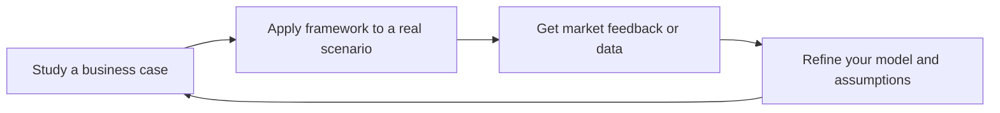

# Business Strategist

> **Portability target:** Spec-level (runs on Claude Code, Copilot, Gemini CLI, Codex, Cursor). No vendor-specific frontmatter fields.

Design and validate business models, craft go-to-market strategies, build financial models, and plan sustainable growth. Think like a COO/CFO/Head of Strategy combined.

## Route the Request
<!-- QUICK: 30s -- auto-route first, then intent-route -->

### Auto-Route (No User Input Required)
Evaluate these file-system conditions in order. First match wins — jump immediately.

| # | Condition | Action |
|---|-----------|--------|
| A1 | `file_contains("*", "business.model\|revenue.model\|unit.economic\|pricing.strategy\|GTM\|go.to.market")` AND `file_contains("*", "TAM\|SAM\|SOM\|market.size\|LTV\|CAC")` | This is your skill. Jump to **Core Workflow** — Phase 1. |
| A2 | `file_contains("*", "fundraising\|Series.[A-C]\|pitch.deck\|cap.table\|investor\|venture.capital")` AND `file_contains("*", "runway\|burn.rate\|valuation")` | Jump to **Decision Trees** — Fundraising Readiness. |
| A3 | `file_contains("*", "competitive.landscape\|competitor.analysis\|Porter\|five.forces\|SWOT")` AND `file_exists("*.{csv,xlsx}")` | Jump to **Core Workflow** — Phase 1: Market Analysis + Competitive Landscape. |
| A4 | `file_contains("*", "financial.model\|P&L\|revenue.forecast\|cash.flow\|burn")` AND `file_exists("*.{xlsx,csv}")` | Jump to **Core Workflow** — Phase 3: Financial Projections. |
| A5 | `file_contains("*", "vision\|mission\|company.purpose\|founding.story")` AND `file_contains("*", "fundraise\|board\|equity\|cap.table")` | Invoke **ceo-strategist** instead. This is company-defining, not business model design. |
| A6 | `file_contains("*", "product.market.fit\|PMF\|retention\|churn\|user.feedback\|Sean.Ellis")` | Invoke **product-strategist** instead. This is product strategy territory. |
| A7 | `file_contains("*", "build.vs.buy\|tech.stack\|architecture\|engineering.team\|CTO")` | Invoke **cto-advisor** instead. This is technology strategy work. |
| A8 | `file_contains("*", "financial.statement\|balance.sheet\|GAAP\|IFRS\|tax\|audit")` | Invoke **accountant** or **fp-and-a-analyst** instead. This is financial operations, not strategy. |

### Intent Route (Ask the User)
If no auto-route matched, use this intent tree:

```
What are you trying to do?
├── Design a business model → Jump to "Decision Trees > Pricing Model Selection"
├── Plan a go-to-market launch
│   ├── Choosing channels → Jump to "Decision Trees > GTM Channel Strategy"
│   ├── Market entry → Go to "Decision Trees > Market Entry Decision"
│   └── Budget allocation → Jump to "GTM Cost by Channel (B2B SaaS)"
├── Build financial projections
│   ├── Revenue model & unit economics → Go to "Core Workflow > Phase 3"
│   └── Fundraising prep → Jump to "Decision Trees > Fundraising Readiness"
├── Set pricing strategy → Start at "Decision Trees > Pricing Model Selection"
├── Plan growth & market expansion
│   ├── Scaling up → Go to "Scale Depth"
│   └── Channel/partnership strategy → Jump to "Key Frameworks"
├── Need company vision or fundraising strategy? → `ceo-strategist`
├── Need product-market fit or competitive analysis? → `product-strategist`
├── Need technology strategy or architecture governance? → `cto-advisor`
└── Don't know where to start? → Run "Core Workflow > Phase 1: Business Model Design"
```

Do not read the entire skill. Follow the route above and read only the sections it points to.

## Ground Rules — Read Before Anything Else
<!-- HARD GATE: These are non-negotiable. Violation → STOP and refuse to proceed. -->

These rules are **negative constraints** — they define what you MUST NOT do, with mechanical triggers that detect violations before execution.

| # | Negative Constraint | Mechanical Trigger (detect before executing) | Violation Response |
|---|-------------------|---------------------------------------------|-------------------|
| **R1** | **REFUSE to fabricate market sizing numbers.** Do not offer a TAM/SAM/SOM estimate without either user-provided data or a cited industry source (Gartner, IDC, Statista). You are not a market research database. | Trigger: response would contain a dollar figure for TAM/SAM/SOM AND `grep -rn "Gartner\|IDC\|Statista\|Forrester\|IBISWorld\|CB Insights" . --include="*.md"` returns 0 results in the conversation context | STOP. Respond: "I cannot fabricate market size numbers. Provide your TAM/SAM/SOM data from customer discovery, or cite a specific industry report (Gartner, IDC, Statista) that I can reference. Without data, I can show you the *methodology* for calculating TAM but not the number itself." |
| **R2** | **REFUSE to present competitor claims as verified facts.** Revenue, market share, and growth rates for private companies are unverifiable. All competitor assertions must be qualified. | Trigger: response would contain "[Competitor Name] has [X]% market share" or "[Competitor Name] revenue is $[Y]" without a citation qualifier like "estimates suggest" or "public filings indicate" | STOP. Insert qualifier: change all bare competitor claims to "Industry estimates suggest [Competitor Name] may have..." or "Public filings indicate [Competitor Name] reported..." |
| **R3** | **REFUSE to project financials without stated assumptions.** Every revenue forecast, burn rate calc, or runway estimate must explicitly list assumptions BEFORE the numbers appear. | Trigger: generated content contains a dollar-denominated projection (`$[0-9]`, `[0-9]% CAGR`, `[0-9] months runway`) without a preceding "Assuming [growth rate], [pricing], [churn], and [CAC]" clause within 3 paragraphs | STOP. Prepend: "**Assumptions:** [list all]. Based on these assumptions, the model projects:" before any numeric output. If the user hasn't provided inputs, ASK for them first. |
| **R4** | **REFUSE to recommend a business model without a validation mechanism.** Every business model recommendation must include a concrete, falsifiable test. | Trigger: response recommends a business model (freemium, usage-based, marketplace, etc.) without specifying "Test this by [specific method] within [timeframe]" | STOP. Append: "Validate this model: [specific test method, e.g., 'offer 10 target customers the proposed pricing and measure willingness-to-pay'], within [specific timeframe, e.g., '2 weeks']. If [falsification condition], pivot to [alternative]." |
| **R5** | **STOP and ASK if key context for financial projections is missing.** Do not assume: average contract value, churn rate, CAC, conversion rates, or sales cycle length. | Trigger: generating financial projections that reference ACV, churn, CAC, conversion, or sales cycle without those values being supplied by the user in the current conversation | STOP. Ask targeted questions: "What's your average contract value? What's your monthly churn rate? What's your customer acquisition cost? What's your sales cycle length?" Do not proceed with placeholder numbers. |
| **R6** | **DETECT and WARN about revenue concentration risk.** If user describes a customer portfolio where any single customer exceeds 20% of revenue and the strategy doesn't address diversification. | Trigger: user-provided data shows `Max(customer_revenue) / Total(revenue) > 0.20` AND no mention of "diversification" or "concentration risk mitigation" in the current response draft | WARN: Add: "⚠️ Revenue concentration risk: customer [X] represents [Y]% of revenue. Investors typically discount concentrated revenue by 30-50%. Document: renewal date, relationship owner, churn risk assessment, and diversification timeline. Target: no single customer >15% of revenue within 12 months." |
| **R7** | **DETECT and WARN about single-channel GTM risk.** If the GTM strategy relies on exactly one channel with no diversification plan. | Trigger: GTM strategy mentions exactly 1 channel (e.g., "paid search only" or "content marketing only") AND no mention of channel testing or diversification timeline | WARN: Add: "⚠️ Single-channel risk: your entire GTM relies on [channel]. Channel economics can shift overnight (ad price changes, platform algorithm updates). Recommendation: allocate 20% of GTM budget to testing a second channel within 90 days. The winning channel today becomes the losing channel tomorrow without your permission." |

## The Expert's Mindset

Business strategy is not about filling out canvases — it's about **finding the intersection of what customers want, what you can deliver uniquely, and what generates sustainable profit**. The canvas is a tool for thinking; the thinking is what matters.

### Mental Models

| Model | Description |
|---|---|
| **Business model = how you create, deliver, and capture value** | Create value (product), deliver value (distribution), capture value (pricing). If any of the three is broken, the business fails. Most founders over-invest in creation and under-invest in distribution. |
| **Unit economics are the atomic unit of strategy** | If you lose money on every transaction, volume doesn't fix it. LTV > 3× CAC is table stakes, not an aspiration. Know your numbers to the decimal point. |
| **Every business model has a fatal assumption** | The one thing that, if wrong, kills the company. Identify it, name it explicitly, and test it first. Everything else is a distraction. |
| **Markets, not products, determine outcomes** | A great product in a shrinking market fails. A mediocre product in a growing market has a chance. Size the market before designing the product. |

### Cognitive Biases in Business Strategy

| Bias | How It Shows Up | Defense |
|---|---|---|
| **Optimism bias** | Revenue projections that go "up and to the right" with no failure scenario | Always model 3 cases: base, upside, downside. The downside case should feel uncomfortable. |
| **Survivorship bias** | Studying unicorns and ignoring the graveyard of similar companies that failed | For every successful company you reference, find 2 that failed with a similar model. Understand why. |
| **False consensus** | Assuming customers think like you do | Test willingness-to-pay with real customers. Your opinion doesn't count — you're not the customer. |
| **Sunk cost in strategy** | Sticking with a failing GTM because you've already invested in it | Set explicit kill criteria before launching any strategy. When triggered, pivot without guilt. |

### What Masters Know That Others Don't

- **The best strategies fit in a paragraph, not a deck.** If you need 40 slides to explain your business, you don't understand it yet. Amazon's strategy: "Low prices, vast selection, fast delivery." Done.
- **Distribution strategy is underrated relative to product strategy.** "Build it and they will come" is not a strategy — it's a prayer. The best business strategists spend as much time on GTM as on product.
- **Pricing is the most powerful, least-used lever.** A 1% price increase can drive 10%+ profit improvement in most businesses. Most companies set prices once and never revisit them strategically.
- **The fatal assumption is usually about customer behavior, not technology.** Most business failures are market failures, not product failures. "We thought they'd pay for it" is the most expensive sentence in business.

## Operating at Different Levels

Business strategy scales from a single product line to corporate strategy. The time horizon and scope of decisions defines the level.

| Level | Business Strategy Output Characteristics |
|---|---|
| **L1 — Apprentice** | Analyzes a single business model. Learns strategy frameworks (Porter, Christensen, Blue Ocean). |
| **L2 — Practitioner** | Owns GTM strategy for a product. Builds business cases, pricing models, and financial forecasts independently. |
| **L3 — Senior** | Owns business strategy for a business unit. Market entry/expansion analysis. "These are the three markets we enter next." |
| **L4 — VP Strategy** | Defines corporate strategy across business units. M&A strategy, portfolio management. "This is the 5-year company strategy." |
| **L5 — Chief Strategy Officer** | Shapes industry-level strategy. Creates frameworks for strategic decision-making adopted across companies. |

**Usage**: Say "as an L3 business strategist, evaluate the market entry for..." Default: **L2** (product-level business strategy).

## When to Use
<!-- QUICK: 30s -- scan the bullet list to decide if this skill fits -->
- Business model canvas design and validation
- Go-to-market strategy and launch planning
- Financial modeling: revenue forecasting, unit economics, runway
- Pricing strategy: tiered, usage-based, freemium, enterprise
- Market expansion and internationalization planning
- Partnership and channel strategy
- Cost optimization and operational efficiency
- Fundraising preparation and investor materials

## Decision Trees
<!-- QUICK: 30s -- follow the ASCII tree to your scenario -->
### Pricing Model Selection
```
                     ┌──────────────────────────┐
                     │ START: New pricing model? │
                     └────────────┬─────────────┘
                                  │
               ┌──────────────────▼──────────────────┐
               │ Is your product self-serve or       │
               │ sales-assisted?                     │
               └────┬─────────────────────┬──────────┘
                    │ Self-serve         │ Sales-assisted
          ┌─────────▼─────────┐  ┌───────▼──────────┐
          │ Does value scale   │  │ ACV > $10K?      │
          │ with usage?        │  └──┬──────────┬────┘
          └──┬──────────┬──────┘     │ YES       │ NO
             │ YES      │ NO         ▼           ▼
             ▼          ▼        ┌────────┐ ┌──────────┐
        ┌─────────┐ ┌────────┐  │Per-seat │ │Tiered     │
        │Usage-   │ │Tiered/ │  │+        │ │flat with  │
        │based    │ │Freemium│  │platform │ │add-ons    │
        └─────────┘ └────────┘  │fee      │ └──────────┘
                                └────────┘
```
**When to choose Usage-based:** Product value directly correlates with API calls, data processed, or compute consumed. CAC payback < 12 months at median usage.  
**When to choose Tiered/Flat:** Predictable value delivery per customer. Buyers need budget predictability. Implementation cost is similar regardless of usage volume.

### GTM Channel Strategy
```
                     ┌────────────────────────┐
                     │ START: Which GTM motion?│
                     └───────────┬────────────┘
                                 │
              ┌──────────────────▼──────────────────┐
              │ What is your ACV?                   │
              └────┬──────────┬──────────┬──────────┘
                   │ <$500    │ $500-10K │ >$10K
                   ▼          ▼          ▼
            ┌──────────┐ ┌──────────┐ ┌──────────────┐
            │ PLG +    │ │ Sales-   │ │ Enterprise    │
            │ Content  │ │ Assisted │ │ Sales +       │
            │ Marketing│ │ + Content│ │ Outbound SDR  │
            └──────────┘ └──────────┘ └──────────────┘
```
**When to choose PLG/Content:** Self-serve onboarding exists. Product demonstrates value in < 15 minutes. CAC target < $200.  
**When to choose Enterprise Sales:** Requires procurement, security review, or executive approval. Implementation takes > 2 weeks. ACV justifies > $1K CAC.

### Market Entry Decision
```
                     ┌──────────────────────────┐
                     │ START: Enter new market?  │
                     └───────────┬──────────────┘
                                 │
              ┌──────────────────▼──────────────────┐
              │ Is existing market saturated        │
              │ (growth < 15% YoY)?                 │
              └────┬────────────────────┬───────────┘
                   │ YES                │ NO
                   ▼                    ▼
        ┌──────────────────┐  ┌────────────────────┐
        │ Adjacent market  │  │ Deepen penetration │
        │ expansion        │  │ in current market   │
        └──────────────────┘  └────────────────────┘
```
**When to expand:** Current market share > 30% OR TAM in adjacent market > 2x current. Can repurpose > 60% of existing tech/sales motion.  
**When to deepen:** Current market share < 15%. CAC is trending down. Unit economics improving with scale.

### Fundraising Readiness
```
                     ┌──────────────────────────┐
                     │ START: Time to fundraise? │
                     └───────────┬──────────────┘
                                 │
              ┌──────────────────▼──────────────────┐
              │ Revenue growing > 15% MoM           │
              │ for 3+ consecutive months?          │
              └────┬────────────────────┬───────────┘
                   │ YES                │ NO
                   ▼                    ▼
        ┌──────────────────┐  ┌──────────────────────┐
        │ Fundraise now.   │  │ Extend runway. Fix   │
        │ LTV/CAC > 3x?    │  │ growth engine first. │
        │ Gross margin>70%?│  │ Revisit in 6 months. │
        └──────────────────┘  └──────────────────────┘
```
**When to fundraise:** > 6 months runway remaining. Clear use of funds tied to milestones. Strong founder-market fit narrative.  
**When to wait:** < 4 months runway (emergency mode — bridge round). Growth is flat. Missing key hires needed to deploy capital effectively.


### Cross-skills Integration

This skill in a typical workflow chain:

| Step | Skill | What it produces for this skill |
|------|-------|---------------------------------|
| **Before** | idea-to-spec | Validated problem statement, target market hypothesis, initial TAM estimate |
| **This** | business-strategist | Business model canvas, GTM plan, pricing strategy, financial model, unit economics |
| **After** | product-manager | Consumes GTM strategy and pricing model to build feature requirements and launch plan |

Common chains:
- **New venture**: idea-to-spec → business-strategist → product-manager — Problem validation → business model → execution plan
- **Fundraising prep**: business-strategist → ceo-strategist — Financial model + GTM → investor narrative + pitch deck
- **Growth planning**: business-strategist → growth-engineer — Unit economics + channel strategy → growth experiments + A/B tests
- **Pricing overhaul**: product-strategist → business-strategist → financial-modeling — Pricing hypothesis → pricing strategy + tiering → revenue projections

## Sub-Skills
<!-- QUICK: 30s -- table of deeper dives by topic -->
When this skill is invoked, drill into these specialized areas as needed:

| Sub-Skill | When to Use | Reference |
|-----------|-------------|-----------|
| `business-model-design` | New product, pivot, new market entry | This file — Business Model Canvas workflow |
| `unit-economics` | Fundraising, pricing, profitability analysis | This file — Unit Economics by Business Model |
| `gtm-strategy` | Launch, expansion, new vertical | This file — GTM Cost by Channel |
| `market-sizing` | Fundraising, new market entry | This file — Market Sizing Shortcuts |
| `pricing-strategy` | Launch, enterprise tier, international | This file — Pricing Models section |
| `partnership-strategy` | Channel sales, integrations, platform plays | `references/` (create as needed) |

## Core Workflow
<!-- QUICK: 30s -- scan phase titles to understand the process -->
### Phase 1 (~15 min): Business Model Design
1. Complete Business Model Canvas: value prop, customer segments, channels, revenue streams, key resources, key activities, key partners, cost structure
2. Identify riskiest assumptions and design experiments to validate
3. Model unit economics: CAC, LTV, gross margin, payback period
4. Size the market: TAM, SAM, SOM with bottom-up validation
5. Map competitive positioning on key dimensions

### Phase 2 (~30 min): Go-to-Market Strategy
1. Define target customer profile and ideal customer profile (ICP)
2. Design customer acquisition funnel with conversion targets
3. Select distribution channels with rationale
4. Create pricing and packaging strategy
5. Build sales motion: self-serve, sales-assisted, PLG, enterprise

### Phase 3 (~20 min): Financial Planning
1. Build 3-year financial model: revenue, costs, headcount, cash
2. Model scenarios: base, optimistic, pessimistic
3. Define key metrics and milestones for each phase
4. Calculate funding requirements and dilution impact
5. Create board/investor reporting package

## Key Frameworks

**Business Model Canvas** — 9 building blocks for business model design.

**Pirate Metrics (AARRR)** — Acquisition, Activation, Retention, Revenue, Referral.

**Three Horizons** — Horizon 1 (core), Horizon 2 (emerging), Horizon 3 (future).

**Blue Ocean Strategy Canvas** — Visualize competitive factors and differentiation.

**Pricing Models**: Cost-plus, value-based, competitive, freemium, usage-based, tiered.

## Unit Economics by Business Model

| Business Model | CAC Range | LTV Expectation | LTV/CAC Target | Gross Margin |
|---------------|-----------|----------------|----------------|-------------|
| **B2B SaaS (SMB)** | $200-500 | $2K-10K | >3x | 70-85% |
| **B2B SaaS (Enterprise)** | $5K-50K | $50K-500K | >4x | 70-85% |
| **B2C Subscription** | $5-50 | $100-500 | >3x | 60-80% |
| **Marketplace** | $10-100 (per side) | $500-5K | >4x | 40-60% |
| **E-commerce** | $20-80 | $200-1K | >3x | 30-50% |
| **PLG / Freemium** | $1-10 (free user) | $200-2K (converted) | >5x | 80-90% |

**Red flags:** LTV/CAC < 1.5 = dying. CAC payback > 18 months = cash flow problem.

## GTM Cost by Channel (B2B SaaS)

| Channel | CAC | Time to First Customer | Best For |
|---------|-----|----------------------|----------|
| **Content/SEO** | $50-200 | 6-12 months | Long-term, PLG, SMB |
| **Paid search (Google/LinkedIn)** | $300-1K | 1-4 weeks | Immediate pipeline |
| **Outbound sales (SDR)** | $500-2K | 2-8 weeks | Enterprise, ACV > $10K |
| **Partnerships** | $100-500 | 3-9 months | Ecosystem plays |
| **Community** | $20-100 | 6-18 months | Developer tools, niche |
| **Events/Conferences** | $1K-5K | 1-4 weeks | Enterprise, brand building |

**Channel mix by stage:** MVP = founder-led sales + content. Growth = paid + outbound + partnerships. Scale = all channels with attribution.

## Market Sizing Shortcuts

```
TAM (Total Addressable Market) = Number of potential customers × Annual contract value
SAM (Serviceable Addressable Market) = TAM × geographic/segment filter (usually 10-30%)
SOM (Serviceable Obtainable Market) = SAM × realistic market share Year 3 (usually 1-5%)

Quick TAM checks:
- B2B SaaS: # companies in target segment × average software spend/category
- Consumer: # users × ARPU benchmark for category
- Marketplace: GMV of comparable incumbents × 10% disruption target

Red flag: If your SOM < $20M, VC path is dead. Bootstrap or lifestyle.
Healthy: SOM > $100M with clear path to $1B TAM.
```


**What good looks like:** Business model canvas with 10+ customer interviews validating each assumption — you know which bets are confirmed and which are still risky. Unit economics show LTV/CAC > 3 at scale with a clear path to get there. Beachhead segment identified where you can own 30%+ of a $20M+ TAM within 18 months. The strategy document is 3 pages, not 30.
## Financial Modeling Best Practices

- Bottom-up > top-down: build from unit assumptions, not market percentages
- Always model 3 scenarios: base, optimistic, pessimistic
- Separate fixed vs. variable costs
- Include headcount plan with fully-loaded cost
- Model cash runway, not just P&L
- Document all assumptions explicitly

## Cross-Skill Coordination
<!-- QUICK: 30s -- table of who to talk to when -->
Business strategy lives or dies on cross-functional alignment. A brilliant GTM strategy fails if product can't ship, sales can't sell, and finance can't fund.

| Upstream Skill | What You Receive | When to Involve |
|---|---|---|
| `ceo-strategist` | Strategic vision, fundraising status, board priorities, resource constraints | Before any market entry decision; quarterly strategic review |
| `product-strategist` | TAM/SAM/SOM analysis, competitive landscape, PMF signal, pricing hypotheses | During business model design; before GTM strategy finalization |
| `legal-advisor` | Regulatory constraints, IP strategy, partnership agreement risks, compliance obligations | Before international expansion; during partnership negotiation |
| `fp-and-a-analyst` | Unit economics baseline, revenue projections, cost structure analysis, scenario models | During financial modeling; before fundraising preparation |

| Downstream Skill | What You Provide | Impact of Delay |
|---|---|---|
| `ceo-strategist` | Business model canvas, GTM strategy, pricing model, unit economics, financial projections | CEO makes fundraising decisions without financial context — wrong round size or timing |
| `product-strategist` | Market segmentation, competitive intelligence, channel economics, willingness-to-pay data | Product bets are uninformed by market reality — roadmap misses target |
| `marketing-manager` | ICP definition, positioning inputs, channel strategy, demand gen economics | Marketing campaigns target wrong segments — wasted ad spend |
| `growth-engineer` | Business hypotheses, success metrics, guardrail metrics, experiment scope | A/B tests optimize vanity metrics rather than business outcomes |

### Communication Triggers — When to Proactively Notify

| Trigger | Notify | Why |
|---------|--------|-----|
| New market entry decision | `ceo-strategist`, `product-strategist`, `marketing-manager`, `legal-advisor` | Cross-functional launch planning, localization requirements, hiring plan |
| Pricing model change | `ceo-strategist`, `product-strategist`, `fp-and-a-analyst`, `legal-advisor` | Revenue impact modeling, customer communication, contract updates |
| Competitive threat (new entrant with >20% feature parity) | `ceo-strategist`, `product-strategist`, `marketing-manager` | Competitive response, positioning adjustment, product roadmap reprioritization |
| Fundraising preparation begins | `ceo-strategist`, `fp-and-a-analyst`, `legal-advisor`, `product-strategist` | Data room prep, financial modeling, due diligence readiness |
| Major partnership (>$500K ACV potential) | `ceo-strategist`, `legal-advisor`, `product-strategist` | Integration requirements, resource allocation, deal structure |
| Business model pivot | `ceo-strategist`, `product-strategist`, `fp-and-a-analyst` | Org impact, financial replanning, product strategy realignment |
| Unit economics turn negative at scale | `ceo-strategist`, `fp-and-a-analyst`, `product-strategist` | Root cause analysis, pricing review, cost structure optimization |

### Escalation Path

```
Existential business risk (losing >30% revenue, regulatory shutdown, market collapse)
  └── `ceo-strategist` + `legal-advisor` + `fp-and-a-analyst`. Emergency board meeting if public/funded.

Strategic business decision (market entry, business model change, major pricing)
  └── `business-strategist` + `ceo-strategist` + `product-strategist` + `fp-and-a-analyst`. Decision within 2 weeks. Board informed.

Tactical business decision (segment targeting, campaign optimization, channel mix)
  └── Functional lead handles. `business-strategist` consulted. No escalation needed.
```

## Proactive Triggers

| Trigger | Action | Why |
|---------|--------|-----|
| No TAM/SAM/SOM analysis done — business case relies on "the market is huge" without quantification | Propose market sizing: bottom-up TAM/SAM/SOM with documented assumptions. For fundraising: TAM is the story, SOM is the target. Investors discount top-down ("1% of $100B market") by 70-90%. Bottom-up ("X customers × Y ACV = $Z") survives due diligence | "The market is huge" is not a strategy — it's a platitude. Without TAM/SAM/SOM, you cannot prioritize segments, allocate GTM resources, or convince investors. Bottom-up sizing forces you to name real customers and real budgets |
| Business model unclear — pricing, distribution, and revenue mechanics are undefined or contradictory | Run Business Model Canvas exercise: 9 blocks (value proposition, customer segments, channels, customer relationships, revenue streams, key resources, key activities, key partners, cost structure). If any block says "TBD," the business model is a hypothesis, not a plan | An undefined business model produces undefined results. The Business Model Canvas forces coherence — if your revenue model is subscription but your customer relationship is "self-service," one of those is wrong. Surface contradictions before they surface in your bank account |
| No competitive moat identified — "better UX" or "first mover advantage" cited as the only differentiator | Flag immediately: "Better UX" is not a moat — it's a baseline expectation. Document switching costs (what happens when a customer tries to leave?), network effects (does each new user make the product more valuable?), and data advantages (what data do you have that competitors don't?). If none of these exist, you don't have a business — you have a feature | Companies without moats get competed to zero. If a well-funded competitor can replicate your product in 6 months, your only moat is execution speed — and speed is not a business strategy, it's a sprint |
| Revenue concentration >30% from one customer — existential risk not flagged | Diversify before fundraising. No single customer should represent >15% of revenue. If >30%, document the customer relationship, contract renewal date, and churn risk. Investors discount concentrated revenue by 30-50% — a $10M ARR business with 40% concentration trades at $6M valuation | Revenue concentration is the silent killer of SaaS valuations. One customer leaving = bankruptcy risk. Diversification is not a growth tactic — it's survival infrastructure. Diversify before you need to, not when you have to |
| Financial model uses top-down projections: "1% of a $10B market = $100M revenue" | Rebuild bottom-up: start with unit assumptions (conversion rates, ASP, churn, CAC). Model 3 scenarios (best/base/worst). Document every assumption explicitly. Top-down models die in the first 5 minutes of investor due diligence | Top-down models are PowerPoint math — they impress until someone asks "how?" Bottom-up models survive scrutiny because every number traces back to a customer conversation or market benchmark. Investors can argue with your TAM; they can't argue with your unit economics |
| Pricing strategy set once and never revisited — no A/B testing, no willingness-to-pay research, no competitive pricing intelligence | Establish pricing review cadence: test with 10 customers at launch, iterate quarterly. Use Van Westendorp or Gabor-Granger for willingness-to-pay. Monitor competitive pricing monthly. Pricing is a process, not a decision — the right price today is wrong in 12 months | Pricing is the highest-leverage growth lever. A 1% price improvement drops straight to the bottom line — it's equivalent to a 10% increase in sales volume for most businesses. Companies that "set and forget" pricing leave millions on the table |
| No coordination with `product-manager` for market validation — business strategy and product roadmap are disconnected | Schedule joint review: does the business model assume features the product team hasn't prioritized? Does the product roadmap build things the business model doesn't monetize? Align product strategy with revenue model quarterly | Business strategy and product strategy are two sides of the same coin. A business model that assumes enterprise sales while the product is built for self-serve PLG is a contradiction that wastes engineering capacity and marketing budget |
| Fundraising materials prepared without `fp-and-a-analyst` review — model has circular references or unrealistic assumptions | Coordinate model review: every assumption must have a source (customer interview, benchmark, industry report). Line items must reconcile. Run sensitivity analysis: which assumptions, if they move 20%, change the outcome? Raise when the model is defensible, not when it's pretty | Investor due diligence finds every weak assumption. A model that breaks under 20% sensitivity analysis will break in the first partner meeting. Defensibility is not about being right — it's about knowing exactly where you might be wrong and having a plan for both cases |

## Sub-Skills
<!-- QUICK: 30s -- table of deeper dives by topic -->
When this skill is invoked, the agent may need to drill into these specialized areas:

| Sub-Skill | When to Use |
|-----------|-------------|
| `business-model-design` | Designing or pivoting business models: SaaS, marketplace, subscription, transactional, freemium |
| `unit-economics` | Fundraising readiness, pricing analysis, and profitability modeling with CAC, LTV, and payback period |
| `gtm-strategy` | Launch, expansion, or new vertical entry: PLG vs sales-led vs channel vs community-led |
| `market-sizing` | Fundraising or new market entry: TAM/SAM/SOM methodology, bottom-up vs top-down analysis |
| `pricing-strategy` | Launch pricing, enterprise tiers, or international expansion: usage-based, per-seat, hybrid, freemium |
| `partnership-strategy` | Channel sales, integrations, platform plays: technical vs go-to-market vs strategic partnerships |

## Scale Depth: Solo → Small → Medium → Enterprise

### Solo (1 person, 0-100 users)
- **What changes**: Business model = Lean Canvas on a napkin. GTM = you doing sales, marketing, and support. Pricing = guess based on competitors. Market sizing = "big enough to matter." Financial model = revenue minus costs in a spreadsheet.
- **What to skip**: Formal TAM/SAM/SOM analysis. Multi-channel GTM strategy. Pricing consultants. Detailed financial models. Competitive intelligence tools.
- **Coordination**: Talk to 10 customers. That's your entire strategy process.

### Small Team (2-10 people, 100-10K users)
- **What changes**: Business model canvas formalized. TAM/SAM/SOM estimated (bottom-up). Single GTM channel (usually PLG or founder-led sales). Simple pricing tiers (2-3). Unit economics tracked (LTV/CAC). 12-month financial model.
- **What to skip**: Multi-channel GTM (pick one and nail it). Pricing optimization (just test with customers). Formal competitive intelligence. 5-year financial projections.
- **Coordination**: Monthly strategy review with CEO. Weekly metrics review. Quarterly pricing review.

### Medium Team (10-50 people, 10K-1M users)
- **What changes**: Business model stress-tested with data. Full TAM/SAM/SOM with bottom-up validation. 2-3 GTM channels with attribution. Pricing optimization with A/B testing. Regular competitive analysis. 3-year financial model with scenarios. Customer segmentation and ICP refinement.
- **What to skip**: TAM analysis for adjacent markets. International pricing. Channel partnerships program (unless proven). Dedicated strategy team.
- **Coordination**: Quarterly strategy offsite. Monthly GTM review. Bi-weekly pricing committee. Customer advisory board annually.

### Enterprise (50+ people, 1M+ users)
- **What changes**: Multi-product business model. Full market intelligence function. Omnichannel GTM with attribution. Dynamic pricing (usage-based, geography, segment). M&A strategy integration. Scenario planning with Monte Carlo. Investor-grade financial models. Dedicated strategy & ops team.
- **What's full production**: Annual strategic planning cycle. Quarterly board strategy review. Continuous competitive intelligence. Pricing science team. Market expansion playbooks. Strategic finance function.
- **Coordination**: Annual strategy cycle (Q3 planning, Q4 budget, Q1 kickoff). Quarterly board deck. Monthly business review (MBR). Weekly GTM standup.

### Transition Triggers
- **Solo → Small**: You have revenue and need specialists (marketing, sales). >$50K ARR.
- **Small → Medium**: Single-channel GTM saturates. Need second channel. Revenue >$2M ARR.
- **Medium → Enterprise**: Multi-product or multi-geography expansion. IPO preparation. Revenue >$20M ARR.

## Best Practices
<!-- STANDARD: 3min -- rules extracted from production experience -->
1. **Model bottom-up, not top-down:** Build financial projections from unit assumptions (conversion rates, ASP, churn) — not by taking 1% of a billion-dollar market. Top-down models die in due diligence.
2. **TAM is a story, SOM is your target:** Investors care about TAM for narrative. Your GTM plan lives and dies on SOM — a realistic, bottom-up calculation of what you can capture in Year 1–3.
3. **LTV/CAC > 3 is table stakes, payback < 12 months is gold:** A business with 5x LTV/CAC but 24-month payback runs out of cash. Optimize for payback period, not just ratio.
4. **Pricing is a process, not a decision:** Launch with a hypothesis, test with 10 customers, iterate quarterly. The right price today is wrong in 12 months. Build pricing review into your operating cadence.
5. **One GTM channel at a time:** Founders try content + paid + outbound + partnerships simultaneously. Pick the channel with highest LTV/CAC at your stage. Saturate it before adding a second.
6. **Competitive moat = switching cost + network effects + data advantages:** "Better UX" is not a moat. Document why customers can't leave, why each new user makes the product more valuable, and what data you have that competitors don't.
7. **Revenue concentration > 30% from one customer = existential risk:** Diversify before fundraising. No single customer should represent more than 15% of revenue. Investors discount concentrated revenue by 30–50%.
8. **Fundraise when you have momentum, not when you need money:** The best time to raise is when you have 3+ months of 15%+ MoM growth, not when you have 3 months of runway. Desperation is visible and expensive.
9. **Document assumptions, review them monthly:** Every model has assumptions. Write them down explicitly. Review monthly — which assumptions held, which didn't, and what changed. This is how you build forecasting accuracy.
10. **Strategy without execution tracking is fiction:** Every strategic initiative needs an owner, a deadline, and a dashboard metric. Review weekly. A beautiful strategy document that nobody executes is worse than no strategy at all.

## Anti-Patterns
<!-- DEEP: 5min -- each anti-pattern includes machine-detectable patterns -->

| ❌ Anti-Pattern | ✅ Do This Instead | 🔍 Detect (grep / lint) | 🛡️ Auto-Prevent |
|-----------------|---------------------|--------------------------|-------------------|
| Building financial projections by taking "1% of a $100B market" — top-down models that die in the first 5 minutes of investor due diligence | Build bottom-up: start with unit assumptions (conversion rates, ASP, churn, CAC). Model 3 scenarios (best/base/worst). Document every assumption with a source — customer interview, benchmark, or industry report. Bottom-up models survive scrutiny because every number has a name attached | `grep -rn "1% of\|% of a .* market\|top.down\|TAM.*x%" --include="*.md" --include="*.txt"` → finds top-down percentage-of-market sizing | Document template: `templates/bottom-up-model.md` — requires unit assumptions section before any revenue projections |
| Citing "better UX" as the competitive moat — investors ask "what happens when a well-funded competitor copies your UX in 6 months?" | Document switching costs (migration pain, data lock-in, integration depth), network effects (marketplace liquidity, collaboration features), and data advantages (proprietary datasets, ML models trained on unique data). A moat is structural, not aspirational — it's the reason customers can't leave even if they want to | `grep -rn "better UX\|superior UX\|better design\|easier.to.use" --include="*.md"` → finds UX claimed as competitive advantage without structural moat evidence | Checklist item: "Moat is structural (switching cost, network effect, or data advantage) — not UX-based" in `templates/strategy-review.md` |
| Setting pricing once and leaving it for years — "we charge $49/month because that's what we launched with" | Treat pricing as a process: launch with a hypothesis, test with 10+ customers, iterate quarterly. Use Van Westendorp or Gabor-Granger methods for willingness-to-pay. Monitor competitive pricing monthly. The right price today is wrong in 12 months — build pricing review into your operating cadence | `grep -rn "we charge.*because\|pricing.*set at\|price.*since" --include="*.md" --include="*.txt"` → finds pricing justified by history rather than data | Pre-commit hook: `scripts/check-pricing-review.sh` — flags if `pricing.md` hasn't been updated in 90 days |
| Fundraising when you have 3 months of runway — desperation is visible and expensive | Raise when you have momentum: 3+ months of 15%+ MoM growth and 18+ months of runway. Desperation gives investors negotiating leverage. The best time to raise is when you don't need the money — the second best time is 6 months before you run out | `grep -rn "runway.*[0-5] months\|[0-5].month.runway" --include="*.md"` → finds runway < 6 months without fundraising urgency | Dashboard alert: `scripts/runway-monitor.sh` — triggers warning email if `(cash / monthly_burn) < 6` |
| Treating TAM as "the truth" instead of a narrative device — spending weeks perfecting a TAM number that changes with every market report | TAM tells the story of market opportunity; SOM is where your GTM lives. Spend 80% of your sizing effort on SOM — a realistic, bottom-up calculation of what you can capture in Year 1-3. Investors care about TAM for narrative; they invest based on SOM execution | `grep -rn "TAM" --include="*.md" \| grep -c "TAM"` → if TAM count > SOM count by 2x, analysis is tilted toward narrative over execution | Template: `templates/market-sizing.md` — requires SOM section with unit assumptions before TAM narrative section |
| Launching GTM on 4 channels simultaneously — content + paid + outbound + partnerships — with no channel that's working well | Pick one channel with the highest LTV/CAC at your stage. Saturate it before adding a second. Multi-channel GTM before single-channel success multiplies mediocrity, not revenue. Founders who try 4 channels simultaneously succeed at none of them | `grep -rn "channel\|paid\|organic\|outbound\|content.*marketing\|partnership" --include="*.md"` → count unique channel mentions; if >2 channels AND no LTV/CAC data per channel, strategy is unfocused | Template: `templates/gtm-plan.md` — requires "Primary Channel" section with LTV/CAC math before "Secondary Channels" section |
| Revenue concentration >30% from one customer — "they love us, they'd never leave" | Diversify before fundraising. No single customer >15% of revenue. If concentration is high, document the customer relationship, contract renewal date, and churn risk. Investors discount concentrated revenue by 30-50% — a $10M business with 40% concentration trades at $6M | `grep -rn "largest customer\|top customer.*%\|concentration\|single customer" --include="*.md"` → if percentage > 20% found without diversification plan | Template: `templates/revenue-concentration.md` — requires concentration dashboard with renewal dates, risk scores, and diversification timeline |
| No coordination with `cto-advisor` — business strategy assumes technology capabilities that don't exist or aren't on the roadmap | Align business model with technology strategy: can the architecture support the pricing model? Can the platform scale to the SOM? Schedule quarterly business-technology alignment reviews. A business strategy that assumes "AI-powered" when the team has no ML engineers is not a strategy — it's science fiction | `grep -rn "AI.powered\|ML.driven\|automated\|algorithmic" --include="*.md"` → if technology claims found AND no `cto-advisor` or `engineering-manager` cross-reference within 3 paragraphs, tech assumptions are unvalidated | Pre-commit template: `templates/tech-alignment-checklist.md` — requires sign-off from CTO/engineering on business model assumptions |

## Sub-Skills
**Symptom:** A Series A startup spent $2.4M building a marketplace in a market they believed was "wide open." Six months before launch, a well-funded competitor entered. By launch day, the competitor had 3x the supply-side inventory.
**Root cause:** Market timing analysis assumed zero competitive response during the build phase. The "head start" was actually building in public while competitors watched.
**Fix:** Adopted a "stealth launch" playbook: build MVP in 8 weeks with a scrappy team, launch to a waitlist of 500 pre-vetted users, iterate based on real supply/demand data. Abandoned the 18-month roadmap approach.
**Lesson:** Market timing is not about being first — it's about being right when the market is ready. Use Wardley Maps to visualize where the market is in its evolution. If you can't launch a prototype within 90 days, your timing analysis is probably wrong.

### War Story 2 — The Competitor We Laughed Our Way Past
**Symptom:** A B2B SaaS company with $12M ARR watched a 5-person startup build a "toy version" of their product. In 18 months, that startup grew to $8M ARR — entirely from customers who had churned from the incumbent.
**Root cause:** The leadership team dismissed the competitor as "not in our segment" because it lacked enterprise features. They didn't realize the competitor was winning on the one dimension their own customers cared about most: time-to-value (2 hours vs 6 weeks).
**Fix:** Created a self-serve onboarding track that compressed time-to-value to under 4 hours for SMB customers. Kept the enterprise sales motion for high-ACV deals. Two-tier GTM preserved revenue while defending the flank.
**Lesson:** Competition from below is invisible until it's existential. Run competitive churn analysis quarterly, not annually. If a competitor is winning on a dimension your customers value, that dimension IS your segment.

### War Story 3 — The $8M Product Nobody Paid For
**Symptom:** A funded startup built an AI-powered analytics platform over 18 months. At launch, they had 3 free users and zero paid customers. The "10 companies in the pipeline" turned out to be 10 companies that said "interesting, but not this quarter."
**Root cause:** The founding team mistook feature requests from friendly advisors for validated demand. No one had signed a letter of intent, paid a deposit, or committed a budget line item before the build.
**Fix:** Implemented a "5 paid pilots before code" policy: any new product initiative required 5 signed pilot agreements with real budgets before the first line of code. This killed 4 of 5 proposed features — and made the survivor wildly successful.
**Lesson:** "I'd buy that" is not a signal. "Here's my credit card" is. Run willingness-to-pay tests before building. A $10K validation sprint is cheaper than a $2M product that nobody uses.


## Error Decoder
<!-- DEEP: 5min -- each entry includes a console-string matcher for automatic recovery loops -->

| 🖥️ Console Match (grep pattern) | Symptom | Root Cause | Fix | 🔄 Auto-Recovery Loop |
|---|---|---|---|---|
| `Error: TAM.*too small\|market.size.*insufficient\|Total Addressable Market.*<` + `grep -rn "TAM\|SAM\|SOM" *.md` shows top-down percentage-of-market math | Investor call ended 5 minutes in — "your TAM isn't real." $2M ARR, but the numbers were fabricated from a Gartner report with no bottom-up validation | Top-down TAM ("$100B market, 1% = $1B") was presented as fact without bottom-up validation. Investors tear this apart in seconds — they invest based on SOM execution, not TAM narrative | Rebuild market sizing bottom-up: (1) count target customers in segment, (2) multiply by realistic ASP, (3) show SOM with Year 1-3 capture rate, (4) cite data sources for each assumption. Bottom-up SOM with 20% penetration of a $50M niche beats top-down TAM of a $100B market every time | 1. Find all TAM references: `grep -rn "TAM\|SAM\|SOM" *.md` 2. For each TAM figure, verify it has a bottom-up calculation path 3. Run: `grep -c "TAM\|% of" proposal.md` → if TAM mentions > SOM mentions × 3, the narrative is inverted 4. Rebuild: start with SOM unit count, NOT market percentage |
| `Error: LTV/CAC.*ratio.*< 1\|unit.economic.*negative\|CAC.*exceeds.*LTV` + `grep -rn "LTV\|CAC\|unit.economic" *.md` shows math that doesn't add up | Board rejected growth plan — "your unit economics don't work." Spending $800 to acquire a customer paying $49/month with 3-month average lifetime. Negative gross margin on every customer | LTV/CAC ratio was calculated using flawed assumptions: (1) LTV used revenue, not gross profit, (2) churn was understated, (3) CAC excluded sales team salaries. Unit economics that look good on a pitch deck die on a spreadsheet | Recalculate: LTV = (ARPU × gross margin %) / monthly churn rate. CAC = (total sales + marketing spend) / new customers acquired. Target LTV/CAC > 3:1 with gross margin LTV, not revenue LTV. If LTV/CAC < 1, the business model is broken — fix the model before fixing the spreadsheet | 1. Audit unit economics formula: `grep -rn "LTV\|CAC" *.md -A 2` 2. Verify LTV uses gross profit, not revenue: `grep "LTV.*ARPU.*churn\|LTV.*revenue" *.md` 3. Verify CAC includes ALL sales+marketing spend: `grep "CAC.*=.*spend\|CAC.*=.*cost" *.md` 4. Run: `echo "scale=1; ($ARPU * $GM / $churn) / $CAC" \| bc` → must be > 3.0 |
| `Error: pricing.*below.cost\|freemium.*conversion.*< 1%\|monetization.*gap` + `grep -rn "freemium\|free tier\|free plan" *.md` shows no conversion math | 50K free users, $4K MRR — "freemium is working, we just need more users." Actually: freemium is losing $30K/month in infrastructure costs serving 99.8% non-paying users | Freemium model deployed without conversion funnel math: (1) free-to-paid conversion rate assumed at 5% (industry max is 2-4%), (2) infrastructure cost of free users wasn't factored into unit economics, (3) free tier cannibalized paid signups because it was "good enough" | Calculate the cost of free: free_user_infra_cost × MAU_free. Subtract from paid revenue. If free tier costs > 20% of total paid revenue, tighten free tier limits. Implement usage-based free tier with hard caps that genuinely constrain. Target: free-to-paid conversion > 2% at 90 days | 1. Calculate freemium cost: `grep -rn "free.user\|free tier\|MAU" *.md -A 3` 2. Formula: `free_users × avg_infra_cost_per_user` → must be < 20% of paid revenue 3. If not: implement usage caps, add conversion triggers at limit thresholds 4. Test: set caps at 80% of median free user usage; measure conversion lift within 30 days |
| `Error: churn.*> 10%\|retention.*< 70%\|logo.churn.*monthly` + `grep -rn "churn\|retention\|renewal" *.md` shows no cohort analysis | Series A pitch rejected — "your churn is a silent killer." 8% monthly logo churn. At that rate, the entire customer base turns over every 12 months. You need 12 new logos/month just to stay flat | Churn was reported as simple average (lost customers / total customers last month) rather than cohort-based. Simple-average churn masks accelerating churn in newer cohorts — the business looks stable while the foundation rots | Switch to cohort-based churn analysis: track month-1/3/6/12 retention by cohort month. If Month-3 retention is declining across recent cohorts, fix onboarding — not sales. Target: monthly logo churn < 3% for SMB, < 1% for enterprise. Net revenue retention > 100% (expansion offsets churn) | 1. Build cohort table: `scripts/cohort-churn.sh` — outputs retention by cohort month 2. Verify: if Month-3 retention < 70% for any cohort, flag onboarding for review 3. Run trend: `grep "Month-3 retention" cohort-report.md \| tail -n 12` → must be flat or improving 4. Auto-alert: if any cohort's Month-3 retention drops > 5% from previous cohort, flag immediately |
| `Error: valuation.*unrealistic\|multiple.*too.high\|revenue.multiple.*>` + `grep -rn "valuation\|multiple\|Series.*pre-money" *.md` shows comps cherry-picked from outlier deals | Founder insists on $40M pre-money at $1M ARR "because [Hot Startup] raised at 50×." The comps are: (1) cherry-picked outliers, (2) from a different market cycle, (3) ignoring team quality and growth rate differences | Valuation comps were selected to justify a desired number, not to reflect market reality. Using the top 3 deals of the quarter while ignoring the median creates a fantasy valuation that kills the round before it starts | Use median revenue multiples from the trailing 6 months, filtered by: same stage (Seed/A/B), same business model (SaaS/marketplace), same growth rate band (±10% YoY). Contextualize: "Median Series A SaaS raised at 15× ARR in Q3. Your 25% MoM growth supports 18-22×. At $1M ARR, range is $18-22M pre-money." | 1. Find all valuation references: `grep -rn "valuation\|pre-money\|post-money\|Series.*multiple" *.md` 2. For each, verify comp source and date (not > 6 months old) 3. Sanity check: `echo "$valuation / $ARR" \| bc` → compare to median for stage+business model 4. If multiple > 2× median, flag: "Your comp is an outlier. Median for [stage] is [X]×. Justify the premium." |


## What Good Looks Like

> You've just completed the business strategy exercise. Your financial model has three defensible scenarios with documented assumptions, not wishful projections. Your TAM/SAM/SOM analysis is grounded in bottom-up data that an investor would trust. The unit economics show LTV/CAC > 3 with a clear path to that ratio from day one. Your GTM plan names specific channels, budgets, and conversion targets — not "social media and word of mouth." Your pricing has been tested with real customers who said "that feels fair" rather than "I'd need to think about it." Every number in your model traces back to a customer conversation or market benchmark.


## Production Checklist
<!-- QUICK: 30s -- binary pass/fail items. Each has a mechanical validation command. -->

| ID | Checklist Item | Validation Command | Auto-Fix |
|----|---------------|-------------------|----------|
| **[S1]** | Business model validated with customer discovery — 10+ interviews confirming problem urgency and willingness-to-pay | `grep -rn "customer.discovery\|customer.interview\|validated\|willingness.to.pay" *.md` → must match > 0 files with > 5 unique customer references | Template: `templates/discovery-log.md` — tracks interviews, key quotes, and validation status |
| **[S2]** | Unit economics positive at scale — LTV/CAC > 3:1 using gross margin LTV (not revenue LTV) | `grep -rn "LTV.*CAC\|LTV/CAC\|unit.economic" *.md -A 3 \| grep -E "[3-9][0-9]*:[1-9]\|[4-9]:1"` → must find ratio > 3:1 | Template: `templates/unit-economics-model.xlsx` — formulas enforce gross-profit LTV and full-cost CAC |
| **[S3]** | Go-to-market plan with primary channel identified, budget allocated, and success metrics per channel | `grep -rn "GTM\|go.to.market\|channel.strategy\|LTV/CAC.*channel" *.md` → must find budget line items per channel | Template: `templates/gtm-plan.md` — requires primary channel with LTV/CAC per channel before secondary |
| **[S4]** | Financial model with 3 scenarios (best/base/worst) and documented assumptions for every input | `grep -c "assumption\|assuming\|scenario" financial-model.*` → must find > 10 assumption lines AND 3 scenario references | Template: `templates/financial-model.xlsx` — 3 tabs (Best/Base/Worst) with assumptions sheet |
| **[S5]** | Pricing tested with target customers — Van Westendorp, Gabor-Granger, or conjoint analysis completed | `grep -rn "willingness.to.pay\|Van Westendorp\|Gabor.Granger\|pricing.test\|conjoint" *.md` → must match methodology name + N > 10 | Template: `templates/pricing-test-plan.md` — includes survey instrument, sample size calculator, and analysis template |
| **[S6]** | Competitive landscape mapped — direct, indirect, and substitute competitors with positioning | `grep -rn "competitor\|competitive.landscape\|Porter\|positioning.map" *.md` → must find > 3 competitors with positioning differentiation | Template: `templates/competitive-landscape.md` — 2×2 positioning matrix template |
| **[S7]** | Key metrics dashboard defined — North Star metric, counter-metrics, and operational KPIs | `grep -rn "North.Star\|KPI\|dashboard\|metric.*defined" *.md` → must find metric names with target values | `npx create-metrics-dashboard` — outputs `metrics/dashboard.json` with metric definitions and targets |
| **[S8]** | Fundraising materials ready — pitch deck (12 slides max), financial model, data room index | `ls pitch-deck.* data-room/ financial-model.* 2>/dev/null` → must find at least 2 of 3 artifacts | Template: `templates/pitch-deck-outline.md` + `templates/data-room-index.md` |
| **[S9]** | Risk register with mitigation strategies — market, execution, financial, and team risks identified | `grep -rn "risk\|mitigation\|contingency" *.md \| grep -v "risk.register"` → must find > 4 unique risk categories with mitigations | Template: `templates/risk-register.md` — probability × impact matrix with owner and trigger condition |
| **[S10]** | 90-day execution plan with owners, deadlines, and success criteria per initiative | `grep -rn "90.day\|quarterly.plan\|execution.plan\|DRI\|owner.*deadline" *.md` → must find DRI names + dates per initiative | Template: `templates/90-day-plan.md` — initiative table with owner, deadline, and success criteria columns |

## Footguns
<!-- DEEP: 10+min — war stories from the trenches -->

| Footgun | What Happened | Root Cause | How to Prevent |
|---------|---------------|------------|----------------|
| Built a $50M TAM model from "industry reports said 20% CAGR" — investors tore it apart in 10 minutes because the report covered enterprise SaaS, not our SMB segment | CEO spent 2 weeks on a fundraise deck with a TAM slide sourced from Gartner's "Cloud Computing" report. The lead investor asked: "What percentage of this TAM uses products under $50/month?" Silence. The round fell apart. | Top-down TAM from broad industry reports includes segments you can't serve. The Gartner report covered Azure/AWS-level spend — nothing to do with a $49/month SMB tool. | **Build TAM bottom-up.** Count your actual addressable customers: "There are 15,000 dental practices in Texas with 3+ dentists. At $299/month, that's a $53.8M TAM." Every number must trace to a verifiable source. If you can't name the customer, don't count them. |
| Priced at "what felt competitive" — $29/month — and discovered 18 months later that competitors charged $199/month and customers happily paid it | A B2B SaaS founder benchmarked against consumer apps ($9.99–$29.99/month) instead of B2B tools. Left ~$5M on the table over 18 months. When they finally raised to $149/month, churn didn't budge — proving customers valued the product 5× more than the price. | Anchoring bias: the founder's reference point was Netflix and Spotify subscriptions, not Salesforce and HubSpot. No willingness-to-pay testing was done. | **Test pricing before launch.** Run Van Westendorp price sensitivity with 20 target customers: "At what price is this too expensive? At what price is it a bargain?" The intersection is your range. Never price without data. |
| Modeled 3% monthly churn because "that's the industry average" — actual churn was 8% for the first 6 months because onboarding took 3 weeks instead of 1 day | CEO raised a seed round with a model showing 3% monthly logo churn. Reality: complex enterprise onboarding meant customers churned before they experienced value. Burn rate was calibrated for 3% churn — at 8%, runway dropped from 18 months to 9 months. Emergency bridge round at a down round. | Assumed "industry average" churn without accounting for onboarding complexity. The industry average includes mature products with 1-day self-serve onboarding — not enterprise products requiring implementation. | **Model churn from your onboarding funnel, not benchmarks.** If it takes 3 weeks to go live, your Month 1–3 churn will be 3× industry average. Model churn by cohort: Month 1 (onboarding), Month 2–3 (activation), Month 4+ (mature). Fundraise based on your worst cohort, not the average. |
| Presented a "land and expand" GTM strategy — but couldn't name a single customer who had actually expanded in 2 years | Series A pitch deck had a beautiful diagram: "Land with core product → expand to suite → 5× NRR." Investor asked: "Show me 5 customers who did this." The answer: "We're early, but the model says..." The round died. | The founder believed their own deck. The expansion assumption was a projection dressed as a strategy. No customer had purchased a second product because the products weren't integrated. | **Every GTM strategy must reference real customer behavior.** If you claim land-and-expand, show the NRR from existing customers. If you have none, say "we believe expansion is possible, here's the hypothesis, and here's how we'll test it with our first 10 customers." Investors prefer honest unknowns over fabricated certainties. |

## Calibration — How to Know Your Level
<!-- STANDARD: 3min — honest self-assessment rubric -->

Use this to diagnose where you actually are, not where you want to be.

| You Know You're Stuck at L1 When... | You Know You've Reached L2 When... | You Know You're L3 When... |
|---|---|---|
| You can fill out a Business Model Canvas but can't explain why one box matters more than another for your specific business | You can build a financial model from scratch with documented assumptions for each line item, and someone else can audit your logic without asking "where did this number come from?" | A founder gives you their pitch deck and asks "what's wrong with my business?" — and you identify the fatal assumption in under 10 minutes |
| You use "industry average" or "benchmarks say" without being able to name the specific report, year, and methodology | You've tested pricing with real customers and can say "at $X, 60% said they'd buy; at $Y, 20% said they'd buy" with named customers behind each data point | You can look at a P&L and unit economics for 5 minutes and identify the 2 levers that will 10× the business — and you're right more than half the time |
| You produce strategy documents that nobody reads after the meeting | Your GTM recommendations survive contact with real customers — the channel you recommended actually converts, the pricing you set actually sells | A CEO changes their company strategy based on your recommendation, and 12 months later the metrics prove you were right |

**The Litmus Test:** If you can't name 3 strategy mistakes you've personally made and what you learned from each, you're not L3 yet. Masters carry a personal graveyard of failed strategies — and they reference it more than any playbook.

## Deliberate Practice

The best business strategists treat strategy as a craft, not a meeting. Deliberate practice means regularly producing strategic artifacts, getting feedback from the market, and refining your mental models.



| Level | Practice Routine | Frequency |
|---|---|---|
| **Novice** | Analyze a public company's business model and write a one-page critique | Weekly |
| **Competent** | Build a financial model for a hypothetical product launch | Monthly |
| **Expert** | Lead a strategy review for a real business unit, present to executives | Quarterly |
| **Master** | Write a strategy memo that becomes the organization's north star | Biannually |

**The One Highest-Leverage Activity**: Write a one-paragraph business strategy for a real or hypothetical company every week. If the strategy doesn't fit in a paragraph, you haven't understood it yet. Share with a peer and ask: "What's wrong with this?"

## References
<!-- QUICK: 30s -- links to deeper reading -->
- Related: `ceo-strategist`, `product-manager`, `growth-engineer`
- Books: Business Model Generation (Osterwalder), Lean Startup (Ries), Obviously Awesome (Jantsch)
