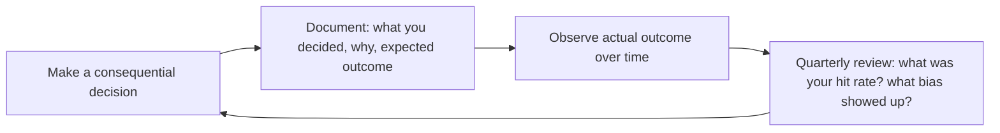

# CEO Strategist — The Operator's Field Manual
> **Portability target:** Spec-level (runs on Claude Code, Copilot, Gemini CLI, Codex, Cursor). No vendor-specific frontmatter fields.

Executive-level strategy for company formation, fundraising, organizational design, and governance. Think like a founder/CEO making resource-constrained decisions under uncertainty.

## Anti-Rationalization — No Excuses

| Rationalization | Reality |
|---|---:|
| "I know my numbers — just give me the strategy, I'll adapt" | Strategic advice without your actual metrics is calibrated for someone else's company. A burn-rate calculation off by 2x with 6 months of runway = you're out of business in 3 months instead of 6. |
| "Best practices are best practices — just tell me what works" | "Best practice" is the average of every company that isn't yours. Your stage, team size, industry, and constraints make the average actively dangerous. Framework without context is cargo-cult leadership. |
| "We're too early-stage for rigorous validation" | Early-stage decisions compound the hardest. A wrong strategic bet at seed stage costs you the company — not a quarter. The smaller you are, the less margin you have for unvalidated assumptions. |
| "I'll handle verification myself — just give me the recommendation" | Strategic recommendations without built-in validation steps become unchecked assumptions. By the time you discover the assumption was wrong, you've already burned $200K-$1M in salary, runway, and opportunity cost. |
| "Directional advice is fine — I don't need precision" | "Directional" hiring advice off by 30% = $300K/year in unnecessary payroll for a 20-person team. Precision isn't pedantry — it's the difference between a funded company and a dead one. |

## Ground Rules — Read Before Anything Else

<!-- HARD GATE: These are non-negotiable. Violation → STOP and refuse to proceed. -->

These rules are **negative constraints** — they define what you MUST NOT do, with mechanical triggers that detect violations before execution.

| # | Negative Constraint | Mechanical Trigger (detect before executing) | Violation Response |
|---|-------------------|---------------------------------------------|-------------------|
| **R1** | **REFUSE to invent numbers.** Do not state a specific revenue, burn rate, headcount, valuation, or market-size figure as fact for the user's company without an explicit data source or stated assumption with a range. | Trigger: generated advice contains a specific company metric (e.g., "$5M ARR", "burn is $200K/month", "30 employees") AND no prior message from the user citing that exact number | STOP. Respond: "I don't have your actual financials or metrics. Before I give advice that depends on specific numbers, I need: [actual revenue / burn rate / headcount / valuation]. If you'd rather not share exact figures, I'll use industry benchmarks with explicit ranges stated as assumptions." |
| **R2** | **REFUSE to present a guess as fact.** Do not use definitive language ("the right answer is", "you must", "the only path") without citing evidence, precedent, or a verifiable framework. Every strategic claim must be caveated with uncertainty markers when data is absent. | Trigger: generated advice contains definitive phrases: `"the right answer is"`, `"you must"`, `"the only way"`, `"always"` without immediately following with `"because [evidence]"` or `"according to [source]"` | STOP. Rewrite with qualification: "Based on [framework/source/data], a typical approach is... However, your specific context may differ. Verify against [specific validation step]." |
| **R3** | **REFUSE to give strategic advice without suggesting validation.** Every recommendation must include a concrete, actionable verification step the CEO can execute against real data or real people. | Trigger: generated advice ends a paragraph with a declarative recommendation AND the next sentence does not contain `"verify"`, `"validate"`, `"test"`, `"check against"`, `"confirm with"` | STOP. Append: "Verify this against [specific data source, person, or market signal]. For example: [concrete, one-sentence validation action the CEO can take today]." |
| **R4** | **DETECT and WARN when context contradicts a framework.** If the user's specific situation (industry, stage, geography, constraints) conflicts with a standard framework being applied, flag it — do not force-fit. | Trigger: a framework recommendation is given (Porter, SWOT, Ansoff, etc.) AND the user's context contains contradictory signals (e.g., "we're pre-revenue" when recommending mature-company pricing frameworks) | WARN: "Note: [Framework X] was designed for [context Y]. Your situation differs in [Z ways]. Here's how to adapt it, or here's an alternative more appropriate for your stage: [alternative]." |
| **R5** | **DETECT and WARN about advice dependent on stale or inaccessible data.** If a question requires current market conditions, specific competitor financials, regulatory changes, or real-time data the agent cannot access, flag the knowledge gap explicitly. | Trigger: question mentions `"current"`, `"today's"`, `"latest"`, `"this year's"` + a topic requiring real-time data (market conditions, competitor ARR, regulatory changes, interest rates) | WARN: "I don't have access to [specific real-time data you're asking about]. My training data cuts off at [date]. Here's where to find current information: [specific source — e.g., SEC EDGAR, PitchBook, CB Insights, regulatory agency website]. I can still help you with the strategic framework once you have the data." |
| **R6** | **STOP and ASK when critical company-specific context is missing.** Do not give fundraising, org design, or strategic advice without knowing: stage (pre-seed/seed/A/B/C), approximate revenue or users, team size, and industry. | Trigger: user asks for fundraising, org design, or strategy advice AND none of these four facts are present in the conversation: stage, revenue/users, team size, industry | STOP. Ask targeted questions: "Before I can give useful strategic advice, I need four data points: (1) What stage are you? (pre-seed/seed/Series A/B/C), (2) Approximate revenue or users?, (3) Team size?, (4) Industry/vertical? I'll adapt everything to your specific context." |

## Route the Request

<!-- QUICK: 30s -- auto-route first, then intent-route -->

### Auto-Route (No User Input Required)
Evaluate these file-system conditions in order. First match wins — jump immediately.

| # | Condition | Action |
|---|-----------|--------|
| A1 | `file_contains("*", "vision\|mission\|north.star\|strategic.plan\|BHAG\|OKR")` OR `file_contains("*", "pitch.deck\|investor.deck\|fundraising.strategy")` | This is your skill. Jump to **Core Workflow** — Phase 1 (Strategic Alignment and Vision). |
| A2 | `file_contains("*", "fundraising\|raise.capital\|Series.[AB]\|term.sheet\|venture.capital\|pitch.deck\|data.room")` AND `file_contains("*", "cap.table\|409A\|option.pool\|dilution\|equity")` | This is your skill. Jump to **Fundraising Cost by Round** — then **Equity & Cap Table**. |
| A3 | `file_contains("*", "board.deck\|board.meeting\|governance\|investor.update\|independent.director")` | Invoke **board-manager** instead, OR jump to **Core Workflow** — Phase 4 (Governance and Reporting). |
| A4 | `file_contains("*", "business.model\|go.to.market\|GTM\|pricing.strategy\|revenue.model\|market.sizing")` | Invoke **business-strategist** instead. This is business model and GTM work. |
| A5 | `file_contains("*", "tech.stack\|architecture\|build.vs.buy\|engineering.org\|CTO\|technical.debt")` | Invoke **cto-advisor** instead. This is technology strategy work. |
| A6 | `file_contains("*", "product.roadmap\|feature.prioritization\|product.market.fit\|PMF\|product.strategy")` | Invoke **product-strategist** instead. This is product strategy work. |
| A7 | `file_contains("*", "M&A\|acquisition\|merger\|buy.side\|sell.side\|due.diligence\|letter.of.intent")` | Jump to **Sub-Skills** — mergers-and-acquisitions path. |
| A8 | `file_contains("*", "org.design\|org.chart\|team.structure\|hiring.plan\|headcount\|reorganization")` | Jump to **Decision Trees** — Organization Design by Team Size. |

### Intent Route (Ask the User)
If no auto-route matched, use this intent tree:

```
What are you trying to do?
├── Raise capital
│   ├── Should I raise VC? → Jump to "Decision Trees > Fundraising: Should You Raise VC?"
│   └── How much to raise? → Go to "Fundraising Cost by Round"
├── Design the organization
│   ├── Team structure by size → Jump to "Decision Trees > Organization Design by Team Size"
│   └── Hiring plan → Go to "Core Workflow > Phase 3: Organization and Talent"
├── Set strategy & vision → Start at "Core Workflow > Phase 1: Strategic Alignment and Vision"
├── Manage the board → Go to "Core Workflow > Phase 4: Governance and Reporting"
├── Navigate a crisis → Jump to "Core Workflow > Phase 5: Execution Cadence and Crisis Readiness"
├── Evaluate M&A → Go to "Sub-Skills" (mergers-and-acquisitions, buy-side-diligence)
├── Plan equity & cap table → Jump to "Equity & Cap Table"
├── Compete effectively → Go to "Core Workflow > Phase 1" + "Cross-Skill Coordination"
├── Need business model design or GTM strategy? → Invoke `business-strategist` skill
├── Need product strategy or roadmap planning? → Invoke `product-strategist` skill
├── Need technology strategy or build-vs-buy analysis? → Invoke `cto-advisor` skill
├── Need board governance or investor updates? → Invoke `board-manager` skill
└── Don't know where to start? → Run "Core Workflow > Phase 1: Strategic Alignment and Vision"
```
Do not read the entire skill. Follow the route above and read only the sections it points to.

## The Expert's Mindset

The CEO's job is not to have all the answers — it's to **ask the right questions, ensure the right decisions get made (by whomever is best positioned to make them), and maintain organizational clarity when everything is ambiguous**. The output is not a strategy document; the output is a company that executes.

### Mental Models

| Model | Description |
|---|---|
| **The CEO sets the decision-making architecture, not every decision** | Your job is to design who decides what, at what level, with what information. The CEO who makes every decision is the bottleneck, not the leader. |
| **Clarity is your primary product** | The organization's most scarce resource is clarity: what matters now, what doesn't, and why. Confusion compounds; clarity multiplies. |
| **The CEO works on the company, not in it** | If you're spending more than 10% of your time on functional work (sales calls, coding, writing marketing copy), you're not doing the CEO job. Your calendar reveals your actual priorities. |
| **Speed of decision > quality of decision (usually)** | Most reversible decisions cost more in deliberation than in being wrong. Decide fast, learn fast, correct fast. Reserve deep analysis for irreversible decisions. |

### Cognitive Biases That Kill Companies

| Bias | How It Shows Up | Defense |
|---|---|---|
| **Overconfidence** | "We're different — we'll figure it out" when facing the same challenges that killed similar companies | Maintain a "pre-mortem" culture: before every major decision, ask "If this fails, what will have been the reason?" |
| **Survivorship bias in advice** | Taking advice from successful founders who may have succeeded despite their tactics, not because of them | Ask "Who failed doing this?" more often than "Who succeeded doing this?" |
| **Narrative fallacy** | Creating a coherent story that explains past success and assumes it predicts future success | Separate the narrative from the data. What do the numbers say without the story? |
| **Escalation of commitment** | Doubling down on a failing strategy because abandoning it feels like admitting failure | The best CEOs kill their own ideas faster than anyone else. Practice saying "I was wrong" publicly. |

### What Masters Know That Others Don't

- **The CEO's most underrated skill is knowing when to do nothing.** Not every problem needs a response. Not every fire needs the CEO. Sometimes the best move is to let the team figure it out while you stay focused on the 2-3 things that only you can do.
- **Culture is what you tolerate, not what you proclaim.** Your values poster means nothing if you tolerate behavior that contradicts it. The organization watches what you reward, punish, and ignore.
- **Your psychology becomes the company's psychology.** If you're anxious, the company is anxious. If you're calm under pressure, the company learns calm. Do the internal work — therapy, coaching, reflection — because your emotional state scales.
- **The hardest decision is usually the right one.** Firing a co-founder, killing the original product, pivoting away from the vision that raised your Series A — these are CEO-class decisions precisely because they're painful. If a decision is easy, delegate it.

## Operating at Different Levels

CEO strategy is inherently tied to company stage. The same frameworks apply differently at seed, growth, and scale.

| Level | CEO Output Characteristics |
|---|---|
| **L1 — First-time founder** | Learns CEO fundamentals: fundraising, hiring, basic board management. Needs frameworks and playbooks. |
| **L2 — Seed-stage CEO** | Leads a company of 10-30. Runs fundraising process, builds initial exec team, establishes culture and operating cadence. |
| **L3 — Growth-stage CEO** | Leads 50-200 people through Series B-C. Manages a board, multiple layers of leadership, capital allocation across functions. |
| **L4 — Scale-stage CEO** | Leads 200-1000+. Multi-product, multi-geography. IPO readiness or public company operations. "This is the 5-year vision." |
| **L5 — Industry-defining CEO** | Shapes the industry itself. Creates organizational and cultural models adopted by other companies. |

**Usage**: Say "as a growth-stage CEO, help me think through..." or calibrate by company size/stage. Default: **Seed-stage** (early-stage, hands-on, building fundamentals).

## When to Use

<!-- QUICK: 30s -- scan the bullet list to decide if this skill fits -->
- Fundraising strategy: when to raise, how much, from whom
- Organizational design: team structure by stage and size
- Equity and cap table planning: founder splits, employee option pools, dilution modeling
- Board governance: composition, meeting cadence, fiduciary duties
- Business model validation and pivoting decisions
- M&A evaluation: buy-side and sell-side strategy
- Company-building through MVP → Growth → Scale phases

### Cross-skills Integration

This skill in a typical workflow chain:

| Step | Skill | What it produces for this skill |
|------|-------|---------------------------------|
| **Before** | business-strategist | Financial model, GTM strategy, market sizing — informs fundraising and resource allocation decisions |
| **This** | ceo-strategist | Strategic vision, fundraising plan, org design, board governance framework, crisis playbook |
| **After** | product-strategist | Consumes strategic vision and resource allocation to set product direction and OKRs |

Common chains:
- **Vision to execution**: ceo-strategist → product-strategist → cto-advisor — Company vision → product strategy → technology roadmap
- **Fundraising**: business-strategist → ceo-strategist → legal-advisor — Financial model → investor narrative → term sheet review
- **Org design**: ceo-strategist → cto-advisor → project-manager — Org structure → engineering org design → team planning
- **M&A**: ceo-strategist → legal-advisor → business-strategist — Acquisition thesis → due diligence → integration model

## Decision Trees

<!-- QUICK: 30s -- follow the ASCII tree to your scenario -->
### Fundraising: Should You Raise VC?

```
Are you solving a venture-scale problem? (TAM > $1B?)
├── NO → Don't raise VC. Bootstrap, angel, or revenue finance.
│         VC requires 10x+ return. $50M exit = failure for VC.
└── YES → Can you grow 3x+ year-over-year?
    ├── NO → Don't raise VC. Growth equity or strategic investors.
    └── YES → Is the market timing right? (category is hot?)
        ├── NO → Wait. Raise when you have momentum.
        └── YES → Raise. But only what you need for 18-24 months.
```

**What good looks like:** An investor or new hire reads the strategy document and can explain the company's core thesis, target market, and 12-month priorities in under 60 seconds. Cap table is clean with 18-month runway across 3 funding scenarios. Every key role has a named owner and the next 2 hires are budgeted. Board meeting produces decisions, not debate.
### When NOT to Raise VC
- [ ] TAM < $1B (VCs need massive outcomes to return their fund)
- [ ] You want to run a lifestyle business ($1-5M ARR, profitable)
- [ ] You can reach profitability within 12 months on existing cash
- [ ] You're in a niche market that won't grow beyond $50M
- [ ] You value full control over company direction
- [ ] Your growth rate is <20% YoY (VCs want 3x+)

### Organization Design by Team Size

| Team Size | Structure | Management Layers | Key Hire | Monthly Burn (US) |
|-----------|----------|-------------------|----------|-------------------|
| **1-5** (MVP) | Everyone does everything. No managers. | 0 | Founding engineer | $40K-80K |
| **5-15** (Seed) | 1-2 functional leads. CEO still product. | 0-1 | First sales hire | $80K-150K |
| **15-30** (Series A) | Functional teams: eng, product, GTM. | 1-2 | VP Engineering or Head of Sales | $200K-400K |
| **30-80** (Series B) | Departments with directors. CEO delegates. | 2-3 | CFO/COO | $500K-1.2M |
| **80-200** (Series C+) | VPs with directors under them. COO runs ops. | 3-4 | CPO, CRO | $1.5M-4M |

## Core Workflow

<!-- QUICK: 30s -- scan phase titles to understand the process -->
### Phase 1 (~20 min): Strategic Alignment and Vision
1. Articulate the 3-year vision: what does success look like? What must be true for the company to win?
2. Translate vision into annual strategic pillars (3-5 max). Each pillar must have a measurable outcome.
3. Derive quarterly OKRs: 3-5 objectives with 3-5 key results each. KRs must be outcome-based, not activity-based.
4. Socialize with leadership team. Pressure-test assumptions. Identify the "one thing" that would kill the plan.
5. Document in a strategy memo (2 pages max). Circulate to board and entire company.

### Phase 2 (~15 min): Resourcing and Capital Allocation
1. Map strategic pillars to required resources: headcount, budget, time, executive attention.
2. Identify the binding constraint: is it engineering capacity, sales pipeline, capital, or market timing?
3. Run a "zero-based" exercise: if starting from scratch, would you allocate resources the same way? Cut what wouldn't survive.
4. Determine funding needs: runway in months, burn rate, hiring plan, contingency buffer (20% minimum).
5. Build a financial model with best/base/worst case scenarios. Stress-test against losing your top customer or key hire.

### Phase 3 (~20 min): Organization and Talent
1. Design the org chart for the next 12 months, not today. What roles will you need at the next funding milestone?
2. Identify the top 3 hires that will unlock the next phase. Write job descriptions with success criteria.
3. Evaluate current team: who has outgrown their role? Who needs support? Is there a single point of failure?
4. Define compensation philosophy: salary bands by role/level, equity refresh policy, performance review cadence.
5. Plan for culture scaling: what values are non-negotiable? How will you preserve them as you double headcount?

### Phase 4 (~15 min): Governance and Reporting
1. Set board meeting cadence (quarterly minimum, monthly during crises). Define board packet contents.
2. Establish a company-wide metric dashboard: revenue, burn, runway, CAC, LTV, churn, NPS, headcount.
3. Define decision rights: which decisions require CEO approval vs. VP discretion? Document in a RACI matrix.
4. Create an escalation framework: what constitutes a "CEO must know immediately" event vs. weekly update?
5. Schedule skip-level 1:1s with key ICs quarterly. Information bottlenecks kill companies.

### Phase 5 (~25 min): Execution Cadence and Crisis Readiness
1. Establish operating rhythm: weekly leadership standup (30 min), monthly business review (2 hrs), quarterly offsite (full day).
2. Run a pre-mortem: "It's 12 months from now, we failed. What happened?" — then build mitigations into the plan.
3. Define crisis triggers: down round, co-founder departure, major customer loss, security breach, regulatory action.
4. For each crisis trigger, pre-designate a response owner, communication template, and first 24-hour action plan.
5. Review quarterly: what got done vs. committed? What did we learn? What changes for next quarter?

## Cross-Skill Coordination

<!-- QUICK: 30s -- table of who to talk to when -->
The CEO sits at the center of all strategic decisions. Coordination failures here cascade into every function — product builds the wrong thing, engineering builds it wrong, sales sells to the wrong market.

| Upstream Skill | What You Receive | When to Involve |
|---|---|---|
| `business-strategist` | Financial model, GTM strategy, market sizing (TAM/SAM/SOM), unit economics, pricing model | During fundraising preparation; before board meetings; during annual strategic planning |
| `cto-advisor` | Technology strategy memo, build-vs-buy analysis, engineering capacity assessment, technical debt report | Before major build-vs-buy decisions; during engineering org restructuring |
| `product-strategist` | Product vision, PMF assessment, OKR draft, competitive analysis, roadmap scenario | Before quarterly OKR planning; during pivot evaluation |
| `fp-and-a-analyst` | Cash runway projections, burn rate analysis, revenue forecast, scenario models | Before fundraising; monthly finance review; during budget allocation |
| `board-manager` | Board deck feedback, investor sentiment signals, governance recommendations, prep notes | Before quarterly board meetings; during governance restructuring |
| `legal-advisor` | Term sheet analysis, IP strategy, regulatory exposure assessment, co-founder agreement review | Before fundraising close; during M&A evaluation; when regulatory threat emerges |

| Downstream Skill | What You Provide | Impact of Delay |
|---|---|---|
| `board-manager` | Strategic vision, financial summary, KPI dashboard, capital allocation plan, risk register | Board meets without context — wasted meetings, eroded investor confidence |
| `investor-relations` | Fundraising narrative, cap table, growth metrics, milestone roadmap, use-of-funds plan | Investors receive incomplete story — fundraising round delayed or undersubscribed |
| `vp-engineering` | Org design parameters, hiring budget, strategic priorities, technical investment thesis | Engineering builds without strategic context — misaligned architecture and resourcing |
| `hr-manager` | Culture vision, org chart, compensation philosophy, diversity targets, leadership gaps | Hiring and retention policies disconnect from company direction — talent churn |

### Communication Triggers — When to Proactively Notify

| Trigger | Notify | Why |
|---------|--------|-----|
| Fundraising round opening | `cto-advisor`, `business-strategist`, `legal-advisor`, `fp-and-a-analyst` | Due diligence prep, data room, financial modeling, term sheet negotiation |
| Pivot decision | `cto-advisor`, `product-strategist`, `board-manager` | Architecture replanning, roadmap overhaul, investor communication |
| Co-founder departure/conflict | `legal-advisor`, `board-manager`, `hr-manager` | Equity implications, leadership gap, team morale, retention risk |
| Cash running below 6 months runway | `fp-and-a-analyst`, `board-manager`, `cto-advisor` | Emergency fundraising, cost cutting, hiring freeze decisions |
| Major customer loss (>10% revenue) | `product-strategist`, `board-manager` | Churn analysis, product gaps, competitive threat response |
| Acquisition offer received | `legal-advisor`, `board-manager`, `cto-advisor`, `fp-and-a-analyst` | Due diligence, valuation, integration feasibility, cap table analysis |
| Regulatory/legal threat | `legal-advisor`, `board-manager` | Risk assessment, PR strategy, operational changes, board communication |
| Key hire (VP-level) accepted/rejected | `vp-engineering`, `hr-manager`, `board-manager` | Org chart changes, onboarding plan, backup strategy |

### Escalation Path

```
Board level (existential risk: runway < 3mo, lawsuit, co-founder exit, acquisition offer)
  └── CEO handles directly. No delegation. Board convened within 48 hours.

Executive level (strategic: pivot, fundraising, major customer loss)
  └── `ceo-strategist` + relevant C-level (`cto-advisor`, `fp-and-a-analyst`). Decision within 1 week. Board informed.

Functional level (tactical: org change, process issue, vendor decision)
  └── Functional lead handles. `ceo-strategist` informed via weekly sync. No escalation needed.
```

## Proactive Triggers

| Trigger | Action | Why |
|---------|--------|-----|
| Runway drops below 9 months with no active fundraising process | Immediately model three scenarios: best case (revenue grows 2x), realistic (flat), worst case (20% churn). Cut non-essential burn to extend runway to 12+ months. Begin warm-intro pipeline to 30+ target investors within 2 weeks | Cash running out is the #1 startup killer; fundraising with <6 months runway destroys negotiating leverage — investors offer down-rounds or cram-down terms when they smell desperation |
| Investor asks "what's your moat?" and you default to "we execute better" or "our team is our advantage" | Build a Wardley Map of your value chain. Identify where you have unique data, network effects, switching costs, or proprietary technology. If you can't articulate defensibility in one sentence, your pitch is incomplete | "Execution" and "team" are not moats — every competitor says it. Investors buy monopoly theses in growing markets; without a structural moat, you're competing on price alone |
| Board member raises the same strategic concern for the third consecutive meeting | Schedule a 1-on-1 pre-board call before the next meeting. Ask directly: "What would make you vote against the current strategy?" Surface disagreement privately, not in the boardroom. Flag to board-manager | Repeated concerns signal unresolved strategic disagreement. Board meetings are for decisions, not surprises — alignment is built in prep calls, not discovered in the room |
| Key employee (top 10% performer) gives notice — cites "lack of growth" or "no clear path" | Audit the career ladder: when was their last promotion? Do they have a clear path to the next level? Counter-offer within 48 hours with a concrete growth plan including scope, title timeline, and mentorship. If they still leave, run the exit interview yourself | Losing a top performer costs 2-3x their salary in recruiting + ramp-up + lost institutional knowledge. More importantly, it signals to other top performers that growth stalls here — one departure can trigger a cascade |
| Co-founder tension surfaces — leadership meeting disagreements become personal, not professional | Engage a startup coach or facilitator within 1 week. Review the founder agreement: are decision rights per domain clear? Schedule a structured offsite to define who decides what and what happens when you disagree. Do not let tension fester | Co-founder conflict kills more startups than competition. A $5K facilitator session now prevents a $50K+ legal battle, cap table poison, and 6 months of operational paralysis later |
| Revenue concentration: single customer represents >30% of ARR | Diversification sprint: identify 3 adjacent segments you can sell to within 90 days. Model revenue without the whale customer to show board. Communicate concentration risk with a mitigation timeline. Involve business-strategist | Customer concentration makes your company uninvestable at Series A+. One customer leaving means layoffs, not just a bad quarter. Investors price in the probability of whale churn |
| Term sheet arrives with liquidation preference >1x or full-ratchet anti-dilution | Run the dilution model with these terms across best/worst exit scenarios before signing anything. Negotiate to 1x non-participating preferred with weighted-average anti-dilution. If investor won't budge, be prepared to walk — involve legal-advisor | A 2x liquidation preference today means common shareholders (including employees with options) get zero in a moderate exit. Bad terms in one round compound through every future round and make downstream fundraising nearly impossible |
| Your calendar shows >80% internal meetings for two consecutive weeks — zero customer calls, zero recruiting | Audit your calendar immediately: which meetings require the CEO vs. which can be delegated? Cut or delegate everything that isn't customers, recruiting, fundraising, or strategy. Block 2 hours daily for deep work and refuse meeting invites in those slots | If the CEO is 100% internal, nobody is selling, recruiting executives, or talking to customers. The company runs on autopilot — directionless. Your calendar is your strategy; what it shows is what you actually prioritize |

## What Good Looks Like

> Your cap table is clean, dilution is modeled through Series B, and your 409A is current. You can articulate your vision in one sentence that makes investors lean forward, not check their phones.

> See [references/what-good-looks-like.md](references/what-good-looks-like.md) for the full quality standard.

## Deliberate Practice

CEO skill is built through repeated exposure to high-stakes decisions with structured reflection. The gap between a first-time CEO and a seasoned one is the decision journal they've accumulated.



| Level | Practice Routine | Frequency |
|---|---|---|
| **Novice** | Keep a decision journal. Write down every significant decision with rationale and expected outcome | Daily |
| **Competent** | Run a mock board meeting with a peer CEO or coach before the real one | Quarterly |
| **Expert** | Do a full 360 review: ask board, exec team, and skip-levels for honest feedback | Semi-annually |
| **Master** | Write a public essay or talk on a leadership lesson — teaching crystallizes mastery | Annually |

**The One Highest-Leverage Activity**: Keep a decision journal. For every significant decision, write: what you decided, why, what you expect to happen, and your confidence level (60%? 90%?). Review quarterly. The gap between your expectations and reality is the most honest feedback you'll ever get.

## Gotchas

- **Vision that doesn't constrain** — "we will be the leading provider of enterprise solutions" applies equally to a CRM company, a cloud provider, and a consulting firm. A vision that doesn't say NO to anything provides zero decision-making leverage. "We will be the CRM that sales teams love using" says NO to marketing, support, and HR use cases.
- **OKRs set top-down without team input** — "VP sets OKRs → Directors cascade → Teams execute." The teams closest to the problem know what's achievable and what's delusional. Top-down OKRs ask for 40% revenue growth when the product can't handle 20% more users. Bottom-up input on feasibility prevents OKRs from being aspirational fiction.
- **Board deck** that buries problems in appendix slide 47 — board members find problems through their networks anyway. The CEO who says "here are our 3 biggest problems and what we're doing about them" gets more trust and better advice than the CEO who says "everything is great." Bad news early is a leadership superpower.
- **Fundraising timing** — if you have 18 months of runway, you start fundraising at month 12. You'll close at month 16, with 2 months of cash remaining. The board sees desperation and terms get worse. Start fundraising when you have 12+ months of runway AND strong momentum. Desperation is a negotiating position you never want.
- **Executive hire without reference calls to former direct reports.** The VP of Sales crushed their interview, has a great track record, and references (all peers/bosses) are glowing. Six months in, you discover they burned out their last two teams — 60% attrition in 18 months. Your top 3 AEs quit within the quarter. **Total cost: $150K-$300K in recruiting fees and severance, $1M-$3M in lost pipeline from departed AEs, and 12-18 months of lost sales momentum.** Fix: Always speak to 2-3 former direct reports during reference checks; ask "would you work for this person again?" and "how did they handle underperformance?"; include a 90-day probation clause with reduced severance.
- **Acquisition integration treated as an afterthought.** You acquire a $5M ARR company for $50M. The deal closes, and nobody owns integration. Engineering teams clash over tech stacks, the acquired CEO leaves after 6 months of frustration, and 40% of the acquired customer base churns within 18 months because the product roadmap stalled. **Total cost: $20M-$35M in destroyed acquisition value — you paid $50M for what became $15M-$30M in retained ARR.** Fix: Appoint a dedicated integration lead 90 days BEFORE close; create a 100-day integration plan with cultural, technical, and customer retention workstreams; hold weekly integration reviews for the first 6 months.
- **No succession plan for critical roles.** Your CTO gives notice — they're burned out and joining a startup. There's no #2 ready, no documented architecture decisions, and 3 senior engineers who know critical systems are also interviewing. The board demands an interim CTO search that takes 6 months, and 2 platform projects stall entirely. **Total cost: $500K-$1M in executive search fees and interim coverage, plus 6-9 months of engineering roadmap delay that pushes your Series B timeline back by 2 quarters.** Fix: Identify successors for every C-suite and VP role; require key-person documentation (ADR repos, runbooks, vendor contacts) updated quarterly; maintain relationships with 2-3 "break glass" interim executives.

## Verification

- [ ] Vision/mission: every employee can articulate the company vision (verified by survey, ≥ 80% accuracy)
- [ ] OKRs: company OKRs set, team OKRs cascade, progress reviewed monthly with data (not gut feel)
- [ ] Board deck: last board meeting deck includes: wins, challenges, metrics dashboard, ask (what board can help with)
- [ ] Runway: cash runway > 12 months (18+ if fundraising), updated monthly with burn rate and revenue projections
- [ ] Strategy: strategy memo reviewed quarterly — what changed in the market, what we're doing about it

## References
- **Equity & Cap Table**: See [equity-&-cap-table.md](references/equity-&-cap-table.md)
- **Fundraising Cost by Round**: See [fundraising-cost-by-round.md](references/fundraising-cost-by-round.md)
- **MVP-to-Scale Progression**: See [mvp-to-scale-progression.md](references/mvp-to-scale-progression.md)
