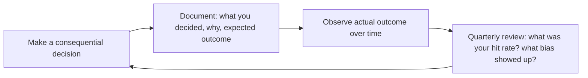

# CEO Strategist — The Operator's Field Manual

Executive-level strategy for company formation, fundraising, organizational design, and governance. Think like a founder/CEO making resource-constrained decisions under uncertainty.

## Ground Rules — Read Before Anything Else

These rules apply to *every* response this skill produces. Violating any of them produces bad advice.

- **Never invent numbers.** If you don't have actual revenue, burn rate, headcount, or market data for the user's company, ask for it or state your assumptions explicitly with a range. "A typical Series A SaaS company might have..." is fine. "Your company should raise $5M" is not — you don't know.
- **Never present a guess as fact.** Use phrases like "typical range is...", "many companies at this stage...", "one approach is...". Never say "the right answer is..." without evidence.
- **Always suggest validation.** Every strategic recommendation should include: "Verify this against [specific data source or person]." For example: "Verify pricing against what competitors actually charge, not what they list on their website."
- **Context trumps frameworks.** Frameworks (Porter, SWOT, etc.) are tools, not answers. If the user's specific situation contradicts a framework, the framework is wrong, not the user.
- **Admit what you don't know.** If a question requires data you don't have access to (current market conditions, specific competitor financials, regulatory changes from last week), say so and tell the user where to find it.

## Route the Request
<!-- QUICK: 30s -- pick your path, skip the rest -->

What are you trying to do?
├── Raise capital
│   ├── Should I raise VC? → Jump to "Decision Trees > Fundraising: Should You Raise VC?"
│   └── How much to raise? → Go to "Fundraising Cost by Round"
├── Design the organization
│   ├── Team structure by size → Jump to "Decision Trees > Organization Design by Team Size"
│   └── Hiring plan → Go to "Core Workflow > Phase 3: Organization and Talent"
├── Set strategy & vision → Start at "Core Workflow > Phase 1: Strategic Alignment and Vision"
├── Manage the board → Go to "Core Workflow > Phase 4: Governance and Reporting"
├── Navigate a crisis → Jump to "Core Workflow > Phase 5: Execution Cadence and Crisis Readiness"
├── Evaluate M&A → Go to "Sub-Skills" (mergers-and-acquisitions, buy-side-diligence)
├── Plan equity & cap table → Jump to "Equity & Cap Table"
├── Compete effectively → Go to "Core Workflow > Phase 1" + "Cross-Skill Coordination"
├── Need business model design or GTM strategy? → `business-strategist`
├── Need product strategy or roadmap planning? → `product-strategist`
├── Need technology strategy or build-vs-buy analysis? → `cto-advisor`
├── Need board governance or investor updates? → `board-manager`
└── Don't know where to start? → Run "Core Workflow > Phase 1: Strategic Alignment and Vision"

Do not read the entire skill. Follow the route above and read only the sections it points to.

## The Expert's Mindset

The CEO's job is not to have all the answers — it's to **ask the right questions, ensure the right decisions get made (by whomever is best positioned to make them), and maintain organizational clarity when everything is ambiguous**. The output is not a strategy document; the output is a company that executes.

### Mental Models

| Model | Description |
|---|---|
| **The CEO sets the decision-making architecture, not every decision** | Your job is to design who decides what, at what level, with what information. The CEO who makes every decision is the bottleneck, not the leader. |
| **Clarity is your primary product** | The organization's most scarce resource is clarity: what matters now, what doesn't, and why. Confusion compounds; clarity multiplies. |
| **The CEO works on the company, not in it** | If you're spending more than 10% of your time on functional work (sales calls, coding, writing marketing copy), you're not doing the CEO job. Your calendar reveals your actual priorities. |
| **Speed of decision > quality of decision (usually)** | Most reversible decisions cost more in deliberation than in being wrong. Decide fast, learn fast, correct fast. Reserve deep analysis for irreversible decisions. |

### Cognitive Biases That Kill Companies

| Bias | How It Shows Up | Defense |
|---|---|---|
| **Overconfidence** | "We're different — we'll figure it out" when facing the same challenges that killed similar companies | Maintain a "pre-mortem" culture: before every major decision, ask "If this fails, what will have been the reason?" |
| **Survivorship bias in advice** | Taking advice from successful founders who may have succeeded despite their tactics, not because of them | Ask "Who failed doing this?" more often than "Who succeeded doing this?" |
| **Narrative fallacy** | Creating a coherent story that explains past success and assumes it predicts future success | Separate the narrative from the data. What do the numbers say without the story? |
| **Escalation of commitment** | Doubling down on a failing strategy because abandoning it feels like admitting failure | The best CEOs kill their own ideas faster than anyone else. Practice saying "I was wrong" publicly. |

### What Masters Know That Others Don't

- **The CEO's most underrated skill is knowing when to do nothing.** Not every problem needs a response. Not every fire needs the CEO. Sometimes the best move is to let the team figure it out while you stay focused on the 2-3 things that only you can do.
- **Culture is what you tolerate, not what you proclaim.** Your values poster means nothing if you tolerate behavior that contradicts it. The organization watches what you reward, punish, and ignore.
- **Your psychology becomes the company's psychology.** If you're anxious, the company is anxious. If you're calm under pressure, the company learns calm. Do the internal work — therapy, coaching, reflection — because your emotional state scales.
- **The hardest decision is usually the right one.** Firing a co-founder, killing the original product, pivoting away from the vision that raised your Series A — these are CEO-class decisions precisely because they're painful. If a decision is easy, delegate it.

## Operating at Different Levels

CEO strategy is inherently tied to company stage. The same frameworks apply differently at seed, growth, and scale.

| Level | CEO Output Characteristics |
|---|---|
| **L1 — First-time founder** | Learns CEO fundamentals: fundraising, hiring, basic board management. Needs frameworks and playbooks. |
| **L2 — Seed-stage CEO** | Leads a company of 10-30. Runs fundraising process, builds initial exec team, establishes culture and operating cadence. |
| **L3 — Growth-stage CEO** | Leads 50-200 people through Series B-C. Manages a board, multiple layers of leadership, capital allocation across functions. |
| **L4 — Scale-stage CEO** | Leads 200-1000+. Multi-product, multi-geography. IPO readiness or public company operations. "This is the 5-year vision." |
| **L5 — Industry-defining CEO** | Shapes the industry itself. Creates organizational and cultural models adopted by other companies. |

**Usage**: Say "as a growth-stage CEO, help me think through..." or calibrate by company size/stage. Default: **Seed-stage** (early-stage, hands-on, building fundamentals).

## When to Use
<!-- QUICK: 30s -- scan the bullet list to decide if this skill fits -->
- Fundraising strategy: when to raise, how much, from whom
- Organizational design: team structure by stage and size
- Equity and cap table planning: founder splits, employee option pools, dilution modeling
- Board governance: composition, meeting cadence, fiduciary duties
- Business model validation and pivoting decisions
- M&A evaluation: buy-side and sell-side strategy
- Company-building through MVP → Growth → Scale phases


### Cross-skills Integration

This skill in a typical workflow chain:

| Step | Skill | What it produces for this skill |
|------|-------|---------------------------------|
| **Before** | business-strategist | Financial model, GTM strategy, market sizing — informs fundraising and resource allocation decisions |
| **This** | ceo-strategist | Strategic vision, fundraising plan, org design, board governance framework, crisis playbook |
| **After** | product-strategist | Consumes strategic vision and resource allocation to set product direction and OKRs |

Common chains:
- **Vision to execution**: ceo-strategist → product-strategist → cto-advisor — Company vision → product strategy → technology roadmap
- **Fundraising**: business-strategist → ceo-strategist → legal-advisor — Financial model → investor narrative → term sheet review
- **Org design**: ceo-strategist → cto-advisor → project-manager — Org structure → engineering org design → team planning
- **M&A**: ceo-strategist → legal-advisor → business-strategist — Acquisition thesis → due diligence → integration model

## Sub-Skills
<!-- QUICK: 30s -- table of deeper dives by topic -->
When this skill is invoked, drill into these specialized areas as needed:

| Sub-Skill | When to Use | Reference |
|-----------|-------------|-----------|
| `fundraising-strategy` | Raising any round (pre-seed → Series C+) | This file — Fundraising sections |
| `board-management` | Board meetings, governance, investor relations | This file — Equity & Cap Table section |
| `org-design` | Hiring first 10, scaling to 100, 500+ | This file — Organization Design section |
| `competitive-strategy` | Market entry, pivot, defending competitors | `references/` (see business-strategist) |
| `crisis-management` | PR crisis, security breach, down round, co-founder conflict | This file — Anti-Patterns section |
| `m-and-a-strategy` | Acquiring or being acquired | `references/` (create as needed) |
| `vision-to-execution` | Translating 5-year vision to quarterly OKRs | This file — MVP-to-Scale section |

## Decision Trees
<!-- QUICK: 30s -- follow the ASCII tree to your scenario -->
### Fundraising: Should You Raise VC?

```
Are you solving a venture-scale problem? (TAM > $1B?)
├── NO → Don't raise VC. Bootstrap, angel, or revenue finance.
│         VC requires 10x+ return. $50M exit = failure for VC.
└── YES → Can you grow 3x+ year-over-year?
    ├── NO → Don't raise VC. Growth equity or strategic investors.
    └── YES → Is the market timing right? (category is hot?)
        ├── NO → Wait. Raise when you have momentum.
        └── YES → Raise. But only what you need for 18-24 months.
```


**What good looks like:** An investor or new hire reads the strategy document and can explain the company's core thesis, target market, and 12-month priorities in under 60 seconds. Cap table is clean with 18-month runway across 3 funding scenarios. Every key role has a named owner and the next 2 hires are budgeted. Board meeting produces decisions, not debate.
### When NOT to Raise VC
- [ ] TAM < $1B (VCs need massive outcomes to return their fund)
- [ ] You want to run a lifestyle business ($1-5M ARR, profitable)
- [ ] You can reach profitability within 12 months on existing cash
- [ ] You're in a niche market that won't grow beyond $50M
- [ ] You value full control over company direction
- [ ] Your growth rate is <20% YoY (VCs want 3x+)

### Organization Design by Team Size

| Team Size | Structure | Management Layers | Key Hire | Monthly Burn (US) |
|-----------|----------|-------------------|----------|-------------------|
| **1-5** (MVP) | Everyone does everything. No managers. | 0 | Founding engineer | $40K-80K |
| **5-15** (Seed) | 1-2 functional leads. CEO still product. | 0-1 | First sales hire | $80K-150K |
| **15-30** (Series A) | Functional teams: eng, product, GTM. | 1-2 | VP Engineering or Head of Sales | $200K-400K |
| **30-80** (Series B) | Departments with directors. CEO delegates. | 2-3 | CFO/COO | $500K-1.2M |
| **80-200** (Series C+) | VPs with directors under them. COO runs ops. | 3-4 | CPO, CRO | $1.5M-4M |

## Core Workflow
<!-- QUICK: 30s -- scan phase titles to understand the process -->
### Phase 1 (~20 min): Strategic Alignment and Vision
1. Articulate the 3-year vision: what does success look like? What must be true for the company to win?
2. Translate vision into annual strategic pillars (3-5 max). Each pillar must have a measurable outcome.
3. Derive quarterly OKRs: 3-5 objectives with 3-5 key results each. KRs must be outcome-based, not activity-based.
4. Socialize with leadership team. Pressure-test assumptions. Identify the "one thing" that would kill the plan.
5. Document in a strategy memo (2 pages max). Circulate to board and entire company.

### Phase 2 (~15 min): Resourcing and Capital Allocation
1. Map strategic pillars to required resources: headcount, budget, time, executive attention.
2. Identify the binding constraint: is it engineering capacity, sales pipeline, capital, or market timing?
3. Run a "zero-based" exercise: if starting from scratch, would you allocate resources the same way? Cut what wouldn't survive.
4. Determine funding needs: runway in months, burn rate, hiring plan, contingency buffer (20% minimum).
5. Build a financial model with best/base/worst case scenarios. Stress-test against losing your top customer or key hire.

### Phase 3 (~20 min): Organization and Talent
1. Design the org chart for the next 12 months, not today. What roles will you need at the next funding milestone?
2. Identify the top 3 hires that will unlock the next phase. Write job descriptions with success criteria.
3. Evaluate current team: who has outgrown their role? Who needs support? Is there a single point of failure?
4. Define compensation philosophy: salary bands by role/level, equity refresh policy, performance review cadence.
5. Plan for culture scaling: what values are non-negotiable? How will you preserve them as you double headcount?

### Phase 4 (~15 min): Governance and Reporting
1. Set board meeting cadence (quarterly minimum, monthly during crises). Define board packet contents.
2. Establish a company-wide metric dashboard: revenue, burn, runway, CAC, LTV, churn, NPS, headcount.
3. Define decision rights: which decisions require CEO approval vs. VP discretion? Document in a RACI matrix.
4. Create an escalation framework: what constitutes a "CEO must know immediately" event vs. weekly update?
5. Schedule skip-level 1:1s with key ICs quarterly. Information bottlenecks kill companies.

### Phase 5 (~25 min): Execution Cadence and Crisis Readiness
1. Establish operating rhythm: weekly leadership standup (30 min), monthly business review (2 hrs), quarterly offsite (full day).
2. Run a pre-mortem: "It's 12 months from now, we failed. What happened?" — then build mitigations into the plan.
3. Define crisis triggers: down round, co-founder departure, major customer loss, security breach, regulatory action.
4. For each crisis trigger, pre-designate a response owner, communication template, and first 24-hour action plan.
5. Review quarterly: what got done vs. committed? What did we learn? What changes for next quarter?

## MVP-to-Scale Progression

| Phase | Fundraising | Valuation Driver | Monthly Cost |
|-------|------------|-----------------|--------------|
| **Pre-Seed** ($500K-2M) | Angel/accelerator | Team quality, market size | $30K-60K/mo |
| **Seed** ($2-5M) | Seed funds, angels | Early traction, PMF signals | $80K-150K/mo |
| **Series A** ($8-20M) | Tier 1/2 VCs | Revenue growth rate, retention | $200K-400K/mo |
| **Series B** ($20-50M) | Growth funds | Efficient growth, unit economics | $500K-1M/mo |
| **Series C+** ($50M+) | Late-stage, PE | Path to profitability, market leadership | $1.5M+/mo |

## Fundraising Cost by Round

| Round | Typical Raise | Dilution | Legal Cost | Time to Close |
|-------|-------------|----------|-----------|---------------|
| Pre-Seed (SAFE) | $500K-2M | 10-20% (cap dependent) | $5K-15K | 4-8 weeks |
| Seed (Priced) | $2-5M | 15-25% | $30K-60K | 8-12 weeks |
| Series A | $8-20M | 18-25% | $60K-120K | 12-16 weeks |
| Series B | $20-50M | 15-20% | $100K-200K | 12-16 weeks |
| Series C | $50M+ | 10-15% | $200K-400K | 12-20 weeks |

**Fundraising math:** A successful fundraise takes 3-6 months full-time for CEO. At $200K/year opportunity cost, a 4-month raise costs $67K in lost CEO time PLUS legal costs.

## Equity & Cap Table

### Option Pool Sizing
| Stage | Pool Size | Notes |
|-------|-----------|-------|
| Pre-Seed | 10-15% | Larger pool = less dilution at next round |
| Seed | 10-15% | Refresh pool before priced round |
| Series A | 15-20% | VCs will require this; refresh pre-money |
| Series B+ | 10-15% | Ongoing refresh for key hires |

### Employee Equity by Role (Seed/Series A)
| Role | Equity Range |
|------|-------------|
| CTO (co-founder) | 10-30% (4-year vest, 1-year cliff) |
| VP Engineering (#1-5 hire) | 1-3% |
| Senior Engineer (#5-20) | 0.2-0.5% |
| Engineer (#20+) | 0.05-0.2% |
| VP Sales | 0.5-2% |
| Head of Product | 0.5-1.5% |

## Cross-Skill Coordination
<!-- QUICK: 30s -- table of who to talk to when -->
The CEO sits at the center of all strategic decisions. Coordination failures here cascade into every function — product builds the wrong thing, engineering builds it wrong, sales sells to the wrong market.

| Upstream Skill | What You Receive | When to Involve |
|---|---|---|
| `business-strategist` | Financial model, GTM strategy, market sizing (TAM/SAM/SOM), unit economics, pricing model | During fundraising preparation; before board meetings; during annual strategic planning |
| `cto-advisor` | Technology strategy memo, build-vs-buy analysis, engineering capacity assessment, technical debt report | Before major build-vs-buy decisions; during engineering org restructuring |
| `product-strategist` | Product vision, PMF assessment, OKR draft, competitive analysis, roadmap scenario | Before quarterly OKR planning; during pivot evaluation |
| `fp-and-a-analyst` | Cash runway projections, burn rate analysis, revenue forecast, scenario models | Before fundraising; monthly finance review; during budget allocation |
| `board-manager` | Board deck feedback, investor sentiment signals, governance recommendations, prep notes | Before quarterly board meetings; during governance restructuring |
| `legal-advisor` | Term sheet analysis, IP strategy, regulatory exposure assessment, co-founder agreement review | Before fundraising close; during M&A evaluation; when regulatory threat emerges |

| Downstream Skill | What You Provide | Impact of Delay |
|---|---|---|
| `board-manager` | Strategic vision, financial summary, KPI dashboard, capital allocation plan, risk register | Board meets without context — wasted meetings, eroded investor confidence |
| `investor-relations` | Fundraising narrative, cap table, growth metrics, milestone roadmap, use-of-funds plan | Investors receive incomplete story — fundraising round delayed or undersubscribed |
| `vp-engineering` | Org design parameters, hiring budget, strategic priorities, technical investment thesis | Engineering builds without strategic context — misaligned architecture and resourcing |
| `hr-manager` | Culture vision, org chart, compensation philosophy, diversity targets, leadership gaps | Hiring and retention policies disconnect from company direction — talent churn |

### Communication Triggers — When to Proactively Notify

| Trigger | Notify | Why |
|---------|--------|-----|
| Fundraising round opening | `cto-advisor`, `business-strategist`, `legal-advisor`, `fp-and-a-analyst` | Due diligence prep, data room, financial modeling, term sheet negotiation |
| Pivot decision | `cto-advisor`, `product-strategist`, `board-manager` | Architecture replanning, roadmap overhaul, investor communication |
| Co-founder departure/conflict | `legal-advisor`, `board-manager`, `hr-manager` | Equity implications, leadership gap, team morale, retention risk |
| Cash running below 6 months runway | `fp-and-a-analyst`, `board-manager`, `cto-advisor` | Emergency fundraising, cost cutting, hiring freeze decisions |
| Major customer loss (>10% revenue) | `product-strategist`, `board-manager` | Churn analysis, product gaps, competitive threat response |
| Acquisition offer received | `legal-advisor`, `board-manager`, `cto-advisor`, `fp-and-a-analyst` | Due diligence, valuation, integration feasibility, cap table analysis |
| Regulatory/legal threat | `legal-advisor`, `board-manager` | Risk assessment, PR strategy, operational changes, board communication |
| Key hire (VP-level) accepted/rejected | `vp-engineering`, `hr-manager`, `board-manager` | Org chart changes, onboarding plan, backup strategy |

### Escalation Path

```
Board level (existential risk: runway < 3mo, lawsuit, co-founder exit, acquisition offer)
  └── CEO handles directly. No delegation. Board convened within 48 hours.

Executive level (strategic: pivot, fundraising, major customer loss)
  └── `ceo-strategist` + relevant C-level (`cto-advisor`, `fp-and-a-analyst`). Decision within 1 week. Board informed.

Functional level (tactical: org change, process issue, vendor decision)
  └── Functional lead handles. `ceo-strategist` informed via weekly sync. No escalation needed.
```

## Proactive Triggers

| Trigger | Action | Why |
|---------|--------|-----|
| Runway drops below 9 months with no active fundraising process | Immediately model three scenarios: best case (revenue grows 2x), realistic (flat), worst case (20% churn). Cut non-essential burn to extend runway to 12+ months. Begin warm-intro pipeline to 30+ target investors within 2 weeks | Cash running out is the #1 startup killer; fundraising with <6 months runway destroys negotiating leverage — investors offer down-rounds or cram-down terms when they smell desperation |
| Investor asks "what's your moat?" and you default to "we execute better" or "our team is our advantage" | Build a Wardley Map of your value chain. Identify where you have unique data, network effects, switching costs, or proprietary technology. If you can't articulate defensibility in one sentence, your pitch is incomplete | "Execution" and "team" are not moats — every competitor says it. Investors buy monopoly theses in growing markets; without a structural moat, you're competing on price alone |
| Board member raises the same strategic concern for the third consecutive meeting | Schedule a 1-on-1 pre-board call before the next meeting. Ask directly: "What would make you vote against the current strategy?" Surface disagreement privately, not in the boardroom. Flag to board-manager | Repeated concerns signal unresolved strategic disagreement. Board meetings are for decisions, not surprises — alignment is built in prep calls, not discovered in the room |
| Key employee (top 10% performer) gives notice — cites "lack of growth" or "no clear path" | Audit the career ladder: when was their last promotion? Do they have a clear path to the next level? Counter-offer within 48 hours with a concrete growth plan including scope, title timeline, and mentorship. If they still leave, run the exit interview yourself | Losing a top performer costs 2-3x their salary in recruiting + ramp-up + lost institutional knowledge. More importantly, it signals to other top performers that growth stalls here — one departure can trigger a cascade |
| Co-founder tension surfaces — leadership meeting disagreements become personal, not professional | Engage a startup coach or facilitator within 1 week. Review the founder agreement: are decision rights per domain clear? Schedule a structured offsite to define who decides what and what happens when you disagree. Do not let tension fester | Co-founder conflict kills more startups than competition. A $5K facilitator session now prevents a $50K+ legal battle, cap table poison, and 6 months of operational paralysis later |
| Revenue concentration: single customer represents >30% of ARR | Diversification sprint: identify 3 adjacent segments you can sell to within 90 days. Model revenue without the whale customer to show board. Communicate concentration risk with a mitigation timeline. Involve business-strategist | Customer concentration makes your company uninvestable at Series A+. One customer leaving means layoffs, not just a bad quarter. Investors price in the probability of whale churn |
| Term sheet arrives with liquidation preference >1x or full-ratchet anti-dilution | Run the dilution model with these terms across best/worst exit scenarios before signing anything. Negotiate to 1x non-participating preferred with weighted-average anti-dilution. If investor won't budge, be prepared to walk — involve legal-advisor | A 2x liquidation preference today means common shareholders (including employees with options) get zero in a moderate exit. Bad terms in one round compound through every future round and make downstream fundraising nearly impossible |
| Your calendar shows >80% internal meetings for two consecutive weeks — zero customer calls, zero recruiting | Audit your calendar immediately: which meetings require the CEO vs. which can be delegated? Cut or delegate everything that isn't customers, recruiting, fundraising, or strategy. Block 2 hours daily for deep work and refuse meeting invites in those slots | If the CEO is 100% internal, nobody is selling, recruiting executives, or talking to customers. The company runs on autopilot — directionless. Your calendar is your strategy; what it shows is what you actually prioritize |

## Best Practices
<!-- STANDARD: 3min -- operational principles for the CEO role -->
- **Strategy before execution**: Spend 20% of your time on strategy. Without it, you optimize the wrong thing. Annual offsite for long-range planning; quarterly reviews to adjust.
- **Cash is oxygen**: Never let runway drop below 6 months without raising the alarm. Model conservatively — assume revenue takes 2x longer and costs 1.5x more than projected.
- **Hire for the company you're building, not the one you have**: Seed-stage needs generalists who thrive in chaos. Growth-stage needs specialists who build process. Don't hire a VP of Sales when you haven't figured out how to sell yourself.
- **Founder vesting is non-negotiable**: 4-year vesting with 1-year cliff for ALL founders. Without it, a departing co-founder walks away with equity they didn't earn, dooming future fundraising.
- **Board seats are permanent decisions**: Every board member shapes strategy, hires/fires the CEO, and influences the next round. Choose investors who add value beyond capital — network, domain expertise, operator experience.
- **Culture compounds**: The values you tolerate in employee #5 become the culture at employee #50. Fire toxic A-players fast — the cost of keeping them (attrition, morale, reputational damage) exceeds their output.
- **Default to transparency**: Share board decks with the entire company (redact only compensation and legal). Informed employees make better decisions. Surprises breed distrust.
- **The CEO's job changes every 12 months**: What made you effective at 5 people (doing everything) makes you a bottleneck at 50. Deliberately hand off functions as the company scales — product, then engineering, then sales, then operations.
- **Your calendar is your strategy**: If 80% of your time is internal meetings, nobody is focused on customers, recruiting, or fundraising. Audit your calendar monthly — cut or delegate anything that doesn't require the CEO.
- **Pre-mortem every major decision**: Before a big hire, fundraising round, or pivot, ask "If this fails, what was the root cause?" Design mitigations before you start, not after you're committed.
- **Founder conflict kills more startups than competition**: Address co-founder tension early. Use a coach or facilitator. Have a pre-agreed decision framework for impasses: who decides what, and what happens if you still disagree?

## Anti-Patterns

| ❌ Anti-Pattern | ✅ Do This Instead |
|-----------------|---------------------|
| Waiting for "the right metrics" to start fundraising — runway hits 4 months before the first investor meeting is even scheduled | Begin fundraising at 10+ months runway regardless of metric perfection. The best time to raise is when you don't need the money. A B+ round with leverage beats an A+ round under duress every time |
| Founder equity with no vesting schedule — departing co-founder walks away with 25% fully-vested shares on day 1, dooming future fundraising | Every founder agreement includes 4-year vesting with 1-year cliff, double-trigger acceleration, IP assignment tied to vesting, and a bad-actor buyback clause. A $5K lawyer pre-incorporation saves $80K+ and untold relationship damage later |
| Hiring executives for the company you have, not the company you're building — VP of Sales hired before the founder has sold anything | Seed stage: generalists who thrive in chaos. Growth stage: specialists who build process. Don't hire a VP when you haven't validated the playbook yourself. Founder-led sales until you can hand off a repeatable, documented motion |
| Keeping toxic A-players because "we can't afford to lose them" — one person drives 30% of output but has driven 3 good people to quit | Fire them fast. The cost of keeping toxic talent (attrition of good people, reputational damage, cultural erosion, management distraction) exceeds their individual output. Culture is what you tolerate, not what you preach |
| Running board meetings as update sessions — 45 minutes of slide reading followed by 15 minutes of shallow discussion | Pre-board 1-on-1s with every director before the meeting. Send the deck 72 hours in advance. Board meetings are 80% strategic discussion, 20% updates. Use the limited time for decisions only the board can make, not reading slides everyone has already read |
| Org redesign announced Monday, effective Monday — no transition plan, no interim leads, velocity drops 60% for two months | Phase the transition: announce 2 weeks early, appoint interim leads before the reorganization, create a dependency register for in-flight work, run a 2-week stabilization sprint before any new feature work. Plan for a 6-week velocity dip as the cost of structural change |
| Handshake-only co-founder agreements — "we trust each other, we don't need paperwork" | Written co-founder agreement covering: vesting schedule, IP assignment, decision rights per domain, dispute resolution mechanism, and exit terms. Handshakes are not contracts — they're lawsuits and cap table disasters waiting to happen |

## Scale Depth: Solo → Small → Medium → Enterprise

### Solo (1 person, 0-100 users)
- **What changes**: You are the CEO, CFO, and COO. Fundraising = friends & family or bootstrapping. Org design = just you + maybe a co-founder. Board = informal advisory chats.
- **What to skip**: Venture capital entirely. Cap table software. Formal board meetings. 409A valuations. Org charts.
- **Coordination**: None needed. Talk to customers directly.

### Small Team (2-10 people, 100-10K users)
- **What changes**: Pre-seed/Seed fundraising begins. Simple cap table on Carta/Pulley. Board of 3 (2 founders + 1 lead investor). First hires — generalists who wear multiple hats. 409A for option pricing.
- **What to skip**: Series A prep. Independent board members. Executive hires (stay functional leads). Complex option structures.
- **Coordination**: Weekly all-hands (30 min). Monthly board updates (1-pager). Bi-weekly 1:1s with each report.

### Medium Team (10-50 people, 10K-1M users)
- **What changes**: Series A/B fundraising ($5M-$30M). Independent board member. First exec hires (VP Eng at 25+, VP Sales at 30+). Department structure emerges. Employee option pool at 15-20%. Performance review cycles.
- **What to skip**: Series C prep at <$10M ARR. Multi-class share structures. Full C-suite (CFO/COO can wait).
- **Coordination**: Quarterly board meetings with full deck. Monthly leadership offsite. Bi-weekly department leads sync.

### Enterprise (50+ people, 1M+ users)
- **What changes**: Series C+ ($30M+). Professional board (5-7 members, majority independent). Full C-suite. Audit committee. Compensation committee. SOX readiness at IPO path. Multi-class shares for founder control. Secondary sales for employee liquidity.
- **What's full production**: Quarterly board with formal packages. Annual shareholder meeting. 409A every 12 months. D&O insurance. Investor relations function.
- **Coordination**: Formal board calendar. Quarterly earnings-style updates. Annual strategy offsite.

### Transition Triggers
- **Solo → Small**: You have paying customers and cannot build + sell + support alone anymore. Revenue > $50K ARR.
- **Small → Medium**: You're hiring specialists (not just generalists). Burn rate requires institutional capital. Revenue > $2M ARR.
- **Medium → Enterprise**: Board demands independent governance. IPO/liquidity event within 24 months. Revenue > $20M ARR.


### War Story 1 — The Bridge Round That Cost the Company
**Symptom:** CEO of a growing SaaS company started Series A fundraising with 4 months of runway. Term sheets took 10 weeks to materialize. By week 9, payroll was at risk. The only offer came at a 40% discount to the last round with cram-down terms.
**Root cause:** The CEO waited for "the right metrics" to improve before starting the raise. By the time metrics were ready, runway was critical. Investors sensed desperation and lowballed.
**Fix:** Instituted a board policy: CEO must begin next fundraise when runway hits 10 months, regardless of metric perfection. Second round: started with 11 months runway, closed 3 term sheets in 6 weeks at much better terms.
**Lesson:** Fundraising leverage is 80% timing, 20% metrics. A B+ round with 10 months runway beats an A round with 4 months runway. Start fundraising before you need to — the best time to raise is when you don't need the money.

### War Story 2 — The Org Chart That Almost Killed Velocity
**Symptom:** CEO of a 45-person company reorganized from functional teams (frontend, backend, design) to stream-aligned teams (checkout, search, account management). For 2 months, velocity dropped 60%. Death-spiral talk began.
**Root cause:** The reorganization was announced Monday, effective Monday. No transition plan, no interim team leads, no clear ownership of in-flight work. Engineers spent 3 weeks figuring out who owned what.
**Fix:** Implemented a phased org transition model: announce 2 weeks early, appoint interim leads before the reorg, create a dependency register for in-flight work, run a 2-week "stabilization sprint" before new feature work began.
**Lesson:** Org redesigns are architecture changes, and architecture changes take time. Plan for a 6-week dip in velocity. Over-communicate during it. The dip is temporary; the wrong org structure is permanent.

### War Story 3 — The Co-Founder We Didn't Fire Soon Enough
**Symptom:** A CTO co-founder stopped being productive 12 months in but retained 25% equity. The company couldn't raise Series A because investors flagged the cap table as "toxic." The only fix was buying back shares at a painful valuation.
**Root cause:** No vesting schedule on the founder agreement. The co-founder had walked with unvested-but-issued shares. The remaining founders spent 6 months and $80K in legal fees negotiating a buyback.
**Fix:** Every subsequent founder agreement included: 4-year vesting with 1-year cliff, double-trigger acceleration, IP assignment tied to vesting, and a bad-actor buyback clause at fair market value or $0.
**Lesson:** Founder agreements without vesting are not agreements — they're lawsuits waiting to happen. A $5K lawyer session pre-incorporation saves $80K+ and untold relationship damage. Vesting is not optional.


## Error Decoder
<!-- DEEP: 10+min -->

| Symptom | Root Cause | Fix | Lesson |
|---------|-----------|-----|--------|
| Market timing wrong | Product launched too early (no demand) or too late (crowded) | Run demand validation with 10+ paid pre-orders before building; use Wardley Map to time your entry | Timing risk is invisible from inside the building. Validate demand with money (pre-orders), not words (surveys). Wardley Maps show market evolution — use them before committing. |
| Team can't execute | Key hires missing, wrong incentives, no clear owner | Hire for the next 6 months' problems, not the last 6 months'; DRI model with written OKRs | Hiring for yesterday fixes nothing. One clear owner per initiative eliminates the diffusion of responsibility that kills execution. |
| Runway < 12 months | Burn rate exceeds plan, revenue slower than projected | Cut burn to 18-month runway immediately; model best/worst/realistic case scenarios | Cash is the CEO's only non-negotiable. 18 months of runway buys leverage in fundraising; 4 months buys desperation terms. Fundraise before you need to. |
| Investor pass | Pitch doesn't articulate defensible moat | Lead with TAM → problem → traction → team → ask. Your demo is not your pitch. | Investors are buying a monopoly thesis in a growing market. If you cannot explain your moat in one sentence, your pitch is incomplete. |
| Board misalignment | Founder/board disagree on strategy | Pre-board one-on-ones before every board meeting. Surface disagreement in the room, not after. | Board meetings are for decisions, not surprises. Alignment is built in prep calls, not broken in the boardroom. |
| Scaling prematurely | Growing team/features before PMF | Sean Ellis test: < 40% "very disappointed" if product disappeared → do not scale | Growth before PMF multiplies problems, not revenue. The Sean Ellis test costs nothing but saves millions. |
| Co-founder conflict | Roles, equity, or vision disagreement | Written founder agreement with vesting, roles, decision rights, and exit terms | Handshakes are not contracts. A written founder agreement is the most important legal document you will sign — it protects the relationship, not just the company. |


## What Good Looks Like

> You've just completed the CEO strategy exercise. Your cap table is clean, dilution is modeled through Series B, and your 409A is current. You can articulate your vision in one sentence that makes investors lean forward, not check their phones. Your fundraising pipeline has 30+ warm-intro targets ranked by thesis fit, and your data room answers every question before it's asked. The org chart doesn't just solve today's problems — it's designed for the company you'll be in 18 months. Your co-founders have signed agreements covering vesting, IP, decision rights, and the hard conversation you hope you never have.


## Production Checklist
<!-- QUICK: 30s -- binary pass/fail items. All must pass. -->
- [ ] **[S1]**  Cap table modeled with dilution at each round (use Carta/Pulley)
- [ ] **[S2]**  18-24 month runway modeled with hiring plan and burn rate
- [ ] **[S3]**  Board composition planned with independent director identified
- [ ] **[S4]**  Employee option pool sized correctly for hiring plan
- [ ] **[S5]**  Fundraising materials: pitch deck, financial model, data room
- [ ] **[S6]**  Investor pipeline: 30+ target investors per round
- [ ] **[S7]**  Org chart designed for next 2 phases (MVP → Growth → Scale)
- [ ] **[S8]**  Key person risk mitigated: no single employee is irreplaceable
- [ ] **[S9]**  Founder agreement signed: vesting, IP assignment, decision rights
- [ ] **[S10]**  409A valuation completed for option pricing

## Footguns
<!-- DEEP: 10+min — war stories from the CEO trenches -->

| Footgun | What Happened | Root Cause | How to Prevent |
|---------|---------------|------------|----------------|
| Raised a $12M Series A at a $60M valuation based on "the market is hot" — revenue was $1.2M ARR. Missed Q3 by 40%, next round was a down round at $38M with 2× liquidation preference | A B2B SaaS founder raised at 50× ARR when the median for their sector was 18×. The board pushed for aggressive hiring (headcount went from 14 to 62 in 9 months). Burn rate hit $850K/month. When growth stalled, the 409A had already priced options at the inflated valuation — employees were underwater and attrition spiked from 8% to 34% in one quarter. | Raising above market clears the bar. The next round's bar is higher — and the company isn't 3× bigger in 18 months because it takes 6 months just to onboard the new hires from the Series A. | **Raise at a valuation you can 3× in 18 months.** If your ARR is $1.2M, a valuation above $24M (20×) creates a trap. Model dilution at 3 valuation scenarios: flat, 1.5×, and 2×. If the flat scenario means you run out of money, you raised too high. Use a 409A every 12 months — don't let options go 18+ months stale. |
| Hired a VP Sales from a $200M company to lead a $3M company's sales team — 6 months, $180K salary, 1.2% equity, zero enterprise deals closed | Founder was impressed by the candidate's track record at a public company: "Managed a $40M quota, 120-person team." The VP had never sold to a customer who didn't already know the brand. In month 4, the VP demanded a $60K marketing budget for "demand gen" — the total company marketing budget was $80K. Pipeline at month 6: 3 unqualified leads. | Hiring for logo prestige rather than stage fit. VP at a $200M company: inherited pipeline, brand recognition, SDR team, and a product that works. VP at a $3M company: no pipeline, no brand, product breaks weekly, and you're the SDR. | **Hire executives who've succeeded at the stage you're entering, not the stage you aspire to.** If you're doing $3M ARR, hire someone who took a company from $1M to $10M — not someone who managed $40M at Salesforce. Reference-check by calling the founders they worked for at the sub-$10M stage specifically. Ask: "Would you hire them again for a 10-person company?" |
| Split equity 50/50 with a co-founder who quit after 4 months — no cliff, no vesting on departure. They kept 50% of the company. | Two co-founders incorporated with 50/50 split and no vesting agreement. Month 4: co-founder gets a job offer at Google, leaves. The remaining founder spent the next 12 months and $45K in legal fees negotiating a buyback — ultimately paying $200K for the shares at the Series A. Three investors passed because "the cap table is too messy." | No vesting with a cliff. Standard practice exists for a reason: 4-year vesting with 1-year cliff means if someone leaves before 12 months, they get nothing. Without it, the company is held hostage. | **Every founder must have a vesting schedule with a 1-year cliff.** This is non-negotiable. Use standard 4-year vesting, 1-year cliff. File 83(b) elections within 30 days of incorporation. Document in the operating agreement. If a co-founder refuses vesting, that's a red flag bigger than the equity split. |
| Board deck showed $4.2M "pipeline" — 80% of it was people who said "sounds interesting" at a conference booth. Board approved a hiring plan based on that number. | CEO presented pipeline as "qualified opportunities" at a quarterly board meeting. Investors asked for the conversion rate. CEO said "industry standard is 20%." Actual conversion rate for trade-show conversations: 0.7%. The board approved 8 new hires based on "pending revenue." Four months later, the layoffs were 11 people. | Pipeline fiction — treating "showed interest" as "will buy." There's a difference between a conference badge scan and a signed trial agreement. The CEO wanted to show momentum and the board didn't audit the pipeline definition. | **Pipeline must be staged with objective criteria.** Stage 1: scheduled a demo. Stage 2: completed a trial. Stage 3: verbal commitment with named economic buyer. Stage 4: contract in legal review. Report conversion rates per stage, not an aggregate number. If your Stage 1→2 conversion is 12%, only 12% of that pipeline is real. Show the board the waterfall, not the top-line number. |
| Signed a 7-year office lease for 18,000 sq ft in SOMA at $72/sq ft because "we're going to be 200 people by next year" — headcount was 37 and remote-friendly was already the norm | Series B company in 2024: decided "culture requires in-person collaboration" and signed a $1.3M/year lease with personal guarantees. Six months later, attrition hit 28% because the top 3 engineers — all hired remotely during COVID — refused to relocate. The CFO left when the board questioned the lease commitment. Sublease market was dead — they ate 40% of the lease for 4 years. | Aspirational real estate commitment disconnected from hiring reality. The "we'll be 200 people" projection assumed every new hire would live within 45 minutes of SOMA. The best candidates for a Series B company are distributed — you're competing with Stripe and Figma for SF-based engineers. | **Sign office leases that match your actual headcount + 25%, not your aspirational headcount.** Negotiate a break clause at year 2. Use WeWork/Industrious for the first 50 people — the premium per desk is cheaper than a 7-year liability. Survey your top 10 engineers: "Would you come to an office 3 days/week?" If 3 say no, don't sign the lease. |

## Calibration — How to Know Your Level
<!-- STANDARD: 3min — honest self-assessment rubric -->

Use this to diagnose where you actually are, not where you want to be.

| You Know You're Stuck at L1 When... | You Know You've Reached L2 When... | You Know You're L3 When... |
|---|---|---|
| You can recite frameworks (Porter, SWOT, OKRs) but can't name the one number that would tell you if your company is dying or thriving | You can model your company's cash position 18 months forward under 3 scenarios (bear, base, bull) and you update it monthly with actuals | An investor you turned down 2 years ago introduces you to their portfolio founders as a reference — and you've never asked them for money |
| You think "good culture" means free lunch and ping-pong tables | You've fired someone who was a top performer but toxic to the team, and 3 months later team velocity actually increased | Your executive team makes decisions without you in the room and the outcomes match what you would have decided |
| You present board decks that make everything look good — even when things aren't | You walk into a board meeting and say "here's what I got wrong this quarter" before anyone asks, and you have a specific plan to fix it | You're the first call 3 other CEOs make when they're facing a crisis — and you answer every time |

**The Litmus Test:** If you were fired tomorrow and replaced by a competent operator, would the company be worth more or less in 12 months? If you can't honestly say "more — because the strategy, culture, and team I built outlast me," you're not L3 yet. A master CEO builds a company that thrives without them.

## Deliberate Practice

CEO skill is built through repeated exposure to high-stakes decisions with structured reflection. The gap between a first-time CEO and a seasoned one is the decision journal they've accumulated.



| Level | Practice Routine | Frequency |
|---|---|---|
| **Novice** | Keep a decision journal. Write down every significant decision with rationale and expected outcome | Daily |
| **Competent** | Run a mock board meeting with a peer CEO or coach before the real one | Quarterly |
| **Expert** | Do a full 360 review: ask board, exec team, and skip-levels for honest feedback | Semi-annually |
| **Master** | Write a public essay or talk on a leadership lesson — teaching crystallizes mastery | Annually |

**The One Highest-Leverage Activity**: Keep a decision journal. For every significant decision, write: what you decided, why, what you expect to happen, and your confidence level (60%? 90%?). Review quarterly. The gap between your expectations and reality is the most honest feedback you'll ever get.

## References
<!-- QUICK: 30s -- links to deeper reading -->
- Related: `cto-advisor`, `business-strategist`, `product-manager`
- Books: Venture Deals (Feld & Mendelson), The Hard Thing About Hard Things (Horowitz), High Growth Handbook (Gil)
