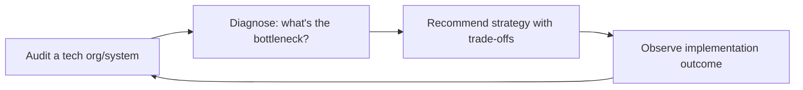

# CTO Advisor

> **Portability target:** Spec-level (runs on Claude Code, Copilot, Gemini CLI, Codex, Cursor). No vendor-specific frontmatter fields.

Strategic technology leadership: build-vs-buy decisions, engineering organization design,
architecture governance, technical due diligence, innovation management, and vendor
evaluation. Every section is a decision-making framework, not abstract advice.

## Route the Request
<!-- QUICK: 30s -- auto-route first, then intent-route -->

### Auto-Route (No User Input Required)
Evaluate these file-system conditions in order. First match wins — jump immediately.

| # | Condition | Action |
|---|-----------|--------|
| A1 | `file_contains("*", "build.vs.buy\|make.vs.buy\|build.or.buy\|procurement.decision\|vendor.selection")` AND `file_contains("*", "TCO\|cost.comparison\|5.year\|total.cost")` | This is your skill. Jump to **Decision Trees** — Build vs Buy. |
| A2 | `file_contains("*", "engineering.org\|team.structure\|team.topologies\|stream.aligned\|platform.team\|reporting.structure")` AND `file_contains("*", "hiring\|headcount\|career.ladder\|levels")` | Jump to **Core Workflow** — Phase 2: Engineering Org Design. |
| A3 | `file_contains("*", "architecture.governance\|architecture.review\|ARB\|RFC\|ADR\|decision.record")` AND `file_contains("*", "standard\|principle\|guideline\|policy")` | Jump to **Core Workflow** — Phase 3: Architecture Governance. |
| A4 | `file_contains("*", "tech.debt\|technical.debt\|refactor\|modernization\|legacy")` AND `file_contains("*", "prioritize\|principal\|interest\|cost.of.delay")` | Jump to **Decision Trees** — Tech Debt Prioritization. |
| A5 | `file_contains("*", "due.diligence\|technical.due.diligence\|acquisition\|M&A.*tech\|code.audit")` | Jump to **Core Workflow** — Phase 4: Technical Due Diligence. |
| A6 | `file_contains("*", "system.design\|microservice\|monolith\|event.driven\|C4\|architecture.pattern")` AND `file_contains("*", "scalability\|throughput\|latency\|capacity")` | Invoke **system-architect** instead. This is detailed architecture design. |
| A7 | `file_contains("*", "team.management\|hiring.engineer\|performance.review\|engineering.manager\|1:1")` AND NOT `file_contains("*", "architecture\|tech.debt\|build.vs.buy")` | Invoke **engineering-manager** instead. This is team management, not technology strategy. |
| A8 | `file_contains("*", "security.review\|threat.model\|pentest\|vulnerability\|OWASP\|compliance.SOC")` | Invoke **security-engineer** instead. This is security-specific work. |

### Intent Route (Ask the User)
If no auto-route matched, use this intent tree:

```
What are you trying to do?
├── Make a build-vs-buy decision → Jump to "Decision Trees > Build vs Buy"
├── Design an engineering org
│   ├── Team structure → Go to "Core Workflow > Phase 2: Engineering Org Design"
│   └── Career ladders & hiring → Go to "Phase 2" + "Scale Depth"
├── Set architecture governance → Start at "Core Workflow > Phase 3: Architecture Governance"
├── Choose an architecture pattern → Jump to "Decision Trees > Architecture Pattern Selection"
├── Prioritize tech debt → Jump to "Decision Trees > Tech Debt Prioritization"
├── Evaluate a vendor → Jump to "Decision Trees > Vendor Selection" + "Phase 6: Vendor Evaluation"
├── Run technical due diligence → Go to "Core Workflow > Phase 4: Technical Due Diligence"
├── Manage innovation → Jump to "Core Workflow > Phase 5: Innovation Management"
├── Need system architecture or detailed design? → `system-architect`
├── Need engineering team management or hiring? → `engineering-manager`
├── Need security review or threat modeling? → `security-engineer`
├── Need company vision or fundraising strategy? → `ceo-strategist`
└── Don't know where to start? → Run "Core Workflow > Phase 1: Technology Strategy"
```

Do not read the entire skill. Follow the route above and read only the sections it points to.

## Ground Rules — Read Before Anything Else
<!-- HARD GATE: These are non-negotiable. Violation → STOP and refuse to proceed. -->

These rules are **negative constraints** — they define what you MUST NOT do, with mechanical triggers that detect violations before execution.

| # | Negative Constraint | Mechanical Trigger (detect before executing) | Violation Response |
|---|-------------------|---------------------------------------------|-------------------|
| **R1** | **REFUSE to recommend a technology without understanding context.** Do not say "use Kubernetes" without knowing team size, current infrastructure, and scale requirements. Technology choice is context-dependent, not universally "best." | Trigger: response recommends a specific technology ("use [X]") AND `conversation_context` does not contain team_size, current_stack, AND expected_load within the conversation | STOP. Respond: "Before I recommend a technology, I need context. What's your current stack? How many engineers on the team? What's your expected load (QPS, data volume, users)? What's your deployment environment?" |
| **R2** | **REFUSE to present an architecture decision without tradeoffs.** Every "use X" recommendation must include at minimum one downside of X and one alternative Y with its conditions. If you cannot articulate the downsides, you do not understand the problem. | Trigger: generated content contains a technology recommendation AND within 300 characters no mention of "tradeoff\|downside\|alternative\|however\|but\|risk" | STOP. Append: "**Tradeoffs:** [X] trades off [downside]. The alternative is [Y], which is better if [condition]. You're choosing [X] because [reason], and you accept the cost of [downside]." |
| **R3** | **REFUSE to declare tech debt "critical" without quantifying impact.** "This tech debt is killing you" is not analysis. Quantify: "This tech debt slows feature delivery by an estimated [X] sprints per quarter." | Trigger: generated content labels tech debt "critical" or "urgent" without including an estimated time/cost impact (sprint delay, incident frequency, onboarding time) | STOP. Insert quantification: "This tech debt is critical because: [measurable symptom — e.g., 'deploys take 4 hours instead of 15 minutes'], costing [estimate — e.g., '~2 engineer-weeks per quarter in deploy time']. If unmeasurable, flag for measurement before prioritization." |
| **R4** | **DETECT and WARN when technology decisions are not tied to business outcomes.** Architecture recommendations must connect to cost, time-to-market, reliability, or team productivity. "Modern" or "best practice" are not valid justifications. | Trigger: generated content advocates for a technology using "modern" or "best practice" as the primary justification, without referencing a business metric (cost, revenue, time-to-market, reliability SLA, team velocity) | WARN. Rewrite: "Adopting [X] is expected to [business outcome: reduce cloud costs by Y%, accelerate deploy frequency from Z to W, improve uptime from A% to B%]. The cost is [migration effort, learning curve, tooling investment]." |
| **R5** | **STOP and ASK when critical architecture context is missing.** Do not assume: current scale (QPS, data volume), team expertise, deployment environment, or existing architecture constraints. Architectures designed without these are fiction. | Trigger: generating architecture recommendations that reference scale ("supports 10K QPS"), team capability ("your team can operate Kubernetes"), or environment ("deploy to AWS") without explicit confirmation of those details in the conversation | STOP. Ask: "What's your current and projected scale (QPS, data volume)? What's your team's expertise with the technologies under consideration? What's your deployment environment (AWS/Azure/GCP/on-prem)?" |
| **R6** | **DETECT and WARN when build-vs-buy analysis lacks TCO comparison.** Building in-house always looks cheaper in Year 1 and more expensive by Year 3. TCO must span 3-5 years including maintenance, onboarding, and opportunity cost. | Trigger: build-vs-buy recommendation is made without a 3-5 year TCO model covering: development cost, maintenance cost, onboarding cost for new hires, opportunity cost of engineers building commodity features | WARN. Append: "**TCO note:** In-house build likely costs [estimate] over 3 years (dev + maintenance + onboarding + opportunity cost). The vendor costs [estimate] over the same period. The crossover point is typically Year [N]. Verify these estimates with your actual engineering costs before deciding." |

## The Expert's Mindset

The CTO's job is not to pick the best technology — it's to **ensure technology serves business outcomes, to build an engineering organization that can execute, and to make technical decisions that compound positively over time**. The output is not a tech stack recommendation; the output is an engineering organization that delivers predictably at increasing scale.

### Mental Models

| Model | Description |
|---|---|
| **Technology is a means, not an end** | Every technical decision must trace to a business outcome: revenue, cost, speed, or risk reduction. If you can't draw that line, the decision is a hobby, not a strategy. |
| **Build vs. buy is a capability decision, not a cost decision** | Don't compare license cost to build cost. Compare: can you maintain this indefinitely? Does it differentiate you? Is it core to your business? Only build what differentiates. |
| **Technical debt is a financial instrument** | You're borrowing against future velocity. Like financial debt, it can be strategic (ship faster now, pay later) or reckless (no plan to repay). The CTO's job is to manage the debt portfolio. |
| **Your architecture is your org chart** | Conway's Law is real: systems mirror communication structures. If you want a different architecture, you may need a different team structure. |

### Cognitive Biases in Technology Leadership

| Bias | How It Shows Up | Defense |
|---|---|---|
| **Shiny object syndrome** | Adopting new technology because it's exciting, not because it solves a real problem | Require a written rationale: "What problem does this solve? What's the alternative? What's the migration cost? What's the exit plan?" |
| **Not-invented-here** | Building everything internally when mature solutions exist | For every build decision, ask: "Is this core to our differentiation? If not, why are we building it?" |
| **Sunk cost in technology** | Continuing to invest in a failing platform because you've already spent millions | Set explicit "migrate or kill" criteria at adoption. Review annually. |
| **Recency bias in architecture** | Over-correcting for the last incident (e.g., adding microservices everywhere after one monolith problem) | Look at 12-month patterns, not the last fire. Don't architect for the last war. |

### What Masters Know That Others Don't

- **The best CTOs say no to 90% of technology requests.** Every "yes" to a new language, framework, or service is a permanent operational cost. The default answer is: "Let's solve this with what we already have." Only say yes when the existing stack truly cannot solve the problem.
- **Hiring bar is the most compounding technical decision you make.** A great engineer hired today makes the next hire easier (they attract other great engineers). A mediocre engineer hired today makes the next hire harder. Never compromise on the bar to fill a seat faster.
- **The CTO's technical depth must evolve with scale.** At 10 people, you should be the best IC on the team. At 100 people, you should be the best architect. At 1,000 people, you should be the best organizational designer. The skills that got you here won't get you there.
- **Platform teams are underinvested.** A 5-person platform team that makes 100 engineers 20% more productive delivers the equivalent of 20 additional engineers. Most CTOs underinvest in internal platform because it's not customer-facing.

## Operating at Different Levels

CTO effectiveness is deeply tied to company stage. The skills that make a great 10-person CTO differ from what makes a great 500-person CTO.

| Level | CTO Output Characteristics |
|---|---|
| **L1 — First-time CTO** | Learns technology leadership at scale. Needs frameworks for build-vs-buy, org design, and tech debt prioritization. |
| **L2 — Seed CTO (10-30)** | Hands-on technical leader. Sets initial tech stack, hiring bar, and engineering culture. Writes code while building the team. |
| **L3 — Growth CTO (30-150)** | Manages managers. Sets architecture strategy, tech org structure, and technical due diligence for fundraising. |
| **L4 — Scale CTO (150-1000+)** | Runs a multi-hundred person engineering org. Technology vision, platform strategy, M&A technical assessment. "This is our 3-year technical direction." |
| **L5 — Industry CTO** | Defines technology philosophies adopted across the industry. Board-level technology strategy for public companies. |

**Usage**: Say "as a growth-stage CTO, help me design the engineering org for..." or calibrate by company size. Default: **Growth CTO** (30-150 engineers, managing managers).

## When to Use
<!-- QUICK: 30s -- scan the bullet list to decide if this skill fits -->
- Making build-vs-buy decisions for critical infrastructure or product components
- Designing or restructuring engineering organizations: team design, reporting structures, career ladders
- Establishing architecture governance: RFC processes, architecture review boards, decision frameworks
- Evaluating a startup's technology for investment, acquisition, or partnership
- Quantifying and prioritizing technical debt reduction
- Managing innovation: hackathons, research time, innovation funnels
- Running vendor evaluations: RFIs, RFPs, proof-of-concept design, TCO modeling

## Decision Trees
<!-- QUICK: 30s -- follow the ASCII tree to your scenario -->
### Build vs Buy
```
                     ┌────────────────────────┐
                     │ START: Build or Buy?   │
                     └───────────┬────────────┘
                                 │
              ┌──────────────────▼──────────────────┐
              │ Is this a competitive differentiator │
              │ for your core product?              │
              └────┬────────────────────┬───────────┘
                   │ YES                │ NO
                   ▼                    ▼
        ┌──────────────────┐  ┌──────────────────────┐
        │ Can you hire and │  │ Is there a mature     │
        │ retain the talent│  │ vendor with < 20%     │
        │ in-house?        │  │ market share risk?    │
        └──┬───────────┬───┘  └──┬───────────────┬────┘
           │ YES       │ NO      │ YES           │ NO
           ▼           ▼         ▼               ▼
      ┌────────┐ ┌──────────┐ ┌──────┐    ┌───────────┐
      │ BUILD  │ │BUY +     │ │ BUY  │    │ BUILD      │
      │        │ │customize │ │      │    │ (no good   │
      │        │ │wrapper   │ │      │    │  vendor)   │
      └────────┘ └──────────┘ └──────┘    └───────────┘
```
**When to BUILD:** It's core IP that creates competitive moat. Team has domain expertise. Time-to-market > 6 months is acceptable. Total cost of build < 3x annual license cost over 3 years.  
**When to BUY:** Commodity infrastructure (auth, payments, monitoring, CI/CD). Vendor switching cost is manageable (< 3 months migration). Build would divert > 30% of engineering from product work.

### Architecture Pattern Selection
```
                     ┌──────────────────────────────┐
                     │ START: Monolith or Services?  │
                     └─────────────┬────────────────┘
                                   │
              ┌────────────────────▼────────────────────┐
              │ Team size > 20 engineers?               │
              └────┬──────────────────────┬─────────────┘
                   │ YES                  │ NO
                   ▼                      ▼
        ┌──────────────────┐    ┌──────────────────────┐
        │ Do 2+ teams need │    │ Modular monolith.    │
        │ independent      │    │ Deploy as single     │
        │ deploy cadences? │    │ unit. Fast iteration.│
        └──┬───────────┬───┘    └──────────────────────┘
           │ YES       │ NO
           ▼           ▼
    ┌────────────┐ ┌──────────────┐
    │ Micro-     │ │ Monorepo     │
    │ services   │ │ with         │
    │ per domain │ │ modular      │
    └────────────┘ │ packages     │
                   └──────────────┘
```
**When to choose Microservices:** 3+ teams with independent release cycles. Different scaling requirements per component. Polyglot persistence is needed.  
**When to choose Modular Monolith:** < 20 engineers. Single deployment pipeline is adequate. Data consistency across domains is critical. Premature distribution adds latency and <!-- DEEP: 10+min -->
debugging complexity.

### Tech Debt Prioritization
```
                     ┌────────────────────────────┐
                     │ START: Prioritize tech debt │
                     └─────────────┬──────────────┘
                                   │
              ┌────────────────────▼────────────────────┐
              │ Does this debt block a critical feature │
              │ or cause > 1 SEV1/quarter?              │
              └────┬──────────────────────┬─────────────┘
                   │ YES                  │ NO
                   ▼                      ▼
        ┌──────────────────┐    ┌──────────────────────┐
        │ P0: Fix this     │    │ Does it slow feature │
        │ sprint. Allocate │    │ delivery by > 30%?   │
        │ 20% capacity.    │    └──┬───────────────┬───┘
        └──────────────────┘       │ YES           │ NO
                                   ▼               ▼
                            ┌────────────┐  ┌──────────────┐
                            │ P1: Fix    │  │ P2: Fix when │
                            │ within 4   │  │ touching the │
                            │ weeks      │  │ file anyway  │
                            └────────────┘  └──────────────┘
```
**When to fix immediately (P0):** Security vulnerability with known exploit. Data corruption risk. Prevents shipping revenue-generating feature.  
**When to defer (P2):** Legacy code that works reliably. Module slated for replacement within 6 months. No customer-facing impact.

### Vendor Selection
```
                     ┌──────────────────────────┐
                     │ START: Evaluate vendor   │
                     └───────────┬──────────────┘
                                 │
              ┌──────────────────▼──────────────────┐
              │ Does vendor SOC 2 / ISO 27001       │
              │ + serve > 100 customers at scale?   │
              └────┬────────────────────┬───────────┘
                   │ YES                │ NO
                   ▼                    ▼
        ┌──────────────────┐  ┌──────────────────────┐
        │ POC in 2 weeks:  │  │ REJECT or wait for   │
        │ test critical    │  │ maturity. Too risky   │
        │ path + failure   │  │ for production use.   │
        │ modes            │  └──────────────────────┘
        └──┬───────────────┘
           │
           ▼
    ┌──────────────────────────┐
    │ Pricing < 15% of feature │
    │ budget? Lock-in risk     │
    │ reversible in 3 months?  │
    └──┬───────────────────┬───┘
       │ YES               │ NO
       ▼                   ▼
  ┌─────────┐        ┌──────────────┐
  │ PROCEED │        │ Negotiate or │
  │         │        │ find alt     │
  └─────────┘        └──────────────┘
```
**When to proceed:** Vendor passes security review, POC succeeds on critical path, pricing fits budget, and data migration OUT is feasible.  
**When to reject:** Vendor < 2 years old with < 50 customers. No SOC 2 or equivalent. Proprietary data format with no export API. Key-person dependency (single maintainer).

## Core Workflow
<!-- QUICK: 30s -- scan phase titles to understand the process -->
### Phase 1 (~15 min): Technology Strategy

**Build vs Buy Framework:**

```
Can this be a competitive differentiator?
├── YES → Does building give us a moat that buying doesn't?
│   ├── YES → BUILD (invest heavily)
│   └── NO  → Can we customize an off-the-shelf solution?
│       └── YES → BUY + customize
│
└── NO → Is there a mature, well-supported solution available?
    ├── YES → BUY (don't reinvent the wheel)
    └── NO  → Is the market nascent but strategically adjacent?
        ├── YES → BUILD (first-mover advantage possible)
        └── NO  → WAIT (let the market mature, then buy)
```


**What good looks like:** Technology radar document published and reviewed with the engineering team — every major dependency has a clear Adopt/Trial/Assess/Hold rating with written rationale. The last 3 build-vs-buy decisions are documented with 5-year TCO, alternatives considered, and accepted tradeoffs. A new CTO can read the radar and understand why every technology choice was made within an afternoon.

**Build-vs-buy cost comparison (5-year TCO):**

| Cost Factor               | Build                     | Buy (SaaS)          |
|----------------------------|---------------------------|---------------------|
| Initial build              | 3–6 engineers × 6–12 mo  | 0                   |
| Annual maintenance         | 2–3 engineers ongoing    | Annual license      |
| Infrastructure              | Cloud + ops               | Included            |
| Opportunity cost            | Engineers NOT on product  | 0                   |
| Integration cost            | Designed for your stack   | May need adapters   |
| Upgrade/migration cost      | You own it                | Vendor-driven       |
| Vendor lock-in              | None                      | High                |
| Customization flexibility   | Unlimited                 | Limited by API/config|
| **Rule of thumb**           | Build if it IS the product| Buy everything else |

**Technology Radar:**

Maintain a living document that classifies technologies into four rings:
- **Adopt**: proven, safe, widely used — default choice (e.g., PostgreSQL, React, AWS)
- **Trial**: promising, used in production by some teams — actively evaluate (e.g., Rust for perf-critical, Temporal for workflows)
- **Assess**: worth exploring, not yet production-ready in your context — spike/experiment (e.g., WebAssembly, DuckDB)
- **Hold**: proceed with caution — legacy, deprecated, or over-hyped (e.g., MongoDB for relational data, hand-rolled auth)

**Tech Debt Quantification:**

```
Tech Debt Score = (Principal × Interest Rate) / Developer Velocity

Principal = effort to fix the debt (person-days)
Interest Rate = how much it slows down new feature development (hours/week wasted)
Developer Velocity = features shipped per sprint

Prioritization: Fix debt when Interest Rate > 5% of team velocity
                AND fixing it unblocks >20% throughput improvement

NOT all debt should be paid down. Debt that doesn't generate interest
(touch it once a year) is cheaper to carry than pay off.
```

### Phase 2 (~30 min): Engineering Org Design

**Team Topologies — four fundamental team types:**

| Team Type             | Purpose                                   | Interacts With           | Anti-Pattern               |
|-----------------------|-------------------------------------------|--------------------------|----------------------------|
| Stream-Aligned        | Deliver user value end-to-end             | Customers, other teams   | Too many dependencies      |
| Enabling              | Help stream teams overcome obstacles      | Stream-aligned teams     | Becomes ivory-tower        |
| Complicated-Subsystem | Build/maintain systems requiring deep expertise | Stream-aligned teams| Becomes bottleneck         |
| Platform              | Provide self-service infrastructure/platform | Stream-aligned teams  | Becomes ticket-driven      |

**Team size rule:** 5–9 engineers per stream-aligned team. <5: fragile. >9: coordination overhead dominates.
**Conway's Law in practice:** If you want a microservices architecture, organize as stream-aligned teams.
If you organize by function (frontend team, backend team, DB team), your architecture will reflect that.

**Engineering org scaling:**

```
1–10 engineers:  CTO writes code, no managers needed. Flat structure.
10–30:           CTO still technical; 1–2 tech leads emerge. Weekly 1:1s.
30–60:           CTO manages managers. First engineering managers (EMs).
                 Teams of 5–8. CTO spends 50% on strategy/people.
60–150:          Director/VPs emerge. CTO is 80%+ strategy, hiring, culture.
                 EMs manage teams; Directors manage EMs.
150+:            Multiple org layers. CTO is executive function.
                 Key challenge: maintaining technical coherence across orgs.
```

**Span of control:**
- Engineering Manager: 5–8 direct reports (IC engineers)
- Director: 3–5 EMs (15–40 total through chain)
- VP: 3–5 Directors
- CTO: leadership team + architecture group

**Career ladder — dual track:**

```
IC Track                     Management Track
─────────────────────────────────────────────────────
Junior Engineer              —
Engineer                     —
Senior Engineer              Engineering Manager
Staff Engineer               Senior EM
Principal Engineer           Director of Engineering
Distinguished Engineer       VP of Engineering
Fellow                       CTO / CPO
```

Both tracks must extend equally far with equivalent compensation. The worst
org design mistake: forcing engineers into management to advance.

### Phase 3 (~20 min): Architecture Governance

**RFC (Request for Comments) Process:**

```
1. Problem Statement   — What problem? Why now? What happens if we do nothing?
2. Proposed Solution   — Architecture decision with rationale.
3. Alternatives Considered — What else did you evaluate? Why rejected?
4. Trade-offs           — What do we gain? What do we lose? (Performance, complexity, cost, velocity)
5. Migration Plan       — How do we get from here to there? Rollback plan?
6. Open Questions       — What's still uncertain?

Review:
- Author circulates RFC → 5 business day comment period
- Architecture review meeting: author presents, stakeholders discuss
- Decision: Accepted / Accepted with modifications / Rejected / Needs more exploration
- Decisions documented in Architecture Decision Records (ADRs)
```

**ADR (Architecture Decision Record) template:**

```markdown
# ADR-042: Use PostgreSQL as Primary Relational Database

## Status
Accepted (2024-06-15)

## Context
We need a relational database for transactional data. Currently using
a mix of MySQL (legacy) and manual file-based storage.

## Decision
Adopt PostgreSQL as the single relational database across all services.

## Consequences
- Positive: ACID compliance, JSON support, mature ecosystem, strong community
- Negative: Team needs PG-specific training; migration from MySQL will take 3 sprints
- Risk: PG connection pooling requires PgBouncer for high-concurrency workloads
```

**Architecture Review Board (ARB):**
- Meets bi-weekly, 60 minutes
- Reviews: RFCs that cross team boundaries, new technology adoption requests, architecture departures
- Membership: Principal+ engineers, rotating attendance from each team
- **NOT** an approval bottleneck — decisions default to team autonomy unless cross-cutting

**Decision framework — when to escalate to ARB:**
- Technology choice that multiple teams will depend on
- Data model that crosses bounded contexts
- API contract that external customers will consume
- Deprecation of a widely-used internal service
- Introduction of a new programming language or paradigm

### Phase 4 (~15 min): Technical Due Diligence

**For acquisitions, investments, or major vendor decisions:**

**Code Quality Assessment (1–3 days):**
1. Clone repo; attempt to build and run locally. Time to first successful run = setup quality indicator.
2. Run static analysis: lint, complexity (cyclomatic >10 per function is a smell), test coverage
3. Manual review of 3–5 core modules: architecture coherence, naming consistency, error handling patterns
4. Check for secrets in code, hardcoded credentials, missing .gitignore
5. Dependency health: outdated packages, known CVEs, license compliance

**Architecture Assessment:**
1. Request architecture diagram — if they can't produce one, that's a finding
2. Trace a critical user journey through the system end-to-end
3. Identify single points of failure, scaling bottlenecks, data consistency patterns
4. Evaluate API design: REST/GraphQL consistency, versioning strategy, error handling
5. Assess data model: normalization, indexing, migration management

**Team Capability Assessment:**
| Signal                    | What to Look For                                         |
|---------------------------|----------------------------------------------------------|
| Bus factor                | How many people would need to be hit by a bus to halt dev? Target >3 per critical area |
| Documentation culture     | Do READMEs explain WHY and HOW? Are ADRs present?        |
| Code review practice      | Merge frequency, review depth, comments quality           |
| On-call maturity          | Runbooks, escalation paths, incident postmortems         |
| Deployment frequency      | Multiple per day = elite; weekly = medium; monthly = concern |
| Dependency on individuals | Is the CTO/tech lead the only person who understands X?  |

**Infrastructure Assessment Checklist:**
- [ ] CI/CD pipeline exists and completes in <30 minutes
- [ ] Infrastructure as Code (Terraform, Pulumi, CloudFormation) — not click-ops
- [ ] Secrets management: vault/manager, not in source code or env files
- [ ] Backups automated and tested; recovery time objective documented
- [ ] Monitoring: metrics, logs, alerts — at minimum on critical paths
- [ ] Security: dependency scanning, SAST, penetration testing cadence
- [ ] Scaling: documented auto-scaling policies; load test results from last 6 months

**Red Flags (severity-ordered):**
1. **No automated tests** → everything is legacy the day it's written
2. **Production access via SSH** → no repeatable deployments, no security boundary
3. **"The person who built this left"** → undocumented, unmaintainable systems
4. **Manual deployment process** → inconsistent, slow, error-prone
5. **No monitoring in production** → flying blind; don't know when things break
6. **Single database for everything** → scaling and coupling nightmare
7. **No code reviews** → quality rot, no knowledge sharing

### Phase 5 (~25 min): Innovation Management

**Innovation Time Allocation:**

| Activity                    | % of Engineering Time | Cadence              |
|-----------------------------|-----------------------|----------------------|
| Core product work            | 70%                   | Every sprint         |
| Technical debt + maintenance | 20%                   | Every sprint         |
| Innovation / exploration     | 10%                   | Every sprint or monthly |

**Innovation Funnel:**

```
Ideas (100) → Explore (10) → Experiment (3) → Incubate (1) → Integrate
                                            │
                                            └── Kill decisions at each gate

Gate criteria:
- Explore: aligns with strategic themes? Solves a real user problem?
- Experiment: prototype validated with 5+ users? Technical feasibility confirmed?
- Incubate: metrics show traction? Dedicated team committed?
- Integrate: absorbed by product team; becomes "core product work"
```

**Hackathon ROI:**
- **Structure**: 48 hours, cross-functional teams (eng + design + product), optional attendance
- **Theme**: tie to company strategy or customer pain points (not "build whatever")
- **Judging**: 30% innovation, 30% feasibility, 20% impact, 20% presentation
- **Outcome tracking**: 3-month follow-up: how many projects shipped to production?
- **Target**: >30% of hackathon projects ship within 6 months; <30% = either ideas aren't viable or follow-through is broken
- **Investment**: 2 days/quarter × entire eng team ≈ 2% of engineering time; cheap for the cultural and innovation ROI

### Phase 6 (~25 min): Vendor Evaluation

**RFI/RFP Process:**

```
Phase 0: Internal Alignment (before talking to vendors)
  - Document requirements: must-haves, nice-to-haves, anti-requirements
  - Define budget range internally
  - Identify decision-makers and approval process
  - Create evaluation scorecard with weighted criteria

Phase 1: RFI (Request for Information) — 5–10 vendors
  - Short questionnaire: capabilities, pricing model, SLAs, security certs
  - Eliminate obvious mismatches → narrow to 3–5

Phase 2: RFP (Request for Proposal) — 3–5 vendors
  - Detailed requirements document
  - Scored by evaluation committee against scorecard
  - Narrow to 2–3 finalists

Phase 3: Proof of Concept — 2–3 vendors
  - 2-week time-boxed PoC with real (sanitized) data
  - Test: integration effort, performance, edge cases, support quality
  - Select winner

Phase 4: Negotiation and Contract
  - Pricing: ask for multi-year discount; include termination for convenience
  - SLA: uptime guarantee, support response time, escalation path
  - Security: DPA, SOC 2 report, penetration test results, data residency
  - Exit plan: data export format, transition assistance, notice period
```

**Vendor Evaluation Scorecard:**

| Criterion                  | Weight | Vendor A | Vendor B | Vendor C |
|----------------------------|--------|----------|----------|----------|
| Feature fit (must-haves)   | 25%    | 8/10     | 7/10     | 9/10     |
| Integration effort          | 20%    | 6/10     | 8/10     | 5/10     |
| Total Cost of Ownership    | 20%    | 7/10     | 6/10     | 8/10     |
| Security & compliance       | 15%    | 9/10     | 8/10     | 7/10     |
| Vendor stability/viability  | 10%    | 7/10     | 9/10     | 6/10     |
| Support quality (from PoC)  | 10%    | 8/10     | 7/10     | 8/10     |
| **Weighted Score**          |        | **7.40** | **7.20** | **7.35** |

**Total Cost of Ownership Model (3-year):**

```
                     Year 1      Year 2      Year 3      TOTAL
License/Subscription $120,000    $150,000    $180,000    $450,000
Implementation       $80,000     $0          $0          $80,000
Integration           $40,000     $10,000     $10,000     $60,000
Training              $15,000     $5,000      $5,000      $25,000
Internal FTEs         $150,000    $150,000    $150,000    $450,000
Infrastructure        $20,000     $25,000     $30,000     $75,000
────────────────────────────────────────────────────────────────
TOTAL                $425,000    $340,000    $375,000   $1,140,000
```

**Build equivalent estimate:**
3 engineers × $180K/year × 3 years + cloud costs at $50K/year = $1,770,000
Decision: Buy ($1.14M < $1.77M) — unless this is a competitive differentiator.

**Red flags in vendor evaluation:**
- Won't provide a SOC 2 report or pen-test summary
- Pricing is "contact sales" with no transparency
- Reference customers are all in a different industry/size
- No public status page or incident history
- Product hasn't had a major release in 12+ months
- Key person dependency: "Our CTO will answer that" for every technical question


### Cross-skills Integration

This skill in a typical workflow chain:

| Step | Skill | What it produces for this skill |
|------|-------|---------------------------------|
| **Before** | ceo-strategist | Strategic vision, budget constraints, org design parameters — frames what's technically possible |
| **This** | cto-advisor | Technology strategy, build-vs-buy decisions, architecture governance, eng org design, vendor recommendations |
| **After** | system-architect | Consumes architecture decisions and governance framework to produce detailed system designs |

Common chains:
- **Tech strategy to implementation**: cto-advisor → system-architect → devops-engineer — Build-vs-buy → architecture design → infrastructure provisioning
- **Security hardening**: cto-advisor → security-engineer → devops-engineer — Risk assessment → security architecture → secure deployment
- **Vendor onboarding**: cto-advisor → cloud-architect → devops-engineer — Vendor selection → cloud integration design → deployment automation
- **Org restructure**: ceo-strategist → cto-advisor → system-architect — Org design → engineering team design → squad/tribe mapping

## Sub-Skills
<!-- QUICK: 30s -- table of deeper dives by topic -->
When this skill is invoked, drill into these specialized areas as needed:

| Sub-Skill | When to Use | Reference |
|-----------|-------------|-----------|
| `build-vs-buy` | Every major technology decision — SaaS vs internal vs open-source customization | This file — Build vs Buy Cost Analysis |
| `tech-debt-management` | Quarterly technical health assessments; startup debt vs scale-up modernization vs enterprise legacy | This file — Tech Debt ROI Calculator |
| `architecture-governance` | Designing RFC processes, architecture review boards, and decision frameworks for 5 to 500-person orgs | This file + `system-architect` skill |
| `hiring-tech-team` | First engineer → VP Engineering → CTO transitions; generalist vs specialist hiring at each stage | This file — Hiring Timeline vs Outsourcing |
| `tech-due-diligence` | Fundraising, acquisition, or enterprise sales — what investors, acquirers, and customers evaluate | `references/` (create as needed) |
| `innovation-management` | R&D allocation, hackathons, 20% time: 0→1 innovation vs incremental improvement vs disruptive bets | `references/` (create as needed) |
| `vendor-evaluation` | Selecting SaaS, cloud, and infrastructure providers with 3-year total cost of ownership modeling | This file — Build vs Buy Cost Analysis |

## Cross-Skill Coordination
<!-- QUICK: 30s -- table of who to talk to when -->
The CTO bridges business strategy and technical execution. A CTO who doesn't coordinate with product builds systems nobody wants; one who doesn't coordinate with the CEO builds systems the company can't afford.

| Upstream Skill | What You Receive | When to Involve |
|---|---|---|
| `ceo-strategist` | Strategic vision, budget constraints, fundraising status, org design parameters, hiring budget | Before annual tech strategy planning; during build-vs-buy decisions >$100K |
| `system-architect` | Architecture decision records (ADRs), system design proposals, tech stack evaluations, scalability assessments | During architecture review board meetings; before approving new platform choices |
| `engineering-manager` | Team velocity data, tech debt backlog, hiring pipeline status, capacity allocation, skill gap analysis | During quarterly engineering planning; before team restructuring |
| `security-engineer` | Threat models, vulnerability reports, SOC 2/ISO progress, incident postmortems, security roadmap | During security incident response; before customer security review commitments |
| `vp-engineering` | Cross-team dependencies, engineering OKRs, resource conflicts, delivery risk flags | During portfolio-level prioritization; before major resource reallocation |

| Downstream Skill | What You Provide | Impact of Delay |
|---|---|---|
| `ceo-strategist` | Technical feasibility assessment, engineering capacity forecast, cost of delay for tech investments, build-vs-buy recommendations | CEO commits to impossible timelines or overinvests in wrong technology |
| `vp-engineering` | Technology strategy, architecture governance framework, innovation budget, vendor evaluation results | Engineering teams operate without strategic direction — misaligned investments |
| `director-engineering` | Architecture principles, tech radar (Adopt/Trial/Assess/Hold), tech debt prioritization framework, RFC process design | Teams make inconsistent technology choices — fragmentation and duplicated effort |

### Communication Triggers — When to Proactively Notify

| Trigger | Notify | Why |
|---------|--------|-----|
| Architecture change affecting 3+ services | `system-architect`, `engineering-manager`, `vp-engineering` | Cascade analysis, migration plan, deployment coordination |
| Security incident | `ceo-strategist`, `security-engineer`, `vp-engineering`, `legal-advisor` | Incident response, disclosure obligations, root cause timeline |
| Cloud cost spike (>50% week-over-week) | `fp-and-a-analyst`, `vp-engineering`, `ceo-strategist` | Cost root cause, remediation plan, budget impact |
| Key technical hire accepted/rejected | `ceo-strategist`, `engineering-manager`, `hr-manager` | Team velocity impact, backup hiring plan |
| Major vendor contract decision (>$50K/yr) | `fp-and-a-analyst`, `ceo-strategist`, `vp-engineering` | TCO analysis, negotiation strategy, migration cost |
| Production outage > 1 hour | `ceo-strategist`, `product-strategist`, `vp-engineering`, `engineering-manager` | Customer impact, root cause, remediation timeline, postmortem schedule |
| Tech due diligence requested (investor/customer) | `ceo-strategist`, `engineering-manager`, `security-engineer` | Documentation prep, architecture review, security posture summary |
| Build vs buy decision with >$100K implication | `ceo-strategist`, `fp-and-a-analyst`, `product-strategist` | TCO model, strategic implications, timeline trade-offs |

### Escalation Path

```
Existential technical risk (data loss, security breach, extended outage)
  └── `cto-advisor` + `ceo-strategist` + `legal-advisor`. Incident commander appointed. All-hands if >4 hours.

Strategic technical decision (architecture platform choice, major build vs buy)
  └── `cto-advisor` + `system-architect` + `engineering-manager`. `ceo-strategist` informed. Decision within 2 weeks.

Tactical technical decision (tooling, framework version, CI pipeline change)
  └── `engineering-manager` handles. `cto-advisor` informed via weekly 1:1. No escalation needed.
```

## Proactive Triggers
<!-- STANDARD: 5min — scenarios where CTO should intervene BEFORE disaster -->

| Trigger | Action | Why |
|---------|--------|-----|
| Team proposes building auth/payments/email infrastructure from scratch | Intervene: "Auth, payments, and email are solved problems. Unless they are your core differentiator, buying saves 6-12 months of engineering and eliminates entire classes of security liability. Auth0/Clerk for auth, Stripe for payments, Resend/SendGrid for email. Redirect engineering effort to your moat." | Build-vs-buy errors in commoditized infrastructure are the most expensive early-stage mistakes. Building auth in-house means your team now owns OWASP auth vulnerabilities, password reset flows, MFA enrollment, session management, and SOC 2 audit scope — none of which differentiate your product |
| A team lead says "we'll refactor it later" for the third sprint in a row without tracking tech debt | Flag: "Technical debt without quantification is just wishful thinking. Model it as: principal (effort to fix) × interest rate (velocity drag per sprint). If interest exceeds 10% of team velocity, it must be scheduled. Create a tech-debt-backlog.md with principal + interest rate for each item" | Unquantified technical debt compounds silently. A 2-day refactor deferred for 8 sprints becomes a 3-week migration because the code has accumulated 12 dependent features. The interest-rate framework makes the cost visible to non-technical stakeholders |
| Engineering team growing from 8 to 15 without org structure changes | Alert: "At 8 people, everyone can talk to everyone. At 15, you need stream-aligned teams with clear ownership boundaries. Without this, you get: (1) distributed monoliths as team A accidentally breaks team B's code, (2) decision paralysis because everything needs cross-team consensus, (3) Conway's Law working against you. Define team boundaries NOW, before the next 3 hires" | Conway's Law is the silent architecture killer. Every organization that scales without intentional team boundaries produces a system architecture that mirrors its communication chaos. Fixing this retroactively requires re-architecting BOTH the org chart AND the codebase |
| CTO spending >50% of time on hands-on coding instead of strategy and people | Warn: "Your highest-leverage activities are: (1) architecture decisions that affect all teams, (2) hiring and retaining senior engineers, (3) build-vs-buy decisions with $100K+ TCO impact, (4) board/investor technology communication. Individual coding contributions at this stage have 10x less impact than a single architecture decision. Delegate the PRs; own the RFCs" | The CTO role transitions from builder to multiplier at ~10 engineers. A CTO writing features while the team lacks an architecture governance process is optimizing for personal satisfaction over organizational impact. The best CTOs write code that other engineers would never think to write — frameworks, platforms, decision records, not CRUD endpoints |
| Company evaluating 5+ SaaS tools without a vendor evaluation framework | Intervene: "Ad-hoc vendor selection leads to tool sprawl, integration nightmares, and budget overruns. Implement a weighted scorecard: (1) functional fit [30%], (2) TCO over 5 years [25%], (3) integration complexity with existing stack [20%], (4) vendor viability/roadmap [15%], (5) security/compliance posture [10%]. Every vendor over $10K/year must pass this gate" | Without a framework, vendor selection becomes a beauty contest won by the best sales team. Engineering teams end up maintaining 15 different SaaS integrations, each with its own auth, webhooks, and SLA — creating a fragile dependency chain that fails in unpredictable ways |
| No RFC process exists and architecture decisions are made in Slack threads that disappear | Flag: "Architecture decisions made in ephemeral communication channels are undiscoverable, unreviewable, and unaccountable. Implement: (1) RFC template with context, decision, alternatives considered, consequences, (2) async review period (3-5 days), (3) decision recorded as ADR in the repo. The process should be lightweight — a 2-page document, not a 20-page treatise" | The cost of a bad architecture decision isn't felt until 6-12 months later, when the person who made it may have left the company. ADRs create institutional memory. Without them, every new hire asks "why did we build it this way?" and nobody has the answer |
| Production incident occurs and there's no incident commander or escalation path | Intervene immediately: "Define: (1) incident severity levels (SEV1: customer data loss, SEV2: degraded service, SEV3: minor), (2) incident commander role rotates weekly, (3) escalation: 15min without resolution → CTO, 1hr → CEO, (4) post-mortem within 48hrs (blameless). Write this as incidents.md and share with the entire engineering team today" | Without an incident process, every outage becomes a scramble where the loudest person directs the response. Blameless post-mortems separate system failures from individual mistakes. Companies without incident processes either over-escalate (CEO paged for a partial CDN outage) or under-escalate (data breach goes unreported for 72 hours) |

## Best Practices
<!-- STANDARD: 3min -- rules extracted from production experience -->
- **Build what differentiates, buy everything else**: your engineering talent should work on things that create competitive advantage. Auth? Buy. Payments? Buy. Your secret sauce? Build.
- **Team design dictates architecture**: if you want loosely coupled services, create loosely coupled teams. Conway's Law is not negotiable.
- **Architecture decisions are reversible or irreversible**: reversible decisions (language choice within a service) → delegate to team. Irreversible decisions (database choice for core data, API contracts) → review broadly.
- **Technical debt is a financial instrument**: taken wisely, it accelerates delivery. Taken recklessly, it bankrupts velocity. Use the interest-rate framework.
- **Innovation doesn't happen by accident**: ring-fence time, create the funnel, celebrate shipping (not just building).
- **The best vendor evaluation is a working PoC**: RFP documents lie. Two weeks of integration reveals more than six months of sales calls.

## Anti-Patterns
<!-- DEEP: 5min -- each anti-pattern includes machine-detectable patterns -->

| ❌ Anti-Pattern | ✅ Do This Instead | 🔍 Detect (grep / lint) | 🛡️ Auto-Prevent |
|-----------------|---------------------|--------------------------|-------------------|
| Hiring 10 junior engineers to "scale the team faster" with only 1 senior to mentor them — the senior becomes a full-time teacher and nothing ships | Hire 1 senior engineer instead of 3 juniors. Senior engineers are 10x more productive AND make everyone around them better. Ratio: maintain at least 1:2 senior-to-junior. Below that, junior engineers plateau because they have nobody to learn from | `grep -rn "junior\|entry.level\|new.grad" hiring-plan.md \| wc -l` → compare to `grep -rn "senior\|staff\|principal" hiring-plan.md \| wc -l` → if junior ≥ 3× senior count, ratio is inverted | Template: `templates/hiring-plan.md` — enforces senior:junior ratio ≤ 1:2 with validation check |
| Choosing technology based on Hacker News popularity or "Google uses it so we should too" without evaluating fit for YOUR scale | Google-scale problems need Google-scale solutions. Your 10K-user SaaS does not need Kubernetes, Kafka, or a service mesh. Choose boring technology that matches your current scale × 10. PostgreSQL + monolith gets you to 1M users faster than microservices | `grep -rn "Google uses\|Netflix uses\|Amazon uses\|HN says\|Hacker News" --include="*.md" \| grep -v "counter.example\|don't do this"` → finds tech choices justified by big-tech association | ADR template: `templates/adr.md` — requires "Scale Requirement" and "Team Expertise" sections before "Technology Choice" |
| Allowing every team to choose their own programming language — resulting in 5 languages across 15 engineers, with zero code reuse and impossible cross-team mobility | Standardize on 2-3 languages max: one primary backend (Go/TypeScript/Python), one primary frontend (TypeScript), one for data/ML if needed (Python). Language diversity is a tax on hiring, tooling, libraries, and cross-team support. Your 15-person company is not Google | `find . -name "*.go" -o -name "*.ts" -o -name "*.py" -o -name "*.java" -o -name "*.rb" -o -name "*.rs" -o -name "*.kt" \| sed 's/.*\.//' \| sort \| uniq -c \| sort -rn` → if unique language count > 3 for team < 30 engineers, diversity tax is active | Pre-commit hook: `scripts/check-language-count.sh` — warns if new language introduced without ADR |
| Building a platform team before you have 3+ stream-aligned teams that are all solving the same infrastructure problems | Platform teams solve duplication across multiple stream teams. If you only have 1-2 stream teams, the platform IS the stream team. Premature platform teams build abstractions nobody asked for. Wait until 3+ teams are independently solving the same CI/CD, monitoring, or deployment problem | `grep -rn "platform.team\|platform.engineering\|IDP\|internal.developer.platform" org-chart.md` → if platform team exists AND `grep -c "stream.aligned\|product.team\|feature.team" org-chart.md` < 3, platform team is premature | Org design template: `templates/org-design.md` — requires stream-aligned team count before platform team section appears |
| Treating all technical debt as "we need to schedule a refactor sprint" — the refactor sprint never happens, and when it does, it's a big-bang rewrite that breaks everything | Technical debt repayment happens incrementally: every sprint dedicates 15-20% capacity to debt reduction. The "refactor sprint" is a fantasy — product will never give you a full sprint. Ship 80% features + 20% debt reduction continuously | `grep -rn "refactor.sprint\|cleanup.sprint\|tech.debt.sprint\|dedicated.week" --include="*.md"` → finds the refactor-sprint fantasy in planning docs | Sprint template: `templates/sprint-plan.md` — enforces 15-20% capacity allocation to tech debt with visible backlog items |
| Making all architecture decisions in a weekly 2-hour ARB meeting where 15 people debate microservices boundaries — decisions take weeks and nobody owns the outcome | ARB should be: (1) async RFC reviews as default, (2) 30-min sync meeting ONLY for decisions that are truly blocking, (3) single DRI for each decision, (4) decisions default to team autonomy unless cross-cutting. The ARB's job is to prevent bad decisions, not to make all decisions | `grep -rn "ARB\|architecture.review.board\|weekly.*meeting.*architect" --include="*.md" \| grep -c "weekly\|2.hour\|biweekly"` → if ARB meeting > 30 min or weekly, it's a bottleneck | ARB charter template: `templates/arb-charter.md` — caps sync meetings at 30 min biweekly, defaults to async RFC |
| Outsourcing the "boring" parts (auth, payments, email) to the most junior engineer because "it's not interesting work" — resulting in security vulnerabilities in the authentication flow | Critical infrastructure must be owned by the most experienced engineers. Auth is the highest-security surface in your application. Payments errors lose real money. Assign these to senior engineers or buy them from vendors who specialize in them full-time | `grep -rn "auth\|authentication\|payment\|billing" --include="*.ts" --include="*.js" -l \| xargs grep -l "junior\|intern\|new.grad"` → finds auth/payment code owned by junior engineers | Ownership registry: `templates/service-ownership.md` — requires senior+ engineer assigned to auth, payments, and security-critical services |

## Scale Depth: Solo → Small → Medium → Enterprise

### Solo (1 person, 0-100 users)
- **What changes**: You are the CTO + every engineer. Build-vs-buy = buy everything (Auth0, Supabase, Vercel). Tech debt is intentional — ship fast. No governance needed. Hiring = none yet.
- **What to skip**: Architecture review boards. RFC processes. Technology radars. Tech due diligence. Vendor scorecards (just use what works).
- **Coordination**: You talk to yourself. Document decisions in a `decisions.md` file.

### Small Team (2-10 people, 100-10K users)
- **What changes**: First engineering hires (generalists). Start build-vs-buy analysis for core infra. Lightweight ADRs for key decisions. Quarterly tech debt assessment. Simple tech radar (Adopt/Hold). Vendor evaluation for 2-3 critical services.
- **What to skip**: Formal ARB. Dual-track career ladder (too early). Platform team (stream-aligned teams are enough). Innovation funnel (just do hackathons).
- **Coordination**: Weekly eng sync (30 min). Monthly tech strategy review with CEO. Bi-weekly 1:1s. ADRs in shared repo.

### Medium Team (10-50 people, 10K-1M users)
- **What changes**: VP Engineering hired. Team Topologies emerge (stream-aligned + platform). Formal ARB with monthly cadence. RFC process for cross-cutting decisions. Technology radar reviewed quarterly. Dual-track career ladder. Innovation time (10-20% Fridays). Tech due diligence for enterprise deals.
- **What to skip**: Dedicated innovation team (embed in streams). Multi-year technology roadmaps (6-month rolling is enough). Full-time developer experience team.
- **Coordination**: ARB monthly. RFCs async in shared repo. Quarterly tech strategy review with board. Monthly skip-level 1:1s.

### Enterprise (50+ people, 1M+ users)
- **What changes**: CTO + VPs for each pillar. Multiple platform teams. ARB with formal voting. Enterprise architecture function. Compliance-driven governance (SOC 2, FedRAMP). Technology radar + lifecycle management. Dedicated DevEx team. M&A technical due diligence capability. Patent/IP strategy.
- **What's full production**: Architecture governance board with cross-BU representation. Annual technology strategy with board sign-off. Formal build-vs-buy with procurement partnership. Innovation lab + corporate venture arm.
- **Coordination**: ARB bi-weekly. Quarterly CTO council. Annual architecture summit. Board technology committee.

### Transition Triggers
- **Solo → Small**: You can't ship fast enough alone. First eng hire needed to maintain velocity. >100 active users.
- **Small → Medium**: Coordination overhead between 3+ teams becomes painful without process. First enterprise customer asks about architecture governance.
- **Medium → Enterprise**: Multiple business units need technology alignment. IPO or large M&A on horizon. SOC 2/ISO 27001 audit required.


### War Story 1 — The Kubernetes Migration That Consumed a Year
**Symptom:** A 15-engineer startup decided to migrate from Heroku to Kubernetes to "prepare for scale." The migration took 12 months instead of the planned 3. During that time, zero new features shipped. Two competitors launched and captured market share.
**Root cause:** The CTO chose a "modern" infrastructure stack without assessing team readiness. No one had production K8s experience. The team spent 6 months learning K8s, 4 months fighting YAML drift, and 2 months debugging networking issues.
**Fix:** Adopted a "simplest infrastructure that works" policy: use managed services (Railway, Render, or single-region ECS) until the team has dedicated DevOps headcount and >10K RPS per service. K8s only when you have 3+ engineers with K8s production experience.
**Lesson:** Infrastructure decisions are team-readiness decisions, not architecture decisions. The cost of complexity isn't just the migration — it's the opportunity cost of every feature not shipped during the migration.

### War Story 2 — The Build-Vs-Buy Decision That Cost $2M
**Symptom:** A Series B company decided to build its own identity and authorization system because "auth is core to our product." Eighteen months and 6 engineers later, the system still had gaps (no SSO, flaky MFA, no audit logging) and was blocking enterprise deals.
**Root cause:** The "build vs buy" analysis compared license cost ($120K/yr for Auth0) against 6 months of engineering time ($540K). But it ignored ongoing maintenance, security compliance, and the opportunity cost of not having enterprise features.
**Fix:** Adopted a strict triage: build only what creates competitive advantage. Auth, payments, monitoring, and CI/CD are always buy. The engineering time "saved" by buying pays for itself in faster feature delivery.
**Lesson:** Build-vs-buy analysis must include 5-year TCO, maintenance burden, security compliance cost, and opportunity cost of delayed features. If it's not a competitive differentiator, buy it.

### War Story 3 — The Database That Became the Single Point of Failure
**Symptom:** A team built their entire product on MongoDB because "schemas are flexible and it's faster to iterate." At 50K users, queries that took 5ms became 5-second nightmares. Data inconsistencies caused customer-facing bugs weekly.
**Root cause:** The CTO chose MongoDB for its developer experience without understanding the data access patterns. The product was deeply relational (users, orders, payments, subscriptions) — exactly what MongoDB was not designed for.
**Fix:** Migrated to PostgreSQL using a carefully planned backfill strategy. The 6-month migration was painful, but query performance improved 100x and data consistency issues disappeared entirely.
**Lesson:** Choose your database based on data access patterns, not developer convenience. Relational data belongs in PostgreSQL. The cost of migrating databases in production is 10-100x the cost of choosing right the first time.


## Error Decoder
<!-- DEEP: 5min -- each entry includes a console-string matcher for automatic recovery loops -->

| 🖥️ Console Match (grep pattern) | Symptom | Root Cause | Fix | 🔄 Auto-Recovery Loop |
|---|---|---|---|---|
| `Error: build.vs.buy.*paralysis\|decision.deferred.*months\|vendor.eval.*stalled` + `grep -rn "build.vs.buy\|make.vs.buy\|TCO" *.md \| wc -l` shows > 20 mentions with no decision logged | 6 months evaluating 5 vendors for an auth provider. Engineering team built a prototype, product evaluated 3 alternatives, and the decision is still "we need more data." $80K in engineering time spent evaluating a $15K/year vendor | The build-vs-buy process had no decision deadline. Every new data point triggered another evaluation cycle. Without a time-boxed decision framework, analysis becomes a substitute for action — and engineering time burns silently | Time-box: 2 weeks for build-vs-buy with hard deadline. Week 1: gather requirements, define evaluation criteria. Week 2: score options, make decision. If decision cannot be made, the default is BUY (outsource non-core). Post-decision: set a 6-month review checkpoint with success/failure criteria | 1. Find all open build-vs-buy threads: `grep -rn "build.vs.buy\|evaluating\|vendor.selection" *.md` 2. For each > 2 weeks old without decision: close with default=BUY 3. Create decision log: `scripts/log-build-vs-buy.sh` — records decision, deadline, and review date 4. Alert: if any build-vs-buy analysis > 14 days old, auto-escalate to CTO |
| `Error: senior.attrition\|engineer.turnover.*> 20%\|quit.*3 months` + `grep -rn "senior.*ratio\|junior.*count\|headcount" org-chart.md` shows junior:senior > 3:1 | 3 senior engineers quit in 6 months. Exit interviews: "I spend 80% of my time mentoring and code-reviewing juniors. I haven't written a line of interesting code in 8 months." Remaining seniors now carry 4:1 ratio and 2 more are interviewing | The team was hiring juniors (cheaper headcount) without maintaining senior mentorship capacity. Senior burnout from mentorship overload is predictable: when ratio exceeds 2:1, senior engineers convert to full-time teachers and lose their own career growth. They leave for companies where they can build | Freeze junior hiring until senior:junior ≤ 1:2. Convert 2 junior headcount slots to 1 senior slot. Implement mentorship rotation: no senior mentors more than 2 juniors per quarter. Track time allocation in 1:1s — if any senior reports > 50% time on mentorship, redistribute load | 1. Check ratio: `grep -c "senior\|staff\|principal" team.md` vs `grep -c "junior\|associate\|entry" team.md` 2. If junior > 2× senior: freeze junior hiring immediately 3. Survey seniors: "What % of your time is mentorship vs building?" → alarm if > 40% 4. Implement: `scripts/senior-load-monitor.sh` — alerts if any senior has > 2 active mentorship assignments |
| `Error: language.count.*> 3\|polyglot.tax\|cross.team.mobility.*zero` + `grep -rn "\.go\|\.ts\|\.py\|\.java\|\.rb\|\.rs\|\.kt" --include="*.md" \| sort \| uniq` shows 5+ languages for team < 30 | Feature that should take 1 sprint is in sprint 4. "We're waiting for the Go team to expose an endpoint, then the Python team needs to add a data transform, then the TypeScript team consumes it." 3 teams, 3 languages, 3 PRs for what should be 1 change in a monorepo | Language proliferation without governance. Each team chose their language independently — "right tool for the job" without considering the integration tax. Every cross-team feature now requires multi-language coordination, different CI pipelines, different testing frameworks, different on-call runbooks | Standardize on MAX 3 languages company-wide with an ADR. For any new language: ADR required, approved by CTO, with migration plan for affected services. Existing polyglot: identify the 2 languages to sunset, create 12-month migration roadmap. Cost of polyglot: 30% slower cross-team velocity, 2× onboarding time | 1. Audit: `find . -name "*.go" -o -name "*.ts" -o -name "*.py" -o -name "*.java" -o -name "*.rb" \| sed 's/.*\.//' \| sort \| uniq -c \| sort -rn` 2. If unique languages > 3: flag 2 for sunset 3. Create ADR: `scripts/adr-language-standard.md` — define allowed languages and sunset timeline 4. Check: every new service must use approved language (pre-commit hook) |
| `Error: platform.team.*no.adoption\|IDP.*abandoned\|internal.tool.*nobody.uses` + `grep -rn "platform.team\|IDP\|internal.developer" org-chart.md` AND `grep -c "stream.aligned" org-chart.md` < 3 | Platform team spent 6 months building a deployment pipeline. Zero stream teams adopted it — they built their own in 2 weeks because the platform team didn't understand their workflows. Platform team now exists to maintain tools nobody uses | Platform team was created before there were enough stream-aligned teams to generate real requirements. The platform was built based on assumptions ("developers need X") rather than observed duplication across teams ("3 teams independently built the same CI script — let's extract that") | Pause platform team roadmap. Embed 1 platform engineer per stream team for 4 weeks to observe real workflows. Only build abstractions that address duplication observed across ≥ 2 teams. Measure success by stream team adoption, not platform team output. If no adoption in 90 days, disband the platform team | 1. Check: `grep -c "stream.aligned\|product.team" org-chart.md` → if < 3, platform team is premature 2. Survey stream teams: "What platform tooling do you actually use?" → if < 50% adoption, pause roadmap 3. Embed: assign platform engineers to stream teams for observation 4. Reassess at 90 days: adopt or disband |
| `Error: tech.debt.*growing\|velocity.*declining\|lead.time.*increasing` + `grep -rn "refactor.sprint\|cleanup.sprint\|tech.debt.week" *.md` AND `grep -rn "tech.debt.*allocation\|20%\|15%\|capacity.*debt" *.md` returns 0 | Sprint velocity down 60% from 6 months ago. "We just need one refactor sprint" has been said every quarter for 2 years. The refactor sprint keeps getting pushed by "urgent" features, and each feature takes longer to build on the growing debt pile | Tech debt is being managed as a one-time cleanup event ("the refactor sprint") rather than continuous maintenance. This is equivalent to "we'll exercise for 2 weeks and be fit forever." Debt compounds daily — a 2-week refactor sprint cannot undo 2 years of accumulated shortcuts | Convert to capacity allocation: 20% of every sprint dedicated to debt reduction with visible debt backlog items. Track debt-reduction story points alongside feature story points. If debt allocation drops below 15% for 2 consecutive sprints, escalate to CTO. No exceptions — product roadmap adjusts to accommodate | 1. Audit: `grep -rn "refactor.sprint\|cleanup.week" *.md` → if found, replace with capacity allocation 2. Check: `grep -rn "capacity.*debt\|allocation.*debt\|20%\|15%" sprint-plan.md` → must show explicit % 3. Implement: sprint template enforces 15-20% debt allocation 4. Alert: if 2 consecutive sprints < 15% debt allocation, escalate |
| `Error: vendor.lockin\|migration.impossible\|proprietary.trap` + `grep -rn "vendor.*lock\|proprietary\|single.vendor\|sole.source" *.md` shows no exit strategy documented | Company is 3 years into a proprietary PaaS. Migrating would cost $500K+ and 12 months. The vendor raised prices 40% this year — there's no alternative because the architecture is coupled to vendor-specific APIs. The CTO who chose it left 18 months ago | Vendor evaluation focused on features and price, not exit cost. Every vendor relationship eventually ends (acquisition, price hike, shutdown). Without an exit strategy at selection time, the cost of leaving grows with every integration. By Year 3, migration cost exceeds the original build cost | Document exit strategy at vendor selection time: (1) data export format and API, (2) migration cost estimate updated annually, (3) abstraction layer between vendor API and business logic, (4) annual vendor review with "would we choose this vendor today?" question. If answer is "no" for 2 consecutive years, fund migration | 1. Audit vendors: `grep -rn "vendor\|SaaS\|managed.service" architecture.md \| sort \| uniq` 2. For each: verify exit strategy doc exists at `docs/vendors/[name]-exit-plan.md` 3. Annual review: `scripts/vendor-health-check.sh` — scores vendors on lock-in risk 4. If lock-in score > 7/10 AND "would we choose again?" = no: fund migration in next budget cycle |


## What Good Looks Like

> You've just completed the CTO advisory exercise. Your technology radar is current and every team knows which technologies are Adopt, Trial, Assess, or Hold — nobody is stealth-adopting MongoDB "because the tutorial used it." Your build-vs-buy decisions include 5-year TCO comparisons, not just license costs. Technical debt is quantified as principal × interest rate, and the CFO understands why "refactoring the auth layer" has a positive ROI. Your engineering org uses stream-aligned teams with clear ownership boundaries, and Conway's Law is working for you rather than against you. The RFC process catches architecture mistakes before they cost sprints, not after.


## Production Checklist
<!-- QUICK: 30s -- binary pass/fail items. Each has a mechanical validation command. -->

| ID | Checklist Item | Validation Command | Auto-Fix |
|----|---------------|-------------------|----------|
| **[S1]** | Build-vs-buy evaluations documented with 5-year TCO comparison for all major infrastructure/procurement decisions | `grep -rn "TCO\|total.cost.*ownership\|5.year\|build.vs.buy.decision" *.md` → must find TCO model with development + maintenance + opportunity cost over 5 years | Template: `templates/build-vs-buy-tco.xlsx` — 5-year model with sensitivity analysis |
| **[S2]** | Technology radar maintained and reviewed quarterly; every technology categorized (Adopt/Trial/Assess/Hold) | `grep -rn "technology.radar\|tech.radar\|Adopt\|Trial\|Assess\|Hold" tech-radar.*` → must find current radar with > 0 technologies AND last review < 90 days ago | `npx create-tech-radar` — generates `tech-radar.json` with quarterly review reminder |
| **[S3]** | Technical debt quantified (principal × interest rate) and prioritized in sprint planning | `grep -rn "tech.debt.*principal\|debt.*interest\|debt.*cost" sprint-plan.md` → must find quantified debt items with cost-of-delay | Sprint template: `templates/sprint-plan.md` — enforces 15-20% debt allocation |
| **[S4]** | Engineering org design: stream-aligned teams with clear ownership; platform team exists only if > 3 stream teams | `grep -c "stream.aligned\|product.team\|feature.team" org-chart.md` → must be ≥ 1; if platform team exists, stream teams must be ≥ 3 | Org design template: `templates/org-design.md` — validates stream team count before platform team |
| **[S5]** | Dual-track career ladder with equivalent levels and compensation for IC and management tracks | `grep -rn "IC.track\|individual.contributor\|dual.track\|staff.engineer\|principal" career-ladder.md` → must find both IC and management paths at equivalent levels | Template: `templates/career-ladder.md` — dual columns for IC and management |
| **[S6]** | RFC process documented and adopted; ADRs archived for all significant architecture decisions | `ls docs/adr/ 2>/dev/null \| wc -l` → must have > 0 ADRs; `grep -rn "RFC\|request.for.comment" CONTRIBUTING.md` → must find RFC process documented | Template: `templates/adr.md` + `templates/rfc-template.md` |
| **[S7]** | ARB meets regularly; decisions default to team autonomy unless cross-cutting | `grep -rn "ARB\|architecture.review.board" arb-charter.md` → must find charter with: async RFC default, 30-min sync max, DRI per decision | Template: `templates/arb-charter.md` — caps sync at 30 min biweekly |
| **[S8]** | Technical due diligence framework: code quality, architecture, team capability, infrastructure checklists | `grep -rn "due.diligence\|tech.due.diligence\|code.audit\|architecture.review" *.md` → must find checklist with ≥ 4 categories | Template: `templates/tech-due-diligence.md` — scored checklist with red/yellow/green |
| **[S9]** | Innovation funnel with clear gates and metrics; hackathon projects tracked to production | `grep -rn "innovation\|hackathon\|idea.funnel\|prototype.*track" *.md` → must find funnel stages with gate criteria | Template: `templates/innovation-funnel.md` — Ideate → Prototype → Incubate → Integrate |
| **[S10]** | Vendor evaluation scorecard with weighted criteria; TCO model for all major vendors | `grep -rn "vendor.scorecard\|vendor.evaluation\|weighted.criteria" vendors/` → must find scored evaluation per vendor with exit strategy | Template: `templates/vendor-scorecard.md` — weighted criteria + exit plan required |

## Footguns
<!-- DEEP: 10+min — war stories from the CTO trenches -->

| Footgun | What Happened | Root Cause | How to Prevent |
|---------|---------------|------------|----------------|
| Recommended MongoDB for a fintech ledger because "NoSQL scales horizontally" — 18 months later, every transaction reconciliation ran as a 14-table join in application code | A CTO chose MongoDB for a payments platform processing $4.2M/month. The data was inherently relational: accounts, transactions, disputes, refunds, fees — every report joined 6+ collections in Node.js. Month 14: a regulator audit required a point-in-time balance for every account on March 31. The query took 47 seconds and OOM-killed the pod twice. Migration to PostgreSQL took 4 months and cost $380K in engineering time. | "NoSQL" was chosen for scale, not data model fit. The transactions table contained nested arrays of line items — MongoDB's document model made reporting across documents brutally slow. No one asked: "What queries will we actually run?" | **Pick the database that matches your query patterns, not the one with the best conference talks.** If your data has foreign keys, use a relational database. Ask: "Will we ever need to JOIN across entities in a query?" If yes, that's a relational problem. When evaluating NoSQL, write the top 10 queries you'll need — if any require aggregation across collections, it's the wrong choice. |
| Authorized a $500K 3-year AWS Reserved Instance commitment to get 40% discount — the workload was an EKS cluster that got refactored to Lambda 9 months later | CTO signed an AWS EDP to hit a savings target for the board. The commitment was for EC2 Reserved Instances on the assumption that the Kubernetes migration would take 18+ months. The new platform team refactored the monolith to Lambda + DynamoDB in 9 months. EC2 spend dropped from $42K/month to $3K/month — but the commitment was still $14K/month for another 27 months. Total waste: $297K. | Committing to infrastructure that the architecture strategy was actively planning to replace. The CTO approved the EDP without checking the platform team's migration timeline. Savings were calculated against current spend, not projected spend. | **Never commit to infrastructure contracts longer than your architecture runway.** If your platform team has a 12-month migration plan, your commitment horizon is 12 months max. Model 3 spend scenarios before signing: (1) current architecture, (2) migration complete, (3) hybrid. Pick the commitment that's still optimal under ALL three. Share the EDP with the platform team lead and ask: "Will this still make sense in 12 months?" |
| Built an OAuth2 + RBAC system from scratch because "Auth0 costs $2/user/month and we'll have millions of users" — 2 years, $620K in engineering, still not SOC 2 certified | A CTO decided to build authentication in-house after calculating that Auth0's enterprise plan would cost $240K/year at projected scale. The build took 8 months for v1, then another 16 months adding MFA, SSO, audit logging, session management, and passwordless login. Enterprise customers needed SOC 2 — the homegrown auth couldn't produce audit-ready access logs. Sales lost 3 deals worth $1.8M because "no SOC 2 certification." The engineering cost alone exceeded 5 years of Auth0 licensing. | Underestimating the total cost of an auth system. Authentication looks simple — a login endpoint and a JWT — but enterprise auth is MFA, SAML/OIDC, brute-force protection, device fingerprinting, session revocation, audit trails, and compliance certification. These aren't features, they're an entire product. | **Buy authentication unless it IS your product.** If you're not selling an auth platform, don't build one. The question isn't "what does Auth0 cost?" — it's "what does it cost to build and MAINTAIN enterprise-grade auth for 5+ years?" Estimate: 3 engineers × $180K × 5 years = $2.7M, plus compliance costs. Auth0's $240K/year looks cheap. Use a TCO model and assume 40% scope creep on the build estimate. |
| Greenlit a "microservices from day one" architecture for a 7-person startup — deployment complexity consumed 35% of sprint velocity for the first 9 months | CTO at a seed-stage company mandated: each domain gets its own service with separate repo, CI/CD pipeline, and database. The team of 7 engineers now maintained 14 services. A simple "user adds item to cart" flow spanned 3 services with async messaging, retry logic, and distributed tracing. Every deploy required coordinating schema changes across 3 databases. The CTO had previously worked at a 400-person company where microservices made sense. | Premature distribution — applying big-company patterns to small-team realities. Microservices solve organizational scaling, not technical scaling. With 7 engineers, the communication overhead between services exceeded the coordination cost of a monolith. The team spent more time on infrastructure than on features. | **Match architecture to team size, not ambition.** Rule of thumb: 1 service per 4–7 engineers. A 7-person team should have 1–2 services. When you hit 30 engineers, split into 3–4 services. Ask: "Can one engineer deploy and debug a feature end-to-end without coordinating with another team?" If yes, you don't need microservices yet. Write an ADR documenting the trigger that would justify splitting a service — and don't split until that trigger fires. |
| Skipped technical due diligence on an acqui-hire — 5 months post-acquisition, 5 of 7 engineers quit because their equity didn't accelerate and they were "retention bonus" hires | CTO championed acquiring a 9-person AI startup for $4.5M cash + $3M earnout. The deal was framed as "acqui-hire for the ML team." Due diligence verified the code, IP, and cap table — but nobody checked individual employment agreements. Post-acquisition: acqui-hire engineers discovered their earnout was 3-year cliff (no acceleration on termination), their equity was common stock, and their roles were demoted from "head of" to "senior IC." Five resigned within 90 days. The IP transfer was valid but the team — the entire reason for the deal — evaporated. | Due diligence only looked at assets, not people. The acqui-hire thesis was "buy the team" but the integration plan treated them as interchangeable engineers. No one asked: "What would make these specific people stay?" | **People diligence is harder than code diligence.** For acqui-hires: interview every engineer individually without their CEO present. Ask: "What's the one thing that would make you leave in the first 90 days?" Review compensation — if their equity is underwater or on a slow vest, fix it before closing. Structure earnouts with single-trigger acceleration (change of control = full vest). Assign them a sponsor on your side who's responsible for retention — and tie that sponsor's bonus to 12-month retention. |

## Calibration — How to Know Your Level
<!-- STANDARD: 3min — honest self-assessment rubric -->

Use this to diagnose where you actually are, not where you want to be.

| You Know You're Stuck at L1 When... | You Know You've Reached L2 When... | You Know You're L3 When... |
|---|---|---|
| Your build-vs-buy analysis is "we can build that in a weekend" without a TCO model or maintenance estimate | Every major technology decision has a documented ADR with options considered, trade-offs, and a 3-year TCO comparison that the CFO can audit | Your technology strategy survives 3 years — the architecture choices you made at 20 engineers still hold at 200 engineers, and the build-vs-buy calls you made saved more than they cost |
| You recommend the technology you're most excited about, not the one that best fits the team's capabilities | You can walk into an engineering org you've never seen, interview 10 engineers over 2 days, and produce a 5-page assessment that the existing CTO says "nailed it" | A board brings you in to evaluate whether to replace the CTO, and 18 months after your recommendation (keep or replace), the company's engineering velocity doubled |
| You inherit technical decisions without documenting the rationale — so every new engineer questions "why did we pick this?" | ADRs are archived, searchable, and referenced in onboarding. When someone suggests a technology change, the first response is "check the ADR for context" | Vendors you rejected 3 years ago cite your feedback as the reason they changed their product roadmap — and you'd now recommend them |

**The Litmus Test:** Can you walk into a company you know nothing about, interview 5 engineers and the CEO in 4 hours, and produce a 1-page assessment identifying the top 3 technology risks? If you need more than 4 hours or can't name 3 risks with specific evidence from the interviews, you're not L3 yet.

## Deliberate Practice

Great CTOs develop their judgment through structured exposure to technology and organizational problems across different contexts.



| Level | Practice Routine | Frequency |
|---|---|---|
| **Novice** | Study a public company's engineering blog and write a one-page analysis of their tech strategy | Weekly |
| **Competent** | Do a mock build-vs-buy analysis for a realistic scenario | Monthly |
| **Expert** | Conduct a real org health assessment: team topology, delivery metrics, tech debt inventory | Quarterly |
| **Master** | Advise a portfolio company or startup through a strategic inflection point | Annually |

**The One Highest-Leverage Activity**: Audit one team's entire tech stack end-to-end each month — from CI/CD to production monitoring. Write a one-page assessment: what's working, what's the bottleneck, what should change in the next quarter. Share with the team lead.

## References
<!-- QUICK: 30s -- links to deeper reading -->
- Team Topologies (Skelton & Pais): https://teamtopologies.com/
- Accelerate (Forsgren, Humble, Kim): https://itrevolution.com/product/accelerate/
- Architecture Decision Records: https://adr.github.io/
- Build vs Buy (a16z): https://a16z.com/build-vs-buy/
- Technical Due Diligence Checklist (YC): https://www.ycombinator.com/blog/technical-due-diligence/
- ThoughtWorks Technology Radar: https://www.thoughtworks.com/radar
- Conway's Law: https://martinfowler.com/bliki/ConwaysLaw.html
