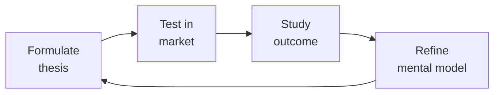

# Idea to Spec
> **Portability target:** Spec-level (runs on Claude Code, Copilot, Gemini CLI, Codex, Cursor). No vendor-specific frontmatter fields.

Systematically decompose a raw product idea into a complete, implementation-ready specification package — PRD, domain model, API surface, screen inventory, and prioritized work items — so that an engineering team can estimate and build without ambiguity.

## Route the Request

<!-- QUICK: 30s -- auto-route first, then intent-route -->

### Auto-Route (No User Input Required)
Evaluate these file-system conditions in order. First match wins — jump immediately.

| # | Condition | Action |
|---|-----------|--------|
| A1 | `file_contains("*.md", "PRD\|spec\|scope.brief\|product.requirement")` AND `file_contains("*.md", "user.story\|acceptance.criteria\|GIVEN.*WHEN.*THEN")` | This is your skill. Jump to **Core Workflow** — Phase 2 (Specification Writing). |
| A2 | `file_exists("openapi.yaml\|openapi.json")` OR `file_contains("*.md", "endpoint\|REST\|GraphQL\|gRPC\|API.contract")` | Jump to **Core Workflow** — Phase 3 (API Design & Contract Generation). |
| A3 | `file_contains("*.md", "screen\|UI\|component\|interaction\|wireframe\|mockup")` AND `file_contains("*.md", "state\|loading\|empty\|error\|edge")` | Jump to **Core Workflow** — Phase 4 (Screen Inventory & Interaction Definitions). |
| A4 | `file_contains("*.md", "data.model\|entity\|schema\|relationship\|ERD")` AND `file_contains("*.md", "access.pattern\|query\|index")` | Invoke **database-designer** instead. This requires schema design expertise. |
| A5 | `file_contains("*.md", "prioritize\|RICE\|backlog\|feature.ranking")` | Invoke **product-manager** instead. This is backlog prioritization work. |
| A6 | `file_contains("*.md", "persona\|user.research\|journey.map\|usability.test")` | Invoke **ux-researcher** instead. This is user research territory. |
| A7 | `file_contains("*.md", "design.system\|component.spec\|design.token\|UI.component")` | Invoke **ui-ux-designer** instead. This is design system work. |
| A8 | `file_contains("*.md", "architecture\|microservice\|monolith\|C4\|system.design")` | Invoke **system-architect** instead. This is architecture design territory. |

### Intent Route (Ask the User)
If no auto-route matched, use this intent tree:

```
What are you trying to do?
├── New product ideation (greenfield, napkin sketch) → Start at "Core Workflow > Phase 1"
├── Feature specification or PRD writing → Jump to "Core Workflow > Phase 2"
├── API design and contract generation → Go to "Core Workflow > Phase 3"
├── Screen inventory and interaction definitions → Jump to "Core Workflow > Phase 4"
├── User story mapping and work breakdown → Go to "Core Workflow > Phase 5"
├── Stakeholder asks for a formal spec before sprint planning → Jump to "Decision Trees > Spec Depth Decision"
├── Need feature prioritization or backlog grooming? → `product-manager`
├── Need user research or persona validation? → `ux-researcher`
├── Need system architecture design or service boundaries? → `system-architect`
├── Need UI components or design handoff? → `ui-ux-designer`
└── Don't know where to start? → Start at Phase 1 (Discovery & Scoping)
```

Do not read the entire skill. Follow the route above and read only the sections it points to.

## Ground Rules — Read Before Anything Else

<!-- HARD GATE: These are non-negotiable. Violation → STOP and refuse to proceed. -->

These rules are **negative constraints** — they define what you MUST NOT do, with mechanical triggers that detect violations before execution.

| # | Negative Constraint | Mechanical Trigger (detect before executing) | Violation Response |
|---|-------------------|---------------------------------------------|-------------------|
| **R1** | **REFUSE to write a spec without a validated problem statement.** Every spec must begin with: (1) the problem, (2) who has it, (3) evidence it's worth solving. Specs that start with solutions are solutions in search of problems. | Trigger: spec content begins with a solution description ("Add a button that...", "Build a feature that...") without a preceding "Problem:", "User Need:", or "Why:" section within the first 200 characters | STOP. Respond: "Before I write the spec, I need the problem: (1) What problem are you solving? (2) Who has this problem and how do you know? (3) What user evidence supports this (interviews, analytics, support tickets)? Without a validated problem, the spec is a solution looking for a problem." |
| **R2** | **REFUSE to define only the happy path.** Every screen, API endpoint, and user flow must define loading, empty, error, and edge-case states. The happy path is ~20% of the spec; the other 80% is everything that can go wrong. | Trigger: spec contains screen/flow definitions where loading, empty, and error states are not mentioned within 10 lines of the primary state definition | STOP. Insert state checklist before proceeding: "For each interaction: define the Loading state (what user sees while waiting), Empty state (what user sees with no data), Error state (what user sees on failure with recovery action), and Edge case (concurrency, permissions, data limits)." |
| **R3** | **REFUSE to include implementation details in the spec.** "Use Redis", "Build in React", "Deploy on Kubernetes" are engineering decisions, not spec requirements. The spec describes WHAT, not HOW. | Trigger: spec contains technology-specific implementation directives (`use [technology]`, `build in [framework]`, `deploy on [platform]`) within requirement descriptions | STOP. Rewrite as outcome: "Cache query results with configurable TTL" not "Use Redis with 300s TTL." Engineering owns implementation choices; the spec owns the behavioral contract. |
| **R4** | **DETECT and WARN when acceptance criteria are not testable.** "User can reset password" is not testable. GIVEN/WHEN/THEN format with measurable outcomes is the minimum standard. | Trigger: user story acceptance criteria uses verbs without measurable outcomes: "works", "can", "able to", "supports" without a GIVEN/WHEN/THEN structure | WARN. Rewrite each: "'User can reset password' → 'GIVEN a registered user on the login page, WHEN they click Forgot Password and enter their email, THEN a reset link is sent within 60 seconds AND the user sees a confirmation message.'" |
| **R5** | **DETECT and WARN when the "Out of Scope" section is missing.** Without explicit non-goals, every conversation during implementation becomes a scope negotiation under time pressure. | Trigger: spec does not contain an "Out of Scope", "Non-Goals", or "What We're NOT Building" section | WARN. Insert: "**Out of Scope (explicitly NOT in this spec):** [list items stakeholders have mentioned but are deferred]. This section is a pre-agreed contract — when scope tries to expand during build, point here." |
| **R6** | **DETECT and WARN about unmapped dependencies.** Every external dependency (other team, service, API, vendor) must have an owner name, team, committed date, and fallback plan. | Trigger: spec mentions an external dependency ("Needs [service]", "Depends on [team]", "Requires [API]") without specifying: owner, team, committed date, AND fallback within 3 lines | WARN. Append dependency table: "\| Dependency \| Owner \| Team \| Committed Date \| Fallback if Late \|" with a row for each unmapped dependency. |

## The Expert's Mindset

Master idea to specs understand that strategy is not about predicting the future — it's about **being less wrong than the competition, faster**.

| Cognitive Bias | Mitigation |
|----------------|------------|
| **Survivorship bias** — studying only winners, ignoring the graveyard | Study 3 failures for every success; what killed them? |
| **Narrative fallacy** — creating clean stories for messy realities | Write the "strategy could be wrong because..." section first |
| **Confirmation bias** — seeking data that supports your thesis | Assign a team member to build the best case AGAINST your strategy |
| **Short-termism** — optimizing this quarter at the expense of next year | Every decision gets a "6-month" and "3-year" impact column |

### What Masters Know That Others Don't
- **The bottleneck is always one thing.** Find it. Fix it. Then find the next one.
- **Strategy = what you say NO to.** If your strategy doesn't exclude anything, it's not a strategy.
- **Timing beats brilliance.** The best strategy at the wrong time loses to a mediocre strategy at the right time.

### When to Break Your Own Rules
- **Bet the company when the asymmetry is right.** If downside = $1M and upside = $1B, the math doesn't care about your process.
- **Ignore the data when you're creating a new category.** By definition, there's no data for something that doesn't exist yet.

## Operating at Different Levels

| Level | Scope | You... |
|-------|-------|--------|
| **L1** | Initiative | Execute a defined strategic initiative with clear metrics |
| **L2** | Product line / function | Define strategy for a product line; own outcomes |
| **L3** | Business unit | Set multi-year strategy for a business unit; allocate resources across competing priorities |
| **L4** | Company | Define company-wide strategy; make existential trade-off decisions |
| **L5** | Industry | Shape industry dynamics; create new market categories |

**Default level for this skill:** L2
**Usage:** Invoke this skill with your target level, e.g., "as an L3 idea to spec, develop..."

For full level definitions, see `skills/00-framework/skill-levels/SKILL.md`.

## When to Use

<!-- QUICK: 30s -- scan the bullet list to decide if this skill fits -->
- A stakeholder has a one-paragraph idea and needs a formal spec before sprint planning
- A feature request lacks technical detail (data shapes, API endpoints, error states)
- You need to evaluate feasibility and surface unknowns before committing to a roadmap
- A greenfield product needs its first structured artifact beyond a pitch deck
- An existing system needs a net-new module and someone must bootstrap the design doc

## Decision Trees

<!-- QUICK: 30s -- follow the ASCII tree to your scenario -->
### Spec Depth Decision

```
Feature complexity?
├── Simple CRUD (1 screen, 1 entity) → Lightweight spec (Scope Brief + API contract)
│     Time: 2-4 hours. No formal PRD. User stories in issue tracker.
├── Moderate feature (3-5 screens, multi-entity) → Full spec (PRD + API + Screen Inventory)
│     Time: 1-3 days. Include state machines for key entities. Async RFC review.
└── Platform-level (cross-team, 10+ screens) → Heavy spec (PRD + Domain Model + API + Screen + Architecture)
      Time: 1-2 weeks. Architecture review board sign-off required.

Greenfield product? → Start with Scope Brief. Spec only the first slice.
Adding to existing system? → Focus on API contract and screen inventory. Domain model reference only.
```

### Specification Tooling

```
Solo/Small team? → Notion/Google Docs with OpenAPI snippets. Keep it simple.
Medium team? → Notion + dedicated OpenAPI tool (Stoplight/SwaggerHub). RFC in doc comments.
Enterprise? → Spec management platform (Notion/Confluence + Jira integration). Automated validation.

**What good looks like:** The output opens correctly in the target tool. All validations pass. No placeholder content remains.

```

## Core Workflow

<!-- QUICK: 30s -- scan phase titles to understand the process -->
### Phase 1 (~15 min): Discovery & Scoping
Extract the core problem, target persona, and success criteria from the raw input. Use the Five Whys to drill past solution proposals to root needs. Document explicit non-goals — what the feature deliberately excludes. Identify assumptions and unknowns that need validation before writing code. Output a one-page **Scope Brief** that captures: Problem Statement, Target Users, Success Metrics (leading and lagging), Scope Boundaries (in/out), and Open Questions with owners.

### Phase 2 (~30 min): Domain Modeling
Identify entities, their attributes, relationships, and cardinalities. Favor composition over deep inheritance. Define state machines for entities with lifecycle transitions. Annotate each entity with: required vs. optional fields, validation rules, uniqueness constraints, and indexing strategy. Produce an **Entity Relationship Diagram** (textual or visual) and a **Data Dictionary** with one row per field. For each relationship, specify ownership direction and cascade behavior.

### Phase 3 (~20 min): API Design
For every operation identified in the scope brief, define: HTTP method, URL path, request body schema (JSON/Protobuf), query parameters, response body schema, and error codes for every failure mode. Group endpoints by resource. Define pagination, sorting, and filtering conventions uniformly. Specify authentication and authorization per endpoint. Document idempotency guarantees. Output an **OpenAPI 3.1 spec** snippet or equivalent **API Contract** document.

### Phase 4 (~15 min): Screen & Interaction Inventory
List every screen, modal, drawer, or stateful view the feature requires. For each screen: name the route, list data dependencies (which API calls fire on mount), define loading, empty, error, and edge-case states, and enumerate all user actions with their system responses. Produce a **Screen Inventory** table and wireframe descriptions. Include accessibility requirements per screen (heading hierarchy, focus management, ARIA landmarks).

### Phase 5 (~25 min): Work Item Breakdown
Slice the spec into vertically deliverable user stories. Each story must be independently shippable and demonstrable. Write stories in the `As a [role], I want [action], so that [value]` format with concrete acceptance criteria. Sequence stories by dependency and value-to-effort ratio. Tag each story with a t-shirt size estimate for early capacity planning. Output a **Story Map** ordered by priority.

## Cross-Skill Coordination

<!-- QUICK: 30s -- table of who to talk to when -->
Converting an idea into a spec is inherently collaborative — it synthesizes product intent, design thinking, and engineering reality. A spec written in isolation produces three things: rework, frustration, and missed deadlines.

| Upstream Skill | What You Receive | When to Involve |
|---|---|---|
| `product-manager` | Prioritized backlog, RICE scores, user stories, success metrics, stakeholder constraints | During feature kickoff; before scope trade-off decisions |
| `ux-researcher` | User personas, journey maps, research findings, mental models, task flows, pain point evidence | Before writing acceptance criteria; when user flow ambiguity exists |
| `system-architect` | Architecture constraints, service boundaries, API conventions, data flow direction, performance budgets | When designing new services or cross-service features; before API contract design |

| Downstream Skill | What You Provide | Impact of Delay |
|---|---|---|
| `api-designer` | Endpoint inventory, request/response schemas, error codes, idempotency requirements, pagination needs | API contracts are inconsistent — integration bugs and rework |
| `frontend-developer` | Screen inventory with loading/empty/error/edge states, interaction specs, accessibility requirements | Devs discover edge cases mid-sprint — missed deadlines |
| `backend-developer` | Domain model, data dictionary, business rules, validation logic, performance requirements | Business logic gaps found during implementation — sprints slip |
| `database-designer` | Entity relationship diagram, access patterns, data volume projections, consistency requirements | Schema must be reworked after implementation — data migrations cascade |

### Communication Triggers — When to Proactively Notify

| Trigger | Notify | Why |
|---------|--------|-----|
| Scope change after spec approved | `product-manager`, `engineering-manager`, `qa-engineer` | Sprint replanning, capacity reallocation, timeline impact |
| API contract change during spec | `api-designer`, `frontend-developer`, `backend-developer`, `qa-engineer` | Contract versioning, mock updates, test case changes |
| New dependency discovered (external service, data pipeline) | `system-architect`, `backend-developer`, `product-manager` | Integration complexity, timeline risk, architectural review |
| Ambiguity in acceptance criteria flagged by QA | `product-manager`, `engineering-manager` | Clarification needed before implementation proceeds |
| Cross-team dependency identified late | `product-manager`, `system-architect` | Dependency sequencing, parallelization opportunities, blocker resolution |
| Performance requirement exceeds known system capacity | `system-architect`, `backend-developer` | Architecture review, caching strategy, load testing plan |

### Escalation Path

```
Spec blocked (unresolved ambiguity, missing stakeholder, scope conflict)
  └── `product-manager` + `engineering-manager`. Resolution within 24 hours or escalation to `cto-advisor`.

Architecture conflict (spec requires pattern that violates architecture principles)
  └── `system-architect` + `cto-advisor`. Decision documented as ADR. Spec updated or exception granted.

Cross-team dependency deadlock (two teams block each other)
  └── `product-manager` + engineering leads of both teams. `cto-advisor` breaks ties if unresolved in 48 hours.
```

## Proactive Triggers

| Trigger | Action | Why |
|---------|--------|-----|
| Idea description is too vague ("make it better," "improve UX") with no concrete user problem | Ask clarifying questions: "What user behavior change do you want to see?" and "What does success look like numerically?" Refuse to write spec until problem is defined in one sentence | Vague ideas produce vague specs. A spec built on an undefined problem will be rejected by engineering, QA, and users — the cost of clarifying upfront is 10 minutes; the cost of rewriting a spec is 2 weeks |
| No non-functional requirements mentioned (performance, security, accessibility, compliance) | Proactively ask: "What's the P95 latency budget? Are there regulatory constraints? Does this need to work offline?" Add NFRs section before declaring spec complete | NFRs discovered mid-implementation cause the worst kind of rework — architecture-level changes. Every missing NFR in the spec is a potential sprint derailment |
| No mobile or responsive consideration in a consumer-facing feature spec | Flag "mobile-first" design requirement. Ask: "What happens at 320px? What gestures are expected? Is offline mode needed?" Add responsive behavior to screen inventory | 60%+ of consumer traffic is mobile. Designing desktop-first and retrofitting mobile produces clunky experiences and missed launch dates — handle viewport strategy in the spec, not in the bug tracker |
| No API contract mentioned when cross-service communication is required | Propose OpenAPI spec generation as part of the spec deliverable. Coordinate with `api-designer` to define endpoints, request/response schemas, error codes, and idempotency requirements | API contract ambiguity is the #1 cause of integration bugs. A spec without an API contract is a wish, not a plan — frontend and backend teams will build against different assumptions |
| Acceptance criteria use "works," "functional," or "complete" as completion signal | Replace all vague criteria with GIVEN/WHEN/THEN format. Reject any story that can't be validated by QA without asking clarifying questions | "Works" means 10 different things to 10 different engineers. Measurable acceptance criteria are the contract between product intent and engineering delivery — without them, QA is guessing |
| Spec mentions a dependency on another team's service/API without a named contact or date | Map all external dependencies with owner name, team, expected availability date, and fallback plan. Flag to `product-manager` if any dependency has no committed date | An unmapped dependency is a delayed launch. Every external team needs a named contact and a timeline — otherwise the spec is planning around assumptions, not commitments |
| Feature spec doesn't reference any user research or data that justifies the feature | Ask: "What user evidence supports this feature? Is there a pain point severity rating, support ticket count, or churn signal?" If none exists, flag to `ux-researcher` for validation sprint before full spec | Features built without evidence become shelfware. A 2-day validation sprint costs far less than a 2-month build of something nobody needs |
| No entity relationship model when feature touches database schema | Coordinate with `database-designer` to produce ERD, data dictionary, access patterns, and cardinality rules. Add to spec appendix | Schema decisions made by individual engineers without coordination create data inconsistencies that take quarters to untangle. Spec-level data modeling prevents migration cascades |

## What Good Looks Like

> Every requirement traces back to a user interview, analytics event, or support ticket — there are no orphan features that "seemed like a good idea.

> See [references/what-good-looks-like.md](references/what-good-looks-like.md) for the full quality standard.

## Deliberate Practice



| Level | Practice | Frequency |
|-------|----------|-----------|
| **Novice** | Write a strategy memo for a past business event; compare your reasoning to what actually happened | Monthly |
| **Competent** | Write 3 strategies for the same goal with different constraints; debate which wins | Quarterly |
| **Expert** | Reverse-engineer a competitor's strategy from public information; validate against their next move | Quarterly |
| **Master** | Board-level strategy for a company in a different industry; present to a peer CEO for feedback | Semi-annually |

**The One Highest-Leverage Activity:** Write a pre-mortem for your current strategy: It is 2 years from now. Our strategy failed. Why?

## Gotchas

- **Building without a spec costs 2-3x in rework.** When engineers start coding from a Slack message or a 3-bullet ticket, they guess at edge cases, data models, and error states. Each rework cycle costs 50-200% of the original build — a $50K feature becomes a $100K-$150K feature. A 2-day spec sprint costs ~$4K in PM + engineering time and prevents $50K-$500K in rework. **Total cost: $50K-$500K per underspecified feature.** Never greenlight engineering without at minimum: data model, API contract, and error-state handling defined.
- **Scope creep without change control bleeds $10K-$100K/month.** Every "quick addition" — "can we also add sorting?", "what about export to CSV?" — adds 1-3 days of engineering + QA per request. Five unplanned additions per sprint = 5-15 extra engineering days per sprint. At a $200K fully-loaded engineer, that's $4K-$12K per sprint in unbudgeted scope. **Total cost: $10K-$100K/month in delayed release and over-budget work.** Gate every addition through a change control: "We can add this — what existing item should we deprioritize to make room?"
- **Wrong spec depth wastes money in both directions.** An over-spec with 40 pages of UI mockups and interaction states costs $20K-$50K in design time for a feature that engineering will inevitably adapt during implementation. An under-spec with "build a dashboard" costs $50K-$200K when engineering discovers 15 missing requirements mid-build. **Total cost: $20K-$200K depending on which extreme you land on.** Match spec depth to complexity: simple CRUD (3-5 pages), integration-heavy feature (8-12 pages + API contract), platform capability (15+ pages + architecture review).
- **Missing API contract in the spec guarantees integration rework.** When frontend and backend teams interpret "the user endpoint returns profile data" differently, you discover the mismatch during integration testing — after both teams have "finished." Fixing contract mismatches costs $15K-$50K in rework for a medium-complexity feature. **Total cost: $15K-$50K per feature without a shared API contract.** Always include an OpenAPI/GraphQL schema in the spec and validate it with a mock server before any code is written — the contract is the spec's single source of truth.
- **Skipping non-functional requirements in the spec until implementation.** When performance targets, security requirements, and scalability ceilings are absent from the spec, engineering optimizes for functional correctness only. A feature that works on a developer's laptop crumbles under real load, fails a penetration test two weeks before launch, or can't scale past 100 concurrent users. Retrofitting caching layers, database sharding, or auth rewrites post-implementation costs 5-10x more than designing for them upfront. **Total cost: $30K-$150K per feature requiring architectural retrofit for missing NFRs.** Include explicit NFR sections in every spec: performance (p95 latency, throughput), security (auth model, data classification, threat assumptions), and scalability (concurrent users, data volume, growth rate over 12 months).
- **"Blueprint" that's 40 pages of prose** — the engineering team doesn't read it. They skim the data model diagram and the API contract, then start coding. A spec that isn't consumed isn't a spec. Structure for SKIM → DIVE: 1-page executive summary (decisions), entity-relationship diagram (structure), OpenAPI spec (contract). Details in appendices.
- **"Build a dashboard with these 15 metrics"** — the spec describes WHAT to display, not WHERE the data comes from. Engineering discovers that 7 of the 15 metrics require data from a system that doesn't have an API. Spec must include DATA PROVENANCE: "Metric X comes from the billing system via `GET /invoices`, field `total`."
- **Success criteria that can't be verified until launch** — "Users will love the new workflow" — you won't know until it ships. Success criteria must include pre-launch proxies: "In usability testing, 8/10 users complete the workflow in < 3 minutes without assistance." Verifiable before code freeze.

## Verification

- [ ] Executive summary: 1 page — decisions, not details (details in appendices)
- [ ] Data provenance: every data element traced to source system and endpoint
- [ ] API contract: OpenAPI/GraphQL schema validated (can generate a mock server from it)
- [ ] Data model: ER diagram with all entities, relationships, and key fields labeled
- [ ] Success criteria: pre-launch proxies defined — verifiable before code freeze
- [ ] Stakeholder sign-off: Engineering, Design, and Product have reviewed and approved

## References

Detailed reference material loaded on demand:

- **Anti-Patterns**: See [anti-patterns.md](references/anti-patterns.md)
- **Best Practices**: See [best-practices.md](references/best-practices.md)
- **Calibration — How to Know Your Level**: See [calibration.md](references/calibration.md)
- **Production Checklist**: See [checklist.md](references/checklist.md)
- **Error Decoder**: See [error-decoder.md](references/error-decoder.md)
- **Footguns**: See [footguns.md](references/footguns.md)
- **Scale Depth: Solo → Small → Medium → Enterprise**: See [scale-depth.md](references/scale-depth.md)
- **Sub-Skills**: See [sub-skills.md](references/sub-skills.md)

