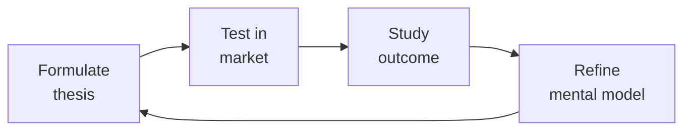

# Idea to Spec

Systematically decompose a raw product idea into a complete, implementation-ready specification package — PRD, domain model, API surface, screen inventory, and prioritized work items — so that an engineering team can estimate and build without ambiguity.

## Route the Request
<!-- QUICK: 30s -- pick your path, skip the rest -->
```
What are you trying to do?
├── New product ideation (greenfield, napkin sketch) → Start at "Core Workflow > Phase 1"
├── Feature specification or PRD writing → Jump to "Core Workflow > Phase 2"
├── API design and contract generation → Go to "Core Workflow > Phase 3"
├── Screen inventory and interaction definitions → Jump to "Core Workflow > Phase 4"
├── User story mapping and work breakdown → Go to "Core Workflow > Phase 5"
├── Stakeholder asks for a formal spec before sprint planning → Jump to "Decision Trees > Spec Depth Decision"
├── Need feature prioritization or backlog grooming? → `product-manager`
├── Need user research or persona validation? → `ux-researcher`
├── Need system architecture design or service boundaries? → `system-architect`
├── Need UI components or design handoff? → `ui-ux-designer`
└── Don't know where to start? → Start at Phase 1 (Discovery & Scoping)
```
Do not read the entire skill. Follow the route above and read only the sections it points to.

## Ground Rules — Read Before Anything Else

These rules apply to *every* response this skill produces.

- **Never invent requirements without user research.** Every requirement must cite a validation source (user interview, analytics, support ticket, stakeholder confirmation). Do: "Based on 12 support tickets and 3 user interviews, the search filter needs date-range support." Don't: "Users probably want date-range filtering."
- **Every spec needs a validation source.** Scope brief items must trace back to a problem statement, success metric, or user need. No orphan features.
- **Don't estimate without engineering input.** T-shirt sizes are directional only — never commit a timeline without an engineer reviewing the spec. Do: share the spec async with engineering for a 48-hour review window before committing. Don't: "This is a 3-day feature."
- **Always define non-goals before happy paths.** The "Out of Scope" section prevents scope creep more than any other artifact.
- **Admit what you don't know.** If user research is missing, analytics data unavailable, or technical constraints unknown, say so and tell the user to consult ux-researcher or the engineering team before proceeding.


## The Expert's Mindset

Master idea to specs understand that strategy is not about predicting the future — it's about **being less wrong than the competition, faster**.

| Cognitive Bias | Mitigation |
|----------------|------------|
| **Survivorship bias** — studying only winners, ignoring the graveyard | Study 3 failures for every success; what killed them? |
| **Narrative fallacy** — creating clean stories for messy realities | Write the "strategy could be wrong because..." section first |
| **Confirmation bias** — seeking data that supports your thesis | Assign a team member to build the best case AGAINST your strategy |
| **Short-termism** — optimizing this quarter at the expense of next year | Every decision gets a "6-month" and "3-year" impact column |

### What Masters Know That Others Don't
- **The bottleneck is always one thing.** Find it. Fix it. Then find the next one.
- **Strategy = what you say NO to.** If your strategy doesn't exclude anything, it's not a strategy.
- **Timing beats brilliance.** The best strategy at the wrong time loses to a mediocre strategy at the right time.

### When to Break Your Own Rules
- **Bet the company when the asymmetry is right.** If downside = $1M and upside = $1B, the math doesn't care about your process.
- **Ignore the data when you're creating a new category.** By definition, there's no data for something that doesn't exist yet.
## Operating at Different Levels

| Level | Scope | You... |
|-------|-------|--------|
| **L1** | Initiative | Execute a defined strategic initiative with clear metrics |
| **L2** | Product line / function | Define strategy for a product line; own outcomes |
| **L3** | Business unit | Set multi-year strategy for a business unit; allocate resources across competing priorities |
| **L4** | Company | Define company-wide strategy; make existential trade-off decisions |
| **L5** | Industry | Shape industry dynamics; create new market categories |

**Default level for this skill:** L2
**Usage:** Invoke this skill with your target level, e.g., "as an L3 idea to spec, develop..."

For full level definitions, see `skills/00-framework/skill-levels/SKILL.md`.

## When to Use
<!-- QUICK: 30s -- scan the bullet list to decide if this skill fits -->
- A stakeholder has a one-paragraph idea and needs a formal spec before sprint planning
- A feature request lacks technical detail (data shapes, API endpoints, error states)
- You need to evaluate feasibility and surface unknowns before committing to a roadmap
- A greenfield product needs its first structured artifact beyond a pitch deck
- An existing system needs a net-new module and someone must bootstrap the design doc

## Decision Trees
<!-- QUICK: 30s -- follow the ASCII tree to your scenario -->
### Spec Depth Decision

```
Feature complexity?
├── Simple CRUD (1 screen, 1 entity) → Lightweight spec (Scope Brief + API contract)
│     Time: 2-4 hours. No formal PRD. User stories in issue tracker.
├── Moderate feature (3-5 screens, multi-entity) → Full spec (PRD + API + Screen Inventory)
│     Time: 1-3 days. Include state machines for key entities. Async RFC review.
└── Platform-level (cross-team, 10+ screens) → Heavy spec (PRD + Domain Model + API + Screen + Architecture)
      Time: 1-2 weeks. Architecture review board sign-off required.

Greenfield product? → Start with Scope Brief. Spec only the first slice.
Adding to existing system? → Focus on API contract and screen inventory. Domain model reference only.
```

### Specification Tooling

```
Solo/Small team? → Notion/Google Docs with OpenAPI snippets. Keep it simple.
Medium team? → Notion + dedicated OpenAPI tool (Stoplight/SwaggerHub). RFC in doc comments.
Enterprise? → Spec management platform (Notion/Confluence + Jira integration). Automated validation.

**What good looks like:** The output opens correctly in the target tool. All validations pass. No placeholder content remains.

```

## Core Workflow
<!-- QUICK: 30s -- scan phase titles to understand the process -->
### Phase 1 (~15 min): Discovery & Scoping
Extract the core problem, target persona, and success criteria from the raw input. Use the Five Whys to drill past solution proposals to root needs. Document explicit non-goals — what the feature deliberately excludes. Identify assumptions and unknowns that need validation before writing code. Output a one-page **Scope Brief** that captures: Problem Statement, Target Users, Success Metrics (leading and lagging), Scope Boundaries (in/out), and Open Questions with owners.

### Phase 2 (~30 min): Domain Modeling
Identify entities, their attributes, relationships, and cardinalities. Favor composition over deep inheritance. Define state machines for entities with lifecycle transitions. Annotate each entity with: required vs. optional fields, validation rules, uniqueness constraints, and indexing strategy. Produce an **Entity Relationship Diagram** (textual or visual) and a **Data Dictionary** with one row per field. For each relationship, specify ownership direction and cascade behavior.

### Phase 3 (~20 min): API Design
For every operation identified in the scope brief, define: HTTP method, URL path, request body schema (JSON/Protobuf), query parameters, response body schema, and error codes for every failure mode. Group endpoints by resource. Define pagination, sorting, and filtering conventions uniformly. Specify authentication and authorization per endpoint. Document idempotency guarantees. Output an **OpenAPI 3.1 spec** snippet or equivalent **API Contract** document.

### Phase 4 (~15 min): Screen & Interaction Inventory
List every screen, modal, drawer, or stateful view the feature requires. For each screen: name the route, list data dependencies (which API calls fire on mount), define loading, empty, error, and edge-case states, and enumerate all user actions with their system responses. Produce a **Screen Inventory** table and wireframe descriptions. Include accessibility requirements per screen (heading hierarchy, focus management, ARIA landmarks).

### Phase 5 (~25 min): Work Item Breakdown
Slice the spec into vertically deliverable user stories. Each story must be independently shippable and demonstrable. Write stories in the `As a [role], I want [action], so that [value]` format with concrete acceptance criteria. Sequence stories by dependency and value-to-effort ratio. Tag each story with a t-shirt size estimate for early capacity planning. Output a **Story Map** ordered by priority.

## Cross-Skill Coordination
<!-- QUICK: 30s -- table of who to talk to when -->
Converting an idea into a spec is inherently collaborative — it synthesizes product intent, design thinking, and engineering reality. A spec written in isolation produces three things: rework, frustration, and missed deadlines.

| Upstream Skill | What You Receive | When to Involve |
|---|---|---|
| `product-manager` | Prioritized backlog, RICE scores, user stories, success metrics, stakeholder constraints | During feature kickoff; before scope trade-off decisions |
| `ux-researcher` | User personas, journey maps, research findings, mental models, task flows, pain point evidence | Before writing acceptance criteria; when user flow ambiguity exists |
| `system-architect` | Architecture constraints, service boundaries, API conventions, data flow direction, performance budgets | When designing new services or cross-service features; before API contract design |

| Downstream Skill | What You Provide | Impact of Delay |
|---|---|---|
| `api-designer` | Endpoint inventory, request/response schemas, error codes, idempotency requirements, pagination needs | API contracts are inconsistent — integration bugs and rework |
| `frontend-developer` | Screen inventory with loading/empty/error/edge states, interaction specs, accessibility requirements | Devs discover edge cases mid-sprint — missed deadlines |
| `backend-developer` | Domain model, data dictionary, business rules, validation logic, performance requirements | Business logic gaps found during implementation — sprints slip |
| `database-designer` | Entity relationship diagram, access patterns, data volume projections, consistency requirements | Schema must be reworked after implementation — data migrations cascade |

### Communication Triggers — When to Proactively Notify

| Trigger | Notify | Why |
|---------|--------|-----|
| Scope change after spec approved | `product-manager`, `engineering-manager`, `qa-engineer` | Sprint replanning, capacity reallocation, timeline impact |
| API contract change during spec | `api-designer`, `frontend-developer`, `backend-developer`, `qa-engineer` | Contract versioning, mock updates, test case changes |
| New dependency discovered (external service, data pipeline) | `system-architect`, `backend-developer`, `product-manager` | Integration complexity, timeline risk, architectural review |
| Ambiguity in acceptance criteria flagged by QA | `product-manager`, `engineering-manager` | Clarification needed before implementation proceeds |
| Cross-team dependency identified late | `product-manager`, `system-architect` | Dependency sequencing, parallelization opportunities, blocker resolution |
| Performance requirement exceeds known system capacity | `system-architect`, `backend-developer` | Architecture review, caching strategy, load testing plan |

### Escalation Path

```
Spec blocked (unresolved ambiguity, missing stakeholder, scope conflict)
  └── `product-manager` + `engineering-manager`. Resolution within 24 hours or escalation to `cto-advisor`.

Architecture conflict (spec requires pattern that violates architecture principles)
  └── `system-architect` + `cto-advisor`. Decision documented as ADR. Spec updated or exception granted.

Cross-team dependency deadlock (two teams block each other)
  └── `product-manager` + engineering leads of both teams. `cto-advisor` breaks ties if unresolved in 48 hours.
```

## Proactive Triggers

| Trigger | Action | Why |
|---------|--------|-----|
| Idea description is too vague ("make it better," "improve UX") with no concrete user problem | Ask clarifying questions: "What user behavior change do you want to see?" and "What does success look like numerically?" Refuse to write spec until problem is defined in one sentence | Vague ideas produce vague specs. A spec built on an undefined problem will be rejected by engineering, QA, and users — the cost of clarifying upfront is 10 minutes; the cost of rewriting a spec is 2 weeks |
| No non-functional requirements mentioned (performance, security, accessibility, compliance) | Proactively ask: "What's the P95 latency budget? Are there regulatory constraints? Does this need to work offline?" Add NFRs section before declaring spec complete | NFRs discovered mid-implementation cause the worst kind of rework — architecture-level changes. Every missing NFR in the spec is a potential sprint derailment |
| No mobile or responsive consideration in a consumer-facing feature spec | Flag "mobile-first" design requirement. Ask: "What happens at 320px? What gestures are expected? Is offline mode needed?" Add responsive behavior to screen inventory | 60%+ of consumer traffic is mobile. Designing desktop-first and retrofitting mobile produces clunky experiences and missed launch dates — handle viewport strategy in the spec, not in the bug tracker |
| No API contract mentioned when cross-service communication is required | Propose OpenAPI spec generation as part of the spec deliverable. Coordinate with `api-designer` to define endpoints, request/response schemas, error codes, and idempotency requirements | API contract ambiguity is the #1 cause of integration bugs. A spec without an API contract is a wish, not a plan — frontend and backend teams will build against different assumptions |
| Acceptance criteria use "works," "functional," or "complete" as completion signal | Replace all vague criteria with GIVEN/WHEN/THEN format. Reject any story that can't be validated by QA without asking clarifying questions | "Works" means 10 different things to 10 different engineers. Measurable acceptance criteria are the contract between product intent and engineering delivery — without them, QA is guessing |
| Spec mentions a dependency on another team's service/API without a named contact or date | Map all external dependencies with owner name, team, expected availability date, and fallback plan. Flag to `product-manager` if any dependency has no committed date | An unmapped dependency is a delayed launch. Every external team needs a named contact and a timeline — otherwise the spec is planning around assumptions, not commitments |
| Feature spec doesn't reference any user research or data that justifies the feature | Ask: "What user evidence supports this feature? Is there a pain point severity rating, support ticket count, or churn signal?" If none exists, flag to `ux-researcher` for validation sprint before full spec | Features built without evidence become shelfware. A 2-day validation sprint costs far less than a 2-month build of something nobody needs |
| No entity relationship model when feature touches database schema | Coordinate with `database-designer` to produce ERD, data dictionary, access patterns, and cardinality rules. Add to spec appendix | Schema decisions made by individual engineers without coordination create data inconsistencies that take quarters to untangle. Spec-level data modeling prevents migration cascades |

## Best Practices
<!-- STANDARD: 3min -- rules extracted from production experience -->
- Always define the empty state and error state before the happy path — they reveal the most design complexity.
- Prefer denormalized read models for query-heavy screens; normalize only writes.
- Every API response must include a `requestId` field for production <!-- DEEP: 10+min -->
debugging.
- Write acceptance criteria as executable assertions: "Given X, when Y, then Z."
- Use the "Mom Test" on every story: would a real user pay or change behavior for this?
- Version the spec artifact — date-stamp every iteration so teams can trace decisions.
- Socialize the spec asynchronously (RFC-style) before any synchronous review meeting.
- Capture every decision with context: what alternatives were considered and why they were rejected.

## Anti-Patterns

| ❌ Anti-Pattern | ✅ Do This Instead |
|-----------------|---------------------|
| Writing the spec as a bullet list of UI elements — "Add a button that says Save" with no context about what saving means | Write the spec as outcome-driven behavior: "Given a user with unsaved changes, when they click Save, then changes are persisted and a confirmation is shown. If the save fails, the user sees a retryable error." UI elements are implementation details — specs describe behavior |
| Defining only the happy path and assuming engineering will figure out edge cases | Define loading, empty, error, and edge-case states for every screen before the happy path. The empty state reveals the most UX complexity. Specs without edge cases become rework tickets in sprint 2 |
| Including implementation details in the spec — "Use Redis for caching" or "Build this in React" | Describe what the system must do, not how to build it. Let engineering own the implementation. "Cache query results with TTL configurable by the operator" — not "Use Redis with a 300s TTL" |
| Starting with API contract design before defining the user problem and success metrics | Define the problem, success metrics, and user stories first. API contracts are derived from user needs, not the other way around. A perfectly designed API that solves the wrong problem is still wrong |
| Writing specs in isolation and sharing them as "final" with no async review period | Share specs as RFCs with a 48-hour async comment period. Engineering, design, and QA review before a single user story is estimated. Specs are collaboration tools, not approval artifacts |
| Using "all users will see this" as the Reach estimate without segmentation or evidence | Calculate Reach from analytics: "users who performed action X in the last 30 days" or "users in segment Y with pain point Z." Segment by persona, behavior, or cohort — not "everyone" |
| Skipping the "Out of Scope" section — assuming scope negotiation will happen during implementation | Every spec includes an explicit "Out of Scope" section at the top. When scope tries to expand during build, point to non-goals as a pre-agreed contract. Without non-goals, every conversation becomes a scope negotiation under time pressure |
| Treating the spec as immutable after approval — refusing to update when new information surfaces | Treat the spec as a living document. Version it with dates and changelogs. When new information surfaces (new constraint, research finding, technical discovery), update the spec and communicate the delta to all consumers |

## Scale Depth: Solo → Small → Medium → Enterprise

### Solo (1 person, 0-100 users)
- **What changes**: Spec = a few bullet points in a Notion doc. No formal PRD. User stories = you writing code yourself. "Acceptance criteria" = it works in production.
- **What to skip**: Full PRDs. RICE scoring. Formal story mapping. API contracts (you own both sides). Non-functional requirements docs.
- **Coordination**: You talk to yourself. Ship daily.

### Small Team (2-10 people, 100-10K users)
- **What changes**: Lightweight spec template (problem, solution, success metrics, non-goals). User stories with GIVEN/WHEN/THEN. Simple story mapping for complex features. API contract documented collaboratively. Scope brief before major features.
- **What to skip**: Full RICE/CD3 (value vs effort matrix is enough). Formal RFC process. Spec versioning beyond date stamps. Entity state machines for simple CRUD.
- **Coordination**: Async spec review (comment in doc). Weekly refinement session (45 min). Quick sync with designer before UI work.

### Medium Team (10-50 people, 10K-1M users)
- **What changes**: Full PRD template. RICE or CD3 scoring. Story maps for all features. API contracts as source of truth (OpenAPI). Entity state machines for complex domains. Spec versioned with changelog. RFC-style async review. Edge case catalog per feature area.
- **What to skip**: Formal spec review board (peer review is enough). Six Sigma requirements traceability. Full UML for everything (use for complex flows only).
- **Coordination**: RFC async review (3-day window). Bi-weekly spec review with engineering. Pre-refinement with tech lead before team refinement. Cross-team dependency mapping session monthly.

### Enterprise (50+ people, 1M+ users)
- **What changes**: Formal spec lifecycle (proposal → review → approval → implementation → validation). Architecture review board sign-off for cross-cutting specs. Requirements traceability matrix. Compliance review for regulated features. Accessibility requirements embedded. Internationalization specs. Product ops manages spec template evolution.
- **What's full production**: Spec management platform (Notion/Confluence + Jira integration). Automated acceptance criteria validation. Cross-team impact analysis. Regulatory review workflow.
- **Coordination**: Weekly spec review board. Architecture review async + monthly sync. Cross-team spec alignment quarterly. Compliance review before implementation start.

### Transition Triggers
- **Solo → Small**: You can't hold the full spec in your head anymore. Another dev builds the wrong thing from your spec.
- **Small → Medium**: 3+ teams need coordinated specs. First enterprise customer demands traceability.
- **Medium → Enterprise**: Regulatory compliance requires spec sign-off. Multi-product spec dependencies. IPO audit trail needed.


### Cross-skills Integration

| Step | Skill | What it produces |
|------|-------|------------------|
| **Before** | product-strategist | Market opportunity, business case, strategic context |
| **This** | idea-to-spec | Structured PRD, API contracts, screen inventory, work items |
| **After** | product-manager | Prioritized backlog, roadmap placement, stakeholder alignment |

Common chains:
- **New product**: product-strategist → idea-to-spec → product-manager — from business case to prioritized roadmap
- **Feature work**: ux-researcher → idea-to-spec → backend-developer — from user evidence to implementable API contracts

### Service Interaction Designs

**idea-to-spec → api-designer: API contract generation from PRD**
When the spec defines user stories that require cross-service communication, the spec MUST include an endpoint inventory with request/response schemas. The `api-designer` skill consumes the spec's screen inventory and entity model to produce OpenAPI contracts. Every acceptance criterion that mentions "when the user clicks X" maps to at least one API endpoint. Missing endpoints in the spec = broken frontend-backend contracts.

**idea-to-spec → database-designer: entity modeling from spec**
The spec's domain model (entities, relationships, cardinalities, access patterns) feeds directly into schema design. For every entity in the spec, the `database-designer` needs: read vs write ratio, query patterns, data volume projections, and consistency requirements. Specs that omit access patterns force database designers to guess — and guessing produces schemas that don't match query reality.

**idea-to-spec → frontend-developer: component API alignment**
The screen inventory in the spec maps 1:1 to frontend components. Every screen must specify its data dependencies (which API endpoints, which entities) and its states (loading, empty, error, edge). Frontend developers should never discover missing states mid-sprint — the spec is the contract.

## Error Decoder
<!-- DEEP: 10+min -->

| Symptom | Root Cause | Fix | Lesson |
|---------|-----------|-----|--------|
| Engineers keep asking "what should happen when X?" during implementation | Spec didn't define edge cases — only the happy path was documented | Every screen in the screen inventory must have loading, empty, error, and edge-case states defined before the spec leaves review. The empty state reveals more design complexity than the happy path | An incomplete spec doesn't save time — it shifts the design work from the spec author to every engineer reading the spec. Five engineers asking the same question costs 5x the time of answering it once in the spec |
| Backend and frontend teams build incompatible APIs because they read the spec differently | API contract was left ambiguous — endpoints described in prose, not in a structured format | Include an OpenAPI contract (even a draft) in every spec that crosses service boundaries. The API contract is the executable specification — if it can't be validated, it's not defined | Prose is ambiguous by design. A spec that says "the API returns user data" will produce 5 different implementations. An OpenAPI spec that says `User { id: UUID, email: string, role: enum }` produces exactly one |
| QA files 20 bugs on a feature that "passed" design review | Acceptance criteria were not testable — "user can reset password" with no measurable completion signal | Every user story must have GIVEN/WHEN/THEN acceptance criteria. "User can reset password" becomes: "Given a registered user on the login page, when they click 'Forgot Password' and enter their email, then a reset link is sent within 60 seconds and the user sees a confirmation message" | Untestable acceptance criteria are not criteria — they're aspirations. QA cannot verify aspirations. The gap between "works" and verified is the gap between your spec and the bug tracker |
| Spec approved by product but rejected by engineering during sprint planning | Engineering found hidden complexity: missing NFRs, unmapped dependencies, impossible performance targets | Include NFRs (latency, throughput, availability, security, compliance) in the spec template. Map every cross-team dependency with a named owner. Validate performance targets against known system capacity before spec approval | Engineering rejection during sprint planning means the spec was never reviewed by engineering before approval. Add an engineering feasibility review step before spec sign-off |
| Feature ships on time but nobody uses it — adoption is <10% of target after 30 days | Spec was built on assumptions, not user evidence. Success metric was defined after launch to make the feature look successful | Define success metrics before writing the first user story. Establish baseline values. If you can't define "what success looks like" numerically before building, flag to `ux-researcher` for a validation sprint | Features fail because they solve problems that don't exist, not because they're badly built. A spec without a validated success metric is a bet without odds — you're gambling engineering capacity on a hunch |
| Entity model must be reworked mid-sprint because access patterns weren't considered | Spec defined entities but not how they're queried. "User has many Orders" doesn't tell you if you're querying "all orders for a user" (index on user_id) or "all users who ordered X" (requires a different index) | Include access patterns in the domain model: for each entity, list the top 3-5 queries with expected frequency and latency. Coordinate with `database-designer` to validate schema against access patterns before spec approval | Entity relationships without access patterns are schema decorations. The database designer needs to know what you're going to ask the database, not just what's in it |
| Spec assumes an external dependency will be ready on time — it's 2 months late | Dependency was listed by name ("Needs payment service") without owner, date, or fallback | Map every external dependency with: owner name, team, committed date, and fallback plan. Flag red dependencies (no committed date or >1 month past committed date) to `product-manager` weekly | "The payment service will be ready" is not a plan — it's a prayer. Dependencies without owners and dates are the single biggest source of delayed launches in multi-team environments |

## Sub-Skills
<!-- QUICK: 30s -- table of deeper dives by topic -->
| Sub-Skill | When to Use | Reference |
|-----------|-------------|-----------|
| `prd-writing` | Feature definition, stakeholder alignment | Phase 2 — scope brief, success metrics, non-goals |
| `domain-modeling` | Entity design, data relationships, state machines | Phase 2 — ERD, data dictionary, cardinalities |
| `api-contract-design` | Endpoint definition, error schemas, pagination | Phase 3 — OpenAPI 3.1 spec, idempotency |
| `screen-inventory` | Screen enumeration, state mapping, interaction design | Phase 4 — loading/empty/error/edge states |
| `story-mapping` | Work breakdown, sequencing, dependency ordering | Phase 5 — user stories, acceptance criteria |
| `rfc-process` | Cross-team spec review, async approval | `product-manager` — stakeholder alignment |
| `accessibility-requirements` | WCAG integration into screen specs | `accessibility-auditor` — heading hierarchy, focus management |


### War Story 1 — The 30-Page Spec That Collided With Reality
**Symptom:** A PM wrote a comprehensive 30-page spec for a new billing system, covering 12 API endpoints, 5 screens, and 3 integration touchpoints. Engineering started building and discovered 8 unhandled edge cases in the first week. The spec was rewritten 3 times during the sprint.
**Root cause:** The spec was written in isolation with no engineering review, no API contract validation, and no state-machine modeling for the billing entity. Edge cases (prorated refunds, mid-cycle plan changes, failed payment recovery) were assumed to be "standard" — but the existing system handled each one differently.
**Fix:** Adopted a "spec roughening" process: write a 5-page scope brief first, review with engineering async for 48 hours, THEN expand to full spec. Include entity state machines and API response schemas before writing user stories.
**Lesson:** A spec written without engineering input is a hypothesis, not a specification. Get engineering eyes on the scope brief before expanding. State machines and API contracts catch more edge cases than prose ever will.

### War Story 2 — The API That Looked Great on Paper
**Symptom:** A team designed a RESTful API for a content management system with beautiful resource hierarchy: `/organizations/{id}/projects/{id}/documents/{id}/versions/{id}`. The frontend team needed to render a document list — 4 nested API calls to get all documents across all projects. Page load time: 8 seconds.
**Root cause:** The API was designed around the data model, not the UI consumption patterns. The spec perfectly modeled the domain but ignored the primary query pattern: "show me all my recent documents."
**Fix:** Added denormalized read endpoints (`GET /documents?sort=updated_at`) and specified response schemas that matched screen data requirements. API contract review now includes a "top 3 UI queries" validation before approval.
**Lesson:** API design must serve both the domain model AND the UI consumption model. If the spec's API contract doesn't support the screen inventory's primary query, the spec is incomplete.

### War Story 3 — The Empty State That Wasn't Designed
**Symptom:** A spec for a team dashboard described the main view in full detail: charts, filters, data tables. What it didn't describe: what the dashboard looked like before the user had any data. The engineering team built a blank white page. Users thought the app was broken.
**Root cause:** The spec only defined the happy path. The loading state, empty state, error state, and permission-denied state were all left as "standard" — but there was no standard defined for any of them.
**Fix:** Made a "states-first" rule: every screen spec must define loading, empty, error, and permission-denied states before the happy path is described. Added a mandatory checklist to the spec template.
**Lesson:** The happy path is the smallest part of the spec. Loading, empty, error, and edge-case states are where the real design complexity lives. Define them first — they're the states users actually see.


### Error Decoder
<!-- DEEP: 10+min -->

| Symptom | Root Cause | Fix | Lesson |
|---------|-----------|-----|--------|
| Stakeholder rejects spec | Spec solves wrong problem or misses context | Run "Five Whys" with stakeholder before writing. Confirm problem statement in writing before solution. | A spec that solves the wrong problem is worse than no spec. Validate the problem before proposing the solution — every hour spent on problem definition saves days of rework. |
| Dev estimates don't match spec | Spec has hidden complexity, missing edge cases | Every screen needs loading/empty/error/edge states defined. Ambiguity → estimate buffer. | Every unstated edge case becomes a 2x multiplier on estimates. Loading, empty, error, and edge states are not optional — they are the difference between a spec and a wish. |
| Users don't use the feature | Built what was asked, not what was needed | Outcome-based specs: "increase X by Y%" not "build Z". User research before writing. | Building what was asked is not the same as building what is needed. Outcome-driven specs force you to ask: will this change user behavior? If "I hope so" is the answer, go back to research. |
| Scope creep during build | Spec didn't define explicit non-goals | "Out of scope" section is non-negotiable. Refer back when scope tries to expand. | Non-goals are the most important section of a spec. Without them, every feature request sounds reasonable in isolation. Define what you are NOT doing — and defend it. |
| No adoption after launch | Success metric not validated before building | Define success metric before writing first user story. Validate with prototype before building. | A success metric defined after launch is not a goal — it is a rationalization. Define "what good looks like" in measurable terms before writing a single user story. |
| Cross-team dependency blocks delivery | Spec assumed dependencies would be available | Map all dependencies with owners and dates in the spec. Flag red dependencies to PM weekly. | A dependency with no named owner and no deadline is not a dependency — it is a hope. Every external dependency needs a DRI and a check-in date embedded in the spec. |
| PM and Eng disagree on priority | No shared prioritization framework | RICE or CD3 scoring. Written framework removes opinion-based priority fights. | Priority arguments exhaust teams because they are personal. A written scoring framework removes the person from the argument and lets data decide. |


## What Good Looks Like

> You've just completed the spec for this feature. Every requirement traces back to a user interview, analytics event, or support ticket — there are no orphan features that "seemed like a good idea." The API contract includes error schemas for every 4xx and 5xx response, pagination is consistent with existing conventions, and the `requestId` field is present in every response body. Every screen has defined loading, empty, error, and permission-denied states — the engineering team won't discover edge cases mid-sprint. Non-goals are explicit and agreed upon, so when a stakeholder asks "can we also just add X," you point to the document. The story map is ordered by dependency and value-to-effort ratio, and acceptance criteria are executable in GIVEN/WHEN/THEN format.


## Production Checklist
<!-- QUICK: 30s -- binary pass/fail items. All must pass. -->
- [ ] **[S1]**  Scope brief approved by product owner and tech lead
- [ ] **[S2]**  Non-goals explicitly documented and agreed upon
- [ ] **[S3]**  Entity state machines cover all lifecycle transitions including rollback paths
- [ ] **[S4]**  API contract includes error schemas for every 4xx and 5xx response
- [ ] **[S5]**  Pagination, sorting, and filtering patterns are consistent with existing APIs
- [ ] **[S6]**  Every screen has defined loading, empty, error, and permission-denied states
- [ ] **[S7]**  Story map ordered by dependency and value-to-effort ratio
- [ ] **[S8]**  Each user story has at least 3 acceptance criteria in Given/When/Then format
- [ ] **[S9]**  Open questions have assigned owners and due dates
- [ ] **[S10]**  Spec versioned and distributed for async review before any planning meeting

## Deliberate Practice



| Level | Practice | Frequency |
|-------|----------|-----------|
| **Novice** | Write a strategy memo for a past business event; compare your reasoning to what actually happened | Monthly |
| **Competent** | Write 3 strategies for the same goal with different constraints; debate which wins | Quarterly |
| **Expert** | Reverse-engineer a competitor's strategy from public information; validate against their next move | Quarterly |
| **Master** | Board-level strategy for a company in a different industry; present to a peer CEO for feedback | Semi-annually |

**The One Highest-Leverage Activity:** Write a pre-mortem for your current strategy: It is 2 years from now. Our strategy failed. Why?

## References
<!-- QUICK: 30s -- links to deeper reading -->
- **product-manager** — for stakeholder alignment and RICE prioritization after spec generation
- **ui-ux-designer** — for design system integration of screen inventory
- **accessibility-auditor** — for WCAG compliance of screen definitions
- _Shape Up_ by Ryan Singer — for shaping bets before speccing
- _Domain-Driven Design_ by Eric Evans — for entity and aggregate design patterns
- OpenAPI 3.1 Specification — for API contract format reference
