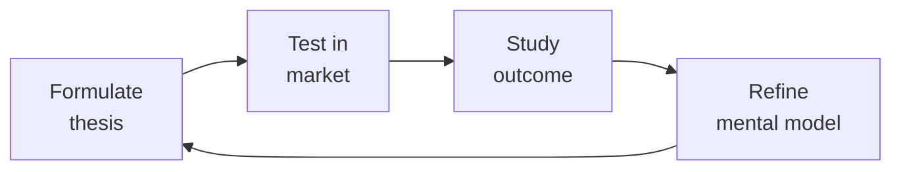

# Idea to Spec

Systematically decompose a raw product idea into a complete, implementation-ready specification package — PRD, domain model, API surface, screen inventory, and prioritized work items — so that an engineering team can estimate and build without ambiguity.

## Route the Request
<!-- QUICK: 30s -- auto-route first, then intent-route -->

### Auto-Route (No User Input Required)
Evaluate these file-system conditions in order. First match wins — jump immediately.

| # | Condition | Action |
|---|-----------|--------|
| A1 | `file_contains("*.md", "PRD\|spec\|scope.brief\|product.requirement")` AND `file_contains("*.md", "user.story\|acceptance.criteria\|GIVEN.*WHEN.*THEN")` | This is your skill. Jump to **Core Workflow** — Phase 2 (Specification Writing). |
| A2 | `file_exists("openapi.yaml\|openapi.json")` OR `file_contains("*.md", "endpoint\|REST\|GraphQL\|gRPC\|API.contract")` | Jump to **Core Workflow** — Phase 3 (API Design & Contract Generation). |
| A3 | `file_contains("*.md", "screen\|UI\|component\|interaction\|wireframe\|mockup")` AND `file_contains("*.md", "state\|loading\|empty\|error\|edge")` | Jump to **Core Workflow** — Phase 4 (Screen Inventory & Interaction Definitions). |
| A4 | `file_contains("*.md", "data.model\|entity\|schema\|relationship\|ERD")` AND `file_contains("*.md", "access.pattern\|query\|index")` | Invoke **database-designer** instead. This requires schema design expertise. |
| A5 | `file_contains("*.md", "prioritize\|RICE\|backlog\|feature.ranking")` | Invoke **product-manager** instead. This is backlog prioritization work. |
| A6 | `file_contains("*.md", "persona\|user.research\|journey.map\|usability.test")` | Invoke **ux-researcher** instead. This is user research territory. |
| A7 | `file_contains("*.md", "design.system\|component.spec\|design.token\|UI.component")` | Invoke **ui-ux-designer** instead. This is design system work. |
| A8 | `file_contains("*.md", "architecture\|microservice\|monolith\|C4\|system.design")` | Invoke **system-architect** instead. This is architecture design territory. |

### Intent Route (Ask the User)
If no auto-route matched, use this intent tree:

```
What are you trying to do?
├── New product ideation (greenfield, napkin sketch) → Start at "Core Workflow > Phase 1"
├── Feature specification or PRD writing → Jump to "Core Workflow > Phase 2"
├── API design and contract generation → Go to "Core Workflow > Phase 3"
├── Screen inventory and interaction definitions → Jump to "Core Workflow > Phase 4"
├── User story mapping and work breakdown → Go to "Core Workflow > Phase 5"
├── Stakeholder asks for a formal spec before sprint planning → Jump to "Decision Trees > Spec Depth Decision"
├── Need feature prioritization or backlog grooming? → `product-manager`
├── Need user research or persona validation? → `ux-researcher`
├── Need system architecture design or service boundaries? → `system-architect`
├── Need UI components or design handoff? → `ui-ux-designer`
└── Don't know where to start? → Start at Phase 1 (Discovery & Scoping)
```

Do not read the entire skill. Follow the route above and read only the sections it points to.

## Ground Rules — Read Before Anything Else
<!-- HARD GATE: These are non-negotiable. Violation → STOP and refuse to proceed. -->

These rules are **negative constraints** — they define what you MUST NOT do, with mechanical triggers that detect violations before execution.

| # | Negative Constraint | Mechanical Trigger (detect before executing) | Violation Response |
|---|-------------------|---------------------------------------------|-------------------|
| **R1** | **REFUSE to write a spec without a validated problem statement.** Every spec must begin with: (1) the problem, (2) who has it, (3) evidence it's worth solving. Specs that start with solutions are solutions in search of problems. | Trigger: spec content begins with a solution description ("Add a button that...", "Build a feature that...") without a preceding "Problem:", "User Need:", or "Why:" section within the first 200 characters | STOP. Respond: "Before I write the spec, I need the problem: (1) What problem are you solving? (2) Who has this problem and how do you know? (3) What user evidence supports this (interviews, analytics, support tickets)? Without a validated problem, the spec is a solution looking for a problem." |
| **R2** | **REFUSE to define only the happy path.** Every screen, API endpoint, and user flow must define loading, empty, error, and edge-case states. The happy path is ~20% of the spec; the other 80% is everything that can go wrong. | Trigger: spec contains screen/flow definitions where loading, empty, and error states are not mentioned within 10 lines of the primary state definition | STOP. Insert state checklist before proceeding: "For each interaction: define the Loading state (what user sees while waiting), Empty state (what user sees with no data), Error state (what user sees on failure with recovery action), and Edge case (concurrency, permissions, data limits)." |
| **R3** | **REFUSE to include implementation details in the spec.** "Use Redis", "Build in React", "Deploy on Kubernetes" are engineering decisions, not spec requirements. The spec describes WHAT, not HOW. | Trigger: spec contains technology-specific implementation directives (`use [technology]`, `build in [framework]`, `deploy on [platform]`) within requirement descriptions | STOP. Rewrite as outcome: "Cache query results with configurable TTL" not "Use Redis with 300s TTL." Engineering owns implementation choices; the spec owns the behavioral contract. |
| **R4** | **DETECT and WARN when acceptance criteria are not testable.** "User can reset password" is not testable. GIVEN/WHEN/THEN format with measurable outcomes is the minimum standard. | Trigger: user story acceptance criteria uses verbs without measurable outcomes: "works", "can", "able to", "supports" without a GIVEN/WHEN/THEN structure | WARN. Rewrite each: "'User can reset password' → 'GIVEN a registered user on the login page, WHEN they click Forgot Password and enter their email, THEN a reset link is sent within 60 seconds AND the user sees a confirmation message.'" |
| **R5** | **DETECT and WARN when the "Out of Scope" section is missing.** Without explicit non-goals, every conversation during implementation becomes a scope negotiation under time pressure. | Trigger: spec does not contain an "Out of Scope", "Non-Goals", or "What We're NOT Building" section | WARN. Insert: "**Out of Scope (explicitly NOT in this spec):** [list items stakeholders have mentioned but are deferred]. This section is a pre-agreed contract — when scope tries to expand during build, point here." |
| **R6** | **DETECT and WARN about unmapped dependencies.** Every external dependency (other team, service, API, vendor) must have an owner name, team, committed date, and fallback plan. | Trigger: spec mentions an external dependency ("Needs [service]", "Depends on [team]", "Requires [API]") without specifying: owner, team, committed date, AND fallback within 3 lines | WARN. Append dependency table: "\| Dependency \| Owner \| Team \| Committed Date \| Fallback if Late \|" with a row for each unmapped dependency. |


## The Expert's Mindset

Master idea to specs understand that strategy is not about predicting the future — it's about **being less wrong than the competition, faster**.

| Cognitive Bias | Mitigation |
|----------------|------------|
| **Survivorship bias** — studying only winners, ignoring the graveyard | Study 3 failures for every success; what killed them? |
| **Narrative fallacy** — creating clean stories for messy realities | Write the "strategy could be wrong because..." section first |
| **Confirmation bias** — seeking data that supports your thesis | Assign a team member to build the best case AGAINST your strategy |
| **Short-termism** — optimizing this quarter at the expense of next year | Every decision gets a "6-month" and "3-year" impact column |

### What Masters Know That Others Don't
- **The bottleneck is always one thing.** Find it. Fix it. Then find the next one.
- **Strategy = what you say NO to.** If your strategy doesn't exclude anything, it's not a strategy.
- **Timing beats brilliance.** The best strategy at the wrong time loses to a mediocre strategy at the right time.

### When to Break Your Own Rules
- **Bet the company when the asymmetry is right.** If downside = $1M and upside = $1B, the math doesn't care about your process.
- **Ignore the data when you're creating a new category.** By definition, there's no data for something that doesn't exist yet.
## Operating at Different Levels

| Level | Scope | You... |
|-------|-------|--------|
| **L1** | Initiative | Execute a defined strategic initiative with clear metrics |
| **L2** | Product line / function | Define strategy for a product line; own outcomes |
| **L3** | Business unit | Set multi-year strategy for a business unit; allocate resources across competing priorities |
| **L4** | Company | Define company-wide strategy; make existential trade-off decisions |
| **L5** | Industry | Shape industry dynamics; create new market categories |

**Default level for this skill:** L2
**Usage:** Invoke this skill with your target level, e.g., "as an L3 idea to spec, develop..."

For full level definitions, see `skills/00-framework/skill-levels/SKILL.md`.

## When to Use
<!-- QUICK: 30s -- scan the bullet list to decide if this skill fits -->
- A stakeholder has a one-paragraph idea and needs a formal spec before sprint planning
- A feature request lacks technical detail (data shapes, API endpoints, error states)
- You need to evaluate feasibility and surface unknowns before committing to a roadmap
- A greenfield product needs its first structured artifact beyond a pitch deck
- An existing system needs a net-new module and someone must bootstrap the design doc

## Decision Trees
<!-- QUICK: 30s -- follow the ASCII tree to your scenario -->
### Spec Depth Decision

```
Feature complexity?
├── Simple CRUD (1 screen, 1 entity) → Lightweight spec (Scope Brief + API contract)
│     Time: 2-4 hours. No formal PRD. User stories in issue tracker.
├── Moderate feature (3-5 screens, multi-entity) → Full spec (PRD + API + Screen Inventory)
│     Time: 1-3 days. Include state machines for key entities. Async RFC review.
└── Platform-level (cross-team, 10+ screens) → Heavy spec (PRD + Domain Model + API + Screen + Architecture)
      Time: 1-2 weeks. Architecture review board sign-off required.

Greenfield product? → Start with Scope Brief. Spec only the first slice.
Adding to existing system? → Focus on API contract and screen inventory. Domain model reference only.
```

### Specification Tooling

```
Solo/Small team? → Notion/Google Docs with OpenAPI snippets. Keep it simple.
Medium team? → Notion + dedicated OpenAPI tool (Stoplight/SwaggerHub). RFC in doc comments.
Enterprise? → Spec management platform (Notion/Confluence + Jira integration). Automated validation.

**What good looks like:** The output opens correctly in the target tool. All validations pass. No placeholder content remains.

```

## Core Workflow
<!-- QUICK: 30s -- scan phase titles to understand the process -->
### Phase 1 (~15 min): Discovery & Scoping
Extract the core problem, target persona, and success criteria from the raw input. Use the Five Whys to drill past solution proposals to root needs. Document explicit non-goals — what the feature deliberately excludes. Identify assumptions and unknowns that need validation before writing code. Output a one-page **Scope Brief** that captures: Problem Statement, Target Users, Success Metrics (leading and lagging), Scope Boundaries (in/out), and Open Questions with owners.

### Phase 2 (~30 min): Domain Modeling
Identify entities, their attributes, relationships, and cardinalities. Favor composition over deep inheritance. Define state machines for entities with lifecycle transitions. Annotate each entity with: required vs. optional fields, validation rules, uniqueness constraints, and indexing strategy. Produce an **Entity Relationship Diagram** (textual or visual) and a **Data Dictionary** with one row per field. For each relationship, specify ownership direction and cascade behavior.

### Phase 3 (~20 min): API Design
For every operation identified in the scope brief, define: HTTP method, URL path, request body schema (JSON/Protobuf), query parameters, response body schema, and error codes for every failure mode. Group endpoints by resource. Define pagination, sorting, and filtering conventions uniformly. Specify authentication and authorization per endpoint. Document idempotency guarantees. Output an **OpenAPI 3.1 spec** snippet or equivalent **API Contract** document.

### Phase 4 (~15 min): Screen & Interaction Inventory
List every screen, modal, drawer, or stateful view the feature requires. For each screen: name the route, list data dependencies (which API calls fire on mount), define loading, empty, error, and edge-case states, and enumerate all user actions with their system responses. Produce a **Screen Inventory** table and wireframe descriptions. Include accessibility requirements per screen (heading hierarchy, focus management, ARIA landmarks).

### Phase 5 (~25 min): Work Item Breakdown
Slice the spec into vertically deliverable user stories. Each story must be independently shippable and demonstrable. Write stories in the `As a [role], I want [action], so that [value]` format with concrete acceptance criteria. Sequence stories by dependency and value-to-effort ratio. Tag each story with a t-shirt size estimate for early capacity planning. Output a **Story Map** ordered by priority.

## Cross-Skill Coordination
<!-- QUICK: 30s -- table of who to talk to when -->
Converting an idea into a spec is inherently collaborative — it synthesizes product intent, design thinking, and engineering reality. A spec written in isolation produces three things: rework, frustration, and missed deadlines.

| Upstream Skill | What You Receive | When to Involve |
|---|---|---|
| `product-manager` | Prioritized backlog, RICE scores, user stories, success metrics, stakeholder constraints | During feature kickoff; before scope trade-off decisions |
| `ux-researcher` | User personas, journey maps, research findings, mental models, task flows, pain point evidence | Before writing acceptance criteria; when user flow ambiguity exists |
| `system-architect` | Architecture constraints, service boundaries, API conventions, data flow direction, performance budgets | When designing new services or cross-service features; before API contract design |

| Downstream Skill | What You Provide | Impact of Delay |
|---|---|---|
| `api-designer` | Endpoint inventory, request/response schemas, error codes, idempotency requirements, pagination needs | API contracts are inconsistent — integration bugs and rework |
| `frontend-developer` | Screen inventory with loading/empty/error/edge states, interaction specs, accessibility requirements | Devs discover edge cases mid-sprint — missed deadlines |
| `backend-developer` | Domain model, data dictionary, business rules, validation logic, performance requirements | Business logic gaps found during implementation — sprints slip |
| `database-designer` | Entity relationship diagram, access patterns, data volume projections, consistency requirements | Schema must be reworked after implementation — data migrations cascade |

### Communication Triggers — When to Proactively Notify

| Trigger | Notify | Why |
|---------|--------|-----|
| Scope change after spec approved | `product-manager`, `engineering-manager`, `qa-engineer` | Sprint replanning, capacity reallocation, timeline impact |
| API contract change during spec | `api-designer`, `frontend-developer`, `backend-developer`, `qa-engineer` | Contract versioning, mock updates, test case changes |
| New dependency discovered (external service, data pipeline) | `system-architect`, `backend-developer`, `product-manager` | Integration complexity, timeline risk, architectural review |
| Ambiguity in acceptance criteria flagged by QA | `product-manager`, `engineering-manager` | Clarification needed before implementation proceeds |
| Cross-team dependency identified late | `product-manager`, `system-architect` | Dependency sequencing, parallelization opportunities, blocker resolution |
| Performance requirement exceeds known system capacity | `system-architect`, `backend-developer` | Architecture review, caching strategy, load testing plan |

### Escalation Path

```
Spec blocked (unresolved ambiguity, missing stakeholder, scope conflict)
  └── `product-manager` + `engineering-manager`. Resolution within 24 hours or escalation to `cto-advisor`.

Architecture conflict (spec requires pattern that violates architecture principles)
  └── `system-architect` + `cto-advisor`. Decision documented as ADR. Spec updated or exception granted.

Cross-team dependency deadlock (two teams block each other)
  └── `product-manager` + engineering leads of both teams. `cto-advisor` breaks ties if unresolved in 48 hours.
```

## Proactive Triggers

| Trigger | Action | Why |
|---------|--------|-----|
| Idea description is too vague ("make it better," "improve UX") with no concrete user problem | Ask clarifying questions: "What user behavior change do you want to see?" and "What does success look like numerically?" Refuse to write spec until problem is defined in one sentence | Vague ideas produce vague specs. A spec built on an undefined problem will be rejected by engineering, QA, and users — the cost of clarifying upfront is 10 minutes; the cost of rewriting a spec is 2 weeks |
| No non-functional requirements mentioned (performance, security, accessibility, compliance) | Proactively ask: "What's the P95 latency budget? Are there regulatory constraints? Does this need to work offline?" Add NFRs section before declaring spec complete | NFRs discovered mid-implementation cause the worst kind of rework — architecture-level changes. Every missing NFR in the spec is a potential sprint derailment |
| No mobile or responsive consideration in a consumer-facing feature spec | Flag "mobile-first" design requirement. Ask: "What happens at 320px? What gestures are expected? Is offline mode needed?" Add responsive behavior to screen inventory | 60%+ of consumer traffic is mobile. Designing desktop-first and retrofitting mobile produces clunky experiences and missed launch dates — handle viewport strategy in the spec, not in the bug tracker |
| No API contract mentioned when cross-service communication is required | Propose OpenAPI spec generation as part of the spec deliverable. Coordinate with `api-designer` to define endpoints, request/response schemas, error codes, and idempotency requirements | API contract ambiguity is the #1 cause of integration bugs. A spec without an API contract is a wish, not a plan — frontend and backend teams will build against different assumptions |
| Acceptance criteria use "works," "functional," or "complete" as completion signal | Replace all vague criteria with GIVEN/WHEN/THEN format. Reject any story that can't be validated by QA without asking clarifying questions | "Works" means 10 different things to 10 different engineers. Measurable acceptance criteria are the contract between product intent and engineering delivery — without them, QA is guessing |
| Spec mentions a dependency on another team's service/API without a named contact or date | Map all external dependencies with owner name, team, expected availability date, and fallback plan. Flag to `product-manager` if any dependency has no committed date | An unmapped dependency is a delayed launch. Every external team needs a named contact and a timeline — otherwise the spec is planning around assumptions, not commitments |
| Feature spec doesn't reference any user research or data that justifies the feature | Ask: "What user evidence supports this feature? Is there a pain point severity rating, support ticket count, or churn signal?" If none exists, flag to `ux-researcher` for validation sprint before full spec | Features built without evidence become shelfware. A 2-day validation sprint costs far less than a 2-month build of something nobody needs |
| No entity relationship model when feature touches database schema | Coordinate with `database-designer` to produce ERD, data dictionary, access patterns, and cardinality rules. Add to spec appendix | Schema decisions made by individual engineers without coordination create data inconsistencies that take quarters to untangle. Spec-level data modeling prevents migration cascades |

## Best Practices
<!-- STANDARD: 3min -- rules extracted from production experience -->
- Always define the empty state and error state before the happy path — they reveal the most design complexity.
- Prefer denormalized read models for query-heavy screens; normalize only writes.
- Every API response must include a `requestId` field for production <!-- DEEP: 10+min -->
debugging.
- Write acceptance criteria as executable assertions: "Given X, when Y, then Z."
- Use the "Mom Test" on every story: would a real user pay or change behavior for this?
- Version the spec artifact — date-stamp every iteration so teams can trace decisions.
- Socialize the spec asynchronously (RFC-style) before any synchronous review meeting.
- Capture every decision with context: what alternatives were considered and why they were rejected.

## Anti-Patterns
<!-- DEEP: 5min -- each anti-pattern includes machine-detectable patterns -->

| ❌ Anti-Pattern | ✅ Do This Instead | 🔍 Detect (grep / lint) | 🛡️ Auto-Prevent |
|-----------------|---------------------|--------------------------|-------------------|
| Writing the spec as a bullet list of UI elements — "Add a button that says Save" with no context about what saving means | Write the spec as outcome-driven behavior: "Given a user with unsaved changes, when they click Save, then changes are persisted and a confirmation is shown. If the save fails, the user sees a retryable error." UI elements are implementation details — specs describe behavior | `grep -rn "add a button\|add a field\|add a dropdown\|show a modal" --include="*.md"` → finds UI-element-focused spec language without behavioral context | Spec template: `templates/spec.md` — requires GIVEN/WHEN/THEN format for all interactions before UI description |
| Defining only the happy path and assuming engineering will figure out edge cases | Define loading, empty, error, and edge-case states for every screen before the happy path. The empty state reveals the most UX complexity. Specs without edge cases become rework tickets in sprint 2 | `grep -rn "happy.path\|normal.flow\|success.case" --include="*.md" \| grep -v "error\|edge\|empty\|loading" -A 5` → finds happy-path-only spec sections | Spec template: `templates/spec.md` — state matrix required (Loading/Empty/Error/Edge) before any happy path |
| Including implementation details in the spec — "Use Redis for caching" or "Build this in React" | Describe what the system must do, not how to build it. Let engineering own the implementation. "Cache query results with TTL configurable by the operator" — not "Use Redis with a 300s TTL" | `grep -rn "use Redis\|use Postgres\|build in React\|use Django\|deploy on" --include="*.md"` → finds technology-specific implementation directives in specs | Lint rule: `scripts/check-spec-implementation-leak.sh` — flags technology names in requirement sections |
| Starting with API contract design before defining the user problem and success metrics | Define the problem, success metrics, and user stories first. API contracts are derived from user needs, not the other way around. A perfectly designed API that solves the wrong problem is still wrong | `grep -rn "openapi\|swagger\|REST endpoint\|GraphQL schema" --include="*.md" \| head -n 1` → check if API design appears before problem statement section in the spec | Spec template: `templates/spec.md` — enforces Problem → Success Metrics → User Stories → API Contract ordering |
| Writing specs in isolation and sharing them as "final" with no async review period | Share specs as RFCs with a 48-hour async comment period. Engineering, design, and QA review before a single user story is estimated. Specs are collaboration tools, not approval artifacts | `grep -rn "final\|approved\|signed.off\|v1.0" --include="*.md" \| grep -v "review\|draft\|RFC\|feedback"` → finds specs labeled final without review process | Review workflow: `templates/spec-review.md` — requires 48h async review + engineering + design + QA sign-off |
| Using "all users will see this" as the Reach estimate without segmentation or evidence | Calculate Reach from analytics: "users who performed action X in the last 30 days" or "users in segment Y with pain point Z." Segment by persona, behavior, or cohort — not "everyone" | `grep -rn "all.users\|everyone\|100%.*users\|entire.user.base" --include="*.md"` → finds unsegmented reach estimates | Spec template: `templates/spec.md` — Reach field requires segment name + analytics source |
| Skipping the "Out of Scope" section — assuming scope negotiation will happen during implementation | Every spec includes an explicit "Out of Scope" section at the top. When scope tries to expand during build, point to non-goals as a pre-agreed contract. Without non-goals, every conversation becomes a scope negotiation under time pressure | `grep -L "Out of Scope\|Non.Goals\|What We're NOT Building" --include="*spec*.md" --include="*PRD*.md"` → finds specs without out-of-scope section | Spec template: `templates/spec.md` — requires "Out of Scope" section before any requirements |
| Treating the spec as immutable after approval — refusing to update when new information surfaces | Treat the spec as a living document. Version it with dates and changelogs. When new information surfaces (new constraint, research finding, technical discovery), update the spec and communicate the delta to all consumers | `grep -c "version\|changelog\|updated\|revised" --include="*spec*.md" \| awk -F: '{if ($2<1) exit 1}'` → finds specs without version history | Spec template: `templates/spec.md` — auto-inserts version table with date, author, and change description |

## Scale Depth: Solo → Small → Medium → Enterprise

### Solo (1 person, 0-100 users)
- **What changes**: Spec = a few bullet points in a Notion doc. No formal PRD. User stories = you writing code yourself. "Acceptance criteria" = it works in production.
- **What to skip**: Full PRDs. RICE scoring. Formal story mapping. API contracts (you own both sides). Non-functional requirements docs.
- **Coordination**: You talk to yourself. Ship daily.

### Small Team (2-10 people, 100-10K users)
- **What changes**: Lightweight spec template (problem, solution, success metrics, non-goals). User stories with GIVEN/WHEN/THEN. Simple story mapping for complex features. API contract documented collaboratively. Scope brief before major features.
- **What to skip**: Full RICE/CD3 (value vs effort matrix is enough). Formal RFC process. Spec versioning beyond date stamps. Entity state machines for simple CRUD.
- **Coordination**: Async spec review (comment in doc). Weekly refinement session (45 min). Quick sync with designer before UI work.

### Medium Team (10-50 people, 10K-1M users)
- **What changes**: Full PRD template. RICE or CD3 scoring. Story maps for all features. API contracts as source of truth (OpenAPI). Entity state machines for complex domains. Spec versioned with changelog. RFC-style async review. Edge case catalog per feature area.
- **What to skip**: Formal spec review board (peer review is enough). Six Sigma requirements traceability. Full UML for everything (use for complex flows only).
- **Coordination**: RFC async review (3-day window). Bi-weekly spec review with engineering. Pre-refinement with tech lead before team refinement. Cross-team dependency mapping session monthly.

### Enterprise (50+ people, 1M+ users)
- **What changes**: Formal spec lifecycle (proposal → review → approval → implementation → validation). Architecture review board sign-off for cross-cutting specs. Requirements traceability matrix. Compliance review for regulated features. Accessibility requirements embedded. Internationalization specs. Product ops manages spec template evolution.
- **What's full production**: Spec management platform (Notion/Confluence + Jira integration). Automated acceptance criteria validation. Cross-team impact analysis. Regulatory review workflow.
- **Coordination**: Weekly spec review board. Architecture review async + monthly sync. Cross-team spec alignment quarterly. Compliance review before implementation start.

### Transition Triggers
- **Solo → Small**: You can't hold the full spec in your head anymore. Another dev builds the wrong thing from your spec.
- **Small → Medium**: 3+ teams need coordinated specs. First enterprise customer demands traceability.
- **Medium → Enterprise**: Regulatory compliance requires spec sign-off. Multi-product spec dependencies. IPO audit trail needed.


### Cross-skills Integration

| Step | Skill | What it produces |
|------|-------|------------------|
| **Before** | product-strategist | Market opportunity, business case, strategic context |
| **This** | idea-to-spec | Structured PRD, API contracts, screen inventory, work items |
| **After** | product-manager | Prioritized backlog, roadmap placement, stakeholder alignment |

Common chains:
- **New product**: product-strategist → idea-to-spec → product-manager — from business case to prioritized roadmap
- **Feature work**: ux-researcher → idea-to-spec → backend-developer — from user evidence to implementable API contracts

### Service Interaction Designs

**idea-to-spec → api-designer: API contract generation from PRD**
When the spec defines user stories that require cross-service communication, the spec MUST include an endpoint inventory with request/response schemas. The `api-designer` skill consumes the spec's screen inventory and entity model to produce OpenAPI contracts. Every acceptance criterion that mentions "when the user clicks X" maps to at least one API endpoint. Missing endpoints in the spec = broken frontend-backend contracts.

**idea-to-spec → database-designer: entity modeling from spec**
The spec's domain model (entities, relationships, cardinalities, access patterns) feeds directly into schema design. For every entity in the spec, the `database-designer` needs: read vs write ratio, query patterns, data volume projections, and consistency requirements. Specs that omit access patterns force database designers to guess — and guessing produces schemas that don't match query reality.

**idea-to-spec → frontend-developer: component API alignment**
The screen inventory in the spec maps 1:1 to frontend components. Every screen must specify its data dependencies (which API endpoints, which entities) and its states (loading, empty, error, edge). Frontend developers should never discover missing states mid-sprint — the spec is the contract.

## Error Decoder
<!-- DEEP: 5min -- each entry includes a console-string matcher for automatic recovery loops -->

| 🖥️ Console Match (grep pattern) | Symptom | Root Cause | Fix | 🔄 Auto-Recovery Loop |
|---|---|---|---|---|
| `Error: spec.*ambiguous\|engineer.*asks.*what happens\|clarification.needed` + `grep -rn "happy.path\|success.case" spec.md \| grep -v "error\|edge\|empty\|loading"` shows happy-path-only sections | Engineers keep asking "what should happen when X?" during implementation — 5 engineers asking the same question in Slack | Spec didn't define edge cases — only the happy path was documented. Every engineer reading the spec independently discovers the same gaps and asks the same questions. The spec author's time was "saved" by omitting edge cases, but the team paid 5× that time in interruptions | Every screen/endpoint/flow must have: Loading, Empty, Error, and Edge-case states defined before the spec leaves review. The state matrix is not polish — it's the majority of implementation effort | 1. Find happy-path-only sections: `grep -rn "happy.path\|normal.flow" spec.md -A 5 \| grep -v "error\|edge\|empty\|loading"` 2. For each match: insert state matrix (Loading/Empty/Error/Edge) 3. Verify: `grep -c "Loading\|Empty\|Error\|Edge" spec.md` > 0 for each screen 4. Review checklist: engineering must confirm all states covered before estimation |
| `Error: API.*incompatible\|frontend.backend.mismatch\|contract.*broken` + `grep -rn "returns user data\|returns a list\|API.response" spec.md` shows prose API descriptions | Backend and frontend teams build incompatible APIs — "the API returns user data" was interpreted 3 different ways by 3 teams | API contract was left ambiguous — endpoints described in prose, not in a structured format. Prose is ambiguous by design: "returns user data" could be `{name, email}` or `{id, profile, preferences, history}` | Include an OpenAPI contract (even a draft) in every spec that crosses service boundaries. The contract is the executable specification — if it can't be validated by a linter, it's not defined | 1. Find prose API descriptions: `grep -rn "returns.*data\|returns.*list\|API.response\|endpoint.*returns" spec.md` 2. For each: generate OpenAPI schema with types, enums, required fields 3. Validate: `npx @redocly/cli lint openapi.yaml` → must return 0 4. Contract as source of truth: frontend and backend both generate from the same spec |
| `Error: QA.*bugs.*after.review\|acceptance.criteria.*untestable\|definition.of.done.*ambiguous` + `grep -rn "user can\|user is able to\|supports\|works" spec.md \| grep -v "GIVEN\|WHEN\|THEN"` | QA files 20 bugs on a feature that "passed" design review — "user can reset password" was the acceptance criterion; nobody agreed on what "can" means | Acceptance criteria were not testable — verbs like "can", "able to", "supports", "works" are subjective. Each engineer and QA tester interprets them differently. The gap between subjective criteria and objective verification is the bug tracker | Every user story must have GIVEN/WHEN/THEN acceptance criteria with measurable outcomes. "User can reset password" → "GIVEN a registered user on the login page, WHEN they click Forgot Password and enter their email, THEN a reset link is sent within 60 seconds AND the user sees a confirmation message" | 1. Audit acceptance criteria: `grep -rn "user can\|user is able\|supports\|works" spec.md \| grep -v "GIVEN\|WHEN\|THEN"` 2. For each: rewrite as GIVEN/WHEN/THEN with timing, content, and state requirements 3. Verify: `grep -c "GIVEN.*WHEN.*THEN" spec.md` must = user story count 4. QA sign-off: QA confirms all criteria are testable before spec approval |
| `Error: spec.*rejected.*engineering\|feasibility.*impossible\|NFR.*missing` + `grep -rn "latency\|throughput\|availability\|SLA\|security\|compliance" spec.md -c` returns 0 | Spec approved by product but rejected by engineering during sprint planning — "this requires 10ms latency but our DB query takes 200ms" | Engineering found hidden complexity: missing Non-Functional Requirements (NFRs), unmapped dependencies, impossible performance targets. The spec assumed infrastructure capabilities that don't exist | Include NFRs in the spec template: latency targets, throughput expectations, availability requirements, security constraints, compliance needs. Map every cross-team dependency with owner name and committed date. Validate performance targets against known system capacity before spec approval | 1. Check NFR coverage: `grep -c "latency\|throughput\|availability\|p99\|SLA\|rate.limit" spec.md` → must be > 0 2. If missing: insert NFR section with specific targets (not "fast" but "p99 < 200ms") 3. Dependency audit: `grep -rn "needs\|depends.on\|requires.*from" spec.md` → each must have owner + date 4. Engineering feasibility review: sign-off required before spec approval gate |
| `Error: feature.*adoption.*< 10%\|nobody.uses\|success.metric.*retrofitted` + `grep -rn "success.metric\|measure.*success\|target" spec.md -c` returns 0 | Feature ships on time, engineering is praised, but adoption is <10% of target after 30 days. Nobody defined what success looked like before building | Spec was built on assumptions, not user evidence. Success metrics were either undefined ("we'll know it when we see it") or defined after launch to make the feature look successful. Building without a success metric is gambling engineering capacity | Define success metrics before writing the first user story. Establish baseline values. Target thresholds. Measurement method. If you can't define "what success looks like" numerically before building, flag to ux-researcher for a validation sprint | 1. Verify: `grep -c "success.metric\|baseline\|target\|measurement" spec.md` → must be > 0 2. If missing: define metric (e.g., "Increase week-4 retention from 40% to 55%"), baseline (current value), target (goal value), measurement method (analytics event name) 3. Pre-launch: verify measurement instrumentation is deployed 4. Post-launch: compare actual vs target at 7/14/30 days |
| `Error: data.model.*rework\|schema.*redesign\|access.pattern.*missing` + `grep -rn "entity\|model\|schema" spec.md -A 10 \| grep -v "access.pattern\|query\|index\|read\|write"` | Entity model must be reworked mid-sprint — "User has many Orders" was defined, but nobody asked how we'd query orders | Spec defined entities but not how they're queried. Entity relationships without access patterns are schema decorations. "User has many Orders" doesn't tell you if you're querying "all orders for a user" (index on user_id) or "all users who ordered X" (different index) | Include access patterns in the domain model: for each entity, list the top 3-5 queries with expected frequency, latency, and consistency requirements. Coordinate with database-designer to validate schema against access patterns before spec approval | 1. Audit entities: `grep -rn "entity\|model.*has\|relationship" spec.md` → for each entity, check for access patterns 2. For each entity without patterns: add top 3-5 queries with read/write ratio, frequency, latency target 3. Validate: share with database-designer for index/query review 4. Schema lock: no schema changes after sprint planning without access pattern update |
| `Error: dependency.*late\|blocked.*external\|waiting.on.*team` + `grep -rn "needs\|depends.on\|requires" spec.md \| grep -v "owner\|date\|fallback"` | Feature blocked for 2 months — "the payment service will be ready" was the plan; the payment service team didn't know they were on the critical path | Dependency was listed by name ("Needs payment service") without owner, team, committed date, or fallback plan. External teams cannot commit to dates they don't know about. Dependencies without owners are prayers, not plans | Map every external dependency with: owner name, team, committed date, fallback plan, and escalation path. Flag red dependencies (>1 week past committed date) to product-manager weekly. Track dependency status in the spec itself | 1. Dependency audit: `grep -rn "needs\|depends.on\|requires.*team\|requires.*service" spec.md` 2. For each: add owner name, team, committed date, fallback 3. Weekly check: `scripts/dependency-health.sh` — flags overdue dependencies 4. Red dependencies (>1 week late): escalate to product-manager with mitigation options |

## Sub-Skills
<!-- QUICK: 30s -- table of deeper dives by topic -->
| Sub-Skill | When to Use | Reference |
|-----------|-------------|-----------|
| `prd-writing` | Feature definition, stakeholder alignment | Phase 2 — scope brief, success metrics, non-goals |
| `domain-modeling` | Entity design, data relationships, state machines | Phase 2 — ERD, data dictionary, cardinalities |
| `api-contract-design` | Endpoint definition, error schemas, pagination | Phase 3 — OpenAPI 3.1 spec, idempotency |
| `screen-inventory` | Screen enumeration, state mapping, interaction design | Phase 4 — loading/empty/error/edge states |
| `story-mapping` | Work breakdown, sequencing, dependency ordering | Phase 5 — user stories, acceptance criteria |
| `rfc-process` | Cross-team spec review, async approval | `product-manager` — stakeholder alignment |
| `accessibility-requirements` | WCAG integration into screen specs | `accessibility-auditor` — heading hierarchy, focus management |


### War Story 1 — The 30-Page Spec That Collided With Reality
**Symptom:** A PM wrote a comprehensive 30-page spec for a new billing system, covering 12 API endpoints, 5 screens, and 3 integration touchpoints. Engineering started building and discovered 8 unhandled edge cases in the first week. The spec was rewritten 3 times during the sprint.
**Root cause:** The spec was written in isolation with no engineering review, no API contract validation, and no state-machine modeling for the billing entity. Edge cases (prorated refunds, mid-cycle plan changes, failed payment recovery) were assumed to be "standard" — but the existing system handled each one differently.
**Fix:** Adopted a "spec roughening" process: write a 5-page scope brief first, review with engineering async for 48 hours, THEN expand to full spec. Include entity state machines and API response schemas before writing user stories.
**Lesson:** A spec written without engineering input is a hypothesis, not a specification. Get engineering eyes on the scope brief before expanding. State machines and API contracts catch more edge cases than prose ever will.

### War Story 2 — The API That Looked Great on Paper
**Symptom:** A team designed a RESTful API for a content management system with beautiful resource hierarchy: `/organizations/{id}/projects/{id}/documents/{id}/versions/{id}`. The frontend team needed to render a document list — 4 nested API calls to get all documents across all projects. Page load time: 8 seconds.
**Root cause:** The API was designed around the data model, not the UI consumption patterns. The spec perfectly modeled the domain but ignored the primary query pattern: "show me all my recent documents."
**Fix:** Added denormalized read endpoints (`GET /documents?sort=updated_at`) and specified response schemas that matched screen data requirements. API contract review now includes a "top 3 UI queries" validation before approval.
**Lesson:** API design must serve both the domain model AND the UI consumption model. If the spec's API contract doesn't support the screen inventory's primary query, the spec is incomplete.

### War Story 3 — The Empty State That Wasn't Designed
**Symptom:** A spec for a team dashboard described the main view in full detail: charts, filters, data tables. What it didn't describe: what the dashboard looked like before the user had any data. The engineering team built a blank white page. Users thought the app was broken.
**Root cause:** The spec only defined the happy path. The loading state, empty state, error state, and permission-denied state were all left as "standard" — but there was no standard defined for any of them.
**Fix:** Made a "states-first" rule: every screen spec must define loading, empty, error, and permission-denied states before the happy path is described. Added a mandatory checklist to the spec template.
**Lesson:** The happy path is the smallest part of the spec. Loading, empty, error, and edge-case states are where the real design complexity lives. Define them first — they're the states users actually see.


### Error Decoder
<!-- DEEP: 10+min -->

| Symptom | Root Cause | Fix | Lesson |
|---------|-----------|-----|--------|
| Stakeholder rejects spec | Spec solves wrong problem or misses context | Run "Five Whys" with stakeholder before writing. Confirm problem statement in writing before solution. | A spec that solves the wrong problem is worse than no spec. Validate the problem before proposing the solution — every hour spent on problem definition saves days of rework. |
| Dev estimates don't match spec | Spec has hidden complexity, missing edge cases | Every screen needs loading/empty/error/edge states defined. Ambiguity → estimate buffer. | Every unstated edge case becomes a 2x multiplier on estimates. Loading, empty, error, and edge states are not optional — they are the difference between a spec and a wish. |
| Users don't use the feature | Built what was asked, not what was needed | Outcome-based specs: "increase X by Y%" not "build Z". User research before writing. | Building what was asked is not the same as building what is needed. Outcome-driven specs force you to ask: will this change user behavior? If "I hope so" is the answer, go back to research. |
| Scope creep during build | Spec didn't define explicit non-goals | "Out of scope" section is non-negotiable. Refer back when scope tries to expand. | Non-goals are the most important section of a spec. Without them, every feature request sounds reasonable in isolation. Define what you are NOT doing — and defend it. |
| No adoption after launch | Success metric not validated before building | Define success metric before writing first user story. Validate with prototype before building. | A success metric defined after launch is not a goal — it is a rationalization. Define "what good looks like" in measurable terms before writing a single user story. |
| Cross-team dependency blocks delivery | Spec assumed dependencies would be available | Map all dependencies with owners and dates in the spec. Flag red dependencies to PM weekly. | A dependency with no named owner and no deadline is not a dependency — it is a hope. Every external dependency needs a DRI and a check-in date embedded in the spec. |
| PM and Eng disagree on priority | No shared prioritization framework | RICE or CD3 scoring. Written framework removes opinion-based priority fights. | Priority arguments exhaust teams because they are personal. A written scoring framework removes the person from the argument and lets data decide. |


## What Good Looks Like

> You've just completed the spec for this feature. Every requirement traces back to a user interview, analytics event, or support ticket — there are no orphan features that "seemed like a good idea." The API contract includes error schemas for every 4xx and 5xx response, pagination is consistent with existing conventions, and the `requestId` field is present in every response body. Every screen has defined loading, empty, error, and permission-denied states — the engineering team won't discover edge cases mid-sprint. Non-goals are explicit and agreed upon, so when a stakeholder asks "can we also just add X," you point to the document. The story map is ordered by dependency and value-to-effort ratio, and acceptance criteria are executable in GIVEN/WHEN/THEN format.


## Production Checklist
<!-- QUICK: 30s -- binary pass/fail items. Each has a mechanical validation command. -->

| ID | Checklist Item | Validation Command | Auto-Fix |
|----|---------------|-------------------|----------|
| **[S1]** | Scope brief approved by product owner and tech lead with written sign-off | `grep -rn "approved\|sign.off\|reviewed.by" spec.md` → must find > 0 approval indicators with names | Template: `templates/spec.md` — requires approval section with name + date |
| **[S2]** | Non-goals explicitly documented and agreed upon — "Out of Scope" section present and reviewed | `grep -c "Out of Scope\|Non.Goals\|Not.Building" spec.md` → must be > 0 | Spec template enforces "Out of Scope" section before requirements |
| **[S3]** | Entity state machines cover all lifecycle transitions including rollback paths | `grep -c "state.machine\|lifecycle\|transition\|rollback\|status.*→" spec.md` → must find state definitions for all entities | Template: `templates/state-machine.md` — state diagram + transition table |
| **[S4]** | API contract includes error schemas for every 4xx and 5xx response | `npx @redocly/cli lint openapi.yaml` → must return 0; `grep -c "4[0-9][0-9]\|5[0-9][0-9]" openapi.yaml` → must find error response schemas | CI: `redocly lint openapi.yaml` in `.github/workflows/spec-lint.yml` |
| **[S5]** | Pagination, sorting, and filtering patterns are consistent with existing APIs | `grep -rn "pagination\|sort\|filter\|limit\|offset\|cursor" openapi.yaml` → must find consistent patterns matching existing API conventions | Lint rule: `scripts/check-api-consistency.sh` — flags pagination/sort parameters that differ from standard |
| **[S6]** | Every screen has defined loading, empty, error, and permission-denied states | `grep -c "Loading\|Empty\|Error\|Permission.Denied\|Edge.Case" spec.md` → must have ≥ 1 per screen/flow defined | Spec template: `templates/spec.md` — state matrix required per screen |
| **[S7]** | Story map ordered by dependency and value-to-effort ratio | `grep -rn "story.map\|user.story.*order\|dependency.*order" spec.md` → must find dependency graph or ordered story list | Template: `templates/story-map.md` — dependency matrix + value/effort scoring |
| **[S8]** | Each user story has at least 3 acceptance criteria in Given/When/Then format | `grep -c "GIVEN.*WHEN.*THEN" spec.md` → must be ≥ 3× (number of user stories) | Spec template enforces min 3 GIVEN/WHEN/THEN per story |
| **[S9]** | Open questions have assigned owners and due dates — no orphan questions | `grep -rn "question\|TBD\|TODO\|open" spec.md \| grep -v "owner\|assigned\|due" -A 2` → must find 0 questions without owner/date | Question tracker: `scripts/question-audit.sh` — flags open questions without owner or past due date |
| **[S10]** | Spec versioned and distributed for async review before any planning meeting | `grep -c "version\|changelog\|review.window\|review.period" spec.md` → must find version + 48h review window | Spec template auto-inserts version table and review deadline; `scripts/spec-review-reminder.sh` alerts at deadline |

## Footguns
<!-- DEEP: 10+min — war stories from spec-to-engineering handoffs -->

| Footgun | What Happened | Root Cause | How to Prevent |
|---------|---------------|------------|----------------|
| Wrote a 42-page PRD that nobody read — engineering built from their memory of the 12-minute kickoff meeting, and the sprint demo revealed a product that matched neither the spec nor customer expectations | A product team spent 3 weeks writing a comprehensive PRD — every screen mocked, every API endpoint documented, every error state defined. The engineering team skimmed it in the kickoff and never opened it again. They estimated from the bullet points on the whiteboard. Sprint demo day: the "add to cart" flow had no quantity selector because the PRD specified it but the whiteboard sketch didn't. The PM cited "page 28 of the PRD." Engineering said "we estimated from what we discussed." | Spec length exceeded attention span. A 42-page document is a reference manual, not a communication tool. The kickoff was the only shared understanding, and it was incomplete. No one was accountable for verifying implementation against spec. | **A spec is a contract, not a novel. Make it short enough to be referenced during implementation.** Structure specs as: (1) 1-page summary, (2) screen-by-screen definitions with acceptance criteria inline, (3) API contract as a separate linked document. Require that engineering links each PR to specific spec sections. During sprint review, demo against acceptance criteria — not memory. If a spec exceeds 10 pages, split it into multiple specs. |
| API contract specified `amount` as a string — the frontend team parsed it with `parseFloat()` in 17 places across the codebase. 3.2% of transactions had rounding errors totaling $14,800 in unreconciled payments over 6 months | The backend returned monetary amounts as strings (`"amount": "149.99"`) to avoid floating-point issues. The API contract didn't specify that amounts use `decimal` semantics. Frontend devs, working from the OpenAPI spec that defined `amount: string`, used `parseFloat()` everywhere. `parseFloat("149.99")` returned `149.99000000000001` in some JavaScript engines — not usually visible, but enough to fail server-side validation when sent back as `149.98999999999999`. | The spec defined type but not semantics. "String" is a data type, not a domain rule. Without "this represents currency with 2 decimal places," every consumer of the API will make different assumptions. 17 different `parseFloat()` calls across 17 different devs all made the same wrong assumption. | **Every field in an API contract needs type + semantics + validation rules.** `amount`: string, currency, 2 decimal places, always positive, max `99999999.99`. Add a examples with edge cases: `"amount": "0.00"`, `"amount": "99999999.99"`. Generate types from the spec with currency handling: in TypeScript, generate as `Decimal` not `number`. Add a contract test that sends 100 random amounts and verifies roundtrip precision. |
| Spec said "users can upload files" — didn't define max size, allowed types, or virus scanning. A customer uploaded a 4.7GB VM image that crashed the upload service with OOM. | Engineering implemented file upload with no constraints because the spec didn't specify them. A B2B customer attempted to upload a 4.7GB virtual machine disk image. The Node.js upload service buffered the file in memory (default behavior for `multer` without `limits`) and crashed when the 512MB container memory limit was exceeded. The file was rejected but the partial upload consumed all available disk in `/tmp`, cascading the crash to 3 other services on the same host. Total downtime: 47 minutes. | Unspecified constraints become unlimited constraints. "Upload a file" has no maximum — a spec that doesn't define bounds delegates every constraint to the implementer's assumptions. The implementer had never seen a 4.7GB upload attempt and didn't know `multer` buffers in memory by default. | **Every input in a spec needs explicit bounds.** File upload spec: max size (10MB for images, 100MB for documents), allowed MIME types (whitelist, not blacklist), virus scanning requirement (ClamAV or cloud scanning API), storage location (S3 with pre-signed URLs, not application server disk). List what happens on each violation: >10MB returns `413 Payload Too Large` with a user-facing message. Write a test that sends a file exactly 1 byte over the limit. |
| Story map ordered by PM intuition instead of dependency analysis — Sprint 3 stories depended on work from Sprint 6, and Sprint 2's "export PDF" feature couldn't render data that wasn't stored until Sprint 5 | A PM mapped out a 10-sprint feature using a story map organized by user journey — left to right was the ideal flow. Engineering started Sprint 1. By Sprint 2, the "Export as PDF" story was blocked because it needed the "Reporting Engine" from Sprint 5. Sprint 3's "Bulk Edit" needed the "Permissions Framework" from Sprint 6. The team spent 40% of Sprint 2 and 3 building throwaway stubs to unblock themselves — stubs that broke in Sprint 5 when the real implementations arrived. | Story mapping by UX flow, not by architectural dependency. The PM arranged stories by what the user sees first, but the user doesn't see the database schema or the permissions system. Dependencies are invisible in a story map. | **Always run a dependency check before committing to sprint order.** For each story in the first 3 sprints, ask: "What system capability does this need that doesn't exist yet?" Map stories as a directed graph — every story with unmet dependencies moves right until its dependencies are in earlier sprints. Involve a tech lead in ordering. Document dependency assumptions in the spec: "This sprint assumes the User Permissions model (Sprint 1) is complete." |
| Non-goals section listed 8 items as "out of scope" with no explanation — a VP pressured engineering to build one of them anyway, and nobody could defend the decision because the rationale wasn't documented | A spec listed "Real-time notifications" as a non-goal. During Sprint 3, the VP of Sales demanded it because "the competitor just launched it and we lost a deal." Engineering, under pressure, agreed to "just add a webhook" — which cascaded into 2 additional sprints, delayed the core MVP by 6 weeks, and was hacked together without a design review. When the post-launch retrospective asked "why did we build this?", the answer was "the VP told us to." The original decision to defer it had a good reason — latency requirements would have added $30K/month to infrastructure — but nobody remembered. | Non-goals without rationale are just opinions. When the decision to exclude a feature isn't backed by documented reasoning, it's one stakeholder opinion against another. The VP's opinion (with revenue pressure behind it) will always beat a PM's undocumented judgment call. | **Every non-goal needs a "why not" statement.** Format: "Non-goal: Real-time notifications. Rationale: Adds $30K/month in WebSocket infrastructure before we've validated the core workflow. Decision date: March 12. Revisit after: 1,000 DAU." This transforms "PM said no" into "the business case didn't close in March — if the numbers have changed, let's revisit." Archive non-goals with their rationale so future teams understand the context. |

## Calibration — How to Know Your Level
<!-- STANDARD: 3min — honest self-assessment rubric -->

Use this to diagnose where you actually are, not where you want to be.

| You Know You're Stuck at L1 When... | You Know You've Reached L2 When... | You Know You're L3 When... |
|---|---|---|
| Your spec documents are feature wishlists — a list of "the app should do X" without error states, data constraints, or dependency order | Your spec includes: entity state machines with every lifecycle transition, API contracts with error schemas for every endpoint, and screen definitions with loading/empty/error/edge states — and engineering can build from it without asking "what if this fails?" | An engineering manager hands your spec to a new hire who's never seen the product, and 2 weeks later the implementation matches what you described — no clarifying questions asked |
| You define APIs by describing the happy path response and assume errors are "the backend team's problem" | Every API endpoint in your spec has a response catalog: 200, 400, 401, 403, 404, 409, 422, 429, 500 — each with a real-world example payload | You define a spec for a system spanning 3 services and 2 teams, and 6 months later the integration tests pass on the first run because the contracts were unambiguous |
| You treat non-goals as an afterthought — a quick list at the bottom of the PRD | Your non-goals each have a documented rationale, a decision date, and a trigger for revisiting — and you've successfully defended a non-goal against a VP because the rationale was bulletproof | You're the person other PMs send their specs to with the message "can you find the holes in this?" — and you find at least 3 things they missed, every time |

**The Litmus Test:** Can you take a 30-minute product idea conversation, produce a complete spec (scope brief, domain model, API contract, screen inventory, prioritized story map, and non-goals with rationale) in 4 hours, and have an engineering lead say "I can estimate this without a follow-up meeting"? If the spec requires a meeting to explain it, the spec isn't done.

## Deliberate Practice



| Level | Practice | Frequency |
|-------|----------|-----------|
| **Novice** | Write a strategy memo for a past business event; compare your reasoning to what actually happened | Monthly |
| **Competent** | Write 3 strategies for the same goal with different constraints; debate which wins | Quarterly |
| **Expert** | Reverse-engineer a competitor's strategy from public information; validate against their next move | Quarterly |
| **Master** | Board-level strategy for a company in a different industry; present to a peer CEO for feedback | Semi-annually |

**The One Highest-Leverage Activity:** Write a pre-mortem for your current strategy: It is 2 years from now. Our strategy failed. Why?

## References
<!-- QUICK: 30s -- links to deeper reading -->
- **product-manager** — for stakeholder alignment and RICE prioritization after spec generation
- **ui-ux-designer** — for design system integration of screen inventory
- **accessibility-auditor** — for WCAG compliance of screen definitions
- _Shape Up_ by Ryan Singer — for shaping bets before speccing
- _Domain-Driven Design_ by Eric Evans — for entity and aggregate design patterns
- OpenAPI 3.1 Specification — for API contract format reference
