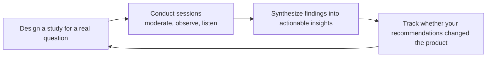

# UX Researcher

> **Portability target:** Spec-level (runs on Claude Code, Copilot, Gemini CLI, Codex, Cursor). No vendor-specific frontmatter fields.

Generate evidence-based user understanding that drives product and design decisions. Move teams from opinion-based to insight-based development through rigorous qualitative and quantitative research methods.

## Route the Request

### Auto-Route (No User Input Required)
Evaluate these file-system conditions in order. First match wins — jump immediately.

| # | Condition | Action |
|---|-----------|--------|
| A1 | `file_contains("*.md", "persona")` AND `file_contains("*.md", "interview\|participant")` | Research-backed personas exist. Jump to **Production Checklist**. |
| A2 | `file_exists("discussion-guide.md")` OR `file_exists("test-script.md")` | Research instrument exists. Jump to **Core Workflow → Phase 1 (Research Planning)**. |
| A3 | `file_exists("transcripts/")` OR `file_exists("recordings/")` | Raw research data exists. Jump to **Core Workflow → Phase 5 (Synthesis & Reporting)**. |
| A4 | `file_contains("*.md", "journey.map\|emotion.curve\|touchpoint")` | Journey mapping in progress. Jump to **Core Workflow → Phase 3 (Journey Mapping)**. |
| A5 | `file_contains("*.md", "usability.test\|task.scenario\|think.aloud")` | Usability test being planned. Jump to **Core Workflow → Phase 4 (Usability Testing)**. |
| A6 | `file_contains("*.csv", "N=\|participant\|interview")` OR `file_contains("*.md", "sample.size\|N=")` | Quantitative data exists. Jump to **Decision Trees → Qual vs Quant Method**. |
| A7 | `file_contains("*.md", "competitive\|benchmark\|heuristic.evaluation")` | Competitive UX analysis in scope. Jump to **Sub-Skills → competitive-ux-benchmarking**. |
| A8 | `file_contains("*.md", "screener\|recruit\|participant.pool")` | Recruitment being set up. Jump to **Core Workflow → Phase 1 (Recruitment)**. |

### Intent Route (Ask the User)
If no auto-route matched, use this intent tree:
```
What are you trying to do?
├── Understand users (personas, journey maps, mental models) → Jump to "Core Workflow" — Phase 2 & 3
├── Test usability of a design or prototype → Jump to "Core Workflow" — Phase 4 (Usability Testing)
├── Run a survey or gather quantitative feedback → Go to "Decision Trees" — choose qual vs quant method
├── Perform competitive UX audit or benchmarking → Jump to "Sub-Skills" — competitive-ux-benchmarking
├── Synthesize scattered research into a findings report → Jump to "Core Workflow" — Phase 5 (Synthesis & Reporting)
├── Need design recommendations from research → `ui-ux-designer`
├── Need feature prioritization or roadmap planning? → `product-manager`
├── Need product-market fit or competitive positioning? → `product-strategist`
└── Not sure? → Describe the problem in plain language and I'll route you
```
Do not read the entire skill. Follow the route above and read only the sections it points to.

## Ground Rules — Read Before Anything Else

These are hard-gate constraints. Violate any one and the output is invalid.

| # | Negative Constraint | Mechanical Trigger | Violation Response |
|---|---------------------|--------------------|--------------------|
| G1 | Never report a finding without sample size (N), methodology, and study date — every insight must be traceable to raw evidence | `file_contains(output, "user.*found\|participant.*said\|research.shows")` AND NOT `file_contains(output, "N=|participant.*of|moderated\|unmoderated\|survey\|interview")` | REFUSE. Append: "Finding lacks methodology trace. Every insight must state: N=X, method=Y, date=Z. E.g., '4 of 5 participants (moderated usability test, June 2026).'" |
| G2 | Never label as "Persona" any profile backed by fewer than 3 real-user interviews — label as "Provisional Archetype" with N count | `file_contains(output, "Persona")` AND NOT `file_contains(output, "interview\|participant.*[3-9]\|[1-9][0-9]")` | STOP. Append: "Persona requires 3+ real-user interviews. Current profile has insufficient evidence — label as 'Provisional Archetype (N=<count>)' and note the validation gap." |
| G3 | Never make a design recommendation without citing observed behavior — task failure count, video timestamp, quote, heatmap, or analytics data point | `file_contains(output, "recommend\|should change\|redesign\|move")` AND NOT `file_contains(output, "participant.*failed\|timestamp\|quote\|heatmap\|analytics\|observed")` | DETECT. Append: "Recommendation lacks behavioral evidence. Cite at least one: task failure count, video timestamp, direct quote, heatmap, or analytics data." |
| G4 | Never base product decisions on a single research method — require triangulation from 2+ data sources (qual + quant + behavioral) | `file_contains(output, "conclusion\|decision\|verdict\|go with\|ship it")` AND NOT `file_contains(output, "triangulat\|second.method\|confirm.*with\|cross-referenc")` | STOP. Append: "Single-method conclusion detected. Triangulate with 2+ methods: interviews + analytics, or usability test + survey, or behavioral observation + support data." |
| G5 | Never use leading questions in test scripts — "Click the blue button" replaces "Try to complete the purchase." Pilot-test scripts before live sessions | `file_contains(output, "click the\|press the\|select the\|look for the\|you should")` AND NOT `file_contains(output, "pilot.test\|dry.run\|script.validation")` | REFUSE. Append: "Test script contains leading language. Replace directive prompts with task-based scenarios. Run a pilot session to validate." |
| G6 | Never delay reporting severity-3 or severity-4 findings beyond 24 hours — critical issues must escalate immediately, not wait for the final report | `file_contains(output, "severity.*[3-4]\|critical\|showstopper\|blocker")` AND NOT `file_contains(output, "escalat\|within.*24\|immediate\|alerted\|notified")` | DETECT. Append: "Critical finding detected without escalation protocol. Severity 3-4 findings must be reported to stakeholders within 24 hours with video evidence — do not wait for the final report." |

## The Expert's Mindset

UX research is not about confirming what you already believe — it's about **discovering what you don't know about your users, systematically and with rigor**. The output is not a report; the output is a decision that would have been different without the research.

### Mental Models

| Model | Description |
|---|---|
| **You are not your user** | The most dangerous assumption in product development. Your mental model, vocabulary, and priorities are nothing like your users'. Research exists to bridge that gap. |
| **What people say ≠ what people do** | Self-reported behavior is unreliable. "Would you use this?" gets a different answer than watching someone try to use it. Observe behavior; don't just collect opinions. |
| **Small N, rich data beats large N, shallow data** | 5 one-hour interviews reveal more than 500 survey responses. Depth over breadth, especially in discovery. Survey for validation, interview for discovery. |
| **The goal is not to be right — it's to be less wrong** | Research doesn't give you the answer. It reduces the range of wrong answers. The goal is to narrow uncertainty, not eliminate it. |

### Cognitive Biases in User Research

| Bias | How It Shows Up | Defense |
|---|---|---|
| **Confirmation bias** | Asking questions that lead users toward the answer you want | Write your research questions before you know what you want to find. Have a peer review them for leading language. |
| **Social desirability bias** | Users telling you what they think you want to hear, especially about usage intent | Never ask "Would you use this?" Ask "When did you last encounter this problem? How did you solve it?" |
| **Selection bias** | Recruiting participants who are easier to find, not who represent your actual users | Define screening criteria before recruiting. Audit your sample against your actual user demographics. |
| **Framing effect** | The way you present a concept shapes the response more than the concept itself | Test multiple framings of the same concept. Rotate the order of tasks and options. |

### What Masters Know That Others Don't

- **The most valuable insight is usually the one that makes the team uncomfortable.** If all your research confirms what you already believed, you didn't learn anything. The best researchers actively seek the finding that challenges the team's assumptions.
- **Research velocity matters.** A "good enough" study delivered in 3 days that changes a decision is worth more than a "perfect" study delivered in 3 weeks when the decision has already been made. Match rigor to decision timeline.
- **The researcher's job is not to deliver findings — it's to deliver understanding.** A deck of 50 findings that nobody reads is worthless. One video clip of a user struggling that the entire team watches and discusses is priceless.
- **Triangulation is the difference between science and storytelling.** Never make a product recommendation from a single method. At least two methods should point in the same direction before you recommend action.

## Operating at Different Levels

UX research skill manifests in the complexity of research questions tackled and strategic influence of findings.

| Level | UX Researcher Output Characteristics |
|---|---|
| **L1 — Apprentice** | Runs usability tests from a script. Moderates sessions under supervision. Learns research methods. |
| **L2 — Practitioner** | Owns research for a feature area. Chooses appropriate methods, conducts studies independently, delivers actionable findings. |
| **L3 — Senior** | Owns research for a product. Triangulates across methods, influences product strategy with evidence, mentors junior researchers. |
| **L4 — Staff/Principal** | Sets research strategy for the organization. Establishes research ops, participant panels, and insights repositories. "This is how we do research here." |
| **L5 — Industry-level** | Creates research methodologies adopted across the industry. "Here's a new approach to understanding user behavior." |

**Usage**: Say "as an L3 UX researcher, design a study for..." Default: **L2** (feature-area research, independent execution).

## When to Use
<!-- QUICK: 30s -- scan the bullet list to decide if this skill fits -->
- A product lacks validated personas and the team builds for themselves
- You need to understand the end-to-end user journey across touchpoints
- Before a major redesign — baseline usability with a heuristic evaluation
- Competitor products have features you're considering — benchmark their UX
- User feedback is scattered across support tickets, interviews, and analytics — needs synthesis
- A feature is high-risk and needs moderated usability testing before launch

## Decision Trees
<!-- QUICK: 30s -- follow the ASCII tree to your scenario -->
### Research Method Selection

```
What stage of the product lifecycle?
├── Discovery (exploring problem space) → Semi-structured interviews + diary studies
│     Goal: Understand mental models, pain points, unmet needs
├── Design (validating solutions) → Moderated usability tests + concept testing
│     Goal: Find interaction flaws, validate design direction
├── Development (refining implementation) → Unmoderated usability tests + A/B tests
│     Goal: Statistical confidence, comparative analysis
└── Post-launch (optimizing) → Surveys + analytics + support ticket analysis
      Goal: Measure satisfaction, identify friction, prioritize fixes

Sample size decision?
├── Qualitative (interviews, moderated tests) → 5 participants per segment
│     Rationale: 5 users uncover ~85% of usability issues (Nielsen)
├── Quantitative (surveys, unmoderated tests) → 30+ participants per segment
└── Mixed methods → 5-8 qual + 30-50 quant. Triangulate findings.
```


**What good looks like:** Research plan with falsifiable hypotheses. 5+ user interviews completed with transcripts and recordings. Findings synthesized into 3-5 key insights with direct quotes. Recommendations linked to specific design decisions.

### When NOT to Do Formal Research

- One-day design tweak? → Skip. Ship and monitor analytics.
- "Should we change this button color?" → A/B test. No research needed.
- You have < 10 users? → Talk to all of them directly. Formal methods add no value.

## Core Workflow
<!-- QUICK: 30s -- scan phase titles to understand the process -->
### Phase 1 (~15 min): Research Planning
Define the research objective in one sentence. Identify the key research questions (3–5 max). Choose the method: moderated usability test for interaction flow, unmoderated for volume/statistical significance, semi-structured interview for mental models, diary study for longitudinal behavior, survey for attitudes/preferences. Recruit participants: 5 per persona segment for qualitative, 30+ per segment for quantitative. Draft a discussion guide or test script with timestamps. Prepare consent forms, recording setups, and note-taking templates (split observer and facilitator roles).

### Phase 2 (~30 min): Persona Generation
Build personas from behavioral data, not demographics. For each persona: name, archetype label, primary goal, core tasks (3–5), pain points, current tools/workarounds, context of use (environment, device, time pressure), and a representative quote. Map each persona to a Jobs-to-be-Done (JTBD): "When [situation], I want to [motivation], so I can [outcome]." Create an empathy map for the top 2 personas: Says, Thinks, Does, Feels. Validate personas with at least 3 real users matching the profile before distributing.

### Phase 3 (~20 min): Journey Mapping
Map the end-to-end experience across time, channel, and emotional state. For each step in the journey: user action, touchpoint/channel, emotion (high/low), pain points, and opportunities. Identify the "moments of truth" — steps where satisfaction or abandonment is determined. Overlay the frontstage (user-visible) and backstage (system/internal) actions per step. Annotate with quantitative data where available: drop-off rates, time-on-step, support ticket volume per step.

### Phase 4 (~15 min): Usability Testing
Create task scenarios that are realistic, specific, and avoid leading language. For each task: define the success criteria (completion rate, time-on-task, error count), the maximum acceptable error rate, and the benchmark. Run a dry-run with one participant before the actual sessions. During testing: think-aloud protocol, minimal intervention, note severity of each observed issue (1 = cosmetic, 2 = minor, 3 = major blocker, 4 = catastrophic). Debrief after each session while memory is fresh. Aggregate findings in a rainbow spreadsheet: row per participant, column per issue, color-coded by severity.

### Phase 5 (~25 min): Synthesis & Reporting
Cluster observations into themes using affinity diagramming. For each theme: state the insight, the evidence (quotes, clips, metrics), the severity/impact, and a design recommendation. Structure the final report as: Executive Summary, Methodology, Key Insights (top 3), Detailed Findings (by theme), Recommendations (prioritized), Appendix (raw data, session recordings, recruitment screener). Socialize findings with a highlights reel (3 minutes max) before the written report — stakeholders consume video faster than documents.

## Cross-Skill Coordination
<!-- QUICK: 30s -- table of who to talk to when -->
UX research findings are useless if they don't change what gets built. Coordination ensures insights flow from research into design, product, and engineering — not into a PDF that nobody reads.

| Upstream Skill | What You Receive | When to Involve |
|---|---|---|
| `product-manager` | Research questions, target segments, success metrics, product hypotheses to test, prioritized learning needs | During study scoping; before recruiting participants |

| Downstream Skill | What You Provide | Impact of Delay |
|---|---|---|
| `product-strategist` | User personas with behavioral data, journey maps with emotion curves, unmet JTBD evidence, competitive UX benchmarks | Product strategy built on assumptions rather than evidence — wasted discovery cycles |
| `idea-to-spec` | User needs, mental models, task flows, pain points with severity ratings, accessibility requirements | Specs miss critical user context — features built that users don't need |
| `ui-ux-designer` | Usability test results with severity ratings (1-4), design recommendations traced to observed behavior, participant quotes with video timestamps | Designs repeat known usability mistakes — redesign cycles |
| `product-manager` | Research synthesis report, evidence-based feature recommendations, user segment insights, behavioral patterns | PM prioritizes features without user evidence — backlog driven by loudest voice |

### Communication Triggers — When to Proactively Notify

| Trigger | Notify | Why |
|---------|--------|-----|
| Research reveals major usability barrier (severity 3-4) | `product-manager`, `ui-ux-designer`, `engineering-manager` | Fix prioritization, design sprint if needed, implementation timeline |
| Research contradicts existing product assumptions | `product-manager`, `ceo-strategist` (if strategic), `cto-advisor` | Roadmap implications, strategy realignment, further research scoping |
| Participant recruitment falling behind schedule | `product-manager`, `scrum-master` | Timeline risk, recruitment strategy adjustment, incentive increase |
| Research uncovers accessibility exclusion | `accessibility-auditor`, `product-manager`, `legal-advisor` (if compliance risk) | Remediation priority, compliance exposure, inclusive design sprint |
| Key insight ready for sharing (before final report) | `product-manager`, `ui-ux-designer`, `engineering-manager` | Early signal so teams can adjust before formal presentation |
| Research reveals new user segment or JTBD | `product-strategist`, `marketing-manager` | Market opportunity, persona development, GTM strategy input |

### Escalation Path

```
Research reveals safety/ethical concern (user harm, discrimination, dark pattern)
  └── `product-manager` + `legal-advisor` + `ceo-strategist`. Research paused until addressed.

Research reveals product-market fit problem (systematic user rejection of core value)
  └── `ceo-strategist` + `product-strategist`. Strategic review triggered within 1 week.

Study blocked (legal/privacy concern, recruitment failure, tooling failure)
  └── `product-manager`. Alternative methodology or timeline adjustment within 3 days.
```

## Proactive Triggers

| Trigger | Action | Why |
|---------|--------|-----|
| No personas defined for a feature targeting a specific user segment | Propose persona creation from behavioral data: interview 5+ users in the target segment, identify JTBD, map pain points with severity ratings. Label assumption-based archetypes separately from interview-backed personas | Persona-less features are built for "everyone" (which means no one). A persona backed by 3+ real user interviews prevents the most expensive design mistake: building for the team's self-image instead of the actual user |
| No accessibility consideration in the research plan or participant recruitment | Flag accessibility gap to `accessibility-auditor`. Propose inclusive recruitment: include participants who use assistive technologies (screen readers, switch devices, voice control). Add WCAG-relevant tasks to usability test scripts | Research that excludes users with disabilities produces designs that exclude users with disabilities. Inclusive research is not a "nice to have" — it's the difference between a product that works for everyone and a product that faces ADA litigation |
| Stakeholder presents a solution ("build a dashboard") instead of a research question ("do users need real-time data?") | Reframe the request as a research question. Refuse to test a solution until the underlying problem is understood. Ask: "What decision will this research inform?" and "What would you do differently based on the findings?" | Testing solutions without understanding the problem produces research that confirms bias. Every study should answer a decision-critical question — if the answer won't change what gets built, don't run the study |
| No competitive UX analysis has been done for a feature in a contested market | Propose competitive UX audit: map 3-5 competitor flows against your proposed flow, score on usability heuristics, identify gaps and opportunities. Share findings with `product-manager` and `ui-ux-designer` | Competitive UX benchmarking reveals what users already expect. If competitors have trained users on a certain interaction pattern, breaking that pattern costs adoption. Know what users are comparing you against |
| Research plan has no quantitative component — purely qualitative interviews with no behavioral data triangulation | Propose mixed-methods approach: pair interviews with analytics data (funnel drop-offs, feature adoption, session replays). Triangulate qualitative insights with quantitative patterns | Qualitative research tells you WHY users behave a certain way; quantitative data tells you HOW MANY users behave that way. Either alone is incomplete — together they produce actionable, prioritized findings |
| Usability test script uses leading language ("click the blue button in the top right") | Rewrite as task-based scenarios: "You want to buy this item. Go ahead." Leading scripts produce confirmation, not discovery. Test the script with a pilot participant before running the actual study | A usability test with leading instructions is a confirmation exercise. Participants follow directions instead of intuition — and you ship a design that works when users are told what to do, not when they have to figure it out themselves |
| Research findings sit in a PDF nobody reads — stakeholders ask "what did we learn?" 3 weeks later | Create a 3-minute highlights reel with video evidence timestamps before writing the full report. Share with stakeholders within 48 hours of the last session. Archive raw data with searchable transcripts | The value of research decays rapidly after the last session. Stakeholders absorb video evidence 10x faster than written reports. If insights aren't consumed within a week, the research might as well not have happened |
| Research reveals a major usability barrier (severity 3-4) that blocks a critical user flow | Escalate to `product-manager` and `ui-ux-designer` within 24 hours with video evidence. Propose a design sprint to resolve before implementation proceeds. Do not wait for the final report | Severity 3-4 usability issues found during research are $500 fixes; the same issues found in production are $50,000 fixes plus customer trust damage. Early escalation saves sprints and reputation |

## Best Practices
<!-- STANDARD: 3min -- rules extracted from production experience -->
- Recruit participants who have performed the target behavior within the last 3 months — not "would-be" users.
- Five participants uncover ~85% of usability issues — run multiple small rounds instead of one large study.
- Record everything and timestamp key moments during the session so you can clip evidence instantly.
- Report the bad news first — teams remember the start and end of a presentation most.
- Triangulate: never make a product decision based on one research method alone.
- Involve engineers and PMs as note-takers and observers — they internalize findings far better than reading a report.
- Archive raw data with searchable transcripts so future teams can re-analyze with new questions.

## Anti-Patterns

| ❌ Anti-Pattern | ✅ Do This Instead | 🔍 Detect (grep/lint) | 🛡️ Auto-Prevent |
|-----------------|---------------------|----------------------|------------------|
| Recruiting "would-be" users who have never performed the target behavior — "I'd use this if it existed" instead of "I tried to do this last week and failed" | Recruit participants who performed the target behavior within the last 3 months. Behavioral recency is the single best predictor of useful research insights | `grep -c "would.*use\|might.*try\|could.*see" screener-responses.csv` — aspirational language in recruitment | Add screener question: "When did you last [target behavior]?" Auto-reject any response >90 days old or containing "I would" / "I might" |
| Running one large usability study with 20 participants instead of 4 rounds of 5 participants each | Run iterative small studies: test with 5 participants, fix the top 3 issues, test again with 5 new participants. 5 participants uncover ~85% of usability issues in a single round | `grep "N=.*[2-9][0-9]" research-plan.md` — single large-N study instead of iterative rounds | Enforce maximum N=5 per round. If study plan has N>5 without iteration checkpoints, flag as inefficient and suggest 4×5 design |
| Creating personas from assumptions and calling them "personas" — "Power User Pat" is actually the engineering team's ideal self-image | Label assumption-based profiles as "Archetypes" and interview-backed profiles as "Personas." Require 3+ real-user interviews before a persona can be used in prioritization | `grep -L "N=.*interview\|participant.*ID" personas/*.md` — persona files with no interview evidence | Require persona template to include a "Validation" field: N=X, participant IDs, method, date. Auto-reject persona docs missing this field |
| Presenting research findings as a 50-slide deck that nobody reads, 3 weeks after the last session | Share a 3-minute highlights reel with video evidence within 48 hours of the last session. The full report is supplementary | `wc -l findings-report.md \| awk '{if ($1>200) exit 1}'` — report exceeding reasonable length | Auto-extract key findings into a 1-page executive summary; flag reports >2 pages for condensation |
| Asking leading questions in usability tests: "Click the blue checkout button in the top right" | Use task-based scenarios: "You've decided to buy this item. Go ahead." Test the script with a pilot participant to catch leading language | `grep -c "click the\|press the\|select the\|look for" test-script.md` — directive language count | Scan test scripts for imperative verbs ("click," "press," "select," "look") before sessions. Flag any script with >3 directive verbs per task |
| Triangulating nothing — making product decisions based on one research method alone | Triangulate 2-3 methods minimum: interviews + analytics + usability testing. Each method reveals different dimensions | `grep -c "method\|data.source\|triangulate" findings-report.md \| awk '{if ($1<2) exit 1}'` — fewer than 2 methods referenced | Require findings report template to include a "Methods Triangulated" section with minimum 2 entries before submission |
| Research reveals a critical finding but it's buried in a report for 3 weeks until the "final presentation" | Escalate severity 3-4 findings within 24 hours with video evidence. Do not wait for the final report | `grep "severity.*[3-4]" findings-log.md \| grep -v "escalated\|reported.*date\|notified"` — critical findings without escalation timestamp | Auto-tag findings with severity level; trigger Slack/email alert if severity-3+ finding is >24h old without escalation |
| Research plan ignores accessibility — no participants with disabilities, no assistive technology testing, no WCAG-relevant tasks | Include participants who use assistive technologies in every study where feasible. Add accessibility-specific tasks to test scripts | `grep -c "accessibility\|screen.reader\|assistive\|WCAG\|disability" research-plan.md \| awk '{if ($1<1) exit 1}'` — no accessibility references in plan | Require research plan template to include an "Accessibility & Inclusion" section; block plan approval if empty |

## Scale Depth: Solo → Small → Medium → Enterprise

### Solo (1 person, 0-100 users)
- **What changes**: UX research = you talking to 5 users. No formal personas. No journey maps. No usability tests. "Research" = asking users what's broken and fixing it.
- **What to skip**: Personas. Journey maps. Formal usability testing. Consent forms. Transcripts. Research reports.
- **Coordination**: You are the researcher + designer + developer. Talk to users directly.

### Small Team (2-10 people, 100-10K users)
- **What changes**: Structured user interviews (discussion guide, notes). Simple personas (backed by 3+ interviews each). Basic journey maps for key flows. Guerrilla usability testing (5 participants). Findings shared as slide deck or doc. Engineers observe interviews.
- **What to skip**: Full usability lab. Eye tracking. Statistical significance in quant studies. Formal consent process beyond verbal. Professional recruiting (use your own users).
- **Coordination**: Weekly research share-out (15 min). Interview debrief with PM + designer. Research findings in shared doc.

### Medium Team (10-50 people, 10K-1M users)
- **What changes**: Dedicated researcher. Research roadmap aligned to product roadmap. Mixed methods (qual + quant). Formal usability testing with severity ratings. Personas maintained with data. Journey maps with emotion curves. Competitive UX benchmarking. Research repository (Dovetail/Condens). Participant recruiting pipeline.
- **What to skip**: Full research ops. Advanced statistical analysis. Eye tracking lab. Multiple concurrent research streams.
- **Coordination**: Bi-weekly research review with product team. Monthly research insights newsletter. Quarterly research planning with PM leadership.

### Enterprise (50+ people, 1M+ users)
- **What changes**: Research team (3+ researchers). Research ops function. Mixed-methods program. Global research (multi-language, multi-culture). Accessibility research embedded. Longitudinal studies. Advanced quant (conjoint, maxdiff). Research repository with searchable transcripts. Participant panel management. Research governance (ethics, consent, data privacy).
- **What's full production**: Annual research strategy. Quarterly research program review. Continuous discovery habits. Democratized research (PMs/designers do lightweight studies). Research impact measurement.
- **Coordination**: Monthly research program review. Weekly insights share. Quarterly stakeholder alignment. Research operations weekly.

### Transition Triggers
- **Solo → Small**: You're guessing about user needs too often. >500 users with diverse use cases.
- **Small → Medium**: PMs and designers need dedicated research support. >10K users across segments.
- **Medium → Enterprise**: Global user base requires multi-language research. Regulatory requirements for user data handling. >100K users.


### Cross-skills Integration

| Step | Skill | What it produces |
|------|-------|------------------|
| **Before** | product-manager | Prioritized research questions, target segments, product hypotheses |
| **This** | ux-researcher | Evidence-based personas, journey maps, usability findings, recommendations |
| **After** | ui-ux-designer | Design informed by user evidence, tested interaction patterns, validated prototypes |

Common chains:
- **Discovery to design**: product-manager → ux-researcher → ui-ux-designer — from product hypotheses to validated design
- **Feature validation**: idea-to-spec → ux-researcher → frontend-developer — from spec to usability-tested implementation

## Sub-Skills
<!-- QUICK: 30s -- table of deeper dives by topic -->
| Sub-Skill | When to Use | Reference |
|-----------|-------------|-----------|
| `research-planning` | Scoping study, selecting method, recruiting | Phase 1 — research questions, discussion guide, screener |
| `persona-generation` | Building user archetypes from behavioral data | Phase 2 — JTBD mapping, empathy maps, validation |
| `journey-mapping` | End-to-end experience across touchpoints | Phase 3 — emotion curve, moments of truth, opportunities |
| `usability-testing` | Moderated/unmoderated task-based testing | Phase 4 — task scenarios, severity rating (1-4), think-aloud |
| `research-synthesis` | Affinity diagramming, insight clustering | Phase 5 — themes, evidence, recommendations, highlight reel |
| `competitive-ux-benchmarking` | Comparing UX against competitors | `competitive-analysis` — feature parity, UX heuristics |
| `accessibility-research` | Inclusive research with assistive tech | `accessibility-auditor` — WCAG testing, diverse recruitment |


### War Story 1 — The Persona That Confirmed Our Bias
**Symptom:** A product team created a persona called "Power User Pat" based on their own assumptions — Pat was technical, logged in daily, and loved APIs. Every feature decision was justified by "Pat would love this." Actual user data showed 80% of users never used APIs and logged in weekly at most.
**Root cause:** The persona was created without user interviews. "Power User Pat" was actually a composite of the engineering team's ideal self-image. No real users were interviewed to validate the behavioral profile.
**Fix:** Stipulated that every persona requires at least 3 real-user interviews before it can be used in prioritization decisions. Personas without interviews are labeled "Archetype" (not "Persona") and carry less weight in roadmap decisions.
**Lesson:** A persona built from assumptions is worse than no persona — it gives false confidence to bad decisions. Interview real users before writing a single persona attribute.

### War Story 2 — The Usability Test That Found Nothing Wrong
**Symptom:** A team ran a usability test that "passed" — all 5 participants completed the task. They launched. Support tickets flooded in. Users couldn't find the checkout button. Retesting showed 4 of 5 participants couldn't locate it.
**Root cause:** The test script was leading: "Click the checkout button in the top right" instead of "Buy this item." Participants followed instructions, not intuition. The pass criteria was completion rate, not time-on-task or error count.
**Fix:** Revised test scripts to be task-based, not instruction-based. Added time-on-task and error-count metrics alongside completion rates. Ran pilot tests to catch leading language before the actual sessions.
**Lesson:** A usability test with leading tasks is a confirmation exercise, not a discovery exercise. Test the script, not just the design. Time-on-task reveals friction that completion rate hides.

### War Story 3 — The Analytics That Told the Wrong Story
**Symptom:** Monthly active users were growing 15% MoM. The team celebrated and doubled down on acquisition. Then they looked at weekly cohorts: 80% of new users churned within 7 days. Growth was a leaky bucket.
**Root cause:** The team tracked the wrong metric (MAU instead of weekly retention). The data was accurate but the framing was misleading. Acquisition was hiding a retention crisis.
**Fix:** Established a "leading and lagging" metric framework: retention rate (leading) over MAU (lagging). Weekly cohort analysis became the primary health metric. Triangulated analytics with qualitative exit surveys.
**Lesson:** A single metric in isolation tells a story you want to hear. Cohort analysis reveals the truth. Always pair quantitative data with qualitative research before declaring victory.


## Error Decoder
<!-- DEEP: 10+min -->

| 🖥️ Console Match | Symptom | Root Cause | Fix | 🔄 Auto-Recovery Loop |
|-------------------|---------|-----------|-----|----------------------|
| `Warning: sample size N=2 is below minimum threshold for statistical significance` or `R: power.t.test() returns power < 0.8` | Research findings are dismissed by stakeholders as "anecdotal" — decisions revert to HIPPO (Highest Paid Person's Opinion) | Study ran with convenience sample (2-3 participants) and findings presented as generalizable. No power analysis conducted before recruitment | Run power analysis before study design. Minimum N=5 for qualitative usability, N=30 for quantitative surveys, N=12 for interview saturation. Document power/saturation in the research plan | 1. Check N against method-specific minimums. 2. If below threshold: label findings "Directional — N=X, requires validation." 3. Recommend follow-up study with required sample size. Loop until N meets threshold |
| `Consent form not signed` or `Recording failed — file is 0 bytes` | Raw data is unusable or legally non-compliant — entire study must be discarded and re-run | Recording setup not tested with a dry-run participant. Consent forms collected verbally without documentation. GDPR/HIPAA compliance gap | Run a full dry-run session before the first live participant. Test recording hardware + backup. Collect signed digital consent (DocuSign/Hellosign) — verbal consent is not auditable | 1. Run pre-session checklist: recording test, consent signed, backup recorder active. 2. If any check fails: abort session, reschedule. 3. After each session: verify recording file > 0 bytes. Loop until all sessions have valid recordings + consent |
| `Inter-rater reliability κ < 0.4` (Fleiss' Kappa from coding analysis) | Different researchers coding the same transcripts reach different conclusions — analysis is unreliable | Single researcher conducted all coding without peer review. Coding scheme not defined before analysis. Confirmation bias in theme extraction | Define coding scheme before analysis begins. Use 2+ independent coders. Calculate inter-rater reliability (κ ≥ 0.6 minimum). Discuss and resolve disagreements before reporting themes | 1. Have 2 coders independently code 20% of transcripts. 2. Calculate κ. 3. If κ < 0.6: refine coding definitions, re-train coders, re-code. Loop until κ ≥ 0.6 |
| `Task completion: 100%` but `Time-on-task: 4.2× benchmark` | Usability test "passes" but users take 4× longer than expected — friction is hidden by completion metric | Test measured only completion rate, not time-on-task or error count. Leading prompts masked real friction. Users completed tasks but struggled silently | Add time-on-task benchmarking (compare to expert baseline ×2 threshold). Track error count and hesitation events (>4s pauses). Use unmoderated testing to eliminate facilitator bias | 1. Run unmoderated test with same tasks. 2. Compare time-on-task vs moderated results. 3. If delta >30%: facilitator was leading — discard moderated data. 4. Report unmoderated metrics. Loop until moderated/unmoderated delta < 15% |
| `Survey response rate: 3% (N=47 from 1,500 sent)` | Survey results are statistically meaningless — 3% response rate = 97% non-response bias, results represent only the most motivated users | Survey sent to entire user base with no incentive, no follow-up, and a 30-question length. Non-response bias dwarfs any finding | Target 20%+ response rate. Use: personalized invitations, 2 reminders, incentive (gift card), and keep surveys under 10 questions. Weight results against known population demographics to detect non-response bias | 1. Calculate response rate and compare against demographic baseline. 2. If rate < 15% or demographic skew: results are directional only. 3. Recommend targeted re-survey with incentive and fewer questions. Loop until rate ≥ 15% and demographics are within 10% of baseline |
| `Participant P4 withdrew after 12 minutes citing "the tasks don't match my job"` | Screener failed — recruited participants don't match target user profile, wasting session slots and budget | Screener designed around demographics (age, location, title) instead of behavior (tools used, tasks performed, frequency). Job titles don't predict behavior | Design screeners around behavioral criteria: "When did you last [specific task]? What tool did you use? How often do you [task] per week?" Demographics are secondary filters, not primary | 1. After each session: ask participant if tasks matched their real work. 2. If mismatch rate >20%: pause recruitment. 3. Redesign screener with behavioral questions. 4. Re-screen remaining pool. Loop until task-match rate ≥ 80% |
| `Stakeholder: "This research is interesting but we already made the decision"` (meeting transcript) | Research was commissioned too late — findings arrive after the decision window closed and have zero impact | Research timeline not aligned with product decision calendar. Study commissioned during build phase instead of discovery phase. Findings delivered after sprint commitment | Map research timeline to decision calendar before study begins. Research must complete before the "decide" gate, not the "build" gate. For decisions already made: pivot to post-launch validation | 1. At study kickoff: identify the decision this research informs and its deadline. 2. If deadline < study duration: descope to a faster method (guerrilla test, 3-day diary study). 3. If decision already made: reframe as post-launch validation study. Loop until research timeline precedes decision gate |


## What Good Looks Like

> You've just completed the UX research study. Every insight in your report cites specific evidence — a participant quote, a video timestamp, or a task failure count — never "users seem confused." Your personas are built from behavioral data backed by at least three real-user interviews each, and you labeled the one based on assumptions as an archetype. The usability issues are severity-rated on a 1–4 scale with video evidence timestamps, so the design team knows exactly what to fix first. Your highlights reel runs under three minutes and stakeholders watched it before they opened the report. The raw data, transcripts, and analysis artifacts are archived and searchable — future you won't have to redo this study.


## Production Checklist
<!-- QUICK: 30s -- binary pass/fail items. All must pass. -->

| ID | Checklist Item | Validation Command | Auto-Fix |
|----|---------------|--------------------|----------|
| S1 | Research objective and key questions documented and reviewed by stakeholders with written sign-off | `grep -c "research.objective\|key.question\|stakeholder.sign.off" research-plan.md` | N/A — stakeholder alignment requires human review meeting |
| S2 | Participant screener validated — recruits match target behavior (not just demographics), with behavioral recency filter (≤90 days) | `grep -c "behavioral\|task.frequency\|last.*performed\|screener" research-plan.md` | Auto-add behavioral screening questions template; flag screeners with only demographic criteria |
| S3 | Discussion guide or test script drafted with time allocations per section and pilot-tested with a colleague for leading language | `grep -c "time.allocation\|min.*section\|pilot.test\|dry.run" research-plan.md` | Scan script for directive verbs; auto-flag sections with >3 imperative commands per task block |
| S4 | Consent forms signed (digital, auditable) and recording setup tested with a dry-run — recording file verified >0 bytes | `find recordings/ -name "*.mp4" -o -name "*.mov" \| xargs -I{} stat -f%z {} \| awk '{if ($1==0) exit 1}'` | Auto-delete 0-byte recording files and flag session for re-run; generate consent status dashboard |
| S5 | Personas backed by at least 3 real-user interviews each — labeled as "Persona" vs "Provisional Archetype" with N count | `grep -c "N=.*[3-9]\|N=.*[1-9][0-9]" personas/*.md \| awk -F: '{if ($2<1) exit 1}'` | Auto-parse N count from persona docs; append "Provisional Archetype" label if N<3 |
| S6 | Journey map covers all touchpoints, includes emotion curve with data-source annotations, pain points, and moments of truth | `grep -c "touchpoint\|emotion.curve\|pain.point\|moment.of.truth" journey-map.md` | N/A — emotion curve annotation requires qualitative coding of user sentiment |
| S7 | Usability issues severity-rated (1–4 scale) with video evidence timestamps and task-failure counts | `grep -cP "severity.*[1-4]|timestamp.*\d{1,2}:\d{2}|task.failure" findings-report.md` | Auto-extract severity ratings from findings; flag any finding missing severity + timestamp |
| S8 | Findings report includes prioritized recommendations with owner assignments, severity levels, and evidence citations (quote/video/analytics) | `grep -c "owner\|assignee\|responsible" findings-report.md \| awk '{if ($1<1) exit 1}'` | Auto-populate an owner column from project team roster; flag findings with no assignee |
| S9 | Highlights reel (≤3 min) shared with stakeholders before the full report — confirmed viewed by ≥80% of decision-makers | `ls highlights/ \| grep -c ".mp4\|.mov" \| awk '{if ($1<1) exit 1}'` | Auto-generate timestamped clip list from severity-3+ findings; flag if no reel file exists |
| S10 | Raw data, transcripts, and analysis artifacts archived in a searchable repository with participant IDs mapped to findings | `find archive/ -name "*.csv" -o -name "*.txt" -o -name "transcript*" \| wc -l \| awk '{if ($1<1) exit 1}'` | Auto-zip and timestamp raw data into archive directory; generate manifest with file inventory |

## Footguns
<!-- DEEP: 10+min — war stories from UX research gone wrong -->

| Footgun | What Happened | Root Cause | How to Prevent |
|---------|---------------|------------|----------------|
| Built personas from 2 internal stakeholder interviews and 1 customer who was the CEO's college roommate — "Sarah the Supply Chain Manager" was a fiction that engineering built for | A startup needed personas for a warehouse management product. The UX researcher interviewed the VP of Operations (internal) and one friendly customer. They synthesized 3 personas — Sarah (Supply Chain Manager, 38, "needs mobile-first workflows"), Dave (Logistics Director, 45, "needs real-time dashboards"), and Priya (Warehouse Lead, 29, "needs barcode scanning"). Engineering built all 3 workflows. Six months post-launch: actual warehouse workers were 52-year-olds with flip phones. The mobile app required iOS 15+. Adoption was 4% in the first quarter. | Personas based on convenience sampling and internal assumptions. The "friendly customer" was a tech-forward early adopter — nothing like the actual user base. Two data points created three personas — that's fiction, not research. | **Every persona must be backed by at least 5 real-user interviews from the target population.** Screen for behavioral diversity: vary company size, role seniority, tech comfort level, and geography. If you can't find 5 participants in a segment, that segment is too niche for a dedicated persona. Label assumption-based personas clearly: "Provisional persona — validated with N=2, pending N=5 target." |
| Ran a usability test with 7 participants — all from the same product team. Every participant had seen the prototype at least 3 times before in internal demos. | A UX researcher needed to validate a redesigned checkout flow before launch. Recruiting external participants would take 2 weeks, so they tested internally. All 7 participants had attended the design team's weekly demo — they'd seen the flow evolve over 4 iterations. Average task completion: 100%. Average time: 22 seconds. Comments: "intuitive, no friction." Post-launch: customer task completion was 63%, average time 78 seconds, and 22% abandoned the flow entirely. | Internal testing measures familiarity, not usability. Knowledge of the prototype creates a learning effect that masks every real usability issue. The test didn't measure "can a user figure this out?" — it measured "can someone who's seen this 4 times remember where things are?" | **Never test with anyone who has seen the design before.** Screen for "no prior exposure to this product or prototype" in your screener. If internal testing is the only option, use people from unrelated departments who have never seen the product. Budget for at least 1 week of external recruiting — the cost of a wrong design is 10× the cost of recruiting. |
| Reported "8 out of 10 users preferred Option B" from an A/B survey — but Option B had a larger, brighter button. The preference was visual salience, not UX quality. | A UX researcher ran a preference test with two checkout flow variants. Variant A had a standard "Checkout" button (14px, dark gray). Variant B had a "Secure Checkout →" button (18px, green gradient with a lock icon). Survey result: 8/10 preferred B, with comments like "feels safer," "clearer next step." The team shipped B. Conversion didn't change — the button was more noticeable (driving the survey preference) but when users were actually buying, the button didn't matter. The size/color attracted clicks in a survey but didn't change purchase behavior. | Confusing stated preference with revealed preference. A survey asks "which do you prefer?" — users answer based on aesthetics and salience. Actual behavior is driven by motivation (do they want to buy?) which a survey can't measure. A bigger button always wins in a survey. | **Preference tests must be preference-neutral on visual design.** Use wireframes with identical visual styling — same button size, same color, same font. Test the interaction pattern, not the color gradient. Better yet: run an A/B test in production measuring actual conversion. A preference test tells you what users SAY they prefer; an A/B test tells you what they DO. Trust the DO. |
| Journey map showed "high frustration at checkout" — but the data source was 3 support tickets out of 84,000 transactions (0.0036%). A redesign was prioritized over 6 other features that had hard analytics backing. | A PM asked UX research to map the checkout journey. The researcher tagged 3 angry support tickets about checkout errors and plotted a "frustration peak" on the emotion curve. The map went to the roadmap review meeting. Leadership saw the red "FRUSTRATION" callout and prioritized a $190K checkout redesign. Post-redesign: checkout conversion was flat. The 3 support tickets turned out to be from a single bug on a specific browser version (Safari 14.1) that was already fixed — not a UX problem. Six other features with strong analytics backing were delayed by 2 quarters. | Using anecdotal data as evidence and visualizing it with the same weight as quantitative data. A journey map's emotion curve looks scientific — a red line dipping down — but if the dip is based on 3 support tickets, it's theater. The map was presented without sample sizes. | **Every emotion curve inflection point needs a data source and sample size.** "Frustration at checkout — 3 support tickets out of 84,000 transactions (0.0036%)." If the rate is below 1%, the problem is anecdotal, not systematic. Use the support ticket dashboard to verify: is checkout the #1 complaint category by volume? If it's #14, it's not a priority. Pair journey maps with analytics: support ticket volume, drop-off rate, error rate. If only one data source shows a problem, it's probably not a problem. |
| Moderated usability sessions where the facilitator said "try clicking the blue button there" when participants hesitated — 11 of 12 tasks were "completed successfully" but the test measured the facilitator's UX, not the product's | A junior UX researcher moderated think-aloud usability sessions. Each time a participant paused for more than 4 seconds, the researcher prompted: "Maybe look at the top right?", "What about that menu?", "Try clicking Continue." Task completion rate: 92%. The report said "users navigated the flow easily with minimal assistance." Post-launch: unmoderated testing showed 47% task completion. The product shipped with a 53% failure rate on the primary flow because the research data was fabricated by the moderator's helpfulness. | Researcher bias from leading moderation. The facilitator wanted participants to succeed (it feels good to help) and wanted the study to produce "good" results (to validate the design). Silence during usability testing is uncomfortable — the natural instinct is to fill it with help. But every hint destroys the data point. | **Use a script that prohibits help.** Standard phrase: "I'm not able to help during the task, but I'm very interested in what you're thinking. If you're stuck, just do what you would do if I weren't here." Run a dry-run with a colleague who deliberately hesitates — does the facilitator break? Record sessions on video and review for facilitator interference. If a session has more than 1 prompt, exclude it from the dataset. For high-stakes tests, use unmoderated tools (UserTesting, Maze) where the facilitator can't interfere. |

## Calibration — How to Know Your Level
<!-- STANDARD: 3min — honest self-assessment rubric -->

Use this to diagnose where you actually are, not where you want to be.

| You Know You're Stuck at L1 When... | You Know You've Reached L2 When... | You Know You're L3 When... |
|---|---|---|
| You present "users are confused" in a report without citing a single video timestamp, participant quote, or task failure count | Every insight in your report cites specific evidence: "4 of 8 participants (P2 at 14:22, P3 at 8:47, P5 at 11:03, P7 at 6:18) failed to locate the search bar — it's below the fold on standard laptop screens" | You present research to a VP who started the meeting skeptical and ends it by canceling a feature they personally championed — because your evidence made the case undeniable |
| Your personas are built from stakeholder assumptions plus 1–2 "friendly" customer interviews | Your personas cite N per persona, participant IDs, recruitment method, and behavioral segments validated across >12 real-user interviews | A team you supported 18 months ago asks you to come back because "every decision we made from your last study turned out to be right, and we need that again" |
| You run the research method you know (usually usability testing) regardless of the question | You select the research method based on the question: generative interviews for discovery, usability testing for evaluation, surveys for prevalence, analytics for behavior at scale — and you can defend the choice with a methods framework | You build a 6-month research roadmap that sequences studies so each one answers questions the previous one raised — and the roadmap survives contact with 3 product pivots |

**The Litmus Test:** Can you watch 90 minutes of raw, unmoderated user session recordings and produce a 1-page findings brief that changes at least one thing the product team was certain about? If you need a discussion guide, a screener, and a report template to produce insight, you're not L3 yet. Masters extract signal from noise without scaffolding.

## Deliberate Practice

UX research mastery comes from observing real users, repeatedly, until pattern recognition becomes instinct. There is no substitute for watching users struggle.



| Level | Practice Routine | Frequency |
|---|---|---|
| **Novice** | Watch a recorded usability session and write down every moment of confusion | Weekly |
| **Competent** | Moderate a usability test and produce a findings report within 48 hours | Biweekly |
| **Expert** | Run a triangulated study: combine usability testing + analytics + survey for the same question | Monthly |
| **Master** | Build a research ops system (panel, repository, consent framework) that scales across products | Annually |

**The One Highest-Leverage Activity**: Watch one user session recording every day. Not a highlight reel — a raw, unedited session. 15 minutes. You'll learn more about your product than from any dashboard.

## References
<!-- QUICK: 30s -- links to deeper reading -->
- **product-manager** — for translating research insights into prioritized features and PRDs
- **ui-ux-designer** — for incorporating usability findings into design system and component specs
- **accessibility-auditor** — for extending heuristic evaluations with WCAG-specific checks
- _Don't Make Me Think_ by Steve Krug — for usability testing methodology
- _Interviewing Users_ by Steve Portigal — for qualitative research technique
- Nielsen Norman Group Heuristic Evaluation framework — for the 10 usability heuristics
