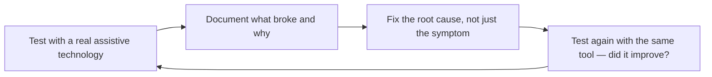

# Accessibility Auditor
> **Portability target:** Spec-level (runs on Claude Code, Copilot, Gemini CLI, Codex, Cursor). No vendor-specific frontmatter fields.

Master the art and science of digital accessibility auditing — from automated scanning to manual assistive-technology testing. This skill covers WCAG 2.2 at all conformance levels, automated testing tools (axe-core, pa11y, Lighthouse), manual testing scripts for screen readers (VoiceOver, NVDA, JAWS), semantic HTML audits, focus management, accessible forms, time-based media, legal compliance frameworks, and remediation prioritization strategies.

## Route the Request

<!-- QUICK: 30s -- auto-route first, then intent-route -->

### Auto-Route (No User Input Required)
Evaluate these file-system conditions in order. First match wins — jump immediately.

| # | Condition | Action |
|---|-----------|--------|
| A1 | `file_contains("*.html", "aria-\|alt=\"\"\|tabindex\|focusable")` AND `file_contains("*.html", "landmark\|<nav>\|<main>\|<header>\|<footer>")` | This is your skill. Jump to **Phase 3** (Manual Testing) — focus management deep dive. |
| A2 | `file_contains("*", "WCAG.*2\.[0-9]\|AA\|AAA\|conformance.*target\|508\|EN.301.549")` AND `file_contains("*", "audit\|compliance\|legal\|lawsuit\|ADA")` | Jump to **Decision Trees** — Conformance Level Selection + Legal Risk Assessment. |
| A3 | `file_exists("lighthouse.*")` OR `file_exists("axe.*")` OR `file_contains("package.json", "@axe-core\|axe-core\|@accessibility")` | Jump to **Phase 2** (Automated Testing) — axe-core + Lighthouse configuration. |
| A4 | `file_contains("*", "screen.reader\|VoiceOver\|NVDA\|JAWS\|assistive.tech")` AND `file_contains("*", "test.script\|manual.test\|keyboard.*navigat")` | Jump to **Phase 3** — Screen Reader Test Scripts (test scripts for VoiceOver/NVDA). |
| A5 | `file_contains("*", "color.contrast\|color.blind\|contrast.ratio\|palette")` | Jump to **Phase 3.4** — Color Blindness Simulation + Contrast Auditing. |
| A6 | `file_contains("*", "modal\|dialog\|popover\|drawer\|focus.trap")` | Jump to **Phase 5.3** — Focus Trapping for modals, dialogs, and popovers. |
| A7 | `file_contains("*", "<form\|<input\|<select\|<textarea\|<label")` | Jump to **Phase 6** — Accessible Forms (labeling, error handling, required fields). |
| A8 | `file_contains("*", "ADA.*lawsuit\|legal.*demand\|compliance.*order\|settlement\|consent.decree")` | Jump to **Phase 9** (Legal Landscape) — ADA, Section 508, EN 301 549. Invoke **legal-advisor** for formal counsel. |

### Intent Route (Ask the User)
If no auto-route matched, use this intent tree:

```
What are you trying to do?
├── Full WCAG 2.2 conformance audit (A, AA, or AAA) → Decision Trees > Conformance Level Selection
├── Run automated accessibility tests on a URL → Phase 2 (Automated Testing) with axe-core + Lighthouse
├── Manual screen reader testing → Phase 3.2 (Screen Reader Test Scripts) for VoiceOver/NVDA/JAWS
├── Keyboard-only navigation audit → Phase 3.1 (Keyboard-Only Navigation Test Script)
├── Semantic HTML review (landmarks, headings, forms) → Phase 4 (Semantic HTML Audit)
├── Modal/focus trap audit → Phase 5.3 (Focus Trapping for Modals)
├── Color contrast and color blindness audit → Phase 3.4 (Color Blindness Simulation)
├── Accessible forms audit → Phase 6 (Accessible Forms)
├── Legal compliance check (ADA, Section 508, EN 301 549) → Phase 9 (Legal Landscape)
├── Remediation prioritization → Phase 10 (Remediation Prioritization)
├── Need component-level a11y specs or design tokens? → `ui-ux-designer`
├── Need accessible frontend implementation with ARIA? → `frontend-developer`
├── Need formal legal compliance review? → `legal-advisor`
├── Need a11y testing in CI/CD pipeline? → `accessibility-testing`
└── Not sure? → Run automated audit first (Phase 2), then assess manual testing needs

```

Do not read the entire skill. Follow the route above and read only the sections it points to.

## Ground Rules — Read Before Anything Else

<!-- HARD GATE: These are non-negotiable. Violation → STOP and refuse to proceed. -->

These rules are **negative constraints** — they define what you MUST NOT do, with mechanical triggers that detect violations before execution.

| # | Negative Constraint | Mechanical Trigger (detect before executing) | Violation Response |
|---|-------------------|---------------------------------------------|-------------------|
| **R1** | **REFUSE to claim "fully accessible" or "WCAG compliant" without qualification.** Accessibility is a spectrum. Every product has gaps. Report what was tested, at what conformance level, and what remains untested. The phrase "fully accessible" is a legal liability — it doesn't exist. | Trigger: output contains "fully accessible", "completely accessible", "100% accessible", "no accessibility issues", or "WCAG compliant" without specifying level (A/AA/AAA) and criteria coverage percentage | STOP. Rewrite: "This audit covers [X] of [Y] WCAG 2.2 [Level] success criteria. [Z] criteria require manual review. [W] criteria remain untested. Conformance is a snapshot in time — needs re-verification after every release." |
| **R2** | **REFUSE to report automated-only findings as a complete audit.** Automated tools (axe-core, Lighthouse) catch ~30-40% of WCAG issues. Every audit must include manual testing steps for keyboard navigation, screen reader flow, and focus management. Claiming compliance from automation alone is professional negligence. | Trigger: audit report lists only axe-core/Lighthouse/automated findings without mentioning manual keyboard testing, screen reader testing, or visual inspection for all reported criteria | STOP. Append: "Automated tools found [N] issues. Manual testing is REQUIRED for: keyboard navigation (all flows), screen reader interaction (VoiceOver + 1 Windows reader), focus order, focus indicators, and WCAG criteria not machine-detectable. Automated = ~35% of compliance picture. Manual = remaining 65%." |
| **R3** | **REFUSE to report an accessibility issue without severity + user impact + WCAG criterion.** "Missing aria-label" is not an accessibility finding — it's a code observation. Every finding must explain: (1) what the user with a disability experiences, (2) which WCAG 2.2 SC it violates, (3) how to reproduce it. | Trigger: accessibility finding does not contain (a) description of the user impact AND (b) a WCAG 2.2 success criterion number (e.g., "1.3.1", "4.1.2") AND (c) steps to reproduce | STOP. Rewrite finding: "[User Impact: e.g., 'A screen reader user cannot determine what this button does because it has no accessible name.'] [WCAG SC: 4.1.2 Name, Role, Value (Level A)] [Reproduce: Navigate to [URL] with VoiceOver (Cmd+F5), Tab to the button on [line], VO announces 'button' without a name.]" |
| **R4** | **DETECT and WARN about `outline: none` without a custom replacement focus indicator.** Removing the browser's default focus outline without providing a 2px+ visible alternative (3:1 contrast ratio minimum) is a WCAG 2.4.7 Focus Visible (Level AA) violation. | Trigger: CSS/SCSS file contains `outline:\s*none` or `outline:\s*0` on a focusable selector without a subsequent custom focus style (e.g., `box-shadow`, `outline-offset`, `:focus-visible` ring) in the same file or within 5 lines | WARN. Report: "[Selector] uses outline: none on a focusable element without a custom focus indicator. WCAG 2.4.7 Level AA requires visible focus on all interactive elements. Fix: add `box-shadow: 0 0 0 2px [high-contrast-color]` or `outline: 2px solid [color]` with `outline-offset: 2px` on :focus-visible." |
| **R5** | **DETECT and WARN about placeholder-only form labeling.** Input with only a placeholder attribute and no `<label>`, `aria-label`, or `aria-labelledby` fails WCAG 3.3.2 Labels or Instructions (Level A). Placeholders disappear on focus, fail contrast, and are inconsistently supported by screen readers. | Trigger: HTML file contains `<input` or `<textarea` with a `placeholder=` attribute but without `id=` matching a `<label for=`, and without `aria-label=` or `aria-labelledby=` | WARN. Report: "[Line N] Input uses placeholder as its only label. WCAG 3.3.2 Level A requires a persistent label. Fix: add `<label for='[id]'>` before the input, or `aria-label='[Purpose]'` on the input. Placeholder is a hint, not a label." |
| **R6** | **STOP and ASK when assistive technology/browser combinations haven't been specified.** WCAG conformance depends on the assistive technology stack tested. Reporting "passes VoiceOver" says nothing about NVDA, JAWS, TalkBack, or Dragon NaturallySpeaking. If the stack isn't declared, the conformance claim is unverifiable. | Trigger: output claims conformance or test results without explicitly listing: operating system, browser, screen reader (with version), and testing date for each combination tested | STOP. Insert: "**Tested combinations:** [OS] + [Browser v.X] + [Screen Reader v.Y] on [Date]. **NOT tested (gap):** [NVDA on Windows, JAWS on Windows, TalkBack on Android, Voice Control on iOS, ZoomText]. Before claiming conformance, test at minimum: 1 desktop Mac (VoiceOver + Safari), 1 desktop Windows (NVDA + Chrome), 1 mobile iOS (VoiceOver + Safari), 1 mobile Android (TalkBack + Chrome)." |

## The Expert's Mindset

Accessibility is not a compliance checkbox — it's **the recognition that disabled users are not edge cases; they are people navigating a world not designed for them**. The auditor's job is not to generate a list of violations; it's to ensure that every person, regardless of ability, can accomplish their goals with dignity and efficiency.

### Mental Models

| Model | Description |
|---|---|
| **The curb-cut effect** | Features designed for disability benefit everyone. Curb cuts help wheelchair users AND parents with strollers AND travelers with luggage. Captions help deaf users AND people in noisy cafes AND language learners. Accessibility is universal design. |
| **Disability is a mismatch, not a deficiency** | A person isn't disabled — a design is disabling. A blind person can't use a screen that requires sight because the design failed to provide an alternative, not because the person is deficient. |
| **Accessibility is a spectrum, not a binary** | No product is "fully accessible." Every product exists somewhere on a continuum. The goal is continuous improvement, not perfection. |
| **Automated tools are the floor, not the ceiling** | axe-core and Lighthouse catch ~30% of issues. The other 70% require human judgment: Is the alt text meaningful? Does the focus order make sense? Is the language clear? |

### Cognitive Biases in Accessibility

| Bias | How It Shows Up | Defense |
|---|---|---|
| **Over-reliance on automation** | "Lighthouse score is 100, we're accessible" — ignoring the 70% of issues tools can't detect | Always supplement automated scans with manual keyboard + screen reader testing. |
| **Able-bodied default** | Designing and testing as if all users have perfect vision, hearing, and motor control | Include at least one person with a disability in every round of usability testing. |
| **Empathy gap** | Underestimating the frustration of navigating an inaccessible interface because you've never experienced it | Spend 1 hour using only a keyboard. Spend 1 hour using a screen reader with the monitor off. The gap will close. |
| **Checklist mentality** | Treating WCAG as a to-do list rather than a framework for thinking about inclusion | Ask: "Can a person accomplish their goal?" not "Does this pass 4.1.2?" |

### What Masters Know That Others Don't

- **The best accessibility is invisible.** When a screen reader user navigates a form without friction, they don't think "great accessibility" — they think "this just works." That's the goal: accessibility that doesn't announce itself.
- **Accessibility is an innovation catalyst.** SMS messaging was invented for deaf users. The typewriter was invented for a blind countess. Designing for constraints produces better solutions for everyone.
- **Start with semantics, not ARIA.** ARIA is a patch for when HTML isn't enough. A well-structured page with proper landmarks, headings, and native elements needs very little ARIA. "No ARIA is better than bad ARIA."
- **The business case is stronger than the moral case for most stakeholders.** Accessibility expands your market by 15-20%, improves SEO, reduces legal risk, and makes your product better for everyone. Lead with the moral case; close with the business case.

## Operating at Different Levels

Accessibility auditing scales from single-page audits to org-wide accessibility governance and legal compliance programs.

| Level | Accessibility Auditor Output Characteristics |
|---|---|
| **L1 — Apprentice** | Runs automated audit tools (axe-core, Lighthouse). Learns WCAG criteria and basic screen reader testing. |
| **L2 — Practitioner** | Audits a feature or page end-to-end with automated + manual testing. Produces actionable remediation tickets with severity and WCAG SC references. |
| **L3 — Senior** | Audits a product. Designs accessibility testing strategy for CI/CD. Trains teams on accessible development. Legal landscape awareness (ADA, Section 508, EAA). |
| **L4 — Accessibility Lead** | Sets org-wide accessibility policy and governance. VPAT/ACR production, procurement accessibility requirements. "This is our accessibility program." |
| **L5 — Industry-level** | Creates accessibility methodologies, tools, or standards adopted across the industry. Shapes WCAG evolution. |

**Usage**: Say "as an L3 accessibility auditor, audit the checkout flow for..." Default: **L2** (feature-level audit, independent execution).

## When to Use

<!-- QUICK: 30s -- scan the bullet list to decide if this skill fits -->
- Auditing a web application for WCAG 2.2 compliance (A, AA, or AAA)
- Setting up automated accessibility testing in CI/CD pipelines
- Performing manual screen reader testing with VoiceOver, NVDA, or JAWS
- Auditing semantic HTML structure, landmark regions, and heading hierarchy
- Testing keyboard navigation, focus management, and focus trapping
- Auditing form accessibility: labels, error handling, instructions
- Preparing an Accessibility Conformance Report (ACR) or VPAT
- Assessing legal risk under ADA Title III, Section 508, or EN 301 549
- Prioritizing accessibility remediation by user impact severity

## Decision Trees

<!-- QUICK: 30s -- follow the ASCII tree to your scenario -->
### Conformance Level Selection

```
                     ┌──────────────────────────────┐
                     │ START: WCAG target level?    │
                     └─────────────┬────────────────┘
                                   │
              ┌────────────────────▼────────────────────┐
              │ Is this a government, healthcare, or    │
              │ education product?                      │
              └────┬──────────────────────┬─────────────┘
                   │ YES                  │ NO
                   ▼                      ▼
        ┌──────────────────┐    ┌──────────────────────┐
        │ WCAG 2.2 AA      │    │ Is this a public-    │
        │ minimum. Section │    │ facing consumer      │
        │ 508 / EN 301 549 │    │ product with >10K   │
        │ likely apply.    │    │ users?               │
        └──────────────────┘    └──┬───────────────┬───┘
                                   │ YES           │ NO
                                   ▼               ▼
                            ┌────────────┐  ┌──────────────┐
                            │ WCAG 2.2 AA│  │ WCAG 2.2 A   │
                            │ for legal  │  │ minimum.     │
                            │ risk       │  │ Internal tool│
                            │ mitigation │  │ or MVP.      │
                            └────────────┘  └──────────────┘
```
**When AA required:** Government, healthcare, education, financial services. Public-facing with > 10K users. Legal department advises or ADA litigation risk exists.  
**When A acceptable:** Internal admin tool used by < 100 known employees. Early-stage MVP with accessibility roadmap. No legal obligation (confirmed by counsel).

### Testing Method Selection

```
                     ┌──────────────────────────────┐
                     │ START: Automated or manual?  │
                     └─────────────┬────────────────┘
                                   │
              ┌────────────────────▼────────────────────┐
              │ Checking color contrast, heading order, │
              │ ARIA syntax, or alt text presence?      │
              └────┬──────────────────────┬─────────────┘
                   │ YES                  │ NO
                   ▼                      ▼
        ┌──────────────────┐    ┌──────────────────────┐
        │ Automated:       │    │ Can a screen reader  │
        │ axe-core,        │    │ user complete the    │
        │ Lighthouse,      │    │ core task?           │
        │ pa11y CI.        │    └──┬───────────────┬───┘
        │ ~30% of issues.  │       │ YES           │ NO
        └──────────────────┘       ▼               ▼
                            ┌────────────┐  ┌──────────────┐
                            │ Manual:    │  │ Manual +     │
                            │ Screen     │  │ Keyboard +   │
                            │ reader test│  │ Focus order  │
                            │ (VoiceOver,│  │ test. Cannot │
                            │ NVDA, JAWS)│  │ automate.    │
                            └────────────┘  └──────────────┘
```
**When automated suffices:** ~30% of WCAG criteria are machine-testable. Color contrast, heading structure, ARIA validity, alt text presence. Run in CI on every PR.  
**When manual required:** ~70% of WCAG criteria need human judgment. Keyboard operability, focus management, meaningful alt text (not just presence), modal focus trapping.

### Remediation Priority

```
                     ┌──────────────────────────────┐
                     │ START: Fix priority?         │
                     └─────────────┬────────────────┘
                                   │
              ┌────────────────────▼────────────────────┐
              │ Does this issue completely block a user │
              │ from completing a core task?            │
              └────┬──────────────────────┬─────────────┘
                   │ YES                  │ NO
                   ▼                      ▼
        ┌──────────────────┐    ┌──────────────────────┐
        │ P0: Critical.    │    │ Affects > 5% of users│
        │ Fix this sprint. │    │ or causes significant│
        │ E.g., login      │    │ friction?            │
        │ button not       │    └──┬───────────────┬───┘
        │ keyboard-        │       │ YES           │ NO
        │ accessible.      │       ▼               ▼
        └──────────────────┘ ┌────────────┐  ┌───────────┐
                             │ P1: Fix    │  │ P2: Fix   │
                             │ within 4   │  │ within 3  │
                             │ weeks.     │  │ months.   │
                             └────────────┘  └───────────┘
```
**When P0 (Critical):** Task-blocking for any disability group. Login, checkout, core navigation not operable. Legal exposure from ADA lawsuit precedent.  
**When P2:** Enhancement-level issue. Workaround exists. Affects WCAG AAA criteria only. Low-traffic page with no critical function.

### Legal Risk Assessment

```
                     ┌──────────────────────────────┐
                     │ START: Legal exposure?       │
                     └─────────────┬────────────────┘
                                   │
              ┌────────────────────▼────────────────────┐
              │ Product serves US consumers and meets   │
              │ ADA "place of public accommodation"?   │
              └────┬──────────────────────┬─────────────┘
                   │ YES                  │ NO
                   ▼                      ▼
        ┌──────────────────┐    ┌──────────────────────┐
        │ HIGH risk. ADA   │    │ EU public sector or  │
        │ Title III applies.│    │ government contract? │
        │ WCAG 2.2 AA is   │    └──┬───────────────┬───┘
        │ de facto standard│       │ YES           │ NO
        │ per DOJ guidance. │      ▼               ▼
        └──────────────────┘ ┌────────────┐  ┌───────────┐
                             │ EN 301 549 │  │ LOW risk. │
                             │ applies.   │  │ Monitor   │
                             │ AA required│  │ regulatory│
                             └────────────┘  │ changes.  │
                                             └───────────┘
```
**When HIGH risk:** US consumer-facing website/app. > 10K monthly visitors. E-commerce, education, healthcare, employment, or financial services.  
**When LOW risk:** Internal tool with < 100 known users. B2B SaaS with enterprise contracts (accessibility negotiated per deal). No US nexus.

## Core Workflow

<!-- QUICK: 30s -- scan phase titles to understand the process -->
### Phase 1 (~15 min): WCAG 2.2 Conformance Target Selection

Choose your target based on audience, legal obligations, and product maturity:

| Level | Description | Best For | Examples of Requirements |
|-------|-------------|----------|--------------------------|
| **A (Minimum)** | Bare-minimum accessibility. Without this, some users **cannot** use the product. | Internal tools, MVPs with accessibility roadmap, low-risk products | Keyboard access (2.1.1), non-text alternatives (1.1.1), no keyboard traps (2.1.2), labels/instructions (3.3.2) |
| **AA (Standard)** | The legal and industry standard. Without this, some users **struggle significantly**. | All public-facing products, e-commerce, SaaS, government-adjacent | Contrast 4.5:1 (1.4.3), reflow to 320px (1.4.10), focus visible (2.4.7), consistent navigation (3.2.3), error suggestions (3.3.3) |
| **AAA (Enhanced)** | Gold standard. Achievable only for specific content types. | Dedicated accessibility products, government portals, medical systems | Contrast 7:1 (1.4.6), sign language (1.2.6), no time limits (2.2.3), pronunciation (3.1.6), context-sensitive help (3.3.5) |

**Decision rule:** Target WCAG 2.2 AA for all public-facing products. AAA is aspirational — pursue for specific criteria where achievable, but don't claim AAA conformance unless ALL criteria are met.

### Phase 2 (~30 min): Automated Testing

#### 2.1 axe-core (The Engine Under Everything)

axe-core powers Lighthouse, Deque's browser extension, pa11y, and most CI tools. Understanding axe directly gives you the most control.

**Browser Extension (quick audits):**
- Install [axe DevTools](https://www.deque.com/axe/devtools/) (Chrome/Firefox).
- Run "Scan all of my page" for a complete page audit.
- Use "Intelligent Guided Tests" for components requiring manual verification (axe can detect a color contrast issue but needs human judgment for complex gradients or images).

**CI Integration with Playwright:**
```typescript
// e2e/accessibility.spec.ts
import { test, expect } from '@playwright/test';
import AxeBuilder from '@axe-core/playwright';

const PAGES_TO_AUDIT = ['/', '/login', '/dashboard', '/products', '/checkout'];

for (const path of PAGES_TO_AUDIT) {
  test(`a11y audit: ${path}`, async ({ page }) => {
    await page.goto(path);

    // Wait for page to stabilize
    await page.waitForLoadState('networkidle');

    const results = await new AxeBuilder({ page })
      .withTags(['wcag2a', 'wcag2aa', 'wcag21a', 'wcag21aa', 'wcag22aa'])
      .exclude('#google-recaptcha') // Exclude third-party components you can't fix
      .exclude('.third-party-chat-widget')
      .analyze();

    // Attach results to test report
    await test.info().attach('a11y-results', {
      body: JSON.stringify(results.violations, null, 2),
      contentType: 'application/json',
    });

    expect(results.violations).toEqual([]);
  });
}
```

> See [references/core-workflow.md](references/core-workflow.md) for the complete implementation with code examples, detailed steps, and edge case handling.

## Cross-Skill Coordination

<!-- QUICK: 30s -- table of who to talk to when -->
Accessibility is not a QA gate at the end — it's a design constraint from day one. Coordination with design, engineering, and legal ensures accessibility is built in, not bolted on.

| Upstream Skill | What You Receive | When to Involve |
|---|---|---|
| `ui-ux-designer` | Component specs with interaction states, design tokens (color, spacing, typography), Figma frames with focus order annotations | During design review; before component handoff to engineering |
| `frontend-developer` | Implemented components with ARIA patterns, semantic HTML structure, keyboard navigation behavior, live region updates | During code audit; before PR merge for accessibility-critical features |

| Downstream Skill | What You Provide | Impact of Delay |
|---|---|---|
| `frontend-developer` | WCAG violation report with code-level fix guidance, ARIA pattern recommendations, semantic HTML corrections, focus management remediation | Inaccessible code ships to production — legal exposure and user exclusion |
| `qa-engineer` | Accessibility test cases, axe-core/Lighthouse CI integration config, screen reader test scripts, severity classification rubric | Accessibility regressions go undetected — bugs accumulate |
| `legal-advisor` | WCAG conformance status report, VPAT/ACR draft, known issues register, remediation timeline, legal exposure assessment | Compliance deadline missed — ADA/508 demand letters or lawsuits |

### Communication Triggers — When to Proactively Notify

| Trigger | Notify | Why |
|---------|--------|-----|
| Blocker-level accessibility issue found in production | `product-manager`, `frontend-developer`, `legal-advisor` | Hotfix prioritization, legal exposure assessment, customer communication if warranted |
| ADA/508 demand letter or lawsuit received | `legal-advisor`, `ceo-strategist`, `product-manager`, `cto-advisor` | Immediate legal response, remediation acceleration, PR strategy |
| Design system component fails WCAG AA | `ui-ux-designer`, `frontend-developer` | Component redesign, downstream impact assessment, fix timeline |
| Accessibility score drops below CI threshold | `frontend-developer`, `qa-engineer`, `product-manager` | Build blocked, root cause identification, fix assignment |
| New feature ships without accessibility review | `product-manager`, `frontend-developer`, `legal-advisor` (if regulated) | Retroactive audit, remediation ticket, process improvement |
| VPAT/ACR requested by enterprise customer | `legal-advisor`, `product-manager` | Conformance documentation, known issues disclosure, remediation commitments |

### Escalation Path

```
Legal/regulatory risk (lawsuit filed, demand letter, DOJ investigation)
  └── `legal-advisor` + `ceo-strategist` + `product-manager` + `cto-advisor`. External counsel engaged. All-hands remediation.

Systemic accessibility failure (core user journey completely inaccessible)
  └── `product-manager` + `cto-advisor` + `ui-ux-designer`. Remediation sprint. Feature flagged or rolled back.

Design system violation (shared component fails audit, affects all products)
  └── `ui-ux-designer` + `frontend-developer`. Fix component, propagate to all consumers.
```

## Proactive Triggers

| Trigger | Action | Why |
|---------|--------|-----|
| New UI component added to design system without ARIA annotations or keyboard interaction model | Flag to `ui-ux-designer` and block handoff to engineering until ARIA role, states, keyboard model, and focus behavior are documented. Every new component must pass a11y review before entering the component library | A component without ARIA annotations in the design system propagates inaccessibility to every product that uses it. Fixing one component in design costs 30 minutes; fixing it in 5 deployed products costs 5 sprints |
| Color palette change in design system — new brand color, semantic token update, or dark mode addition | Run full contrast audit on all new color combinations against WCAG 2.2 AA. Check: normal text (4.5:1), large text (3:1), UI components (3:1), all states (hover, focus, active, disabled, error). Flag any combination below threshold to `brand-guidelines` | Color changes in the design system are high-risk for accessibility regressions. A palette update can silently break contrast on dozens of components. Validate at the token level before the change propagates |
| New form added to a user flow (signup, checkout, settings, search) | Verify the form has: associated labels for every input, `aria-describedby` for error messages, `aria-invalid` on validation errors, clear error recovery path, sufficient color contrast on error states, and keyboard-operable submit. Test with screen reader before release | Forms are conversion-critical and the most common source of accessibility lawsuits. Every inaccessible form input is a potential ADA violation. Forms are not UI — they are legal documents |
| PR merged that introduces `<div>` with `onclick` instead of `<button>`, or `<span>` with `role="heading"` instead of `<h2>` | Flag to `frontend-developer` with code-level fix: replace with native semantic HTML. Block further PRs from the same developer until they complete a semantic HTML review. Add lint rule to CI | Native HTML elements have built-in accessibility — `<button>` is focusable, keyboard-operable, and announces its role to screen readers for free. Custom widgets with ARIA require implementing all that behavior manually. The rule is simple: use native HTML unless it's genuinely impossible |
| New modal, drawer, or dialog component shipped without keyboard testing | Flag immediately: test Escape key dismissal, focus trapping (Tab/Shift+Tab stays within modal), focus restoration on close, and screen reader announcement of modal content. Demand remediation before the component is used in any production flow | Modals are the #1 accessibility failure pattern on the web. A modal that traps keyboard users or doesn't announce itself to screen readers creates a dead-end in the user journey — and is the first thing plaintiffs' lawyers test |
| Accessibility score in CI drops below quality gate threshold on a PR | Fail the build and notify `frontend-developer` and `product-manager`. Require remediation before merge. If the violation is in a shared component, escalate to design system team for coordinated fix | CI gates are the last line of defense before inaccessible code reaches users. A failing gate is not a suggestion — it's a stop sign. Allowing violations to accumulate normalizes inaccessibility |
| Enterprise customer or prospect requests VPAT/ACR and one doesn't exist or is >6 months out of date | Coordinate with `legal-advisor` and `product-manager` to produce/update VPAT. Run full WCAG 2.2 AA audit on the product version the customer will use. Document known issues with remediation timelines and workarounds | VPAT requests signal serious procurement evaluation. An outdated VPAT is worse than no VPAT — it represents a conformance claim the product may no longer meet. Enterprise deals worth $100K+ are lost over outdated accessibility documentation |
| Interaction with `frontend-developer` for semantic HTML audit | Proactively review new component PRs for semantic correctness: single `<main>`, named `<nav>` elements, heading hierarchy without skips, `<label>` with `for` on every input, `<th scope>` in tables, `alt` text on meaningful images. Provide code-level fix guidance, not just violation reports | Accessibility auditors who only report violations create adversarial relationships with developers. Providing fix-ready code (the exact ARIA pattern, the exact semantic HTML replacement) turns auditors into force multipliers — developers learn patterns instead of memorizing rules |

## What Good Looks Like

> Every interactive element on the page is reachable via keyboard, announced correctly by screen readers, and perceivable at 200% zoom without content loss or horizontal scrolling.

> See [references/what-good-looks-like.md](references/what-good-looks-like.md) for the full quality standard.

## Deliberate Practice

Accessibility expertise grows through repeated exposure to how real users with disabilities interact with products. You cannot learn accessibility from specs alone — you must use assistive technologies.



| Level | Practice Routine | Frequency |
|---|---|---|
| **Novice** | Navigate your product using only a keyboard (no mouse) for 30 minutes | Weekly |
| **Competent** | Complete a full user flow using a screen reader (VoiceOver/NVDA) with the monitor off | Weekly |
| **Expert** | Run a manual WCAG audit on a new page or component and file remediation tickets | Monthly |
| **Master** | Establish an accessibility program: policy, training, procurement requirements, VPAT production | Annually |

**The One Highest-Leverage Activity**: Turn off your monitor and complete your product's core flow using only a screen reader. Every week. The friction you feel is what millions of users experience every day.

## Gotchas

- **Accessibility tools that pass** — `axe-core` reports 0 violations. But `axe-core` catches ~30-57% of WCAG issues. It can't detect: keyboard trap (tab into a modal, can't tab out), focus order that jumps illogically, or that your "error" message text color passes contrast ratio but the error STATE isn't communicated to screen readers. Automated = baseline, not complete.
- **ARIA `role` overrides native semantics** — `<button role="link">` looks like a link to screen readers but behaves like a button (responds to Space, not just Enter). Users navigating by landmark role get confused. First rule of ARIA: don't use ARIA if native HTML works. Second rule: never override native semantics.
- **`aria-labelledby` with an ID that doesn't exist** — screen reader says nothing. `aria-labelledby="user-menu-label"` but `user-menu-label` was renamed to `user-menu-title` in the last refactor. No tool reports broken ARIA references because they resolve at runtime, not at build time.
- **Skip navigation link that's `position: absolute; left: -9999px`** — keyboard focus moves to the link (it's focused), but the page doesn't scroll because the browser thinks the focused element isn't in the viewport. Use `transform: translateX(-100%)` or `top: -100%` with `:focus` styles that bring it back to visible.
- **Color contrast ratio of 4.5:1 for text, 3:1 for large text (18px+ bold or 24px+)** — but large text on a gradient background: the contrast varies across the gradient. Measure at the WORST point where the text crosses the gradient, not the best.
- **ADA lawsuit for an inaccessible website.** Over 4,000 ADA Title III website accessibility lawsuits were filed in US federal courts in 2024 alone, targeting e-commerce, healthcare, and education sites — even a single inaccessible form field or missing alt text on a product image is enough to trigger a demand letter. **Total cost: $10K-$50K per settlement + $5K-$25K per site in remediation, plus plaintiff's attorney fees.** Conduct an annual third-party accessibility audit with documented remediation tracking so you can demonstrate a good-faith compliance program if challenged.
- **WCAG 2.2 AA non-compliance caught post-launch.** An e-commerce checkout flow built without focus order or screen reader testing launches to 500K users — 3 months later, an audit reveals 87 WCAG violations requiring partial rebuilds of the cart, payment, and confirmation pages under a tight settlement deadline. **Total cost: $20K-$100K in retroactive engineering fixes vs. $5K-$15K if accessibility was designed into the components upfront.** Integrate WCAG 2.2 AA checkpoints into your definition of done for every user story — design-phase fixes cost 10x less than post-launch remediation.
- **Relying exclusively on automated accessibility testing tools.** Automated tools like axe-core and Lighthouse catch ~30-40% of WCAG issues — they miss keyboard traps, focus order violations, screen reader announcement errors, and meaningful alt text quality, which together account for the majority of user-impacting accessibility failures. **Total cost: $15K-$50K in undiscovered violations that surface as complaints, lawsuits, or emergency fixes.** Pair every automated scan with manual keyboard-only walkthroughs and screen reader testing (VoiceOver, NVDA, or JAWS) covering all critical user flows.
- **Screen reader testing deferred to post-launch.** Launch day arrives and the primary navigation menu is unreadable on VoiceOver because `aria-expanded` toggles aren't wired up and `aria-label` strings are autogenerated IDs — the fix requires re-architecting the navigation component that 40 other components depend on. **Total cost: $10K-$75K in emergency engineering sprints vs. $2K-$5K in pre-launch screen reader QA.** Run a full screen reader audit (desktop: NVDA + Firefox, mobile: VoiceOver + Safari) on every new UI component before it's merged to main.
- **Missing live region announcements for dynamic content updates.** A single-page app updates a shopping cart total, filters search results, or displays a form validation error by injecting new DOM nodes via JavaScript — screen readers detect none of it because no `aria-live` region is configured. A blind user submits an order thinking their discount coupon applied (the updated total was never announced), completes a purchase at the wrong price, and files an ADA complaint. Every async DOM mutation without a corresponding `aria-live="polite"` or `aria-live="assertive"` region is an invisible failure for screen reader users who can't visually scan for changes. **Total cost: $15K-$75K per complaint, emergency remediation sprint, and permanent loss of customer trust from inaccessible transactional flows.** Audit every dynamic UI update path — cart totals, search-as-you-type, form validation, notification toasts, infinite scroll — and wrap each in an appropriate live region with `aria-atomic` to control announcement granularity.

## Verification

- [ ] Automated scan: `axe-core` or `WAVE` — zero violations at WCAG 2.2 AA
- [ ] Keyboard audit: every interactive element reachable and operable by keyboard alone — no traps, logical order
- [ ] Screen reader: navigate main flows with VoiceOver + Safari or NVDA + Firefox — all content announced, all actions reachable
- [ ] Color contrast: manual verification of gradient text, image text, and UI components not caught by automated tools
- [ ] Focus management: modals trap focus, closing returns focus to trigger element, dynamic content updates announce to screen readers
- [ ] Report: findings prioritized by severity and user impact, remediation recommendations specific and verifiable

## References
- **Conformance Status**: See [conformance-status.md](references/conformance-status.md)
- **Feedback**: See [feedback.md](references/feedback.md)
- **Known Limitations**: See [known-limitations.md](references/known-limitations.md)
- **Preparation**: See [preparation.md](references/preparation.md)
