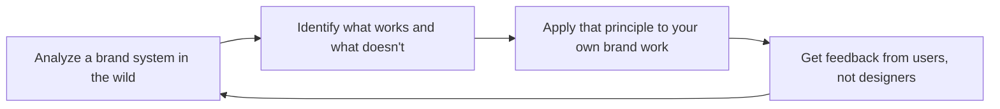

# Brand Guidelines

Design, document, and enforce a comprehensive brand identity system. This skill covers the full brand design lifecycle: brand architecture and strategy, logo systems with clear space and minimum size rules, color palette creation with accessibility validation, typographic hierarchy, iconography standards, imagery and illustration direction, motion design tokens, brand expression within digital product UI, and governance processes for brand consistency at scale.

## Route the Request

### Auto-Route (No User Input Required)
Evaluate these file-system conditions in order. First match wins — jump immediately.

| # | Condition | Action |
|---|-----------|--------|
| A1 | `file_contains("design-tokens.json", "brand")` OR `file_contains("tokens.json", "color")` | Brand tokens exist. Jump to **Production Checklist**. |
| A2 | `file_exists("*.figma")` AND `file_contains("*.figma", "logo")` | Figma brand file detected. Jump to **Core Workflow**. |
| A3 | `file_contains("*.css", "@font-face")` OR `file_exists("fonts/")` | Custom typography detected. Jump to **references/brand-guidelines.md → Typography**. |
| A4 | `file_contains("tailwind.config.*", "colors")` OR `file_contains("*.css", "--color-brand")` | Color tokens in code. Jump to **references/brand-guidelines.md → Color Palette**. |
| A5 | `file_exists("logo.svg")` OR `file_exists("logo.png")` | Logo assets exist. Jump to **references/brand-guidelines.md → Logo System**. |
| A6 | `file_contains("*.css", "@media.*prefers-reduced-motion")` OR `file_contains("*.css", "@keyframes")` | Motion already defined. Jump to **references/brand-guidelines.md → Motion Design**. |
| A7 | `file_contains("*.md", "brand.architecture")` OR `file_contains("*.md", "branded.house|house.of.brands")` | Brand architecture doc exists. Jump to **Decision Trees → Brand Architecture Model**. |
| A8 | `file_exists("icons/")` AND `file_exists("*.svg")` | Icon set detected. Jump to **references/brand-guidelines.md → Iconography**. |

### Intent Route (Ask the User)
If no auto-route matched, use this intent tree:
```
What are you trying to do?
├── Brand architecture (house of brands, branded house, endorsed, hybrid) → Start at "Decision Trees > Brand Architecture Model"
├── Create a complete identity system (logo, color, typography, icons, motion) → Jump to "Core Workflow"
├── Audit an existing brand for consistency gaps → Jump to "What Good Looks Like"
├── Build a brand governance process with violation tiers → Jump to "references/brand-guidelines.md → Brand Governance"
├── Need product-market positioning or competitive landscape? → `product-strategist`
├── Need design system tokens or component library? → `ui-ux-designer`
├── Need accessibility validation of brand colors or typography? → `accessibility-auditor`
└── Not sure? → Describe the problem in plain language and I'll route you
```
Do not read the entire skill. Follow the route above and read only the sections it points to.

## Ground Rules — Read Before Anything Else

These are hard-gate constraints. Violate any one and the output is invalid.

| # | Negative Constraint | Mechanical Trigger | Violation Response |
|---|---------------------|--------------------|--------------------|
| G1 | Never generate a brand color without WCAG 2.2 AA contrast validation against both white (#FFFFFF) and the darkest brand background | `file_contains(output, "#[0-9A-Fa-f]{6}")` AND NOT `file_contains(output, "contrast.ratio|WCAG|AA|AAA")` | REFUSE. Append: "This palette has not been validated for accessibility. Run contrast checks before use." |
| G2 | Never deliver a logo system that lacks responsive variants — primary, stacked, icon-only (32px), and favicon (16px) all required | `file_contains(output, "logo")` AND NOT `file_contains(output, "icon-only|favicon|responsive.variant")` | STOP. Append: "Logo system incomplete — add icon-only (32px) and favicon (16px) variants with minimum size and clear space rules." |
| G3 | Never specify typography without a complete fallback stack including generic family | `file_contains(output, "font-family")` AND NOT `file_contains(output, "sans-serif|serif|monospace|system-ui")` | DETECT. Append: "Font stack missing fallback. Every font-family declaration must end with a generic family." |
| G4 | Never define motion tokens that ignore `prefers-reduced-motion` — every duration must have a zero-motion mapped alternative | `file_contains(output, "animation-duration|transition-duration")` AND NOT `file_contains(output, "prefers-reduced-motion|reduced-motion")` | REFUSE. Append: "Motion tokens must map to 0ms when prefers-reduced-motion is active. Add reduced-motion fallback." |
| G5 | Never output brand guidelines without semantic token naming — no raw hex or pixel values in guidelines meant for code consumption | `file_contains(output, "guidelines")` AND `file_contains(output, "#[0-9A-Fa-f]{6}|[0-9]+px")` AND NOT `file_contains(output, "token|semantic|primitive")` | DETECT. Append: "Brand values must reference named tokens (e.g., 'color-brand-primary'), not raw hex or pixel values. Convert to semantic tokens." |
| G6 | Never recommend a brand decision without citing at least one of: audience research, competitive positioning, or accessibility requirement | `file_contains(output, "recommend|should use|best practice")` AND NOT `file_contains(output, "audience|competitive|WCAG|AA|research|target user")` | STOP. Append: "Brand recommendation lacks grounding. Cite audience data, competitive context, or accessibility requirement." |

## The Expert's Mindset

Brand is not a logo and a color palette — it's **what people say about you when you're not in the room**. Every visual asset, interaction, and piece of copy either reinforces or erodes that perception. The designer's job is to make the brand feel inevitable: so consistent and coherent that users never consciously notice it, but would immediately feel its absence.

### Mental Models

| Model | Description |
|---|---|
| **Brand = expectation × experience** | Your brand is the promise you make (expectation) multiplied by whether you keep it (experience). A beautiful logo with a broken onboarding flow delivers 0. Beautiful + functional = brand. |
| **Consistency builds trust** | Every inconsistency — a different blue, a misaligned button, a rogue font — signals "nobody's paying attention." Users trust consistency more than they trust aesthetics. |
| **Brand lives in the product, not just marketing** | The landing page sells the brand; the product lives it. If your product UI doesn't express the same personality as your marketing site, you have two brands, not one. |
| **Constraints drive creativity** | "Make it look good" is infinite and paralyzing. "Make it warm, approachable, and accessible within this 4-color palette and 2-typeface system" is where great design happens. |

### Cognitive Biases in Brand Design

| Bias | How It Shows Up | Defense |
|---|---|---|
| **Personal preference disguised as strategy** | "I like blue" presented as "Blue conveys trust" | Every color, type, and shape choice must cite: audience expectation, competitive landscape, or accessibility requirement. |
| **Recency bias** | Chasing the latest design trend (glassmorphism, brutalism, bento grids) without strategic fit | Ask: "Will this feel dated in 2 years? Does it serve the brand strategy or just look current?" |
| **Anchoring on first concept** | Falling in love with the first logo direction and evaluating all others against it | Generate 3+ distinct directions before evaluating any. Kill your favorite first. |
| **False consensus in taste** | Assuming "this looks good" is universal rather than cultural and contextual | Test brand directions with target audience members, not with your design team. |

### What Masters Know That Others Don't

- **The best brand systems disappear.** Users don't think "what a great design system" — they think "this product feels right." The system is infrastructure, not decoration.
- **Accessibility is brand expression.** A brand that's inaccessible to 15% of the population isn't a brand — it's a barrier. The best brand systems bake WCAG compliance into the color palette, type scale, and component design from day 1.
- **The brand system is a product.** It has users (designers, developers, marketers), it needs documentation, it evolves with feedback, and it requires maintenance. Treat it like a product, not a one-time deliverable.
- **Typography does more emotional work than color.** Users may not consciously notice the typeface, but they feel it. A geometric sans feels modern and clean; a humanist sans feels warm and approachable. Choose type for feeling, not just legibility.

## Operating at Different Levels

Brand design scales from single-brand identity to multi-brand portfolio governance.

| Level | Brand Design Output Characteristics |
|---|---|
| **L1 — Apprentice** | Applies brand guidelines to a touchpoint. Learns brand principles and identity system components. |
| **L2 — Practitioner** | Owns brand identity for a product or sub-brand. Delivers logo system, color palette, typography hierarchy, and brand guidelines document. |
| **L3 — Senior** | Owns brand architecture for a company. Brand portfolio decisions (branded house vs house of brands). Brand-in-product expression strategy. |
| **L4 — Brand Director** | Defines brand governance across the organization. "This is how we express our brand at every touchpoint." Brand evolution and refresh strategy. |
| **L5 — Industry-level** | Creates brand methodologies and identity frameworks adopted across the industry. |

**Usage**: Say "as an L3 brand designer, create the identity system for..." Default: **L2** (product/sub-brand identity, independent execution).

## When to Use
<!-- QUICK: 30s -- scan the bullet list to decide if this skill fits -->
- Creating a brand identity system for a new company, product, or sub-brand
- Auditing and evolving an existing brand for consistency and accessibility
- Designing a logo system: primary, secondary, icon-only, wordmark, responsive variants
- Building a color palette with semantic colors, dark mode, and WCAG accessibility validation
- Defining typography hierarchy with usage rules: display, heading, body, caption, overline
- Establishing iconography, illustration, and imagery standards
- Creating motion design tokens: timing scales, easing curves, animation principles
- Integrating brand expression into product UI without compromising usability
- Setting up brand governance: review processes, asset distribution, violation handling

## Decision Trees
<!-- QUICK: 30s -- follow the ASCII tree to your scenario -->
### Brand Architecture Model
```
                     ┌──────────────────────────┐
                     │ START: Brand architecture│
                     │ model?                   │
                     └───────────┬──────────────┘
                                 │
              ┌──────────────────▼──────────────────┐
              │ Are the sub-brands/products         │
              │ stronger than the parent brand?     │
              └────┬────────────────────┬───────────┘
                   │ YES                │ NO
                   ▼                    ▼
        ┌──────────────────┐  ┌──────────────────────┐
        │ House of Brands: │  │ Do products share    │
        │ Independent      │  │ the same brand       │
        │ identities (P&G, │  │ promise and audience?│
        │ Unilever).       │  └──┬───────────────┬───┘
        └──────────────────┘     │ YES           │ NO
                                 ▼               ▼
                          ┌────────────┐  ┌──────────────┐
                          │ Branded    │  │ Endorsed or  │
                          │ House:     │  │ Hybrid:      │
                          │ One master │  │ Parent brand │
                          │ brand      │  │ endorsement  │
                          │ (Google,   │  │ (Nest by     │
                          │ Apple)     │  │ Google)      │
                          └────────────┘  └──────────────┘
```
**When Branded House:** Single strong master brand. Products are features/verticals of one promise. Marketing efficiency through unified awareness.  
**When House of Brands:** Acquired companies with existing equity. Targeting different audiences with conflicting brand promises. Risk isolation between brands.

### Logo System Complexity
```
                     ┌──────────────────────────────┐
                     │ START: Logo variants needed? │
                     └─────────────┬────────────────┘
                                   │
              ┌────────────────────▼────────────────────┐
              │ Logo needs to work in favicon (16×16),  │
              │ app icon (1024×1024), and billboard?   │
              └────┬──────────────────────┬─────────────┘
                   │ YES                  │ NO
                   ▼                      ▼
        ┌──────────────────┐    ┌──────────────────────┐
        │ Full system:     │    │ Single use-case?     │
        │ Primary + Icon-  │    │ Primary + Stacked   │
        │ only + Wordmark  │    │ variant only.       │
        │ + Responsive     │    │ Skip responsive.    │
        │ variants.        │    └──────────────────────┘
        └──────────────────┘
```
**When full system needed:** Multi-platform product (web, iOS, Android, print). Logo appears at extreme sizes. Brand used by external partners.  
**When minimal suffices:** Single-context use (web only). Logo always appears at predictable sizes. Internal or B2B tool with limited brand exposure.

### Color Palette Scope
```
                     ┌──────────────────────────────┐
                     │ START: Palette complexity?   │
                     └─────────────┬────────────────┘
                                   │
              ┌────────────────────▼────────────────────┐
              │ Product has dark mode, data             │
              │ visualization, or multiple themes?      │
              └────┬──────────────────────┬─────────────┘
                   │ YES                  │ NO
                   ▼                      ▼
        ┌──────────────────┐    ┌──────────────────────┐
        │ Full token       │    │ Core palette:        │
        │ system: primary, │    │ Primary, secondary,  │
        │ secondary,       │    │ neutral, semantic    │
        │ neutral, semantic│    │ (error, success,     │
        │ + dark variants  │    │ warning). 12–20      │
        │ + chart palette. │    │ colors total.        │
        │ 30–50 tokens.    │    └──────────────────────┘
        └──────────────────┘
```
**When full token system:** Product UI with light/dark mode. Analytics dashboards with charts. White-label or multi-tenant theming requirements.  
**When core palette:** Marketing site + simple app. Light mode only. No data visualization beyond status indicators. Fast time to launch.

### Typography Hierarchy Depth
```
                     ┌──────────────────────────────┐
                     │ START: Type scale depth?     │
                     └─────────────┬────────────────┘
                                   │
              ┌────────────────────▼────────────────────┐
              │ Product has long-form content,          │
              │ documentation, or articles?             │
              └────┬──────────────────────┬─────────────┘
                   │ YES                  │ NO
                   ▼                      ▼
        ┌──────────────────┐    ┌──────────────────────┐
        │ Full scale:      │    │ Compact scale:       │
        │ Display, H1–H4,  │    │ H1–H3, Body,        │
        │ Body Large, Body,│    │ Caption, Overline.   │
        │ Body Small,      │    │ 6–8 sizes. UI-       │
        │ Caption, Overline│    │ focused.             │
        │ + Blockquote.    │    └──────────────────────┘
        │ 10–14 sizes.     │
        └──────────────────┘
```
**When full scale:** Blog, documentation, marketing site with long-form reading. Multiple content types (articles, case studies, legal). Readability-critical.  
**When compact scale:** Dashboard, admin panel, B2B tool. Primarily UI components. Short text mostly. Consistency over typographic expression.

### Governance Model
```
                     ┌──────────────────────────────┐
                     │ START: Governance approach?  │
                     └─────────────┬────────────────┘
                                   │
              ┌────────────────────▼────────────────────┐
              │ Brand assets used by external partners, │
              │ agencies, or > 10 internal creators?    │
              └────┬──────────────────────┬─────────────┘
                   │ YES                  │ NO
                   ▼                      ▼
        ┌──────────────────┐    ┌──────────────────────┐
        │ Full governance: │    │ Light governance:    │
        │ Self-serve portal│    │ Shared Figma +       │
        │ + review process │    │ design token repo.   │
        │ + asset CDN +    │    │ PR-based review.     │
        │ violation tiers. │    └──────────────────────┘
        └──────────────────┘
```
**When full governance:** Co-branding with partners. Multiple agencies creating assets. Brand used in 20+ countries. Enterprise with legal/compliance requirements.  
**When light governance:** Single design team. Assets consumed only by internal engineering. No external co-branding. Brand changes < quarterly.

## Core Workflow
<!-- QUICK: 30s -- scan phase titles to understand the process -->
### Phase 1 (~15 min): Brand Architecture & Strategy

#### 1.1 Brand Architecture Models

| Model | Description | When to Use | Example |
|-------|-------------|-------------|---------|
| **Branded House** | One master brand, all products share identity | Strong single brand, cohesive experience | Google (everything is Google), Apple |
| **House of Brands** | Independent brands under a parent company | Diverse products, different audiences | P&G (Tide, Pampers, Gillette), Unilever |
| **Endorsed** | Sub-brands with own identity + parent endorsement | Related but distinct products | Marriott (Courtyard by Marriott, Residence Inn by Marriott) |
| **Hybrid** | Mix of endorsed and independent | Complex portfolios | Microsoft (Windows, Xbox, LinkedIn — each distinct) |

Decision framework:
```
┌─ Single audience, single promise? ───────► Branded House
│
├─ Multiple distinct audiences, different promises? ──► House of Brands
│
└─ Related products, shared trust? ───────► Endorsed Brand Architecture
```


**What good looks like:** Brand guidelines document that a designer outside your company can pick up and produce an on-brand screen within an hour. Design token file (JSON/TS/CSS custom properties) matches the guidelines byte-for-byte — they're the same truth, not two documents that contradict each other. Every component pattern has examples of correct use, incorrect use, and edge cases.
#### 1.2 Brand Strategy Foundation

Before designing, document:

1. **Brand Promise:** What does the brand commit to delivering? One sentence.
   - *Example: "Stripe makes payments infrastructure invisible — so businesses can focus on building."*

2. **Brand Personality:** 3-5 adjectives describing the brand as a person.
   - *Example: "Stripe is: technical, precise, trustworthy, empowering, global."*

3. **Target Audience:** 2-3 primary audience personas with needs and context.

4. **Competitive Landscape:** 3-5 competitors. How does this brand differentiate visually and verbally?

5. **Brand Voice:** Tone attributes for copy and content.
   - *Example: "Stripe is: clear over clever, direct over decorative, helpful over hype."*

### Phase 2 (~30 min): Logo System

#### 2.1 Logo Variants

Every brand needs a logo system, not just one logo. Define all variants:

| Variant | Description | Primary Use |
|---------|-------------|-------------|
| **Primary / Horizontal** | Full logo (icon + wordmark, horizontal layout) | Website header, marketing, default usage |
| **Stacked / Vertical** | Full logo (icon above wordmark) | Square spaces, social media avatars, app icons |
| **Icon-only / Mark** | Icon/symbol without wordmark | App icons, favicons, social media avatars, watermarks |
| **Wordmark** | Text only without icon | Footer, legal, co-branded spaces |
| **Responsive / Compact** | Simplified for small sizes | Mobile headers, browser tabs (< 32px), email signatures |

#### 2.2 Clear Space & Minimum Size

```
Clear Space Rule:
┌─────────────────────────────────────────┐
│                                         │
│    ┌──────────────────────────┐         │
│    │                          │         │
│    │        LOGO HERE         │  ← x    │
│    │                          │         │
│    └──────────────────────────┘         │
│    ←────── x ──────►                    │
│                                         │
│  x = height of the logo mark/icon       │
│  Minimum clear space on ALL sides = x   │
└─────────────────────────────────────────┘
```

**Clear space:** Equal to the height of the icon/mark on all four sides. Nothing enters this zone (text, other logos, UI elements, image edges).

**Minimum sizes:**
- Primary logo: Min 120px wide (digital), 40mm wide (print).
- Icon-only mark: Min 32px (digital), 16px for favicon.
- Wordmark: Min 100px wide for legibility.

#### 2.3 Logo Usage Rules

```
✅ DO:
- Use provided artwork files — never recreate or modify.
- Maintain aspect ratio — never stretch or squash.
- Use on backgrounds with sufficient contrast.

❌ DON'T:
- Recolor the logo (except approved monochrome variants).
- Apply effects: drop shadows, gradients, outlines, rotation.
- Place on busy backgrounds where legibility is compromised.
- Use low-resolution or unapproved file formats.
- Recreate the logo from memory — always use source files.
```

#### 2.4 File Formats & Delivery

| Format | Use | Notes |
|--------|-----|-------|
| `.svg` | Web, digital products | Primary format. Scalable, lightweight. Ensure text is outlined or fonts are embedded. |
| `.png` (transparent) | Presentations, email signatures, Office docs | Provide at 1x, 2x, 3x (72dpi). |
| `.eps` / `.ai` | Print, merchandise, vendor use | Vector source files. CMYK color space option. |
| `.ico` | Favicon | Multi-size .ico (16, 32, 48px). |
| `.pdf` | Print proofing | Press-ready, CMYK, embedded fonts. |

---
### Phase 3 (~20 min): Color Palette

#### 3.1 Palette Architecture

Build a systematic palette — not arbitrary color picking:

```
Palette Structure:

Primary           → Brand-defining color(s). Used in logo, key CTAs, headers.
Secondary         → Complementary colors. Cards, illustrations, data viz.
Accent            → High-emphasis highlights. Sales badges, focus states.
Neutral           → Gray scale for UI: backgrounds, borders, text.
Semantic          → Functional meaning colors:
  Success (green) → Confirmation, completion, positive metrics
  Warning (amber) → Caution, pending, attention needed
  Error (red)     → Destruction, critical alerts, validation errors
  Info (blue)     → Neutral information, tips, status updates
```

#### 3.2 Color Token Naming Convention

**Wrong:** `blue-500`, `#2563EB`, `primary`
**Right:** Semantic tokens that convey intent.

```
// Design tokens — NOT what the color IS, but what it MEANS
--color-background-primary
--color-background-secondary
--color-background-brand
--color-text-primary
--color-text-secondary
--color-text-link
--color-text-on-brand
--color-border-default
--color-border-focus
--color-icon-primary
--color-icon-secondary
--color-surface-success
--color-text-success
--color-surface-error
--color-text-error
```

#### 3.3 Accessibility Validation

Every color pairing must pass WCAG 2.2 AA contrast ratios:

| Text Size | AA Minimum | AAA Minimum |
|-----------|------------|--------------|
| Normal text (< 18pt / 24px) | 4.5:1 | 7:1 |
| Large text (≥ 18pt bold / 24px) | 3:1 | 4.5:1 |
| UI components (borders, icons) | 3:1 | N/A |

**Validation workflow:**
1. Check all text-on-background combinations.
2. Check all icon-on-background combinations.
3. Check focus indicators against adjacent backgrounds.
4. Check disabled states — they're exempt from contrast requirements but must be supplemented with non-color cues (reduced opacity + icon + text change).
5. Check link text against body text (links must be differentiable by more than color — underline or icon).

**Tooling:**
```css
/* Tailwind plugin — valid color palette checker */
/* Use https://colorbox.io/ or Leonardo for accessible color generation */
/* Validate with: https://webaim.org/resources/contrastchecker/ */
```

#### 3.4 Dark Mode Palette

Dark mode is NOT simply inverting colors. Key principles:

```
Light Mode              →    Dark Mode
─────────────────────────────────────────────
White background        →    Dark gray (#121212 or #1E1E1E)
Dark text (#1A1A1A)     →    Light text (#E5E5E5) — NOT pure white (#FFFFFF) — reduces eye strain
Gray-100 (#F3F4F6)      →    Gray-900 (#111827)
Gray-900 (#111827)      →    Gray-100 (#F3F4F6)
Brand color             →    Desaturated + lightened by 10-15% — saturated colors vibrate on dark backgrounds
Shadows                 →    Shadows don't work on dark. Use borders or elevated surface colors instead.

// Dark mode surface elevation (lighter = higher)
--surface-ground: #121212       // Base background
--surface-elevated: #1E1E1E     // Cards, modals
--surface-overlay: #2C2C2C      // Dropdowns, tooltips
--surface-highlight: #383838    // Hover states
```

---
### Phase 4 (~15 min): Typography Hierarchy

#### 4.1 Type Scale

Define a type scale with specific usage rules. Use a modular scale (1.25, 1.333, or 1.5 ratio).

```
Role        | Size/Line    | Weight | Usage
────────────┼──────────────┼────────┼──────────────────────────
Display     | 48/56–64/72  | 700    | Marketing hero, landing pages. ONE per page.
H1          | 36/44        | 600    | Page titles, section heroes
H2          | 28/36        | 600    | Card headers, subsection titles
H3          | 22/30        | 600    | Widget headers, feature titles
H4          | 18/26        | 600    | In-card subheaders
Body Lg     | 18/28        | 400    | Lead paragraphs, introductory text
Body        | 16/24        | 400    | Primary reading text
Body Sm     | 14/20        | 400    | Secondary text, metadata, captions
Caption     | 12/16        | 400    | Timestamps, legal, footnotes
Overline    | 12/16        | 600    | Section labels, category tags (uppercase + letter-spacing: 0.05em)
```

#### 4.2 Font Selection Rules

```
Display font (optional): For marketing headlines, hero, brand moments.
  - Max 1 display font. Never use for body text.
  - Must pair well with body font.

Body font: For all reading text, UI, forms, navigation.
  - Max 1 body font family.
  - Must have: Regular (400), Medium (500), SemiBold (600), Bold (700).
  - Must have: true italics (not faux/synthesized).

Monospace font: For code, data, technical content.
  - 1 monospace family. Use for inline code, code blocks, data tables.

Total: Maximum 2 font families per brand (display + body, or body + mono).
      3 only if monospace is functionally required.

Web font loading strategy:
  - Subset to needed characters (Latin + target languages).
  - Use font-display: swap (text visible during load).
  - Preload critical font files with <link rel="preload" as="font">.
  - Self-host fonts — avoid Google Fonts CDN (GDPR, performance).
```

#### 4.3 Usage Rules

```
✅ DO:
- Use the type scale — never custom font sizes outside it.
- Limit line length to 45-75 characters for body text.
- Use at most 3 levels of heading nesting (h2 → h3 → h4).

❌ DON'T:
- Use display font for body text.
- Use bold for emphasis — use Medium (500) for inline emphasis; reserve Bold for headings.
- Use underline for non-link text (confuses users).
- Use all-caps for sentences — only for overlines, labels, buttons (max 3 words).
```

---
### Phase 5 (~25 min): Iconography

#### 5.1 Style Direction

| Style | Characteristics | Best For |
|-------|----------------|----------|
| **Outline / Line** | Thin stroke (1.5-2px), open shapes, modern | SaaS products, dashboards, developer tools |
| **Filled / Solid** | Heavy visual weight, good at small sizes | Mobile apps, consumer products, tactile UIs |
| **Duotone** | Two-color, depth via overlays | Marketing, feature illustrations |
| **Glyph / Minimal** | Simple shapes, maximum clarity | Navigation, toolbars, System UIs |

#### 5.2 Sizing & Grid

```
Icon grid: 24×24px base grid with 2px padding (content area: 20×20px)

Sizes:
  sm (16×16)   → Tight spaces: inline with text, table cells
  md (24×24)   → Default: buttons, navigation, form fields
  lg (32×32)   → Feature icons, empty states
  xl (48×48)   → Hero icons, marketing spots

Stroke weight:
  Outline icons: 1.5px–2px stroke at 24px.
  Scale stroke proportionally at other sizes.

Design rules:
  □ All icons from a set share consistent stroke weight.
  □ Corners: rounded (2px radius) or sharp (0px) — pick ONE.
  □ Line endings: round cap or square cap — pick ONE.
  □ Perspective: flat (2D) or isometric — pick ONE.
  □ Every icon has a unique, unambiguous meaning.
  □ Icons at ≤ 16px may need simplified versions.
```

#### 5.3 Icon Accessibility

```html
<!-- Decorative icon (no meaning beyond visual decoration) -->
<svg aria-hidden="true" focusable="false">...</svg>

<!-- Informative icon (conveys meaning, e.g., status indicator) -->
<svg role="img" aria-label="Order confirmed">...</svg>

<!-- Icon-only button -->
<button aria-label="Search">
  <svg aria-hidden="true" focusable="false">...</svg>
</button>

<!-- Icon + text — icon is decorative -->
<button>
  <svg aria-hidden="true" focusable="false">...</svg>
  Search
</button>
```

---
### Phase 6 (~25 min): Imagery

#### 6.1 Photography Direction

```
Style keywords (pick 3-4 for the brand):
  □ Natural light / Studio light / Dramatic shadow
  □ Warm color grade / Cool color grade / Desaturated / Vibrant
  □ Shallow depth-of-field (blurred background) / Deep focus (everything sharp)
  □ Candid / Posed / Abstract / Documentary
  □ People-focused / Product-focused / Environment-focused

Composition rules:
  □ Rule of thirds for hero images.
  □ Subject off-center facing INTO the content.
  □ Consistent aspect ratios: 16:9 (hero), 4:3 (cards), 1:1 (avatars), 3:2 (blog).
```

#### 6.2 Illustration Style

```
Style parameters:
  □ Line art / Flat vector / 3D render / Hand-drawn / Collage
  □ Limited palette (use brand colors) / Full color
  □ Geometric / Organic / Abstract
  □ Humans represented? If so, skin tone range, body diversity, accessibility devices included.

Usage: Empty states, onboarding flows, error pages, feature spot illustrations, hero graphics.
```

#### 6.3 Image Accessibility

```
□ Every  has alt text.
  - Informative: "Woman using Stripe Dashboard to review revenue analytics"
  - Decorative: alt="" (empty string — screen readers skip)
□ Complex images/charts have long descriptions (aria-describedby or linked page).
□ No text embedded in images (SVG with real text preferred).
□ SVG illustrations have <title> and <desc> elements.
```

---
### Phase 7 (~25 min): Motion Design

#### 7.1 Motion Tokens

```css
/* Duration tokens */
--motion-duration-instant: 0ms;       /* No animation — color changes, opacity toggle */
--motion-duration-fast: 150ms;        /* Micro-interactions: hover, toggle, tooltip */
--motion-duration-base: 250ms;        /* Standard transitions: open/close, navigation */
--motion-duration-slow: 400ms;        /* Emphasis: page transitions, modal open */
--motion-duration-gentle: 700ms;      /* Atmospheric: background animations, hero */

/* Easing tokens */
--motion-ease-default: cubic-bezier(0.4, 0, 0.2, 1);        /* Standard easing — most common */
--motion-ease-enter: cubic-bezier(0, 0, 0.2, 1);            /* Deceleration — elements appearing */
--motion-ease-exit: cubic-bezier(0.4, 0, 1, 1);             /* Acceleration — elements disappearing */
--motion-ease-bounce: cubic-bezier(0.34, 1.56, 0.64, 1);    /* Overshoot — celebratory moments */
```

#### 7.2 Animation Principles

```
1. Purposeful — every animation communicates something.
   Bad: Spinning logo loader — decorative, no purpose.
   Good: Progress bar that fills — communicates wait time.

2. Fast — users should never wait for animation.
   Enter: 150-250ms. Exit: 100-200ms. Anything > 400ms feels sluggish.

3. Contextual — animation type matches action.
   Expand/collapse: scale + opacity. Navigate: slide directionally.
   Add to cart: move from trigger to cart icon.

4. Performant — only animate transform and opacity.
   GPU-accelerated: transform, opacity.
   CPU (avoid for animation): width, height, top, left, color, box-shadow.

5. Reduced motion — respect user preference.
   @media (prefers-reduced-motion: reduce) {
     *, *::before, *::after {
       animation-duration: 0.01ms !important;
       transition-duration: 0.01ms !important;
     }
   }
```

#### 6.3 Brand Motion Identity

```
Brand entry: How the brand logo appears on first load.
  - Logo fades in from center (gentle, 400ms).
  - No spinning, bouncing, or dramatic reveals.

Page transitions: Between marketing pages or app views.
  - Fade + subtle upward slide (15px), 250ms.

Micro-interactions: Button hover, toggle state, notification badge.
  - Subtle scale (1.02) on hover, 150ms.
  - Badge: scale from 0 to 1 with slight overshoot (entrance only).

Brand moments: Empty states, success states, error states.
  - Illustration fades in + drifts upward 20px, 400ms.
  - Error: subtle horizontal shake (3px, 2 oscillations, 200ms).
```

---
### Phase 8 (~30 min): Brand in Product

#### 8.1 Brand Expression vs Usability

The hardest challenge: brand personality must not compromise product usability.

| Element | Brand Expression | Usability Constraint |
|---------|-----------------|---------------------|
| **Color** | Brand primary for CTAs | Must pass 4.5:1 contrast on white AND on dark backgrounds |
| **Typography** | Display font for headers | Never for body text, forms, or navigation — use body font |
| **Iconography** | Brand-specific style | Must be recognizable at 16px; meanings must match platform conventions |
| **Animation** | Brand motion feel | Must complete in < 400ms; must respect `prefers-reduced-motion` |
| **Illustration** | Brand style in empty states | Must not distract from actionable content |

**The rule:** Brand expresses in moments (landing pages, empty states, loading screens, success pages). Brand recedes during tasks (forms, data tables, settings, checkout).

#### 8.2 Component Theming

```css
/* Design tokens bridge brand to product */
--button-primary-bg: var(--color-brand-600);
--button-primary-text: var(--color-text-on-brand);
--button-primary-hover: var(--color-brand-700);
--button-radius: 8px;                    /* Brand expression: rounded vs sharp */

--input-border: var(--color-border-default);
--input-focus-ring: var(--color-brand-500);
--input-radius: 6px;

/* Component density — brand personality */
/* Playful brand → more padding, rounded corners */
/* Professional/technical brand → tighter, slightly sharper */
```

---
### Phase 9 (~20 min): Brand Governance

#### 9.1 Review Process

```
Request Workflow:
1. Requester submits request via brand portal/form.
   - What: Logo, color, font, template
   - Use: Where/how will it be used?
   - Deadline: When is it needed?

2. Brand team reviews within 2 business days.
   Past: → Approve as-is
        → Approve with modifications (provide corrected assets)
        → Reject with explanation and suggested alternative

3. Approved assets delivered via brand portal (CDN link) or shared drive.

4. Asset usage tracked. Follow-up audit at 90 days for external-facing uses.
```

#### 9.2 Violation Handling

```
Tier 1 (Minor): Wrong color shade, incorrect clear space.
  → Email notification with correction. 1 week to fix.

Tier 2 (Moderate): Stretched logo, unapproved color variant, wrong typography.
  → Email + meeting request. 48 hours to fix.

Tier 3 (Severe): Altered logo, offensive use, competitor association.
  → Escalate to legal. Immediate takedown if public.

Repeat violations → Mandatory brand training for team.
```

#### 9.3 Asset Distribution

```
Brand portal structure:
/
├── logos/
│   ├── primary/
│   │   ├── horizontal/
│   │   └── stacked/
│   ├── icon-only/
│   ├── wordmark/
│   └── archive/          (Previous logo versions — do not use)
├── colors/
│   ├── palette-guide.pdf
│   ├── design-tokens.json
│   └── tailwind-config.js
├── typography/
│   ├── font-files/       (Licensed .woff2 files)
│   └── type-scale.pdf
├── iconography/
│   ├── icon-set.svg
│   └── icon-guidelines.pdf
├── templates/
│   ├── presentation.potx
│   ├── document.docx
│   └── email-signature.html
├── photography/
│   └── licensed-library/ (Watermarked previews; full-res on request)
└── brand-guidelines.pdf  (This document — always the latest version)
```

#### 9.4 Version Control

```
Brand guidelines are versioned:
  v2.3 — 2024-09-15 — Added TikTok brand asset, updated color contrast values
  v2.2 — 2024-06-01 — New illustration style approved, deprecated old illustrations
  v2.1 — 2024-03-10 — Added dark mode palette, updated minimum logo size
  v2.0 — 2024-01-05 — Major rebrand: new logo, new color system, new typography

Always reference the latest version. Archive, never delete old versions.
```

---
## Cross-Skill Coordination
<!-- QUICK: 30s -- table of who to talk to when -->
Brand guidelines are useless if nobody uses them. Coordination with design, engineering, and marketing ensures the brand is applied consistently — not just in Figma, but in production code, marketing materials, and partner content.

| Upstream Skill | What You Receive | When to Involve |
|---|---|---|
| `product-strategist` | Market positioning, audience definition, competitive landscape, brand differentiation strategy | Before brand architecture design; during brand refresh |
| `marketing-manager` | ICP definition, messaging framework, campaign channel strategy, demand gen requirements | During brand identity creation; before asset template design |

| Downstream Skill | What You Provide | Impact of Delay |
|---|---|---|
| `ui-ux-designer` | Design tokens (color, typography, spacing, motion), component theming guidance, dark mode palette, icon family specs | Design system uses inconsistent or inaccessible tokens — fragmented product experience |
| `frontend-developer` | Token export format (CSS custom properties), naming conventions, breakpoint system, brand asset CDN paths | Hardcoded brand values proliferate — brand drift across codebase |
| `ux-writer` | Voice and tone guidelines, messaging frameworks, terminology standards, content style rules | Inconsistent product copy — brand voice feels disjointed |
| `product-marketing-manager` | Brand architecture model, visual asset library (logos, colors, fonts, templates), co-branding rules, usage guidelines | Marketing campaigns deviate from brand — diluted market presence |

### Communication Triggers — When to Proactively Notify

| Trigger | Notify | Why |
|---------|--------|-----|
| Rebrand or major brand refresh | `product-strategist`, `marketing-manager`, `ceo-strategist` | Coordinated rollout across all touchpoints, asset migration, external communications |
| Design token breaking change | `ui-ux-designer`, `frontend-developer` | Component regression risk, migration plan, deprecation timeline |
| New sub-brand or product brand created | `product-manager`, `marketing-manager`, `product-strategist` | Brand architecture update, naming guidelines, visual system extension |
| Brand violation in production (logo, color, typography) | `frontend-developer`, `product-manager`, `marketing-manager` | Fix prioritization, root cause (missing token, hardcoded value), prevention |
| Accessibility issue found in brand elements | `accessibility-auditor`, `ui-ux-designer` | Contrast adjustment, typography change, motion compliance fix |
| Brand asset request from external partner | `legal-advisor`, `marketing-manager` | Usage approval, co-branding rules, license terms |
| Brand guideline version published | All consumers (via changelog + notification) | What changed, what's deprecated, migration guide, effective date |

### Escalation Path

```
Brand integrity at risk (unauthorized sub-brand, major public misuse, trademark violation)
  └── `brand-guidelines` + `legal-advisor` + `marketing-manager` + `ceo-strategist`. Cease-and-desist if external. Fix within 24 hours if internal.

Design system conflict (brand token change breaks 10+ components)
  └── `ui-ux-designer` + `frontend-developer` + `brand-guidelines`. Impact assessment, migration plan, staged rollout.

Minor brand drift (wrong shade, inconsistent spacing, outdated logo in one location)
  └── Direct fix by team that owns the asset. `brand-guidelines` informed. No escalation needed.
```

## Proactive Triggers

| Trigger | Action | Why |
|---------|--------|-----|
| No design tokens file exists — colors, spacing, and typography are hardcoded in Figma and code | Propose token generation: extract all hardcoded values, deduplicate, assign semantic names, export as JSON. Coordinate with `ui-ux-designer` and `frontend-developer` to establish a single source of truth consumed by both Figma (via Tokens Studio) and code (via Style Dictionary) | Design tokens are the operating system of brand consistency. Without them, every new screen, component, and marketing asset is an opportunity for brand drift. Token generation is a one-time investment that pays back perpetually |
| Logo used at wrong size, stretched, or placed on a busy/noisy background in production | Flag to `frontend-developer` and `product-manager` with screenshot evidence. Check: is the correct variant available? Is the clear-space rule documented? Is the minimum-size threshold published? Fix the root cause (missing variant, unclear guideline, hard-to-find asset) not just the instance | A stretched logo is the most visible brand failure — it signals "we don't care about details" to every user who sees it. The fix is always systemic: make the right asset easy to find and the wrong asset hard to use |
| Color contrast fails WCAG 2.2 AA on any text-on-brand-background combination | Alert `accessibility-auditor` and `ui-ux-designer`. Audit the entire brand palette for contrast compliance. Adjust problematic color pairs — brand identity must work within accessibility constraints, not against them. Document accessible variants of every brand color | Brand colors that fail contrast are not brand assets — they're brand liabilities. An inaccessible brand is a broken brand. The brand's visual identity must be legible to all users, or it's not an identity — it's an exclusion |
| New sub-brand or product brand created without brand architecture review | Flag to `product-strategist` and `marketing-manager`. Run brand architecture decision: Branded House (master brand leads) vs House of Brands (standalone) vs Endorsed (master brand endorsement). Document the architecture model before any visual identity work begins | Brand architecture decisions are strategic, not visual. A sub-brand created without architecture review fragments the portfolio and confuses customers. The visual identity follows the architecture — not the other way around |
| Typography token updated without testing at all breakpoints and content extremes | Flag to `ui-ux-designer`. Require testing at: 320px mobile, 768px tablet, 1440px desktop, 4K. Test with minimum content (1 word), maximum content (200+ characters), and zero content. Type scales that look beautiful at one size often break at extremes | Typography is the most ubiquitous brand element — every page, every button, every label uses it. A type scale change that breaks at mobile affects 60%+ of user sessions. Validate before publishing |
| Icon set inconsistent — different stroke weights, corner radii, or grid sizes across the product | Audit the icon library for consistency: all icons must use the same grid (24×24), same stroke weight, same corner radius, same optical sizing. Flag violations. If multiple icon families are needed (UI icons vs illustration icons), document the separation explicitly | Icon inconsistency is the "death by a thousand cuts" of brand degradation. Users may not consciously notice that the settings icon has 2px strokes while the profile icon has 1.5px — but they feel the lack of polish |
| Brand asset request from external partner (co-marketing, integration partner, press) with no co-branding guidelines | Pause approval until co-branding rules are defined: logo placement hierarchy, minimum clear space between logos, color restrictions, "Powered by" vs "In partnership with" language. Coordinate with `legal-advisor` for trademark usage terms | Unauthorized co-branding creates legal exposure and brand dilution. Partners will use your logo in the most prominent position unless you define the rules upfront. Co-branding guidelines protect both brand equity and legal standing |
| Interaction with `frontend-developer` for design token handoff | When brand tokens change, coordinate the pipeline: brand-guidelines defines semantic tokens → Style Dictionary transforms to platform-specific formats (CSS custom properties, Swift, Kotlin) → frontend-developer consumes via npm package or CDN. Every token change must include a migration guide with before/after values and deprecation timeline | The gap between a brand token update in Figma and the same token in production code is where brand drift lives. A defined pipeline with automated token distribution eliminates "the old blue" from surviving in code for 6 months after the brand refresh |

## Best Practices
<!-- STANDARD: 3min -- rules extracted from production experience -->
- **Tokenize everything:** Colors, spacing, typography, motion — every design decision becomes a named token in a single source of truth (design-tokens.json).
- **Test at extremes:** Your color palette works on white. Does it work on brand-colored backgrounds? In dark mode? At 400% zoom? With color blindness simulation?
- **Design for non-designers:** Templates for presentations, documents, social media. If marketers don't have a template, they'll invent their own (wrong) brand.
- **Show, don't just tell:** Every guideline needs a visual example. ✅ Do this / ❌ Not this. Words without images will be misinterpreted.
- **Brand evolves, guidelines don't drift:** 90% of the brand is stable. The 10% that changes (new illustration style, new social template) is added without removing the old — archive old, mark as deprecated.
- **Accessibility IS brand:** An inaccessible brand is a broken brand. Contrast, legible typography, motion respect — these are brand quality measures, not compliance burdens.

## Anti-Patterns

| ❌ Anti-Pattern | ✅ Do This Instead | 🔍 Detect (grep/lint) | 🛡️ Auto-Prevent |
|-----------------|---------------------|----------------------|------------------|
| Defining brand colors in Figma only — no design tokens file, no CSS custom properties, no code integration | Generate a design tokens JSON file as the single source of truth. Consume tokens in Figma (via Tokens Studio), code (via Style Dictionary → CSS custom properties/Swift/Kotlin), and documentation | `grep -L "design-tokens|tokens.json" **/*.figma` — no token file alongside Figma | Add CI rule: block PR if `.figma` file exists without adjacent `tokens.json` in same directory |
| Creating a beautiful 100-page brand guidelines PDF that nobody reads because it's buried in a shared drive | Build a self-serve brand portal (Figma library + token reference + asset CDN + do/don't examples). Teams should find the right logo, color, or font in under 30 seconds | `grep -c "password|login|request access" brand-portal.md` — barriers to self-serve | Scan brand portal for login walls; flag any asset requiring authentication beyond SSO |
| Launching a logo that only works at 200px — no favicon variant, no icon-only mark, no responsive sizes | Design the complete logo system before launch: primary (horizontal + stacked), icon-only (32px mark), favicon (16px), responsive variants per breakpoint | `find . -name "logo*" \| wc -l` — fewer than 4 variants is a red flag | Require minimum 4 logo variants (primary, stacked, icon-only, favicon) before logo assets can be committed |
| Brand governance as a bottleneck — every asset needs brand team approval before publication | Build self-serve templates with locked brand elements. Brand review reserved for net-new asset types, not every social media post | `grep -r "brand review required|brand approval"` — count of approval gates in workflow docs | Auto-approve template-based assets; only route net-new asset types to manual review queue |
| Color palette looks beautiful on white but fails WCAG AA contrast on brand backgrounds and in dark mode | Validate every text-on-background combination against WCAG 2.2 AA (4.5:1 normal, 3:1 large). Design dark mode palette in parallel, not retrofitted | `grep -v "contrast|WCAG|AA" design-tokens.json` — tokens file with no contrast annotations | Pre-commit hook: run axe-core on brand color swatches; block commit if any pair fails AA |
| Typography scale chosen for aesthetics without stress-testing at real content extremes | Stress-test typography with minimum content (1 word), maximum content (200+ characters), and zero content at every breakpoint (320px–4K) | `grep "font-size" **/*.css \| sort \| uniq` — fewer than 5 distinct sizes suggests untested scale | Require visual regression snapshots at 320px, 768px, 1440px with min/max/zero content strings for every type style |
| Motion guidelines specify "delightful animations" with no timing, no easing, no reduced-motion respect | Define motion tokens: duration scale (100ms instant, 200ms fast, 300ms base, 500ms slow), easing curves (ease-out for enter, ease-in for exit), mandatory `prefers-reduced-motion` fallback | `grep "animation|transition" **/*.css \| grep -v "prefers-reduced-motion|ease|duration"` — animation without tokens | CSS lint rule: every `animation-duration` and `transition-duration` must be wrapped in `@media (prefers-reduced-motion: no-preference)` |

## Scale Depth: Solo → Small → Medium → Enterprise

### Solo (1 person, 0-100 users)
- **What changes**: Brand = a logo + 2-3 colors + 1 font. No guidelines document. "Brand identity" lives in your head and the app itself.
- **What to skip**: Brand guidelines document. Design tokens. Brand architecture model. Motion guidelines. Icon sets. Brand governance process.
- **Coordination**: You design everything. Consistency is natural.

### Small Team (2-10 people, 100-10K users)
- **What changes**: Simple brand guidelines (1-page PDF or Figma file). Logo variants (primary, icon-only). Color palette (4-6 colors). Typography (1-2 fonts with hierarchy). Basic do/don't examples. Assets shared via Google Drive or Figma.
- **What to skip**: Full brand architecture model. Design tokens. Motion guidelines beyond "keep it simple." Illustration system. Brand governance committee.
- **Coordination**: Designer owns brand. New assets reviewed by designer before use. Quarterly brand audit (30 min).

### Medium Team (10-50 people, 10K-1M users)
- **What changes**: Comprehensive brand guidelines portal. Full brand architecture model. Design tokens (colors, typography, spacing, elevation). Semantic color tokens (primary, semantic, neutral). Dark mode palette. Icon set with consistent style. Illustration direction. Motion tokens. Brand governance with review process. Asset distribution portal (Figma library + CDN).
- **What to skip**: Multi-brand architecture (unless acquired). Brand valuation study. Global brand compliance audits.
- **Coordination**: Brand designer reviews all public-facing assets. Monthly brand council. Quarterly brand refresh consideration.

### Enterprise (50+ people, 1M+ users)
- **What changes**: Multi-brand architecture (Branded House / House of Brands). Design token pipeline (Figma → Style Dictionary → code). Global brand compliance. Brand valuation tracking. Brand guidelines for 10+ markets/languages. Co-branding and partnership guidelines. M&A brand integration playbook. Brand governance committee with cross-functional membership. Legal trademark management.
- **What's full production**: Brand center of excellence. Annual brand audit. Brand training for all marketers and designers. Brand compliance scoring. Automated design token distribution.
- **Coordination**: Monthly brand council. Quarterly brand compliance review. Annual brand strategy offsite. Legal review for trademark use.

### Transition Triggers
- **Solo → Small**: Second designer or external agency needs brand direction. Inconsistent brand in marketing materials.
- **Small → Medium**: Multiple products or sub-brands. Design system needs consistent tokens. >10 people creating branded content.
- **Medium → Enterprise**: International expansion with localization. M&A activity. >50 people creating branded content across markets.


### Cross-skills Integration

| Step | Skill | What it produces |
|------|-------|------------------|
| **Before** | product-strategist | Market positioning, audience definition, competitive landscape |
| **This** | brand-guidelines | Brand architecture, identity system, tokens, governance |
| **After** | ui-ux-designer | Design system themed with brand tokens, component library |

Common chains:
- **New brand**: product-strategist → brand-guidelines → ui-ux-designer — from market strategy to branded product UI
- **Brand refresh**: ux-researcher → brand-guidelines → frontend-developer — from audience insights to implemented brand system


### Design-to-Code Handoff Chain
```bash
# Figma → Design tokens → Component → Implementation → Verify
/ui-ux-designer && /frontend-developer && /qa-engineer
# Every Figma frame has: spacing token, color token, typography token, breakpoint annotation.
# Frontend devs should never guess measurements — if it's not in the handoff, it doesn't exist.

# Brand → Design system → Component library → App
/brand-guidelines && /ui-ux-designer && /frontend-developer
# Brand tokens feed into the design system. Design system tokens are the single source of truth.
# No hardcoded colors or spacing values — every pixel comes from a named token.

# Accessibility → Design → Development → Audit
/accessibility-auditor && /ui-ux-designer && /frontend-developer
# Accessibility requirements are annotated on every Figma frame before handoff.
# Color contrast, heading hierarchy, focus management, and touch targets are non-negotiable.
# Auditor verifies post-implementation — not post-launch.
```

## What Good Looks Like

> Every customer-facing surface — from the login screen to the 404 page to the transactional email footer — feels unmistakably like the same brand without a single designer policing it manually. The logo renders crisply at every size from 16px favicon to 4K billboard, with correct clear space, and never stretched, recolored, or placed on a busy background. Color tokens flow from a single source of truth into Figma and code, guaranteeing that dark mode looks intentional rather than inverted and that every state passes WCAG AA contrast. Typography scales fluidly across breakpoints without layout breakage, and every icon is drawn from the same family with consistent stroke weights and optical sizing. Marketing, product, and engineering teams self-serve from the brand portal without opening a single Slack thread to ask which blue is correct.

## Sub-Skills
<!-- QUICK: 30s -- table of deeper dives by topic -->
| Sub-Skill | When to Use | Context |
|-----------|-------------|---------|
| `brand-architecture` | Defining master brand, sub-brand, endorsed, or house-of-brands structure for new products or acquisitions | Branded House vs House of Brands vs Endorsed vs Hybrid — selection criteria and migration planning |
| `logo-system` | Designing primary, stacked, icon-only, wordmark, and responsive logo variants with clear space rules | Grid construction, minimum size thresholds, exclusion zones, monochrome/inverse variants, favicon to billboard |
| `color-palette` | Creating semantic color tokens: primary, secondary, accent, neutral, semantic, dark mode variants | HCT/HSLuv perceptual color spaces, WCAG 2.2 AA contrast validation (4.5:1 / 3:1), color blindness simulation |
| `typography-hierarchy` | Defining display, heading, body, caption, and overline type scales with usage rules | Font pairing, fluid type scales, line-height and letter-spacing tokens, performance (font loading strategy) |
| `iconography` | Establishing icon set: style (filled/outlined/duotone), grid (24×24), stroke weight, corner radius | Icon contribution guidelines, naming conventions, SVG optimization, accessibility labeling |
| `motion-design` | Creating motion tokens: duration scale, easing curves, animation principles, reduced-motion respect | `prefers-reduced-motion` query, entrance/exit/hover/attention animation categories, performance budget (no layout thrashing) |
| `brand-in-product` | Expressing brand within UI components: buttons, cards, navigation, empty states, loading states | Brand expression without compromising usability — color isn't the sole affordance, motion isn't distracting |
| `brand-governance` | Establishing review processes, asset distribution portal, violation tiers, and versioned guidelines | Self-serve brand portal, PR-based review for digital assets, violation severity (tier 1–3), changelog |


### War Story 1 — The Brand That Looked Like 5 Different Companies
**Symptom:** A startup grew from 10 to 80 people across 3 products. The marketing site used one blue, the app used another, the email templates used a third. Customer research revealed that 40% of users didn't realize the email and the app were from the same company.
**Root cause:** No centralized brand guidelines. Each team chose colors, fonts, and spacing independently. The brand "system" was a Figma file that nobody updated and nobody referenced. There was no brand governance — just chaos.
**Fix:** Created a single source of truth: design tokens in a JSON file consumed by both Figma (via Tokens Studio) and code (via Style Dictionary). Established a brand review process: any new asset must reference design tokens, not hardcoded values.
**Lesson:** Brand consistency doesn't happen by accident. If brand guidelines exist only in a PDF that nobody reads, they might as well not exist. Tokenize everything and embed brand rules into the tools teams already use.

### War Story 2 — The Design System That Collected Dust
**Symptom:** A company invested 6 months building a comprehensive design system with 50+ components. One year later, only 20% of the components were used in production. Engineers preferred building their own because the design system components were hard to customize and broke on edge cases.
**Root cause:** The design system was built by designers in Figma without engineering input. Components had no functional specs, no API documentation, and didn't cover edge states (loading, error, empty). Engineers found them unreliable and built alternatives.
**Fix:** Rebuilt the design system as an engineering-design partnership: designers own the visual spec, engineers own the implementation. Every component ships with a complete API reference, state coverage, and unit tests. Adoption is measured quarterly.
**Lesson:** A design system without engineering buy-in is a design portfolio, not a tool. Co-ownership with engineering ensures components are actually usable in production.

### War Story 3 — The Logo That Looked Great at 200px but Broke at 16px
**Symptom:** A brand team designed a beautiful logo with intricate line work and a 4-color gradient. It looked stunning on the website. But in the browser tab, the favicon was an illegible blur. In mobile navigation headers, the logo was unrecognizable. The app icon was a mess.
**Root cause:** The logo was designed at one scale (200px+ for desktop) with no responsive variants. No icon-only version was created. No minimum-size rules were defined. Engineers had to create their own simplified versions — each different.
**Fix:** Designed a complete logo system: primary (full logo, horizontal and stacked), icon-only (simplified mark at 32px), favicon (16px), and responsive variants per breakpoint. Defined minimum sizes and clear space rules for each variant.
**Lesson:** A logo that only works at one size isn't a logo system — it's a single asset. Design every logo variant from favicon to billboard before launch. Engineers will create their own (worse) versions if you don't.


## Error Decoder
<!-- DEEP: 10+min -->

| 🖥️ Console Match | Symptom | Root Cause | Fix | 🔄 Auto-Recovery Loop |
|-------------------|---------|-----------|-----|----------------------|
| `aXe: color-contrast` or `Lighthouse: Background and foreground colors do not have a sufficient contrast ratio` | Brand elements invisible or illegible on specific backgrounds — text disappears on brand-colored surfaces | Design tokens assigned without contrast validation. Brand color used as background behind text without checking contrast ratio | Map every color token to a list of "safe-on" backgrounds. Replace hardcoded pairings with `color-on-primary`, `color-on-surface` semantic tokens that guarantee AA contrast | 1. Run `axe-core --rules color-contrast` on rendered brand surfaces. 2. For each violation: auto-generate a lighter/darker variant of the background token that passes AA. 3. Replace the offending pair. 4. Re-run audit. Loop until 0 violations |
| `Warning: Font "Satoshi" not found. Falling back to serif.` | Type renders in unexpected serif font across production — brand identity broken system-wide | Font declared in CSS without `@font-face` rule or CDN import. No fallback stack defined, so browser defaults to Times New Roman | Add `@font-face` with `font-display: swap` and complete fallback stack: `font-family: 'Satoshi', 'Inter', system-ui, -apple-system, sans-serif` | 1. Scan CSS for every `font-family` declaration. 2. Verify each named font has a corresponding `@font-face` or `<link>` import. 3. Append `system-ui, sans-serif` as terminal fallback. 4. Run visual regression; fail if rendered text differs from design spec |
| `Layout shift: CLS 0.31` (Google Lighthouse) | Page content jumps as custom fonts load — logo jumps, headings resize mid-read | Web fonts loading without `font-display: swap` or with mismatched fallback metrics. FOUT/FOIT causes cumulative layout shift | Set `font-display: swap` on all `@font-face` rules. Match fallback font metrics (x-height, ascent, descent) to web font using `size-adjust` or `ascent-override` | 1. Run Lighthouse CLS audit. 2. For each layout shift traced to font swap: add `size-adjust` to `@font-face` matching fallback metrics. 3. Re-run CLS audit. 4. Loop until CLS < 0.1 |
| `SVG logo renders as blank box at 16px` | Favicon is an illegible blob or renders as empty space in browser tabs | Logo designed at 200px+ with fine detail that collapses at small sizes. No simplified mark variant exists for favicon dimensions | Design icon-only logo variant specifically at 16px, 32px grid. Test at 1x, 2x, 3x DPR. Export as optimized SVG with viewBox matching aspect ratio | 1. Render logo at 16px, 32px, 48px in browser DevTools responsive mode. 2. If any variant is unrecognizable: simplify — remove text, reduce detail, thicken strokes. 3. Re-test at all sizes. 4. Generate `<link rel="icon">` with all sizes |
| `CSS: --color-brand-500 is not defined` (browser console) | Components render without brand color — falls back to browser default (blue links, gray buttons) | Design token name mismatch between Figma export and CSS custom property namespace. Tokens renamed in one system but not the other | Align token names across systems. Run a token sync script that validates every token referenced in CSS exists in `design-tokens.json` | 1. Extract all `var(--*)` references from CSS. 2. Extract all token names from `design-tokens.json`. 3. Diff the two sets. 4. For each missing token: either add to tokens file or update CSS reference. 5. Re-run diff. Loop until 0 mismatches |
| `prefers-reduced-motion: reduce` is active but animations fire at full speed | Users with motion sensitivity experience dizziness from brand animations that ignore their OS-level preference | Motion tokens exported as static numeric values (e.g., `duration-base: 400ms`) with no conditional logic. `prefers-reduced-motion` documented in prose but not enforced in token pipeline | Export motion tokens as conditional: `duration-base: prefers-reduced-motion ? 0ms : 400ms`. Add CI lint that scans compiled CSS for bare `animation-duration` not wrapped in reduced-motion query | 1. Scan all CSS files for `animation-duration` and `transition-duration`. 2. Flag any not inside `@media (prefers-reduced-motion: no-preference)`. 3. Auto-wrap flagged declarations. 4. Verify with axe-core `prefers-reduced-motion` rule. Loop until 0 violations |
| `Mixed Content: The page at 'https://...' was loaded over HTTPS, but requested an insecure image` | Logo and brand assets load over HTTP on HTTPS pages — browser blocks them, showing broken image icons | Asset CDN serving brand files over HTTP. Hardcoded `http://` URLs in email templates, third-party embeds, or legacy CMS | Migrate all brand asset URLs to protocol-relative (`//`) or HTTPS. Add CSP header: `Content-Security-Policy: upgrade-insecure-requests` | 1. `grep -r "http://"` across all templates, CSS, and config files for brand asset URLs. 2. Replace with `https://` or protocol-relative URLs. 3. Add CSP upgrade-insecure-requests header. 4. Audit with `Lighthouse > Best Practices > Uses HTTPS`. Loop until 0 mixed content warnings |


## Production Checklist
<!-- QUICK: 30s -- binary pass/fail items. All must pass. -->

| ID | Checklist Item | Validation Command | Auto-Fix |
|----|---------------|--------------------|----------|
| S1 | Brand architecture model documented (Branded House / House of Brands / Endorsed / Hybrid) | `grep -l "brand.architecture|branded.house|house.of.brands|endorsed|hybrid" *.md` | N/A — architectural decision requires human judgment |
| S2 | Logo system: primary, stacked, icon-only, wordmark, responsive variants all provided in SVG and PNG at 1x/2x/3x | `find . -name "logo*" \( -name "*.svg" -o -name "*.png" \) \| wc -l \| awk '{if ($1<8) exit 1}'` | Generate missing variants from primary using ImageMagick resize pipeline |
| S3 | Clear space rule defined (equal to icon height) and enforced with visual exclusion zone diagrams | `grep -c "clear.space|exclusion.zone|minimum.size" brand-guidelines.md` | N/A — requires visual diagram generation |
| S4 | Color palette with semantic tokens: primary, secondary, accent, neutral, semantic, dark mode — all exported as JSON | `cat design-tokens.json \| jq '.color \| keys' \| grep -c "primary|secondary|accent|neutral|semantic|dark"` | Generate missing semantic token groups from primitive palette using color mapping rules |
| S5 | All text-on-background color combinations validated for WCAG 2.2 AA (4.5:1 normal, 3:1 large text) | `npx axe-cli --rules color-contrast brand-swatches.html --exit` | Run `contrast-ratio` CLI on each token pair; generate lighter/darker accessible variant for failures |
| S6 | Typography hierarchy: display, h1–h4, body-lg/body/body-sm, caption, overline — with sizes, weights, line-heights, and usage rules | `grep -c "font-size|font-weight|line-height" design-tokens.json` | N/A — typographic scale requires design judgment |
| S7 | Icon set consistent in style, stroke weight (1.5px or 2px), corner radius (2px or 4px), and grid alignment (24×24 base) | `find icons/ -name "*.svg" -exec grep -L "viewBox=\"0 0 24 24\"" {} \; \| wc -l \| awk '{if ($1>0) exit 1}'` | Run SVGO with `--config viewbox-24.json` to standardize viewBox and stroke attributes |
| S8 | Imagery/illustration direction documented with style keywords, composition rules, and 3+ reference examples | `grep -c "illustration|imagery|photography|composition" brand-guidelines.md` | N/A — art direction requires creative brief |
| S9 | Motion tokens defined: durations (instant/fast/base/slow in ms), easings (default/enter/exit), reduced-motion mapping to 0ms | `cat design-tokens.json \| jq '.motion \| keys' \| grep -c "duration|easing|reduced-motion"` | Auto-generate reduced-motion token mappings (all durations → 0ms) in tokens output |
| S10 | Brand governance: review process, violation tiers (1–3), asset distribution portal, versioned guidelines with changelog | `grep -c "governance|violation.tier|review.process|changelog" brand-guidelines.md` | N/A — governance process requires organizational design |

## Footguns
<!-- DEEP: 10+min — war stories from production brand systems -->

| Footgun | What Happened | Root Cause | How to Prevent |
|---------|---------------|------------|----------------|
| Rebrand launched with "dark mode palette" created by inverting hex values in Figma — all buttons became invisible because the inversion turned #3B82F6 (blue) into #C47D09 (muddy orange) | A B2B SaaS company spent $350K on a rebrand. The agency delivered a light-mode palette: primary blue (#3B82F6), secondary green (#10B981), neutral grays. When the CEO asked for dark mode 3 days before launch, a junior designer used Figma's "invert colors" plugin. The result: blue became a muddy orange that blended into dark backgrounds, green became an unreadable magenta, and the "Sign Up" CTA disappeared entirely. Launch was delayed 6 weeks while the palette was rebuilt from scratch. $82K in wasted launch marketing spend. | Dark mode palettes require perceptual adjustments, not mathematical inversions. Colors must maintain consistent perceived brightness relationships in dark mode. An inverted blue is not a "dark mode blue" — it's orange. Brand perception relies on consistent hue association across modes, which inversion destroys. | **Design dark mode palettes perceptually, not mathematically.** Rules: (1) Brand colors stay the same hue but increase lightness by 15-20% so they don't vibrate against dark backgrounds. (2) Semantic tokens swap: `surface` becomes dark, `on-surface` becomes light — don't invert individual hex values. (3) Test every color against the dark background with WCAG contrast checks. (4) Never use color inversion tools on production palettes — they destroy brand recognition. |
| Logo "minimum size" specified as 48px in guidelines — but the responsive header used `vw` units and the logo rendered at 31px on 81% of user devices | A fintech company's brand guidelines specified "logo minimum width: 48px — never render smaller." Engineering implemented the header with `width: 6vw`. On a 1440px monitor, that was 86px — fine. On a 1366px laptop (most common resolution in their analytics), 82px — still fine. But on a 768px tablet in portrait, it rendered at 46px. The sub-brand logo's tagline text became illegible. The brand team discovered this 8 months after launch during a routine audit. By then, 4.7M customer sessions had seen an illegible logo. | The size constraint was specified in absolute pixels but implemented in relative viewport units — the two systems don't translate. "48px minimum" means nothing when rendering size depends on viewport width × an arbitrary multiplier. No one validated actual rendered sizes across the production device matrix. | **Specify size constraints in implementation units, not design units.** If the implementation uses `rem`, specify in `rem`. If `vw`, specify the minimum viewport width the logo must work at and test at that width. Better: provide responsive logo variants (full, simplified, icon-only) with explicit breakpoints: "Full logo ≥ 768px viewport, icon-only < 768px." Validate rendered sizes using browser DevTools on the actual production site, not a Figma frame. |
| Brand color palette defined 24 colors — automated contrast checker passed 4 against white, 3 against dark backgrounds. The other 17 were "decorative only" but used in production data visualizations nobody could read | A data analytics company defined a rich palette: 6 brand colors, 8 semantic colors (success, warning, error, info × light/dark), 10 data visualization colors. Contrast testing only checked the 6 brand colors against white (#FFFFFF). When the product team used the data viz colors in dashboard charts, 7 of 10 had contrast ratios below 3:1 against the dashboard background. Sales demos showed charts that were literally unreadable on projector screens. A Fortune 500 prospect cited "visual accessibility concerns" in their rejection. | The palette was designed for marketing collateral (hero images, social graphics) where decorative color use is fine. Nobody tested the full palette in the product context — data-dense dashboards on varied backgrounds. The "decorative" vs "functional" distinction was never communicated to the product team. | **Every color in the palette must have a defined contrast-safe use case.** Tag each color token: "text-safe on white," "text-safe on dark," "decorative only — never for text," "data viz only — test on actual background." Run automated contrast scans on the actual product, not just palette swatches. For data visualization: every color must be distinguishable at 2px line widths and 8px dot sizes — test with a color blindness simulator (protanopia, deuteranopia, tritanopia). |
| Motion design system shipped with 400ms default animation durations — the `prefers-reduced-motion` media query was documented in the guidelines but never exported in the design token JSON | A design agency's motion system specified elegant transitions: page enter (400ms ease-out), hover feedback (200ms ease-in-out), loading spinner (continuous rotation). The guidelines had a section "Accessibility: respect `prefers-reduced-motion`" with a code snippet. But the JSON token export for developers had only static values: `duration-fast: 200ms`, `duration-base: 400ms`, `duration-slow: 600ms` — no conditional logic. Engineers imported the raw tokens and animated everything at full speed. Six months later, an accessibility audit revealed that 100% of animations ignored the user's OS-level motion preference. Remediation required touching 340+ animation declarations across 12 codebases. | The token system exported static values — it had no concept of media queries or conditional token resolution. "Respect prefers-reduced-motion" was a prose guideline, not an enforceable constraint in the token pipeline. Design documentation and engineering implementation spoke different languages with no automated bridge. | **Motion tokens must include reduced-motion mappings by default.** Export tokens as design decisions, not just numeric values: `duration-base: prefers-reduced-motion ? 0ms : 400ms`. Style Dictionary and Tokens Studio both support conditional token values. Add a CI check that scans compiled CSS for any `animation-duration` or `transition-duration` not wrapped in a `prefers-reduced-motion` query. The guideline "respect motion preferences" is useless without automated enforcement. |
| Company split into 3 sub-brands with distinct visual identities — customers couldn't tell they were the same company because the parent brand mark appeared only in website footers | An enterprise SaaS company acquired 2 startups and launched a "House of Brands" architecture: ParentCo (corporate), ProductA (legacy), ProductB and ProductC (acquired). Each sub-brand got its own logo, color palette, typography, and website. The brand architecture document showed the parent as "endorser" — but the endorsement mark (a small "a ParentCo company" badge) appeared only in website footers. Customer survey 18 months post-acquisition: 72% of ProductB users didn't know ProductA and ProductC existed. Cross-sell revenue was $0 after 2 years. The sales team couldn't leverage the portfolio because customers perceived 3 unrelated companies. | The brand architecture was designed on a whiteboard (boxes and arrows) without testing real customer perception. The "endorsed" model requires visible, persistent brand linkage — not a footer badge. Customers don't read brand architecture docs; they experience brands through visual consistency and named relationships at every touchpoint. | **Test brand architecture with real customers, not internal stakeholders.** Show 20 customers the sub-brand websites (without the parent logo). Ask: "Who do you think owns this product?" If fewer than 80% correctly identify the parent, your endorsement model is failing. Minimum viable endorsement: parent logo in the global header (not footer), consistent "powered by" or "from the makers of" messaging, and unified customer login spanning all sub-brands. |

## Calibration — How to Know Your Level
<!-- STANDARD: 3min — honest self-assessment rubric -->

| You Know You're Stuck at L1 When... | You Know You've Reached L2 When... | You Know You're L3 When... |
|---|---|---|
| You design a logo and color palette and call it a "brand system" | You've built a complete brand system (architecture, identity, tokens, motion, governance) and someone else implemented it across web, mobile, and print without asking a single clarification question | A company you've never worked for adopts your open-source brand framework or publishes a case study about following your methodology — your influence extends beyond your employer |
| You can't explain why Coca-Cola uses red or why IBM uses blue beyond "it looks good" | You can audit any brand in 15 minutes and articulate why their color, type, and motion choices do or don't reinforce their stated brand strategy — with specific, cited principles | A CEO asks "should we rebrand?" and you give a defensible, data-informed answer — including cost estimate, migration timeline, and customer perception risk analysis — that stands up to board-level scrutiny |
| Your brand guidelines are a PDF that nobody reads | Your brand guidelines are a living system with automated token distribution, lint rules that block off-brand usage in PRs, and a governance process that catches 90% of violations before they ship | You can walk into any touchpoint your company ships — web, mobile, email, billboard, conference booth — and recognize the brand in under 2 seconds without seeing the logo |

**The Litmus Test:** Can you design a complete brand identity system (logo, color, type, icons, motion, imagery) for a fictitious company in a randomly assigned industry — and have 5 strangers correctly identify the industry, target audience, and 3 brand values from the visual identity alone?

## Deliberate Practice

Brand design mastery comes from exposure — seeing more brands, analyzing what works, and applying principles across diverse constraints.



| Level | Practice Routine | Frequency |
|---|---|---|
| **Novice** | Deconstruct a well-known brand: identify logo system, color logic, type pairings, and brand voice | Weekly |
| **Competent** | Redesign a local business's brand identity as an exercise — same values, better expression | Monthly |
| **Expert** | Run a brand audit across all touchpoints of your own product and produce a gap analysis | Quarterly |
| **Master** | Define a brand system that outlasts your tenure — publish the principles, not just the assets | Annually |

**The One Highest-Leverage Activity**: Take a screenshot of every touchpoint where your brand appears (product, marketing, support, invoices). Print them on one wall. The inconsistencies will scream at you.

## References
<!-- QUICK: 30s -- links to deeper reading -->
- [Design Tokens Format](https://design-tokens.github.io/community-group/format/) — W3C Community Group
- [Stripe Brand Guidelines](https://stripe.com/brand) — Reference implementation of comprehensive brand portal
- [Material Design 3 — Color System](https://m3.material.io/styles/color) — HCT color space for accessibility
- [Leonardo — Accessible Color Generator](https://leonardocolor.io/) — Adobe
- [Contrast — WCAG Contrast Checker](https://usecontrast.com/)
- [Practical Typography](https://practicaltypography.com/) — Matthew Butterick
- [Brand New](https://www.underconsideration.com/brandnew/) — Brand identity reviews
- [The Brand Gap](https://www.amazon.com/Brand-Gap-Revised/dp/0321348109) — Marty Neumeier
- [Atomic Design](https://atomicdesign.bradfrost.com/) — Brad Frost (design systems methodology)
