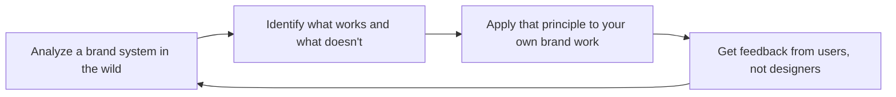

# Brand Guidelines
> **Portability target:** Spec-level (runs on Claude Code, Copilot, Gemini CLI, Codex, Cursor). No vendor-specific frontmatter fields.

Design, document, and enforce a comprehensive brand identity system. This skill covers the full brand design lifecycle: brand architecture and strategy, logo systems with clear space and minimum size rules, color palette creation with accessibility validation, typographic hierarchy, iconography standards, imagery and illustration direction, motion design tokens, brand expression within digital product UI, and governance processes for brand consistency at scale.

## Route the Request

### Auto-Route (No User Input Required)
Evaluate these file-system conditions in order. First match wins — jump immediately.

| # | Condition | Action |
|---|-----------|--------|
| A1 | `file_contains("design-tokens.json", "brand")` OR `file_contains("tokens.json", "color")` | Brand tokens exist. Jump to **Production Checklist**. |
| A2 | `file_exists("*.figma")` AND `file_contains("*.figma", "logo")` | Figma brand file detected. Jump to **Core Workflow**. |
| A3 | `file_contains("*.css", "@font-face")` OR `file_exists("fonts/")` | Custom typography detected. Jump to **references/brand-guidelines.md → Typography**. |
| A4 | `file_contains("tailwind.config.*", "colors")` OR `file_contains("*.css", "--color-brand")` | Color tokens in code. Jump to **references/brand-guidelines.md → Color Palette**. |
| A5 | `file_exists("logo.svg")` OR `file_exists("logo.png")` | Logo assets exist. Jump to **references/brand-guidelines.md → Logo System**. |
| A6 | `file_contains("*.css", "@media.*prefers-reduced-motion")` OR `file_contains("*.css", "@keyframes")` | Motion already defined. Jump to **references/brand-guidelines.md → Motion Design**. |
| A7 | `file_contains("*.md", "brand.architecture")` OR `file_contains("*.md", "branded.house|house.of.brands")` | Brand architecture doc exists. Jump to **Decision Trees → Brand Architecture Model**. |
| A8 | `file_exists("icons/")` AND `file_exists("*.svg")` | Icon set detected. Jump to **references/brand-guidelines.md → Iconography**. |

### Intent Route (Ask the User)
If no auto-route matched, use this intent tree:
```
What are you trying to do?
├── Brand architecture (house of brands, branded house, endorsed, hybrid) → Start at "Decision Trees > Brand Architecture Model"
├── Create a complete identity system (logo, color, typography, icons, motion) → Jump to "Core Workflow"
├── Audit an existing brand for consistency gaps → Jump to "What Good Looks Like"
├── Build a brand governance process with violation tiers → Jump to "references/brand-guidelines.md → Brand Governance"
├── Need product-market positioning or competitive landscape? → `product-strategist`
├── Need design system tokens or component library? → `ui-ux-designer`
├── Need accessibility validation of brand colors or typography? → `accessibility-auditor`
└── Not sure? → Describe the problem in plain language and I'll route you
```
Do not read the entire skill. Follow the route above and read only the sections it points to.

## Ground Rules — Read Before Anything Else

These are hard-gate constraints. Violate any one and the output is invalid.

| # | Negative Constraint | Mechanical Trigger | Violation Response |
|---|---------------------|--------------------|--------------------|
| G1 | Never generate a brand color without WCAG 2.2 AA contrast validation against both white (#FFFFFF) and the darkest brand background | `file_contains(output, "#[0-9A-Fa-f]{6}")` AND NOT `file_contains(output, "contrast.ratio|WCAG|AA|AAA")` | REFUSE. Append: "This palette has not been validated for accessibility. Run contrast checks before use." |
| G2 | Never deliver a logo system that lacks responsive variants — primary, stacked, icon-only (32px), and favicon (16px) all required | `file_contains(output, "logo")` AND NOT `file_contains(output, "icon-only|favicon|responsive.variant")` | STOP. Append: "Logo system incomplete — add icon-only (32px) and favicon (16px) variants with minimum size and clear space rules." |
| G3 | Never specify typography without a complete fallback stack including generic family | `file_contains(output, "font-family")` AND NOT `file_contains(output, "sans-serif|serif|monospace|system-ui")` | DETECT. Append: "Font stack missing fallback. Every font-family declaration must end with a generic family." |
| G4 | Never define motion tokens that ignore `prefers-reduced-motion` — every duration must have a zero-motion mapped alternative | `file_contains(output, "animation-duration|transition-duration")` AND NOT `file_contains(output, "prefers-reduced-motion|reduced-motion")` | REFUSE. Append: "Motion tokens must map to 0ms when prefers-reduced-motion is active. Add reduced-motion fallback." |
| G5 | Never output brand guidelines without semantic token naming — no raw hex or pixel values in guidelines meant for code consumption | `file_contains(output, "guidelines")` AND `file_contains(output, "#[0-9A-Fa-f]{6}|[0-9]+px")` AND NOT `file_contains(output, "token|semantic|primitive")` | DETECT. Append: "Brand values must reference named tokens (e.g., 'color-brand-primary'), not raw hex or pixel values. Convert to semantic tokens." |
| G6 | Never recommend a brand decision without citing at least one of: audience research, competitive positioning, or accessibility requirement | `file_contains(output, "recommend|should use|best practice")` AND NOT `file_contains(output, "audience|competitive|WCAG|AA|research|target user")` | STOP. Append: "Brand recommendation lacks grounding. Cite audience data, competitive context, or accessibility requirement." |

## The Expert's Mindset

Brand is not a logo and a color palette — it's **what people say about you when you're not in the room**. Every visual asset, interaction, and piece of copy either reinforces or erodes that perception. The designer's job is to make the brand feel inevitable: so consistent and coherent that users never consciously notice it, but would immediately feel its absence.

### Mental Models

| Model | Description |
|---|---|
| **Brand = expectation × experience** | Your brand is the promise you make (expectation) multiplied by whether you keep it (experience). A beautiful logo with a broken onboarding flow delivers 0. Beautiful + functional = brand. |
| **Consistency builds trust** | Every inconsistency — a different blue, a misaligned button, a rogue font — signals "nobody's paying attention." Users trust consistency more than they trust aesthetics. |
| **Brand lives in the product, not just marketing** | The landing page sells the brand; the product lives it. If your product UI doesn't express the same personality as your marketing site, you have two brands, not one. |
| **Constraints drive creativity** | "Make it look good" is infinite and paralyzing. "Make it warm, approachable, and accessible within this 4-color palette and 2-typeface system" is where great design happens. |

### Cognitive Biases in Brand Design

| Bias | How It Shows Up | Defense |
|---|---|---|
| **Personal preference disguised as strategy** | "I like blue" presented as "Blue conveys trust" | Every color, type, and shape choice must cite: audience expectation, competitive landscape, or accessibility requirement. |
| **Recency bias** | Chasing the latest design trend (glassmorphism, brutalism, bento grids) without strategic fit | Ask: "Will this feel dated in 2 years? Does it serve the brand strategy or just look current?" |
| **Anchoring on first concept** | Falling in love with the first logo direction and evaluating all others against it | Generate 3+ distinct directions before evaluating any. Kill your favorite first. |
| **False consensus in taste** | Assuming "this looks good" is universal rather than cultural and contextual | Test brand directions with target audience members, not with your design team. |

### What Masters Know That Others Don't

- **The best brand systems disappear.** Users don't think "what a great design system" — they think "this product feels right." The system is infrastructure, not decoration.
- **Accessibility is brand expression.** A brand that's inaccessible to 15% of the population isn't a brand — it's a barrier. The best brand systems bake WCAG compliance into the color palette, type scale, and component design from day 1.
- **The brand system is a product.** It has users (designers, developers, marketers), it needs documentation, it evolves with feedback, and it requires maintenance. Treat it like a product, not a one-time deliverable.
- **Typography does more emotional work than color.** Users may not consciously notice the typeface, but they feel it. A geometric sans feels modern and clean; a humanist sans feels warm and approachable. Choose type for feeling, not just legibility.

## Operating at Different Levels

Brand design scales from single-brand identity to multi-brand portfolio governance.

| Level | Brand Design Output Characteristics |
|---|---|
| **L1 — Apprentice** | Applies brand guidelines to a touchpoint. Learns brand principles and identity system components. |
| **L2 — Practitioner** | Owns brand identity for a product or sub-brand. Delivers logo system, color palette, typography hierarchy, and brand guidelines document. |
| **L3 — Senior** | Owns brand architecture for a company. Brand portfolio decisions (branded house vs house of brands). Brand-in-product expression strategy. |
| **L4 — Brand Director** | Defines brand governance across the organization. "This is how we express our brand at every touchpoint." Brand evolution and refresh strategy. |
| **L5 — Industry-level** | Creates brand methodologies and identity frameworks adopted across the industry. |

**Usage**: Say "as an L3 brand designer, create the identity system for..." Default: **L2** (product/sub-brand identity, independent execution).

## When to Use

<!-- QUICK: 30s -- scan the bullet list to decide if this skill fits -->
- Creating a brand identity system for a new company, product, or sub-brand
- Auditing and evolving an existing brand for consistency and accessibility
- Designing a logo system: primary, secondary, icon-only, wordmark, responsive variants
- Building a color palette with semantic colors, dark mode, and WCAG accessibility validation
- Defining typography hierarchy with usage rules: display, heading, body, caption, overline
- Establishing iconography, illustration, and imagery standards
- Creating motion design tokens: timing scales, easing curves, animation principles
- Integrating brand expression into product UI without compromising usability
- Setting up brand governance: review processes, asset distribution, violation handling

## Decision Trees

<!-- QUICK: 30s -- follow the ASCII tree to your scenario -->
### Brand Architecture Model
```
                     ┌──────────────────────────┐
                     │ START: Brand architecture│
                     │ model?                   │
                     └───────────┬──────────────┘
                                 │
              ┌──────────────────▼──────────────────┐
              │ Are the sub-brands/products         │
              │ stronger than the parent brand?     │
              └────┬────────────────────┬───────────┘
                   │ YES                │ NO
                   ▼                    ▼
        ┌──────────────────┐  ┌──────────────────────┐
        │ House of Brands: │  │ Do products share    │
        │ Independent      │  │ the same brand       │
        │ identities (P&G, │  │ promise and audience?│
        │ Unilever).       │  └──┬───────────────┬───┘
        └──────────────────┘     │ YES           │ NO
                                 ▼               ▼
                          ┌────────────┐  ┌──────────────┐
                          │ Branded    │  │ Endorsed or  │
                          │ House:     │  │ Hybrid:      │
                          │ One master │  │ Parent brand │
                          │ brand      │  │ endorsement  │
                          │ (Google,   │  │ (Nest by     │
                          │ Apple)     │  │ Google)      │
                          └────────────┘  └──────────────┘
```
**When Branded House:** Single strong master brand. Products are features/verticals of one promise. Marketing efficiency through unified awareness.  
**When House of Brands:** Acquired companies with existing equity. Targeting different audiences with conflicting brand promises. Risk isolation between brands.

### Logo System Complexity
```
                     ┌──────────────────────────────┐
                     │ START: Logo variants needed? │
                     └─────────────┬────────────────┘
                                   │
              ┌────────────────────▼────────────────────┐
              │ Logo needs to work in favicon (16×16),  │
              │ app icon (1024×1024), and billboard?   │
              └────┬──────────────────────┬─────────────┘
                   │ YES                  │ NO
                   ▼                      ▼
        ┌──────────────────┐    ┌──────────────────────┐
        │ Full system:     │    │ Single use-case?     │
        │ Primary + Icon-  │    │ Primary + Stacked   │
        │ only + Wordmark  │    │ variant only.       │
        │ + Responsive     │    │ Skip responsive.    │
        │ variants.        │    └──────────────────────┘
        └──────────────────┘
```
**When full system needed:** Multi-platform product (web, iOS, Android, print). Logo appears at extreme sizes. Brand used by external partners.  
**When minimal suffices:** Single-context use (web only). Logo always appears at predictable sizes. Internal or B2B tool with limited brand exposure.

### Color Palette Scope
```
                     ┌──────────────────────────────┐
                     │ START: Palette complexity?   │
                     └─────────────┬────────────────┘
                                   │
              ┌────────────────────▼────────────────────┐
              │ Product has dark mode, data             │
              │ visualization, or multiple themes?      │
              └────┬──────────────────────┬─────────────┘
                   │ YES                  │ NO
                   ▼                      ▼
        ┌──────────────────┐    ┌──────────────────────┐
        │ Full token       │    │ Core palette:        │
        │ system: primary, │    │ Primary, secondary,  │
        │ secondary,       │    │ neutral, semantic    │
        │ neutral, semantic│    │ (error, success,     │
        │ + dark variants  │    │ warning). 12–20      │
        │ + chart palette. │    │ colors total.        │
        │ 30–50 tokens.    │    └──────────────────────┘
        └──────────────────┘
```
**When full token system:** Product UI with light/dark mode. Analytics dashboards with charts. White-label or multi-tenant theming requirements.  
**When core palette:** Marketing site + simple app. Light mode only. No data visualization beyond status indicators. Fast time to launch.

### Typography Hierarchy Depth
```
                     ┌──────────────────────────────┐
                     │ START: Type scale depth?     │
                     └─────────────┬────────────────┘
                                   │
              ┌────────────────────▼────────────────────┐
              │ Product has long-form content,          │
              │ documentation, or articles?             │
              └────┬──────────────────────┬─────────────┘
                   │ YES                  │ NO
                   ▼                      ▼
        ┌──────────────────┐    ┌──────────────────────┐
        │ Full scale:      │    │ Compact scale:       │
        │ Display, H1–H4,  │    │ H1–H3, Body,        │
        │ Body Large, Body,│    │ Caption, Overline.   │
        │ Body Small,      │    │ 6–8 sizes. UI-       │
        │ Caption, Overline│    │ focused.             │
        │ + Blockquote.    │    └──────────────────────┘
        │ 10–14 sizes.     │
        └──────────────────┘
```
**When full scale:** Blog, documentation, marketing site with long-form reading. Multiple content types (articles, case studies, legal). Readability-critical.  
**When compact scale:** Dashboard, admin panel, B2B tool. Primarily UI components. Short text mostly. Consistency over typographic expression.

### Governance Model
```
                     ┌──────────────────────────────┐
                     │ START: Governance approach?  │
                     └─────────────┬────────────────┘
                                   │
              ┌────────────────────▼────────────────────┐
              │ Brand assets used by external partners, │
              │ agencies, or > 10 internal creators?    │
              └────┬──────────────────────┬─────────────┘
                   │ YES                  │ NO
                   ▼                      ▼
        ┌──────────────────┐    ┌──────────────────────┐
        │ Full governance: │    │ Light governance:    │
        │ Self-serve portal│    │ Shared Figma +       │
        │ + review process │    │ design token repo.   │
        │ + asset CDN +    │    │ PR-based review.     │
        │ violation tiers. │    └──────────────────────┘
        └──────────────────┘
```
**When full governance:** Co-branding with partners. Multiple agencies creating assets. Brand used in 20+ countries. Enterprise with legal/compliance requirements.  
**When light governance:** Single design team. Assets consumed only by internal engineering. No external co-branding. Brand changes < quarterly.

## Core Workflow

<!-- QUICK: 30s -- scan phase titles to understand the process -->
### Phase 1 (~15 min): Brand Architecture & Strategy

#### 1.1 Brand Architecture Models

| Model | Description | When to Use | Example |
|-------|-------------|-------------|---------|
| **Branded House** | One master brand, all products share identity | Strong single brand, cohesive experience | Google (everything is Google), Apple |
| **House of Brands** | Independent brands under a parent company | Diverse products, different audiences | P&G (Tide, Pampers, Gillette), Unilever |
| **Endorsed** | Sub-brands with own identity + parent endorsement | Related but distinct products | Marriott (Courtyard by Marriott, Residence Inn by Marriott) |
| **Hybrid** | Mix of endorsed and independent | Complex portfolios | Microsoft (Windows, Xbox, LinkedIn — each distinct) |

Decision framework:
```
┌─ Single audience, single promise? ───────► Branded House
│
├─ Multiple distinct audiences, different promises? ──► House of Brands
│
└─ Related products, shared trust? ───────► Endorsed Brand Architecture
```


**What good looks like:** Brand guidelines document that a designer outside your company can pick up and produce an on-brand screen within an hour. Design token file (JSON/TS/CSS custom properties) matches the guidelines byte-for-byte — they're the same truth, not two documents that contradict each other. Every component pattern has examples of correct use, incorrect use, and edge cases.
#### 1.2 Brand Strategy Foundation

Before designing, document:

1. **Brand Promise:** What does the brand commit to delivering? One sentence.
   - *Example: "Stripe makes payments infrastructure invisible — so businesses can focus on building."*

2. **Brand Personality:** 3-5 adjectives describing the brand as a person.
   - *Example: "Stripe is: technical, precise, trustworthy, empowering, global."*

3. **Target Audience:** 2-3 primary audience personas with needs and context.

4. **Competitive Landscape:** 3-5 competitors. How does this brand differentiate visually and verbally?

5. **Brand Voice:** Tone attributes for copy and content.
   - *Example: "Stripe is: clear over clever, direct over decorative, helpful over hype."*

### Phase 2 (~30 min): Logo System

#### 2.1 Logo Variants

Every brand needs a logo system, not just one logo. Define all variants:

| Variant | Description | Primary Use |
|---------|-------------|-------------|
| **Primary / Horizontal** | Full logo (icon + wordmark, horizontal layout) | Website header, marketing, default usage |
| **Stacked / Vertical** | Full logo (icon above wordmark) | Square spaces, social media avatars, app icons |
| **Icon-only / Mark

> See [references/core-workflow.md](references/core-workflow.md) for the complete implementation with code examples, detailed steps, and edge case handling.

## Cross-Skill Coordination

<!-- QUICK: 30s -- table of who to talk to when -->
Brand guidelines are useless if nobody uses them. Coordination with design, engineering, and marketing ensures the brand is applied consistently — not just in Figma, but in production code, marketing materials, and partner content.

| Upstream Skill | What You Receive | When to Involve |
|---|---|---|
| `product-strategist` | Market positioning, audience definition, competitive landscape, brand differentiation strategy | Before brand architecture design; during brand refresh |
| `marketing-manager` | ICP definition, messaging framework, campaign channel strategy, demand gen requirements | During brand identity creation; before asset template design |

| Downstream Skill | What You Provide | Impact of Delay |
|---|---|---|
| `ui-ux-designer` | Design tokens (color, typography, spacing, motion), component theming guidance, dark mode palette, icon family specs | Design system uses inconsistent or inaccessible tokens — fragmented product experience |
| `frontend-developer` | Token export format (CSS custom properties), naming conventions, breakpoint system, brand asset CDN paths | Hardcoded brand values proliferate — brand drift across codebase |
| `ux-writer` | Voice and tone guidelines, messaging frameworks, terminology standards, content style rules | Inconsistent product copy — brand voice feels disjointed |
| `product-marketing-manager` | Brand architecture model, visual asset library (logos, colors, fonts, templates), co-branding rules, usage guidelines | Marketing campaigns deviate from brand — diluted market presence |

### Communication Triggers — When to Proactively Notify

| Trigger | Notify | Why |
|---------|--------|-----|
| Rebrand or major brand refresh | `product-strategist`, `marketing-manager`, `ceo-strategist` | Coordinated rollout across all touchpoints, asset migration, external communications |
| Design token breaking change | `ui-ux-designer`, `frontend-developer` | Component regression risk, migration plan, deprecation timeline |
| New sub-brand or product brand created | `product-manager`, `marketing-manager`, `product-strategist` | Brand architecture update, naming guidelines, visual system extension |
| Brand violation in production (logo, color, typography) | `frontend-developer`, `product-manager`, `marketing-manager` | Fix prioritization, root cause (missing token, hardcoded value), prevention |
| Accessibility issue found in brand elements | `accessibility-auditor`, `ui-ux-designer` | Contrast adjustment, typography change, motion compliance fix |
| Brand asset request from external partner | `legal-advisor`, `marketing-manager` | Usage approval, co-branding rules, license terms |
| Brand guideline version published | All consumers (via changelog + notification) | What changed, what's deprecated, migration guide, effective date |

### Escalation Path

```
Brand integrity at risk (unauthorized sub-brand, major public misuse, trademark violation)
  └── `brand-guidelines` + `legal-advisor` + `marketing-manager` + `ceo-strategist`. Cease-and-desist if external. Fix within 24 hours if internal.

Design system conflict (brand token change breaks 10+ components)
  └── `ui-ux-designer` + `frontend-developer` + `brand-guidelines`. Impact assessment, migration plan, staged rollout.

Minor brand drift (wrong shade, inconsistent spacing, outdated logo in one location)
  └── Direct fix by team that owns the asset. `brand-guidelines` informed. No escalation needed.
```

## Proactive Triggers

| Trigger | Action | Why |
|---------|--------|-----|
| No design tokens file exists — colors, spacing, and typography are hardcoded in Figma and code | Propose token generation: extract all hardcoded values, deduplicate, assign semantic names, export as JSON. Coordinate with `ui-ux-designer` and `frontend-developer` to establish a single source of truth consumed by both Figma (via Tokens Studio) and code (via Style Dictionary) | Design tokens are the operating system of brand consistency. Without them, every new screen, component, and marketing asset is an opportunity for brand drift. Token generation is a one-time investment that pays back perpetually |
| Logo used at wrong size, stretched, or placed on a busy/noisy background in production | Flag to `frontend-developer` and `product-manager` with screenshot evidence. Check: is the correct variant available? Is the clear-space rule documented? Is the minimum-size threshold published? Fix the root cause (missing variant, unclear guideline, hard-to-find asset) not just the instance | A stretched logo is the most visible brand failure — it signals "we don't care about details" to every user who sees it. The fix is always systemic: make the right asset easy to find and the wrong asset hard to use |
| Color contrast fails WCAG 2.2 AA on any text-on-brand-background combination | Alert `accessibility-auditor` and `ui-ux-designer`. Audit the entire brand palette for contrast compliance. Adjust problematic color pairs — brand identity must work within accessibility constraints, not against them. Document accessible variants of every brand color | Brand colors that fail contrast are not brand assets — they're brand liabilities. An inaccessible brand is a broken brand. The brand's visual identity must be legible to all users, or it's not an identity — it's an exclusion |
| New sub-brand or product brand created without brand architecture review | Flag to `product-strategist` and `marketing-manager`. Run brand architecture decision: Branded House (master brand leads) vs House of Brands (standalone) vs Endorsed (master brand endorsement). Document the architecture model before any visual identity work begins | Brand architecture decisions are strategic, not visual. A sub-brand created without architecture review fragments the portfolio and confuses customers. The visual identity follows the architecture — not the other way around |
| Typography token updated without testing at all breakpoints and content extremes | Flag to `ui-ux-designer`. Require testing at: 320px mobile, 768px tablet, 1440px desktop, 4K. Test with minimum content (1 word), maximum content (200+ characters), and zero content. Type scales that look beautiful at one size often break at extremes | Typography is the most ubiquitous brand element — every page, every button, every label uses it. A type scale change that breaks at mobile affects 60%+ of user sessions. Validate before publishing |
| Icon set inconsistent — different stroke weights, corner radii, or grid sizes across the product | Audit the icon library for consistency: all icons must use the same grid (24×24), same stroke weight, same corner radius, same optical sizing. Flag violations. If multiple icon families are needed (UI icons vs illustration icons), document the separation explicitly | Icon inconsistency is the "death by a thousand cuts" of brand degradation. Users may not consciously notice that the settings icon has 2px strokes while the profile icon has 1.5px — but they feel the lack of polish |
| Brand asset request from external partner (co-marketing, integration partner, press) with no co-branding guidelines | Pause approval until co-branding rules are defined: logo placement hierarchy, minimum clear space between logos, color restrictions, "Powered by" vs "In partnership with" language. Coordinate with `legal-advisor` for trademark usage terms | Unauthorized co-branding creates legal exposure and brand dilution. Partners will use your logo in the most prominent position unless you define the rules upfront. Co-branding guidelines protect both brand equity and legal standing |
| Interaction with `frontend-developer` for design token handoff | When brand tokens change, coordinate the pipeline: brand-guidelines defines semantic tokens → Style Dictionary transforms to platform-specific formats (CSS custom properties, Swift, Kotlin) → frontend-developer consumes via npm package or CDN. Every token change must include a migration guide with before/after values and deprecation timeline | The gap between a brand token update in Figma and the same token in production code is where brand drift lives. A defined pipeline with automated token distribution eliminates "the old blue" from surviving in code for 6 months after the brand refresh |

## What Good Looks Like

> The logo renders crisply at every size from 16px favicon to 4K billboard, with correct clear space, and never stretched, recolored, or placed on a busy background.

> See [references/what-good-looks-like.md](references/what-good-looks-like.md) for the full quality standard.


## Deliberate Practice

Brand design mastery comes from exposure — seeing more brands, analyzing what works, and applying principles across diverse constraints.



| Level | Practice Routine | Frequency |
|---|---|---|
| **Novice** | Deconstruct a well-known brand: identify logo system, color logic, type pairings, and brand voice | Weekly |
| **Competent** | Redesign a local business's brand identity as an exercise — same values, better expression | Monthly |
| **Expert** | Run a brand audit across all touchpoints of your own product and produce a gap analysis | Quarterly |
| **Master** | Define a brand system that outlasts your tenure — publish the principles, not just the assets | Annually |

**The One Highest-Leverage Activity**: Take a screenshot of every touchpoint where your brand appears (product, marketing, support, invoices). Print them on one wall. The inconsistencies will scream at you.

## Gotchas

- **Color palette in HEX only** — you define `primary: #0066FF` and someone needs it for print (CMYK), they convert with an online tool and get `C100-M60-Y0-K0`. The actual CMYK equivalent of your brand color should be SPECIFIED — no one should be converting brand colors themselves.
- **Logo in SVG exported from Figma/Illustrator** — the SVG has 147 inline styles, 23 `<clipPath>` definitions, and references fonts not available in production. The logo renders differently on every platform. Export with `presentationAttributes`, flatten, and convert text to paths for the canonical logo file.
- **Typography scale on web using Google Fonts** — Google Fonts loads from `fonts.googleapis.com`, which adds 400-800ms to your LCP and risks the font server being blocked in China or by corporate firewalls. Self-host the WOFF2 files with `font-display: swap` and `preload` headers.
- **"Brand in product"** — the marketing site has a bold, colorful brand; the product UI is gray with one accent color. Users don't perceive them as the same company. Brand expression in product must be proportional to brand expression in marketing: same color system, same typographic voice, same illustration style. Consistency > minimalism.
- **Motion design tokens** (easing curves, duration scales) that are undocumented — the marketing site uses spring animations, the product uses CSS ease-in-out, the mobile app uses native platform curves. Brand motion feels disjointed. Define `easing-enter`, `easing-exit`, `duration-fast/normal/slow` as tokens.


## References

Detailed reference material loaded on demand:

- **Core Workflow — Full Implementation**: See [core-workflow.md](references/core-workflow.md)
- **Anti-Patterns**: See [anti-patterns.md](references/anti-patterns.md)
- **Best Practices**: See [best-practices.md](references/best-practices.md)
- **Calibration — How to Know Your Level**: See [calibration.md](references/calibration.md)
- **Production Checklist**: See [checklist.md](references/checklist.md)
- **Error Decoder**: See [error-decoder.md](references/error-decoder.md)
- **Footguns**: See [footguns.md](references/footguns.md)
- **Scale Depth: Solo → Small → Medium → Enterprise**: See [scale-depth.md](references/scale-depth.md)
- **Sub-Skills**: See [sub-skills.md](references/sub-skills.md)

