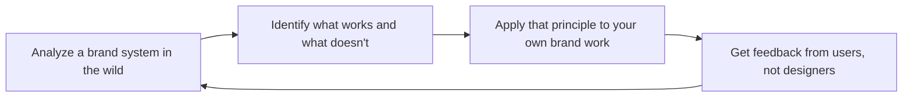

# Brand Guidelines
> **Portability target:** Spec-level (runs on Claude Code, Copilot, Gemini CLI, Codex, Cursor). No vendor-specific frontmatter fields.
## <!-- DEEP: 5+min --> RESEARCH_PREREQUISITE — Execute Before Any Output

**This is a HARD GATE. Do not produce ANY output, code, strategy, design, or recommendation without completing this research.**

Before you act, you MUST execute every applicable research step. Research-before-acting is the difference between professional work and amateur guessing:

| # | Research Step | Why It Matters | Where to Look |
|---|--------------|----------------|----------------|
| **RP1** | **Verify domain currency.** Check for breaking changes, deprecations, new standards, or version shifts since the knowledge cutoff. | [STALE_RISK] Outdated advice breaks real systems. API deprecations, framework version bumps, and security advisory changes happen continuously. Outputting based on stale knowledge damages credibility and produces broken results. | Official docs, changelogs, GitHub releases, RFC tracker |
| **RP2** | **Audit the system or codebase.** Read relevant files. Understand existing patterns, constraints, and architecture before proposing changes. | [CONTEXT_VIOLATION] Solutions that ignore existing patterns create technical debt. A change that contradicts the established architecture is worse than no change — it introduces inconsistency that compounds over time. | Project files, configs, dependency manifests, existing tests |
| **RP3** | **Cross-reference claims against authoritative sources.** Every factual assertion needs a verifiable source. Mark each: [VERIFIED], [COMPUTED], or [ESTIMATED]. | [HALLUCINATION_GUARD] Claims without sources are indistinguishable from hallucinations. The #1 cause of incorrect output is treating assumptions as facts. Source tagging prevents this. | Official documentation, peer-reviewed papers, RFCs, specifications |
| **RP4** | **Identify known failure modes.** Before recommending, list what commonly breaks. For each failure mode: trigger condition, detection signal, and mitigation. | [FAILURE_BLINDNESS] Every domain has known failure patterns. Output that doesn't address them is dangerously incomplete. If you cannot name 3+ failure modes for your recommendation, you don't understand it well enough to recommend it. | Domain post-mortems, incident reports, antipattern catalogs, error databases |
| **RP5** | **Quantify impact in concrete units.** Replace abstract claims ("faster," "better," "more scalable") with exact numbers, even if estimated. | [VAGUENESS_PENALTY] "Faster" is unverifiable. "Reduces p95 latency from 340ms to 120ms (±15ms)" is verifiable. Abstract adjectives hide ignorance behind confidence. Concrete numbers expose gaps. | Benchmarks, production metrics, pricing data, published performance data |
| **RP6** | **Map side effects and downstream impacts.** What else breaks? Which dependencies are affected? Which downstream consumers need updating? | [CASCADE_BLINDNESS] Changes to one component ripple outward. A fix in module A can break module B that depends on A's old behavior. Map the blast radius before acting. | Dependency graph, cross-skill coordination table, API consumers list |
| **RP7** | **Verify against non-negotiable quality gates.** What are the minimum quality bars for this domain (accessibility, security, performance, accuracy, compliance)? | [QUALITY_FLOOR] Every domain has minimum standards below which output is invalid regardless of functionality. Missing WCAG AA = broken. Leaking credentials = broken. Silent data loss = broken. | Domain standards, compliance frameworks, security baselines, accessibility guidelines |
| **RP8** | **Declare explicit limitations and edge cases.** What does this NOT handle? What are the known boundaries? What scenarios are explicitly out of scope? | [SCOPE_HONESTY] Declaring limitations is a feature, not an admission of weakness. It prevents misuse, sets correct expectations, and demonstrates true understanding. Every solution has boundaries — naming them is professional. | This SKILL.md, domain literature, edge case databases |

**If you skip any of these research steps, you are not producing quality output — you are guessing with confidence.** Guessing wastes time, breaks systems, and destroys trust. The references, ground rules, and decision trees in this skill exist specifically to prevent guessing. Use them.

> **Compliance:** Research must be executed before any substantial output. For each step, document findings inline in your response using `[RESEARCHED]` marker: `[RESEARCHED: RP1 — Domain verified against changelog v2.4. No breaking changes since cutoff.]`. Partial research = partial quality. Zero research = zero credibility.


### 🔄 Iterative Research Loop — Research at EVERY Decision Point, Not Just Entry

**The RP1-RP8 cycle above is NOT a one-time gate.** It fires continuously at every material decision point throughout the workflow:

| Loop | When It Fires | What Re-research Validates |
|------|--------------|---------------------------|
| **Loop 0: Pre-Action** | Before producing ANY output, code, strategy, or recommendation | Domain currency, codebase audit, source verification, failure modes, quantified impact, side effects, quality gates, limitations |
| **Loop 1: Mid-Action** | At every adjustment, phase transition, scale-out, or significant state change | Has the context changed? Are the original assumptions still valid? Has new information invalidated the Loop 0 conclusions? |
| **Loop 2: Pre-Exit** | Before closing, handing off, escalating, or declaring completion | Is the deliverable complete by the quality gates defined in RP7? Are all limitations declared (RP8)? Have failure modes been addressed (RP4)? |
| **Loop 3: Post-Action** | After completion: compare expected vs. actual outcome | What was the efficiency ratio (actual / theoretical max)? What learnings emerged? What should be fed back into the pattern database for future decisions? |

**Integration into Core Workflow:**

Every decision point in a skill's Core Workflow must be marked with:
```
[RESEARCH LOOP: Re-execute RP1-RP8 before proceeding to next phase]
```

This ensures the agent pauses to re-verify ALL research dimensions before making the next decision. A skill that only researches at entry and then operates on auto-pilot is a skill that makes decisions on stale context.

**Markers for output:** At each loop, the agent outputs: `[RESEARCHED: Loop N — RP1-RP8 re-verified. Key delta from previous loop: ...]`

**Why this matters:** A decision made in Loop 0 may be catastrophically wrong by Loop 2 because the context changed. Markets move. Requirements shift. Dependencies update. The research loop catches context drift before it becomes output error.

> **Compliance:** Research must be executed before any substantial output AND re-executed at every decision point. For each research loop, document findings inline. Partial research = partial quality. Zero research = zero credibility. Stale research = dangerous confidence.


## Anti-Hallucination
<!-- STANDARD: 3min -->

| Rationalization | Reality |
|---|---:|
| "We'll validate accessibility later — right now we just need to pick brand colors that look good." | Your primary palette yields 2.3:1 text contrast against the brand background — below the 4.5:1 AA minimum. Every product screen built with those colors ships legally non-compliant. Remediating after launch requires reworking every color-dependent component. Cost: $20K-$80K in accessibility remediation, potential ADA demand letters, and redesign of color-dependent UI. |
| "The logo looks fine in SVG exported from Figma — developers can clean it up." | 147 inline styles, 23 `<clipPath>` definitions, fonts not available in production. The logo renders differently on every platform. Your brand's single most recognizable asset is a broken mess across devices. Cost: $10K-$30K in developer cleanup time and brand perception damage from inconsistent rendering. |
| "Google Fonts is free and easy — self-hosting isn't worth the effort." | Google Fonts adds 400-800ms to your LCP and is blocked in China and by corporate firewalls. Every millisecond of load time costs conversions. Your brand typeface literally doesn't load for significant user segments. Cost: $15K-$50K in lost conversions and inaccessible brand typography for international and enterprise users. |
| "The rebrand will resonate — we don't need customer research on the new identity." | Gap's 2010 logo reversal lasted 6 days and cost $100M in brand equity. Tropicana's 2009 redesign lasted 7 weeks and lost 20% in sales. Your customers have an emotional relationship with your current brand — change it without them and they'll punish you. Cost: $100K-$1M in rebrand failure, emergency reversion, and lost goodwill. |
| "Color palette in HEX only is fine — designers can convert to CMYK or P3 themselves." | Someone converts `#0066FF` to CMYK with an online tool, gets `C100-M60-Y0-K0`, and your print materials use a color that's visibly wrong. Every conversion is a divergence from the brand. Your palette must be SPECIFIED in every colorspace — one conversion error = inconsistent brand expression across channels. Cost: $5K-$25K per reprint cycle from color mismatch across print and digital. |

Design, document, and enforce a comprehensive brand identity system. This skill covers the full brand design lifecycle: brand architecture and strategy, logo systems with clear space and minimum size rules, color palette creation with accessibility validation, typographic hierarchy, iconography standards, imagery and illustration direction, motion design tokens, brand expression within digital product UI, and governance processes for brand consistency at scale.

## Route the Request
<!-- STANDARD: 3min -->

### Auto-Route (No User Input Required)
Evaluate these file-system conditions in order. First match wins — jump immediately.

| # | Condition | Action |
|---|-----------|--------|
| A1 | `file_contains("design-tokens.json", "brand")` OR `file_contains("tokens.json", "color")` | Brand tokens exist. Jump to **Production Checklist**. |
| A2 | `file_exists("*.figma")` AND `file_contains("*.figma", "logo")` | Figma brand file detected. Jump to **Core Workflow**. |
| A3 | `file_contains("*.css", "@font-face")` OR `file_exists("fonts/")` | Custom typography detected. Jump to **references/brand-guidelines.md → Typography**. |
| A4 | `file_contains("tailwind.config.*", "colors")` OR `file_contains("*.css", "--color-brand")` | Color tokens in code. Jump to **references/brand-guidelines.md → Color Palette**. |
| A5 | `file_exists("logo.svg")` OR `file_exists("logo.png")` | Logo assets exist. Jump to **references/brand-guidelines.md → Logo System**. |
| A6 | `file_contains("*.css", "@media.*prefers-reduced-motion")` OR `file_contains("*.css", "@keyframes")` | Motion already defined. Jump to **references/brand-guidelines.md → Motion Design**. |
| A7 | `file_contains("*.md", "brand.architecture")` OR `file_contains("*.md", "branded.house|house.of.brands")` | Brand architecture doc exists. Jump to **Decision Trees → Brand Architecture Model**. |
| A8 | `file_exists("icons/")` AND `file_exists("*.svg")` | Icon set detected. Jump to **references/brand-guidelines.md → Iconography**. |

### Intent Route (Ask the User)
If no auto-route matched, use this intent tree:

```
What are you trying to do?
├── Brand architecture (house of brands, branded house, endorsed, hybrid) → Start at "Decision Trees > Brand Architecture Model"
├── Create a complete identity system (logo, color, typography, icons, motion) → Jump to "Core Workflow"
├── Audit an existing brand for consistency gaps → Jump to "What Good Looks Like"
├── Build a brand governance process with violation tiers → Jump to "references/brand-guidelines.md → Brand Governance"
├── Need product-market positioning or competitive landscape? → `product-strategist`
├── Need design system tokens or component library? → `ui-ux-designer`
├── Need accessibility validation of brand colors or typography? → `accessibility-auditor`
└── Not sure? → Describe the problem in plain language and I'll route you

```

Do not read the entire skill. Follow the route above and read only the sections it points to.

## Ground Rules — Read Before Anything Else
<!-- STANDARD: 3min -->

These are hard-gate constraints. Violate any one and the output is invalid.

| # | Negative Constraint | Mechanical Trigger | Violation Response |
|---|---------------------|--------------------|--------------------|
| G1 | Never generate a brand color without WCAG 2.2 AA contrast validation against both white (#FFFFFF) and the darkest brand background | `file_contains(output, "#[0-9A-Fa-f]{6}")` AND NOT `file_contains(output, "contrast.ratio|WCAG|AA|AAA")` | REFUSE. Append: "This palette has not been validated for accessibility. Run contrast checks before use." |
| G2 | Never deliver a logo system that lacks responsive variants — primary, stacked, icon-only (32px), and favicon (16px) all required | `file_contains(output, "logo")` AND NOT `file_contains(output, "icon-only|favicon|responsive.variant")` | STOP. Append: "Logo system incomplete — add icon-only (32px) and favicon (16px) variants with minimum size and clear space rules." |
| G3 | Never specify typography without a complete fallback stack including generic family | `file_contains(output, "font-family")` AND NOT `file_contains(output, "sans-serif|serif|monospace|system-ui")` | DETECT. Append: "Font stack missing fallback. Every font-family declaration must end with a generic family." |
| G4 | Never define motion tokens that ignore `prefers-reduced-motion` — every duration must have a zero-motion mapped alternative | `file_contains(output, "animation-duration|transition-duration")` AND NOT `file_contains(output, "prefers-reduced-motion|reduced-motion")` | REFUSE. Append: "Motion tokens must map to 0ms when prefers-reduced-motion is active. Add reduced-motion fallback." |
| G5 | Never output brand guidelines without semantic token naming — no raw hex or pixel values in guidelines meant for code consumption | `file_contains(output, "guidelines")` AND `file_contains(output, "#[0-9A-Fa-f]{6}|[0-9]+px")` AND NOT `file_contains(output, "token|semantic|primitive")` | DETECT. Append: "Brand values must reference named tokens (e.g., 'color-brand-primary'), not raw hex or pixel values. Convert to semantic tokens." |
| G6 | Never recommend a brand decision without citing at least one of: audience research, competitive positioning, or accessibility requirement | `file_contains(output, "recommend|should use|best practice")` AND NOT `file_contains(output, "audience|competitive|WCAG|AA|research|target user")` | STOP. Append: "Brand recommendation lacks grounding. Cite audience data, competitive context, or accessibility requirement." |
| R1 | **ANCHOR to runtime versions before generating framework-specific code.** Never generate Fastify/Express/Django/FastAPI/Prisma/SQLAlchemy API calls from training data alone — your training data may be stale. | Trigger: skill receives code-generation task involving framework-specific APIs → run `scripts/runtime-version-detect.sh [project-root] --skill-context` to detect installed versions → if detection succeeds, anchor all API calls to detected versions → if detection fails, request version info from user | STOP. Respond: "Detected: {runtime}@{version}, {frameworks}@{versions}. Anchoring all API calls to these versions. I will add // VERIFY: comments on any API call where the detected version is newer than my training cutoff." |
| R2 | **RUN the ROI Gate before any non-emergency code change.** Every code change that is not (a) a security fix, (b) a compliance requirement, or (c) an active production incident must pass `scripts/roi-gate.sh`. If the gate returns negative, refuse to write the code. | Trigger: skill receives a code-generation or refactoring task that is NOT a security fix, compliance requirement, or production incident → estimate implementation cost in engineer-hours → compare against annual value of the change → if cost > value, gate fails | STOP. Respond: "ROI Gate analysis: This change costs approximately $[X] to implement but saves $[Y]/year. Payback period: [N] years. If payback > 2 years, I recommend declining this work. See `scripts/roi-gate.sh` for the full formula." |

- **Admit uncertainty — never fabricate.** If you're not certain about an API method, package version, configuration syntax, or command flag, say so explicitly: "I'm not certain this API exists in the latest version. Check the official docs at [URL]." Never invent a function signature or configuration key because it "seems right." Hallucinated code costs hours of debugging.
- **Flag your knowledge cutoff.** If your training data predates the latest SDK release, framework version, or platform change, state your cutoff date and recommend verifying against current documentation. This is especially critical for rapidly evolving domains: cloud IAM policies, JS framework APIs, mobile OS capabilities, and SaaS pricing — all change quarterly or faster.
- **Never guess security configurations.** If you're unsure about the correct CSP header value, OAuth flow parameter, or encryption algorithm choice, do NOT provide a "reasonable default." Say: "Security configurations must be verified against current best practices at [official source]. I cannot provide a definitive answer without current documentation."
- **Distinguish between what you know and what you infer.** Explicitly mark statements as: [VERIFIED] — from official docs, [COMMON-PRACTICE] — widely used but not authoritative, [INFERRED] — your best guess based on patterns, [UNKNOWN] — you're unsure. This helps the user calibrate trust in your output.
## The Expert's Mindset
<!-- STANDARD: 3min -->

Brand is not a logo and a color palette — it's **what people say about you when you're not in the room**. Every visual asset, interaction, and piece of copy either reinforces or erodes that perception. The designer's job is to make the brand feel inevitable: so consistent and coherent that users never consciously notice it, but would immediately feel its absence.

### Mental Models

| Model | Description |
|---|---|
| **Brand = expectation × experience** | Your brand is the promise you make (expectation) multiplied by whether you keep it (experience). A beautiful logo with a broken onboarding flow delivers 0. Beautiful + functional = brand. |
| **Consistency builds trust** | Every inconsistency — a different blue, a misaligned button, a rogue font — signals "nobody's paying attention." Users trust consistency more than they trust aesthetics. |
| **Brand lives in the product, not just marketing** | The landing page sells the brand; the product lives it. If your product UI doesn't express the same personality as your marketing site, you have two brands, not one. |
| **Constraints drive creativity** | "Make it look good" is infinite and paralyzing. "Make it warm, approachable, and accessible within this 4-color palette and 2-typeface system" is where great design happens. |

### Cognitive Biases in Brand Design

| Bias | How It Shows Up | Defense |
|---|---|---|
| **Personal preference disguised as strategy** | "I like blue" presented as "Blue conveys trust" | Every color, type, and shape choice must cite: audience expectation, competitive landscape, or accessibility requirement. |
| **Recency bias** | Chasing the latest design trend (glassmorphism, brutalism, bento grids) without strategic fit | Ask: "Will this feel dated in 2 years? Does it serve the brand strategy or just look current?" |
| **Anchoring on first concept** | Falling in love with the first logo direction and evaluating all others against it | Generate 3+ distinct directions before evaluating any. Kill your favorite first. |
| **False consensus in taste** | Assuming "this looks good" is universal rather than cultural and contextual | Test brand directions with target audience members, not with your design team. |

### What Masters Know That Others Don't

- **The best brand systems disappear.** Users don't think "what a great design system" — they think "this product feels right." The system is infrastructure, not decoration.
- **Accessibility is brand expression.** A brand that's inaccessible to 15% of the population isn't a brand — it's a barrier. The best brand systems bake WCAG compliance into the color palette, type scale, and component design from day 1.
- **The brand system is a product.** It has users (designers, developers, marketers), it needs documentation, it evolves with feedback, and it requires maintenance. Treat it like a product, not a one-time deliverable.
- **Typography does more emotional work than color.** Users may not consciously notice the typeface, but they feel it. A geometric sans feels modern and clean; a humanist sans feels warm and approachable. Choose type for feeling, not just legibility.

## Operating at Different Levels
<!-- STANDARD: 3min -->

Brand design scales from single-brand identity to multi-brand portfolio governance.

| Level | Brand Design Output Characteristics |
|---|---|
| **L1 — Apprentice** | Applies brand guidelines to a touchpoint. Learns brand principles and identity system components. |
| **L2 — Practitioner** | Owns brand identity for a product or sub-brand. Delivers logo system, color palette, typography hierarchy, and brand guidelines document. |
| **L3 — Senior** | Owns brand architecture for a company. Brand portfolio decisions (branded house vs house of brands). Brand-in-product expression strategy. |
| **L4 — Brand Director** | Defines brand governance across the organization. "This is how we express our brand at every touchpoint." Brand evolution and refresh strategy. |
| **L5 — Industry-level** | Creates brand methodologies and identity frameworks adopted across the industry. |

**Usage**: Say "as an L3 brand designer, create the identity system for..." Default: **L2** (product/sub-brand identity, independent execution).

## When to Use
<!-- STANDARD: 3min -->

<!-- QUICK: 30s -- scan the bullet list to decide if this skill fits -->
- Creating a brand identity system for a new company, product, or sub-brand
- Auditing and evolving an existing brand for consistency and accessibility
- Designing a logo system: primary, secondary, icon-only, wordmark, responsive variants
- Building a color palette with semantic colors, dark mode, and WCAG accessibility validation
- Defining typography hierarchy with usage rules: display, heading, body, caption, overline
- Establishing iconography, illustration, and imagery standards
- Creating motion design tokens: timing scales, easing curves, animation principles
- Integrating brand expression into product UI without compromising usability
- Setting up brand governance: review processes, asset distribution, violation handling

## Decision Trees
<!-- STANDARD: 3min -->

**(QUICK)**

<!-- QUICK: 30s -- follow the ASCII tree to your scenario -->
### Brand Architecture Model

```
                     ┌──────────────────────────┐
                     │ START: Brand architecture│
                     │ model?                   │
                     └───────────┬──────────────┘
                                 │
              ┌──────────────────▼──────────────────┐
              │ Are the sub-brands/products         │
              │ stronger than the parent brand?     │
              └────┬────────────────────┬───────────┘
                   │ YES                │ NO
                   ▼                    ▼
        ┌──────────────────┐  ┌──────────────────────┐
        │ House of Brands: │  │ Do products share    │
        │ Independent      │  │ the same brand       │
        │ identities (P&G, │  │ promise and audience?│
        │ Unilever).       │  └──┬───────────────┬───┘
        └──────────────────┘     │ YES           │ NO
                                 ▼               ▼
                          ┌────────────┐  ┌──────────────┐
                          │ Branded    │  │ Endorsed or  │
                          │ House:     │  │ Hybrid:      │
                          │ One master │  │ Parent brand │
                          │ brand      │  │ endorsement  │
                          │ (Google,   │  │ (Nest by     │
                          │ Apple)     │  │ Google)      │
                          └────────────┘  └──────────────┘
```

**When Branded House:** Single strong master brand. Products are features/verticals of one promise. Marketing efficiency through unified awareness.
**When House of Brands:** Acquired companies with existing equity. Targeting different audiences with conflicting brand promises. Risk isolation between brands.

### Logo System Complexity

```
                     ┌──────────────────────────────┐
                     │ START: Logo variants needed? │
                     └─────────────┬────────────────┘
                                   │
              ┌────────────────────▼────────────────────┐
              │ Logo needs to work in favicon (16×16),  │
              │ app icon (1024×1024), and billboard?   │
              └────┬──────────────────────┬─────────────┘
                   │ YES                  │ NO
                   ▼                      ▼
        ┌──────────────────┐    ┌──────────────────────┐
        │ Full system:     │    │ Single use-case?     │
        │ Primary + Icon-  │    │ Primary + Stacked   │
        │ only + Wordmark  │    │ variant only.       │
        │ + Responsive     │    │ Skip responsive.    │
        │ variants.        │    └──────────────────────┘
        └──────────────────┘
```

**When full system needed:** Multi-platform product (web, iOS, Android, print). Logo appears at extreme sizes. Brand used by external partners.
**When minimal suffices:** Single-context use (web only). Logo always appears at predictable sizes. Internal or B2B tool with limited brand exposure.

### Color Palette Scope

```
                     ┌──────────────────────────────┐
                     │ START: Palette complexity?   │
                     └─────────────┬────────────────┘
                                   │
              ┌────────────────────▼────────────────────┐
              │ Product has dark mode, data             │
              │ visualization, or multiple themes?      │
              └────┬──────────────────────┬─────────────┘
                   │ YES                  │ NO
                   ▼                      ▼
        ┌──────────────────┐    ┌──────────────────────┐
        │ Full token       │    │ Core palette:        │
        │ system: primary, │    │ Primary, secondary,  │
        │ secondary,       │    │ neutral, semantic    │
        │ neutral, semantic│    │ (error, success,     │
        │ + dark variants  │    │ warning). 12–20      │
        │ + chart palette. │    │ colors total.        │
        │ 30–50 tokens.    │    └──────────────────────┘
        └──────────────────┘
```

**When full token system:** Product UI with light/dark mode. Analytics dashboards with charts. White-label or multi-tenant theming requirements.
**When core palette:** Marketing site + simple app. Light mode only. No data visualization beyond status indicators. Fast time to launch.

### Typography Hierarchy Depth

```
                     ┌──────────────────────────────┐
                     │ START: Type scale depth?     │
                     └─────────────┬────────────────┘
                                   │
              ┌────────────────────▼────────────────────┐
              │ Product has long-form content,          │
              │ documentation, or articles?             │
              └────┬──────────────────────┬─────────────┘
                   │ YES                  │ NO
                   ▼                      ▼
        ┌──────────────────┐    ┌──────────────────────┐
        │ Full scale:      │    │ Compact scale:       │
        │ Display, H1–H4,  │    │ H1–H3, Body,        │
        │ Body Large, Body,│    │ Caption, Overline.   │
        │ Body Small,      │    │ 6–8 sizes. UI-       │
        │ Caption, Overline│    │ focused.             │
        │ + Blockquote.    │    └──────────────────────┘
        │ 10–14 sizes.     │
        └──────────────────┘
```

**When full scale:** Blog, documentation, marketing site with long-form reading. Multiple content types (articles, case studies, legal). Readability-critical.
**When compact scale:** Dashboard, admin panel, B2B tool. Primarily UI components. Short text mostly. Consistency over typographic expression.

### Governance Model

```
                     ┌──────────────────────────────┐
                     │ START: Governance approach?  │
                     └─────────────┬────────────────┘
                                   │
              ┌────────────────────▼────────────────────┐
              │ Brand assets used by external partners, │
              │ agencies, or > 10 internal creators?    │
              └────┬──────────────────────┬─────────────┘
                   │ YES                  │ NO
                   ▼                      ▼
        ┌──────────────────┐    ┌──────────────────────┐
        │ Full governance: │    │ Light governance:    │
        │ Self-serve portal│    │ Shared Figma +       │
        │ + review process │    │ design token repo.   │
        │ + asset CDN +    │    │ PR-based review.     │
        │ violation tiers. │    └──────────────────────┘
        └──────────────────┘
```

**When full governance:** Co-branding with partners. Multiple agencies creating assets. Brand used in 20+ countries. Enterprise with legal/compliance requirements.
**When light governance:** Single design team. Assets consumed only by internal engineering. No external co-branding. Brand changes < quarterly.

## Core Workflow
<!-- STANDARD: 3min -->

**(STANDARD)**

<!-- QUICK: 30s -- scan phase titles to understand the process -->
### Phase 1 (~15 min): Brand Architecture & Strategy

#### 1.1 Brand Architecture Models

| Model | Description | When to Use | Example |
|-------|-------------|-------------|---------|
| **Branded House** | One master brand, all products share identity | Strong single brand, cohesive experience | Google (everything is Google), Apple |
| **House of Brands** | Independent brands under a parent company | Diverse products, different audiences | P&G (Tide, Pampers, Gillette), Unilever |
| **Endorsed** | Sub-brands with own identity + parent endorsement | Related but distinct products | Marriott (Courtyard by Marriott, Residence Inn by Marriott) |
| **Hybrid** | Mix of endorsed and independent | Complex portfolios | Microsoft (Windows, Xbox, LinkedIn — each distinct) |

Decision framework:

```
┌─ Single audience, single promise? ───────► Branded House
│
├─ Multiple distinct audiences, different promises? ──► House of Brands
│
└─ Related products, shared trust? ───────► Endorsed Brand Architecture

```

**What good looks like:** Brand guidelines document that a designer outside your company can pick up and produce an on-brand screen within an hour. Design token file (JSON/TS/CSS custom properties) matches the guidelines byte-for-byte — they're the same truth, not two documents that contradict each other. Every component pattern has examples of correct use, incorrect use, and edge cases.
#### 1.2 Brand Strategy Foundation

Before designing, document:

1. **Brand Promise:** What does the brand commit to delivering? One sentence.
   - *Example: "Stripe makes payments infrastructure invisible — so businesses can focus on building."*

2. **Brand Personality:** 3-5 adjectives describing the brand as a person.
   - *Example: "Stripe is: technical, precise, trustworthy, empowering, global."*

3. **Target Audience:** 2-3 primary audience personas with needs and context.

4. **Competitive Landscape:** 3-5 competitors. How does this brand differentiate visually and verbally?

5. **Brand Voice:** Tone attributes for copy and content.
   - *Example: "Stripe is: clear over clever, direct over decorative, helpful over hype."*

Complete when:
- Brand architecture model (Branded House/House of Brands/Endorsed/Hybrid) selected with written rationale
- Brand strategy foundation documented: promise, personality, audience personas, competitive landscape, voice
- Design token file (JSON) created with byte-for-byte alignment to brand guidelines

### Phase 2 (~30 min): Logo System

#### 2.1 Logo Variants

Every brand needs a logo system, not just one logo. Define all variants:

| Variant | Description | Primary Use |
|---------|-------------|-------------|
| **Primary / Horizontal** | Full logo (icon + wordmark, horizontal layout) | Website header, marketing, default usage |
| **Stacked / Vertical** | Full logo (icon above wordmark) | Square spaces, social media avatars, app icons |
| **Icon-only / Mark

Complete when:
Complete when: Color palette defined with primary, secondary, neutral, and semantic colors. Each color has hex, RGB, HSL values, and accessible text/background pairings with 4.5:1 minimum contrast ratio documented.
Complete when: Typography system defined with type scale (heading levels, body, caption, overline), font stack with fallbacks, and usage rules for weight, line-height, letter-spacing, and responsive scaling per breakpoint.
Complete when: Component library initialized with design tokens exported as JSON/CSS custom properties, theme structure defined with light/dark mode support, and spacing/sizing scale aligned to grid system.
Complete when: Brand voice and tone guidelines published covering: brand personality attributes, writing principles, tone spectrum, grammar and style rules, and before/after examples for common content types.
Complete when: Imagery and illustration guidelines defined: photography style, illustration style, iconography system, and data visualization standards with do and do-not examples for each.
Complete when: Brand compliance review process defined: who approves brand usage, submission workflow, review SLA per asset type, and enforcement mechanism for unauthorized brand usage.
- Logo system defined with all variants (primary/horizontal, stacked/vertical, icon-only, wordmark, monochrome) and usage rules
- Logo construction specs documented: clear space, minimum size, color variations, placement rules
- Logo asset package exported in all required formats (SVG, PNG @1x/2x/3x) with naming convention

> See [references/core-workflow.md](references/core-workflow.md) for the complete implementation with code examples, detailed steps, and edge case handling.

## Error Recovery
<!-- DEEP: 10+min -->
<!-- STANDARD: 3min -->

**(STANDARD)**

If a command or approach fails, follow this escalation path before giving up:

| Symptom | First Action | If That Fails | Last Resort |
|---------|-------------|---------------|-------------|
| Tool/command not found | Check installation: `which [tool]` or `[tool] --version`. Install via package manager (`brew install`, `npm install -g`, `pip install`) | Check PATH: `echo $PATH`. Verify the tool binary is in a PATH directory. Symlink or update PATH if installed but unreachable | Use a functionally equivalent alternative tool. If `rg` is unavailable, use `grep -r`. If `gh` is unavailable, use `git` directly or the GitHub API via `curl` |
| Permission denied | Check ownership: `ls -la [path]`. Fix with `chmod` or `sudo` if appropriate. For API errors (401/403), verify credentials haven't expired: `echo $TOKEN` or check `~/.netrc` | Refresh credentials: re-authenticate with the service. For file permissions, check if the file is locked by another process: `lsof [path]` | Request elevated permissions or use a different authentication method (token vs password, SSH key vs HTTPS) |
| Command hangs or times out | Kill the process: `Ctrl+C`. Re-run with a timeout: `timeout 30 [command]` or `gtimeout` on macOS. Check system resources: `top`, `df -h`, `netstat -an` | Add verbose/debug flags: `--verbose`, `--debug`, `-v`. Check logs: `tail -f [logfile]`. Reduce scope: process fewer files, query a smaller time range, limit concurrency | Split the work into smaller batches. Implement a retry loop with exponential backoff (1s, 2s, 4s, 8s). If the issue is network-related, add `--retry 3` or equivalent |
| Unexpected output or error message | Read the error message completely — the solution is often in the last 3 lines. Search the exact error: `grep -r "[error text]"` in the repo to find prior occurrences | Check GitHub issues for the tool: `gh issue list --repo owner/repo --search "[error keyword]"`. Check Stack Overflow | Simplify the approach. If the complex one-liner fails, break it into 3 sequential commands. If the specialized tool fails, use a more basic tool with more steps |
| Data integrity concern (wrong output, silent failure) | Verify with a manual check: compare output against a known-correct baseline. Add assertions: `[command] | grep -q "[expected]" && echo "OK" || echo "FAIL"` | Run the operation on a smaller subset first. Compare checksums: `shasum`, `md5`. Check for silent truncation: `wc -l` before and after | Abort and flag for human review. Do not proceed past data integrity failures — the cost of propagating bad data exceeds the cost of delay |

**Hard failure boundary:** If 3 different approaches all fail, STOP. Do not iterate infinitely. Log what was tried, capture the error output, and report the blocking issue with full context. Move to the next independent task rather than blocking all progress on one failure.

## Gotchas
<!-- DEEP: 10+min -->
<!-- STANDARD: 3min -->

| Gotcha | Cost | Fix |
|--------|------|-----|
| Design system built without accessibility validation — brand colors chosen purely for aesthetics without checking WCAG 2.2 contrast ratios. The primary palette fails 4.5:1 minimum on half the approved background pairings. The "accessible" palette becomes a separate, inconsistent override layer. | $50K-$150K to redesign the palette post-launch + $10K-$50K per ADA demand letter targeting non-compliant brand assets | Validate every text-on-brand-background combination during palette creation with automated contrast tools (Stark, WebAIM). Document accessible pairings explicitly in brand guidelines: "Primary Blue on White passes at 5.2:1. Do NOT use on Mid-Gray (fails at 2.8:1)." Ship dark mode, high-contrast, and color-blind-safe variants as first-class palette assets — not as remediation workarounds. |
| Brand delivered as a static PDF uploaded to a shared drive — marketing uses the old logo file saved on their desktop, product invents its own color palette, and sales pulls assets from Google Images. The 80-page brand deck was opened once, by one person, on the day it was sent. | $100K-$300K in fragmented brand expression across channels + 2-3 weeks per brand remediation project when inconsistencies are discovered + permanently diminished brand recognition | Build the brand system as a living, searchable digital resource: a documentation site (zeroheight, Supernova, or custom), design tokens as a versioned npm/json package consumed by Figma plugins and code, and a self-serve asset library (Canva brand kit, email template variables). If the primary delivery medium is a PDF, brand consistency dies with the file download. |
| Design tokens that don't map to code — brand defines tokens in Figma only. Developers hard-code hex values, font sizes, and spacing as raw numbers. When the primary brand color changes from #0066FF to #0055DD, design makes the change in an afternoon; engineering needs 3 sprints to find and replace 400 hard-coded occurrences across 6 codebases. | $30K-$100K per brand refresh in engineering labor — and the change is never fully complete, leaving a permanent mix of old and new brand values in production | Export tokens as a single source of truth consumed everywhere: Style Dictionary generates CSS custom properties, Swift, and Kotlin/XML from one JSON file. Tokens use semantic naming: `color-surface-primary`, not `color-gray-100`. Token changes follow semver with deprecation timelines. If a token exists only in Figma, it's a design opinion. If it exists as a versioned package consumed by code, it's a design system. |

## Best Practices
<!-- STANDARD: 3min -->

1. **Logo system design — one mark, multiple environments, zero degradation.** A professional logo system includes at minimum: full-color horizontal, full-color vertical (stacked), monochrome (black), reversed (white on dark), and icon-only mark variants. Each variant needs clean SVG (no inline styles, no external font references, `presentationAttributes` export mode), and PNG renders at 1x, 2x, and 3x resolutions. Define clear-space rules (minimum padding around logo = logo height × 0.5), minimum-size thresholds (never smaller than 24px height for full logo, 16px for icon mark), and placement rules (preferred: top-left or centered; never: stretched, rotated, or placed on busy backgrounds). A logo that renders differently across platforms is not a logo — it's a brand failure replicated at every touchpoint.
2. **Color palette accessibility — WCAG 2.2 contrast validation is not optional; it's a legal and ethical requirement.** Every text-on-brand-background combination must pass 4.5:1 contrast ratio for normal text and 3:1 for large text (18px+ bold or 24px+ regular). Validate during palette creation — not after — using contrast-checking tools (Stark, WebAIM Contrast Checker). Document accessible color pairings directly in brand guidelines: "Primary Blue #0066FF on White #FFFFFF passes at 5.2:1. On Dark #121212 at 4.7:1. Do NOT use Primary Blue on Mid-Gray #888888 (fails at 2.8:1)." Every brand palette needs dark mode, high-contrast mode, and color-blind-safe variants defined as first-class assets — not as remediation workarounds discovered post-launch.
3. **Typography hierarchy — the type scale is the backbone of brand recognition.** Define a complete type scale: display (hero headlines, 48-72px), H1-H6 (content hierarchy), body (16-18px for readability), caption/legal (12-14px). Specify font weights used (regular 400, medium 500, semibold 600, bold 700) — never all 9 weights. Self-host all fonts as WOFF2 with `font-display: swap` and `preload` headers on critical pages. Provide a CSS-friendly fallback stack: `'Brand Sans', -apple-system, BlinkMacSystemFont, 'Segoe UI', sans-serif`. Self-hosting eliminates Google Fonts' 400-800ms LCP penalty and prevents rendering failures in China, corporate firewalls, and offline scenarios.
4. **Voice and tone calibration — brand voice is not a list of adjectives; it's a decision-making framework for every word choice.** Move beyond "friendly, professional, innovative" to concrete guidelines: before/after examples for every content type (product UI, marketing landing pages, support emails, legal documents, social media). Define: banned words (jargon, clichés, internal-only terms), approved alternatives, channel-specific tone calibration (LinkedIn: professional-warm; Twitter: concise-playful; support: empathetic-clear), and the "would-we-say-this-out-loud?" test as the final gate. Quarterly voice audits: randomly sample 50 pieces of content across channels, score against guidelines, publish results. Brand voice consistency across channels is a trust signal; inconsistency is a trust eroder.
5. **Brand architecture — masterbrand vs. sub-brand vs. endorsed is a strategic decision made before visual identity.** Branded House (Google, Virgin): master brand leads, all products carry the parent name and visual system. House of Brands (P&G, Unilever): each product stands alone with independent identity; parent brand is invisible to consumers. Endorsed (Marriott Bonvoy, Nestlé KitKat): product brand leads with parent endorsement mark. The architecture decision determines: naming conventions, logo lockup rules, color system inheritance, and co-branding guidelines. Architecture drift — where some products follow different models — fragments the portfolio and confuses customers. Document the architecture model with decision criteria before any visual identity work begins.
6. **Brand governance — a review process with SLAs prevents brand erosion at scale.** Define: (a) what requires brand review (new logo usage, sub-brand creation, co-branded content, partner asset usage), (b) who approves at each tier (self-serve for standard templates → brand team review for new patterns → VP/CMO for brand architecture changes), (c) turnaround SLA (24 hours for standard, 5 business days for new patterns), (d) brand violation reporting channel (Slack, form, or ticketing system with severity levels), and (e) a published decision log so teams understand WHY certain requests were approved or denied. A governance process that takes 3 weeks for a logo placement approval trains teams to bypass the process entirely — speed of approval is a governance design constraint.
7. **Design tokens as single source of truth — if it's not a token, it will diverge.** Every brand attribute that appears in more than one place must be a design token: colors (semantic: `color-primary`, not raw: `#0066FF`), typography (`font-size-heading-1`, `font-family-body`), spacing (`space-4`, `space-8`), border radius, shadow elevation, and motion (duration, easing). Export tokens as a single JSON file consumed by: Figma (via Tokens Studio plugin), web (CSS custom properties via Style Dictionary), iOS (Swift), Android (Kotlin/XML), and marketing tools (Canva brand kit, email template variables). When the primary brand color changes, it changes in one place and propagates everywhere. This is the operating system of brand consistency.
8. **Brand-in-product expression — the product UI must feel like it comes from the same company as the marketing site.** Audit the product experience: does the color system match? The typographic voice? The illustration style? The tone of microcopy? A common failure pattern: bold, warm, human brand on the marketing site; gray, clinical, enterprise-software UI in the product. Users perceive them as two different companies. Brand expression in product does not mean the product UI should look like a marketing landing page — it means color primacy, typographic personality, and voice should be proportionally present. Even a productivity app can feel on-brand through thoughtful use of accent colors, type rhythm, and copy tone.
9. **Motion design consistency — undocumented motion is brand fragmentation in 60fps.** Define motion tokens: easing curves (`ease-enter`: cubic-bezier(0.0, 0.0, 0.2, 1.0) for appearing elements, `ease-exit`: cubic-bezier(0.4, 0.0, 1.0, 1.0) for disappearing elements), duration scale (`duration-fast`: 75ms for micro-interactions, `duration-normal`: 200ms for standard transitions, `duration-slow`: 400ms for emphasis/hero animations), and reduced-motion alternatives (instant or fade for users with `prefers-reduced-motion: reduce`). The marketing site using spring physics, the product using CSS ease-in-out, and the mobile app using native platform curves creates a motion experience that feels like three different brands.
10. **Brand audit cadence — quarterly cross-touchpoint audits catch drift before it becomes identity.** Every quarter, audit every surface where the brand appears: product UI (10 key screens), marketing website (homepage + 5 landing pages), email templates (5 recent sends), social media (last 20 posts per platform), sales collateral (5 recent decks), support documentation, and physical materials (packaging, signage, swag). Score each touchpoint against brand guidelines using a simple rubric: compliant, minor drift, major violation. Track scores over time. Publish results with remediations owners and deadlines. Without scheduled audits, brand drift is invisible until a customer points it out.

## Error Decoder
<!-- STANDARD: 3min -->

| Error Message / Situation | Root Cause | Fix | Lesson |
|--------------------------|------------|-----|--------|
| Product UI and marketing site use different colors — "our brand blue" is #0066FF in product and #1A73E8 in marketing | No single source of truth for brand colors. Product team picked from a sketch file in 2019; marketing team picked from a brand guidelines PDF in 2021. Both think they're using "the brand color" | Export design tokens as a single JSON file and distribute to all platforms via Style Dictionary/npm package. Audit all hardcoded color values in the codebase — migrate to token references. Implement CI check: any new hardcoded hex value in CSS/Swift/Kotlin fails the build unless it matches an approved token | Colors drift one hex digit at a time — a designer tweaks it in Figma, a developer guesses it from a screenshot, a marketer converts from CMYK. Within 18 months, you have 4 different "brand blues" in production. The only fix is a token system that makes the wrong value impossible to use |
| Rebrand triggers customer backlash — social media firestorm, petition to revert, emergency rollback within 72 hours | Brand identity changed without validating with existing customers. The new identity solved internal brand team problems (refresh, modernize) but ignored customer emotional attachment to the existing identity | Run brand perception surveys with a representative customer panel (minimum 200 respondents) before finalizing rebrand. A/B test new identity elements against existing ones — measure brand recognition, trust, and preference. Announce rebrand with a narrative that honors the heritage while explaining the evolution. Never launch without a reversion plan | Customers don't own your brand, but they feel like they do — and from a trust and loyalty perspective, they're right. The Gap 2010 logo reversal and Tropicana 2009 packaging redesign both failed because they solved design problems but created customer-relationship problems. Brand identity is co-owned by the company and its community |
| Logo renders differently across platforms — stretched on one page, blurry on another, wrong variant on dark backgrounds | SVG exported from Figma/Illustrator with 147 inline styles, 23 `<clipPath>` definitions, and external font references. PNG only available at 1x. No clear-space or minimum-size rules documented | Export canonical SVG with `presentationAttributes` mode, flatten all shapes, convert text to outlines. Provide PNG variants at 1x/2x/3x for every logo variant. Publish logo usage rules: clear-space = 0.5× logo height, minimum display size = 24px (full logo) / 16px (icon mark), background rules (never on busy images, dark background requires reversed variant) | A logo's SVG is not a design artifact — it's a production asset. A 500KB SVG with embedded fonts and clip paths will render correctly on exactly one machine: the designer's. Production logos must be clean, small (<10KB), self-contained, and tested across Chrome, Safari, Firefox, and mobile WebViews |
| Brand voice inconsistent across channels — blog sounds like a whitepaper, support emails sound like an intern, product copy reads like legal boilerplate | Voice defined as adjectives only ("friendly, professional, innovative") without concrete examples, banned words, or channel-specific calibration. Every content creator interprets the adjectives differently | Define voice with before/after examples for every content type. Create: banned-words list (jargon, clichés, internal terms), approved-alternatives list, channel-by-channel tone matrix (social: casual-warm, support: empathetic-clear, legal: precise-plain), and quarterly voice audits scoring random content samples against guidelines | "Friendly and professional" produces 50 different interpretations across a 20-person content team. The gap between the brand voice guidelines PDF and what actually ships is where customer trust erodes. Concrete examples close the gap; adjectives widen it |
| Trademark cease-and-desist received — must rename product across all touchpoints within 30 days | Product, feature, or campaign name launched without USPTO/WIPO/EUIPO trademark search. An existing trademark holder in the same class sends a C&D letter | Immediately engage legal counsel. Run comprehensive trademark search (USPTO TESS, WIPO Global Brand Database, EUIPO) for the replacement name. Budget: $50K-$250K for emergency rebrand across domains, social handles, app store listings, packaging, SEO content, and all marketing materials. Implement new process: trademark clearance as a gate before any name is finalized | Trademark is not legal's problem — it's a brand naming process problem. A $500 trademark search during naming prevents a $50K-$250K emergency rebrand. For early-stage startups, a single C&D can be existential. Register trademarks for core brand assets in all active markets; maintain a watch service for the opposition window |
| Accessibility fails on brand palette — primary brand colors yield 2.3:1 text contrast (below 4.5:1 WCAG 2.2 AA minimum) | Brand colors chosen purely for aesthetic appeal during palette creation without running WCAG contrast checks. The palette was finalized before accessibility was considered, and now every product screen built with those colors ships legally non-compliant | Audit entire brand palette against WCAG 2.2 AA: every text-on-brand-background combination must reach 4.5:1 (normal text) or 3:1 (large text). Adjust problematic pairs — brand identity must work within accessibility constraints. Create an "accessible pairings" matrix as a first-class brand deliverable. Include dark mode, high-contrast mode, and color-blind-safe palette variants | Accessibility is a brand constraint, not an override layer. A brand palette that fails contrast is not a brand asset — it's an exclusion. Building accessible color pairings during palette creation costs hours; retrofitting after launch costs weeks and risks ADA demand letters. Palettes designed for all users are better palettes for all users |

## Cross-Skill Coordination
<!-- STANDARD: 3min -->

<!-- QUICK: 30s -- table of who to talk to when -->
Brand guidelines are useless if nobody uses them. Coordination with design, engineering, and marketing ensures the brand is applied consistently — not just in Figma, but in production code, marketing materials, and partner content.

| Upstream Skill | What You Receive | When to Involve |
|---|---|---|
| `product-strategist` | Market positioning, audience definition, competitive landscape, brand differentiation strategy | Before brand architecture design; during brand refresh |
| `marketing-manager` | ICP definition, messaging framework, campaign channel strategy, demand gen requirements | During brand identity creation; before asset template design |

| Downstream Skill | What You Provide | Impact of Delay |
|---|---|---|
| `ui-ux-designer` | Design tokens (color, typography, spacing, motion), component theming guidance, dark mode palette, icon family specs | Design system uses inconsistent or inaccessible tokens — fragmented product experience |
| `frontend-developer` | Token export format (CSS custom properties), naming conventions, breakpoint system, brand asset CDN paths | Hardcoded brand values proliferate — brand drift across codebase |
| `ux-writer` | Voice and tone guidelines, messaging frameworks, terminology standards, content style rules | Inconsistent product copy — brand voice feels disjointed |
| `product-marketing-manager` | Brand architecture model, visual asset library (logos, colors, fonts, templates), co-branding rules, usage guidelines | Marketing campaigns deviate from brand — diluted market presence |

### Communication Triggers — When to Proactively Notify

| Trigger | Notify | Why |
|---------|--------|-----|
| Rebrand or major brand refresh | `product-strategist`, `marketing-manager`, `ceo-strategist` | Coordinated rollout across all touchpoints, asset migration, external communications |
| Design token breaking change | `ui-ux-designer`, `frontend-developer` | Component regression risk, migration plan, deprecation timeline |
| New sub-brand or product brand created | `product-manager`, `marketing-manager`, `product-strategist` | Brand architecture update, naming guidelines, visual system extension |
| Brand violation in production (logo, color, typography) | `frontend-developer`, `product-manager`, `marketing-manager` | Fix prioritization, root cause (missing token, hardcoded value), prevention |
| Accessibility issue found in brand elements | `accessibility-auditor`, `ui-ux-designer` | Contrast adjustment, typography change, motion compliance fix |
| Brand asset request from external partner | `legal-advisor`, `marketing-manager` | Usage approval, co-branding rules, license terms |
| Brand guideline version published | All consumers (via changelog + notification) | What changed, what's deprecated, migration guide, effective date |

### Escalation Path

```
Brand integrity at risk (unauthorized sub-brand, major public misuse, trademark violation)
  └── `brand-guidelines` + `legal-advisor` + `marketing-manager` + `ceo-strategist`. Cease-and-desist if external. Fix within 24 hours if internal.

Design system conflict (brand token change breaks 10+ components)
  └── `ui-ux-designer` + `frontend-developer` + `brand-guidelines`. Impact assessment, migration plan, staged rollout.

Minor brand drift (wrong shade, inconsistent spacing, outdated logo in one location)
  └── Direct fix by team that owns the asset. `brand-guidelines` informed. No escalation needed.
```

## Proactive Triggers
<!-- STANDARD: 3min -->

| Trigger | Action | Why |
|---------|--------|-----|
| No design tokens file exists — colors, spacing, and typography are hardcoded in Figma and code | Propose token generation: extract all hardcoded values, deduplicate, assign semantic names, export as JSON. Coordinate with `ui-ux-designer` and `frontend-developer` to establish a single source of truth consumed by both Figma (via Tokens Studio) and code (via Style Dictionary) | Design tokens are the operating system of brand consistency. Without them, every new screen, component, and marketing asset is an opportunity for brand drift. Token generation is a one-time investment that pays back perpetually |
| Logo used at wrong size, stretched, or placed on a busy/noisy background in production | Flag to `frontend-developer` and `product-manager` with screenshot evidence. Check: is the correct variant available? Is the clear-space rule documented? Is the minimum-size threshold published? Fix the root cause (missing variant, unclear guideline, hard-to-find asset) not just the instance | A stretched logo is the most visible brand failure — it signals "we don't care about details" to every user who sees it. The fix is always systemic: make the right asset easy to find and the wrong asset hard to use |
| Color contrast fails WCAG 2.2 AA on any text-on-brand-background combination | Alert `accessibility-auditor` and `ui-ux-designer`. Audit the entire brand palette for contrast compliance. Adjust problematic color pairs — brand identity must work within accessibility constraints, not against them. Document accessible variants of every brand color | Brand colors that fail contrast are not brand assets — they're brand liabilities. An inaccessible brand is a broken brand. The brand's visual identity must be legible to all users, or it's not an identity — it's an exclusion |
| New sub-brand or product brand created without brand architecture review | Flag to `product-strategist` and `marketing-manager`. Run brand architecture decision: Branded House (master brand leads) vs House of Brands (standalone) vs Endorsed (master brand endorsement). Document the architecture model before any visual identity work begins | Brand architecture decisions are strategic, not visual. A sub-brand created without architecture review fragments the portfolio and confuses customers. The visual identity follows the architecture — not the other way around |
| Typography token updated without testing at all breakpoints and content extremes | Flag to `ui-ux-designer`. Require testing at: 320px mobile, 768px tablet, 1440px desktop, 4K. Test with minimum content (1 word), maximum content (200+ characters), and zero content. Type scales that look beautiful at one size often break at extremes | Typography is the most ubiquitous brand element — every page, every button, every label uses it. A type scale change that breaks at mobile affects 60%+ of user sessions. Validate before publishing |
| Icon set inconsistent — different stroke weights, corner radii, or grid sizes across the product | Audit the icon library for consistency: all icons must use the same grid (24×24), same stroke weight, same corner radius, same optical sizing. Flag violations. If multiple icon families are needed (UI icons vs illustration icons), document the separation explicitly | Icon inconsistency is the "death by a thousand cuts" of brand degradation. Users may not consciously notice that the settings icon has 2px strokes while the profile icon has 1.5px — but they feel the lack of polish |
| Brand asset request from external partner (co-marketing, integration partner, press) with no co-branding guidelines | Pause approval until co-branding rules are defined: logo placement hierarchy, minimum clear space between logos, color restrictions, "Powered by" vs "In partnership with" language. Coordinate with `legal-advisor` for trademark usage terms | Unauthorized co-branding creates legal exposure and brand dilution. Partners will use your logo in the most prominent position unless you define the rules upfront. Co-branding guidelines protect both brand equity and legal standing |
| Interaction with `frontend-developer` for design token handoff | When brand tokens change, coordinate the pipeline: brand-guidelines defines semantic tokens → Style Dictionary transforms to platform-specific formats (CSS custom properties, Swift, Kotlin) → frontend-developer consumes via npm package or CDN. Every token change must include a migration guide with before/after values and deprecation timeline | The gap between a brand token update in Figma and the same token in production code is where brand drift lives. A defined pipeline with automated token distribution eliminates "the old blue" from surviving in code for 6 months after the brand refresh |

## State Log
<!-- DEEP: 10+min -->
<!-- STANDARD: 3min -->

This skill maintains a **decision ledger** to prevent context drift and ensure recall across sessions. Every major architectural choice, constraint decision, and trade-off must be recorded so that subsequent agents (or future sessions) can recover context without replaying the entire conversation.
## What Good Looks Like
<!-- STANDARD: 3min -->

> The logo renders crisply at every size from 16px favicon to 4K billboard, with correct clear space, and never stretched, recolored, or placed on a busy background.

> See [references/what-good-looks-like.md](references/what-good-looks-like.md) for the full quality standard.

## Deliberate Practice
<!-- STANDARD: 3min -->

Brand design mastery comes from exposure — seeing more brands, analyzing what works, and applying principles across diverse constraints.


```mermaid
graph LR
    A[Analyze a brand system in the wild] --> B[Identify what works and what doesn't]
    B --> C[Apply that principle to your own brand work]
    C --> D[Get feedback from users, not designers]
    D --> A

```

| Level | Practice Routine | Frequency |
|---|---|---|
| **Novice** | Deconstruct a well-known brand: identify logo system, color logic, type pairings, and brand voice | Weekly |
| **Competent** | Redesign a local business's brand identity as an exercise — same values, better expression | Monthly |
| **Expert** | Run a brand audit across all touchpoints of your own product and produce a gap analysis | Quarterly |
| **Master** | Define a brand system that outlasts your tenure — publish the principles, not just the assets | Annually |

**The One Highest-Leverage Activity**: Take a screenshot of every touchpoint where your brand appears (product, marketing, support, invoices). Print them on one wall. The inconsistencies will scream at you.

## Anti-Patterns
<!-- STANDARD: 3min -->

- **Brand inconsistency across product and marketing.** When the product UI uses a different color system, typography, or illustration style than the marketing site, users perceive them as two different companies. Customer trust erodes, conversion rates drop, and brand equity leakage compounds quarterly. **Total cost: $50,000-$500,000 in lost brand equity from customer confusion per year.** Fix: Establish a single design token source of truth that feeds both product and marketing; audit brand expression quarterly across all surfaces.
- **Rebrand without customer research.** Changing your logo, name, or brand identity without validating with existing customers first (Gap's 2010 logo reversal, Tropicana's 2009 packaging redesign) triggers customer backlash, social media firestorms, and emergency reversion. The rebrand itself costs money; the reversion costs double. **Total cost: $100,000-$1,000,000 in rebrand failure, reversion, and lost goodwill.** Fix: Run brand perception surveys and A/B test new identity elements with a representative customer panel before committing.
- **Color palette in HEX only** — you define `primary: #0066FF` and someone needs it for print (CMYK), they convert with an online tool and get `C100-M60-Y0-K0`. The actual CMYK equivalent of your brand color should be SPECIFIED — no one should be converting brand colors themselves.
- **Logo in SVG exported from Figma/Illustrator** — the SVG has 147 inline styles, 23 `<clipPath>` definitions, and references fonts not available in production. The logo renders differently on every platform. Export with `presentationAttributes`, flatten, and convert text to paths for the canonical logo file.
- **Typography scale on web using Google Fonts** — Google Fonts loads from `fonts.googleapis.com`, which adds 400-800ms to your LCP and risks the font server being blocked in China or by corporate firewalls. Self-host the WOFF2 files with `font-display: swap` and `preload` headers.
- **"Brand in product"** — the marketing site has a bold, colorful brand; the product UI is gray with one accent color. Users don't perceive them as the same company. Brand expression in product must be proportional to brand expression in marketing: same color system, same typographic voice, same illustration style. Consistency > minimalism.
- **Motion design tokens** (easing curves, duration scales) that are undocumented — the marketing site uses spring animations, the product uses CSS ease-in-out, the mobile app uses native platform curves. Brand motion feels disjointed. Define `easing-enter`, `easing-exit`, `duration-fast/normal/slow` as tokens.
- **Naming products without clearing trademarks first.** Launching a product name without conducting USPTO and international trademark searches. A cease-and-desist from an existing trademark holder forces renaming across every surface — domain, social handles, packaging, app store listings, SEO content — burning months of brand equity and marketing spend. Smaller companies have been bankrupted by rebranding costs from a single trademark dispute. **Total cost: $50,000-$250,000 in emergency rebranding costs, legal defense fees, and lost marketing momentum per incident.** Fix: Run comprehensive trademark searches (USPTO TESS, WIPO Global Brand Database, EUIPO) before finalizing any product, feature, or campaign name; register trademarks for core brand assets in all active markets; maintain a trademark watch service to catch potential conflicts within the opposition window.
- **Brand voice guidelines defined as adjectives only.** Writing brand voice as abstract traits — "friendly, professional, innovative" — without concrete examples gives every content creator a different interpretation. The blog sounds like a tech whitepaper, support emails sound like an over-caffeinated intern, and product copy reads like legal boilerplate. Customers experience tonal whiplash across touchpoints and trust erodes. **Total cost: $25,000-$75,000 per year in inconsistent customer communication degrading conversion rates and brand trust scores.** Fix: Define voice with before/after concrete examples for every content type (product UI, marketing landing pages, support emails, legal docs); create a content style guide with banned words, approved alternatives, and tone calibration per channel; run quarterly voice audits scoring random content samples against your guidelines.
- **Accessibility not validated in brand palette creation.** Brand colors are chosen purely for aesthetic appeal without checking WCAG 2.2 contrast ratios. The primary palette yields 2.3:1 text contrast on the brand background — below the 4.5:1 AA minimum. Every product screen built with those brand colors ships legally non-compliant, and remediating after launch requires reworking every color-dependent component. **Total cost: $20,000-$80,000 in accessibility remediation, potential ADA demand letters, and redesign of color-dependent UI components.** Fix: Validate every brand color combination against WCAG 2.2 AA contrast ratios during palette creation, not after; document accessible color pairings directly in brand guidelines; include dark mode, high-contrast mode, and color-blind-safe palette variants as first-class brand assets.

## Verification
<!-- STANDARD: 3min -->

- [ ] Color palette: all colors have HEX, RGB, CMYK, and P3 values — no conversions needed by implementers
- [ ] Typography: all fonts are self-hosted (WOFF2), `font-display: swap`, preloaded on critical pages
- [ ] Logo: canonical SVG is clean (no inline styles, no external fonts), PNG variants at 1x/2x/3x
- [ ] Motion: easing curves, duration tokens, and reduced-motion alternatives documented and implemented
- [ ] Brand-in-product audit: product UI uses same color system, typographic scale, and tone as marketing — consistent brand experience

## Verification Guardrails
<!-- STANDARD: 3min -->

Before delivering work, verify: self-check against What Good Looks Like, no broken references, continuity with State Log, no fabricated APIs/versions/capabilities, Error Recovery paths exercised, cross-skill dependencies satisfied. If any fail, revise before delivering.

## Production Checklist
<!-- STANDARD: 3min -->

**(STANDARD)**

- [ ] **[BG1]** Logo variants complete: full-color horizontal, vertical/stacked, monochrome (black), reversed (white), and icon-only mark — each as clean SVG (<10KB, no inline styles, text-to-paths) and PNG at 1x/2x/3x resolutions
- [ ] **[BG2]** Color palette defined in all target color spaces: HEX (web), RGB (digital), HSL (CSS), CMYK (print), and Display P3 (modern displays) — no downstream conversion required by implementers
- [ ] **[BG3]** Typography: all fonts self-hosted as WOFF2 with `font-display: swap`, `preload` headers on critical pages, complete type scale (display through caption), and CSS-friendly fallback stack defined and tested
- [ ] **[BG4]** Design tokens exported: single JSON source of truth consumed by Figma (Tokens Studio), CSS custom properties (Style Dictionary), iOS (Swift), Android (Kotlin/XML), and marketing tools — semantic naming throughout
- [ ] **[BG5]** Brand-in-product audit passed: product UI uses same color system, typographic scale, illustration style, icon family, and voice as marketing — proportional brand expression verified across 10 key screens
- [ ] **[BG6]** Motion specifications documented: easing curve tokens (`ease-enter`, `ease-exit`), duration tokens (`fast`/`normal`/`slow`), `prefers-reduced-motion` alternatives, and platform-specific implementation notes (CSS/Swift/Kotlin)
- [ ] **[BG7]** Accessibility validated: every brand color combination tested against WCAG 2.2 AA (4.5:1 normal text, 3:1 large text); accessible pairings matrix published; dark mode, high-contrast, and color-blind-safe palette variants defined as first-class assets
- [ ] **[BG8]** Trademark clearance complete: core brand name, product names, and primary tagline searched in USPTO TESS, WIPO Global Brand Database, and EUIPO; registrations filed in all active markets; trademark watch service active
- [ ] **[BG9]** Voice and tone guidelines: before/after examples for every content type (product UI, marketing, support, legal, social); banned words and approved alternatives documented; channel-specific tone matrix published
- [ ] **[BG10]** Brand audit scheduled: quarterly cross-touchpoint audit cadence established; scoring rubric defined (compliant/minor drift/major violation); remediation owners and deadlines assigned; historical trend data tracked
- [ ] **[BG11]** Asset distribution: centralized brand portal or CDN with versioned assets, search by asset type/variant, deprecated assets flagged with "do not use" warnings and migration paths, access control for partner/external usage
- [ ] **[BG12]** Governance process published: brand review workflow (what requires review, who approves, turnaround SLA), brand violation reporting channel (with severity levels), decision log maintained, changelog published on every guideline update

## References
<!-- STANDARD: 3min -->

Detailed reference material loaded on demand:

- **Core Workflow — Full Implementation**: See [core-workflow.md](references/core-workflow.md)
- **Anti-Patterns**: See [anti-patterns.md](references/anti-patterns.md)
- **Best Practices**: See [best-practices.md](references/best-practices.md)
- **Calibration — How to Know Your Level**: See [calibration.md](references/calibration.md)
- **Production Checklist**: See [checklist.md](references/checklist.md)
- **Error Decoder**: See [error-decoder.md](references/error-decoder.md)
- **Footguns**: See [footguns.md](references/footguns.md)
- **Sub-Skills**: See [sub-skills.md](references/sub-skills.md)
