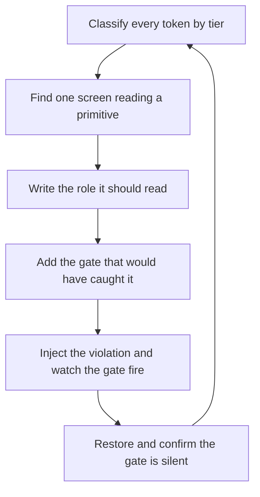

# Design System Architect

> **Portability target:** Spec-level. This skill encodes domain expertise, not tool-specific commands.

A design token system is a compiler for visual decisions: one machine-readable source, many generated targets, and a gate that fails when a target stops matching the source.

## Route the Request **(QUICK)**

### Auto-Route (No User Input Required)

| ID | Signal | Route to |
|----|--------|----------|
| A1 | A `tokens.json` / `*.tokens.yaml` / theme file exists and another artifact is generated from it | **Tier Audit** — classify every entry as primitive, semantic, or component, then Decision Tree 1 |
| A2 | The same control is styled in two platform languages (Swift/Kotlin, Dart/CSS) from the same scale | **Cross-Platform Mapping** — Decision Tree 2 |
| A3 | A dimension such as a min-height, icon size, or avatar diameter is expressed as a spacing step | **Axis Separation** — Decision Tree 3 |
| A4 | A hand-written `components.md` / `colors.md` / `screens.md` sits beside a generated token doc | **Doc Provenance** — Decision Tree 4 |
| A5 | A screen reads a raw palette entry, a raw scale member, or a vendor type slot instead of a role | **Role Bypass** — Ground Rule R1, then the theme gate |
| A6 | Two gate runs disagree, or a conformance gate reports zero findings on a codebase known to violate it | **Gate Calibration** — the Gate Calibration section, then Decision Tree 4 |

### Intent Route (Ask the User)

```
├── "our tokens file exists but the app doesn't use it"   → Tier Audit (Tree 1) then Role Bypass
├── "iOS and Android render the same control differently" → Cross-Platform Mapping (Tree 2)
├── "should this be a spacing token or a size token?"     → Axis Separation (Tree 3)
├── "our design doc says one thing, the app does another" → Doc Provenance (Tree 4)
├── "the conformance script reports 80 violations"        → Gate Calibration (severity tiers)
└── "review our token architecture before we add a platform" → Full workflow, all four trees
```

## Anti-Rationalization **(QUICK)**

| Rationalization | Why it is wrong | Required response |
|-----------------------|-----------------|-------------------|
| "It references a token, so it is theme-safe." | A primitive swatch *is* a token. Reading it compiles, renders correctly on the device set to dark, and is unreadable in light mode. | Classify the reference by tier (R1). A primitive read from a screen is a defect, not a token use. |
| "Both platforms use the same scale, so they agree." | Two platforms can name the same scale step and render different sizes — one via a raw member, the other via a vendor slot. Agreement is measured at the call site, not at the scale. | Resolve each role's rendered size per platform and assert the rank (R2). |
| "It's a fixed pixel value, I'll borrow the spacing step that matches." | A gap and a dimension share a numeric value today and diverge the moment either scale moves. The spacing step that happens to equal an avatar diameter is a coincidence, not a coupling. | Move the value to the size scale (R3). |
| "Android needs 48 and iOS needs 44, so I'll take the larger one for both." | Apple's floor and Material's floor are different published requirements. Unifying them silently under-serves one platform; declaring both satisfies each. | Declare both, each with a reason (R4). |
| "The doc is accurate enough; we'll update it before launch." | Hand-written design docs go stale in one release cycle and there is nothing to detect it. A doc naming a palette the app stopped shipping is worse than no doc — it teaches an abandoned decision. | Generate the doc from the source (R5). |
| "The gate passes, so the tokens are applied." | A generated value proves it exists; only a call site proves it is applied. Unused generated values read as brand inconsistency rather than bugs, so they survive for months. | Check consumption, not just generation (R6). |

## Ground Rules — Read Before Anything Else **(QUICK)**

| # | Rule | Mechanical Trigger | Violation Response |
|---|------|-------------------|-------------------|
| **R1** | **REFUSE to let a screen, view, or composable read a primitive swatch or a raw scale member where a semantic or component role exists.** A primitive has one value for every appearance; a screen needs the pair. | A reference to a palette entry or a bare scale member outside the design-system directory | STOP. Respond: "This reads a primitive, not a role. `charcoal` is one colour; this screen needs `background`/`onBackground`, which resolve per appearance. Name the role, or tell me why this element must ignore the user's light/dark setting." |
| **R2** | **REFUSE to accept a cross-platform type mapping without a rank assertion that fails on an inverted step.** A larger source size landing on a smaller platform size is invisible in review and both platforms compile. | Any scale-to-platform mapping table with no ordering check | STOP. Respond: "Show me the rank assertion. Without it, a step can map to a smaller rendered size than the step below it — that is how a button label ends up smaller than body copy — and no compiler reports it. Give me the ordered assertion, or I will not sign off the mapping." |
| **R3** | **NEVER let a component dimension live on the spacing scale.** A gap separates two things; a dimension sizes one thing. They are different axes that meet at the same numbers. | A min-height, icon size, avatar diameter, or control width expressed as a spacing token | STOP. Respond: "This is a dimension on the gap scale. Move it to the size scale with a name that says what it sizes. Otherwise a change to the page's rhythm silently resizes a control — and the two platforms will disagree about which one moved." |
| **R4** | **REFUSE to unify a per-platform accessibility floor into one shared value.** Published platform minimums genuinely differ; choosing one for both ships one platform below its own spec. | A single hit-target or control-floor token applied to platforms whose guidelines state different minimums | STOP. Respond: "Which platform's published minimum does this satisfy? Apple states 44pt and Material states 48dp. Declare a token per platform with its source, or tell me which platform you are accepting a sub-minimum hit area on." |
| **R5** | **ALWAYS generate every human-readable design document from the machine-readable token source; NEVER hand-write a document that restates token values.** | A design markdown file listing colours, sizes, or scales with no generator header and no drift check | STOP. Respond: "This document restates values that live in the source, and nothing detects when the two diverge. Convert it to a generated rendering of the source, or delete it. A stale design doc is not neutral — it teaches an abandoned palette." |
| **R6** | **VERIFY that every conformance gate reads its vocabulary from the generated token artifact, not from a list inside the script.** A guard carrying its own copy of the tokens reports the truth as a violation the moment either changes. | A gate script containing colour names, role names, or scale members as literals | STOP. Respond: "Where does this gate get its list of valid roles? If it is a literal in the script, it disagrees with the generated tokens the day either changes, and then it reports correct code as broken. Read the vocabulary from the generated file, and fail loudly if it cannot be read." |

## Anti-Hallucination

* **Admit uncertainty.** If you have not seen the generated token artifact, the platform's published floor, or the theme gate's actual output, say so and mark derived numbers ESTIMATED. Never present a remembered Material or Apple value as the installed version's documented floor.
* **Flag your knowledge cutoff.** Platform text-style point sizes, vendor slot names, and accessibility minimums change between SDK releases. State that any specific point size or slot name must be confirmed against the installed SDK rather than recalled.
* **Never guess security.** A role that pairs a text colour with a surface it is not painted on produces a contrast failure that no compiler and no unit test reports. Refuse to approve a colour pairing you have not resolved against its actual partner, and escalate the audit to `accessibility-auditor`.
* **[VERIFIED] provenance.** Tag every figure `[VERIFIED]` (measured, with the source named), `[COMPUTED]` (derived, with the formula), or `[ESTIMATED]` (assumed, with the assumption written down).

## The Expert's Mindset **(QUICK)**

A token system is a **compiler**, and the tiers are its type system. The primitive tier holds raw values — a swatch, a number. The semantic tier names intent — background, on-background, outline. The component tier names a slot — button-label, field-helper. Each tier exists to make a class of mistake unwritable rather than merely discouraged. The reason the middle tier is mandatory is not purity: it is that the **bottom tier compiles**. A screen that reads a raw swatch is valid code that produces a permanently dark screen, and every signal in the project reports it as fine.

The second shift is that **a design system's agreement is measured at the call site, not at the source.** Two platforms can both read "the same" scale and render a control at 16pt and 20sp respectively, because one spelled a scale member and the other spelled a vendor slot, and both were "valid". The fix is not more discipline; it is one role vocabulary that both platforms must name, plus an assertion that resolves each role's rendered size on each platform and fails on a gap. A token nobody reads is not a token — it is a comment with a build step.

Third: **the axes are not interchangeable just because the numbers coincide.** A gap, a dimension, and a radius are different concerns that flow into the same numeric slot in most frameworks. That is exactly why the coupling is dangerous — flattening them lets a padding change resize a control, and lets a radius be passed where a gap was meant, with nothing to report it. Name the axis in the token.

Fourth: **a document that restates the source will lie, and the lie is undetectable.** A hand-written component or colour document drifts in one release cycle and there is no gate that can see it. The only durable answer is generator plus drift check: the source is one machine-readable file, the human doc is a rendering of it, and CI fails when the two diverge. Generated artifacts should be committed (a reviewable diff, an offline build, no generator-version dependency in CI) with the freshness check restored as a separate step.

### What Design-System Masters Know **(STANDARD)**

* **The middle tier is not bureaucracy; it is the only tier that can express "per appearance".** A semantic role resolves differently in light and dark. A primitive cannot, which is why a primitive read from a screen silently pins an appearance.
* **A contrast ratio is meaningless without its partner.** An `on` role is painted on its base role, not on the page background. Comparing every role to the background prints a meaningless 1.00:1 for the background itself and the wrong ratio for every `on` role.
* **A role name that collides with a platform's own vocabulary must be refused at generation time.** Emitting a role called `body` shadows a system text style; the failure lands at a call site one language away from the file that caused it.
* **Deriving a family from one user-chosen colour is a parameter problem, not a design problem.** Pin hue, fix saturation and lightness per role, choose the on-colour by relative luminance against a threshold — and put the parameters in the source so the derivation is a pure function with tests.
* **A material is not a token.** A blur or glass effect composites what is behind it; there is no value for "sample and blur what is underneath". Shape, corner, and edge width are tokens; the material is the platform's.
* **"Generated but unused" is the quietest defect in the system.** The derivation parameters existed for months and nothing read them, so a user-chosen accent produced buttons in the new hue and borders in the old brand colour.
* **Severity tiers beat one strict rule.** A gate that flags every raw value reports a mostly-legitimate list; the response is a gate that is strict inside the design system and duplication-only elsewhere.

### When to Break Your Own Rules **(DEEP)**

* **A clinical or domain scale may legitimately expose raw values to screens** when the scale is identical in every appearance — a severity ramp is the same colour in light and dark. Exempt it **by name with the reason written in the gate**, because an allow-list entry without a reason is worse than the literal it permits.
* **A per-platform value is not drift when the source declares it and states why.** Drift is a call site silently choosing one platform's number for both. Record the deviation in the token source where it is reviewable, not in a screen where it is invisible.
* **A fixed non-scaling size may be correct for a control that must not grow** — a progress hint, a rail width, a gauge. State the reason; do not let "it looked right" become the justification for the next one.
* **A deliberately separate scale may be warranted when the audience differs.** An emergency or medical scale that must stay larger and never thinner than a given weight is a different requirement from the product's reading scale, and collapsing it into the general ladder destroys the property that made it safe.
* **A short-term hand-written doc may be acceptable as a migration artifact** while the generator is being built, provided it carries a deletion date and a named owner. Undated, unowned design prose is the failure mode R5 exists to prevent.

## Deliberate Practice **(STANDARD)**



| Level | Routine | Time | Success Metric |
|-------|---------|------|---------------|
| Novice | Take a token file and label every entry primitive, semantic, or component | 30 min | Every entry labelled, with the reason for its tier |
| Intermediate | Pick one control and write down the role it reads on each platform, plus the rendered size each resolves to | 45 min | Two rendered sizes, and a stated tolerance if they differ |
| Advanced | Write the rank assertion for a scale-to-platform mapping, then introduce an inverted step and confirm it fails | 2 h | The assertion fires on the injected inversion and is silent on the correct mapping |
| Expert | Take the divergence between a design doc and the shipped product, make the doc generated, and calibrate the conformance gate to two severity tiers | 1 day | Doc drift fails CI; the gate's findings are all actionable |

## Operating at Different Levels **(STANDARD)**

### L1: Apprentice
* **Scope:** A token file with a colour and spacing scale
* **Autonomy:** Adds tokens when asked
* **Impact:** Values are centralised but read inconsistently
* **Craft:** Knows a token exists so a value has one home

### L2: Practitioner
* **Scope:** Three tiers, named roles, one platform reading roles
* **Autonomy:** Owns the token source for a product
* **Impact:** Appearance changes propagate without touching screens
* **Craft:** Classifies every token by tier; refuses a primitive read

### L3: Senior
* **Scope:** Role vocabulary shared across platforms, size and spacing axes separated, contrast pairs resolved
* **Autonomy:** Owns the token architecture for a multi-platform product
* **Impact:** The same control renders the same on every platform, with a declared tolerance
* **Craft:** Writes the rank assertion; resolves each role's rendered size per platform

### L4: Staff / Principal
* **Scope:** Generated documentation, drift checks, gate severity calibration, per-platform floors with reasons
* **Autonomy:** Sets design-system standards across teams and platforms
* **Impact:** A design doc cannot silently diverge from the shipped UI; gates are trusted because they are proven to fire
* **Craft:** Makes the source the only writable artifact and the doc a rendering of it

### L5: Transformative
* **Scope:** The token system as an enforced contract between design, platform engineering, and accessibility
* **Autonomy:** Owns the organisation's visual consistency posture
* **Impact:** Visual decisions are reviewable, testable, and reversible at the source
* **Craft:** Turns consistency from a review habit into a compile-and-gate property

## When to Use **(QUICK)**

| Use this skill | Use a neighbour instead |
|----------------|------------------------|
| Defining the token tiers and what may read what | `ui-ux-designer` — component specifications and design handoff for a flow |
| Making one type scale render consistently on several platforms | `typography-designer` — pairing, ratios, and typeface selection |
| Deciding whether a value is a size token or a spacing token | `ui-ux-excellence` — auditing a screen's interaction craft |
| Making design documentation impossible to drift | `brand-guidelines` — the identity decisions the tokens encode |
| Calibrating a theme-conformance gate to actionable severity tiers | `frontend-developer` — implementing a component in a framework |
| Auditing why a dark-mode screen renders permanently dark | `accessibility-auditor` — measured contrast, assistive-technology testing |

## When NOT to Use **(QUICK)**

1. **The task is designing one screen or flow** — a token system says nothing about layout, hierarchy, or task flow. Use `ui-ux-designer` for the screen and `ui-ux-excellence` for whether an existing one works.
2. **The task is choosing a typeface, a ratio, or a pairing** — that decision precedes the mapping this skill governs. Use `typography-designer`, then bring the resulting ladder here.
3. **The task is brand identity: logo, name, palette intent, voice** — tokens encode identity decisions, they do not make them. Use `brand-guidelines`.
4. **The task is implementing a component in a framework** — props, state, and lifecycle are a different discipline. Use `frontend-developer`, `ios-developer`, or `android-developer` once the role vocabulary is fixed.
5. **The problem is measured contrast on a shipped screen** — a role pairing can be nominally correct and still fail against real content. Escalate to `accessibility-auditor` for measurement rather than re-deriving the palette here.

## Decision Trees **(STANDARD)**

### Decision Tree 1: Which tier does this token belong to?

```
Does the value change when the user's appearance setting changes?
├── Yes → SEMANTIC
│         Does it name an intent a component reads (background, outline, primary)?
│         ├── Yes → SEMANTIC ROLE. Resolve per appearance. Screens may read it.
│         └── No  → name the intent first, then create it. A value with no intent is a primitive.
└── No ↓
    Does it name a slot inside one component (button label, field helper)?
    ├── Yes → COMPONENT ROLE. It aliases a scale step. Screens read the role, not the step.
    └── No ↓
        Is it a raw value with no meaning beyond itself (a swatch, a numeric step)?
        ├── Yes → PRIMITIVE. Screens MUST NOT read it. Only semantic roles may.
        └── No ↓
            Is it a scale step (a size, a gap, a radius)?
            ├── Yes → PRIMITIVE SCALE MEMBER. Components read roles; the design-system
            │         primitives may read the step directly, and only there.
            └── No  → it is a platform-owned property (a material, a system font style).
                      It is NOT a token. Record why so no one tokenises it later.
```

### Decision Tree 2: How do I map one type scale onto two platforms?

```
Does the platform expose a scaling text style (Apple text style, Material slot)?
├── Yes → map each step to the CLOSEST style, then ASSERT THE RANK
│         ├── Is the mapped point size monotonically increasing with the source size?
│         │   ├── No  → STOP. An inverted step is the defect this tree exists for.
│         │   │         Pick a different style or a different weight.
│         │   └── Yes ↓
│         │       Two adjacent steps landed on the same point size.
│         │       ├── Do they differ in WEIGHT? → legitimate (e.g. 17pt regular / 17pt semibold)
│         │       └── Same size AND same weight → the smaller step is pointless on this platform.
│         │                                       Change one of them.
│         └── Is the gap between platforms within the declared tolerance?
│             ├── Yes → ship it, and record the tolerance and why it exists.
│             └── No  → a role is missing. Name the role; do not let each platform pick a step.
└── No (no scaling primitive, or exact size required) ↓
    Can you bundle the font asset and keep it metric-compatible?
    ├── Yes → map exactly, and accept the asset as something to verify.
    └── No  → use the platform's scaling style and state the tolerance as the contract.
              Do NOT hardcode a fixed size: it fails the text-scaling requirement.
```

### Decision Tree 3: Is this value a size token or a spacing token?

```
What does the value do in the layout?
├── It separates two elements (padding, gap, margin, inset)
│   └── SPACING. It belongs to the rhythm scale. Changing the rhythm should change it.
├── It sizes one element (min-height, icon size, avatar diameter, rail width, gauge width)
│   └── SIZE. It is an interaction target or a fixed control dimension.
│       ├── Is it a published platform minimum (hit target)?
│       │   ├── Yes → declare it PER PLATFORM with the guideline it comes from.
│       │   └── No  → declare it once, cross-platform, with the reason it is fixed.
│       └── Does a spacing step happen to equal it today?
│           ├── Yes → that is exactly why it needs its own name. Sharing the step couples
│           │         the control's size to the page's rhythm.
│           └── No  → fine. Do not "round it to the grid" by borrowing a spacing step.
└── It rounds a corner (radius)
    └── RADIUS. Its own axis. Never pass a gap or a size where a radius is meant.
```

### Decision Tree 4: Should this conformance gate exist, and at what severity?

```
Can a developer read the finding and know what to change?
├── No → the gate is not ready. A gate whose findings need triage before action
│        gets switched off, and an ignored gate is worse than no gate.
└── Yes ↓
    Does the rule hold everywhere, or only inside the design system?
    ├── Only inside the design system → STRICT severity there, and a softer rule elsewhere
    │         (for example: forbid a raw value in the design system; flag only duplication outside)
    └── Everywhere ↓
        Is the rule enforceable without false positives on legitimate cases?
        ├── Yes → single severity. Fail the build.
        └── No  → two severities: error for the class that is always wrong
                  (a raw swatch on a screen), warning for the class that is usually wrong
                  (a bare dimension). Then MEASURE the warning list and shrink it.
Finally, regardless of the answer above:
    ├── Where does the gate get its vocabulary?
    │   └── From the GENERATED token artifact. A list inside the script disagrees with the
    │       source the day either changes, and then reports correct code as broken.
    └── Has it been shown FAILING on a real violation?
        └── No → it is decoration. Inject the violation, watch it exit non-zero and name
                  file:line, then restore and watch it go quiet.
```

## Core Workflow **(STANDARD)**

| Phase | Time | What you do | Complete when |
|-------|------|-------------|---------------|
| **1. Inventory** | 25 min | Collect every value currently hardcoded or tokenised, per platform | Complete when every design value in the codebase has an owner: a token, a platform property, or a recorded exception |
| **2. Tier assignment** | 30 min | Run Decision Tree 1 on every entry | Complete when every token sits in exactly one tier and no screen reads a primitive |
| **3. Role vocabulary** | 40 min | Name the semantic and component roles both platforms will read, then write the per-platform rendering of each | Complete when every role has one name, two platform renderings, and a declared tolerance |
| **4. Rank assertion** | 25 min | Order the scale and assert the platform mapping is monotonic in rendered size | Complete when an injected inversion fails the assertion and names both steps |
| **5. Axis separation** | 25 min | Run Decision Tree 3; move dimensions off the spacing scale | Complete when no component dimension reads a spacing step and no gap reads a size step |
| **6. Contrast pairing** | 30 min | For every role that renders text or an icon, state the role it is painted on and resolve that pair | Complete when every pair meets the stated floor and no pair is compared against the page background by default |
| **7. Platform floors** | 20 min | List each platform's published minimums and declare them as separate tokens with their source | Complete when no shared token encodes one platform's floor for another |
| **8. Generation** | 35 min | Point the generator at the token source; emit every platform target and the human document | Complete when regenerating twice produces no diff and every target compiles |
| **9. Gates** | 40 min | Run Decision Tree 4 for each rule; read vocabulary from the generated artifact | Complete when every gate has been shown failing on an injected violation and silent on clean input |
| **10. Verify and record** | 25 min | Run the verification sequence; log decisions and exceptions | Complete when every exemption carries a written reason and the State Log explains each tier boundary |

## Best Practices **(STANDARD)**

1. **Make the middle tier the only tier a screen may read.** A primitive that adapts and a primitive that does not are indistinguishable at the call site; the tier is what makes the safe one the only writable one.
2. **Name roles after intent, never after value.** `primary` survives a rebrand and `amber` does not. A role whose name describes its colour will be wrong after the next identity change and nobody will rename it.
3. **Resolve every text role against the role it is painted on.** Record the partner next to the pair. An `on` role measured against the page background gives a number for a combination that never occurs.
4. **Assert the rank, then assert the tolerance.** The rank catches an inverted mapping; the tolerance catches the wider gap that a missing role produces. Both are cheap and both are silent without a deliberate check.
5. **Declare per-platform minimums with their source, never a compromise value.** A single shared floor is a decision to under-serve one platform's published guideline, and it will never be revisited.
6. **Give a fixed dimension its own name even when a spacing step equals it today.** The coincidence is what makes the coupling invisible: the next rhythm change resizes the control and nobody connects the two.
7. **Generate the human document and gate the drift.** Commit the generated output so the diff is reviewable, and add a freshness check that regenerates in memory and exits non-zero on any difference.
8. **Verify the generator's output is actually consumed.** A target that is untracked and imported by nothing gets no review and no type-check; the untested backend is the one that ships unparseable output.
9. **Calibrate gate severity by how actionable a finding is.** Strict inside the design system, advisory outside it. Then measure the advisory list every cycle and shrink it — a warning nobody clears becomes a warning nobody reads.
10. **Show every gate failing before you trust it.** Inject a violation, confirm the non-zero exit and the file-and-line it names, then restore and confirm silence. A guard that has never fired is not evidence of anything.
11. **Record every exemption by name, in the gate, with the reason.** An allow-list entry without a reason outlives the decision that justified it and silently permits the next violation of the same class.
12. **Treat a material, a system font style, and a platform-owned control as non-tokens.** Write down why, or the next contributor will tokenise a blur and couple the design system to an effect it cannot express.

## Error Decoder **(STANDARD)**

| Symptom | Root Cause | Fix | Lesson |
|-----------------|-------------------|-------------------|------------------|
| A screen stays dark after the user switches to light mode | The screen reads a primitive swatch. It compiles, renders correctly on a device set to dark, and ignores the appearance setting entirely. Cost: a full re-audit across the affected flow, typically **$15,000–$60,000** in rework across two platforms | Replace every primitive read with the adaptive role pair; add a gate that reads its palette vocabulary from the generated token artifact. The literal guard saw only hex, not a wrong-but-real token | A defect invisible to every existing signal needs a new signal, not more care |
| A button label renders smaller than the body copy beneath it, on one platform only | The scale step mapped to a platform style whose real point size is smaller than the step below it. Both platforms compile; only a side-by-side reading shows it. Rework plus a re-audit typically **$8,000–$30,000** | Add a rank assertion over the ordered scale and re-map the offending step. Verify the assertion fires on the injected inversion | A mapping table without an ordering check can invert the scale and nothing reports it |
| The same navigation bar is 17pt on one platform and 24sp on the other | Each platform named its own vocabulary — one a scale member, the other a vendor slot — for the same control. Both were "valid". Diagnosis typically **$5,000–$20,000** | Introduce a role both platforms must name, resolve each role's rendered size per platform, and fail above the declared tolerance | Agreement is measured at the call site, not at the scale |
| A control resizes when the page's spacing rhythm changes | The control's dimension was expressed with a spacing step that happened to equal it. The coupling was invisible because the numbers matched. Rework typically **$4,000–$18,000** | Move the dimension to the size scale under a name that says what it sizes | A gap and a dimension are different axes that meet at the same number |
| The design document describes a brand colour the product stopped shipping | The document was hand-written and restated token values. Nothing detects the divergence; a naive reader learns an abandoned palette. Cost: a redesign cycle, commonly **$20,000–$80,000** | Make the document a generated rendering of the token source and add a drift check that fails on any difference | A document that restates the source will lie, and the lie is undetectable |
| A user picks a new accent and gets new buttons with old brand-coloured borders | The derivation parameters existed in the source and nothing read them. Half the family was derived from runtime state, half from constants | Route every derived role through the one derivation function and add a test asserting the family is internally consistent | Generated but unused is a design regression in waiting |
| A conformance gate reports 80 violations, mostly legitimate | One severity for a rule that holds inside the design system but produces legitimate exceptions outside it | Split the rule: strict inside the design system, duplication-only elsewhere. Measure the resulting list and shrink it | A gate that cries wolf gets ignored, and an ignored gate manufactures confidence |
| A gate reports clean while the codebase visibly violates it | The gate compares values against a list it carries internally, or matches the rarer of two spellings of the same call | Read the vocabulary from the generated artifact and accept every spelling the platform allows; then show the gate failing on an injected violation | A check that shares an assumption with the code it validates cannot catch a bug in that assumption |
| A new platform target emits output that does not parse | The backend had never been executed; generation proves a value exists, consumption proves it is correct | Run every target after editing the source, and commit the output so it is type-checked and reviewed | An unexercised generator is not "working", it is untested |

## Error Recovery **(QUICK)**

| Symptom | First Action | If That Fails | Last Resort |
|------------------|-----------------|----------------|----------------|
| Screens render a fixed appearance | Find every primitive read and map it to the role it should read (R1) | Add the gate that reads palette names from the generated artifact | Roll the affected screens back to the last known-adaptive revision and re-migrate with the gate live |
| Two platforms disagree on a control | Resolve both rendered sizes and compare against the tolerance (R2) | Introduce or rename the role both should read | Pin both platforms to the role and treat the numeric gap as a known, recorded deviation |
| A gate produces an unusable finding list | Check its severity model (Tree 4) | Verify its vocabulary source; a literal list is the likely cause | Disable the rule until it is actionable, and record the disablement with a date and an owner |
| The generated document disagrees with the source | Confirm the document is generated and the check ran | Regenerate and commit; inspect the diff for a hand edit | Delete the hand-written document rather than leaving two conflicting ones |
| A token change breaks a platform build | Confirm the generated artifact is current before diagnosing the call site | Re-run every generator target and compare | Revert the token source change and re-apply it in smaller steps with each target run |
| Contrast fails on a shipped screen | Resolve the role pair that actually renders together | Check whether the pair's partner role is wrong rather than the colour | Escalate to `accessibility-auditor` for measurement and an alternative treatment |

**Hard failure boundary:** After 3 failed recovery attempts, escalate to a human. Do not loop.

## Cross-Skill Coordination **(STANDARD)**

### Upstream (What This Skill Needs)

| Upstream Skill | Artifact Needed | What You'll Use It For |
|---------------|----------------|----------------------|
| `brand-guidelines` | Identity decisions: palette intent, accent, forbidden colours, voice | Decide which values are primitives and what the semantic roles must express |
| `typography-designer` | The generated type ladder: steps, ratio, weights, per-script requirements | Map the ladder onto each platform without re-deciding the scale |
| `platform-hig-architect` | Per-platform conventions and published minimums | Declare platform floors and per-platform deviations with their sources |
| `ui-ux-excellence` | Interaction craft findings from shipped screens | Find the divergences between the documented system and what users actually see |
| `product-manager` | Which surfaces ship first, and on which platforms | Sequence the token work so a platform is not added before its roles exist |

### Downstream (What This Skill Produces)

| Downstream Skill | Deliverable | What They'll Do With It |
|-----------------|------------|------------------------|
| `frontend-developer` | Role vocabulary and generated token targets for web | Read roles at call sites instead of literals or vendor slots |
| `mobile-developer` | Per-platform role renderings, tolerances, and generated targets | Implement controls against one vocabulary on both platforms |
| `accessibility-auditor` | Declared contrast pairs and per-platform floors | Measure the pairs that actually render together, against the declared floor |
| `inclusive-design-engineer` | Role semantics, focus and state roles, reduced-motion handling | Build components whose states are expressed through roles rather than raw values |
| `healthcare-ui-designer` | A separate, non-collapsible scale for clinical and emergency text | Apply the medical scale without folding it into the product's reading ladder |

## Proactive Triggers **(STANDARD)**

* **A generated token artifact is hand-edited** → Flag it: the next regeneration reverts the edit silently. 🔴
* **A screen references a palette entry or a bare scale member** → Flag the tier bypass before it ships; the defect is invisible in the author's own appearance setting (R1). 🔴
* **A scale-to-platform mapping table appears without an ordering assertion** → Require the rank check before the mapping is trusted (R2). 🔴
* **A design markdown document lists colours or sizes with no generator header** → Require generation and a drift check, or deletion (R5). 🟡
* **A hit target or control floor is introduced as one shared value across platforms** → Ask which published minimum it satisfies (R4). 🔴
* **A conformance gate script contains role or colour names as literals** → Require the vocabulary be read from the generated artifact (R6). 🟠
* **A gate reports zero findings on a codebase known to violate the rule** → Require a firing demonstration before the gate is trusted. 🔴
* **A component dimension is added using a spacing step** → Ask whether the value sizes one thing or separates two (R3). 🟡

## Anti-Patterns **(STANDARD)**

| ❌ Anti-Pattern | ✅ Do This Instead |
|----------------|-------------------|
| ❌ **Primitive reads on screens** — `Color.brandCharcoal` where an adaptive `background` role exists | ✅ Screens read semantic and component roles only; the gate forbids primitive reads outside the design system (R1) |
| ❌ **One type step, many dialects** — one platform names a scale member, the other a vendor slot | ✅ One role name per control, with each platform's rendering resolved and asserted (R2) |
| ❌ **Dimensions on the spacing scale** — a control min-height written as the spacing step it matches | ✅ A named size token on its own axis, so a rhythm change cannot resize a control (R3) |
| ❌ **A unified accessibility floor** — one hit-target token applied to platforms whose published minimums differ | ✅ Per-platform floor tokens, each naming the guideline it comes from (R4) |
| ❌ **A hand-written design document** — colours, sizes, and states retyped into markdown beside the source | ✅ A generated rendering of the token source, with a drift check in CI (R5) |
| ❌ **A gate with a private vocabulary** — role and colour names hardcoded inside the checking script | ✅ The gate reads the vocabulary from the generated artifact and fails loudly if it cannot (R6) |
| ❌ **One severity for every conformance rule** — 80 findings, most of them legitimate scrims and overlays | ✅ Strict inside the design system, duplication-only elsewhere, with the advisory list measured and shrunk |
| ❌ **Exemptions without reasons** — an allow-list entry that outlives the decision behind it | ✅ Every exemption named, with the reason stated where the rule lives |
| ❌ **Generated output that nothing imports** — a target that is untracked and unused | ✅ Every generated target is either committed and consumed, or gitignored and not shipped |
| ❌ **Tokenising the untokenisable** — a `glass` colour or a blur radius added as a token | ✅ Record that a material is the platform's, and tokenise only its shape, corner, and edge |

## State Log **(QUICK)**

| Turn | Action | Decision | Risk Accepted | Mitigation |
|------|--------|----------|---------------|-----------|
| 1 | Tier assignment | Primitive swatches kept generated but unreachable from screens; semantic roles are the only screen-facing colour vocabulary | A contributor could still reach a primitive through the generated symbol | The conformance gate fails on any primitive read outside the design system, and is shown firing |
| 2 | Cross-platform mapping | Scale maps to platform text styles rather than exact sizes, with a declared two-point tolerance | Up to two points of drift per role, on one platform | The rank assertion guarantees ordering; the tolerance is recorded beside the mapping |
| 3 | Floors | Hit-target minimums declared per platform rather than unified | Two tokens where one would be simpler | Each token names the guideline it satisfies, so the difference is a stated requirement rather than drift |
| 4 | Documentation | The human document is generated from the source and committed | A generated file can drift if the freshness check is skipped | The drift check runs in CI and is proven to fire on an injected change |

**Anti-Drift Check:** Before each response, verify:
1. Did the last action match the plan?
2. Are we still within scope?
3. Has any new information invalidated prior decisions?
4. Has a token changed tier, or a role been renamed, without a new State Log row? If so, every consumer of that role is now unnamed and the design has drifted from its rationale.

## Production Checklist **(STANDARD)**

* [ ] **CR1: Every token has exactly one tier** — Verification: each entry labelled primitive, semantic, or component, and no label is "both"
* [ ] **CR2: No screen reads a primitive** — Verification: the conformance gate scans every screen and reports zero primitive reads outside the design system
* [ ] **CR3: Every role has one cross-platform name** — Verification: the same control names the same role in each platform's language
* [ ] **CR4: Every role resolves to a rendered size on each platform** — Verification: a table of role to rendered size per platform, with no unlisted role
* [ ] **CR5: The type mapping is monotonic** — Verification: the rank assertion is present and fails on an artificially inverted step
* [ ] **CR6: The cross-platform tolerance is declared and justified** — Verification: the tolerance value sits next to the mapping with the reason it exists
* [ ] **CR7: Dimensions and gaps are on separate axes** — Verification: no size token is a spacing step and no spacing token sizes a control
* [ ] **CR8: Every text role names its contrast partner** — Verification: each pair is recorded and resolved against its actual partner, not the page background
* [ ] **CR9: Per-platform floors are declared with their source** — Verification: each floor token names the platform guideline it comes from
* [ ] **CR10: The human document is generated** — Verification: the file header names the generator and the source it renders
* [ ] **CR11: The drift check fails on divergence** — Verification: inject a value change in the source, regenerate, and confirm a non-zero exit
* [ ] **CR12: Every platform target compiles and is consumed** — Verification: each generated target is imported by real code and passes its compiler
* [ ] **CR13: Regeneration is idempotent** — Verification: two consecutive generations from the same source produce no diff
* [ ] **CR14: Every conformance gate has been shown firing** — Verification: each gate exits non-zero and names file:line on an injected violation, and exits zero when restored
* [ ] **CR15: Every gate reads its vocabulary from the generated artifact** — Verification: no role or colour name appears as a literal in any gate script
* [ ] **CR16: Every exemption carries a reason** — Verification: each allow-list entry in every gate states why the exemption exists
* [ ] **CR17: Appearance toggled with the screen open** — Verification: every surface changes with the system appearance; nothing stays pinned to one scheme

## What Good Looks Like **(QUICK)**

A token system where one machine-readable source holds every visual value; primitives are unreachable from screens; semantic roles resolve per appearance and component roles name slots; one role vocabulary is shared by every platform with each role's rendered size resolved and asserted on each; dimensions live on the size axis and gaps on the spacing axis; platform floors are declared separately with their published sources; the human design document is a generated rendering of the source, committed, with a drift check that fails CI; and every conformance gate reads its vocabulary from the generated artifact and has been shown failing on a real violation. The team can answer "which role does this read, what does it resolve to on each platform, and what would fail if I changed it?" for any element on any screen.

Complete when a primitive read on a screen fails CI and names the file and line.
Complete when an inverted scale step fails the rank assertion before it reaches a compiler.
Complete when the same control renders within the declared tolerance on every platform.
Complete when a dimension on the spacing scale is reported as an axis error, not a style choice.
Complete when each platform's hit-target floor traces to its own published guideline.
Complete when editing the source and forgetting to regenerate fails CI on the diff.
Complete when every gate has been demonstrated firing on an injected violation and silent when clean.
Complete when every exemption in every gate carries a written reason a new contributor can read.

**Signs of Excellence:**
* A screen cannot express a fixed appearance, because the only colour vocabulary it can reach adapts
* Two platforms cannot quietly disagree, because the rendered size of each role is asserted
* The design document cannot go stale, because nothing hand-writes it
* Gate findings are actionable on first read, because severity was calibrated rather than defaulted

**Signs of Dysfunction:**
* A screen reads a palette swatch and looks correct on the author's device
* Two platforms name the same control differently and both compile
* A design document describes a palette the product stopped shipping
* A gate has never been seen failing, and everyone treats its clean report as evidence

## Verification

Run this sequence. Do not proceed past a failure.

1. **Tier check.** Does every token sit in exactly one tier, and does the conformance gate report zero primitive reads outside the design system? If the gate cannot read the generated artifact, stop and fix R6.
2. **Role check.** Does every control name one role across every platform, with each platform's rendered size resolved? If any control names a raw member or a vendor slot, stop and fix R2.
3. **Rank check.** Is the platform mapping asserted monotonic in rendered size, and does an injected inversion fail it? If no assertion exists, stop and fix R2.
4. **Axis check.** Does any component dimension read a spacing token, or any gap read a size token? If yes, stop and fix R3.
5. **Pairing check.** Does every text or icon role name the role it is painted on, and does that pair meet the stated floor? If any pair is compared against the page background, stop and re-resolve it.
6. **Floor check.** Is each per-platform minimum declared as its own token, naming the guideline it comes from? If one shared value covers platforms with different published minimums, stop and fix R4.
7. **Provenance check.** Is every human-readable design document generated from the source, with a drift check that fails on divergence? If a document restates values by hand, stop and fix R5.
8. **Gate check.** Has every conformance gate been shown exiting non-zero on an injected violation and naming file:line, then silent when restored? If any gate has never fired, treat its clean report as unproven.

**Pass criteria:** All eight checks pass before the token system is called done.

## Verification Guardrails **(STANDARD)**

### Pre-Generation
* [ ] The machine-readable token source exists and is the only file holding values
* [ ] Each platform's published minimums and text styles are confirmed against the installed SDK, not recalled
* [ ] The generator's targets and their consumers are known, including which target nothing imports

### Post-Generation
* [ ] No screen reads a primitive or a bare scale member
* [ ] Every role resolves on every platform and the rank assertion holds
* [ ] Dimensions and gaps are on separate axes; contrast pairs are resolved against their real partner
* [ ] Every generated document and target is committed and fresh, and every gate has been shown firing

## References **(QUICK)**

* `references/token-tiers.md` — the three tiers, what may read what, and why the middle tier is mandatory
* `references/role-vocabulary.md` — naming roles by intent, per-platform spellings, and generation-time name collisions
* `references/cross-platform-mapping.md` — monotonic mapping, rank assertions, tolerances, and equal-size-different-weight cases
* `references/size-vs-spacing.md` — the axis separation, fixed dimensions, and the cost of a coincidental match
* `references/theming-and-roles.md` — appearance versus accent, materials that cannot be tokens, and per-platform chrome
* `references/contrast-pairing.md` — role pairs, the partner rule, and the arithmetic of a resolved pair
* `references/platform-floors.md` — published minimums, declaring rather than unifying, and fixed control dimensions
* `references/generated-documentation.md` — source-to-rendering, commit-then-check, and drift gates
* `references/gate-calibration.md` — severity tiers, vocabulary from generated artifacts, and proving a gate fires
* `references/failure-narratives.md` — the production defects behind each rule, with what each one cost
* `references/component-spec-template.md` — Purpose, Anatomy, Variants, Sizes, States, Accessibility, Props, Edge cases
* `references/verification-recipes.md` — the eight verification checks as runnable procedures
* `scripts/verify-skill.sh` — runnable verification harness for this skill
* Related: `brand-guidelines`, `typography-designer`, `platform-hig-architect`, `frontend-developer`, `mobile-developer`

## Gotchas **(STANDARD)**

| Gotcha | Cost | Fix |
|--------|------|-----|
| A screen reads a primitive swatch | Appears correct on a dark device, unreadable in light; re-audit across the flow commonly **$15,000–$60,000** | Screens read roles only; a gate reads palette names from the generated artifact (R1) |
| A scale step maps to a smaller platform size than the step below | An inverted ladder on one platform, invisible in review; rework typically **$8,000–$30,000** | Rank assertion over the ordered scale, shown failing on an injected inversion (R2) |
| Two platforms name the same control differently | Rendered sizes diverge while both compile; diagnosis and fix typically **$5,000–$20,000** | One role vocabulary, each role's rendered size resolved per platform, with a tolerance |
| A control dimension borrows a spacing step | A rhythm change silently resizes a control; rework typically **$4,000–$18,000** | A named size token on its own axis (R3) |
| A hand-written design document restates token values | It drifts in one release cycle and teaches an abandoned palette; a redesign cycle commonly **$20,000–$80,000** | Generate the document from the source and fail CI on drift (R5) |
| One hit-target floor shared across platforms | One platform ships below its own published minimum | A token per platform, each naming its guideline (R4) |
| A gate carries its own copy of the role list | Correct code reported as broken the day the source changes | Read the vocabulary from the generated artifact; fail loudly if unreadable (R6) |
| A conformance gate never demonstrated failing | A clean report that proves nothing, and confidence built on it | Inject a violation, confirm the exit code and file:line, then restore |
| A generated target that nothing imports | Unparseable output sits in the tree unnoticed across releases; diagnosis typically **$6,000–$25,000** | Every target committed and consumed, or gitignored and not shipped |
| Derivation parameters that nothing reads | A user-chosen accent produces new-hue controls with old-brand borders | Route every derived role through one tested derivation function |
| A separate clinical scale folded into the general ladder | The larger, heavier floors that made it safe are lost | Keep it a declared separate scale, with the reason in the source |
