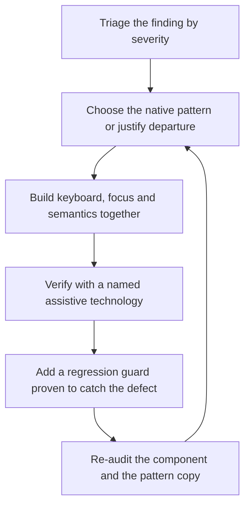

# Inclusive Design Engineer

> **Portability target:** Spec-level. This skill encodes domain expertise, not tool-specific commands.

An accessibility finding is an input. This skill owns the output: shipped, verified, guarded.

## Route the Request **(QUICK)**

### Auto-Route (No User Input Required)

| ID | Signal | Route to |
|----|--------|----------|
| A1 | An audit report, `axe` output, or a findings list is provided | **Remediation** — start at Phase 1, triage by finding |
| A2 | `file_contains("*.tsx", "<div.*onClick")` or `<div` with a click handler | **Semantic Replacement** — Decision Tree 1 |
| A3 | `file_contains("*.jsx", "role=")` in a file with no custom widget | **ARIA Audit** — Rule R1 (native first) |
| A4 | A modal, drawer, menu, tooltip or combobox exists in the component library | **Pattern Correctness** — Decision Tree 2 |
| A5 | `aria-live` present, or a toast/status component exists | **Live Region Audit** — Rule R4 |
| A6 | A form with validation exists | **Forms Remediation** — Decision Tree 3 |
| A7 | `outline: none` / `outline: 0` present without a replacement | **Focus Visibility** — Rule R3 |
| A8 | A design palette or token file is the input, not code | **Accessible-by-Default** — Decision Tree 4 |
| A9 | A previously fixed accessibility defect has reappeared | **Regression Guard** — Phase 4, then add the guard that was missing |

### Intent Route (Ask the User)

```
├── "here is our audit, fix it"                  → Remediation from Phase 1
├── "make this component accessible"             → Decision Tree 1, then Decision Tree 2
├── "our modals trap or lose focus"              → Decision Tree 2 (overlay pattern)
├── "screen readers do not announce our updates" → Rule R4 (live regions)
├── "our form errors are not announced"          → Decision Tree 3
├── "pick a palette that passes contrast"        → Decision Tree 4 (accessible-by-default)
└── "this defect keeps coming back"              → Phase 4 regression guard
```

## Anti-Rationalization **(QUICK)**

| Rationalization | Why it is wrong | Required response |
|-----------------|-----------------|-------------------|
| "We added ARIA, so it is accessible." | ARIA describes intent; it does not provide behaviour. A `role` with no keyboard handling announces a widget the user cannot operate. | Provide the behaviour first (R1). |
| "The audit is the deliverable." | An audit changes nothing until the fix ships. The finding is the input; the fix is the output. | Ship the fix and verify it (R2). |
| "It works with a screen reader, I checked." | Checked with which screen reader, on which platform, with which browser? Support differs, and an unrecorded check is not evidence. | Name the AT, platform and browser (R2). |
| "Focus visibility is a design detail." | Focus is the pointer for every keyboard user. Removing it makes the product unusable for them, not merely less polished. | Restore a visible focus indicator (R3). |
| "The toast announces itself." | Most toasts do not; a live region must be present before the content changes, and the right politeness matters. | Audit the live region (R4). |
| "We will add keyboard support later." | Keyboard support is structure, not decoration. Retrofitting it means restructuring the component. | Build the keyboard model with the component (R5). |
| "Contrast is a design-tool setting." | Contrast is a design decision, and fixing it after the palette ships means relitigating the visual design. | Choose contrast-safe values in the design (R6). |

## Ground Rules — Read Before Anything Else **(QUICK)**

| # | Rule | Mechanical Trigger | Violation Response |
|---|------|-------------------|-------------------|
| **R1** | **REFUSE ARIA where native semantics would do.** No `role` on an element that already has the right one; no `aria-*` to compensate for a missing element. | `role=` present on a semantic element, or ARIA added alongside a native element that already conveys it | STOP. Respond: "A `div` with `role='button'` announces a button the user cannot activate with a keyboard. Use the native element, or implement the full keyboard behaviour the role promises. ARIA is a promise of behaviour, not a substitute for it." |
| **R2** | **REFUSE to declare a fix done without assistive-technology verification, named.** "It should work" is not a fix; an unrecorded check is not evidence. | Fix reported complete with no AT, platform, browser and outcome recorded | STOP. Respond: "Which screen reader or AT, on which platform and browser, and what did it announce? A fix asserted without that is unverified. Name the combination and the observed behaviour, or report the fix as unverified." |
| **R3** | **REFUSE any removal of focus visibility without a compliant replacement.** `outline: none` with no visible substitute disables the interface for keyboard users. | `outline: none` / `outline: 0` present, or a focus indicator that fails visibility requirements | STOP. Respond: "Removing the focus ring removes the pointer for every keyboard user. Provide a replacement that meets the focus-appearance requirement — visible against the surrounding colours and large enough to perceive — or restore the default." |
| **R4** | **REFUSE to rely on a live region that was not present before the content change, or with the wrong politeness.** Live regions announce changes that occur after the region exists; a region created with its content is silent. | Live region created and populated in the same render, or `assertive` used for routine updates | STOP. Respond: "A live region that is created with its content does not announce. The region must exist in the DOM first, and the update must change its content. Also justify `assertive` — it interrupts the user, so it belongs on urgent changes only." |
| **R5** | **REFUSE a custom interactive component without a complete keyboard and focus model.** A widget with no keyboard path is unusable for keyboard users, and for screen-reader users on desktop. | Custom widget (menu, combobox, dialog, tabs, tree) with no keyboard interaction defined | STOP. Respond: "This is a [widget], and it promises a keyboard contract: which keys move, which select, which dismiss, and where focus goes on open and close. Implement the established pattern for it, or justify a departure explicitly." |
| **R6** | **REFUSE to ship a palette or component whose contrast depends on a runtime check.** Contrast is decided in design, not corrected in review. | Colour pair below the required ratio, or contrast handled only by a post-hoc audit | STOP. Respond: "This pairing fails the required ratio. Fix it in the design tokens — a lighter/darker variant per surface — rather than adjusting individual components, or the same failure will reappear in every new component." |

## Anti-Hallucination

- **Admit uncertainty.** Assistive-technology behaviour is only knowable by testing with the AT, on the platform, in the browser. If you have not done that, say so and mark the verification as unperformed. Never describe an expected announcement as an observed one.
- **Flag your knowledge cutoff.** ARIA specifications, APG patterns, and per-browser/AT support change. State that a specific role, attribute or pattern's current support must be confirmed against the current specification and the targeted AT versions rather than recalled.
- **Never guess security.** An accessibility shortcut that weakens authentication, skips a confirmation, or exposes a value that should be masked is a security change. Refuse and escalate to `appsec-engineer`.
- **[VERIFIED] provenance.** Tag every claim `[VERIFIED]` (observed with the named AT on the named platform), `[COMPUTED]` (derived, with the formula — for example a contrast ratio), or `[ESTIMATED]` (assumed, with the assumption written down).

## The Expert's Mindset **(QUICK)**

The expert treats a finding as an unfinished sentence. "Button has no accessible name" is not a task; the task is a shipped component whose name is announced correctly, verified with a screen reader, and guarded against regression. The gap between the finding and the shipped fix is where accessibility work is lost — audits are produced enthusiastically and remediated partially.

The expert also knows that most accessibility defects are semantic defects, not ARIA defects. The accessible version of a component is usually the one that uses the platform's own elements and behaviour, because those already have the keyboard model, the focus handling and the semantics. This is why R1 is the first rule: ARIA is what you reach for when the platform genuinely has no element for what you are building, not when the correct element was inconvenient.

The third expert instinct is that accessibility is structure, not a layer. Keyboard support, focus order, semantics and announcements are properties of how a component is built. Adding them afterwards means rebuilding the component; designing them in costs almost nothing. So the expert pushes accessibility into the component's construction and into the design tokens, where it is free, rather than into a review that happens when the cost is already fixed.

And the expert insists on the guard. A fixed defect with no regression guard is a defect scheduled to return, usually in the next component that copies the pattern. Fix, verify, guard — three steps, and the third is the one that makes the first two durable.

### What Inclusive Design Masters Know **(STANDARD)**

- **Native first, ARIA second.** The platform's elements carry semantics, keyboard behaviour and focus handling already. Each is a thing you do not have to implement and cannot implement as well.
- **Focus is a resource with exactly one owner.** Two things focusable at once, or focus lost to the document body after a dialog closes, breaks the whole model.
- **Announcements are asynchronous.** A live region must exist before the change; the DOM update is what triggers the announcement, not the content's presence.
- **A pattern's value is its convention.** A dialog, menu, combobox or tabs widget has an established interaction contract that users of assistive technology already know. Inventing one costs the user everything they learned.
- **Contrast is a design-system property.** Fixing it per component guarantees it returns per component; fixing it in the tokens fixes it once.
- **The user-preference media queries are requirements.** Reduced motion, increased contrast and colour-scheme preferences are how users tell the interface how to behave.
- **A test that cannot fail is not a guard.** A regression guard must be demonstrated to catch the defect's return, or it guards nothing.

### When to Break Your Own Rules **(DEEP)**

- **A genuinely novel interaction may have no established pattern.** Inventing a contract is legitimate, but it must be *documented and taught* — with the keyboard model written down, not implied. Break R5's "use the pattern" by naming the new contract, not by omitting one.
- **A visually-driven component may need a visually-hidden native control rather than a reimplemented one.** That is a legitimate adaptation — the native element still provides the behaviour — and is different from replacing it.
- **A high-contrast user preference may legitimately override brand colour entirely.** The preference exists because the brand palette does not work for that user; honouring it is correct, not a brand violation.
- **A time-limited legal remediation may fix the highest-severity findings first** and defer the rest with dates. That is triage, not completion; say so explicitly rather than implying the work is finished.
- **A third-party widget may be unremediable.** Wrapping or replacing it is the answer; claiming it is accessible is not. State the limitation.

## Deliberate Practice **(STANDARD)**



| Level | Routine | Time | Success Metric |
|-------|---------|------|---------------|
| Novice | Remediate one finding end-to-end and verify with one screen reader | 1 h | The announcement is observed and recorded, not expected |
| Intermediate | Build one custom widget to its established pattern with full keyboard support | 4 h | Keyboard-only and screen-reader completion of the widget's primary task |
| Advanced | Make a component library accessible by construction, with guards | 1 week | Zero new violations when a new component is added from the library |
| Expert | Establish an accessible-by-default system: tokens, patterns, guards and a verification protocol that survives team turnover | 1 quarter | Audits find fewer issues each cycle, and fixed defects do not return |

## Operating at Different Levels **(STANDARD)**

### L1: Apprentice
- **Scope:** Fixes individual findings on individual components
- **Autonomy:** Applies known remediations with guidance
- **Impact:** Specific defects are closed
- **Craft:** Knows the native element for a given semantic

### L2: Practitioner
- **Scope:** Owns a component library's accessibility and its verification
- **Autonomy:** Chooses patterns and approves remediations
- **Impact:** New components start accessible
- **Craft:** Implements keyboard models; verifies with AT; writes guards

### L3: Senior
- **Scope:** Accessible-by-default design tokens, patterns and component contracts
- **Autonomy:** Sets the accessibility standard for the design system
- **Impact:** Most defects are prevented rather than fixed
- **Craft:** Designs contrast-safe palettes; owns the pattern library

### L4: Staff / Principal
- **Scope:** Cross-team accessibility engineering; verification protocols and guards at scale
- **Autonomy:** Owns the implementation standard and its enforcement
- **Impact:** Accessibility survives turnover, refactors and third-party change
- **Craft:** Builds the guard suite and the AT verification protocol

### L5: Transformative
- **Scope:** Inclusive design as a construction property of the organisation's systems
- **Autonomy:** Owns the organisation's inclusive-engineering posture
- **Impact:** Disability is a design input, not a compliance category
- **Craft:** Changes how teams build, not just what they fix

## When to Use **(QUICK)**

| Use this skill | Use a neighbour instead |
|----------------|------------------------|
| Fixing accessibility findings in code or components | `accessibility-auditor` — identifying violations and assessing legal exposure |
| Building accessible components and interaction patterns | `accessibility-testing` — the automated gates that catch regressions in CI |
| Choosing contrast-safe palette values | `access-tech-developer` — building assistive technology itself |
| Verification with a screen reader | `ui-ux-excellence` — general interaction quality and craft |
| Making a design accessible by default | `platform-hig-architect` — platform-specific accessibility contracts |

## When NOT to Use **(QUICK)**

1. **The task is to find violations** — that is `accessibility-auditor`. This skill starts where the audit ends.
2. **The task is to build the CI gates** — that is `accessibility-testing`; this skill defines what the guards should assert.
3. **The task is to build an assistive technology** — that is `access-tech-developer`.
4. **The question is legal exposure** — that is `accessibility-auditor` (with `legal-advisor`).
5. **The task is general visual craft** — that is `ui-ux-excellence` or `ui-ux-designer`.

## Decision Trees **(STANDARD)**

### Decision Tree 1: Native element, adapted element, or ARIA?

```
Is there a native element that expresses this semantic and its behaviour?
├── Yes ↓
│   Does the native element's built-in behaviour match what is needed?
│   ├── Yes → USE THE NATIVE ELEMENT. No role, no ARIA. Done.
│   └── No ↓
│       Can the native element be extended without replacing its behaviour?
│       ├── Yes → ADAPT THE NATIVE ELEMENT (keep its semantics and keyboard model,
│       │          add the extra behaviour; use ARIA only for the added state)
│       └── No ↓
│           Can the native element be used visually-hidden as the real control,
│           with custom presentation on top?
│           ├── Yes → HIDDEN NATIVE CONTROL. The accessibility tree keeps the real
│           │          element; the visual layer is decoration.
│           └── No → CUSTOM WIDGET (below)
└── No (no native element expresses it) ↓
    Is there an established ARIA authoring pattern for this widget?
    ├── Yes → IMPLEMENT THE ESTABLISHED PATTERN exactly (roles, states,
    │         keyboard contract, focus management). Document which pattern.
    └── No → INVENT, AND DOCUMENT THE CONTRACT:
        ├── Roles and states used, and why no pattern applies
        ├── The complete keyboard model (every key, every outcome)
        ├── Focus management (entry, movement, dismissal, restoration)
        ├── What is announced, and when
        └── The verification performed, with the AT named
Finally, ALWAYS:
  └── Does every ARIA attribute promise behaviour that is actually implemented?
      ├── Yes → ship
      └── No  → remove the ARIA or implement the behaviour (R1)
```

### Decision Tree 2: Which interaction pattern, and what does it promise?

```
Which widget is this?
├── Dialog / modal
│   ├── Focus moves INTO the dialog on open
│   ├── Focus is CONTAINED while open (no escape to the page behind)
│   ├── Escape dismisses (unless it is truly irreversible)
│   ├── Focus RETURNS to the invoking element on close
│   └── Background is inert to AT while open
├── Menu / menubar
│   ├── Arrow keys move within; the model is roving focus or aria-activedescendant
│   ├── Escape closes and returns focus to the trigger
│   ├── Typeahead where the menu is long
│   └── Items announce as menu items, not as buttons
├── Combobox / autocomplete
│   ├── Arrow keys move the listbox; Enter selects
│   ├── Escape closes without clearing the field (unless designed otherwise)
│   ├── The expanded state, the active option and the count are announced
│   └── The input keeps focus; the listbox is described, not focused
├── Tabs
│   ├── Arrow keys move between tabs; Tab moves into the panel
│   ├── Selection follows focus (in the standard pattern)
│   └── The selected state and the panel relationship are conveyed
├── Disclosure / accordion
│   ├── The trigger's expanded state is conveyed, not just visual
│   ├── The panel is associated with the trigger
│   └── Keyboard activation matches a button
├── Tooltip
│   ├── Shown on hover AND on focus — never hover only
│   ├── Dismissible; not the only source of essential information
│   └── Content is referenced by the trigger, not announced as a live update
└── Toast / status message
    ├── A live region that EXISTS BEFORE the message (R4)
    ├── Politeness matched to urgency
    └── Dismissible, and not the only way to learn something important
Finally, ALWAYS:
  ├── Is the pattern implemented in full, or partially?
  │   ├── Full → verify with AT
  │   └── Partial → a partial pattern is worse than a simple alternative:
  │               fall back to the simplest correct component
  └── Is the pattern documented for the next component that copies it?
```

### Decision Tree 3: How should this form communicate?

```
Does the field's validation run at the right moment?
├── No → validate on blur, at the moment the fix is possible
└── Yes ↓
    Is the error associated with its field programmatically?
    ├── No → associate it: the field references its message, and is marked invalid
    └── Yes ↓
        Is the message communicated by more than colour?
        ├── No → add text and an icon. Colour alone is not perceivable and is not announced
        └── Yes ↓
            Is it announced when it appears?
            ├── No → ensure the message is announced on appearance
            │        (associated message, invalid state, or a live region)
            └── Yes ↓
                Does the field have a persistent label?
                ├── No → add a real label. A placeholder disappears exactly when it is needed
                └── Yes ↓
                    Is the submission state communicated?
                    ├── No → the control changes state without moving; double submission prevented
                    └── Yes → verify the whole form with a screen reader and with the keyboard
Finally, ALWAYS:
  ├── Does the user's input survive every failure path?
  │   ├── Yes → say so in the message
  │   └── No  → fix that before anything else
  └── For multi-step forms: is the step, the total and the error location announced?
```

### Decision Tree 4: Choosing accessible values in design

```
Which visual property is being decided?
├── Text colour on a surface
│   ├── Compute the ratio against the ACTUAL background (including image/scrim cases)
│   ├── Normal text needs 4.5:1; large text needs 3:1
│   ├── Check every state: default, hover, focus, active, disabled, visited
│   └── Check the placeholder and caption roles — they fail most often
├── Non-text contrast (icons, borders, focus indicators, chart elements)
│   ├── Needs 3:1 against the adjacent colour
│   └── A focus indicator must be visible against BOTH the component and the page
├── Colour used to convey meaning (status, error, category)
│   ├── Never colour alone — add text, an icon, a shape or a pattern
│   └── Verify the distinction survives a colour-blindness simulation
├── A focus indicator
│   ├── Must be perceivable against the surrounding colours
│   ├── Must have sufficient area to be seen
│   └── Must be present on EVERY focusable element, including inside dark surfaces
└── Motion
    ├── Honour reduced motion: substitute an instant or opacity change
    └── Ensure necessary feedback survives the preference
Finally, ALWAYS:
  ├── Fix it in the TOKEN, not the component (R6)
  └── Verify the token pair, and re-verify when the palette changes
```

## Core Workflow **(STANDARD)**

| Phase | Time | What you do | Complete when |
|-------|------|-------------|---------------|
| **1. Triage** | 20 min | Order findings by severity and by blast radius (shared components first) | Complete when every finding has a severity and a target component |
| **2. Diagnose** | 30 min | For each finding, identify the *semantic* cause, not the symptom | Complete when each finding names the missing semantic or behaviour, not just the visible failure |
| **3. Choose the pattern** | 30 min | Run Decision Tree 1 (native/adapted/ARIA) and Decision Tree 2 (widget contract) | Complete when each component has a named pattern or a documented invented contract |
| **4. Implement** | 60 min | Build semantics, keyboard model, focus management and announcements together (R5) | Complete when the keyboard model and focus behaviour are implemented, not deferred |
| **5. Verify with AT** | 45 min | Test with a named screen reader, on a named platform and browser (R2) | Complete when the observed announcement is recorded for each fixed component |
| **6. Guard** | 30 min | Add a regression guard proven to catch the defect's return (R7 via Phase 6) | Complete when the guard fails on the reverted fix and passes on the fix |
| **7. Fix the pattern, not the instance** | 30 min | Update the shared component or token so every copy inherits the fix (R6) | Complete when the fix lives in the shared source, not in one screen |
| **8. Re-audit** | 30 min | Re-run the audit on the affected areas to confirm the finding is closed and no new one opened | Complete when the original finding is absent and no regression appears |
| **9. Record** | 20 min | Record the verification (AT, platform, browser, outcome) and the guard in the State Log | Complete when a reviewer can reproduce the verification from the record |

## Best Practices **(STANDARD)**

1. **Reach for the native element first, every time.** It carries semantics, keyboard behaviour and focus handling that you would otherwise have to implement and could not implement as reliably (R1).
2. **Build the keyboard model with the component, not after it.** Keyboard support is structure; retrofitting it means restructuring.
3. **Give focus exactly one owner, and always know where it is.** Focus loss after a dialog closes is the most common custom-widget defect.
4. **Make the focus indicator visible against everything it can appear on.** A focus ring invisible on a dark surface is a focus ring that does not exist.
5. **Create a live region before you need it, and match politeness to urgency.** A region created with its content announces nothing (R4).
6. **Associate every message with its field, and mark the field invalid.** Association is what makes the message reach the user.
7. **Fix contrast in the tokens, not in the component.** A per-component fix returns with the next component (R6).
8. **Implement the established pattern completely, or not at all.** A partial dialog or combobox is worse for users than a simpler correct component.
9. **Verify with the assistive technology, and record the combination.** Screen-reader behaviour differs by AT, platform and browser; unrecorded verification is not evidence (R2).
10. **Guard the fix, and prove the guard catches the return.** A guard that has never failed has never been tested.

## Error Decoder **(STANDARD)**

| Symptom | Root Cause | Fix | Lesson |
|---------|-----------|-----|--------|
| Screen reader announces "button" with no name for an icon-only control | The control has an icon but no accessible name (R1) | Give it a real accessible name; a decorative icon is hidden, a meaningful one is named. Remediation of an unlabelled-control class commonly costs **$18,000 cost** per release | A control without a name is a control the user cannot identify |
| Dialog opens and the screen reader continues reading the page behind it | The dialog is not modal to assistive technology, and focus was not moved (Decision Tree 2) | Move focus into the dialog, contain it, mark the background inert, restore focus on close. A modal rework commonly costs **$24,000 cost** | A visual overlay is not a modal to a screen reader |
| Keyboard user tabs through the page and disappears | Focus indicator removed or invisible (`outline: none`); focus lost (R3) | Provide a visible focus indicator that meets the appearance requirement. Remediation typically **$15,000 cost** | Focus is the keyboard user's pointer |
| The status message is shown but never announced | The live region did not exist before the content changed, or is the wrong politeness (R4) | Ensure the region is present first, then update its content. A silent-status remediation commonly costs **$20,000 cost** | Live regions announce changes, not content |
| Autocomplete list cannot be navigated | The combobox pattern is partial: no arrow-key model, or the listbox is not conveyed (R5) | Implement the established combobox pattern completely, or simplify the control. A partial-pattern rework typically **$22,000 cost** | A partial pattern is worse than a simple component |
| Form errors are not announced to a screen reader | The message is visual only, not associated with the field or announced (Decision Tree 3) | Associate the message with the field, mark the field invalid, ensure announcement. Remediation commonly **$19,000 cost** | A message the user cannot receive is not communication |
| Text is unreadable for low-vision users on some surfaces | The palette pairing fails the required ratio in one theme or state (R6) | Fix in the tokens: contrast-safe variants per surface. A palette rework commonly costs **$26,000 cost** | Contrast is a token property, not a component property |
| A fixed defect reappears in a new component | The fix was applied to one instance, and nothing guarded the pattern | Move the fix into the shared component and add a guard proven to catch it. Recurrence remediation typically **$12,000 cost** per cycle | An unguarded fix is a scheduled regression |
| Animations cause discomfort and cannot be disabled | The reduced-motion preference is not honoured | Substitute an instant or opacity change; keep necessary feedback. Remediation typically **$14,000 cost** | The preference is a requirement, not a suggestion |
| Users cannot tell which tab is selected | The selected state is conveyed visually only | Convey selection semantically as well as visually. Remediation commonly **$10,000 cost** | Visual state must be semantic state |

## Error Recovery **(QUICK)**

| Symptom | First Action | If That Fails | Last Resort |
|---------|-------------|--------------|------------|
| No assistive technology is available to verify | Use the platform's accessibility inspector to confirm the tree, and record that AT verification is outstanding | Test on a device and platform where the AT is available | Stop. Report the fix as unverified rather than complete (R2) |
| A third-party widget cannot be remediated | Wrap it with correct semantics where possible | Replace it with an accessible alternative | Document the limitation and escalate; a third-party blocker is a procurement issue |
| The pattern is unavailable in the current framework | Implement the model manually following the established contract | Use a hidden native control as the real control | Escalate to `ui-ux-designer`: the component may need restructuring |
| The palette cannot meet contrast without changing the brand | Derive contrast-safe variants per surface within the brand family | Introduce a high-contrast variant for the failing pair | Escalate to `brand-guidelines`: the brand direction may need a tonal adjustment |
| A guard cannot be made to fail on the reverted fix | The guard is asserting the wrong thing | Assert the accessible outcome (name, role, state) rather than a pixel or a class | Replace the guard with a manual verification step recorded in the checklist |

**Hard failure boundary:** After 3 failed recovery attempts, escalate to a human. Do not loop.

## Cross-Skill Coordination **(STANDARD)**

### Upstream (What This Skill Needs)

| Upstream Skill | Artifact Needed | What You'll Use It For |
|---------------|----------------|----------------------|
| `accessibility-auditor` | Findings with severity, page/component and conformance criterion | The remediation backlog and its ordering |
| `ui-ux-designer` | Component inventory and design-system structure | Fix patterns in the shared source rather than per screen |
| `ui-ux-excellence` | Interaction findings that overlap with accessibility | Fix the usable and the accessible problem together |
| `typography-designer` | Type tokens and resize behaviour | Ensure text resize and spacing conformance hold in the fix |
| `platform-hig-architect` | Platform accessibility contract per surface | Apply the platform's expectations alongside WCAG |

### Downstream (What This Skill Produces)

| Downstream Skill | Deliverable | What They'll Do With It |
|-----------------|------------|------------------------|
| `accessibility-auditor` | Remediated components and verification records | Re-audit and confirm closure |
| `accessibility-testing` | The assertions the guards should make | Build the automated gates that catch regressions |
| `frontend-developer` | Accessible components with documented contracts | Implement without re-deriving the pattern |
| `website-builder` | Remediated pages and regression guards | Ship and hold the fix |
| `mobile-developer` | Platform accessibility handling in native components | Implement labels, roles, focus and gestures |
| `access-tech-developer` | Verified accessible primitives | Build AT against correct semantics |
| `qa-engineer` | Keyboard and screen-reader test cases | Add accessibility verification to the test plan |

## Proactive Triggers **(STANDARD)**

- **An icon-only control with no accessible name** → Flag it before merge; it is the most common finding. 🟡
- **A `div`/`span` with a click handler** → Flag the missing semantic and keyboard path (R1). 🔴
- **`outline: none` without a replacement** → Flag the focus-visibility removal (R3). 🔴
- **A modal, drawer, menu or combobox added to the component library** → Require the full pattern contract before it ships (R5). 🔴
- **A live region created together with its content** → Flag it; it will announce nothing (R4). 🟠
- **A palette or token change** → Re-verify the contrast pairs in every theme and state (R6). 🟡
- **A previously fixed accessibility defect reappearing** → Add the regression guard that was missing, and fix in the shared source. 🟠

## Failure Modes **(STANDARD)**

The four ways accessibility remediation fails, each with its detection signal. An unassessed one
is a scope gap.

| Failure mode | Trigger | Detection signal | Defence |
|--------------|---------|-----------------|---------|
| **ARIA without behaviour** | A role or state was added to satisfy an audit item | A widget that announces a role but cannot be operated by keyboard | R1: native first, and every ARIA attribute's promised behaviour implemented |
| **Unverified fix** | The fix is reported complete without AT testing | The same finding reappears in the next audit cycle | R2: named AT, platform and browser, recorded |
| **Per-instance fix** | The fix was applied to the reported screen, not the shared component | A new screen built from the same component reintroduces the defect | R6 + Phase 7: fix patterns and tokens, not instances |
| **Unguarded fix** | No regression guard was added, or the guard asserts the wrong thing | A fixed defect returns after a refactor | Phase 6: a guard demonstrated to fail on the reverted fix |

**Edge case to state explicitly:** a *genuinely novel interaction* has no established pattern to
follow, so its keyboard model must be *designed and documented* — and documented where the next
component's author will find it. An undocumented invented contract is indistinguishable from a
missing one (Decision Tree 1).

**Known limitation:** this skill cannot verify assistive-technology behaviour without running the
AT, on the platform, in the browser. Support differs between combinations, and a fix verified in
one combination may fail in another. Where verification is unavailable, the fix must be reported as
**unverified** rather than complete — an honest gap is recoverable, a false claim is not (R2).

## Verification

Run this sequence. Do not proceed past a failure.

1. **Native check.** Does every interactive element use the native element where one exists? If any uses ARIA to compensate for a missing element, stop and fix it (R1).
2. **Behaviour check.** Does every ARIA attribute promise behaviour that is implemented? If a role's contract is only partially built, stop and complete it or simplify the component.
3. **Keyboard check.** Can every interactive component be operated with the keyboard alone, with a visible focus indicator throughout? If focus is lost or invisible anywhere, stop (R3, R5).
4. **Focus check.** For every overlay and widget: does focus move in, stay contained, and return on close? If focus escapes or is orphaned, stop (Decision Tree 2).
5. **Announcement check.** Does every live region exist before its content changes, with appropriate politeness? If a region is created with its content, stop (R4).
6. **Form check.** Is every error associated with its field, marked invalid, and announced — and is it communicated by more than colour? If not, stop (Decision Tree 3).
7. **AT verification check.** For each fixed component, is the assistive technology, platform, browser and observed outcome recorded? If any fix is asserted rather than observed, stop and mark it unverified (R2).
8. **Guard check.** Does every fixed defect have a regression guard, and has that guard been demonstrated to fail on the reverted fix? If not, stop (Phase 6).
9. **Contrast check.** Does every text and non-text pair meet its required ratio in every theme and state, fixed in the tokens? If any is fixed per component, stop (R6).

**Pass criteria:** All nine checks pass before the work is reported complete.

## Verification Guardrails **(STANDARD)**

### Pre-Generation
- [ ] The findings list exists, with severity and the component each affects
- [ ] The shared component or token is identified for each finding (to avoid per-instance fixes)
- [ ] The assistive technology, platform and browser to verify with are available and named

### Post-Generation
- [ ] No ARIA used where native semantics would do
- [ ] Every custom widget has a complete, documented keyboard and focus contract
- [ ] Every fix verified with a named AT, or explicitly reported as unverified
- [ ] Every fix applied in the shared source, not in one screen
- [ ] Every fixed defect has a guard demonstrated to catch its return
- [ ] Contrast fixed in tokens, per theme and state

## References **(QUICK)**

- `references/native-first.md` — choosing between native elements, adapted elements and ARIA
- `references/aria-patterns.md` — per-widget roles, states, keyboard contracts and focus rules
- `references/focus-management.md` — focus order, containment, restoration and visibility
- `references/keyboard-interaction.md` — keyboard models, roving focus, activedescendant, and shortcuts
- `references/live-regions.md` — announcements, politeness, timing and the create-with-content trap
- `references/forms-and-validation.md` — labels, error association, announcement and submit states
- `references/overlays-and-menus.md` — dialogs, drawers, menus, comboboxes, tooltips and popovers
- `references/contrast-and-colour.md` — ratio computation, non-text contrast and colour-independence
- `references/user-preferences.md` — reduced motion, contrast, colour scheme and text scaling
- `references/verification-with-at.md` — the verification protocol per AT, platform and browser
- `references/regression-guards.md` — guard design, and proving a guard can fail
- `references/anti-patterns.md` — the implementation anti-pattern catalogue with detection heuristics
- `references/error-decoder.md` — the symptom catalogue in long form
- `references/sub-skills.md` — when to split into a narrower session
- `scripts/verify-skill.sh` — runnable verification harness for this skill
- Related: `accessibility-auditor`, `accessibility-testing`, `ui-ux-designer`, `frontend-developer`, `ui-ux-excellence`

**Data sources for this skill's claims** (verify the current version before citing a clause):

| Claim in this skill | Source |
|---|---|
| Roles, states, properties and their permitted use | WAI-ARIA specification — published by the W3C |
| Per-widget keyboard contracts and focus rules | ARIA Authoring Practices Guide (APG) — published by the W3C |
| Conformance criteria, ratios and requirements | WCAG 2.2 — published by the W3C |
| Live region behaviour and politeness semantics | WAI-ARIA specification, live region attributes — published by the W3C |
| Non-text contrast requirement | WCAG 2.2 Success Criterion 1.4.11 — published by the W3C |
| Focus appearance requirement | WCAG 2.2 Success Criterion 2.4.11/2.4.13 — published by the W3C |
| Target size requirement | WCAG 2.2 Success Criterion 2.5.8 — published by the W3C |
| Reduced-motion preference | `prefers-reduced-motion` media query — published by the W3C |
| Contrast preference | `prefers-contrast` media query — published by the W3C |
| Assistive-technology support differences | AT and browser vendor support documentation, per version |

## Gotchas **(STANDARD)**

| Gotcha | Cost if missed | Fix |
|--------|----------------|-----|
| Icon-only control with no accessible name | The user cannot identify the control; remediation commonly **$18,000 cost** per release | A real accessible name (R1, Decision Tree 1) |
| Dialog not modal to assistive technology | Screen-reader users read the page behind it; rework commonly **$24,000 cost** | Focus containment, inert background, focus restoration |
| `outline: none` with no replacement | Keyboard users cannot see where they are; remediation typically **$15,000 cost** | A visible focus indicator meeting the appearance requirement (R3) |
| Live region created with its content | Nothing is announced; remediation commonly **$20,000 cost** | Region present before the update (R4) |
| Partial widget pattern | The widget is worse than a simple component; rework typically **$22,000 cost** | Implement the pattern fully, or simplify |
| Error not associated with its field | Screen-reader users cannot correct the input; remediation commonly **$19,000 cost** | Associate, mark invalid, announce (Decision Tree 3) |
| Contrast fixed per component | The failure returns with the next component; a palette rework commonly **$26,000 cost** | Fix in the tokens, per theme and state (R6) |
| Per-instance fix | The defect reappears in the next screen using the component; typically **$12,000 cost** per cycle | Fix in the shared source (Phase 7) |
| Unguarded fix | The defect returns after a refactor | A guard demonstrated to fail on the reverted fix |
| Unverified fix reported complete | The same finding reappears next audit; trust in the process drops | Record the AT, platform, browser and outcome (R2) |

## State Log **(QUICK)**

| Turn | Action | Decision | Risk Accepted | Mitigation |
|------|--------|----------|---------------|-----------|
| 1 | Pattern chosen | Dialog implemented to the established pattern (focus in, contained, restored) | Background inert handling adds component complexity | Verified with a named AT; guard added |
| 2 | Scope decision | Fix applied to the shared component, not the reported screen | The shared component's other consumers must be re-verified | Re-audit the affected areas |
| 3 | Verification recorded | AT + platform + browser recorded; one combination left unverified | One AT combination unverified | Recorded as unverified; scheduled |

**Anti-Drift Check:** Before each response, verify:
1. Did the last action match the plan?
2. Are we still within scope?
3. Has any new information invalidated prior decisions?
4. Has a fix been reported complete without a named AT verification? If so, the work has drifted into assertion (R2).

## Production Checklist **(STANDARD)**

- [ ] **CR1: Native first** — Verification: every interactive element uses the native element where one exists; no ARIA compensating for a missing element
- [ ] **CR2: ARIA promises implemented** — Verification: every role, state and property has its promised behaviour implemented
- [ ] **CR3: Keyboard model complete** — Verification: every interactive component is operable by keyboard alone, with the key contract documented
- [ ] **CR4: Focus visible** — Verification: a visible focus indicator on every focusable element, meeting the appearance requirement on every surface
- [ ] **CR5: Focus order deliberate** — Verification: focus order is intentional and tested without a pointer
- [ ] **CR6: Focus contained and restored** — Verification: overlays move focus in, contain it, and return it on close
- [ ] **CR7: Live regions correct** — Verification: every live region exists before its content changes, with politeness matched to urgency
- [ ] **CR8: Errors associated and announced** — Verification: every field error is associated, marked invalid, announced, and not colour-only
- [ ] **CR9: Names present** — Verification: every control, image and region has an appropriate accessible name, with decorative items hidden
- [ ] **CR10: Contrast in tokens** — Verification: every text and non-text pair meets its ratio in every theme and state, fixed in the token source
- [ ] **CR11: User preferences honoured** — Verification: reduced motion, contrast and colour-scheme preferences are respected, with necessary feedback preserved
- [ ] **CR12: AT verification recorded** — Verification: each fixed component has a recorded AT, platform, browser and observed outcome, or is reported unverified
- [ ] **CR13: Fix in the shared source** — Verification: fixes live in the shared component or token, not in a single screen
- [ ] **CR14: Regression guard proven** — Verification: each fixed defect has a guard demonstrated to fail on the reverted fix

## What Good Looks Like **(QUICK)**

A component library where accessibility is a construction property rather than a review outcome: controls use the platform's own elements and therefore carry their behaviour; every custom widget implements a documented, established contract for keyboard, focus and announcement; focus is always visible and always has exactly one owner; every message reaches the user who needs it, associated and announced; and contrast is correct in the tokens, so no new component can be born failing. The proof is recorded — which screen reader, which platform, which browser, what was announced — and every fix is guarded by a test demonstrated to catch its return. The audit findings list shrinks each cycle because the sources, not the instances, were fixed.

**Signs of Excellence:**
- New components are accessible without a remediation pass, because the patterns are correct
- Every fix has a named AT verification, and unverified work is labelled as such
- Fixed defects do not return — the guards catch the pattern copies
- Contrast is a token property, so the palette change is a one-line fix
- Keyboard-only and screen-reader users complete every primary task

**Signs of Dysfunction:**
- `role="button"` on a `div` with no keyboard handling
- A focus ring invisible on the dark theme
- Toasts that nobody hears
- The same finding reappearing in a new component built from the same source
- "We fixed it" with no record of which screen reader was used

## Anti-Patterns **(STANDARD)**

| ❌ Anti-Pattern | ✅ Do This Instead |
|----------------|-------------------|
| ❌ **ARIA as a substitute** — `role="button"` on a `div` with no keyboard path | ✅ The native element, or the full behaviour the role promises (R1) |
| ❌ **Per-instance fix** — fixing the reported screen only | ✅ Fix the shared component or token (Phase 7) |
| ❌ **Unguarded fix** — a fix with no regression guard | ✅ A guard demonstrated to fail on the reverted fix |
| ❌ **Focus ring removal** — `outline: none` with no replacement | ✅ A visible indicator meeting the appearance requirement (R3) |
| ❌ **Live region born with its content** — created and populated in one render | ✅ Region present before the update (R4) |
| ❌ **Partial widget pattern** — half a dialog or combobox | ✅ The established pattern in full, or a simpler correct component |
| ❌ **Colour-only meaning** — status conveyed by colour alone | ✅ Text plus icon or shape, verified under colour-blindness simulation |
| ❌ **Per-component contrast patching** | ✅ Contrast-safe token variants per surface (R6) |
| ❌ **Asserted verification** — "it should announce" | ✅ The named AT, platform, browser and observed announcement (R2) |
| ❌ **`aria-hidden` on focusable content** — removed from the tree, still reachable by keyboard | ✅ Hide it properly, or remove it from the tab order |

## Anti-Rationalization — No Excuses **(QUICK)**

**AR-01 Behave before you describe:** You CANNOT add an ARIA role without implementing the behaviour it promises. A role announces a contract; a contract with no implementation is a promise to the user that the user cannot use.

**AR-02 Observed, not expected:** You CANNOT report a fix as verified without naming the assistive technology, platform, browser and observed announcement. Expected behaviour is not evidence, and an unverified fix returns as a finding.

**AR-03 Fix the source, guard the return:** You CANNOT fix an accessibility defect in one screen only. The component or token is the source; a per-instance fix is a scheduled regression, and an unguarded fix is an unverified one.
