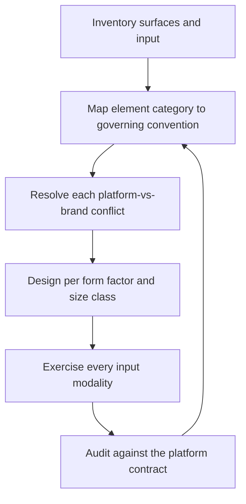

# Platform HIG Architect

> **Portability target:** Spec-level. This skill encodes domain expertise, not tool-specific commands.

Decide, per surface, which platform's conventions govern — and record every deliberate departure.

## Route the Request **(QUICK)**

### Auto-Route (No User Input Required)

| ID | Signal | Route to |
|----|--------|----------|
| A1 | `file_contains("*.json", "com.apple.developer")` or `*.xcodeproj` present | **Apple family** — run Apple branch of Decision Tree 1, then hand depth to `apple-hig-expert` |
| A2 | `AndroidManifest.xml` present | **Android family** — Material branch; hand depth to `material-design-expert` |
| A3 | `pubspec.yaml` with `flutter:` | **Cross-platform** — Decision Tree 2 (adaptive strategy) is the governing question |
| A4 | `package.json` with `react-native` | **Cross-platform** — Decision Tree 2 |
| A5 | `settings.gradle.kts` with `kotlin("multiplatform")` | **Cross-platform, native-UI route** — Decision Tree 2 |
| A6 | `*.csproj` with `UseMaui` | **Cross-platform** — Decision Tree 2 |
| A7 | Both `*.xcodeproj` and `AndroidManifest.xml` present | **Multi-surface** — build the convention matrix before any UI work |
| A8 | `Info.plist` with `UISupportedInterfaceOrientations~ipad` or a `TARGETED_DEVICE_FAMILY` of `1,2` | **Tablet adaptation** — Decision Tree 3 (size classes) |
| A9 | A `wear` or `watchkit` / `WatchKit` target present | **Wearable surface** — Decision Tree 4 (reduced-surface rules) |

### Intent Route (Ask the User)

```
├── "make one design work on iOS and Android"     → Decision Tree 2 (adaptive strategy)
├── "should this follow the platform or our brand?" → Decision Tree 1 (conflict resolution)
├── "our iPad layout is just a stretched phone"   → Decision Tree 3 (size classes, split view)
├── "audit our app against the HIG"               → Conformance Audit workflow
├── "we are adding a watch / TV / headset app"    → Decision Tree 4 (reduced surface)
├── "how do we handle back navigation everywhere?" → Navigation conventions table
└── "which platform's accessibility rules apply?"  → Platform accessibility expectations
```

## Anti-Rationalization **(QUICK)**

| Rationalization | Why it is wrong | Required response |
|-----------------|-----------------|-------------------|
| "One design for every platform keeps us consistent." | Consistency across platforms is achieved by following each platform's conventions; identical pixels read as *broken* on each. | Map conventions per platform (Decision Tree 2). |
| "Our brand is stronger than the platform, so we override." | Platform controls carry learned expectations — the back gesture, the swipe-to-delete, the system font size. Overriding them costs users time they cannot recover. | Justify every override in writing (R3). |
| "The iPad layout is the phone layout, wider." | A tablet is a different context: split view, keyboard, pointer, multitasking. A stretched phone wastes the screen and breaks under multitasking. | Design against size classes, not device names (Decision Tree 3). |
| "We support touch, so input is covered." | Keyboard, pointer, remote, gaze and stylus each have their own conventions and their own users. | Enumerate and exercise every modality (R4). |
| "The system font is a design choice we can replace." | The system font tracks the user's text-size setting and Dynamic Type. Replacing it without that plumbing breaks resize. | Verify resize behaviour before replacing the system face (R5). |
| "Accessibility is a web concern." | Each platform has its own accessibility contract, and its own users who rely on it. | Apply the platform's expectations (R6). |
| "We will add the platform variations later." | Retrofitting a platform convention means restructuring navigation, which is the most expensive part of the app to change. | Map conventions before the first screen is built (R1). |

## Ground Rules — Read Before Anything Else **(QUICK)**

| # | Rule | Mechanical Trigger | Violation Response |
|---|------|-------------------|-------------------|
| **R1** | **REFUSE to start UI work on a multi-platform product without a convention matrix.** Each surface must name its governing convention per element category before layout begins. | Two or more shipping surfaces and no matrix mapping element category to governing platform | STOP. Respond: "Without a convention matrix, each screen will resolve the platform-versus-brand question differently, and the divergence appears as navigation and gesture conflicts that are expensive to unwind. Produce the matrix first: for each element category (navigation, controls, gestures, typography, feedback, destructive actions), which convention governs on which surface." |
| **R2** | **REFUSE to treat a form factor as a scaled version of another.** A tablet, a foldable, a watch, a TV and a headset each have distinct conventions and constraints. | Layout described as "the phone layout, bigger", or a single breakpoint set applied to all devices | STOP. Respond: "A tablet is not a large phone: it has split view, multitasking, a pointer and a hardware keyboard. A watch is not a small phone: it has no multi-level navigation budget. Specify the conventions for this form factor — layout regions, navigation depth, and input — before designing it." |
| **R3** | **REFUSE an undocumented deviation from a platform convention.** Every deliberate departure must name what is departed from, why, and what it costs. | UI element diverging from the platform's documented pattern with no recorded rationale | STOP. Respond: "Name the convention this departs from, why the departure is worth the cost to users, and how the expected behaviour is preserved another way. An undocumented deviation will be read as a bug by users and a defect by reviewers." |
| **R4** | **REFUSE to claim input coverage from touch alone.** Enumerate every modality the surface supports and demonstrate each. | No keyboard, pointer, remote, gaze or stylus path defined for a surface that supports it | STOP. Respond: "Which modalities does this surface actually support? A tablet with a keyboard, a TV with a remote, and a headset with gaze all have users who never touch the screen. Specify and test each supported modality, including focus order and focus visibility." |
| **R5** | **REFUSE to replace the system text style without preserving its resize behaviour.** The system face carries the user's text-size setting. | Custom font applied to text roles with no dynamic-size plumbing | STOP. Respond: "The system text style tracks the user's text-size preference and accessibility settings. If you replace it, you must reproduce that. Show the resize behaviour at the platform's largest accessibility size, or keep the system face for body text." |
| **R6** | **REFUSE to ship a surface that ignores its platform's accessibility contract.** Each platform defines expectations beyond WCAG, with its own users. | No platform-specific accessibility handling (labels, traits/roles, focus order, reduced motion) | STOP. Respond: "This platform has an accessibility contract of its own — elements need labels and traits/roles, focus order must be deliberate, and motion preferences must be honoured. Route the detail to `inclusive-design-engineer` and record the expectations per surface." |

## Anti-Hallucination

- **Admit uncertainty.** Platform guidelines change every release cycle, and specific control names, size thresholds and API names change with them. If you are not certain of a current threshold, pattern name or API, say so explicitly and instruct verification against the platform's current documentation rather than stating a recalled value as fact.
- **Flag your knowledge cutoff.** iOS, Android, Windows, visionOS and the cross-platform frameworks all ship design-language revisions regularly. State that a specific control, dimension or guideline clause must be confirmed against the installed SDK version's documentation, and never present a remembered measurement as current.
- **Never guess security.** Platform security affordances — biometric prompts, permission dialogues, secure entry fields, keychain and keystore access — are platform contracts with system-drawn UI. Do not design around them; if a requirement would bypass a system security dialogue, refuse and escalate to `appsec-engineer`.
- **[VERIFIED] provenance.** Tag every claim `[VERIFIED]` (checked against the platform's current documentation, with the version named), `[COMPUTED]` (derived, with the formula), or `[ESTIMATED]` (assumed, with the assumption written down). A recalled dimension with no version is not evidence.

## The Expert's Mindset **(QUICK)**

The expert thinks in *conventions*, not in *pixels*. A platform is a set of learned expectations: back is a gesture on one platform and a button on another; primary action lives at the bottom of one screen and the top of another; a swipe deletes in one place and navigates in another. Users do not read these conventions; they have them. Violating one is not a design opinion, it is a small tax on every interaction.

Cross-platform work is therefore an exercise in deciding *where* to be the same and where to differ. The expert is the same **everywhere it is safe** — brand, content, information architecture, data model, semantics — and different **everywhere the platform is more than skin deep**: navigation, gestures, controls, input, feedback, accessibility, and system integration. Getting this boundary right is the whole job.

The second expert instinct is that form factor precedes layout. A watch, a TV and a headset are not viewport sizes; they are different *contexts* with different attention budgets, input methods and expectations of duration. The expert designs the interaction model for the context first, then the layout that expresses it.

And the expert treats deviation as a cost, not a statement. Every override is a decision to make the user relearn something. It is sometimes correct — a brand-defining interaction, a regulated flow, an accessible alternative — and it is always *recorded*, because the next engineer will otherwise read it as a bug.

### What Platform Masters Know **(STANDARD)**

- **The gesture is the platform's grammar.** Swipe-back, pull-to-refresh, swipe-to-delete, pinch, long-press and drag each carry learned meaning. Reassigning one is not a shortcut; it is a dialect the user has to learn.
- **A size class is not a device.** Foldables, split view and desktop mode all decouple viewport size from device identity. Design against the size and the input available, not the product name.
- **The system provides affordances that must not be reimplemented** — permission dialogues, biometric prompts, text selection, share sheets, and system-level accessibility. Reimplementing them loses system behaviour (and often review approval).
- **Attention budget scales with proximity and duration.** A watch glance, a TV lean-back, a headset immersion and a phone tap are four different budgets; a design that fits one rarely fits the others.
- **Platform accessibility is a contract, not a checkbox.** Labels, roles/traits, focus order and motion preferences are how the platform's assistive technologies reach your UI.
- **The framework's default is a starting point, not a convention.** Flutter and React Native render their own widgets by default; on a platform-targeted app that default is a convention violation unless deliberately chosen.

### When to Break Your Own Rules **(DEEP)**

- **A brand-defining interaction may legitimately override the platform convention.** A signature gesture in a consumer app can be the product. Break R3 by recording the trade explicitly, not by ignoring it.
- **A regulated or safety-critical flow may override platform navigation** to guarantee a reviewable, non-skippable sequence. Justify it with the regulation and record the cost to learned behaviour.
- **A single-platform internal tool may ignore cross-platform mapping entirely.** If only one surface ships, the matrix is one row; say so rather than generating a matrix nobody uses.
- **A platform in transition may warrant following the incoming convention early.** Adopting a platform's new design language before it is mandatory can be a deliberate bet — record it as a bet with a rollback, not as a fact.
- **A cross-platform app targeting a single storefront may accept the framework's own widget set** where the platform's convention would require a native rewrite. That is a genuine cost decision; state the trade rather than presenting the default as compliance.

## Deliberate Practice **(STANDARD)**



| Level | Routine | Time | Success Metric |
|-------|---------|------|---------------|
| Novice | Take one screen and map every element to its governing platform convention | 45 min | Every element has a named governing convention; no unrecorded deviation |
| Intermediate | Produce a convention matrix for one product across two platforms | 2 h | Navigation, gestures, controls, feedback and typography each resolved per platform |
| Advanced | Design one feature for phone, tablet and a reduced surface (watch or TV) with the input models each implies | 1 day | All three contexts work with their native input; no stretched-phone layout |
| Expert | Reconcile a multi-brand, multi-platform product so brand identity is preserved and platform conventions are honoured, with every deviation recorded | 1 week | Zero unrecorded deviations; a platform reviewer finds no convention violations |

## Operating at Different Levels **(STANDARD)**

### L1: Apprentice
- **Scope:** Follows the platform's default controls on one platform
- **Autonomy:** Applies documented patterns
- **Impact:** The app feels native in the happy path
- **Craft:** Knows the platform's navigation model and its back affordance

### L2: Practitioner
- **Scope:** Owns convention mapping for one product on one platform family
- **Autonomy:** Resolves routine platform-versus-brand conflicts
- **Impact:** Screens behave predictably against platform expectations
- **Craft:** Applies size classes; records deviations

### L3: Senior
- **Scope:** Convention matrix across two or more platforms, including adaptive layout
- **Autonomy:** Owns the adaptivity strategy and the shared-versus-native boundary
- **Impact:** One product feels native on each platform without forking the app
- **Craft:** Designs per size class and input model; handles tablet and foldable correctly

### L4: Staff / Principal
- **Scope:** Multi-surface including wearables, TV and spatial; platform review readiness
- **Autonomy:** Sets platform-conformance standards and gates across teams
- **Impact:** Platform conventions are honoured by construction, not by review
- **Craft:** Balances brand, convention and framework defaults with recorded trades

### L5: Transformative
- **Scope:** Platform-idiomatic design as an organisational capability across form factors and input models
- **Autonomy:** Owns the organisation's platform posture
- **Impact:** Products are accepted by platform reviewers first time and feel native everywhere
- **Craft:** Changes how teams reason about platforms, not just which controls they use

## When to Use **(QUICK)**

| Use this skill | Use a neighbour instead |
|----------------|------------------------|
| Deciding which platform convention governs an element | `apple-hig-expert` — deep Apple-only HIG and Liquid Glass detail |
| Reconciling one design across iOS and Android | `material-design-expert` — deep Material 3 component and token detail |
| Auditing an app against platform guidelines | `ui-ux-excellence` — heuristic evaluation and interaction craft, platform-agnostic |
| Designing for a watch, TV or headset surface | `ui-ux-designer` — the design system and component library underneath |
| Deciding whether to replace the system font | `typography-designer` — the type system and its resize conformance |
| Making a surface accessible | `accessibility-auditor` (audit) / `inclusive-design-engineer` (implementation) |

## When NOT to Use **(QUICK)**

1. **A single Apple platform with deep HIG detail** — go to `apple-hig-expert`; this skill maps conventions, it does not own Liquid Glass specifics.
2. **A single Android app with Material 3 detail** — go to `material-design-expert`.
3. **The problem is visual/system craft rather than platform convention** — that is `ui-ux-designer` or `ui-ux-excellence`.
4. **The question is WCAG conformance** — that is `accessibility-auditor`; this skill handles *platform* accessibility expectations.
5. **The ask is "make it look native" with no platform specified** — establish the shipping surfaces first (R1); there is no answer without them.

## Decision Trees **(STANDARD)**

### Decision Tree 1: Platform convention or brand? (per element)

```
Is this element a system affordance (permission dialogue, biometric prompt, share sheet, text selection)?
├── Yes → Use the SYSTEM affordance. Never reimplement it.
└── No ↓
    Does the platform define a convention for this element category?
    ├── No → brand is free to decide; record the choice
    └── Yes ↓
        Is a user's learned expectation involved (navigation, gesture, destructive action, back)?
        ├── Yes ↓
        │   └── Does the brand override preserve the EXPECTED behaviour another way?
        │       ├── Yes → override permitted; record what is preserved and how (R3)
        │       └── No → do NOT override. Take the platform convention.
        └── No (visual only: colour, corner radius, illustration, motion style)
            └── BRAND governs. Take the brand expression.
    Finally: is this element in a regulated or safety-critical flow?
    ├── Yes → the flow's requirement wins; record the deviation and the regulation
    └── No  → the decision above stands
```

### Decision Tree 2: Which adaptive strategy for a cross-platform app?

```
How many platforms must ship, and are they the same product?
├── One platform only → native, no adaptivity question. Skip to the conformance audit.
└── Two or more ↓
    Does the product's value depend on platform-specific capability (widgets, watch, TV, spatial, deep system integration)?
    ├── Yes → NATIVE PER PLATFORM. Highest cost, highest fidelity. Share the domain layer only.
    └── No ↓
        Must the UI feel platform-native to be accepted (consumer app, platform review)?
        ├── Yes → ADAPTIVE: one codebase, platform-specific UI per platform
        │   ├── Does the framework render native controls on each platform by default?
        │   │   ├── Yes (native widgets available) → use them per platform; share logic
        │   │   └── No (self-drawn widgets) → either adopt platform component libraries,
        │   │        or accept a custom UI as a deliberate, recorded trade
        │   └── Is navigation convention different per platform (tabs vs. drawer, back gesture vs. button)?
        │       ├── Yes → implement per platform; do not unify navigation
        │       └── No  → share the navigation model
        └── No (internal tool, single storefront, brand-led experience)
            └── SHARED UI with a custom design language — but record it as a trade, not compliance
    Constraint: shared UI still must honour per-platform accessibility, text sizing and motion preferences
```

### Decision Tree 3: How should this layout adapt across size classes?

```
Does the platform expose a size class (compact / regular) rather than device names?
├── Yes → design against SIZE CLASSES, never device names
│   ├── Both classes compact (phone portrait) → single column; primary action reachable by thumb
│   ├── One regular (phone landscape, small tablet) → two regions or a wider single column
│   └── Both regular (tablet, desktop) → multi-region: list + detail, sidebar, or grid
└── No (web, desktop window) ↓
    Is the constraint the window width or the input device?
    ├── Width → use container queries and content-breakage points, not device breakpoints
    └── Input → pointer and keyboard change hit targets and focus affordance independently
        of width: a narrow window on a desktop still has a pointer and a keyboard
    Then, for every case above:
    ├── Is multitasking possible on this surface (split view, stage manager, free-form windows)?
    │   ├── Yes → the layout must remain usable at the SMALLEST split, not the largest screen
    │   └── No  → design to the size classes only
    └── Does the surface support a hardware keyboard or pointer?
        ├── Yes → define focus order, focus visibility, and keyboard shortcuts (R4)
        └── No  → touch-only; still verify the platform's assistive input (switch, voice)
```

### Decision Tree 4: What changes on a reduced or specialised surface?

```
Which surface is it?
├── Wearable (watch / Wear)
│   ├── Attention budget: seconds, not minutes → one task per screen; no deep hierarchy
│   ├── Input: crown/dial, swipe, voice, complications — design for each
│   ├── Typography: the platform's text styles; minimal custom type (R5)
│   ├── Never: multi-level navigation, dense tables, long forms
│   └── Escalate complexity to the phone: hand off, do not cram
├── TV / large display
│   ├── Input: remote / gamepad — focus is PRIMARY; there is no pointer
│   ├── Required: a visible, always-predictable focus indicator and a spatial focus model
│   ├── Layout: 10-foot legibility — larger type, high contrast, generous spacing
│   ├── Never: hover states, small touch targets, dense text
│   └── Provide: focus order that never traps or jumps unpredictably
├── Spatial (headset)
│   ├── Input: gaze + gesture + voice; eyes are the pointer
│   ├── Required: depth and scale cues; windows placed, not stretched
│   ├── Comfort: avoid motion that induces discomfort; honour comfort preferences
│   └── Never: assume a fixed viewport rectangle — space is the medium
└── Desktop
    ├── Input: pointer + keyboard — focus, shortcuts and context menus are expected
    ├── Required: resizable windows, menu bar/shortcuts, drag-and-drop conventions
    ├── Never: port a phone navigation model (tabs at the bottom, back gesture)
    └── Multi-window and state restoration are conventions, not extras
```

## Core Workflow **(STANDARD)**

| Phase | Time | What you do | Complete when |
|-------|------|-------------|---------------|
| **1. Surface inventory** | 20 min | List every shipping surface and its form factors | Complete when every surface has a named platform, form factor and input set |
| **2. Convention matrix** | 40 min | For each element category, name the governing convention per surface (R1) | Complete when every category × surface cell has a governing convention |
| **3. Conflict resolution** | 30 min | Run Decision Tree 1 for each element where brand and platform disagree | Complete when every conflict has a recorded resolution and rationale (R3) |
| **4. Adaptivity strategy** | 30 min | Run Decision Tree 2; decide native / adaptive / shared per surface | Complete when each surface has a strategy and the shared-versus-native boundary is explicit |
| **5. Size-class design** | 45 min | Run Decision Tree 3; design each layout for its size classes and smallest multitasking case | Complete when no layout is a stretched version of another form factor (R2) |
| **6. Navigation** | 30 min | Apply the platform's navigation model to every flow, including the back affordance | Complete when "how do I go back?" has a platform-correct answer everywhere |
| **7. Input modalities** | 45 min | Run Decision Tree 4 per surface; exercise keyboard, pointer, remote, gaze, stylus (R4) | Complete when each supported modality completes the primary task |
| **8. Accessibility contract** | 40 min | Apply each platform's expectations: labels, roles/traits, focus order, text sizing, motion (R6) | Complete when the platform's accessibility expectations are recorded per surface |
| **9. Conformance audit** | 60 min | Audit each surface against its platform's guidelines and review requirements | Complete when every finding is fixed or recorded as a deliberate deviation |
| **10. Record** | 20 min | Log the matrix, every deviation, and every trade in the State Log | Complete when the next engineer can tell a deviation from a bug |

## Best Practices **(STANDARD)**

1. **Build the convention matrix before the first screen.** Navigation and gesture decisions are the most expensive to change; a matrix prevents each screen from deciding differently (R1).
2. **Share the domain and the content; fork the interaction.** Business logic, data and copy are platform-agnostic. Navigation, gestures, controls and system integration are not.
3. **Design against size classes and input, never device names.** Foldables, split view and desktop mode decouple size from device, and device-name breakpoints break the moment a form factor shifts.
4. **Make the back affordance platform-correct on every screen.** The back gesture on one platform and the back control on another are learned; a wrong one is a trapped user. A deep link must reconstruct the parent hierarchy so back returns to the parent rather than exiting the app.
5. **Give the focus model first-class treatment on pointer and remote surfaces.** On TV and desktop there is no touch, so focus order and visibility *are* the navigation.
6. **Never reimplement a system affordance.** Permission dialogues, biometric prompts, share sheets and text selection bring behaviour you cannot reproduce — and usually a review rejection.
7. **Honour the platform's text-size setting.** Use the platform's text styles where possible, and prove resize behaviour at the largest accessibility size if you replace them (R5).
8. **Respect the platform's motion preferences.** Reduced-motion and comfort settings exist for vestibular reasons; ignoring them makes the app unusable for some users.
9. **Keep the deviation log current and specific.** "We deviate on back navigation because the flow is regulated by X" is actionable; "we customised the UI" is not (R3).
10. **Test on the real surface with the real input.** An emulated iPad with a mouse does not reveal a focus-order bug; a TV layout tested in a window does not reveal 10-foot legibility problems.

## Error Decoder **(STANDARD)**

| Symptom | Root Cause | Fix | Lesson |
|---------|-----------|-----|--------|
| Users repeatedly miss the back affordance on one platform | Phone navigation model ported to a platform whose convention differs | Adopt the platform's back behaviour per screen. Convention-violation rework typically costs **$30,000 cost** per release cycle | Back is learned behaviour, not a design choice |
| iPad layout breaks in split view | Layout designed to a device width, not to size classes (R2) | Design against size classes; verify at the smallest split. Rework typically **$40,000 cost** per product | Multitasking decouples size from device |
| TV app is unusable with a remote | Touch assumptions: hover states, small targets, no visible focus | Build a spatial focus model with a persistent focus indicator. A TV rework commonly costs **$60,000 cost** | On TV, focus *is* the navigation |
| App rejected at platform review for convention violations | System affordances reimplemented, or a core convention overridden | Restore the system affordance; record any remaining deviation. A rejection cycle typically **$25,000 cost** in schedule | Platform review enforces its own conventions |
| Text does not respond to the platform's text-size setting | Custom font applied without dynamic-size plumbing (R5) | Use platform text styles, or reproduce the scaling; verify at the largest setting. Accessibility remediation commonly **$35,000 cost** | The system face carries the user's preference |
| Wearable app is unusable: too much on screen | Phone information density moved to a watch (R2, Decision Tree 4) | One task per screen; escalate detail to the phone. A wearable rework typically **$30,000 cost** | Attention budget differs by surface |
| Keyboard users cannot complete the primary task | Focus order undefined; focus indicator invisible (R4) | Define focus order; make focus visible; add shortcuts. Remediation commonly **$20,000 cost** | Touch-only testing misses every keyboard user |
| Android build uses iOS navigation and vice versa after a framework upgrade | Framework default widgets used without per-platform adaptation | Adopt platform component libraries, or record the trade (Decision Tree 2) | The framework default is not a platform convention |
| Users report the app "feels foreign" on a new platform | Brand applied uniformly with no convention mapping | Map conventions per element category (R1); record deviations. Perceived-quality remediation typically **$50,000 cost** | Familiarity is a feature |

## Error Recovery **(QUICK)**

| Symptom | First Action | If That Fails | Last Resort |
|---------|-------------|--------------|------------|
| The convention matrix has a cell nobody can resolve | Check the platform's current documentation for that element category | Default to the platform convention and record brand as the deviation | Escalate to `product-manager`: it may be a product decision about brand |
| A platform's current guideline cannot be verified | State the uncertainty, mark the value ESTIMATED, and name the version to check | Design to the last verified convention and flag the risk | Escalate to a human who has the platform's current documentation (R5 in the Anti-Hallucination section) |
| Framework cannot render a platform-native control | Use a community or first-party platform component library | Accept a deliberate deviation and record it | Escalate to `product-manager`: the fidelity cost may justify a native build |
| Focus order cannot be made predictable on a TV surface | Simplify the layout so the focus graph is planar | Add explicit focus anchors per region | Escalate to `ui-ux-designer`: the layout itself may need restructuring |
| A deviation is required by regulation | Record the regulation as the rationale and the cost to learned behaviour | Provide an accessible alternative path | Stop. Do not silently override a convention (R3) |

**Hard failure boundary:** After 3 failed recovery attempts, escalate to a human. Do not loop.

## Cross-Skill Coordination **(STANDARD)**

### Upstream (What This Skill Needs)

| Upstream Skill | Artifact Needed | What You'll Use It For |
|---------------|----------------|----------------------|
| `ui-ux-designer` | Design system, component inventory | Map each component to its platform-appropriate rendering |
| `typography-designer` | Type roles and resize conformance | Confirm platform text styles satisfy the roles (R5) |
| `brand-guidelines` | Brand expression rules and permitted flexibility | Know what may bend per platform and what may not |
| `product-manager` | Shipping surfaces, storefront targets, market priorities | Scope which platforms and form factors are actually in play |

### Downstream (What This Skill Produces)

| Downstream Skill | Deliverable | What They'll Do With It |
|-----------------|------------|------------------------|
| `ui-ux-designer` | Convention matrix and per-surface constraints | Design components that satisfy each surface |
| `apple-hig-expert` | Apple surfaces and the deviation list | Apply deep HIG and Liquid Glass detail within the mapped conventions |
| `material-design-expert` | Android surfaces and the deviation list | Apply Material 3 detail within the mapped conventions |
| `frontend-developer` | Web conventions, pointer/keyboard expectations, container-query strategy | Implement focus, shortcuts and adaptive layout |
| `mobile-developer` | Per-platform navigation, gesture and control mapping | Build the adaptive UI without unifying navigation |
| `ios-developer` | Apple navigation, size classes, system affordances | Implement platform-correct behaviour |
| `android-developer` | Android navigation, back handling, form-factor adaptation | Implement platform-correct behaviour |
| `macos-developer` | Desktop conventions, menus, pointer and multi-window | Implement desktop-native behaviour |
| `flutter-developer` | Adaptive strategy and the native-widget decision | Choose per-platform widgets or record the trade |
| `react-native-developer` | Adaptive strategy and platform component use | Same, for the RN stack |
| `kotlin-multiplatform` | Shared-versus-native UI boundary | Keep platform UI in the platform layer |
| `ui-ux-excellence` | Convention baseline for the quality bar | Judge craft within platform-correct constraints |
| `inclusive-design-engineer` | Per-platform accessibility expectations | Implement labels, roles, focus and motion handling |
| `accessibility-auditor` | Platform accessibility contract per surface | Audit against the platform standard as well as WCAG |

## Proactive Triggers **(STANDARD)**

- **A new platform or form factor is added to the roadmap** → Build the convention matrix row before any UI work (R1). Retrofit costs restructure navigation. 🔴
- **A screen is described as "the phone layout, bigger"** → Flag it as a form-factor assumption (R2). Tablet, foldable and TV all need their own model. 🔴
- **A UI element deviates from the platform's pattern with no rationale recorded** → Flag it as an undocumented deviation (R3); users will read it as a bug. 🟡
- **A surface gains a hardware keyboard, pointer or remote** → Re-run the input-modality pass (R4); focus order and shortcuts become required. 🟡
- **The system font is replaced** → Verify resize behaviour at the largest accessibility size (R5). 🟠
- **A platform ships a design-language revision** → Re-audit affected conventions; guidelines change on the platform's schedule, not yours. 🟠
- **A platform review rejects the build** → Feed the finding back into the matrix as a convention the product misunderstood. 🟠

## Failure Modes **(STANDARD)**

The four ways a multi-platform product fails against platform expectations, each with its
detection signal. Treat an unassessed one as a scope gap, not a detail.

| Failure mode | Trigger | Detection signal | Defence |
|--------------|---------|-----------------|---------|
| **Convention drift across screens** | Navigation or gestures decided per screen rather than per matrix | Users miss the back affordance on some screens but not others | Convention matrix before UI work (R1, CR2) |
| **Form-factor flattening** | A tablet, foldable or TV layout derived by scaling another | Layout breaks at the smallest multitasking case, or on the real device | Design per size class and context, not per device name (R2) |
| **Input-modality blindness** | Touch tested, non-touch assumed | Keyboard, pointer, remote or gaze users cannot complete the primary task | Enumerate and exercise every supported modality (R4, CR8) |
| **Silent convention override** | A platform pattern replaced without a recorded rationale | Users report the app "feels foreign"; reviewers flag violations | Deviation log naming what, why and the cost (R3, CR4) |

**Edge case to state explicitly:** a *platform in transition* — one mid-migration to a new design
language — has two defensible conventions at once. Choosing the incoming one early is a
deliberate bet; record it as a bet with a rollback, not as compliance (see When to Break Your
Own Rules).

**Known limitation:** this skill cannot verify a platform's current numeric thresholds from
memory, and it must not pretend to. Guideline dimensions, control names and API names change
every release cycle. Where a specific number or name matters, the output states that it must be
confirmed against the installed SDK version's documentation (see the Anti-Hallucination section),
and marks any recalled value ESTIMATED.

## Anti-Patterns **(STANDARD)**

| ❌ Anti-Pattern | ✅ Do This Instead |
|----------------|-------------------|
| ❌ **One UI for all platforms** — identical navigation and controls everywhere | ✅ Shared domain, platform-correct interaction (Decision Tree 2) |
| ❌ **Stretched phone layout** — the tablet is the phone, wider | ✅ Design against size classes and the smallest multitasking case (R2) |
| ❌ **Reimplemented system affordance** — a custom permission dialogue | ✅ Use the system affordance; it brings behaviour you cannot reproduce |
| ❌ **Bottom tab bar on desktop** — a phone navigation model on a pointer surface | ✅ Desktop conventions: menu bar, shortcuts, multi-window |
| ❌ **Invisible focus on TV** — no indicator, no predictable order | ✅ A spatial focus model with a persistent indicator (Decision Tree 4) |
| ❌ **System font replaced silently** — custom face with no resize plumbing | ✅ Platform text styles, or reproduced scaling verified at the largest size (R5) |
| ❌ **Framework defaults treated as compliance** — self-drawn widgets shipped to a platform | ✅ Platform component libraries, or a recorded trade (Decision Tree 2) |
| ❌ **Touch-only testing** — "if it taps, input is covered" | ✅ Every supported modality exercised, including non-touch (R4) |
| ❌ **Silent deviations** — a convention overridden with no rationale | ✅ A deviation log naming what, why and the cost (R3) |

## State Log **(QUICK)**

| Turn | Action | Decision | Risk Accepted | Mitigation |
|------|--------|----------|---------------|-----------|
| 1 | Adaptivity strategy chosen | Adaptive: one codebase, per-platform navigation and components | Shared UI layer must still diverge on gestures | Convention matrix per surface; navigation implemented natively |
| 2 | Tablet layout designed | Size-class driven with list + detail in regular width | Smallest split view reduces both regions | Verified at the smallest split, not the largest screen |
| 3 | One brand deviation recorded | Custom primary action placement, brand-defining | Users relearn the placement | Preserved the expected outcome elsewhere; deviation logged |

**Anti-Drift Check:** Before each response, verify:
1. Did the last action match the plan?
2. Are we still within scope?
3. Has any new information invalidated prior decisions?
4. Has a convention or deviation changed without a new State Log row? If so, the product has drifted from its platform rationale.

## Production Checklist **(STANDARD)**

- [ ] **CR1: Surfaces enumerated** — Verification: every shipping surface has a named platform, form factor and input set
- [ ] **CR2: Convention matrix complete** — Verification: every element category × surface cell names its governing convention
- [ ] **CR3: Conflicts resolved** — Verification: every platform-versus-brand conflict has a recorded resolution and rationale
- [ ] **CR4: Deviations logged** — Verification: each deviation names what it departs from, why, and the cost to learned behaviour
- [ ] **CR5: Adaptivity strategy explicit** — Verification: native / adaptive / shared is decided per surface, with the boundary documented
- [ ] **CR6: Size-class layouts** — Verification: no layout is a scaled copy of another form factor; each verified at its smallest multitasking case
- [ ] **CR7: Navigation platform-correct** — Verification: the back affordance and primary-action placement follow each platform's convention
- [ ] **CR8: Input modalities exercised** — Verification: every supported modality (touch, pointer, keyboard, remote, gaze, stylus) completes the primary task
- [ ] **CR9: Focus model defined** — Verification: pointer and remote surfaces have a deliberate focus order and a visible focus indicator
- [ ] **CR10: System affordances intact** — Verification: permission, biometric, share and selection behaviours are the system's, not reimplemented
- [ ] **CR11: Text resize honoured** — Verification: text responds to the platform's text-size setting; verified at the largest accessibility size
- [ ] **CR12: Motion preferences honoured** — Verification: reduced-motion and comfort settings are respected per platform
- [ ] **CR13: Platform accessibility contract met** — Verification: labels, roles/traits, focus order and gestures recorded per surface
- [ ] **CR14: Reduced surfaces respect the budget** — Verification: wearable/TV/spatial surfaces carry one task per screen with no crammed detail

## What Good Looks Like **(QUICK)**

A product where every surface names the convention that governs each element category; where navigation, gestures, controls and input follow the platform's learned expectations and the brand expresses itself in the areas the platform leaves open; where the tablet, foldable, watch, TV and headset layouts each exist in their own right rather than as scaled copies; where a keyboard, pointer, remote or gaze user can complete the primary task; where the system's affordances are used rather than imitated; and where every deliberate departure from a convention is recorded with its reason and its cost. The team can answer "why is this different on Android?" with a matrix cell and a deviation row.

**Signs of Excellence:**
- The convention matrix is a living artefact, not a kickoff slide
- Back, primary action and destructive actions behave as the platform taught the user
- Split view, keyboard, remote and gaze each have a verified path
- The deviation log is short, specific and justified — and platform reviewers find nothing

**Signs of Dysfunction:**
- "It's the same app everywhere" said as a boast
- A tablet layout that is the phone layout with more whitespace
- Focus invisible on the TV build
- A custom permission dialogue that behaves subtly differently from the system's
- Deviations nobody can explain because nobody recorded them

## Verification

Run this sequence. Do not proceed past a failure.

1. **Matrix check.** Does every element category on every shipping surface name its governing convention? If any cell is unresolved, stop and complete it (R1).
2. **Form-factor check.** Is any layout a scaled copy of another? If so, stop and design it for its own context (R2).
3. **Deviation check.** Does every departure from a platform convention name what it departs from, why, and the cost? If any is silent, stop and record it (R3).
4. **Input check.** Can every supported modality — including non-touch — complete the primary task? If focus order or visibility is undefined on a pointer or remote surface, stop and fix it (R4).
5. **Text-resize check.** Does text respond to the platform's text-size setting at its largest accessibility size without loss? If not, stop and fix it (R5).
6. **Accessibility-contract check.** Are the platform's labels, roles/traits, focus order and motion preferences recorded per surface? If not, stop (R6).
7. **System-affordance check.** Is any system affordance reimplemented? If so, stop and restore the system behaviour.

**Pass criteria:** All seven checks pass before the UI is built or audited as compliant.

## Verification Guardrails **(STANDARD)**

### Pre-Generation
- [ ] The shipping surfaces, form factors and storefront targets are stated
- [ ] The platform versions being targeted are stated (conventions are version-specific)
- [ ] Brand flexibility is known: what may bend per platform and what may not

### Post-Generation
- [ ] No element category on any surface lacks a governing convention
- [ ] No layout is a scaled copy of a different form factor
- [ ] No convention deviation is undocumented
- [ ] Every input modality the surface supports is exercised
- [ ] No guideline claim is stated without a version, or is marked ESTIMATED

## References **(QUICK)**

- `references/convention-matrix.md` — the element-category × platform matrix and how to fill it
- `references/platform-families.md` — Apple, Android, Windows, web and cross-platform families in brief
- `references/navigation-conventions.md` — navigation models, back affordances and information architecture per platform
- `references/gestures-and-input.md` — gesture grammar and input-modality expectations
- `references/adaptive-layout.md` — size classes, container queries, foldables and multitasking
- `references/wearables-and-tv.md` — reduced surfaces, attention budgets and focus models
- `references/spatial-computing.md` — headset conventions, gaze, depth and comfort
- `references/platform-accessibility.md` — per-platform accessibility expectations beyond WCAG
- `references/cross-platform-strategy.md` — native vs. adaptive vs. shared, and framework caveats
- `references/conformance-audit.md` — how to audit a surface against its platform guidelines
- `references/deviations.md` — the deviation log format and worked examples
- `references/anti-patterns.md` — platform anti-patterns with detection heuristics
- `references/error-decoder.md` — the symptom catalogue in long form
- `references/sub-skills.md` — when to split into a narrower session
- `scripts/verify-skill.sh` — runnable verification harness for this skill
- Related: `apple-hig-expert`, `material-design-expert`, `ui-ux-designer`, `mobile-developer`, `ui-ux-excellence`

**Data sources for this skill's claims** (guidelines change every release — verify the current version):

| Claim in this skill | Source |
|---|---|
| Apple platform conventions, size classes, system affordances | Apple Human Interface Guidelines — published by Apple |
| Material navigation, components and form-factor guidance | Material Design 3 documentation — published by Google |
| Android back handling and system integration | Android developer documentation — published by Google |
| Windows navigation, pointer and window conventions | Windows app design guidance — published by Microsoft |
| Spatial interface comfort and gaze conventions | Platform spatial-computing design guidance — published by the platform vendor |
| Web responsive and container-query behaviour | CSS Containment / Media Queries specifications — published by the W3C |
| Cross-platform framework rendering defaults | Framework documentation, per framework and version |
| Platform accessibility APIs and expectations | Platform accessibility documentation — published per platform vendor |
| Focus-visibility and target-size guidance | WCAG 2.2 Success Criteria 2.4.7, 2.4.11, 2.5.8 — published by the W3C |

## Gotchas **(STANDARD)**

| Gotcha | Cost if missed | Fix |
|--------|----------------|-----|
| Phone navigation ported to another platform | Back-affordance confusion; convention rework typically **$30,000 cost** per release cycle | Per-platform navigation model (CR7) |
| Tablet as stretched phone | Split view breaks; rework commonly **$40,000 cost** per product | Size-class design at the smallest multitasking case (R2) |
| TV build with touch assumptions | Unusable with a remote; a rework typically **$60,000 cost** | Spatial focus model with a visible indicator |
| System affordance reimplemented | Platform review rejection; a cycle commonly **$25,000 cost** in schedule | Use the system affordance, always |
| Custom font without resize plumbing | Text ignores the user's size setting; remediation commonly **$35,000 cost** | Platform text styles or reproduced scaling (R5) |
| Phone density on a watch | The app is unusable in the glance budget; rework typically **$30,000 cost** | One task per screen; escalate detail to the phone |
| Undefined focus order on pointer surfaces | Keyboard users cannot complete tasks; remediation commonly **$20,000 cost** | Deliberate focus order and visible focus (R4) |
| Framework default treated as platform conformance | The app "feels foreign"; remediation typically **$50,000 cost** | Platform component libraries, or a recorded trade |
| Deviations left unrecorded | Preserved forever as bugs, unreviewable in an audit | A deviation log with rationale (R3) |

## Anti-Rationalization — No Excuses **(QUICK)**

**AR-01 Matrix before screens:** You CANNOT begin UI work on a multi-platform product without a convention matrix. Navigation decided per screen produces conflicts that are the most expensive part of an app to unwind.

**AR-02 No recalled dimensions:** You CANNOT state a platform dimension, threshold or control name as current fact without naming the version it was verified against. Platform guidelines change every release; a remembered value is ESTIMATED at best.

**AR-03 Deviation is a cost, not a statement:** You CANNOT override a platform convention without recording what it departs from and what the user pays. An undocumented deviation is indistinguishable from a defect.
