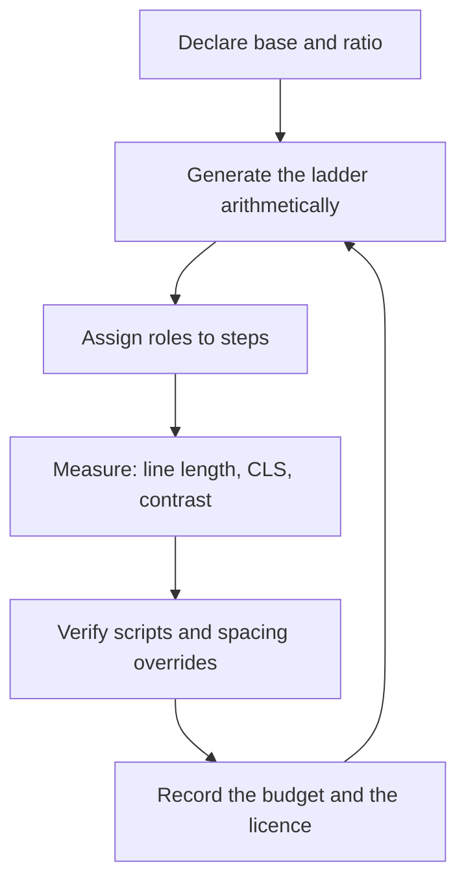

# Typography Designer

> **Portability target:** Spec-level. This skill encodes domain expertise, not tool-specific commands.

Treat type as a measured system with a budget, not as a styling choice applied at the end.

## Route the Request **(QUICK)**

### Auto-Route (No User Input Required)

| ID | Signal | Route to |
|----|--------|----------|
| A1 | `file_contains("*.css", "font-family")` and no type-scale tokens declared | **Scale Design** — Decision Tree 1 |
| A2 | `@font-face` present without `font-display` | **Loading & CLS** — Decision Tree 2 |
| A3 | Locale matrix includes `ar`, `he`, `fa`, `ur`, `ja`, `ko`, `zh`, `hi`, `bn`, `ta`, `th` | **Script Coverage** — Decision Tree 3 |
| A4 | `font-size` declared only in `px`, no `rem`/`em` anywhere | **Resize Compliance** — Ground Rule R2 |
| A5 | `font-variation-settings` or a `*-VF.woff2` / `wght` axis file present | **Variable Font Audit** — Decision Tree 2 |
| A6 | Table, metrics dashboard, or pricing grid with proportional figures | **Numerals** — Decision Tree 4 |
| A7 | Font binaries present with no adjacent licence file or attribution | **Licensing Gate** — Ground Rule R4 |
| A8 | `user-scalable=no` or `maximum-scale=1` in a viewport meta tag | **Resize Compliance** — R2, and it is an accessibility defect |

### Intent Route (Ask the User)

```
├── "pick fonts for this product"                → Decision Tree 1 (roles), then Pairing
├── "make it work in Arabic / Japanese"          → Decision Tree 3 (script coverage)
├── "our headings jump around while loading"     → Decision Tree 2 (CLS / fallback metrics)
├── "the design looks nice but feels unpolished" → Measure, leading and tracking audit
├── "can we use this font commercially?"         → Licensing (R4) before any other step
├── "data tables are hard to scan"               → Decision Tree 4 (tabular figures)
└── "text breaks when users zoom"                → R2 and R6 compliance pass
```

## Anti-Rationalization **(QUICK)**

| Rationalization | Why it is wrong | Required response |
|-----------------|-----------------|-------------------|
| "The system font fallback is fine." | A generic fallback has different metrics, so every line rewraps on swap. That is measurable layout shift, not a cosmetic detail. | Declare a metric-matched fallback with `size-adjust` (R1). |
| "We set sizes in px because designers think in px." | `px` text does not respond to the browser's font-size preference, which is how a large share of users enlarge text. | Author in `rem`, convert at the edge (R2). |
| "It scales because the numbers look even." | A scale that is not derived from a declared ratio has no rule, so the next screen invents another size. | Declare the ratio and the base, then generate the steps (R3). |
| "It is on Google Fonts, so it is free." | Free to download is not the same as licensed for app embedding, server rendering, or high-traffic web use. | Record the licence and the permitted contexts (R4). |
| "The font family covers most languages." | Family names lie. Coverage is a property of the specific file, subset, and version. | Verify coverage against the shipped file (R5). |
| "Spacing is a visual tweak." | Text spacing is a conformance requirement: users who override it must not lose content. | Test the four WCAG 1.4.12 overrides (R6). |
| "Letter-spacing tightens it nicely." | Letter-spacing applied to a joined script breaks the joins and can render the word illegible. | Never track joined scripts (R5, Decision Tree 3). |

## Ground Rules — Read Before Anything Else **(QUICK)**

| # | Rule | Mechanical Trigger | Violation Response |
|---|------|-------------------|-------------------|
| **R1** | **REFUSE to ship a webfont without a metric-compatible fallback whose shift is measured.** A generic `sans-serif` fallback rewraps every line on swap. | `@font-face` present with no `size-adjust` / `ascent-override` / `descent-override` fallback and no CLS contribution recorded | STOP. Respond: "Every webfont needs a fallback metric-matched to it, or the swap rewraps the page and registers as layout shift. Provide the fallback `@font-face` with `size-adjust` and the ascent/descent overrides derived from the two fonts' metrics, plus the CLS delta measured on a throttled profile." |
| **R2** | **REFUSE to size text in `px` only, and refuse any zoom or text-resize disablement.** Text must honour the reader's font-size preference and reach 200% without loss of content. | All `font-size` declarations in `px`; or `user-scalable=no` / `maximum-scale=1` present; or clipping at 200% | STOP. Respond: "Text in `px` ignores the reader's font-size setting, and blocking zoom fails WCAG 1.4.4. Author every text size in `rem` anchored to the root, remove the zoom restriction, and show the 200% test result with no clipped or overlapped content." |
| **R3** | **REFUSE an ad-hoc size ladder with no declared ratio.** Unstated ratios are the root cause of a product with eleven near-identical heading sizes. | Two or more `font-size` values within 2px of each other, or a scale with no recorded base and ratio | STOP. Respond: "These sizes were chosen individually, so nothing prevents a twelfth. Declare the base size and the scale ratio, then generate the steps from them. Give me the ratio and I will produce the ladder arithmetically." |
| **R4** | **REFUSE to ship any font binary without a recorded licence covering its actual use.** Web use, app embedding, server-side rendering, and subsetting are separate grants. | Font file present with no licence identifier, or a licence that excludes the shipping context | STOP. Respond: "I cannot ship this face without knowing the grant. Which licence, and does it cover [web / app embedding / server rendering / subsetting]? If the licence excludes the context, the face is unavailable for it regardless of the design intent." |
| **R5** | **REFUSE any script-coverage claim not verified against the shipped file, and never apply tracking to a joined script.** Coverage is per-file, and letter-spacing breaks Arabic, Devanagari and other cursive or conjunct scripts. | Locale claimed without a glyph test; or a negative `letter-spacing` on a joined-script text role | STOP. Respond: "Family names do not guarantee coverage — this must be verified against the actual file for every character the content uses. And `letter-spacing` on a joined script breaks the joins: remove it and control rhythm with size and leading instead." |
| **R6** | **REFUSE text that loses content under the WCAG 1.4.12 spacing overrides.** Users may force line-height, paragraph spacing, letter-spacing and word-spacing without losing text. | Fixed-height text containers, `overflow: hidden` on text, or clipping under the four overrides | STOP. Respond: "Under the 1.4.12 overrides this container clips. Height must come from content, not a fixed value. Apply the four overrides — line-height 1.5, paragraph spacing 2em, letter-spacing 0.12em, word-spacing 0.16em — and show nothing is lost." |

## Anti-Hallucination

- **Admit uncertainty.** If you have not measured the fallback-to-webfont metric delta, the CLS contribution, or the actual glyph coverage of a file, say so and mark the figure ESTIMATED with the assumption written down. Never present an assumed CLS value as measured.
- **Flag your knowledge cutoff.** Font metrics, licence terms, variable-font axis support and CSS font features change between releases. State that a specific axis, licence clause, or browser behaviour must be confirmed against the installed version and the current licence text rather than recalled.
- **Never guess security.** A font served from a third-party origin is a supply-chain and privacy exposure. If the only path is an unvetted remote origin, refuse to approve it and escalate to `appsec-engineer`.
- **[VERIFIED] provenance.** Tag every figure `[VERIFIED]` (measured, with the tool and profile named), `[COMPUTED]` (derived, with the formula), or `[ESTIMATED]` (assumed, with the assumption written down).

## The Expert's Mindset **(QUICK)**

Typography is the interface. Nearly every element a user reads is type, so type decisions set the reading speed, the perceived density, and the amount of layout shift — before any component is styled. A design system that treats type as a token family of last resort produces screens that look considered in isolation and inconsistent in aggregate.

The expert works in *roles*, not sizes. A product does not need a heading that is 28px; it needs a role that means "section title on a default-density surface", which then resolves to a size. Roles survive redesign; hardcoded sizes do not. This is why the scale is generated from a base and a ratio rather than picked.

Typography is also the highest-leverage accessibility surface. Text resize, text spacing, contrast, reflow, and language declaration are all typographic properties. A team that owns type properly gets roughly half of a WCAG audit for free; a team that does not pays for it twice — once in defects, once in rework.

And type is the place where internationalisation is won or lost. Line-breaking, joined scripts, full-width punctuation and vertical metrics differ by script in ways that cannot be retrofitted by swapping a family name. Coverage has to be designed, not discovered in production.

### What Typography Masters Know **(STANDARD)**

- **Measure governs readability more than the typeface does.** Line length in characters, not pixels, is the control. Source: Bringhurst's *The Elements of Typographic Style* frames measure as characters per line, with the comfortable band around 45–75.
- **Leading is a ratio first and a value second.** Unitless `line-height` inherits proportionally; a `px` or `%` line-height does not, which is why nested type explodes.
- **Optical size is real.** A face drawn for 12px is too loose at 72px. Variable fonts express this as the `opsz` axis; static families express it as separate display and text cuts.
- **Figures are a semantic choice.** Tabular figures align in columns and break in prose; proportional figures read well in prose and wobble in a table. Choose per context, not globally.
- **The fallback stack is part of the design**, not a failure mode. It is the state most users see during first paint.
- **Joined scripts cannot be tracked.** Arabic, Persian, Urdu and many Indic scripts join; `letter-spacing` disfigures them. Source: the W3C i18n articles on script-specific typography document this constraint per script.
- **Licences are per-context.** A desktop licence, a web licence, an app-embedding licence and a server-rendering licence are different grants over the same file.

### When to Break Your Own Rules **(DEEP)**

- **A single-role brand display face may legitimately carry a bespoke size instead of a ladder step** — an oversized marketing headline is a graphic element. Record it as a display role with its own token rather than letting it become a heading variant.
- **A deliberately "dense" enterprise UI may use a shorter leading than the readability band**, accepting a slower read in exchange for visible row count. Justify it with the task and record the choice; do not let it leak into prose text.
- **A locale may need a larger default size** — CJK and Devanagari commonly need 1–2 steps more than a Latin equivalent at the same nominal size because the glyphs are denser at small sizes. Break the "one scale for all locales" rule deliberately, per locale.
- **A regulated print or legal artifact may require a fixed `pt` size** with no responsive scaling. That is a deliberate override of R2 for a non-screen medium; state the medium and keep the rule intact for screen output.

## Deliberate Practice **(STANDARD)**



| Level | Routine | Time | Success Metric |
|-------|---------|------|---------------|
| Novice | Build one ladder from a stated base and ratio and assign it to five named roles | 30 min | Every size traces to a step in the ladder; no two steps within 2px |
| Intermediate | Author a metric-matched fallback for one webfont and measure the CLS delta | 45 min | Measured CLS delta recorded on a throttled mobile profile, with the profile named |
| Advanced | Take a two-locale product (Latin + one joined or CJK script) and make both pass the spacing overrides and coverage tests | 2 h | Zero clipped content under the four overrides; coverage proven per shipped file |
| Expert | Rebuild a live product's type system so every text role resolves to a token, all licences are recorded, and the type budget is measurable | 1 day | No inline font-size remains; licence per face; reading-speed and CLS targets met on device |

## Operating at Different Levels **(STANDARD)**

### L1: Apprentice
- **Scope:** Sets sizes and weights on individual screens
- **Autonomy:** Applies a provided scale
- **Impact:** Screens are readable in the happy path
- **Craft:** Knows rem from px and unitless leading from fixed

### L2: Practitioner
- **Scope:** Owns the type ladder and the role mapping for a product surface
- **Autonomy:** Chooses the base, ratio and role assignments
- **Impact:** Sizes stop multiplying; hierarchy is consistent
- **Craft:** Derives the ladder arithmetically; sets measure and leading deliberately

### L3: Senior
- **Scope:** Type tokens, fallback metrics, loading strategy, numerals, multi-script coverage
- **Autonomy:** Owns the type system across surfaces and locales
- **Impact:** No swap-induced shift; Latin and non-Latin both hold up
- **Craft:** Measures CLS contribution; proves coverage per file; removes tracking from joined scripts

### L4: Staff / Principal
- **Scope:** Type as a governed token family with a licensing register and a measurable budget
- **Autonomy:** Sets typographic standards and gates across products
- **Impact:** Type changes are one-token changes; licence exposure is eliminated
- **Craft:** Ties type metrics to reading performance and gates releases on them

### L5: Transformative
- **Scope:** Typographic performance and legibility treated as product quality metrics with owners
- **Autonomy:** Owns the organisation's typographic posture across scripts and media
- **Impact:** Reading quality is measured, budgeted and defended like latency
- **Craft:** Changes how the organisation reasons about text, not just what it sets

## When to Use **(QUICK)**

| Use this skill | Use a neighbour instead |
|----------------|------------------------|
| Choosing, pairing and scaling typefaces | `brand-guidelines` — brand identity, logo, and the typographic *direction* |
| Building type tokens and the scale ladder | `ui-ux-designer` — full design-token and component architecture |
| Making a Latin-only product work in Arabic, CJK or Indic scripts | `localization-engineer` — the i18n architecture and message pipeline |
| Fixing swap-induced layout shift from webfonts | `performance-engineer` — the wider performance budget |
| Fixing text-spacing, resize and contrast conformance | `accessibility-auditor` — the whole-product audit |
| Number formatting in tables and dashboards | `data-visualization-engineer` — chart and table design |

## When NOT to Use **(QUICK)**

1. **The ask is a logo or wordmark** — that is `brand-guidelines`; a logo is a mark, not a text role.
2. **The problem is component or token architecture** — go to `ui-ux-designer`; type tokens are one family within it.
3. **The task is translating or routing messages** — that is `localization-engineer` (architecture) or `translation-manager` (pipeline). This skill handles the *typography* those locales require.
4. **The task is a platform-convention decision** — which of iOS, Android or web conventions should win is `platform-hig-architect`.
5. **No content model exists yet** — roles cannot be assigned without knowing what text the product has. Get the content model first.

## Decision Trees **(STANDARD)**

### Decision Tree 1: Which type scale, and stepped or fluid?

```
Does the content model name distinct text roles (display, title, body, label, caption, code)?
├── No → STOP. Build the role list first; sizes without roles multiply.
└── Yes ↓
    Is the product editorial/marketing (long-form, presentation-led)?
    ├── Yes → base 16px+, ratio 1.25 or 1.333, more display steps
    └── No (application UI, dense)
        └── base 16px, ratio 1.125–1.2, few steps, tight label/caption band
    Does the same screen need to work from 320px to 2560px without breakpoint-specific sizes?
    ├── No → STEPPED ladder: fixed sizes per step, no interpolation
    └── Yes → FLUID: clamp(min, preferred, max) per step
        ├── Does a designer need to predict the size at a given width?
        │   ├── Yes → derive preferred as a line: preferred = intercept + slope × 100vw
        │   │          (compute intercept/slope from two known design widths)
        │   └── No  → use a simpler viewport-relative term, accept less control
        └── Constraint: fluid must never fall below the stepped minimum for that step
            └── Verify at 320px and 2560px, and at the 200% resize case (R2)
```

### Decision Tree 2: Should this face be a variable font, and how should it load?

```
Is the same face needed at more than one width/weight/optical size?
├── No → STATIC face; simpler, smaller, fewer support caveats
└── Yes ↓
    Do the required axes exist in one file (wght, wdth, opsz, slnt, ital)?
    ├── No → use two static faces rather than synthesising an axis
    └── Yes → VARIABLE face
        ├── Is `opsz` needed because the same face spans body and display sizes?
        │   ├── Yes → enable `font-optical-sizing: auto` and verify at both extremes
        │   └── No  → keep the file with the axes actually used; drop the rest
        └── Loading strategy for the chosen face:
            ├── Is the text visible-and-styled before first paint (above the fold)?
            │   ├── Yes → preload the exact file; `font-display: swap`; metric-matched fallback (R1)
            │   └── No  → `font-display: optional` and accept the fallback for cold loads
            └── Does the fallback's measured shift exceed the CLS budget?
                ├── Yes → derive size-adjust + ascent/descent overrides from the two fonts' metrics
                └── No  → record the measured delta and stop tuning
```

### Decision Tree 3: What does this locale actually require of the type system?

```
Which script does the locale's content use?
├── Latin / Cyrillic / Greek → separate words by spaces; tracking is safe
├── Arabic / Persian / Urdu / Hebrew → joined or RTL
│   ├── Never apply letter-spacing (R5)
│   ├── Verify contextual shaping renders in the chosen file
│   └── Set logical direction; do not flip the layout in type rules
├── Devanagari / Bengali / Tamil / Thai → conjuncts, matras, or no word spaces
│   ├── Verify conjunct and matra coverage in the shipped file (R5)
│   ├── Do not assume space-based line breaking (Thai)
│   └── Expect a larger nominal size for equal legibility
├── CJK (Chinese / Japanese / Korean)
│   ├── Verify full-width punctuation and ideographic space in the file
│   ├── Choose `line-break` and `word-break` behaviour deliberately
│   └── Expect more leading; CJK glyphs are denser at small sizes
└── Mixed-script within one string
    └── Declare a per-script fallback chain; validate the join points visually
    Finally: is coverage proven against the SHIPPED file for every character the content uses?
    ├── Yes → record the test
    └── No  → STOP. Family name coverage is not evidence (R5).
```

### Decision Tree 4: Which numeral style, where?

```
Is the text inside a column that must align vertically (table, metrics, pricing)?
├── Yes → TABULAR figures (`font-variant-numeric: tabular-nums`)
│   └── Is it a dense financial or technical table?
│       ├── Yes → consider a slashed or open zero to disambiguate 0/O
│       └── No  → tabular lining figures are sufficient
└── No (prose, labels, headings)
    └── PROPORTIONAL figures; consider oldstyle if the face has a genuine text cut
Finally: does any figure sit next to Latin letters in a code-like context?
├── Yes → verify 1/l/I and 0/O disambiguation in the chosen face
└── No  → done
```

## Core Workflow **(STANDARD)**

| Phase | Time | What you do | Complete when |
|-------|------|-------------|---------------|
| **1. Content roles** | 20 min | Inventory the text roles the product actually renders; note extremes (longest string, empty, numerals, mixed script) | Complete when every text role is named and has a stated purpose |
| **2. Coverage matrix** | 20 min | List the locales and the scripts their content uses | Complete when every shipping locale has a named script and a coverage requirement |
| **3. Licence check** | 15 min | Identify each candidate face's licence and the contexts it permits (R4) | Complete when every candidate is permitted for its shipping context, or is eliminated |
| **4. Scale** | 20 min | Declare base and ratio; generate the ladder; run Decision Tree 1 for stepped vs fluid | Complete when every step traces arithmetically to the base and ratio (R3) |
| **5. Role mapping** | 15 min | Assign each role to a step, a weight, a leading and a measure | Complete when every role resolves to tokens and no two roles share a step unintentionally |
| **6. Script coverage** | 30 min | Run Decision Tree 3 per locale; prove glyph coverage against the shipped files (R5) | Complete when every locale's required characters render from the declared chain |
| **7. Loading** | 25 min | Run Decision Tree 2; write fallbacks and metric overrides; subset by `unicode-range` | Complete when fallback shift is measured and within the CLS budget (R1) |
| **8. Numerals & details** | 15 min | Run Decision Tree 4; set tabular figures, punctuation, and optical sizing | Complete when every numeric context states its figure style |
| **9. Conformance** | 30 min | Apply the WCAG 1.4.4 resize and 1.4.12 spacing overrides; check contrast and reflow | Complete when 200% resize and all four spacing overrides lose no content (R2, R6) |
| **10. Budget & record** | 15 min | Record the measured budget (payload, CLS delta, reading speed) and every licence in the State Log | Complete when the budget is measured against a named profile and each face's licence is recorded |

## Best Practices **(STANDARD)**

1. **Generate the ladder from a declared base and ratio, and keep the count small.** Six to eight steps is usually enough for a product; every extra step is a decision someone will get wrong later.
2. **Assign roles before sizes.** Name the roles the content needs, then map roles to steps. A size with no role is an accident waiting to be copied.
3. **Author in `rem`, convert nothing by hand.** Anchoring every text size to the root is what makes the reader's font-size preference work at all.
4. **Set measure in characters, verify with the real content.** Target roughly 45–75 characters per line for body text, then check the longest real string, not lorem ipsum.
5. **Keep leading unitless on text roles.** Unitless leading inherits proportionally; fixed leading breaks the moment a nested element changes size.
6. **Track large text negatively and all-caps positively, and never joined scripts.** Display type needs tightening; all-caps needs opening; joined scripts need neither (R5).
7. **Metric-match the fallback and measure the delta.** `size-adjust` plus ascent/descent overrides, with the resulting shift recorded on a named profile (R1).
8. **Subset by `unicode-range` and keep the fallback honest.** Subsetting cuts payload but must never remove a character the content can produce — check the extremes.
9. **Choose figures per context, not globally.** Tabular in columns, proportional in prose, and confirm 0/O and 1/l disambiguation where it matters (Decision Tree 4).
10. **Test type on a real device at the real sizes.** Emulator hinting and desktop antialiasing both misrepresent small-text legibility; verify on the target screens.
11. **Declare the role once at a container, not at every leaf.** Both platforms propagate a text style down a subtree, so a screen with thirty text nodes should name **zero** roles in the leaves. Named roles in the leaves are the missing container, not the missing shorthand.
12. **Name a role in the shortest form the platform legally allows — and the forms differ.** Swift can write `.barTitle` (an implicit member expression, SE-0287); Kotlin **cannot**, because extension properties require an explicit receiver. On Android the shortest legal form is a top-level `@Composable` property used as `barTitle`, which is shorter than the Swift form. Never prescribe one platform's syntax as the cross-platform standard — see `references/role-consumption.md`.
13. **Keep the long form in exactly one file.** `MaterialTheme.typography.titleLarge` or `.font(.system(size:weight:))` outside the token file is a finding; make it a lint rule so the discipline is mechanical rather than remembered.

## Error Decoder **(STANDARD)**

| Symptom | Root Cause | Fix | Lesson |
|---------|-----------|-----|--------|
| Page visibly rewraps when the webfont loads; CLS 0.15 on mobile | No metric-matched fallback — generic fallback has different metrics (R1) | Add a fallback `@font-face` with `size-adjust` and ascent/descent overrides derived from the two metrics; re-measure. Typical rework and support cost is **$25,000 cost** per product surface | The fallback is a designed state, not an accident |
| Text will not enlarge with the browser's font-size setting | Sizes authored in `px`, so the root preference is ignored (R2) | Re-author text sizes in `rem`; keep `px` only for borders and hairlines. Compliance remediation commonly runs **$40,000 cost** per product | `px` text opts out of the reader's preference |
| Arabic or Devanagari text renders with broken joins or disconnected matras | `letter-spacing` applied to a joined script, or a subset that dropped the joining forms (R5) | Remove tracking from joined-script roles; re-subset preserving shaping forms; verify in the shipped file | Tracking is a Latin-script affordance |
| Boxes (tofu) appear only for some users in a locale | Coverage assumed from the family name; the shipped file lacks some characters (R5) | Prove coverage per file against the actual content characters; extend the fallback chain per script | Coverage is a file property, not a family property |
| Content is clipped when a reader applies text-spacing overrides | Fixed-height text containers or `overflow: hidden` on text (R6) | Let height come from content; remove clipping; re-test the four overrides. Remediation typically costs **$30,000 cost** per release cycle | Users may override spacing, and must not lose content |
| Heading hierarchy has eleven near-identical sizes | Sizes chosen ad hoc with no declared ratio (R3) | Declare base and ratio; regenerate the ladder; remap roles | An unstated ratio is the defect |
| Table figures jitter and columns never align | Proportional figures used in a tabular context | Apply `tabular-nums` to column contexts (Decision Tree 4) | Figure style is a semantic decision |
| Legal exposure after an app ships with a desktop-only font | Licence checked for the wrong context (R4) | Replace the face or obtain the correct grant; record it in the register. A forced font replacement commonly costs **$60,000 cost** mid-project | A licence is per-context, not per-file |
| Small text is legible on the designer's display but not on the target phone | Verified only on desktop antialiasing and a high-DPI emulator | Test at real sizes on the real device and locale | Hinting differs; verify on the target screen |

## Error Recovery **(QUICK)**

| Symptom | First Action | If That Fails | Last Resort |
|---------|-------------|--------------|------------|
| Fallback metrics cannot be measured (no tooling) | Derive overrides from the published font metrics of both faces and label ESTIMATED | Ship `font-display: optional` and accept the fallback on cold loads | Escalate to `performance-engineer` for a measurement harness |
| The chosen face lacks coverage for a required script | Extend the fallback chain for that script | Substitute a face with proven coverage for the whole role | Escalate to `brand-guidelines`: the brand direction may need a per-script cut |
| The licence excludes the shipping context | Eliminate the face and select a licensed alternative | Obtain the correct grant before further design work | Stop. Shipping an unlicensed embed is a legal decision, not a design one |
| Fluid sizes break between the tested widths | Return to a stepped ladder and add steps only where content breaks | Constrain the fluid term and re-verify at the extremes | Escalate to `ui-ux-designer`: the layout may need to change, not the type |
| A locale needs a larger nominal size than the scale allows | Add a per-locale step multiplier rather than a new global scale | Give the locale its own base step | Record it as a deliberate scale divergence (see When to Break Your Own Rules) |

**Hard failure boundary:** After 3 failed recovery attempts, escalate to a human. Do not loop.

## Cross-Skill Coordination **(STANDARD)**

### Upstream (What This Skill Needs)

| Upstream Skill | Artifact Needed | What You'll Use It For |
|---------------|----------------|----------------------|
| `brand-guidelines` | Brand typographic direction, permitted faces | Bound the candidate set and the visual character |
| `ui-ux-designer` | Design-token schema, component inventory | Emit type tokens in the system's established format |
| `localization-engineer` | Locale matrix, script requirements, expansion expectations | Drive Decision Tree 3 and the coverage matrix |
| `product-manager` | Content model, role inventory, density expectations | Assign roles from real content rather than guesses |

### Downstream (What This Skill Produces)

| Downstream Skill | Deliverable | What They'll Do With It |
|-----------------|------------|------------------------|
| `ui-ux-designer` | Type tokens and role map | Fold into the design system as a governed family |
| `frontend-developer` | Token set, fallback `@font-face` blocks, `unicode-range` subsets | Implement without inventing sizes or fallbacks |
| `website-builder` | Complete type system with loading strategy | Ship readable pages that do not shift on load |
| `mobile-developer` | Per-platform type roles and coverage requirements | Map roles to native text styles and verify scripts |
| `data-visualization-engineer` | Figure-style rules for columns and axes | Make tables and charts align and scan |
| `presentation-designer` | Display-versus-text cut guidance and measure rules | Keep slide type readable at distance |
| `platform-hig-architect` | Type roles per platform and locale | Reconcile typography with platform conventions |
| `ui-ux-excellence` | Measured type budget (CLS, reading speed, contrast) | Fold into the quality bar |
| `inclusive-design-engineer` | Resize and spacing conformance evidence | Ship accessible text without re-deriving it |

## Proactive Triggers **(STANDARD)**

- **A new webfont is added** → Require a fallback metric match and a measured CLS delta before merge (R1). Untracked swaps are how shift enters a product. 🔴
- **A new locale is added to the shipping set** → Re-run Decision Tree 3 and the coverage matrix. Script requirements are not additive by default. 🔴
- **A `font-size` in `px` appears in a text role** → Flag it; it breaks the reader's preference (R2). 🟡
- **A new size appears within 2px of an existing step** → Flag the ad-hoc ladder (R3); it is the signature of a scale that will fragment. 🟡
- **Text containers gain a fixed height or `overflow: hidden`** → Flag the eventual 1.4.12 clipping (R6). 🟠
- **A font binary appears in the repository** → Require the licence record and the permitted contexts (R4) before it reaches a release branch. 🟠

## Anti-Patterns **(STANDARD)**

| ❌ Anti-Pattern | ✅ Do This Instead |
|----------------|-------------------|
| ❌ **Ad-hoc size ladder** — 26px, 28px, 30px for three heading levels | ✅ A generated ladder from a declared base and ratio (R3) |
| ❌ **`px` text sizes** — designer-friendly, reader-hostile | ✅ `rem` for all text roles, `px` only for hairlines (R2) |
| ❌ **Generic fallback** — `font-family: Inter, sans-serif` | ✅ A metric-matched fallback with measured shift (R1) |
| ❌ **Tracking joined scripts** — `letter-spacing: -0.01em` applied globally | ✅ Zero tracking on joined scripts; size and leading carry the rhythm (R5) |
| ❌ **Coverage by family name** — "Inter covers it" | ✅ Coverage proven against the shipped file per locale (R5) |
| ❌ **One scale for every locale** — Latin ladder forced onto CJK | ✅ Per-locale base adjustments where legibility demands |
| ❌ **Fixed text container heights** — clipped under spacing overrides | ✅ Content-driven height; the four overrides tested (R6) |
| ❌ **Licence by assumption** — "it is on a free font site" | ✅ A recorded grant per embedding context (R4) |
| ❌ **Proportional figures in tables** — jittering columns | ✅ Tabular figures in columns; proportional in prose (Decision Tree 4) |

## Failure Modes **(STANDARD)**

The four ways a type system fails in production, each with its detection signal. These are the
known failure modes this skill exists to prevent; treat an unassessed one as a scope gap.

| Failure mode | Trigger | Detection signal | Defence |
|--------------|---------|-----------------|---------|
| **Silent coverage failure** | A locale's content uses a character the shipped subset lacks | Tofu boxes reported by users in one locale only | Per-file coverage test in CI, derived from content (R5) |
| **Swap-shift regression** | A face changes and the fallback metrics are not re-derived | CLS rises on a cold, throttled load | Metric-matched fallback re-derived per face; measured delta (R1) |
| **Scale fragmentation** | A new screen adds a size instead of reusing a step | Distinct `font-size` values grow release over release | Generated ladder + token-only sizing (R3); the grep gate |
| **Licence exclusion discovered late** | The shipping context is not covered by the purchased grant | Legal review blocks a release | Licence register before design (R4); the CI font gate |

**Edge case to state explicitly:** a *mixed-script string* (a Latin brand name inside Arabic
prose) can pass per-script coverage tests and still render with mismatched styling at the join
points. It is not covered by codepoint tests — it needs a visual check (see
`references/script-coverage.md` §3).

**Known limitation:** this skill cannot verify glyph *shaping* automatically. Codepoint coverage
is testable in CI; whether the joins, conjuncts and matras render correctly requires a human or
a screenshot-diff on a device with the product's real CSS. Do not present a green coverage test
as proof that a script renders (R5).

## State Log **(QUICK)**

| Turn | Action | Decision | Risk Accepted | Mitigation |
|------|--------|----------|---------------|-----------|
| 1 | Scale generated | Base 16px, ratio 1.2, 7 steps, stepped (not fluid) | Fewer than 7 display steps for marketing surfaces | Display role holds its own token outside the ladder |
| 2 | Fallback written | `size-adjust` + ascent/descent overrides from measured metrics | Small residual shift on cold loads | Measured delta recorded; budget monitored on a named profile |
| 3 | Script coverage proven | Per-file glyph test for the shipping locales | New content characters may fall outside the subset | Coverage test re-run when the content model changes |

**Anti-Drift Check:** Before each response, verify:
1. Did the last action match the plan?
2. Are we still within scope?
3. Has any new information invalidated prior decisions?
4. Has a font-size, leading, ratio or fallback value changed without a new State Log row? If so, the type system has drifted from its rationale.

## Production Checklist **(STANDARD)**

- [ ] **CR1: Roles named** — Verification: every text role is named and mapped to a token; no inline `font-size` remains in text
- [ ] **CR2: Ladder generated** — Verification: each step traces arithmetically to the declared base and ratio; no two steps within 2px
- [ ] **CR3: `rem` authoring** — Verification: all text sizes use `rem`; no zoom or text-resize disablement present
- [ ] **CR4: Measure verified** — Verification: body measure falls in the 45–75 character band on the real longest content, not placeholder text
- [ ] **CR5: Leading unitless** — Verification: text roles use unitless `line-height`; no fixed-height text containers
- [ ] **CR6: Fallback metric-matched** — Verification: `size-adjust` and ascent/descent overrides present; shift measured on a named throttled profile
- [ ] **CR7: Coverage proven per file** — Verification: a glyph test against the shipped file for every character each shipping locale produces
- [ ] **CR8: Joined scripts untracked** — Verification: zero `letter-spacing` on joined-script roles; shaping verified visually
- [ ] **CR9: Resize compliance** — Verification: 200% text resize loses no content and requires no horizontal scrolling
- [ ] **CR10: Spacing overrides** — Verification: all four 1.4.12 overrides applied with no clipping or overlap
- [ ] **CR11: Figures per context** — Verification: tabular figures in columns, proportional in prose; 0/O disambiguation checked where it matters
- [ ] **CR12: Licences recorded** — Verification: every shipped face has a licence identifier and a permitted-context record covering its actual use
- [ ] **CR13: Budget measured** — Verification: font payload, CLS delta and reading-speed proxy recorded against a named device profile

## What Good Looks Like **(QUICK)**

A type system where every piece of text resolves to a named role, every role to a step in a ladder generated from a declared base and ratio, and every step to a token the design system owns. Each webfont has a metric-matched fallback with a measured shift inside the budget, a licence recorded for the exact context it ships in, and a coverage test proving every character the shipping locales produce. Text survives 200% resize and all four spacing overrides without loss. Figures align in columns and read naturally in prose. The team can answer "why is this 15px?" with a ratio, a step and a role.

**Signs of Excellence:**
- Every size traces to a base and a ratio, visible in the token file
- Fallback shift is a measured number on a named profile, not a hope
- Coverage is proven per shipped file, per locale
- Licence context is recorded for every face, so no release is blocked by a legal surprise

**Signs of Dysfunction:**
- Dozens of near-identical sizes with no rule behind them
- `font-family: Inter, sans-serif` as the whole loading strategy
- Arabic shipped with letter-spacing applied
- "It is a free font" offered as the licensing answer
- No one has ever tested text at 200% with the spacing overrides applied

## Verification

Run this sequence. Do not proceed past a failure.

1. **Role check.** Does every piece of text resolve to a named role and a token, with no inline `font-size` left behind? If any text is sized ad hoc, stop and fix R3.
2. **Ladder check.** Do all steps trace arithmetically to the declared base and ratio? If any step is unexplained, stop and regenerate it.
3. **Resize check.** At 200% text resize, and with zoom unblocked, is all content still readable with no clipping and no horizontal scroll for text? If not, stop and fix R2.
4. **Spacing check.** With all four WCAG 1.4.12 overrides applied, is any content lost or overlapped? If so, stop and fix R6.
5. **Fallback check.** Is every webfont paired with a metric-matched fallback, and is the shift a measured value on a named profile? If not, stop and fix R1.
6. **Coverage check.** For every shipping locale, has coverage been proven against the shipped file for the characters the content actually uses? If coverage is assumed, stop and fix R5.
7. **Licence check.** Does every shipped face have a recorded licence covering its real embedding context? If any is assumed, stop and fix R4.

**Pass criteria:** All seven checks pass before delivering the type system.

## Verification Guardrails **(STANDARD)**

### Pre-Generation
- [ ] The content model and role inventory exist; the longest real strings are available
- [ ] The locale matrix and each locale's script requirements are stated
- [ ] The licence for each candidate face is known before design work begins

### Post-Generation
- [ ] No text role resolves to an unexplained size
- [ ] No webfont ships without a metric-matched fallback and a measured shift
- [ ] No locale ships without a proven coverage test
- [ ] No face ships without a recorded licence for its context
- [ ] Resize and spacing conformance demonstrated, not asserted

## References **(QUICK)**

- `references/core-workflow.md` — the ten phases as a runnable procedure with the arithmetic
- `references/type-scales.md` — modular ratios, fluid `clamp()` derivation, and per-locale base adjustments
- `references/font-loading-and-cls.md` — fallback metric matching, `size-adjust`, subsetting, and the CLS measurement recipe
- `references/script-coverage.md` — per-script requirements for Arabic, Indic, CJK and Hebrew, and how to test coverage
- `references/variable-fonts.md` — axis selection, optical sizing, and static fallbacks
- `references/type-accessibility.md` — WCAG 1.4.4, 1.4.12, 1.4.3 and 1.4.10 applied to type
- `references/font-licensing.md` — licence families, grants per context, and the register format
- `references/pairing-and-hierarchy.md` — pairing logic and hierarchy without size inflation
- `references/role-consumption.md` — how a role is written at the call site: the three tiers, and why `.barTitle` works on iOS but not Android
- `references/numerals-and-data-type.md` — figure styles, disambiguation, and data-table typography
- `references/metrics-and-measurement.md` — the measurables and how to capture them
- `references/anti-patterns.md` — the catalogue with detection heuristics
- `references/error-decoder.md` — the symptom catalogue in long form
- `references/sub-skills.md` — when to split into a narrower session
- `scripts/verify-skill.sh` — runnable verification harness for this skill
- Related: `ui-ux-designer`, `brand-guidelines`, `localization-engineer`, `frontend-developer`, `data-visualization-engineer`

**Data sources for this skill's claims** (verify the current version before citing a clause):

| Claim in this skill | Source |
|---|---|
| Measure guidance (45–75 characters per line) | Bringhurst, *The Elements of Typographic Style* — published by Hartley & Marks |
| Resize, spacing, reflow and contrast thresholds | WCAG 2.2, Success Criteria 1.4.3, 1.4.4, 1.4.10, 1.4.12 — published by the W3C |
| Per-script shaping and line-breaking constraints | W3C Internationalization (i18n) articles, *script-specific typography* — published by the W3C |
| `size-adjust` and the metric-override descriptors | CSS Fonts Module Level 4 — published by the W3C |
| Reserved Font Name and redistribution conditions | SIL Open Font License 1.1 — published by SIL International |
| Variable-font axis definitions | OpenType `fvar` / `STAT` specifications — published by Microsoft |
| CLS thresholds and attribution | Web Vitals documentation — published by Google |
| Font metrics and cmap coverage extraction | `fontTools` documentation — published by the fontTools project |
| Locale number formatting conventions | Unicode CLDR, via `Intl.NumberFormat` — data from the Unicode Consortium |
| Language declaration requirements | WCAG 2.2 Success Criterion 3.1.1 — published by the W3C |

## Gotchas **(STANDARD)**

| Gotcha | Cost if missed | Fix |
|--------|----------------|-----|
| Webfont with a generic fallback | Visible rewrap on every cold load; CLS budget consumed; roughly **$25,000 cost** per surface in rework and support | Metric-matched fallback with a measured shift (R1) |
| Text sized in `px` | The reader's font-size preference is ignored; conformance failure costing around **$40,000 cost** to remediate per product | `rem` for all text roles (R2) |
| Tracking applied to Arabic or Indic text | Broken joins and unreadable words ship to entire markets | Never track joined scripts; verify shaping (R5) |
| Coverage assumed from the family name | Tofu boxes for real users in a shipping locale | Prove coverage against the shipped file (R5) |
| Fixed-height text containers | Content clipped for users who apply spacing overrides; roughly **$30,000 cost** per release cycle in fixes | Content-driven height; test the four overrides (R6) |
| Desktop-only font licence in a shipped app | Forced replacement or legal exposure; commonly **$60,000 cost** mid-project | Record the grant per context before design (R4) |
| Unstated scale ratio | The ladder fragments into a dozen near-identical sizes | Declare base and ratio; generate steps (R3) |
| Proportional figures in tables | Columns never align; scanning slows in exactly the task that needs speed | Tabular figures in columns (Decision Tree 4) |
| Subset that drops a producible character | Tofu on user-generated or locale-specific input | Subset by `unicode-range` and test at the content extremes |
| Verified only on a desktop display | Small text is illegible on the target device, discovered post-launch | Verify at real sizes on the real device and locale |
| The role is named at every call site | Every text node couples to the theme object and the role name, so a theme change touches every file; a screen with 30 text nodes names 30 roles it could have declared once | Declare the role at the container (Tier 1) and use the platform's shortest legal shorthand at the leaves; keep the long form in the token file only. See `references/role-consumption.md` |
| One platform's shorthand prescribed as the cross-platform standard | `.barTitle` is legal Swift (an implicit member expression) but **invalid Kotlin**, because extension properties require an explicit receiver — so a prescribed cross-platform shorthand ships code that does not compile on Android | State the form per platform; on Android use a top-level `@Composable` property as `barTitle`, which is shorter than the iOS form |

## Anti-Rationalization — No Excuses **(QUICK)**

**AR-01 Roles before sizes:** You CANNOT produce a size without naming the role it serves. A size with no role is copied into places it was never meant for, and the hierarchy collapses within one release cycle.

**AR-02 Measure, do not assert:** You CANNOT claim a CLS delta, a coverage result, or a spacing-override outcome without recording the profile and the command. An unmeasured typography claim is indistinguishable from a guess.

**AR-03 Licence before design:** You CANNOT begin type design against a face whose licence is unknown. A mid-project replacement invalidates the scale, the metrics and the fallback work already done.
