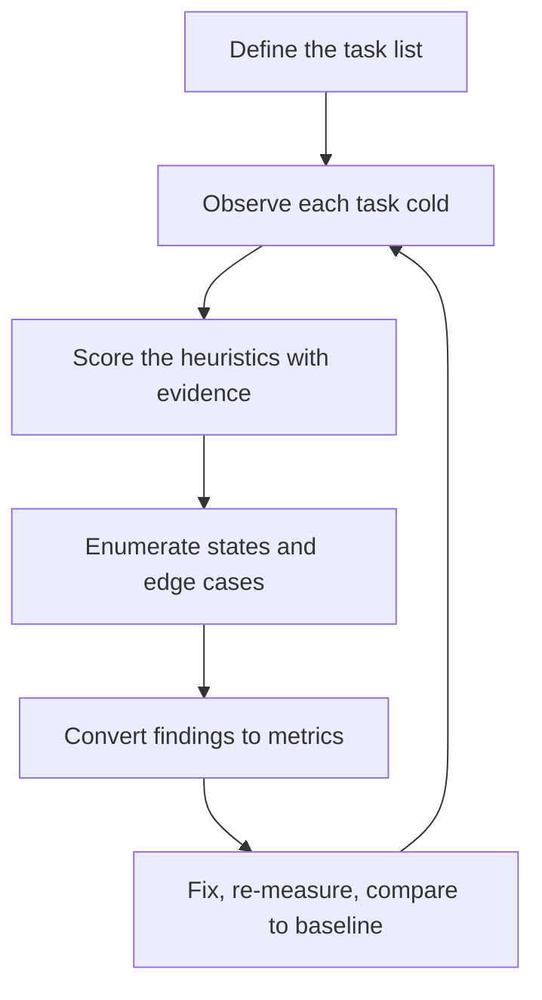

# UI/UX Excellence

> **Portability target:** Spec-level. This skill encodes domain expertise, not tool-specific commands.

Judge an interface by what users can achieve, and prove it with evidence rather than taste.

## Route the Request **(QUICK)**

### Auto-Route (No User Input Required)

| ID | Signal | Route to |
|----|--------|----------|
| A1 | Screenshot set or prototype without empty/error/loading frames | **State Coverage** — Decision Tree 2 |
| A2 | `file_contains("*.json", "sus")` or `file_contains("*.md", "task.success")` | **Measurement** — read the baseline first, then the Heuristic Evaluation workflow |
| A3 | Analytics present but no funnel or task-completion events | **Measurement** — define the HEART signals before scoring |
| A4 | A design review thread with only aesthetic comments ("make it pop", "feels cramped") | **Heuristic Pass** — convert opinions to evidence (R1) |
| A5 | Loading states exist but are spinners with no skeleton or optimistic update | **Perceived Performance** — Decision Tree 4 |
| A6 | Transitions in the 300ms–2s range, or animation on every state change | **Motion Discipline** — Decision Tree 3 |
| A7 | Error messages that name the problem but not the remedy | **Error Experience** — Decision Tree 1 |
| A8 | Form with validation that only triggers on submit | **Error Prevention** — Decision Tree 1 |

### Intent Route (Ask the User)

```
├── "is this screen good enough to ship?"        → Heuristic Evaluation workflow, then Decision Tree 2
├── "run a heuristic evaluation"                 → the 10-heuristic scorecard (references/heuristics.md)
├── "our users keep making mistakes here"        → Decision Tree 1 (error prevention)
├── "the app feels slow but the metrics are fine"→ Decision Tree 4 (perceived performance)
├── "the animations feel off"                    → Decision Tree 3 (motion discipline)
├── "which screens are missing states?"          → Decision Tree 2 (state coverage)
└── "how do we know it got better?"              → Measurement (HEART, SUS, task success)
```

## Anti-Rationalization **(QUICK)**

| Rationalization | Why it is wrong | Required response |
|-----------------|-----------------|-------------------|
| "It looks good, and design is subjective." | Craft is subjective; whether a user can complete a task is not. The measurable parts are measurable. | Attach evidence to every finding (R1). |
| "We only need the happy path." | Users arrive with empty accounts, bad input, no network and slow connections. The unhappy paths are the product for those users. | Enumerate all states per screen (R2). |
| "Spinners are fine, the API is fast." | Perception is the metric users experience. A frozen screen and a slow screen feel identical. | Make waiting legible (R4). |
| "Animation makes it feel premium." | Motion that does not explain a change is noise, and it costs frames and comfort. | Every transition must justify itself (R3). |
| "Users will figure it out." | They will; they will also leave. Unrecoverable confusion is the most expensive defect class. | Prevent the error or make recovery obvious (Decision Tree 1). |
| "We'll measure after launch." | Post-launch measurement without a baseline cannot attribute improvement to the change. | Capture the baseline first (R5). |
| "The heuristic score is fine." | A score with no reproduction step is an opinion with a number attached. | Cite the screen and the step (R1). |

## Ground Rules — Read Before Anything Else **(QUICK)**

| # | Rule | Mechanical Trigger | Violation Response |
|---|------|-------------------|-------------------|
| **R1** | **REFUSE an aesthetic-only finding.** Every quality claim must cite an observed, reproducible behaviour and the user consequence. | Finding phrased as taste ("cluttered", "feels off", "needs polish") with no user behaviour attached | STOP. Respond: "Convert this to evidence: which screen, which task, which step, and what the user does differently or fails to do. 'It feels cluttered' is not actionable; 'three actions compete for the primary task at step 2, and task success drops 18% against the baseline' is." |
| **R2** | **REFUSE to approve a screen whose states are not enumerated.** Every asynchronous surface needs at least loading, empty, error and partial-data states, plus the content extremes. | Screen shipped with only its success state defined | STOP. Respond: "Enumerate this screen's states: loading (before data), empty (valid, no items), error (failed to load), partial (some data), plus longest/shortest/zero content. A screen with only the success state is a screen that is broken for every user who is not in the happy path." |
| **R3** | **REFUSE motion that does not explain a change.** A transition must communicate a spatial, hierarchical or causal relationship; otherwise it is delay. | Animation present with no stated purpose, or longer than the interaction it accompanies | STOP. Respond: "What does this motion explain? A transition should show where a thing came from, what changed, or causality. If it explains nothing, it is adding latency and frames of jank for decoration. Either state its purpose or remove it." |
| **R4** | **REFUSE an un-legible wait.** Any operation whose duration can exceed a user's patience threshold must have a perceivable progress signal within that threshold. | Operation with no feedback until completion, or a single indeterminate spinner for a multi-second task | STOP. Respond: "At what point does this operation exceed the threshold? A spinner is not feedback on duration, and a blank screen reads as frozen. Name the signal that shows progress within the threshold, whether that is a skeleton, an optimistic update, or determinate progress." |
| **R5** | **REFUSE a quality improvement with no baseline and no metric.** A change that cannot be shown to help is indistinguishable from churn. | Improvement proposed with no baseline metric, no owner, no review date | STOP. Respond: "What is the current value, which metric will move, and who owns it? Without a baseline, an improvement cannot be attributed and will be re-litigated next quarter. Give me the metric and the reviewer." |
| **R6** | **REFUSE a heuristic score presented without the heuristic's own criteria and evidence.** A single 0–5 number per heuristic, with no note, is not an evaluation. | Scorecard with numeric scores and no per-item evidence | STOP. Respond: "For each score below the threshold, cite the screen, the step, the observed behaviour, and the heuristic clause it violates. A score without a reproduction step cannot be verified, disputed, or fixed." |

## Anti-Hallucination

- **Admit uncertainty.** If you have not observed the behaviour, measured the task, or read the analytics, say so and mark the finding as a hypothesis to test. Never present a predicted conversion lift as a measured result — the numbers in the examples are arithmetic illustrations, not forecasts.
- **Flag your knowledge cutoff.** Framework defaults, Core Web Vitals thresholds, and animation recommendations change between releases. State that a specific threshold or API must be confirmed against the current documentation rather than recalled.
- **Never guess security.** An interface shortcut that skips authentication, confirmation, or an authorization check is a security change, not a UX improvement. Refuse and escalate to `appsec-engineer`.
- **[VERIFIED] provenance.** Tag every figure `[VERIFIED]` (measured, with the instrument and sample named), `[COMPUTED]` (derived, with the formula), or `[ESTIMATED]` (assumed, with the assumption written down).

## The Expert's Mindset **(QUICK)**

Excellence is not a visual style; it is the absence of avoidable friction between a person and what they came to do. The expert looks at a screen and asks not "is this beautiful?" but "what is the user trying to accomplish, and what is standing in the way?" Most of what stands in the way is invisible to the designer: a state nobody defined, a wait nobody labelled, an error nobody could act on, a choice nobody needed to make.

This framing produces a specific working method. The expert *counts*. How many decisions does this screen demand? How many actions compete for the primary task? How long until the user knows something is happening? How many keystrokes to the outcome? A design that answers these with small numbers is usually also the one that looks calm — because visual calm and cognitive calm tend to share a cause.

The expert is also suspicious of their own reactions. A designer's fluency with their own product makes them the worst judge of its discoverability; they cannot un-know where the settings live. This is why the method leans on evidence — a task attempted cold, a heuristic clause, a baseline metric — rather than on the reviewer's confidence.

And the expert distinguishes craft from polish. Polish is a surface treatment applied at the end. Craft is the accumulated result of ten thousand small correct decisions: the label that names the outcome, the error that offers the fix, the empty state that teaches, the transition that explains where the panel came from. Craft is the thing that makes a product feel inevitable, and it is measurable in exactly the places users are measurable.

### What UX Masters Know **(STANDARD)**

- **The heuristic that fails most is help-and-recovery, not aesthetics.** Interfaces usually recognise problems fine; they fail to give a way out. Source: Nielsen's original heuristic set, where "help users recognise, diagnose, and recover from errors" is a first-class principle, not an afterthought.
- **Recognition beats recall, always.** Every option the user must remember is a chance to lose them. Show the state; do not require the user to hold it.
- **Choice has a cost that is not linear.** Each additional equally-weighted option adds decision time and regret; a sensible default with an escape hatch usually beats a menu.
- **Perceived duration depends on what the user can see, not on the clock.** A visible skeleton compresses perceived wait; an unlabelled spinner does not.
- **Empty states are the onboarding.** The first-run experience is an empty state, whether or not it was designed as one.
- **Errors are the most-neglected surface in most products**, and the one where a user's trust is decided: an error that offers no remedy costs the session, not just the attempt.
- **Motion is a budget, not a garnish.** Every animated property costs frames, and frames cost responsiveness on the median device, not the designer's.

### When to Break Your Own Rules **(DEEP)**

- **A deliberately friction-full flow can be correct** — a confirmation for an irreversible action, or a deliberate pause before a destructive one. Break R3's "no unnecessary motion" by explaining a real consequence; never break it for delight alone on a destructive path.
- **An expert-audience tool may legitimately skip guidance and empty-state teaching**, because the users are trained and the affordances are dense by preference. State the audience assumption instead of shipping the same density to everyone.
- **A brand-defining interaction may intentionally exceed the motion budget**, if it is rare, non-blocking, and measured. Record the frame cost against the device baseline.
- **A single-screen internal tool may not warrant a measurement apparatus.** Break R5 deliberately, in writing: "no baseline exists; improvement is unverifiable; accepted because the tool is used by four people."

## Deliberate Practice **(STANDARD)**



| Level | Routine | Time | Success Metric |
|-------|---------|------|---------------|
| Novice | Run and write up a 10-heuristic evaluation of one flow with evidence per score | 2 h | Every score cites a screen and a reproduction step; no score without evidence |
| Intermediate | Define HEART signals for one product and instrument the task events | 1 day | Every signal has a definition, an instrument and an owner |
| Advanced | Take a failing flow from heuristic finding to a measured improvement | 1 week | Task success moves against a captured baseline, with the change attributed |
| Expert | Establish a standing quality practice: heuristic review at each release, state coverage as a gate, metrics with owners, and a backlog that shrinks | 1 quarter | The quality backlog trends down; regressions are caught before release |

## Operating at Different Levels **(STANDARD)**

### L1: Apprentice
- **Scope:** Reviews individual screens for clarity and consistency
- **Autonomy:** Reports observations with guidance
- **Impact:** Obvious defects get fixed
- **Craft:** Can name a heuristic violation when shown one

### L2: Practitioner
- **Scope:** Runs full heuristic evaluations of a flow, with evidence
- **Autonomy:** Owns the finding list and its prioritisation
- **Impact:** Teams act on evidence rather than opinion
- **Craft:** Writes reproducible findings; enumerates states

### L3: Senior
- **Scope:** Owns quality for a product area, with metrics
- **Autonomy:** Sets the quality bar and the review process
- **Impact:** Quality improves measurably release over release
- **Craft:** Converts findings into metrics with owners; measures perceived performance

### L4: Staff / Principal
- **Scope:** Quality practice across products; state coverage and measurement as gates
- **Autonomy:** Sets organisational standards for interaction quality
- **Impact:** Regressions are caught systematically; quality is not personality-dependent
- **Craft:** Designs the measurement apparatus and the review cadence

### L5: Transformative
- **Scope:** Interaction quality as an organisational capability with a feedback loop
- **Autonomy:** Owns the organisation's experience standard
- **Impact:** Products feel inevitable; the backlog shrinks because the causes are removed, not the symptoms
- **Craft:** Changes how the organisation decides what "good" means

## When to Use **(QUICK)**

| Use this skill | Use a neighbour instead |
|----------------|------------------------|
| Judging whether an existing interface is good enough | `ui-ux-designer` — building the design system and component specs |
| Finding interaction-craft and state-coverage defects | `typography-designer` — the type system and its conformance |
| Converting design opinions into evidence and metrics | `ux-researcher` — designing the study and recruiting participants |
| Defining the measurable quality bar (HEART, SUS, task success) | `ux-writer` — interface copy as a discipline |
| Disciplining motion and perceived performance | `platform-hig-architect` — which platform convention governs |
| Prioritising usability defects with a severity model | `accessibility-auditor` — WCAG conformance and legal exposure |

## When NOT to Use **(QUICK)**

1. **The design system, tokens or component specs do not exist yet** — that is `ui-ux-designer`; there is nothing yet to judge.
2. **The question is WCAG conformance** — that is `accessibility-auditor`. This skill covers usability, which overlaps but is not the same.
3. **The question is which platform convention applies** — that is `platform-hig-architect`.
4. **The task is running a research study** — that is `ux-researcher`; this skill uses research outputs, it does not design the study.
5. **The task is writing the copy** — that is `ux-writer`; this skill flags that copy is failing, and why.

## Decision Trees **(STANDARD)**

### Decision Tree 1: Prevent, or recover?

```
Is the error foreseeable from the interface's own state?
├── Yes ↓
│   Can the interface prevent it entirely (better default, constraint, or fewer options)?
│   ├── Yes → PREVENT: constrain input, set a sensible default, or remove the choice
│   │         └── Does prevention hide a capability the user legitimately needs?
│   │             ├── Yes → prevent by default, allow override explicitly
│   │             └── No  → prevent silently; the user never sees the error
│   └── No (the error depends on external state) ↓
│       Can it be prevented at the moment of action (confirmation, review step)?
│       ├── Yes → PREVENT AT ACTION: confirm irreversible steps, show a summary
│       └── No  → RECOVER (below)
└── No (unforeseeable: network, server, third party) ↓
    RECOVER:
    ├── Does the user know what happened? (name the problem in their terms)
    │   ├── No → fix the message first. An unnamed error is unfixable.
    │   └── Yes ↓
    ├── Is there an obvious next action?
    │   ├── No → provide one: retry, restore, contact, or continue without it
    │   └── Yes ↓
    └── Can the user's work be preserved?
        ├── Yes → preserve it, and say so ("your draft is saved")
        └── No  → say what was lost, plainly, before the user discovers it
```

### Decision Tree 2: Which states does this screen need?

```
Does the screen fetch or compute anything asynchronously?
├── Yes ↓
│   ├── LOADING — before the first data arrives
│   │   └── Does the layout depend on the data's size?
│   │       ├── Yes → SKELETON matching the final layout (prevents reflow)
│   │       └── No  → inline progress on the affected region only
│   ├── EMPTY — valid response, no items
│   │   └── Is this the user's first run?
│   │       ├── Yes → ONBOARDING empty state: teach, with a primary action
│   │       └── No  → DISTINGUISH: "no results for this filter" vs "nothing yet"
│   ├── ERROR — the fetch failed
│   │   ├── Is it retryable?
│   │   │   ├── Yes → retry affordance + what failed, in user terms
│   │   │   └── No  → explain, and offer the only available path forward
│   │   └── Does the failure affect the whole screen or one region?
│   │       ├── Whole → full-screen error with a route back
│   │       └── Region → inline error; keep the rest of the screen working
│   ├── PARTIAL — some data arrived, some failed
│   │   └── Render what exists, mark what did not load, never blank the screen
│   └── STALE — data is present but old
│       └── Show age; refresh in place rather than clearing
└── No (static or computed locally) ↓
    Does the screen depend on user-entered or user-owned content?
    ├── Yes → still needs EMPTY (nothing entered yet) and EXTREME content states
    └── No  → needs the CONTENT EXTREMES only
Finally, ALWAYS:
  ├── longest plausible content (overflow, wrapping, truncation policy)
  ├── shortest/zero content (a one-character name, a blank field)
  └── first-run vs returning (different expectations, different guidance)
```

### Decision Tree 3: Should this change be animated?

```
Does the change alter the user's spatial or hierarchical context?
├── Yes (a panel opens, a row expands, a view replaces another) ↓
│   Can the relationship be shown with an instant state change instead?
│   ├── Yes → prefer instant; the user is not confused by it either way
│   └── No  → ANIMATE, briefly
│       ├── Duration ≤ the interaction's own duration (typically well under a quarter second)
│       ├── Easing reflects physics (enter decelerates, exit accelerates)
│       └── Only compositor-friendly properties (transform, opacity)
└── No ↓
    Is it feedback for a direct manipulation (press, drag, toggle)?
    ├── Yes → immediate, near-instant feedback; never a transition the user must wait for
    └── No ↓
        Is it decorative or celebratory?
        ├── Yes → Does it block, delay, or repeat?
        │   ├── Yes → remove it; celebration that delays is friction
        │   └── No  → permitted, once, if it can be skipped and respects reduced-motion
        └── No  → do not animate it
Finally, ALWAYS:
  └── Honour the reduced-motion preference: replace motion with an instant or opacity change
```

### Decision Tree 4: How should this wait be made legible?

```
How long can this operation take, and is the duration knowable?
├── Under the "instant" threshold (roughly a tenth of a second) → no indicator; any would flicker
├── Perceivable but short (up to about a second) ↓
│   ├── Is progress determinable?
│   │   ├── Yes → show determinate progress
│   │   └── No  → a lightweight activity indicator on the affected region, not the whole screen
├── Long (multi-second) ↓
│   ├── Can the result be predicted well enough to show it optimistically?
│   │   ├── Yes → OPTIMISTIC UI, with a rollback that is visibly reversible on failure
│   │   └── No ↓
│   ├── Can the layout be known in advance?
│   │   ├── Yes → SKELETON; the screen takes its final shape immediately
│   │   └── No  → DETERMINATE progress with a step or stage description
└── Unknown and potentially long ↓
    ├── Is the work backgroundable? → background it, notify, do not block the screen
    └── Otherwise → determinate if possible; else progress with elapsed context and a way to leave
Finally, ALWAYS:
  ├── Never blank the screen if the user's context can be preserved
  └── Never block a screen for work the user could continue without
```

## Core Workflow **(STANDARD)**

| Phase | Time | What you do | Complete when |
|-------|------|-------------|---------------|
| **1. Define the tasks** | 20 min | List the tasks a user comes to do, with success defined per task | Complete when every task has a written definition of success |
| **2. Baseline** | 30 min | Capture current metrics: task success, time, errors, SUS if available (R5) | Complete when each metric has a current value and a source |
| **3. Cold observation** | 45 min | Attempt each task without prior product knowledge; record where you hesitate | Complete when each task has a recorded attempt with the friction points named |
| **4. Heuristic scoring** | 60 min | Score the ten heuristics with evidence per score (R1, R6) | Complete when every score cites a screen, a step and an observed behaviour |
| **5. State coverage** | 45 min | Run Decision Tree 2 per screen; list missing states (R2) | Complete when every async screen's loading/empty/error/partial states are enumerated |
| **6. Error experience** | 30 min | Run Decision Tree 1; check every error for naming, remedy and preservation | Complete when every error names the problem and offers a next action |
| **7. Perceived timing** | 30 min | Run Decision Tree 4; make each wait legible within its threshold (R4) | Complete when every multi-second operation has a perceivable signal |
| **8. Motion discipline** | 30 min | Run Decision Tree 3; justify or remove each transition (R3) | Complete when every animation states what it explains |
| **9. Prioritise** | 30 min | Score findings by severity × frequency × user consequence | Complete when the backlog is ordered by expected user impact, not by ease |
| **10. Measure and record** | 30 min | Convert findings to metrics with owners; re-measure after the fix | Complete when each fix has a metric, an owner and a review date (R5) |

## Best Practices **(STANDARD)**

1. **Evaluate against tasks, not screens.** A beautiful screen that fails its task is a failed screen; the task list is the unit of evaluation.
2. **Observe cold, then score.** Prior knowledge hides discoverability defects, and it is the defect class that costs the most to discover late.
3. **Attach evidence to every score.** A score with a reproduction step survives disagreement and can be fixed; a bare number cannot (R1, R6).
4. **Enumerate states before judging polish.** Most shipped defects live in the states nobody designed (R2).
5. **Design the empty state as onboarding.** The first-run experience is an empty state; treat it as the teaching surface it is.
6. **Name errors in the user's terms and offer a remedy.** An error with no next action is an abandonment.
7. **Make waits legible within the threshold.** Legibility, not speed, is what the user perceives (R4).
8. **Animate only what changes context.** Motion that explains is comprehension; motion that decorates is latency (R3).
9. **Keep the primary action singular per screen.** Competing primaries create decision cost and lower completion.
10. **Convert findings into metrics with owners.** Otherwise the same findings recur next quarter with different adjectives (R5).

## Error Decoder **(STANDARD)**

| Symptom | Root Cause | Fix | Lesson |
|---------|-----------|-----|--------|
| Users abandon a multi-step flow mid-way | A step demands information the user does not have, or hides progress | Show progress and total steps; move hard steps later; allow save-and-resume. A mid-flow abandonment class typically costs **$45,000** per product per year in unrealised conversion | Progress and information order decide completion |
| A screen renders blank for seconds, then pops in | No loading state, so the screen shows nothing while fetching (R2) | Skeleton matching the final layout; keep the chrome. Perceived-performance remediation commonly costs **$30,000** per surface | A blank screen reads as broken, not as loading |
| Error messages are reported as "unhelpful" in support tickets | The message names the system's problem, not the user's situation, and offers no remedy | Rewrite in user terms with a next action; log the technical detail invisibly. Support-driven remediation typically costs **$25,000** per release | An error without a remedy is an abandonment |
| An action appears instant to the designer and slow to users | Verified on a fast device with a warm cache; the median device is slower | Measure on a representative device and network; apply Decision Tree 4. Perceived-slowness remediation commonly costs **$35,000** | Perception is measured on the median device |
| Users repeatedly trigger an irreversible action by accident | Prevention skipped; the action is adjacent to a frequent one | Separate spatially, require confirmation, or make it undoable. A data-loss incident commonly costs **$60,000** and a trust loss | Foreseeable errors are prevented, not handled |
| The interface is described as "cluttered" but nobody can say why | Aesthetic finding with no evidence, so nothing changes (R1) | Convert to a decision count: how many equally-weighted options compete at the task step? Reduce, then re-measure | Counts are fixable; adjectives are not |
| Animations feel sluggish and users tap twice | Transition duration exceeds the interaction's own duration (R3) | Shorten to below the interaction; keep compositor-friendly properties only. Remediation typically costs **$20,000** | Motion must not outlast the action it depicts |
| Quality regresses after a redesign | No baseline and no metric, so the redesign optimised differently (R5) | Capture the baseline before, and a metric after, with an owner. A re-litigation cycle commonly costs **$40,000** | Unmeasured improvement is indistinguishable from churn |
| First-run users see a dead screen | The empty state was not designed as onboarding (R2) | Teach what the surface is for, with one primary action. Activation remediation commonly costs **$50,000** | The empty state is the first impression |

## Error Recovery **(QUICK)**

| Symptom | First Action | If That Fails | Last Resort |
|---------|-------------|--------------|------------|
| No baseline metric exists | Measure a proxy now and label it `[ESTIMATED]` with its assumption | Instrument the task event and wait one cycle before changing anything | Escalate to `product-analyst`: the data model may not capture the task |
| A heuristic finding is disputed | Reproduce it with the reviewer performing the task | Record the observation and the disagreement explicitly | Escalate to `ux-researcher`: the question needs user data |
| The team cannot agree on "good enough" | Define success per task and score against that definition only | Set a numeric threshold for the primary metric and hold to it | Escalate to `product-manager`: the bar is a product decision |
| The state list is too large to fix at once | Fix the states that break the primary task first | Ship a shared state component to reduce the work | Escalate to `ui-ux-designer`: the design system needs a state pattern |
| A metric moves but the cause is unclear | Check for confounders (seasonality, release mix, traffic source) | Re-run the comparison with a matched baseline window | Stop. Do not attribute improvement to the change (R5, Anti-Hallucination) |

**Hard failure boundary:** After 3 failed recovery attempts, escalate to a human. Do not loop.

## Cross-Skill Coordination **(STANDARD)**

### Upstream (What This Skill Needs)

| Upstream Skill | Artifact Needed | What You'll Use It For |
|---------------|----------------|----------------------|
| `ui-ux-designer` | Design system, screens and component specs | Judge the shipped interface against a defined system rather than invented criteria |
| `ux-researcher` | Study findings, task models, user segments | Ground the task list and success definitions in observed user goals |
| `product-manager` | Product goals, target metrics, priority constraints | Bound "good enough" and prioritise findings by product impact |
| `platform-hig-architect` | Platform-convention baseline | Avoid scoring a deliberate platform convention as a defect |

### Downstream (What This Skill Produces)

| Downstream Skill | Deliverable | What They'll Do With It |
|-----------------|------------|------------------------|
| `ui-ux-designer` | Heuristic scorecard, state gaps, component-level fixes | Update components and specs to close the gaps |
| `ux-writer` | Error and empty-state copy briefs with user-context notes | Write copy that names the problem and offers the remedy |
| `frontend-developer` | Prioritised interaction backlog with expected user impact | Implement the highest-impact fixes first |
| `website-builder` | Per-flow quality findings and measurement plan | Ship and instrument the improvement |
| `mobile-developer` | State coverage and perceived-timing requirements | Implement skeletons, optimistic UI and legible waits |
| `product-analyst` | Metric definitions, instrumentation plan, baseline | Build the dashboard and run the comparison |
| `inclusive-design-engineer` | Findings that overlap with accessibility | Implement the accessible and usable fix together |
| `presentation-designer` | Heuristic and state-coverage discipline for decks | Apply the same bar to non-product surfaces |

## Proactive Triggers **(STANDARD)**

- **A design review produces adjectives with no evidence** → Convert each to a reproduction step and a user consequence (R1). 🔴
- **A new async screen is proposed without loading/empty/error states** → Flag the state gap before implementation (R2). 🔴
- **An error message names the system, not the user's situation** → Flag it; this is the highest-frequency trust defect. 🟡
- **A transition is measured in fractions of a second rather than in what it explains** → Flag the motion purpose (R3). 🟡
- **A metric is reported as improved with no captured baseline** → Flag the attribution gap (R5). 🟠
- **An irreversible action sits adjacent to a frequent one** → Flag the prevention opportunity (Decision Tree 1). 🔴
- **A spinner is used for an operation over a few seconds** → Flag the legibility of the wait (R4). 🟠

## Failure Modes **(STANDARD)**

The four ways a quality practice fails, each with its detection signal. An unassessed one is a
scope gap.

| Failure mode | Trigger | Detection signal | Defence |
|--------------|---------|-----------------|---------|
| **Taste-as-evidence** | Reviews produce aesthetic findings with no user behaviour attached | Findings survive a release unchanged, with new adjectives | R1: every finding cites screen, step and consequence |
| **State blindness** | Screens ship with only the success path defined | Blank screens, undefined empties, unnamed errors in support tickets | R2: enumerate states before judging polish |
| **Immortal findings** | The same issues recur each quarter | The quality backlog never shrinks — it is re-prioritised | R5: each fix gets a metric, an owner and a review date |
| **Attribution without a baseline** | Improvements claimed after shipping, with no prior measurement | "It feels better" reported as a result | R5 + Anti-Hallucination: baseline first, or label the claim a hypothesis |

**Edge case to state explicitly:** a *deliberate friction* flow (an irreversible action's
confirmation) will score badly on efficiency heuristics and is nonetheless correct. Record it as
a justified exception rather than "fixing" the friction away (see When to Break Your Own Rules).

**Known limitation:** this skill evaluates an interface that exists (or is prototyped). It does
not replace user research — a heuristic evaluation predicts roughly a large share of usability
problems but cannot establish what users actually want, and it cannot substitute for testing
with the real audience. Where findings conflict with study data, the study wins.

## Verification

Run this sequence. Do not proceed past a failure.

1. **Task check.** Is there a written task list with a definition of success per task? If the evaluation is screen-by-screen with no tasks, stop and define them.
2. **Evidence check.** Does every heuristic score cite a screen, a step and an observed behaviour? If any score is a bare number, stop and fix it (R1, R6).
3. **State check.** Is every async screen's loading, empty, error and partial state enumerated? If any screen has only its success state, stop (R2).
4. **Error check.** Does every error name the problem in user terms and offer a next action? If any error offers no route forward, stop (Decision Tree 1).
5. **Wait check.** Does every operation that can exceed the patience threshold have a perceivable signal within it? If any wait is un-legible, stop (R4).
6. **Motion check.** Does every animation state what it explains? If any exists for decoration, stop and either justify or remove it (R3).
7. **Measurement check.** Does every proposed fix have a baseline, a metric, an owner and a review date? If not, stop and add them (R5).

**Pass criteria:** All seven checks pass before the evaluation is delivered as complete.

## Verification Guardrails **(STANDARD)**

### Pre-Generation
- [ ] The task list exists, with success defined per task
- [ ] The current metrics are captured, or their absence is stated explicitly
- [ ] The interface and its real states are accessible to observe, not just the design file

### Post-Generation
- [ ] No finding is aesthetic-only; every one cites behaviour and consequence
- [ ] No async screen is missing a state from the required set
- [ ] No error lacks a named problem and a next action
- [ ] Every animation states its purpose, or is removed
- [ ] Every metric is tagged `[VERIFIED]`, `[COMPUTED]` or `[ESTIMATED]`
- [ ] Every fix has an owner and a review date

## References **(QUICK)**

- `references/heuristics.md` — the ten heuristics with scoring criteria and evidence requirements
- `references/scorecard.md` — the scorecard template and severity model
- `references/cognitive-load.md` — decision cost, choice architecture and recognition over recall
- `references/state-coverage.md` — the full state taxonomy with patterns per state
- `references/error-experience.md` — error prevention, naming, remedy and preservation patterns
- `references/perceived-performance.md` — skeletons, optimistic UI, progress legibility
- `references/motion-discipline.md` — what to animate, budgets, easing and reduced motion
- `references/empty-states.md` — first-run, no-results, no-permission and error-adjacent empties
- `references/forms-and-feedback.md` — validation timing, inline feedback and input ergonomics
- `references/measurement.md` — HEART, SUS, task success, time on task, and instrumentation
- `references/anti-patterns.md` — the interaction anti-pattern catalogue with detection heuristics
- `references/error-decoder.md` — the symptom catalogue in long form
- `references/sub-skills.md` — when to split into a narrower session
- `scripts/verify-skill.sh` — runnable verification harness for this skill
- Related: `ui-ux-designer`, `ux-researcher`, `ux-writer`, `product-analyst`, `platform-hig-architect`

**Data sources for this skill's claims** (verify the current version before citing a clause):

| Claim in this skill | Source |
|---|---|
| The ten usability heuristics and their clauses | Nielsen's usability heuristics — published by Nielsen Norman Group |
| Task success, time on task, error rate as usability metrics | ISO 9241-11 usability definition — published by ISO |
| HEART framework (Happiness, Engagement, Adoption, Retention, Task success) | Published by Google |
| System Usability Scale and its interpretation bands | SUS — published by Brooke; interpretation guidance published by usability practitioners |
| Perceived-performance thresholds (0.1s / 1s / 10s) | Responsiveness guidance — published by Nielsen Norman Group |
| Core Web Vitals thresholds | Web Vitals documentation — published by Google |
| Reflow and text-spacing requirements affecting state layout | WCAG 2.2 Success Criteria 1.4.4, 1.4.10, 1.4.12 — published by the W3C |
| Error-prevention and error-recovery design obligations | WCAG 2.2 Success Criteria 3.3.1, 3.3.3, 3.3.4 — published by the W3C |
| Motion and reduced-motion requirements | WCAG 2.2 Success Criterion 2.3.3 and the `prefers-reduced-motion` media query — W3C |
| Severity rating scales for usability findings | Usability-problem severity guidance — published by Nielsen Norman Group |

## Gotchas **(STANDARD)**

| Gotcha | Cost if missed | Fix |
|--------|----------------|-----|
| Screens with no loading state | Blank screens read as broken; remediation commonly **$30,000 cost** per surface | Skeleton matching the final layout (R2) |
| Errors with no remedy | Abandonment at the moment of highest trust sensitivity; remediation typically **$25,000 cost** per release | Name the problem in user terms, offer a next action |
| No baseline before a redesign | Improvement cannot be attributed; a re-litigation cycle commonly **$40,000 cost** | Capture a baseline first (R5) |
| Undesigned empty state on first run | Activation suffers; remediation commonly **$50,000 cost** | Treat the empty state as onboarding (R2) |
| Irreversible action adjacent to a frequent one | Accidental data loss; an incident commonly **$60,000 cost** plus trust | Separate, confirm, or make undoable (Decision Tree 1) |
| Transitions longer than the interaction | Users tap twice and perceive lag; remediation typically **$20,000 cost** | Shorten below the interaction's duration (R3) |
| Aesthetic-only review findings | Nothing changes; the same findings recur with new adjectives | Convert to evidence and counts (R1) |
| Verified only on a fast device | Perceived slowness on the median device; remediation commonly **$35,000 cost** | Measure on a representative device (R4) |
| Mid-flow abandonment from hidden progress | Lost conversion in an otherwise sound flow; typically **$45,000 cost** per product per year | Show progress and total steps; allow resume |

## State Log **(QUICK)**

| Turn | Action | Decision | Risk Accepted | Mitigation |
|------|--------|----------|---------------|-----------|
| 1 | Baseline captured | Task success 62%, no SUS available; proxy recorded as ESTIMATED | Baseline is a proxy, not a full instrument | Instrument the task events; re-baseline next cycle |
| 2 | States enumerated | 14 of 23 async screens missing loading, empty or error states | Scope is large; partial fix ships first | Shared state components; primary-task screens first |
| 3 | Findings prioritised | Ordered by severity × frequency × consequence, not by ease | Some easy high-visibility wins deferred | Review order at the next check-in |

**Anti-Drift Check:** Before each response, verify:
1. Did the last action match the plan?
2. Are we still within scope?
3. Has any new information invalidated prior decisions?
4. Has a score or a finding changed without evidence attached? If so, the evaluation has drifted into opinion (R1).

## Production Checklist **(STANDARD)**

- [ ] **CR1: Task list defined** — Verification: every task has a written definition of success
- [ ] **CR2: Baseline captured** — Verification: each metric has a current value and a source, or an explicit statement that none exists
- [ ] **CR3: Cold observation done** — Verification: each task attempted without prior product knowledge, with hesitation points recorded
- [ ] **CR4: Heuristics scored with evidence** — Verification: every score cites a screen, a step and an observed behaviour
- [ ] **CR5: States enumerated** — Verification: every async screen's loading, empty, error and partial states are listed
- [ ] **CR6: Content extremes covered** — Verification: longest, shortest and zero content verified per content-bearing screen
- [ ] **CR7: Empty state treated as onboarding** — Verification: first-run empty states teach and offer one primary action
- [ ] **CR8: Errors name and remedy** — Verification: every error states the problem in user terms and offers a next action
- [ ] **CR9: Irreversible actions protected** — Verification: irreversible actions are separated, confirmed, or undoable
- [ ] **CR10: Waits legible** — Verification: every operation exceeding the patience threshold has a perceivable signal within it
- [ ] **CR11: Motion justified** — Verification: every animation states what it explains; reduced-motion honoured
- [ ] **CR12: Primary action singular** — Verification: exactly one primary action per screen, per task step
- [ ] **CR13: Findings prioritised by impact** — Verification: the backlog order is severity × frequency × user consequence
- [ ] **CR14: Fixes have metrics and owners** — Verification: each fix names a metric, an owner and a review date

## What Good Looks Like **(QUICK)**

An interface where every screen answers for its states, the empty state teaches instead of apologising, errors name the user's situation and offer the way out, the primary action is unmistakable, waits are legible before patience runs out, and motion exists only where it explains something. The findings that produced this are reproducible — anyone can follow the scorecard, see the same evidence, and disagree productively. And the improvements are attributable, because a baseline was captured before the change and a metric with an owner holds it afterwards. The team can answer "why is this better than last quarter?" with a number, not a feeling.

**Signs of Excellence:**
- Every heuristic score is traceable to a screen and a reproduction step
- The state list exists per screen, and the missing ones are tracked as work
- Errors read as guidance, not as system diagnostics
- The quality backlog shrinks release over release
- Improvements are attributable to a baseline that was captured in advance

**Signs of Dysfunction:**
- Review feedback that is entirely adjectives
- A blank screen that "loads fast on my machine"
- An empty state that reads "No data"
- The same five findings recurring every quarter with new wording
- "It's better now" with no number behind it

## Anti-Patterns **(STANDARD)**

| ❌ Anti-Pattern | ✅ Do This Instead |
|----------------|-------------------|
| ❌ **Taste-as-evidence** — "it feels cluttered" with no behaviour cited | ✅ A decision count and a reproduction step (R1) |
| ❌ **Success-path-only screens** — only the happy state defined | ✅ All states enumerated, including empty and error (R2) |
| ❌ **Unnamed errors** — "Something went wrong" | ✅ Name the situation in user terms and offer the next action |
| ❌ **Spinner for everything** — one indeterminate indicator for a multi-second task | ✅ Skeleton, optimistic UI, or determinate progress (R4) |
| ❌ **Motion as decoration** — transitions with no explanatory role | ✅ Animate only context changes; state what it explains (R3) |
| ❌ **Competing primaries** — three equally-weighted actions per screen | ✅ One primary action per screen, per step |
| ❌ **On-submit-only validation** — errors revealed after the whole form | ✅ Validate at the moment the fix is possible |
| ❌ **Improvement without a baseline** — claimed after shipping | ✅ Baseline first, metric with an owner (R5) |
| ❌ **Immortal findings** — the backlog never shrinks | ✅ Each fix has a metric, an owner and a review date |

## Anti-Rationalization — No Excuses **(QUICK)**

**AR-01 Evidence before opinion:** You CANNOT submit an aesthetic-only finding. "It feels cluttered" cannot be verified, disputed, or fixed; a decision count can. Every finding names a screen, a step and a user consequence.

**AR-02 Baseline before claim:** You CANNOT report an improvement without a captured baseline and a named metric. Without both, the change cannot be attributed, and the claim is a hypothesis — label it as one or do not make it.

**AR-03 States before polish:** You CANNOT approve a screen whose states are unenumerated. Most shipped defects live in the states nobody designed, and they are invisible to a review that only looks at the success path.
