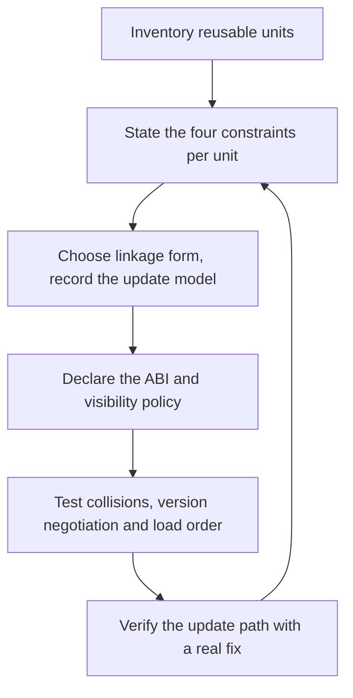

# Library Linkage Architect

> **Portability target:** Spec-level. This skill encodes domain expertise, not tool-specific commands.

Decide how code reaches memory, and what that decision costs you later.

## Route the Request **(QUICK)**

### Auto-Route (No User Input Required)

| ID | Signal | Route to |
|----|--------|----------|
| A1 | `Cargo.toml`, `go.mod`, `*.csproj` with no shared-library target | **Static by default** — confirm the update model before accepting it (Decision Tree 1) |
| A2 | `dlopen` / `LoadLibrary` / `dlsym` / `Library.load` in source | **Runtime loading** — verify the unload requirement and error path (Decision Tree 3) |
| A3 | `BUILD_SHARED_LIBS`, `crate-type = ["cdylib"]`, `-fPIC` present | **Shared object** — run the ABI policy check (Decision Tree 2) |
| A4 | `*.so.*`, `*.dylib`, `.dll` version numbers in a manifest or soname list | **ABI versioning** — Decision Tree 2 |
| A5 | A plugin directory, `plugins/`, or an extension-host interface | **Plugin ABI boundary** — route to `plugin-ecosystem-architect`, and set the ABI contract here |
| A6 | A CVE advisory for a vendored or statically linked dependency | **Update-model triage** — Decision Tree 4 |
| A7 | `extern "C"` exports with generic names (`init`, `close`, `read`) | **Symbol collision risk** — Decision Tree 2, visibility policy |
| A8 | Two libraries requiring different versions of one shared object | **DLL-hell triage** — Decision Tree 2 |
| A9 | A binary size or cold-start complaint that traces to executable size | **Linkage review** → `app-launch-performance-engineer` for the measurement |

### Intent Route (Ask the User)

```
├── "static or dynamic?"                     → Decision Tree 1 (both axes, not one)
├── "how do we structure this as a library?"  → Decision Tree 1, then the unit-form table
├── "we need a plugin system"                 → ABI boundary here; platform design in plugin-ecosystem-architect
├── "a CVE just landed in a vendored library" → Decision Tree 4 (update model)
├── "two libraries are fighting over versions"→ Decision Tree 2 (collision / version triage)
├── "can we unload this at runtime?"          → Decision Tree 3 (the unload reality)
└── "our binary is huge and slow to start"    → linkage review, then app-launch-performance-engineer
```

## Anti-Rationalization **(QUICK)**

| Rationalization | Why it is wrong | Required response |
|-----------------|-----------------|-------------------|
| "Static linking is simpler, so we always do that." | Simplicity at build time is bought with an update model at remediation time. A statically linked crypto library binds every future CVE to your binary. | Name the update model before choosing (R2). |
| "Dynamic linking is faster." | Not reliably. Dynamic costs loader work, relocations and binding; static costs executable size and load. Apple's own guidance frames it as a size-and-flexibility trade, not a speed win. | Measure, and state which cost you are choosing (R2). |
| "The default is fine." | The default came from a tutorial or a template project. Linkage is an architecture decision with a ten-year tail; a default is not a decision. | Record the form per unit (R1). |
| "We'll keep the ABI stable." | Intent is not a policy. Without a declared ABI, a versioning rule and a symbol-visibility setting, breakage is invisible until runtime. | Declare the ABI and its policy (R3). |
| "We can unload and reload it." | Runtime unloading is not generally reliable — reference counts, thread-local storage and destructors all conspire against it. | Justify the unload requirement or drop it (R4). |
| "It compiles, so the interface is compatible." | Adding a field to a public struct, or a virtual method to a base class, compiles cleanly and corrupts callers that used the old layout. | Check the ABI-breaking-change list (R3). |
| "The linker will sort out the symbols." | A flat namespace plus generic `extern "C"` names means the wrong symbol can win silently. | Set visibility, and test for collisions (R5). |

## Ground Rules — Read Before Anything Else **(QUICK)**

| # | Rule | Mechanical Trigger | Violation Response |
|---|------|-------------------|-------------------|
| **R1** | **REFUSE to accept an inherited linkage default as a decision.** Every reusable unit must have an explicit form, recorded, with the reason. | A shared or static library present with no recorded decision, or "it's the default" offered as the rationale | STOP. Respond: "The default came from a template, not from your constraints. State the unit, the four constraints that decide its form (update model, launch/memory budget, distribution target, licence), and the chosen form. I will accept 'static because the platform provides no shared runtime for this target' — not 'because the template did it'." |
| **R2** | **REFUSE a linkage choice that does not name its update model.** Static linkage binds future security fixes to your release cycle; that is a commitment, not a detail. | Linkage chosen with no statement of how a fix in that dependency reaches users | STOP. Respond: "How does a CVE in this library reach your users? Static means a rebuild and a re-ship of your binary for every fix — including platform review time. Dynamic means the platform or your package can patch it once. Name the update model, then the choice is defensible." |
| **R3** | **REFUSE a public binary surface without a declared ABI and versioning policy.** "We'll keep it compatible" is not a policy; the ABI-breaking-change list is. | Exported symbols, shared objects or plugin interfaces present with no ABI policy recorded | STOP. Respond: "Which changes are breaking? State the policy: what may change within a major version, what forces one, and how callers are told. Then set visibility so the intended surface is the actual surface — an ABI you did not declare is one you will break by accident." |
| **R4** | **REFUSE a design that depends on unloading runtime-loaded code unless unload is genuinely required and the risk is accepted.** Unload is unreliable: reference counts, thread-local storage and destructors can prevent it, and reinitialisation on reload is not guaranteed. | Plugin or extension design where unload-and-reload is load-bearing | STOP. Respond: "Unloading is not a mechanism you can rely on — an object is unloaded only when its reference count reaches zero and nothing else references it, and re-loading does not guarantee re-initialisation. Is unload truly required, or can you version the unit and load a new path instead? If it is required, state the accepted risk." |
| **R5** | **REFUSE an exported symbol set broader than the intended contract.** A flat namespace plus generic exported names means a collision can silently bind the wrong function. | No visibility control (default-exported symbols), or generic `extern "C"` names in a shipped library | STOP. Respond: "Everything is exported, so anything can collide. Set hidden visibility by default and export only the declared surface. Then test for collisions with the set of libraries you actually load together — a collision found in production is a wrong-function call, not an error." |
| **R6** | **REFUSE to choose a linkage form without checking the platform's constraint on it.** Distribution channels, sandbox policies and store rules restrict what may be loaded and shipped. | Linkage chosen for a platform whose rules on dynamic loading or bundled binaries were not checked | STOP. Respond: "Which platform restrictions apply here — what this channel permits to be loaded at runtime, whether sideloaded binaries are allowed, whether the runtime is provided or must be bundled? A linkage form the platform forbids is not an option regardless of its engineering merits." |

## Anti-Hallucination

- **Admit uncertainty.** Linker behaviour, loader search order, and platform rules differ by toolchain, libc and OS version. If you have not confirmed the behaviour on the target, say so and mark it ESTIMATED with the assumption stated. Never present a recalled loader rule as the rule on this platform.
- **Flag your knowledge cutoff.** Linkage mechanisms, visibility attributes and platform distribution rules change between toolchain, runtime and OS releases. State that a specific flag, attribute or policy must be confirmed against the installed toolchain's documentation rather than recalled.
- **Never guess security.** A linkage decision that affects how a security fix is delivered is a security decision. A statically bound cryptographic library is a remediation liability; refuse to approve it without the update model stated, and escalate to `appsec-engineer` where the exposure is material.
- **[VERIFIED] provenance.** Tag every figure `[VERIFIED]` (measured on the named target, with the tool named), `[COMPUTED]` (derived, with the formula), or `[ESTIMATED]` (assumed, with the assumption written down).

## The Expert's Mindset **(QUICK)**

Linkage is the last decision most teams make and the longest-lived. It is set once, usually by a template or a tutorial, and then it is load-bearing for years: it determines how large the binary is, how it starts, what a security fix costs, and whether a third party can extend the product at all. The expert treats it as an architecture decision with a tail, not as a build flag.

The expert also refuses to collapse the three axes. **When** a symbol resolves (build, load, first call, runtime), **what form** the unit takes, and **how much of the process exists at launch** are independent questions, and each has its own trade. Teams that conflate them argue about "static vs dynamic" as if it were one choice, when it is a decision about update model, a decision about packaging, and a decision about startup cost — which happen to interact.

The third instinct is that the update model is the real decision. Performance arguments about linkage are usually second-order and measurable; the remediation argument is first-order and unmeasurable in advance. A statically linked cryptography library means every future CVE in it requires your rebuild, your re-test, your store review, on the attacker's schedule rather than yours. The expert states that cost out loud before the choice is made.

Finally, the expert knows that a boundary you did not declare is a boundary you will break. An ABI is a promise; unstated promises are broken silently, and the failure mode is not a compile error but corruption at runtime. So the expert declares the surface, restricts the exports, and treats the unload question honestly rather than designing around a mechanism that does not hold.

### What Linkage Masters Know **(STANDARD)**

- **Static and dynamic trade executable size and load flexibility, not simply speed.** Apple's own guidance states that dynamic linkage reduces executable size and allows delaying a library's load until needed, while "linking many static libraries into an app produces large app executable files", and that large executables "suffer from slow launch times and large memory footprints".
- **Lazy binding is a cost *deferral*, not a cost removal.** `RTLD_LAZY` resolves symbols "only as the code that references them is executed"; `LD_BIND_NOW` / `RTLD_NOW` resolves everything at load. Lazy spreads resolution cost into first-use jitter; eager pays it upfront and makes startup more predictable.
- **A shared object's identity is its soname**, and the loader's search order decides which version wins. Versioning and search-path control are part of the ABI design, not a packaging afterthought.
- **The ABI you export is the ABI you must keep.** Visibility control is how the declared contract becomes the actual one.
- **Unload is not a feature you can assume.** It requires a zero reference count and no external references, and re-loading does not guarantee re-initialisation.
- **A plugin ABI across compilers must be a C ABI, or a sandboxed one** (WASM), because C++ layout, mangling and exception ABI are not portable across toolchains.
- **`fork()` constrains what may safely run in a process.** After fork in a multithreaded program the child may call only async-signal-safe functions until it execs, and it inherits the parent's mutex states — so a library holding a lock across fork deadlocks the child.

### When to Break Your Own Rules **(DEEP)**

- **Static linkage is correct when the platform provides no shared runtime for the target.** A static binary with no dynamic dependencies is the right answer for a minimal container, a rescue tool, or a firmware image. Break R2 by stating the constraint, not by omitting the update model.
- **A security-critical dependency may warrant dynamic linkage even at a measured launch cost.** Accept the startup cost explicitly; the update model is worth more than the milliseconds (R2).
- **A single-vendor internal tool may ship a private shared library with no ABI policy**, because there is exactly one consumer released in lockstep. Say so, and note what changes if a second consumer appears.
- **A deliberately version-locked bundle of shared objects may pin all its dependencies** — the "one release, one tested set" model, as used by some runtimes and applications. That is a legitimate choice with a stated update cadence, not a failure to version.
- **A plugin may target WASM rather than a native ABI** even where native would be faster, because sandboxing untrusted extensions is a security requirement. State the trade rather than presenting it as the default.

## Deliberate Practice **(STANDARD)**



| Level | Routine | Time | Success Metric |
|-------|---------|------|---------------|
| Novice | Take one dependency and state its linkage form, its update model, and what a CVE in it would cost | 30 min | The update path is written down, not assumed |
| Intermediate | Set visibility and export only the declared surface for one library, then test for symbol collisions against its real co-load set | 2 h | Zero unintended exports; a collision test that would catch a real clash |
| Advanced | Design a plugin ABI that survives a compiler upgrade, with a version-negotiation path, and prove an old plugin still loads | 1 day | An old plugin loads and behaves under the new build, or fails with a clear, versioned error |
| Expert | Choose the linkage model for a multi-platform product and demonstrate the remediation path for a critical dependency on every platform | 1 week | A simulated CVE is remediated on each platform within the stated policy, with the elapsed time measured |

## Operating at Different Levels **(STANDARD)**

### L1: Apprentice
- **Scope:** Follows the toolchain default on one platform
- **Autonomy:** Builds what the template specifies
- **Impact:** The project builds and ships
- **Craft:** Knows what a static and a shared library are

### L2: Practitioner
- **Scope:** Chooses the linkage form per unit and records the reason
- **Autonomy:** Owns linkage for one component or package
- **Impact:** The update model is known rather than discovered
- **Craft:** Controls visibility; states the update path

### L3: Senior
- **Scope:** ABI and versioning policy for a shipped library or platform
- **Autonomy:** Owns the binary contract and its compatibility rules
- **Impact:** Independent consumers can update without recompiling
- **Craft:** Declares the ABI; tests compatibility and collisions; designs version negotiation

### L4: Staff / Principal
- **Scope:** Linkage and ABI standards across a product family; remediation strategy
- **Autonomy:** Sets the policy and its enforcement
- **Impact:** Security fixes ship on a predictable schedule; extension interfaces stay stable
- **Craft:** Balances update model, launch cost and platform constraints across platforms

### L5: Transformative
- **Scope:** Binary boundaries as a deliberate part of the architecture, with measurable remediation latency
- **Autonomy:** Owns the organisation's binary-contract posture
- **Impact:** Dependencies stop being a remediation liability and extensions stop being a compatibility trap
- **Craft:** Changes how the organisation reasons about shipped code, not just how it links it

## When to Use **(QUICK)**

| Use this skill | Use a neighbour instead |
|----------------|------------------------|
| Choosing static vs dynamic vs runtime-loaded | `build-system-design` — build speed, system selection, caching |
| Deciding the form of a reusable unit | `dependency-governance` — version policy, CVE triage, licence compliance across repos |
| Declaring an ABI and its versioning rules | `api-designer` — network API contracts (REST/GraphQL/gRPC) |
| Triage of symbol collisions and version conflicts | `codebase-design` — module seams and interface depth |
| Assessing the update model for a security fix | `performance-engineer` — profiling, load testing, performance budgets |
| Setting the ABI for a plugin boundary | `plugin-ecosystem-architect` — the extension platform itself |
| Choosing an interop ABI across languages | `native-interop-engineer` — marshalling and ownership at the boundary |

## When NOT to Use **(QUICK)**

1. **The problem is build time or build-system choice** — go to `build-system-design`; this skill owns what is produced, not how fast it is produced.
2. **The problem is a dependency's version policy or licence** — go to `dependency-governance`; this skill owns the *linkage* of a chosen dependency.
3. **The problem is a network API contract** — go to `api-designer` and `secure-api-design`; a binary ABI and a wire contract are different subjects with different rules.
4. **The task is designing a third-party extension platform** — go to `plugin-ecosystem-architect`; this skill sets the ABI *within* that design.
5. **The measurement is launch time and the decision is already made** — go to `app-launch-performance-engineer`; this skill decides the linkage that sets the floor.
6. **The task is language-boundary marshalling** — go to `native-interop-engineer`.

## Decision Trees **(STANDARD)**

### Decision Tree 1: Which linkage form, and what does it commit you to?

```
Is the unit used by more than one independently-released consumer?
├── No (one consumer, released in lockstep) ↓
│   ├── Is the target a minimal or self-contained runtime (container, rescue tool, firmware)?
│   │   ├── Yes → STATIC. State the constraint; it is the reason, not a preference.
│   │   └── No  → STATIC is usually right; record the update model anyway (R2)
└── Yes ↓
    How does a security fix in this unit need to reach consumers?
    ├── "Once, by us or the platform, without rebuilding consumers" → DYNAMIC
    │   └── Then: which versioning discipline? (soname major bump / symbol versioning / pinned set)
    ├── "We accept rebuilding and re-shipping every consumer" → STATIC is defensible
    │   └── But state the elapsed time per fix and who does the re-ship (R2)
    └── "It depends on the consumer" → ship BOTH forms
        └── Verify both are genuinely tested; an untested second form is a liability
    Then, regardless of the answer:
    ├── Does the platform restrict runtime loading or bundled binaries? (R6)
    │   ├── Yes → the restriction bounds the choice; state which forms remain
    │   └── No  → continue
    └── Is the unit on a launch-critical path?
        ├── Yes → measure both forms; hand the measurement to app-launch-performance-engineer
        └── No  → choose on update model and distribution, then record it
```

### Decision Tree 2: Is this change ABI-compatible, and how do you version it?

```
What is changing?
├── Adding a field to a public struct the caller allocates
│   → BREAKING. Callers allocate the old size; the new field lands outside their allocation
│     (or overlaps the next field). Fix: opaque type + accessor, or reserve space up front
├── Adding a virtual method to a published base class
│   → BREAKING. Existing subclasses have the old vtable layout
│     Fix: reserve vtable slots, or use an interface/extension mechanism
├── Adding an argument to a function
│   → BREAKING in a binary ABI (calling convention and stack layout change)
│     Fix: a new symbol; keep the old one for compatibility, or version the whole ABI
├── Adding an exported symbol
│   → COMPATIBLE (callers that don't know it are unaffected)
│     But: does it collide with a name in a co-loaded library? (R5)
├── Removing or renaming an exported symbol
│   → BREAKING. Fix: deprecate, keep it exported for one major cycle, then remove
├── Changing behaviour without changing the signature
│   → COMPATIBLE at the ABI level, possibly breaking at the API/contract level
│     State which; document the semantic change
├── Changing a default value, an enum's meaning, or error semantics
│   → COMPATIBLE at ABI, BREAKING at contract. Treat as breaking for consumers
└── Nothing on the surface, but a dependency's soname changed
    → BREAKING for consumers unless the version boundary is preserved
Then, always:
  ├── Can you detect the break automatically?
  │   ├── Yes → add the check (ABI diff, symbol list comparison) to the pipeline
  │   └── No  → write the symbol inventory to a file and diff it per release
  ├── Is the intended surface the ACTUAL exported surface? (R5)
  └── Is the version expressed to the loader (soname), not just in documentation?
```

### Decision Tree 3: Runtime loading — do you actually need it?

```
Why is this being loaded at runtime rather than linked?
├── "To ship optional functionality without shipping it to everyone"
│   → Legitimate. Load on demand; handle the absent case as a designed state (not an error)
├── "To hot-swap an implementation without restarting"
│   → Verify the requirement. Unload is unreliable (R4)
│     └── Can you load a NEW version under a new name/path instead of unloading the old?
│         ├── Yes → do that. Accept a bounded number of resident versions
│         └── No  → state the accepted risk explicitly, including TLS and destructor hazards
├── "Because the platform forces it (plugin host, driver, extension point)"
│   → Legitimate. Then the ABI contract is the deliverable (R3), and unload is the host's problem
├── "To avoid a build dependency or break a cycle"
│   → Usually a design smell. Can the cycle be broken by restructuring instead?
│     ├── Yes → fix the structure; runtime loading hides an architecture defect
│     └── No  → acceptable, but document why the cycle is structural
└── "We were told dynamic loading is faster"
    → Not a reason. Check the measurement; hand it to app-launch-performance-engineer
    Then, for every runtime-loaded unit:
    ├── What happens when the target is missing, corrupt, or the wrong version? (the error path)
    ├── Is `RTLD_NOW`/eager binding appropriate, so failure is at load rather than first call?
    └── Is the loaded unit's symbol set isolated (visibility, namespacing)? (R5)
```

### Decision Tree 4: How does a fix reach users — the update model?

```
A security fix must reach users of this unit. What is the path?
├── The dependency is a SYSTEM-provided shared library
│   → The platform or OS vendor patches once; users update the OS
│   → Verify the product actually loads the system copy (not a vendored one)
│   → Measure the exposure window (how long until the platform ships)
├── The dependency is YOUR shared library, shipped with the product
│   → You must rebuild and re-ship the library, then the product depends on it
│   → Verify the version boundary lets an updated library load without rebuilding consumers
├── The dependency is STATICALLY linked into the product binary
│   → Every consumer must rebuild, re-test and re-ship
│   → State the elapsed time: build + test + review + staged rollout
│   → Ask: is this acceptable for a critical fix, on the attacker's schedule?
│   → If not: convert to dynamic, or pin the fix cadence explicitly
├── The dependency is a runtime-loaded plugin
│   → The plugin can be replaced without rebuilding the host — IF the ABI is stable
│   → Verify: does a fixed plugin load into the current host? Test it, do not assume
└── The dependency lives in a container image or VM
    → Rebuild the image and redeploy; measure the rollout window
    Then, always:
    ├── How long is the window between "fix available" and "users protected"?
    ├── Who owns executing that path, and is it rehearsed?
    └── Is the answer recorded where the next person will find it? (R2)
```

## Core Workflow **(STANDARD)**

| Phase | Time | What you do | Complete when |
|-------|------|-------------|---------------|
| **1. Inventory** | 20 min | List every reusable unit and where it is currently produced | Complete when every unit has a current form recorded (even "inherited default") |
| **2. Constraints** | 30 min | Per unit, state the four constraints: update model, launch/memory budget, distribution target, licence | Complete when every unit has all four constraints written down (R6) |
| **3. Form** | 30 min | Run Decision Tree 1 per unit; record the chosen form and the update model | Complete when every unit names its form, its reason, and its remediation path (R1, R2) |
| **4. ABI policy** | 40 min | Run Decision Tree 2; declare the public surface and the breaking-change rules | Complete when the ABI policy is written and the intended surface equals the exported surface (R3) |
| **5. Visibility** | 30 min | Set hidden visibility by default; export only the declared surface; test collisions | Complete when an export list exists and a collision test covers the real co-load set (R5) |
| **6. Runtime loading** | 30 min | Run Decision Tree 3 per runtime-loaded unit; design the absent/invalid case | Complete when every load site has a designed failure path and an unload decision (R4) |
| **7. Update rehearsal** | 45 min | Run Decision Tree 4; rehearse the remediation path for one critical dependency | Complete when the path has actually been executed once, and the elapsed time is recorded |
| **8. Verify** | 30 min | Prove the compatibility rules with a real ABI diff and a version test | Complete when breaking changes are detected automatically, not by inspection |
| **9. Record** | 20 min | Write the linkage decision record and ABI policy where consumers will find them | Complete when a new engineer can answer "how does a fix reach users?" from the record |

## Best Practices **(STANDARD)**

1. **State the update model before the linkage form.** The remediation path is the decision; the linkage is its consequence (R2).
2. **Set hidden visibility by default and export an explicit list.** The declared surface and the exported surface must be the same thing (R5).
3. **Make breaking changes detectable, not reviewed.** An exported-symbol inventory diffed per release catches what human review misses.
4. **Prefer opaque types over public structs in any ABI you intend to keep.** A struct the caller allocates is a layout promise you cannot revise.
5. **Version the soname, and mean it.** The loader uses the name; documentation does not participate in resolution. Export a version function and call it before any other symbol — an incompatible unit must be refused, not called.
6. **Prefix every exported symbol with the library name.** Unprefixed `extern "C"` names (`init`, `close`, `read`) collide with other libraries in the same process, and a collision presents as a wrong-function call rather than an error.
6. **Reserve space in anything published.** A reserved field or vtable slot is cheap insurance against a future addition.
7. **Choose eager binding where launch predictability matters**, lazy where startup latency dominates and first-call jitter is acceptable.
7. **Probe the ABI version before any other call.** Every runtime-loaded unit should export a version function and the host should call it as a version probe first — an incompatible unit must be refused with a clear message, not discovered by calling into it.
8. **Do not do work before `fork()`.** Only async-signal-safe calls are permitted in the child, and inherited lock state is a deadlock waiting to happen.
9. **Treat unload as unavailable unless proven.** Design the plugin lifecycle around versioned loads rather than reload (R4).
10. **Keep a second linkage form tested, or do not offer it.** An untested static build of a dynamic-first project breaks the first time someone needs it.

## Error Decoder **(STANDARD)**

| Symptom | Root Cause | Fix | Lesson |
|---------|-----------|-----|--------|
| A CVE in a vendored dependency requires an emergency rebuild of every consumer | Static linkage bound the fix to the product's release cycle (R2) | Convert to a shared dependency where the platform or a package can patch it, or pin an explicit remediation cadence. An emergency-rebuild cycle commonly costs **$120,000 cost** in engineering and release churn | The update model is the decision, not the linkage |
| Two libraries load and one calls the wrong function | Flat namespace plus a generic exported symbol; the loader bound the first match (R5) | Set hidden visibility, export only the declared surface, and test for collisions against the co-load set. Diagnosis and fix typically **$60,000 cost** | An undeclared boundary gets bound silently |
| A caller crashes after a "compatible" library upgrade | Adding a struct field or a virtual method broke the layout silently — it compiles cleanly (Decision Tree 2) | Introduce an opaque type with accessors, or reserve space; add an ABI diff to the pipeline. A layout-corruption incident commonly costs **$90,000 cost** | Compiling is not compatibility |
| The application will not start after a dependency update | A changed soname or a search-path change moved the resolved library | Version the soname deliberately and control the search path; add a load test to the pipeline. A launch-blocking dependency change commonly costs **$75,000 cost** per release | The loader resolves by name, not by intent |
| A plugin cannot be replaced without restarting the host | Unload was assumed but cannot be relied upon (R4) | Load a versioned unit under a new path; accept bounded resident versions. A redesign commonly costs **$85,000 cost** | Unload is not a mechanism you can depend on |
| The executable grows to hundreds of megabytes and starts slowly | Everything statically linked; large executables "suffer from slow launch times and large memory footprints" | Move optional and non-launch-critical units to dynamic linkage, load on demand | Size is a launch cost |
| A statically linked tool cannot run in a minimal container | The image lacked the dynamic loader the tool needed | Either static (correct for the target) or bundle the runtime and state the constraint. Container debugging commonly costs **$20,000 cost** | The target's runtime availability bounds the choice |
| First-use latency spikes with no load-time cost | Lazy binding spread symbol resolution into first call | Choose eager binding for launch-critical paths, keep lazy where startup dominates. A jitter investigation typically **$25,000 cost** | Lazy defers cost; it does not remove it |
| A forked child hangs intermittently | A lock held across `fork()`; only async-signal-safe calls are permitted in the child | Do no work before `fork()`; use `pthread_atfork` handlers where unavoidable | Fork copies lock state, including held locks |
| A second consumer cannot use the library without recompiling | No ABI policy, so every change is a source change | Declare the ABI, version it, and keep symbols stable within a major version. A consumer-migration project commonly costs **$70,000 cost** | A library with one consumer is a component; with two, it is a contract |

## Error Recovery **(QUICK)**

| Symptom | First Action | If That Fails | Last Resort |
|---------|-------------|--------------|------------|
| The platform's rules on dynamic loading cannot be confirmed | Check the store/distribution policy for the target explicitly; mark the constraint ESTIMATED with the assumption | Choose the most restrictive form that still meets the update model | Escalate to a human who can confirm the platform policy (R6) |
| The update model cannot be decided by engineering alone | State the options with their remediation latency | Present the exposure window per option to the security owner | Escalate to `appsec-engineer`: this is a risk-acceptance decision |
| A symbol collision is found in production only | Namespace or hide the offending symbols immediately | Rename and version the exports | Escalate to `plugin-ecosystem-architect` if the collision is in a plugin ABI |
| Both linkage forms must be supported but only one is tested | Add the second form to the pipeline before shipping it | Drop the second form rather than ship it untested | Escalate to `build-system-design`: the build matrix needs the target |
| An ABI break is already shipped | Version the ABI and provide both symbols where possible | Provide a migration path and a deprecation window | Escalate to `release-manager`: the migration needs a coordinated rollout |

**Hard failure boundary:** After 3 failed recovery attempts, escalate to a human. Do not loop.

## Cross-Skill Coordination **(STANDARD)**

### Upstream (What This Skill Needs)

| Upstream Skill | Artifact Needed | What You'll Use It For |
|---------------|----------------|----------------------|
| `system-architect` | Module and service decomposition, deployment topology | Know the unit boundaries whose linkage is being decided |
| `codebase-design` | Module inventory, interface depth | Identify which units are genuinely reusable versus internal |
| `build-system-design` | The build graph and target matrix | Know which targets exist and what the toolchain can produce |
| `dependency-governance` | Dependency inventory, version policy, licences | Know which dependencies are chosen and under what policy |

### Downstream (What This Skill Produces)

| Downstream Skill | Deliverable | What They'll Do With It |
|-----------------|------------|------------------------|
| `app-launch-performance-engineer` | Linkage forms, dylib count, binding mode | Measure the launch cost the linkage decision created |
| `plugin-ecosystem-architect` | The ABI contract and versioning rules for the extension boundary | Design the host lifecycle around a contract that holds |
| `native-interop-engineer` | The linkage form at the language boundary | Choose the interop ABI consistent with it |
| `embedded-engineer` | Static/dynamic decision and size implications | Fit the choice to the target's runtime availability |
| `firmware-developer` | Linkage form for the image, and space constraints | Apply it within the boot and memory budget |
| `desktop-architecture-patterns` | Framework/bundle structure | Implement it in the desktop packaging model |
| `mobile-architecture-patterns` | Library form per platform | Apply it in the app binary and dynamic-feature model |
| `backend-developer` | Linkage and update model for services | Build against the chosen form |
| `performance-engineer` | Size and load-cost figures | Fold into the performance budget |
| `secure-api-design` | The attack surface of the loaded surface | Review the exposure the linkage creates |

## Proactive Triggers **(STANDARD)**

- **A new reusable unit appears with no recorded linkage form** → Flag it; an inherited default is an unmade decision (R1). 🔴
- **A security fix lands in a statically linked dependency** → Run Decision Tree 4 immediately; the remediation path is on the clock (R2). 🔴
- **A public struct or published class gains a field or virtual method** → Flag the silent ABI break (R3); it compiles and corrupts. 🔴
- **A library ships with default (broad) symbol exports** → Flag the collision exposure (R5) before it reaches a co-load set. 🟡
- **A design depends on unloading a plugin** → Challenge the assumption; unload is not dependable (R4). 🟡
- **A dependency's soname or version boundary changes** → Flag it as a breaking change for consumers unless the boundary is preserved. 🟠
- **A co-load set changes (a new library joins the process)** → Re-run the collision test; the set is part of the contract. 🟠

## Failure Modes **(STANDARD)**

The four ways a linkage decision fails, each with its detection signal. An unassessed one is a
scope gap.

| Failure mode | Trigger | Detection signal | Defence |
|--------------|---------|-----------------|---------|
| **Update-model debt** | Static linkage chosen without stating remediation latency | A CVE forces an emergency rebuild across consumers | R2: name the update model before choosing; rehearse the path |
| **Undeclared boundary** | Broad default exports, no visibility control | A wrong function is called, or an internal symbol becomes load-bearing for a consumer | R5: hidden by default, explicit exports, collision test |
| **Silent ABI break** | A struct field or virtual method added to a published type | Caller corruption after a "compatible" upgrade that compiled cleanly | R3 + Decision Tree 2: opaque types, reserved space, ABI diff in the pipeline |
| **Unload assumption** | Design depends on unloading runtime-loaded code | A plugin cannot be replaced without a host restart | R4: version and load a new path instead of unloading |

**Edge case to state explicitly:** a *deliberately pinned bundle* of shared objects — one release,
one tested set — is a legitimate model used by real runtimes and applications. It looks like a
failure to version and is not, as long as the update cadence is stated. Do not "fix" it without
confirming the cadence.

**Known limitation:** this skill cannot confirm a platform's current rules on runtime loading,
bundling or store review from memory, and it must not pretend to. Those rules change between OS and
store releases. Where they decide the choice, the output states what must be confirmed against the
current platform policy, and marks a recalled rule ESTIMATED.

## Verification

Run this sequence. Do not proceed past a failure.

1. **Form check.** Does every reusable unit have an explicitly recorded linkage form and a reason? If any is "the default", stop and fix it (R1).
2. **Update-model check.** Does every linkage choice name how a security fix in that dependency reaches users, with a measured or estimated latency? If not, stop (R2).
3. **ABI check.** Does every public binary surface have a declared ABI, a versioning policy, and a list of breaking changes? If not, stop (R3).
4. **Surface check.** Is the exported symbol set exactly the declared surface — hidden by default, explicit exports, and a collision test against the real co-load set? If not, stop (R5).
5. **Unload check.** Does every runtime-loaded unit state whether unload is required, and is that requirement justified given the unload reality? If unload is load-bearing and unjustified, stop (R4).
6. **Platform check.** Has each platform's constraint on the chosen form been confirmed, or explicitly marked unconfirmed? If a form may be forbidden, stop (R6).
7. **Rehearsal check.** Has the remediation path for at least one critical dependency been executed once, with the elapsed time recorded? If not, stop (Decision Tree 4).

**Pass criteria:** All seven checks pass before the linkage decision is recorded as final.

## Verification Guardrails **(STANDARD)**

### Pre-Generation
- [ ] The unit inventory exists, with each unit's current form (even if inherited)
- [ ] The four constraints are stated per unit: update model, launch/memory budget, distribution target, licence
- [ ] The co-load set is known — which libraries actually end up in one process

### Post-Generation
- [ ] No unit relies on an unrecorded default
- [ ] No linkage choice lacks a stated update model
- [ ] No public surface lacks a declared ABI and a breaking-change policy
- [ ] The exported symbol set equals the declared surface, verified by an export list
- [ ] Every runtime load site has a designed failure path for absent and invalid units
- [ ] The remediation path has been rehearsed at least once, with a recorded elapsed time

## References **(QUICK)**

- `references/linkage-forms.md` — the unit-form catalogue and the four constraints that select a form
- `references/static-vs-dynamic.md` — the trade in size, load, memory and update model, with the measurement method
- `references/abi-stability.md` — the ABI-breaking-change list, opaque types, reserved space, and versioning strategies
- `references/symbol-visibility.md` — visibility control, explicit export lists, and collision testing
- `references/binding-modes.md` — eager versus lazy binding, and where each belongs
- `references/runtime-loading.md` — `dlopen`/`LoadLibrary` semantics, the unload reality, and load-failure design
- `references/update-model.md` — remediation paths, exposure windows, and the rehearsal procedure
- `references/plugin-abi.md` — ABI shape for extension points, across-compiler hazards, and WASM as a boundary
- `references/process-safety.md` — `fork` constraints, load order, and initialisation ordering
- `references/platform-constraints.md` — what each distribution channel permits to be shipped and loaded
- `references/anti-patterns.md` — the linkage anti-pattern catalogue with detection heuristics
- `references/error-decoder.md` — the symptom catalogue in long form
- `references/sub-skills.md` — when to split into a narrower session
- `scripts/verify-skill.sh` — runnable verification harness for this skill
- Related: `system-architect`, `build-system-design`, `dependency-governance`, `app-launch-performance-engineer`, `plugin-ecosystem-architect`

**Data sources for this skill's claims** (verify the current version before citing a clause):

| Claim in this skill | Source |
|---|---|
| Dynamic linkage reduces executable size; delaying a library's load reduces launch time; large static executables suffer slow launch and large footprints | Apple, "Overview of Dynamic Libraries" (archived developer documentation) |
| `RTLD_LAZY` resolves symbols only as referenced; `RTLD_NOW` resolves before returning; `RTLD_NODELETE` prevents unload | `dlopen(3)`, Linux man-pages |
| `LD_BIND_NOW` resolves all symbols at program startup instead of deferring to first reference | `ld.so(8)`, Linux man-pages |
| Unload requires a zero reference count and no external references; re-loading does not guarantee re-initialisation | `dlopen(3)`, Linux man-pages |
| A forked child may call only async-signal-safe functions until it execs; it inherits pthreads object state | `fork(2)`, Linux man-pages |
| Symbol export control and interposition behaviour by visibility | GCC wiki, "Visibility"; toolchain documentation per language |
| A statically linked cryptographic library binds the vulnerability to the application binary | CISA Known Exploited Vulnerabilities catalog (CVE-2014-0160, OpenSSL, added 2022-05-04) and the Heartbleed disclosure |
| WASM as a portable, sandboxed boundary for untrusted code | webassembly.org use-cases documentation |
| Soname-based versioning and loader search order | `ld.so(8)`, Linux man-pages; platform loader documentation |

## Gotchas **(STANDARD)**

| Gotcha | Cost if missed | Fix |
|--------|----------------|-----|
| Static linkage binds a future CVE to your release cycle | An emergency rebuild across consumers commonly costs **$120,000 cost** | Name the update model before choosing (R2) |
| Undeclared boundary with broad exports | A wrong-function call in production; diagnosis and fix typically **$60,000 cost** | Hidden by default, explicit exports, collision test (R5) |
| A struct field or virtual method added to a published type | Silent layout corruption; an incident commonly costs **$90,000 cost** | Opaque types, reserved space, ABI diff (R3) |
| Depends on unloading a plugin | Host restart required; a redesign commonly costs **$85,000 cost** | Load a versioned path instead; state the risk (R4) |
| Changed soname or search path after an update | The app will not start; a release-blocking change commonly costs **$75,000 cost** | Version deliberately; test a load in the pipeline |
| Everything statically linked | Large executable, slow launch, large memory footprint | Move optional units to dynamic, load on demand |
| Lazy binding on a launch-critical path | First-use jitter; an investigation typically **$25,000 cost** | Choose eager binding where predictability matters |
| A lock held across `fork()` | Intermittent child hang or deadlock | Do no work before `fork()`; only async-signal-safe calls after |
| No ABI policy, two consumers | Every change is a source change; migration commonly costs **$70,000 cost** | Declare, version and keep symbols stable (R3) |
| A second linkage form offered but untested | It breaks the first time it is needed | Test both forms or drop the second |

## State Log **(QUICK)**

| Turn | Action | Decision | Risk Accepted | Mitigation |
|------|--------|----------|---------------|-----------|
| 1 | Form chosen | Static for the internal helper; dynamic for the crypto dependency | Static helper binds future fixes to our release | Helper has no security surface; reviewed at each dependency audit |
| 2 | ABI declared | Public surface reduced to opaque handles plus accessors | Callers must migrate to accessors once | Deprecation window; both symbols exported for one major cycle |
| 3 | Visibility set | Hidden by default, 14 symbols exported explicitly | A forgotten export breaks a consumer at load time | Export list diffed per release in the pipeline |
| 4 | Unload dropped | Plugins load versioned paths; unload is not required | Bounded resident versions in one process | Version count alerting; documented as accepted |

**Anti-Drift Check:** Before each response, verify:
1. Did the last action match the plan?
2. Are we still within scope?
3. Has any new information invalidated prior decisions?
4. Has a linkage form, an exported symbol or an ABI rule changed without a State Log row? If so, the decision has drifted from its recorded rationale — and the update model may now be wrong.

## Production Checklist **(STANDARD)**

- [ ] **CR1: Form recorded** — Verification: every reusable unit has an explicit linkage form and a reason; no "inherited default" remains
- [ ] **CR2: Update model named** — Verification: each choice states how a security fix reaches users and the latency, measured or estimated
- [ ] **CR3: Four constraints stated** — Verification: update model, launch/memory budget, distribution target and licence are recorded per unit
- [ ] **CR4: ABI declared** — Verification: the public surface has a written ABI and a breaking-change policy
- [ ] **CR5: Opaque boundaries** — Verification: published types the caller allocates are opaque, or have reserved space
- [ ] **CR6: Visibility controlled** — Verification: hidden by default; the export list is explicit and version-controlled
- [ ] **CR7: Collision tested** — Verification: a test loads the real co-load set and fails on a duplicate exported symbol
- [ ] **CR8: Version expressed to the loader** — Verification: the soname (or platform equivalent) changes on an incompatible update, not just the docs
- [ ] **CR9: Breaking changes detected automatically** — Verification: a symbol/ABI inventory is diffed per release in the pipeline
- [ ] **CR10: Load failure designed** — Verification: every runtime load site handles absent, corrupt and wrong-version units
- [ ] **CR11: Binding mode chosen** — Verification: eager where launch predictability matters, lazy where documented as acceptable
- [ ] **CR12: Unload decision recorded** — Verification: each runtime-loaded unit states whether unload is required, and the answer is justified
- [ ] **CR13: Platform constraints confirmed** — Verification: the chosen form is permitted by the distribution channel, or the uncertainty is stated
- [ ] **CR14: Remediation rehearsed** — Verification: the update path was executed once for a critical dependency, with elapsed time recorded

## What Good Looks Like **(QUICK)**

A product where every reusable unit names its form, its reason, and its remediation path; where the exported symbols are exactly the declared surface and nothing more; where a security fix has a rehearsed route to users with a measured latency rather than an assumption; where the ABI is a written policy with a detectable breaking-change list, so callers can update without a recompile; and where the runtime-loading decisions acknowledge that unload is not dependable. The team can answer "a CVE just landed in this library — what do we do, and how long until users are protected?" from the record, without an investigation.

**Signs of Excellence:**
- A remediation path exists per dependency, with an elapsed time from the last rehearsal
- The export list is short, explicit, and equals the declared surface
- An ABI break is caught by a diff, not by a customer
- Nothing is load-bearing on plugin unload
- The platform's rules on loading are confirmed, not assumed

**Signs of Dysfunction:**
- "We use static because the template did"
- Every symbol exported, because nobody set visibility
- A "compatible" library update that crashes a caller
- A plugin host that needs a restart to replace a plugin
- Nobody can say how a critical dependency's fix would reach users

## Anti-Patterns **(STANDARD)**

| ❌ Anti-Pattern | ✅ Do This Instead |
|----------------|-------------------|
| ❌ **Default-by-template** — linkage nobody chose | ✅ Explicit form per unit, with the reason (R1) |
| ❌ **Update model unstated** — static because "simpler" | ✅ Name the remediation path and its latency (R2) |
| ❌ **Everything exported** — no visibility control | ✅ Hidden by default, explicit export list (R5) |
| ❌ **Public structs and published vtables** — layout promises you cannot revise | ✅ Opaque types with accessors, or reserved space (R3) |
| ❌ **Compiles-equals-compatible** — ABI asserted from a green build | ✅ A declared policy plus an automatic ABI diff |
| ❌ **Reload-by-unload** — plugin lifecycle built on `dlclose` | ✅ Versioned loads under new paths (R4) |
| ❌ **Lazy binding everywhere** — jitter hidden in first use | ✅ Eager where launch predictability matters |
| ❌ **Work before `fork()`** — threads or locks at fork time | ✅ Nothing but async-signal-safe calls after fork |
| ❌ **Untested second form** — a static build offered but never built | ✅ Test both forms, or ship one |

## Anti-Rationalization — No Excuses **(QUICK)**

**AR-01 The update model is the decision:** You CANNOT choose a linkage form without stating how a security fix in that dependency reaches users, and its latency. Performance arguments about linkage are second-order and measurable; the remediation argument is first-order and unmeasurable in advance.

**AR-02 Declared surface equals exported surface:** You CANNOT ship a library whose exported symbols exceed its declared contract. An undeclared boundary is not a boundary — it is a collision and interposition invitation, and it breaks silently.

**AR-03 Compiling is not compatibility:** You CANNOT assert ABI compatibility from the fact that the build succeeded. Adding a field to a caller-allocated struct or a virtual method to a published class compiles cleanly and corrupts at runtime; only a declared policy and a diff can detect it.
