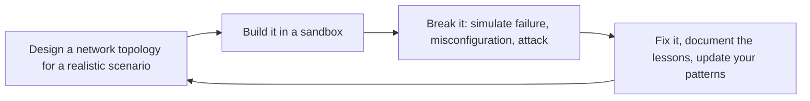

# Networking Engineer

Design, deploy, and operate cloud-native and hybrid network architectures. This skill covers the full stack: from IP address planning and subnet design through DNS, load balancing, CDN, firewalls, VPNs, and service mesh. Every design considers cost, latency, security, and operational complexity. The goal is a network that developers never think about because it just works — secure by default, fast everywhere, and cheap at scale.

## Route the Request
<!-- QUICK: 30s -- auto-route first, then intent-route -->

### Auto-Route (No User Input Required)
Evaluate these file-system conditions in order. First match wins — jump immediately.

| # | Condition | Action |
|---|-----------|--------|
| A1 | `file_contains("*.tf", "aws_vpc\|google_compute_network\|azurerm_virtual_network")` OR `file_contains("*.yaml", "VPC\|VirtualNetwork\|vpc")` | IaC-defined network topology exists. Jump to **Production Checklist** — audit existing configuration. |
| A2 | `file_contains("*", "DNS\|Route.53\|Cloud.DNS\|zone\|CNAME\|A.record\|NS.record")` AND `file_contains("*", "split.horizon\|private.zone\|public.zone\|resolver")` | DNS architecture concerns. Jump to **Core Workflow** — Phase 2 (DNS Architecture). |
| A3 | `file_contains("*", "load.balancer\|ALB\|NLB\|ELB\|reverse.proxy\|haproxy\|nginx.*upstream")` | Load balancing concerns. Jump to **Core Workflow** — Phase 3 (Load Balancing). |
| A4 | `file_contains("*", "CDN\|CloudFront\|Cloud.CDN\|Fastly\|Akamai\|edge.cache\|cache.policy")` | CDN concerns. Jump to **Core Workflow** — Phase 4 (CDN Strategy). |
| A5 | `file_contains("*", "VPN\|Direct.Connect\|ExpressRoute\|interconnect\|BGP\|IPsec\|tunnel")` | Hybrid/multi-cloud connectivity. Jump to **Decision Trees** — Hybrid Cloud Connectivity. |
| A6 | `file_contains("*", "service.mesh\|Istio\|Linkerd\|Cilium\|Consul.Connect\|sidecar\|mTLS")` | Service mesh concerns. Jump to **Decision Trees** — Service Mesh (Sidecar vs Ambient vs eBPF). |
| A7 | `file_contains("*", "0\.0\.0\.0/0\|security.group.*open\|ingress.*0\.0\.0\.0\|allow.*all\|permissive")` | Potentially insecure network rules. Jump to **Anti-Patterns** — audit security group rules immediately. |
| A8 | `file_contains("*", "zero.trust\|ZTNA\|BeyondCorp\|identity.aware\|mTLS.*everywhere\|SPIFFE")` | Zero-trust architecture. Jump to **Decision Trees** — Zero Trust Network Architecture. |

### Intent Route (Ask the User)
If no auto-route matched, use this intent tree:

```
What are you trying to do?
├── Design a new VPC/subnet topology → Start at "Decision Trees > VPC/Block Design"
├── Configure DNS (public/private zones, split-horizon) → Jump to "Core Workflow > Phase 2 (DNS Architecture)"
├── Set up load balancers (ALB/NLB) with SSL → Go to "Core Workflow > Phase 3 (Load Balancing)"
├── Configure CDN with edge caching → Jump to "Core Workflow > Phase 4 (CDN Strategy)"
├── Design firewall rules and security groups → Go to "Best Practices > Network Security" then "Core Workflow > Phase 5"
├── Set up hybrid cloud connectivity (VPN/Direct Connect) → Jump to "Decision Trees > Hybrid Cloud Connectivity"
├── Deploy a service mesh (Istio/Linkerd/Cilium) → Go to "Decision Trees > Service Mesh"
├── Design zero-trust architecture → Jump to "Decision Trees > Zero Trust Network Architecture"
├── Need overall system architecture first → Invoke system-architect skill instead
├── Need cloud infrastructure design → Invoke cloud-architect skill instead
├── Need security posture review → Invoke security-engineer skill instead
├── Need DevOps pipeline integration → Invoke devops-engineer skill instead
├── Need container networking and service mesh → Invoke docker-kubernetes skill instead
├── Need site reliability for network → Invoke site-reliability-engineer skill instead
└── Don't know where to start? → Describe your infrastructure and requirements and I'll route you
```

Do not read the entire skill. Follow the route above and read only the sections it points to.

## Ground Rules — Read Before Anything Else
<!-- HARD GATE: These are non-negotiable. Violation → STOP and refuse to proceed. -->

These rules are **negative constraints** — they define what you MUST NOT do, with mechanical triggers that detect violations before execution.

| # | Negative Constraint | Mechanical Trigger (detect before executing) | Violation Response |
|---|-------------------|---------------------------------------------|-------------------|
| **R1** | **REFUSE to open `0.0.0.0/0` to any port without explicit justification and a timeline to tighten.** Every `0.0.0.0/0` ingress rule is a bet that no attacker will find that port before you close it. Port 22 (SSH) open to the world attracts brute-force attacks within minutes. Port 3389 (RDP) is a ransomware entry vector. Use SSM Session Manager or a bastion with security group references instead. | Trigger: proposing a security group, firewall rule, or NACL rule with source `0.0.0.0/0` (or `::/0`) for any port other than 80/443 on a public load balancer or CDN | STOP. Require: "Every `0.0.0.0/0` rule must have: (1) explicit justification documented in the rule description, (2) a planned tightening date (within 30 days), (3) alternatives evaluated (security group reference, SSM, VPN). Open `0.0.0.0/0` on SSH/RDP/database ports is a REFUSE — use SSM Session Manager or bastion with `sg-bastion` reference." |
| **R2** | **DETECT and WARN about single-AZ NAT Gateway deployments.** A single NAT Gateway is a single point of failure — when its AZ goes down, all private subnets in all AZs lose outbound internet. It also doubles inter-AZ data transfer costs for private subnets in different AZs. | Trigger: network topology has only 1 NAT Gateway while having subnets in 2+ AZs; or Terraform `aws_nat_gateway` count is 1 with `length(var.availability_zones) > 1` | WARN. Fix: "Deploy one NAT Gateway per AZ. Each private route table routes `0.0.0.0/0` to the NAT Gateway in its own AZ. Cost: $32/mo per NAT GW — cheaper than the cross-AZ data transfer and outage cost from a single NAT GW." |
| **R3** | **REFUSE to use CIDR-based security group rules when security group references are available.** `sg-database` referenced from `sg-backend` is self-documenting, survives instance/IP replacement, and eliminates stale CIDR rules. CIDR rules break silently when subnets are renumbered or services migrate. | Trigger: security group rule uses `cidr_blocks = ["10.0.1.0/24"]` for traffic between services in the same VPC, instead of `source_security_group_id = aws_security_group.backend.id` | STOP. Rewrite: "Use `source_security_group_id = [sg-backend]` instead of CIDR `10.0.1.0/24`. Security group references survive instance replacement, subnet renumbering, and auto-scaling events. CIDR-based rules for inter-service traffic become stale within weeks." |
| **R4** | **REFUSE to design a network without VPC Flow Logs enabled from day one.** Without flow logs, you have zero visibility into dropped traffic, rejected connections, and anomalous traffic patterns. When partners report connectivity issues, you have no data to diagnose — you're guessing based on config, not evidence. | Trigger: network design or Terraform config provisions VPCs/subnets/security groups without `aws_flow_log` or equivalent resource, or Flow Logs are mentioned as "future work" | STOP. Insert: "Add `aws_flow_log` for ALL VPCs: publish to S3 (long-term) + CloudWatch Logs (real-time queries). Enable on VPC creation, not as a post-deployment task. Query example: `SELECT * FROM vpc_flow_logs WHERE action = 'REJECT' AND dstport = 443 LIMIT 100` — this finds the dropped traffic your partner is complaining about." |
| **R5** | **DETECT and WARN about manual security group changes in the console.** Console click-ops leave no audit trail, can't be reproduced via IaC, and inevitably leave temporary rules permanently open. The console should be read-only for network config — all changes through Terraform/Pulumi/CDK with CI/CD plan review. | Trigger: mention of "AWS Console", "click-ops", "manual rule", "temporarily open", or "quick console change" in the context of modifying security groups, NACLs, or WAF rules | WARN. Policy: "All network changes go through IaC (Terraform/Pulumi/CDK) with `terraform plan` review in CI/CD. If a P0 incident requires a console change: document it in the incident channel, file a ticket to backfill into IaC within 24 hours, and add a `terraform import` task. Console changes without IaC backfill = configuration drift = future incident." |
| **R6** | **STOP and WARN about deploying a service mesh without mTLS in STRICT mode and authorization policies.** A service mesh that only routes is overhead with zero security benefit. Without mTLS enforcement, any pod can call any other pod — the mesh is just expensive proxying. | Trigger: deploying, installing, or configuring Istio/Linkerd/Consul Connect with `permissive` mTLS mode, or mesh deployed without `AuthorizationPolicy` resources defined | STOP. Configure: "(1) PeerAuthentication: mTLS STRICT (not permissive), (2) AuthorizationPolicy: ALLOW only from known service accounts, (3) `DENY` all by default, explicitly ALLOW known paths. mTLS in permissive mode is security theater — it encrypts nothing if the other side doesn't require it." |

## The Expert's Mindset

Networking is not about connecting things — it's about **understanding that the network is always the bottleneck until proven otherwise, and designing systems that fail gracefully when that bottleneck manifests**. The best network designs are so boring nobody thinks about them until they're needed.

### Mental Models

| Model | Description |
|---|---|
| **The network is guilty until proven innocent** | When an application is slow, the network is the default suspect. Prove it's not the network before investigating elsewhere. Latency, packet loss, and DNS failures cause more incidents than application bugs. |
| **Every packet tells a story** | Packet-level analysis (tcpdump, Wireshark, flow logs) reveals what actually happened vs. what you think happened. Learn to read packets — they don't lie. |
| **Complexity is the enemy of reliability** | Every additional hop, routing rule, and security policy is a failure mode. The simplest network that meets requirements is the best network. |
| **Default-deny, explicitly allow** | Start with everything blocked. Open only what's needed, to exactly what needs it. Review rules monthly. A rule you haven't reviewed in 6 months is a security gap you've forgotten about. |

### Cognitive Biases in Network Design

| Bias | How It Shows Up | Defense |
|---|---|---|
| **Over-provisioning as security blanket** | Adding more bandwidth, more instances, more complexity instead of diagnosing the actual bottleneck | Find the root cause before scaling. Bandwidth masks problems; it doesn't solve them. |
| **Familiarity bias** | Designing the network you know (e.g., on-prem patterns in cloud) instead of the network that fits | Start from cloud-native primitives. Don't replicate your data center in the cloud. |
| **False sense of security** | "It's in a private subnet behind a security group, so it's safe" — ignoring application-layer attacks | Defense in depth: security groups + NACLs + WAF + application auth. Layers, not silver bullets. |
| **Recency bias in routing** | Over-optimizing for the last failure mode while creating new ones | Design for failure modes you haven't seen yet. Every routing decision should have a "what if this fails?" answer. |

### What Masters Know That Others Don't

- **DNS is always the problem.** When everything looks correct but nothing works, check DNS. Split-horizon, TTL mismatches, cached negative responses, missing PTR records — DNS is the silent killer of network troubleshooting.
- **The best network designs are boring.** If your network topology is exciting, you've over-engineered it. A simple hub-and-spoke with well-defined security groups and transit gateway should feel boring. Boredom = reliability.
- **Latency budgets are design constraints.** A 200ms budget for an API call means: 50ms for TLS handshake, 30ms for load balancer, 50ms for application, 30ms for database, 40ms margin. Design to the budget, not to "as fast as possible."
- **Network observability is underinvested.** Most teams have great application monitoring and poor network visibility. When the app is slow, they can't tell if it's the network because they never instrumented it. VPC flow logs + synthetic probes = non-negotiable.

## Operating at Different Levels

Network engineering scales from single VPC design to global multi-cloud network architecture.

| Level | Networking Engineer Output Characteristics |
|---|---|
| **L1 — Apprentice** | Configures subnets and security groups from established patterns. Learns CIDR, routing, and DNS fundamentals. |
| **L2 — Practitioner** | Designs VPC/VNet for a service. Configures load balancers, DNS, and network security independently. |
| **L3 — Senior** | Designs multi-region network architecture. Transit gateway, hybrid cloud (VPN/Direct Connect), WAF/DDoS strategy. Trade-off analysis included. |
| **L4 — Staff/Principal** | Sets network architecture standards for the org. Global network topology, multi-cloud networking strategy. "This is our network reference architecture." |
| **L5 — Industry-level** | Creates networking patterns and architectures adopted across the industry. |

**Usage**: Say "as an L3 networking engineer, design the VPC architecture for..." Default: **L3** (multi-region design, independent architectural decisions).

## When to Use

- You are designing a new VPC/VNet with subnets, CIDR ranges, and routing tables from scratch
- You need to connect multiple VPCs across accounts or regions via peering or transit gateway
- You are planning DNS architecture (public/private zones, split-horizon, multi-cloud resolution)
- You need to set up load balancers (ALB/NLB/GLB) with health checks and SSL termination
- You are configuring network security layers — security groups, NACLs, WAF rules, DDoS protection
- You are establishing hybrid connectivity between on-prem data centers and cloud (VPN, Direct Connect, ExpressRoute)
- You need to deploy a service mesh (Istio, Linkerd, Cilium) with mTLS and traffic policies
- You are designing a CDN strategy with edge caching, origin shield, and DDoS mitigation

## Decision Trees
<!-- QUICK: 30s -- follow the ASCII tree to your scenario -->
```
VPC/BLOCK DESIGN — How many VPCs and what CIDR ranges?
├── Single region, single environment (dev/prod combined), < 10 services?
│   └── 1 VPC. 10.0.0.0/16. Public subnets for load balancers, private for compute,
│       isolated for databases. Simplicity > multi-VPC complexity.
├── Multi-environment (dev/staging/prod), 10-50 services?
│   └── 1 VPC per environment. Non-overlapping CIDRs (10.0.0.0/16, 10.1.0.0/16, 10.2.0.0/16).
│       VPC peering if services need cross-env communication. Transit Gateway for >3 VPCs.
├── Multi-account (AWS Organizations), 50+ services, compliance isolation needed?
│   └── 1 VPC per account per environment. Centralized egress via Transit Gateway + NAT Gateway
│       in a shared Network account. Centralized ingress via a shared Edge VPC.
│       CIDR planning: allocate a /14 supernet, carve /16 blocks per account.
│       NEVER overlap CIDRs between any VPCs that might ever be peered.
├── Multi-region deployment?
│   └── Same CIDR plan replicated per region (non-overlapping across regions if
│       inter-region peering/VPN is needed). Use a CIDR allocation spreadsheet.
│       Regional Transit Gateways peered inter-region for cross-region routing.
└── Multi-cloud (AWS + Azure + GCP)?
    └── Separate IP plans per cloud. Use a master /12 block, allocate /14 per cloud,
        /16 per region. NEVER let clouds auto-assign CIDRs. Plan every range manually.
        Inter-cloud connectivity: SD-WAN, cloud-native VPN gateways, or Equinix Fabric.

DNS ARCHITECTURE — Public, private, or split-horizon?
├── Single DNS zone, all records public?
│   └── Route 53 / Cloud DNS / Azure DNS public zone. Simple, no split-brain.
│       Only safe if: no internal-only services OR internal services use private IPs
│       that aren't routable from the internet (10.x, 172.16.x, 192.168.x).
├── Separate public and private zones (split-horizon)?
│   └── `example.com` (public) for customer-facing endpoints.
│       `example.internal` (private) or `internal.example.com` for internal services.
│       Private zones resolve to private IPs. Never leak internal hostnames to public DNS.
│       RECOMMENDED for any multi-service deployment.
├── Service discovery via DNS?
│   └── Use private hosted zones + service-specific subdomains:
│       `payment-service.internal.example.com`, `user-service.internal.example.com`.
│       Kubernetes: CoreDNS + ExternalDNS auto-register services. Consul: DNS interface.
│       Cloud Map / Service Directory for cloud-native discovery.
└── Anycast DNS for global latency optimization?
    └── Route 53 (anycast by default), Cloudflare DNS, Google Cloud DNS.
        Resolves to the nearest healthy endpoint. Critical for global products
        with latency SLAs < 100ms. Costs ~$0.50/million queries.

LOAD BALANCING — L4 or L7? Regional or global?
├── Simple HTTP/HTTPS app, single region?
│   └── Application Load Balancer (L7). Path-based routing, host-based routing,
│       SSL termination, WebSocket support. Health checks on `/health` endpoint.
│       Auto-scaling group behind ALB. Done.
├── Non-HTTP traffic (gRPC, TCP, UDP, gaming, IoT)?
│   └── Network Load Balancer (L4). Preserves source IP. Ultra-low latency (<1ms added).
│       Supports static IP. Use for: gRPC streaming, databases, VoIP, game servers.
│       NLB → Target Group → gRPC health checks.
├── Global deployment, users on 3+ continents?
│   └── Global load balancer: AWS Global Accelerator (static anycast IPs, TCP/UDP),
│       Cloudflare Load Balancing (DNS-level, HTTP/S), Google Cloud Load Balancing
│       (global anycast, single anycast IP). Route users to nearest healthy region.
├── Kubernetes ingress?
│   └── Ingress Controller (nginx-ingress, AWS Load Balancer Controller, Traefik).
│       ALB Ingress Controller for AWS/EKS: one ALB per Ingress, path-based routing.
│       Gateway API (successor to Ingress) for complex routing: header-based, weight-based.
└── API gateway needed (auth, rate limiting, request transformation)?
    └── Layer API Gateway in FRONT of the load balancer, not behind it.
        Kong, Apigee, AWS API Gateway, Envoy Gateway. Handles: auth, rate limiting,
        request/response transformation, API versioning, analytics.

NETWORK SECURITY — Defense in depth. Where do we place each layer?
├── DDoS protection?
│   └── Cloud-native: AWS Shield Standard (free, always on) + Shield Advanced ($3K/mo,
│       financial protection against DDoS cost spikes). Cloudflare: DDoS protection
│       included in all plans. ALWAYS enable at least the free tier DDoS protection
│       — an unprotected public endpoint WILL be attacked eventually.
├── Web Application Firewall (WAF)?
│   └── AWS WAF on ALB/CloudFront. OWASP Top 10 rules. Rate-based rules (block IPs
│       exceeding N requests/min). Geo-match (block countries you don't serve).
│       Managed rules (AWS Managed, Cloudflare Managed) > custom rules for starters.
│       Custom rules only when you have specific attack patterns.
├── Network-level filtering?
│   └── Security Groups (stateful, per-instance/ENI): ALLOW rules only. Default deny.
│       NACLs (stateless, per-subnet): ALLOW + DENY rules. Use as defense-in-depth
│       SECOND layer, not primary. Primary filtering = Security Groups.
│       NEVER use NACLs as your only network filter — they're stateless and painful.
└── East-west traffic (service-to-service within the network)?
    └── Zero Trust: no service trusts another by default. Service mesh (Istio/Consul/Linkerd)
        with mTLS. Kubernetes NetworkPolicy (deny-all default, explicit allows).
        Security groups: reference other security groups by ID, not CIDR ranges.
        NEVER open 0.0.0.0/0 between internal services "for convenience."

HYBRID CONNECTIVITY — VPN or Direct Connect?
├── < 100 Mbps sustained, latency-tolerant (50-100ms)?
│   └── Site-to-Site VPN (IPsec). AWS: $0.05/hour per VPN connection + data transfer.
│       Azure: VPN Gateway. GCP: Cloud VPN. Setup: 1-4 hours.
│       Max throughput: ~1.25 Gbps (AWS VPN, depends on instance size).
│       Use for: dev/staging environments, small offices, backup connectivity.
├── > 100 Mbps, latency-sensitive, consistent throughput?
│   └── Direct Connect (AWS) / ExpressRoute (Azure) / Cloud Interconnect (GCP).
│       1 Gbps, 10 Gbps, 100 Gbps ports. Setup: 2-8 weeks (physical cross-connect).
│       Cost: $0.30/hour per 1 Gbps port + data transfer out.
│       Use for: production hybrid workloads, database replication, large data transfer.
├── Multi-cloud or multi-region mesh?
│   └── SD-WAN (Cloudflare Magic WAN, Cisco, VMware) or cloud-native hub-and-spoke
│       (AWS Transit Gateway + VPN/DX to on-prem, peered to other cloud's equivalent).
│       Or Equinix Fabric / Megaport for physical cross-connects between clouds.
└── Remote developer access?
    └── AWS Client VPN (OpenVPN-based, $0.10/hour + $0.05/connection-hour).
        Or Tailscale/ZeroTier (WireGuard-based, simpler, cheaper for <100 users).
        NEVER expose SSH/RDP to 0.0.0.0/0 — always behind VPN or SSM Session Manager.

**What good looks like:** Network topology diagram with VPCs, subnets, route tables, security groups, and load balancers — anyone on-call can find the ingress path from CDN to database in under 2 minutes. Zero-trust segmentation is documented and verified: no service can reach another service without explicit policy. p99 latency between colocated services < 5ms. DNS resolution < 50ms p99 from any region.
## Core Workflow
<!-- QUICK: 30s -- scan phase titles to understand the process -->
### Phase 1 (~15 min): Network Design & IP Planning
<!-- DEEP: 10+min -->

1. **Define network topology**: Choose single-VPC vs multi-VPC vs hub-and-spoke (Transit Gateway).
   Document in a network topology diagram. Include all: regions, VPCs, subnets, NAT gateways,
   internet gateways, VPC endpoints, Transit Gateways, VPN/Direct Connect connections.
   - **Input**: Application architecture, compliance requirements, expected traffic volume.
   - **Output**: Network topology diagram (draw.io/Lucidchart). CIDR allocation spreadsheet.

2. **Plan CIDR ranges**: Use RFC 1918 private ranges (10.0.0.0/8, 172.16.0.0/12, 192.168.0.0/16).
   Allocate a master supernet (e.g., 10.0.0.0/12). Carve into per-region /14 blocks.
   Carve into per-environment /16 blocks. Carve into per-AZ /18 or /20 blocks for subnets.
   Never use ranges that overlap with on-prem, partner networks, or any cloud you might
   connect to in the future.
   - **Input**: Number of regions, environments, AZs, and expected growth (3-year horizon).
   - **Output**: CIDR allocation plan. IPAM (IP Address Manager) configured if available.

3. **Design subnet architecture**: Per VPC, create subnets in each AZ:
   - **Public subnets**: Route to Internet Gateway. For load balancers, bastions, NAT gateways.
   - **Private subnets**: Route to NAT Gateway for egress. For compute (EC2, ECS, EKS nodes).
   - **Isolated subnets**: No internet route — not even NAT. For databases, caches, secrets stores.
   - **Egress-only subnets**: IPv6-only outbound via Egress-Only Internet Gateway.
   - **Input**: Service placement plan, internet access requirements.
   - **Output**: Subnet map per VPC per AZ. Route tables configured.

### Phase 2 (~30 min): DNS & Traffic Management

1. **Design DNS architecture**: Create public hosted zone (`example.com`) for customer-facing records.
   Private hosted zone (`internal.example.com`) for service discovery. Set up DNS forwarding rules
   for hybrid (on-prem ↔ cloud resolution via Route 53 Resolver / Azure DNS Private Resolver).
   - **Input**: Service catalog, public endpoints, internal dependencies.
   - **Output**: DNS zone files. Resolution path documented. TTL strategy defined.

2. **Configure load balancers**: Deploy ALB for HTTP/S (L7 routing, SSL termination).
   NLB for non-HTTP traffic. Configure health checks, target groups, and auto-scaling policies.
   Set up access logs to S3/Blob Storage for troubleshooting.
   - **Input**: Service endpoints, protocol requirements, SSL certificates.
   - **Output**: Load balancers deployed. Health checks passing. Access logs enabled.

3. **Set up CDN and edge caching**: CloudFront (AWS), Cloud CDN (GCP), Azure Front Door.
   Origin: ALB or S3/Blob Storage. Cache behaviors: cache static assets (images, CSS, JS)
   for 1 year (versioned filenames). Cache API responses selectively (Cache-Control headers).
   Enable Origin Shield (CloudFront) or equivalent to reduce origin load.
   - **Input**: Content types, cacheability analysis, global user distribution.
   - **Output**: CDN distribution deployed. Cache hit rate monitored. Origin load reduced.

### Phase 3 (~20 min): Security Hardening
<!-- DEEP: 10+min -->

1. **Implement security groups and NACLs**: Security groups: least privilege. Allow only required
   ports and sources. Never allow 0.0.0.0/0 on database ports. Reference security group IDs,
   not CIDRs, for inter-service traffic.
   NACLs: stateless defense-in-depth layer. Apply per-subnet. Deny known bad actors,
   allow expected traffic. Use ephemeral port ranges correctly (1024-65535 for return traffic).
   - **Input**: Service communication matrix (who talks to whom, on what port/protocol).
   - **Output**: Security group rules documented. NACL rules applied. Communication matrix verified.

2. **Deploy WAF and DDoS protection**: AWS WAF on ALB/CloudFront. Enable AWS Shield Standard
   (free, automatic). Managed rule groups: AWS Managed Core Rule Set, SQL Injection, XSS,
   IP Reputation. Rate-based rules: block after 2000 requests/5 min per IP (tune per endpoint).
   - **Input**: Public endpoints, expected traffic patterns, threat model.
   - **Output**: WAF web ACL associated. Shield protection active. DDoS dashboard monitored.

3. **Implement network segmentation**: Microsegmentation between services. Kubernetes:
   NetworkPolicy with default-deny + explicit allows. Service mesh: mTLS + authorization
   policies (Istio AuthorizationPolicy). Cloud-native: security group referencing + VPC
   endpoints for AWS services (S3, DynamoDB) instead of internet routing.
   - **Input**: Service dependency graph, compliance boundaries (PCI, HIPAA).
   - **Output**: Segmentation enforced. East-west traffic limited to authorized paths.

### Phase 4 (~15 min): Observability & Operations

1. **Enable network observability**: VPC Flow Logs (to S3/CloudWatch). Publish to CloudWatch
   Logs for real-time analysis, S3 for long-term archive (Athena queryable). DNS query logging
   (Route 53 Resolver Query Logs). Load balancer access logs. CloudFront real-time logs.
   - **Input**: Network components to monitor.
   - **Output**: Flow logs enabled on all VPCs. Dashboards for: top talkers, rejected traffic,
     inter-AZ data transfer, NAT gateway throughput.

2. **Set up network monitoring and alerting**: CloudWatch Alarms on: NAT gateway
   `ErrorPortAllocation` (IP exhaustion), `PacketsDropCount` (blackhole traffic),
   VPC endpoint DNS resolution failures, Transit Gateway attachment status.
   Alert on: VPN tunnel down > 5 min, Direct Connect BGP session down > 1 min,
   load balancer 5xx rate > 1%, CDN cache hit rate drop > 20%.
   - **Input**: Network components to monitor, SLO targets.
   - **Output**: Alerts configured. Runbook documented for each alert.

3. **Network automation (IaC)**: All network resources defined in Terraform / Pulumi / CDK.
   No click-ops. Network changes go through CI/CD: plan → review → apply. Network module
   library: reusable modules for VPC, subnets, Transit Gateway, VPN, load balancers.
   - **Input**: Network design, infrastructure standards.
   - **Output**: IaC repository with network modules. CI pipeline for network changes.

## Cross-Skill Coordination

| Upstream Skill | What You Receive | When to Involve |
|---|---|---|
| `system-architect` | Service topology, communication patterns, latency budgets, capacity projections, security boundaries | Before designing VPC topology or choosing connectivity patterns |
| `cloud-architect` | Cloud service selection, managed service networking limits, multi-cloud strategy, cost optimization targets | Before provisioning cloud networking resources or planning multi-cloud connectivity |
| `security-engineer` | Threat model boundaries, encryption requirements, compliance segmentation (PCI/HIPAA/SOC2), zero-trust policy | Before designing security groups, NACLs, WAF rules, or network segmentation |

| Downstream Skill | What You Provide | Impact of Delay |
|---|---|---|
| `devops-engineer` | VPC/subnet topology, CI runner network access, service-to-service communication paths, Kubernetes node networking | DevOps can't build CI/CD pipelines or provision compute without network pathing |
| `cloud-architect` | Network architecture diagram, inter-region latency matrix, CDN edge strategy, DNS architecture | Cloud architecture decisions made without network feasibility — costly rework |
| `site-reliability-engineer` | Network observability (flow logs, LB access logs), health check endpoints, failover paths, cross-AZ latency baselines | SRE can't define SLOs or design resilience without network topology |
| `docker-kubernetes` | CNI plugin selection, NetworkPolicy design, ingress controller architecture, mTLS mesh configuration | Pod networking and service discovery can't be configured without network substrate |

### Communication Triggers

| Trigger | Notify | Why |
|---|---|---|
| VPN tunnel down > 5 minutes | Incident Responder, System Architect | Hybrid connectivity broken; production impact possible |
| DDoS attack detected (Shield Advanced alert) | Security Engineer, Incident Responder | Active attack; mitigation verification, communication |
| NAT gateway IP exhaustion | DevOps Engineer, System Architect | Egress bottleneck; scale NAT or add VPC endpoints |
| Load balancer 5xx rate > 1% | DevOps Engineer, Backend Developer | Service health issue or backend overload |
| CDN cache hit rate drop > 20% | Performance Engineer, Frontend Developer | Origin overload risk; cache behavior regression |
| New VPC peering requested between prod and non-prod | Security Engineer, Compliance Officer | Blast radius increase; must justify and document |

## Proactive Triggers

| Trigger | Action | Why |
|---------|--------|-----|
| Deploying a new microservice that needs to communicate with 5+ existing services | Before assigning subnets and security groups, propose a service mesh (Istio/Linkerd/Cilium) evaluation: mTLS for all east-west traffic, sidecar injection for automatic retry/circuit-breaking, and authorization policies per service identity (not IP). Discuss whether the service mesh adds operational complexity worth the security/observability gain | Without a service mesh, every inter-service communication pair needs manually configured security groups, retry logic, and circuit breakers — 5 services = 25 pairs. Adding a 6th creates 11 new pairs. Service mesh centralizes these concerns but requires sidecar resource overhead (50-100MB per pod) and mesh control plane maintenance |
| Configuring a load balancer health check for a backend service | Before setting the health check path, probe the actual application readiness endpoint (`/health/ready`), not just `/health`. Propose distinguishing liveness ("is the process running?") from readiness ("can this instance serve traffic?"). Configure health check interval ≤10s with 2 consecutive failures before marking unhealthy. Discuss graceful shutdown: drain connections before health check fails | A health check on `/health` returns 200 while the DB connection pool is exhausted — the LB routes traffic to a dead instance. Readiness probes that check downstream dependencies prevent this. Without `connection_draining` or `deregistration_delay`, in-flight requests are dropped when an instance is removed |
| Setting up DNS for a multi-region deployment | Before creating records, propose latency-based or geo-steering routing policies. Set TTL to 60s for failover-capable records (not 300s). Configure health checks on each regional endpoint with failure thresholds. Discuss split-horizon DNS for internal service discovery vs public endpoints — internal services should resolve private IPs, not route through public endpoints | DNS is the first link in every request chain. A 300s TTL means 5 minutes of stale routing during a regional failover — users time out while DNS still points to the dead region. Split-horizon prevents internal traffic from egressing through NAT gateways and re-entering, which doubles latency and burns NAT bandwidth |
| Configuring CDN edge caching for an API that serves both authenticated and anonymous users | Before setting `Cache-Control` headers, propose `Vary: Authorization, Accept-Encoding` to prevent authenticated responses leaking to anonymous users. Configure CDN to strip/ignore `Set-Cookie` headers from cached responses. Discuss cache key design: include `Accept` header for content negotiation, exclude tracking params (`utm_*`, `_ga`). Set `stale-while-revalidate` and `stale-if-error` for resilience | CDNs cache by URL by default. If `/api/profile` returns user A's data (with cookie), user B might receive it if the CDN ignores cookies. `Vary: Authorization` tells the CDN to serve different cached responses per auth status. Missing this creates a data leakage vector that's invisible in testing |
| Designing subnet CIDR ranges for a VPC that will grow over 3 years | Before carving subnets, model future growth: count services per tier × environments × AZs. Use a CIDR calculator to allocate `/20` per AZ tier (public, private, isolated) within a `/16` VPC. Never use `/28` subnets (14 usable IPs — ENIs, Lambda, and RDS consume them fast). Document the allocation in a spreadsheet with committed ranges and reserved blocks | A `/28` subnet gives 14 IPs. AWS ALB needs 1 IP per AZ + 1 for scaling, RDS needs 1, Lambda in VPC needs 1 per concurrent execution — a single service can exhaust a /28. Renumbering a live VPC is nearly impossible without a full rebuild. CIDR planning is the one network decision you can't undo |
| Connecting an on-prem data center to a cloud VPC via VPN | Before provisioning, propose redundant tunnels (2 minimum per connection) with BGP dynamic routing. Monitor `TunnelState` AND `TunnelDataIn`/`TunnelDataOut` — tunnels can show "UP" with zero data flow due to Phase 2 parameter mismatch. Set BGP keepalive to 10s with hold time 30s for fast failover. Test failover quarterly | VPN tunnels silently fail. Phase 2 IPsec parameter mismatch shows tunnel "UP" but drops all data — no error log, no alert. Without BGP, failover from a dead tunnel requires manual intervention. The difference between 30s automated failover and 3-hour manual recovery is BGP |
| Designing API gateway → backend routing when the backend fleet auto-scales | Before configuring target groups, propose service discovery integration: register new instances on scale-up, deregister on scale-down with connection draining (30s minimum). Use IP target type (not instance) for direct pod routing. Configure the API gateway retry policy to exclude 5xx from retries on non-idempotent endpoints (`POST /orders`). Discuss sticky sessions only if strictly needed — they break horizontal scaling | Auto-scaling triggers fleet churn: instances come and go in minutes. Without proper deregistration delay, the gateway routes to terminated instances. Without IP target type, traffic double-hops through instance-level load balancing. Retrying a `POST /checkout` that returned 500 can create duplicate charges — the gateway must know which methods are safe to retry |

## Scale Depth
<!-- QUICK: 30s -- find your team size column -->
### Solo (1 person, 0-100 users)
- **What changes**: Default VPC or a single custom VPC. 2-3 subnets. Security groups: allow-list for your IP. No NAT gateway (use public subnets with careful security groups). DNS: Route 53 public zone or Cloudflare. CDN: Cloudflare free tier. No service mesh, no Transit Gateway, no VPN, no Direct Connect. Network changes: console or simple Terraform.
- **What's overkill**: Multi-VPC, Transit Gateway, NACLs (security groups are enough), WAF, Direct Connect, service mesh, VPC endpoints, flow logs analysis, network automation beyond basic IaC.
- **Coordination**: You manage the network as part of full-stack responsibility. Document IPs in a README.
- **Cost**: $0-30/mo (Route 53 + data transfer at minimal scale).
- **Transition trigger**: Second environment needed (staging/prod split) OR first compliance requirement (SOC2).

### Small Team (2-10 people, 100-10K users)
- **What changes**: Separate VPCs per environment. Transit Gateway connecting dev/staging/prod (optional — VPC peering may suffice). Public/private subnets. NAT Gateway in each AZ for high availability. Security groups + NACLs. WAF on public endpoints. DNS: split-horizon (public + private zones). CDN: paid tier. VPN for admin access (not Direct Connect yet). Flow logs: enabled, sampled. IaC: all network in Terraform, CI/CD pipeline. Monitoring: basic CloudWatch alarms.
- **What's overkill**: Multi-region, Direct Connect, service mesh, advanced WAF custom rules, dedicated Network account, IPAM, multi-cloud networking, SD-WAN.
- **Coordination**: Network changes reviewed in PR by another engineer. Quarterly network review. On-call rotation for network alerts.
- **Cost**: $100-500/mo (NAT gateways + data transfer + Route 53 + WAF + CDN).
- **Transition trigger**: Multi-region deployment OR hybrid cloud/on-prem connectivity needed OR 10K+ users.

### Medium Team (10-50 people, 10K-1M users)
- **What changes**: Hub-and-spoke with Transit Gateway. Dedicated Network account (AWS Organizations). Multi-region with inter-region TGW peering. Direct Connect or high-throughput VPN to on-prem. Service mesh (Istio/Linkerd) for east-west traffic with mTLS. WAF with custom rules and rate limiting. Advanced CDN: Origin Shield, Lambda@Edge/CloudFront Functions for header manipulation. DNS: Route 53 Resolver for hybrid DNS. VPC endpoints for all AWS services (reduce NAT gateway costs). Network automation: Terraform modules, CI/CD with plan approval. Flow logs: full resolution, Athena queries. Dedicated network monitoring dashboards.
- **What's overkill**: Multi-cloud SD-WAN, dedicated Network Engineering team, active-active multi-region networking, full Zero Trust architecture (start with service mesh mTLS), network microsegmentation beyond service-level isolation.
- **Coordination**: Monthly network architecture review. Dedicated network engineer (0.5-1 FTE). Network change management process. Bi-weekly security-network sync.
- **Cost**: $2K-10K/mo (NAT gateways + data transfer + Direct Connect + service mesh infra + monitoring).
- **Transition trigger**: Multi-cloud deployment OR 50+ services requiring east-west traffic control OR compliance requires full network segmentation.

### Enterprise (50+ people, 1M+ users)
- **What changes**: Full multi-cloud networking (AWS + Azure + GCP) with SD-WAN or cloud-native interconnects. Dedicated network engineering team (2-5 engineers). Zero Trust Network Access (ZTNA) — no implicit trust, every connection authenticated and authorized. Advanced service mesh: ambient mesh (Istio ambient, Cilium/eBPF) for sidecar-free mTLS. Global load balancing with latency-based routing and geo-steering. IPv6 migration strategy (dual-stack or IPv6-only for new services). Network automation: self-service network provisioning via internal developer platform (IDP). Network cost optimization program: rightsizing, VPC endpoint expansion, inter-AZ traffic analysis. DDoS: Shield Advanced with proactive engagement. WAF: advanced custom rules, bot control, fraud prevention. Network observability: packet capture on demand, VPC Reachability Analyzer, automated compliance audits.
- **What's full production**: Network operations center (NOC). 24/7 network on-call. Network chaos engineering. Automated network compliance enforcement (no manual changes). Multi-region active-active networking with latency SLAs. Network capacity planning with 3-year forecast. M&A network integration playbook.
- **Coordination**: Weekly network operations meeting. Monthly architecture review. Quarterly network strategy with CTO/Cloud Architect. Network change advisory board for high-risk changes.
- **Cost**: $20K-100K+/mo (multi-cloud networking, Direct Connect/ExpressRoute ports, data transfer at scale, network engineering team, tooling).
- **Transition trigger**: Multi-cloud with >$1M/mo cloud spend OR 500K+ users globally OR regulatory requirement for air-gapped or data-residency networking.


### Cross-skills Integration

| Step | Skill | What it produces |
|------|-------|------------------|
| **Before** | cloud-architect | Region topology, service placement, compliance boundaries |
| **This** | networking-engineer | VPC/subnet design, DNS, load balancers, firewall rules, connectivity topology |
| **After** | devops-engineer | Implements Terraform/CloudFormation from network design, configures CI/CD network access |

Common chains:
- **Cloud landing zone**: cloud-architect → networking-engineer → devops-engineer — Cloud defines regions/accounts, networking designs connectivity, DevOps codifies it
- **Security-first network**: system-architect → networking-engineer → security-engineer — Architecture defines trust boundaries, networking implements segmentation, security audits and hardens


## What Good Looks Like

> A packet from a user's device in Tokyo reaches the application server in Frankfurt with under 80ms latency, traversing only the intended paths with no accidental exposure to public subnets. Every subnet is right-sized — no /16s wasting IP space, no /28s causing midnight renumbering emergencies — and CIDR allocations leave room for three years of growth. DNS resolves correctly from inside the VPC, from the office VPN, and from the public internet with consistent, split-horizon-aware answers. Security groups follow strict least-privilege: port 22 is open nowhere, inter-service traffic uses explicit security group references, and no rule contains 0.0.0.0/0 unless it's a public load balancer on 443. DDoS protection absorbs a volumetric attack without a single 5xx reaching users, and the network topology diagram in Lucidchart actually matches what Terraform deployed last Tuesday.

## Sub-Skills
<!-- QUICK: 30s -- table of deeper dives by topic -->
| Sub-Skill | When to Use | Context |
|---|---|---|
| `vpc-design` | Designing a new cloud network or restructuring existing | CIDR planning, subnet architecture, route tables, NAT/IGW/VPC endpoints, multi-VPC peering |
| `dns-architecture` | Setting up public/private/hybrid DNS | Zone management, split-horizon, DNS forwarding, service discovery, DNSSEC, TTL strategy |
| `load-balancing` | Routing traffic to services | ALB vs NLB vs GLB, SSL termination, health checks, stickiness, cross-zone load balancing |
| `cdn-strategy` | Optimizing content delivery globally | Cache behaviors, origin shield, edge functions, cache invalidation, dynamic acceleration |
| `network-security` | Hardening the network perimeter and east-west | Security groups, NACLs, WAF, DDoS, NetworkPolicy, microsegmentation, intrusion detection |
| `hybrid-connectivity` | Connecting cloud to on-prem or multi-cloud | VPN (IPsec/WireGuard), Direct Connect/ExpressRoute, SD-WAN, BGP configuration |
| `service-mesh` | Managing service-to-service communication at scale | Istio/Linkerd/Consul, mTLS, traffic splitting, circuit breaking, observability |
| `network-observability` | Monitoring and troubleshooting the network | VPC Flow Logs, packet capture, route analyzers, latency monitoring, dashboards, alerting |

## Best Practices
<!-- STANDARD: 3min -- rules extracted from production experience -->
- **Never overlap CIDR ranges between any networks that might connect**: This seems obvious but is the #1 cause of multi-VPC/cloud networking pain. Plan all CIDRs in a spreadsheet before creating anything. Overlapping ranges make peering, VPN, and Transit Gateway impossible.
- **Security groups as primary filter, NACLs as defense-in-depth**: Security groups are stateful, easy to reason about, and work per-resource. NACLs are stateless, per-subnet, and easy to misconfigure. Use NACLs as a SECOND layer for broad rules (block entire CIDRs, enforce ephemeral port ranges) — never as your only filter.
- **VPC endpoints for all AWS services**: NAT gateway costs $0.045/hour + $0.045/GB processed. S3 VPC endpoint: free. DynamoDB VPC endpoint: free. Every GB going through VPC endpoints instead of NAT is money saved. Audit quarterly: any AWS service traffic going through NAT should be migrated to VPC endpoints.
- **Use security group referencing, not CIDR ranges, for inter-service traffic**: `sg-abc123` allows `sg-xyz789` on port 8080. This is self-documenting and automatically updates when instances change. If you use CIDRs (`10.0.1.0/24`), you must update them when subnets change — and you WILL forget.
- **Enable flow logs on every VPC from day one**: Flow logs cost ~$0.50/GB ingested (CloudWatch) or ~$0.02/GB (S3). At small scale, this is negligible. When you have a security incident or connectivity issue, you'll wish you had them. They cannot be retroactively enabled.
- **Design for AZ independence**: NAT gateway per AZ (not a single NAT gateway). Load balancer cross-zone enabled. Don't route all traffic through one AZ — an AZ outage will take down everything. Yes, inter-AZ data transfer costs money ($0.01-0.02/GB). It's cheaper than downtime.
- **CDN origin shield saves money and reduces origin load**: CloudFront Origin Shield adds an extra caching layer between edge locations and your origin. One request to origin per cache miss across all edge locations, not one per edge location. Cost: minor. Value: significant at scale.
- **Automate everything — network click-ops cause outages**: A security group rule opened to 0.0.0.0/22 by a tired engineer at 2 AM is a breach waiting to happen. All network changes through Terraform/Pulumi/CDK with plan review. Audit: setup AWS Config / Azure Policy to detect manual changes.
- **Monitor inter-AZ data transfer costs**: Chatty services that talk cross-AZ can generate massive bills. A service making 1000 req/s with 1KB payload cross-AZ costs ~$2,600/month in data transfer ALONE. Use availability-zone-aware service discovery (topology-aware routing in Kubernetes).
- **Plan IPv6 alongside IPv4 — don't treat it as a future project**: IPv4 exhaustion is real. AWS charges $3.65/month per public IPv4 address starting 2024. Dual-stack your VPCs from the start. It adds minimal complexity now and saves a major migration later.

## Anti-Patterns
<!-- QUICK: 90s -- 4-column machine-checkable format. Every anti-pattern has a grep to find it and a lint/prevention config. -->

| ❌ Anti-Pattern | ✅ Do This Instead | 🔍 Detect (grep / lint) | 🛡️ Auto-Prevent |
|-----------------|---------------------|--------------------------|-------------------|
| Opening `0.0.0.0/0` on port 22 (SSH) or 3389 (RDP) in security groups | Use SSM Session Manager or bastion with `ssh-over-ssm` — no inbound SSH at all. If SSH is unavoidable, restrict to `sg-bastion` reference | `grep -rn '0\.0\.0\.0/0.*22\|0\.0\.0\.0/0.*3389\|cidr_blocks.*0\.0\.0\.0/0.*(22\|3389\|ssh\|rdp)' *.tf` — open SSH/RDP to world | Pre-commit: `scripts/check-open-ports.sh` blocks any `0.0.0.0/0` ingress on ports 22, 3389, 5432, 3306, 6379, 27017. Terraform policy: OPA/Sentinel rule |
| Creating a single NAT Gateway in one AZ and routing all private subnets through it | Deploy one NAT Gateway per AZ. Each private route table routes through its own AZ's NAT GW. Avoid cross-AZ NAT — it doubles data transfer costs | `grep -c 'aws_nat_gateway' main.tf` — count == 1 but `length(var.azs) > 1` | Terraform lint: `scripts/check-nat-ha.sh` — errors if NAT GW count < AZ count. Enforced via `tflint` custom rule |
| Using security group CIDR rules (`10.0.1.0/24`) instead of security group references (`sg-app`) for inter-service traffic | Reference security groups directly: `source_security_group_id = aws_security_group.backend.id`. Survives instance replacement and subnet renumbering | `grep -rn 'cidr_blocks.*10\.' *.tf \| grep -v '0\.0\.0\.0/0\|description'` — CIDR rules for internal traffic within same VPC | Terraform lint: `scripts/check-sg-references.sh` — flags `cidr_blocks` within RFC 1918 ranges that should use `source_security_group_id` |
| Configuring CDN to cache everything with the same TTL regardless of content type | Set differentiated cache policies: static → 1yr with hash; API → `s-maxage=60, stale-while-revalidate=300`; authenticated → `private, no-store` | `grep -rn 'default_ttl\|Default TTL\|cache.*behavior.*default' *.tf *.yaml` — single TTL for all paths | CDN config template: `templates/cdn-cache-policy.yaml` with path-based TTL tiers. Validate: `scripts/check-cdn-ttls.sh` |
| Running all cross-region traffic without latency budget analysis | Calculate RTT per region pair. Keep sync call chains within a region. Use async replication for cross-region. Document latency budgets per path | `grep -L 'latency.budget\|RTT\|cross.region.*ms\|regional.latency' architecture-docs/*.md` — docs without latency analysis | Architecture template: add `## Cross-Region Latency Budget` section with RTT per region pair. CI checks for its presence |
| Manually editing security group rules in the console during incidents — "just this once" | All SG changes through IaC. If incident requires console change: document, file ticket, backfill into IaC within 24h | `grep -rn 'click.ops\|manual.rule\|console.*change\|temporary.*rule\|just.this.once' incident-reports/*.md` — manual changes in incidents | Run `terraform plan` daily against production to detect drift. Alert on any `~` or `-/+` change not in recent IaC commits |
| Deploying a service mesh without observability and traffic policies configured | Configure: mTLS STRICT, AuthorizationPolicy (deny-all + allow-known), distributed tracing 10-100%, retry budget (3, exp backoff+jitter), circuit breaker 50% error | `grep -rn 'mode.*PERMISSIVE\|permissive.*mode\|PERMISSIVE' istio/*.yaml` — permissive mTLS | OPA/Gatekeeper policy: `require-mtls-strict.rego` — blocks PeerAuthentication with mode != STRICT |
| Not configuring WAF rate limiting on public endpoints until after the first DDoS or scraping attack | Deploy WAF with AWS Managed Rules (Core, IP Reputation) + per-IP rate limit (1000 req/5min) on login, checkout, search | `grep -L 'rate.limit\|RateLimit\|rate_based\|WAF.*rule.*rate\|aws_wafv2_rule_group.*Rate' *.tf` — no rate limiting in WAF config | WAF template: `templates/waf-rate-limit.yaml`. CI validates every public ALB/CloudFront has rate-based rule attached |

## Error Decoder
<!-- DEEP: 10+min -- 5-column format with grep matches and auto-recovery loops -->

| 🖥️ Console Match (grep) | Symptom | Root Cause | Fix | 🔄 Auto-Recovery Loop |
|--------------------------|---------|-----------|-----|----------------------|
| `grep -iP '(connection.*timeout\|timed.out\|connect.*refused\|no.route.to.host)' logs/network-errors.log` | Legitimate API traffic returning connection timeouts from 3rd-party partners or internal services | Security group rule too restrictive — allowed source CIDR doesn't include partner's actual IP range. Traffic silently dropped at network layer | Audit security groups: widen CIDR to include partner ranges. Query VPC Flow Logs for REJECT records. Add monitoring for rejected connection counts per security group | 1. Enable VPC Flow Logs if not already. 2. Query: `SELECT srcaddr, dstaddr, dstport, action FROM flow_logs WHERE action = 'REJECT' AND dstport = [port] AND date = today()`. 3. Identify the denied source IPs. 4. If legitimate: add to security group with description. 5. Set CloudWatch alarm: `REJECT count > 0` per security group per 5 min. 6. Test connectivity from partner IP |
| `grep -iP '(DNS.*resolve.*fail\|NXDOMAIN\|SERVFAIL\|no.answer\|dig.*returned.*empty\|dns.*timeout)' logs/network-errors.log` | DNS resolution fails — `dig` returns no answers, services can't discover each other | Stale NS record pointing to decommissioned DNS server. TTL set to 86400s — clients cache broken NS record for 24 hours | Update NS records to current DNS servers. Set TTL to 300s during infrastructure changes. Deploy DNS monitoring (Route 53 Resolver Query Logs). Always have redundant DNS servers | 1. `dig +trace [domain]` to identify which nameserver is failing. 2. Check NS records at registrar/zone apex — look for stale entries. 3. Update NS records to active servers. 4. Lower TTL to 60s temporarily to flush caches faster. 5. After propagation confirmed: raise TTL to 300s (change windows) → 86400s (stable). 6. Configure CloudWatch alarm on Route 53 Resolver `QueryFailure` metric |
| `grep -iP '(subnet.*exhaust\|no.*IP.*available\|ENI.*limit\|cannot.*allocate.*address\|address.*exhaust)' logs/network-errors.log` | Cannot allocate new subnets — VPC IP space fully consumed | VPC created with /16 but /28 subnets carved aggressively — all available CIDR blocks consumed. No headroom for new services or AZs | Create secondary VPC and peer to existing one (VPC peering or Transit Gateway). Plan: allocate /12 supernet upfront, carve /16 per VPC. Document CIDR allocation with 3-year growth projection | 1. Audit current CIDR usage: list all VPCs, subnets, and remaining free blocks. 2. Calculate 3-year growth: VPCs × subnets × AZs × services. 3. If near exhaustion: create new VPC with sufficient space, peer with Transit Gateway. 4. Migrate services incrementally (DNS cutover per service). 5. Document CIDR allocation spreadsheet. 6. Add CI check: alert when VPC free IPs < 20% of total |
| `grep -iP '(VPN.*tunnel.*down\|IPsec.*fail\|Phase.*2.*mismatch\|tunnel.*up.*but.*no.*traffic\|BGP.*down)' logs/network-errors.log` | VPN tunnel appears "UP" (Phase 1 established) but passes zero data — no traffic flows | Phase 2 IPsec parameters mismatch: encryption algorithm, hash, or DH group differs between ends. Tunnel shows Phase 1 active but silently drops all data packets | Match Phase 2 parameters on both ends. Configure redundant tunnels (minimum 2). Add CloudWatch alarms on `TunnelDataIn`/`TunnelDataOut` = 0. Use BGP for automatic failover between tunnels | 1. Check VPN tunnel status: Phase 1 UP, Phase 2 DOWN or mismatch. 2. Compare Phase 2 params: encryption (AES256/AES128), integrity (SHA256/SHA1), DH group (14/20). 3. Reconfigure BOTH ends to match: AES256-GCM-SHA256, DH group 20. 4. Create second tunnel (different endpoint) with BGP. 5. Set alarm: `TunnelDataIn == 0 for 5 min` → P2 alert. 6. Test failover: bring down tunnel 1, verify traffic flows through tunnel 2 |
| `grep -iP '(cross.region.*cost\|inter.AZ.*cost\|data.transfer.*\$[0-9,]+\|transfer.*spend.*\d+%' logs/cost-alerts.log` | Cross-region data transfer cost is 30-50% of total cloud bill — discovered during monthly bill review, not monitoring | Chatty microservices calling across regions without data locality. Each inter-region byte costs $0.02/GB out + $0.02/GB in. 100 TB/month = $4000/month | Deploy data-local services in each region. Use Route 53 latency-based routing. Keep sync call chains within a region. Set inter-region data transfer cost alerts at $500/week threshold | 1. Identify top inter-region traffic pairs: CloudWatch → VPC Flow Logs → `sum(bytes) by (srcRegion, dstRegion)`. 2. For each high-cost pair: determine if service can be regionalized (deploy in both regions). 3. If not regionalizable: reduce chattiness (batch requests, cache responses, gRPC streaming). 4. Set billing alarm: inter-AZ + inter-region data transfer > $X/week. 5. Monthly architecture review: data transfer cost by region pair |
| `grep -iP '(WAF.*block\|403.*Forbidden.*WAF\|rate.*limit.*exceeded\|challenge\|CAPTCHA)' logs/waf-logs.log` | Legitimate users blocked by WAF — 403 errors on login, search, or checkout | WAF rate limit too aggressive OR `AWSManagedRulesCommonRuleSet` blocking legitimate patterns (e.g., `SizeRestrictions_BODY` blocking large uploads) | Tune WAF rules: check WAF logs for `action = BLOCK`. Whitelist known-good patterns. Raise rate limit for authenticated users. Add CAPTCHA instead of BLOCK for suspicious-but-not-malicious traffic | 1. Query WAF logs: `filter @message like /BLOCK/ | stats count() by ruleName, terminatingRuleId`. 2. For each blocked rule: review sample requests — are they legitimate? 3. If legitimate: add scope-down statement (exclude path, header, or IP range). 4. If rate limit: raise threshold for authenticated users, add CAPTCHA action. 5. Deploy in COUNT mode for 48h before BLOCK on new rules. 6. Weekly review: WAF false-positive rate < 0.1% |


## Production Checklist
<!-- QUICK: 30s -- all items are machine-verifiable. Every item gets a validation command and auto-fix path. -->

| ID | Checklist Item | Validation Command | Auto-Fix |
|----|---------------|-------------------|----------|
| **S1** | Network topology diagram exists and is current — all VPCs, subnets, route tables, gateways, and interconnects | `file network-topology.{svg,png,drawio}` must exist and have modification date < 30 days | Generate from IaC: `npx @aws-cdk/infrastructure-diagram` or `terraform graph \| dot -Tsvg -o topology.svg` |
| **S2** | CIDR allocation plan documented with no overlaps; sufficient headroom for 3-year growth | `grep -cP 'CIDR.*allocation\|subnet.*plan\|VPC.*\d{1,3}\.\d{1,3}\.\d{1,3}\.\d{1,3}/\d{1,2}' cidr-plan.md` — must have documented blocks | Template: `templates/cidr-allocation.md` — spreadsheet with VPCs, subnets, AZ assignments, free space, 3-year projection |
| **S3** | Subnets properly tiered: public (IGW), private (NAT), isolated (no internet); one NAT gateway per AZ | `grep -c 'aws_nat_gateway' *.tf` must equal `grep -c 'availability_zone' *.tf` (or `length(var.azs)`) | Terraform: `scripts/check-subnet-tiers.sh` — validates public/private/isolated tier separation and 1 NAT GW per AZ |
| **S4** | Security groups use least-privilege: allow only required ports and sources; no 0.0.0.0/0 on databases | `grep -rn '0\.0\.0\.0/0' *.tf \| grep -v '80\|443\|description' \| wc -l` must return 0 (except HTTP/HTTPS on ALB) | `scripts/check-sg-least-privilege.sh` — fails on 0.0.0.0/0 rules on non-public ports. OPA policy enforces in CI |
| **S5** | Security group referencing used for inter-service traffic (not CIDR ranges) | `grep -rn 'cidr_blocks.*(10\.\|172\.\|192\.168\.)' *.tf \| grep -v '0\.0\.0\.0/0\|description' \| wc -l` — should be 0 for same-VPC services | `scripts/check-sg-references.sh` — flags RFC 1918 CIDRs in SG rules, suggests `source_security_group_id` |
| **S6** | NACLs configured as defense-in-depth; ephemeral port ranges correct for return traffic | `grep -cP 'ephemeral\|1024-65535\|32768-65535' *.tf` — must cover return traffic on all NACLs allowing outbound | Template: `templates/nacl-ephemeral-rules.tf` — auto-generates return-traffic rules for each outbound allow |
| **S7** | WAF deployed on all public endpoints with managed rule groups (OWASP Top 10, IP reputation) | `grep -cP 'aws_wafv2_web_acl\|waf.*rule\|AWSManagedRules' *.tf` — every public ALB/CloudFront must have WAF association | `scripts/check-waf-coverage.sh` — lists public endpoints without WAF. Template: `templates/waf-baseline.tf` |
| **S8** | DDoS protection enabled (Shield Standard minimum; Shield Advanced for critical workloads) | `aws shield describe-subscription --query 'Subscription.AutoRenew'` must return `On` for Shield Advanced accounts. Shield Standard is always-on (no check needed) | For Shield Advanced: `aws shield create-protection --name Production-ALB --resource-arn [ALB-ARN]` |
| **S9** | DNS: split-horizon with public zone (customer-facing) and private zone (internal services) | `dig +short [internal-service].internal` must resolve to private IP; `dig +short [public-api].com` must resolve to public endpoint | Template: `templates/route53-split-horizon.tf` — public hosted zone + private hosted zone with resolver rules |
| **S10** | CDN configured with appropriate cache behaviors, origin shield enabled, access logs to S3 | `curl -sI https://[cdn-url]/static/test.js \| grep -i 'x-cache'` must show `Hit` after first request. Logs: S3 bucket must exist | `scripts/check-cdn-config.sh` — validates cache behaviors, origin shield, log bucket. Template: `templates/cloudfront-cdn.tf` |
| **S11** | Load balancer health checks passing; access logs enabled; cross-zone load balancing on | `aws elbv2 describe-target-health --target-group-arn [arn] \| jq '.TargetHealthDescriptions[].TargetHealth.State' \| grep -v healthy \| wc -l` must return 0 | `scripts/check-alb-health.sh` — validates health checks, access logs, cross-zone. Alerts on unhealthy targets |
| **S12** | VPC Flow Logs enabled on all VPCs; published to S3 + CloudWatch Logs | `aws ec2 describe-flow-logs --query 'FlowLogs[].FlowLogId' \| jq length` must equal number of VPCs | `scripts/check-flow-logs.sh` — lists VPCs without Flow Logs. Terraform: `aws_flow_log` resource on every VPC module |
| **S13** | VPN/Direct Connect redundant (2 tunnels/connections minimum); BGP configured correctly | `aws ec2 describe-vpn-connections --query 'VpnConnections[?State!=`available`]' \| jq length` must return 0 | `scripts/check-vpn-redundancy.sh` — validates 2+ tunnels, BGP sessions established, TunnelState = UP |
| **S14** | Service mesh (if applicable): mTLS enforced in STRICT mode, authorization policies defined, control plane HA | `kubectl get peerauthentication -A -o json \| jq '.items[].spec.mtls.mode' \| grep -v STRICT \| wc -l` must return 0 | OPA Gatekeeper: `require-mtls-strict.rego` blocks non-STRICT PeerAuthentication. Policy template included |
| **S15** | Network automation: all resources in IaC; changes via CI/CD pipeline; console changes audited | `terraform plan -detailed-exitcode` returns 0 (no drift). `grep -c 'console.*change\|click.ops' incident-log.md` — investigate any manual changes | Run `terraform plan` daily in CI. Alert on drift. Auto-create ticket for any console change detected |
| **S16** | Monitoring: alarms on NAT gateway errors, VPN tunnel status, ALB 5xx rate, CDN cache hit rate | `aws cloudwatch describe-alarms --query 'MetricAlarms[?StateValue==`INSUFFICIENT_DATA`]' \| jq length` — 0 alarms in INSUFFICIENT_DATA state | Deploy `templates/network-monitoring.yml` — CloudWatch alarms for all critical network metrics |
| **S17** | VPC endpoints for S3, DynamoDB, and other frequently accessed AWS services | `aws ec2 describe-vpc-endpoints --query 'VpcEndpoints[?ServiceName.contains(@, `s3`) \|\| ServiceName.contains(@, `dynamodb`)]' \| jq length` — must return > 0 per VPC | Terraform: `scripts/check-vpc-endpoints.sh` — lists VPCs without S3 + DynamoDB gateway endpoints |
| **S18** | IPv6 dual-stack (or plan documented); public IPv4 address inventory tracked | `aws ec2 describe-vpcs --query 'Vpcs[?Ipv6CidrBlockAssociationSet==`[]`]' \| jq length` — count VPCs without IPv6. Document IPv4-only rationale | Template: `templates/ipv6-enablement-plan.md`. AWS: `aws ec2 associate-ipv6-cidr-block --vpc-id [id] --amazon-provided-ipv6-cidr-block` |
| **S19** | Network runbooks documented: common troubleshooting steps, escalation paths, contact info | `file network-runbook.md` must exist. `grep -cP 'troubleshoot\|escalat\|contact\|on.call' network-runbook.md` — >= 3 | Template: `templates/network-runbook.md` — with flowcharts for: DNS failure, VPN down, latency spike, packet loss, 5xx spike |
| **S20** | Network cost review quarterly: data transfer, NAT gateway hours, public IPs, inter-AZ traffic | `grep -cP 'cost.*review\|quarterly.*review\|data.transfer.*cost\|NAT.*cost\|IP.*cost' cost-review-*.md` — entry for current quarter | Deploy `templates/network-cost-dashboard.json` — Grafana dashboard tracking: inter-AZ, inter-region, NAT GW hours, public IP count, Transit Gateway attachments |

## Footguns
<!-- DEEP: 10+min — war stories from production network engineering -->

| Footgun | What Happened | Root Cause | How to Prevent |
|---------|---------------|------------|----------------|
| Security group had `0.0.0.0/0` on port 5432 for "debugging from home" — forgotten for 11 months until a ransomware bot scanned the IPv4 space and found the open PostgreSQL port | A developer added `0.0.0.0/0` ingress on port 5432 during a late-night debugging session from a hotel WiFi. The security group rule was never removed. Eleven months later, an automated ransomware scanner performing IPv4 port scans found the open PostgreSQL port, brute-forced the password (which was `password123` on the default `postgres` user — also a temporary debugging leftover), and encrypted every table with a ransom note. Backups were 48 hours stale. The company paid 2.3 BTC (~$67,000 at the time) to recover their data. The developer had left the company 8 months before the breach. | Temporary debugging rules were treated as permanent configuration. No process automatically detected and removed open-any security group rules. No alerting existed for security group rules with `0.0.0.0/0` on database ports. The `postgres` superuser account still had the default password because "we'll change it later" never happened. | **Never allow `0.0.0.0/0` on database ports, even temporarily.** Use SSM Session Manager or a bastion host for debugging access — these provide audited, temporary access without opening permanent holes. Add an AWS Config rule or Cloud Custodian policy that auto-remediates security group rules containing `0.0.0.0/0` on ports 3306, 5432, 6379, 27017, 1433. Set a CloudWatch alarm that fires within 60 seconds of any `0.0.0.0/0` rule creation. Run quarterly access reviews where every rule must have a documented justifier and expiration date. |
| NAT gateway deployed in a single AZ to save $32/month — that AZ had a fiber cut, and all 47 private subnets routed through it lost internet egress for 4 hours | A startup's production VPC had one NAT gateway in us-east-1a to minimize costs (single NAT = $32/month instead of $96/month for 3). At 11:00 AM, a construction crew severed a fiber bundle serving the us-east-1a datacenter. The NAT gateway went unreachable. All instances in private subnets across all 3 AZs lost outbound internet: no API calls to external services, no package updates, no S3 access (no VPC endpoint configured), no SES email delivery. The application continued serving cached content but couldn't process payments, send emails, or fetch external data. Recovery required manually launching a NAT gateway in us-east-1b and updating 47 route tables — taking 4 hours. | The NAT gateway was treated as a cost optimization target instead of a critical infrastructure dependency. A single NAT gateway in one AZ is a single point of failure for ALL private subnets — because private subnets in other AZs route to ANY NAT gateway in the VPC, not just their own AZ. The cost savings ($64/month) was 0.03% of the revenue lost during the 4-hour outage ($193,000). | **Deploy one NAT gateway per AZ that runs production workloads.** If an AZ's NAT gateway fails, the route table for subnets in that AZ can fail over to another AZ's NAT gateway. But if you only have one NAT in the whole VPC, every private subnet is vulnerable to that single AZ. The math: 3 NAT gateways × $32/month × 12 months = $1,152/year. Compare to 4 hours of downtime for a business doing $500K/month = $2,700. Not deploying redundant NAT gateways is false economy. |
| DNS split-horizon had a private Route 53 zone `internal.company.com` that was accidentally made public — 14,000 internal hostnames, IPs, and service endpoints indexed by Shodan within 48 hours | A DevOps engineer created a private Route 53 hosted zone `internal.company.com` to resolve internal service hostnames (e.g., `postgres-primary.internal.company.com → 10.0.1.45`). During a migration, they accidentally associated the zone with the wrong VPC and then removed the VPC association. The zone transitioned from private to public. Within 48 hours, Shodan and Censys had indexed all 14,000 internal DNS records, exposing: database hostnames, internal load balancer endpoints, Jenkins and GitLab hostnames, microservice names, and environment tags (`staging`, `prod`, `pci`). An attacker used this map to target the `pci-bastion.internal.company.com` hostname. | Private and public hosted zones in Route 53 look identical in the console — the only visual difference is a "Private" label on the zone detail page. When VPC associations are removed, the zone quietly becomes public with no warning. Internal hostnames are assumed invisible — but DNS was never designed for security through obscurity. | **Never put sensitive information in DNS hostnames.** Hostnames like `pci-database-prod.internal.com` are recon gold. Use opaque naming: `db-a3f21.internal.com` with metadata in a CMDB, not DNS. Add an AWS Config rule that alerts on any Route 53 zone with `Type: Public` whose name doesn't match your public domain pattern. Run quarterly external DNS enumeration with tools like `amass` or `dnsrecon` against your domains — if internal records show up, your split-horizon is leaking. |
| VPC peering mesh with 47 VPCs created exponential route table complexity — new VPC provisioning took 3 weeks instead of 2 hours because engineers had to update 47 route tables manually | A large organization organized teams by microservice, each in its own VPC. In 2020, they had 8 VPCs (8×7 = 56 peering connections, manageable). By 2024, they had 47 VPCs (47×46 = 2,162 peering connections). Adding a new VPC required: creating 46 peering connections, updating 46 route tables in peer VPCs, updating the new VPC's route table with 46 entries, and running connectivity tests for 46 paths. The process took 3 weeks of manual work. A new team's product launch was delayed by 2 months because their VPC wasn't provisioned in time. The architecture team estimated 200 VPCs by 2026 — which would require 39,800 peering connections. | VPC peering doesn't scale beyond ~10 VPCs. The mesh topology grows at O(n²) — each new VPC adds n new peering connections and forces every existing VPC to update its route tables. The team chose peering because it was "simpler than Transit Gateway" in 2020, and nobody revisited the decision as the VPC count grew from 8 to 47. | **Use AWS Transit Gateway or a hub-and-spoke topology for more than 10 VPCs.** Transit Gateway scales to thousands of VPCs with linear complexity — attach a new VPC to the TGW and it's routable to all others. The migration pattern: (1) deploy TGW, (2) attach all VPCs, (3) add TGW routes with higher priority than peering routes, (4) migrate traffic one VPC pair at a time, (5) delete peerings. Set a policy: "No peering connections for VPCs managed by different teams. All inter-VPC traffic goes through Transit Gateway." |
| BGP session over Direct Connect flapped 800 times in one hour because the customer-side timer was 3 seconds and the AWS-side timer was 10 seconds — route instability cascaded to on-prem services | An enterprise established a Direct Connect with BGP for hybrid cloud connectivity. The network engineer configured BGP timers: `keepalive 3, hold 9` on the customer router. AWS Direct Connect uses fixed timers: `keepalive 10, hold 30`. Under normal conditions, this worked. But during a minor ISP congestion event, 2 keepalive packets were delayed by 2.5 seconds each (within the 3-second keepalive window). The customer router declared the BGP session DOWN after missing one keepalive (hold time is 3× keepalive = 9 seconds). It withdrew all AWS routes. By the time the session re-established 12 seconds later, 800 routes had been withdrawn and re-advertised. On-prem applications using AWS services experienced a cascading timeout storm as routes flapped. Twelve microservices entered crash-loop backoff for 47 minutes. | BGP timers are negotiated to the higher of the two peers' values — but the customer configured aggressive timers (3s keepalive) that the AWS side couldn't match (10s fixed). During congestion, the customer router detected a failure that AWS didn't — creating an asymmetric state where the customer withdrew routes but AWS still had them. BGP is designed for stability, not speed. Aggressive timers on one side + fixed timers on the other = guaranteed flapping under any network jitter. | **Never set BGP keepalive below 10 seconds on production links.** AWS Direct Connect, GCP Cloud Interconnect, and Azure ExpressRoute all use 10s keepalive / 30s hold as their floor. Match your timers to the cloud provider's minimum. Use BFD (Bidirectional Forwarding Detection) for sub-second failure detection alongside BGP for route exchange — BFD detects link failures fast, BGP handles routing stability. Monitor `bgp_session_state` via CloudWatch or Prometheus and alert if a session flaps more than 3 times in 5 minutes. |

## Calibration — How to Know Your Level
<!-- STANDARD: 3min — honest self-assessment rubric -->

| You Know You're Stuck at L1 When... | You Know You've Reached L2 When... | You Know You're L3 When... |
|---|---|---|
| You configure security groups with `0.0.0.0/0` "temporarily for debugging" and forget to remove them | Every network resource you provision is in Terraform/Pulumi with security group referencing (not CIDR ranges), NACL defense-in-depth, and VPC Flow Logs enabled — and you haven't touched the AWS console in 6 months | You design a multi-region, multi-cloud network architecture that survives a full region failure with under 60 seconds of packet loss — and you've tested it by actually pulling the plug on a region during business hours |
| You think DNS is "just A records and CNAMEs" and you've never configured split-horizon or a private hosted zone | You design DNS with split-horizon (public + private zones), health-check-based failover records with 60-second TTLs, and DNSSEC — and you can diagnose a DNS resolution failure from `dig +trace` output in under 5 minutes | A network outage happens and you're the person everyone in the incident call waits for before making a decision — your diagnosis is trusted because your last 10 diagnoses were all correct |
| You assign CIDR ranges by picking a random `/16` and hoping it doesn't overlap with anything | You maintain a CIDR allocation register across all VPCs, accounts, and on-prem networks — with 3-year growth projections and no overlaps — updated every quarter | You lead a merger where two companies with overlapping 10.0.0.0/8 networks are consolidated into a single routable network with zero application re-IP'ing — the network merge completes in 6 weeks instead of the industry-typical 18 months |

**The Litmus Test:** Can you design and deploy a production VPC — public subnets, private subnets with NAT, security groups with least privilege, VPC endpoints, flow logs, and Transit Gateway attachment — entirely in Terraform, in under 2 hours, and have it pass a penetration test?

## Deliberate Practice

Network engineering is one of the few domains where a mistake can take down the entire company. Practice must happen in sandboxes, not in production.



| Level | Practice Routine | Frequency |
|---|---|---|
| **Novice** | Build a VPC from scratch: subnets, route tables, NAT gateway, bastion host. Tear it down. Repeat. | Weekly |
| **Competent** | Simulate a network failure scenario in a sandbox — break DNS, cut connectivity between subnets, exhaust IPs | Biweekly |
| **Expert** | Design and test a multi-region failover topology with simulated regional outage | Quarterly |
| **Master** | Publish a reference architecture or postmortem that changes how your org (or industry) thinks about network design | Annually |

**The One Highest-Leverage Activity**: Build a complete VPC from scratch every month. Every time, make it a little better — fewer public IPs, tighter security groups, simpler routing. The repetition builds instincts that documentation can't.

## References
<!-- QUICK: 30s -- links to deeper reading -->
- [AWS VPC Documentation](https://docs.aws.amazon.com/vpc/) — Core VPC, Transit Gateway, VPN, Direct Connect
- [AWS Well-Architected Framework — Networking](https://docs.aws.amazon.com/wellarchitected/latest/reliability-pillar/networking.html) — Reliability pillar networking
- [Azure Virtual Network Documentation](https://learn.microsoft.com/en-us/azure/virtual-network/) — VNet, peering, ExpressRoute
- [Google Cloud VPC Documentation](https://cloud.google.com/vpc/docs) — VPC, Shared VPC, Cloud Interconnect
- [Cloudflare Learning Center — CDN](https://www.cloudflare.com/learning/cdn/) — CDN fundamentals
- [Istio Service Mesh Documentation](https://istio.io/latest/docs/) — Service mesh patterns, mTLS, traffic management
- [Cilium / eBPF Networking](https://docs.cilium.io/) — Next-gen networking with eBPF
- [BGP Fundamentals](https://www.amazon.com/BGP-Design-Implementation-Randy-Zhang/dp/1587144442/) — Randy Zhang, Micah Bartell
- [TCP/IP Illustrated, Volume 1](https://www.amazon.com/TCP-Illustrated-Protocols-Addison-Wesley-Professional/dp/0321336313/) — W. Richard Stevens
- [Zero Trust Networks](https://www.oreilly.com/library/view/zero-trust-networks/9781492096592/) — Evan Gilman, Doug Barth
- [IPv6 Address Planning](https://www.oreilly.com/library/view/ipv6-address-planning/9781491908259/) — Tom Coffeen
- [references/cidr-calculator-guide.md](references/cidr-calculator-guide.md) — CIDR math and allocation patterns
- [references/network-cost-model.md](references/network-cost-model.md) — Data transfer cost calculator across cloud providers
