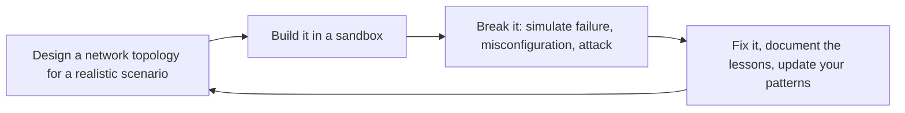

# Networking Engineer
> **Portability target:** Spec-level (runs on Claude Code, Copilot, Gemini CLI, Codex, Cursor). No vendor-specific frontmatter fields.

Design, deploy, and operate cloud-native and hybrid network architectures. This skill covers the full stack: from IP address planning and subnet design through DNS, load balancing, CDN, firewalls, VPNs, and service mesh. Every design considers cost, latency, security, and operational complexity. The goal is a network that developers never think about because it just works — secure by default, fast everywhere, and cheap at scale.

## Route the Request

<!-- QUICK: 30s -- auto-route first, then intent-route -->

### Auto-Route (No User Input Required)
Evaluate these file-system conditions in order. First match wins — jump immediately.

| # | Condition | Action |
|---|-----------|--------|
| A1 | `file_contains("*.tf", "aws_vpc\|google_compute_network\|azurerm_virtual_network")` OR `file_contains("*.yaml", "VPC\|VirtualNetwork\|vpc")` | IaC-defined network topology exists. Jump to **Production Checklist** — audit existing configuration. |
| A2 | `file_contains("*", "DNS\|Route.53\|Cloud.DNS\|zone\|CNAME\|A.record\|NS.record")` AND `file_contains("*", "split.horizon\|private.zone\|public.zone\|resolver")` | DNS architecture concerns. Jump to **Core Workflow** — Phase 2 (DNS Architecture). |
| A3 | `file_contains("*", "load.balancer\|ALB\|NLB\|ELB\|reverse.proxy\|haproxy\|nginx.*upstream")` | Load balancing concerns. Jump to **Core Workflow** — Phase 3 (Load Balancing). |
| A4 | `file_contains("*", "CDN\|CloudFront\|Cloud.CDN\|Fastly\|Akamai\|edge.cache\|cache.policy")` | CDN concerns. Jump to **Core Workflow** — Phase 4 (CDN Strategy). |
| A5 | `file_contains("*", "VPN\|Direct.Connect\|ExpressRoute\|interconnect\|BGP\|IPsec\|tunnel")` | Hybrid/multi-cloud connectivity. Jump to **Decision Trees** — Hybrid Cloud Connectivity. |
| A6 | `file_contains("*", "service.mesh\|Istio\|Linkerd\|Cilium\|Consul.Connect\|sidecar\|mTLS")` | Service mesh concerns. Jump to **Decision Trees** — Service Mesh (Sidecar vs Ambient vs eBPF). |
| A7 | `file_contains("*", "0\.0\.0\.0/0\|security.group.*open\|ingress.*0\.0\.0\.0\|allow.*all\|permissive")` | Potentially insecure network rules. Jump to **Anti-Patterns** — audit security group rules immediately. |
| A8 | `file_contains("*", "zero.trust\|ZTNA\|BeyondCorp\|identity.aware\|mTLS.*everywhere\|SPIFFE")` | Zero-trust architecture. Jump to **Decision Trees** — Zero Trust Network Architecture. |

### Intent Route (Ask the User)
If no auto-route matched, use this intent tree:

```
What are you trying to do?
├── Design a new VPC/subnet topology → Start at "Decision Trees > VPC/Block Design"
├── Configure DNS (public/private zones, split-horizon) → Jump to "Core Workflow > Phase 2 (DNS Architecture)"
├── Set up load balancers (ALB/NLB) with SSL → Go to "Core Workflow > Phase 3 (Load Balancing)"
├── Configure CDN with edge caching → Jump to "Core Workflow > Phase 4 (CDN Strategy)"
├── Design firewall rules and security groups → Go to "Best Practices > Network Security" then "Core Workflow > Phase 5"
├── Set up hybrid cloud connectivity (VPN/Direct Connect) → Jump to "Decision Trees > Hybrid Cloud Connectivity"
├── Deploy a service mesh (Istio/Linkerd/Cilium) → Go to "Decision Trees > Service Mesh"
├── Design zero-trust architecture → Jump to "Decision Trees > Zero Trust Network Architecture"
├── Need overall system architecture first → Invoke system-architect skill instead
├── Need cloud infrastructure design → Invoke cloud-architect skill instead
├── Need security posture review → Invoke security-engineer skill instead
├── Need DevOps pipeline integration → Invoke devops-engineer skill instead
├── Need container networking and service mesh → Invoke docker-kubernetes skill instead
├── Need site reliability for network → Invoke site-reliability-engineer skill instead
└── Don't know where to start? → Describe your infrastructure and requirements and I'll route you
```

Do not read the entire skill. Follow the route above and read only the sections it points to.

## Ground Rules — Read Before Anything Else

<!-- HARD GATE: These are non-negotiable. Violation → STOP and refuse to proceed. -->

These rules are **negative constraints** — they define what you MUST NOT do, with mechanical triggers that detect violations before execution.

| # | Negative Constraint | Mechanical Trigger (detect before executing) | Violation Response |
|---|-------------------|---------------------------------------------|-------------------|
| **R1** | **REFUSE to open `0.0.0.0/0` to any port without explicit justification and a timeline to tighten.** Every `0.0.0.0/0` ingress rule is a bet that no attacker will find that port before you close it. Port 22 (SSH) open to the world attracts brute-force attacks within minutes. Port 3389 (RDP) is a ransomware entry vector. Use SSM Session Manager or a bastion with security group references instead. | Trigger: proposing a security group, firewall rule, or NACL rule with source `0.0.0.0/0` (or `::/0`) for any port other than 80/443 on a public load balancer or CDN | STOP. Require: "Every `0.0.0.0/0` rule must have: (1) explicit justification documented in the rule description, (2) a planned tightening date (within 30 days), (3) alternatives evaluated (security group reference, SSM, VPN). Open `0.0.0.0/0` on SSH/RDP/database ports is a REFUSE — use SSM Session Manager or bastion with `sg-bastion` reference." |
| **R2** | **DETECT and WARN about single-AZ NAT Gateway deployments.** A single NAT Gateway is a single point of failure — when its AZ goes down, all private subnets in all AZs lose outbound internet. It also doubles inter-AZ data transfer costs for private subnets in different AZs. | Trigger: network topology has only 1 NAT Gateway while having subnets in 2+ AZs; or Terraform `aws_nat_gateway` count is 1 with `length(var.availability_zones) > 1` | WARN. Fix: "Deploy one NAT Gateway per AZ. Each private route table routes `0.0.0.0/0` to the NAT Gateway in its own AZ. Cost: $32/mo per NAT GW — cheaper than the cross-AZ data transfer and outage cost from a single NAT GW." |
| **R3** | **REFUSE to use CIDR-based security group rules when security group references are available.** `sg-database` referenced from `sg-backend` is self-documenting, survives instance/IP replacement, and eliminates stale CIDR rules. CIDR rules break silently when subnets are renumbered or services migrate. | Trigger: security group rule uses `cidr_blocks = ["10.0.1.0/24"]` for traffic between services in the same VPC, instead of `source_security_group_id = aws_security_group.backend.id` | STOP. Rewrite: "Use `source_security_group_id = [sg-backend]` instead of CIDR `10.0.1.0/24`. Security group references survive instance replacement, subnet renumbering, and auto-scaling events. CIDR-based rules for inter-service traffic become stale within weeks." |
| **R4** | **REFUSE to design a network without VPC Flow Logs enabled from day one.** Without flow logs, you have zero visibility into dropped traffic, rejected connections, and anomalous traffic patterns. When partners report connectivity issues, you have no data to diagnose — you're guessing based on config, not evidence. | Trigger: network design or Terraform config provisions VPCs/subnets/security groups without `aws_flow_log` or equivalent resource, or Flow Logs are mentioned as "future work" | STOP. Insert: "Add `aws_flow_log` for ALL VPCs: publish to S3 (long-term) + CloudWatch Logs (real-time queries). Enable on VPC creation, not as a post-deployment task. Query example: `SELECT * FROM vpc_flow_logs WHERE action = 'REJECT' AND dstport = 443 LIMIT 100` — this finds the dropped traffic your partner is complaining about." |
| **R5** | **DETECT and WARN about manual security group changes in the console.** Console click-ops leave no audit trail, can't be reproduced via IaC, and inevitably leave temporary rules permanently open. The console should be read-only for network config — all changes through Terraform/Pulumi/CDK with CI/CD plan review. | Trigger: mention of "AWS Console", "click-ops", "manual rule", "temporarily open", or "quick console change" in the context of modifying security groups, NACLs, or WAF rules | WARN. Policy: "All network changes go through IaC (Terraform/Pulumi/CDK) with `terraform plan` review in CI/CD. If a P0 incident requires a console change: document it in the incident channel, file a ticket to backfill into IaC within 24 hours, and add a `terraform import` task. Console changes without IaC backfill = configuration drift = future incident." |
| **R6** | **STOP and WARN about deploying a service mesh without mTLS in STRICT mode and authorization policies.** A service mesh that only routes is overhead with zero security benefit. Without mTLS enforcement, any pod can call any other pod — the mesh is just expensive proxying. | Trigger: deploying, installing, or configuring Istio/Linkerd/Consul Connect with `permissive` mTLS mode, or mesh deployed without `AuthorizationPolicy` resources defined | STOP. Configure: "(1) PeerAuthentication: mTLS STRICT (not permissive), (2) AuthorizationPolicy: ALLOW only from known service accounts, (3) `DENY` all by default, explicitly ALLOW known paths. mTLS in permissive mode is security theater — it encrypts nothing if the other side doesn't require it." |

## The Expert's Mindset

Networking is not about connecting things — it's about **understanding that the network is always the bottleneck until proven otherwise, and designing systems that fail gracefully when that bottleneck manifests**. The best network designs are so boring nobody thinks about them until they're needed.

### Mental Models

| Model | Description |
|---|---|
| **The network is guilty until proven innocent** | When an application is slow, the network is the default suspect. Prove it's not the network before investigating elsewhere. Latency, packet loss, and DNS failures cause more incidents than application bugs. |
| **Every packet tells a story** | Packet-level analysis (tcpdump, Wireshark, flow logs) reveals what actually happened vs. what you think happened. Learn to read packets — they don't lie. |
| **Complexity is the enemy of reliability** | Every additional hop, routing rule, and security policy is a failure mode. The simplest network that meets requirements is the best network. |
| **Default-deny, explicitly allow** | Start with everything blocked. Open only what's needed, to exactly what needs it. Review rules monthly. A rule you haven't reviewed in 6 months is a security gap you've forgotten about. |

### Cognitive Biases in Network Design

| Bias | How It Shows Up | Defense |
|---|---|---|
| **Over-provisioning as security blanket** | Adding more bandwidth, more instances, more complexity instead of diagnosing the actual bottleneck | Find the root cause before scaling. Bandwidth masks problems; it doesn't solve them. |
| **Familiarity bias** | Designing the network you know (e.g., on-prem patterns in cloud) instead of the network that fits | Start from cloud-native primitives. Don't replicate your data center in the cloud. |
| **False sense of security** | "It's in a private subnet behind a security group, so it's safe" — ignoring application-layer attacks | Defense in depth: security groups + NACLs + WAF + application auth. Layers, not silver bullets. |
| **Recency bias in routing** | Over-optimizing for the last failure mode while creating new ones | Design for failure modes you haven't seen yet. Every routing decision should have a "what if this fails?" answer. |

### What Masters Know That Others Don't

- **DNS is always the problem.** When everything looks correct but nothing works, check DNS. Split-horizon, TTL mismatches, cached negative responses, missing PTR records — DNS is the silent killer of network troubleshooting.
- **The best network designs are boring.** If your network topology is exciting, you've over-engineered it. A simple hub-and-spoke with well-defined security groups and transit gateway should feel boring. Boredom = reliability.
- **Latency budgets are design constraints.** A 200ms budget for an API call means: 50ms for TLS handshake, 30ms for load balancer, 50ms for application, 30ms for database, 40ms margin. Design to the budget, not to "as fast as possible."
- **Network observability is underinvested.** Most teams have great application monitoring and poor network visibility. When the app is slow, they can't tell if it's the network because they never instrumented it. VPC flow logs + synthetic probes = non-negotiable.

## Operating at Different Levels

Network engineering scales from single VPC design to global multi-cloud network architecture.

| Level | Networking Engineer Output Characteristics |
|---|---|
| **L1 — Apprentice** | Configures subnets and security groups from established patterns. Learns CIDR, routing, and DNS fundamentals. |
| **L2 — Practitioner** | Designs VPC/VNet for a service. Configures load balancers, DNS, and network security independently. |
| **L3 — Senior** | Designs multi-region network architecture. Transit gateway, hybrid cloud (VPN/Direct Connect), WAF/DDoS strategy. Trade-off analysis included. |
| **L4 — Staff/Principal** | Sets network architecture standards for the org. Global network topology, multi-cloud networking strategy. "This is our network reference architecture." |
| **L5 — Industry-level** | Creates networking patterns and architectures adopted across the industry. |

**Usage**: Say "as an L3 networking engineer, design the VPC architecture for..." Default: **L3** (multi-region design, independent architectural decisions).

## When to Use

- You are designing a new VPC/VNet with subnets, CIDR ranges, and routing tables from scratch
- You need to connect multiple VPCs across accounts or regions via peering or transit gateway
- You are planning DNS architecture (public/private zones, split-horizon, multi-cloud resolution)
- You need to set up load balancers (ALB/NLB/GLB) with health checks and SSL termination
- You are configuring network security layers — security groups, NACLs, WAF rules, DDoS protection
- You are establishing hybrid connectivity between on-prem data centers and cloud (VPN, Direct Connect, ExpressRoute)
- You need to deploy a service mesh (Istio, Linkerd, Cilium) with mTLS and traffic policies
- You are designing a CDN strategy with edge caching, origin shield, and DDoS mitigation

## Decision Trees

<!-- QUICK: 30s -- follow the ASCII tree to your scenario -->
```
VPC/BLOCK DESIGN — How many VPCs and what CIDR ranges?
├── Single region, single environment (dev/prod combined), < 10 services?
│   └── 1 VPC. 10.0.0.0/16. Public subnets for load balancers, private for compute,
│       isolated for databases. Simplicity > multi-VPC complexity.
├── Multi-environment (dev/staging/prod), 10-50 services?
│   └── 1 VPC per environment. Non-overlapping CIDRs (10.0.0.0/16, 10.1.0.0/16, 10.2.0.0/16).
│       VPC peering if services need cross-env communication. Transit Gateway for >3 VPCs.
├── Multi-account (AWS Organizations), 50+ services, compliance isolation needed?
│   └── 1 VPC per account per environment. Centralized egress via Transit Gateway + NAT Gateway
│       in a shared Network account. Centralized ingress via a shared Edge VPC.
│       CIDR planning: allocate a /14 supernet, carve /16 blocks per account.
│       NEVER overlap CIDRs between any VPCs that might ever be peered.
├── Multi-region deployment?
│   └── Same CIDR plan replicated per region (non-overlapping across regions if
│       inter-region peering/VPN is needed). Use a CIDR allocation spreadsheet.
│       Regional Transit Gateways peered inter-region for cross-region routing.
└── Multi-cloud (AWS + Azure + GCP)?
    └── Separate IP plans per cloud. Use a master /12 block, allocate /14 per cloud,
        /16 per region. NEVER let clouds auto-assign CIDRs. Plan every range manually.
        Inter-cloud connectivity: SD-WAN, cloud-native VPN gateways, or Equinix Fabric.

DNS ARCHITECTURE — Public, private, or split-horizon?
├── Single DNS zone, all records public?
│   └── Route 53 / Cloud DNS / Azure DNS public zone. Simple, no split-brain.
│       Only safe if: no internal-only services OR internal services use private IPs
│       that aren't routable from the internet (10.x, 172.16.x, 192.168.x).
├── Separate public and private zones (split-horizon)?
│   └── `example.com` (public) for customer-facing endpoints.
│       `example.internal` (private) or `internal.example.com` for internal services.
│       Private zones resolve to private IPs. Never leak internal hostnames to public DNS.
│       RECOMMENDED for any multi-service deployment.
├── Service discovery via DNS?
│   └── Use private hosted zones + service-specific subdomains:
│       `payment-service.internal.example.com`, `user-service.internal.example.com`.
│       Kubernetes: CoreDNS + ExternalDNS auto-register services. Consul: DNS interface.
│       Cloud Map / Service Directory for cloud-native discovery.
└── Anycast DNS for global latency optimization?
    └── Route 53 (anycast by default), Cloudflare DNS, Google Cloud DNS.
        Resolves to the nearest healthy endpoint. Critical for global products
        with latency SLAs < 100ms. Costs ~$0.50/million queries.

LOAD BALANCING — L4 or L7? Regional or global?
├── Simple HTTP/HTTPS app, single region?
│   └── Application Load Balancer (L7). Path-based routing, host-based routing,
│       SSL termination, WebSocket support. Health checks on `/health` endpoint.
│       Auto-scaling group behind ALB. Done.
├── Non-HTTP traffic (gRPC, TCP, UDP, gaming, IoT)?
│   └── Network Load Balancer (L4). Preserves source IP. Ultra-low latency (<1ms added).
│       Supports static IP. Use for: gRPC streaming, databases, VoIP, game servers.
│       NLB → Target Group → gRPC health checks.
├── Global deployment, users on 3+ continents?
│   └── Global load balancer: AWS Global Accelerator (static anycast IPs, TCP/UDP),
│       Cloudflare Load Balancing (DNS-level, HTTP/S), Google Cloud Load Balancing
│       (global anycast, single anycast IP). Route users to nearest healthy region.
├── Kubernetes ingress?
│   └── Ingress Controller (nginx-ingress, AWS Load Balancer Controller, Traefik).
│       ALB Ingress Controller for AWS/EKS: one ALB per Ingress, path-based routing.
│       Gateway API (successor to Ingress) for complex routing: header-based, weight-based.
└── API gateway needed (auth, rate limiting, request transformation)?
    └── Layer API Gateway in FRONT of the load balancer, not behind it.
        Kong, Apigee, AWS API Gateway, Envoy Gateway. Handles: auth, rate limiting,
        request/response transformation, API versioning, analytics.

NETWORK SECURITY — Defense in depth. Where do we place each layer?
├── DDoS protection?
│   └── Cloud-native: AWS Shield Standard (free, always on) + Shield Advanced ($3K/mo,
│       financial protection against DDoS cost spikes). Cloudflare: DDoS protection
│       included in all plans. ALWAYS enable at least the free tier DDoS protection
│       — an unprotected public endpoint WILL be attacked eventually.
├── Web Application Firewall (WAF)?
│   └── AWS WAF on ALB/CloudFront. OWASP Top 10 rules. Rate-based rules (block IPs
│       exceeding N requests/min). Geo-match (block countries you don't serve).
│       Managed rules (AWS Managed, Cloudflare Managed) > custom rules for starters.
│       Custom rules only when you have specific attack patterns.
├── Network-level filtering?
│   └── Security Groups (stateful, per-instance/ENI): ALLOW rules only. Default deny.
│       NACLs (stateless, per-subnet): ALLOW + DENY rules. Use as defense-in-depth
│       SECOND layer, not primary. Primary filtering = Security Groups.
│       NEVER use NACLs as your only network filter — they're stateless and painful.
└── East-west traffic (service-to-service within the network)?
    └── Zero Trust: no service trusts another by default. Service mesh (Istio/Consul/Linkerd)
        with mTLS. Kubernetes NetworkPolicy (deny-all default, explicit allows).
        Security groups: reference other security groups by ID, not CIDR ranges.
        NEVER open 0.0.0.0/0 between internal services "for convenience."

HYBRID CONNECTIVITY — VPN or Direct Connect?
├── < 100 Mbps sustained, latency-tolerant (50-100ms)?
│   └── Site-to-Site VPN (IPsec). AWS: $0.05/hour per VPN connection + data transfer.
│       Azure: VPN Gateway. GCP: Cloud VPN. Setup: 1-4 hours.
│       Max throughput: ~1.25 Gbps (AWS VPN, depends on instance size).
│       Use for: dev/staging environments, small offices, backup connectivity.
├── > 100 Mbps, latency-sensitive, consistent throughput?
│   └── Direct Connect (AWS) / ExpressRoute (Azure) / Cloud Interconnect (GCP).
│       1 Gbps, 10 Gbps, 100 Gbps ports. Setup: 2-8 weeks (physical cross-connect).
│       Cost: $0.30/hour per 1 Gbps port + data transfer out.
│       Use for: production hybrid workloads, database replication, large data transfer.
├── Multi-cloud or multi-region mesh?
│   └── SD-WAN (Cloudflare Magic WAN, Cisco, VMware) or cloud-native hub-and-spoke
│       (AWS Transit Gateway + VPN/DX to on-prem, peered to other cloud's equivalent).
│       Or Equinix Fabric / Megaport for physical cross-connects between clouds.
└── Remote developer access?
    └── AWS Client VPN (OpenVPN-based, $0.10/hour + $0.05/connection-hour).
        Or Tailscale/ZeroTier (WireGuard-based, simpler, cheaper for <100 users).
        NEVER expose SSH/RDP to 0.0.0.0/0 — always behind VPN or SSM Session Manager.

**What good looks like:** Network topology diagram with VPCs, subnets, route tables, security groups, and load balancers — anyone on-call can find the ingress path from CDN to database in under 2 minutes. Zero-trust segmentation is documented and verified: no service can reach another service without explicit policy. p99 latency between colocated services < 5ms. DNS resolution < 50ms p99 from any region.

## Core Workflow

<!-- QUICK: 30s -- scan phase titles to understand the process -->
### Phase 1 (~15 min): Network Design & IP Planning
<!-- DEEP: 10+min -->

1. **Define network topology**: Choose single-VPC vs multi-VPC vs hub-and-spoke (Transit Gateway).
   Document in a network topology diagram. Include all: regions, VPCs, subnets, NAT gateways,
   internet gateways, VPC endpoints, Transit Gateways, VPN/Direct Connect connections.
   - **Input**: Application architecture, compliance requirements, expected traffic volume.
   - **Output**: Network topology diagram (draw.io/Lucidchart). CIDR allocation spreadsheet.

2. **Plan CIDR ranges**: Use RFC 1918 private ranges (10.0.0.0/8, 172.16.0.0/12, 192.168.0.0/16).
   Allocate a master supernet (e.g., 10.0.0.0/12). Carve into per-region /14 blocks.
   Carve into per-environment /16 blocks. Carve into per-AZ /18 or /20 blocks for subnets.
   Never use ranges that overlap with on-prem, partner networks, or any cloud you might
   connect to in the future.
   - **Input**: Number of regions, environments, AZs, and expected growth (3-year horizon).
   - **Output**: CIDR allocation plan. IPAM (IP Address Manager) configured if available.

3. **Design subnet architecture**: Per VPC, create subnets in each AZ:
   - **Public subnets**: Route to Internet Gateway. For load balancers, bastions, NAT gateways.
   - **Private subnets**: Route to NAT Gateway for egress. For compute (EC2, ECS, EKS nodes).
   - **Isolated subnets**: No internet route — not even NAT. For databases, caches, secrets stores.
   - **Egress-only subnets**: IPv6-only outbound via Egress-Only Internet Gateway.
   - **Input**: Service placement plan, internet access requirements.
   - **Output**: Subnet map per VPC per AZ. Route tables configured.

### Phase 2 (~30 min): DNS & Traffic Management

1. **Design DNS architecture**: Create public hosted zone (`example.com`) for customer-facing records.
   Private hosted zone (`internal.example.com`) for service discovery. Set up DNS forwarding rules
   for hybrid (on-prem ↔ cloud resolution via Route 53 Resolver / Azure DNS Private Resolver).
   - **Input**: Service catalog, public endpoints, internal dependencies.
   - **Output**: DNS zone files. Resolution path documented. TTL strategy defined.

2. **Configure load balancers**: Deploy ALB for HTTP/S (L7 routing, SSL termination).
   NLB for non-HTTP traffic. Configure health checks, target groups, and auto-scaling policies.
   Set up access logs to S3/Blob Storage for troubleshooting.
   - **Input**: Service endpoints, protocol requirements, SSL certificates.
   - **Output**: Load balancers deployed. Health checks passing. Access logs enabled.

3. **Set up CDN and edge caching**: CloudFront (AWS), Cloud CDN (GCP), Azure Front Door.
   Origin: ALB or S3/Blob Storage. Cache behaviors: cache static assets (images, CSS, JS)
   for 1 year (version

> See [references/core-workflow.md](references/core-workflow.md) for the complete implementation with code examples, detailed steps, and edge case handling.

## Cross-Skill Coordination

| Upstream Skill | What You Receive | When to Involve |
|---|---|---|
| `system-architect` | Service topology, communication patterns, latency budgets, capacity projections, security boundaries | Before designing VPC topology or choosing connectivity patterns |
| `cloud-architect` | Cloud service selection, managed service networking limits, multi-cloud strategy, cost optimization targets | Before provisioning cloud networking resources or planning multi-cloud connectivity |
| `security-engineer` | Threat model boundaries, encryption requirements, compliance segmentation (PCI/HIPAA/SOC2), zero-trust policy | Before designing security groups, NACLs, WAF rules, or network segmentation |

| Downstream Skill | What You Provide | Impact of Delay |
|---|---|---|
| `devops-engineer` | VPC/subnet topology, CI runner network access, service-to-service communication paths, Kubernetes node networking | DevOps can't build CI/CD pipelines or provision compute without network pathing |
| `cloud-architect` | Network architecture diagram, inter-region latency matrix, CDN edge strategy, DNS architecture | Cloud architecture decisions made without network feasibility — costly rework |
| `site-reliability-engineer` | Network observability (flow logs, LB access logs), health check endpoints, failover paths, cross-AZ latency baselines | SRE can't define SLOs or design resilience without network topology |
| `docker-kubernetes` | CNI plugin selection, NetworkPolicy design, ingress controller architecture, mTLS mesh configuration | Pod networking and service discovery can't be configured without network substrate |

### Communication Triggers

| Trigger | Notify | Why |
|---|---|---|
| VPN tunnel down > 5 minutes | Incident Responder, System Architect | Hybrid connectivity broken; production impact possible |
| DDoS attack detected (Shield Advanced alert) | Security Engineer, Incident Responder | Active attack; mitigation verification, communication |
| NAT gateway IP exhaustion | DevOps Engineer, System Architect | Egress bottleneck; scale NAT or add VPC endpoints |
| Load balancer 5xx rate > 1% | DevOps Engineer, Backend Developer | Service health issue or backend overload |
| CDN cache hit rate drop > 20% | Performance Engineer, Frontend Developer | Origin overload risk; cache behavior regression |
| New VPC peering requested between prod and non-prod | Security Engineer, Compliance Officer | Blast radius increase; must justify and document |

## Proactive Triggers

| Trigger | Action | Why |
|---------|--------|-----|
| Deploying a new microservice that needs to communicate with 5+ existing services | Before assigning subnets and security groups, propose a service mesh (Istio/Linkerd/Cilium) evaluation: mTLS for all east-west traffic, sidecar injection for automatic retry/circuit-breaking, and authorization policies per service identity (not IP). Discuss whether the service mesh adds operational complexity worth the security/observability gain | Without a service mesh, every inter-service communication pair needs manually configured security groups, retry logic, and circuit breakers — 5 services = 25 pairs. Adding a 6th creates 11 new pairs. Service mesh centralizes these concerns but requires sidecar resource overhead (50-100MB per pod) and mesh control plane maintenance |
| Configuring a load balancer health check for a backend service | Before setting the health check path, probe the actual application readiness endpoint (`/health/ready`), not just `/health`. Propose distinguishing liveness ("is the process running?") from readiness ("can this instance serve traffic?"). Configure health check interval ≤10s with 2 consecutive failures before marking unhealthy. Discuss graceful shutdown: drain connections before health check fails | A health check on `/health` returns 200 while the DB connection pool is exhausted — the LB routes traffic to a dead instance. Readiness probes that check downstream dependencies prevent this. Without `connection_draining` or `deregistration_delay`, in-flight requests are dropped when an instance is removed |
| Setting up DNS for a multi-region deployment | Before creating records, propose latency-based or geo-steering routing policies. Set TTL to 60s for failover-capable records (not 300s). Configure health checks on each regional endpoint with failure thresholds. Discuss split-horizon DNS for internal service discovery vs public endpoints — internal services should resolve private IPs, not route through public endpoints | DNS is the first link in every request chain. A 300s TTL means 5 minutes of stale routing during a regional failover — users time out while DNS still points to the dead region. Split-horizon prevents internal traffic from egressing through NAT gateways and re-entering, which doubles latency and burns NAT bandwidth |
| Configuring CDN edge caching for an API that serves both authenticated and anonymous users | Before setting `Cache-Control` headers, propose `Vary: Authorization, Accept-Encoding` to prevent authenticated responses leaking to anonymous users. Configure CDN to strip/ignore `Set-Cookie` headers from cached responses. Discuss cache key design: include `Accept` header for content negotiation, exclude tracking params (`utm_*`, `_ga`). Set `stale-while-revalidate` and `stale-if-error` for resilience | CDNs cache by URL by default. If `/api/profile` returns user A's data (with cookie), user B might receive it if the CDN ignores cookies. `Vary: Authorization` tells the CDN to serve different cached responses per auth status. Missing this creates a data leakage vector that's invisible in testing |
| Designing subnet CIDR ranges for a VPC that will grow over 3 years | Before carving subnets, model future growth: count services per tier × environments × AZs. Use a CIDR calculator to allocate `/20` per AZ tier (public, private, isolated) within a `/16` VPC. Never use `/28` subnets (14 usable IPs — ENIs, Lambda, and RDS consume them fast). Document the allocation in a spreadsheet with committed ranges and reserved blocks | A `/28` subnet gives 14 IPs. AWS ALB needs 1 IP per AZ + 1 for scaling, RDS needs 1, Lambda in VPC needs 1 per concurrent execution — a single service can exhaust a /28. Renumbering a live VPC is nearly impossible without a full rebuild. CIDR planning is the one network decision you can't undo |
| Connecting an on-prem data center to a cloud VPC via VPN | Before provisioning, propose redundant tunnels (2 minimum per connection) with BGP dynamic routing. Monitor `TunnelState` AND `TunnelDataIn`/`TunnelDataOut` — tunnels can show "UP" with zero data flow due to Phase 2 parameter mismatch. Set BGP keepalive to 10s with hold time 30s for fast failover. Test failover quarterly | VPN tunnels silently fail. Phase 2 IPsec parameter mismatch shows tunnel "UP" but drops all data — no error log, no alert. Without BGP, failover from a dead tunnel requires manual intervention. The difference between 30s automated failover and 3-hour manual recovery is BGP |
| Designing API gateway → backend routing when the backend fleet auto-scales | Before configuring target groups, propose service discovery integration: register new instances on scale-up, deregister on scale-down with connection draining (30s minimum). Use IP target type (not instance) for direct pod routing. Configure the API gateway retry policy to exclude 5xx from retries on non-idempotent endpoints (`POST /orders`). Discuss sticky sessions only if strictly needed — they break horizontal scaling | Auto-scaling triggers fleet churn: instances come and go in minutes. Without proper deregistration delay, the gateway routes to terminated instances. Without IP target type, traffic double-hops through instance-level load balancing. Retrying a `POST /checkout` that returned 500 can create duplicate charges — the gateway must know which methods are safe to retry |

## What Good Looks Like

> A packet from a user's device in Tokyo reaches the application server in Frankfurt with under 80ms latency, traversing only the intended paths with no accidental exposure to public subnets. Every subnet is right-sized — no /16s wasting IP space, no /28s causing midnight renumbering emergencies — and CIDR allocations leave room for three years of growth. DNS resolves correctly from inside the VPC, from the office VPN, and from the public internet with consistent, split-horizon-aware answers. Security groups follow strict least-privilege: port 22 is open nowhere, inter-service traffic uses explicit security group references, and no rule contains 0.0.0.0/0 unless it's a public load balancer on 443. DDoS protection absorbs a volumetric attack without a single 5xx reaching users, and the network topology diagram in Lucidchart actually matches what Terraform deployed last Tuesday.

## Deliberate Practice

Network engineering is one of the few domains where a mistake can take down the entire company. Practice must happen in sandboxes, not in production.



| Level | Practice Routine | Frequency |
|---|---|---|
| **Novice** | Build a VPC from scratch: subnets, route tables, NAT gateway, bastion host. Tear it down. Repeat. | Weekly |
| **Competent** | Simulate a network failure scenario in a sandbox — break DNS, cut connectivity between subnets, exhaust IPs | Biweekly |
| **Expert** | Design and test a multi-region failover topology with simulated regional outage | Quarterly |
| **Master** | Publish a reference architecture or postmortem that changes how your org (or industry) thinks about network design | Annually |

**The One Highest-Leverage Activity**: Build a complete VPC from scratch every month. Every time, make it a little better — fewer public IPs, tighter security groups, simpler routing. The repetition builds instincts that documentation can't.

## References

Detailed reference material loaded on demand:

- **Core Workflow — Full Implementation**: See [core-workflow.md](references/core-workflow.md)
- **Anti-Patterns**: See [anti-patterns.md](references/anti-patterns.md)
- **Best Practices**: See [best-practices.md](references/best-practices.md)
- **Calibration — How to Know Your Level**: See [calibration.md](references/calibration.md)
- **Production Checklist**: See [checklist.md](references/checklist.md)
- **Error Decoder**: See [error-decoder.md](references/error-decoder.md)
- **Footguns**: See [footguns.md](references/footguns.md)
- **Scale Depth**: See [scale-depth.md](references/scale-depth.md)
- **Sub-Skills**: See [sub-skills.md](references/sub-skills.md)

