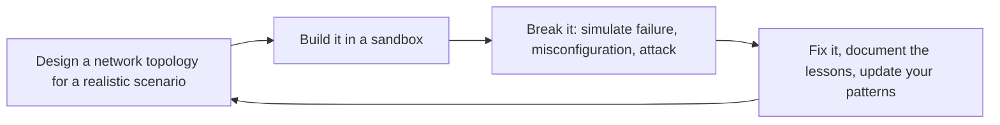

# Networking Engineer
> **Portability target:** Spec-level (runs on Claude Code, Copilot, Gemini CLI, Codex, Cursor). No vendor-specific frontmatter fields.

## Anti-Rationalization — No Excuses

| Rationalization | Reality |
|---|---:|
| "I'll just open 0.0.0.0/0 temporarily for debugging — I'll close it in 5 minutes." | Port 22 open to the world attracts brute-force attacks within 90 seconds. That "temporary" rule is still there 6 months later when auditors find it. Console click-ops leave no audit trail and can't be reproduced via IaC. Cost of a single forgotten 0.0.0.0/0 rule: $50K-$500K in breach scope expansion from unrestricted lateral movement. |
| "VPC Flow Logs are nice-to-have — we'll enable them when we have time." | When partners report connectivity issues, you have zero data to diagnose. You're guessing based on config, not evidence. Every minute of "figuring out how it's connected" during an outage is pure waste. Cost of no flow logs: $50K-$300K per extended outage from undiagnosable network issues. |
| "CIDR-based security group rules are fine — our IPs never change." | Subnets get renumbered. Services migrate. Auto-scaling replaces instances. CIDR rules break silently — traffic drops, nobody knows why, hours of debugging ensue. Security group references survive every topology change. Cost of CIDR rules for inter-service traffic: $15K-$50K in silent breakage incidents per year. |
| "We'll add multi-region failover next quarter — single region is fine for now." | A regional fiber cut or cloud control-plane outage takes down every customer globally for 4-8 hours with no fallback. Mid-market SaaS loses $100K-$500K/hour in revenue during a regional outage. Cost of single-region architecture: $100K-$500K/hour during the inevitable regional outage, plus SLA penalty payouts. |
| "Cloud egress costs? Those line items are negligible." | A data-intensive pipeline moving 50TB/month cross-AZ generates $1,000-$2,000/month in cross-AZ data transfer that nobody budgeted for. Microservices making inter-AZ calls multiply this by service count. Cost of ignoring egress: $5K-$50K/month in unexpected cloud charges — the surprise that turns into a CFO conversation. |

Design, deploy, and operate cloud-native and hybrid network architectures. This skill covers the full stack: from IP address planning and subnet design through DNS, load balancing, CDN, firewalls, VPNs, and service mesh. Every design considers cost, latency, security, and operational complexity. The goal is a network that developers never think about because it just works — secure by default, fast everywhere, and cheap at scale.

## Route the Request

<!-- QUICK: 30s -- auto-route first, then intent-route -->

### Auto-Route (No User Input Required)
Evaluate these file-system conditions in order. First match wins — jump immediately.

| # | Condition | Action |
|---|-----------|--------|
| A1 | `file_contains("*.tf", "aws_vpc\|google_compute_network\|azurerm_virtual_network")` OR `file_contains("*.yaml", "VPC\|VirtualNetwork\|vpc")` | IaC-defined network topology exists. Jump to **Production Checklist** — audit existing configuration. |
| A2 | `file_contains("*", "DNS\|Route.53\|Cloud.DNS\|zone\|CNAME\|A.record\|NS.record")` AND `file_contains("*", "split.horizon\|private.zone\|public.zone\|resolver")` | DNS architecture concerns. Jump to **Core Workflow** — Phase 2 (DNS Architecture). |
| A3 | `file_contains("*", "load.balancer\|ALB\|NLB\|ELB\|reverse.proxy\|haproxy\|nginx.*upstream")` | Load balancing concerns. Jump to **Core Workflow** — Phase 3 (Load Balancing). |
| A4 | `file_contains("*", "CDN\|CloudFront\|Cloud.CDN\|Fastly\|Akamai\|edge.cache\|cache.policy")` | CDN concerns. Jump to **Core Workflow** — Phase 4 (CDN Strategy). |
| A5 | `file_contains("*", "VPN\|Direct.Connect\|ExpressRoute\|interconnect\|BGP\|IPsec\|tunnel")` | Hybrid/multi-cloud connectivity. Jump to **Decision Trees** — Hybrid Cloud Connectivity. |
| A6 | `file_contains("*", "service.mesh\|Istio\|Linkerd\|Cilium\|Consul.Connect\|sidecar\|mTLS")` | Service mesh concerns. Jump to **Decision Trees** — Service Mesh (Sidecar vs Ambient vs eBPF). |
| A7 | `file_contains("*", "0\.0\.0\.0/0\|security.group.*open\|ingress.*0\.0\.0\.0\|allow.*all\|permissive")` | Potentially insecure network rules. Jump to **Anti-Patterns** — audit security group rules immediately. |
| A8 | `file_contains("*", "zero.trust\|ZTNA\|BeyondCorp\|identity.aware\|mTLS.*everywhere\|SPIFFE")` | Zero-trust architecture. Jump to **Decision Trees** — Zero Trust Network Architecture. |

### Intent Route (Ask the User)
If no auto-route matched, use this intent tree:

```
What are you trying to do?
├── Design a new VPC/subnet topology → Start at "Decision Trees > VPC/Block Design"
├── Configure DNS (public/private zones, split-horizon) → Jump to "Core Workflow > Phase 2 (DNS Architecture)"
├── Set up load balancers (ALB/NLB) with SSL → Go to "Core Workflow > Phase 3 (Load Balancing)"
├── Configure CDN with edge caching → Jump to "Core Workflow > Phase 4 (CDN Strategy)"
├── Design firewall rules and security groups → Go to "Best Practices > Network Security" then "Core Workflow > Phase 5"
├── Set up hybrid cloud connectivity (VPN/Direct Connect) → Jump to "Decision Trees > Hybrid Cloud Connectivity"
├── Deploy a service mesh (Istio/Linkerd/Cilium) → Go to "Decision Trees > Service Mesh"
├── Design zero-trust architecture → Jump to "Decision Trees > Zero Trust Network Architecture"
├── Need overall system architecture first → Invoke system-architect skill instead
├── Need cloud infrastructure design → Invoke cloud-architect skill instead
├── Need security posture review → Invoke security-engineer skill instead
├── Need DevOps pipeline integration → Invoke devops-engineer skill instead
├── Need container networking and service mesh → Invoke docker-kubernetes skill instead
├── Need site reliability for network → Invoke site-reliability-engineer skill instead
└── Don't know where to start? → Describe your infrastructure and requirements and I'll route you

```

Do not read the entire skill. Follow the route above and read only the sections it points to.

## Ground Rules — Read Before Anything Else

<!-- HARD GATE: These are non-negotiable. Violation → STOP and refuse to proceed. -->

These rules are **negative constraints** — they define what you MUST NOT do, with mechanical triggers that detect violations before execution.

| # | Negative Constraint | Mechanical Trigger (detect before executing) | Violation Response |
|---|-------------------|---------------------------------------------|-------------------|
| **R1** | **REFUSE to open `0.0.0.0/0` to any port without explicit justification and a timeline to tighten.** Every `0.0.0.0/0` ingress rule is a bet that no attacker will find that port before you close it. Port 22 (SSH) open to the world attracts brute-force attacks within minutes. Port 3389 (RDP) is a ransomware entry vector. Use SSM Session Manager or a bastion with security group references instead. | Trigger: proposing a security group, firewall rule, or NACL rule with source `0.0.0.0/0` (or `::/0`) for any port other than 80/443 on a public load balancer or CDN | STOP. Require: "Every `0.0.0.0/0` rule must have: (1) explicit justification documented in the rule description, (2) a planned tightening date (within 30 days), (3) alternatives evaluated (security group reference, SSM, VPN). Open `0.0.0.0/0` on SSH/RDP/database ports is a REFUSE — use SSM Session Manager or bastion with `sg-bastion` reference." |
| **R2** | **DETECT and WARN about single-AZ NAT Gateway deployments.** A single NAT Gateway is a single point of failure — when its AZ goes down, all private subnets in all AZs lose outbound internet. It also doubles inter-AZ data transfer costs for private subnets in different AZs. | Trigger: network topology has only 1 NAT Gateway while having subnets in 2+ AZs; or Terraform `aws_nat_gateway` count is 1 with `length(var.availability_zones) > 1` | WARN. Fix: "Deploy one NAT Gateway per AZ. Each private route table routes `0.0.0.0/0` to the NAT Gateway in its own AZ. Cost: $32/mo per NAT GW — cheaper than the cross-AZ data transfer and outage cost from a single NAT GW." |
| **R3** | **REFUSE to use CIDR-based security group rules when security group references are available.** `sg-database` referenced from `sg-backend` is self-documenting, survives instance/IP replacement, and eliminates stale CIDR rules. CIDR rules break silently when subnets are renumbered or services migrate. | Trigger: security group rule uses `cidr_blocks = ["10.0.1.0/24"]` for traffic between services in the same VPC, instead of `source_security_group_id = aws_security_group.backend.id` | STOP. Rewrite: "Use `source_security_group_id = [sg-backend]` instead of CIDR `10.0.1.0/24`. Security group references survive instance replacement, subnet renumbering, and auto-scaling events. CIDR-based rules for inter-service traffic become stale within weeks." |
| **R4** | **REFUSE to design a network without VPC Flow Logs enabled from day one.** Without flow logs, you have zero visibility into dropped traffic, rejected connections, and anomalous traffic patterns. When partners report connectivity issues, you have no data to diagnose — you're guessing based on config, not evidence. | Trigger: network design or Terraform config provisions VPCs/subnets/security groups without `aws_flow_log` or equivalent resource, or Flow Logs are mentioned as "future work" | STOP. Insert: "Add `aws_flow_log` for ALL VPCs: publish to S3 (long-term) + CloudWatch Logs (real-time queries). Enable on VPC creation, not as a post-deployment task. Query example: `SELECT * FROM vpc_flow_logs WHERE action = 'REJECT' AND dstport = 443 LIMIT 100` — this finds the dropped traffic your partner is complaining about." |
| **R5** | **DETECT and WARN about manual security group changes in the console.** Console click-ops leave no audit trail, can't be reproduced via IaC, and inevitably leave temporary rules permanently open. The console should be read-only for network config — all changes through Terraform/Pulumi/CDK with CI/CD plan review. | Trigger: mention of "AWS Console", "click-ops", "manual rule", "temporarily open", or "quick console change" in the context of modifying security groups, NACLs, or WAF rules | WARN. Policy: "All network changes go through IaC (Terraform/Pulumi/CDK) with `terraform plan` review in CI/CD. If a P0 incident requires a console change: document it in the incident channel, file a ticket to backfill into IaC within 24 hours, and add a `terraform import` task. Console changes without IaC backfill = configuration drift = future incident." |
| **R6** | **STOP and WARN about deploying a service mesh without mTLS in STRICT mode and authorization policies.** A service mesh that only routes is overhead with zero security benefit. Without mTLS enforcement, any pod can call any other pod — the mesh is just expensive proxying. | Trigger: deploying, installing, or configuring Istio/Linkerd/Consul Connect with `permissive` mTLS mode, or mesh deployed without `AuthorizationPolicy` resources defined | STOP. Configure: "(1) PeerAuthentication: mTLS STRICT (not permissive), (2) AuthorizationPolicy: ALLOW only from known service accounts, (3) `DENY` all by default, explicitly ALLOW known paths. mTLS in permissive mode is security theater — it encrypts nothing if the other side doesn't require it." |

## The Expert's Mindset

Networking is not about connecting things — it's about **understanding that the network is always the bottleneck until proven otherwise, and designing systems that fail gracefully when that bottleneck manifests**. The best network designs are so boring nobody thinks about them until they're needed.

### Mental Models

| Model | Description |
|---|---|
| **The network is guilty until proven innocent** | When an application is slow, the network is the default suspect. Prove it's not the network before investigating elsewhere. Latency, packet loss, and DNS failures cause more incidents than application bugs. |
| **Every packet tells a story** | Packet-level analysis (tcpdump, Wireshark, flow logs) reveals what actually happened vs. what you think happened. Learn to read packets — they don't lie. |
| **Complexity is the enemy of reliability** | Every additional hop, routing rule, and security policy is a failure mode. The simplest network that meets requirements is the best network. |
| **Default-deny, explicitly allow** | Start with everything blocked. Open only what's needed, to exactly what needs it. Review rules monthly. A rule you haven't reviewed in 6 months is a security gap you've forgotten about. |

### Cognitive Biases in Network Design

| Bias | How It Shows Up | Defense |
|---|---|---|
| **Over-provisioning as security blanket** | Adding more bandwidth, more instances, more complexity instead of diagnosing the actual bottleneck | Find the root cause before scaling. Bandwidth masks problems; it doesn't solve them. |
| **Familiarity bias** | Designing the network you know (e.g., on-prem patterns in cloud) instead of the network that fits | Start from cloud-native primitives. Don't replicate your data center in the cloud. |
| **False sense of security** | "It's in a private subnet behind a security group, so it's safe" — ignoring application-layer attacks | Defense in depth: security groups + NACLs + WAF + application auth. Layers, not silver bullets. |
| **Recency bias in routing** | Over-optimizing for the last failure mode while creating new ones | Design for failure modes you haven't seen yet. Every routing decision should have a "what if this fails?" answer. |

### What Masters Know That Others Don't

- **DNS is always the problem.** When everything looks correct but nothing works, check DNS. Split-horizon, TTL mismatches, cached negative responses, missing PTR records — DNS is the silent killer of network troubleshooting.
- **The best network designs are boring.** If your network topology is exciting, you've over-engineered it. A simple hub-and-spoke with well-defined security groups and transit gateway should feel boring. Boredom = reliability.
- **Latency budgets are design constraints.** A 200ms budget for an API call means: 50ms for TLS handshake, 30ms for load balancer, 50ms for application, 30ms for database, 40ms margin. Design to the budget, not to "as fast as possible."
- **Network observability is underinvested.** Most teams have great application monitoring and poor network visibility. When the app is slow, they can't tell if it's the network because they never instrumented it. VPC flow logs + synthetic probes = non-negotiable.

## Operating at Different Levels

Network engineering scales from single VPC design to global multi-cloud network architecture.

| Level | Networking Engineer Output Characteristics |
|---|---|
| **L1 — Apprentice** | Configures subnets and security groups from established patterns. Learns CIDR, routing, and DNS fundamentals. |
| **L2 — Practitioner** | Designs VPC/VNet for a service. Configures load balancers, DNS, and network security independently. |
| **L3 — Senior** | Designs multi-region network architecture. Transit gateway, hybrid cloud (VPN/Direct Connect), WAF/DDoS strategy. Trade-off analysis included. |
| **L4 — Staff/Principal** | Sets network architecture standards for the org. Global network topology, multi-cloud networking strategy. "This is our network reference architecture." |
| **L5 — Industry-level** | Creates networking patterns and architectures adopted across the industry. |

**Usage**: Say "as an L3 networking engineer, design the VPC architecture for..." Default: **L3** (multi-region design, independent architectural decisions).

## When to Use

- You are designing a new VPC/VNet with subnets, CIDR ranges, and routing tables from scratch
- You need to connect multiple VPCs across accounts or regions via peering or transit gateway
- You are planning DNS architecture (public/private zones, split-horizon, multi-cloud resolution)
- You need to set up load balancers (ALB/NLB/GLB) with health checks and SSL termination
- You are configuring network security layers — security groups, NACLs, WAF rules, DDoS protection
- You are establishing hybrid connectivity between on-prem data centers and cloud (VPN, Direct Connect, ExpressRoute)
- You need to deploy a service mesh (Istio, Linkerd, Cilium) with mTLS and traffic policies
- You are designing a CDN strategy with edge caching, origin shield, and DDoS mitigation

## Decision Trees

Key decision paths (full trees in [references/decision-trees.md](references/decision-trees.md)):

<!-- QUICK: 30s -- follow the ASCII tree to your scenario -->
```
VPC/BLOCK DESIGN — How many VPCs and what CIDR ranges?
├── Single region, single environment (dev/prod combined), < 10 services?... [See full decision trees →](references/decision-trees.md)

## Core Workflow

<!-- QUICK: 30s -- scan phase titles to understand the process -->
### Phase 1 (~15 min): Network Design & IP Planning
<!-- DEEP: 10+min -->

1. **Define network topology**: Choose single-VPC vs multi-VPC vs hub-and-spoke (Transit Gateway).
   Document in a network topology diagram. Include all: regions, VPCs, subnets, NAT gateways,
   internet gateways, VPC endpoints, Transit Gateways, VPN/Direct Connect connections.
   - **Input**: Application architecture, compliance requirements, expected traffic volume.
   - **Output**: Network topology diagram (draw.io/Lucidchart). CIDR allocation spreadsheet.

2. **Plan CIDR ranges**: Use RFC 1918 private ranges (10.0.0.0/8, 172.16.0.0/12, 192.168.0.0/16).
   Allocate a master supernet (e.g., 10.0.0.0/12). Carve into per-region /14 blocks.
   Carve into per-environment /16 blocks. Carve into per-AZ /18 or /20 blocks for subnets.
   Never use ranges that overlap with on-prem, partner networks, or any cloud you might
   connect to in the future.
   - **Input**: Number of regions, environments, AZs, and expected growth (3-year horizon).
   - **Output**: CIDR allocation plan. IPAM (IP Address Manager) configured if available.

3. **Design subnet architecture**: Per VPC, create subnets in each AZ:
   - **Public subnets**: Route to Internet Gateway. For load balancers, bastions, NAT gateways.
   - **Private subnets**: Route to NAT Gateway for egress. For compute (EC2, ECS, EKS nodes).
   - **Isolated subnets**: No internet route — not even NAT. For databases, caches, secrets stores.
   - **Egress-only subnets**: IPv6-only outbound via Egress-Only Internet Gateway.
   - **Input**: Service placement plan, internet access requirements.
   - **Output**: Subnet map per VPC per AZ. Route tables configured.

### Phase 2 (~30 min): DNS & Traffic Management

1. **Design DNS architecture**: Create public hosted zone (`example.com`) for customer-facing records.
   Private hosted zone (`internal.example.com`) for service discovery. Set up DNS forwarding rules
   for hybrid (on-prem ↔ cloud resolution via Route 53 Resolver / Azure DNS Private Resolver).
   - **Input**: Service catalog, public endpoints, internal dependencies.
   - **Output**: DNS zone files. Resolution path documented. TTL strategy defined.

2. **Configure load balancers**: Deploy ALB for HTTP/S (L7 routing, SSL termination).
   NLB for non-HTTP traffic. Configure health checks, target groups, and auto-scaling policies.
   Set up access logs to S3/Blob Storage for troubleshooting.
   - **Input**: Service endpoints, protocol requirements, SSL certificates.
   - **Output**: Load balancers deployed. Health checks passing. Access logs enabled.

3. **Set up CDN and edge caching**: CloudFront (AWS), Cloud CDN (GCP), Azure Front Door.
   Origin: ALB or S3/Blob Storage. Cache behaviors: cache static assets (images, CSS, JS)
   for 1 year (version

> See [references/core-workflow.md](references/core-workflow.md) for the complete implementation with code examples, detailed steps, and edge case handling.

## Cross-Skill Coordination

| Upstream Skill | What You Receive | When to Involve |
|---|---|---|
| `system-architect` | Service topology, communication patterns, latency budgets, capacity projections, security boundaries | Before designing VPC topology or choosing connectivity patterns |
| `cloud-architect` | Cloud service selection, managed service networking limits, multi-cloud strategy, cost optimization targets | Before provisioning cloud networking resources or planning multi-cloud connectivity |
| `security-engineer` | Threat model boundaries, encryption requirements, compliance segmentation (PCI/HIPAA/SOC2), zero-trust policy | Before designing security groups, NACLs, WAF rules, or network segmentation |

| Downstream Skill | What You Provide | Impact of Delay |
|---|---|---|
| `devops-engineer` | VPC/subnet topology, CI runner network access, service-to-service communication paths, Kubernetes node networking | DevOps can't build CI/CD pipelines or provision compute without network pathing |
| `cloud-architect` | Network architecture diagram, inter-region latency matrix, CDN edge strategy, DNS architecture | Cloud architecture decisions made without network feasibility — costly rework |
| `site-reliability-engineer` | Network observability (flow logs, LB access logs), health check endpoints, failover paths, cross-AZ latency baselines | SRE can't define SLOs or design resilience without network topology |
| `docker-kubernetes` | CNI plugin selection, NetworkPolicy design, ingress controller architecture, mTLS mesh configuration | Pod networking and service discovery can't be configured without network substrate |

### Communication Triggers

| Trigger | Notify | Why |
|---|---|---|
| VPN tunnel down > 5 minutes | Incident Responder, System Architect | Hybrid connectivity broken; production impact possible |
| DDoS attack detected (Shield Advanced alert) | Security Engineer, Incident Responder | Active attack; mitigation verification, communication |
| NAT gateway IP exhaustion | DevOps Engineer, System Architect | Egress bottleneck; scale NAT or add VPC endpoints |
| Load balancer 5xx rate > 1% | DevOps Engineer, Backend Developer | Service health issue or backend overload |
| CDN cache hit rate drop > 20% | Performance Engineer, Frontend Developer | Origin overload risk; cache behavior regression |
| New VPC peering requested between prod and non-prod | Security Engineer, Compliance Officer | Blast radius increase; must justify and document |

## Proactive Triggers

| Trigger | Action | Why |
|---------|--------|-----|
| Deploying a new microservice that needs to communicate with 5+ existing services | Before assigning subnets and security groups, propose a service mesh (Istio/Linkerd/Cilium) evaluation: mTLS for all east-west traffic, sidecar injection for automatic retry/circuit-breaking, and authorization policies per service identity (not IP). Discuss whether the service mesh adds operational complexity worth the security/observability gain | Without a service mesh, every inter-service communication pair needs manually configured security groups, retry logic, and circuit breakers — 5 services = 25 pairs. Adding a 6th creates 11 new pairs. Service mesh centralizes these concerns but requires sidecar resource overhead (50-100MB per pod) and mesh control plane maintenance |
| Configuring a load balancer health check for a backend service | Before setting the health check path, probe the actual application readiness endpoint (`/health/ready`), not just `/health`. Propose distinguishing liveness ("is the process running?") from readiness ("can this instance serve traffic?"). Configure health check interval ≤10s with 2 consecutive failures before marking unhealthy. Discuss graceful shutdown: drain connections before health check fails | A health check on `/health` returns 200 while the DB connection pool is exhausted — the LB routes traffic to a dead instance. Readiness probes that check downstream dependencies prevent this. Without `connection_draining` or `deregistration_delay`, in-flight requests are dropped when an instance is removed |
| Setting up DNS for a multi-region deployment | Before creating records, propose latency-based or geo-steering routing policies. Set TTL to 60s for failover-capable records (not 300s). Configure health checks on each regional endpoint with failure thresholds. Discuss split-horizon DNS for internal service discovery vs public endpoints — internal services should resolve private IPs, not route through public endpoints | DNS is the first link in every request chain. A 300s TTL means 5 minutes of stale routing during a regional failover — users time out while DNS still points to the dead region. Split-horizon prevents internal traffic from egressing through NAT gateways and re-entering, which doubles latency and burns NAT bandwidth |
| Configuring CDN edge caching for an API that serves both authenticated and anonymous users | Before setting `Cache-Control` headers, propose `Vary: Authorization, Accept-Encoding` to prevent authenticated responses leaking to anonymous users. Configure CDN to strip/ignore `Set-Cookie` headers from cached responses. Discuss cache key design: include `Accept` header for content negotiation, exclude tracking params (`utm_*`, `_ga`). Set `stale-while-revalidate` and `stale-if-error` for resilience | CDNs cache by URL by default. If `/api/profile` returns user A's data (with cookie), user B might receive it if the CDN ignores cookies. `Vary: Authorization` tells the CDN to serve different cached responses per auth status. Missing this creates a data leakage vector that's invisible in testing |
| Designing subnet CIDR ranges for a VPC that will grow over 3 years | Before carving subnets, model future growth: count services per tier × environments × AZs. Use a CIDR calculator to allocate `/20` per AZ tier (public, private, isolated) within a `/16` VPC. Never use `/28` subnets (14 usable IPs — ENIs, Lambda, and RDS consume them fast). Document the allocation in a spreadsheet with committed ranges and reserved blocks | A `/28` subnet gives 14 IPs. AWS ALB needs 1 IP per AZ + 1 for scaling, RDS needs 1, Lambda in VPC needs 1 per concurrent execution — a single service can exhaust a /28. Renumbering a live VPC is nearly impossible without a full rebuild. CIDR planning is the one network decision you can't undo |
| Connecting an on-prem data center to a cloud VPC via VPN | Before provisioning, propose redundant tunnels (2 minimum per connection) with BGP dynamic routing. Monitor `TunnelState` AND `TunnelDataIn`/`TunnelDataOut` — tunnels can show "UP" with zero data flow due to Phase 2 parameter mismatch. Set BGP keepalive to 10s with hold time 30s for fast failover. Test failover quarterly | VPN tunnels silently fail. Phase 2 IPsec parameter mismatch shows tunnel "UP" but drops all data — no error log, no alert. Without BGP, failover from a dead tunnel requires manual intervention. The difference between 30s automated failover and 3-hour manual recovery is BGP |
| Designing API gateway → backend routing when the backend fleet auto-scales | Before configuring target groups, propose service discovery integration: register new instances on scale-up, deregister on scale-down with connection draining (30s minimum). Use IP target type (not instance) for direct pod routing. Configure the API gateway retry policy to exclude 5xx from retries on non-idempotent endpoints (`POST /orders`). Discuss sticky sessions only if strictly needed — they break horizontal scaling | Auto-scaling triggers fleet churn: instances come and go in minutes. Without proper deregistration delay, the gateway routes to terminated instances. Without IP target type, traffic double-hops through instance-level load balancing. Retrying a `POST /checkout` that returned 500 can create duplicate charges — the gateway must know which methods are safe to retry |

## What Good Looks Like

> A packet from a user's device in Tokyo reaches the application server in Frankfurt with under 80ms latency, traversing only the intended paths with no accidental exposure to public subnets.

> See [references/what-good-looks-like.md](references/what-good-looks-like.md) for the full quality standard.


## Deliberate Practice

Network engineering is one of the few domains where a mistake can take down the entire company. Practice must happen in sandboxes, not in production.



| Level | Practice Routine | Frequency |
|---|---|---|
| **Novice** | Build a VPC from scratch: subnets, route tables, NAT gateway, bastion host. Tear it down. Repeat. | Weekly |
| **Competent** | Simulate a network failure scenario in a sandbox — break DNS, cut connectivity between subnets, exhaust IPs | Biweekly |
| **Expert** | Design and test a multi-region failover topology with simulated regional outage | Quarterly |
| **Master** | Publish a reference architecture or postmortem that changes how your org (or industry) thinks about network design | Annually |

**The One Highest-Leverage Activity**: Build a complete VPC from scratch every month. Every time, make it a little better — fewer public IPs, tighter security groups, simpler routing. The repetition builds instincts that documentation can't.

### Decision Tree 4: Choosing Between Transit Gateway and VPC Peering

**Context:** You need to connect multiple VPCs. Should you use VPC peering (point-to-point, free intra-AZ data transfer, simpler) or Transit Gateway (hub-and-spoke, centralized routing, scales better)?

#### Phase 1: Scale & Topology Assessment
- How many VPCs need interconnection?
  - 2-3 VPCs → VPC peering is viable. Each pair needs its own peering connection (N(N-1)/2 connections: 1 for 2 VPCs, 3 for 3 VPCs).
  - 4-10 VPCs → Transit Gateway begins to dominate. 4 VPCs = 6 peering connections to manage vs. 4 TGW attachments.
  - 10+ VPCs → Transit Gateway is the clear choice. Mesh peering at this scale is unmanageable (45 connections for 10 VPCs).
- Are VPCs in different regions?
  - Same region → VPC peering works (no intra-region data transfer charge).
  - Cross-region → Transit Gateway supports inter-region peering. VPC peering also works cross-region but charges inter-AZ data transfer.
- Do you need transitive routing (VPC-A → VPC-B → VPC-C)?
  - Yes → Transit Gateway ONLY. VPC peering is strictly non-transitive. If VPC-A peers with VPC-B and VPC-B peers with VPC-C, A cannot reach C through B.
  - No → Either option works. Peering is simpler if transitivity isn't needed.
  - Need centralized egress (NAT, firewall, inspection) → TGW with a shared services VPC. Route all spoke traffic through centralized inspection before egress.

#### Phase 2: Cost & Operational Tradeoffs
- **Data transfer volume**: Calculate monthly cross-VPC traffic.
  - Intra-AZ: VPC peering is FREE. TGW charges $0.02/GB processed.
  - Cross-AZ or cross-region: Both charge cross-AZ rates (~$0.01/GB), but TGW adds $0.02/GB processing on top.
  - High intra-AZ traffic (>5 TB/month) → Peering saves significantly. At 10 TB, TGW adds ~$200/month in processing fees.
- **Centralized control requirements**:
  - Need centralized inspection, shared services (firewall/NAT), or network segmentation with separate route domains → TGW with route tables per spoke.
  - Using AWS Network Firewall for east-west inspection → TGW required (firewall attaches to TGW, not peering).
- **Operational complexity**:
  - Small team (<5 engineers) → VPC peering is simpler to debug, fewer moving parts. Each connection is explicit and self-documenting.
  - Larger team with IaC → TGW's centralized management through Terraform/CDK reduces per-VPC configuration overhead.
- **Bandwidth**: VPC peering has no bandwidth limit (limited by instance bandwidth). TGW attachments support 50 Gbps burst each. For >50 Gbps per VPC, use multiple TGW attachments with ECMP.

**Decision Matrix:**

| Factor | VPC Peering | Transit Gateway |
|--------|-------------|-----------------|
| VPC count | 2-3 optimal | 4+ optimal |
| Transitive routing | Not supported | Native |
| Intra-AZ data cost | Free | $0.02/GB |
| Centralized inspection | Manual (per VPC) | Native (route tables) |
| Max per-flow bandwidth | Instance-limited | 50 Gbps/attachment |
| Inter-region | Yes | Yes (inter-region peering) |
| Route table management | Per-VPC | Centralized |

**Recommendation:** Start with TGW if you expect to grow past 3 VPCs within 12 months. Migrating from a peering mesh to TGW requires re-architecting IP ranges and route tables — it's far cheaper to start with TGW than to migrate later. Use VPC peering only for point-to-point connections between exactly 2 VPCs that will never need transitive routing or centralized inspection.

### Decision Tree 5: Public vs Private Load Balancer Exposure Decision

**Context:** You're deploying a load balancer. Should it be internet-facing (resolves to public IPs) or internal (only reachable within the VPC/connected networks)?

#### Phase 1: Consumer Identity & Reachability
- Who consumes this service?
  - End users on the public internet → Internet-facing ALB/NLB REQUIRED. No alternative.
  - Partner/customer systems on their own external networks → Internet-facing with security controls (IP allowlisting, mTLS, WAF). Private connectivity (Direct Connect, VPN) is possible but operationally heavy for external partners.
  - Internal microservices within your VPC/network → Internal ALB/NLB. No internet exposure needed.
  - Internal but needs external health checks (e.g., CloudFront origin, global health monitor) → Internal LB + VPC endpoint, or separate health-check-only public endpoint on a dedicated port.
- Is the service part of a customer-facing product?
  - Customer-facing web app, API, or SaaS → Internet-facing behind CDN/WAF.
  - Internal admin dashboard, CI/CD tools, monitoring → Internal LB with VPN/bastion access. NEVER expose admin tools directly to the internet.

#### Phase 2: Security & Compliance Assessment
- Does the service handle regulated data (PCI-DSS, HIPAA, SOC2)?
  - Yes → Strongly prefer internal LB. If internet-facing is unavoidable: add WAF with managed rules, IP reputation filtering, geographic restrictions, bot control, and mandatory TLS 1.2+.
  - No → Internet-facing is acceptable with standard security (security groups, TLS).
- What's the blast radius if this service is compromised?
  - Service has access to databases, secrets, internal APIs → Internal LB. A compromised internet-facing service becomes a pivot point into your VPC.
  - Service is isolated, stateless, with no internal network access → Internet-facing is lower risk (but still apply security groups and WAF).
- Are there compliance mandates for data residency or network segmentation?
  - Yes (data must never traverse public internet) → Internal LB + PrivateLink/VPC endpoints for cross-account/VPC access.
  - No → Internet-facing with TLS is acceptable.

#### Phase 3: Architecture Patterns & Exceptions
- **API Gateway pattern**: Use internet-facing API Gateway (AWS API Gateway, Kong, Envoy) as the single public entry point. All backend services use internal LBs behind the gateway. Limits your public surface area to one endpoint.
- **CDN origin pattern**: Deploy internal ALB. Use CloudFront with VPC Origin (or equivalent CDN private origin feature) to keep the ALB private while serving public traffic through the CDN. Avoids exposing the origin to the internet entirely.
- **PrivateLink pattern**: Expose a service to OTHER AWS accounts without internet. Deploy internal NLB + VPC Endpoint Service. Consumers in other accounts create VPC endpoints. Traffic never leaves the AWS backbone.
- **Edge VPC pattern**: Centralize internet-facing LBs in a dedicated edge/ingress VPC. Route to internal LBs in workload VPCs via TGW or PrivateLink. Only the edge VPC has internet gateways — workload VPCs are fully private.

**Decision Matrix:**

| Consumer | Recommended Scheme | Fallback |
|----------|-------------------|----------|
| Public internet users | Internet-facing ALB + WAF + CDN | — |
| External partner APIs | Internet-facing NLB + mTLS + IP allowlist | PrivateLink (if partner on AWS) |
| Internal microservices | Internal ALB/NLB | — |
| Cross-account AWS consumers | Internal NLB + PrivateLink | Internet-facing + mTLS |
| Hybrid/on-prem consumers | Internal NLB + VPN/Direct Connect | Internet-facing + WAF + IP allowlist |
| Admin/monitoring tools | Internal ALB + VPN/bastion | NEVER public |

**Recommendation:** Default to internal unless the consumer is definitively on the public internet. Every internet-facing load balancer is a potential entry point. For public-facing services, always layer: WAF, CDN, TLS 1.2+ with strong ciphers, and security group rules scoped to CDN IP ranges or WAF-managed prefix lists — never `0.0.0.0/0` directly.

## Gotchas

- **Security group rules are stateful** — if you allow outbound on port 443, return traffic is automatically allowed. But Network ACLs are stateless — you must explicitly allow both outbound (ephemeral ports 1024-65535) AND inbound responses.
- **DNS TTL is a maximum, not a guarantee**. Clients and intermediate resolvers may cache beyond TTL. During a DNS cutover, some clients will hit the old IP for up to 48 hours regardless of your 300-second TTL. Always keep old endpoints running for TTL × 2.
- **`0.0.0.0/0` in a security group** means "from anywhere on the internet." But `0.0.0.0/0` in a route table means "the local VPC's internet gateway." Same CIDR, completely different meaning — confusing these two is the #1 cause of accidentally public databases.
- **VPC peering is non-transitive**: A peered with B, B peered with C does NOT mean A can reach C. Every hop needs its own peering connection. This surprises teams migrating from hub-and-spoke network architectures.
- **Load balancer health checks** hitting `/health` on port 80 pass even when the app on port 8080 is down — the health check targets the wrong port. Always verify the health check port matches the actual application port.
- **MTU 1500 with VXLAN/Geneve encapsulation** adds 50 bytes overhead. Packets at exactly 1500 bytes get fragmented or dropped. Set "do not fragment" and reduce MTU to 1450 on overlay networks.
- **CIDR overallocation in cloud VPCs.** Allocating a `/16` (65,536 IPs) per environment when you need 200 IPs wastes address space and exhausts RFC 1918 ranges across dev/staging/prod/mgmt VPCs — when you expand to a new region, you discover overlapping CIDRs that block VPC peering and Transit Gateway connectivity. **Total cost: $15K-$50K/year in IP renumbering projects, downtime during re-addressing, and idle IP addresses billed by cloud providers at ~$0.005/hour per unused Elastic IP.** Use `/22` (1,024 IPs) per VPC with room for 4 `/24` subnets per availability zone, and reserve contiguous supernets for future region expansion.
- **Single region network design with no multi-region failover.** An entire SaaS product runs in `us-east-1` with a single Transit Gateway and one Direct Connect — a regional fiber cut or AWS control-plane outage takes down every customer globally for 4-8 hours with no fallback. **Total cost: $100K-$500K/hour in revenue loss during a regional outage for mid-market SaaS, plus SLA penalty payouts.** Design active-passive multi-region networking with DNS failover and cross-region VPC peering or Transit Gateway inter-region peering, targeting sub-15-minute regional failover.
- **Flat network architecture without segmentation.** All production workloads share a single VPC with no micro-segmentation — when an attacker compromises a public-facing web server, they scan the entire `/16` and pivot to the database tier, the CI/CD runner, and the secrets management instance without any network controls slowing lateral movement. **Total cost: $500K-$2M in breach scope expansion from unrestricted lateral movement — a segmentation architecture typically limits blast radius to a single subnet.** Implement micro-segmentation with security groups per workload tier, Network Policy (Kubernetes) or AWS Firewall, and zero-trust network access between all non-adjacent tiers.
- **Cloud egress cost surprise from cross-AZ or cross-region traffic.** A microservices architecture with NAT gateways in each AZ and inter-service calls across AZ boundaries generates $0.01-$0.02/GB in cross-AZ data transfer — a data-intensive pipeline moving 50TB/month cross-AZ accumulates $1,000-$2,000/month that nobody budgeted for. **Total cost: $5K-$50K/month in unexpected cloud egress charges for data-heavy workloads ($0.05-$0.12/GB internet egress, $0.01-$0.02/GB cross-AZ).** Deploy VPC endpoints (Gateway Endpoints for S3/DynamoDB, Interface Endpoints for other services), co-locate services that communicate heavily in the same AZ, and set billing alerts on data transfer line items before they become CFO conversations.
- **Missing or stale network topology documentation after personnel changes.** The senior network engineer who architected the multi-cloud VPC peering, Transit Gateway, and Direct Connect topology leaves the company — the architecture existed only in their head. Six months later, a routine TLS certificate rotation on an internal-facing Application Load Balancer takes down production for 6 hours because nobody documented which certificates terminate where, which route tables reference which gateways, and which security groups allow health-check traffic between tiers. Network outages caused by missing documentation are the most common avoidable cause of extended MTTR — every minute of downtime from "figuring out how it's connected" is pure waste. **Total cost: $50K-$300K per extended outage from undocumented network topology, plus $10K-$25K in emergency consulting fees to reverse-engineer the architecture.** Maintain a living network diagram (Lucidchart, draw.io, or infrastructure-as-diagram tooling) updated with every infrastructure change, documenting every peering connection, route table entry, security group rule intent, and TLS termination point with expiration dates.

## Verification

- [ ] Run `terraform plan` — no unexpected resource changes, CIDR ranges don't overlap
- [ ] Verify DNS: `dig +short ${service}.internal` resolves to expected private IP
- [ ] Verify firewall: `nc -zv ${host} ${port}` from allowed subnet succeeds; from blocked subnet times out
- [ ] Verify load balancer health checks: `curl ${LB}/health` returns 200 on all backend instances
- [ ] Test failover: stop one backend instance — traffic shifts to remaining instances within health check interval × 3
- [ ] Verify TLS: `openssl s_client -connect ${host}:443` shows valid certificate chain, no expired certs

## References

Detailed reference material loaded on demand:

- **Core Workflow — Full Implementation**: See [core-workflow.md](references/core-workflow.md)
- **Anti-Patterns**: See [anti-patterns.md](references/anti-patterns.md)
- **Best Practices**: See [best-practices.md](references/best-practices.md)
- **Calibration — How to Know Your Level**: See [calibration.md](references/calibration.md)
- **Production Checklist**: See [checklist.md](references/checklist.md)
- **Error Decoder**: See [error-decoder.md](references/error-decoder.md)
- **Footguns**: See [footguns.md](references/footguns.md)
- **Scale Depth**: See [scale-depth.md](references/scale-depth.md)
- **Sub-Skills**: See [sub-skills.md](references/sub-skills.md)

