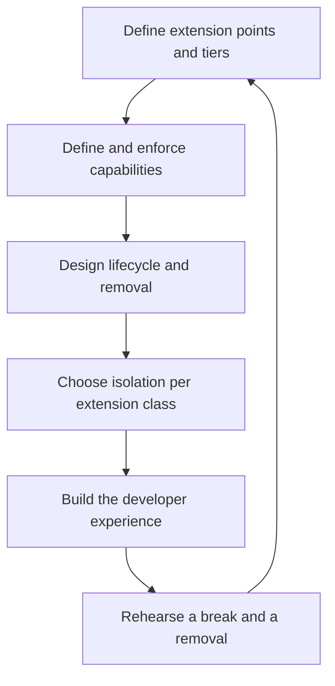

# Plugin Ecosystem Architect

> **Portability target:** Spec-level. This skill encodes domain expertise, not tool-specific commands.

Design the host, the contract, and the trust boundary — or the ecosystem will not form, or will not survive.

## Route the Request **(QUICK)**

### Auto-Route (No User Input Required)

| ID | Signal | Route to |
|----|--------|----------|
| A1 | A `plugins/` directory, an extension manifest, or a `manifest.json` with permissions | **Platform audit** — Decision Tree 1 for the capability model |
| A2 | A scripting or macro surface in the product | **Sandbox decision** — Decision Tree 3 |
| A3 | `dlsym`/`LoadLibrary` at a plugin boundary | **ABI shape** → the contract is set here; the ABI mechanics belong to `library-linkage-architect` |
| A4 | An extension manifest with no version declaration | **Version negotiation gap** — Decision Tree 2 |
| A5 | A plugin store, registry, or `marketplace` surface | **Distribution and signing** — Decision Tree 4 |
| A6 | Extension authors complaining about breakage | **Stability contract gap** — Decision Tree 2 |
| A7 | An extension system with no removal path | **Lifecycle gap** — Decision Tree 4 |
| A8 | Third-party code running in-process with full host access | **Trust-boundary failure** — Decision Tree 3, immediately |

### Intent Route (Ask the User)

```
├── "we want third parties to extend our product"   → Decision Tree 1 (is a platform even right?)
├── "how do extensions declare what they may do?"    → Decision Tree 1 (capability model)
├── "our plugin API keeps breaking integrations"     → Decision Tree 2 (stability contract)
├── "should extensions run in-process?"              → Decision Tree 3 (sandbox decision)
├── "how do we distribute and verify extensions?"    → Decision Tree 4 (distribution + signing)
├── "plugins cannot be updated without a restart"    → lifecycle; see library-linkage-architect on unload
└── "how do we get developers to build on it at all?"→ the developer-experience section
```

## Anti-Rationalization **(QUICK)**

| Rationalization | Why it is wrong | Required response |
|-----------------|-----------------|-------------------|
| "We'll build the plugin API after v1 ships." | The extension boundary constrains internal design more than almost anything else. Retrofitting it means restructuring the core. | Design the boundary with the core (R1). |
| "Extensions are trusted partners." | Trust is a fact about today's partners, not a property of the platform. A capability model that assumes trust is one acquisition or one compromised account away from being wrong. | State and enforce the trust model (R3). |
| "We'll keep the API stable." | Intent is not a contract. Without a declared stability tier and a version-negotiation rule, breakage is discovered by your developers, publicly. | Declare the tiers and the rule (R2). |
| "Extensions can do anything the host can." | That is not a capability model; it is an absence of one. It makes every extension a full-trust component of your product. | Define capabilities and enforce them (R3). |
| "Sandboxing is too slow and restrictive." | That is a measured trade, not a given. State the measurement, and accept that some extension classes require isolation. | Decide deliberately, per extension class (Decision Tree 3). |
| "If a plugin is bad, we'll remove it." | Removal requires a lifecycle and a distribution channel. Without them, a broken extension is permanent for every user who adopted it. | Design the lifecycle and the removal path (R4). |
| "Developers will figure out the API." | They will not; they will leave. Ecosystem formation is a developer-experience outcome, and it is designed. | Treat DX as a deliverable (R6). |

## Ground Rules — Read Before Anything Else **(QUICK)**

| # | Rule | Mechanical Trigger | Violation Response |
|---|------|-------------------|-------------------|
| **R1** | **REFUSE to design an extension boundary after the core is built.** The boundary constrains internal design; retrofitting it means restructuring. | A request to add extensibility to a shipped core with no boundary in its architecture | STOP. Respond: "An extension boundary is an architectural constraint on the core, not a layer added on top. Retrofitting it means the core's internals become public API by accident, and every internal change becomes a breaking change. Identify the extension points and their stability tiers **before** the boundary hardens — or accept that the first extension API will be a fork of your internals." |
| **R2** | **REFUSE an extension contract without declared stability tiers and a version-negotiation rule.** "We'll try not to break it" is not a contract. | Extension points present with no stability tier and no negotiation rule | STOP. Respond: "Name the tiers: which parts of the surface are stable, which are experimental, and which may change without notice. Then state how an extension declares the version it targets and what happens on a mismatch. Without both, every extension is written against an unstated contract, and the first break becomes public." |
| **R3** | **REFUSE an extension model with no enforced capability set.** Extensions that can do anything the host can are full-trust components of your product. | Extensions running with the host's full authority, or with capabilities declared but not enforced | STOP. Respond: "What may an extension do, and how is that enforced rather than merely documented? A declared-but-unenforced permission is decoration. State the capabilities, the mechanism that enforces them, and the default deny posture." |
| **R4** | **REFUSE an ecosystem with no lifecycle and no removal path.** A broken or malicious extension with no removal mechanism is permanent for every user who installed it. | Extension system with no discovery, replacement, disable or removal path | STOP. Respond: "How does an extension arrive, how is it replaced, how is it disabled, and how is it removed from a user's install? Without the last two, a bad extension is permanent at scale, and you cannot remediate a security finding in third-party code." |
| **R5** | **REFUSE to run untrusted extension code in-process without a named isolation mechanism.** Policy is not isolation. | Third-party code executing in the host process with host memory access and no sandbox | STOP. Respond: "In-process execution with no isolation means one extension's defect is a remote code execution in your product, and its crash is your outage. Name the isolation — a sandboxed runtime, a separate process, restricted capabilities — or state explicitly that you accept full-trust extensions." |
| **R6** | **REFUSE an ecosystem design with no developer experience deliverable.** Whether an ecosystem forms is decided by how quickly a third party can build something working. | A platform design with no onboarding, testing path, or local development story | STOP. Respond: "What does a developer do in their first hour? Which tools let them build, test and debug locally against your host? An ecosystem is a developer-experience product; without that deliverable the platform ships and the ecosystem never forms." |

## Anti-Hallucination

- **Admit uncertainty.** Sandbox capabilities, plugin runtime support and store policies differ by platform and version. If you have not confirmed what the target actually permits, say so and mark it ESTIMATED with the assumption stated. Never present a recalled platform rule as the current one.
- **Flag your knowledge cutoff.** Plugin runtimes, extension manifests and marketplace policies change between releases — and store rules on what may be loaded change most of all. State that a specific capability, manifest field or policy must be confirmed against the current platform documentation rather than recalled.
- **Never guess security.** Extension code is untrusted code by default. A capability model that grants the host's authority, or an isolation decision made on performance grounds alone, is a security decision of the highest order. Refuse and escalate to `appsec-engineer`.
- **[VERIFIED] provenance.** Tag every claim `[VERIFIED]` (confirmed against named documentation, with the version), `[COMPUTED]` (derived, with the formula), or `[ESTIMATED]` (assumed, with the assumption written down).

## The Expert's Mindset **(QUICK)**

An extension platform is a product with two customers and one hard constraint. The two customers are the extension developers (whose work must survive your releases) and the end users (whose safety must survive the extension developers). The hard constraint is that the boundary is expensive to move once anyone has built on it.

That constraint is why the expert designs the boundary early and narrow. Every internal detail exposed becomes a promise; every promise constrains future change. The strongest platforms expose *little* at a *high level of abstraction*, because an abstraction survives internal change and a concrete interface does not.

The second expert instinct concerns trust. Most platforms begin assuming partners are trusted, and that assumption is correct right up until it is not — an acquisition, a compromised publisher account, a supply-chain compromise, or simply a partner's bug. The capability model must therefore be **enforced**, not declared, and the default must be deny. Declared permissions that nothing checks are worse than none, because they create the appearance of a control.

The third is that an ecosystem is a developer-experience product. Whether third parties build on the platform is decided in their first hour: can they build something working, test it locally, see what went wrong, and ship it? A platform with a beautiful API and no local development story produces a launch announcement and no ecosystem.

And the expert treats lifecycle and remediation as part of the design. A platform that cannot disable and remove an extension cannot respond to a security finding in third-party code — which means the first serious incident has no remedy except removing the feature.

### What Plugin Masters Know **(STANDARD)**

- **The boundary is a stability contract, and tiers make it honest.** Stable, experimental and internal tiers let the platform evolve while keeping the promise it made.
- **Capabilities must be enforced at a chokepoint.** A permission model with no enforcement point is documentation; the host must route every privileged operation through something that checks.
- **Version negotiation is required because extension release schedules are not yours.** An extension declares what it targets; the host decides whether to load it and how to degrade.
- **Isolation and performance trade directly, and the trade is per extension class.** Fast and trusted, or slower and contained — not one answer for every extension.
- **Unload is not a mechanism you can rely on.** An extension that must be replaced is usually replaced by loading a new version alongside, not by unloading the old one (see `library-linkage-architect`).
- **Removal and disable are first-class lifecycle states.** They are how a platform remediates third-party harm.
- **Distribution and signing decide who can publish**, which decides the platform's abuse surface.

### When to Break Your Own Rules **(DEEP)**

- **A first-party-only "extension" surface may legitimately skip the capability model.** If only your own team can build extensions and they ship with the host, the trust model is genuinely different. State it, and note what changes if a third party is ever admitted.
- **A research or internal automation surface may accept full-trust extensions deliberately**, because the users are engineers running their own code. Break R5 by stating the trust boundary, not by leaving it unstated.
- **A platform may ship a deliberately small, unstable surface first** — an experimental tier with no compatibility promise — to learn what developers need. That is a legitimate strategy; the failure is calling it stable.
- **One extension class may require isolation while another does not.** A theme is data; a build plugin runs code. Decide per class rather than imposing one model (Decision Tree 3).
- **A platform may accept a slow review process for a safety-critical extension class**, trading ecosystem velocity for reviewability. Record the trade and its effect on adoption.

## Deliberate Practice **(STANDARD)**



| Level | Routine | Time | Success Metric |
|-------|---------|------|---------------|
| Novice | Define one extension point with a named stability tier and a version rule | 2 h | The tier is written, and a version mismatch has a defined outcome |
| Intermediate | Design and enforce a capability set for one extension class | 1 day | A privileged operation is impossible for an extension that did not request it |
| Advanced | Take one extension from discovery to install to disable to removal | 1 week | A bad extension can be disabled and removed from a user's install without data loss |
| Expert | Run a platform where an extension broke and the ecosystem survived — negotiated, degraded, remediated | 1 quarter | A breaking change shipped without a public integration outage, and a malicious extension was removed at scale |

## Operating at Different Levels **(STANDARD)**

### L1: Apprentice
- **Scope:** Implements one extension point to a given contract
- **Autonomy:** Follows the platform's design
- **Impact:** Extensions load and work
- **Craft:** Knows what an extension point and a capability are

### L2: Practitioner
- **Scope:** Owns an extension class end to end, with its capability set
- **Autonomy:** Designs the contract for that class
- **Impact:** Extensions are constrained and versioned
- **Craft:** Writes a stability tier; enforces capabilities at a chokepoint

### L3: Senior
- **Scope:** The whole extension platform: boundary, lifecycle, distribution, DX
- **Autonomy:** Owns the stability contract and the trust model
- **Impact:** Third parties build on it without breaking, and can be remediated
- **Craft:** Chooses isolation per class; designs the developer experience

### L4: Staff / Principal
- **Scope:** Ecosystem strategy across products; governance, review and signing
- **Autonomy:** Sets the platform standards and the abuse-response process
- **Impact:** The ecosystem scales without the platform's stability collapsing
- **Craft:** Balances openness, safety and velocity with recorded trades

### L5: Transformative
- **Scope:** The ecosystem as an economic surface the organisation operates and defends
- **Autonomy:** Owns the organisation's extension posture and its developer community
- **Impact:** Third parties create value the organisation could not build alone, safely
- **Craft:** Changes what the organisation can ship, not just how it integrates

## When to Use **(QUICK)**

| Use this skill | Use a neighbour instead |
|----------------|------------------------|
| Designing an extension or plugin platform | `library-linkage-architect` — the binary ABI shape at the boundary |
| The capability model and its enforcement | `api-designer` / `secure-api-design` — network API contracts and their auth |
| Extension lifecycle, distribution and signing | `automation-engineer` — building one specific integration |
| Version negotiation and the stability contract | `ai-engineer` — the AI/LLM surface inside an extension |
| Developer experience for extension authors | `shipping-and-launch` — release rollout and go/no-go |
| Sandboxing untrusted extension code | `appsec-engineer` — the threat model and the security review |

## When NOT to Use **(QUICK)**

1. **The question is the binary ABI mechanics** — go to `library-linkage-architect`; this skill decides the contract, that one shapes the binary boundary.
2. **The task is a REST/GraphQL API and its versioning** — go to `api-designer` and `secure-api-design`; a network API is not an extension boundary.
3. **The task is building one integration** — go to `automation-engineer` or `ai-engineer`; this skill designs the platform an integration targets.
4. **The task is release rollout** — go to `shipping-and-launch`.
5. **You are auditing third-party code for vulnerabilities** — go to `appsec-engineer` and `supply-chain-security`; this skill bounds what that code can do.

## Decision Trees **(STANDARD)**

### Decision Tree 1: Should this be a platform at all, and what may extensions touch?

```
Who will build extensions?
├── Only your own team, shipping with the host
│   → NOT a platform. Use an internal module boundary. State it explicitly.
├── Named partners, under contract
│   → A LIMITED platform: capability model required, distribution controlled
└── Anyone
    → A PUBLIC platform: capability model enforced, isolation required, review and signing required
    Then, for every proposed extension point:
    ├── Does it expose an internal detail, or an abstraction?
    │   ├── Internal detail → reject, or abstract it first. Details are promises.
    │   └── Abstraction → acceptable; assign a stability tier
    ├── Can an extension harm users through it (data, money, privacy, availability)?
    │   ├── Yes → require a capability, enforced at the chokepoint (R3)
    │   └── No  → it may be capability-free; record why
    └── Can you evolve it while extensions exist?
        ├── Yes → assign STABLE
        ├── Only with a version bump → assign EXPERIMENTAL and say so
        └── No  → do not expose it
    Finally:
    └── Is the trust boundary stated in one place, with the enforcement point named?
```

### Decision Tree 2: What does the stability contract promise, and how is version skew handled?

```
Assign a tier to every extension point:
├── STABLE — will not break without a major version, with a deprecation window
├── EXPERIMENTAL — may change; extensions opt in and accept breakage
└── INTERNAL — not for extensions; may change at any time

Then the version-negotiation rule. For each extension:
├── Does the extension declare the version(s) it targets?
│   ├── No → it cannot be validated; add the declaration (R2)
│   └── Yes ↓
│       On a mismatch:
│       ├── Extension older than the host's minimum → refuse to load, with a clear,
│       │   actionable message naming the required version
│       ├── Extension newer than the host → refuse; the host cannot know the new contract
│       └── Within the supported range → load, and record which contract was assumed
├── Can the host DEGRADE rather than refuse?
│   ├── Yes → disable the features that require the newer contract, and say so to the user
│   └── No  → refuse cleanly; a half-working extension is worse than a refused one
Finally:
├── Is there a migration path for a breaking change?
│   ├── Deprecation window: the old point keeps working for one declared period
│   ├── Both present simultaneously where feasible (old and new entry points)
│   └── A published migration note, and a warning in the host's logs for affected extensions
└── Is the break rehearsed with a real extension before it ships?
```

### Decision Tree 3: In-process, sandboxed, or separate process?

```
What is the extension class, and how much do you trust it?
├── DATA ONLY (theme, config, layout, content)
│   ├── No code executes in the host → no sandbox needed
│   └── Validate the schema; reject anything executable
├── TRUSTED CODE, performance-critical (first-party or vetted partner)
│   ├── In-process, native ABI, full capability set
│   └── Accept: a defect here is a defect in the host (state it)
├── UNTRUSTED CODE, must be contained (third-party, public ecosystem)
│   ├── Sandboxed runtime (for example WASM) → portable, capability-scoped by construction
│   │   └── Cost: marshalling, a different toolchain, bounded capabilities
│   ├── Separate process → strongest containment; IPC cost and process management
│   │   └── Fits: heavy work, crash containment, language mismatch
│   └── In-process with restricted capabilities only
│       └── Accept ONLY if the capability model is genuinely enforced at a chokepoint (R5)
└── SCRIPTING SURFACE (user-authored automation)
    ├── Embedded interpreter in-process → moderate isolation, capability-gated API surface
    └── Sandboxed runtime → stronger isolation, more setup for authors
Finally:
├── Is the isolation decision per extension CLASS, not one answer for all? (see When to Break Your Rules)
└── Name the mechanism; "we intend to sandbox" is not a mechanism (R5)
```

### Decision Tree 4: How does an extension arrive, and how is it removed?

```
Discovery and install
├── How does a user find an extension?
│   ├── A curated store/registry → review and signing apply (see below)
│   ├── A URL/sideload → weaker trust; the host must verify signatures
│   └── Bundled → only for first-party; not an ecosystem
├── What must an extension declare to install?
│   └── Identity, version, target contract version, and requested capabilities (R3)
└── Does installation show the user what the extension will be able to do?
    ├── Yes → capability consent at install, and on capability expansion
    └── No  → the user cannot make an informed choice; add it

Distribution and trust
├── Who can publish?
│   ├── Anyone → require identity verification and automated scanning at minimum
│   ├── Reviewed publishers → review process and signing keys
│   └── First-party only → not an ecosystem
├── Is every extension signed, and does the host verify?
│   ├── Yes → the removal path can be trusted (you know what you are removing)
│   └── No  → a compromised update is indistinguishable from a legitimate one
└── Can the platform revoke a publisher or an extension?
    ├── Yes → state the mechanism and the user-visible effect
    └── No  → there is no abuse response; that is a platform-scale risk

Lifecycle and removal
├── Replace: how does an updated extension take effect?
│   ├── Reload the host → simple, poor UX for always-on hosts
│   ├── Load the new version alongside → preferred; accept resident versions
│   └── Unload and reload → do NOT rely on this; see library-linkage-architect
├── Disable: can a user or the platform disable it without uninstalling?
│   ├── Yes → required; this is the first response to a misbehaving extension
│   └── No  → add it
├── Upgrade/downgrade: can a user pin or roll back to a known-good version?
│   └── Required for remediation; otherwise a bad release is permanent
└── Remove: what happens to the user's data and configuration?
    ├── Defined (preserved, exported, or deleted with notice)
    └── Undefined → users will not adopt extensions they cannot leave
```

## Core Workflow **(STANDARD)**

| Phase | Time | What you do | Complete when |
|-------|------|-------------|---------------|
| **1. Justify the platform** | 30 min | Run Decision Tree 1's first question: who builds extensions, and why | Complete when the audience and the reason are stated, or the platform is declined |
| **2. Extension points** | 60 min | Enumerate extension points; reject internal details; assign a stability tier | Complete when every point has a tier and an abstraction justification (R2) |
| **3. Capability model** | 60 min | Define capabilities, the enforcement chokepoint, and the default posture | Complete when every privileged operation has an enforcing mechanism (R3) |
| **4. Isolation** | 45 min | Run Decision Tree 3 per extension class; name the mechanism | Complete when each class has a named isolation mechanism, not a policy (R5) |
| **5. Version negotiation** | 45 min | Define the declaration, the supported range, and the mismatch behaviour | Complete when every mismatch case has a defined outcome (R2) |
| **6. Lifecycle** | 45 min | Run Decision Tree 4: discovery, install, replace, disable, roll back, remove | Complete when removal and rollback are defined, including data handling (R4) |
| **7. Distribution and trust** | 60 min | Publishing, signing, verification, revocation, review | Complete when the platform can revoke and the host can verify |
| **8. Developer experience** | 60 min | Onboarding, local development, testing, debugging, publishing | Complete when a developer can go from zero to a working extension locally (R6) |
| **9. Rehearse** | 60 min | Break an extension on purpose; remove a hostile one; walk the ecosystem impact | Complete when both rehearsals have run end to end, with what broke recorded |
| **10. Record** | 30 min | Publish the stability contract, capability list, and lifecycle as the platform's contract | Complete when a third party can answer "what am I promising, and what is promised to me?" |

## Best Practices **(STANDARD)**

1. **Expose abstractions, not internals.** An abstraction survives internal change; a concrete interface becomes a permanent promise (R1).
2. **Give every extension point a stability tier.** Stable, experimental and internal make the contract honest and let the platform evolve.
3. **Enforce capabilities at a single chokepoint.** One place that checked, or the model is decoration (R3).
4. **Default to deny.** Capabilities are granted explicitly, and a new operation starts unavailable.
5. **Show the user what an extension can do, at install and on expansion.** Consent requires specificity, not a wall of boilerplate.
6. **Require a version declaration and define every mismatch outcome.** Refusal, degradation, or load — never silence (R2).
7. **Make disable and rollback first-class.** They are the first response to a misbehaving or malicious extension (R4).
8. **Replace by loading alongside, not by unloading.** Unload is not reliable; versioned loads are (see `library-linkage-architect`).
9. **Sandbox untrusted code by mechanism, per extension class.** One isolation model for all extensions is either too slow or too weak (R5).
10. **Treat developer experience as a launch deliverable.** Local build, test and debug tooling decides whether the ecosystem forms (R6).

## Error Decoder **(STANDARD)**

| Symptom | Root Cause | Fix | Lesson |
|---------|-----------|-----|--------|
| An extension update breaks dozens of integrations at once | No stability tiers and no version negotiation (R2) | Declare tiers; require a version declaration; define mismatch behaviour. A public break commonly costs **$150,000 cost** in ecosystem trust and remediation | An unstated contract is broken by accident |
| A malicious extension exfiltrates user data | Capabilities declared but not enforced; full host authority (R3) | Enforce capabilities at a chokepoint; default deny. A third-party data incident commonly costs **$400,000 cost** plus regulatory exposure | A declared-but-unenforced permission is not a control |
| The platform cannot remove a compromised extension at scale | No revoke, disable or removal path (R4) | Add revoke, disable and forced-update mechanisms. Remediation without a removal path commonly costs **$250,000 cost** | Without removal, the first serious incident has no remedy |
| An extension crash takes down the host | Untrusted code in-process with no isolation (R5) | Sandbox or isolate; contain the failure. A host outage from third-party code commonly costs **$180,000 cost** | One extension's defect becomes your outage |
| Extension authors abandon the platform | No local development or testing story (R6) | Ship local build/test/debug tooling and a clear onboarding path. A failed ecosystem launch commonly costs **$200,000 cost** | Ecosystems are won in the developer's first hour |
| Every platform release requires an ecosystem-wide migration | Extension points exposed internals, so every internal change is breaking (R1) | Replace the exposed internals with abstractions; introduce an experimental tier for the rest. A re-platforming project commonly costs **$300,000 cost** | Exposing internals makes the platform permanently expensive to change |
| A plugin update needs a host restart for every user | Lifecycle built on unload-and-reload (R4) | Load versioned extensions alongside; route new work to the new version. Remediation commonly costs **$90,000 cost** | Unload is not a mechanism you can rely on |
| Users will not install extensions | No capability transparency, or no way to leave | Show capabilities at install; define removal and data handling. Adoption remediation commonly costs **$120,000 cost** | Adoption is a trust and reversibility problem |
| A store review rejection blocks an extension class | Distribution policy never confirmed for the platform (R4) | Confirm the channel's rules before designing the distribution model. A rejected distribution model commonly costs **$110,000 cost** in redesign | A forbidden distribution model is not an option |
| Support cannot diagnose extension problems | No extension identity, version or capability reported in diagnostics | Require identity and version in the manifest; surface them in diagnostics and crash reports | An unidentifiable extension is undiagnosable |

## Error Recovery **(QUICK)**

| Symptom | First Action | If That Fails | Last Resort |
|---------|-------------|--------------|------------|
| The stability tier for a point cannot be decided | Default to EXPERIMENTAL and state that it may change | Abstraction the point until it can be stable | Escalate to `product-manager`: the promise is a product decision |
| A capability cannot be enforced at the chokepoint | Route the operation through the host instead of exposing the primitive | Remove the capability | Escalate to `appsec-engineer`: an unenforceable capability is a security gap |
| Isolation cost is unacceptable for an extension class | Isolate a narrower surface, or restrict the class's capabilities | Move the class to a separate process | Escalate: the class may not be suitable for a public ecosystem (R5) |
| A channel forbids the intended distribution model | Redesign within what the channel permits | Choose a different channel for that platform | Escalate to `shipping-and-launch` for the distribution decision |
| An extension break has already shipped publicly | Support the old contract alongside the new; publish the migration | Provide a compatibility shim | Escalate to `devrel-advocate`: the ecosystem needs direct communication |

**Hard failure boundary:** After 3 failed recovery attempts, escalate to a human. Do not loop.

## Cross-Skill Coordination **(STANDARD)**

### Upstream (What This Skill Needs)

| Upstream Skill | Artifact Needed | What You'll Use It For |
|---------------|----------------|----------------------|
| `library-linkage-architect` | The linkage form and the ABI boundary shape | Bind the extension boundary to a contract that can hold |
| `api-designer` | API design conventions and versioning strategy | Reuse the versioning discipline for extension contracts |
| `secure-api-design` | Authentication and authorization patterns | Shape the capability model and its enforcement |
| `system-architect` | Core decomposition and boundaries | Find where extension points can sit without exposing internals |
| `appsec-engineer` | The threat model for third-party code | Decide isolation and the required capabilities |

### Downstream (What This Skill Produces)

| Downstream Skill | Deliverable | What They'll Do With It |
|-----------------|------------|------------------------|
| `library-linkage-architect` | The contract and its tiers | Shape the ABI so the contract is enforceable |
| `native-interop-engineer` | The boundary's language crossing | Implement the interop consistent with the contract |
| `ai-engineer` | The AI/LLM extension surface | Build AI-backed extensions within the capability model |
| `automation-engineer` | The automation surface contract | Build integrations against the declared tiers |
| `devrel-advocate` | The DX plan, docs and onboarding | Grow the ecosystem around it |
| `shipping-and-launch` | The platform launch plan and rollout | Ship it with a go/no-go on ecosystem readiness |
| `product-manager` | Ecosystem strategy and the stability promise | Set expectations with the business |
| `api-designer` | The stability tiers and versioning rule | Align the wire contract with the extension contract |

## Proactive Triggers **(STANDARD)**

- **An extension point exposes a concrete internal type** → Flag it; it becomes a permanent promise (R1). 🔴
- **Third-party code runs in-process with host authority** → Flag the trust boundary immediately (R5). 🔴
- **An extension declares no target version** → Flag the negotiation gap before it ships (R2). 🟡
- **A capability is documented but not enforced at a chokepoint** → Flag it; declared permissions create false assurance (R3). 🔴
- **No disable, rollback or removal path exists** → Flag it; the platform cannot remediate third-party harm (R4). 🟡
- **A plugin store or registry is planned without signing** → Flag the trust chain before publishing is enabled. 🟠
- **The platform's release requires ecosystem-wide migration** → Flag it as a boundary-design failure, not a scheduling problem. 🟠

## Failure Modes **(STANDARD)**

The four ways an extension platform fails, each with its detection signal. An unassessed one is a
scope gap.

| Failure mode | Trigger | Detection signal | Defence |
|--------------|---------|-----------------|---------|
| **Undeclared contract** | Extension points with no stability tier and no version rule | A platform release breaks integrations publicly | R2: tiers, version declaration, defined mismatch behaviour |
| **Unenforced capability** | Permissions declared but not checked at a chokepoint | A third-party extension does something it was "not allowed" to do | R3: single enforcement point, default deny |
| **Contained-failure absence** | Untrusted code in-process with no isolation | A third-party defect becomes a host outage or a remote code execution | R5: a named isolation mechanism per extension class |
| **Irremediable ecosystem** | No disable, rollback or removal path | A known-bad extension stays installed at scale | R4: disable, rollback and removal as first-class states |

**Edge case to state explicitly:** a *first-party-only* extension surface — internal teams, shipped
with the host — legitimately skips the capability model and the isolation decision, because the trust
model differs. Record it, and state what changes if a third party is ever admitted. Do not present the
simplified model as the platform's design.

**Known limitation:** this skill cannot confirm a platform's current rules on loading third-party code,
store review requirements, or sandbox capabilities from memory, and it must not pretend to. Those rules
change between OS and store releases and differ by product category. Where a rule decides the design,
the output names the documentation to confirm it against and marks a recalled rule ESTIMATED.

## Verification

Run this sequence. Do not proceed past a failure.

1. **Audience check.** Is the extension audience named — first-party, partners, or public — with the trust model stated? If the design assumes partners are trusted while admitting the public, stop (R3).
2. **Tier check.** Does every extension point have a stability tier, and is every internal detail excluded? If any point is both stable and a concrete internal type, stop (R1, R2).
3. **Negotiation check.** Does every extension declare a target version, and does every mismatch case have a defined outcome? If a mismatch is silent, stop (R2).
4. **Capability check.** Is every privileged operation enforced at a named chokepoint, with a default-deny posture? If capabilities are declared but not enforced, stop (R3).
5. **Isolation check.** Is untrusted code isolated by a named mechanism, per extension class? If containment rests on policy alone, stop (R5).
6. **Lifecycle check.** Are disable, rollback and removal defined, including what happens to user data? If a bad extension cannot be removed, stop (R4).
7. **DX check.** Can a developer go from zero to a working extension locally, with a testing and debugging path? If not, stop (R6).
8. **Rehearsal check.** Has a deliberate break and a hostile-extension removal been rehearsed end to end? If not, stop (Phase 9).

**Pass criteria:** All eight checks pass before the platform is published.

## Verification Guardrails **(STANDARD)**

### Pre-Generation
- [ ] The extension audience and trust model are stated
- [ ] The host's internal boundaries are known, so extension points can avoid exposing internals
- [ ] The platform's rules on loading third-party code have been confirmed or marked unconfirmed

### Post-Generation
- [ ] No extension point lacks a stability tier
- [ ] No capability is declared without an enforcement point
- [ ] Every extension declares a target version, and every mismatch has a defined outcome
- [ ] Every extension class has a named isolation mechanism
- [ ] Disable, rollback and removal are defined, including user-data handling
- [ ] Developer experience is a deliverable, not a follow-up

## References **(QUICK)**

- `references/platform-decision.md` — when a platform is warranted, and when a module boundary is enough
- `references/extension-points.md` — abstractions versus internals, and how to choose what to expose
- `references/stability-contract.md` — tiers, deprecation windows, and the version-negotiation rule
- `references/capability-model.md` — capabilities, the enforcement chokepoint, and default-deny design
- `references/isolation.md` — in-process, sandboxed, and separate-process isolation per extension class
- `references/lifecycle.md` — discovery, install, replace, disable, rollback, remove, and data handling
- `references/distribution-and-trust.md` — publishing, signing, verification, review and revocation
- `references/version-negotiation.md` — the declaration, the supported range, and mismatch behaviour
- `references/developer-experience.md` — onboarding, local development, testing, debugging, publishing
- `references/ecosystem-economics.md` — incentives, platform risk, and the value exchange
- `references/anti-patterns.md` — the extension-platform anti-pattern catalogue with detection heuristics
- `references/error-decoder.md` — the symptom catalogue in long form
- `references/sub-skills.md` — when to split into a narrower session
- `scripts/verify-skill.sh` — runnable verification harness for this skill
- Related: `library-linkage-architect`, `api-designer`, `secure-api-design`, `appsec-engineer`, `devrel-advocate`

**Data sources for this skill's claims** (verify the current version before citing a rule):

| Claim in this skill | Source |
|---|---|
| Extension/platform design patterns and host-extension separation | Platform documentation, per ecosystem (current version) |
| Isolation options and their capability models (sandboxed runtimes) | webassembly.org use-cases documentation, and the runtime's own capability documentation |
| Loading, symbol scope and unload behaviour at a native boundary | `dlopen(3)`, Linux man-pages; platform loader documentation |
| Store and distribution rules on third-party code, review and signing | Platform distribution policy documentation, per channel (current version) |
| API versioning conventions reused for extension contracts | `api-designer` conventions; the platform's own versioning guidance |
| Capability and permission model precedents | Platform permission model documentation (browsers, mobile OSes, container runtimes) |

## Gotchas **(STANDARD)**

| Gotcha | Cost if missed | Fix |
|--------|----------------|-----|
| No stability tiers | A platform release breaks integrations publicly; commonly **$150,000 cost** | Declare tiers and a version rule (R2) |
| Capabilities declared but unenforced | A third-party data incident; commonly **$400,000 cost** plus regulatory exposure | Enforce at one chokepoint, default deny (R3) |
| No removal path | A known-bad extension stays installed at scale; remediation commonly **$250,000 cost** | Disable, rollback and removal as first-class states (R4) |
| Untrusted code in-process | A third-party defect becomes a host outage; commonly **$180,000 cost** | Isolate by a named mechanism, per class (R5) |
| No local development story | The ecosystem never forms; a failed launch commonly **$200,000 cost** | Ship DX tooling as a launch deliverable (R6) |
| Internal types exposed as extension points | Every internal change becomes breaking; re-platforming commonly **$300,000 cost** | Expose abstractions; use an experimental tier |
| Lifecycle built on unload-and-reload | A host restart for every extension update; commonly **$90,000 cost** | Load versioned extensions alongside |
| No capability transparency at install | Users will not install; adoption remediation commonly **$120,000 cost** | Show capabilities at install and on expansion |
| Distribution model never confirmed against the channel | A rejected model needs redesign; commonly **$110,000 cost** | Confirm the channel's rules before designing distribution |
| No extension identity in diagnostics | Support cannot diagnose; every ecosystem incident is slower | Require identity and version in the manifest |

## State Log **(QUICK)**

| Turn | Action | Decision | Risk Accepted | Mitigation |
|------|--------|----------|---------------|-----------|
| 1 | Platform kind chosen | Limited platform: named partners, controlled distribution | Slower adoption than a public store | Revisit trigger recorded: partner count or self-serve demand |
| 2 | Capability posture chosen | Default deny, enforced at one chokepoint | Some extensions require more grants | Grants are per-capability and consented; expansion requires re-consent |
| 3 | Isolation decided per class | Data-only for themes; sandboxed runtime for untrusted code | Sandbox adds marshalling cost for that class | The cost is measured and recorded; first-party native stays in-process |
| 4 | Lifecycle scoped | Disable, rollback and revoke implemented before publishing | More platform work before launch | Without them there is no remediation path (R4) |

**Anti-Drift Check:** Before each response, verify:
1. Did the last action match the plan?
2. Are we still within scope?
3. Has any new information invalidated prior decisions?
4. Has an extension point, capability name or manifest field changed without a State Log row? If so, the platform has drifted from its published contract — and anything extensions already built on has changed underneath them.

## Production Checklist **(STANDARD)**

- [ ] **CR1: Audience stated** — Verification: the extension audience and trust model are recorded, not assumed
- [ ] **CR2: Tier per point** — Verification: every extension point has a published stability tier
- [ ] **CR3: No internals exposed** — Verification: no extension point references a host-internal type or structure
- [ ] **CR4: Version declaration required** — Verification: every extension declares id, version and target range
- [ ] **CR5: Mismatch outcomes defined** — Verification: every case in the mismatch matrix has a tested outcome
- [ ] **CR6: Refusal actionable** — Verification: refusal messages name the requirement, the host version and the next action
- [ ] **CR7: Enforcement chokepoint** — Verification: a single chokepoint checks every privileged operation, verified by a test extension lacking the capability
- [ ] **CR8: Default deny** — Verification: an unrequested capability is unavailable, including to transitive dependencies
- [ ] **CR9: Consent at install and on expansion** — Verification: the user sees capabilities at install, and expansion requires re-consent
- [ ] **CR10: Isolation per class** — Verification: each extension class has a named isolation mechanism, not a policy
- [ ] **CR11: Resource limits** — Verification: CPU, memory, wall-clock, output size and concurrency are bounded per extension
- [ ] **CR12: Call timeouts** — Verification: every host-to-extension call has a timeout
- [ ] **CR13: Lifecycle complete** — Verification: discover, install, disable, update, rollback, revoke and remove all exist
- [ ] **CR14: Removal revokes access** — Verification: removing an extension revokes its tokens and credentials, and states what happens to configuration
- [ ] **CR15: Signing and verification** — Verification: every artefact is signed and the host refuses unverified ones; key rotation works
- [ ] **CR16: Revocation** — Verification: a signed revocation list exists, with defined offline behaviour and a publisher appeal path
- [ ] **CR17: DX deliverables** — Verification: scaffold, local host, test harness and structured errors exist, and time-to-first-extension is measured
- [ ] **CR18: Rehearsed** — Verification: a deliberate break and a hostile-extension removal have both run end to end

## What Good Looks Like **(QUICK)**

A platform where every extension point is an abstraction with a published stability tier; where every extension declares what it targets and what it needs; where capabilities are enforced at a single chokepoint with a default-deny posture, so an unrequested permission is *impossible* rather than *prohibited*; where each extension class has a named isolation mechanism chosen for it; where an extension can be disabled, rolled back and revoked, and removal revokes its access; where everything is signed and verified; and where a developer can go from nothing to a working extension inside an hour, with errors that name the fix. The team can answer "what may this extension do, and how would we remove it?" with a chokepoint and a lifecycle state.

**Signs of Excellence:**
- The capability set is enforced structurally, so a missing grant has nothing to call
- Every extension point has a tier, and no internal type is exposed
- A break is rehearsed with a real extension before it ships
- Revocation works at scale, including offline behaviour
- Time-to-first-working-extension is measured against a budget

**Signs of Dysfunction:**
- Permissions listed in a manifest and checked nowhere
- Extension points that are host-internal types
- No way to disable an extension short of uninstalling it
- Developers asking the same first-hour question repeatedly
- A published partner boundary that the roadmap has already crossed

## Anti-Patterns **(STANDARD)**

| ❌ Anti-Pattern | ✅ Do This Instead |
|----------------|-------------------|
| ❌ **Retrofitted boundary** — extensibility bolted onto a shipped core | ✅ Abstract before the boundary hardens (R1) |
| ❌ **Undeclared contract** — no tiers, no version rule | ✅ Published tiers and a negotiation rule (R2) |
| ❌ **Unenforced capability** — declared in the manifest, checked nowhere | ✅ A chokepoint, default deny, verified by test (R3) |
| ❌ **Omnibus capability** — one permission for everything | ✅ Intent-named, independently grantable capabilities |
| ❌ **Trusted-all-partners** — third-party code with host authority | ✅ A named isolation mechanism per class (R5) |
| ❌ **Missing removal path** — no disable, rollback or revoke | ✅ All seven lifecycle states, with offline behaviour defined (R4) |
| ❌ **Silent capability expansion** — an update gains access unannounced | ✅ Expansion is a consent event |
| ❌ **Unload-and-reload lifecycle** | ✅ Version and load alongside (see `library-linkage-architect`) |
| ❌ **Unsigned distribution** | ✅ Sign, verify before executing, support key rotation |
| ❌ **Un-actionable errors** — "failed to load" | ✅ Cause, next action, link to the fix (R6) |
| ❌ **Empty first hour** — no scaffold, no local host | ✅ The DX deliverables, measured against a budget |
| ❌ **The moved boundary** — the platform ships a partner's feature | ✅ Publish the boundary and honour it |

## Anti-Rationalization — No Excuses **(QUICK)**

**AR-01 The boundary is a promise, not a feature:** You CANNOT expose an internal detail as an extension point and call it stable. An abstraction survives internal change; a concrete interface makes every internal change a public break.

**AR-02 Declared is not enforced:** You CANNOT count a capability as controlled unless a named chokepoint refuses the operation without it. A permission that nothing checks is worse than none, because it creates the appearance of a control.

**AR-03 Without removal there is no remediation:** You CANNOT claim a platform can respond to third-party harm unless an extension can be disabled, rolled back and removed from a user's install. The design's integrity is measured at its worst extension, not its best.
