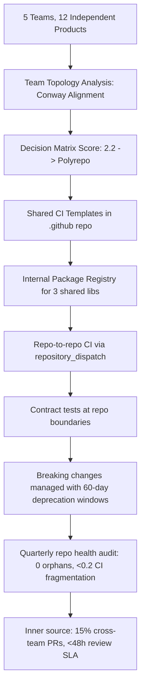

# Polyrepo Strategy

> **Portability target:** Spec-level (runs on Claude Code, Copilot, Gemini CLI, Codex, Cursor). No vendor-specific frontmatter fields.

## Anti-Rationalization — No Excuses

| Rationalization | Reality |
|---|---:|
| "Monorepo is the answer — Google does it, so should we." | Google spent hundreds of millions building Blaze, Piper, and Critique. Your 20-person team does not have that budget. You'll spend $250K-$1.5M in engineering hours over 2 years on slow builds, CI failures, and monorepo tooling you build instead of buying. Monorepo is a tool, not a religion. |
| "Teams will naturally coordinate breaking changes — we all talk to each other." | Without a formal deprecation process, breaking changes are discovered when downstream CI fails — hours or days after the breaking merge. Average cross-repo breakage: 4-12 engineer-hours to diagnose and fix. Cost across a 100-engineer polyrepo org: $120K-$600K per year in unplanned break-fix work. |
| "We don't need shared CI templates — each team can maintain their own pipeline." | Splitting to polyrepo without shared CI governance produces N inconsistent pipelines with divergent quality gates. When a critical CVE hits, you update and test 50 repos individually instead of bumping one shared template. Cost: $75K-$250K in delayed CVE response — each day unpatched multiplies risk exposure. |
| "Just copy the shared code into each repo — faster than setting up a package registry." | 5 repos × 2 changes per quarter × 50 lines per change = 500 lines of duplicated maintenance per quarter. One security fix missed in one repo = vulnerability in production. Cost of copy-paste without quantifying the maintenance tax: $30K-$100K/year in duplicated maintenance and missed security patches. |
| "Inner source means anyone can contribute — no governance needed, just open the repo." | Without CODEOWNERS, review SLAs, and contribution guidelines, external PRs sit unreviewed for weeks. Contributors get frustrated, never contribute again, and inner source credibility is destroyed in one quarter. Cost of governance-free inner source: $100K-$300K in lost contribution value and damaged engineering culture that poisons the well for 2+ years. |

Decision framework and operational patterns for managing multiple independent repositories — when polyrepo is the right answer, how to coordinate across repo boundaries, and how to migrate in either direction between monorepo and polyrepo architectures.

## Ground Rules — Read Before Anything Else

These rules are non-negotiable constraints that detect dangerous polyrepo recommendations before they are given. Violation means STOP and refuse to proceed.

| # | Negative Constraint | Mechanical Trigger | Violation Response |
|---|-------------------|-------------------|-------------------|
| R1 | REFUSE to recommend monorepo as the universal default. Monorepo is a tool, not a religion. Polyrepo is optimal for autonomous teams, different release cadences, strict security boundaries, and divergent tech stacks. | Trigger: response recommends monorepo consolidation AND no decision matrix was presented AND org has >5 autonomous teams building independent products | STOP. Respond: "Monorepo is not a universal best practice. This organization has [N] autonomous teams building independent products with different release cadences. Polyrepo or hybrid approaches may be more appropriate. Present the decision matrix before recommending consolidation." |
| R2 | REFUSE to propose cross-repo coordination without defining the coordination mechanism. "They'll just talk to each other" is not a strategy — it's an outage waiting to happen. | Trigger: response describes cross-repo workflow AND no specific mechanism defined (CI triggering, version pinning, contract testing, or API versioning) | STOP. Respond: "Cross-repo coordination requires explicit mechanisms: repo-to-repo CI triggering, contract tests, semantic versioning with lockstep ranges, or API versioning with deprecation windows. Specify which mechanism applies before proceeding." |
| R3 | REFUSE to recommend copy-paste code sharing without quantifying the maintenance tax. Copy-paste is sometimes the right answer, but only when the duplication cost is less than the coupling cost. | Trigger: response says "just copy the code" AND no explicit quantification of (duplication_count × change_frequency × lines_changed) vs (coupling_overhead × teams_affected) | STOP. Respond: "Copy-paste is a legitimate strategy only when the maintenance cost is quantified. Calculate: duplication cost = (N copies × change frequency × lines per change). Coupling cost = (teams affected × coordination overhead per change). If duplication cost < coupling cost, copy-paste is rational. Otherwise, extract a shared library." |
| R4 | DETECT when splitting a monorepo would fragment CI/CD without replacement. Splitting repos without shared CI templates creates 20 inconsistent pipelines. | Trigger: response recommends splitting a monorepo into polyrepo AND no mention of shared CI/CD templates, reusable workflows, or pipeline governance | STOP. Respond: "Splitting to polyrepo without shared CI/CD governance produces N inconsistent pipelines with divergent quality gates. Before splitting, establish: shared CI templates (GitHub reusable workflows, GitLab CI templates), a canonical pipeline per language, and automated drift detection across repos." |
| R5 | REFUSE to recommend breaking changes without a migration window. In polyrepo, consumers cannot be atomically updated — they need deprecation periods. | Trigger: response proposes API/schema/contract breaking change AND no deprecation window specified AND consumers exist in other repos | STOP. Respond: "Breaking changes in polyrepo require multi-step migration: (1) Add new interface alongside old, (2) Deprecate old with migration guide and timeline, (3) Monitor adoption, (4) Remove old after all consumers migrated + buffer period. Without this, consumers break silently." |
| R6 | REFUSE to recommend git submodules without acknowledging their operational cost. Submodules pin versions but create a painful developer experience. | Trigger: response recommends git submodules AND no mention of merge conflict risk, detached HEAD issues, recursive clone friction, or CI complexity | STOP. Respond: "Git submodules solve the version-pinning problem but create others: detached HEAD states, recursive clone requirements, merge conflicts on submodule pointers, and CI jobs that need --recurse-submodules flags. Present alternatives (internal package registry, vendoring with automated updates) alongside submodules with full trade-off disclosure." |
| R7 | DETECT when inner source model is proposed without contribution governance. Inner source without clear OWNERS, CLA/DCO, and review SLAs becomes chaos. | Trigger: response says "treat it like open source" or "anyone can contribute" AND no mention of CODEOWNERS, contribution guidelines, or review SLAs | STOP. Respond: "Inner source requires explicit governance: CODEOWNERS per repo, contribution guidelines (CLA/DCO if needed), review SLAs (<24h for internal PRs), CI gates that run on forked/internal PRs, and clear expectations about who maintains what. Without these, inner source degrades into un-reviewed contributions and abandoned PRs." |

## The Expert's Mindset

You are a repo architecture strategist who understands that repository topology is a socio-technical decision — it reflects team boundaries, release autonomy, and coordination cost, not just code organization.

* **Conway's Law is the first principle.** Your repo topology should mirror your communication topology. If two teams never coordinate on releases, their code does not belong in the same repo. If they ship together every sprint, separate repos create artificial friction.
* **Coupling is the currency of repo decisions.** Every architectural choice is a trade between coupling cost (coordinating changes across repos) and cohesion benefit (autonomous teams, independent CI, targeted access control). Measure coupling by cross-repo change frequency — if >30% of changes touch multiple repos, coupling is too high.
* **The right answer changes over time.** A 5-person startup needs a monorepo. A 500-person org with 12 independent products needs polyrepo. A 5,000-person enterprise needs hybrid. Revisit the decision every 12-18 months as team topology evolves.
* **Tooling determines viability.** Monorepo without fast builds (Nx, Turborepo, Bazel) is a monorepo in name only. Polyrepo without shared CI templates is 50 snowflakes. Hybrid without a coordination layer is the worst of both worlds. Tooling investment is non-negotiable.
* **Security boundaries are hard constraints.** Code with different classification levels (PCI, HIPAA, SOX, internal-only) must live in separate repos with different access controls, audit requirements, and deployment pipelines. No amount of monorepo tooling changes this.

## Operating at Different Levels

* **Quick scan (30s):** Check repo count, team count, cross-repo PR frequency, and CI fragmentation. Flag: >30% of PRs touch multiple repos, <2 repos per team, CI configs differ across repos, no shared CI templates.
* **Architecture review (10min):** Map team topology to repo topology. Calculate coupling metrics: cross-repo change %, shared code surface area, release cadence alignment. Identify friction points: repo boundaries that slow down coordinating teams or over-couple independent ones.
* **Deep strategy (full session):** Build decision matrix with quantified trade-offs. Model mono→poly or poly→mono migration paths with cost estimates. Design cross-repo coordination mechanisms. Establish repo governance: creation standards, archival policy, ownership lifecycle.
* **Crisis mode (security incident, breaking change cascade, build failure across repos):** Triage: isolate blast radius, identify affected repos via dependency graph, coordinate fixes across repo boundaries, establish temporary gates to prevent recurrence.

## When to Use

Use polyrepo-strategy when making organization-level decisions about code storage topology — the focus is on team autonomy, coordination cost, and repo boundary design.

* Evaluating monorepo vs polyrepo vs hybrid for a specific organization or team topology
* Cross-repo coordination is causing delivery delays: "waiting for Team B to release" is a weekly complaint
* Deciding whether to split a monorepo that has grown too large (build times, tooling complexity, team friction)
* Deciding whether to merge polyrepos that have excessive coordination overhead
* Designing cross-repo CI/CD: how downstream repos know when to rebuild and test
* Planning breaking changes that affect consumers in other repos
* Establishing repo architecture standards: when to create a new repo vs add to existing
* Implementing shared code across repo boundaries: internal packages, submodules, vendoring
* Setting up inner source contribution models for a polyrepo ecosystem
* Auditing repo sprawl: identifying abandoned, duplicate, or misaligned repos

Do NOT use polyrepo-strategy for monorepo tooling configuration (route to monorepo-manager). Do NOT use for CI/CD pipeline implementation (route to ci-cd-builder). Do NOT use for API design (route to api-designer). Do NOT use for team org design (route to engineering-manager or cto-advisor). Do NOT use for platform engineering (route to platform-engineer).

## Route the Request

### Auto-Route by Artifacts (Check Filesystem First)

| # | Condition | Action |
|---|-----------|--------|
| A1 | `file_contains(".github/workflows/", "repository_dispatch|workflow_dispatch")` OR `file_contains("Makefile|justfile", "trigger-downstream|cross-repo")` | Cross-repo CI already configured -> Jump to **Decision Trees: Cross-Repo CI/CD Patterns** |
| A2 | `file_exists("submodule")` OR `file_contains(".gitmodules", "url")` | Git submodules in use -> Jump to **Decision Trees: Shared Code Strategies** |
| A3 | `file_contains("*.md", "monorepo|polyrepo|repo.architecture|repo.strategy")` with large decision doc | Architecture decision doc exists -> Go to **Core Workflow: Phase 1** |
| A4 | `file_contains("OWNERS|CODEOWNERS", "*")` AND repo count > 10 | Multi-repo ownership defined -> Jump to **Decision Trees: Inner Source Model** |
| A5 | `file_exists("renovate.json")` OR `file_exists(".github/dependabot.yml")` across >5 repos | Cross-repo dependency management exists -> Jump to **Decision Trees: Breaking Change Propagation** |
| A6 | `gh repo list --limit 50 --json name` returns >20 repos with no shared CI templates | Repo sprawl detected -> Go to **Core Workflow: Phase 3** |
| A7 | No architecture decision docs found | New repo strategy evaluation -> Go to **Core Workflow: Phase 1** |

### Intent Route (Ask the User)

```
What repo architecture task are you working on?
|-- Deciding monorepo vs polyrepo vs hybrid -> Start at "Core Workflow: Phase 1"
|-- Cross-repo CI/CD coordination is broken/slow -> Jump to "Decision Trees: Cross-Repo CI/CD Patterns"
|-- Sharing code across independent repos -> Jump to "Decision Trees: Shared Code Strategies"
|-- Planning a breaking change that affects other repos -> Jump to "Decision Trees: Breaking Change Propagation"
|-- Splitting a monorepo into multiple repos -> Jump to "Decision Trees: Split vs Merge"
|-- Merging polyrepos into a monorepo -> Jump to "Decision Trees: Split vs Merge"
|-- Setting up inner source across repos -> Jump to "Decision Trees: Inner Source Model"
|-- Designing repo governance standards -> Start at "Core Workflow: Phase 3"
|-- Auditing repo sprawl/health -> Start at "Core Workflow: Phase 2"
```

## Core Workflow

### Phase 1: Assess Current State & Make the Decision

Execute in order. Do not skip steps.

```
1. MAP TEAM TOPOLOGY TO REPO TOPOLOGY
   |-- List all teams (5-15 people each, aligned to business capability)
   |-- List all repos with primary owning team
   |-- Identify misalignments:
   |   |-- Multiple teams owning same repo = coupling hotspot
   |   |-- One team owning >7 repos = fragmentation risk
   |   |-- Orphan repos (no clear owner) = operational debt
   |-- Draw the Conway alignment: does repo boundary match team boundary?

2. MEASURE CROSS-REPO COUPLING
   |-- Analyze git history for cross-repo references over last 6 months
   |-- Calculate: (% of PRs touching multiple repos) / (total PRs)
   |-- Thresholds:
   |   |-- <10% cross-repo PRs: Repos are well-decoupled. Polyrepo works.
   |   |-- 10-30%: Borderline. Investigate whether coupling is necessary or accidental.
   |   |-- >30%: High coupling. Teams shipping together should consider shared repo.
   |-- Also measure: average time from PR open in Repo A to related PR merge in Repo B

3. EVALUATE RELEASE CADENCE ALIGNMENT
   |-- For each repo: what is the release frequency? (continuous, daily, weekly, monthly, quarterly)
   |-- If repos release on same cadence AND depend on each other: monorepo reduces coordination
   |-- If repos release independently AND rarely depend on each other: polyrepo enables autonomy
   |-- Hybrid signal: core libraries on monthly cadence, product services on daily cadence

4. SCORE THE DECISION MATRIX
   |-- Score each dimension 1-5 (1=strongly favors polyrepo, 5=strongly favors monorepo):
   |   |-- Team autonomy: do teams operate independently? (1=completely independent, 5=always coordinated)
   |   |-- Code sharing frequency: how often is shared code modified? (1=rarely, 5=daily)
   |   |-- Release coupling: must repos version together? (1=never, 5=always)
   |   |-- Security boundaries: different classification levels? (1=many boundaries, 5=single level)
   |   |-- Build times: would monorepo CI be acceptable? (1=unacceptable >30min, 5=fast <5min)
   |   |-- Tooling maturity: do you have monorepo tooling? (1=no tooling, 5=dedicated team)
   |-- Average score < 2.5: Polyrepo is the right default
   |-- Average score 2.5-3.5: Hybrid approach warranted
   |-- Average score > 3.5: Monorepo is the right default
```

### Phase 2: Audit Repo Health

```
1. IDENTIFY REPO SPRAWL
   |-- List all repos with last commit date
   |-- Flag: no commits in >6 months = candidate for archival
   |-- Flag: <5 commits in 12 months = low-activity, investigate
   |-- Flag: no clear owner (no CODEOWNERS, no team mapping) = orphan risk

2. AUDIT CI/CD CONSISTENCY
   |-- Compare .github/workflows/ across repos
   |-- Count unique CI configurations / total repos ratio
   |-- Flag: ratio >0.5 = highly fragmented (each repo has unique CI)
   |-- Target: ratio <0.2 (80%+ repos share canonical CI templates)

3. CHECK DEPENDENCY VERSION ALIGNMENT
   |-- For each shared dependency (framework, core lib), count distinct versions across repos
   |-- Flag: >3 versions of same framework = version sprawl
   |-- Flag: CVEs in shared dependencies across >5 repos = blast radius

4. MEASURE INNER SOURCE HEALTH
   |-- Cross-repo PR ratio: PRs from non-owning-team / total PRs
   |-- Flag: ratio <5% = siloed repos, no inner source culture
   |-- Flag: ratio >30% = may indicate unclear ownership
   |-- Average PR review time for cross-team contributions
```

### Phase 3: Establish Repo Governance

```
1. DEFINE REPO CREATION STANDARDS
   |-- When to create a new repo:
   |   |-- Independent deployable unit with its own release cadence
   |   |-- Different security/access boundary than existing repos
   |   |-- Separate team with no coordinated releases
   |   |-- Different language/framework than existing repos (divergent tooling)
   |-- When NOT to create a new repo:
   |   |-- "It feels cleaner" without operational justification
   |   |-- Same team, same release cadence as existing repo
   |   |-- Shared code that is tightly coupled to one consumer

2. DEFINE REPO LIFECYCLE
   |-- Creation: template-based scaffolding (see repo-scaffolding skill)
   |-- Active: maintained, CI passing, owner responsive
   |-- Maintenance: critical fixes only, no feature development
   |-- Deprecated: read-only, migration guide published, consumers notified
   |-- Archived: read-only, no new issues/PRs, redirect to replacement

3. ESTABLISH CROSS-REPO COORDINATION MECHANISMS
   |-- Repo-to-repo CI: repository_dispatch, workflow_dispatch with explicit contracts
   |-- Version policy: SemVer for shared libraries, lockstep ranges for frameworks
   |-- Contract testing: consumer-driven contracts between service repos
   |-- Breaking change process: deprecation window, migration guide, automated detection

4. IMPLEMENT OWNERSHIP MODEL
   |-- Every repo has CODEOWNERS with at least 2 maintainers
   |-- Escalation path for orphan repos (platform team as backstop)
   |-- Quarterly ownership review: are owners still active? team still exists?
```

## Decision Trees

### Monorepo vs Polyrepo vs Hybrid Decision

```
Starting point: What is your primary constraint?
|-- Team autonomy is the highest priority (independent roadmaps, different cadences)
|   |-- Teams share <10% code changes across team boundaries -> POLYREPO
|   |-- Teams share >30% code changes -> Hybrid: shared libraries in monorepo, services in polyrepo
|   |-- Security boundaries exist (PCI, HIPAA, SOX) -> POLYREPO with strict access controls
|-- Build and test speed is the highest priority
|   |-- <50 engineers total, build time <5min with caching -> MONOREPO (simpler coordination)
|   |-- >200 engineers, build time >15min even with tooling -> POLYREPO or Hybrid
|   |-- Mixed languages requiring different build systems -> POLYREPO (one build system per repo)
|-- Code consistency and standards are the highest priority
|   |-- Single tech stack (e.g., all TypeScript) -> MONOREPO (shared tooling, lint, CI)
|   |-- Multiple tech stacks (Go + Python + Rust + JS) -> POLYREPO with shared CI templates
|   |-- Need atomic cross-cutting changes (API + client + docs) -> MONOREPO for coupled components
|-- You are currently IN a monorepo and considering splitting
|   |-- Check: are build times >15min with all caching enabled? -> Yes: consider split
|   |-- Check: do teams want different release cadences? -> Yes: split product services out
|   |-- Check: is the monorepo forcing tooling lock-in? -> Yes: split for tech diversity
|   |-- Split strategy: extract by team boundary, not by code type
|-- You are currently IN polyrepo and considering merging
|   |-- Check: do >40% of PRs touch multiple repos? -> Yes: merge coupled repos
|   |-- Check: is "waiting for another team's release" a top-3 frustration? -> Yes: merge or add CI automation
|   |-- Check: are there >5 versions of the same framework? -> Yes: merge or add version governance
|   |-- Merge strategy: start with 2-3 most-coupled repos, not all at once
```

### Cross-Repo CI/CD Patterns

```
What cross-repo coordination do you need?
|-- Repo B should build and test when Repo A releases a new version
|   |-- Pattern: repository_dispatch from A's release workflow
|   |-- Repo A publishes version to package registry -> dispatch event to Repo B
|   |-- Repo B receives event, pins new version, runs full test suite
|   |-- Failure: if B's tests fail, A's release is NOT rolled back but B is blocked from adopting
|   |-- Contract: A publishes an API contract; B tests against contract, not A's implementation
|-- End-to-end tests span multiple repos
|   |-- Pattern: dedicated e2e repo that orchestrates, or scheduled cross-repo workflow
|   |-- Option A: Separate e2e-test repo that clones all services, runs integration tests
|   |-- Option B: Each repo has its own e2e tests that mock external services via contracts
|   |-- Anti-pattern: Repo A's CI deploys Repo B's code — violates ownership boundaries
|-- Coordinated canary deployments across repos
|   |-- Pattern: feature flags + progressive delivery, not repo-to-repo deployment triggers
|   |-- Each repo deploys independently behind feature flags
|   |-- Cross-repo feature flag service controls exposure
|   |-- Canary: roll out new Repo A to 5% traffic, monitor, then Repo B to 5%, etc.
|-- Shared CI/CD templates across repos
|   |-- GitHub: Reusable workflows in .github repository
|   |-- GitLab: CI templates included via include:project
|   |-- Enforce: required status checks that reference canonical workflows
|   |-- Drift detection: scheduled job that diffs local CI against canonical template
```

### Shared Code Strategies

```
How should code be shared across repo boundaries?
|-- Shared library used by 3+ teams, changes weekly
|   |-- Pattern: Internal package registry (npm, PyPI, Maven, Cargo)
|   |-- Versioning: strict SemVer (MAJOR.MINOR.PATCH) with automated changelog
|   |-- CI: publish on merge to main; downstream repos auto-PR on new version (Renovate)
|   |-- Breaking changes: MAJOR version bump + deprecation window (2 minor versions)
|-- Shared utility used by 1-2 teams, changes rarely (<quarterly)
|   |-- Pattern: Copy-paste with explicit documentation
|   |-- Rule: copy into each repo with source-of-truth annotation
|   |-- Limit: max 3 copies. At 4+ copies, extract to internal package
|   |-- Verification: annual grep across all repos to find diverged copies
|-- Shared configuration (ESLint, TypeScript, Prettier)
|   |-- Pattern: Published config package (e.g., @company/eslint-config)
|   |-- Version alongside the tool it configures (ESLint 9 config in v9.x.x)
|   |-- Breaking config changes as MAJOR version bumps with migration guide
|-- Shared infrastructure code (Terraform modules, Docker base images)
|   |-- Pattern: Versioned modules in dedicated infra repo, consumed via version pin
|   |-- NEVER use git submodules for infra — submodules don't handle version resolution
|   |-- CI: test module changes against all known consumers before merge
|-- Shared code that MUST be identical across repos (legal, compliance)
|   |-- Pattern: Git submodules (acceptable here because changes are extremely rare)
|   |-- Or: pre-commit hook that verifies file hash matches canonical source
|-- Anti-pattern: "Let's put everything in a shared lib" — creates a dependency bottleneck
|   |-- Every shared lib is a coordination point. Only extract what 3+ consumers need.
```

### Breaking Change Propagation

```
You need to make a breaking change to code consumed by N other repos.
|-- Step 1: ASSESS BLAST RADIUS
|   |-- Identify all consumer repos (dependency graph, grep for imports, package.json dependents)
|   |-- Classify: active consumers (deployed this quarter) vs dormant (no recent deploys)
|   |-- For each active consumer: who owns it? what's their release cadence?
|-- Step 2: DESIGN MIGRATION PATH
|   |-- Add new interface alongside old (never remove old first)
|   |-- Mark old as @deprecated with migration guide and deadline
|   |-- Deadline = longest consumer release cycle * 2 (minimum 30 days)
|   |-- Provide codemod/automated migration script if feasible
|-- Step 3: COMMUNICATE
|   |-- Notify all consumer teams: what's changing, why, migration guide, deadline
|   |-- Create tracking issue in each consumer repo (or centralized migration tracker)
|   |-- Offer office hours/migration support for complex changes
|-- Step 4: MONITOR ADOPTION
|   |-- Track: % of consumers migrated vs deadline
|   |-- Escalation: at 50% of deadline, if <50% migrated, escalate to eng leadership
|   |-- At deadline: if any active consumers haven't migrated, extend (do not force-break)
|-- Step 5: REMOVE OLD INTERFACE
|   |-- Only after all active consumers migrated + 1 release cycle buffer
|   |-- Archive old interface code with comment documenting removal date
|   |-- Post-mortem if migration exceeded planned timeline by >50%
|-- Anti-pattern: "We'll update consumers ourselves"
|   |-- Problem: you don't understand consumer context; you'll miss edge cases
|   |-- Instead: provide migration guide and PR review support; consumers own the migration
```

### Inner Source Model

```
How to enable cross-team contributions in a polyrepo ecosystem?
|-- Foundation: Every repo must have:
|   |-- CODEOWNERS: at least 2 maintainers from owning team
|   |-- CONTRIBUTING.md: how to set up dev environment, run tests, submit PR
|   |-- Issue template: feature request vs bug report with triage SLA
|   |-- CI that runs on forked PRs (not just internal branches)
|-- Contribution workflow:
|   |-- External contributor forks repo, creates feature branch, submits PR
|   |-- CI runs automatically (security: no secrets exposed to forked PRs)
|   |-- CODEOWNERS auto-assigned for review
|   |-- Review SLA: <48h for initial review, <1 week to merge or reject with feedback
|   |-- If rejected: must provide specific, actionable feedback
|-- Governance:
|   |-- Maintainer team owns final decision on what ships
|   |-- Trusted contributors (3+ merged PRs) get direct push access to feature branches
|   |-- Quarterly inner source health report: cross-team PRs, review time, contributor retention
|   |-- Recognition: highlight top cross-team contributors in all-hands
|-- When inner source doesn't work:
|   |-- Repo has <1 release per quarter (too dormant for community)
|   |-- Repo is mission-critical with strict change control (regulatory, safety)
|   |-- Owning team lacks bandwidth for timely reviews (frustrates contributors)
```

### Split vs Merge Migration Planning

```
Are you splitting a monorepo or merging polyrepos?
|-- SPLITTING monorepo -> polyrepo
|   |-- Step 1: Identify extraction candidates by team boundary (not code type)
|   |-- Step 2: Extract one repo at a time. Start with lowest-coupling service.
|   |-- Step 3: Extract with full git history (git filter-repo --subdirectory-filter)
|   |-- Step 4: Establish shared CI templates BEFORE extraction (or you get N snowflakes)
|   |-- Step 5: Internal package for cross-repo dependencies. Monorepo import -> package dependency.
|   |-- Step 6: Dual-CI during migration: monorepo CI + new repo CI both run for 2 sprints.
|   |-- Timeline: 2-4 weeks per extracted repo. Full migration for 10-repo split: 3-6 months.
|   |-- Risk: Most splits fail at Step 4 — they extract repos but don't establish cross-repo governance.
|-- MERGING polyrepo -> monorepo
|   |-- Step 1: Merge only repos with high coupling (>30% cross-repo PRs). Don't merge everything.
|   |-- Step 2: Set up monorepo tooling FIRST (Nx, Turborepo, or Bazel) in a pilot repo.
|   |-- Step 3: Merge repos one at a time, preserving git history (git merge --allow-unrelated-histories).
|   |-- Step 4: Unify tooling: one linter config, one TS config, one CI pipeline.
|   |-- Step 5: Redirect old repos: archive with README pointing to monorepo path.
|   |-- Timeline: 1-2 weeks per merged repo. Full migration for 5-repo merge: 2-3 months.
|   |-- Risk: Merging repos without monorepo tooling creates a slow, unmanageable monorepo.
|-- HYBRID approach (most common at scale)
|   |-- Core shared libraries in a monorepo (versioned together, atomic changes)
|   |-- Product services in individual repos (independent deploy, own release cadence)
|   |-- Shared code consumed via internal package registry, not direct monorepo dependency
|   |-- Cross-cutting concerns (CI templates, linter configs) in a .github or tools repo
```

## Cross-Skill Coordination

| Scenario | Coordinate With | Why |
|----------|----------------|-----|
| Monorepo tooling setup (Nx, Turborepo, Bazel) | monorepo-manager | Workspace configuration, task orchestration, build caching |
| Cross-repo CI/CD pipeline implementation | ci-cd-builder | Reusable workflows, repository_dispatch, shared pipeline templates |
| API contracts between repos | api-designer | OpenAPI/Swagger contracts, versioning strategy, breaking change detection |
| Team organization design (Conway alignment) | cto-advisor, engineering-manager | Team boundaries, communication paths, org structure |
| Internal developer platform for polyrepo | platform-engineer | Golden paths, service catalog, repo scaffolding |
| Dependency version governance | dependency-governance | Cross-repo Renovate, version alignment, CVE triage |
| Repo template design and scaffolding | repo-scaffolding | Golden repos, template engines, cookiecutter, downstream sync |
| Security boundaries and compliance | security-engineer, compliance-officer | Repo-level access controls, audit requirements, data classification |
| Migration execution (mono->poly or poly->mono) | migration-architect | Git history preservation, CI migration, dependency conversion |
| Breaking change impact analysis | code-reviewer, qa-engineer | Cross-repo test coverage, contract test design, consumer impact |

## Proactive Triggers

| # | Trigger Condition | Auto-Response |
|---|------------------|---------------|
| P1 | Cross-repo PR frequency >30% across org | [ALERT] High cross-repo coupling detected. Teams shipping together should consider monorepo or hybrid. Evaluate coupling cost vs coordination benefit. |
| P2 | >5 distinct versions of the same framework across repos | [WARN] Version sprawl detected. Standardize on 1-2 versions across repos. Centralize Renovate config with shared presets. |
| P3 | No shared CI templates AND repo count >10 | [ALERT] CI fragmentation risk. Each repo has divergent quality gates and build processes. Establish canonical CI templates before repo count grows further. |
| P4 | Orphan repos detected (no CODEOWNERS, no recent commits) | [WARN] Repo ownership gap. Assign owners or archive. Orphan repos accumulate security debt and confuse new engineers. |
| P5 | Breaking change proposed AND >3 consumer repos identified | [ALERT] Breaking change with significant blast radius. Require deprecation window, migration guide, and consumer adoption tracking before removal. |
| P6 | Repo creation request with no operational justification | [INFO] Challenge the new repo: does it have independent release cadence, different security boundary, or separate team? If not, add to existing repo. |
| P7 | Inner source PRs with no review within 72 hours | [WARN] Inner source review SLA violation. Cross-team contributions that languish discourage future collaboration. Escalate to repo maintainers. |
| P8 | Monorepo build time >20min AND >50 engineers | [INFO] Monorepo at scaling limit. Evaluate: invest in build tooling, split by team boundary, or adopt hybrid model. |

## What Good Looks Like



A well-designed polyrepo ecosystem has these characteristics:
- **Repo count == team count.** Each team owns 2-5 repos. No team owns >7. Every repo has clear owners.
- **CI consistency >80%.** Canonical CI templates. New repo scaffolds include CI by default. Scheduled drift detection.
- **Cross-repo coordination is automated.** No "hey can you release?" Slack messages. CI triggers downstream builds. Contract tests catch breakage.
- **Breaking changes are planned, not discovered.** Deprecation windows. Migration guides. Consumer adoption tracking.
- **Inner source works.** Non-owning teams contribute. PRs reviewed in <48h. Trusted contributors have direct access.
- **Repo lifecycle is managed.** Active, maintenance, deprecated, archived. No zombie repos with unclear status.

## Deliberate Practice

```
Exercise 1: DECISION MATRIX (30 min)
|-- Take an org you know (or a hypothetical 50-engineer company with 8 teams)
|-- Score the 7 dimensions of the decision matrix (team autonomy, code sharing, release coupling, security, build time, tooling, team size)
|-- Determine: polyrepo, monorepo, or hybrid?
|-- Compare your result with a peer. Where do you disagree on scores? Why?

Exercise 2: CROSS-REPO COUPLING AUDIT (1 hour)
|-- Take an existing multi-repo org. Run git log across all repos for 3 months.
|-- Count: how many PRs touched multiple repos? What % of total?
|-- Identify: which repo pairs have the highest coupling? Are they owned by same team or different teams?
|-- Recommendation: based on coupling data, which repos should merge or split?

Exercise 3: BREAKING CHANGE SIMULATION (45 min)
|-- Scenario: You maintain a shared library used by 5 consumer repos. You need to rename a core API method.
|-- Design the full migration plan: new method name, deprecation of old, communication timeline, adoption tracking.
|-- Calculate: If each consumer has a 2-week release cycle, what is the minimum deprecation window?
|-- Edge case: One consumer is a legacy system that deploys quarterly. How does your plan adapt?

Exercise 4: INNER SOURCE GOVERNANCE DRAFT (1 hour)
|-- Design the inner source policy for a 15-repo, 5-team org.
|-- Document: CONTRIBUTING.md template, CODEOWNERS requirements, review SLA, contributor recognition.
|-- Anti-pattern check: What would cause this inner source program to fail within 6 months?
```

## Gotchas

### Decision Gotchas

* **Choosing monorepo because "Google does it."** Google has thousands of engineers maintaining custom tooling (Blaze, Piper, Critique) that cost hundreds of millions to build and maintain. Your 20-person team does not have Google's tooling budget. **Total cost: $250,000-$1,500,000 in wasted engineering hours over 2 years** from slow builds, CI failures, and monorepo tooling you build instead of buy.

* **Choosing polyrepo because "monorepo sounds complex."** Underestimating cross-repo coordination cost is the #1 polyrepo failure mode. When 5 teams each maintain their own version of lodash, their own CI pipeline, and their own deployment process, the coordination tax compounds. **Total cost: $200,000-$800,000 per year in coordination overhead** (Slack messages, cross-repo PRs, version conflicts, duplicated tooling maintenance) for a 50-engineer org.

* **Splitting repos by code type instead of team boundary.** Creating "utils-repo," "types-repo," and "components-repo" instead of "checkout-service" and "payments-service." Every feature now touches 3 repos. PR count triples. Coordination overhead explodes. **Total cost: $150,000-$500,000 per year in additional PR overhead and merge conflict resolution** for a mid-size team.

### Coordination Gotchas

* **repository_dispatch without contract testing.** Downstream CI triggers on every upstream release, but there is no contract verifying compatibility. Downstream breaks are discovered in CI, not at design time. Each break costs 2-8 hours of investigation and fix across 2+ teams. **Total cost: $50,000-$200,000 per year in break-fix cycles** for an org with 10+ interdependent repos.

* **"We will just pin exact versions everywhere."** Pinning every dependency to exact versions across repos creates a false sense of safety. When a critical CVE hits, you must update and test 50 repos individually instead of bumping a shared version range. **Total cost: $75,000-$250,000 in delayed CVE response** — each day a critical CVE is unpatched multiplies risk exposure.

* **Assuming teams will naturally coordinate breaking changes.** Without a formal deprecation process, breaking changes are discovered when downstream CI fails — hours or days after the breaking merge. The average cross-repo breakage takes 4-12 engineer-hours to diagnose and fix. **Total cost: $120,000-$600,000 per year in unplanned break-fix work** across a 100-engineer polyrepo org.

### Governance Gotchas

* **No repo archival policy.** Repos accumulate indefinitely. Engineers waste time discovering and evaluating abandoned repos. New hires clone repos that have not been maintained in 2 years not knowing they are dead. At 50+ repos, discovery tax is real. **Total cost: $30,000-$100,000 per year in wasted discovery and onboarding time** — every engineer spends 1-2 hours/month researching repos that should be archived.

* **Inner source without maintainer bandwidth.** Announcing "contribute to any repo!" when maintainers are already at capacity creates a backlog of unreviewed PRs. External contributors wait weeks, get frustrated, and never contribute again. Inner source credibility is destroyed in one quarter. **Total cost: $100,000-$300,000 in lost contribution value and damaged engineering culture** — failed inner source programs poison the well for 2+ years.

## Verification

After designing a polyrepo strategy or migration plan, run this sequence. Do not proceed past a failure.

1. **Decision matrix check:** All 7 dimensions scored with documented rationale. Average score determines recommendation (polyrepo <2.5, hybrid 2.5-3.5, monorepo >3.5). If no matrix was completed, go back to Core Workflow Phase 1.
2. **Conway alignment check:** Every repo has exactly one primary owning team. No team owns >7 repos. Zero orphan repos. If violations found, redesign repo boundaries.
3. **Coupling threshold check:** Cross-repo PR frequency <30%. If >30%, the affected repos should be in a monorepo or have automated coordination. If not, the strategy has a coupling gap.
4. **CI consistency check:** >80% of repos use shared CI templates. Drift detection is scheduled. If not, add CI template adoption to the migration plan.
5. **Breaking change process check:** Every shared library/API has a documented deprecation policy with minimum window (2x longest consumer release cycle). If not, publish the policy before any breaking changes.
6. **Inner source readiness check:** Every repo accepting contributions has CODEOWNERS, CONTRIBUTING.md, and CI that runs on forked PRs. Review SLA is defined and monitored. If not, do not announce inner source.
7. **Migration path check (if splitting/merging):** Timeline with milestones. Dual-CI during transition. Git history preservation plan. Rollback plan if migration fails. If any missing, the migration plan is incomplete.

If any check fails: diagnose from checklist, provide specific actionable fix, restart verification from failed item.

## References

* [Conway's Law — Melvin Conway, 1968](http://www.melconway.com/Home/Conways_Law.html) — Organizations design systems that mirror their communication structures
* [Team Topologies — Matthew Skelton & Manuel Pais](https://teamtopologies.com/) — Organizing business and technology teams for fast flow
* [Why Google Stores Billions of Lines of Code in a Single Repository — ACM 2016](https://cacm.acm.org/research/why-google-stores-billions-of-lines-of-code-in-a-single-repository/) — The original Google monorepo paper
* [Monorepo vs Polyrepo: Choose the Right Strategy — GitKraken](https://www.gitkraken.com/blog/monorepo-vs-polyrepo) — Practical comparison with trade-offs
* [GitHub: Repository Dispatch Events](https://docs.github.com/en/actions/using-workflows/events-that-trigger-workflows#repository_dispatch) — Cross-repo CI triggering via webhook events
* [Consumer-Driven Contracts — Martin Fowler](https://martinfowler.com/articles/consumerDrivenContracts.html) — Testing at service boundaries
* [/references/decision-matrix.md](references/decision-matrix.md) — Monorepo vs polyrepo vs hybrid scoring framework
* [/references/cross-repo-coordination.md](references/cross-repo-coordination.md) — Repo-to-repo CI patterns and anti-patterns
* [/references/shared-code-strategies.md](references/shared-code-strategies.md) — Internal registry, submodules, vendoring, copy-paste
* [/references/breaking-change-propagation.md](references/breaking-change-propagation.md) — Multi-step migration with deprecation windows
* [/references/split-merge-migration.md](references/split-merge-migration.md) — Mono-to-poly and poly-to-mono migration playbooks
* [/references/inner-source-model.md](references/inner-source-model.md) — Governance for cross-team contributions
* [/references/contract-testing.md](references/contract-testing.md) — Consumer-driven contract testing at repo boundaries
* [/references/team-topology-mapping.md](references/team-topology-mapping.md) — Conway alignment assessment framework
