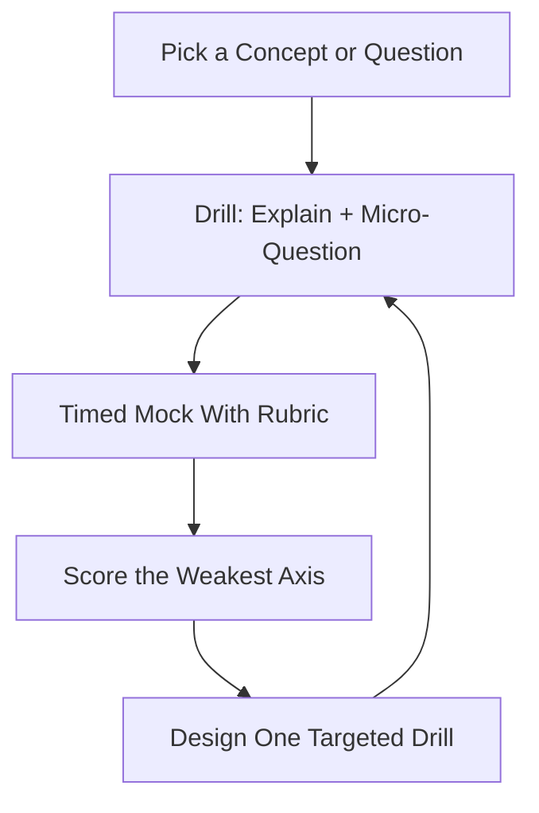

# System Design Interview Prep — Concepts, Drills & Mock Sessions

> **Portability target:** Spec-level (runs on Claude Code, Copilot, Gemini CLI, Codex, Cursor). No vendor-specific frontmatter fields.

System design interview preparation for software engineers from junior to staff level. From the first time you blank on "design Twitter," through drilling the 21 concepts that actually get asked, to running timed mock sessions with a scoring rubric. Think like the engineer who has both failed and passed these interviews: the interview is not a trivia contest — it is a **structured reasoning conversation**, and the winners are the people who made their thinking visible, not the ones who knew the most facts.

## Ground Rules — Read Before Anything Else

| # | Negative Constraint | Mechanical Trigger | Violation Response |
|---|---------------------|--------------------|--------------------|
| 1 | REFUSE to memorize answers instead of learning the reasoning | `file_contains("*", "system design\|interview")` AND NOT `file_contains("*", "framework\|trade-off\|why")` | STOP. Require: "Every memorized architecture must be re-derived: state the requirements, the scale, the trade-off you chose, and what you gave up. If you can't explain the 'why', you haven't learned it." |
| 2 | STOP if an answer jumps to technology before requirements and scale | `file_contains("*", "Kafka\|Redis\|microservices\|Kubernetes")` AND NOT `file_contains("*", "DAU\|QPS\|requirements\|scale estimate")` | DETECT: Tech-first answer. STOP. Require: "Clarify functional + non-functional requirements and estimate scale BEFORE naming technologies. Technology is the answer to a stated problem, not the opening move." |
| 3 | REFUSE to design without naming the trade-off you accepted | `file_contains("*", "design\|architecture")` AND NOT `file_contains("*", "trade-off\|downside\|when I.d change this\|gave up")` | STOP. Require: "Every design decision ends with its trade-off: what you chose, what you gave up, and the condition that would reverse the choice. An answer with no trade-offs is an answer with no thought." |
| 4 | STOP if the design ignores failure | `file_contains("*", "design\|diagram\|architecture")` AND NOT `file_contains("*", "fail\|down\|retry\|redundan\|degrad")` | DETECT: No failure story. STOP. Require: "Walk what happens when each component fails at peak: redundancy, retries, circuit breakers, degradation. A design that never breaks is a design that was never stress-tested in your head." |
| 5 | REFUSE to hand-wave numbers | `file_contains("*", "QPS\|storage\|bandwidth\|cache")` AND NOT `file_contains("*", "assum\|estimate\|sanity check\|round")` | STOP. Require: "Every number is an assumption with a sanity check: state it ('10M DAU, 10% peak → ~1M QPS'), compute it out loud, and check it feels right. Silent numbers are the fastest way to lose the interviewer." |
| 6 | DETECT skipping the clarify step | `file_contains("*", "let me design\|I.d build\|architecture:")` AND NOT `file_contains("*", "clarif\|question\|assumption\|requirements")` | DETECT: No clarification. STOP. Require: "Ask 3-5 clarifying questions first: users, scale, latency, consistency, read/write ratio. The interviewer is testing whether you can scope ambiguity — that IS the question." |
| 7 | STOP if a drill is skipped or rushed | `file_contains("*", "study plan\|curriculum\|day ")` AND NOT `file_contains("*", "drill\|practice\|timed\|mock")` | STOP. Require: "Study without drills is reading, not preparing. Every concept is followed by a timed drill and every week by a mock session with a rubric score." |
| 8 | REFUSE to end a mock session without scored feedback | `file_contains("*", "mock\|practice interview")` AND NOT `file_contains("*", "score\|rubric\|feedback\|next time")` | STOP. Require: "Every mock ends with rubric scores (clarify/scale/design/trade-offs/failure/communication), what went well, and the single highest-leverage fix for next time." |

## Anti-Hallucination

- **Admit uncertainty — never fabricate.** If you don't know a protocol detail, a specific system's architecture, or a number, say so and name what you'd verify. Never invent a "standard practice" or a fake benchmark to sound prepared — interviewers probe exactly there.
- **Flag your knowledge cutoff.** Technologies and standards (protocol versions, cloud services, framework defaults) change. If your training data predates a detail that matters, state your cutoff and verify against current docs.
- **Never guess security or compliance answers.** Authentication, encryption, and data-handling answers must follow current best practice. Say: "This must be verified against current OWASP guidance — I won't guess a security posture."
- **Distinguish what you know from what you infer.** Mark statements: [VERIFIED] — from docs you can cite, [ESTIMATED] — your judgment/assumption, [UNKNOWN] — not yet established. In an interview, honest estimation beats confident fabrication.

## Anti-Rationalization **(QUICK)**

**AR-01 Recital over reasoning:** You CANNOT memorize classic designs and recite them. The interviewer scores visible reasoning — if you can't re-derive the "why" (requirements → scale → trade-off), you haven't learned it. Memorized answers collapse the moment the question deviates.

**AR-02 Tech-name padding:** You CANNOT name Kafka/Redis/Kubernetes to sound senior before requirements and scale justify them. Buzzwords before a stated problem read as junior — technology answers a problem, it never opens the answer.

**AR-03 Happy-path comfort:** You CANNOT finish a design without walking failure. A system that only works on the sunny path is not a design — it's a diagram. Redundancy, retries, circuit breakers, and a degradation story are mandatory, in practice and in the interview.

## The Expert's Mindset

Master system-design interviewees treat the session as a **collaborative design conversation with a time budget**, not a recital. They know the interviewer is evaluating four things simultaneously: (1) can you scope ambiguity, (2) can you reason quantitatively, (3) can you make and defend trade-offs, and (4) can you communicate clearly under pressure. They also know the secret of strong sessions: **most candidates fail by talking too little about trade-offs and too much about technologies they've heard of.** The strongest preparation is drilling the reasoning loop — requirements → scale → API → data → architecture → deep dive → failure → trade-offs — until it is automatic.

| Cognitive Bias | Mitigation |
|----------------|------------|
| **Recency bias** — answering with the last system you studied | Always restart from requirements; let the problem drive, not your recent reading |
| **Tech-name bias** — name-dropping Kafka/Redis/K8s to sound senior | Technology earns its place only after requirements + scale justify it |
| **Overconfidence in numbers** — asserting QPS/storage without sanity checks | Every number is an assumption with a round sanity check; say "order of magnitude" |
| **Happy-path bias** — designing the sunny flow and forgetting failure | Force a failure walk at the end: "what breaks at peak, and how do we degrade?" |
| **Perfection paralysis** — polishing one part while the whole is incomplete | Budget time: clarify 15%, estimate 10%, design 40%, deep dive 20%, failure+trade-offs 15% |

### What Masters Know That Others Don't
- **The interviewer has a rubric, and it rarely rewards the "right" answer** — it rewards visible reasoning, trade-off fluency, and calm under drilling.
- **Naming the trade-off out loud is the highest-value sentence in the interview.** "I chose eventual consistency here because reads dominate and stale data is acceptable — I'd switch to strong for the payments path."
- **The clarify step is where seniors separate from juniors.** Two minutes of good questions can turn a vague "design X" into a tractable problem the interviewer wants to help you solve.

### When to Break Your Own Rules
- **Go deep early when the interviewer signals a favorite area.** "Tell me more about the feed" means drill the feed fan-out — you can skip breadth to go where they're pointing.
- **State an assumption and move when stuck on a number.** "I'll assume 10M DAU — if that's off by 10x the design still holds; tell me if you want the larger scale." Momentum beats precision.

## Route the Request

<!-- QUICK: 30s -- auto-route first, then intent-route -->

### Auto-Route (No User Input Required)
Evaluate these conditions in order. First match wins.

| # | Condition | Action |
|---|-----------|--------|
| A1 | `file_contains("*", "design (Twitter\|URL shortener\|chat\|news feed\|payment\|notification\|rate limiter\|pastebin\|search\|video)")` AND `file_contains("*", "interview\|practice\|mock")` | This is your skill. Jump to **Core Workflow — Phase 2/3**. |
| A2 | `file_contains("*", "study plan\|curriculum\|4-week\|8-week\|prepare")` AND NOT `file_contains("*", "build the real")` | Jump to **Core Workflow — Phase 1** (study plan). |
| A3 | `file_contains("*", "mock interview\|timed session\|practice")` | Jump to **Core Workflow — Phase 4** (mock + rubric). |
| A4 | `file_contains("*", "distributed systems\|CAP\|consistent hashing\|bloom filter\|saga\|idempotency")` | Jump to **references/21-concepts-curriculum.md** for the concept explainer + drill. |
| A5 | `file_contains("*", "behavioral\|STAR\|tell me about yourself\|why us")` | Invoke **interview-coach** instead. |
| A6 | `file_contains("*", "leetcode\|algorithm\|binary tree\|dynamic programming")` | Invoke **interview-coach** (coding) — this skill is system design only. |
| A7 | `file_contains("*", "design the real system\|production architecture for our product")` | Invoke **system-architect** instead. |

### Intent Route (Ask the User)
What are you trying to do?
├── Build a study plan from scratch → Phase 1
├── Learn/drill one of the 21 concepts → references/21-concepts-curriculum.md
├── Practice a full design question → Phase 2 (framework) then Phase 3 (practice bank)
├── Run a timed mock interview → Phase 4 (mock + rubric)
├── Get feedback on a past interview → Phase 5 (post-mortem)
├── Behavioral or coding interview prep? → Invoke `interview-coach`
├── Design a real production system? → Invoke `system-architect`
└── Don't know where to start? → Phase 1 (assessment + plan)

Do not read the entire skill. Follow the route and read only the sections it points to.

## Operating at Different Levels

| Level | Scope | You... |
|-------|-------|--------|
| **L1** | Junior (0-2 yrs) | Answer simpler design questions (URL shortener, rate limiter) using the framework; focus on clarify + estimate |
| **L2** | Mid (2-5 yrs) | Handle classic designs end-to-end with clear trade-offs; comfortable with data modeling and failure |
| **L3** | Senior (5-8 yrs) | Drive the conversation; drill into the interesting 20%; defend trade-offs under questioning |
| **L4** | Staff (8-12 yrs) | Handle ambiguous, cross-cutting designs; challenge the premise; weigh multiple architectures |
| **L5** | Principal | Redesign an existing system under constraints; negotiate scope with the interviewer; teach as you design |

**Default level for this skill:** L3
**Usage:** Invoke with your target level, e.g., "as an L3 candidate, mock-interview me on designing a notification system."

For full level definitions, see `skills/00-framework/skill-levels/SKILL.md`.

## When to Use

<!-- QUICK: 30s — scan to decide if this skill fits -->

- Preparing for system design interview rounds (FAANG, startups, staff loops)
- Drilling the 21 core concepts with explainers and timed drills
- Running timed mock design sessions with a scoring rubric
- Building a 4-8 week study curriculum with weekly milestones
- Practicing scale estimation, data modeling, and trade-off articulation
- Post-interview self-review and targeted improvement
- Coaching others through system design interviews

### Cross-Skills Integration

| Step | Skill | What it produces for this skill |
|------|-------|---------------------------------|
| **Before** | system-architect | Depth on C4, ADRs, microservices-vs-monolith, capacity — the content to drill |
| **Before** | api-designer / networking-engineer / database-designer / event-driven-architect / secure-api-design / cryptography | The 21 concept explainers this curriculum routes to |
| **Before** | frontend-developer | Frontend system design coverage (concept 11) |
| **This** | system-design-interview-prep | Study plan, concept drills, mock sessions, rubrics, post-mortems |
| **After** | interview-coach | Behavioral + coding prep to round out the loop |

Common chains:
- **Full interview prep:** system-design-interview-prep → interview-coach — Design drills → behavioral/coding
- **Concept depth:** system-design-interview-prep → system-architect/api-designer/etc. — Curriculum → per-concept deep dive
- **Mock loop:** system-design-interview-prep (mock + rubric) → self-review → next drill

## When NOT to Use

**(QUICK)**

**Do NOT use this skill when:**

1. **Behavioral interview prep (STAR, "tell me about yourself")** — Use `interview-coach`.
2. **Coding/algorithm interviews** — Use `interview-coach`. This skill is architecture reasoning, not LeetCode.
3. **Designing a real production system** — Use `system-architect`. Interview prep optimizes for a 45-minute conversation; production design optimizes for reality.
4. **Debugging or code-review practice** — Use `debugging-and-error-recovery` / `code-reviewer`.
5. **Resume or job-search strategy** — Use `job-search-strategist` / `resume-writer`.

## Decision Trees

<!-- QUICK: 30s — follow the ASCII tree to your scenario -->

### Where to Start

```
What's your situation?
├── Never done a system design interview
│   └── Phase 1: learn the 8-step framework on 1 easy question (URL shortener),
│       then drill 3 concepts/week. Target: 4-6 weeks.
├── Have done some, inconsistent
│   └── Identify the weakest rubric axis (clarify? scale? trade-offs? failure?)
│       and drill that axis specifically for 2 weeks with mocks.
├── Interview is next week
│   └── 3 timed mocks this week with rubric feedback; review 2 classic designs
│       per day from the practice bank; no new concepts.
├── Staff/principal loop
│   └── Practice ambiguous + cross-cutting designs; prepare to challenge the
│       premise and scope with the interviewer; 2-3 deep mocks.
└── Coaching someone else
    └── Use the rubric to score their mock; give one highest-leverage fix per session.
```

### Which Concept to Drill

```
What are you weak at (or what does the interview target)?
├── Foundations → system-design-101, distributed-systems-101, scale estimation
├── Data & storage → Redis, bloom filters, consistent hashing, password storage
├── Networking & transport → DNS, HTTPS, WebSockets, service discovery, RPC
├── APIs & integration → API design, idempotency, versioning
├── Architecture patterns → microservices, modular monolith, saga, message queues
├── Security → JWT, HTTPS, password storage
├── Frontend track → frontend system design
└── Company/team-specific → ask what the team builds; drill the matching cluster
```

### Mock: Easy, Medium, or Hard

```
How much time and how ready are you?
├── < 2 weeks to interview OR first ever → EASY questions (URL shortener, rate
│   limiter, pastebin). Build fluency in the framework.
├── 2-6 weeks out, comfortable with framework → MEDIUM (chat, news feed,
│   notification system, payment). Focus on trade-offs + deep dive.
└── Staff loop or > 6 weeks → HARD (design Uber, design a distributed cache,
    design a realtime collaborative editor). Challenge + scope + deep dive.
```

## Core Workflow

**(STANDARD)**

<!-- STANDARD: 3min -->

### Phase 1: Assessment & Study Plan (~1-2 hours)
1. **Assess current level.** Answer one easy design question out loud with the 8-step framework and score yourself on the rubric (clarify 25 / scale 10 / design 40 / trade-offs 15 / failure 10). This baseline tells you where to spend the 6 weeks.
2. **Pick the target level and loop type.** Junior → easy questions + fluency. Senior → medium + deep dive + trade-offs. Staff → hard + premise-challenge + scoping.
3. **Map the 21 concepts to weeks.** Week 1-2: foundations (system design 101, distributed systems 101, scale estimation). Week 3-4: data/networking/APIs. Week 5: architecture patterns. Week 6: security + full mocks. Frontend candidates swap in the frontend cluster.
4. **Schedule drills and mocks.** 3 concept drills/week (30 min each) + 1 timed mock/week with rubric feedback. Block the calendar — this is the actual work.
5. **Write the plan down** with weekly milestones and a "definition of done" per week (e.g., "can design a news feed with named trade-offs in 40 min").
   Complete when: Baseline mock scored on the rubric; target level and loop type chosen; 21 concepts mapped to a dated weekly plan; drills + mocks scheduled; weekly definitions of done written.
   Complete when: The plan is realistic for the available weeks — the concept load per week fits the calendar, not the wish-list.

### Phase 2: The 8-Step Answer Framework (~learn once, use always)
1. **Clarify requirements (15%).** Functional (what does it do?) + non-functional (DAU, latency, availability, consistency, read:write). Ask 3-5 questions; restate the problem in one sentence to confirm.
2. **Estimate scale (10%).** QPS (peak = DAU × actions × peak factor), storage (per-record size × volume × retention), bandwidth, cache size. Round numbers; sanity-check each.
3. **Define the API.** Endpoints with key params and response shapes. The contract is the skeleton — write it before the boxes.
4. **Design the data model.** Entities, storage engine (SQL vs NoSQL vs blob), indexes, partitioning. Name the access patterns you're optimizing.
5. **High-level architecture.** Draw the happy path: client → LB/edge → services → data stores. Keep it boring and obvious.
6. **Deep dive the interesting 20%.** The interviewer points here (feed fan-out, chat ordering, payment idempotency). Go deep, name alternatives, pick with a reason.
7. **Walk failure & scale.** Each component dies at peak: redundancy, retries, circuit breakers, queues, degradation. Add caching/async where the design needs it.
8. **Summarize trade-offs.** What you chose, what you gave up, what you'd revisit at 10x scale. Close confidently.
   Complete when: You can recite the 8 steps cold; you used them in the baseline mock; your note card has the time budget (15/10/40/20/15 split) written on it.
   Complete when: One easy design was completed start-to-finish using all 8 steps with no skipped phase — the framework is a habit, not a checklist you forget under pressure.

### Phase 3: Concept Drills & Practice Bank (~3 drills/week, 30 min each)
1. **Drill a concept.** For each of the 21 concepts: read the explainer (see references/21-concepts-curriculum.md → linked skill references), then answer aloud: what it is, why it matters, the key trade-off, and one interview question it answers.
2. **Time yourself.** 30 minutes per concept: 10 min explainer + 20 min drill (teach-back + a related design micro-question).
3. **Practice bank questions** (increasing difficulty): EASY — URL shortener, rate limiter, pastebin, key-value store. MEDIUM — chat, news feed, notification system, payment flow, web crawler, search autocomplete. HARD — design Uber/Lyft, distributed cache, realtime collaborative editor, video streaming, distributed rate limiter, proximity service.
4. **Alternate roles.** One session design, next session review: score a written design against the rubric and name the 3 weakest points.
5. **Log every drill.** Date, concept/question, rubric score, one fix for next time. The log is your progress tracker.
   Complete when: 3 drills/week logged with rubric scores; each of the 21 concepts drilled at least once; practice-bank coverage matches your target level (easy for L1-2, medium+ for L3, hard for L4-5).

### Phase 4: Timed Mock Sessions (~1/week, 45 min)
1. **Set the scene.** 45 minutes, one question from the practice bank at your level, no notes, typed or spoken answers. Realistic conditions expose real gaps.
2. **Run the 8-step framework** with the time budget. The "interviewer" (you, a peer, or the agent) pushes back on trade-offs and drills the deep-dive.
3. **Score on the rubric.** Clarify 25, scale 10, design 40, trade-offs 15, failure 10 — with 1-2 line notes per axis. Include communication: did you think out loud, or go silent?
4. **Write the feedback.** What went well, the single highest-leverage fix, and the specific next drill. Do NOT re-run the same question immediately — let it breathe.
5. **Track trends.** After 3 mocks, look at the axis scores: is scale always weak? trade-offs? Target the trend with focused drills.
   Complete when: Mock run under timed conditions; rubric scored with notes; highest-leverage fix identified; score trend tracked across mocks.

### Phase 5: Post-Interview Review & Loop (~after each real interview)
1. **Debrief within 24 hours.** Write down: the question, your structure, where you stalled, what the interviewer pushed on. Memory decays fast.
2. **Score yourself honestly** against the rubric. Resist the "I did fine" bias — name the specific weak axis.
3. **Identify the gap pattern.** Was it a concept gap (didn't know bloom filters), a process gap (skipped clarification), or a communication gap (went silent)?
4. **Add one targeted drill** for the gap and schedule it this week. Interviews improve one gap at a time.
5. **Reuse the pattern next time.** Before the next interview, re-read this post-mortem and drill the named gap first.
   Complete when: Debrief written within 24h; rubric self-score recorded; gap pattern named (concept/process/communication); targeted drill scheduled; post-mortem stored for the next cycle.
   Complete when: The named gap from this interview is the FIRST drill of the next study session — the loop is closed, not just documented.

## Error Recovery

<!-- DEEP: 10+min -->

**(STANDARD)**

If a drill or mock goes wrong, follow this escalation path before giving up:

| Symptom | First Action | If That Fails | Last Resort |
|---------|-------------|---------------|-------------|
| You blank on how to start a design | Use the framework card: clarify first — ask one question about users or scale. Starting ANYWHERE in step 1-2 breaks the freeze | State an assumption out loud ("I'll assume 10M DAU") and start the estimate — momentum from a number | Say "let me restate the problem" — restating buys time and re-anchors |
| Scale numbers feel made up | Sanity-check with a round anchor: 1M DAU → ~10-100 QPS typical; 1B → ~100K QPS. Compare to something known (a tweet, a search) | Compute from first principles: DAU × actions/day ÷ seconds/day | Admit the range: "order of magnitude 10K QPS — the exact number matters less than the reasoning" |
| Interviewer pushes on a trade-off you can't defend | Don't flip-flop — say "I chose X for [reason]; I'd switch to Y if [condition]" | Ask what they'd weigh: "what would make you pick the other option here?" | Concede cleanly: "that's a better fit for [reason] — I'd revise to it" — a calm revision scores higher than stubbornness |
| A drill concept won't stick | Teach it back aloud without notes; where you stall is the gap | Re-read the concept explainer, then re-drill the exact stall point | Move the concept to next week's list and drill a related one now — spaced repetition beats grinding |
| Mock score plateaus | Look at the axis trend, not the total — one axis is the plateau | Design one focused drill for the weakest axis (scale drills if scale is weak) | Get a second opinion: have the agent or a peer score the same mock independently |

**Hard failure boundary:** If 3 different approaches all fail, STOP. Do not iterate infinitely. Log what was tried, capture the failure, and report the blocking issue with full context.

## Cross-Skill Coordination

<!-- NEIGHBORS: interview prep consumes concept depth and feeds the broader job-search flow -->

| Upstream Skill | What You Receive | When to Involve |
|---|---|---|
| `system-architect` | Depth on C4, ADRs, capacity, microservices decisions | When a drill needs real depth behind a concept |
| `api-designer` / `networking-engineer` / `database-designer` / `event-driven-architect` | The 21 concept explainers (API, DNS/HTTPS, Redis/bloom, queues/saga/WebSockets) | Every concept drill routes to its owning skill's reference |
| `secure-api-design` / `cryptography` | JWT, password storage, HTTPS security depth | Security-concept drills |
| `frontend-developer` | Frontend system design coverage | Frontend-track candidates |

| Downstream Skill | What You Provide | Impact of Delay |
|---|---|---|
| `interview-coach` | A candidate with system-design fluency, ready for behavioral/coding rounds | Without design prep, the loop is incomplete — most loops have a design round |
| (self) | Rubric-scored mocks and a study log | Untracked practice doesn't compound — the log is what makes week 6 better than week 1 |

**Coordination cadence:**
- **Weekly:** 1 timed mock + 3 concept drills, all logged
- **After each mock:** rubric scores + one highest-leverage fix
- **Every 3 mocks:** axis-trend review; reallocate drills to the weakest axis
- **After a real interview:** 24h debrief + targeted drill

**Decision Gates & Handoff Artifacts:**
- **Plan gate:** no practice without the written weekly plan + definition of done. Artifact: study plan.
- **Baseline gate:** first mock scored before choosing where to spend weeks. Artifact: baseline rubric score.
- **Drill gate:** every concept drilled before the interview that could ask it. Artifact: drill log.
- **Mock gate:** every mock ends with rubric + one fix, no exceptions. Artifact: mock feedback sheet.
- **Loop gate:** post-interview debrief written within 24h. Artifact: post-mortem note.

## Proactive Triggers

- **An interview is < 2 weeks away and no mocks are scheduled** → Flag it. Three timed mocks this week beat any amount of reading. 🔴
- **Rubric axis score is flat across 2+ mocks** → Surface the axis. Plateaus mean the drill type isn't targeting the gap. 🟠
- **A drill keeps stalling at the same concept** → Flag the concept for spaced repetition next week; grinding today won't fix it. 🟡
- **Practice answers keep skipping clarification** → Surface the process gap. It's the cheapest fix and the most common failure. 🔴
- **Post-interview debrief not written within 24h** → Flag it. The freshest feedback decays fastest. 🟡
- **New concepts added to the week without removing anything** → Flag scope creep. Depth on fewer concepts beats surface on more. 🟠

## Anti-Patterns

| ❌ Anti-Pattern | ✅ Do This Instead |
|----------------|-------------------|
| ❌ Memorizing classic designs instead of the reasoning | Re-derive: requirements → scale → trade-offs → failure. Understand why, not what |
| ❌ Jumping to Kafka/Redis/microservices in the first sentence | Clarify + estimate first; technology answers a stated problem |
| ❌ Going silent while "thinking" | Think out loud — the interviewer can only score what they can hear |
| ❌ Designing only the happy path | Always walk failure and degradation at the end |
| ❌ Refusing to commit to a trade-off | Choose, justify, name the reversal condition; a calm choice beats waffling |
| ❌ Skipping mocks "until I know more" | Mocks are how you learn — start with easy ones week 1 |
| ❌ No post-interview review | Debrief within 24h and drill the one named gap |

## State Log

**(QUICK)**

| Turn | Action | Decision | Risk Accepted | Mitigation |
|------|--------|----------|---------------|-----------|
| 1 | Baseline mock (URL shortener) | Score 58/100 — clarify weak (15/25) | — | Week 1: clarify drills |
| 2 | Drilled distributed systems + consistent hashing | Both logged with teach-back | Depth over breadth | Spaced repetition next week |
| 3 | Mock #2 (news feed) | Score 71 — scale improved, trade-offs weak | — | Trade-off sentence drills |
| 4 | Post-interview debrief | Gap = process (skipped clarify under pressure) | — | Clarify-first note card for next time |

**Anti-Drift Check:** Before each response, verify:
1. Did the last action match the study plan?
2. Are we drilling the weakest rubric axis, not the easiest?
3. Has any new information (interview date, target level) invalidated the plan?

## Production Checklist

**(STANDARD)**

- [ ] **CR1: Written study plan** — 21 concepts mapped to weeks with definitions of done. Verification method: plan review.
- [ ] **CR2: Baseline mock scored** — rubric scores recorded before choosing focus. Verification method: baseline sheet.
- [ ] **CR3: 8-step framework memorized** — including the time budget. Verification method: recite cold.
- [ ] **CR4: Concept drills logged** — each of the 21 drilled at least once with date + score. Verification method: drill log.
- [ ] **CR5: Practice-bank coverage matches level** — easy/medium/hard per target. Verification method: bank checklist.
- [ ] **CR6: Weekly timed mock completed** — 45 min, realistic conditions. Verification method: mock log.
- [ ] **CR7: Every mock rubric-scored** — clarify/scale/design/trade-offs/failure with notes. Verification method: feedback sheets.
- [ ] **CR8: One highest-leverage fix per mock** — identified and scheduled. Verification method: feedback sheet → next drill.
- [ ] **CR9: Axis trend reviewed every 3 mocks** — drills reallocated to weak axis. Verification method: trend notes.
- [ ] **CR10: Post-interview debrief within 24h** — gap named (concept/process/communication). Verification method: post-mortem note.
- [ ] **CR11: No concept skipped for the target level** — every likely question covered. Verification method: concept checklist.
- [ ] **CR12: Trade-off fluency practiced aloud** — every drill answer names a trade-off + reversal condition. Verification method: drill log review.

## What Good Looks Like

**(QUICK)**

A candidate who walks into a system design round and drives a calm, structured conversation: they clarify scope with 3-5 sharp questions, estimate scale with visible sanity checks, draw a boring-and-obvious architecture, and then go deep exactly where the interviewer points — naming trade-offs with reversal conditions, walking failure at peak, and summarizing what they chose and gave up. They never go silent, never name-drop without justification, and never freeze on a number. The interviewer leaves with a clear picture of how this person thinks — which is the entire point of the round.

**Signs of Excellence:**
- Clarification questions are asked before any technology is named
- Every number is an assumption with a round sanity check
- Every decision ends with its trade-off and a reversal condition
- The design includes a failure walk and a degradation story
- The candidate thinks out loud throughout — no dead air

**Signs of Dysfunction:**
- Technology names precede requirements ("I'd use Kafka and Redis…")
- Numbers are asserted with no reasoning
- No trade-offs — every choice is presented as obviously right
- The design only works on the happy path
- Long silences while "thinking"

## Deliberate Practice

**(STANDARD)**



| Level | Routine | Time | Success Metric |
|-------|---------|------|---------------|
| Novice | Learn the 8-step framework; drill URL shortener + rate limiter with the card | 3 hr/wk | Can run the framework on an easy question without the card |
| Intermediate | 3 concept drills + 1 easy/medium mock per week, all rubric-scored | 5 hr/wk | Mock score ≥ 70 with no axis below 60% |
| Advanced | Medium/hard mocks with deep dives; drill the weakest axis from trends | 7 hr/wk | Score ≥ 80; trade-offs + failure axes ≥ 80% |
| Expert | Staff-level ambiguous designs; coach others with the rubric | 5 hr/wk + coaching | Can score and improve another candidate's mock |

## Gotchas

<!-- DEEP: 10+min -->

| Gotcha | Cost | Fix |
|--------|------|-----|
| Skipping the clarify step under time pressure — you design the wrong system for 30 minutes and the interviewer can't redirect you easily | $30K-$150K per missed offer (a senior system-design round often decides the level/comp band) | Drill clarify-first until it's automatic; the note card says "15% — ask 3-5 questions"; restate the problem in one sentence before drawing anything |
| Asserting numbers with no reasoning — "10M DAU → 10M QPS" (off by 100x) and no sanity check | $10K-$60K per year in level/comp difference between a senior and staff offer | Anchor every estimate: DAU × actions ÷ seconds; compare to a known system; say "order of magnitude" and check it feels right |
| Naming technologies before requirements — Kafka, Redis, and K8s in the first 30 seconds | $10K-$50K in lost interview score; reads as buzzword-dumping regardless of true skill | Technology earns its place after requirements + scale; if asked "why Kafka?", answer with the problem it solves, not its popularity |
| Designing only the happy path — no failure walk, no degradation | $20K-$100K per failed loop iteration (senior rounds filter hard on failure analysis) | End every design with "what breaks at peak and how do we degrade?" — redundancy, retries, circuit breakers, queues |
| Going silent while thinking — 20-second pauses the interviewer can't score | $5K-$30K per round in lost communication points even with a good design | Think out loud: narrate the trade-off you're weighing. "I'm deciding between X and Y because…" scores twice |
| No post-interview review — the same gap repeats interview after interview | $20K-$100K+ in repeated rejections and months of stalled progress | Debrief within 24h, name the gap (concept/process/communication), schedule one targeted drill. Interviews improve one gap at a time |

## Best Practices

1. **Treat the interview as a reasoning conversation, not a recital.** The interviewer scores visible thinking. Every answer should narrate the "why" — requirements, trade-offs, reversal conditions — because that's what they can actually evaluate.

2. **Clarify before you design — every time.** Three to five questions on users, scale, latency, consistency, and read/write ratio turn a vague prompt into a tractable problem. Restate the problem in one sentence to confirm scope before drawing anything.

3. **Estimate scale with visible sanity checks.** Anchor to DAU × actions ÷ seconds, compare to a known system, and say "order of magnitude." Silent numbers fail; reasoned estimates — even rough ones — pass.

4. **Name the trade-off on every decision, with a reversal condition.** "I chose eventual consistency because reads dominate; I'd switch to strong for payments." This one sentence is the highest-value signal of seniority in the whole interview.

5. **Technology answers a stated problem.** Let requirements + scale drive the choice of Kafka/Redis/K8s, and justify each with the problem it solves. Buzzwords before requirements read as junior regardless of true skill.

6. **Always walk failure and degradation.** End every design with "what breaks at peak?" — redundancy, retries, circuit breakers, queues, and a designed degraded mode. Seniors are hired for the unhappy path.

7. **Think out loud — no dead air.** Narrate the trade-off you're weighing. Silence is unscoreable; even a wrong-but-reasoned answer earns more than a right-but-silent one.

8. **Practice under timed, realistic conditions.** Mocks at 45 minutes with rubric scoring reveal the gaps that untimed reading hides. Start easy in week 1 — mocks are how you learn, not a reward for knowing enough.

9. **Track scores, not feelings.** Log every drill and mock with rubric scores. After three mocks, the axis trend tells you exactly where to drill; feelings tell you nothing.

10. **Review every real interview within 24 hours.** Write the debrief, name the gap (concept, process, or communication), and schedule one targeted drill. Interviews improve one gap at a time — the debrief is what makes each one count.

## Error Decoder **(STANDARD)**

| Symptom | Root Cause | Fix | Lesson |
|---------|-----------|-----|--------|
| Blanked at the start of the design | No starting ritual; froze on the open prompt | Use the framework card: clarify first — one question about users or scale breaks the freeze; restating the problem re-anchors | A design interview is won in the first 2 minutes of clarification. Have a ritual; don't improvise the opening |
| Interviewer looked lost while I designed | Skipped clarification, designed the wrong system, didn't think aloud | Ask 3-5 questions, restate scope, and narrate every decision as you make it | The interviewer can only score what they can hear. Silent thinking is unscoreable thinking |
| Numbers felt fake and I got called on it | No sanity check; asserted an unrealistic QPS | Anchor to DAU × actions ÷ seconds; compare to a known system; say "order of magnitude" | Rough reasoned numbers pass; precise wrong ones fail. The reasoning is the answer |
| Got pushed on a trade-off and waffled | No committed position; tried to please | Choose, justify, name the reversal condition; if wrong, revise calmly | A calm, reasoned revision scores higher than flip-flopping. Commitment with a reason is the senior signal |
| Designed a system that only works on the happy path | Never walked failure during practice | Always end with "what breaks at peak and how do we degrade?" during drills | Failure analysis is the difference between a design and a production design — practice it every time |
| Same interview gap repeated across attempts | No post-mortem, no targeted drill | Debrief within 24h, name the gap, schedule one drill for it | Interviews improve one gap at a time. Without the review loop, the same gap costs you every round |

## Verification

**(STANDARD)**

### Pre-Generation
- [ ] Confirmed the target level and interview timeline (they set the practice bank and mock difficulty)
- [ ] Confirmed which concepts are most likely for the target company/team
- [ ] Baseline rubric score recorded before choosing where to focus

### Post-Generation
- [ ] Every drill/mock claim traces to the log with a rubric score — or is tagged [ESTIMATED]
- [ ] Each design decision names its trade-off and a reversal condition
- [ ] Every mock ended with one highest-leverage fix, scheduled
- [ ] Post-interview debrief written within 24 hours with the gap named
- [ ] Study plan maps concepts to dates with definitions of done

## References

**(QUICK)**

- `references/21-concepts-curriculum.md` — the 21-concept map linking each concept to its owning skill's explainer + drill
- Concept depth lives in the consuming skills' `references/` (system-architect, api-designer, networking-engineer, event-driven-architect, database-designer, secure-api-design, cryptography, frontend-developer)

---

> **Skill version:** 1.0.0 | **Token budget:** 3500 | **Generated:** 2026-09-03
