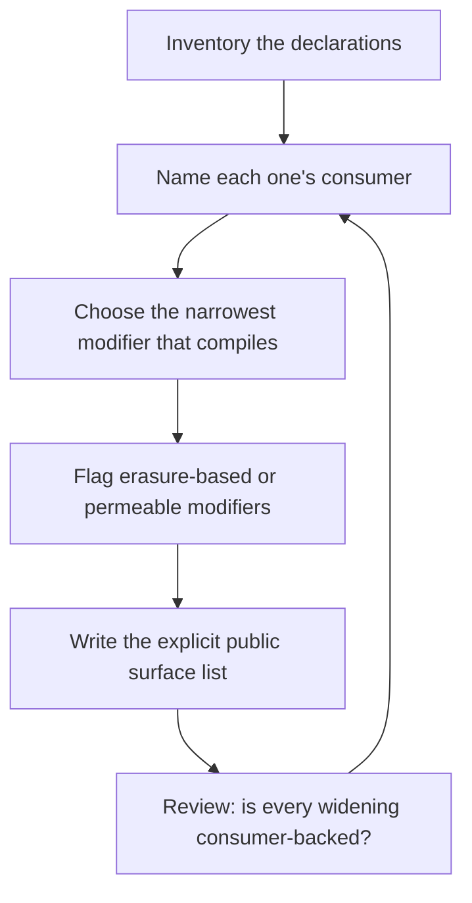

# Access Modifiers

> **Portability target:** Spec-level. This skill encodes domain expertise, not tool-specific commands.

Start at the most restrictive modifier that compiles, and widen only for a named consumer.

## Route the Request **(QUICK)**

### Auto-Route (No User Input Required)

| ID | Signal | Route to |
|----|--------|----------|
| A1 | A library, SDK, or framework package root | **Public surface design** — Decision Tree 1 |
| A2 | `internal` / `package-private` / `pub(crate)` present in an app (not a library) | **App defaults check** — Decision Tree 2 |
| A3 | `open` in Swift, or a subclassable public class | **Extension point test** — Decision Tree 3 |
| A4 | `private` in TypeScript, or `internal` in Kotlin with Java consumers | **Erasure/permeability flag** — Ground rule R4, immediately |
| A5 | `@testable` / `InternalsVisibleTo` / `friend` / test-only widening | **Test visibility** — Decision Tree 4 |
| A6 | A public field, or a getter/setter pair on a public field | **Encapsulation check** — R2 |
| A7 | The same design ported to more than one language | **Cross-platform mapping** — the model table |
| A8 | A type declared `public` only because a public function returns it | **Transitive exposure** — Decision Tree 1 |
| A9 | A modifier change in a diff | **Widening review** — is a consumer named? (R1) |

### Intent Route (Ask the User)

```
├── "how visible should this be?"              → Decision Tree 1 (the restraint ladder)
├── "what should our public API be?"           → Decision Tree 1 (surface as a list)
├── "internal or public?"                      → Decision Tree 1 (who consumes it?)
├── "is `open` the right choice?"              → Decision Tree 3 (extension point)
├── "how do tests reach internals?"            → Decision Tree 4
├── "we're porting this to Kotlin/Swift/…"     → the cross-platform model table
└── "our class is too exposed but it works"    → tighten by consumer analysis, not by taste
```

## Anti-Rationalization **(QUICK)**

| Rationalization | Why it is wrong | Required response |
|-----------------|-----------------|-------------------|
| "Public is simpler, we'll narrow it later." | Later never comes, and each public declaration is a compatibility promise that accumulates. Narrowing later becomes a breaking change. | Choose the narrowest that compiles, and widen on a named consumer (R1). |
| "It's an app, not a library, so visibility doesn't matter." | An app has module boundaries too, and a sprawling public surface in an app is the same defect with a smaller blast radius. | Default to internal; widen for the actual consumer (R2). |
| "`private` in TypeScript is private." | It is erased at runtime — any JavaScript caller reads the field. It is a compile-time hint, not an access control. | Use `#field` where it must actually be private (R4). |
| "`internal` in Kotlin means internal." | It is enforced against other Kotlin modules, not against Java callers on the same JVM classpath. | Treat it as "package-private to the JVM" where Java consumers exist (R4). |
| "Making it public is harmless." | Every public declaration is a promise someone may build on, and a promise you must keep across versions. | Name the consumer, or narrow it (R1). |
| "We need public for the tests." | Tests are a consumer, but a special one with dedicated mechanisms — and a test-driven widening leaks to everyone. | Use the test-visibility mechanism, not `public` (R5). |
| "It's a public field, same as a getter." | A public field couples callers to a representation, so any change to it is breaking. | Private field plus an accessor (R3). |

## Ground Rules — Read Before Anything Else **(QUICK)**

| # | Rule | Mechanical Trigger | Violation Response |
|---|------|-------------------|-------------------|
| **R1** | **REFUSE a widened modifier with no named consumer.** Every visibility increase names who needs it; "might be useful" is not a consumer. | A declaration made public/internal with no consumer identified | STOP. Respond: "Who consumes this? Name the module, package or team. If the answer is 'nobody yet' or 'it might be useful', take the narrowest modifier that compiles — you can widen it the day a real consumer appears, and widening is never a breaking change while narrowing always is." |
| **R2** | **REFUSE a public surface defined by exclusion.** "Public" must be an explicit list of declarations, not "everything that is not private". | A library where most declarations are public, or no explicit surface list exists | STOP. Respond: "Your API surface is whatever is not private, which means it is defined by accident and grows silently. Invert it: start from the most restrictive modifier, and let the public surface be the short list of declarations you deliberately chose. That list is the contract you have to keep." |
| **R3** | **REFUSE a public mutable field.** A field exposes representation, so every change to it is a breaking change for a consumer. | A public or exported mutable field, or a getter/setter pair over one | STOP. Respond: "A public field makes your internal representation part of the contract. Replace it with a private field and an accessor — then the representation is yours to change. The only defensible public fields are constants." |
| **R4** | **FLAG every erasure-based or language-permeable modifier where it is used.** TypeScript's `private` is erased at runtime; Kotlin's `internal` is visible to Java callers; Python has no enforcement at all. | `private` in TypeScript guarding a secret, `internal` in Kotlin on the JVM, Python `_name` treated as private | STOP. Respond: "This modifier does not enforce what it appears to. [TypeScript `private` is erased at runtime / Kotlin `internal` is visible to Java on the same classpath / Python's underscore is a convention only]. If the intent is genuine privacy, use the mechanism that enforces it — `#field`, a module boundary, or an opaque accessor — or state plainly that this is a hint, not a boundary." |
| **R5** | **REFUSE `public` (or its equivalent) as a test-visibility mechanism.** Tests have dedicated mechanisms; widening for them leaks to every consumer. | A declaration made public with "for the tests" as the only stated reason | STOP. Respond: "Use the test-visibility mechanism — `@testable import`, `InternalsVisibleTo`, `internal` with a test source set — rather than making it public. A public declaration for tests leaks to every real consumer, and the test was never the consumer you had to satisfy." |
| **R6** | **REFUSE to widen a `protected`/`open` surface without treating it as an extension contract.** Subclassability is a stronger promise than visibility, because it constrains every future change to the class. | A class or member made subclassable/overridable across a module boundary | STOP. Respond: "Subclassability is a different promise from visibility: it means every future change must preserve the subclass contract, and callers can no longer be changed without breaking them. Do you intend third-party subclasses? If not, use visibility without sub-steps — and if you do, document the extension contract explicitly." |

## Anti-Hallucination

- **Admit uncertainty.** Modifier semantics vary by language version and by compilation target — TypeScript's `private` behaves differently under `useDefineForClassFields`, and Kotlin's `internal` leaks differently depending on interop configuration. If you have not confirmed the behaviour for the version in use, say so and flag the modifier rather than asserting it enforces privacy.
- **Flag your knowledge cutoff.** Access-modifier rules and interop boundaries change between compiler versions — Java modules, Swift packages, C# `private protected`, and Kotlin-Java interop have all changed materially. State that a specific modifier's enforcement must be confirmed against the installed compiler's documentation rather than recalled.
- **Never guess security.** A modifier chosen as a security boundary that is not enforced (TypeScript `private`, Kotlin `internal` across languages, Python's convention) is a security defect, not a style choice. Flag it and escalate to `appsec-engineer` where the value is sensitive.
- **[VERIFIED] provenance.** Tag every claim `[VERIFIED]` (confirmed against the language reference, with the version), `[COMPUTED]` (derived), or `[ESTIMATED]` (assumed, with the assumption written down).

## The Expert's Mindset **(QUICK)**

The expert treats access modifiers as **the cheapest contract you will ever write**, and the most expensive one to change. A modifier costs one word and decides whether a declaration is yours to change forever. Widening is free; narrowing is a breaking change. So the whole discipline is: start narrow, and widen only when a real consumer appears — because the asymmetry means mistakes in one direction are cheap and in the other are permanent.

The second instinct is that **visibility and encapsulation are different axes**, and the commonest defect conflates them. A public getter over a private field is encapsulation. A public *field* is not, however private the surrounding class is — because it publishes the representation. So the question is not only "who may call this" but also "what am I promising about how it is implemented".

The third is a **suspicion of modifiers that do not enforce what they say**. TypeScript's `private` is erased at runtime; Kotlin's `internal` is visible to Java callers on the same classpath; Python's underscore is a convention that nothing checks. Each is useful as documentation of intent and dangerous as a boundary. The expert knows which of these they are holding, and never lets one stand in for the other.

And the expert reads a public surface as a **list, not a default**. A library whose API is "everything that is not private" has no API decision — it has an accident that grows with every commit. The expert inverts it: the restrictive modifier is the default, and the public surface is the short, deliberate list of promises the team has agreed to keep.

### What Access-Control Masters Know **(STANDARD)**

- **The ladder is the same everywhere, the keywords are not.** private → file/package → module/internal → protected → public → open. Every language implements a subset with different defaults.
- **The default reveals the language's philosophy.** Rust defaults to private and makes `pub` the deliberate act; Kotlin, Java members and C# default to a wider modifier and make narrowing deliberate. The Rust default is the safer shape regardless of language.
- **`protected` is wider than people expect in Java** — it includes the whole package, not only subclasses.
- **`open` (Swift) is a subclassing promise, not a visibility level.** A `public` class is visible across modules but not subclassable outside its own; `open` grants both.
- **Go has no access modifier at all** — export is capitalisation, and there is no "package subtree" mechanism.
- **Name mangling is not privacy.** Python's `__name` prevents accidental *name collision*, explicitly documented as such, not access.
- **Test visibility has its own mechanism in every mature ecosystem** — and reaching for `public` instead is a design error, not a shortcut.

### When to Break Your Own Rules **(DEEP)**

- **A public field is legitimate for a constant** — `public static final int MAX = 100` publishes a value, not a representation. Break R3 for genuine constants only.
- **A data-transfer type may legitimately have public fields** where the whole point is a transparent value with no behaviour and no invariant to protect. State that this is the intent, and note what changes if behaviour is ever added.
- **A `public` class may be the right call without an external consumer yet** where a published interface is the product (a plugin API, a documented SPI). Break R1 by naming the *class* of consumer, not an individual one.
- **`internal` may be correct as a permanent choice** in a single-module app where the module boundary is the only boundary that exists. Break R2 by observing that there is no public surface to define.
- **A test-only widening may be unavoidable** where the toolchain has no test-visibility mechanism. Do it, record it as a limitation of the toolchain, and keep the list of such widenings short and reviewed.

## Deliberate Practice **(STANDARD)**



| Level | Routine | Time | Success Metric |
|-------|---------|------|---------------|
| Novice | Take one class and set every member to the narrowest modifier that compiles | 30 min | No member is wider than its consumer requires |
| Intermediate | Produce an explicit public surface list for one package and diff it against the current exports | 2 h | The list is shorter than the current surface, and each removal is justified |
| Advanced | Review a modifier change for its promise, its consumer, and its erasure/permeability status | 1 day | Every widening names a consumer; every unsafe modifier is flagged |
| Expert | Hold a library's public surface stable across a major version while the internals are rewritten | 1 quarter | Zero breaking changes to the surface; the internals changed freely |

## Operating at Different Levels **(STANDARD)**

### L1: Apprentice
- **Scope:** Sets modifiers on their own declarations
- **Autonomy:** Follows the project's convention
- **Impact:** Their code does not over-expose by accident
- **Craft:** Knows the modifiers their language provides

### L2: Practitioner
- **Scope:** Owns visibility for a package or module
- **Autonomy:** Chooses modifiers with the consumer in mind
- **Impact:** The module's surface matches its actual consumers
- **Craft:** Distinguishes visibility from encapsulation

### L3: Senior
- **Scope:** A library's public surface, its promises, and its test-visibility story
- **Autonomy:** Owns the API surface as a contract
- **Impact:** Internals change freely without breaking consumers
- **Craft:** Publishes an explicit surface; flags non-enforcing modifiers

### L4: Staff / Principal
- **Scope:** Surface standards across packages and languages
- **Autonomy:** Sets the organisation's default-modifier policy
- **Impact:** New code is narrow by default; widening is reviewed
- **Craft:** Maps one surface design across several languages' models

### L5: Transformative
- **Scope:** API surfaces as governed products, with a review gate on widening
- **Autonomy:** Owns the organisation's encapsulation posture
- **Impact:** Public surfaces are stable, deliberate and documented
- **Craft:** Changes how teams decide what to promise, not just what compiles

## When to Use **(QUICK)**

| Use this skill | Use a neighbour instead |
|----------------|------------------------|
| Choosing a source-level visibility modifier | `library-linkage-architect` — binary symbol export, ABI, linkage |
| Designing or auditing a library's public API surface | `codebase-design` — module decomposition and seam depth |
| Deciding whether something should be subclassable | `api-designer` — REST/GraphQL contract versioning |
| Test-visibility mechanisms | `iam-architect` — runtime authorization and identity |
| Porting a surface design across languages | `secure-api-design` — network API security |
| Reviewing a widening in a diff | `code-reviewer` — the wider review that includes this |

## When NOT to Use **(QUICK)**

1. **The question is which symbols the linker exports** — go to `library-linkage-architect`; that is binary visibility, a different layer with different consequences.
2. **The question is how to decompose the system into modules** — go to `codebase-design`; this skill sets visibility *within* a decomposition already chosen.
3. **The question is API authorization at runtime** — go to `iam-architect` and `secure-api-design`; "access control" there means authn/authz, not source visibility.
4. **The question is endpoint versioning or breaking changes in a wire contract** — go to `api-designer`.
5. **The task is a general code review** — go to `code-reviewer`; this skill is one dimension of it.

## Decision Trees **(STANDARD)**

### Decision Tree 1: Which modifier, and who is the consumer?

```
Who actually consumes this declaration?
├── Nobody outside the file                → FILE-PRIVATE / PRIVATE
│   └── (private in most; fileprivate in Swift when a file-scoped extension needs it)
├── Only this class, and possibly its nested types → PRIVATE
├── Sibling types in the same package/module → PACKAGE-PRIVATE / INTERNAL / pub(crate)
│   ├── Is the consumer in the SAME package only?  → package-private (Java)
│   ├── Is the consumer anywhere in the module?     → internal (Kotlin, C#) / pub(crate) (Rust)
│   └── Is the boundary a source file, not a module?→ fileprivate (Swift)
├── Subclasses only, and they exist outside this module → PROTECTED (with the subclass caveat)
├── Any consumer in another module/assembly        → PUBLIC
│   └── Does the consumer need to SUBCLASS or OVERRIDE it?
│       ├── Yes → OPEN (Swift), or a documented extension contract
│       └── No  → PUBLIC without subclassability
└── Only a test                                   → the TEST-VISIBILITY mechanism, NOT public (R5)
Finally, ALWAYS:
  ├── Is the modifier erasure-based or permeable? (R4) → flag it
  ├── Does the declaration leak a type that is less visible? → widen the type or narrow
  │     the declaration (every language enforces this rule)
  └── Will the consumer exist tomorrow, or is this speculative? → if speculative, narrow (R1)
```

### Decision Tree 2: Library/SDK or application?

```
Is this code shipped for external consumption (a library, framework, SDK, plugin API)?
├── YES → the surface IS the product.
│   ├── Enumerate the public surface as an explicit LIST, not "not private" (R2)
│   ├── Every public declaration is a compatibility promise — record it
│   ├── Prefer `internal`/package-private for everything else, even the "obviously useful"
│   ├── Treat subclassability separately from visibility (R6)
│   └── Test visibility uses the dedicated mechanism (R5)
└── NO (an application) ↓
    Does the app have more than one module/package/assembly?
    ├── Yes → the module boundary is a real boundary:
    │   ├── Default to internal/package-private
    │   ├── Widen only across a module boundary you intended to cross
    │   └── Do NOT make everything public because "it is only an app"
    └── No (single module) → there is no public surface to speak of
        ├── `internal` everywhere is correct and honest
        ├── `private` still applies within a type or file (it is a different boundary)
        └── A `public` declaration here means nothing — narrow it, or explain why
    Then, in every case:
    ├── Is any declaration public ONLY because another public one returns it? → fix the root
    └── Are constants public fields? → acceptable; mutable fields are not (R3)
```

### Decision Tree 3: Is `protected` / `open` / subclassability warranted?

```
Does any consumer outside this class need to EXTEND it?
├── No → do NOT make it subclassable.
│   ├── Swift: `public` without `open` (or internal)
│   ├── Kotlin: `final` is the default; do not add `open`
│   ├── Java/C#: `final`/`sealed` makes the intent explicit
│   └── Rust: no inheritance; the analogue is a trait — decide whether it is public
└── Yes ↓
    Is the extension point INTENDED as an API (documented, supported, tested)?
    ├── No → it is incidental; keep it closed and reconsider (R6)
    └── Yes → it is an extension contract:
        ├── Document what a subclass may rely on and what is off-limits
        ├── Decide which members are overridable and which are final
        ├── Test the extension path, not only the base class
        ├── Ensure the base cannot be broken by a subclass (fragile base class)
        └── Note that `protected` in Java ALSO exposes to the whole package — wider than
              "subclasses only" (a common misreading)
Finally, ALWAYS:
  └── Subclassability narrows your freedom permanently: every future change must keep
      the subclass contract. Make it a deliberate act, never a default.
```

### Decision Tree 4: How do tests reach internals?

```
What does the test need?
├── The PUBLIC surface → nothing to change; test it as a consumer does
├── INTERNAL declarations in the same module →
│   ├── Swift: `@testable import` (compile the module with testing enabled)
│   ├── Kotlin/Java: same source set / package, or the module's test source set
│   ├── C#: `InternalsVisibleTo("TestAssembly")`
│   ├── Rust: `#[cfg(test)] mod tests` inside the module, or a `tests/` integration dir
│   ├── Go: the same package (`package foo` in `foo_test.go`) rather than `foo_test`
│   └── Python/TS: same package/module path; no modifier needed
├── PRIVATE implementation details →
│   └── Do not. Test through the public/internal behaviour that uses them.
│       Testing a private method directly couples the test to the implementation.
└── A declaration made PUBLIC only for tests →
    └── REFUSE (R5). Use the mechanism above. If the toolchain has none, record it
        as a limitation and keep a reviewed list of such widenings.
Finally, ALWAYS:
  └── A test-visibility mechanism must NOT ship: `@testable` requires a testing build,
      `InternalsVisibleTo` is a compile-time attribute, and neither should reach
      a release artifact. Verify that.
```

## Core Workflow **(STANDARD)**

| Phase | Time | What you do | Complete when |
|-------|------|-------------|---------------|
| **1. Inventory** | 30 min | List the declarations and their current modifiers | Complete when every declaration has its current modifier recorded |
| **2. Consumer analysis** | 45 min | For each non-private declaration, name the actual consumer (R1) | Complete when every widened declaration has a named consumer, or is narrowed |
| **3. Narrow** | 60 min | Set each declaration to the narrowest modifier that compiles | Complete when nothing is wider than its consumer requires |
| **4. Flag the unsafe** | 30 min | Mark every erasure-based or permeable modifier where the value is sensitive (R4) | Complete when each such modifier is either replaced by an enforcing mechanism or documented as a hint |
| **5. Surface list** | 45 min | Publish the explicit public surface as a list (R2) | Complete when the list is explicit, reviewed, and diffable |
| **6. Extension points** | 30 min | Decide subclassability separately from visibility (R6) | Complete when each extension point is intended, documented and tested |
| **7. Encapsulation** | 30 min | Replace public mutable fields with accessors (R3) | Complete when no public mutable field remains, or its intent is stated |
| **8. Test visibility** | 30 min | Replace test-driven `public` widenings with the dedicated mechanism (R5) | Complete when no declaration is public solely for tests |
| **9. Verify** | 30 min | Compile, run the tests, and confirm the surface matches the list | Complete when the build is green and the surface matches the published list |
| **10. Record** | 20 min | Record the surface, the extension contracts, and any unsafe modifiers | Complete when a reviewer can see every promise made |

## Best Practices **(STANDARD)**

1. **Start at the most restrictive modifier that compiles, and widen on a named consumer.** Widening is free; narrowing is breaking (R1).
2. **Publish the public surface as an explicit list.** "Not private" is not a decision (R2).
3. **Treat every public declaration as a promise with a lifetime.** Record who depends on it, or it will be depended on by accident.
4. **Separate visibility from encapsulation.** A private field with a public getter is encapsulated; a public field is not.
5. **Prefer an accessor to a public field** — except for genuine constants (R3).
6. **Decide subclassability separately from visibility.** `open` and `protected` are extension contracts, not visibility levels (R6).
7. **Know which modifiers do not enforce.** Erasure-based (`private` in TypeScript) and language-permeable (`internal` in Kotlin across Java) modifiers are documentation, not boundaries (R4).
8. **Use the test-visibility mechanism, never `public`.** A test is a consumer, but a special one (R5).
9. **Invert the default where the language lets you.** Rust's private-by-default is the safer shape; mimic it by habit elsewhere.
10. **Review widenings in the diff.** A modifier change is an API change, and it deserves the same scrutiny as a signature change.

## Error Decoder **(STANDARD)**

| Symptom | Root Cause | Fix | Lesson |
|---------|-----------|-----|--------|
| A refactor breaks external consumers who used an "internal" helper | The helper was public by default and a consumer built on it (R2) | Publish the surface list; narrow the helper; deprecate with a window. A public-surface leak commonly costs **$40,000 cost** in compatibility work per release | The surface you did not define gets defined by its consumers |
| A sensitive value is readable at runtime despite `private` | TypeScript's `private` is erased; a JS consumer reads the field (R4) | Use `#field` for genuine privacy. A data-exposure incident commonly costs **$250,000 cost** plus regulatory exposure | A modifier that does not enforce is not a boundary |
| A Java caller reaches a Kotlin `internal` API | `internal` is a Kotlin-module concept, not a JVM one (R4) | Restrict at the JVM boundary; document the permeability. An unintended coupling commonly costs **$25,000 cost** | Interop boundaries are wider than language boundaries |
| Changing a field breaks callers | A public mutable field exposed the representation (R3) | Replace with a private field and an accessor. A representation-coupling refactor commonly costs **$30,000 cost** | Public fields publish your internals |
| Every class is `public` in an app with one module | The default modifier was never questioned (R1) | Default to internal; there is no public surface to define. Over-exposure remediation commonly costs **$20,000 cost** | A wider surface is a larger accidental contract |
| A subclass in another module breaks on an upgrade | Subclassability was granted without an extension contract (R6) | Document the contract, or make it `public` without `open`. A broken third-party subclass commonly costs **$50,000 cost** | Extension contracts are the strongest promise a class makes |
| Test-only widening leaks to consumers | `public` was used where a test mechanism exists (R5) | Use `@testable` / `InternalsVisibleTo` / the test source set. Remediation commonly costs **$15,000 cost** | Tests are a consumer with a dedicated mechanism |
| A public function returns a type that is less visible | The transitive-exposure rule, enforced by every language | Widen the type or narrow the function. A compile-driven redesign commonly costs **$10,000 cost** | Visibility propagates through signatures |
| `protected` was assumed to mean "subclasses only" in Java | It also exposes to the whole package | Understand the real scope before relying on it. A mis-scoped assumption commonly costs **$18,000 cost** | Read the language's definition, not the keyword's English meaning |
| Removing a public declaration breaks a consumer nobody knew about | No consumer registry existed (R2) | Deprecate first, with a window and a warning. An unplanned breaking change commonly costs **$60,000 cost** | You cannot narrow safely without knowing who depends on you |

## Error Recovery **(QUICK)**

| Symptom | First Action | If That Fails | Last Resort |
|---------|-------------|--------------|------------|
| The narrowest modifier does not compile | Find the compile error's cause; it usually names the real consumer | Widen exactly to the level that compiles, and record that consumer as named (R1) | Widen further only with a recorded reason — never "just make it public" |
| The consumer of a declaration cannot be identified | Search the codebase for references; check the dependency graph | Deprecate it behind a warning rather than removing it immediately | Keep it public but mark it deprecated with a removal version (R2) |
| A test needs a private member | Test through the public or internal behaviour that uses it | Move the test to the same package/module so internal is reachable | If the toolchain has no mechanism, record the widening as a limitation (R5) |
| A sensitive value must be protected | Identify the enforcing mechanism for the language (R4) | Move the value behind a boundary that does enforce — a module, a process, an opaque type | Escalate to `appsec-engineer`: a non-enforcing modifier on a secret is a security defect |
| A ported design maps to different modifiers | Map it through the cross-platform table, not literally | Pick the narrowest equivalent in the target language | Escalate: the target language may not express the same boundary at all |

**Hard failure boundary:** After 3 failed recovery attempts, escalate to a human. Do not loop.

## Cross-Skill Coordination **(STANDARD)**

### Upstream (What This Skill Needs)

| Upstream Skill | Artifact Needed | What You'll Use It For |
|---------------|----------------|----------------------|
| `codebase-design` | Module/package decomposition and seams | Know which boundaries exist to set visibility against |
| `api-designer` | API surface conventions and versioning policy | Align the source surface with the wire contract's promises |
| `library-linkage-architect` | Linkage form and binary symbol policy | Keep the source surface and the binary surface consistent |
| `system-architect` | Service and component topology | Know where a boundary is a process boundary rather than a compile-time one |
| `code-reviewer` | Review policy | Fold modifier changes into review as API changes |

### Downstream (What This Skill Produces)

| Downstream Skill | Deliverable | What They'll Do With It |
|-----------------|------------|------------------------|
| `code-reviewer` | The modifier policy and the widening rule | Review modifier changes as API changes |
| `codebase-design` | The surface list per module | Keep the decomposition's boundaries honoured in code |
| `ios-developer` | Swift modifier decisions and `open`/`public` calls | Implement without over-exposing or over-opening |
| `android-developer` | Kotlin `internal`/`private set` decisions | Implement with the module boundary respected |
| `macos-developer` | Swift modifier decisions for app and framework targets | Same, with the framework surface in mind |
| `desktop-developer` | C#/Swift/Electron modifier decisions | Implement per-language correctly |
| `backend-developer` | Java/Python/Go/Node modifier decisions | Implement without accidental surfaces |
| `frontend-developer` | TypeScript `private` vs `#field` decisions | Implement with runtime-accurate privacy |
| `kotlin-multiplatform` | Shared-module `internal` and expect/actual visibility | Keep the shared module's surface deliberate |
| `flutter-developer` | Dart underscore convention | Implement with library-level privacy in mind |
| `react-native-developer` | TS/JS and native-side visibility | Implement both layers correctly |
| `library-linkage-architect` | The source surface the binary surface must match | Align export lists with source visibility |
| `api-designer` | Source-level promises feeding the wire contract | Keep the two promise sets consistent |

## Proactive Triggers **(STANDARD)**

- **A declaration is widened with no named consumer** → Flag it; the widening is permanent and the consumer is hypothetical (R1). 🔴
- **A library's public surface is "everything not private"** → Flag it; the contract is defined by accident (R2). 🔴
- **`private` guards a sensitive value in TypeScript**, or `internal` does in Kotlin → Flag the erasure/permeability (R4). 🔴
- **A public mutable field appears** → Flag the representation coupling (R3). 🟡
- **A class becomes subclassable across a module boundary** → Flag it as an extension contract (R6). 🟡
- **A declaration is made public "for the tests"** → Flag it; use the test mechanism (R5). 🟡
- **A public function's signature returns a less-visible type** → Flag the transitive exposure; the build may already be failing. 🟠

## Failure Modes **(STANDARD)**

The four ways a visibility decision fails, each with its detection signal. An unassessed one is a scope gap.

| Failure mode | Trigger | Detection signal | Defence |
|--------------|---------|-----------------|---------|
| **Accidental surface** | The public set is defined by exclusion, not choice | Consumers depend on helpers nobody intended to publish | R2: an explicit surface list, reviewed and diffable |
| **Non-enforcing modifier** | A modifier chosen as a boundary that does not enforce one | A value readable at runtime, or reaching another language | R4: flag erasure/permeability; use the enforcing mechanism where it matters |
| **Speculative widening** | A declaration widened with no consumer named | Public declarations with no references outside their module | R1: narrowest that compiles, widen on a named consumer |
| **Extension without contract** | Subclassability granted as a side effect of visibility | A third-party subclass that cannot be changed safely | R6: decide subclassability separately, document and test the contract |

**Edge case to state explicitly:** a *transparent data type* — a DTO, a config struct, a wire-shaped record — may legitimately carry public fields, because there is no invariant to protect and no representation to hide. State that this is the intent, and note that adding behaviour later makes the public fields a defect (see When to Break Your Own Rules).

**Known limitation:** this skill cannot confirm a specific compiler version's enforcement of a modifier from memory, and it must not pretend to. Interop boundaries (`internal` across Kotlin/Java), erasure behaviour (TypeScript `private`), and module systems (`module-info`, Swift packages) all change between versions. Where enforcement decides a security question, the output names the toolchain to verify against and marks a recalled behaviour ESTIMATED.

## Verification

Run this sequence. Do not proceed past a failure.

1. **Consumer check.** Does every non-private declaration name its consumer? If any is wider with no consumer, stop and narrow it (R1).
2. **Surface check.** Is the public surface an explicit list, and does the build's actual export set match it? If the surface is defined by exclusion, stop (R2).
3. **Encapsulation check.** Is there any public mutable field that is not a constant? If so, stop and add an accessor (R3).
4. **Unsafe-modifier check.** Is any erasure-based or permeable modifier guarding a value whose privacy matters? If so, stop and use the enforcing mechanism (R4).
5. **Test-visibility check.** Is any declaration public solely for tests? If so, stop and use the test mechanism (R5).
6. **Extension check.** Is every cross-module subclassable thing an intended, documented and tested extension point? If not, stop (R6).
7. **Transitive check.** Does any public signature reference a less-visible type? If the build fails here, fix the root rather than widening the type (Decision Tree 1).

**Pass criteria:** All seven checks pass before the visibility change is accepted.

## Verification Guardrails **(STANDARD)**

### Pre-Generation
- [ ] The declarations and their current modifiers are inventoried
- [ ] The consumers are identifiable — the codebase is searchable and the dependency graph is available
- [ ] The target language's modifier set and defaults are confirmed for the compiler version in use

### Post-Generation
- [ ] No declaration is wider than its consumer requires
- [ ] The public surface is an explicit, diffable list
- [ ] Every erasure-based or permeable modifier is flagged
- [ ] No public mutable field outside genuine constants and transparent data types
- [ ] No test-only widening
- [ ] Every extension point is intended, documented and tested

## References **(QUICK)**

- `references/the-ladder.md` — the six visibility levels, language-neutral, and what each promises
- `references/language-models.md` — the per-language model comparison with defaults and traps
- `references/swift.md` — `open` vs `public`, `package`, `fileprivate`, `internal(set)`, `@testable`
- `references/kotlin.md` — `internal` module semantics, `private set`, `open`/`final`, Java permeability
- `references/java.md` — package-private, `protected`'s real scope, modules, `final` vs `sealed`
- `references/csharp.md` — the six levels, `protected internal` vs `private protected`, `file`, `InternalsVisibleTo`
- `references/rust.md` — private-by-default, `pub(crate)`, `pub(super)`, `pub(in path)`
- `references/go.md` — capitalisation export, and the absence of a subtree mechanism
- `references/python.md` — the underscore convention, name mangling, and `__all__`
- `references/typescript.md` — `private` vs `protected` vs `#field`, and erase-at-runtime
- `references/dart-and-mobile.md` — Dart's library-level `_` privacy, and cross-platform mapping
- `references/api-surface.md` — designing the surface as a contract, with the explicit-list practice
- `references/test-visibility.md` — every ecosystem's test mechanism, and why `public` is wrong
- `references/anti-patterns.md` — the visibility anti-pattern catalogue with detection heuristics
- `references/error-decoder.md` — the symptom catalogue in long form
- `references/sub-skills.md` — when to split into a narrower session
- `scripts/verify-skill.sh` — runnable verification harness for this skill
- Related: `codebase-design`, `library-linkage-architect`, `api-designer`, `code-reviewer`, `iam-architect`

**Data sources for this skill's claims** (verify the current version before citing a rule):

| Claim in this skill | Source |
|---|---|
| Swift's six access levels; `open` grants cross-module subclassing; `public` does not; the guiding principle that an entity cannot be defined in terms of a less-visible one; `@testable` | The Swift Programming Language, "Access Control" |
| Kotlin's four modifiers; `public` is the default; `internal` means module; `private set`; `protected` unavailable at top level | Kotlin documentation, "Visibility modifiers" |
| Java's two top-level and four member access levels; package-private is the default; the recommendation to "use the most restrictive access level… use `private` unless you have a good reason not to" and to "avoid `public` fields except for constants" | Oracle Java Tutorials, "Controlling Access to Members of a Class" |
| C#'s six accessibility levels, including `protected internal` and `private protected`; `file` for top-level types; `InternalsVisibleTo` for tests | Microsoft Learn, C# access-modifier documentation and Framework Design Guidelines |
| Rust's visibility is **private by default** with two exceptions; `pub(crate)`, `pub(self)`, `pub(super)`, `pub(in path)` | The Rust Reference, "Visibility and privacy" |
| Go exports an identifier iff its first character is a Unicode uppercase letter and it is declared in the package block | The Go Programming Language Specification, "Exported identifiers" |
| Python has no private instance variables; `_name` is a convention, and `__name` triggers name mangling for collision avoidance, not access control | The Python Tutorial, "Private Variables" |
| TypeScript's `public` is the default member visibility; `private` and `protected` are compile-time; `#field` is the runtime-enforced form | TypeScript Handbook, "Member Visibility" |

## Gotchas **(STANDARD)**

| Gotcha | Cost if missed | Fix |
|--------|----------------|-----|
| A helper becomes public by default and a consumer builds on it | Compatibility work commonly **$40,000 cost** per release | Publish an explicit surface; narrow the helper (R2) |
| TypeScript `private` guards a secret that a JS caller reads | A data-exposure incident commonly **$250,000 cost** plus regulatory exposure | Use `#field` (R4) |
| A Java caller reaches a Kotlin `internal` API | Unintended coupling commonly **$25,000 cost** | Restrict at the JVM boundary (R4) |
| A public mutable field is changed | Representation-coupling refactor commonly **$30,000 cost** | Private field plus accessor (R3) |
| Everything is `public` in a single-module app | Over-exposure remediation commonly **$20,000 cost** | Default to internal (R1) |
| Subclassability granted without a contract | A broken third-party subclass commonly **$50,000 cost** | Document the extension contract, or keep it closed (R6) |
| Test-only widening leaks | Remediation commonly **$15,000 cost** | Use the test-visibility mechanism (R5) |
| A public signature returns a less-visible type | Compile-driven redesign commonly **$10,000 cost** | Fix the root, not the leak (Decision Tree 1) |
| `protected` assumed to mean "subclasses only" in Java | Mis-scoped assumption commonly **$18,000 cost** | It also includes the package — verify the real scope |
| Removing a public declaration blind | Unplanned breaking change commonly **$60,000 cost** | Deprecate with a window; keep a consumer registry (R2) |

## State Log **(QUICK)**

| Turn | Action | Decision | Risk Accepted | Mitigation |
|------|--------|----------|---------------|-----------|
| 1 | Consumer analysis | 14 internal helpers had no consumer → narrowed to internal; 6 public had one → kept | A consumer outside the repo may exist | The surface list is published; deprecation precedes any removal |
| 2 | Surface published | The public surface is an explicit 31-declaration list | The list must be maintained | It is diffable, so an accidental addition shows up in review (R2) |
| 3 | Unsafe modifier flagged | Two TypeScript `private` fields guard tokens → moved to `#field` | A runtime reader could still reach a `#field` by reflection | The enforcing mechanism is used; the residual is documented (R4) |
| 4 | Extension point reviewed | One `public` class became `open` for a documented plugin path | Every future change must preserve the subclass contract | The contract is documented and the extension path is tested (R6) |

**Anti-Drift Check:** Before each response, verify:
1. Did the last action match the plan?
2. Are we still in scope?
3. Has any new information invalidated prior decisions?
4. Has a modifier been widened, or the public surface grown, without a State Log row? If so, the surface has drifted from the list it is supposed to match — and the list is the contract.

## Production Checklist **(STANDARD)**

- [ ] **CR1: Declarations inventoried** — Verification: every declaration has its current modifier recorded
- [ ] **CR2: Consumers named** — Verification: every non-private declaration names its consumer, or was narrowed (R1)
- [ ] **CR3: Narrowest-that-compiles** — Verification: the build is green and no declaration is wider than its consumer requires
- [ ] **CR4: Surface list published** — Verification: the public surface is an explicit list, not "not private" (R2)
- [ ] **CR5: Surface matches the build** — Verification: the exported set equals the published list, verified by a diff or an export dump
- [ ] **CR6: No public mutable fields** — Verification: only constants and documented transparent data types carry public fields (R3)
- [ ] **CR7: Encapsulation present** — Verification: mutable state is reached through accessors, not directly
- [ ] **CR8: Unsafe modifiers flagged** — Verification: every erasure-based or permeable modifier is listed, with its enforcing replacement where privacy matters (R4)
- [ ] **CR9: No test-only widening** — Verification: no declaration is public solely for tests (R5)
- [ ] **CR10: Test mechanism used** — Verification: `@testable` / `InternalsVisibleTo` / the test source set is the mechanism, and it does not reach a release artifact
- [ ] **CR11: Extension points intended** — Verification: every cross-module subclassable thing is documented and tested as an extension contract (R6)
- [ ] **CR12: No transitive exposure** — Verification: no public signature references a less-visible type
- [ ] **CR13: `protected` scope understood** — Verification: where `protected` is used, its real scope in that language is confirmed (Java includes the package)
- [ ] **CR14: Deprecation precedes removal** — Verification: a narrowed or removed declaration had a warning and a window
- [ ] **CR15: Ports mapped, not translated** — Verification: a cross-language port used the model table, not a literal keyword substitution
- [ ] **CR16: Rationale recorded** — Verification: every widening names its consumer and the promise it makes

## What Good Looks Like **(QUICK)**

A codebase where every declaration is as narrow as it can be while still compiling; where the public surface is a short, explicit, diffable list of promises the team agreed to keep; where mutable state is reached through accessors and no public field publishes a representation; where every modifier that does not enforce what it implies is flagged and replaced by an enforcing mechanism wherever privacy matters; where tests reach internals through the dedicated mechanism rather than through `public`; and where subclassability is a separate, deliberate, documented decision rather than a side effect of visibility. The team can answer "who consumes this, and what do we promise them?" for every public declaration.

**Signs of Excellence:**
- The public surface is a list someone reviews, and it changes rarely and deliberately
- Widening a modifier appears in review as an API change, with a named consumer
- No erasure-based modifier guards anything sensitive
- Internals are rewritten freely because nothing depends on them
- Extension points have tests for the subclass path, not only the base class

**Signs of Dysfunction:**
- "It's public because it has always been public"
- A library whose API is "everything not marked private"
- `private` in TypeScript protecting a token
- Public mutable fields, changed freely and breaking callers
- A class made `open` and then constrained forever by subclasses nobody documented

## Anti-Patterns **(STANDARD)**

| ❌ Anti-Pattern | ✅ Do This Instead |
|----------------|-------------------|
| ❌ **Speculative widening** — public "in case someone needs it" | ✅ Narrowest that compiles; widen on a named consumer (R1) |
| ❌ **Surface by exclusion** — public is "not private" | ✅ An explicit, diffable surface list (R2) |
| ❌ **Public mutable fields** — representation published | ✅ A private field and an accessor (R3) |
| ❌ **Non-enforcing privacy** — TS `private`, Kotlin `internal` across Java | ✅ The enforcing mechanism where privacy matters (R4) |
| ❌ **Test-driven widening** — `public` for the tests | ✅ `@testable` / `InternalsVisibleTo` / the test source set (R5) |
| ❌ **Accidental subclassability** — public where open was implied | ✅ Decide subclassability separately, and document it (R6) |
| ❌ **Literal keyword translation** — `private` → `private` across languages | ✅ Map through the model table; the boundaries differ |
| ❌ **Assuming `protected` means subclasses only** | ✅ Verify the language's real scope (Java includes the package) |
| ❌ **Everything `public` in a single-module app** | ✅ `internal` everywhere; there is no public surface |
| ❌ **Removing a public declaration blind** | ✅ Deprecate with a window; keep a consumer registry |

## Anti-Rationalization — No Excuses **(QUICK)**

**AR-01 Widen on a named consumer, never on a hunch:** You CANNOT make a declaration more visible without naming who consumes it. Widening is free and narrowing is breaking, so a speculative widening is a permanent promise made for a hypothetical user.

**AR-02 A modifier that does not enforce is not a boundary:** You CANNOT treat `private` in TypeScript, `internal` in Kotlin across Java, or Python's underscore as access control. They document intent; they do not enforce it. Where privacy matters, use the mechanism that enforces it.

**AR-03 Visibility and subclassability are two decisions:** You CANNOT grant cross-module subclassability as a side effect of visibility. `open`, `protected` and an overridable public member each promise that every future change preserves a subclass contract — a stronger and longer-lived promise than "can be called".
