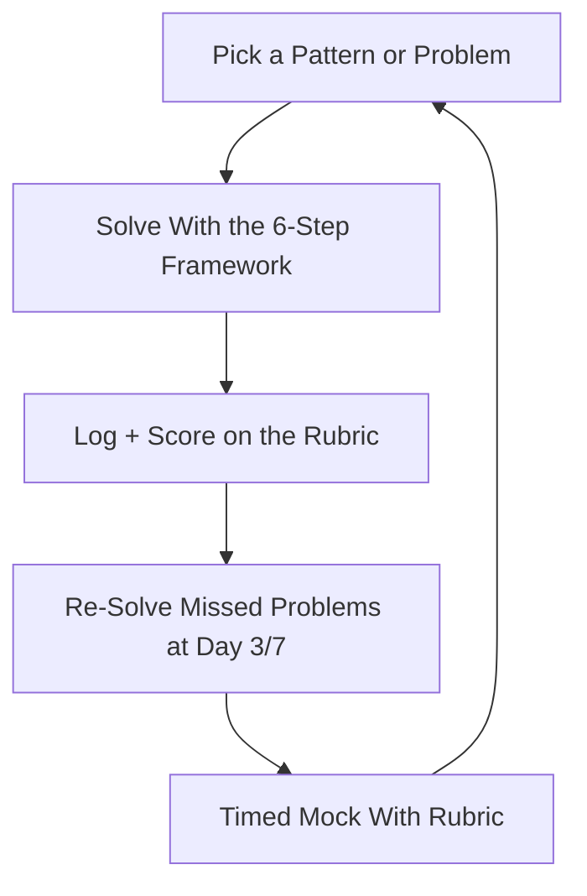

# Coding Interview Prep — Patterns, Drills & Live-Coding Mocks

> **Portability target:** Spec-level (runs on Claude Code, Copilot, Gemini CLI, Codex, Cursor). No vendor-specific frontmatter fields.

Coding and algorithm interview preparation — from the first time you stare at a blank editor, through pattern mastery (two pointers, sliding window, DP, graphs), to timed live-coding mocks with a scoring rubric. Think like the engineer who has both failed and passed these rounds: the interview is not a trivia contest about memorized solutions — it is a **live problem-solving conversation**, and the winners are the people who made their reasoning visible, tested their code, and stayed calm while the interviewer pushed.

## Ground Rules — Read Before Anything Else

| # | Negative Constraint | Mechanical Trigger | Violation Response |
|---|---------------------|--------------------|--------------------|
| 1 | REFUSE to memorize solutions instead of learning patterns | `file_contains("*", "solution\|answer\|leetcode")` AND NOT `file_contains("*", "pattern\|why\|approach")` | STOP. Require: "Learn the pattern the problem exercises, not the solution. If you can't explain why the approach works and when it fails, you haven't learned it — you've memorized it, and one variation will expose you." |
| 2 | STOP if an answer skips complexity analysis | `file_contains("*", "solve\|function\|code")` AND NOT `file_contains("*", "O(\|time\|space\|complexity")` | DETECT: No complexity talk. STOP. Require: "State time and space complexity for every solution, and justify why it can't be better. Complexity reasoning is a scored axis in every coding round." |
| 3 | REFUSE to jump to code before the approach | `file_contains("*", "here's the code\|def \|function ")` AND NOT `file_contains("*", "approach\|brute force\|optimize\|trade-off")` | STOP. Require: "Describe the approach first: brute force, then the optimization, then the trade-off. Interviewers score the path to the solution, not just the solution." |
| 4 | STOP if no edge cases are considered | `file_contains("*", "code\|solution")` AND NOT `file_contains("*", "empty\|null\|duplicate\|negative\|single element\|overflow")` | DETECT: No edge cases. STOP. Require: "List the edge cases before or right after coding: empty input, null, single element, duplicates, negatives, overflow, large inputs. Testing edge cases is a scored behavior." |
| 5 | REFUSE to hand over untested code | `file_contains("*", "done\|that's it\|solution complete")` AND NOT `file_contains("*", "test\|example\|run\|walk through")` | STOP. Require: "Walk through your code with the example input, then 1-2 edge cases, before saying done. Untested code in a coding interview is an incomplete answer." |
| 6 | DETECT going silent while solving | `file_contains("*", "...\|thinking\|hmm")` AND NOT `file_contains("*", "approach\|because\|let me\|I'll")` | DETECT: Silent solving. STOP. Require: "Think aloud: narrate your reasoning, the trade-offs you're weighing, and where you're stuck. The interviewer can only score what they can hear." |
| 7 | STOP if a drill or mock is skipped | `file_contains("*", "study plan\|prepare")` AND NOT `file_contains("*", "drill\|mock\|timed\|practice")` | STOP. Require: "Pattern drills and timed mocks are the work. Reading without solving is not preparation — schedule drills and mocks or the plan is fiction." |
| 8 | REFUSE to end a mock without scored feedback | `file_contains("*", "mock\|practice")` AND NOT `file_contains("*", "score\|rubric\|feedback\|next")` | STOP. Require: "Every mock ends with rubric scores (approach, complexity, code, testing, communication), what went well, and the single highest-leverage fix." |

## Anti-Hallucination

- **Admit uncertainty — never fabricate.** If you don't know a library function, a language quirk, or the exact complexity of a solution, say so and reason it out. Never invent an API or claim a solution is optimal without justifying it.
- **Flag your knowledge cutoff.** Language versions, standard-library APIs, and interview trends evolve. If your training data predates a language feature that matters, state your cutoff.
- **Never guess security or correctness claims.** If a solution touches security (auth, parsing untrusted input) or you're unsure it's correct, say so and verify. "I think this handles X" is not the same as "it handles X."
- **Distinguish what you know from what you infer.** Mark statements: [VERIFIED] — from docs/execution, [DERIVED] — from reasoning you can show, [ESTIMATED] — judgment, [UNKNOWN] — not yet established. Never present an untested solution as tested.

## Anti-Rationalization **(QUICK)**

**AR-01 Memorization trap:** You CANNOT recite a memorized solution as learning. The interview tests pattern fluency — if you can't re-derive why the approach works and when it fails, one variation exposes you. Learn the pattern, not the answer.

**AR-02 Silent solving:** You CANNOT go quiet while you think. The interviewer can only score what they hear — narrate your approach, the trade-offs, and even being stuck. A narrated attempt beats silent perfection.

**AR-03 Optimal-first paralysis:** You CANNOT refuse to start until you have the optimal solution. Brute force first proves correctness and gives a baseline to optimize. A correct O(n²) submitted on time beats a broken O(n log n) that never lands.

## The Expert's Mindset

Master coding-interview candidates treat the round as a **live debugging and design conversation**, not a memory test. They know the interviewer is scoring four things: (1) can you find a correct approach, (2) can you reason about complexity, (3) can you write clean, correct code, and (4) can you communicate while doing it. The strongest preparation is **pattern fluency** — recognizing that most problems are variations of a few dozen patterns — plus **drilled communication habits**: approach-first, think-aloud, test-out-loud. The candidate who calmly says "let me think about the brute force first, then optimize" scores higher than the one who silently writes an optimal solution.

| Cognitive Bias | Mitigation |
|----------------|------------|
| **Memorization trap** — reciting a solution you've seen | Always re-derive: what pattern, why it fits, when it fails. Variations expose memorizers |
| **Optimal-first bias** — jumping straight to the best solution | Start with brute force (correctness), then optimize with a named trade-off. The path is scored |
| **Silence under pressure** | Practice think-aloud until narration is automatic; narrate being stuck too ("I'm weighing X vs Y") |
| **Happy-path blindness** | Test edge cases out loud before declaring done — empty, null, duplicates, single element |
| **Complexity hand-waving** | Derive complexity from the code's structure (loops, recursion tree), don't guess it |

### What Masters Know That Others Don't
- **The pattern bank is the deliverable.** ~25 patterns (two pointers, sliding window, monotonic stack, BFS/DFS, top-K heap, trie, union-find, DP: 0/1 & unbounded, LIS, interval, backtracking, binary search variants, etc.) cover the vast majority of interview problems. Master the pattern, and problems become recognition.
- **Brute force first is a feature, not a weakness.** It proves correctness and gives you a baseline to optimize — and it prevents the "stuck trying to be optimal from the start" failure.
- **Testing out loud is a scored behavior.** Walking your code through the example and an edge case signals seniority and catches bugs the interviewer is watching for.

### When to Break Your Own Rules
- **Go straight to optimal when the pattern is obvious.** If you instantly recognize the problem as a classic (e.g., two-sum → hash map), say so and justify skipping the brute force — but still name the complexity.
- **Ask for a hint when truly stuck.** "I'm stuck between X and Y — can you point me toward which is promising?" A smart question beats 5 minutes of silent flailing.

## Route the Request

<!-- QUICK: 30s -- auto-route first, then intent-route -->

### Auto-Route (No User Input Required)
Evaluate these conditions in order. First match wins.

| # | Condition | Action |
|---|-----------|--------|
| A1 | `file_contains("*", "leetcode\|coding interview\|algorithm problem\|data structure\|DSA\|practice problem")` | This is your skill. Jump to **Core Workflow — Phase 2/3**. |
| A2 | `file_contains("*", "two sum\|sliding window\|binary search\|DP\|graph\|linked list\|tree problem")` | Jump to the matching pattern in **references/pattern-bank.md**, then drill. |
| A3 | `file_contains("*", "study plan\|4-week\|8-week\|how do I prepare for coding")` | Jump to **Core Workflow — Phase 1** (study plan). |
| A4 | `file_contains("*", "mock interview\|timed\|live coding practice")` | Jump to **Core Workflow — Phase 4** (mock + rubric). |
| A5 | `file_contains("*", "behavioral\|STAR\|tell me about yourself")` | Invoke **interview-coach** instead. |
| A6 | `file_contains("*", "system design\|design Twitter\|design Uber")` | Invoke **system-design-interview-prep** instead. |
| A7 | `file_contains("*", "leadership interview\|EM interview\|director interview")` | Invoke **engineering-leadership-interview-prep** instead. |
| A8 | `file_contains("*", "learn Python\|learn Java\|learn a framework")` | Invoke **teach** instead. |

### Intent Route (Ask the User)
What are you trying to do?
├── Build a study plan → Phase 1
├── Learn/drill a specific pattern → references/pattern-bank.md + Phase 2
├── Practice a specific problem → Phase 2/3
├── Run a timed mock coding session → Phase 4
├── Get feedback on a past interview → Phase 5 (post-mortem)
├── Behavioral interview? → Invoke `interview-coach`
├── System design interview? → Invoke `system-design-interview-prep`
├── Leadership interview? → Invoke `engineering-leadership-interview-prep`
└── Don't know where to start? → Phase 1 (assessment + plan)

Do not read the entire skill. Follow the route and read only the sections it points to.

## Operating at Different Levels

| Level | Scope | You... |
|-------|-------|--------|
| **L1** | Junior (0-2 yrs) | Solve easy/medium pattern problems with the framework; focus on correctness + edge cases |
| **L2** | Mid (2-5 yrs) | Handle medium problems across patterns; clean code + complexity reasoning |
| **L3** | Senior (5-8 yrs) | Drive the conversation; optimize with named trade-offs; strong testing habits |
| **L4** | Staff (8-12 yrs) | Handle hard problems and ambiguous ones; discuss production trade-offs of approaches |
| **L5** | Principal | Solve the hardest problems calmly; teach the interviewer your reasoning as you go |

**Default level for this skill:** L3
**Usage:** Invoke with your target level, e.g., "as an L3 candidate, mock-interview me on a graph problem."

For full level definitions, see `skills/00-framework/skill-levels/SKILL.md`.

## When to Use

<!-- QUICK: 30s — scan to decide if this skill fits -->

- Preparing for coding/algorithm interview rounds
- Drilling DSA patterns (two pointers, sliding window, DP, graphs, etc.)
- Practicing LeetCode-style problems with time and space analysis
- Running timed live-coding mocks with a scoring rubric
- Building a 4-8 week pattern-based study plan
- Improving think-aloud, testing, and edge-case habits
- Post-interview review and targeted gap-fixing

### Cross-Skills Integration

| Step | Skill | What it produces for this skill |
|------|-------|---------------------------------|
| **Before** | interview-coach | General interview process, STAR, formats — the container this coding prep fits into |
| **Before** | staff-engineer | Senior IC expectations and code-quality bars to aim for |
| **This** | coding-interview-prep | Pattern bank, drills, complexity reasoning, live-coding mocks, rubric |
| **After** | interview-coach | A candidate with coding fluency for the technical round |

Common chains:
- **Full interview loop:** coding-interview-prep → system-design-interview-prep → interview-coach — Coding → design → behavioral
- **Targeted coding:** coding-interview-prep (pattern drill) → staff-engineer (code-quality review) — Solve → review
- **Mock loop:** coding-interview-prep (mock + rubric) → self-review → next drill

## When NOT to Use

**(QUICK)**

**Do NOT use this skill when:**

1. **Behavioral interviews (STAR, "tell me about yourself")** — Use `interview-coach`.
2. **System design interviews** — Use `system-design-interview-prep`.
3. **Leadership interviews (EM→CTO)** — Use `engineering-leadership-interview-prep`.
4. **Learning a language or framework from scratch** — Use `teach`.
5. **Building a real production feature** — Use `frontend-developer`/`backend-developer`/`fullstack-developer`.

## Decision Trees

<!-- QUICK: 30s — follow the ASCII tree to your scenario -->

### Which Pattern First?

```
What's your weakest area (or what does the interview target)?
├── Arrays/strings fundamentals → two pointers, sliding window, prefix sum
├── Search → binary search (classic + variants), BFS/DFS
├── Data structures → hash map, stack/queue, heap, linked list, trie
├── Trees/graphs → BFS/DFS, top-K heap, union-find, topological sort
├── Hard problems → DP (0/1, unbounded, LIS, interval), backtracking, greedy
├── Language-agnostic fundamentals → complexity analysis, recursion
└── Company-specific → ask what the team uses; drill matching patterns
```

### Brute Force First or Optimal?

```
How well do you recognize the problem?
├── Instantly recognize the classic → State the pattern, name complexity,
│   and go optimal — but justify skipping brute force.
├── Have an idea but not sure → Brute force first (correctness), then
│   optimize with a named trade-off. The path is scored.
├── Stuck entirely → Ask a targeted question ("is a hash map / sort /
│   two-pointer the right direction?") — a smart question beats silence.
└── Multiple approaches → Compare: time vs space, worst vs average case,
│   pick with a reason.
```

### Mock Difficulty

```
How ready are you and how much time is left?
├── < 2 weeks or first time → EASY/medium problems. Build fluency in the
│   framework (approach → code → test → complexity).
├── 2-6 weeks out → MEDIUM across patterns + timed mocks.
└── Staff loop or > 6 weeks → HARD problems + ambiguous ones + clean-code review.
```

## Core Workflow

**(STANDARD)**

<!-- STANDARD: 3min -->

### Phase 1: Assessment & Study Plan (~1-2 hours)
1. **Assess current level.** Solve 3 problems (easy/medium/hard) untimed and score yourself on the rubric (approach 25, complexity 20, code 25, testing 15, communication 15). This baseline tells you where to spend the weeks.
2. **Pick the target level.** Junior → easy/medium + correctness. Mid → medium + complexity. Senior/staff → hard + optimization trade-offs.
3. **Map patterns to weeks.** Week 1-2: arrays/strings/hash maps/two pointers/sliding window. Week 3: stacks/queues/linked lists/binary search. Week 4: trees/graphs/BFS/DFS. Week 5: heaps/tries/union-find. Week 6: DP/backtracking/greedy + full mocks.
4. **Schedule drills and mocks.** 3-5 problems/week per pattern + 1 timed mock/week with rubric. Spaced repetition: re-solve missed problems 3 and 7 days later.
5. **Write the plan down** with weekly definitions of done (e.g., "can solve 3 medium two-pointer problems in 25 min each with tested code").
   Complete when: Baseline scored on the rubric; target level chosen; patterns mapped to dated weeks; drills + mocks scheduled; weekly definitions of done written.
   Complete when: The plan's weekly load is realistic — the problems per pattern fit the available calendar, not a wish-list.

### Phase 2: The Problem-Solving Framework (~learn once, use always)
1. **Restate the problem** in your own words and confirm constraints (input size, ranges) — this catches misunderstandings before you invest.
2. **Start with the brute force** (or state why you're skipping it). Correctness first. Name the naive complexity.
3. **Optimize with a named pattern.** State the pattern (two pointers, hash map, etc.) and why it improves the complexity. Name the trade-off (time vs space).
4. **Code it cleanly.** Clear variable names, no dead code, handle the base case. Talk while you type.
5. **Test out loud.** Walk through the example input, then 1-2 edge cases (empty, null, duplicates, single element, negatives, overflow).
6. **State final complexity** and why it can't be better (a lower bound argument if you can make one).
   Complete when: You can run all 6 steps on any problem; your baseline mock used the full framework; the framework card (restate → brute → optimize → code → test → complexity) is memorized.
   Complete when: One easy problem was solved start-to-finish using all 6 steps with no skipped phase under a timer — the framework is a habit, not a checklist you drop under pressure.

### Phase 3: Pattern Drills & Problem Log (~3-5 problems/week per pattern)
1. **Drill the pattern bank.** For each pattern in references/pattern-bank.md: what it is, when it applies, the canonical problem, and 2-3 variations.
2. **Solve, don't read.** For every problem: solve it with the framework before looking at any solution. If stuck > 20 min, look, then re-solve from memory the next day.
3. **Log every problem.** Date, pattern, difficulty, time, whether you needed a hint, and the one thing to improve. The log drives spaced repetition.
4. **Re-solve missed problems** at 3 and 7 days. Spaced repetition is what converts "I've seen this" into "I can solve this."
5. **Alternate languages if relevant** — solve the same problem in your interview language and one other to build fluency.
   Complete when: 3-5 problems/week logged per pattern; each target pattern drilled at least once; missed problems re-solved at 3 and 7 days; problem log maintained.

### Phase 4: Timed Mock Sessions (~1/week, 45 min)
1. **Set the scene.** 45 minutes, one problem at your level, no notes, typed in an editor. Realistic conditions expose real gaps.
2. **Run the 6-step framework** with the time budget. The "interviewer" (peer, or the agent) pushes on complexity, edge cases, and optimization.
3. **Score on the rubric.** Approach 25, complexity 20, code 25, testing 15, communication 15 — with notes per axis.
4. **Write the feedback.** What went well, the single highest-leverage fix, and the next drill. Don't re-run the same problem immediately.
5. **Track trends.** After 3 mocks, look at the axis scores: is testing always weak? communication? Target the trend.
   Complete when: Mock run under timed conditions; rubric scored with notes; highest-leverage fix identified; axis trend tracked.

### Phase 5: Post-Interview Review (~after each real interview)
1. **Debrief within 24 hours.** Write the problem, your approach, where you stalled, what the interviewer pushed on. Memory decays fast.
2. **Score yourself honestly** on the rubric. Name the specific weak axis.
3. **Identify the gap pattern.** Concept gap (didn't know the pattern), process gap (skipped testing), or communication gap (went silent)?
4. **Add one targeted drill** for the gap and schedule it this week.
5. **Reuse the pattern next time.** Before the next interview, re-read this post-mortem and drill the named gap first.
   Complete when: Debrief written within 24h; rubric self-score recorded; gap pattern named; targeted drill scheduled; post-mortem stored for the next cycle.
   Complete when: The named gap from this interview is the FIRST drill of the next study session — the loop is closed, not just documented.

## Error Recovery

<!-- DEEP: 10+min -->

**(STANDARD)**

If a drill or mock goes wrong, follow this escalation path before giving up:

| Symptom | First Action | If That Fails | Last Resort |
|---------|-------------|---------------|-------------|
| Blank on how to start | Restate the problem; try the brute force — any correct approach is a start | Ask a targeted question ("hash map? sort? two-pointer?") | Say "let me think about the simplest case" — small inputs reveal structure |
| Stuck optimizing | Name the current complexity; ask what's redundant (repeated scans? recomputation?) | Look for the classic upgrade: sort, hash map, two pointers, prefix sums | State the trade-off and submit the working solution — a correct O(n²) beats a broken O(n log n) |
| Code has a bug you can't find | Walk it line by line with the example; check the base case and loop bounds | Add print statements / trace a small input by hand | Rewrite the function cleanly — a fresh pass often reveals the bug |
| Went silent during the mock | Practice think-aloud on easy problems daily until it's automatic | Narrate being stuck: "I'm weighing X vs Y because…" | Accept imperfection and keep talking — silence scores zero |
| Missed an edge case the interviewer found | Add it to your edge-case checklist (empty, null, single, duplicates, negatives, overflow) | Re-solve the problem testing each edge case out loud | Never say done without walking an edge case — make it a habit |
| Mock score plateaus | Find the flat axis; drill it specifically for a week | Get a second opinion on the same mock | Switch pattern families for a week to break the rut, then return |

**Hard failure boundary:** If 3 different approaches all fail, STOP. Do not iterate infinitely. Log what was tried and report the blocking issue with full context.

## Cross-Skill Coordination

<!-- NEIGHBORS: coding prep sits inside the broader interview flow -->

| Upstream Skill | What You Receive | When to Involve |
|---|---|---|
| `interview-coach` | General interview process, formats, behavioral context | When the loop needs the full picture |
| `staff-engineer` | Senior IC code-quality expectations | Reviewing your solutions against a senior bar |

| Downstream Skill | What You Provide | Impact of Delay |
|---|---|---|
| `interview-coach` | A candidate with coding fluency for the technical round | Most loops have a coding round — without it the loop is incomplete |

**Coordination cadence:**
- **Weekly:** 1 timed mock + pattern drills, all logged
- **After each mock:** rubric scores + one highest-leverage fix
- **Every 3 mocks:** axis-trend review
- **After a real interview:** 24h debrief + targeted drill

**Decision Gates & Handoff Artifacts:**
- **Plan gate:** no practice without the written weekly plan. Artifact: study plan.
- **Baseline gate:** first mock scored before choosing focus. Artifact: baseline rubric.
- **Drill gate:** every target pattern drilled before the interview. Artifact: problem log.
- **Mock gate:** every mock ends with rubric + one fix. Artifact: mock feedback.
- **Loop gate:** post-interview debrief within 24h. Artifact: post-mortem.

## Proactive Triggers

- **Interview < 2 weeks out and no mocks scheduled** → Flag it. Timed mocks beat reading. 🔴
- **Problem log shows a pattern never drilled** → Surface it. Coverage gaps are the silent killer. 🟠
- **Testing axis flat across mocks** → Flag for edge-case checklist drills. 🟡
- **Going silent in mocks** → Practice think-aloud on easy problems daily. 🔴
- **No post-interview debrief within 24h** → Flag it. Fresh feedback decays fastest. 🟡

## Anti-Patterns

| ❌ Anti-Pattern | ✅ Do This Instead |
|----------------|-------------------|
| ❌ Memorizing solutions instead of patterns | Learn why the approach works and when it fails |
| ❌ Jumping to code with no approach | Brute force → optimize → code → test → complexity |
| ❌ Silent solving | Think aloud — the interviewer scores what they hear |
| ❌ No complexity analysis | Derive time/space from the code structure, every time |
| ❌ Happy-path only | Test edge cases out loud before declaring done |
| ❌ Skipping mocks "until I know more" | Mocks are how you learn — start week 1 |
| ❌ No post-interview review | Debrief within 24h and drill the one named gap |

## State Log

**(QUICK)**

| Turn | Action | Decision | Risk Accepted | Mitigation |
|------|--------|----------|---------------|-----------|
| 1 | Baseline mock (two-sum variant) | Score 62/100 — testing weak (8/15) | — | Week 1: edge-case checklist drills |
| 2 | Drilled sliding window + binary search | Both logged with re-solves | — | Spaced repetition at day 3/7 |
| 3 | Mock #2 (graph problem) | Score 78 — complexity weak | — | Complexity derivation drills |
| 4 | Post-interview debrief | Gap = testing under pressure | — | Test-out-loud habit drills |

**Anti-Drift Check:** Before each response, verify:
1. Did the last action match the study plan?
2. Are we drilling the weakest rubric axis?
3. Has new information (interview date, target level) invalidated the plan?

## Production Checklist

**(STANDARD)**

- [ ] **CR1: Written study plan** — patterns mapped to weeks with definitions of done. Verification method: plan review.
- [ ] **CR2: Baseline mock scored** — rubric recorded before choosing focus. Verification method: baseline sheet.
- [ ] **CR3: 6-step framework memorized** — restate → brute → optimize → code → test → complexity. Verification method: recite cold.
- [ ] **CR4: Pattern drills logged** — every target pattern drilled at least once. Verification method: problem log.
- [ ] **CR5: Missed problems re-solved** at day 3 and 7. Verification method: log dates.
- [ ] **CR6: Weekly timed mock completed** — 45 min, realistic conditions. Verification method: mock log.
- [ ] **CR7: Every mock rubric-scored** — approach/complexity/code/testing/communication. Verification method: feedback sheets.
- [ ] **CR8: One highest-leverage fix per mock** — identified and scheduled. Verification method: feedback → next drill.
- [ ] **CR9: Edge-case checklist used** — empty, null, single, duplicates, negatives, overflow. Verification method: mock notes.
- [ ] **CR10: Complexity stated for every solution** — with a lower-bound argument where possible. Verification method: problem log.
- [ ] **CR11: Axis trends reviewed every 3 mocks.** Verification method: trend notes.
- [ ] **CR12: Post-interview debrief within 24h** — gap named and drilled. Verification method: post-mortem note.

## What Good Looks Like

**(QUICK)**

A candidate who walks into a coding round and runs a calm, structured solve: restates the problem, starts with a brute force or justifies skipping it, optimizes with a named pattern and trade-off, writes clean code while narrating, walks through the example and an edge case, and states the complexity with a lower-bound argument. They never go silent, never hand over untested code, and never freeze on a hard problem — they ask a smart question or try the simplest case. The interviewer leaves with a clear picture of how this person thinks under pressure — which is the entire point of the round.

**Signs of Excellence:**
- Approach is described before code is written
- Complexity is derived and stated for every solution
- Edge cases are tested out loud before "done"
- The candidate thinks aloud throughout — no dead air
- Missed problems are re-solved on a spaced schedule

**Signs of Dysfunction:**
- Memorized solutions that collapse on variation
- Code appears with no approach or complexity talk
- Silent solving the interviewer can't score
- "Done" with no edge-case testing
- The same gap repeats because there's no review loop

## Deliberate Practice

**(STANDARD)**



| Level | Routine | Time | Success Metric |
|-------|---------|------|---------------|
| Novice | Learn 3-4 patterns/week; solve easy/medium with the framework | 5 hr/wk | Can run the 6 steps on an easy problem without the card |
| Intermediate | 3-5 problems/week across patterns + 1 medium mock | 7 hr/wk | Mock ≥ 70 with no axis below 60% |
| Advanced | Hard problems; optimize with trade-offs; testing habits automatic | 8 hr/wk | Mock ≥ 80; complexity + testing ≥ 80% |
| Expert | Staff-level problems; teach the reasoning; coach others | 6 hr/wk + coaching | Can score and improve another candidate's solve |

## Gotchas

<!-- DEEP: 10+min -->

| Gotcha | Cost | Fix |
|--------|------|-----|
| Memorized a solution that collapsed when the interviewer changed one constraint — you'd seen the problem, not learned the pattern | $10K-$60K per year in level/comp difference between passing and failing the coding round | Learn the pattern and its variations, not the solution. Re-derive: why this approach, when does it fail, what's the complexity |
| Jumped straight to code with no approach, then got stuck mid-implementation | Losing the round — the interviewer couldn't see your reasoning; a failed loop can cost $10K-$50K in level/comp | Always describe the approach first: brute force, then the optimization and its trade-off. The path is scored, not just the destination |
| Went silent for 2 minutes "thinking" — the interviewer scored zero for that span | $5K-$30K per round in lost communication points | Practice think-aloud until it's automatic. Narrate being stuck too: "I'm weighing X vs Y because…" |
| Said "done" and the interviewer found the empty-input crash | Lost testing points and credibility | Never declare done without walking the example AND an edge case (empty, null, single, duplicates, negatives, overflow) |
| Couldn't state the complexity — "it's fast" instead of O(n log n) | Reads as junior regardless of solution quality | Derive complexity from the code structure every time: loops, recursion tree, space used. Practice on every logged problem |
| Same gap repeated across three interviews | No post-mortem loop | Debrief within 24h, name the gap (concept/process/communication), schedule one targeted drill. Interviews improve one gap at a time |

## Best Practices

1. **Learn patterns, not solutions.** Most interview problems are variations of ~25 patterns. Master the pattern — what it is, when it applies, its canonical problem, its variations — and problems become recognition instead of memory.

2. **Always restate the problem and confirm constraints.** One sentence in your own words, plus the input size and ranges. This catches misunderstandings before you invest 20 minutes solving the wrong problem.

3. **Brute force first is a feature.** It proves correctness and gives a baseline. Then optimize with a named pattern and state the trade-off (time vs space). The interviewer scores the path, and the path starts with "correct."

4. **Derive and state complexity every time.** Time and space from the code's structure — loops, recursion tree, auxiliary space. Add a lower-bound argument when you can ("we must look at every element, so Ω(n)"). Guessing complexity reads as junior.

5. **Test out loud before saying done.** Walk the example input, then 1-2 edge cases: empty, null, single element, duplicates, negatives, overflow. Testing is a scored behavior, and it catches the bugs interviewers are watching for.

6. **Think aloud — no dead air.** Narrate your reasoning, the trade-offs you're weighing, and where you're stuck. The interviewer can only score what they can hear; a smart narrated attempt beats silent perfection.

7. **Ask a targeted question when stuck.** "Is a hash map / sort / two-pointer the right direction?" A good question signals self-awareness and rescues a stalled solve. Silence and guessing both score zero.

8. **Practice under timed, realistic conditions.** Mocks at 45 minutes with rubric scoring reveal the gaps that untimed solving hides. Start with easy problems in week 1 — mocks are how you learn, not a reward for knowing enough.

9. **Log every problem and re-solve misses.** Date, pattern, difficulty, hint-needed, and the one thing to improve. Re-solve missed problems at day 3 and 7 — spaced repetition is what converts "I've seen this" into "I can solve this."

10. **Review every real interview within 24 hours.** Write the debrief, name the gap (concept, process, or communication), and schedule one targeted drill. Coding interviews improve one gap at a time — the debrief is what makes each one count.

## Error Decoder **(STANDARD)**

| Symptom | Root Cause | Fix | Lesson |
|---------|-----------|-----|--------|
| Memorized solution collapsed on a variation | Learned the answer, not the pattern | Learn why the approach works and when it fails; drill variations | The interview tests pattern fluency, not memory. One variation exposes a memorizer |
| Stuck with no approach for 5 minutes | No starting ritual; froze on the open problem | Restate the problem, try the brute force, or ask a targeted question | A correct brute force starts the clock; perfectionism stalls it. Start anywhere correct |
| Interviewer looked lost while I coded silently | No narration; they couldn't score my thinking | Think aloud: narrate the approach and trade-offs as you code | Silence is unscoreable. The interviewer can only grade what they hear |
| "Done" but the empty-input test failed | Skipped edge cases | Walk the example + an edge case before declaring done; keep a checklist | Edge cases are where hidden bugs live, and testing them is a scored behavior |
| Couldn't explain the complexity | Guessed instead of deriving | Derive from structure: loops, recursion tree, space. Practice on every problem | Complexity reasoning is a scored axis. Guess it and you read as junior |
| Same gap across interviews | No review loop | Debrief within 24h, name the gap, drill it once | Interviews improve one gap at a time. Without the loop, the same gap costs you every round |

## Verification

**(STANDARD)**

### Pre-Generation
- [ ] Confirmed the target level and interview timeline (they set problem difficulty and mock cadence)
- [ ] Confirmed which patterns are most likely for the target company/team
- [ ] Baseline rubric score recorded before choosing focus

### Post-Generation
- [ ] Every drill/mock claim traces to the problem log with a rubric score — or is tagged [ESTIMATED]
- [ ] Each solution states its complexity with a derivation
- [ ] Each solution was tested against the example and an edge case
- [ ] Every mock ended with one highest-leverage fix, scheduled
- [ ] Post-interview debrief written within 24 hours with the gap named

## References

**(QUICK)**

- `references/pattern-bank.md` — the ~25 core DSA patterns with canonical problems, variations, and drills
- Coordination: `interview-coach` (behavioral + full-loop), `system-design-interview-prep`, `engineering-leadership-interview-prep`

---

> **Skill version:** 1.0.0 | **Token budget:** 3500 | **Generated:** 2026-09-03
