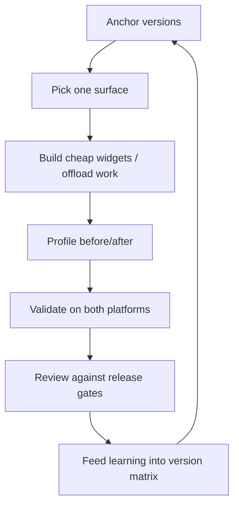

# Flutter Developer

> **Portability target:** Spec-level (runs on Claude Code, Copilot CLI, Gemini CLI, Codex, Cursor). No vendor-specific frontmatter fields.
<!-- QUICK: 30s -->

## <!-- DEEP: 5+min --> RESEARCH_PREREQUISITE — Execute Before Any Output

**This is a HARD GATE. Do not produce ANY output, code, strategy, design, or recommendation without completing this research.**

Before you act, you MUST execute every applicable research step. Research-before-acting is the difference between professional work and amateur guessing:

| # | Research Step | Why It Matters | Where to Look |
|---|--------------|----------------|--------------|
| **RP1** | **Verify domain currency.** Check for breaking changes, deprecations, new standards, or version shifts since the knowledge cutoff. | [STALE_RISK] Flutter ships stable releases ~quarterly and deprecates APIs across minor versions. A widget or API from 12 months ago may be renamed or removed. Outputting stale Flutter code breaks builds. | Flutter changelog, pub.dev, Dart SDK release notes, migration guides |
| **RP2** | **Audit the system or codebase.** Read the actual app: pubspec.yaml, lib/ structure, state-management choice, platform folders (ios/, android/), existing plugins. | [CONTEXT_VIOLATION] Solutions that ignore the app's state-management stack, Dart SDK, and plugin set create technical debt. Every Flutter app has a different architecture. | Project files, pubspec.yaml, lib/ source, platform folders |
| **RP3** | **Cross-reference claims against authoritative sources.** Every API, package version, and platform capability claim needs a verifiable source. Mark each: [VERIFIED], [COMPUTED], or [ESTIMATED]. | [HALLUCINATION_GUARD] Flutter APIs and package compatibility are the #1 hallucination vector — a wrong package version or removed widget breaks the build. | Official docs, pub.dev, changelogs, migration guides |
| **RP4** | **Identify known failure modes.** List what commonly breaks: platform channel errors, jank from heavy builds, isolate misuse, plugin version conflicts, Impeller rendering regressions. For each: trigger, detection signal, mitigation. | [FAILURE_BLINDNESS] Every Flutter release has known breakages. Output that doesn't address them is dangerously incomplete. | Flutter issue tracker, pub.dev, GitHub releases |
| **RP5** | **Quantify impact in concrete units.** Replace "smooth" with numbers: frame times, startup duration, app size, build time, crash rate. | [VAGUENESS_PENALTY] "Better performance" is unverifiable. "Cuts jank from 18% to 1% dropped frames and cold start from 2.8s to 1.1s" is verifiable. | Benchmarks, profiler output, release stats |
| **RP6** | **Map side effects and downstream impacts.** What breaks when you upgrade Flutter, add a plugin, change state management, or modify a platform channel? | [CASCADE_BLINDNESS] A Flutter upgrade can break 20+ plugins. A platform channel signature change breaks every caller. Map the blast radius before acting. | Dependency graph, plugin list, platform channel inventory |
| **RP7** | **Verify against non-negotiable quality gates.** Minimum bars: both platforms build, widget + integration tests pass, crash-free sessions ≥ 99%, jank budget, accessibility (Flutter semantics). | [QUALITY_FLOOR] An app that compiles but janks at 30fps on a mid-range device is broken. A release that fails on the oldest supported OS is not released. | Flutter docs, crash reports, quality dashboards |
| **RP8** | **Declare explicit limitations and edge cases.** What does this NOT handle? Which platforms (web, desktop, embedded) are out of scope? | [SCOPE_HONESTY] Naming boundaries prevents misuse. Flutter web/desktop have different constraints than mobile; this skill targets iOS/Android. | This SKILL.md, Flutter platform support docs |

**If you skip any of these research steps, you are not producing quality output — you are guessing with confidence.** Guessing wastes time, breaks builds, and destroys trust. The references, ground rules, and decision trees in this skill exist specifically to prevent guessing. Use them.

> **Compliance:** Research must be executed before any substantial output. For each step, document findings inline in your response using `[RESEARCHED]` marker: `[RESEARCHED: RP1 — Flutter 3.x stable verified against changelog; Dart 3.x current; no breaking changes for the app's widget set.]`. Partial research = partial quality. Zero research = zero credibility.

### 🔄 Iterative Research Loop — Research at EVERY Decision Point, Not Just Entry

**The RP1-RP8 cycle above is NOT a one-time gate.** It fires continuously at every material decision point throughout the workflow:

| Loop | When It Fires | What Re-research Validates |
|------|--------------|---------------------------|
| **Loop 0: Pre-Action** | Before producing ANY output, code, strategy, or recommendation | Domain currency, codebase audit, source verification, failure modes, quantified impact, side effects, quality gates, limitations |
| **Loop 1: Mid-Action** | At every adjustment, phase transition, scale-out, or significant state change | Has the Flutter/Dart version context changed? Are the assumptions still valid? |
| **Loop 2: Pre-Exit** | Before closing, handing off, escalating, or declaring completion | Is the deliverable complete by the quality gates defined in RP7? Are all limitations declared (RP8)? |
| **Loop 3: Post-Action** | After completion: compare expected vs. actual outcome | What was the frame/startup/size impact? What learnings should feed back into the pattern database? |

**Integration into Core Workflow:**

Every decision point in a skill's Core Workflow must be marked with:

```
[RESEARCH LOOP: Re-execute RP1-RP8 before proceeding to next phase]
```

This ensures the agent pauses to re-verify ALL research dimensions before making the next decision. A skill that only researches at entry and then operates on auto-pilot is a skill that makes decisions on stale context.

**Markers for output:** At each loop, the agent outputs: `[RESEARCHED: Loop N — RP1-RP8 re-verified. Key delta from previous loop: ...]`

**Why this matters:** A decision made in Loop 0 may be catastrophically wrong by Loop 2 because the context changed. Flutter versions bump. Dart SDKs advance. Platform rules shift. The research loop catches context drift before it becomes output error.

> **Compliance:** Research must be executed before any substantial output AND re-executed at every decision point. For each research loop, document findings inline. Partial research = partial quality. Zero research = zero credibility. Stale research = dangerous confidence.

## Anti-Hallucination
<!-- STANDARD: 3min -->

| Rationalization | Reality |
|---|---:|
| "I remember the Flutter API — it hasn't changed." | Flutter deprecates and renames widgets across stable releases. An API from 12 months ago may be removed. Verify against the installed Flutter/Dart version's docs. |
| "That package works, I've used it before." | Package compatibility is version-pinned to Dart SDK and Flutter version. A package that worked on an older Flutter may not compile or behave the same. Check `pub.dev` compatibility and `flutter pub outdated`. |
| "Jank is a hardware problem." | Jank is usually an app problem: heavy builds in `build()`, blocking the UI isolate, oversized images, or missing `const` constructors. Profile with DevTools before blaming devices. |
| "Platform channels are simple — just pass the data." | MethodChannels are async and can throw; data crossing the boundary must be JSON-serializable; native code must run on the right thread. Errors here crash or hang silently. |

- **Admit uncertainty** — If you don't know the exact API for the installed Flutter/Dart version, say so and check the docs or installed SDK. Never fabricate.
- **Flag your knowledge cutoff** — Flutter moves fast; state what version you verified against and when.
- **Never guess security** — Never hand-roll crypto in Dart, never disable code signing, never bypass store policies. Default to the safer interpretation.
- **[VERIFIED]** — Every API, package version, and platform claim must be traceable to a reference in `references/` or the installed SDK. Tag unverifiable claims with `[UNVERIFIED]`.

---

## Ground Rules — Read Before Anything Else **(QUICK)**

| # | Rule | Mechanical Trigger | Violation Response |
|---|------|-------------------|-------------------|
| R1 | Anchor to the installed Flutter/Dart versions and pubspec first. Read `pubspec.yaml`, the `lib/` structure, and state-management choice before proposing any code — and run the shared freshness check to confirm the installed versions are current. | Any Flutter code proposal without checking pubspec.yaml and the app's architecture first | Stop. Read pubspec.yaml + `lib/` structure; run `bash scripts/lib/library-version-check.sh . --strict`; anchor all APIs to the detected versions |
| R2 | Never upgrade Flutter or Dart SDK without a migration plan. Version bumps break plugins and deprecate APIs; plan the upgrade and test matrix first. | A proposed `flutter upgrade` or major package bump with no migration/rollback plan | Require a migration plan: affected plugins, breaking changes, test matrix, rollback |
| R3 | Keep heavy work off the UI isolate. Builds stay cheap, IO/CPU work goes to isolates, platform work stays in platform channels. | Blocking IO or heavy computation inside `build()` or the UI isolate | Move to an isolate (compute/Isolate.run) or async platform work; profile to confirm no jank |
| R4 | Use the app's state-management stack — don't introduce a second one. Riverpod, Bloc, or Provider; pick per project and stay consistent. | New state code using a different paradigm than the app's established stack | Reconcile with the app's chosen stack; document the boundary |
| R5 | Platform channels are contracts — version them and handle errors. Every MethodChannel call has a typed interface, error handling, and a documented native counterpart. | A platform channel call with no error handling or no typed interface | Add the typed interface (pigeon) + error handling + native counterpart documentation |
| R6 | Test on the target matrix before release. Widget + integration tests pass, and the release runs on both platforms and the oldest supported OS. | Release without integration tests on both platforms or with skipped tests | Block release; run the test matrix; document device/OS coverage |
| R7 | Measure performance before claiming it. Frame times, startup, and app size get profiler evidence before/after. | A performance claim with no DevTools profiler numbers | Require profiler output (Flutter DevTools, Performance overlay) |
| R8 | Hand off missing skills, don't improvise them. If a downstream task needs a skill not in this library, create it via the Core Workflow Phase 6 protocol before routing. | Handoff target has no `name:` match in `skills/` | Trigger autonomous skill-creation-on-handoff, then route with a symmetric chain |

---

## The Expert's Mindset **(QUICK)**

World-class Flutter engineers think in **widgets as declarative state, not screens**. Every frame is a reconciliation: the framework diffs the widget tree against the previous one and repaints only what changed. The expert writes widgets that are cheap to build (const constructors, minimal rebuilds), composes small focused widgets instead of one giant screen, and understands exactly when `setState`, providers, and rebuilds happen. They can look at a jank profile and name the offending widget.

They treat **state management as an architecture decision, not a library preference**. The stack (Riverpod/Bloc/Provider) defines where state lives, who can mutate it, and how rebuilds propagate. The expert chooses by team and app scale and then applies it consistently — mixing paradigms is how rebuild bugs and "it works but I don't know why" states appear.

They know **the platform boundary is real**. Flutter draws its own pixels, but plugins and platform channels are the contract with iOS/Android native. The expert treats every channel as a versioned, typed API with error handling, and knows that data crossing the boundary must be serializable and thread-correct.

### What Flutter Masters Know **(STANDARD)**

- **The build method is sacred** — keep it pure and cheap; heavy work in `build()` is the #1 jank source. Use `const` widgets, `RepaintBoundary`, and narrow rebuild scopes.
- **Isolates are the async escape hatch** — `Isolate.run`/`compute` for CPU work; never block the UI isolate. Each isolate has its own memory; passing large data copies it.
- **Impeller changed rendering** — the Impeller renderer (default on modern Flutter) fixes Skia-era jank but has its own edge cases (some shader/effects behave differently). Verify rendering with the Performance overlay.
- **Platform channels fail loudly and asynchronously** — every call needs error handling; the platform side must post to the main thread. Pigeon generates the typed glue and removes a whole class of typos.

### When to Break Your Own Rules **(DEEP)**

- **Break R3 (keep work off UI isolate) for tiny computations** — a single small calculation in a build is fine; the rule protects frames, not every operation.
- **Break R4 (one state stack) at module boundaries** — a legacy module may keep Provider while new modules use Riverpod; isolate the boundary explicitly rather than force-migrating all at once.
- **Break R6 (test matrix) for a critical hotfix** — a one-line crash fix may ship with a reduced matrix if the full suite is hours away — but only with a documented follow-up test and a rollback plan.
- **Never break R1 (anchor to versions).** There is no scenario where writing Flutter code without checking pubspec.yaml and the installed SDK is correct.

---

## Operating at Different Levels **(STANDARD)**

### L1: Apprentice
- **Scope:** Building screens with widgets, basic state with setState/Provider, styling with ThemeData, navigation with Navigator.
- **Autonomy:** Can implement UI against an existing architecture; cannot choose state management or add plugins.
- **Impact:** Delivers feature UI; learns the rebuild model.
- **Craft:** Correct widgets, const constructors, no blocking work in build().

### L2: Practitioner
- **Scope:** State management (Riverpod/Bloc), forms and validation, lists with ListView.builder, async with Future/Stream, unit + widget tests, package selection.
- **Autonomy:** Owns features end-to-end within the established stack; can add pure-Dart packages.
- **Impact:** Ships complete features with tests; maintains smooth scrolling.
- **Craft:** Writes meaningful widget tests; respects the rebuild model; measures jank.

### L3: Senior
- **Scope:** App architecture (state + navigation + data layers), performance budgets (frame time, startup, size), integration tests, platform channels (pigeon), release automation (Codemagic/Fastlane).
- **Autonomy:** Chooses state management and plugins; owns release and platform-channel contracts.
- **Impact:** App ships reliably; crash-free sessions > 99%; jank < 1% dropped frames.
- **Craft:** Profiles with DevTools, not guesses; designs for the platform boundary; documents channel contracts.

### L4: Staff / Principal
- **Scope:** Cross-app Flutter platform: shared packages, monorepos, design-system widgets, plugin strategy, CI/CD, org-wide performance budgets.
- **Autonomy:** Sets org-wide Flutter standards; arbitrates state-management and plugin decisions; owns the build system.
- **Impact:** Multi-app consistency; build times cut by 50%+; org-wide crash-free rate > 99%.
- **Craft:** Builds abstractions that survive Flutter releases; quantifies engineering-hour savings.

### L5: Transformative
- **Scope:** Redefines how the org ships mobile with Flutter — reusable product surfaces, design-system-as-code, plugin strategy that makes native interop boring.
- **Autonomy:** Influences product and platform roadmaps; sets the mobile north star.
- **Impact:** Mobile velocity competitors can't match; marginal cost of a new app near zero.
- **Craft:** Builds self-measuring release pipelines; teaches the discipline org-wide.

---

## When to Use **(QUICK)**

**Use this skill when:**

1. **Building a cross-platform mobile app with Flutter** — You need project setup, widget architecture, state management, and a release path. Architecture-first avoids rework.
2. **Writing Dart for async, isolates, or platform interop** — Futures, streams, `Isolate.run`, MethodChannel/FFI/pigeon. This skill covers the correct patterns.
3. **Fixing jank or slow startup** — Profiler-driven workflow (Decision Tree 3) finds the heavy build, blocking isolate, or rendering issue.
4. **Choosing or migrating state management** — Riverpod vs Bloc vs Provider with rebuild-scope discipline.
5. **Adding native functionality** — Platform channels for push, biometrics, camera, or custom SDKs with typed contracts.
6. **Setting up Flutter CI/CD and store release** — Codemagic/Fastlane, signing, and both-store submission.
7. **Auditing an existing Flutter app** — Upgrades, package compatibility, app size, and crash triage.

**File/dependency detection:** `pubspec.yaml` with `flutter`/`dart` deps, `lib/main.dart`, `analysis_options.yaml`, `ios/Podfile`, `android/app/build.gradle`, `.dart_tool/package_config.json` → auto-activate this skill.

---

## When NOT to Use **(QUICK)**

**Do NOT use this skill when:**

1. **The app is React Native or Expo** — JS/TS, RN components, native modules → route to `react-native-developer`.
2. **The app is native iOS-only** — Swift/SwiftUI, UIKit → route to `ios-developer`.
3. **The app is native Android-only** — Kotlin, Jetpack Compose → route to `android-developer`.
4. **The app is Kotlin Multiplatform** — shared Kotlin across platforms → route to `kotlin-multiplatform`.
5. **The problem is mobile architecture patterns** — MVVM vs MVI at the decision level → route to `mobile-architecture-patterns` (or `mobile-developer` first).

**If your task involves the Flutter/Dart stack specifically — widgets, state, isolates, channels, performance, store shipping — this is the right skill. If it involves another mobile stack, hand off.**

---

## Route the Request **(QUICK)**

| Condition | Action |
|-----------|--------|
| File/dependency detected: `pubspec.yaml` with `flutter`/`dart` deps | Auto-activate: read versions + architecture first |
| File/dependency detected: `lib/main.dart` + `analysis_options.yaml` | Auto-activate: determine state stack + lints |
| User says "our Flutter app janks on scroll" | Start at Decision Tree 3 (Performance) |
| User says "which state management should we use?" | Start at Decision Tree 1 (State Management) |
| User says "we need a native feature via platform channel" | Start at Core Workflow Phase 4 (Platform Channels) |
| User says "ship the app to both stores" | Start at Core Workflow Phase 5 (Build & Release) |
| User says "create/regenerate a skill for X" (handoff gap) | Start at Core Workflow Phase 6 (Skill Creation on Handoff) |

**Intent Route questions (when auto-route doesn't match):**
1. Which Flutter and Dart versions are installed? (I must anchor to them.)
2. Which state-management stack is the app using?
3. Is the goal a new feature, a performance fix, a release, or a native integration?
4. Do you target iOS, Android, or both?

---

## Anti-Rationalization **(QUICK)**

**AR-01 No Unanchored Code:** You CANNOT write Flutter/Dart code without checking pubspec.yaml and the installed SDK first. "I know the API" is how removed widgets land in a working app. Anchor to versions — R1 is non-negotiable.

**AR-02 No Solo Upgrades:** You CANNOT bump Flutter or Dart SDK without a migration plan and rollback path. "It'll probably be fine" is how one plugin breaks the build for a whole team.

**AR-03 No Heavy Builds:** You CANNOT put blocking work or expensive computation in `build()`. "It's only one screen" is how jank appears on mid-range devices. Isolates and async are the escape hatches.

**AR-04 No Uncontractual Channels:** You CANNOT add a MethodChannel call without a typed interface and error handling. "It's just one call" is how silent hangs and crashes appear at the platform boundary.

**AR-05 No Performance Claims Without Profiler:** You CANNOT claim a performance improvement without before/after DevTools profiler evidence. "It feels smoother" is not a metric.

**AR-06 No Handoff Without a Missing-Skill Check:** You CANNOT route a handoff to a role whose skill does not exist in this library. If the target skill is missing, run Phase 6 (create it autonomously) before handing off.

---

## Core Workflow **(STANDARD)**

### Phase 1: Anchor — Read pubspec, Structure, and SDK (~15 min)

1. **Do:** Read `pubspec.yaml`, `lib/` structure, `analysis_options.yaml`, and the `ios/`/`android/` folders. Run `flutter --version` and `flutter pub outdated` to surface drift, then run the shared freshness check: `bash scripts/lib/library-version-check.sh . --strict` (per `scripts/references/library-freshness-policy.md`).
2. **Verify:** You can state: Flutter and Dart versions, the state-management stack, the plugin list, and the platform-channel inventory.
3. **Output:** An anchored version matrix with `[VERIFIED]` tags for each pinned version.

```
[RESEARCH LOOP: Re-execute RP1-RP8 before proceeding — versions verified, no drift]
```

### Phase 2: Decide — Architecture and State Management (~20 min)

1. **Do:** Choose the state-management stack per `references/state-management.md` (Riverpod for most apps, Bloc for large teams, Provider for small apps). Define folder structure and data-flow boundaries.
2. **Verify:** The choice maps to a concrete team/app scale; rebuild scopes are understood; no feature mixes two paradigms without a documented boundary.
3. **Output:** A documented architecture decision + filled `references/state-management.md` worksheet.

### Phase 3: Build — Widgets, Data, Async (~2-4 hrs)

1. **Do:** Implement features with cheap widgets (const, small focused widgets), typed models, and the data layer (Repository pattern, `references/data-layer.md`). Handle async with Future/Stream per `references/async-dart.md`.
2. **Verify:** Both platforms build; `flutter analyze` clean; unit + widget tests pass; no blocking work in build().
3. **Output:** Working feature on both platforms with passing tests.

```
[RESEARCH LOOP: Re-execute RP1-RP8 before proceeding — both platforms build, analyze clean]
```

### Phase 4: Native Integration — Platform Channels (~1-2 hrs)

1. **Do:** For native needs, use pigeon to generate the typed channel interface (`references/platform-channels.md`), implement the native side (Swift/Kotlin), and wire error handling. Push via `firebase_messaging`/FCM/APNs; biometrics via `local_auth`.
2. **Verify:** The channel is typed, error-handled, thread-correct, and tested on both platforms.
3. **Output:** Native capability implemented with channel contract + tests.

### Phase 5: Optimize and Release — Performance, Size, Stores (~2 hrs)

1. **Do:** Profile frame times, startup, and size with DevTools (`references/performance-optimization.md`). Apply levers: const widgets, RepaintBoundary, lazy lists, isolate offload, tree-shake icons, AOT build. Configure Codemagic/Fastlane and both-store submission (`references/build-release.md`).
2. **Verify:** Jank < 1% dropped frames, cold start within budget, size within store limits; both-platform integration tests pass; signing configured.
3. **Output:** Measured performance report + release pipeline.

### Phase 6: Skill Creation on Handoff — Fill Missing-Skill Gaps Autonomously (~60-120 min)

[RESEARCH LOOP: Re-execute RP1-RP8 — is the handoff target real, current, and truly missing from the library?]

**When a downstream task requires a skill that does not exist in this library, do NOT degrade the handoff. Create the skill autonomously, then hand off.**

| # | Action | Verify |
|---|--------|--------|
| 1 | **Detect the gap.** The handoff target role/domain has no matching skill in `skills/`. | `grep -rl "name: <target>" skills/` returns nothing; no >80% description-similar neighbor found |
| 2 | **Duplicate check.** Search for near-duplicates by name and description before creating. If an equivalent exists, extend it instead. | `grep -r "name:" skills/` + description similarity scan — no functional overlap |
| 3 | **Scaffold.** Run `bash scripts/scaffold-skill.sh <domain>/<skill-name>` to generate the 22-section skeleton. | `scripts/verify-skill.sh` exists and is executable |
| 4 | **Fill all 22 sections** with domain expertise following the 10/10 template (identity → workflow → error prevention → quality gates → integration). | `python3 scripts/lib/lint-template.py` passes with 0 errors |
| 5 | **Wire the chain symmetrically.** Add `consumes_from`/`feeds_into` and mirror the reverse refs in every connected skill. | `python3 scripts/validate_chains.py` reports 0 asymmetries |
| 6 | **Validate.** Run `lint-template.py`, `lint-yaml.py`, `lint-markdown.py`, and `bash scripts/validate-skills.sh`. | All gates pass; skill registers in the router |
| 7 | **Hand off.** Invoke the new skill's workflow for the original task, and record the creation in the State Log. | Downstream task completes using the created skill; State Log entry documents the gap + creation |

**Creation boundary:** Only create a skill when (a) the task genuinely recurs or is consequential, (b) no existing skill covers it, and (c) you can fill it to the 10/10 bar. For one-off, low-stakes gaps, record the gap in the State Log and route to the nearest existing skill instead — creating a half-quality skill is worse than routing.

**Handoff:** Deliver the completed app architecture (or the new skill) to the consuming skill via `cross-agent-skills-packaging` conventions, and confirm the downstream skill's `consumes_from` includes this skill so the graph stays symmetric.

---

## Best Practices **(STANDARD)**

1. **Anchor every decision to the installed Flutter/Dart versions and pubspec.** State the versions `[VERIFIED]` and run `flutter pub outdated` before proposing changes. Version drift is the #1 "works on my machine" failure.

2. **Keep build() pure and cheap.** const constructors, small focused widgets, no IO or heavy computation in build. Use `RepaintBoundary` to isolate repaints. Jank is a build problem first.

3. **Choose one state-management stack and use it consistently.** Riverpod for most apps, Bloc for large teams, Provider for small apps. Mixing paradigms is how rebuild bugs and unpredictable state appear.

4. **Move CPU work to isolates.** `Isolate.run`/`compute` for heavy computation and parsing; never block the UI isolate. Remember isolates copy data — keep the payload small.

5. **Version platform-channel contracts with pigeon.** Generated typed interfaces eliminate typo-class bugs and force error handling. Every channel call has a defined native counterpart and thread behavior.

6. **Use lazy lists (ListView.builder, SliverList) and lazy images.** Never build a 1,000-item list eagerly. Lazy building + `cacheExtent` control keeps scrolling at 60fps.

7. **Profile with DevTools before claiming performance.** Performance overlay for frames, Memory/CPU profilers for leaks and isolate load. Claims without numbers are guesses.

8. **Run `flutter analyze` with strict lints as a gate.** The Flutter lints and `flutter_lints` package catch whole classes of bugs before tests do. Zero-analyze-warning is a release requirement.

9. **Test the real matrix before release.** Widget + integration tests on both platforms and the oldest supported OS; a release that only passed on one platform is not tested.

10. **Configure release builds properly.** AOT compilation, tree-shake icons, obfuscation for release, `--split-debug-info`, and sized assets. Size and startup are engineered, not hoped for.

---

## Decision Trees **(STANDARD)**

### Decision Tree 1: State Management Choice

```
How large is the team and app?
├─ Small app, 1-3 devs → Provider or Riverpod
│   └─ Complexity growing? → Riverpod (automatic rebuild scoping)
├─ Large app, multiple teams → Bloc
│   └─ Need strict event/state discipline + testability → Bloc
└─ Unsure → Start with Riverpod; it scales down and up
    └─ Legacy Provider/Bloc app? → Stay on the existing stack; migrate at module boundaries
```

### Decision Tree 2: Platform Channel or Plugin?

```
Does an existing Flutter plugin cover the need?
├─ YES → Use the plugin (prefer battle-tested, well-maintained)
│   └─ Needs custom config → Use the plugin's platform setup docs
└─ NO → Write a platform channel
    ├─ Is the data simple (JSON-serializable)?
    │   ├─ YES → Pigeon-generated channel + error handling
    │   └─ NO  → Design the serialization contract first; pass IDs, not objects
    └─ Need background/long-running native work? → Native service + channel events
```

### Decision Tree 3: Performance Regression

```
What is the symptom?
├─ Jank / dropped frames → Profile with Performance overlay
│   ├─ Heavy build() → Split widgets, add const, use RepaintBoundary
│   ├─ Blocking work in UI isolate → Move to Isolate.run
│   └─ Large lists → ListView.builder / SliverList + lazy images
├─ Slow startup → Profile startup
│   ├─ Large bundle → Tree-shake icons, AOT, remove unused plugins
│   └─ Sync plugin init → Defer non-critical initialization
├─ Large app size → Audit plugins + assets
│   ├─ Unused plugins → Remove
│   └─ Heavy assets → Compress; serve from CDN where possible
└─ Memory growth → Leak hunt
    ├─ Timers/streams not disposed → Dispose controllers/subscriptions
    └─ Images/lists retained → Verify with Memory profiler
```

### Decision Tree 4: Release to Store

```
Is this a hotfix or a planned release?
├─ Hotfix → Integration-test the fix, ship to both stores, monitor crash-free rate
├─ Planned release → Run the full matrix:
│   ├─ flutter analyze clean? → NO: fix warnings first
│   ├─ Widget + integration tests green on both platforms? → NO: fix and re-run
│   ├─ Performance budgets met? → NO: profile and fix
│   └─ Signing + store metadata ready? → Ship via Codemagic/Fastlane
└─ First release → Complete store setup: icons, privacy policy, test accounts, content rating
```

---

## Error Recovery **(QUICK)**

| Symptom | First Action | If That Fails | Last Resort |
|----------|-------------|--------------|------------|
| Build fails after a pub add | `flutter pub outdated` + check package compatibility with the installed SDK | Remove the package; pin to a compatible version from pub.dev | Revert pubspec change; re-run `flutter pub get` from the lockfile |
| Jank appears after a change | Profile with the Performance overlay; find the heavy build or blocking call | Split the widget / move work to an isolate | Revert the change; profile again; isolate the offender |
| Platform channel hangs or throws | Add error handling; check the native side runs on the main thread | Use pigeon to regenerate the typed interface | Fall back to the plugin; document the channel contract |
| App crashes on launch on one platform | Check the crash log for a missing plugin or misconfigured channel | Rebuild with `flutter clean`; verify plugin registration | Revert the last change; bisect plugins |
| Release size over budget | `flutter build` size report; tree-shake icons; audit plugins | Remove unused plugins; compress assets | Defer size optimization with a documented plan and owner |

**Hard failure boundary:** After 3 failed recovery attempts, escalate to human. Do not loop.

---

## Error Decoder **(STANDARD)**

| Symptom | Root Cause | Fix | Lesson |
|----------|-----------|-----|--------|
| Scroll jank at 30fps on mid-range Android | Heavy widget builds during scroll — big `build()` trees, missing const, eager list building. | Split into small const widgets, use `ListView.builder`, add `RepaintBoundary`, profile with the Performance overlay. | Jank is a build problem first. The profiler names the widget; the fix is structural, not "optimize this one method." |
| "MissingPluginException" at runtime | A MethodChannel is called but the native implementation isn't registered (plugin not in the build, or channel name mismatch). | Verify the plugin is in pubspec + native registration; run `flutter clean`; check channel name/type match on both sides. | Channel names and signatures are contracts — a one-character mismatch fails at runtime, not compile time. Pigeon removes this class. |
| App hangs on a platform call | The native side did work on the main thread (blocking UI) or never invoked the result callback. | Run native work on a background queue; always invoke the result on the main thread; add a timeout. | Platform calls are async contracts — the native side must not block, and it must always answer. |
| Release app is 80MB+ and slow to start | Debug build shipped, or AOT not configured, or heavy assets bundled. | Build release with AOT (`flutter build apk --release` / `--split-per-abi`), tree-shake icons, compress assets. | Release is a different artifact than debug. Size and startup are configured, not defaulted. |
| "setState() called during build" | State mutated synchronously during build (e.g., calling setState from build or a synchronous provider read). | Move the mutation to post-frame (`WidgetsBinding.instance.addPostFrameCallback`) or an event/stream. | Build must be pure. Mutating state during build is a logic error, not a framework quirk. |
| Widget test passes but app crashes in production | Test used a mocked plugin or a different code path than production (e.g., missing platform setup). | Add integration tests with real plugins; test the release build path. | Widget tests prove logic; integration tests prove the real stack. Both are release gates. |

---

## Cross-Skill Coordination **(STANDARD)**

### Upstream (What This Skill Needs)

| Upstream Skill | Artifact Needed | What You'll Use It For |
|---------------|----------------|----------------------|
| `mobile-developer` | Native-vs-cross-platform decision + offline-first guidance | Choosing the stack and architecture before Flutter-specific work |
| `ios-developer` | Swift interop, App Store process, HIG | Platform channels, push (APNs), and iOS release specifics |
| `android-developer` | Kotlin interop, Play Console, Material 3 | Platform channels, FCM, and Android release specifics |

### Downstream (What This Skill Produces)

| Downstream Skill | Deliverable | What They'll Do With It |
|-----------------|------------|------------------------|
| `mobile-developer` | Working Flutter app + architecture decisions | Integrate with the broader mobile strategy (offline-first, performance, security) |
| `qa-engineer` | Test-ready app + integration test suite | Run the mobile test matrix against the release build |
| `devops-engineer` | Codemagic/Fastlane pipeline | Operate CI/CD and store release automation |

**Skill Creation on Handoff (autonomous):**

| Situation | Trigger | Action |
|-----------|---------|--------|
| Downstream task needs a skill that does not exist in the library | No `name:` match + no >80% description-similar neighbor in `skills/` | Run Core Workflow Phase 6 — scaffold, fill 22 sections, validate, wire symmetric chain, then hand off |
| A generated skill must be packaged for cross-agent reuse | Skill must run on Claude Code, Copilot, Gemini CLI, Cursor | Route to `cross-agent-skills-packaging` for portability testing + packaging |
| Complex multi-step handoff between agent roles | Handoff involves state, unresolved questions, or 3+ skills | Route to `agent-handoff-protocol` for the structured handoff ledger |
| A skill must be created or recreated from scratch at 10/10 quality | "create/regenerate skill for X" request | Route to `dynamic-skill-creator` (full discovery + generation protocol) |

---

## Proactive Triggers **(STANDARD)**

- **Flutter or Dart SDK upgrade available** → Surface the migration plan and plugin-compat matrix before anyone upgrades ad hoc. 🔴
- **A plugin is unversioned or pinned to a git branch** → Flag as a reproducibility and compat risk before it breaks a build. 🟡
- **Jank or dropped frames trending up** → Alert the team before a release ships with the regression. 🔴
- **A new MethodChannel with no error handling** → Intervene: require a typed contract (pigeon) and error paths. 🔴
- **`flutter analyze` warnings in the release path** → Block: zero-analyze-warning is a release requirement. 🟠
- **Integration tests skipped for a release** → Block: a release without both-platform integration tests is not tested. 🔴
- **A package added without checking Dart SDK compatibility** → Flag `flutter pub outdated` mismatch before it breaks the build. 🟡

---

## State Log **(QUICK)**

| Turn | Action | Decision | Risk Accepted | Mitigation |
|------|--------|----------|---------------|-----------|
| 1 | Anchored versions | Adopted Flutter 3.x / Dart 3.x matrix | Plugin compat drift | `flutter pub outdated` + lockfile pinning |
| 2 | State stack | Chose Riverpod for the app | Learning curve for new devs | Architecture doc + review checklist |
| 3 | Channel contract | Pigeon for the biometric channel | Native side changes | Typed interface + error tests |
| 4 | Release plan | Codemagic + staged store rollout | Store review latency | TestFlight/internal testing tracks |
| 5 | Skill gap detected | Created `<new-skill>` via Phase 6 | New skill is v1.0 | Full validation + symmetric chain wiring |
| N | ... | ... | ... | ... |

**Anti-Drift Check:** Before each response, verify:
1. Did the last action match the plan?
2. Are we still within the version matrix and state-stack decisions?
3. Has any new information (Flutter release, plugin breakage, crash data) invalidated prior decisions?

---

## What Good Looks Like **(QUICK)**

A Flutter deliverable reads like an engineering handoff, not a code dump. It opens with the anchored version matrix `[VERIFIED]` — Flutter, Dart, state stack, plugin list — then shows the architecture decision with rebuild-scope rationale. Performance work comes with DevTools before/after evidence (jank 18% → 1% dropped frames, cold start 2.8s → 1.1s, size 74MB → 42MB). Platform channels have pigeon-generated typed contracts with error paths; tests run on the real matrix. The deliverable ends with measured risks and what needs a human decision.

**Signs of Excellence:**
- Versions anchored and verifiable; `flutter analyze` clean.
- Performance claims backed by DevTools profiler numbers.
- Channel contracts typed and error-handled.
- Both-platform integration tests pass before any release.

**Signs of Dysfunction:**
- Code written against a guessed Flutter version.
- "It's smoother now" with no measurement.
- A MethodChannel with no error handling.
- Tests that only ran on one platform.

---

## Deliberate Practice **(STANDARD)**



| Level | Routine | Time | Success Metric |
|-------|---------|------|---------------|
| Novice | Build a two-screen Flutter app with navigation + Riverpod; run widget tests | 4 hours | App builds on both platforms; tests pass; versions documented |
| Intermediate | Fix a jank regression with DevTools evidence; add const/RepaintBoundary | 4 hours | Jank < 2% dropped frames with before/after profiler output |
| Advanced | Add a pigeon platform channel with error handling + integration test | 6 hours | Channel contract typed; tests green on both platforms |
| Expert | Plan and execute a state-management or performance overhaul with org-wide budgets | 1-2 days | Analyze clean; jank < 1%; release gates enforced in CI |

---

## Anti-Patterns **(STANDARD)**

| ❌ Anti-Pattern | ✅ Do This Instead |
|----------------|-------------------|
| ❌ **Heavy build() trees** — a 200-line build method with eager lists and no const, janking on mid-range devices. | ✅ **Cheap widgets** — small const widgets, ListView.builder, RepaintBoundary; profile to confirm. |
| ❌ **Blocking the UI isolate** — parsing a large JSON or doing CPU work in build() or a synchronous handler. | ✅ **Isolate offload** — `Isolate.run`/compute for heavy work; keep the payload small. |
| ❌ **Mixing state paradigms** — setState in one screen, Bloc in another, Provider in a third. | ✅ **One stack per app** — choose Riverpod/Bloc/Provider and apply consistently; migrate at module boundaries. |
| ❌ **Untyped MethodChannels** — hand-rolled channel calls with stringly-typed method names and no error handling. | ✅ **Pigeon contracts** — generated typed interfaces, error paths, documented native counterparts. |
| ❌ **"It's smoother now"** — shipping performance changes with no profiler evidence. | ✅ **Measured changes** — DevTools before/after for frames, startup, and memory. |
| ❌ **Debug build in "production"** — shipping without AOT, tree-shaking, or obfuscation, then wondering why it's 80MB and slow. | ✅ **Proper release build** — AOT, tree-shake icons, obfuscation, `--split-debug-info`, sized assets. |

### 1. Heavy Build Jank at Scale ($30K/year)

A catalog app's product screen rebuilds a 400-widget tree on every scroll because the list is eager and the widgets aren't const. Mid-range Android scrolls at 28fps; the app's rating drops to 3.9 and support tickets about "laggy app" rise. At 150K MAU, a 0.3-star rating drop and churn of ~5% on the catalog screen is worth roughly **$30,000/year** in retention. Fix: ListView.builder + const widgets + RepaintBoundary; scroll test as a release gate.

### 2. Untyped Platform Channel Crash ($9K/incident)

A biometric check via a hand-rolled MethodChannel has a channel-name typo on the Android side. It works on iOS, passes review, then crashes 20% of Android users at login with "MissingPluginException." Emergency hotfix + support surge + rating drop: **$9,000/incident.** Fix: pigeon-generated contracts; verify channel names on both platforms; integration-test the real build.

### 3. Solo Flutter Upgrade Breakage ($15K/build outage)

A `flutter upgrade` without checking plugin compatibility breaks the iOS build for the whole team for 2 days — CI red, release delayed. 5 engineers × 2 days × $150/hr: **$12,000** in lost velocity, ~**$15,000** with recovery overhead. Fix: R2 — upgrades are planned migrations with plugin-compat matrices, never solo bumps.

### 4. Debug Build Shipped as Release ($7K/incident)

A release pipeline that forgot `--release` ships a debug build: 90MB app, 5s cold start, huge battery drain. Store reviewers reject; the fix takes a week of rework and re-submission. **$7,000/incident** in engineering and review time. Fix: release config is a checklist item (CR11) — AOT, tree-shake, size report, verified artifact.

### 5. Blocking Parse on the UI Isolate ($20K/year)

A chat app parses a 4MB message history JSON on the UI isolate at startup; the app freezes for 2-3s on slow devices. Users interpret it as a crash; ~4% churn delta on first launch. At 80K MAU, **$20,000/year** in retention. Fix: `Isolate.run` for parsing; show a skeleton while loading; profile startup.

---

## Production Checklist **(STANDARD)**

- [ ] **CR1: Version matrix anchored and verified** — Verification: `flutter --version` + `flutter pub outdated` documented `[VERIFIED]`; pubspec locked
- [ ] **CR1b: Library freshness verified** — Verification: `bash scripts/lib/library-version-check.sh . --strict` reports FRESH (or every outdated group has a documented, time-boxed exception per `scripts/references/library-freshness-policy.md`)
- [ ] **CR2: State-management stack chosen and consistent** — Verification: one paradigm per app; boundaries documented; no mixed paradigms without a documented boundary
- [ ] **CR3: `flutter analyze` clean with strict lints** — Verification: zero analyzer warnings in CI; `flutter_lints` enabled
- [ ] **CR4: Both platforms build** — Verification: `flutter build ios` and `flutter build apk --release` succeed on a clean checkout
- [ ] **CR5: Unit + widget tests pass** — Verification: `flutter test` green; no skipped tests in the release path
- [ ] **CR6: Integration tests pass on both platforms** — Verification: integration_test suite green on iOS and Android
- [ ] **CR7: Performance budgets met with profiler evidence** — Verification: jank < 1% dropped frames; cold start within budget; memory stable
- [ ] **CR8: Platform channels typed and error-handled** — Verification: pigeon contracts (or equivalent typed interface); error paths tested; native side thread-correct
- [ ] **CR9: Release build configured properly** — Verification: AOT, tree-shake icons, obfuscation, `--split-debug-info`; size report committed
- [ ] **CR10: App size within store limits** — Verification: APK/IPA size within budget and store limits; assets compressed
- [ ] **CR11: Signing and store credentials managed** — Verification: Codemagic/Fastlane signing configured; secrets in the credential store, not the repo
- [ ] **CR12: Accessibility pass** — Verification: Flutter semantics on interactive elements; screen-reader labels on key screens
- [ ] **CR13: Crash-free sessions ≥ 99%** — Verification: crash rate monitored per version; regressions gated before rollout completes
- [ ] **CR14: Handoff skill gaps resolved** — Verification: any required downstream skill missing from `skills/` was created via Phase 6 or the gap is recorded in the State Log

---

## Gotchas **(QUICK)**

| Gotcha | Cost | Fix |
|--------|------|-----|
| Channel-name typo → "MissingPluginException" at runtime | $5K-$15K/incident in hotfix + support | Pigeon contracts; verify names on both platforms; integration-test the real build |
| Heavy build() jank on mid-range devices | $15K-$40K/year in retention churn | Cheap widgets, const, lazy lists, RepaintBoundary; scroll test as a release gate |
| Solo `flutter upgrade` breaks plugins | $10K-$20K per build outage | Planned upgrades with a plugin-compat matrix; never solo bumps |
| Debug build shipped as release | $5K-$10K per rejection | Release config as a checklist gate (AOT, tree-shake, size report) |
| Blocking parse on the UI isolate | $10K-$30K/year in churn | `Isolate.run`; skeleton loading; startup profiling |

---

## Verification **(STANDARD)**

| # | Complete when... | Verify |
|---|---|---|
| ☐ | Complete when the version matrix is anchored: Flutter and Dart versions, state stack, and plugin list stated `[VERIFIED]` from pubspec/SDK | Verify `flutter --version` + `flutter pub outdated` output matches the documented matrix |
| ☐ | Complete when library freshness is verified: `bash scripts/lib/library-version-check.sh . --strict` reports FRESH, or every outdated dependency group carries a documented exception | Verify the checker output; exceptions have an expiry/review date in the State Log |
| ☐ | Complete when the state-management stack is chosen and consistent: one paradigm per app with documented boundaries | Verify the architecture doc; no mixed paradigms without a documented boundary |
| ☐ | Complete when both platforms build on a clean checkout: `flutter build ios` and `flutter build apk --release` succeed | Verify clean builds; no stale caches or local-only config |
| ☐ | Complete when tests pass on the matrix: `flutter test` green, integration tests green on both platforms | Verify CI runs the matrix; skipped tests count as failures |
| ☐ | Complete when performance budgets are met with evidence: jank < 1% dropped frames, cold start within budget | Verify DevTools profiler output committed; budgets enforced in CI |
| ☐ | Complete when platform channels are typed and error-handled: pigeon contracts with error paths | Verify channel code review; error-path tests pass on both platforms |
| ☐ | Complete when handoff skill gaps are resolved: any downstream task requiring a missing skill was created via Phase 6 or logged | Verify `python3 scripts/validate_chains.py` reports 0 asymmetries for created skills; State Log has the gap entry |

---

## Verification Guardrails **(STANDARD)**

### Pre-Generation
- [ ] Confirm the installed Flutter/Dart versions and state stack are captured — never write unanchored code
- [ ] Confirm plugins are versioned and compatible (`flutter pub outdated`)
- [ ] Confirm the release path (build config, signing) is decided before any change that affects it

### Post-Generation
- [ ] Re-run both-platform builds and the test matrix; confirm no new failures
- [ ] Confirm performance claims carry DevTools before/after evidence
- [ ] Confirm all cross-skill chain references are symmetric and handoff gaps are either created or logged

---

## References **(QUICK)**

- [State Management](references/state-management.md) — Riverpod/Bloc/Provider choice and rebuild-scope discipline
- [Platform Channels](references/platform-channels.md) — Pigeon contracts, threading, error handling
- [Async Dart](references/async-dart.md) — Future/Stream/isolates patterns and pitfalls
- [Performance Optimization](references/performance-optimization.md) — Frame time, startup, and size levers with DevTools protocol
- [Data Layer](references/data-layer.md) — Repository pattern, models, offline cache
- [Build & Release](references/build-release.md) — AOT, tree-shaking, Codemagic/Fastlane, store submission
- [Testing Matrix](references/testing-matrix.md) — Unit/widget/integration test setup and release gates
- [Version Matrix Reference](references/version-matrix.md) — Flutter/Dart compatibility and upgrade protocol
- [Widget Architecture](references/widget-architecture.md) — Composition, const, rebuild scopes, theming
- **Library Freshness Policy** (`scripts/references/library-freshness-policy.md`) — canonical "always use updated libraries" rule + `scripts/lib/library-version-check.sh` (shared checker)

---

> **Skill version:** 1.0.0 | **Token budget:** 4500 | **Generated:** 2026-08-29
