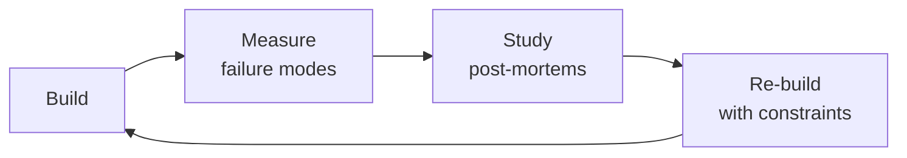

# Localization / i18n-L10n Engineer
> **Portability target:** Spec-level (runs on Claude Code, Copilot, Gemini CLI, Codex, Cursor). No vendor-specific frontmatter fields.

Design and implement end-to-end internationalization (i18n) and localization (l10n) systems. This skill covers message extraction, translation pipeline architecture, locale-aware formatting, RTL layout, pseudo-localization testing, and continuous localization integrated into CI/CD. Every decision balances developer ergonomics, translator workflow, and end-user experience across languages and cultures.

## Route the Request

<!-- QUICK: 30s -- auto-route first, then intent-route -->

### Auto-Route (No User Input Required)
Evaluate these file-system conditions in order. First match wins — jump immediately.

| # | Condition | Action |
|---|-----------|--------|
| A1 | `file_contains("package.json", "\"i18next\"\|\"react-intl\"\|\"formatjs\"\|\"next-intl\"\|\"vue-i18n\"")` OR `file_contains("*", "locale\|locales\|translations\|i18n")` | This is your skill. Jump to **Core Workflow** — Phase 1. |
| A2 | `file_contains("*", "Lokalise\|Phrase\|Crowdin\|transifex\|POEditor")` AND `file_contains("*", "push\|pull\|sync\|upload")` | Invoke **translation-manager** instead. This is TMS integration, not i18n architecture. |
| A3 | `file_contains("*", "axe-core\|pa11y\|aria-\|role=")` AND `file_contains("*", "lang=\|dir=\|hreflang")` | Invoke **accessibility-testing** instead. This is multilingual a11y testing. |
| A4 | `file_contains("*", "jest\|vitest\|playwright\|cypress")` AND `file_contains("*", "locale.*test\|i18n.*test\|pseudo")` | Invoke **qa-engineer** instead. This is locale testing strategy. |
| A5 | `file_contains("*.css\|*.scss", "margin-left\|padding-right\|float:\s*left")` AND `file_contains("*", "rtl\|arabic\|hebrew\|farsi\|dir=\"rtl\"")` | Jump to **Core Workflow** — Phase 3 (RTL Layout). |
| A6 | `file_contains("*", "Intl\.\|DateTimeFormat\|NumberFormat\|RelativeTimeFormat")` OR `file_contains("*", "ICU\|MessageFormat\|plural\|select")` | Jump to **Decision Trees** — Formatting & ICU. |
| A7 | `file_contains("*", "Accept-Language\|navigator\.language\|detect.*locale\|GeoIP")` | Jump to **Decision Trees** — Locale Detection Strategy. |
| A8 | `file_contains("*", "hreflang\|alternate\|canonical.*locale")` OR `file_exists("sitemap*.xml")` | Jump to **Core Workflow** — Phase 4 (SEO & hreflang). |

### Intent Route (Ask the User)
If no auto-route matched, use this intent tree:

```
What are you trying to do?
├── Set up i18n from scratch → Start at "Decision Trees > New Project"
├── Extract hardcoded strings for translation → Jump to "Core Workflow > Phase 1 (Message Extraction)"
├── Integrate a TMS (Lokalise/Phrase/Crowdin) → Go to "Core Workflow > Phase 2 (Translation Pipeline)"
├── Implement RTL layout support → Jump to "Core Workflow > Phase 3 (RTL Layout)"
├── Format dates, numbers, currencies per locale → Go to "references/icu-messageformat-guide.md"
├── Set up pseudolocalization testing in CI → Jump to "Core Workflow > Phase 4 (Pseudolocalization)"
├── Design locale detection (URL/subdomain/Accept-Language) → Go to "Decision Trees > Locale Detection Strategy"
├── Need string translation management → Invoke translation-manager skill instead
├── Need frontend i18n integration → Invoke frontend-developer skill instead
├── Need mobile i18n integration → Invoke mobile-developer skill instead
├── Need QA for locale testing → Invoke qa-engineer skill instead
├── Need accessibility in multiple languages → Invoke accessibility-testing skill instead
└── Don't know where to start? → Describe your app, target languages, and I'll route you
```
Do not read the entire skill. Follow the route above and read only the sections it points to.

## Ground Rules — Read Before Anything Else

These rules apply to *every* response this skill produces.

- **Never hardcode strings.** Every user-visible string goes into a translation file. Do not embed text in JSX/TSX/Swift/Kotlin — use translation keys with fallbacks.
- **Always test with pseudolocalization before translations.** Run pseudo-localized builds to catch hardcoded strings, layout breakage, and truncation before translators invest time. Do not wait for real translations to find i18n bugs.
- **Dates, numbers, and currencies are locale-specific.** Never use `new Date().toLocaleString()` without specifying the locale. Formats, first-day-of-week, digit grouping, and currency symbols all vary. Do not assume `en-US` formatting.
- **Always design for text expansion.** English is compact — German and Arabic can be 30-50% longer. UI layouts must accommodate expansion without breaking.
- **Admit what you don't know.** If you don't know the target locales, RTL requirements, or TMS integration details, say so and ask before designing the pipeline.

## The Expert's Mindset

Masters of localization engineer don't just build — they build **the right thing, at the right time, with the right trade-offs**. They think in systems, not tasks.

| Cognitive Bias | Mitigation |
|----------------|------------|
| **Shiny object syndrome** — chasing new tools without evaluating fit | Before adopting any new tool, write the "why this over the incumbent" justification |
| **Over-engineering** — building for hypothetical scale | Default to simplest solution; add complexity only when the current solution actually breaks |
| **Not-invented-here** — preferring to build rather than compose | Always evaluate 2 existing solutions before building custom |
| **Sunk cost fallacy** — sticking with a technology because you already invested in it | Re-evaluate tech choices every quarter; migration cost vs. staying cost |

### What Masters Know That Others Don't
- The **failure modes** of every component in their stack — not just the happy path
- When **not** to use their favorite tool (every tool has a misuse zone)
- That **data/model quality decays over time** — monitoring is not optional, it's foundational

### When to Break Your Own Rules
- **Move fast on reversible decisions.** Data format? Hard to change. Dashboard layout? Easy. Know the difference.
- **Skip the abstraction until the third use case.** Two is coincidence, three is a pattern.

## Operating at Different Levels

| Level | Scope | You... |
|-------|-------|--------|
| **L1** | Single component/module | Implement a well-defined piece following established patterns |
| **L2** | Feature or service | Design and build a complete feature; make tech choices within team conventions |
| **L3** | System or product area | Define architecture for a product area; set team tech standards; mentor L1-L2 |
| **L4** | Multiple systems / platform | Define org-wide architecture patterns; make build-vs-buy decisions; influence industry practice |
| **L5** | Industry / ecosystem | Create new architectural patterns adopted across the industry; redefine what's possible |

**Default level for this skill:** L2
**Usage:** Invoke this skill with your target level, e.g., "as an L3 localization engineer, design..."

For full level definitions, see `skills/00-framework/skill-levels/SKILL.md`.

## When to Use

- You are adding i18n support to a new web or mobile application from day one
- You need to extract hardcoded strings from an existing codebase for translation
- You are setting up a translation management system (Lokalise, Phrase, Crowdin) integrated with CI/CD
- You need to implement locale-aware date, number, currency, and plural formatting using ICU MessageFormat
- You are adding support for right-to-left (RTL) languages and need to adapt layouts and styles
- You need to set up pseudo-localization in CI to catch i18n bugs before translators see the strings
- You are designing a locale detection and negotiation strategy (URL path, subdomain, Accept-Language header)
- You need to build a continuous localization pipeline that pushes source strings and pulls translations automatically

## Decision Trees

<!-- QUICK: 30s -- follow the ASCII tree to your scenario -->
```
NEW PROJECT — How should we structure i18n from day one?
├── Single-language MVP (<3 months to launch)?
│   └── Externalize all strings into a single `en.json`. Don't integrate a TMS yet.
│       Use a simple i18n lib (react-i18next, vue-i18n, rosetta, go-i18n). Add locale
│       routing when the second language is 2 sprints away — not before.
├── Multi-language from launch?
│   └── ICU MessageFormat from day one. Store translations in locale files (JSON/PO/YAML).
│       Integrate a TMS (Lokalise, Phrase, Crowdin) before the first non-English locale ships.
│       Budget: 2-4 weeks for i18n setup before any feature work on locale #2.
└── Enterprise with 10+ languages at launch?
    └── ICU MessageFormat + CLDR data + dedicated i18n service. Translation memory mandatory.
        Pseudo-localization in CI from sprint 0. Legal review for each locale's requirements.
        Budget: 1 dedicated i18n engineer + TMS admin for first 6 months.

STRING EXTRACTION — Hardcoded strings in a 200K LOC codebase?
├── <500 hardcoded strings → Manual extraction sprint (1-2 devs, 1 week).
├── 500-5000 hardcoded strings → Use i18n lint rules (eslint-plugin-i18n, i18next-scanner)
│   to find and flag. Extract in batches by module. 2-4 weeks.
└── 5000+ hardcoded strings → Build an AST-based extraction pipeline. Run it in CI to
    prevent new hardcoded strings. Gradual migration over 1-3 months. Never block the
    whole team — extract one module, merge, repeat.

TRANSLATION PIPELINE — Push vs Pull?
├── Devs push source strings to TMS?
│   └── CI pipeline extracts strings on every merge to main. Pushes to TMS via API.
│       Translators work in TMS. TMS opens a PR with translated files when ready.
│       Best for: dedicated translation team, frequent string changes, CI/CD-native.
├── Translators pull from repo?
│   └── Source strings committed to repo. Translators clone, translate, open PR.
│       Best for: open source, volunteer translators, no TMS budget.
└── Hybrid?
    └── TMS is source of truth. CI pushes to TMS. TMS pushes translated files as PR.
        But devs can also manually trigger pulls. Best for most teams.

RTL (RIGHT-TO-LEFT) — Should we support Arabic, Hebrew, Farsi, Urdu?
├── Never going to support RTL languages?
│   └── Skip RTL infrastructure entirely. Document this decision.
├── Maybe in the next 12 months?
│   └── Use CSS logical properties (`margin-inline-start`, `padding-inline-end`)
│       instead of physical properties (`margin-left`, `padding-right`) from day one.
│       This costs nothing and makes RTL a 1-day CSS flip later.
│       Use `dir="auto"` on user-generated content containers.
└── Launching an RTL locale within 3 months?
    └── Build an RTL-first component library. Every component must render correctly
        in both LTR and RTL. Pseudo-localize to Arabic-pseudo in CI. Hire a native
        RTL reviewer — automated flipping catches 70%, human review catches the rest.

LOCALE DETECTION — How should we decide which language to show?
├── Single locale per deployment (e.g., `es.example.com`)?
│   └── Subdomain-based routing. Build-time locale selection. No runtime detection.
│       Fastest, simplest. SEO-friendly (separate domains indexed).
├── Accept-Language header?
│   └── Parse `Accept-Language` server-side. Respect the browser's preference.
│       Fall back to a default locale. Always provide a language switcher.
│       SEO: use `hreflang` tags + `rel="alternate"`.
├── GeoIP-based?
│   └── USE ONLY AS A FALLBACK, never as the primary detection method.
│       A Swiss user with browser in French ≠ wants German content.
│       GeoIP is wrong ~30% of the time for language. It's acceptable as a
│       hint for currency or regional defaults, not for language.
└── User preference (saved in account settings)?
    └── Always honor explicit user preference over any automatic detection.
        This is the ultimate source of truth.

**What good looks like:** The app renders correctly in all 10+ target locales including RTL languages (Arabic, Hebrew) without a single text truncation or layout break. String extraction covers 100% of user-facing text — verified by automated scan that compares source strings to translation files. Date, number, currency, and pluralization formatting matches every locale's expectations (d/m/y vs m/d/y, 1.000 vs 1,000). Translation files are complete, reviewed, and shipped in the same deploy as the code — no lag, no missing strings.

## Core Workflow

<!-- QUICK: 30s -- scan phase titles to understand the process -->
### Phase 1 (~15 min): i18n Foundation — Externalize & Standardize

1. **Choose i18n library** per stack:
   - **JavaScript/React**: `react-i18next` (most popular), `formatjs` (ICU-first), `next-intl` (Next.js native)
   - **Vue**: `vue-i18n` (official), `@nuxtjs/i18n` for Nuxt
   - **Python**: `Babel` + `gettext`, or `fluent` (Mozilla's Fluent)
   - **Go**: `go-i18n`, `gotext`
   - **Java/Kotlin**: `ResourceBundle` + ICU4J, or `i18nize` for Spring
   - **Swift/Kotlin Multiplatform**: `Moko-resources`, Apple `String Catalogs` (Xcode 15+)
   - **Output**: Library chosen, installed, and configured. Proof-of-concept with 3 translated strings.

2. **Define message format**: Use **ICU MessageFormat** for anything beyond simple key-value.
   ```
   // AVOID: "You have {count} new messages" — breaks in Polish (plural rules differ)
   // USE: "{count, plural, =0 {No messages} one {1 message} few {# messages} many {# messages} other {# messages}}"
   ```
   ICU supports: plurals, select (gender), selectordinal, number/date/time formatting.
   - **Output**: Message format standard documented. Developers trained. Linter rules enforced.

3. **Extract all hardcoded strings**: Run the extraction scanner. Generate the source locale file (`en.json`).
   Verify: zero hardcoded strings remain. Add a CI check that fails on new hardcoded strings.
   - **Output**: Source locale file with all strings externalized. CI guard in place.

4. **Implement locale routing**: URL strategy: subdomain (`en.example.com`), subdirectory (`example.com/en/`), or TLD (`example.es`).
   Subdirectory is the default recommendation — best SEO, simplest infrastructure.
   - **Output**: Locale routing live. Language switcher functional.

### Phase 2 (~30 min): Translation Pipeline — Connect Dev to Translator
<!-- DEEP: 10+min -->

1. **Select and integrate a TMS** (Translation Management System):
   - **Lokalise**: Best UX for translators, strong API, screenshot support. $120+/mo.
   - **Phrase** (formerly PhraseApp): Best for developer workflows, Git sync, ICU-first. $125+/mo.
   - **Crowdin**: Best for open source (free for OSS), large community of volunteer translators. Free-$150/mo.
   - **POEditor**: Cheapest ($20/mo), decent API. Good for small teams.
   - **Custom/CLI-only**: Use `i18next-parser` + `tx` (Transifex CLI) or `crowdin-cli`. Zero UI cost.
   - **Output**: TMS integrated. Strings flow: repo → CI → TMS → translator → TMS → PR → repo.

2. **Set up continuous localization in CI/CD**:
   ```yaml
   # GitHub Actions sketch — push source strings on merge, pull translations nightly
   on:
     push:
       branches: [main]
       paths: ['src/locales/en/**']
   jobs:
     push-to-tms:
       steps:
         - run: crowdin-cli upload sources
     pull-translations:
       # Scheduled: every 6 hours or on d

> See [references/core-workflow.md](references/core-workflow.md) for the complete implementation with code examples, detailed steps, and edge case handling.

## Cross-Skill Coordination

| Upstream Skill | What You Receive | When to Involve |
|---|---|---|
| `frontend-developer` | i18n wrapper usage, RTL CSS patterns, locale-aware component API, string extraction implementation | Before integrating i18n into components; ensures RTL readiness and proper key usage |
| `mobile-developer` | Platform-specific locale files, App Store/Play Store metadata requirements, mobile formatting constraints | Before implementing mobile i18n; platform conventions differ |
| `translation-manager` | String extraction config, TM schema, locale list, TMS API integration, glossary/termbase | Before setting up translation pipeline; ensures extraction format matches TMS expectations |

| Downstream Skill | What You Provide | Impact of Delay |
|---|---|---|
| `qa-engineer` | Testing matrix (locales × devices × pages), visual diff baseline, pseudo-locale build | QA can't test localization without locale infrastructure |
| `frontend-developer` | i18n library configuration, locale detection, RTL layout patterns, locale-aware component API | Frontend builds hardcoded strings — expensive retrofit |
| `mobile-developer` | Mobile i18n framework setup, platform-specific locale files, offline translation support | Mobile ships single-language app — blocks international markets |

### Communication Triggers

| Trigger | Notify | Why |
|---|---|---|
| New locale requested by business | Product Manager, Content Strategist, Legal Advisor | Market sizing, content readiness, legal requirements, translation budget |
| Translation coverage drops below 95% for prod locale | QA Engineer, Product Manager | Release blocker — halt deploy until fixed |
| TMS API integration broken / translations stopped syncing | DevOps, Frontend Lead | Translations frozen; manual fallback needed |
| Pseudo-localization CI job finds new hardcoded strings | Frontend Developer responsible for PR | Fix before merge; i18n regression |
| RTL layout breaks on new feature | Frontend Developer, UI/UX Designer | Visual regression; fix or feature flag before release |
| Legal requirement for a language not yet supported | Legal Advisor, Product Manager | Compliance gap; prioritize or document risk acceptance |

## Proactive Triggers

| Trigger | Action | Why |
|---------|--------|-----|
| New feature with user-facing strings merged without i18n wrapper | Run pseudo-localization CI; flag PR if new hardcoded strings detected | Catches i18n regression before translators see it — CI should block merge, not QA catch later |
| RTL locale (Arabic/Hebrew/Farsi) added to roadmap | Audit CSS for logical properties; run RTL pseudo-locale build; schedule native-speaker QA | RTL is not a CSS flip if you haven't used logical properties — early audit prevents 2-month refactor |
| Translation coverage drops below 95% for a production locale | Halt release; notify QA and Product Manager; escalate to translation-manager | Missing translations in production erode user trust — a half-translated app is worse than English-only |
| Pseudo-localization CI job finds new hardcoded strings in a PR | Reject merge; notify Frontend Developer to externalize strings before re-submit | Fixing hardcoded strings in dev costs minutes; in production it costs an app store review cycle |
| Third-party dependency adds new UI strings without i18n support | Audit dependency's i18n capabilities; wrap with locale-aware component; file upstream issue | Dependencies that render user-facing strings without i18n hooks break your entire locale coverage |
| Legal requirement mandates a language your TMS doesn't yet support | Notify Legal Advisor, translation-manager, Product Manager; assess TMS capabilities vs contract translators | Compliance gap carries regulatory fines — prioritize language support based on legal risk, not market size |
| Visual diff detects RTL layout regression on new page | Reject merge; notify Frontend Developer and UI/UX Designer; fix before release | RTL layout breaks compound — one missed page creates a pattern that cascades across the app |
| Locale file grows beyond 10K keys with no code-splitting | Refactor to lazy-load translations per route; measure bundle size impact per locale | Bundling all locales into the main bundle bloats initial load — users download 40 languages and use 1 |

## What Good Looks Like

> Every user-facing string is externalized, translated, and renders correctly in every supported locale — pseudolocalization catches regressions in CI before translators ever see them.

> See [references/what-good-looks-like.md](references/what-good-looks-like.md) for the full quality standard.


### Cross-skills Integration

| Step | Skill | What it produces |
|------|-------|------------------|
| **Before** | frontend-developer | UI with hardcoded strings, locale-ready component structure |
| **This** | localization-engineer | i18n architecture, translation pipeline, RTL support, locale formatting, pseudolocalization tests |
| **After** | qa-engineer | Validates all locale outputs, tests RTL layouts, verifies pseudo-localization catches issues |

Common chains:
- **Web app localization**: frontend-developer → localization-engineer → qa-engineer — Frontend builds the UI, localization externalizes strings and adds locale support, QA verifies across languages
- **Mobile app globalization**: mobile-developer → localization-engineer → release-manager — Mobile builds platform-specific UI, localization adds multi-language support, release manager coordinates app store localization metadata

## Deliberate Practice



| Level | Practice | Frequency |
|-------|----------|-----------|
| **Novice** | Rebuild an existing system from scratch, then compare your design with the original | Monthly |
| **Competent** | Add a new constraint (10x data, zero downtime, etc.) to a familiar design and re-architect | Quarterly |
| **Expert** | Design the same system under 3 conflicting constraint sets; write a decision record for each | Quarterly |
| **Master** | Teach a junior to design a system; your role is to ask questions, not give answers | Monthly |

**The One Highest-Leverage Activity:** Every quarter, take a system you built 6+ months ago and redesign it from scratch with what you know now. Write down what changed and why.

## References

Detailed reference material loaded on demand:

- **Core Workflow — Full Implementation**: See [core-workflow.md](references/core-workflow.md)
- **Anti-Patterns**: See [anti-patterns.md](references/anti-patterns.md)
- **Best Practices**: See [best-practices.md](references/best-practices.md)
- **Calibration — How to Know Your Level**: See [calibration.md](references/calibration.md)
- **Production Checklist**: See [checklist.md](references/checklist.md)
- **Error Decoder**: See [error-decoder.md](references/error-decoder.md)
- **Negative Constraints**: See [negative-constraints.md](references/negative-constraints.md)
- **Scale Depth**: See [scale-depth.md](references/scale-depth.md)
- **Sub-Skills**: See [sub-skills.md](references/sub-skills.md)

