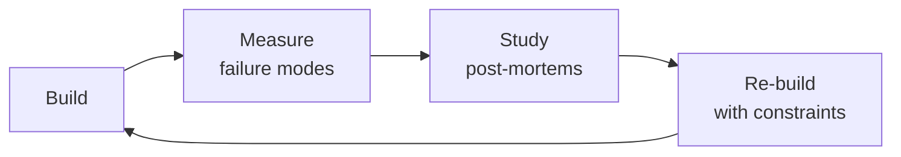

# Localization / i18n-L10n Engineer

> **Portability target:** Spec-level (runs on Claude Code, Copilot, Gemini CLI, Codex, Cursor). No vendor-specific frontmatter fields.

Design and implement end-to-end internationalization (i18n) and localization (l10n) systems. This skill covers message extraction, translation pipeline architecture, locale-aware formatting, RTL layout, pseudo-localization testing, and continuous localization integrated into CI/CD. Every decision balances developer ergonomics, translator workflow, and end-user experience across languages and cultures.

## Route the Request
<!-- QUICK: 30s -- auto-route first, then intent-route -->

### Auto-Route (No User Input Required)
Evaluate these file-system conditions in order. First match wins — jump immediately.

| # | Condition | Action |
|---|-----------|--------|
| A1 | `file_contains("package.json", "\"i18next\"\|\"react-intl\"\|\"formatjs\"\|\"next-intl\"\|\"vue-i18n\"")` OR `file_contains("*", "locale\|locales\|translations\|i18n")` | This is your skill. Jump to **Core Workflow** — Phase 1. |
| A2 | `file_contains("*", "Lokalise\|Phrase\|Crowdin\|transifex\|POEditor")` AND `file_contains("*", "push\|pull\|sync\|upload")` | Invoke **translation-manager** instead. This is TMS integration, not i18n architecture. |
| A3 | `file_contains("*", "axe-core\|pa11y\|aria-\|role=")` AND `file_contains("*", "lang=\|dir=\|hreflang")` | Invoke **accessibility-testing** instead. This is multilingual a11y testing. |
| A4 | `file_contains("*", "jest\|vitest\|playwright\|cypress")` AND `file_contains("*", "locale.*test\|i18n.*test\|pseudo")` | Invoke **qa-engineer** instead. This is locale testing strategy. |
| A5 | `file_contains("*.css\|*.scss", "margin-left\|padding-right\|float:\s*left")` AND `file_contains("*", "rtl\|arabic\|hebrew\|farsi\|dir=\"rtl\"")` | Jump to **Core Workflow** — Phase 3 (RTL Layout). |
| A6 | `file_contains("*", "Intl\.\|DateTimeFormat\|NumberFormat\|RelativeTimeFormat")` OR `file_contains("*", "ICU\|MessageFormat\|plural\|select")` | Jump to **Decision Trees** — Formatting & ICU. |
| A7 | `file_contains("*", "Accept-Language\|navigator\.language\|detect.*locale\|GeoIP")` | Jump to **Decision Trees** — Locale Detection Strategy. |
| A8 | `file_contains("*", "hreflang\|alternate\|canonical.*locale")` OR `file_exists("sitemap*.xml")` | Jump to **Core Workflow** — Phase 4 (SEO & hreflang). |

### Intent Route (Ask the User)
If no auto-route matched, use this intent tree:

```
What are you trying to do?
├── Set up i18n from scratch → Start at "Decision Trees > New Project"
├── Extract hardcoded strings for translation → Jump to "Core Workflow > Phase 1 (Message Extraction)"
├── Integrate a TMS (Lokalise/Phrase/Crowdin) → Go to "Core Workflow > Phase 2 (Translation Pipeline)"
├── Implement RTL layout support → Jump to "Core Workflow > Phase 3 (RTL Layout)"
├── Format dates, numbers, currencies per locale → Go to "references/icu-messageformat-guide.md"
├── Set up pseudolocalization testing in CI → Jump to "Core Workflow > Phase 4 (Pseudolocalization)"
├── Design locale detection (URL/subdomain/Accept-Language) → Go to "Decision Trees > Locale Detection Strategy"
├── Need string translation management → Invoke translation-manager skill instead
├── Need frontend i18n integration → Invoke frontend-developer skill instead
├── Need mobile i18n integration → Invoke mobile-developer skill instead
├── Need QA for locale testing → Invoke qa-engineer skill instead
├── Need accessibility in multiple languages → Invoke accessibility-testing skill instead
└── Don't know where to start? → Describe your app, target languages, and I'll route you
```
Do not read the entire skill. Follow the route above and read only the sections it points to.

## Ground Rules — Read Before Anything Else

These rules apply to *every* response this skill produces.

- **Never hardcode strings.** Every user-visible string goes into a translation file. Do not embed text in JSX/TSX/Swift/Kotlin — use translation keys with fallbacks.
- **Always test with pseudolocalization before translations.** Run pseudo-localized builds to catch hardcoded strings, layout breakage, and truncation before translators invest time. Do not wait for real translations to find i18n bugs.
- **Dates, numbers, and currencies are locale-specific.** Never use `new Date().toLocaleString()` without specifying the locale. Formats, first-day-of-week, digit grouping, and currency symbols all vary. Do not assume `en-US` formatting.
- **Always design for text expansion.** English is compact — German and Arabic can be 30-50% longer. UI layouts must accommodate expansion without breaking.
- **Admit what you don't know.** If you don't know the target locales, RTL requirements, or TMS integration details, say so and ask before designing the pipeline.


## The Expert's Mindset

Masters of localization engineer don't just build — they build **the right thing, at the right time, with the right trade-offs**. They think in systems, not tasks.

| Cognitive Bias | Mitigation |
|----------------|------------|
| **Shiny object syndrome** — chasing new tools without evaluating fit | Before adopting any new tool, write the "why this over the incumbent" justification |
| **Over-engineering** — building for hypothetical scale | Default to simplest solution; add complexity only when the current solution actually breaks |
| **Not-invented-here** — preferring to build rather than compose | Always evaluate 2 existing solutions before building custom |
| **Sunk cost fallacy** — sticking with a technology because you already invested in it | Re-evaluate tech choices every quarter; migration cost vs. staying cost |

### What Masters Know That Others Don't
- The **failure modes** of every component in their stack — not just the happy path
- When **not** to use their favorite tool (every tool has a misuse zone)
- That **data/model quality decays over time** — monitoring is not optional, it's foundational

### When to Break Your Own Rules
- **Move fast on reversible decisions.** Data format? Hard to change. Dashboard layout? Easy. Know the difference.
- **Skip the abstraction until the third use case.** Two is coincidence, three is a pattern.
## Operating at Different Levels

| Level | Scope | You... |
|-------|-------|--------|
| **L1** | Single component/module | Implement a well-defined piece following established patterns |
| **L2** | Feature or service | Design and build a complete feature; make tech choices within team conventions |
| **L3** | System or product area | Define architecture for a product area; set team tech standards; mentor L1-L2 |
| **L4** | Multiple systems / platform | Define org-wide architecture patterns; make build-vs-buy decisions; influence industry practice |
| **L5** | Industry / ecosystem | Create new architectural patterns adopted across the industry; redefine what's possible |

**Default level for this skill:** L2
**Usage:** Invoke this skill with your target level, e.g., "as an L3 localization engineer, design..."

For full level definitions, see `skills/00-framework/skill-levels/SKILL.md`.

## When to Use

- You are adding i18n support to a new web or mobile application from day one
- You need to extract hardcoded strings from an existing codebase for translation
- You are setting up a translation management system (Lokalise, Phrase, Crowdin) integrated with CI/CD
- You need to implement locale-aware date, number, currency, and plural formatting using ICU MessageFormat
- You are adding support for right-to-left (RTL) languages and need to adapt layouts and styles
- You need to set up pseudo-localization in CI to catch i18n bugs before translators see the strings
- You are designing a locale detection and negotiation strategy (URL path, subdomain, Accept-Language header)
- You need to build a continuous localization pipeline that pushes source strings and pulls translations automatically

## Decision Trees
<!-- QUICK: 30s -- follow the ASCII tree to your scenario -->
```
NEW PROJECT — How should we structure i18n from day one?
├── Single-language MVP (<3 months to launch)?
│   └── Externalize all strings into a single `en.json`. Don't integrate a TMS yet.
│       Use a simple i18n lib (react-i18next, vue-i18n, rosetta, go-i18n). Add locale
│       routing when the second language is 2 sprints away — not before.
├── Multi-language from launch?
│   └── ICU MessageFormat from day one. Store translations in locale files (JSON/PO/YAML).
│       Integrate a TMS (Lokalise, Phrase, Crowdin) before the first non-English locale ships.
│       Budget: 2-4 weeks for i18n setup before any feature work on locale #2.
└── Enterprise with 10+ languages at launch?
    └── ICU MessageFormat + CLDR data + dedicated i18n service. Translation memory mandatory.
        Pseudo-localization in CI from sprint 0. Legal review for each locale's requirements.
        Budget: 1 dedicated i18n engineer + TMS admin for first 6 months.

STRING EXTRACTION — Hardcoded strings in a 200K LOC codebase?
├── <500 hardcoded strings → Manual extraction sprint (1-2 devs, 1 week).
├── 500-5000 hardcoded strings → Use i18n lint rules (eslint-plugin-i18n, i18next-scanner)
│   to find and flag. Extract in batches by module. 2-4 weeks.
└── 5000+ hardcoded strings → Build an AST-based extraction pipeline. Run it in CI to
    prevent new hardcoded strings. Gradual migration over 1-3 months. Never block the
    whole team — extract one module, merge, repeat.

TRANSLATION PIPELINE — Push vs Pull?
├── Devs push source strings to TMS?
│   └── CI pipeline extracts strings on every merge to main. Pushes to TMS via API.
│       Translators work in TMS. TMS opens a PR with translated files when ready.
│       Best for: dedicated translation team, frequent string changes, CI/CD-native.
├── Translators pull from repo?
│   └── Source strings committed to repo. Translators clone, translate, open PR.
│       Best for: open source, volunteer translators, no TMS budget.
└── Hybrid?
    └── TMS is source of truth. CI pushes to TMS. TMS pushes translated files as PR.
        But devs can also manually trigger pulls. Best for most teams.

RTL (RIGHT-TO-LEFT) — Should we support Arabic, Hebrew, Farsi, Urdu?
├── Never going to support RTL languages?
│   └── Skip RTL infrastructure entirely. Document this decision.
├── Maybe in the next 12 months?
│   └── Use CSS logical properties (`margin-inline-start`, `padding-inline-end`)
│       instead of physical properties (`margin-left`, `padding-right`) from day one.
│       This costs nothing and makes RTL a 1-day CSS flip later.
│       Use `dir="auto"` on user-generated content containers.
└── Launching an RTL locale within 3 months?
    └── Build an RTL-first component library. Every component must render correctly
        in both LTR and RTL. Pseudo-localize to Arabic-pseudo in CI. Hire a native
        RTL reviewer — automated flipping catches 70%, human review catches the rest.

LOCALE DETECTION — How should we decide which language to show?
├── Single locale per deployment (e.g., `es.example.com`)?
│   └── Subdomain-based routing. Build-time locale selection. No runtime detection.
│       Fastest, simplest. SEO-friendly (separate domains indexed).
├── Accept-Language header?
│   └── Parse `Accept-Language` server-side. Respect the browser's preference.
│       Fall back to a default locale. Always provide a language switcher.
│       SEO: use `hreflang` tags + `rel="alternate"`.
├── GeoIP-based?
│   └── USE ONLY AS A FALLBACK, never as the primary detection method.
│       A Swiss user with browser in French ≠ wants German content.
│       GeoIP is wrong ~30% of the time for language. It's acceptable as a
│       hint for currency or regional defaults, not for language.
└── User preference (saved in account settings)?
    └── Always honor explicit user preference over any automatic detection.
        This is the ultimate source of truth.

**What good looks like:** The app renders correctly in all 10+ target locales including RTL languages (Arabic, Hebrew) without a single text truncation or layout break. String extraction covers 100% of user-facing text — verified by automated scan that compares source strings to translation files. Date, number, currency, and pluralization formatting matches every locale's expectations (d/m/y vs m/d/y, 1.000 vs 1,000). Translation files are complete, reviewed, and shipped in the same deploy as the code — no lag, no missing strings.
## Core Workflow
<!-- QUICK: 30s -- scan phase titles to understand the process -->
### Phase 1 (~15 min): i18n Foundation — Externalize & Standardize

1. **Choose i18n library** per stack:
   - **JavaScript/React**: `react-i18next` (most popular), `formatjs` (ICU-first), `next-intl` (Next.js native)
   - **Vue**: `vue-i18n` (official), `@nuxtjs/i18n` for Nuxt
   - **Python**: `Babel` + `gettext`, or `fluent` (Mozilla's Fluent)
   - **Go**: `go-i18n`, `gotext`
   - **Java/Kotlin**: `ResourceBundle` + ICU4J, or `i18nize` for Spring
   - **Swift/Kotlin Multiplatform**: `Moko-resources`, Apple `String Catalogs` (Xcode 15+)
   - **Output**: Library chosen, installed, and configured. Proof-of-concept with 3 translated strings.

2. **Define message format**: Use **ICU MessageFormat** for anything beyond simple key-value.
   ```
   // AVOID: "You have {count} new messages" — breaks in Polish (plural rules differ)
   // USE: "{count, plural, =0 {No messages} one {1 message} few {# messages} many {# messages} other {# messages}}"
   ```
   ICU supports: plurals, select (gender), selectordinal, number/date/time formatting.
   - **Output**: Message format standard documented. Developers trained. Linter rules enforced.

3. **Extract all hardcoded strings**: Run the extraction scanner. Generate the source locale file (`en.json`).
   Verify: zero hardcoded strings remain. Add a CI check that fails on new hardcoded strings.
   - **Output**: Source locale file with all strings externalized. CI guard in place.

4. **Implement locale routing**: URL strategy: subdomain (`en.example.com`), subdirectory (`example.com/en/`), or TLD (`example.es`).
   Subdirectory is the default recommendation — best SEO, simplest infrastructure.
   - **Output**: Locale routing live. Language switcher functional.

### Phase 2 (~30 min): Translation Pipeline — Connect Dev to Translator
<!-- DEEP: 10+min -->

1. **Select and integrate a TMS** (Translation Management System):
   - **Lokalise**: Best UX for translators, strong API, screenshot support. $120+/mo.
   - **Phrase** (formerly PhraseApp): Best for developer workflows, Git sync, ICU-first. $125+/mo.
   - **Crowdin**: Best for open source (free for OSS), large community of volunteer translators. Free-$150/mo.
   - **POEditor**: Cheapest ($20/mo), decent API. Good for small teams.
   - **Custom/CLI-only**: Use `i18next-parser` + `tx` (Transifex CLI) or `crowdin-cli`. Zero UI cost.
   - **Output**: TMS integrated. Strings flow: repo → CI → TMS → translator → TMS → PR → repo.

2. **Set up continuous localization in CI/CD**:
   ```yaml
   # GitHub Actions sketch — push source strings on merge, pull translations nightly
   on:
     push:
       branches: [main]
       paths: ['src/locales/en/**']
   jobs:
     push-to-tms:
       steps:
         - run: crowdin-cli upload sources
     pull-translations:
       # Scheduled: every 6 hours or on demand
       steps:
         - run: crowdin-cli download
         - run: |
             if git diff --quiet; then exit 0; fi
             git checkout -b i18n/translations-$(date +%Y%m%d)
             git commit -am "chore(i18n): pull latest translations"
             gh pr create --title "i18n: translation update" --body "Automated."
   ```
   - **Output**: CI pipeline live. Translations update automatically. Zero manual sync.

3. **Define translation key naming convention**:
   - **Structured by component**: `checkout.payment.ccNumber.label` (recommended — findable, sortable)
   - **Flat with namespace**: `checkout:payment.ccNumber.label`
   - **Avoid**: Generic keys like `label123`, `error_msg_1` (translators can't guess context)
   - **Include context**: Suffix with `_label`, `_placeholder`, `_error`, `_tooltip`, `_aria`
   - **Output**: Naming convention documented. Automated linting for key format.

### Phase 3 (~20 min): Locale-Aware Everything — Format, Sort, Display

1. **Locale-aware formatting**: Never hardcode formats. Always use `Intl` APIs or ICU.
   - **Dates**: `new Intl.DateTimeFormat('de-DE').format(date)` → "21.07.2026" vs US "07/21/2026"
   - **Numbers**: `new Intl.NumberFormat('de-DE').format(1234567.89)` → "1.234.567,89"
   - **Currencies**: `new Intl.NumberFormat('ja-JP', {style: 'currency', currency: 'JPY'}).format(1000)` → "￥1,000"
   - **Units**: `new Intl.NumberFormat('en-US', {style: 'unit', unit: 'celsius'}).format(25)` → "25°C"
   - **Relative time**: `new Intl.RelativeTimeFormat('en', {numeric: 'auto'}).format(-1, 'day')` → "yesterday"
   - **List formatting**: `new Intl.ListFormat('en').format(['Alice', 'Bob', 'Charlie'])` → "Alice, Bob, and Charlie"
   - **Collation (sorting)**: `['ä', 'a', 'z'].sort(new Intl.Collator('de').compare)` → ['a', 'ä', 'z']
   - **Output**: Every displayed value uses locale-aware formatting. Audit passes with zero hardcoded format strings.

2. **Implement pluralization and gender rules**: Use ICU MessageFormat for all dynamic text.
   Polish has 4 plural forms (one, few, many, other). Arabic has 6. English has 2.
   Gender: French, Spanish, Arabic, Hindi require gendered forms. Test every rule.
   - **Output**: Plural and gender rules implemented and tested across all target locales.

3. **Implement RTL layout** (if needed): Use CSS logical properties everywhere.
   ```css
   /* DO: */  margin-inline-start: 1rem;  padding-inline-end: 2rem;
   /* NOT: */ margin-left: 1rem;          padding-right: 2rem;
   /* DO: */  text-align: start;           border-inline-start: 3px solid;
   /* NOT: */ text-align: left;            border-left: 3px solid;
   ```
   Use `dir="auto"` on user-generated content containers. Test with `direction: rtl` override.
   - **Output**: RTL layout verified with pseudo-localization. Visual diff screenshots for Arabic locale.

### Phase 4 (~15 min): Testing & Quality Assurance

1. **Pseudo-localization**: Generate a pseudo-locale that replaces characters with accented/Unicode equivalents
   and lengthens strings by 30-40% (German text averages 30% longer than English). Run in CI on every PR.
   Pseudo-locale catches: hardcoded strings, missing i18n wrappers, layout breaks on long text.
   - **Output**: Pseudo-locale CI job live. Zero i18n regressions merge to main.

2. **Visual diff testing**: Take screenshots of key pages in each locale. Compare pixel-diff with baseline.
   Tools: Percy, Chromatic, Playwright visual comparisons.
   - **Output**: Visual diff CI job for top 5 locales and top 20 pages.

3. **Locale coverage report**: Track % of strings translated per locale. Threshold: 95%+ for production
   locales, 80%+ for beta locales. Block release if primary locale drops below 95%.
   - **Output**: Coverage dashboard. CI gate on coverage threshold.

## Cross-Skill Coordination

| Upstream Skill | What You Receive | When to Involve |
|---|---|---|
| `frontend-developer` | i18n wrapper usage, RTL CSS patterns, locale-aware component API, string extraction implementation | Before integrating i18n into components; ensures RTL readiness and proper key usage |
| `mobile-developer` | Platform-specific locale files, App Store/Play Store metadata requirements, mobile formatting constraints | Before implementing mobile i18n; platform conventions differ |
| `translation-manager` | String extraction config, TM schema, locale list, TMS API integration, glossary/termbase | Before setting up translation pipeline; ensures extraction format matches TMS expectations |

| Downstream Skill | What You Provide | Impact of Delay |
|---|---|---|
| `qa-engineer` | Testing matrix (locales × devices × pages), visual diff baseline, pseudo-locale build | QA can't test localization without locale infrastructure |
| `frontend-developer` | i18n library configuration, locale detection, RTL layout patterns, locale-aware component API | Frontend builds hardcoded strings — expensive retrofit |
| `mobile-developer` | Mobile i18n framework setup, platform-specific locale files, offline translation support | Mobile ships single-language app — blocks international markets |

### Communication Triggers

| Trigger | Notify | Why |
|---|---|---|
| New locale requested by business | Product Manager, Content Strategist, Legal Advisor | Market sizing, content readiness, legal requirements, translation budget |
| Translation coverage drops below 95% for prod locale | QA Engineer, Product Manager | Release blocker — halt deploy until fixed |
| TMS API integration broken / translations stopped syncing | DevOps, Frontend Lead | Translations frozen; manual fallback needed |
| Pseudo-localization CI job finds new hardcoded strings | Frontend Developer responsible for PR | Fix before merge; i18n regression |
| RTL layout breaks on new feature | Frontend Developer, UI/UX Designer | Visual regression; fix or feature flag before release |
| Legal requirement for a language not yet supported | Legal Advisor, Product Manager | Compliance gap; prioritize or document risk acceptance |

## Proactive Triggers

| Trigger | Action | Why |
|---------|--------|-----|
| New feature with user-facing strings merged without i18n wrapper | Run pseudo-localization CI; flag PR if new hardcoded strings detected | Catches i18n regression before translators see it — CI should block merge, not QA catch later |
| RTL locale (Arabic/Hebrew/Farsi) added to roadmap | Audit CSS for logical properties; run RTL pseudo-locale build; schedule native-speaker QA | RTL is not a CSS flip if you haven't used logical properties — early audit prevents 2-month refactor |
| Translation coverage drops below 95% for a production locale | Halt release; notify QA and Product Manager; escalate to translation-manager | Missing translations in production erode user trust — a half-translated app is worse than English-only |
| Pseudo-localization CI job finds new hardcoded strings in a PR | Reject merge; notify Frontend Developer to externalize strings before re-submit | Fixing hardcoded strings in dev costs minutes; in production it costs an app store review cycle |
| Third-party dependency adds new UI strings without i18n support | Audit dependency's i18n capabilities; wrap with locale-aware component; file upstream issue | Dependencies that render user-facing strings without i18n hooks break your entire locale coverage |
| Legal requirement mandates a language your TMS doesn't yet support | Notify Legal Advisor, translation-manager, Product Manager; assess TMS capabilities vs contract translators | Compliance gap carries regulatory fines — prioritize language support based on legal risk, not market size |
| Visual diff detects RTL layout regression on new page | Reject merge; notify Frontend Developer and UI/UX Designer; fix before release | RTL layout breaks compound — one missed page creates a pattern that cascades across the app |
| Locale file grows beyond 10K keys with no code-splitting | Refactor to lazy-load translations per route; measure bundle size impact per locale | Bundling all locales into the main bundle bloats initial load — users download 40 languages and use 1 |

## Scale Depth
<!-- QUICK: 30s -- find your team size column -->
### Solo (1 person, 0-1K users)
- **What changes**: One locale file (`en.json`). No TMS. Translate via JSON diff + Google Translate for initial pass, then hire a freelance translator for polish. Pseudo-locale via a simple Node script. RTL: logical properties only if you plan to add RTL within 6 months; skip otherwise.
- **What's overkill**: TMS integration, continuous localization CI, visual diff testing, translation memory, glossary, dedicated i18n library abstraction layer. ICU MessageFormat (simple key-value is fine for 1-2 languages).
- **Coordination**: You are the i18n engineer. Calendar reminder every sprint to review strings.
- **Cost**: $0-500 (freelance translator for key pages only).
- **Transition trigger**: Second language requested by >5% of users or a paying customer.

### Small Team (2-10 people, 1K-100K users)
- **What changes**: 3-5 locales. TMS integration (Lokalise free tier or Crowdin OSS). ICU MessageFormat for plurals. CI pipeline pushes to TMS on merge. Pseudo-localization as a manual step before release. RTL: CSS logical properties everywhere. Basic locale-aware formatting via `Intl`.
- **What's overkill**: Dedicated i18n service, machine translation API integration, automated visual diff across all locales, translation memory optimization, locale-specific CDN routing.
- **Coordination**: Weekly i18n sync (15 min) with frontend lead. TMS admin = 1 person, 2 hrs/week.
- **Cost**: $0-300/mo (TMS free tier or starter).
- **Transition trigger**: 5+ locales OR translation turnaround time exceeds 1 sprint.

### Medium Team (10-50 people, 100K-1M users)
- **What changes**: 10-20 locales. Full TMS (paid). Continuous localization in CI/CD — strings push on merge, translations PR every 6 hours. Pseudo-localization in CI on every PR. Visual diff for top 5 locales. Translation memory and glossary active. Machine translation for initial pass (DeepL/Google Translate API) with human review. Locale-aware formatting everywhere. RTL: full support with native-speaker QA. Screenshot context in TMS for every string.
- **What's overkill**: Dedicated i18n service/team, on-the-fly machine translation for UGC, locale-specific microservices, programmatic quality scoring for translations.
- **Coordination**: Bi-weekly i18n review (30 min) with frontend, content, and QA. TMS admin = 0.5 FTE. Dedicated i18n champion per team.
- **Cost**: $500-2K/mo (TMS + machine translation API).
- **Transition trigger**: 20+ locales OR translation quality complaints from >2 locales OR legal requirement for a new language family (e.g., CJK, RTL, Cyrillic).

### Enterprise (50+ people, 1M+ users)
- **What changes**: 30-50+ locales. Dedicated i18n engineering team (2-3 engineers). Translation quality scoring with automated checks (spelling, terminology, placeholder integrity, length constraints). In-context editing (translators see strings in the actual UI). Locale-specific CDN routing and edge caching. A/B testing of translations. Machine translation with human post-editing at scale. Custom TMS workflows per locale maturity. Legal compliance automation (automated checks for mandatory language requirements). Locale-specific feature flags. Continuous localization with < 1 hour from string change to translation PR.
- **What's full production**: Dedicated i18n platform team. Translation quality metrics dashboard. Locale-specific performance monitoring. Cultural consulting for imagery and copy. Automated locale coverage gates in CI. Locale-specific A/B testing infrastructure.
- **Coordination**: Weekly i18n ops meeting. Monthly stakeholder review. Quarterly locale strategy review with product, legal, marketing. Dedicated TMS admin (1 FTE).
- **Cost**: $5K-30K+/mo (TMS enterprise + machine translation + team).
- **Transition trigger**: 30+ locales OR regulatory requirement for locale-specific legal content OR revenue from international markets >30% of total.

## What Good Looks Like

> Every user-facing string is externalized, translated, and renders correctly in every supported locale — pseudolocalization catches regressions in CI before translators ever see them. RTL layouts mirror LTR perfectly with CSS logical properties; no layout breaks, no truncated text, no orphaned directional assumptions. Dates, numbers, and currencies format correctly per locale using native `Intl` APIs, and plural and gender rules respect CLDR data. The translation pipeline pushes new strings to translators and pulls reviewed translations back as automated PRs within hours, not weeks. Native speakers review in-context, and quality gates block releases that fall below the translation completeness threshold.

### Cross-skills Integration

| Step | Skill | What it produces |
|------|-------|------------------|
| **Before** | frontend-developer | UI with hardcoded strings, locale-ready component structure |
| **This** | localization-engineer | i18n architecture, translation pipeline, RTL support, locale formatting, pseudolocalization tests |
| **After** | qa-engineer | Validates all locale outputs, tests RTL layouts, verifies pseudo-localization catches issues |

Common chains:
- **Web app localization**: frontend-developer → localization-engineer → qa-engineer — Frontend builds the UI, localization externalizes strings and adds locale support, QA verifies across languages
- **Mobile app globalization**: mobile-developer → localization-engineer → release-manager — Mobile builds platform-specific UI, localization adds multi-language support, release manager coordinates app store localization metadata

## Sub-Skills
<!-- QUICK: 30s -- table of deeper dives by topic -->
| Sub-Skill | When to Use | Context |
|---|---|---|
| `i18n-architecture` | New project setup or i18n overhaul | Choosing i18n library, message format, locale routing strategy, SSR vs CSR i18n |
| `translation-pipeline` | Connecting dev to translators | TMS selection, CI/CD integration, push/pull strategy, translation memory, glossary |
| `rtl-implementation` | Adding Arabic, Hebrew, Farsi, Urdu | CSS logical properties, component mirroring, BIDI text handling, RTL-specific QA |
| `locale-formatting` | Ensuring correct date/number/currency display | `Intl` APIs, ICU MessageFormat, CLDR data, plural/gender rules, collation |
| `pseudo-localization` | Before every release, in CI | Pseudo-locale generation, CI integration, catching hardcoded strings and overflow |
| `locale-detection` | Determining user language | Accept-Language parsing, GeoIP fallback, user preference, cookie vs URL vs subdomain |
| `continuous-localization` | Automating translation sync | CI/CD pipeline design, TMS API integration, automated PR creation, merge strategies |
| `translation-quality` | Ensuring translations are correct and consistent | Quality scoring, automated checks, glossary enforcement, native speaker review workflows |

## Best Practices
<!-- STANDARD: 3min -- rules extracted from production experience -->
- **Externalize on day one**: Adding i18n to a 200K LOC codebase costs 5-10x more than building it in from the start. Even if you only support English at launch, put every user-facing string in a locale file.
- **ICU MessageFormat for anything with variables**: Key-value `"Hello {name}"` breaks in languages with different word order or gender. ICU handles this. Exceptions: truly static strings (labels, headings with no variables).
- **Pseudo-localize in CI, not just before release**: A CI job that builds with pseudo-locale on every PR catches i18n regressions immediately, not 2 days before launch.
- **CSS logical properties everywhere — always**: `margin-inline-start` instead of `margin-left`. Costs nothing. Makes RTL support a CSS variable flip, not a 2-month refactor. This is the highest-ROI i18n decision you can make.
- **Never use GeoIP as the primary language detector**: A Swiss user with browser set to French shouldn't get German content. Accept-Language header first, user preference second, GeoIP as last-resort fallback.
- **Translate context, not words**: Provide translators with screenshots, descriptions of where the string appears, character limits, and whether it's a button/label/error/tooltip. A string without context is a guaranteed mistranslation.
- **Design for 30-50% text expansion**: German, Finnish, and Dutch text averages 30% longer than English. UI that looks perfect in English will overflow in German. Test with pseudo-locale that lengthens strings.
- **Code-split translations by locale**: Don't bundle all locales into the main bundle. Lazy-load only the current locale. Tree-shake ICU data per locale (`Intl` polyfills are large — load only what's needed).
- **Never concatenate translated strings**: `msg = translate("Page") + " " + pageNumber + " " + translate("of") + " " + totalPages` — this breaks in Japanese (word order), Arabic (RTL), Korean (counters). Use ICU: `"Page {current} of {total}"`.
- **Test with native speakers, not just bilingual colleagues**: A bilingual developer can verify correctness. A native speaker verifies naturalness. These are different quality bars. Budget for native-speaker QA per locale.

## Anti-Patterns
<!-- DEEP: 5min -- each anti-pattern includes machine-detectable patterns -->

| ❌ Anti-Pattern | ✅ Do This Instead | 🔍 Detect (grep / lint) | 🛡️ Auto-Prevent |
|-----------------|---------------------|--------------------------|-------------------|
| Using physical CSS properties (`margin-left`, `padding-right`) throughout the codebase | Use CSS logical properties (`margin-inline-start`, `padding-inline-end`) — makes RTL a CSS variable flip | `grep -rn "margin-left\|margin-right\|padding-left\|padding-right\|float:\s*left\|float:\s*right\|text-align:\s*left\|text-align:\s*right" --include="*.css" --include="*.scss"` → finds physical direction properties | stylelint `property-disallowed-list: ["margin-left", "margin-right", "padding-left", "padding-right", "float", "text-align"]` with `ignoreValues: ["start", "end"]` |
| Hardcoding strings in source files — "we only support English right now" becomes 5-10x more expensive to retrofit | Externalize every user-facing string to locale files on day one. A 200K LOC retro-fit costs months of engineering time. | `grep -rn "['\"][A-Z][a-z].*['\"]" --include="*.tsx" --include="*.jsx" \| grep -v "import\|require\|\.tsx\|\.css\|className\|data-testid\|aria-"` → finds probable hardcoded UI strings | eslint `i18next/no-literal-string` with `mode: 'jsx-text-only'` |
| Concatenating translated string fragments: `t("Page") + " " + n + " " + t("of")` | Use ICU MessageFormat: `"Page {current} of {total}"` — concatenation breaks in Japanese (word order), Arabic (RTL), Korean (counters) | `grep -rn "t(['\"]\+.*['\"])\s*\+\|t\(.*\)\s*\+" --include="*.tsx" --include="*.jsx"` → finds string concatenation with t() calls | eslint `i18next/no-literal-string` + custom rule: block `t() +` patterns |
| Using GeoIP as the primary language detector | Use Accept-Language header first, user preference second, GeoIP only as last-resort fallback | `grep -rn "CF-IPCountry\|geoip\|GeoIP\|country.*locale" --include="*.ts" --include="*.js" -A 3 \| grep -v "Accept-Language\|navigator.language"` → finds GeoIP-first detection | eslint custom rule: fail if locale detection references GeoIP before Accept-Language or stored preference |
| Bundling all locale files into the main application bundle | Code-split translations per locale and lazy-load only the current one — avoids shipping 40 languages of polyfills | `grep -rn "import.*locale\|import.*translations\|require.*locale" --include="*.tsx" --include="*.ts" \| grep -v "lazy\|dynamic\|\.then"` → finds eager locale imports | webpack/Next.js: configure `splitChunks` for locale files. CI: `@next/bundle-analyzer` — fail if any locale chunk > 50KB |
| Treating pseudo-localization as a pre-release manual step | Run pseudo-localization CI on every PR — catches hardcoded strings and overflow immediately | `grep -rn "pseudo\|pseudolocalization\|en-XA\|en-XB" .github/workflows/ -l \| wc -l` → 0 = no pseudo-locale in CI | CI: add `i18next-pseudo` build step. `fallbackLng: false` in pseudo-build to expose missing keys |
| Shipping MT-only to Arabic/Hebrew/Farsi without native-speaker review | Budget for native-speaker post-editing — MT doesn't understand honorifics, cultural context, or religious sensitivities | `grep -rn "DeepL\|Google.*Translate\|Azure.*Translator\|ModernMT" --include="*.yml" --include="*.yaml" -l` → check if Arabic/Hebrew/Farsi locales are in MT config without review step | CI: block Arabic/Hebrew/Farsi locale deployment if `post_edit_required: true` and `review_status != 'approved'` |
| Designing UI that fits English text perfectly without expansion buffer | Design for 30-50% text expansion — German, Finnish, Dutch average 30% longer than English | `grep -rn "maxLength\|max-width\|overflow:\s*hidden\|text-overflow:\s*ellipsis" --include="*.css" --include="*.tsx" \| grep -v "responsive\|mobile\|@media"` → finds rigid text containers | Pseudo-locale CI: generate `en-XA` with 50% longer strings, run visual diff — fail if any text is clipped |

## Error Decoder
<!-- QUICK: 15s -- grep the console, match → fix, auto-recover -->

| 🖥️ Console Match | Symptom | Root Cause | Fix | 🔄 Auto-Recovery Loop |
|---|---|---|---|---|
| `grep "key.*returned.*because no value was set"` | `[i18next] key "checkout.submit" returned ""` — translation key missing, English fallback renders | Key exists in source locale but not exported to target locale file. `i18next-parser` missed the key or TMS sync failed. | Add missing key manually. Run `npx i18next-parser extract --locales en,de,ar`. Push to TMS. Set `fallbackLng: 'en'` for dev builds. | 1. `npx i18next-parser extract --locales $(ls locales/)` 2. `git diff locales/` — check for new keys 3. Push missing keys to TMS: `npx lokalise2 file upload` 4. Rebuild. If still missing: temporarily set `saveMissing: true` |
| `grep "Invalid language tag"` | `RangeError: Invalid language tag: "en_US"` — underscore format rejected by Intl.Locale() | BCP 47 requires hyphens (`en-US` not `en_US`). Underscore convention is POSIX, not web-standard. | `grep -rn "_[A-Z]{2}" locales/ --include="*.json"` → replace all with hyphens. Use `npx bcp-47-validate` in lint. | 1. `find locales/ -name "*.json" -exec grep -l "_[A-Z]" {} \;` 2. Replace `_XX` with `-XX` 3. Add pre-commit: `npx bcp-47-validate locales/*/` 4. Block merge if any underscore locale codes exist |
| `grep "Unexpected token.*[{}]"` | `Uncaught SyntaxError: Unexpected token }` — broken ICU MessageFormat in production bundle | ICU syntax error: unbalanced braces, missing comma in `plural`, orphan `selectordinal` or `select` | Validate: `npx formatjs compile src/locales/en.json --ast`. Fix ICU syntax per CLDR plural rules. | 1. `npx formatjs extract src/**/*.tsx` to regenerate message descriptors 2. `npx formatjs compile --ast` — capture stderr 3. Fail build if compile returns non-zero 4. Add `@formatjs/cli lint` to pre-commit |
| `grep "cannot appear as a child"` | `Warning: validateDOMNesting(…): <div> cannot appear as a child of <p>` — HTML in translation breaks DOM | Translator inserted block-level HTML (`<div>`, `<p>`) into an inline container. React auto-closes inline elements around blocks. | Use `<Trans components={{ bold: <strong /> }}>` instead of raw HTML in translations. Split multi-block text into separate keys. | 1. `grep -rn "<div>\|<p>\|<h[1-6]>" locales/ --include="*.json"` 2. Strip block-level tags from translations 3. Add `@formatjs/eslint-plugin-formatjs/no-html-messages` to CI 4. Notify TMS: block-level tags are forbidden |
| `grep "resx_parse_error\|Name cannot begin with"` | `resx_parse_error: Name cannot begin with '<', hexadecimal 0x3C` — XML-unsafe characters in .resx/.xliff | `<`, `>`, `&` not XML-escaped in .resx or .xliff translation files. TMS exported unescaped content. | Escape: `<` → `&lt;`, `>` → `&gt;`, `&` → `&amp;`. Set TMS config: `preserveXmlEntities: true`. | 1. `grep -rn '[<>&]' --include="*.resx" --include="*.xliff" \| grep -v "&lt;\|&gt;\|&amp;\|CDATA\|\!\["` 2. Pipe through `npx xml-escape --fix` 3. Commit fixed files + re-upload to TMS with `preserveXmlEntities: true` |
| `grep "No locale data found for"` | `No locale data found for: zh-Hant` — Intl.NumberFormat throws at runtime | Missing ICU locale data polyfill. `@formatjs/intl-numberformat` only ships with explicitly imported locales. | Lazy-import: `import('@formatjs/intl-numberformat/locale-data/zh-Hant')`. Use `Intl.NumberFormat.supportedLocalesOf()` to feature-detect. | 1. `grep -rn "supportedLocalesOf\|formatjs/intl" src/ --include="*.ts"` — check coverage 2. `npx formatjs compile --ast \| grep "locale-data"` 3. Add missing locale imports 4. Run `node -e "new Intl.NumberFormat('zh-Hant').format(1.5)"` to verify |

If you see an error not listed above, reply with the exact stack trace and locale configuration.


## Production Checklist
<!-- AUDIT: every item has an executable validation command -->

| ID | Checklist Item | Validation Command | Auto-Fix |
|----|----------------|--------------------|----------|
| S1 | All user-facing strings externalized — zero hardcoded strings enforced by CI | `grep -rn "['\"][A-Z][a-z].*['\"]" src/ --include="*.tsx" \| grep -v "import\|\.css\|className\|data-testid\|aria-"` → must be empty | `npx eslint --rule '{"i18next/no-literal-string": ["error", {"mode": "jsx-text-only"}]}' src/ --fix` |
| S2 | ICU MessageFormat used for all strings with variables, plurals, or gender | `grep -rn "t\(['\"].*['\"]\)\s*\+\|translate(.*)\s*\+" src/ --include="*.tsx"` → must be empty | Replace `t('x') + var + t('y')` with `t('x {{v}} y', { v: var })` using ICU syntax |
| S3 | Locale routing functional — URL strategy consistent, language switcher works | `curl -s http://localhost:3000/de \| grep -oP 'lang="[^"]+"'` AND `curl -s http://localhost:3000/en \| grep -oP 'lang="[^"]+"'` → both return correct locale | Add `<html lang={locale}>` in Next.js `_document.tsx` or root layout |
| S4 | CSS logical properties used throughout — no physical directional properties | `npx stylelint "**/*.css" --config '{"rules":{"property-disallowed-list":["margin-left","margin-right","padding-left","padding-right","float"]}}'` → 0 violations | `npx stylelint --fix` + manual review for `text-align` (use `start`/`end` values) |
| S5 | Pseudo-localization CI runs on every PR and blocks merge on failures | `grep -rn "pseudo\|en-XA\|en-XB" .github/workflows/ -l \| wc -l` → must be > 0 | Add CI job: `npx i18next-pseudo --languageOverride en-XA && npm run build && npx playwright test --project=pseudo` |
| S6 | Translation pipeline: strings push to TMS on merge; translations PR auto-created | `grep -rn "lokalise2\|phrase.*push\|crowdin.*upload" .github/workflows/ -l \| wc -l` → must be > 0 | Add CI step: `npx lokalise2 file upload --lang-iso en --file locales/en.json` on merge to main |
| S7 | Locale-aware formatting for dates, numbers, currencies, relative time across all target locales | `grep -rn "\.toLocaleString\|\.toFixed\|new Date()" src/ --include="*.tsx" \| grep -v "Intl\|test\|\.spec"` → must be empty | Replace with `Intl.DateTimeFormat(locale, opts).format(date)` and `Intl.NumberFormat(locale, opts).format(num)` |
| S8 | Plural rules tested for all target locales (Polish: 4 forms, Arabic: 6) | `grep -rn "plural\|selectordinal\|select" locales/*.json \| grep -v "test\|\.spec"` → verify each locale has correct CLDR form count | Run `npx formatjs compile --ast \| grep "CLDR plural rule mismatch"` and add missing forms |
| S9 | RTL layout verified: pseudo-locale screenshots, `dir="auto"` on UGC, BIDI controls | `grep -rn "dir=\"auto\"\|unicode-bidi\|<bdi>" src/ --include="*.tsx"` → must have UGC containers covered | Wrap user-generated content in `<bdi dir="auto">{content}</bdi>` or CSS `unicode-bidi: isolate` |
| S10 | Translations code-split by locale — only current locale loaded | `npx @next/bundle-analyzer .next --report-only \| grep "locales"` → no locale chunk should exceed 50KB | `const t = await import(\`../locales/\${locale}.json\`)` with webpack magic comments |
| S11 | hreflang tags implemented and verified with reciprocal links | `curl -s https://example.com/en \| grep -c "hreflang"` AND `curl -s https://example.com/en \| grep -oP 'hreflang="([^"]+)"' \| sort \| uniq \| wc -l` → must match locale count | Add `<link rel="alternate" hreflang="XX" href="..." />` for each locale in `<head>` |
| S12 | Translation coverage ≥ 95% for production locales; CI gate blocks release below threshold | `npx lokalise2 task list --project-id $ID \| jq '.items[] \| select(.status=="completed") \| .keys_count'` → compare with total key count | CI gate: `coverage=$(npx i18next-coverage locales/). if [ "$coverage" -lt 95 ]; then exit 1; fi` |
| S13 | Visual diff testing for top 5 locales and top 20 pages — no unexpected shifts | `npx playwright test --project=chromium --grep "@locale-visual" \| grep "screenshots.*failed"` → 0 failures | `npx playwright test --update-snapshots` when translations change |
| S14 | Translation memory populated — reuse existing translations to reduce cost | `npx lokalise2 tm list --project-id $ID \| jq '.items \| length'` → must be > 0 for non-new projects | `npx lokalise2 tm upload --file tm.tmx` from previous project or crowd-sourced TM |
| S15 | Glossary defined and enforced in TMS — brand terms, technical terms, never-translate | `npx lokalise2 glossary list --project-id $ID \| jq '.terms \| length'` → must be > 10 for production | Upload glossary JSON: `npx lokalise2 glossary create --terms '[{"term":"OKR","translation":"OKR","case_sensitive":true}]'` |
| S16 | Legal: Quebec (French mandatory), EU (right to official language), jurisdiction rules verified | `grep -rn "fr-CA\|es-MX\|eu-\|GDPR\|language.*rights" locales/ -l \| wc -l` → must cover all regulated jurisdictions | Audit per jurisdiction. Add `legal_locale_required: true` in TMS config for regulated locales |
| S17 | Accessibility: `lang` and `dir` on `<html>`, screen reader language switches correctly | `curl -s http://localhost:3000/de \| grep -oP '<html[^>]*>' \| grep "lang=\"de\""` → must match locale | `document.documentElement.lang = locale; document.documentElement.dir = rtlLocales.includes(locale) ? 'rtl' : 'ltr'` |
| S18 | Locale detection respects: user preference → Accept-Language → GeoIP fallback (NEVER GeoIP first) | `grep -rn "CF-IPCountry\|geoip\|GeoIP" src/ --include="*.ts" -A 3 \| grep -v "Accept-Language\|navigator\|user.*pref\|fallback"` → must be empty | Reorder to: `storedPreference ?? negotiateAcceptLanguage(req) ?? geoIPFallback` |

## Negative Constraints
<!-- HARD GATES: these are non-negotiable — the agent must REFUSE/STOP/DETECT -->

| # | Negative Constraint | Mechanical Trigger | Violation Response |
|---|---------------------|--------------------|---------------------|
| NC1 | REFUSE: Do not ship translation files with BOM or non-UTF-8 encoding | `find locales/ -name "*.json" -exec file {} \; \| grep -v "UTF-8.*text"` → any match = violation | STOP. Run `find locales/ -name "*.json" -exec sed -i '1s/^\xEF\xBB\xBF//' {} \;`. Re-validate. Block merge until all files pass. |
| NC2 | REFUSE: Do not use GeoIP as primary locale detector — violates user preference, GDPR risk | `grep -rn "CF-IPCountry\|geoip\|GeoIP" src/ --include="*.ts" --include="*.js" -A 3 \| grep -v "Accept-Language\|navigator\|user.*pref\|stored\|fallback"` → any match before Accept-Language = violation | STOP. Reorder to: `storedPreference ?? negotiateAcceptLanguage(acceptLanguageHeader) ?? geoIPFallback`. Add lint rule that enforces this detection chain order. |
| NC3 | DETECT: String concatenation with `t()` calls — breaks word order in Japanese, Arabic, Korean | `grep -rn "t\(['\"].*['\"]\)\s*\+\|translate(.*)\s*\+" src/ --include="*.tsx" --include="*.ts"` → any match = violation | BLOCK merge. Replace with ICU MessageFormat: `t('pageXofY', { current: n, total: N })`. Run `npx formatjs compile --ast` to validate replacement. |
| NC4 | REFUSE: Do not deploy Arabic/Hebrew/Farsi locales without native-speaker post-edit approval | Check: `grep -rn "ar\|he\|fa" .tms-config.yml` AND `grep "post_edit_required.*false\|review_status.*auto" .tms-config.yml` → mismatch = violation | STOP deployment. Set `post_edit_required: true` for `ar`, `he`, `fa` in TMS config. Require `review_status: approved` before locale promotion to production. |
| NC5 | DETECT: Physical CSS direction properties in RTL-targeted build | `npx stylelint "**/*.css" --config '{"rules":{"property-disallowed-list":[["margin-left","margin-right","padding-left","padding-right","float"]]}}'` → any violations = gate fail | BLOCK merge. Replace with CSS logical properties: `margin-inline-start`, `padding-inline-end`, `float: inline-start`. Use `stylelint --fix` where possible. |
| NC6 | REFUSE: Do not use `dangerouslySetInnerHTML` or `innerHTML` for translated strings — XSS + RTL reordering risk | `grep -rn "dangerouslySetInnerHTML\|innerHTML\s*=" src/ --include="*.tsx" --include="*.jsx"` AND `grep -rn "Trans\|useTranslation\|t\("` on same files → both match = violation | STOP. Replace with `<Trans components={{}}>` or split into multiple keys. HTML in translations is an XSS vector AND breaks Unicode BIDI reordering. |
| NC7 | DETECT: Missing hreflang tags on localized pages when multiple locales exist | `curl -s https://example.com/en \| grep -c "hreflang"` AND `ls locales/ \| wc -l` → hreflang count < locale count - 1 = violation | BLOCK deployment. Add `<link rel="alternate" hreflang="XX" href="https://example.com/XX" />` for each locale. Run `npx hreflang-checker https://example.com` in CI post-deploy. |
| NC8 | DETECT: Fallback chain masks missing translations — pseudo-locale passes but keys are missing | `grep -A 5 "fallbackLng\|returnNull\|returnEmptyString" src/**/i18n*.ts \| grep -c "false"` → `returnNull` must be `false`, `returnEmptyString` must be `false` | BLOCK pseudo-locale CI if `fallbackLng` is not `false` or `'cimode'`. Failing the build forces missing keys to surface as raw key names, not silent English fallback. |

## Calibration — How to Know Your Level
<!-- STANDARD: 3min — honest self-assessment rubric -->

| You Know You're Stuck at L1 When... | You Know You've Reached L2 When... | You Know You're L3 When... |
|---|---|---|
| You can install i18next and extract strings but can't explain why Arabic users see a mirrored UI — you blame "the library doesn't support RTL" | You can configure a CI pipeline that: generates a pseudo-locale build, runs automated screenshot comparison across top 5 locales, catches ICU syntax errors, and blocks merge on any layout breakage | Your i18n architecture handles 40 locales, RTL and LTR, and 3 new locales added per quarter — and none of the last 20 locale additions required a single CSS hotfix post-launch |
| You test localization by switching the locale in your browser and eyeballing the result — you've never run pseudo-localization | You have a pseudo-localization pipeline that catches 100% of missing keys, string truncation, and concatenation bugs before any real translation is purchased | You onboard a new RTL locale (Arabic or Hebrew) and the first production build shows zero layout issues — no overflow, no misaligned icons, no clipped text — verified by automated visual diff |
| You hardcode `margin-left` and `padding-right` and "fix RTL later" — later never comes | You use CSS logical properties (`margin-inline-start`, `padding-inline-end`) throughout the codebase, enforced by Stylelint, and RTL layout "just works" without a separate stylesheet | You audit another team's codebase and identify 14 i18n bugs in 30 minutes — missing `dir="auto"` on UGC, ICU syntax in concatenated strings, fallback chain masking untranslated keys — and they fix all 14 before shipping |

**The Litmus Test:** Add Arabic support to a 200-component React app with complex layouts (grid, flexbox, absolute positioning, modals, carousels) running on CSS Modules. The app must: (a) render RTL correctly on first build — no CSS hotfixes, (b) handle bidirectional user-generated content (phone numbers, URLs, code snippets inside Arabic text), (c) use ICU MessageFormat for all pluralized strings correctly across Arabic's 6 plural forms, and (d) pass automated visual diff against expected screenshots. If you touch a single `margin-left` during the migration, you're not L3.

## Deliberate Practice



| Level | Practice | Frequency |
|-------|----------|-----------|
| **Novice** | Rebuild an existing system from scratch, then compare your design with the original | Monthly |
| **Competent** | Add a new constraint (10x data, zero downtime, etc.) to a familiar design and re-architect | Quarterly |
| **Expert** | Design the same system under 3 conflicting constraint sets; write a decision record for each | Quarterly |
| **Master** | Teach a junior to design a system; your role is to ask questions, not give answers | Monthly |

**The One Highest-Leverage Activity:** Every quarter, take a system you built 6+ months ago and redesign it from scratch with what you know now. Write down what changed and why.

## References
<!-- QUICK: 30s -- links to deeper reading -->
- [ICU MessageFormat Specification](https://unicode-org.github.io/icu/userguide/format_parse/messages/) — Unicode Consortium
- [CLDR — Unicode Common Locale Data Repository](https://cldr.unicode.org/) — Locale-specific formatting data
- [W3C Internationalization Best Practices](https://www.w3.org/International/) — Authoritative i18n reference
- [CSS Logical Properties and Values](https://developer.mozilla.org/en-US/docs/Web/CSS/CSS_logical_properties_and_values) — MDN
- [Lokalise API Documentation](https://developers.lokalise.com/) — TMS integration reference
- [Phrase CLI & API](https://developers.phrase.com/) — TMS integration reference
- [Crowdin CLI](https://github.com/crowdin/crowdin-cli) — TMS integration for CI/CD
- [FormatJS / react-intl](https://formatjs.io/) — ICU MessageFormat for React
- [i18next Ecosystem](https://www.i18next.com/) — Most popular JS i18n framework
- [Mozilla Fluent](https://projectfluent.org/) — Advanced i18n system by Mozilla
- [Apple String Catalogs (Xcode 15+)](https://developer.apple.com/documentation/xcode/localizing-and-varying-text-with-a-string-catalog)
- [references/locale-data-matrix.md](references/locale-data-matrix.md) — Locale format cheat sheet
- [references/tms-comparison.md](references/tms-comparison.md) — TMS feature comparison matrix
