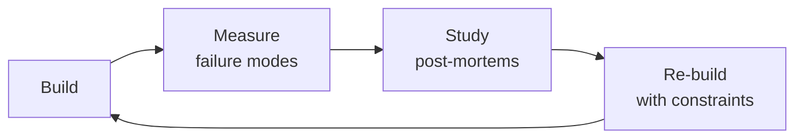

# Localization / i18n-L10n Engineer
> **Portability target:** Spec-level (runs on Claude Code, Copilot, Gemini CLI, Codex, Cursor). No vendor-specific frontmatter fields.

Design and implement end-to-end internationalization (i18n) and localization (l10n) systems. This skill covers message extraction, translation pipeline architecture, locale-aware formatting, RTL layout, pseudo-localization testing, and continuous localization integrated into CI/CD. Every decision balances developer ergonomics, translator workflow, and end-user experience across languages and cultures.

## Route the Request
<!-- STANDARD: 3min -->

<!-- QUICK: 30s -- auto-route first, then intent-route -->

### Auto-Route (No User Input Required)
Evaluate these file-system conditions in order. First match wins — jump immediately.

| # | Condition | Action |
|---|-----------|--------|
| A1 | `file_contains("package.json", "\"i18next\"\|\"react-intl\"\|\"formatjs\"\|\"next-intl\"\|\"vue-i18n\"")` OR `file_contains("*", "locale\|locales\|translations\|i18n")` | This is your skill. Jump to **Core Workflow** — Phase 1. |
| A2 | `file_contains("*", "Lokalise\|Phrase\|Crowdin\|transifex\|POEditor")` AND `file_contains("*", "push\|pull\|sync\|upload")` | Invoke **translation-manager** instead. This is TMS integration, not i18n architecture. |
| A3 | `file_contains("*", "axe-core\|pa11y\|aria-\|role=")` AND `file_contains("*", "lang=\|dir=\|hreflang")` | Invoke **accessibility-testing** instead. This is multilingual a11y testing. |
| A4 | `file_contains("*", "jest\|vitest\|playwright\|cypress")` AND `file_contains("*", "locale.*test\|i18n.*test\|pseudo")` | Invoke **qa-engineer** instead. This is locale testing strategy. |
| A5 | `file_contains("*.css\|*.scss", "margin-left\|padding-right\|float:\s*left")` AND `file_contains("*", "rtl\|arabic\|hebrew\|farsi\|dir=\"rtl\"")` | Jump to **Core Workflow** — Phase 3 (RTL Layout). |
| A6 | `file_contains("*", "Intl\.\|DateTimeFormat\|NumberFormat\|RelativeTimeFormat")` OR `file_contains("*", "ICU\|MessageFormat\|plural\|select")` | Jump to **Decision Trees** — Formatting & ICU. |
| A7 | `file_contains("*", "Accept-Language\|navigator\.language\|detect.*locale\|GeoIP")` | Jump to **Decision Trees** — Locale Detection Strategy. |
| A8 | `file_contains("*", "hreflang\|alternate\|canonical.*locale")` OR `file_exists("sitemap*.xml")` | Jump to **Core Workflow** — Phase 4 (SEO & hreflang). |

### Intent Route (Ask the User)
If no auto-route matched, use this intent tree:

```
What are you trying to do?
├── Set up i18n from scratch → Start at "Decision Trees > New Project"
├── Extract hardcoded strings for translation → Jump to "Core Workflow > Phase 1 (Message Extraction)"
├── Integrate a TMS (Lokalise/Phrase/Crowdin) → Go to "Core Workflow > Phase 2 (Translation Pipeline)"
├── Implement RTL layout support → Jump to "Core Workflow > Phase 3 (RTL Layout)"
├── Format dates, numbers, currencies per locale → Go to "references/icu-messageformat-guide.md"
├── Set up pseudolocalization testing in CI → Jump to "Core Workflow > Phase 4 (Pseudolocalization)"
├── Design locale detection (URL/subdomain/Accept-Language) → Go to "Decision Trees > Locale Detection Strategy"
├── Need string translation management → Invoke translation-manager skill instead
├── Need frontend i18n integration → Invoke frontend-developer skill instead
├── Need mobile i18n integration → Invoke mobile-developer skill instead
├── Need QA for locale testing → Invoke qa-engineer skill instead
├── Need accessibility in multiple languages → Invoke accessibility-testing skill instead
└── Don't know where to start? → Describe your app, target languages, and I'll route you

```

Do not read the entire skill. Follow the route above and read only the sections it points to.

## Ground Rules — Read Before Anything Else
<!-- STANDARD: 3min -->

These rules are non-negotiable constraints that detect localization mistakes before they are given. Violation means STOP and refuse to proceed.

| # | Negative Constraint | Mechanical Trigger | Violation Response |
|---|-------------------|-------------------|-------------------|
| R1 | REFUSE hardcoded strings in UI code | Trigger: Code contains string literals directly in UI markup (JSX text content, SwiftUI `Text("...")`, Compose `Text("...")`) outside a translation key lookup — grep for `Text\(\"`, `>  </`, or `text:` with a bare string operand | STOP. Respond: "Hardcoded string at [file:line]. All user-visible strings must use translation keys (e.g., `t('welcome.message')`). Extract to resource file now — hardcoded strings shipped to production require a full release cycle to fix." |
| R2 | REFUSE string concatenation for translatable sentences | Trigger: Code constructs user-visible sentences via `+` or string interpolation (`${noun}`) that embeds dynamic values into a sentence template — grep for `\+ \" \" \+` or template literal with both static text and variables inside a user-visible context | STOP. Respond: "String concatenation at [file:line] breaks i18n. Word order differs across languages — your concatenation order is English-only. Use ICU MessageFormat: `'You have {count, plural, =0 {no items} one {1 item} other {# items}}'` not `count + ' items'`." |
| R3 | DETECT hardcoded directional properties (RTL incompatible) | Trigger: CSS/layout uses `left`, `right`, `padding-left`, `margin-right`, `text-align: left`, or `flex-start`/`flex-end` applied to text-bearing elements, without corresponding `[dir="rtl"]` override or logical property equivalent | STOP. Respond: "Hardcoded directional property at [file:line]: `[property]`. Use logical properties for RTL compatibility: `padding-inline-start` not `padding-left`, `margin-inline-end` not `margin-right`, `text-align: start` not `text-align: left`." |
| R4 | REFUSE locale-less date, number, or currency formatting | Trigger: Code calls `Date.toLocaleString()`, `toLocaleDateString()`, `Intl.DateTimeFormat()`, `Number.toFixed()` for display, or `parseFloat` for user-entered numbers — without an explicit locale parameter passed through from the user's preference | STOP. Respond: "Locale-less formatting at [file:line]. Never assume `en-US` conventions for dates (MM/DD/YYYY), numbers (1,000.00), or currencies ($). Use `Intl.DateTimeFormat(userLocale, options)` with the locale from the user's preference or accept-language header." |
| R5 | DETECT untranslated strings in locale resource files | Trigger: A translation key in `en.json` (or base locale) has no corresponding entry in any other locale file, OR a key appears in code that does not exist in the base locale file — verify with `diff <(grep -oP '\"\\w+\"' en.json | sort) <(grep -oP '\"\\w+\"' fr.json | sort)` | STOP. Respond: "Untranslated key `[key]` missing from `[locale]`. Missing translations render as raw keys in production. Run: `i18n-unused diff --base en.json --target [locale].json` to find all gaps. Do not ship until all target locales have 100% key coverage or explicit fallback handling." |
| R6 | DETECT no text expansion budget in UI containers | Trigger: Fixed-width or fixed-height container (CSS `width: Npx`, SwiftUI `.frame(width:)`, Compose `.width(N.dp)`) wrapping translated text with no `min-width`, no `overflow` strategy, and no `flex-shrink` — container will clip or overflow with longer translations | STOP. Respond: "No expansion budget at [file:line]. German text is 30-35% longer than English; Arabic can be 50%+. Fixed dimensions on translatable text containers will clip content. Replace `width: Npx` with `min-width: Npx` + `width: auto`, or use flex layout. Verify with pseudo-localization (`en-XA` locale doubles string length)." |
| R7 | REFUSE incomplete locale fallback chain | Trigger: Locale resolution config has fewer than 3 levels (e.g., only `['fr']` instead of `['fr-FR', 'fr', 'en']`), or fallback list omits the base/default locale as the final entry — check i18n config for `fallbackLng` being a single string rather than an array | STOP. Respond: "Incomplete locale fallback at [file:line]. Define at minimum: specific locale → language-only → default (e.g., `'fr-CA' → 'fr' → 'en'`). Without a 3-level fallback chain, any missing translation renders as the raw key in production. Configure: `fallbackLng: ['en']` and ensure every locale resolves through its language parent to the default."
| **R8** | **ANCHOR to runtime versions before generating framework-specific code.** Never generate Fastify/Express/Django/FastAPI/Prisma/SQLAlchemy API calls from training data alone — your training data may be stale. | Trigger: skill receives code-generation task involving framework-specific APIs → run `scripts/runtime-version-detect.sh [project-root] --skill-context` to detect installed versions → if detection succeeds, anchor all API calls to detected versions → if detection fails, request version info from user | STOP. Respond: "Detected: {runtime}@{version}, {frameworks}@{versions}. Anchoring all API calls to these versions. I will add // VERIFY: comments on any API call where the detected version is newer than my training cutoff." |
| **R9** | **RUN the ROI Gate before any non-emergency code change.** Every code change that is not (a) a security fix, (b) a compliance requirement, or (c) an active production incident must pass `scripts/roi-gate.sh`. If the gate returns negative, refuse to write the code. | Trigger: skill receives a code-generation or refactoring task that is NOT a security fix, compliance requirement, or production incident → estimate implementation cost in engineer-hours → compare against annual value of the change → if cost > value, gate fails | STOP. Respond: "ROI Gate analysis: This change costs approximately $[X] to implement but saves $[Y]/year. Payback period: [N] years. If payback > 2 years, I recommend declining this work. See `scripts/roi-gate.sh` for the full formula." |

- **Admit uncertainty — never fabricate.** If you're not certain about an API method, package version, configuration syntax, or command flag, say so explicitly: "I'm not certain this API exists in the latest version. Check the official docs at [URL]." Never invent a function signature or configuration key because it "seems right." Hallucinated code costs hours of debugging.
- **Flag your knowledge cutoff.** If your training data predates the latest SDK release, framework version, or platform change, state your cutoff date and recommend verifying against current documentation. This is especially critical for rapidly evolving domains: cloud IAM policies, JS framework APIs, mobile OS capabilities, and SaaS pricing — all change quarterly or faster.
- **Never guess security configurations.** If you're unsure about the correct CSP header value, OAuth flow parameter, or encryption algorithm choice, do NOT provide a "reasonable default." Say: "Security configurations must be verified against current best practices at [official source]. I cannot provide a definitive answer without current documentation."
- **Distinguish between what you know and what you infer.** Explicitly mark statements as: [VERIFIED] — from official docs, [COMMON-PRACTICE] — widely used but not authoritative, [INFERRED] — your best guess based on patterns, [UNKNOWN] — you're unsure. This helps the user calibrate trust in your output.
## The Expert's Mindset
<!-- STANDARD: 3min -->

Masters of localization engineer don't just build — they build **the right thing, at the right time, with the right trade-offs**. They think in systems, not tasks.

| Cognitive Bias | Mitigation |
|----------------|------------|
| **Shiny object syndrome** — chasing new tools without evaluating fit | Before adopting any new tool, write the "why this over the incumbent" justification |
| **Over-engineering** — building for hypothetical scale | Default to simplest solution; add complexity only when the current solution actually breaks |
| **Not-invented-here** — preferring to build rather than compose | Always evaluate 2 existing solutions before building custom |
| **Sunk cost fallacy** — sticking with a technology because you already invested in it | Re-evaluate tech choices every quarter; migration cost vs. staying cost |

### What Masters Know That Others Don't
- The **failure modes** of every component in their stack — not just the happy path
- When **not** to use their favorite tool (every tool has a misuse zone)
- That **data/model quality decays over time** — monitoring is not optional, it's foundational

### When to Break Your Own Rules
- **Move fast on reversible decisions.** Data format? Hard to change. Dashboard layout? Easy. Know the difference.
- **Skip the abstraction until the third use case.** Two is coincidence, three is a pattern.

## Operating at Different Levels
<!-- STANDARD: 3min -->

## When to Use
<!-- STANDARD: 3min -->

- You are adding i18n support to a new web or mobile application from day one
- You need to extract hardcoded strings from an existing codebase for translation
- You are setting up a translation management system (Lokalise, Phrase, Crowdin) integrated with CI/CD
- You need to implement locale-aware date, number, currency, and plural formatting using ICU MessageFormat
- You are adding support for right-to-left (RTL) languages and need to adapt layouts and styles
- You need to set up pseudo-localization in CI to catch i18n bugs before translators see the strings
- You are designing a locale detection and negotiation strategy (URL path, subdomain, Accept-Language header)
- You need to build a continuous localization pipeline that pushes source strings and pulls translations automatically

## Decision Trees
<!-- STANDARD: 3min -->
**(QUICK)**

### Decision Tree 1: Continuous Localization Strategy

        ┌── INPUT: Team size & release cadence
        │
   ┌────┴────┐
   │         │
   ▼         ▼
<5 devs,   >10 devs,
weekly      daily
releases?   deploys?
   │         │
   ▼         ▼
MANUAL      CI-NATIVE
TRIGGER     (automated)
   │         │
   ▼         ▼
Push source Push source
strings to  strings on
TMS after   every merge
sprint      to main
review      via CI
   │         │
   ▼         ▼
Translators  TMS opens
work async,  PR when
TMS opens    translations
PR when      ready; CI
ready        validates
             ICU syntax
   │         │
   ▼         ▼
BEST FOR:   BEST FOR:
startups,    enterprise
small apps   with dedicated
             i18n team

### Decision Tree 2: Translation QA Method

        ┌── INPUT: Quality bar & budget
        │
   ┌────┴────┐
   │         │
   ▼         ▼
Budget     Mission-
< $500/mo  critical
per locale? UI (legal,
   │       medical,
   │       payments)?
   │          │
   ▼     ┌────┴────┐
AUTO-    │         │
MATED    ▼         ▼
ONLY     HUMAN      HYBRID
   │     REVIEW     (auto +
   │        │       human)
   ▼        │          │
Pseudo-     ▼          ▼
localization NATIVE    Auto lint
in CI + ICU REVIEWER    for ICU
validation +  reviews   errors,
linters       every     truncation,
              string    missing keys
   │           │          │
   ▼           ▼          ▼
Catches      Catches    Native
~70% of      cultural   review for
issues       nuance,    flagged
             idioms,    strings
             context    only

### Decision Tree 3: Locale Rollout Priority

        ┌── INPUT: Market expansion plan
        │
   ┌────┴────┐
   │         │
   ▼         ▼
Data-       Strategic
driven?     business
   │        goal?
   │           │
   ▼      ┌────┴────┐
ANALYZE   │         │
traffic   ▼         ▼
by region Competing Legal/
   │      in a       compliance
   ▼      specific   requirement?
PRIORITIZE market?      │
by:          │     ┌────┴────┐
1. Largest   ▼     │         │
   non-EN    LOCAL- ▼         ▼
   traffic   IZE THAT EU GDPR?  Govt
2. Highest   MARKET    │       mandate?
   conversion FIRST     ▼       │
   rate              EU/EEA    ▼
3. Support            languages LOCAL
   ticket              first    REGULATION
   volume             (DE, FR,  (must
                      ES, IT)   comply)

### 1. i18n Library Selection

<!-- QUICK: 30s -- follow the ASCII tree to your scenario -->

```
NEW PROJECT — How should we structure i18n from day one?
├── Single-language MVP (<3 months to launch)?
│   └── Externalize all strings into a single `en.json`. Don't integrate a TMS yet.
│       Use a simple i18n lib (react-i18next, vue-i18n, rosetta, go-i18n). Add locale
│       routing when the second language is 2 sprints away — not before.
├── Multi-language from launch?
│   └── ICU MessageFormat from day one. Store translations in locale files (JSON/PO/YAML).
│       Integrate a TMS (Lokalise, Phrase, Crowdin) before the first non-English locale ships.
│       Budget: 2-4 weeks for i18n setup before any feature work on locale #2.
└── Enterprise with 10+ languages at launch?
    └── ICU MessageFormat + CLDR data + dedicated i18n service. Translation memory mandatory.
        Pseudo-localization in CI from sprint 0. Legal review for each locale's requirements.
        Budget: 1 dedicated i18n engineer + TMS admin for first 6 months.

STRING EXTRACTION — Hardcoded strings in a 200K LOC codebase?
├── <500 hardcoded strings → Manual extraction sprint (1-2 devs, 1 week).
├── 500-5000 hardcoded strings → Use i18n lint rules (eslint-plugin-i18n, i18next-scanner)
│   to find and flag. Extract in batches by module. 2-4 weeks.
└── 5000+ hardcoded strings → Build an AST-based extraction pipeline. Run it in CI to
    prevent new hardcoded strings. Gradual migration over 1-3 months. Never block the
    whole team — extract one module, merge, repeat.

TRANSLATION PIPELINE — Push vs Pull?
├── Devs push source strings to TMS?
│   └── CI pipeline extracts strings on every merge to main. Pushes to TMS via API.
│       Translators work in TMS. TMS opens a PR with translated files when ready.
│       Best for: dedicated translation team, frequent string changes, CI/CD-native.
├── Translators pull from repo?
│   └── Source strings committed to repo. Translators clone, translate, open PR.
│       Best for: open source, volunteer translators, no TMS budget.
└── Hybrid?
    └── TMS is source of truth. CI pushes to TMS. TMS pushes translated files as PR.
        But devs can also manually trigger pulls. Best for most teams.

RTL (RIGHT-TO-LEFT) — Should we support Arabic, Hebrew, Farsi, Urdu?
├── Never going to support RTL languages?
│   └── Skip RTL infrastructure entirely. Document this decision.
├── Maybe in the next 12 months?
│   └── Use CSS logical properties (`margin-inline-start`, `padding-inline-end`)
│       instead of physical properties (`margin-left`, `padding-right`) from day one.
│       This costs nothing and makes RTL a 1-day CSS flip later.
│       Use `dir="auto"` on user-generated content containers.
└── Launching an RTL locale within 3 months?
    └── Build an RTL-first component library. Every component must render correctly
        in both LTR and RTL. Pseudo-localize to Arabic-pseudo in CI. Hire a native
        RTL reviewer — automated flipping catches 70%, human review catches the rest.

LOCALE DETECTION — How should we decide which language to show?
├── Single locale per deployment (e.g., `es.example.com`)?
│   └── Subdomain-based routing. Build-time locale selection. No runtime detection.
│       Fastest, simplest. SEO-friendly (separate domains indexed).
├── Accept-Language header?
│   └── Parse `Accept-Language` server-side. Respect the browser's preference.
│       Fall back to a default locale. Always provide a language switcher.
│       SEO: use `hreflang` tags + `rel="alternate"`.
├── GeoIP-based?
│   └── USE ONLY AS A FALLBACK, never as the primary detection method.
│       A Swiss user with browser in French ≠ wants German content.
│       GeoIP is wrong ~30% of the time for language. It's acceptable as a
│       hint for currency or regional defaults, not for language.
└── User preference (saved in account settings)?
    └── Always honor explicit user preference over any automatic detection.
        This is the ultimate source of truth.

**What good looks like:** The app renders correctly in all 10+ target locales including RTL languages (Arabic, Hebrew) without a single text truncation or layout break. String extraction covers 100% of user-facing text — verified by automated scan that compares source strings to translation files. Date, number, currency, and pluralization formatting matches every locale's expectations (d/m/y vs m/d/y, 1.000 vs 1,000). Translation files are complete, reviewed, and shipped in the same deploy as the code — no lag, no missing strings.

## Core Workflow
<!-- STANDARD: 3min -->
**(STANDARD)**

<!-- QUICK: 30s -- scan phase titles to understand the process -->
### Phase 1 (~15 min): i18n Foundation — Externalize & Standardize

1. **Choose i18n library** per stack:
   - **JavaScript/React**: `react-i18next` (most popular), `formatjs` (ICU-first), `next-intl` (Next.js native)
   - **Vue**: `vue-i18n` (official), `@nuxtjs/i18n` for Nuxt
   - **Python**: `Babel` + `gettext`, or `fluent` (Mozilla's Fluent)
   - **Go**: `go-i18n`, `gotext`
   - **Java/Kotlin**: `ResourceBundle` + ICU4J, or `i18nize` for Spring
   - **Swift/Kotlin Multiplatform**: `Moko-resources`, Apple `String Catalogs` (Xcode 15+)
   - **Output**: Library chosen, installed, and configured. Proof-of-concept with 3 translated strings.

2. **Define message format**: Use **ICU MessageFormat** for anything beyond simple key-value.
   ```

   // AVOID: "You have {count} new messages" — breaks in Polish (plural rules differ)
   // USE: "{count, plural, =0 {No messages} one {1 message} few {# messages} many {# messages} other {# messages}}"

   ```
   ICU supports: plurals, select (gender), selectordinal, number/date/time formatting.
   - **Output**: Message format standard documented. Developers trained. Linter rules enforced.

3. **Extract all hardcoded strings**: Run the extraction scanner. Generate the source locale file (`en.json`).
   Verify: zero hardcoded strings remain. Add a CI check that fails on new hardcoded strings.
   - **Output**: Source locale file with all strings externalized. CI guard in place.

4. **Implement locale routing**: URL strategy: subdomain (`en.example.com`), subdirectory (`example.com/en/`), or TLD (`example.es`).
   Subdirectory is the default recommendation — best SEO, simplest infrastructure.
   - **Output**: Locale routing live. Language switcher functional.

  Complete when: i18n library is chosen and configured per stack, ICU MessageFormat standard is documented with linter enforcement, all hardcoded strings are extracted to source locale file with CI guard, and locale routing is live with a functional language switcher.

### Phase 2 (~30 min): Translation Pipeline — Connect Dev to Translator
<!-- DEEP: 10+min -->

1. **Select and integrate a TMS** (Translation Management System):
   - **Lokalise**: Best UX for translators, strong API, screenshot support. $120+/mo.
   - **Phrase** (formerly PhraseApp): Best for developer workflows, Git sync, ICU-first. $125+/mo.
   - **Crowdin**: Best for open source (free for OSS), large community of volunteer translators. Free-$150/mo.
   - **POEditor**: Cheapest ($20/mo), decent API. Good for small teams.
   - **Custom/CLI-only**: Use `i18next-parser` + `tx` (Transifex CLI) or `crowdin-cli`. Zero UI cost.
   - **Output**: TMS integrated. Strings flow: repo → CI → TMS → translator → TMS → PR → repo.

2. **Set up continuous localization in CI/CD**:
   ```yaml

   # GitHub Actions sketch — push source strings on merge, pull translations nightly
   on:
     push:
       branches: [main]
       paths: ['src/locales/en/**']
   jobs:
     push-to-tms:
       steps:
         - run: crowdin-cli upload sources
     pull-translations:
       # Scheduled: every 6 hours or on d

> See [references/core-workflow.md](references/core-workflow.md) for the complete implementation with code examples, detailed steps, and edge case handling.

  Complete when: TMS is selected and integrated, and the continuous localization CI/CD pipeline is operational — source strings flow from repo to TMS on merge, and translated strings are pulled back as locale files on schedule/webhook trigger.
  Complete when: All tests pass — unit, integration, and E2E with > 80% coverage on new code.
  Complete when: Accessibility audit passes — WCAG 2.1 AA compliance with automated and manual checks.
  Complete when: Performance benchmarks within budget — LCP < 2.5s, TBT < 200ms, CLS < 0.1.
  Complete when: Code review completed by at least 2 reviewers with all threads resolved.
  Complete when: Feature flagged behind config — can be enabled/disabled without deployment.
  Complete when: Error tracking configured — all unhandled exceptions routed to on-call.

## Best Practices
<!-- STANDARD: 3min -->

1. **Start i18n on day one, even for single-language apps.** Wrap every user-facing string in `t()` or `<Trans>` before the first feature ships. Retrofitting i18n onto a 500-string codebase costs 2-4 engineer-weeks; building it in from day one costs zero extra time per string. Use `eslint-plugin-i18next` in CI to enforce.

2. **Use ICU MessageFormat for anything beyond simple key-value.** English plural "1 item, 2 items" becomes 6 forms in Arabic, 3 in Russian, and 0 in Japanese. ICU `{count, plural, =0 {No items} one {# item} other {# items}}` handles all languages. Never concatenate: `t('you_have') + count + t('items')` breaks in 70%+ of languages.

3. **Pseudo-localize in CI, not locally.** Run a pseudo-localized build (`en-XA` or custom with 30% expansion + diacritics) on every PR. One developer testing locally catches only their bugs. CI catches integration bugs: truncated buttons, broken flex layouts, text overlapping icons. The cost of catching a text-overflow bug in CI: zero. The cost of catching it post-launch in German: emergency redesign sprint.

4. **Design UI components for 30-40% text expansion from English.** German averages 30% longer than English; Finnish 40%+; Arabic adds width from script complexity. Use `min-width`/`max-width` with `text-overflow: ellipsis` as last resort. Never use fixed-width containers for text-bearing elements. Pseudo-localization validates this automatically.

5. **Build proper locale fallback chains.** `fr-CA` (French Canadian) should fall back to `fr` (French), then to the source language. But Android, ICU, and Unicode CLDR resolve fallback chains differently. Configure your i18n library explicitly: `['fr-CA', 'fr', 'en']`. Test fallback behavior for 0, 1, and 2 levels of fallback depth.

6. **Automate placeholder integrity validation.** Every `{name}`, `%s`, `{{variable}}` in the source must appear in every translation. A missing placeholder renders literal `{name}` in the UI or — worse — crashes with a template error. Run placeholder matching in CI: validate that every translated string has exactly the same set of placeholders as the source.

7. **Standardize on one interchange format, then generate platform formats.** i18next JSON for web, Android XML with `%1$s`, iOS `.strings` with `%@` — three formats, one truth. Use XLIFF 2.0 or ICU MessageFormat as the canonical interchange format. Auto-generate all platform-specific formats from it. Validate placeholder integrity in every generated file before merge.

8. **Test RTL (right-to-left) from day one of i18n setup.** Set locale to `ar` and test every screen, every animation, every carousel. CSS `direction: rtl` doesn't mirror icons, SVGs, illustrations, or custom-drawn components. Use logical properties: `margin-inline-start`/`margin-inline-end` instead of `margin-left`/`margin-right`.

9. **Localize locale-aware data, not just strings.** Names (Icelandic patronymics have no "last name"), addresses (Japanese order: prefecture→city→district), phone numbers (varying lengths and formats), postal codes (alphanumeric in UK, numeric in US). Use `libphonenumber-js` and `i18n-iso-countries`. Make culturally-specific fields adaptive or optional.

10. **Continuous localization pipeline: push on merge, pull on schedule.** Source strings pushed to TMS on merge to main. Translated strings pulled back as locale JSON files on a cron schedule or webhook trigger. Automated PRs from TMS when translations are ready. Never let the translation pipeline be a manual step that someone forgets before release.

## Error Recovery
<!-- STANDARD: 3min -->
**(STANDARD)**

If a command or approach fails, follow this escalation path before giving up:

| Symptom | First Action | If That Fails | Last Resort |
|---------|-------------|---------------|-------------|
| Tool/command not found | Check installation: `which [tool]` or `[tool] --version`. Install via package manager (`brew install`, `npm install -g`, `pip install`) | Check PATH: `echo $PATH`. Verify the tool binary is in a PATH directory. Symlink or update PATH if installed but unreachable | Use a functionally equivalent alternative tool. If `rg` is unavailable, use `grep -r`. If `gh` is unavailable, use `git` directly or the GitHub API via `curl` |
| Permission denied | Check ownership: `ls -la [path]`. Fix with `chmod` or `sudo` if appropriate. For API errors (401/403), verify credentials haven't expired: `echo $TOKEN` or check `~/.netrc` | Refresh credentials: re-authenticate with the service. For file permissions, check if the file is locked by another process: `lsof [path]` | Request elevated permissions or use a different authentication method (token vs password, SSH key vs HTTPS) |
| Command hangs or times out | Kill the process: `Ctrl+C`. Re-run with a timeout: `timeout 30 [command]` or `gtimeout` on macOS. Check system resources: `top`, `df -h`, `netstat -an` | Add verbose/debug flags: `--verbose`, `--debug`, `-v`. Check logs: `tail -f [logfile]`. Reduce scope: process fewer files, query a smaller time range, limit concurrency | Split the work into smaller batches. Implement a retry loop with exponential backoff (1s, 2s, 4s, 8s). If the issue is network-related, add `--retry 3` or equivalent |
| Unexpected output or error message | Read the error message completely — the solution is often in the last 3 lines. Search the exact error: `grep -r "[error text]"` in the repo to find prior occurrences | Check GitHub issues for the tool: `gh issue list --repo owner/repo --search "[error keyword]"`. Check Stack Overflow | Simplify the approach. If the complex one-liner fails, break it into 3 sequential commands. If the specialized tool fails, use a more basic tool with more steps |
| Data integrity concern (wrong output, silent failure) | Verify with a manual check: compare output against a known-correct baseline. Add assertions: `[command] | grep -q "[expected]" && echo "OK" || echo "FAIL"` | Run the operation on a smaller subset first. Compare checksums: `shasum`, `md5`. Check for silent truncation: `wc -l` before and after | Abort and flag for human review. Do not proceed past data integrity failures — the cost of propagating bad data exceeds the cost of delay |

**Hard failure boundary:** If 3 different approaches all fail, STOP. Do not iterate infinitely. Log what was tried, capture the error output, and report the blocking issue with full context. Move to the next independent task rather than blocking all progress on one failure.

## Error Decoder
<!-- STANDARD: 3min -->

| Symptom | Root Cause | Fix | Lesson |
|---------|-----------|-----|--------|
| RTL layout: icons and SVGs face wrong direction; carousels scroll backwards | CSS `direction: rtl` flips text and layout but does NOT mirror custom-drawn elements, SVG paths, or icon fonts. Arrow icons still point LTR | Add `transform: scaleX(-1)` to directional icons in RTL. Use `dir="auto"` on text containers. Test with `html[dir="rtl"]` selector for all directional CSS | RTL is not "flip everything." ~40% of UI elements need manual RTL adaptation. Testing `ar` locale from day one prevents costly post-launch redesign |
| UI breaks in German: buttons overflow, table columns truncate, labels overlap | English "Submit" (6 chars) → German "Absenden" (8 chars, +33%). Fixed-width containers clip text. No layout testing for text expansion | Design all UI with 30-40% expansion headroom. Use `min-width`/`max-width` with `text-overflow: ellipsis` as last resort. Pseudo-localize with length expansion in CI | Text expansion is predictable (German +30%, Finnish +40%, Arabic +25%). Designing fixed-width containers for English text guarantees breakage in other locales |
| Translation shows literal `{name}` or `%s` instead of substituted value | Translator accidentally deleted or modified a placeholder. `Hello {name}` → `Bonjour` — the `{name}` is missing. Template resolution fails | Validate placeholder integrity in CI: every translated string must have the EXACT same set of placeholders as the source. Use ICU MessageFormat parser to validate syntax | Placeholder validation must be automated — manual review of 5,000 strings across 12 locales will miss 3-5% of missing placeholders |
| `Intl.NumberFormat('fr-FR').format(1234.5)` produces different whitespace across browsers | Chrome uses narrow non-breaking space (U+202F), older Safari uses regular space. Visual snapshot tests fail intermittently across browser matrix | Normalize whitespace in visual regression tests: replace all non-breaking spaces with regular spaces before comparison. Document browser-specific formatting differences per locale | Locale-aware formatting APIs are correct but not identical across implementations. Visual diff tools must account for whitespace variation |
| App translates correctly in dev but shows English in production | `fr-CA` fallback chain resolves differently in production build. Dev uses full locale data; production tree-shaking removed `fr` locale data, leaving only `fr-CA` | Configure locale data import explicitly: import both `fr` and `fr-CA` locale data. Set fallback chain: `['fr-CA', 'fr', 'en']`. Test production build locale resolution | Tree-shaking and bundle optimization silently remove locale data that "isn't directly imported." Explicit imports + integration test in production build mode catch this |
| Plural forms render incorrectly for zero count in English | ICU `{count, plural, one {# item} other {# items}}` — `zero` is not for English. CLDR defines `zero` only for Arabic, Latvian. English uses `other` for 0 → shows "0 items" not "No items" | Add explicit `=0 {No items}` match. ICU exact matches (`=0`, `=1`) take precedence over CLDR category matches (`one`, `other`). Test plural forms for 0, 1, 2, 5, 21 for every language | ICU plural rules are language-specific. `zero` is a CLDR category (used by Arabic), not a universal catch-all. Always add explicit `=0` case for human-readable zero states |

## Cross-Skill Coordination
<!-- STANDARD: 3min -->

| Upstream Skill | What You Receive | When to Involve |
|---|---|---|
| `frontend-developer` | i18n wrapper usage, RTL CSS patterns, locale-aware component API, string extraction implementation | Before integrating i18n into components; ensures RTL readiness and proper key usage |
| `mobile-developer` | Platform-specific locale files, App Store/Play Store metadata requirements, mobile formatting constraints | Before implementing mobile i18n; platform conventions differ |
| `translation-manager` | String extraction config, TM schema, locale list, TMS API integration, glossary/termbase | Before setting up translation pipeline; ensures extraction format matches TMS expectations |

| Downstream Skill | What You Provide | Impact of Delay |
|---|---|---|
| `qa-engineer` | Testing matrix (locales × devices × pages), visual diff baseline, pseudo-locale build | QA can't test localization without locale infrastructure |
| `frontend-developer` | i18n library configuration, locale detection, RTL layout patterns, locale-aware component API | Frontend builds hardcoded strings — expensive retrofit |
| `mobile-developer` | Mobile i18n framework setup, platform-specific locale files, offline translation support | Mobile ships single-language app — blocks international markets |

### Communication Triggers

| Trigger | Notify | Why |
|---|---|---|
| New locale requested by business | Product Manager, Content Strategist, Legal Advisor | Market sizing, content readiness, legal requirements, translation budget |
| Translation coverage drops below 95% for prod locale | QA Engineer, Product Manager | Release blocker — halt deploy until fixed |
| TMS API integration broken / translations stopped syncing | DevOps, Frontend Lead | Translations frozen; manual fallback needed |
| Pseudo-localization CI job finds new hardcoded strings | Frontend Developer responsible for PR | Fix before merge; i18n regression |
| RTL layout breaks on new feature | Frontend Developer, UI/UX Designer | Visual regression; fix or feature flag before release |
| Legal requirement for a language not yet supported | Legal Advisor, Product Manager | Compliance gap; prioritize or document risk acceptance |

## Proactive Triggers
<!-- STANDARD: 3min -->

| Trigger | Action | Why |
|---------|--------|-----|
| New feature with user-facing strings merged without i18n wrapper | Run pseudo-localization CI; flag PR if new hardcoded strings detected | Catches i18n regression before translators see it — CI should block merge, not QA catch later |
| RTL locale (Arabic/Hebrew/Farsi) added to roadmap | Audit CSS for logical properties; run RTL pseudo-locale build; schedule native-speaker QA | RTL is not a CSS flip if you haven't used logical properties — early audit prevents 2-month refactor |
| Translation coverage drops below 95% for a production locale | Halt release; notify QA and Product Manager; escalate to translation-manager | Missing translations in production erode user trust — a half-translated app is worse than English-only |
| Pseudo-localization CI job finds new hardcoded strings in a PR | Reject merge; notify Frontend Developer to externalize strings before re-submit | Fixing hardcoded strings in dev costs minutes; in production it costs an app store review cycle |
| Third-party dependency adds new UI strings without i18n support | Audit dependency's i18n capabilities; wrap with locale-aware component; file upstream issue | Dependencies that render user-facing strings without i18n hooks break your entire locale coverage |
| Legal requirement mandates a language your TMS doesn't yet support | Notify Legal Advisor, translation-manager, Product Manager; assess TMS capabilities vs contract translators | Compliance gap carries regulatory fines — prioritize language support based on legal risk, not market size |
| Visual diff detects RTL layout regression on new page | Reject merge; notify Frontend Developer and UI/UX Designer; fix before release | RTL layout breaks compound — one missed page creates a pattern that cascades across the app |
| Locale file grows beyond 10K keys with no code-splitting | Refactor to lazy-load translations per route; measure bundle size impact per locale | Bundling all locales into the main bundle bloats initial load — users download 40 languages and use 1 |

## State Log
<!-- STANDARD: 3min -->

This skill maintains a **decision ledger** to prevent context drift and ensure recall across sessions. Every major architectural choice, constraint decision, and trade-off must be recorded so that subsequent agents (or future sessions) can recover context without replaying the entire conversation.
## What Good Looks Like
<!-- STANDARD: 3min -->

> Every user-facing string is externalized, translated, and renders correctly in every supported locale — pseudolocalization catches regressions in CI before translators ever see them.

> See [references/what-good-looks-like.md](references/what-good-looks-like.md) for the full quality standard.

### Cross-skills Integration

| Step | Skill | What it produces |
|------|-------|------------------|
| **Before** | frontend-developer | UI with hardcoded strings, locale-ready component structure |
| **This** | localization-engineer | i18n architecture, translation pipeline, RTL support, locale formatting, pseudolocalization tests |
| **After** | qa-engineer | Validates all locale outputs, tests RTL layouts, verifies pseudo-localization catches issues |

Common chains:
- **Web app localization**: frontend-developer → localization-engineer → qa-engineer — Frontend builds the UI, localization externalizes strings and adds locale support, QA verifies across languages
- **Mobile app globalization**: mobile-developer → localization-engineer → release-manager — Mobile builds platform-specific UI, localization adds multi-language support, release manager coordinates app store localization metadata

## Deliberate Practice
<!-- STANDARD: 3min -->


```mermaid
graph LR
    A[Build] --> B[Measure<br/>failure modes] --> C[Study<br/>post-mortems] --> D[Re-build<br/>with constraints] --> A

```

| Level | Practice | Frequency |
|-------|----------|-----------|
| **Novice** | Rebuild an existing system from scratch, then compare your design with the original | Monthly |
| **Competent** | Add a new constraint (10x data, zero downtime, etc.) to a familiar design and re-architect | Quarterly |
| **Expert** | Design the same system under 3 conflicting constraint sets; write a decision record for each | Quarterly |
| **Master** | Teach a junior to design a system; your role is to ask questions, not give answers | Monthly |

**The One Highest-Leverage Activity:** Every quarter, take a system you built 6+ months ago and redesign it from scratch with what you know now. Write down what changed and why.

### Decision Tree 5: Translation Management System (TMS) Build vs Buy Decision

**Context:** You need a system to manage translations. Should you buy a commercial TMS (Lokalise, Phrase, Crowdin, POEditor, Transifex) or build an in-house solution (Git-based workflow + CLI tools + spreadsheet-based translation)?

#### Phase 1: Scale & Complexity Assessment
- How many target languages?
  - 1-2 languages → In-house with JSON/PO files + GitHub PR workflow. Don't add TMS overhead for 2 languages. A spreadsheet-based workflow with `i18next-parser` extraction is sufficient.
  - 3-10 languages → Evaluate. A TMS adds translation memory (TM) reuse, glossary enforcement, and visual context. If you use professional translators, a TMS is nearly always worth it.
  - 10+ languages → Buy a TMS. Managing 10+ locale files, translation memory, and translator workflows manually will consume a full-time engineer.
- What is the translation volume?
  - <1,000 source strings → In-house is viable. Manual PR reviews per locale are manageable.
  - 1,000-10,000 source strings → TMS is strongly recommended. Translation memory saves 30-50% on translation costs through fuzzy matching and reuse.
  - 10,000+ source strings → TMS is mandatory. Automated workflows, TM leveraging, and MT integration are required to maintain velocity.
- How frequently do strings change?
  - Quarterly releases → In-house or TMS. Low churn means manual workflows don't bottleneck.
  - Weekly or continuous deployment → TMS is mandatory. CI/CD integration (auto-push source strings, auto-pull translations as PR) prevents translation lag. Without this, you either ship untranslated strings or delay deploys.

#### Phase 2: Translator & Team Assessment
- Who are your translators?
  - Professional translation agency → TMS. Agencies expect a TMS interface and won't work with raw Git repos. They bill by word and expect TM/glossary integration.
  - In-house translators → TMS or in-house. In-house team can adapt to any workflow, but a TMS with screenshot context and visual editor dramatically improves their throughput.
  - Volunteer/community translators (open source) → Crowdin (free for OSS) or Git-based PR workflow. Volunteers won't pay for TMS access. Crowdin's free OSS tier is the industry standard.
  - Developers doing translation (startup without budget) → In-house Git-based workflow with `i18next-parser` and spreadsheets. Keep it simple until you can afford a TMS.
- Do you need translation memory and glossary management?
  - Yes → TMS. Building TM matching with fuzzy match scoring, placeholder validation, and glossary enforcement in-house is 3-6 months of engineering effort. Commercial TMS has this built in and battle-tested.
  - No (one-time translations, no reuse) → In-house is feasible. But TM pays for itself within 2-3 release cycles through reuse savings.
- What's your budget?
  - $0-50/month → In-house. TMS pricing starts at ~$120/month for small teams. POEditor at $20/month is the cheapest viable commercial option.
  - $120-500/month → Buy. Engineering time saved vs building/maintaining in-house exceeds the subscription cost within the first month.
  - $500+/month → Buy. At this tier you get visual context editors, automated screenshot capture, MT integration (DeepL, Google, Azure), and CI/CD-grade API rate limits.

#### Phase 3: Build vs Buy Decision Matrix

| Factor | Build (In-House) | Buy (Commercial TMS) |
|--------|------------------|---------------------|
| Setup time | 2-4 weeks (scripts + CI) | 1-3 days (API integration) |
| Maintenance cost | 0.5-1 FTE engineer | $120-$500+/month subscription |
| Translation memory | Manual or none | Built-in with fuzzy matching |
| Glossary/termbase | Spreadsheet-based | Built-in with enforcement |
| Screenshot context | Manual (tools like Percy) | Automated capture |
| Translator UX | Git/CLI — technical barrier | Web UI — translator-friendly |
| CI/CD integration | Custom scripts | Native API + plugins |
| MT integration | Manual (API keys + scripts) | Built-in (DeepL, Google, Azure) |
| QA/validation | Custom lint rules | Built-in (placeholder, HTML, length) |
| Scalability | Degrades at 5+ languages | Scales to 100+ languages |

**Recommendation:** Buy a TMS if you have >2 target languages AND use professional translators. The break-even point is roughly 3 languages with 1,000+ source strings — at that scale, the engineering time saved in a single release cycle covers the annual subscription. If you're a solo developer with 1-2 languages, start in-house and migrate to a TMS when you hire your first translator or add your third language. Crowdin's free OSS tier is an excellent bridge — zero cost until you outgrow it.

## Anti-Patterns
<!-- STANDARD: 3min -->

### Anti-Pattern: Retrofitting i18n After the App Is Built
**What it looks like:** Shipping an English-only app, then deciding to "add localization later." Every label, button, error message, and toast is hardcoded. Engineers must grep the entire codebase, wrap every string in `t()`, extract to resource files, and re-test every screen.
**Why it fails:** Converting a medium app (500+ strings) from hardcoded to i18n-ready takes 2-4 engineer-weeks. 15% of strings are missed entirely — permanently untranslatable. Every UI change during extraction risks layout breakage.
**Do this instead:** Wrap every user-facing string in `t()` or `<Trans>` from day one — even for English-only. Use `eslint-plugin-i18next` to enforce `no-hardcoded-strings` in CI. The cost is zero per string. The retrofit cost is $15K-$75K.

### Anti-Pattern: RTL Tested After Launch
**What it looks like:** Building the app in LTR (English), shipping to Arabic/Hebrew markets, and discovering that CSS `direction: rtl` doesn't mirror icons, SVGs, carousels, or custom-drawn components. Every affected screen needs CSS overrides under launch pressure.
**Why it fails:** RTL affects every CSS property with left/right, every icon direction, every text alignment, and every custom drawing — 40% of UI elements need manual RTL adaptation. "Just flipping" is an architectural lie.
**Do this instead:** Build and test in `ar` locale from day one of localization work. Use logical CSS properties: `margin-inline-start`/`margin-inline-end` not `margin-left`/`margin-right`. Use `dir="auto"` on text containers. Test every screen and animation in RTL before declaring localization complete.

### Anti-Pattern: Fixed-Width UI Designed for English Text
**What it looks like:** English "Submit" (6 chars) becomes German "Absenden" (8 chars, +33%), French "Soumettre" (9 chars, +50%). Fixed-width buttons break across lines, table columns truncate labels, the UI looks broken in every non-English locale.
**Why it fails:** Text expansion is predictable and consistent. Designing for English-only guarantees breakage in every other language. The UI looks untrustworthy — directly reducing conversion in localized markets.
**Do this instead:** Design all UI components to accommodate 30-40% text expansion. Use `min-width`/`max-width` with `text-overflow: ellipsis` as last resort. Pseudo-localize with 30% length expansion and run visual regression tests in CI. Never use fixed-width containers for text-bearing elements.

### Anti-Pattern: Platform-Specific Translation File Formats
**What it looks like:** Web team uses nested JSON (`{"checkout": {"button": {"label": "Buy"}}}`), Android uses XML with `%1$s`, iOS uses `.strings` with `%@`. Every new string manually reformatted per platform. One placeholder typo on one platform causes silent corruption.
**Why it fails:** Format fragmentation multiplies QA overhead with each additional locale. A single placeholder typo discovered weeks later requires emergency fixes on that platform. Manual conversion is error-prone at scale.
**Do this instead:** Standardize on one interchange format (XLIFF 2.0, ICU MessageFormat). Auto-generate all platform-specific formats. Use a TMS (Lokalise, Phrase, Crowdin) that exports to all targets from one source. Validate placeholder integrity in every generated file in CI.

### Anti-Pattern: Ignoring Locale-Specific Data Beyond Dates and Numbers
**What it looks like:** A form demands "Last Name" — blocking Icelandic users (patronymics, no family name). "State" dropdown limited to US states — blocking Canadian and Australian users. Phone validation hardcoded to `+1` — blocking every international customer.
**Why it fails:** Names, addresses, phone numbers, and postal codes follow locale-specific conventions. Hardcoding any of these to one country's format permanently blocks international customers from signup and checkout.
**Do this instead:** Use locale-aware validators (`libphonenumber-js`, `i18n-iso-countries`). Make culturally-specific fields adaptive or optional based on country. Test signup with personae from at least 5 countries representing different name, address, and phone patterns.

### Anti-Pattern: Concatenating Translated String Fragments
**What it looks like:** `t('you_have') + ' ' + count + ' ' + t('items')` works in English. In Arabic "لديك 3 عناصر" — word order differs. In Russian: different plural for 1, 2-4, 5+. Grammatically broken output in 70%+ of languages.
**Why it fails:** Different languages have different word orders, grammatical gender, and plural rules. String concatenation assumes English sentence structure universally — it doesn't.
**Do this instead:** Always use ICU MessageFormat: `{count, plural, =0 {You have no items} =1 {You have 1 item} other {You have # items}}`. The entire sentence is one translatable unit. Never concatenate translated fragments.

### Anti-Pattern: Pseudo-Localization Run Only Locally
**What it looks like:** One developer runs pseudo-loc `en-XA` build, finds their own bugs, commits. Integration bugs — truncated text from component composition, overlapping elements from layout interaction — remain undiscovered.
**Why it fails:** One developer testing locally finds only their bugs. Pseudo-loc in CI catches integration bugs: a global header component that truncates in German, a sidebar that overlaps the main content in French, a modal that breaks when the close button label expands.
**Do this instead:** Run pseudo-localized build (`en-XA` with 30% expansion + diacritics) on every PR in CI. Visual regression tests compare screenshots of English vs pseudo-localized. Fail the build on layout breakage. Pseudo-loc is necessary but not sufficient — combine with real locale testing.

## Anti-Hallucination
<!-- STANDARD: 3min -->

| Rationalization | Reality |
|---|---|
| "We'll translate the UI after the English version ships" | Post-ship translation means every string is hardcoded in shipped code; extraction requires grep-ing the entire codebase, and 15% of strings are missed entirely — permanently untranslatable |
| "Google Translate is good enough for our MVP" | MT without human review produces "amusingly bad" translations that go viral for the wrong reasons; the first impression in a new market is permanent and rebuild costs 5x the initial investment |
| "RTL support is just flipping the layout" | RTL affects every CSS property with left/right, every icon direction, every text-alignment, and every custom drawing — "just flipping" misses 40% of the UI and creates mirror-logic bugs |
| "We only need to support 5 languages at launch" | Adding language #6 after launch costs 2-3x more per language than adding it during initial i18n setup; the architecture debt compounds with each post-launch locale |
| "Plurals work the same as English — just add 's'" | Arabic has 6 plural forms, Russian has 3, Japanese has none — hardcoding English plural logic means grammatically broken UI in 80% of target languages from day one |

## Gotchas
<!-- STANDARD: 3min -->

| Gotcha | Cost | Fix |
|--------|------|-----|
| RTL layout breaks — CSS `direction: rtl` flips text but not SVGs, icons, carousels, or custom elements | $25K-$60K in redesign sprints | Use logical properties (`margin-inline-start`), add `transform: scaleX(-1)` for directional icons, test `ar` locale from day one |
| German text expansion breaks UI — fixed-width containers truncate 30% longer strings | $15K-$40K in layout fixes | Design all UI with 30-40% expansion headroom, use `min-width`/`max-width`, pseudo-localize with length expansion in CI |
| ICU zero-plural in English — `{count, plural, one {...} other {...}}` shows "0 items" not "No items" | $5K-$15K in linguistic QA | Always add explicit `=0 {No items}` case; ICU `zero` is a CLDR category for Arabic/Latvian, not English |

## Verification
<!-- STANDARD: 3min -->

- [ ] Run pseudo-localization build: `npm run build -- --pseudo-locale=en-XA` — no layout breaks, no truncated strings
- [ ] Run i18n coverage: `i18next-scanner` or `lingui extract` — zero missing keys
- [ ] Check ICU MessageFormat: validate all `{count, plural, ...}` and `{gender, select, ...}` syntax with `icu-messageformat-parser`
- [ ] Test RTL layout: set locale to `ar` or `he` — all layouts mirror correctly, no hardcoded `left`/`right` CSS
- [ ] Spot-check 3 languages in staging: login, main flow, error screen — no English fallback strings visible

## Production Checklist
<!-- STANDARD: 3min -->
**(STANDARD)**

Before any localized application reaches production:

- [ ] All user-facing strings externalized — zero hardcoded strings verified by `eslint-plugin-i18next` in CI
- [ ] ICU MessageFormat used for all plural, select, and interpolation cases — no string concatenation for translatable content
- [ ] Pseudo-localization build runs in CI on every PR — catches layout breaks from 30% text expansion before translators touch strings
- [ ] Placeholder integrity validated in CI: every translated string has the exact same set of placeholders as the source
- [ ] Locale fallback chain configured explicitly: `['fr-CA', 'fr', 'en']` — tested for 0, 1, and 2 levels of fallback depth
- [ ] RTL layout tested: `ar` and `he` locales — all screens, animations, carousels, and custom components render correctly
- [ ] CSS uses logical properties: `margin-inline-start`/`margin-inline-end`, `padding-inline`, `inset-inline` — no hardcoded `left`/`right`
- [ ] Locale routing configured: subdirectory (`/en/`, `/fr/`), subdomain, or TLD — SEO-friendly, simple infrastructure
- [ ] Locale-aware data validated: names (no mandatory "Last Name"), addresses (adaptive country formats), phone numbers (`libphonenumber-js`), postal codes
- [ ] Translation pipeline automated: push source strings to TMS on merge to main; pull translations on cron/webhook; automated PRs for new translations
- [ ] Translation format standardized: one interchange format (XLIFF 2.0, ICU MessageFormat) generates all platform-specific formats automatically
- [ ] ICU syntax validated in CI: `icu-messageformat-parser` or equivalent — zero parse errors in any locale file
- [ ] Visual regression tests run across at least 3 locales (source + 2 target) — automated screenshot comparison catches layout breakage
- [ ] Continuous localization configured: TMS API integration, webhook-based PR creation, CI gating before merge
- [ ] Locale-specific plural rules tested for 0, 1, 2, 5, 21 for every supported language — explicit `=0` case for human-readable zero states

## Verification Guardrails
<!-- STANDARD: 3min -->

Before delivering work, verify: self-check against What Good Looks Like, no broken references, continuity with State Log, no fabricated APIs/versions/capabilities, Error Recovery paths exercised, cross-skill dependencies satisfied. If any fail, revise before delivering.

## References
<!-- STANDARD: 3min -->

Detailed reference material loaded on demand:

- **Core Workflow — Full Implementation**: See [core-workflow.md](references/core-workflow.md)
- **Anti-Patterns**: See [anti-patterns.md](references/anti-patterns.md)
- **Best Practices**: See [best-practices.md](references/best-practices.md)
- **Calibration — How to Know Your Level**: See [calibration.md](references/calibration.md)
- **Production Checklist**: See [checklist.md](references/checklist.md)
- **Error Decoder**: See [error-decoder.md](references/error-decoder.md)
- **Negative Constraints**: See [negative-constraints.md](references/negative-constraints.md)
- **Sub-Skills**: See [sub-skills.md](references/sub-skills.md)
