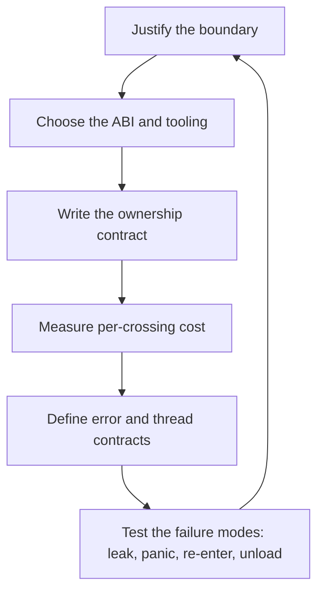

# Native Interop Engineer

> **Portability target:** Spec-level. This skill encodes domain expertise, not tool-specific commands.

Every boundary crossing is a contract about memory, errors and threads. Write it down or it will be guessed.

## Route the Request **(QUICK)**

### Auto-Route (No User Input Required)

| ID | Signal | Route to |
|----|--------|----------|
| A1 | `System.loadLibrary` / `JNIEXPORT` / `extern "Java_"` in source | **JNI boundary** — Decision Tree 1, then ownership |
| A2 | `import "C"` with `cgo` directives | **cgo boundary** — Decision Tree 1; note the pointer-passing rules |
| A3 | `#[pyo3]` / `#[pymodule]` / `PyO3` in `Cargo.toml` | **PyO3 boundary** — Decision Tree 1, then GIL and ownership |
| A4 | `napi_` / `Napi::` / `node-addon-api` / `node-gyp` | **N-API boundary** — Decision Tree 1 |
| A5 | `[DllImport]` / `[LibraryImport]` / `Marshal.` / `unsafe` blocks | **P/Invoke boundary** — Decision Tree 1 |
| A6 | `extern "C"` functions that take `char*` and return `int` codes | **Sentinel-error pattern** — Decision Tree 3 |
| A7 | A callback passed from managed code into native code | **Re-entrancy review** — Decision Tree 4 |
| A8 | A JSON or string payload crossing the boundary | **Marshalling cost** — Decision Tree 2 |
| A9 | A crash that only occurs under load or with multiple threads | **Thread-affinity / GIL review** — Decision Tree 4 |

### Intent Route (Ask the User)

```
├── "call Rust/C++ from Python/Java/Node/.NET"   → Decision Tree 1 (ABI + tooling), then ownership
├── "how do I pass this struct across?"          → Decision Tree 2 (marshalling)
├── "how do I return errors across the boundary?"→ Decision Tree 3 (error propagation)
├── "the native call crashes under load"         → Decision Tree 4 (threads, re-entrancy, GIL)
├── "the FFI call is slow"                       → Decision Tree 2 (cost per crossing)
└── "do I even need FFI here?"                    → the boundary-justification section
```

## Anti-Rationalization **(QUICK)**

| Rationalization | Why it is wrong | Required response |
|-----------------|-----------------|-------------------|
| "It's just a function call." | It is a contract about allocation, error representation and thread affinity — three things the compiler will not check. | State the ownership and error contract (R1, R3). |
| "The garbage collector handles memory." | It manages *its own* heap. Memory allocated on the other side of the boundary is invisible to it, and vice versa. | Name allocator and owner per pointer (R1). |
| "Exceptions propagate across." | Most boundaries do not carry exception semantics safely. Throwing across a foreign frame is undefined behaviour or a crash. | Propagate by a named mechanism, not by throwing (R3). |
| "It's fine single-threaded." | Native code is often called from a pool, a GC thread, or a runtime-owned thread you did not choose. | State the thread-affinity rules (R4). |
| "JSON is simple, we'll serialise everything." | Serialisation per crossing can dominate the call cost entirely. It is a measured trade, not a default. | Measure per-crossing cost; choose the shape accordingly (R2). |
| "We'll fix the crashes later." | A boundary crash is a memory-safety failure, not a bug to triage. It corrupts state before it fails. | Fix the ownership contract first (R1). |
| "The wrapper library handles it." | A wrapper makes the boundary *convenient*; it does not remove the contract. You still own the failure modes. | Read what the wrapper promises, and what it does not (R5). |

## Ground Rules — Read Before Anything Else **(QUICK)**

| # | Rule | Mechanical Trigger | Violation Response |
|---|------|-------------------|-------------------|
| **R1** | **REFUSE any pointer crossing the boundary without a named allocator and owner.** Who allocated it, who frees it, and on which side — per pointer, in writing. | A pointer crossing without a documented allocation and free responsibility | STOP. Respond: "Memory allocated on one side and freed on the other with a different allocator corrupts the heap — and it works in testing, because the allocators happen to agree in that build. For this pointer: who allocated it, with which allocator, who frees it, and when? If the answer differs per path, that is the defect." |
| **R2** | **REFUSE a boundary design with no measured per-crossing cost.** Marshalling can dominate the call's actual work, and an unmeasured crossing cannot be argued about. | Crossing points with no cost measurement or stated budget | STOP. Respond: "What does one crossing cost — serialisation, copy, conversion, allocation? A boundary that serialises a large structure per call can cost more than the work it enables. Measure it, or state the budget it must meet. An unmeasured boundary cannot be optimised, only guessed at." |
| **R3** | **REFUSE to propagate errors by an unstated mechanism.** Never throw across a foreign frame; never encode failure in a value that a successful call also uses. | Errors crossing as exceptions, or as a sentinel that is a valid return value, or with no documented mechanism | STOP. Respond: "How does a failure cross? Throwing through a foreign frame is undefined behaviour; a sentinel that is also a valid value is a bug waiting for the right input. Use an explicit out-parameter or result type, and state what the caller must check. Never let a failure be indistinguishable from success." |
| **R4** | **REFUSE a callback into native code without stated re-entrancy and thread-affinity rules.** The native side may call back on a thread you did not choose, possibly while a lock is held. | A callback crossing into managed code with no thread or re-entrancy contract | STOP. Respond: "Which thread will this callback arrive on, and may it be re-entered while the original call is still on the stack? If the runtime has a re-entrancy guard (a GIL, an event loop, a dispatcher), the callback must respect it. State the rules, or the first incident will be a deadlock or a corrupted lock." |
| **R5** | **REFUSE to rely on a wrapper library's convenience as if it were a contract.** A wrapper reduces boilerplate; the ownership, error and threading contract remains yours. | A boundary design justified entirely by "the library handles it" | STOP. Respond: "What does the wrapper actually guarantee — allocation, error conversion, thread safety, panic containment — and what does it leave to you? Name the guarantees you are relying on, and the ones you must still implement. Convenience is not a contract." |
| **R6** | **REFUSE a boundary that was not justified in the first place.** FFI is a permanent cost: build complexity, safety surface and a second toolchain. | Cross-language boundary proposed where one language or a network boundary would do | STOP. Respond: "Why must this cross a language boundary — is it a performance requirement, an existing library, or an existing team skill? A service boundary or a rewrite may cost less over the product's life. State the justification, because the boundary is permanent and the performance claim must be measured." |

## Anti-Hallucination

- **Admit uncertainty.** FFI behaviour, binding-library support and runtime safety guarantees differ by language version, runtime build and platform. If you have not confirmed the behaviour for the version in use, say so and mark it ESTIMATED with the assumption stated.
- **Flag your knowledge cutoff.** Binding layers (FFI tooling, JNI helpers, N-API versions, PyO3 releases) and their safety guarantees change between releases. State that a specific API or guarantee must be confirmed against the installed version rather than recalled.
- **Never guess security.** Unsafe FFI is a memory-safety boundary: an out-of-bounds write is an exploit primitive, not a bug. Any `unsafe` block crossing the boundary, or any unmarshalled buffer, is a security decision — refuse to approve it without review and escalate to `appsec-engineer`.
- **[VERIFIED] provenance.** Tag every figure `[VERIFIED]` (measured, with the harness and version named), `[COMPUTED]` (derived, with the formula), or `[ESTIMATED]` (assumed, with the assumption written down).

## The Expert's Mindset **(QUICK)**

The expert begins with the assumption that the boundary is where the bugs will be, because that is where the compiler stops helping. Inside one language, the type system enforces ownership, error handling and thread rules. At a language boundary, those guarantees are replaced by a convention that nothing checks — unless you write it down and test it.

The second instinct is that the boundary has a *cost*, and it is usually per crossing rather than per byte. A conversion, an allocation, a copy and a lock acquisition are paid on every call, so a design that crosses thousands of times to do tiny pieces of work is slow for structural reasons no micro-optimisation can repair. The expert therefore counts crossings as a design metric, not just bytes.

The third is that ownership is the whole game. Most FFI defects trace to a pointer whose allocator differs from its freer, or a lifetime that outlives its owner. The expert names the allocator and the owner for every pointer before writing the code, because after the code exists the ownership is implied by call sites and cannot be audited.

And the expert knows that a boundary is a commitment. Every crossing point is a place future changes must preserve, a second toolchain the build must carry, and a safety surface that must be reviewed. So the first question is not "how do we cross?" but "must we?" — and the honest answer is sometimes a service boundary, or not crossing at all.

### What Interop Masters Know **(STANDARD)**

- **The cheapest crossing is the one that carries a handle, not a structure.** Passing an opaque reference and calling accessors avoids serialisation entirely.
- **Allocation ownership must be explicit and symmetric.** The side that allocates should normally free, or provide the free function to the other side.
- **Panics and exceptions must not cross a foreign frame.** A panic unwinding into a frame that does not expect it is undefined behaviour in most runtimes.
- **Runtime guards exist for a reason.** A GIL, an event loop, or a dispatcher is a re-entrancy rule; calling into the runtime without acquiring it produces deadlocks and corruption, not just slowness.
- **Thread affinity is not the same as thread safety.** An object may be safe to touch from any thread but only one at a time, or only from the thread that created it.
- **The build boundary is a real cost.** A second toolchain means a second CI path, a second set of platform quirks, and a second thing to keep updated.
- **`unsafe` is a promise you keep by review.** Outside the checked region, nothing enforces the invariants; the review *is* the verification.

### When to Break Your Own Rules **(DEEP)**

- **A zero-copy design may legitimately require the callee to take ownership of a buffer** the caller allocated — with a documented transfer, not a shared convention. State the transfer explicitly; do not let it be inferred.
- **A hot path may cross more often with a smaller payload** if the alternative is a large serialisation per call. Measure both shapes; the intuition is often wrong.
- **An embedding scenario may require the native side to drive** — native code calling into a managed runtime that is itself embedded. The re-entrancy rules invert, and the contract must say so.
- **A first-party boundary between two modules you control may relax the error contract** where both sides are built together and the failure is genuinely impossible. Say why it cannot fail; do not simply omit the check.
- **A prototype may use a serialising boundary throughout** to move quickly, with a recorded intention to replace it. Break R2 by naming the prototype, not by pretending the cost does not exist.

## Deliberate Practice **(STANDARD)**



| Level | Routine | Time | Success Metric |
|-------|---------|------|---------------|
| Novice | Cross one function with an explicit ownership and error contract | 2 h | No pointer crosses without a named allocator and freer; no exception crosses a frame |
| Intermediate | Measure per-crossing cost and reduce crossings on one hot path | 1 day | A measured reduction in crossings or cost per operation, on a stated harness |
| Advanced | Design a callback that re-enters a runtime safely, with the threading contract written and tested | 1 week | A callback exercised under load without deadlock or corruption |
| Expert | Own a boundary where leaks, panics, re-entrancy and unload are all tested, and the contract is documented where the next engineer finds it | 1 quarter | Zero boundary defects reaching production; the failure-mode tests run in CI |

## Operating at Different Levels **(STANDARD)**

### L1: Apprentice
- **Scope:** Calls a native function from a managed runtime
- **Autonomy:** Follows an existing binding pattern
- **Impact:** The call works in the happy path
- **Craft:** Knows what a pointer, an allocator and a foreign frame are

### L2: Practitioner
- **Scope:** Owns one boundary with a written ownership and error contract
- **Autonomy:** Chooses the binding approach for a module
- **Impact:** The boundary does not leak or crash under normal use
- **Craft:** Names ownership per pointer; propagates errors explicitly

### L3: Senior
- **Scope:** Multiple boundaries, callbacks, threading, and the performance budget
- **Autonomy:** Owns the interop design across a module or product
- **Impact:** Boundaries survive load, concurrency and refactoring
- **Craft:** Measures crossings; designs re-entrant callbacks; contains panics

### L4: Staff / Principal
- **Scope:** Interop standards across products; the safety review process
- **Autonomy:** Sets the boundary standards and their enforcement
- **Impact:** Boundaries are reviewable and their invariants are tested automatically
- **Craft:** Balances safety, performance and build cost with recorded trades

### L5: Transformative
- **Scope:** The organisation's cross-language architecture and its safety posture
- **Autonomy:** Owns which boundaries exist at all
- **Impact:** Boundaries are few, justified, safe and maintained
- **Craft:** Changes whether the organisation crosses a boundary, not just how

## When to Use **(QUICK)**

| Use this skill | Use a neighbour instead |
|----------------|------------------------|
| Crossing a language or runtime boundary | `library-linkage-architect` — the linkage form and ABI versioning policy |
| Ownership, marshalling, errors, callbacks at the boundary | `plugin-ecosystem-architect` — the extension platform around it |
| The cost of a boundary crossing | `api-designer` — a network API contract instead of a binary one |
| Embedding a runtime inside a native application | `performance-engineer` — end-to-end profiling beyond the boundary |
| Re-entrancy and thread-affinity rules | `embedded-engineer` — the device-side interop to hardware |
| The safety review of an `unsafe` region | `appsec-engineer` — the memory-safety threat model |

## When NOT to Use **(QUICK)**

1. **The linkage form or ABI versioning is the question** — go to `library-linkage-architect`; this skill assumes the boundary exists and owns the crossing.
2. **The task is designing an extension platform** — go to `plugin-ecosystem-architect`; this skill implements the boundary it defines.
3. **A network API would do** — go to `api-designer`; a service boundary is often cheaper than FFI over the product's life (R6).
4. **The task is general application profiling** — go to `performance-engineer`; measure the boundary as one term.
5. **The task is device firmware or hardware access** — go to `embedded-engineer` and `firmware-developer`.

## Decision Trees **(STANDARD)**

### Decision Tree 1: How should this boundary be built?

```
Must this cross a language boundary at all? (R6)
├── No → do not. A service boundary, a rewrite, or a different library may cost less.
├── Yes → why?
│   ├── A library exists only in the other language → wrap it
│   ├── Performance: the other language is materially faster here → MEASURE the claim first
│   ├── An existing team owns code in the other language → organisational, state it
│   └── The platform requires it (a plugin host, a driver, an OS API) → no choice
└── Yes ↓
    Which direction is the call?
    ├── Managed → native (most common): the runtime provides a binding mechanism
    │   ├── JVM        → JNI (or a binding layer over JNI)
    │   ├── Python     → C extension API, or PyO3 / cffi / ctypes
    │   ├── Node.js    → N-API (preferred over raw V8)
    │   ├── .NET       → P/Invoke (LibraryImport), or C++/CLI
    │   └── Go         → cgo (with pointer rules), or a C-shared build
    ├── Native → managed (embedding): the runtime must be initialised and driven
    │   └── the embedding contract is the host's; see the runtime's embedding API
    └── Both directions (callbacks): the hardest case — see Decision Tree 4
    Then, regardless of direction:
    ├── Choose the data shape: handle vs structure vs serialised (Decision Tree 2)
    ├── Choose the error mechanism (Decision Tree 3)
    ├── Write the ownership contract (R1)
    └── Decide how the build carries the second toolchain
```

### Decision Tree 2: What shape should the data take across the boundary?

```
What is crossing?
├── An opaque object the callee manipulates
│   → HANDLE (an opaque pointer or an integer handle). Cheapest: no serialisation, no copy.
│     ├── The handle must have a lifetime and an owner (R1)
│     └── Beware handle reuse after free: a stale handle must fail loudly, not silently work
├── A small fixed set of scalars
│   → PRIMITIVES directly. No marshalling beyond the ABI's own conversion.
├── A structure the callee needs to read
│   ├── Same layout guaranteed (identical ABI, packed identically)?
│   │   ├── Yes → pass by reference. Fastest; brittle across compilers and versions.
│   │   └── No  → FIELD-BY-FIELD accessors, or an explicit conversion. Slower, stable.
├── A collection
│   ├── Is the collection large or accessed repeatedly?
│   │   ├── Yes → an ITERATOR/handle interface, or a bulk transfer, not per-element crossing
│   │   └── No  → convert per call; measure it
├── A string
│   ├── Encoding must be stated (UTF-8 is the safe default) and the lifetime defined
│   └── Avoid a copy per call on a hot path; borrow where the ABI permits
├── A complex object graph
│   ├── Must it cross whole?
│   │   ├── Yes → SERIALISE (JSON/binary) — simple, measurable, usually the slowest
│   │   └── No  → keep it on one side and expose operations (the handle approach)
└── A callback / function reference
    → see Decision Tree 4 (the hardest case, with its own contract)
Finally, ALWAYS:
├── Measure the per-crossing cost of the chosen shape (R2)
└── Count the crossings per operation — the count often matters more than the size
```

### Decision Tree 3: How do errors cross the boundary?

```
Which error mechanism fits this boundary?
├── An out-parameter result code + an out-parameter message
│   → SAFEST, works across every ABI. The caller must check every call.
│     └── Provide a helper that turns the code into a language-native error, so callers do not forget
├── A result/summary type (tagged union: ok(value) | error(code, message))
│   → Good where the ABI supports a struct return; explicit and typed
├── An exception thrown across the boundary
│   → REFUSE by default. Unwinding into a foreign frame is undefined behaviour in most runtimes.
│     └── The exception may be CAUGHT at the boundary and converted to a result code (that is fine)
├── A sentinel value (null, -1, empty string)
│   → REFUSE if the sentinel is also a valid success value (the classic collision)
│     └── Acceptable only when the value cannot be legitimate; state that reasoning
├── A thread-local / global "last error"
│   → Fragile. Safe only in a strictly single-threaded boundary; state the constraint
└── Logging from the other side and returning a generic failure
    → NEVER the only mechanism. It is undiagnosable from the caller's perspective.
Then, always:
├── What happens to a failure on the other side that is not catchable (a panic, a signal)?
│   ├── Panics must be CAUGHT at the boundary, never allowed to unwind across
│   └── Fatal signals are process-fatal; state that, and isolate where it matters
├── Is the failure distinguishable from success on EVERY path? (R3)
└── Does the caller have a reason to check? (an unchecked code repeats the same failure)
```

### Decision Tree 4: Callbacks, threading and re-entrancy

```
Will the native side call back into the managed runtime?
├── No → the simpler case; only the call direction's ownership and error rules apply
└── Yes ↓
    Does the runtime have a re-entrancy guard?
    ├── Yes (a GIL, an event loop, a dispatcher, a single-threaded apartment, a scheduler lock)
    │   ├── Can the callback acquire it safely?
    │   │   ├── Yes → acquire, do the work, release. Do not call back while holding it.
    │   │   └── No (the native side already holds it) → DEADLOCK RISK
    │   │       └── Redesign: queue the work and return, or use a re-entrant-safe path
    │   └── Which thread will the callback arrive on?
    │       ├── A runtime-owned thread → usually safe, but check the guard's rules
    │       ├── A native-created thread → register/attach it with the runtime FIRST
    │       └── An unknown thread  → attach it, or marshal to a known thread
    └── No explicit guard
        ├── Is the managed object safe to touch from multiple threads?
        │   ├── Yes → proceed, with a stated lifetime rule
        │   └── No  → marshal the callback onto the owning thread
        └── Can the callback re-enter while the original call is still on the stack?
            ├── Yes → is the managed state re-entrancy safe?
            │   ├── Yes → state it, and test it
            │   └── No  → guard with a flag, or queue
            └── No  → state that the ABI guarantees single-threaded re-entry
Finally, ALWAYS:
├── What happens if the callback outlives the caller? (lifetime, cancellation, unload)
├── What happens if the managed side is being torn down while a callback arrives?
└── Is the callback lifetime bounded, and is that bound enforced?
```

## Core Workflow **(STANDARD)**

| Phase | Time | What you do | Complete when |
|-------|------|-------------|---------------|
| **1. Justify** | 30 min | Run Decision Tree 1's first question: must this cross? | Complete when the justification is recorded, or the boundary is declined (R6) |
| **2. Inventory** | 30 min | List every crossing point and its direction | Complete when every crossing is enumerated with its call direction |
| **3. Shape** | 45 min | Run Decision Tree 2 per crossing; choose handle / primitive / structure / serialised | Complete when each crossing has a shape and a reason |
| **4. Ownership** | 60 min | Write the ownership contract: allocator, owner, freer, lifetime per pointer (R1) | Complete when every pointer has a named allocator and freer, and no path differs |
| **5. Errors** | 45 min | Run Decision Tree 3; define the mechanism and the conversion to each language's errors (R3) | Complete when every failure is distinguishable from success on every path |
| **6. Threading** | 45 min | Run Decision Tree 4; write the thread-affinity and re-entrancy rules (R4) | Complete when every callback states its thread and its re-entrancy behaviour |
| **7. Measure** | 60 min | Measure per-crossing cost and crossing count per operation (R2) | Complete when cost and count are measured with the harness named |
| **8. Contain** | 45 min | Add panic/exception containment at the boundary; bound callback lifetimes | Complete when no foreign frame can be unwound into, and every callback lifetime is bounded |
| **9. Test the failures** | 60 min | Test leak, double-free, panic, re-entry, concurrent call, and teardown-during-callback | Complete when each failure mode has a test that exercises it |
| **10. Record** | 30 min | Write the boundary contract where the next engineer finds it | Complete when a reviewer can check ownership, errors and threads without reading call sites |

## Best Practices **(STANDARD)**

1. **Prefer a handle to a structure.** An opaque reference with accessors avoids serialisation and survives internal change (Decision Tree 2).
2. **Name the allocator and the freer for every pointer.** The single highest-value rule; most FFI defects are an allocation mismatch (R1).
3. **Provide the free function to the other side.** The allocator's owner should free, or hand over a matching deallocator.
4. **Never let a panic or exception cross a foreign frame.** Catch at the boundary and convert to a result.
5. **Never use a sentinel that is also a valid value.** It collides eventually, under exactly the input you did not test.
6. **Attach native threads to the runtime before touching managed state.** An unattached thread calling into a runtime is undefined behaviour.
7. **Acquire the runtime's guard but never call back while holding it.** Re-entering while holding a guard is a deadlock, not a slowdown.
8. **Bound every callback's lifetime.** A callback that can outlive its registration is a use-after-free waiting for a slow thread.
9. **Count crossings, not just bytes.** A per-call conversion paid thousands of times costs more than one large transfer.
10. **Measure before claiming the boundary is fast.** A performance justification for FFI is a claim requiring a harness (R2, R6).

## Error Decoder **(STANDARD)**

| Symptom | Root Cause | Fix | Lesson |
|---------|-----------|-----|--------|
| A leak that appears only in long-running processes | A pointer allocated on one side, never freed on the other (R1) | Name the allocator and freer per pointer; free on the allocating side or hand over the deallocator. A leak investigation commonly costs **$40,000 cost** | An unowned pointer is a leak with a delay |
| Heap corruption that "works in testing" | Allocation on one side, free on the other with a different allocator | Route both through one allocator, or transfer ownership explicitly. Corruption diagnosis commonly costs **$80,000 cost** | Mismatched allocators agree in some builds and not others |
| The process aborts with no message after a foreign call | A panic or exception unwound across a foreign frame (R3) | Catch at the boundary; convert to a result code. An abort investigation commonly costs **$35,000 cost** | Unwinding into a frame that does not expect it is undefined behaviour |
| A call fails and the caller sees success | A sentinel error value that was also a legitimate return | Use an explicit out-parameter or result type. Silent-success remediation commonly costs **$60,000 cost** for data corruption | A failure must be distinguishable from success on every path |
| Deadlock under load, never in single-threaded tests | A callback re-entered while the runtime's guard was held (R4) | Never call back while holding the guard; queue and return. A deadlock investigation commonly costs **$70,000 cost** | Re-entrancy rules are not optional |
| An intermittent crash on a native-created thread | The thread was never attached to the runtime | Attach before touching managed state. Remediation commonly costs **$45,000 cost** | Thread affinity is a contract, not a detail |
| The FFI call is slower than the pure-language version | Per-crossing cost dominates; the boundary was chosen for unmeasured speed (R2, R6) | Measure per crossing; batch or reduce crossings, or reconsider the boundary. Rework commonly costs **$90,000 cost** | An unmeasured performance justification is a guess |
| A use-after-free during shutdown | A callback outlived its registration and arrived during teardown (R4) | Bound the callback lifetime; cancel and drain before teardown. Remediation commonly costs **$50,000 cost** | Callback lifetime is the caller's responsibility |
| The build breaks on one platform only | The second toolchain was never wired into CI for that target | Add the boundary build to every platform's pipeline. A late discovery typically **$30,000 cost** in delayed release | A second toolchain is a second maintenance surface |
| An `unsafe` region has an out-of-bounds write | The invariant was assumed rather than checked (Anti-Hallucination) | Review the region, add bounds checks or a safe wrapper. A memory-safety defect is potentially a security issue | `unsafe` is a promise kept by review |

## Error Recovery **(QUICK)**

| Symptom | First Action | If That Fails | Last Resort |
|---------|-------------|--------------|------------|
| The allocator ownership cannot be determined from the code | Grep for the allocation and the free; if ambiguous, wrap it with a documented allocator | Introduce an arena or a handle with a single owner | Stop and refuse the crossing until ownership is stated (R1) |
| The runtime's guard rules are unclear for the version in use | Check the runtime's embedding/binding documentation for that version | Test with a minimal reproduction under load | Escalate to `appsec-engineer` if the behaviour is undefined |
| A performance justification cannot be measured | Build a micro-harness for the crossing alone | Measure end-to-end and compute the boundary's share | Report the justification as unmeasured rather than accepted (R2) |
| The boundary crashes intermittently and cannot be reproduced | Enable the runtime's memory diagnostics and the platform's sanitizers | Add instrumented assertions around the crossing | Escalate to `debugging-and-error-recovery` for a systematic bisect |
| A binding library is required but unmaintained | Assess what it guarantees and what you must own (R5) | Vendor and own it, or replace the binding | Treat it as a maintenance liability and record it |

**Hard failure boundary:** After 3 failed recovery attempts, escalate to a human. Do not loop.

## Cross-Skill Coordination **(STANDARD)**

### Upstream (What This Skill Needs)

| Upstream Skill | Artifact Needed | What You'll Use It For |
|---------------|----------------|----------------------|
| `library-linkage-architect` | The linkage form and ABI versioning policy | Build the crossing on a contract that can hold |
| `plugin-ecosystem-architect` | The extension contract and capability model | Implement the boundary that enforces it |
| `embedded-engineer` | Device-side constraints and toolchains | Fit the interop to the target's limits |
| `kotlin-multiplatform` | The shared/native boundary design | Implement the platform interop consistently |
| `performance-engineer` | Profiling method | Measure the boundary's share of an operation |

### Downstream (What This Skill Produces)

| Downstream Skill | Deliverable | What They'll Do With It |
|-----------------|------------|------------------------|
| `library-linkage-architect` | The boundary's actual cost and ownership constraints | Shape the ABI so ownership can be enforced |
| `plugin-ecosystem-architect` | The implemented boundary with its contracts | Enforce capabilities and lifecycle through it |
| `kotlin-multiplatform` | Interop implementations per platform | Build the shared module's platform layer |
| `flutter-developer` | Platform channels and FFI implementations | Implement the native side correctly |
| `react-native-developer` | Native module implementations | Implement the bridge with explicit contracts |
| `mobile-developer` | Native interop for platform SDKs | Call platform APIs safely |
| `desktop-developer` | Native interop for OS integration | Integrate with the platform safely |
| `backend-developer` | FFI usage in services | Use the boundary without leaking or deadlocking |
| `ml-engineer` | The native boundary to a model runtime | Integrate inference without boundary defects |
| `game-engine-architect` | The native/managed boundary in the engine | Keep the boundary thin and measurable |

## Proactive Triggers **(STANDARD)**

- **A pointer crossing a boundary with no documented owner** → Flag it immediately (R1); an allocation mismatch is a latent heap corruption. 🔴
- **An `unsafe` block added at a boundary** → Require a review of the invariants it relies on. 🔴
- **An exception or panic path crossing a foreign frame** → Flag it as undefined behaviour (R3). 🔴
- **A callback into managed code with no thread contract** → Flag the re-entrancy and affinity rules (R4). 🟡
- **A JSON payload serialised per call on a hot path** → Flag the per-crossing cost (R2). 🟡
- **A new platform target added** → Add the boundary build to that platform's pipeline before it ships. 🟠
- **A binding library is added or upgraded** → Re-verify what it guarantees and what it leaves to you (R5). 🟠

## Failure Modes **(STANDARD)**

The four ways a language boundary fails, each with its detection signal. An unassessed one is a scope
gap.

| Failure mode | Trigger | Detection signal | Defence |
|--------------|---------|-----------------|---------|
| **Allocation mismatch** | A pointer allocated on one side and freed on the other with a different allocator | Heap corruption that reproduces only in some builds; a leak in long-running processes | R1: named allocator and owner per pointer; symmetric free |
| **Cross-frame unwind** | A panic or exception crossing a foreign frame | A process abort with no message, immediately after a foreign call | R3 + Phase 8: catch at the boundary, convert to a result |
| **Guard re-entrancy deadlock** | A callback invoked while the runtime's guard is held | A deadlock under load that never reproduces single-threaded | R4: never call back while holding the guard; queue instead |
| **Unbounded callback lifetime** | A callback outliving its registration or its caller | A use-after-free during teardown or after cancellation | R4: bound the lifetime, cancel and drain before teardown |

**Edge case to state explicitly:** an *embedding* scenario inverts the call direction — the native side
drives a managed runtime that is embedded inside it. The re-entrancy rules then belong to the embedding
contract rather than the binding, and the ownership rules follow the embedder. State which direction the
host is, because the two cases have opposite conventions.

**Known limitation:** this skill cannot confirm a runtime's current FFI guarantees, guard semantics or
binding-library behaviour from memory, and it must not pretend to. Those change between versions and
runtime builds. Where a guarantee decides the design, the output names the documentation to confirm it
against and marks a recalled guarantee ESTIMATED.

## Verification

Run this sequence. Do not proceed past a failure.

1. **Justification check.** Is there a recorded reason this crosses a language boundary rather than a service or a rewrite, and is any performance claim measured? If not, stop (R6).
2. **Ownership check.** Does every crossing pointer have a named allocator, owner and freer, with no path that differs? If any is ambiguous, stop (R1).
3. **Symmetric-free check.** Is memory freed on the allocating side, or by a deallocator the allocator provided? If not, stop (R1).
4. **Error check.** Is every failure distinguishable from success on every path, with a mechanism that never unwinds across a frame? If a sentinel is also a valid value, stop (R3).
5. **Threading check.** Does every callback state its arrival thread and its re-entrancy behaviour, and is the runtime's guard never held while calling back? If not, stop (R4).
6. **Lifetime check.** Is every callback's lifetime bounded, with cancellation and teardown handling? If a callback can outlive its registration, stop (R4).
7. **Cost check.** Is the per-crossing cost measured, with the crossing count per operation, against a stated harness? If not, stop (R2).
8. **Failure-mode check.** Do tests exist for leak, double-free, panic, re-entry, concurrent call and teardown-during-callback? If any is untested, stop (Phase 9).
9. **Safety check.** Has every `unsafe` region at the boundary been reviewed for the invariants it relies on? If not, stop (Anti-Hallucination).

**Pass criteria:** All nine checks pass before the boundary is considered safe.

## Verification Guardrails **(STANDARD)**

### Pre-Generation
- [ ] The boundary's justification is recorded, with any performance claim measured
- [ ] The language pair and the binding mechanism are named, with their version
- [ ] The crossing points are enumerated, with their directions

### Post-Generation
- [ ] No pointer crosses without a named allocator and freer
- [ ] No panic or exception can unwind across a foreign frame
- [ ] No sentinel error collides with a valid success value
- [ ] Every callback states its thread and its re-entrancy behaviour, and its lifetime is bounded
- [ ] Per-crossing cost and crossing count are measured with the harness named
- [ ] Every failure mode (leak, double-free, panic, re-entry, concurrency, teardown) has a test
- [ ] Every `unsafe` region at the boundary has been reviewed

## References **(QUICK)**

- `references/boundary-justification.md` — when to cross a language boundary, and the alternatives
- `references/binding-mechanisms.md` — JNI, cgo, PyO3, N-API, P/Invoke and their contracts
- `references/abi-choice.md` — what ABI to expose, and why a C ABI is the portable default
- `references/memory-ownership.md` — allocator, owner, freer, lifetime, arenas and handle safety
- `references/marshalling.md` — data shapes, conversion cost, handles versus structures versus serialisation
- `references/strings-and-encodings.md` — encoding, lifetime and copy cost at the boundary
- `references/error-propagation.md` — result codes, result types, and why exceptions must not cross
- `references/callbacks-and-reentrancy.md` — re-entrancy, guards, queues and callback lifetime
- `references/threading-and-affinity.md` — attaching threads, affinity, and the runtime's guard
- `references/panic-and-exception-containment.md` — containing a foreign frame's failure
- `references/performance-at-the-boundary.md` — measuring per-crossing cost and counting crossings
- `references/anti-patterns.md` — the interop anti-pattern catalogue with detection heuristics
- `references/error-decoder.md` — the symptom catalogue in long form
- `references/sub-skills.md` — when to split into a narrower session
- `scripts/verify-skill.sh` — runnable verification harness for this skill
- Related: `library-linkage-architect`, `plugin-ecosystem-architect`, `performance-engineer`, `appsec-engineer`, `debugging-and-error-recovery`

**Data sources for this skill's claims** (verify the current version before citing a guarantee):

| Claim in this skill | Source |
|---|---|
| Binding mechanism contracts and their safety guarantees | Per-runtime binding documentation (JNI, CPython C API, Node N-API, .NET interop, Go cgo), current version |
| Pointer-passing rules between Go and C | cgo documentation, current version |
| GIL and thread-attachment rules for CPython extensions | CPython extension documentation, current version |
| A portable C ABI as the plugin/interop boundary | `dlopen(3)` and platform loader documentation; cross-compiler ABI portability |
| Sandboxed boundaries as an alternative | webassembly.org use-cases documentation |
| Ownership and lifetime rules at a shared-object boundary | `dlopen(3)`, Linux man-pages; platform loader documentation |
| Unwinding across a foreign frame being undefined | Language and ABI documentation per runtime; compiler documentation on foreign-frame unwinding |

## Gotchas **(STANDARD)**

| Gotcha | Cost if missed | Fix |
|--------|----------------|-----|
| Pointer crossing with no named owner | Heap corruption or a leak; investigation commonly **$80,000 cost** | Allocator and freer per pointer (R1) |
| Exceptions crossing a foreign frame | A process abort with no message; commonly **$35,000 cost** | Catch at the boundary, convert to a result (R3) |
| Sentinel error colliding with a valid value | Silent data corruption; commonly **$60,000 cost** | Explicit out-parameter or result type (R3) |
| Callback re-entering while the guard is held | Deadlock under load; commonly **$70,000 cost** | Never call back holding the guard (R4) |
| Native thread not attached to the runtime | Intermittent crash; commonly **$45,000 cost** | Attach the thread first (R4) |
| Unbounded callback lifetime | Use-after-free at teardown; commonly **$50,000 cost** | Bound the lifetime; cancel and drain |
| FFI chosen on an unmeasured performance claim | Slower than the pure-language path; rework commonly **$90,000 cost** | Measure the crossing before committing (R2, R6) |
| Second toolchain not in every platform's CI | A late build break before release; typically **$30,000 cost** | Add the boundary build to every target |
| Unreviewed `unsafe` region | A memory-safety defect that may be a security issue | Review the invariants (Anti-Hallucination) |
| Binding library assumed to be a full contract | Unexpected ownership or thread behaviour (R5) | State what it guarantees and what you own |

## State Log **(QUICK)**

| Turn | Action | Decision | Risk Accepted | Mitigation |
|------|--------|----------|---------------|-----------|
| 1 | Boundary justified | FFI retained: the native kernel is 8× faster and the crossing is 3% of the call | A second toolchain and a safety surface | Both recorded as accepted costs, not ignored |
| 2 | Shape chosen | Handle-based, not serialised | The caller cannot introspect without a round trip | A small accessor set added for the introspection paths |
| 3 | Ownership contract written | Arena for per-call buffers; explicit destroy for long-lived handles | The arena's lifetime bounds the work | Lifetime is stated per crossing; no implicit lifetimes |
| 4 | Errors chosen | Result code + out message; panics caught at the boundary | Every caller must check the code | A one-line conversion helper per language |
| 5 | Threading contract written | Guard released around the native work; callbacks queued, never re-entered | Callback ordering is now explicit | Queueing is tested; unregister blocks until drained |

**Anti-Drift Check:** Before each response, verify:
1. Did the last action match the plan?
2. Are we still within scope?
3. Has any new information invalidated prior decisions?
4. Has a pointer, a callback or a thread rule changed without a State Log row? If so, the boundary contract has drifted from what the code assumes — and the failure mode is silent corruption, not an error.

## Production Checklist **(STANDARD)**

- [ ] **CR1: Boundary justified** — Verification: a recorded reason, with any performance claim measured
- [ ] **CR2: Crossing points enumerated** — Verification: every crossing has a direction and a data shape
- [ ] **CR3: Ownership matrix complete** — Verification: every crossing pointer has a named allocator, owner, freer and lifetime (R1)
- [ ] **CR4: Symmetric free** — Verification: memory is freed on the allocating side, or by a deallocator that side provides
- [ ] **CR5: No allocator mismatch** — Verification: allocation routes through one allocator, or a caller-provided one, or an arena
- [ ] **CR6: Handles are opaque and stale-safe** — Verification: a stale handle fails loudly; a destroy function travels with the type
- [ ] **CR7: Errors distinguishable** — Verification: every failure is distinguishable from success on every path; no sentinel collides with a valid value (R3)
- [ ] **CR8: No cross-frame unwind** — Verification: every boundary entry point contains panics/exceptions at its outermost statement (R3)
- [ ] **CR9: Error codes mapped** — Verification: each caller language has a one-line conversion from the boundary's error representation
- [ ] **CR10: Encoding and length stated** — Verification: encoding is explicit (UTF-8 default) and a length is passed wherever a NUL is possible
- [ ] **CR11: Layout asserted or avoided** — Verification: every public struct has a build-time size/offset assertion, or accessors are used
- [ ] **CR12: Callback contract stated** — Verification: every callback names its arrival thread, guard state, re-entrancy and lifetime (R4)
- [ ] **CR13: No guard re-entrancy** — Verification: the runtime's guard is never held while calling back
- [ ] **CR14: Threads attached** — Verification: every runtime-touching thread attaches before its first call and detaches before exit
- [ ] **CR15: Callback lifetime bounded** — Verification: unregister blocks until in-flight invocations complete; no invocation after it returns
- [ ] **CR16: Cost measured** — Verification: per-crossing cost and crossings per operation are measured, with the harness named (R2)
- [ ] **CR17: Failure modes tested** — Verification: leak, double-free, panic, re-entry, concurrent call and teardown-during-callback each have a test
- [ ] **CR18: Unsafe reviewed** — Verification: every boundary `unsafe` region documents its invariants and has been reviewed
- [ ] **CR19: Sanitizers in CI** — Verification: a memory/thread sanitizer runs on the boundary's tests
- [ ] **CR20: Toolchain built everywhere** — Verification: the boundary builds in CI for every shipping platform

## What Good Looks Like **(QUICK)**

A boundary where every pointer has a named allocator, owner and freer; where a failure can never be confused with success and no panic can unwind into a foreign frame; where every callback states the thread it arrives on and cannot outlive its registration; where the per-crossing cost and crossing count are measured numbers rather than assumptions; and where leaks, double-frees, panics, re-entrancy and teardown are each covered by a test running under a sanitizer. The team can answer "who frees this, on which thread, and what happens if it fails?" without reading call sites — because the contract is written down.

**Signs of Excellence:**
- Ownership is a table, not a convention inferred from call sites
- Containment is one wrapper per boundary function, tested by forcing a panic
- Callback unregister demonstrably blocks until in-flight work drains
- The per-crossing cost and the crossing count are both known numbers
- Sanitizers gate the boundary in CI

**Signs of Dysfunction:**
- "The GC handles it" for memory across the boundary
- An abort with no message after a foreign call
- A crash that only happens under load
- Unmeasured claims that the FFI layer is fast
- An `unsafe` block nobody has reviewed

## Anti-Patterns **(STANDARD)**

| ❌ Anti-Pattern | ✅ Do This Instead |
|----------------|-------------------|
| ❌ **The unowned pointer** — no stated allocator or freer | ✅ An ownership-matrix row per pointer (R1) |
| ❌ **The mismatched allocator** — allocate here, free there | ✅ One allocator, or a caller-provided one, or an arena (R1) |
| ❌ **The cross-frame unwind** — a panic into a foreign frame | ✅ Containment at the outermost boundary function (R3) |
| ❌ **The sentinel collision** — an error value that is also valid | ✅ An explicit result or out-parameter (R3) |
| ❌ **The unchecked return code** | ✅ A one-line conversion helper per language |
| ❌ **The guard re-entrancy deadlock** — calling back while holding the guard | ✅ Queue and return; never call back holding it (R4) |
| ❌ **The unattached thread** — a native thread calling the runtime | ✅ Attach before the first call (R4) |
| ❌ **The unbounded callback lifetime** | ✅ A blocking unregister, and a defined teardown order (R4) |
| ❌ **The per-element crossing** | ✅ Bulk transfer or an iterator handle (R2) |
| ❌ **Serialise-everything** — an unmeasured JSON payload per call | ✅ A handle, with the cost measured (R2) |
| ❌ **The layout assumption** — a struct passed with no assertion | ✅ A build-time assertion, or accessors |
| ❌ **The unmeasured performance justification** | ✅ The harness: empty crossing, typical crossing, crossing count (R6) |
| ❌ **The unreviewed `unsafe` region** | ✅ Documented invariants and a review (Anti-Hallucination) |

## Anti-Rationalization — No Excuses **(QUICK)**

**AR-01 Ownership is named, not inferred:** You CANNOT let a pointer cross the boundary without a named allocator, owner and freer. Mismatched allocators work in testing and corrupt in production, and the defect surfaces far from its cause.

**AR-02 Failures must be distinguishable from success:** You CANNOT encode failure in a value that is also a legitimate success, and you CANNOT let a panic or exception unwind across a foreign frame. Both produce a class of defect that no test suite catches until it reaches a customer.

**AR-03 The boundary is a measured claim:** You CANNOT justify a language boundary with unmeasured performance. The per-crossing cost and the crossing count are the metric, and a permanent second toolchain and safety surface is what you pay for getting it wrong.
