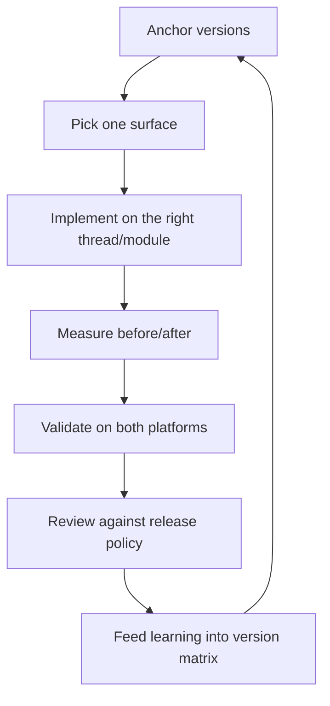

# React Native Developer

> **Portability target:** Spec-level (runs on Claude Code, Copilot CLI, Gemini CLI, Codex, Cursor). No vendor-specific frontmatter fields.
<!-- QUICK: 30s -->

## <!-- DEEP: 5+min --> RESEARCH_PREREQUISITE — Execute Before Any Output

**This is a HARD GATE. Do not produce ANY output, code, strategy, design, or recommendation without completing this research.**

Before you act, you MUST execute every applicable research step. Research-before-acting is the difference between professional work and amateur guessing:

| # | Research Step | Why It Matters | Where to Look |
|---|--------------|----------------|--------------|
| **RP1** | **Verify domain currency.** Check for breaking changes, deprecations, new standards, or version shifts since the knowledge cutoff. | [STALE_RISK] React Native ships ~monthly, Expo SDKs ship ~quarterly, and the New Architecture rollout changes APIs. A Fabric/TurboModule API from 12 months ago may be deprecated or renamed. Outputting stale RN code breaks real builds. | React Native changelog, Expo SDK changelog, GitHub releases, upgrade guides |
| **RP2** | **Audit the system or codebase.** Read the actual app: package.json, app.json/app.config.js, babel.config.js, metro.config.js, ios/ and android/ folders, existing native modules. | [CONTEXT_VIOLATION] Solutions that ignore the app's Expo vs bare setup, Hermes config, or New Architecture flag create technical debt. Every RN app has a different platform surface. | Project files, package.json, config files, existing source |
| **RP3** | **Cross-reference claims against authoritative sources.** Every API, config flag, and version compatibility claim needs a verifiable source. Mark each: [VERIFIED], [COMPUTED], or [ESTIMATED]. | [HALLUCINATION_GUARD] RN APIs and Expo SDK compatibility are the #1 hallucination vector — a wrong `react-native-reanimated` version pairing breaks the build. | Official docs, Expo docs, GitHub releases, RN upgrade helper |
| **RP4** | **Identify known failure modes.** List what commonly breaks: New Architecture interop crashes, OTA update rejections, bridge performance cliffs, version drift between RN core and native deps. For each: trigger, detection signal, mitigation. | [FAILURE_BLINDNESS] Every RN release has known breakages. Output that doesn't address them is dangerously incomplete. | RN issue tracker, Expo forum, upgrade guides, release notes |
| **RP5** | **Quantify impact in concrete units.** Replace "faster" with numbers: startup time, frame rate, app size, build time, crash rate, OTA rollout %. | [VAGUENESS_PENALTY] "Better performance" is unverifiable. "Cuts cold start from 2.4s to 0.9s and app size from 89MB to 54MB" is verifiable. | Benchmarks, production metrics, profiler output, release stats |
| **RP6** | **Map side effects and downstream impacts.** What breaks when you upgrade RN, enable the New Architecture, add a native module, or ship an OTA update? Which teams and devices are affected? | [CASCADE_BLINDNESS] An RN upgrade can break 30+ native dependencies. An OTA update with a hidden crash hits every active user. Map the blast radius before acting. | Dependency graph, native module list, device/os distribution, rollout history |
| **RP7** | **Verify against non-negotiable quality gates.** Minimum bars: New Architecture interop layer tested, OTA updates within App Store policy, crash-free sessions ≥ 99%, app size budget, accessibility (RN Accessibility API). | [QUALITY_FLOOR] A build that compiles but crashes on launch on 12% of devices is broken. An OTA update that violates App Store guideline 3.3.2 risks removal. | App Store/Play policies, crash reports, quality dashboards |
| **RP8** | **Declare explicit limitations and edge cases.** What does this NOT handle? Which RN versions are out of scope? Which platforms (TV, wearables) are excluded? | [SCOPE_HONESTY] Naming boundaries prevents misuse. RN for TV and desktop (react-native-windows/macos) are different worlds from this skill. | This SKILL.md, RN platform support docs |

**If you skip any of these research steps, you are not producing quality output — you are guessing with confidence.** Guessing wastes time, breaks builds, and destroys trust. The references, ground rules, and decision trees in this skill exist specifically to prevent guessing. Use them.

> **Compliance:** Research must be executed before any substantial output. For each step, document findings inline in your response using `[RESEARCHED]` marker: `[RESEARCHED: RP1 — RN 0.76+ verified against changelog; New Architecture is default. Expo SDK 53 current.]`. Partial research = partial quality. Zero research = zero credibility.

### 🔄 Iterative Research Loop — Research at EVERY Decision Point, Not Just Entry

**The RP1-RP8 cycle above is NOT a one-time gate.** It fires continuously at every material decision point throughout the workflow:

| Loop | When It Fires | What Re-research Validates |
|------|--------------|---------------------------|
| **Loop 0: Pre-Action** | Before producing ANY output, code, strategy, or recommendation | Domain currency, codebase audit, source verification, failure modes, quantified impact, side effects, quality gates, limitations |
| **Loop 1: Mid-Action** | At every adjustment, phase transition, scale-out, or significant state change | Has the RN/Expo version context changed? Are the original assumptions still valid? |
| **Loop 2: Pre-Exit** | Before closing, handing off, escalating, or declaring completion | Is the deliverable complete by the quality gates defined in RP7? Are all limitations declared (RP8)? |
| **Loop 3: Post-Action** | After completion: compare expected vs. actual outcome | What was the build/performance/crash impact? What learnings should feed back into the pattern database? |

**Integration into Core Workflow:**

Every decision point in a skill's Core Workflow must be marked with:

```
[RESEARCH LOOP: Re-execute RP1-RP8 before proceeding to next phase]
```

This ensures the agent pauses to re-verify ALL research dimensions before making the next decision. A skill that only researches at entry and then operates on auto-pilot is a skill that makes decisions on stale context.

**Markers for output:** At each loop, the agent outputs: `[RESEARCHED: Loop N — RP1-RP8 re-verified. Key delta from previous loop: ...]`

**Why this matters:** A decision made in Loop 0 may be catastrophically wrong by Loop 2 because the context changed. RN versions bump. Expo SDKs release. App Store policies shift. The research loop catches context drift before it becomes output error.

> **Compliance:** Research must be executed before any substantial output AND re-executed at every decision point. For each research loop, document findings inline. Partial research = partial quality. Zero research = zero credibility. Stale research = dangerous confidence.

## Anti-Hallucination
<!-- STANDARD: 3min -->

| Rationalization | Reality |
|---|---:|
| "I remember the RN API — it hasn't changed." | RN ships monthly and the New Architecture renamed major APIs (UIManager → codegen, TurboModule interop, Fabric props). An API from 12 months ago may not exist. Always verify against the installed version's docs. |
| "Expo SDK X supports that library, I've seen it work." | Expo SDK compatibility is version-pinned. A library that works on SDK 52 may not have a compatible native build for SDK 53 — the Expo Go app only includes a fixed native module set. Check `npx expo install --check`. |
| "The New Architecture is just a flag — flip it and go." | Enabling Fabric/TurboModules changes behavior of gesture handling, animations, and native interop. Unmigrated libraries crash or regress. It is a migration, not a flag. |
| "OTA updates can ship any change." | App Store guideline 3.3.2 restricts downloading executable code. EAS Update/CodePush-style JS updates are tolerated for bug fixes but a significant feature change pushed OTA risks rejection or removal. |

- **Admit uncertainty** — If you don't know the exact API for the installed RN/Expo version, say so and check the node_modules types or docs. Never fabricate.
- **Flag your knowledge cutoff** — RN and Expo move fast; state what version you verified against and when.
- **Never guess security** — Never hand-roll crypto in JS, never disable code signing, never bypass App Store/Play policies. Default to the safer interpretation.
- **[VERIFIED]** — Every API, version compatibility, and config claim must be traceable to a reference in `references/` or the installed package. Tag unverifiable claims with `[UNVERIFIED]`.

---

## Ground Rules — Read Before Anything Else **(QUICK)**

| # | Rule | Mechanical Trigger | Violation Response |
|---|------|-------------------|-------------------|
| R1 | Anchor to the installed versions first. Read `package.json`, `app.json`/`app.config.js`, and `npx react-native config` before proposing any code. | Any RN/Expo code proposal without checking the project's versions and config first | Stop. Run `npx expo install --check` or read package.json; anchor all APIs to the detected versions |
| R2 | Never upgrade RN core or Expo SDK without a migration plan. Version bumps break native dependencies; plan the interop and test matrix first. | A proposed `npx react-native upgrade` or `npx expo install expo@latest` with no migration/rollback plan | Require a migration plan: affected native modules, test matrix, rollback path, staged rollout |
| R3 | Respect the New Architecture state of the app. If New Arch is enabled, use Fabric-compatible components and TurboModule patterns; if not, stay on the legacy bridge. | Code that mixes New Arch and legacy bridge patterns in one app | Reconcile with the app's `newArchEnabled` setting; document interop behavior |
| R4 | Keep JS off the main thread and off the render path. Animations and gestures use the UI thread (Reanimated/Skia); heavy work goes to Hermes workers or native. | Animation logic in `useState`/JS-driven `Animated` for a 60fps path, or blocking work in a render | Move to Reanimated (UI thread) or a worker; verify 60fps with the profiler |
| R5 | OTA updates ship only policy-compliant changes. Bug fixes and metadata only — never significant feature changes (App Store 3.3.2). | OTA diff includes a visible feature change or new native dependency | Split: native deps go through store review; only JS-only bug fixes go OTA |
| R6 | Test on the target matrix before release. Every change runs Jest + RNTL, plus Detox/Maestro E2E on both platforms and the oldest supported OS. | Release without E2E on both platforms or with skipped tests | Block release; run the E2E matrix; document device/OS coverage |
| R7 | Measure performance before claiming it. Cold start, app size, and frame rate get measured before/after with profiler evidence. | A performance claim with no profiler numbers | Require profiler output (React DevTools, Metro, Xcode Instruments, Android Studio Profiler) |
| R8 | Hand off missing skills, don't improvise them. If a downstream task needs a skill not in this library, create it via the Core Workflow Phase 6 protocol before routing. | Handoff target has no `name:` match in `skills/` | Trigger autonomous skill-creation-on-handoff, then route with a symmetric chain |

---

## The Expert's Mindset **(QUICK)**

World-class React Native engineers think in **platform surfaces, not components**. A screen is four surfaces with different constraints: the JS thread (logic), the UI thread (Fabric render + Reanimated), the native modules (bridge/TurboModule), and the platform shells (iOS/Android pods and Gradle). Every design decision — where state lives, which animation runs where, whether a library needs a native module — is a decision about which surface does the work and how they talk. The expert can trace any jank, crash, or startup regression to the surface it happened on.

They treat **Expo vs bare as a fork in the road, not a preference**. Expo managed workflow buys you EAS Build, OTA via EAS Update, and a curated dependency set at the cost of full native control; bare React Native buys arbitrary native code at the cost of build and upgrade complexity. The expert chooses by the app's native needs, not by fashion, and knows exactly when to eject to a development build or prebuild.

They know the **version matrix is the product's nervous system**. RN core, Expo SDK, and every native dependency pin together; a single out-of-band native module can break the whole build. The expert treats `package.json` and the lockfile as a compatibility contract, verifies with `npx expo install --check`, and never upgrades one thing alone.

### What React Native Masters Know **(STANDARD)**

- **The New Architecture changed the rules.** Fabric (new renderer) + TurboModules (lazy native modules) + JSI (JS↔native without the bridge) are default in modern RN. Code that worked on the legacy bridge needs interop review — gestures, animations, and imperative native calls behave differently.
- **Hermes is the default engine, and it changes performance math.** Hermes gives faster startup and smaller size, but its JS semantics and profiling differ from JSC. Bundle size and startup budgets are planned around Hermes bytecode, not JSC parsing.
- **Perceived performance is a design feature.** Cold start under 2s, interactive under 1s, and 60fps scrolling are engineered — via Hermes, preloaded bundles, FlashList, Reanimated on the UI thread, and avoiding re-renders — not hoped for.
- **OTA is a weapon with a scope limit.** EAS Update can fix a crash for all users in minutes, but App Store guideline 3.3.2 caps what you may push. The expert ships bug fixes OTA and keeps feature work in store review.

### When to Break Your Own Rules **(DEEP)**

- **Break R3 (respect New Arch state) when the app is mid-migration.** A partial migration is the most dangerous state; sometimes the right call is to finish the migration fast rather than maintain both patterns.
- **Break R5 (OTA policy) when a crash is live and the fix is a one-liner.** A fatal crash for 100% of users outweighs the policy risk of a tiny JS-only hotfix — but document it, keep it minimal, and never make it a habit.
- **Break R4 (keep JS off render path) for tiny screens.** A single small component's animation on the JS thread is fine; the rule exists to protect 60fps lists and gestures, not every pixel.
- **Never break R1 (anchor to versions).** There is no scenario where writing RN code without checking the installed versions is correct. You cannot know the API without the version.

---

## Operating at Different Levels **(STANDARD)**

### L1: Apprentice
- **Scope:** Building screens with core components, styling with StyleSheet, navigation with React Navigation, basic state with hooks.
- **Autonomy:** Can implement UI against an existing architecture; cannot choose libraries or upgrade.
- **Impact:** Delivers feature UI; learns the version matrix discipline.
- **Craft:** Correct components, clean styles, no bridge/thread mistakes.

### L2: Practitioner
- **Scope:** State management (Zustand/Redux Toolkit/React Query), lists with FlashList, navigation flows, testing with Jest + RNTL, Expo config.
- **Autonomy:** Owns features end-to-end within the established stack; can add JS-only libraries.
- **Impact:** Ships complete features with tests; maintains 60fps lists.
- **Craft:** Measures before/after; writes meaningful tests; respects the version matrix.

### L3: Senior
- **Scope:** App architecture (navigation + state + data layers), performance budgets (startup, size, frame rate), E2E with Detox/Maestro, release automation with EAS/Fastlane, New Architecture migration.
- **Autonomy:** Chooses libraries and architecture; owns release and OTA policy; approves native dependencies.
- **Impact:** App ships reliably at scale; crashes < 0.5%; startup and size meet budgets.
- **Craft:** Runs profilers, not guesses; designs for the platform surfaces; documents migration paths.

### L4: Staff / Principal
- **Scope:** Cross-app platform: shared RN infrastructure, monorepos, module federation, native module strategy, CI/CD for mobile, New Architecture org-wide rollout.
- **Autonomy:** Sets org-wide mobile standards; arbitrates Expo-vs-bare and native-module decisions; owns the build system.
- **Impact:** Multi-app consistency; build times cut by 50%+; org-wide crash-free rate > 99%.
- **Craft:** Builds abstractions that survive RN releases; quantifies engineering-hour savings of every platform decision.

### L5: Transformative
- **Scope:** Redefines how the org ships mobile — reusable product surfaces, OTA-powered ops, native-adjacent performance, developer experience that makes RN the default choice.
- **Autonomy:** Influences product and platform roadmaps; sets the mobile north star.
- **Impact:** Mobile velocity that competitors can't match; marginal cost of a new app near zero.
- **Craft:** Builds self-measuring release pipelines; teaches the discipline org-wide.

---

## When to Use **(QUICK)**

**Use this skill when:**

1. **Building a cross-platform mobile app from scratch** — You need the Expo vs bare decision, project setup, navigation, state, and a release path. Budget-first architecture avoids rework.
2. **Migrating to the New Architecture** — Enabling Fabric/TurboModules needs an interop plan: affected libraries, gesture/animation changes, codegen, test matrix.
3. **Fixing performance regressions** — Jank, slow startup, or bundle bloat. This skill's profiler-driven workflow (Decision Tree 3) finds the surface causing it.
4. **Shipping with OTA updates** — You need EAS Update/CodePush policy, rollout strategy, and App Store compliance (guideline 3.3.2) reasoning.
5. **Adding native functionality** — A feature needs a native module (push, biometrics, custom views). This skill covers TurboModule patterns, prebuild config plugins, and interop.
6. **Setting up mobile CI/CD and E2E testing** — EAS Build, Fastlane, Detox/Maestro on the matrix, code signing, and store submission.
7. **Auditing an existing RN app** — Upgrade paths, dependency compatibility, app size, and crash triage.

**File/dependency detection:** `package.json` with `react-native`/`expo` deps, `app.json`/`app.config.js`, `App.tsx`, `babel.config.js`, `metro.config.js`, `ios/Podfile`, `android/gradle.properties` → auto-activate this skill.

---

## When NOT to Use **(QUICK)**

**Do NOT use this skill when:**

1. **The app is native iOS-only** — Swift/SwiftUI, UIKit, App Store-only → route to `ios-developer`.
2. **The app is native Android-only** — Kotlin, Jetpack Compose, Play-only → route to `android-developer`.
3. **The app is Flutter** — Dart, widgets, platform channels → route to `flutter-developer`.
4. **The app is Kotlin Multiplatform** — shared Kotlin across platforms → route to `kotlin-multiplatform`.
5. **The app is web-first with mobile fallback** — PWA, responsive web → route to `frontend-developer`.
6. **The problem is mobile architecture patterns** — MVVM vs MVI vs Clean Architecture at the decision level → route to `mobile-architecture-patterns` (or `mobile-developer` first).

**If your task involves the React Native/Expo stack specifically — versions, native modules, performance, OTA, store shipping — this is the right skill. If it involves another mobile stack or pure web, hand off.**

---

## Route the Request **(QUICK)**

| Condition | Action |
|-----------|--------|
| File/dependency detected: `package.json` with `react-native` or `expo` | Auto-activate: read versions + config first |
| File/dependency detected: `app.json` / `app.config.js` | Auto-activate: determine Expo vs bare workflow |
| User says "our RN app is slow to start" | Start at Decision Tree 3 (Performance) |
| User says "enable the New Architecture" | Start at Core Workflow Phase 3 (New Architecture) |
| User says "ship this fix without a store release" | Start at Decision Tree 4 (OTA or Store) |
| User says "we need a native module for X" | Start at Core Workflow Phase 4 (Native Modules) |
| User says "create/regenerate a skill for X" (handoff gap) | Start at Core Workflow Phase 6 (Skill Creation on Handoff) |

**Intent Route questions (when auto-route doesn't match):**
1. Are you on Expo (managed/prebuild) or bare React Native?
2. Which RN core and Expo SDK versions are installed? (I must anchor to them.)
3. Is the New Architecture enabled?
4. Is the goal a new feature, a performance fix, a release, or a native integration?

---

## Anti-Rationalization **(QUICK)**

**AR-01 No Unanchored Code:** You CANNOT write RN/Expo code without checking the installed versions and config first. "I know the API" is how Fabric-era code lands in a bridge-era app. Anchor to package.json — R1 is non-negotiable.

**AR-02 No Solo Upgrades:** You CANNOT bump RN core or Expo SDK without a migration plan and rollback path. "It'll probably be fine" is how one native dependency breaks the build for a whole team. Plan the interop matrix first.

**AR-03 No "New Arch is Just a Flag":** You CANNOT treat enabling the New Architecture as a config flip. "Flip it and test later" is how gestures, animations, and interop regress silently. It is a migration with a test matrix.

**AR-04 No OTA Overreach:** You CANNOT push a significant feature change via OTA. "Users won't notice" is how apps get rejected or removed under App Store guideline 3.3.2. Bug fixes only — features go through review.

**AR-05 No Performance Claims Without Profiler:** You CANNOT claim a performance improvement without before/after profiler evidence. "It feels faster" is not a metric. Measure cold start, size, and frame rate.

**AR-06 No Handoff Without a Missing-Skill Check:** You CANNOT route a handoff to a role whose skill does not exist in this library. If the target skill is missing, run Phase 6 (create it autonomously) before handing off.

---

## Core Workflow **(STANDARD)**

### Phase 1: Anchor — Read Versions and Config (~15 min)

1. **Do:** Read `package.json`, `app.json`/`app.config.js`, `babel.config.js`, `metro.config.js`, and the `ios/`/`android/` shells. Run `npx expo install --check` (Expo) or `npx react-native config` (bare) to surface version mismatches.
2. **Verify:** You can state: RN core version, Expo SDK version (if Expo), New Architecture state (`newArchEnabled` in `app.json` or `gradle.properties`), Hermes state, and the app's native module list.
3. **Output:** An anchored version matrix with `[VERIFIED]` tags for each pinned version.

```
[RESEARCH LOOP: Re-execute RP1-RP8 before proceeding — versions verified, no drift]
```

### Phase 2: Decide — Expo vs Bare / Project Shape (~20 min)

1. **Do:** Decide the workflow: **Expo managed (EAS Build + EAS Update + prebuild)** when native needs are covered by the Expo module ecosystem; **bare React Native** when you need arbitrary native code without prebuild. Use `npx expo prebuild` to generate native projects when needed.
2. **Verify:** The decision maps to a concrete native-needs checklist (push, biometrics, custom views, background tasks, existing native SDKs). No native need is unaccounted for.
3. **Output:** A documented stack decision + `references/expo-vs-bare-decision.md` worksheet filled in.

### Phase 3: Migrate or Build — New Architecture, Navigation, State, Data (~2-4 hrs)

1. **Do:** For new apps, scaffold with the New Architecture enabled and the chosen state/data stack (Zustand/Redux Toolkit/React Query per `references/state-management.md`). For existing apps migrating, follow `references/new-architecture-migration.md`: audit libraries → enable interop layer → test gestures/animations → flip `newArchEnabled` → codegen.
2. **Verify:** Navigation (React Navigation or Expo Router) flows typed; state boundaries defined; data fetching cached; both platforms build; Jest + RNTL tests pass.
3. **Output:** Working app skeleton on both platforms with passing unit tests.

```
[RESEARCH LOOP: Re-execute RP1-RP8 before proceeding — New Arch interop verified, both platforms build]
```

### Phase 4: Native Integration — Modules, Push, Biometrics (~2-3 hrs)

1. **Do:** For native needs, use Expo config plugins (`app.plugin.js`) when on Expo, or write TurboModules (legacy bridge or New Arch interop) when bare. Implement push via `expo-notifications`/FCM/APNs, biometrics via `expo-local-authentication`/native, per `references/native-modules.md`.
2. **Verify:** The native module is lazy-loaded, thread-safe, and tested on both platforms; config plugin works in a clean prebuild.
3. **Output:** Native capability implemented with E2E coverage.

### Phase 5: Optimize — Performance, Size, Startup (~2 hrs)

1. **Do:** Profile cold start, app size, and scroll frame rate. Apply the levers per `references/performance-optimization.md`: Hermes bytecode, bundle preloading, FlashList, Reanimated on the UI thread, removing unnecessary native deps.
2. **Verify:** Before/after numbers with profiler evidence: cold start target < 2s, app size within budget, 60fps in the scroll test.
3. **Output:** Measured performance report.

### Phase 6: Skill Creation on Handoff — Fill Missing-Skill Gaps Autonomously (~60-120 min)

[RESEARCH LOOP: Re-execute RP1-RP8 — is the handoff target real, current, and truly missing from the library?]

**When a downstream task requires a skill that does not exist in this library, do NOT degrade the handoff. Create the skill autonomously, then hand off.**

| # | Action | Verify |
|---|--------|--------|
| 1 | **Detect the gap.** The handoff target role/domain has no matching skill in `skills/`. | `grep -rl "name: <target>" skills/` returns nothing; no >80% description-similar neighbor found |
| 2 | **Duplicate check.** Search for near-duplicates by name and description before creating. If an equivalent exists, extend it instead. | `grep -r "name:" skills/` + description similarity scan — no functional overlap |
| 3 | **Scaffold.** Run `bash scripts/scaffold-skill.sh <domain>/<skill-name>` to generate the 22-section skeleton. | `scripts/verify-skill.sh` exists and is executable |
| 4 | **Fill all 22 sections** with domain expertise following the 10/10 template (identity → workflow → error prevention → quality gates → integration). | `python3 scripts/lib/lint-template.py` passes with 0 errors |
| 5 | **Wire the chain symmetrically.** Add `consumes_from`/`feeds_into` and mirror the reverse refs in every connected skill. | `python3 scripts/validate_chains.py` reports 0 asymmetries |
| 6 | **Validate.** Run `lint-template.py`, `lint-yaml.py`, `lint-markdown.py`, and `bash scripts/validate-skills.sh`. | All gates pass; skill registers in the router |
| 7 | **Hand off.** Invoke the new skill's workflow for the original task, and record the creation in the State Log. | Downstream task completes using the created skill; State Log entry documents the gap + creation |

**Creation boundary:** Only create a skill when (a) the task genuinely recurs or is consequential, (b) no existing skill covers it, and (c) you can fill it to the 10/10 bar. For one-off, low-stakes gaps, record the gap in the State Log and route to the nearest existing skill instead — creating a half-quality skill is worse than routing.

**Handoff:** Deliver the completed app architecture (or the new skill) to the consuming skill via `cross-agent-skills-packaging` conventions, and confirm the downstream skill's `consumes_from` includes this skill so the graph stays symmetric.

---

## Best Practices **(STANDARD)**

1. **Anchor every decision to the installed version matrix.** RN core, Expo SDK, and native deps pin together. Before writing code, state the versions `[VERIFIED]` and run `npx expo install --check`. Version drift is the #1 cause of "works on my machine" build failures.

2. **Choose Expo managed workflow by default; go bare for a reason.** EAS Build, EAS Update, and config plugins cover 90% of apps. Choose bare only for native needs prebuild can't express — and document the reason. Managed-first saves months of build/upgrade toil.

3. **Put animations and gestures on the UI thread.** Use Reanimated (worklets) and react-native-gesture-handler for 60fps paths; never drive animations from JS `useState` in a scroll or gesture. Profile to confirm the worklet is running off the JS thread.

4. **Use FlashList for long lists.** FlatList re-renders too eagerly at scale. FlashList's recycling + viewability gives 60fps with 10x+ data. Measure scroll fps before claiming victory.

5. **Keep the JS bundle lean and Hermes-native.** One bundle per app; split with Metro only when needed; audit dependencies with `npx react-native bundle --dev false` size reports. Hermes bytecode is smaller and starts faster — keep it enabled.

6. **Design state boundaries before writing components.** Server state → React Query; client/global state → Zustand or Redux Toolkit; local UI state → hooks. A screen that mixes all three without boundaries is a bug farm.

7. **Ship OTA updates that respect the store policies.** EAS Update for JS-only bug fixes and metadata; native dependency changes and significant features go through store review (App Store 3.3.2). Roll out staged: 10% → 50% → 100% with a rollback channel.

8. **Test on the real matrix, not just the simulator.** Detox/Maestro E2E on both platforms, oldest-supported OS, and a low-end Android device. A release that only passed on simulators is not tested.

9. **Measure cold start, size, and frame rate as release gates.** Add them to CI: cold start < 2s, size within budget, scroll test at 60fps. If a release regresses a budget, it doesn't ship — not "we'll fix it next sprint."

10. **Keep native modules lazy and typed.** TurboModules load on demand; define a typed interface (codegen) and never block the JS thread with synchronous native calls. Document the interop contract for the New Architecture.

---

## Decision Trees **(STANDARD)**

### Decision Tree 1: Expo vs Bare React Native

```
Is this a new app?
├─ YES → Are all native needs covered by Expo modules or config plugins?
│   ├─ YES → Expo managed workflow (EAS Build + EAS Update + prebuild)
│   │   └─ Need custom native code later? → Use config plugins first; prebuild/eject only when forced
│   └─ NO  → List the uncovered native needs
│       ├─ Custom SDKs (payment, hardware, proprietary) → Bare RN or Expo with a dev client + custom module
│       └─ Push/biometrics/background → Expo modules cover these — stay managed
└─ NO (existing app) → Is it already Expo or bare?
    ├─ Expo → stay managed unless a native need blocks you
    └─ Bare → stay bare unless migrating; consider Expo prebuild to standardize
```

### Decision Tree 2: New Architecture Migration

```
Is the app's newArchEnabled flag currently off?
├─ YES → Are all native dependencies New-Arch compatible?
│   ├─ YES → Enable New Arch, enable the interop layer, run codegen, test gestures/animations
│   └─ NO  → Upgrade or replace incompatible libraries first
│       ├─ Library has a new-arch version → upgrade + verify interop
│       └─ No compatible version → keep the interop layer for that module; document it
└─ NO (already enabled) → Do all screens use Fabric-compatible components?
    ├─ YES → Done — monitor for interop warnings
    └─ NO  → Migrate legacy components; verify gesture/Reanimated behavior per screen
```

### Decision Tree 3: Performance Regression

```
What is the symptom?
├─ Slow cold start → Profile startup (Hermes bytecode, bundle preload, native init)
│   ├─ Large JS bundle → Metro split, remove deps, lazy routes
│   └─ Slow native init → Lazy TurboModules, defer non-critical SDKs
├─ Scroll jank → Is the list FlatList?
│   ├─ YES → Switch to FlashList; move animations to Reanimated UI thread
│   └─ NO  → Profile with React DevTools; fix re-renders (memo, selectors)
├─ Large app size → Audit native deps; Hermes bytecode; asset compression
└─ Memory growth → Leak hunt: timers, listeners, navigation screens; profile with Instruments/Profiler
```

### Decision Tree 4: OTA or Store Release?

```
Is the change JS-only (no new native dependency)?
├─ NO → Store release required (native code cannot ship OTA)
├─ YES → Is it a bug fix or minor metadata change?
│   ├─ YES → Safe for OTA (EAS Update / CodePush) — staged rollout 10→50→100%
│   └─ NO → Is it a significant feature change?
│       ├─ YES → Store release (App Store guideline 3.3.2 restricts OTA of executable behavior)
│       └─ NO  → OTA acceptable — but document the change and keep a rollback channel
└─ Unsure → Ask: does the change alter the app's primary purpose or visible feature set? → Store
```

---

## Error Recovery **(QUICK)**

| Symptom | First Action | If That Fails | Last Resort |
|----------|-------------|--------------|------------|
| Build fails after an `npx expo install` | Check `npx expo install --check` for version mismatches; align native dep versions to the SDK | `rm -rf node_modules ios/Podfile.lock && npx expo install --fix` then rebuild | Revert the package.json change; reinstall from the lockfile |
| App crashes on launch after New Arch enable | Check `newArchEnabled` + interop layer; look for Fabric-incompatible library | Roll back to legacy bridge for the crashing module; file an interop bug | Disable New Arch, ship, and plan a phased re-migration |
| 60fps scroll becomes 30fps | Profile with React DevTools; find re-renders and JS-thread work | Move animations to Reanimated; switch FlatList → FlashList | Isolate the screen; disable/replace the offending animation |
| OTA update causes crashes for some users | Roll back the update channel immediately; analyze crash logs per version | Ship a JS-only hotfix to the previous channel; force-update banner | Store release with the fix; document the rollout lesson |
| Metro bundle size exploded after a dep | `npx react-native bundle` size report; find the heaviest module | Remove/replace the dependency; enable Metro minification + Hermes bytecode | Code-split routes; lazy-load heavy screens |

**Hard failure boundary:** After 3 failed recovery attempts, escalate to human. Do not loop.

---

## Error Decoder **(STANDARD)**

| Symptom | Root Cause | Fix | Lesson |
|----------|-----------|-----|--------|
| App crashes on iOS after an OTA update | The OTA bundle referenced a native module not in the installed build — EAS Update delivered JS expecting a native API that doesn't exist. | Version the OTA against the native build (channel per binary version); roll back the channel; never push JS that depends on unreleased native code. | OTA is only as safe as the JS↔native contract. Mismatched channels are the #1 OTA crash cause — pin updates to native build versions. |
| "React Native version mismatch" on launch | `react-native` in package.json and the native template version diverged (partial upgrade). | Run `npx react-native upgrade` cleanly or align versions; check `react-native.config` and the Podfile/Gradle versions. | RN core and native shells must upgrade together. Partial upgrades produce launch-time version assertions. |
| Janky scroll with a "fast" FlatList | FlatList renders off-screen rows eagerly; JS-thread re-renders on scroll. | Switch to FlashList (recycling + viewability); memoize row components; move row animations to Reanimated worklets. | List performance is a rendering-surface problem, not a "make it faster" problem. The UI thread is the target, not the JS thread. |
| App rejected: "downloads executable code" | An EAS Update/CodePush pushed a significant feature change, violating App Store guideline 3.3.2. | Keep OTA to JS-only bug fixes; route feature changes through review; document the OTA policy in the submission notes. | OTA is a bug-fix channel, not a release channel. One overreach can burn weeks of review time or get the app removed. |
| Cold start 4s on a "simple" app | Bundle loads and parses on the JS thread at launch; many native modules init synchronously. | Enable Hermes bytecode; preload the bundle; lazy-init TurboModules; defer non-critical SDKs; trim the initial route graph. | Startup is a pipeline, not a single cost. Attack parse, init, and render separately and measure each. |
| Library "works in Expo Go" but crashes in a release build | Expo Go only includes the Expo module set; a custom/prebuilt native module is missing or mismatched in the release binary. | Use a development build (`npx expo run:ios`/`run:android`) instead of Expo Go; verify the module is in the dev client and the release build. | Expo Go is a demo surface, not a test surface. Test native features in a real dev client or release build. |

---

## Cross-Skill Coordination **(STANDARD)**

### Upstream (What This Skill Needs)

| Upstream Skill | Artifact Needed | What You'll Use It For |
|---------------|----------------|----------------------|
| `mobile-developer` | Native-vs-cross-platform decision + offline-first guidance | Choosing the stack and architecture before RN-specific work |
| `frontend-developer` | React/TypeScript patterns, web state management | Reusing web-grade component and state discipline in RN |
| `ios-developer` | Swift/UIKit interop, App Store process, HIG | Native modules, push (APNs), and iOS release specifics |
| `android-developer` | Kotlin/Compose interop, Play Console, Material 3 | Native modules, FCM, and Android release specifics |

### Downstream (What This Skill Produces)

| Downstream Skill | Deliverable | What They'll Do With It |
|-----------------|------------|------------------------|
| `mobile-developer` | Working cross-platform app + architecture decisions | Integrate with the broader mobile strategy (offline-first, performance, security) |
| `qa-engineer` | E2E-ready app + Detox/Maestro test matrix | Run the mobile E2E suite against the release build |
| `devops-engineer` | EAS/Fastlane pipeline + OTA channels | Operate CI/CD and staged OTA rollout |
| `api-designer` | Typed API client + data contracts | Align the backend contract with the app's data layer |

**Skill Creation on Handoff (autonomous):**

| Situation | Trigger | Action |
|-----------|---------|--------|
| Downstream task needs a skill that does not exist in the library | No `name:` match + no >80% description-similar neighbor in `skills/` | Run Core Workflow Phase 6 — scaffold, fill 22 sections, validate, wire symmetric chain, then hand off |
| A generated skill must be packaged for cross-agent reuse | Skill must run on Claude Code, Copilot, Gemini CLI, Cursor | Route to `cross-agent-skills-packaging` for portability testing + packaging |
| Complex multi-step handoff between agent roles | Handoff involves state, unresolved questions, or 3+ skills | Route to `agent-handoff-protocol` for the structured handoff ledger |
| A skill must be created or recreated from scratch at 10/10 quality | "create/regenerate skill for X" request | Route to `dynamic-skill-creator` (full discovery + generation protocol) |

---

## Proactive Triggers **(STANDARD)**

- **Expo SDK or RN core upgrade available** → Surface the migration plan and version matrix before anyone upgrades ad hoc. 🔴
- **A native dependency is unversioned or pinned to `latest`** → Flag as a reproducibility and New-Arch risk before it breaks a build. 🟡
- **Cold start or app size trending past budget** → Alert the team before a release ships with the regression. 🔴
- **A new JS-only feature is about to ship via OTA** → Intervene: check App Store 3.3.2 policy before it goes out. 🔴
- **New Arch interop warnings in the console** → Surface legacy-bridge calls that need migration. 🟠
- **E2E suite skipped for a release** → Block: a release without both-platform E2E is not tested. 🔴
- **A library added without checking Expo SDK compatibility** → Flag `npx expo install --check` mismatch before it breaks prebuild. 🟡

---

## State Log **(QUICK)**

| Turn | Action | Decision | Risk Accepted | Mitigation |
|------|--------|----------|---------------|-----------|
| 1 | Anchored versions | Adopted RN 0.76 / Expo SDK 53 matrix | New-Arch interop on legacy libs | Interop layer + per-library test list |
| 2 | Stack decision | Chose Expo managed + EAS | Native module ceiling | Config plugins cover the native needs |
| 3 | New Arch enable | Enabled Fabric + TurboModules | Gesture/animation regressions | E2E gesture suite + staged rollout |
| 4 | OTA policy set | Bug-fix-only OTA channel | Policy gray areas | Staged 10→50→100% + rollback channel |
| 5 | Skill gap detected | Created `<new-skill>` via Phase 6 | New skill is v1.0 | Full validation + symmetric chain wiring |
| N | ... | ... | ... | ... |

**Anti-Drift Check:** Before each response, verify:
1. Did the last action match the plan?
2. Are we still within the version matrix and release policy?
3. Has any new information (RN release, store policy, crash data) invalidated prior decisions?

---

## What Good Looks Like **(QUICK)**

A React Native deliverable reads like an engineering handoff, not a code dump. It opens with the anchored version matrix `[VERIFIED]` — RN core, Expo SDK, Hermes, New Architecture state — then shows the decision: Expo vs bare, with the native-needs checklist behind it. Performance work comes with before/after profiler evidence (cold start 2.4s → 0.9s, size 89MB → 54MB, scroll 45fps → 60fps). OTA and release plans state the channel, the staged rollout, the rollback path, and the App Store policy check. Every native module has a typed interop contract; every screen is tested on the real matrix. The deliverable ends with the measured risks and what needs a human decision.

**Signs of Excellence:**
- Versions anchored and verifiable; no unanchored API calls.
- Performance claims backed by profiler numbers, not adjectives.
- OTA policy explicit and policy-compliant.
- E2E matrix runs on both platforms before any release.

**Signs of Dysfunction:**
- Code written against a guessed RN version.
- "It's faster now" with no measurement.
- A feature shipped via OTA with no policy check.
- Tests that only ran on the simulator.

---

## Deliberate Practice **(STANDARD)**



| Level | Routine | Time | Success Metric |
|-------|---------|------|---------------|
| Novice | Build a two-screen Expo app with navigation + state; run Jest + RNTL | 4 hours | App builds on both platforms; tests pass; versions documented |
| Intermediate | Optimize one screen to 60fps with profiler evidence; add a FlashList | 4 hours | Scroll test at 60fps with before/after profiler output |
| Advanced | Migrate a screen's animation to Reanimated worklets + add Detox E2E | 6 hours | E2E passes on both platforms; animation runs on the UI thread |
| Expert | Plan and execute a New Architecture migration for a real app with an interop matrix | 1-2 days | New Arch enabled; all E2E green; interop warnings resolved |

---

## Anti-Patterns **(STANDARD)**

| ❌ Anti-Pattern | ✅ Do This Instead |
|----------------|-------------------|
| ❌ **Writing code against a guessed RN version** — using a Fabric-era API in a bridge-era app (or vice versa) because "I know React Native." | ✅ **Anchor first** — state the installed RN/Expo versions `[VERIFIED]`, check `npx expo install --check`, and verify every API against the installed package types. |
| ❌ **Upgrading RN core alone** — bumping `react-native` without the native templates, leaving the Podfile/Gradle on the old version → launch-time version mismatch. | ✅ **Upgrade the whole matrix** — RN core + native templates + libraries together, via `npx react-native upgrade` or `npx expo install`, with a migration plan and rollback. |
| ❌ **"Flip New Arch and test later"** — enabling Fabric/TurboModules as a config toggle with no interop audit, then debugging mysterious gesture/animation regressions in production. | ✅ **Migrate deliberately** — audit libraries, enable the interop layer, codegen, test gestures/animations per screen, then flip and monitor. |
| ❌ **Shipping a feature via OTA** — pushing a visible new feature with EAS Update to skip the store review, risking guideline 3.3.2 rejection. | ✅ **OTA for bug fixes only** — route feature changes through store review; keep OTA staged with a rollback channel and a documented policy. |
| ❌ **Animating on the JS thread** — driving 60fps scroll animations through `useState`, causing jank that "appears randomly." | ✅ **UI-thread animations** — Reanimated worklets + gesture-handler; verify the worklet runs off the JS thread with the profiler. |
| ❌ **Testing only in Expo Go** — "it works in Expo Go" then crashing in release because a native module isn't in the binary. | ✅ **Dev-client + release testing** — `npx expo run:ios`/`run:android` and the E2E matrix against the actual release build. |

### 1. OTA Overreach ($40K/incident)

A team ships a visible redesign via EAS Update to avoid a two-week review cycle. Apple flags the app under guideline 3.3.2 ("downloads executable code"); the app is removed from the store. Reinstatement takes 3 weeks of legal + engineering back-and-forth, and churn drops 40% in that window. At $50K/month revenue, the outage costs **$37,500**, plus ~$2,500 in review/legal effort: **$40,000/incident.** Fix: OTA channel limited to JS-only bug fixes; feature work through store review; policy documented in submission notes.

### 2. Unanchored API ($12K/rework)

An engineer writes a TurboModule using the New Architecture API pattern in an app that hasn't enabled it, and a Fabric component API in a legacy screen. Two weeks of "it compiles but behaves wrong" debugging across the team, then a full rewrite of the affected screens. At $150/hr fully loaded × 80 hours: **$12,000 in rework.** Fix: Ground Rule R1 — anchor to the installed versions and New-Arch state before writing code.

### 3. Solo RN Upgrade ($18K/build outage)

A `react-native` bump without touching the native templates breaks the iOS build for the whole team for 3 days — every PR blocked, CI red, release delayed a week. 6 engineers × 3 days × $150/hr: **$21,600** in lost velocity, conservatively **$18,000** after partial recovery. Fix: R2 — upgrades are planned migrations with interop matrices, never solo bumps.

### 4. Expo Go "It Works" Trap ($9K/late crash)

A biometric feature tested in Expo Go passes review, then crashes in the release build for 15% of users because the native module isn't in the binary. Emergency hotfix + support load + a 4.2-star rating drop. Estimated **$9,000** in support and lost installs. Fix: test native features in a development build and the release matrix, never Expo Go.

### 5. JS-Thread Jank at Scale ($25K/year)

A chat app scrolls at 30fps because animations and list re-renders run on the JS thread. Users churn 8% more on the chat screen; support tickets about "laggy app" rise. At 100K MAU, an 8% churn delta on the core screen is worth roughly **$25,000/year** in retention. Fix: FlashList + Reanimated worklets; scroll test as a release gate (Best Practice 9).

---

## Production Checklist **(STANDARD)**

- [ ] **CR1: Version matrix anchored and verified** — Verification: `npx expo install --check` (Expo) or `npx react-native config` (bare) passes; RN/Expo/Hermes/New-Arch versions documented `[VERIFIED]`
- [ ] **CR2: Stack decision documented** — Verification: Expo-vs-bare decision with the native-needs checklist filled in `references/expo-vs-bare-decision.md`
- [ ] **CR3: New Architecture state reconciled** — Verification: `newArchEnabled` matches the app's actual config; interop layer configured for unmigrated libraries
- [ ] **CR4: Both platforms build** — Verification: `npx expo run:ios` and `npx expo run:android` (or native equivalents) succeed on a clean checkout
- [ ] **CR5: Unit tests pass** — Verification: Jest + React Native Testing Library suite green; no skipped tests in the release path
- [ ] **CR6: E2E matrix passes** — Verification: Detox/Maestro suite green on both platforms and the oldest supported OS
- [ ] **CR7: Performance budgets met** — Verification: profiler evidence for cold start (< 2s), app size (within budget), and 60fps scroll test
- [ ] **CR8: OTA policy compliant** — Verification: OTA channel only ships JS-only bug fixes; feature changes routed to store review; policy documented
- [ ] **CR9: Rollout staged with rollback** — Verification: 10% → 50% → 100% rollout plan + rollback channel + crash monitor on each stage
- [ ] **CR10: Native modules lazy and typed** — Verification: TurboModules load on demand; typed interface via codegen; no blocking synchronous native calls
- [ ] **CR11: Code signing and store credentials managed** — Verification: EAS/Fastlane signing configured; certificates in the credential store; no secrets in the repo
- [ ] **CR12: Accessibility pass** — Verification: RN Accessibility API used for interactive elements; screen-reader labels on key screens
- [ ] **CR13: Crash-free sessions ≥ 99%** — Verification: crash rate monitored per version; regressions gated before rollout completes
- [ ] **CR14: Handoff skill gaps resolved** — Verification: any required downstream skill missing from `skills/` was created via Phase 6 or the gap is recorded in the State Log

---

## Gotchas **(QUICK)**

| Gotcha | Cost | Fix |
|--------|------|-----|
| OTA update referencing an uninstalled native module crashes users | $10K-$100K/incident in rollback, support, and trust | Pin OTA channels to native build versions; never push JS that depends on unreleased native code |
| Partial RN upgrade → launch-time "version mismatch" | $5K-$20K per broken release | Upgrade RN core + native templates + libraries together with a migration plan |
| FlatList jank at scale (JS-thread re-renders) | $15K-$40K/year in retention churn | FlashList + Reanimated worklets + scroll test as a release gate |
| Feature shipped OTA → App Store 3.3.2 rejection/removal | $20K-$50K/incident in revenue loss + review effort | Bug-fix-only OTA; feature changes through store review |
| Native dep pinned to `latest` breaks a future build | $5K-$15K per breakage event | Pin and verify with `npx expo install --check`; never `latest` in production |

---

## Verification **(STANDARD)**

| # | Complete when... | Verify |
|---|---|---|
| ☐ | Complete when the version matrix is anchored: RN core, Expo SDK (if Expo), Hermes, New Architecture state all stated `[VERIFIED]` from package.json/app config | Verify `npx expo install --check` or `npx react-native config` output matches the documented matrix |
| ☐ | Complete when the stack decision is documented: Expo vs bare chosen against a concrete native-needs checklist | Verify the checklist in `references/expo-vs-bare-decision.md` is filled; every native need has a module/plugin answer |
| ☐ | Complete when both platforms build on a clean checkout: `npx expo run:ios` and `npx expo run:android` succeed | Verify a clean clone builds both platforms; no stale caches or local-only config |
| ☐ | Complete when unit + E2E tests pass on the matrix: Jest/RNTL green, Detox/Maestro green on both platforms and the oldest supported OS | Verify CI runs the matrix; skipped tests count as failures |
| ☐ | Complete when performance budgets are met with evidence: cold start < 2s, size within budget, 60fps scroll | Verify profiler output committed with the change; budgets enforced in CI |
| ☐ | Complete when the OTA policy is explicit and compliant: JS-only bug fixes, staged rollout, rollback channel, App Store 3.3.2 check documented | Verify the OTA policy section in the release doc; staged rollout ran with a monitored rollback path |
| ☐ | Complete when handoff skill gaps are resolved: any downstream task requiring a missing skill was created via Phase 6 or logged with a routing decision | Verify `python3 scripts/validate_chains.py` reports 0 asymmetries for created skills; State Log has the gap entry |

---

## Verification Guardrails **(STANDARD)**

### Pre-Generation
- [ ] Confirm the installed RN/Expo versions and New Architecture state are captured — never write unanchored code
- [ ] Confirm native dependencies are versioned and verified (`npx expo install --check`)
- [ ] Confirm the release path (OTA vs store) is decided before any change that affects it

### Post-Generation
- [ ] Re-run both-platform builds and the test matrix; confirm no new failures
- [ ] Confirm performance claims carry before/after profiler evidence
- [ ] Confirm all cross-skill chain references are symmetric and handoff gaps are either created or logged

---

## References **(QUICK)**

- [Expo vs Bare Decision](../references/expo-vs-bare-decision.md) — Workflow choice worksheet with native-needs checklist
- [New Architecture Migration](../references/new-architecture-migration.md) — Fabric/TurboModules/JSI migration plan and interop matrix
- [State Management](../references/state-management.md) — Zustand/Redux Toolkit/React Query boundaries and patterns
- [Performance Optimization](../references/performance-optimization.md) — Cold start, size, and 60fps levers with profiler protocol
- [Native Modules](../references/native-modules.md) — TurboModule patterns, config plugins, interop contracts
- [Testing Matrix](../references/testing-matrix.md) — Jest/RNTL/Detox/Maestro setup and release gates
- [OTA and Release Policy](../references/ota-release-policy.md) — EAS Update/CodePush channels, staging, App Store compliance
- [Version Matrix Reference](../references/version-matrix.md) — RN/Expo/Hermes compatibility rules and upgrade protocol
- [RN Deployment & Signing](../references/deployment-signing.md) — EAS/Fastlane, code signing, store submission

---

> **Skill version:** 1.0.0 | **Token budget:** 4500 | **Generated:** 2026-08-29
