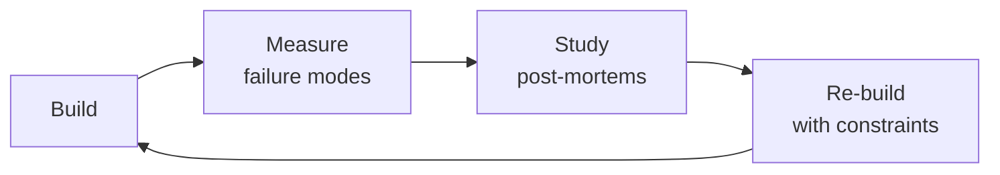

# Translation Manager
> **Portability target:** Spec-level (runs on Claude Code, Copilot, Gemini CLI, Codex, Cursor). No vendor-specific frontmatter fields.

Orchestrate automated translation pipelines — configure machine translation engines, manage translation memory, automate quality checks, and run continuous localization without a human translation team.

## Route the Request

<!-- QUICK: 30s -- auto-route first, then intent-route -->

### Auto-Route (No User Input Required)
Evaluate these file-system conditions in order. First match wins — jump immediately.

| # | Condition | Action |
|---|-----------|--------|
| A1 | `file_contains("*", "Lokalise\|Phrase\|Crowdin\|transifex\|POEditor\|Smartling")` OR `file_contains("*", "TMS\|TMX\|translation.*memory\|glossary\|termbase")` | This is your skill. Jump to **Core Workflow** — Phase 3 (TMS Integration). |
| A2 | `file_contains(".github/workflows/*", "lokalise\|phrase\|crowdin\|transifex")` OR `file_contains("package.json", "\"@lokalise\|phrase\|crowdin\"")` | Jump to **Core Workflow** — Phase 4 (CI/CD Pipeline). |
| A3 | `file_contains("*", "DeepL\|Google.*Translate\|Azure.*Translator\|ModernMT\|Amazon.*Translate")` AND `file_contains("*", "API.*key\|glossary\|formality")` | Jump to **Decision Trees** — MT Engine Selection. |
| A4 | `file_contains("*", "pseudo\|en-XA\|en-XB\|pseudolocaliz\|pseudo.*locale")` OR `file_contains("*", "pseudolocale\|mock.*translation\|test.*locale")` | Jump to **Best Practices** — Pseudolocalization. |
| A5 | `file_contains("*", "ICU\|MessageFormat\|plural\|selectordinal\|{count}\|{variable}")` | Jump to **Error Decoder** — ICU validation section. |
| A6 | `file_contains("*", "LQA\|quality.*score\|translation.*quality\|BLEU\|TER\|COMET")` OR `file_contains("*", "linguist.*review\|post.*edit\|review.*threshold")` | Jump to **Core Workflow** — Phase 4 (Quality Gates). |
| A7 | `file_contains("*", "cost.*optimiz\|budget\|spend\|MT.*cost\|pricing")` AND `file_contains("*", "TM.*leverage\|fuzzy.*match\|savings")` | Jump to **Decision Trees** — Cost Optimization. |
| A8 | `file_exists("*.tmx")` OR `file_contains("*", "tmx.*import\|tmx.*export\|translation.*memory.*file")` | Jump to **Core Workflow** — Phase 2 (Translation Memory). |

### Intent Route (Ask the User)
If no auto-route matched, use this intent tree:

```
What do you need?
├── Set up a new localization pipeline → Jump to "Core Workflow > Phase 1"
├── Choose a machine translation engine → Go to "Decision Trees > MT Engine Selection"
├── Configure translation memory (TM) → Jump to "Core Workflow > Phase 2"
├── Add pseudo-localization for QA → Go to "Best Practices > Pseudolocalization"
├── Automate translation quality checks → Jump to "Core Workflow > Phase 4"
├── Optimize MT costs → Go to "Decision Trees > Cost Optimization"
├── Integrate with a TMS (Lokalise/Phrase/Crowdin) → Jump to "Core Workflow > Phase 3"
├── Need i18n architecture and pipeline → Invoke localization-engineer skill instead
├── Need frontend string extraction → Invoke frontend-developer skill instead
├── Need mobile string extraction → Invoke mobile-developer skill instead
├── Need QA for translation quality → Invoke qa-engineer skill instead
├── Need CI/CD integration for localization → Invoke ci-cd-builder skill instead
└── String extraction from codebase → Go to "Core Workflow > Phase 1"
```

## Ground Rules — Read Before Anything Else

<!-- STANDARD: 3min -->

- **Never commit machine-translated strings directly to production without validation.** MT output must pass automated quality gates: placeholder integrity, ICU syntax, length constraints, and forbidden character checks. One broken placeholder crashes the entire UI for that locale.
- **Translation memory is your compounding asset.** Every corrected translation goes back into TM. A 60% fuzzy match leveraged across 10,000 strings saves 6,000 translations. Build TM from day one — the ROI compounds with every new locale.
- **Pseudolocalization catches bugs before real translations exist.** Run pseudolocalized builds in CI. If the UI breaks with 2x-length strings, right-to-left rendering, or Unicode characters, it will break with real translations too. Catch it before you pay for translations.
- **String keys are forever; string values are temporary.** Use semantic keys (`checkout.payment.button.confirm`) not English-as-keys (`"Confirm Payment"`). If the English copy changes, the key stays stable. If you use English-as-keys, one marketing copy change forces re-translation of 47 locales.
- **MT quality varies dramatically by language pair and domain.** DeepL is excellent for European language pairs but non-existent for most Asian languages. Google Cloud Translation covers 130+ languages but produces lower quality for nuanced marketing copy. Always benchmark with your actual content, not generic test strings.

## The Expert's Mindset

Masters of translation manager don't just build — they build **the right thing, at the right time, with the right trade-offs**. They think in systems, not tasks.

| Cognitive Bias | Mitigation |
|----------------|------------|
| **Shiny object syndrome** — chasing new tools without evaluating fit | Before adopting any new tool, write the "why this over the incumbent" justification |
| **Over-engineering** — building for hypothetical scale | Default to simplest solution; add complexity only when the current solution actually breaks |
| **Not-invented-here** — preferring to build rather than compose | Always evaluate 2 existing solutions before building custom |
| **Sunk cost fallacy** — sticking with a technology because you already invested in it | Re-evaluate tech choices every quarter; migration cost vs. staying cost |

### What Masters Know That Others Don't
- The **failure modes** of every component in their stack — not just the happy path
- When **not** to use their favorite tool (every tool has a misuse zone)
- That **data/model quality decays over time** — monitoring is not optional, it's foundational

### When to Break Your Own Rules
- **Move fast on reversible decisions.** Data format? Hard to change. Dashboard layout? Easy. Know the difference.
- **Skip the abstraction until the third use case.** Two is coincidence, three is a pattern.

## Operating at Different Levels

| Level | Scope | You... |
|-------|-------|--------|
| **L1** | Single component/module | Implement a well-defined piece following established patterns |
| **L2** | Feature or service | Design and build a complete feature; make tech choices within team conventions |
| **L3** | System or product area | Define architecture for a product area; set team tech standards; mentor L1-L2 |
| **L4** | Multiple systems / platform | Define org-wide architecture patterns; make build-vs-buy decisions; influence industry practice |
| **L5** | Industry / ecosystem | Create new architectural patterns adopted across the industry; redefine what's possible |

**Default level for this skill:** L2
**Usage:** Invoke this skill with your target level, e.g., "as an L3 translation manager, design..."

For full level definitions, see `skills/00-framework/skill-levels/SKILL.md`.

## When to Use

<!-- STANDARD: 3min -->

- You need to set up a localization pipeline that doesn't depend on human translators
- You are evaluating or switching machine translation engines
- You need to build and maintain translation memory across multiple projects
- You want to automate translation quality validation in CI/CD
- You are optimizing translation costs across locales and MT providers
- You need to integrate a TMS API for automated pull/push workflows
- You are adding pseudo-localization to your QA pipeline

## Decision Trees

<!-- STANDARD: 3min -->

### MT Engine Selection
```
What's your primary language pair?
├── European languages (EN↔DE/FR/ES/IT/NL/PL) → DeepL (highest quality)
├── Asian languages (EN↔JA/KO/ZH/TH/VI) → Google Cloud Translation (broadest coverage)
├── Arabic, Hebrew, Farsi (RTL languages) → Google Cloud Translation or Azure Translator
├── Mixed (10+ languages across families) → Google Cloud Translation (130+ languages)
│   └── Supplement with DeepL for European subset if budget allows
└── Domain-specific (medical, legal, financial) → ModernMT (adaptive context-aware)
    └── Or: custom model trained on your TM + glossary on Google AutoML
```

### Cost Optimization
```
Translation volume per month?
├── < 10K strings → Pay-as-you-go per-char pricing, focus on quality not cost
├── 10K-100K strings → Negotiate volume discounts, consider annual commitment
├── 100K-1M strings → Multi-engine routing: send high-visibility content to premium MT
│   └── Pattern: marketing pages → DeepL, help docs → Google, UI strings → TM first
└── > 1M strings → Self-host open-source MT (LibreTranslate, OpenNMT) for base layer
    └── Premium MT only for customer-facing content
```

<!-- DEEP: 10+min -->

## Core Workflow

### Phase 1: String Extraction & Key Design (~2 hours)
Audit the codebase for hardcoded strings. Implement key-based extraction using the framework's native i18n library: `i18next` (React/Next.js), `vue-i18n` (Vue), `ngx-translate` (Angular), `flutter_localizations` (Flutter), `react-native-i18n` (React Native). Design the key naming convention: `{domain}.{feature}.{component}.{element}`. Example: `checkout.payment.creditcard.cvv_label`. Extract all source strings to a base locale JSON file (typically `en.json`). Verify no hardcoded strings remain using eslint-plugin-i18next or a grep for quote patterns.

### Phase 2: Translation Memory Setup (~1 hour)
<!-- DEEP: 10+min -->
Initialize TM from existing translations if available. Configure TM format (TMX is the standard interchange format — every TMS supports it). Set fuzzy match thresholds: ≥80% for auto-population, 60-79% for suggestion, < 60% sent to MT. TM stores: source string, target string, locale, context (file path + key), last modified, and quality score. A 10,000-entry TM with 80% leverage across 5 new locales saves ~40,000 new translations.

### Phase 3: TMS Integration (~3 hours)
Choose TMS: Lokalise (best UX, generous free tier), Phrase (most powerful API, best for developers), Crowdin (best open-source support, GitHub integration), Transifex (enterprise focus). Configure API-based pull/push workflow: source strings pushed from CI on merge to main → TMS auto-translates via configured MT engine → translated strings pulled back to repo as locale JSON files on a schedule or trigger. Implement webhook-based PR creation: when translations are ready in TMS, a PR is automatically created with the new locale files.

### Phase 4: Automated Quality Gates (~2 hours)
<!-- DEEP: 10+min -->
Implement pre-commit and CI quality checks for translation files. Placeholder integrity: every `{0}`, `%s`, `{{variable}}` in the source must appear in the translation. ICU MessageFormat validation: parse ICU syntax and verify plural forms and selectors are intact. Length constraint check: flag translations exceeding UI element character limits (button: 30 chars, heading: 60 chars, body: 300 chars). Forbidden character detection: flag translations containing characters outside the target locale's expected character set. LQA scoring: automated score based on placeholder match (30%), length compliance (25%), ICU validity (25%), and termbase consistency (20%). Gate threshold: score ≥ 90 to pass, 80-89 warns, < 80 blocks.

## Cross-Skill Coordination

<!-- STANDARD: 3min -->

| Upstream Skill | What You Receive | When to Involve |
|---|---|---|
| `localization-engineer` | i18n architecture, locale detection, RTL layout, locale-aware formatting, ICU MessageFormat patterns | Before configuring TMS; ensures translation pipeline matches engineering architecture |
| `frontend-developer` | String extraction from React/Next.js, i18next config, namespace strategy, key conventions | Before pushing source strings to TMS; ensures keys follow project conventions |
| `mobile-developer` | Platform-specific locale files, App Store/Play Store metadata, mobile formatting constraints | Before translating mobile strings; platform conventions differ |

| Downstream Skill | What You Provide | Impact of Delay |
|---|---|---|
| `localization-engineer` | TM schema, locale list, TMS API integration, quality gate scripts, translated locale files | i18n pipeline can't auto-sync without TMS configuration |
| `qa-engineer` | LQA score thresholds, test locale builds, pseudolocalization configuration, quality gate results | QA can't validate translations without quality automation |
| `ci-cd-builder` | Webhook config, pipeline triggers, quality gate scripts, automated PR configuration | CI/CD can't automate localization pipeline without integration specs |

### Communication Triggers

| Trigger | Notify | Why |
|---|---|---|
| TMS integration broken / translations stopped syncing | localization-engineer, ci-cd-builder | Translations frozen; manual fallback needed |
| Translation coverage drops below 95% | qa-engineer, localization-engineer | Release blocker — halt deploy until fixed |
| MT cost spikes 3x budget | frontend-developer (source owner) | Audit source strings; reduce unnecessary re-translation |
| New locale added to TMS | localization-engineer, qa-engineer | Configure locale detection, test infrastructure, CI pipeline |
| Quality gate blocking: LQA score < 80 | qa-engineer, localization-engineer | Investigate MT engine quality or TM degradation |

## Proactive Triggers

| Trigger | Action | Why |
|---------|--------|-----|
| New locale added to TMS | Notify localization-engineer, qa-engineer, content-strategist; configure locale detection, CI pipeline, QA test plan | New locale without infrastructure creates the illusion of translation readiness — strings are translated but nothing renders |
| MT engine quality drops below threshold for a locale (BLEU score decline > 5%) | Audit recent source strings for ICU syntax leakage; compare MT output against TM baseline; consider engine swap | MT quality degradation compounds silently — by the time users complain, you've shipped bad translations for weeks |
| TM leverage drops below 60% after a code refactor | Audit i18n key changes; restore key migration map; rebuild TM from content hashes | Key renaming without migration is the #1 cause of TM leverage collapse — each renamed key is a new translation cost |
| New vendor/agency onboarded for a locale | Validate TMX import; run LQA calibration session; configure glossary enforcement; review first batch before pipeline integration | New translators bring style inconsistency — calibration prevents 6 months of rework |
| Glossary conflict detected — two translators disagree on a brand term translation | Escalate to Brand/Marketing; lock glossary entry with `translate: false` if needed; notify all translators | Brand term inconsistency across locales fragments brand identity — lock terms before they diverge |
| ICU syntax error in translated locale file passes CI | Strengthen ICU validation in quality gate; strip variables before MT, re-insert after; add pre-deploy syntax check | ICU variables like `{count}` are code, not content — MT engines corrupt them; protect structural syntax |
| Continuous localization pipeline latency exceeds 12 hours | Audit TMS API throughput; check webhook reliability; add pipeline health alert | When translations take >12 hours from merge to PR, developers bypass the pipeline and hardcode strings |
| Accessibility string (aria-label) translated with MT-only, no human post-editing | Flag accessibility strings for TM+human review only; never raw MT for screen reader content | Screen reader users rely on label accuracy — a mistranslated aria-label is a broken interface, not just a bad string |

## What Good Looks Like

<!-- STANDARD: 3min -->

**What good looks like:** A developer merges a PR with a new feature. Within 30 minutes, source strings are extracted, pushed to TMS, machine-translated for 12 locales, quality-checked automatically, and a PR opens with translated JSON files. The QA team tests the pseudolocalized build and finds zero layout bugs before any real translation costs are incurred. TM leverage is 78% — new strings reuse existing translations where possible. MT quality scores average 93/100 across all locales. Total human intervention: zero. Total time from code merge to translated build: under 2 hours.

## Deliberate Practice



| Level | Practice | Frequency |
|-------|----------|-----------|
| **Novice** | Rebuild an existing system from scratch, then compare your design with the original | Monthly |
| **Competent** | Add a new constraint (10x data, zero downtime, etc.) to a familiar design and re-architect | Quarterly |
| **Expert** | Design the same system under 3 conflicting constraint sets; write a decision record for each | Quarterly |
| **Master** | Teach a junior to design a system; your role is to ask questions, not give answers | Monthly |

**The One Highest-Leverage Activity:** Every quarter, take a system you built 6+ months ago and redesign it from scratch with what you know now. Write down what changed and why.

## References

Detailed reference material loaded on demand:

- **Anti-Patterns**: See [anti-patterns.md](references/anti-patterns.md)
- **Best Practices**: See [best-practices.md](references/best-practices.md)
- **Calibration — How to Know Your Level**: See [calibration.md](references/calibration.md)
- **Production Checklist**: See [checklist.md](references/checklist.md)
- **Error Decoder**: See [error-decoder.md](references/error-decoder.md)
- **Negative Constraints**: See [negative-constraints.md](references/negative-constraints.md)
- **Scale Depth: Solo → Small → Medium → Enterprise**: See [scale-depth.md](references/scale-depth.md)

