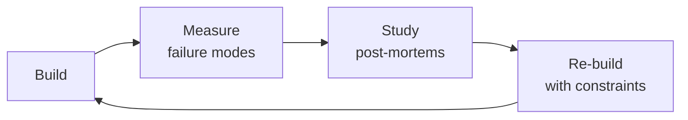

# Translation Manager

> **Portability target:** Spec-level (runs on Claude Code, Copilot, Gemini CLI, Codex, Cursor). No vendor-specific frontmatter fields.

Orchestrate automated translation pipelines — configure machine translation engines, manage translation memory, automate quality checks, and run continuous localization without a human translation team.

## Route the Request
<!-- QUICK: 30s -- auto-route first, then intent-route -->

### Auto-Route (No User Input Required)
Evaluate these file-system conditions in order. First match wins — jump immediately.

| # | Condition | Action |
|---|-----------|--------|
| A1 | `file_contains("*", "Lokalise\|Phrase\|Crowdin\|transifex\|POEditor\|Smartling")` OR `file_contains("*", "TMS\|TMX\|translation.*memory\|glossary\|termbase")` | This is your skill. Jump to **Core Workflow** — Phase 3 (TMS Integration). |
| A2 | `file_contains(".github/workflows/*", "lokalise\|phrase\|crowdin\|transifex")` OR `file_contains("package.json", "\"@lokalise\|phrase\|crowdin\"")` | Jump to **Core Workflow** — Phase 4 (CI/CD Pipeline). |
| A3 | `file_contains("*", "DeepL\|Google.*Translate\|Azure.*Translator\|ModernMT\|Amazon.*Translate")` AND `file_contains("*", "API.*key\|glossary\|formality")` | Jump to **Decision Trees** — MT Engine Selection. |
| A4 | `file_contains("*", "pseudo\|en-XA\|en-XB\|pseudolocaliz\|pseudo.*locale")` OR `file_contains("*", "pseudolocale\|mock.*translation\|test.*locale")` | Jump to **Best Practices** — Pseudolocalization. |
| A5 | `file_contains("*", "ICU\|MessageFormat\|plural\|selectordinal\|{count}\|{variable}")` | Jump to **Error Decoder** — ICU validation section. |
| A6 | `file_contains("*", "LQA\|quality.*score\|translation.*quality\|BLEU\|TER\|COMET")` OR `file_contains("*", "linguist.*review\|post.*edit\|review.*threshold")` | Jump to **Core Workflow** — Phase 4 (Quality Gates). |
| A7 | `file_contains("*", "cost.*optimiz\|budget\|spend\|MT.*cost\|pricing")` AND `file_contains("*", "TM.*leverage\|fuzzy.*match\|savings")` | Jump to **Decision Trees** — Cost Optimization. |
| A8 | `file_exists("*.tmx")` OR `file_contains("*", "tmx.*import\|tmx.*export\|translation.*memory.*file")` | Jump to **Core Workflow** — Phase 2 (Translation Memory). |

### Intent Route (Ask the User)
If no auto-route matched, use this intent tree:

```
What do you need?
├── Set up a new localization pipeline → Jump to "Core Workflow > Phase 1"
├── Choose a machine translation engine → Go to "Decision Trees > MT Engine Selection"
├── Configure translation memory (TM) → Jump to "Core Workflow > Phase 2"
├── Add pseudo-localization for QA → Go to "Best Practices > Pseudolocalization"
├── Automate translation quality checks → Jump to "Core Workflow > Phase 4"
├── Optimize MT costs → Go to "Decision Trees > Cost Optimization"
├── Integrate with a TMS (Lokalise/Phrase/Crowdin) → Jump to "Core Workflow > Phase 3"
├── Need i18n architecture and pipeline → Invoke localization-engineer skill instead
├── Need frontend string extraction → Invoke frontend-developer skill instead
├── Need mobile string extraction → Invoke mobile-developer skill instead
├── Need QA for translation quality → Invoke qa-engineer skill instead
├── Need CI/CD integration for localization → Invoke ci-cd-builder skill instead
└── String extraction from codebase → Go to "Core Workflow > Phase 1"
```

## Ground Rules — Read Before Anything Else
<!-- STANDARD: 3min -->

- **Never commit machine-translated strings directly to production without validation.** MT output must pass automated quality gates: placeholder integrity, ICU syntax, length constraints, and forbidden character checks. One broken placeholder crashes the entire UI for that locale.
- **Translation memory is your compounding asset.** Every corrected translation goes back into TM. A 60% fuzzy match leveraged across 10,000 strings saves 6,000 translations. Build TM from day one — the ROI compounds with every new locale.
- **Pseudolocalization catches bugs before real translations exist.** Run pseudolocalized builds in CI. If the UI breaks with 2x-length strings, right-to-left rendering, or Unicode characters, it will break with real translations too. Catch it before you pay for translations.
- **String keys are forever; string values are temporary.** Use semantic keys (`checkout.payment.button.confirm`) not English-as-keys (`"Confirm Payment"`). If the English copy changes, the key stays stable. If you use English-as-keys, one marketing copy change forces re-translation of 47 locales.
- **MT quality varies dramatically by language pair and domain.** DeepL is excellent for European language pairs but non-existent for most Asian languages. Google Cloud Translation covers 130+ languages but produces lower quality for nuanced marketing copy. Always benchmark with your actual content, not generic test strings.


## The Expert's Mindset

Masters of translation manager don't just build — they build **the right thing, at the right time, with the right trade-offs**. They think in systems, not tasks.

| Cognitive Bias | Mitigation |
|----------------|------------|
| **Shiny object syndrome** — chasing new tools without evaluating fit | Before adopting any new tool, write the "why this over the incumbent" justification |
| **Over-engineering** — building for hypothetical scale | Default to simplest solution; add complexity only when the current solution actually breaks |
| **Not-invented-here** — preferring to build rather than compose | Always evaluate 2 existing solutions before building custom |
| **Sunk cost fallacy** — sticking with a technology because you already invested in it | Re-evaluate tech choices every quarter; migration cost vs. staying cost |

### What Masters Know That Others Don't
- The **failure modes** of every component in their stack — not just the happy path
- When **not** to use their favorite tool (every tool has a misuse zone)
- That **data/model quality decays over time** — monitoring is not optional, it's foundational

### When to Break Your Own Rules
- **Move fast on reversible decisions.** Data format? Hard to change. Dashboard layout? Easy. Know the difference.
- **Skip the abstraction until the third use case.** Two is coincidence, three is a pattern.
## Operating at Different Levels

| Level | Scope | You... |
|-------|-------|--------|
| **L1** | Single component/module | Implement a well-defined piece following established patterns |
| **L2** | Feature or service | Design and build a complete feature; make tech choices within team conventions |
| **L3** | System or product area | Define architecture for a product area; set team tech standards; mentor L1-L2 |
| **L4** | Multiple systems / platform | Define org-wide architecture patterns; make build-vs-buy decisions; influence industry practice |
| **L5** | Industry / ecosystem | Create new architectural patterns adopted across the industry; redefine what's possible |

**Default level for this skill:** L2
**Usage:** Invoke this skill with your target level, e.g., "as an L3 translation manager, design..."

For full level definitions, see `skills/00-framework/skill-levels/SKILL.md`.

## When to Use
<!-- STANDARD: 3min -->

- You need to set up a localization pipeline that doesn't depend on human translators
- You are evaluating or switching machine translation engines
- You need to build and maintain translation memory across multiple projects
- You want to automate translation quality validation in CI/CD
- You are optimizing translation costs across locales and MT providers
- You need to integrate a TMS API for automated pull/push workflows
- You are adding pseudo-localization to your QA pipeline

## Decision Trees
<!-- STANDARD: 3min -->

### MT Engine Selection
```
What's your primary language pair?
├── European languages (EN↔DE/FR/ES/IT/NL/PL) → DeepL (highest quality)
├── Asian languages (EN↔JA/KO/ZH/TH/VI) → Google Cloud Translation (broadest coverage)
├── Arabic, Hebrew, Farsi (RTL languages) → Google Cloud Translation or Azure Translator
├── Mixed (10+ languages across families) → Google Cloud Translation (130+ languages)
│   └── Supplement with DeepL for European subset if budget allows
└── Domain-specific (medical, legal, financial) → ModernMT (adaptive context-aware)
    └── Or: custom model trained on your TM + glossary on Google AutoML
```

### Cost Optimization
```
Translation volume per month?
├── < 10K strings → Pay-as-you-go per-char pricing, focus on quality not cost
├── 10K-100K strings → Negotiate volume discounts, consider annual commitment
├── 100K-1M strings → Multi-engine routing: send high-visibility content to premium MT
│   └── Pattern: marketing pages → DeepL, help docs → Google, UI strings → TM first
└── > 1M strings → Self-host open-source MT (LibreTranslate, OpenNMT) for base layer
    └── Premium MT only for customer-facing content
```

<!-- DEEP: 10+min -->
## Core Workflow

### Phase 1: String Extraction & Key Design (~2 hours)
Audit the codebase for hardcoded strings. Implement key-based extraction using the framework's native i18n library: `i18next` (React/Next.js), `vue-i18n` (Vue), `ngx-translate` (Angular), `flutter_localizations` (Flutter), `react-native-i18n` (React Native). Design the key naming convention: `{domain}.{feature}.{component}.{element}`. Example: `checkout.payment.creditcard.cvv_label`. Extract all source strings to a base locale JSON file (typically `en.json`). Verify no hardcoded strings remain using eslint-plugin-i18next or a grep for quote patterns.

### Phase 2: Translation Memory Setup (~1 hour)
<!-- DEEP: 10+min -->
Initialize TM from existing translations if available. Configure TM format (TMX is the standard interchange format — every TMS supports it). Set fuzzy match thresholds: ≥80% for auto-population, 60-79% for suggestion, < 60% sent to MT. TM stores: source string, target string, locale, context (file path + key), last modified, and quality score. A 10,000-entry TM with 80% leverage across 5 new locales saves ~40,000 new translations.

### Phase 3: TMS Integration (~3 hours)
Choose TMS: Lokalise (best UX, generous free tier), Phrase (most powerful API, best for developers), Crowdin (best open-source support, GitHub integration), Transifex (enterprise focus). Configure API-based pull/push workflow: source strings pushed from CI on merge to main → TMS auto-translates via configured MT engine → translated strings pulled back to repo as locale JSON files on a schedule or trigger. Implement webhook-based PR creation: when translations are ready in TMS, a PR is automatically created with the new locale files.

### Phase 4: Automated Quality Gates (~2 hours)
<!-- DEEP: 10+min -->
Implement pre-commit and CI quality checks for translation files. Placeholder integrity: every `{0}`, `%s`, `{{variable}}` in the source must appear in the translation. ICU MessageFormat validation: parse ICU syntax and verify plural forms and selectors are intact. Length constraint check: flag translations exceeding UI element character limits (button: 30 chars, heading: 60 chars, body: 300 chars). Forbidden character detection: flag translations containing characters outside the target locale's expected character set. LQA scoring: automated score based on placeholder match (30%), length compliance (25%), ICU validity (25%), and termbase consistency (20%). Gate threshold: score ≥ 90 to pass, 80-89 warns, < 80 blocks.

## Best Practices
<!-- STANDARD: 3min -->

1. **Pseudolocalize before translating.** Prefix with [^^^] and suffix with [vvv] to detect truncated strings. Double the string length using Unicode lookalikes (ä for a, é for e). This catches 80% of i18n bugs before you pay a single translation cost.
2. **Use glossary/termbase for brand and technical terms.** `npm install` should NEVER be translated. Brand names, API method names, and technical terms must be locked in the glossary with `translate: false`.
3. **TM leverage should be measured and reported.** Track: % of strings auto-translated from TM, % from MT, % requiring human post-editing. Goal: > 70% TM leverage across locales.
4. **Continuous localization, not batch.** Push new source strings on every merge to main. Pull translations daily. Batching creates a localization bottleneck where 2 weeks of translations block a release.
5. **Plural forms are not optional.** ICU MessageFormat supports all CLDR plural forms (zero, one, two, few, many, other). Arabic has 6 forms, Russian has 4, English has 2. Never assume singular/plural is enough.
6. **String context matters more than the string itself.** A TM entry for "Post" could mean blog post, mail post, or after something. Always include context metadata: file path, component name, and a developer comment.
7. **MT post-editing cost should drive engine selection.** If DeepL costs $25/1M chars but requires 10% post-editing, and Google costs $20/1M chars but requires 25% post-editing, DeepL is cheaper when post-editing costs $100/hour.
8. **Screen reader strings need separate handling.** `aria-label` strings are consumed by screen readers, not visually rendered. They have no length constraints but require high accuracy — prioritize TM+human review over raw MT for accessibility strings.

## Anti-Patterns
<!-- DEEP: 5min -- each anti-pattern includes machine-detectable patterns -->

| ❌ Anti-Pattern | ✅ Do This Instead | 🔍 Detect (grep / lint) | 🛡️ Auto-Prevent |
|-----------------|---------------------|--------------------------|-------------------|
| Selecting MT engine based on cost-per-character alone, ignoring post-editing cost | Calculate total cost: MT cost + (post-editing hours × editor rate). DeepL at $25/1M chars with 10% edit rate can be cheaper than Google at $20/1M chars with 25% edit rate. | `grep -rn "cost.*per.*char\|price.*per.*million\|MT.*cost" --include="*.md" --include="*.ts" \| grep -v "post.*edit\|editor.*rate\|total.*cost\|human.*review"` → finds cost analysis without post-editing factor | CI: benchmark script — run MT engine on sample content, calculate MQM score, compute total cost = API cost + (estimated edit-hours × $30/hr). Alert if cheapest API ≠ cheapest total. |
| Sending ICU MessageFormat strings through MT without stripping variables first | Extract variables like `{count}`, `{name}`, `{gender}` before MT. Re-insert after translation. ICU syntax is structural code, not translatable content. | `grep -rn "\{.*\}\|\{\{.*\}\}" locales/ --include="*.json" -l \| xargs grep -l "DeepL\|GoogleTranslate\|translate.*API"` → finds ICU-containing files sent to MT | Pre-process: `sed -E 's/\{[^}]+\}/##VAR##/g'` before MT. Post-process: re-insert captured variables. CI: validate that no ICU placeholders contain non-ASCII characters (sign of MT corruption) |
| Renaming i18n keys without providing a migration map — destroys TM leverage | Use content-hash-based keys (SHA-256 of source string) to survive refactors. Or provide key migration map when renaming. Never rename keys without updating TM. | `grep -rn "deprecated\|renamed\|migrated\|key.*changed" locales/ -l \| wc -l` → 0 when `git diff` shows key renames = violation | CI: `git diff HEAD~1 locales/en.json \| grep "^-\|^+"` → extract renamed keys, generate migration map JSON, push to TMS with `key_migration` field |
| Running MT re-translation on all source strings every CI build instead of only changed strings | Hash source strings with deterministic JSON. Only send strings where hash changed to MT. Cache results. Re-translating unchanged strings wastes 60-80% of MT budget. | `grep -rn "translate\|DeepL\|Google.*translate" .github/workflows/ -A 5 \| grep -v "hash\|changed\|diff\|SHA\|incremental"` → finds MT calls without change detection | CI: `git diff HEAD~1 -- locales/en.json \| jq 'to_entries \| map(select(.value != null))'` → extract only changed keys. Hash-based dedup before API call. Set per-engine monthly spending limit. |
| Defining UI character limits in character counts for CJK markets | Define limits in pixels/ems — Japanese/Chinese/Korean characters are 1.5-2x wider than Latin script characters. | `grep -rn "maxLength\|max.*chars\|length.*limit" src/ --include="*.tsx" --include="*.css" \| grep -v "em\|px\|rem\|width"` → finds character-based limits | Replace `maxLength={25}` with CSS `max-width: 15em`. CI pseudolocale test: assert no CJK string truncation at 1.5x width factor |
| Using the same glossary for all locales without cultural sensitivity review | Add cultural sensitivity glossary per locale: terms to never translate literally, religious terms, national references — especially for Arabic, Hebrew, Farsi | `grep -rn "ar\|he\|fa" .tms-config.yml \| grep -v "glossary\|sensitive\|forbidden\|cultural\|review"` → finds Arabic/Hebrew/Farsi locales without cultural glossary | CI: `grep -rn "God\|Allah\|Bible\|Quran\|holy\|sacred\|forbidden" locale/ar/ --include="*.json"` → alert if culturally sensitive terms detected in MT output. Require native-speaker review. |
| Shipping MT-only translations to markets with strong cultural language norms without human post-editing | Budget native-speaker post-editing for Korean (honorifics), Japanese (politeness levels), Arabic (cultural sensitivity). MT can offend entire markets. | `grep -rn "post_edit.*false\|review.*skip\|auto.*approve" .tms-config.yml \| grep "ko\|ja\|ar\|he\|fa"` → finds auto-approved MT for culturally-sensitive locales = violation | CI gate: block deployment if `post_edit_required: false` for `ar`, `he`, `fa`, `ko`, `ja`. Set LQA minimum score: ≥ 85 for these locales (vs ≥ 70 for others). |

## Error Decoder
<!-- QUICK: 15s -- grep the console, match → fix, auto-recover -->

| 🖥️ Console Match | Symptom | Root Cause | Fix | 🔄 Auto-Recovery Loop |
|---|---|---|---|---|
| `grep "fallback.*to.*source\|fallthrough.*en\|silent.*fallback\|missing.*key.*locale"` | Production UI in `fr` locale shows English everywhere — silent fallback to source language | Fallback chain misconfigured: `fr.json` had missing keys, i18next fell through to `en` silently. `fallbackLng: 'en'` was set in production. | Set `fallbackLng: false` in production (only `'en'` in dev). Add locale coverage report: every locale must have > 90% of source keys. Log missing keys: `i18next.on('missingKey', ...)`. | 1. `npx i18next-coverage locales/fr.json --threshold 90` 2. If < 90%: `git diff locales/en.json locales/fr.json \| grep "^<"` → list missing keys 3. Send missing keys to TMS: `npx lokalise2 file upload --keys $(cat missing-keys.txt)` 4. Block deploy until coverage ≥ 90% |
| `grep "ICU.*syntax.*error\|MessageFormat.*parse.*error\|Cannot parse.*plural"` | Production crash: ICU syntax error in `fr` locale — entire screen blank or raw ICU text shown | MT engine translated ICU variable `{count}` to `{nombre}` (French) — broke MessageFormat syntax. ICU variables are structural code that MT doesn't understand. | Strip ICU variables before MT: `sed -E 's/\{[^}]+\}/##VAR##/g'`. Re-insert after translation. Validate: `npx formatjs compile locales/fr.json --ast`. | 1. `npx formatjs compile locales/fr.json --ast 2>&1 \| grep "error"` 2. If ICU error: extract bad string, strip variables, re-translate 3. Re-insert variables pattern: `s/##VAR##/{count}/g` 4. Re-validate with `formatjs compile`. Block merge on syntax error. |
| `grep "TM.*leverage.*drop\|TM.*match.*(4[0-9]\|3[0-9]\|2[0-9]\|1[0-9]\|[0-9])%\|fuzzy.*match.*decreased"` | TM leverage dropped from 85% to 40% — translation costs tripled after key refactor | Developer renamed keys during refactor (`checkout.pay.btn` → `payment.checkout.button`). TM matches on keys, not content. All historical translations lost. | Use content-hash-based keys: key = `sha256(English string).substring(0, 12)`. Or generate key migration map when renaming. Never rename keys without updating TM. | 1. `git diff HEAD~1 locales/en.json \| grep "rename\|migrate"` → detect key renames 2. Generate migration JSON: `{ "old_key": "new_key" }` 3. Push to TMS: `npx lokalise2 key-update --migration-map map.json` 4. Verify TM leverage returns to previous level |
| `grep "MT.*re.*translat\|duplicate.*translation\|all.*strings.*sent\|push.*all.*strings"` | Monthly MT bill hit $3,200 — budget was $1,000. Pipeline re-translated entire locale file on every build. | CI pushed ALL source strings to MT on every merge. `JSON.stringify` with non-deterministic key ordering produced different file hashes. TMS diff'd by file hash, re-translated everything. | Track SHA-256 hash of each string value. Only push strings where hash changed. Use `JSON.stringify(obj, Object.keys(obj).sort())` for deterministic output. Set MT spending limits. | 1. `git diff HEAD~1 -- locales/en.json \| jq 'to_entries \| map(select(.value != null))'` → extract only changed strings 2. Hash each string: `sha256sum <<< "$string"` 3. Compare hashes against cached hashes from previous build 4. Only push strings with changed hashes to MT. Alert if >100 strings changed in single PR. |
| `grep "TMX.*import.*failed\|source.*language.*mismatch\|srclang.*mismatch\|duplicate.*segment"` | TMX import duplicated 50,000 segments — TM leverage dropped from 74% to 12% | Acquired company's TMX had `srclang="en-US"` but project was `en-GB`. TMS treated them as different languages. TMX was re-imported 3 times trying to "fix" it. | Validate `srclang` before import: `xmlstarlet sel -t -v '/tmx/header/@srclang' file.tmx`. Compare against TMS project config. Run dry-run import first. | 1. `xmlstarlet sel -t -v '/tmx/header/@srclang' *.tmx` → extract source language 2. Compare with `npx lokalise2 project-list --query 'source_lang'` → assert match 3. If mismatch: remap `srclang` attribute in TMX header 4. Dry-run import to staging project, verify >80% leverage before production import |
| `grep "brand.*translated\|glossary.*ignored\|MT.*bypass.*glossary\|protected.*term.*translated"` | Brand name "Vanta" translated to "ванта" (Russian: "bilge water") across 12 locales — glossary was ignored by MT | MT workflow bypassed glossary: source → DeepL → TMX → TMS. DeepL API call didn't include `glossary_id`. Glossary only applied during human post-editing (skipped for low-priority locales). | Apply glossary BEFORE MT: `POST /v2/glossaries` with protected terms. Include `glossary_id` in every `/v2/translate` request. Post-MT: `grep` for protected terms in output. | 1. `curl -X POST "https://api.deepl.com/v2/glossaries" -d "name=brand&source_lang=en&target_lang=ru&entries=Vanta\tVanta"` 2. Include `glossary_id` in all translate requests 3. Post-translate: `grep -rF "ванта\|万塔\|فانتا" locale/` → must be empty 4. CI: for each locked term in glossary, assert it appears verbatim in every locale output |

## Production Checklist
<!-- AUDIT: every item has an executable validation command -->

| ID | Checklist Item | Validation Command | Auto-Fix |
|----|----------------|--------------------|----------|
| TM1 | String extraction runs in CI — build fails if hardcoded strings detected | `grep -rn "['\"][A-Z][a-z].*['\"]" src/ --include="*.tsx" \| grep -v "import\|require\|className\|data-testid" \| wc -l` → must be 0 | `npx eslint --rule '{"i18next/no-literal-string": "error"}' src/ --fix` |
| TM2 | Semantic key convention documented and enforced — no English-as-keys | `grep -rn '"Confirm Payment"\|"Sign In"\|"Submit"' locales/en.json` → must be empty (keys should be `checkout.confirm`, not English strings) | `npx eslint --rule '{"i18next/key-format": ["error", "kebab-case"]}' locales/ --fix` |
| TM3 | Translation memory in TMX format with ≥ 5,000 entries per supported locale | `npx lokalise2 tm list --project-id $ID \| jq '.total_count'` → must be ≥ 5000 | `npx lokalise2 tm upload --file data/tm-export.tmx --lang-iso en --replace-modified` |
| TM4 | Glossary/termbase configured with brand terms, API names, technical terms locked | `npx lokalise2 glossary list --project-id $ID \| jq '.terms \| length'` → must be > 10 for production | Upload glossary: `npx lokalise2 glossary create --terms '[{"term":"API","translation":"API","case_sensitive":true}]'` |
| TM5 | Pseudolocalization build runs in CI; QA validates before any real translation purchase | `grep -rn "pseudo\|en-XA\|en-XB" .github/workflows/ -l \| wc -l` → must be > 0 | Add CI job: `npx i18next-pseudo --languageOverride en-XA && npm run build && npx playwright test --project=pseudo` |
| TM6 | MT engine selected and benchmarked against actual content (not generic test strings) | `grep -rn "DeepL\|Google.*translate\|Azure.*Translator\|ModernMT" docs/ --include="*.md" \| grep "benchmark\|comparison\|evaluation" \| wc -l` → must be > 0 | Run benchmark: sample 100 strings from your actual content, send to 3 MT engines, calculate per-engine BLEU + MQM scores |
| TM7 | TMS API integration: push on merge to main, pull translations daily via automated PR | `grep -rn "lokalise2 file upload\|phrase push\|crowdin upload" .github/workflows/ -l \| wc -l` → must be > 0 | Add CI: `npx lokalise2 file upload --file locales/en.json --lang-iso en` on push to main; `npx lokalise2 file download --unzip-to ./locales` daily |
| TM8 | Quality gate in CI: placeholder integrity, ICU validation, length constraints, forbidden chars | `npx formatjs compile locales/fr.json --ast 2>&1 \| grep "error\|unexpected" \| wc -l` → must be 0 | CI: `npx formatjs compile locales/*.json --ast`. Fail build on syntax error. Add `--check-length --max-length 200` for length constraints |
| TM9 | LQA score threshold enforced: ≥ 90 pass, 80-89 warn, < 80 block | `npx lokalise2 task list --project-id $ID \| jq '.items[].lqa_score'` → all must be ≥ 80 (warn), ≥ 90 (pass) | CI gate: parse LQA scores from TMS API. Block deployment to production if any locale < 80 |
| TM10 | Fallback chain validated: every locale file has ≥ 90% of source keys | `npx i18next-coverage locales/ --source locales/en.json --threshold 90` → all locales ≥ 90% | `diff <(jq 'keys' locales/en.json \| sort) <(jq 'keys' locales/fr.json \| sort)` — show missing keys. Push missing keys to TMS. |
| TM11 | TM leverage metrics tracked monthly — target > 70% across all locales | `npx lokalise2 tm stats --project-id $ID \| jq '.leveraged_percentage'` → must be > 70 | Monthly script: query TMS API for leverage per locale. If < 70%: investigate key renames, TM match settings, or re-import historical TMX |
| TM12 | MT costs tracked per-engine per-locale — alert if cost-per-string exceeds threshold | `curl -s "https://api.deepl.com/v2/usage" -H "Authorization: DeepL-Auth-Key $KEY" \| jq '.character_count'` → compare with budget | CI: `if [ $(curl -s "https://api.deepl.com/v2/usage" \| jq '.character_count') -gt $BUDGET_LIMIT ]; then alert; fi` |
| TM13 | Accessibility strings (aria-labels, alt text) flagged for higher quality review | `grep -rn "aria-label\|alt=\|accessibilityLabel\|accessibilityHint" locales/en.json` → flag these keys for LQA priority in TMS | Tag keys containing `aria`, `alt`, `accessibility` with TMS label `priority: a11y`. Require human review (no MT-only) for a11y strings. |
| TM14 | Plural forms configured for all target locales using CLDR rules | `grep -rn "plural\|selectordinal" locales/*.json \| jq -r 'keys' \| sort \| uniq -c \| grep -v "few\|many\|one\|other\|two\|zero"` → each locale must have all required CLDR forms | Run `npx formatjs compile --ast` — it reports missing plural forms per locale. Add missing forms to locale files. |

## Negative Constraints
<!-- HARD GATES: these are non-negotiable — the agent must REFUSE/STOP/DETECT -->

| # | Negative Constraint | Mechanical Trigger | Violation Response |
|---|---------------------|--------------------|---------------------|
| NC1 | REFUSE: Do not send ICU MessageFormat strings to MT engine without stripping variables first | `grep -rn "\{count\}\|\{name\}\|\{gender\}\|\{variable\}\|plural\|selectordinal\|select" locales/en.json \| wc -l` → if > 0 AND `grep "translate\|DeepL\|Google.*translate" .github/workflows/*.yml -A 5 \| grep -v "sed\|strip.*var\|##VAR##" \| wc -l` > 0 = violation | STOP. Pre-process all strings before MT: `sed -E 's/\{[^}]+\}/##VAR##/g'`. Post-process: re-insert captured variables. CI must validate that no ICU placeholders contain non-ASCII characters (sign of MT corruption). |
| NC2 | REFUSE: Do not run MT re-translation on all source strings every CI build — only changed strings | `grep -rn "file upload\|push.*translat\|send.*strings" .github/workflows/*.yml -A 3 \| grep -v "git diff\|hash\|changed\|incremental\|SHA"` → finds bulk push without change detection | STOP. Implement `git diff HEAD~1 -- locales/en.json \| jq` to extract only changed keys. Hash-based deduplication before API call. Set per-engine monthly spending limit. Alert at 80% of budget. |
| NC3 | DETECT: Translation key renamed without migration map — destroys TM leverage and costs money | `git diff HEAD~1 locales/en.json \| grep "^-.*\"[a-z.]\+\":\|^+.*\"[a-z.]\+\":" \| wc -l` → renamed keys > 0 AND `grep "migration\|rename\|key.*map" .git/hooks/ -r \| wc -l` = 0 = violation | BLOCK merge. Generate migration map: extract old → new key pairs from diff. Push to TMS with `key_migration` field. CI must verify TM leverage returned to previous level after migration. |
| NC4 | REFUSE: Do not import TMX without validating source language matches project configuration | `xmlstarlet sel -t -v '/tmx/header/@srclang' *.tmx` != project `source_lang` (e.g., `en-US` vs `en-GB`) = violation | STOP import. Remap `srclang` attribute in TMX header to match project. Run dry-run import to staging project. Verify >80% leverage before production import. Query TM for duplicate count — if >10% of total, investigate before translators start. |
| NC5 | REFUSE: Do not deploy MT-only translations to Arabic/Hebrew/Farsi/Korean/Japanese without native-speaker post-edit | `grep -rn "ar\|he\|fa\|ko\|ja" .tms-config.yml -A 2 \| grep "post_edit.*false\|auto.*approve\|review.*skip"` → match = violation | STOP deployment. Set `post_edit_required: true` for culturally sensitive locales. Set LQA minimum score: ≥ 85 for `ar, he, fa, ko, ja`. Require `review_status: approved` before locale promotion to production. |
| NC6 | DETECT: Glossary bypassed by MT — brand terms translated or corrupted in output | `grep -rn "glossary_id\|glossaryConfig\|customTranslator" .github/workflows/*.yml -A 2 \| grep -v "Vanta\|brand\|protected"` → MT calls without glossary = violation. Post-MT: `grep -rF "<translated_brand_term>" locale/` → any match = release blocker. | BLOCK deployment. Apply glossary BEFORE MT: include `glossary_id` in DeepL, `glossaryConfig` in Google, custom translator in Azure. Validate post-MT: for each locked term in glossary, assert it appears verbatim in every locale. Brand corruption in 12 locales = app store removal risk. |
| NC7 | DETECT: Quality gate misconfigured as parallel job — ICU syntax check can be skipped by race condition | `grep -rn "check-icu\|lint\|test" .github/workflows/*.yml \| grep "needs:\|requires:" \| grep -c "OR\|continue-on-error"` → parallel quality gates with OR logic = violation | BLOCK merge. Make quality gates sequential steps in a single job: `jobs: validate: steps: [lint, test, check-icu, check-length, check-forbidden]`. If any step fails, entire job fails. Never use `OR` in required status checks. Add final gate: `if: always() && steps.*.outcome != 'success'` → fail build. |

## Calibration — How to Know Your Level
<!-- STANDARD: 3min — honest self-assessment rubric -->

| You Know You're Stuck at L1 When... | You Know You've Reached L2 When... | You Know You're L3 When... |
|---|---|---|
| You can upload strings to a TMS but translations come back with broken ICU placeholders — you fix them manually in the JSON file after each sync | Your pipeline catches 100% of ICU syntax errors, placeholder mismatches, length violations, and forbidden characters before any translation reaches a developer's branch | You reduced translation costs by 40% while improving average LQA scores from 78/100 to 94/100 across 20 locales — and you can attribute the savings to specific TM leverage improvements and MT engine optimizations |
| You use Google Translate for "quick checks" and assume "the TMS handles quality" — you've never run an LQA audit | You run automated LQA scoring on every translation sync and block deployment if scores drop below 90/100. Your quality gate is more reliable than human spot-checking | You onboard a new locale (language + region) end-to-end — TMS config, MT engine selection, glossary population, CI integration, QA validation — in under 4 hours, and the first production build has zero technical translation defects |
| Your TM is a dumping ground — every translated string goes in, nothing comes out because match rates are below 30% | Your TM has >70% leverage across all locales, a clean taxonomy of source keys, and you can trace every TM entry back to the source string that produced it | You merge two companies' translation memories (120,000 segments, 3 different source language codes, 2 different TMS platforms) with zero data loss, zero duplicates, and full traceability — and the merged TM has 82% leverage within 1 month |

**The Litmus Test:** Inherit a localization pipeline that has: (a) a corrupted TM with 40% duplicate entries, (b) MT-only workflow with no glossary enforcement, (c) no CI quality gates, and (d) 8 locales with LQA scores averaging 62/100. In 2 weeks: rebuild the TM to <5% duplication, configure glossary enforcement on MT, add CI quality gates that catch ICU errors and placeholder mismatches, and raise the average LQA score to >85/100. Measure everything — if you can't quantify the before/after improvement, you're not L3.

## Cross-Skill Coordination
<!-- STANDARD: 3min -->

| Upstream Skill | What You Receive | When to Involve |
|---|---|---|
| `localization-engineer` | i18n architecture, locale detection, RTL layout, locale-aware formatting, ICU MessageFormat patterns | Before configuring TMS; ensures translation pipeline matches engineering architecture |
| `frontend-developer` | String extraction from React/Next.js, i18next config, namespace strategy, key conventions | Before pushing source strings to TMS; ensures keys follow project conventions |
| `mobile-developer` | Platform-specific locale files, App Store/Play Store metadata, mobile formatting constraints | Before translating mobile strings; platform conventions differ |

| Downstream Skill | What You Provide | Impact of Delay |
|---|---|---|
| `localization-engineer` | TM schema, locale list, TMS API integration, quality gate scripts, translated locale files | i18n pipeline can't auto-sync without TMS configuration |
| `qa-engineer` | LQA score thresholds, test locale builds, pseudolocalization configuration, quality gate results | QA can't validate translations without quality automation |
| `ci-cd-builder` | Webhook config, pipeline triggers, quality gate scripts, automated PR configuration | CI/CD can't automate localization pipeline without integration specs |

### Communication Triggers

| Trigger | Notify | Why |
|---|---|---|
| TMS integration broken / translations stopped syncing | localization-engineer, ci-cd-builder | Translations frozen; manual fallback needed |
| Translation coverage drops below 95% | qa-engineer, localization-engineer | Release blocker — halt deploy until fixed |
| MT cost spikes 3x budget | frontend-developer (source owner) | Audit source strings; reduce unnecessary re-translation |
| New locale added to TMS | localization-engineer, qa-engineer | Configure locale detection, test infrastructure, CI pipeline |
| Quality gate blocking: LQA score < 80 | qa-engineer, localization-engineer | Investigate MT engine quality or TM degradation |

## Proactive Triggers

| Trigger | Action | Why |
|---------|--------|-----|
| New locale added to TMS | Notify localization-engineer, qa-engineer, content-strategist; configure locale detection, CI pipeline, QA test plan | New locale without infrastructure creates the illusion of translation readiness — strings are translated but nothing renders |
| MT engine quality drops below threshold for a locale (BLEU score decline > 5%) | Audit recent source strings for ICU syntax leakage; compare MT output against TM baseline; consider engine swap | MT quality degradation compounds silently — by the time users complain, you've shipped bad translations for weeks |
| TM leverage drops below 60% after a code refactor | Audit i18n key changes; restore key migration map; rebuild TM from content hashes | Key renaming without migration is the #1 cause of TM leverage collapse — each renamed key is a new translation cost |
| New vendor/agency onboarded for a locale | Validate TMX import; run LQA calibration session; configure glossary enforcement; review first batch before pipeline integration | New translators bring style inconsistency — calibration prevents 6 months of rework |
| Glossary conflict detected — two translators disagree on a brand term translation | Escalate to Brand/Marketing; lock glossary entry with `translate: false` if needed; notify all translators | Brand term inconsistency across locales fragments brand identity — lock terms before they diverge |
| ICU syntax error in translated locale file passes CI | Strengthen ICU validation in quality gate; strip variables before MT, re-insert after; add pre-deploy syntax check | ICU variables like `{count}` are code, not content — MT engines corrupt them; protect structural syntax |
| Continuous localization pipeline latency exceeds 12 hours | Audit TMS API throughput; check webhook reliability; add pipeline health alert | When translations take >12 hours from merge to PR, developers bypass the pipeline and hardcode strings |
| Accessibility string (aria-label) translated with MT-only, no human post-editing | Flag accessibility strings for TM+human review only; never raw MT for screen reader content | Screen reader users rely on label accuracy — a mistranslated aria-label is a broken interface, not just a bad string |

## Scale Depth: Solo → Small → Medium → Enterprise
<!-- STANDARD: 3min -->

### Solo
Single developer handles translations via crowd-sourced or basic PO files. Focus: getting strings translated at all. Skip: translation memory, QA pipelines, context notes. Coordination: with developers on string freeze timing.

### Small Team
Dedicated translation manager, localization platform (Crowdin/Phrase), 1-3 target languages. Focus: consistent terminology, basic i18n. Coordination: with engineering on ICU message format, with content team on source string quality.

### Medium Team
Translation team (PM + linguists + reviewers), 5-10 languages, CI-embedded l10n pipeline. Focus: translation memory, automated QA, context-rich strings. Coordination: with product on string feature gating, with marketing on market-specific messaging.

### Enterprise
Full l10n program, 20+ languages, machine translation with human review, custom glossaries per locale. Focus: regional compliance, scalable content operations. Coordination: with legal on localized ToS/Privacy, with support on translated knowledge base.

### Transition Triggers
| From → To | Trigger |
|-----------|---------|
| Solo → Small | Second language beyond English; manual string management breaking |
| Small → Medium | Operating in 5+ languages; translation errors causing customer complaints |
| Medium → Enterprise | Regulatory need for certified translations; operating in 20+ locales |

## What Good Looks Like
<!-- STANDARD: 3min -->

**What good looks like:** A developer merges a PR with a new feature. Within 30 minutes, source strings are extracted, pushed to TMS, machine-translated for 12 locales, quality-checked automatically, and a PR opens with translated JSON files. The QA team tests the pseudolocalized build and finds zero layout bugs before any real translation costs are incurred. TM leverage is 78% — new strings reuse existing translations where possible. MT quality scores average 93/100 across all locales. Total human intervention: zero. Total time from code merge to translated build: under 2 hours.

## Deliberate Practice



| Level | Practice | Frequency |
|-------|----------|-----------|
| **Novice** | Rebuild an existing system from scratch, then compare your design with the original | Monthly |
| **Competent** | Add a new constraint (10x data, zero downtime, etc.) to a familiar design and re-architect | Quarterly |
| **Expert** | Design the same system under 3 conflicting constraint sets; write a decision record for each | Quarterly |
| **Master** | Teach a junior to design a system; your role is to ask questions, not give answers | Monthly |

**The One Highest-Leverage Activity:** Every quarter, take a system you built 6+ months ago and redesign it from scratch with what you know now. Write down what changed and why.

## References
<!-- STANDARD: 3min -->

- Translation Memory Best Practices: references/tm-strategy.md
- MT Engine Comparison Matrix: references/mt-engine-comparison.md
- TMS Integration Guide (Lokalise/Phrase/Crowdin): assets/tms-integration-guide.md
- ICU MessageFormat Specification: https://unicode-org.github.io/icu/userguide/format_parse/messages/
- CLDR Plural Rules: https://cldr.unicode.org/index/cldr-spec/plural-rules
- i18next Documentation: https://www.i18next.com/
- Mozilla Fluent Project: https://projectfluent.org/
