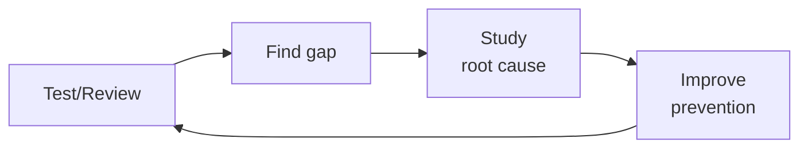

# Accessibility Testing
> **Portability target:** Spec-level (runs on Claude Code, Copilot, Gemini CLI, Codex, Cursor). No vendor-specific frontmatter fields.

Build automated accessibility testing into every layer of the CI/CD pipeline — catch violations at lint time, component test time, e2e test time, and in production monitoring before users do.

## Route the Request

<!-- QUICK: 30s -- auto-route first, then intent-route -->

### Auto-Route (No User Input Required)
Evaluate these file-system conditions in order. First match wins — jump immediately.

| # | Condition | Action |
|---|-----------|--------|
| A1 | `file_contains("package.json", "\"axe-core\"\|\"jest-axe\"\|\"@axe-core/playwright\"\|\"cypress-axe\"\|\"pa11y\"")` OR `file_contains("*", "accessibility.*test\|a11y.*test\|axe\(\)\|pa11y")` | This is your skill. Jump to **Core Workflow** — Phase 2 (CI Integration). |
| A2 | `file_contains(".github/workflows/*", "axe\|pa11y\|lighthouse.*accessibility\|a11y")` OR `file_contains("lighthouserc", "\"accessibility\"")` | Jump to **Best Practices** — CI Gates. |
| A3 | `file_contains("package.json", "\"eslint-plugin-jsx-a11y\"")` AND `file_contains("*", "aria-\|role=\|tabIndex\|alt=\|htmlFor")` | Jump to **Best Practices** — Linting. |
| A4 | `file_contains("*", "VoiceOver\|TalkBack\|NVDA\|screen.*reader\|assistive.*tech")` | Jump to **Decision Trees** — Screen Reader Automation. |
| A5 | `file_contains("*", "WCAG\|Section.*508\|EN.*301.*549\|ADA\|accessibility.*standard\|compliance")` | Jump to **Error Decoder** — Compliance Gap section. |
| A6 | `file_contains("*", "prefers-reduced-motion\|prefers-color-scheme\|prefers-contrast\|forced-colors")` | Jump to **Core Workflow** — Phase 1 (User Preference Testing). |
| A7 | `file_contains("*", "keyboard\|focus.*trap\|tab.*order\|skip.*link\|focus.*visible")` | Jump to **Production Checklist** — AT13 (Keyboard Navigation). |
| A8 | `file_contains("*", "aria-live\|role=\"alert\"\|role=\"status\"\|dynamic.*content")` AND `file_contains("*", "SPA\|router\|navigation\|page.*change")` | Jump to **Error Decoder** — Dynamic Content Announcements. |

### Intent Route (Ask the User)
If no auto-route matched, use this intent tree:

```
What do you need?
├── Add a11y testing to existing CI/CD → Jump to "Core Workflow > Phase 2"
├── Set up axe-core in unit/component tests → Go to "Core Workflow > Phase 1"
├── Add Lighthouse CI accessibility budgets → Jump to "Best Practices > CI Gates"
├── Automate screen reader testing → Go to "Decision Trees > Screen Reader Automation"
├── Catch a11y regressions on every PR → Jump to "Core Workflow > Phase 3"
├── Add a11y linting to IDE and pre-commit → Go to "Best Practices > Linting"
├── Build an accessibility monitoring dashboard → Jump to "Core Workflow > Phase 4"
├── Need manual accessibility audit → Invoke accessibility-auditor skill instead
├── Need QA test strategy including a11y → Invoke qa-engineer skill instead
├── Need CI/CD pipeline integration → Invoke ci-cd-builder skill instead
├── Need frontend a11y implementation → Invoke frontend-developer skill instead
├── Need mobile a11y testing → Invoke mobile-developer skill instead
└── Mobile accessibility testing → Go to "Decision Trees > Mobile A11y"
```

## Ground Rules — Read Before Anything Else

These rules are non-negotiable constraints that detect accessibility testing mistakes before they are given. Violation means STOP and refuse to proceed.

| # | Negative Constraint | Mechanical Trigger | Violation Response |
|---|-------------------|-------------------|-------------------|
| R1 | REFUSE claims of full a11y compliance from automation-only results | Trigger: Report asserts "X% accessible", "fully accessible", or "WCAG compliant" AND data source is exclusively automated tools (axe-core, Lighthouse, pa11y) with no manual testing evidence | STOP. Respond: "Automated tools catch at most 30-40% of accessibility issues. The remaining 60-70% require manual testing — keyboard navigation, screen reader workflows, and cognitive walkthroughs. Automated results are the beginning, not the end. Provide manual test evidence before claiming compliance." |
| R2 | REFUSE severity downgrade of a11y bugs below equivalent functional impact | Trigger: Bug is tagged "accessibility"/"a11y" AND severity is P3/P4/minor AND same functional impact in visual pathway would be P1/P2 | STOP. Respond: "Accessibility bugs are production bugs with legal exposure under ADA, Section 508, and EN 301 549. A checkout flow broken for screen reader users costs revenue AND exposes the company to lawsuits. A11y severity must match functional severity: accessibility P2 = functional P1. Reclassify before proceeding." |
| R3 | REFUSE unit-level-only a11y testing without integration verification | Trigger: All a11y test files target individual components AND zero page-level or composed-component a11y tests exist in the test suite | STOP. Respond: "Components that pass axe-core in isolation may fail when composed — focus order conflicts, heading hierarchy collisions, and aria-owns cross-boundary issues only surface at integration level. Add at minimum one page-level a11y scan per critical user flow before proceeding." |
| R4 | REFUSE Lighthouse 100 score cited as proof of full accessibility | Trigger: Output contains "Lighthouse 100", "perfect Lighthouse score", or "Lighthouse accessibility score of 100" AND context implies full compliance/conformance | STOP. Respond: "Lighthouse runs ~30 automated checks. It cannot detect focus management bugs during SPA navigation, aria-live announcement failures, keyboard trap scenarios, or screen reader UX issues. A 100 score means the easy stuff passed — it does NOT mean the page is accessible. Manual keyboard and screen reader testing are still required." |
| R5 | REFUSE point-in-time audit as ongoing compliance proof | Trigger: Compliance claim references a date-stamped audit report older than the most recent production deployment | STOP. Respond: "Accessibility monitoring must be continuous, not point-in-time. Since the last audit, new components, dependency updates, and content changes may have introduced regressions. Configure CI/CD a11y gates that run on every PR before accepting a compliance claim." |
| R6 | REFUSE a11y test strategy without explicit keyboard navigation pass | Trigger: Test plan/test strategy document lacks explicit step for keyboard-only navigation testing (Tab, Enter, Escape, arrow keys through all interactive elements) | STOP. Respond: "Keyboard navigation is the foundation of accessible interaction. Users with motor disabilities, screen reader users, and power users all rely on keyboard-only operation. Every a11y test strategy must include: (1) Tab order verification, (2) focus visibility check, (3) no keyboard traps, (4) all interactive elements reachable and operable without a mouse." |
| R7 | REFUSE a11y test strategy without screen reader workflow pass | Trigger: Test plan/test strategy lacks explicit screen reader testing step with named assistive technology (NVDA, JAWS, VoiceOver, TalkBack) | STOP. Respond: "Screen reader testing is required for WCAG 2.2 AA compliance. Automated tools cannot verify that dynamic content is properly announced, that aria-live regions fire correctly, or that navigation landmarks are usable. Include at minimum one screen reader (VoiceOver on macOS, NVDA on Windows) workflow pass per critical user journey." |

## The Expert's Mindset

Master accessibility testers know that automated tools catch at most 30-40% of barriers. The rest require **human judgment, assistive technology fluency, and understanding how disabled people actually use the web.** A clean axe-core scan is the beginning, not the end.

| Cognitive Bias | Mitigation |
|----------------|------------|
| **Automation coverage illusion** — believing axe-core or Lighthouse covers the full WCAG spectrum | After every automated scan, list the success criteria it CANNOT test: 1.3.2 Meaningful Sequence, 2.4.3 Focus Order, 3.3.2 Labels or Instructions. Manual-test those explicitly. |
| **Visual-centric bias** — designing tests for what sighted users experience, ignoring screen reader, voice control, and switch device users | Every test plan must include at least one non-visual modality: screen reader (NVDA or VoiceOver), keyboard-only, or voice navigation |
| **WCAG-as-ceiling** — treating AA conformance as "done" rather than the minimum bar for usable access | After passing WCAG AA, test with actual disabled users. WCAG doesn't measure: "Can a screen reader user complete checkout in under 5 minutes?" or "Can a voice control user navigate without 47 tab stops?" |
| **Disability-sampling bias** — testing only for blindness and ignoring cognitive, motor, auditory, and seizure disabilities | Maintain a disability matrix: for each feature, document how it works for users with: low vision, blindness, deafness, motor impairment (no mouse), cognitive/learning disabilities, photosensitive epilepsy. A gap in any column is a gap in your test plan. |

### What Masters Know That Others Don't
- **That the most common accessibility failure is not a code bug — it's a design decision made 3 sprints ago that nobody questioned.** Carousels without pause buttons, custom dropdowns without ARIA, color-only error states. Catch these in design review, not QA.
- **How to reproduce the user's actual experience.** They can operate a screen reader at 3x speed, navigate solely by headings/landmarks, and feel the difference between a well-structured page and a div-soup disaster in under 30 seconds.
- **That accessibility fixes compound.** Fixing the component library's focus management fixes every page that uses those components. Find the highest-leverage fix, not the longest bug list.

### When to Break Your Own Rules
- **Ship a partially-accessible feature with a documented remediation plan.** "Not accessible at all" to "keyboard-navigable but screen reader needs work" is progress. Ship the improvement; don't block the release for perfection.
- **Accept a WCAG non-conformance when the accessible alternative is worse for disabled users.** A conforming color contrast that makes text unreadable for users with dyslexia is not accessible. User outcomes over checklists.

## Operating at Different Levels

| Level | Scope | You... |
|-------|-------|--------|
| **L1** | Single test/review | Execute defined quality procedures; follow checklists |
| **L2** | Feature quality | Own quality for a feature area; write custom test strategies |
| **L3** | System quality | Design quality strategy for a system; define gates and thresholds; mentor |
| **L4** | Org quality | Define org-wide quality standards; make investment cases for quality tooling |
| **L5** | Industry quality | Create quality methodologies adopted across the industry |

**Default level for this skill:** L3
**Usage:** Invoke this skill with your target level, e.g., "as an L3 accessibility testing, review..."

For full level definitions, see `skills/00-framework/skill-levels/SKILL.md`.

## When to Use

<!-- STANDARD: 3min -->

- You need to integrate automated accessibility testing into existing CI/CD pipelines
- You are setting up axe-core, pa11y, or Lighthouse CI for the first time
- You want to add accessibility linting to the developer workflow (IDE + pre-commit)
- You need to configure accessibility quality gates that block PRs with violations
- You are building an accessibility monitoring system to catch regressions in production
- You need to automate screen reader testing for critical user flows
- You want to add accessibility visual regression testing to catch contrast and layout issues

## Decision Trees

<!-- STANDARD: 3min -->

### Screen Reader Automation

```
What do you need to test with a screen reader?
├── Static page content and heading structure → axe-core + DOM snapshot comparison (no real SR needed)
├── Dynamic content announcements (toasts, live regions) → jest-axe + aria-live assertion tests
├── Navigation flow (tab order, skip links, landmarks) → Playwright + @guidepup/playwright + toBeFocused assertions
│   └── Example: test that Tab key follows landmarks in correct order
├── Form interaction (error announcements, required field cues) → Playwright + VoiceOver/ChromeVox automation
│   └── Use aria-live regions instead of testing actual speech output
└── Full screen reader UX → Manual testing required (automation cannot validate comprehension or usability)
    └── Supplement with: structured manual test scripts that QA follows

```

### Mobile Accessibility Testing

```
Platform?
├── iOS → XCUITest + accessibility Inspector + VoiceOver swipe gestures
│   └── Key checks: accessibilityLabel, accessibilityTraits, Modal dismiss gesture
├── Android → Espresso + AccessibilityChecks.enable() + TalkBack actions
│   └── Key checks: contentDescription, focusable, TouchTargetSizeCheck
├── React Native → @react-native-community/eslint-config + RN accessibility props assertions
│   └── Key checks: accessible, accessibilityLabel, accessibilityRole, importantForAccessibility
└── Flutter → flutter_test + SemanticsHandle + a11y audit in integration_test
    └── Key checks: Semantics widget, excludeFromSemantics, MergeSemantics

```

<!-- DEEP: 10+min -->

## Core Workflow

### Phase 1: Static + Unit-Level Testing (~1 hour setup)
Install and configure linting rules at the earliest detection layer. ESLint: `eslint-plugin-jsx-a11y` with recommended rules (alt-text, anchor-has-content, no-autofocus, tabindex-no-positive). Stylelint: `stylelint-a11y` for color and spacing rules. Run in IDE (real-time feedback) + pre-commit hook (lint-staged) + CI (fails build on violation). Configure axe-core in unit tests: `jest-axe` for React, `vitest-axe` for Vue, `jasmine-axe` for Angular. Test every component in isolation: buttons, inputs, modals, dropdowns, carousels. Store results as JUnit XML for CI dashboard ingestion.

### Phase 2: Integration + E2E Testing (~2 hours setup)
Add axe-core to Playwright or Cypress e2e tests. For Playwright: `@axe-core/playwright` — inject axe into each page, run after every navigation or state change. Configure `axe.run()` with WCAG 2.2 AA tag and specific rule exclusions (document with justification). Add pa11y for page-level audits outside e2e flows: `pa11y-ci` with a sitemap URL list, run on staging deploy. Configure Lighthouse CI: set accessibility score budget to 95 minimum. Store historical data to detect score regressions over time.

### Phase 3: CI/CD Quality Gates (~1 hour setup)
Define violation thresholds per severity level. Critical (WCAG 2.2 A violations): zero tolerance — block PR + notify author. Serious (WCAG 2.2 AA): zero new violations — existing baseline allowed, new violations block PR. Moderate (best practice): warn only — create Jira ticket, don't block. Minor (needs review): informational — no action required. Store baselines per-route in the repository so that intentional improvements update the baseline, not regressions. The gate script: count violations by severity → compare against baseline → apply threshold → return pass/fail.

### Phase 4: Production Monitoring (~1 hour setup)
Configure periodic (daily) accessibility scans of key production pages using pa11y-ci scheduled job or a hosted service (Deque Axe Monitor, Siteimprove, Tenon). Monitor: accessibility score trend, new violation count, and pages with score drops. Alert on: score dropping > 5 points in 24 hours, any new critical/serious violation on a key page, and pages missing from scan coverage. Dashboard: score per route over time, violation breakdown by WCAG criteria, time-to-fix (how long from detection to resolution).

## Cross-Skill Coordination

<!-- STANDARD: 3min -->

| Upstream Skill | What You Receive | When to Involve |
|---|---|---|
| `accessibility-auditor` | WCAG criteria interpretation, manual audit findings, accessibility acceptance criteria, violation priority | Before configuring automated rules; ensures testing tool detects the right patterns |
| `qa-engineer` | Test framework config, Playwright/Cypress integration, test baselines, regression suite structure | Before integrating a11y tests into the test pyramid |
| `ci-cd-builder` | Pipeline config, quality gate scripts, dashboard integration, blocking vs warning thresholds | Before wiring accessibility checks into CI/CD |

| Downstream Skill | What You Provide | Impact of Delay |
|---|---|---|
| `frontend-developer` | ESLint config (jsx-a11y), jest-axe setup, component test patterns, violation baselines per route | Developers ship inaccessible components — expensive retrofit, potential legal exposure |
| `qa-engineer` | Accessibility test suite integration, pa11y-ci config, Lighthouse CI budget, violation regression baselines | QA can't include accessibility in regression testing — gaps in coverage |
| `accessibility-auditor` | Automated violation reports, violation trend data, CI gate pass/fail history | Auditor can only do one-time manual audits — no continuous monitoring |
| `mobile-developer` | Espresso AccessibilityChecks config, XCUITest a11y integration, mobile accessibility CI setup | Mobile ships with accessibility regressions — Play Store/App Store may reject |

### Communication Triggers

| Trigger | Notify | Why |
|---|---|---|
| Accessibility score drops >5 points in 24 hours | Accessibility Auditor, Frontend Developer | Investigate regression; may block release |
| New critical (A) or serious (AA) violation found in CI | PR author, Accessibility Auditor | Fix before merge; zero-tolerance for new critical/AA |
| Rule exclusion requested for a component | Accessibility Auditor | Justification review; may require VPAT update |
| Production monitoring detects accessibility degradation | Accessibility Auditor, Frontend Developer | Immediate investigation; legal/compliance risk |

### Escalation Path

```
Blocked by inaccessible third-party component? → Accessibility Auditor → Legal Advisor (VPAT review)
ADA/Section 508 complaint received? → Legal Advisor → Compliance Officer → CTO
Accessibility score < 70 on critical user flow? → Product Manager → CTO Advisor

```

## Proactive Triggers

| Trigger | Action | Rationale |
|---|---|---|
| New UI component added | Run axe-core on component in isolation and within the page layout; verify ARIA labels, roles, and focus management | New components are the most common source of accessibility regressions — catch violations at the component level before they propagate |
| Color scheme, theme, or design token change | Run automated contrast ratio checks on all affected component states (default, hover, focus, disabled, error) | A palette change that passes WCAG AA for one state can fail for another — check the full state matrix |
| New form or form step added | Verify all inputs have persistent labels, error messages are linked via `aria-describedby`, required fields are marked, and keyboard tab order is logical | Forms are the #1 interaction point between users and services — inaccessible forms block core business functions |
| Navigation structure change (menu, tabs, routing) | Test keyboard navigation: verify focus order matches visual order, skip links work, focus is not trapped, and active element is always visible | Navigation is the skeleton of accessibility — if users can't navigate, they can't use anything else |
| Third-party component or library introduced | Audit the component's accessibility documentation and VPAT; run axe against the component in your actual usage context | Third-party components often have incomplete ARIA implementations — test in your real DOM, not the library's demo page |
| CI pipeline for frontend configured | Wire axe-core into component tests and E2E tests; set Lighthouse CI accessibility budget (minimum score 95); enforce zero new critical/serious violations baseline | CI gates prevent regressions from reaching production — the most effective time to catch a violation is before it merges |
| Production accessibility score drops >5 points in 24 hours | Trigger investigation; check recent deploys for DOM structure changes, new components, or third-party script additions | Production monitoring catches regressions that slip through CI — page composition at runtime differs from test environments |

**Service Interaction Designs:**

| Interaction | Design Detail |
|---|---|
| A11y ↔ Frontend | eslint-plugin-jsx-a11y enforces semantic HTML at the IDE level. Component library enforces accessible patterns (required `aria-label` on icon buttons, `alt` text on images). Design system tokens include accessible color pairings with pre-verified contrast ratios. |
| A11y ↔ CI/CD | axe-core integrated into Playwright/Cypress E2E tests — runs after every navigation and DOM mutation. pa11y-ci scans sitemap-based URL list on staging deploy. Lighthouse CI enforces minimum 95 accessibility score with budget. Zero new critical (A) or serious (AA) violations against stored baseline blocks merge. |
| A11y ↔ Mobile | Espresso AccessibilityChecks (Android) and XCUITest accessibility checks (iOS) enabled in mobile CI. Touch target size enforcement (44x44dp minimum). Dynamic type/text resize testing on real devices. Reduced motion preference testing. |
| A11y ↔ QA | Accessibility test suite integrated into the regression suite. Violation baseline tracked per-route. Accessibility debt ratio tracked monthly. QA owns the manual screen reader + keyboard navigation walkthrough for top 5 user flows. |
| A11y ↔ Design | Design tokens include contrast-verified color pairings. Component specs include accessibility requirements (focus order, ARIA roles, keyboard interactions). Design review includes accessibility checklist before handoff. |
| A11y ↔ Legal/Compliance | VPAT (Voluntary Product Accessibility Template) updated per release. WCAG conformance level (A/AA/AAA) documented per feature. ADA/Section 508 compliance evidence collected from CI audit trail. Legal notified of any pattern of accessibility regressions. |

## What Good Looks Like

<!-- STANDARD: 3min -->

**What good looks like:** A developer opens a PR that changes a button component from a `<div>` with an onClick handler to a native `<button>`. The CI pipeline runs. ESLint passes (the `<div>` would have been caught by `jsx-a11y/no-static-element-interactions`). Unit tests pass (jest-axe confirms the button has an accessible name). E2e tests pass (axe-core finds no new violations on any page containing the button). The accessibility dashboard in CI shows a green check and a baseline diff of "+0 new, -1 fixed" because the old `<div>` violation is now resolved. The developer didn't think about accessibility at all — the pipeline caught everything. That's what good looks like.

## Deliberate Practice



| Level | Practice | Frequency |
|-------|----------|-----------|
| **Novice** | Review your own work from 3 months ago; catalog everything you'd now flag | Monthly |
| **Competent** | Shadow a more senior reviewer; compare their findings to yours; study the delta | Weekly |
| **Expert** | Design a new quality gate; measure false positive/negative rates; tune for 6 months | Quarterly |
| **Master** | Create a training module that teaches others your quality intuition; measure their improvement | Quarterly |

**The One Highest-Leverage Activity:** Keep a "mistakes journal." Every time you miss something, write down: what you missed, why you missed it, and what rule would have caught it.

## Gotchas

- **Automated-only a11y testing.** Running axe-core or Lighthouse in CI and declaring the product "accessible" because the automated score is 100. Automated tools catch only ~30-40% of WCAG issues: focus order, keyboard traps, meaningful alt text semantics, heading hierarchy correctness, and dynamic content announcements all require human judgment. The 60-70% of issues that slip through are exactly what plaintiffs' firms scan for when sending ADA demand letters — and automated passing provides no legal defense. **Total cost: $15,000-$50,000 in missed violations leading to ADA demand letters, legal fees, and emergency remediation.** Fix: Combine automated testing with manual keyboard audits, screen reader testing (VoiceOver/NVDA/JAWS), and periodic external accessibility audits; use axe-core as a safety net, not a certification.
- **Running a11y tests only before release.** Accessibility checks happen in the final QA gate, days before launch. Issues found then — a missing `aria-label` on a critical CTA, a keyboard trap in a checkout flow — require design review, code changes, retesting, and release delay. Fixing the same issue during development costs ~$200 in developer time; fixing it post-release costs $500-$2,000+ with hotfix overhead, and fixing it after an ADA complaint adds $5,000-$50,000 in legal exposure. **Total cost: $10,000-$75,000 per year in emergency fixes ($500-$2,000 each) vs. $2,000 in-shift fixes ($200 each for 10 issues).** Fix: Shift a11y testing left — run axe-core on every PR, require keyboard testing during development, block merge on a11y regressions; integrate pa11y or Lighthouse CI as a quality gate with enforced thresholds.
- **axe-core detects ~30-40% of WCAG issues** automatically. The remaining 60-70% require manual testing: focus order, keyboard traps, meaningful alt text, heading hierarchy semantics, and color contrast in dynamic states. Automated passing ≠ accessible.
- **`aria-label` overrides visible text** but screen readers vary in how they handle this. JAWS announces `aria-label`, NVDA announces both, VoiceOver announces `aria-label` only if the element is interactive. Don't rely on `aria-label` alone for critical information.
- **`role="button"` on a `<div>`** doesn't get keyboard handling for free. You must add `tabindex="0"`, `onKeyDown` for Enter/Space, and prevent default behavior. Native `<button>` does all this automatically — prefer it.
- **Color contrast ratio 4.5:1** is minimum for AA, but large text (18px+ bold or 24px+ regular) only needs 3:1. Many tools report false failures for large text that actually passes.
- **`display: none` and `aria-hidden="true"`** both hide from screen readers, but `display: none` also hides from keyboard focus while `aria-hidden` does not. An `aria-hidden` modal overlay is still keyboard-navigable — users can tab to invisible elements.
- **Never testing with actual assistive technology users.** Automated tests pass, manual keyboard checks by sighted developers pass, and screen reader testing by non-disabled QA engineers passes — but actual screen reader users encounter cascading usability failures. Navigation order is logical to someone who can see the layout but nonsensical when read linearly, live regions update too frequently and interrupt the user mid-task, and custom widgets implement WAI-ARIA patterns in ways that behave correctly in testing tools but confuse real AT users. **Total cost: $10,000-$40,000 in post-release remediation for issues only real AT users discover, plus legal exposure from technically-passing but practically-inaccessible UI that fails the "equivalent experience" standard in ADA litigation.** Fix: Include people with disabilities in usability testing at least once per major release cycle; contract with accessibility-focused testing services (Fable, Access Works) for structured AT-user feedback; maintain a standing panel of assistive technology users for quarterly feedback sessions; complement automated conformance testing with task-completion testing by real AT users.
- **Dynamic content updates without ARIA live region announcements.** A React SPA updates search results as the user types, a chat message arrives in the background, or a form validation error appears below a field — all via DOM mutation with no `aria-live` region markup. Screen reader users have no idea the page content changed. They submit a form, perceive no response, resubmit, get rate-limited, and abandon the task entirely. **Total cost: $5,000-$25,000 in permanently lost conversions from inaccessible dynamic UIs, plus a growing volume of support tickets from frustrated assistive technology users who cannot complete core product flows.** Fix: Wrap every dynamically updating content region in an appropriate `aria-live` container (`aria-live="polite"` for non-urgent updates, `aria-live="assertive"` for critical errors and alerts); use `aria-atomic` to control whether the full region or only changed content is announced; test every dynamic interaction with a running screen reader; add an accessibility lint rule that flags DOM mutations without corresponding live region markup.
- **Focus management abandoned after SPA route transitions.** In a traditional multi-page app, focus resets to the top of the document on navigation. In a SPA, when React Router or Next.js changes routes, the browser keeps focus on the link the user just clicked — now hidden behind the new page content. Screen reader users tab forward and land on a random element mid-page with zero context of where they are or what page loaded. They become disoriented and leave. **Total cost: $5,000-$20,000 in lost user engagement from screen reader users who find the SPA fundamentally disorienting, plus legal exposure from non-compliant client-side navigation that violates WCAG 2.4.3 Focus Order.** Fix: Move focus to a skip-link or the page `<h1>` on every route change; announce page transitions with a visually hidden live region (`<div aria-live="polite" className="sr-only">`); implement a focus management utility that runs after every navigation event; test every route transition with VoiceOver (macOS) or NVDA (Windows) to verify the experience.

## Verification

- [ ] Run `axe-core` in CI: zero violations at WCAG 2.2 AA level
- [ ] Run `pa11y` or `lighthouse --only-categories=accessibility` — score ≥ 95
- [ ] Keyboard audit: tab through every interactive element — no keyboard traps, logical focus order
- [ ] Screen reader audit: Navigate main flow with VoiceOver (macOS) or NVDA (Windows) — all content announced, all actions reachable
- [ ] Color contrast: verify all text/UI components pass 4.5:1 (text) and 3:1 (large text/icons) using `axe` or `contrast-ratio` tool
- [ ] Verify `eslint-plugin-jsx-a11y` passes with zero errors in CI

## References

Detailed reference material loaded on demand:

- **Anti-Patterns**: See [anti-patterns.md](references/anti-patterns.md)
- **Best Practices**: See [best-practices.md](references/best-practices.md)
- **Calibration — How to Know Your Level**: See [calibration.md](references/calibration.md)
- **Production Checklist**: See [checklist.md](references/checklist.md)
- **Error Decoder**: See [error-decoder.md](references/error-decoder.md)
- **Negative Constraints**: See [negative-constraints.md](references/negative-constraints.md)
- **Scale Depth: Solo → Small → Medium → Enterprise**: See [scale-depth.md](references/scale-depth.md)

