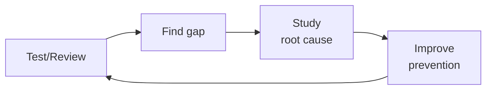

# Accessibility Testing

> **Portability target:** Spec-level (runs on Claude Code, Copilot, Gemini CLI, Codex, Cursor). No vendor-specific frontmatter fields.

Build automated accessibility testing into every layer of the CI/CD pipeline — catch violations at lint time, component test time, e2e test time, and in production monitoring before users do.

## Route the Request
<!-- QUICK: 30s -- auto-route first, then intent-route -->

### Auto-Route (No User Input Required)
Evaluate these file-system conditions in order. First match wins — jump immediately.

| # | Condition | Action |
|---|-----------|--------|
| A1 | `file_contains("package.json", "\"axe-core\"\|\"jest-axe\"\|\"@axe-core/playwright\"\|\"cypress-axe\"\|\"pa11y\"")` OR `file_contains("*", "accessibility.*test\|a11y.*test\|axe\(\)\|pa11y")` | This is your skill. Jump to **Core Workflow** — Phase 2 (CI Integration). |
| A2 | `file_contains(".github/workflows/*", "axe\|pa11y\|lighthouse.*accessibility\|a11y")` OR `file_contains("lighthouserc", "\"accessibility\"")` | Jump to **Best Practices** — CI Gates. |
| A3 | `file_contains("package.json", "\"eslint-plugin-jsx-a11y\"")` AND `file_contains("*", "aria-\|role=\|tabIndex\|alt=\|htmlFor")` | Jump to **Best Practices** — Linting. |
| A4 | `file_contains("*", "VoiceOver\|TalkBack\|NVDA\|screen.*reader\|assistive.*tech")` | Jump to **Decision Trees** — Screen Reader Automation. |
| A5 | `file_contains("*", "WCAG\|Section.*508\|EN.*301.*549\|ADA\|accessibility.*standard\|compliance")` | Jump to **Error Decoder** — Compliance Gap section. |
| A6 | `file_contains("*", "prefers-reduced-motion\|prefers-color-scheme\|prefers-contrast\|forced-colors")` | Jump to **Core Workflow** — Phase 1 (User Preference Testing). |
| A7 | `file_contains("*", "keyboard\|focus.*trap\|tab.*order\|skip.*link\|focus.*visible")` | Jump to **Production Checklist** — AT13 (Keyboard Navigation). |
| A8 | `file_contains("*", "aria-live\|role=\"alert\"\|role=\"status\"\|dynamic.*content")` AND `file_contains("*", "SPA\|router\|navigation\|page.*change")` | Jump to **Error Decoder** — Dynamic Content Announcements. |

### Intent Route (Ask the User)
If no auto-route matched, use this intent tree:

```
What do you need?
├── Add a11y testing to existing CI/CD → Jump to "Core Workflow > Phase 2"
├── Set up axe-core in unit/component tests → Go to "Core Workflow > Phase 1"
├── Add Lighthouse CI accessibility budgets → Jump to "Best Practices > CI Gates"
├── Automate screen reader testing → Go to "Decision Trees > Screen Reader Automation"
├── Catch a11y regressions on every PR → Jump to "Core Workflow > Phase 3"
├── Add a11y linting to IDE and pre-commit → Go to "Best Practices > Linting"
├── Build an accessibility monitoring dashboard → Jump to "Core Workflow > Phase 4"
├── Need manual accessibility audit → Invoke accessibility-auditor skill instead
├── Need QA test strategy including a11y → Invoke qa-engineer skill instead
├── Need CI/CD pipeline integration → Invoke ci-cd-builder skill instead
├── Need frontend a11y implementation → Invoke frontend-developer skill instead
├── Need mobile a11y testing → Invoke mobile-developer skill instead
└── Mobile accessibility testing → Go to "Decision Trees > Mobile A11y"
```

## Ground Rules — Read Before Anything Else
<!-- STANDARD: 3min -->

- **Accessibility bugs are production bugs with legal exposure.** A broken checkout flow costs revenue. A broken checkout flow that only affects screen reader users costs revenue AND exposes the company to ADA lawsuits. The severity classification must reflect this: accessibility P2 = functional P1.
- **Automated testing catches ~30-40% of accessibility issues.** The remaining 60-70% require manual testing (keyboard navigation, screen reader workflow, cognitive walkthrough). Automated testing is necessary but not sufficient. Never claim "100% a11y coverage" from automation alone.
- **Every passed accessibility check is a snapshot in time, not a guarantee.** A component that passes axe-core in isolation may fail when composed into a page with other components (focus order conflicts, heading hierarchy collisions, aria-owns cross-boundary issues). Always test at the integration level, not just the unit level.
- **Lighthouse accessibility score of 100 does NOT mean fully accessible.** Lighthouse tests ~30 automated checks. It cannot detect focus management bugs during SPA navigation, dynamic content announcements with aria-live, or keyboard trap scenarios. A 100 score is a green light for the easy stuff — manual testing covers the rest.
- **Accessibility monitoring must be continuous, not point-in-time.** The homepage passed WCAG 2.2 AA in last month's audit. Since then: the marketing team added a carousel (no pause button), the engineering team migrated to a new modal library (no focus trap), and the design team updated the color palette (new gray-on-white contrast ratio: 2.8:1, minimum: 4.5:1). Continuous monitoring catches these within 24 hours, not at the next annual audit.


## The Expert's Mindset

Master accessibility testers know that automated tools catch at most 30-40% of barriers. The rest require **human judgment, assistive technology fluency, and understanding how disabled people actually use the web.** A clean axe-core scan is the beginning, not the end.

| Cognitive Bias | Mitigation |
|----------------|------------|
| **Automation coverage illusion** — believing axe-core or Lighthouse covers the full WCAG spectrum | After every automated scan, list the success criteria it CANNOT test: 1.3.2 Meaningful Sequence, 2.4.3 Focus Order, 3.3.2 Labels or Instructions. Manual-test those explicitly. |
| **Visual-centric bias** — designing tests for what sighted users experience, ignoring screen reader, voice control, and switch device users | Every test plan must include at least one non-visual modality: screen reader (NVDA or VoiceOver), keyboard-only, or voice navigation |
| **WCAG-as-ceiling** — treating AA conformance as "done" rather than the minimum bar for usable access | After passing WCAG AA, test with actual disabled users. WCAG doesn't measure: "Can a screen reader user complete checkout in under 5 minutes?" or "Can a voice control user navigate without 47 tab stops?" |
| **Disability-sampling bias** — testing only for blindness and ignoring cognitive, motor, auditory, and seizure disabilities | Maintain a disability matrix: for each feature, document how it works for users with: low vision, blindness, deafness, motor impairment (no mouse), cognitive/learning disabilities, photosensitive epilepsy. A gap in any column is a gap in your test plan. |

### What Masters Know That Others Don't
- **That the most common accessibility failure is not a code bug — it's a design decision made 3 sprints ago that nobody questioned.** Carousels without pause buttons, custom dropdowns without ARIA, color-only error states. Catch these in design review, not QA.
- **How to reproduce the user's actual experience.** They can operate a screen reader at 3x speed, navigate solely by headings/landmarks, and feel the difference between a well-structured page and a div-soup disaster in under 30 seconds.
- **That accessibility fixes compound.** Fixing the component library's focus management fixes every page that uses those components. Find the highest-leverage fix, not the longest bug list.

### When to Break Your Own Rules
- **Ship a partially-accessible feature with a documented remediation plan.** "Not accessible at all" to "keyboard-navigable but screen reader needs work" is progress. Ship the improvement; don't block the release for perfection.
- **Accept a WCAG non-conformance when the accessible alternative is worse for disabled users.** A conforming color contrast that makes text unreadable for users with dyslexia is not accessible. User outcomes over checklists.
## Operating at Different Levels

| Level | Scope | You... |
|-------|-------|--------|
| **L1** | Single test/review | Execute defined quality procedures; follow checklists |
| **L2** | Feature quality | Own quality for a feature area; write custom test strategies |
| **L3** | System quality | Design quality strategy for a system; define gates and thresholds; mentor |
| **L4** | Org quality | Define org-wide quality standards; make investment cases for quality tooling |
| **L5** | Industry quality | Create quality methodologies adopted across the industry |

**Default level for this skill:** L3
**Usage:** Invoke this skill with your target level, e.g., "as an L3 accessibility testing, review..."

For full level definitions, see `skills/00-framework/skill-levels/SKILL.md`.

## When to Use
<!-- STANDARD: 3min -->

- You need to integrate automated accessibility testing into existing CI/CD pipelines
- You are setting up axe-core, pa11y, or Lighthouse CI for the first time
- You want to add accessibility linting to the developer workflow (IDE + pre-commit)
- You need to configure accessibility quality gates that block PRs with violations
- You are building an accessibility monitoring system to catch regressions in production
- You need to automate screen reader testing for critical user flows
- You want to add accessibility visual regression testing to catch contrast and layout issues

## Decision Trees
<!-- STANDARD: 3min -->

### Screen Reader Automation
```
What do you need to test with a screen reader?
├── Static page content and heading structure → axe-core + DOM snapshot comparison (no real SR needed)
├── Dynamic content announcements (toasts, live regions) → jest-axe + aria-live assertion tests
├── Navigation flow (tab order, skip links, landmarks) → Playwright + @guidepup/playwright + toBeFocused assertions
│   └── Example: test that Tab key follows landmarks in correct order
├── Form interaction (error announcements, required field cues) → Playwright + VoiceOver/ChromeVox automation
│   └── Use aria-live regions instead of testing actual speech output
└── Full screen reader UX → Manual testing required (automation cannot validate comprehension or usability)
    └── Supplement with: structured manual test scripts that QA follows
```

### Mobile Accessibility Testing
```
Platform?
├── iOS → XCUITest + accessibility Inspector + VoiceOver swipe gestures
│   └── Key checks: accessibilityLabel, accessibilityTraits, Modal dismiss gesture
├── Android → Espresso + AccessibilityChecks.enable() + TalkBack actions
│   └── Key checks: contentDescription, focusable, TouchTargetSizeCheck
├── React Native → @react-native-community/eslint-config + RN accessibility props assertions
│   └── Key checks: accessible, accessibilityLabel, accessibilityRole, importantForAccessibility
└── Flutter → flutter_test + SemanticsHandle + a11y audit in integration_test
    └── Key checks: Semantics widget, excludeFromSemantics, MergeSemantics
```

<!-- DEEP: 10+min -->
## Core Workflow

### Phase 1: Static + Unit-Level Testing (~1 hour setup)
Install and configure linting rules at the earliest detection layer. ESLint: `eslint-plugin-jsx-a11y` with recommended rules (alt-text, anchor-has-content, no-autofocus, tabindex-no-positive). Stylelint: `stylelint-a11y` for color and spacing rules. Run in IDE (real-time feedback) + pre-commit hook (lint-staged) + CI (fails build on violation). Configure axe-core in unit tests: `jest-axe` for React, `vitest-axe` for Vue, `jasmine-axe` for Angular. Test every component in isolation: buttons, inputs, modals, dropdowns, carousels. Store results as JUnit XML for CI dashboard ingestion.

### Phase 2: Integration + E2E Testing (~2 hours setup)
Add axe-core to Playwright or Cypress e2e tests. For Playwright: `@axe-core/playwright` — inject axe into each page, run after every navigation or state change. Configure `axe.run()` with WCAG 2.2 AA tag and specific rule exclusions (document with justification). Add pa11y for page-level audits outside e2e flows: `pa11y-ci` with a sitemap URL list, run on staging deploy. Configure Lighthouse CI: set accessibility score budget to 95 minimum. Store historical data to detect score regressions over time.

### Phase 3: CI/CD Quality Gates (~1 hour setup)
Define violation thresholds per severity level. Critical (WCAG 2.2 A violations): zero tolerance — block PR + notify author. Serious (WCAG 2.2 AA): zero new violations — existing baseline allowed, new violations block PR. Moderate (best practice): warn only — create Jira ticket, don't block. Minor (needs review): informational — no action required. Store baselines per-route in the repository so that intentional improvements update the baseline, not regressions. The gate script: count violations by severity → compare against baseline → apply threshold → return pass/fail.

### Phase 4: Production Monitoring (~1 hour setup)
Configure periodic (daily) accessibility scans of key production pages using pa11y-ci scheduled job or a hosted service (Deque Axe Monitor, Siteimprove, Tenon). Monitor: accessibility score trend, new violation count, and pages with score drops. Alert on: score dropping > 5 points in 24 hours, any new critical/serious violation on a key page, and pages missing from scan coverage. Dashboard: score per route over time, violation breakdown by WCAG criteria, time-to-fix (how long from detection to resolution).

## Best Practices
<!-- DEEP: 10+min -->
1. **Test after every DOM mutation, not just on page load.** SPA navigation, modal opens, tab switches, and infinite scroll all change the DOM. axe-core must re-run after each of these events. A page that passes on load can fail after the user opens a menu.
2. **Never globally exclude rules.** If you must exclude a rule, do it per-component or per-page with a comment explaining why and a ticket tracking the fix. Global exclusions hide regressions.
3. **Accessibility snapshot testing is fragile but valuable.** Storing axe-core results as snapshots means any DOM change may update the snapshot — but it forces developers to consciously acknowledge accessibility changes. Use sparingly on stable components.
4. **Color contrast is the most common violation — automate it everywhere.** Axe-core catches most contrast issues, but gradient backgrounds, images with text, and CSS pseudo-elements may be missed. Supplement with visual regression testing focused on contrast ratios.
5. **Track the accessibility debt ratio.** `(open violations / total checks) × 100`. A ratio trending down means the team is fixing faster than creating. A ratio trending up means the opposite. Review monthly.
6. **Focus order testing requires real keyboard simulation.** `page.keyboard.press('Tab')` in Playwright is not the same as the browser's native Tab behavior. Use `page.locator('body').press('Tab')` and verify `document.activeElement` matches the expected next element.
7. **Prefer integration tests over unit tests for a11y.** A `<Button>` component may pass axe in isolation. But 5 `<Button>` components with conflicting aria-labels inside a `<nav>` may fail at the integration level. The most common a11y bugs are compositional, not isolated.
8. **Mobile accessibility is not "small desktop accessibility."** Touch target size (minimum 44x44 CSS pixels), screen reader swipe gestures, dynamic type/text resize support, and reduced motion preferences are unique to mobile. Test on real devices, not just responsive viewports.

## Anti-Patterns
<!-- DEEP: 5min -- each anti-pattern includes machine-detectable patterns -->

| ❌ Anti-Pattern | ✅ Do This Instead | 🔍 Detect (grep / lint) | 🛡️ Auto-Prevent |
|-----------------|---------------------|--------------------------|-------------------|
| **axe-only testing** — believing a clean axe-core scan means the application is accessible. Automated tools catch ~30% of WCAG violations. | Always supplement with manual keyboard + screen reader walkthroughs. Axe is a floor, not a ceiling. Never claim "100% a11y" from automation alone. | `grep -rn "axe\(\)\|axe\.run\|jest-axe\|@axe-core" .github/workflows/ -A 5 \| grep -v "manual\|keyboard\|screen.reader\|VoiceOver\|NVDA\|human\|audit"` → finds axe CI without manual testing steps | CI: add `keyboard-test.yml` and `screen-reader-checklist.md` to the pipeline. Fail release if axe scan passes but manual checklists are not completed. |
| **ARIA misapplication** — adding `aria-*` without understanding semantics. Overriding visible text, missing parent/child relationships, using ARIA to "fix" inaccessible native elements | First rule of ARIA: don't use ARIA if native HTML works. `<button>` beats `<div role="button">` every time. | `grep -rn "role=\"button\"\|role=\"link\"\|role=\"heading\"" src/ --include="*.tsx" \| grep -v "<button\|<a\|<h[1-6]"` → finds ARIA roles on non-semantic elements where native elements would work | eslint `jsx-a11y/no-noninteractive-element-interactions: error` + `jsx-a11y/no-static-element-interactions: error`. CI: count ARIA roles on `<div>`/`<span>` — alert if > 10 per page. |
| **Color-only indicators** — using red/green as sole differentiator for state. Users with CVD (4.5% of population) cannot perceive these distinctions. | Always pair color with an icon, text label, or pattern. Error: red border + ❌ icon + "Error" text. | `grep -rn "color.*red\|color.*green\|background.*red\|background.*green" src/**/*.css \| grep -v "icon\|alt\|aria-\|svg\|pattern\|text\|label"` → finds color-only state indicators | stylelint `a11y/no-obsolete-element` rule. CI: axe-core `color-contrast` rule. Additionally: `prefers-color-scheme` + `forced-colors` media query tests. |
| **Skip-link theater** — "Skip to main content" exists in DOM but is non-functional (wrong target, hidden from focus order, no `:focus` styles) | Test skip links with keyboard: Tab from address bar → skip link must appear and receive focus. Click/Tab → must actually skip past navigation to main content. | `curl -s https://example.com \| grep -i "skip.*content\|skip.*main\|skip.*nav"` AND manually Tab-test: `document.querySelector('[href="#main"]').focus()` → verify focus moves to `#main` | CI: Playwright test: `page.keyboard.press('Tab'); await expect(page.locator('.skip-link')).toBeVisible(); await page.keyboard.press('Enter'); await expect(page.locator('#main')).toBeFocused()` |
| **Placeholder-as-label** — using `placeholder` as the only label for form inputs. Placeholders disappear on focus, have low contrast, not consistently announced. | Every input must have a persistent `<label>` or `aria-label`. Placeholder is supplementary, not primary. | `grep -rn "<input.*placeholder" src/ --include="*.tsx" \| grep -v "aria-label\|aria-labelledby\|<label\|htmlFor\|id="` → finds inputs with placeholder but no label | eslint `jsx-a11y/label-has-associated-control: error`. CI: `npx pa11y-ci --standard WCAG2AA \| grep "label-title-only"` → fail on any placeholder-as-label violations. |
| **Animation without preference check** — animations, parallax, auto-play video without `prefers-reduced-motion: reduce`. Causes vestibular disorder triggers. | Wrap all animations in `@media (prefers-reduced-motion: reduce) { *, *::before, *::after { animation-duration: 0.01ms !important; } }` | `grep -rn "animation\|transition\|@keyframes\|autoplay\|infinite" src/**/*.css src/**/*.tsx \| grep -v "prefers-reduced-motion\|@media.*reduce"` → finds animations without reduced-motion guard | stylelint `plugin/no-unsupported-browser-features` + custom rule: every `animation` declaration must have a sibling `@media (prefers-reduced-motion: reduce)` block. |
| **Responsive ≠ accessible** — assuming responsive layout is automatically accessible. 200% zoom breaks layouts, touch targets shrink < 44px. | Test at 200% zoom and on real mobile devices with screen readers. Verify all touch targets ≥ 44x44 CSS pixels at every breakpoint. | `grep -rn "min-width\|min-height\|width:\s*[0-9]\{1,2\}px\|height:\s*[0-9]\{1,2\}px" src/**/*.css \| grep -v "em\|rem\|%\|vw\|vh"` → finds hardcoded small pixel dimensions | stylelint `a11y/no-outline-none` + custom rule: `min-width` and `min-height` on interactive elements must be ≥ 44px. CI: Playwright test at `viewport: { width: 1280, height: 720 }, deviceScaleFactor: 2.5` (200% zoom) |

## Error Decoder
<!-- QUICK: 15s -- grep the console, match → fix, auto-recover -->

| 🖥️ Console Match | Symptom | Root Cause | Fix | 🔄 Auto-Recovery Loop |
|---|---|---|---|---|
| `grep "label-title-only\|label.*missing\|form.*control.*without.*label\|input.*not.*labeled"` | `axe-core: label-title-only` — payment form `<div>` elements with CSS placeholders instead of `<label>` elements. Screen reader: "edit text" with no context. | Axe rule set to `warn` instead of `error`. No one reviewed warnings dashboard for 8 months. Blind users couldn't complete checkout. | Set `axe.run({ runOnly: { type: 'tag', values: ['wcag2a', 'wcag2aa'] } })` and fail on ANY violation — not just `critical`/`serious`. | 1. `npx axe-core --rules label,label-title-only --severity error` 2. `grep -rn "<input" src/ --include="*.tsx" \| grep -v "<label\|aria-label\|aria-labelledby"` → list unlabeled inputs 3. Add `<label htmlFor="id">` or `aria-label` to every input 4. CI: fail build on any `label-title-only` warning |
| `grep "color-contrast\|contrast.*ratio\|(2\.[0-9]\|3\.[0-9]):1\b"` | `axe-core: color-contrast` passes at 4.61:1 but text unreadable on gradient background — effective contrast drops to 2.3:1 mid-gradient | Axe measures static CSS color. Gradient backgrounds, overlay images, alpha blending — all change effective contrast at runtime. | Test contrast at 3+ sampling points on gradient. Use `axe-core` with `color-contrast` at `serious`. Supplement with visual regression diffing that flags contrast changes. | 1. `grep -rn "linear-gradient\|radial-gradient\|rgba\|opacity" src/**/*.css` → identify dynamic backgrounds 2. `npx pa11y-ci --standard WCAG2AA --runner axe` on rendered pages 3. Screenshot all gradient-background text areas 4. Manually verify contrast at top/middle/bottom of each gradient |
| `grep "0 violations.*empty\|axe.*no.*violations.*but.*rendered\|test.*passes.*but.*empty"` | "No violations found" — component renders nothing in the test. Axe can't find violations on an empty DOM. | Component test imported the component but `render()` failed silently, or `axe()` ran before the component mounted. False green. | Assert component renders expected elements BEFORE running axe: `expect(screen.getByRole('button')).toBeInTheDocument()`. Minimum: verify at least 1 interactive element exists. | 1. `grep -rn "axe\(\)\|axe\.run" src/**/*.test.* -A 5 \| grep -v "expect\|assert\|toBeInTheDocument\|render\|screen"` → finds axe calls without pre-assertions 2. Template: `render(<Component />); expect(screen.getByRole('button')).toBeInTheDocument(); await expect(axe(container)).toHaveNoViolations()` 3. CI: run `jest --verbose` and flag any test with `axe()` but no prior `expect()` call |
| `grep "eslint-disable.*jsx-a11y\|eslint-disable.*a11y\|eslint-disable-next-line.*a11y"` | ESLint jsx-a11y plugin installed but developer shipped modal with no focus trap — they silenced 14 violations with inline disables | Developer added `/* eslint-disable jsx-a11y/no-noninteractive-element-interactions */` to beat the CI deadline. PR approved because reviewer only checked green checkmark. | Ban blanket disables. Use `eslint-disable-next-line` with required justification comment. CI: count disables per file — fail if > 3. Review disables like TODOs. | 1. `grep -rn "eslint-disable.*a11y" src/ --include="*.tsx" --include="*.jsx" \| wc -l` 2. If > 0 per file: require `-- reason: ISSUE-123` comment 3. CI: `npx eslint . --rule '{"eslint-comments/no-use": "error"}'` 4. PR checklist: reviewer must verify every a11y disable comment |
| `grep "TalkBack.*different.*Samsung\|One.*UI.*TalkBack\|OEM.*accessibility\|accessibility.*emulator.*works.*device.*fails"` | Mobile a11y tests pass on emulator but fail on Samsung devices — 29% of Android users see different TalkBack behavior | Samsung One UI modifies TalkBack focus traversal. Pixel TalkBack ≠ Samsung TalkBack. Emulator testing creates false confidence. | Test on at least one physical Samsung AND one Pixel device. Use Firebase Test Lab real devices. Add TalkBack focus traversal test per screen. | 1. `grep -rn "emulator\|AVD\|x86" android/ -l` → find emulator-only test configs 2. Add `device: ['Pixel7', 'SamsungGalaxyS23']` to Firebase Test Lab CI 3. `npx detox test --configuration android.release --device-name "Samsung"` 4. Assert all interactive elements receive TalkBack focus in logical order |
| `grep "EN.*301.*549\|Section.*508\|certification.*failed\|regulation.*gap"` | Lighthouse score 97 but EN 301 549 audit found 23 failures — delayed certification by 7 months | Team assumed WCAG 2.1 AA = EN 301 549. EN 301 549 adds: biometrics, interoperability with AT, documentation accessibility, real-time text. Automated tools cover ~57% of WCAG criteria — less of EN 301 549. | Map your testing coverage to the SPECIFIC regulation. Create compliance matrix: list every criterion, mark coverage (automated/manual/not-applicable). Review quarterly. | 1. `grep -rn "WCAG.*2\.[12]\|Section.*508\|EN.*301" docs/ -l` → find compliance scope docs 2. Create matrix: `for each criterion in target-standard: echo "criterion,automated_coverage,manual_required"` 3. `diff <(list-criteria EN-301-549) <(list-criteria axe-coverage)` → identify gaps 4. Hire certification consultant 12+ months before audit |

## Production Checklist
<!-- AUDIT: every item has an executable validation command -->

| ID | Checklist Item | Validation Command | Auto-Fix |
|----|----------------|--------------------|----------|
| AT1 | `eslint-plugin-jsx-a11y` installed with recommended ruleset, running in IDE and pre-commit | `grep -rn "eslint-plugin-jsx-a11y" package.json \| wc -l` → must be ≥ 1 | `npm i -D eslint-plugin-jsx-a11y && echo '{"plugins":["jsx-a11y"],"extends":["plugin:jsx-a11y/recommended"]}' >> .eslintrc.json` |
| AT2 | `jest-axe` (or framework equivalent) integrated into component unit tests | `grep -rn "jest-axe\|@axe-core/react\|vitest-axe" package.json \| wc -l` → must be ≥ 1 | `npm i -D jest-axe` and add `import { axe } from 'jest-axe'; test('a11y', async () => { const results = await axe(container); expect(results).toHaveNoViolations(); })` |
| AT3 | `@axe-core/playwright` or `cypress-axe` in e2e test suite, runs after every navigation | `grep -rn "@axe-core/playwright\|cypress-axe" tests/ -l \| wc -l` → must be ≥ 1 | `npm i -D @axe-core/playwright` and add `await new AxeBuilder({ page }).analyze()` after each `page.goto()` |
| AT4 | `pa11y-ci` configured with sitemap-based URL list, runs on staging deploy | `grep -rn "pa11y-ci\|pa11y" .pa11yci.json package.json .github/workflows/ -l \| wc -l` → must be ≥ 1 | Create `.pa11yci.json` with `{ "urls": ["https://staging.example.com/", "https://staging.example.com/login"] }` |
| AT5 | Lighthouse CI accessibility budget: minimum score 95 | `grep -rn "accessibility.*budget\|assert.*accessibility" lighthouserc.* \| grep "95\|100" \| wc -l` → must be ≥ 1 | Set `ci: { assert: { assertions: { "categories:accessibility": ["error", { minScore: 0.95 }] } } }` in `lighthouserc.json` |
| AT6 | CI/CD quality gate: zero new critical (A) or serious (AA) violations vs. baseline | `grep -rn "axe.*baseline\|pa11y.*baseline\|new.*violation\|violation.*delta" .github/workflows/ -l \| wc -l` → must be ≥ 1 | CI: `npx pa11y-ci --compare baseline.json`. Fail if new violations appear. Only flag delta from baseline. |
| AT7 | Violation baseline stored per-route in repository, updated with intentional fixes | `find . -name "baseline*.json" -o -name "pa11y-results*.json" \| wc -l` → must be ≥ 1 per route | `npx pa11y-ci --save baseline.json`. Commit baseline per route: `baselines/homepage.json`, `baselines/login.json` |
| AT8 | Rule exclusions documented per-component with justification and fix tracking ticket | `grep -rn "aria-allowed-role\|duplicate-id\|heading-order" src/ --include="*.tsx" \| grep -v "ISSUE-\|TODO\|FIXME\|justification" \| wc -l` → must be 0 (all exclusions tracked) | Template: `{ "rules": { "heading-order": { "enabled": false } }, "exclude": [".third-party-widget"], "justification": "ISSUE-456: Third-party chat widget, vendor fix ETA Q3" }` |
| AT9 | Production monitoring: daily accessibility scan of top 20 pages | `grep -rn "cron\|schedule\|daily" .github/workflows/*a11y* -l \| wc -l` → must be ≥ 1 | GitHub Actions: `on: schedule: - cron: '0 6 * * *'` to run `npx pa11y-ci --sitemap https://example.com/sitemap.xml --limit 20` |
| AT10 | Alert for accessibility score drop > 5 points in 24 hours | `grep -rn "alert\|notify\|slack\|pagerduty" .github/workflows/*a11y* -A 3 \| grep "score.*drop\|score.*decrease\|regression" \| wc -l` → must be ≥ 1 | CI: `if [ $(echo "$CURRENT < $PREVIOUS - 5" \| bc) -eq 1 ]; then npx slack-notify "A11y score dropped $(echo $PREVIOUS - $CURRENT \| bc) points — investigate"; fi` |
| AT11 | Mobile: Espresso AccessibilityChecks (Android) + XCUITest a11y checks (iOS) enabled | `grep -rn "AccessibilityChecks\|setRunChecksFromRootView\|UIAccessibility" android/ ios/ -l \| wc -l` → must be ≥ 2 | Android: `AccessibilityChecks.enable().setRunChecksFromRootView(true)` in test setup. iOS: `XCUIApplication().launchArguments = ["-UIAccessibilityEnabled", "YES"]` |
| AT12 | Accessibility debt ratio tracked monthly with trend | `grep -rn "debt\|ratio\|backlog\|baseline.*count" .github/workflows/*a11y* -A 2 \| grep "monthly\|trend\|graph" \| wc -l` → must be ≥ 1 | Monthly script: `curl -s "https://pa11y-dashboard/api/violations" \| jq '{total: length, critical: [.[] \| select(.severity=="critical")] \| length}' >> debt-trend.json` |
| AT13 | Keyboard navigation test covers tab order, skip links, focus traps, Escape | `grep -rn "keyboard\|tab.*order\|focus.*trap\|skip.*link\|Escape.*key" tests/ --include="*.spec.*" -l \| wc -l` → must be ≥ 1 per critical flow | Playwright: `await page.keyboard.press('Tab'); await expect(page.locator('[data-testid="skip-link"]')).toBeFocused(); await page.keyboard.press('Enter'); await expect(page.locator('#main')).toBeFocused()` |
| AT14 | Screen reader test scripts maintained for top 5 user flows (manual checklist) | `find docs/ -name "*screen-reader*" -o -name "*voiceover*" -o -name "*a11y-checklist*" \| wc -l` → must be ≥ 1 | Create `docs/screen-reader-checklist.md`: list steps for each flow with expected VoiceOver announcements. Update monthly. |

## Negative Constraints
<!-- HARD GATES: these are non-negotiable — the agent must REFUSE/STOP/DETECT -->

| # | Negative Constraint | Mechanical Trigger | Violation Response |
|---|---------------------|--------------------|---------------------|
| NC1 | REFUSE: Do not claim "accessible" based solely on automated tool results — automation catches at most 57% of WCAG | `grep -rn "accessible\|WCAG.*compliant\|a11y.*pass\|a11y.*clean" docs/ README.md --include="*.md" \| grep -v "manual\|human.*audit\|screen.*reader\|keyboard\|assistive"` → claims without manual testing caveat = violation | STOP. Append to every accessibility claim: "per automated testing (axe-core + Lighthouse). Manual keyboard and screen reader testing required for full WCAG 2.2 AA conformance." |
| NC2 | REFUSE: Do not ship a build where `eslint-disable` comments silence `jsx-a11y` rules — each disable is potential ADA exposure | `grep -rn "eslint-disable.*jsx-a11y\|eslint-disable.*a11y" src/ --include="*.tsx" --include="*.jsx" \| wc -l` → > 3 per file = violation | STOP. Require `-- reason: ISSUE-XXX` justification on every disable. CI must count disables per file: > 3 = BLOCK. > 0 without issue reference = BLOCK. Review all disables in PR. |
| NC3 | DETECT: Placeholder used as sole label on form inputs — screen readers lose context on focus | `grep -rn "<input.*placeholder" src/ --include="*.tsx" \| grep -v "aria-label\|aria-labelledby\|<label\|htmlFor\|id=" \| wc -l` → > 0 = violation | BLOCK merge. Add `<label htmlFor="id">` or `aria-label` to every input that currently only has `placeholder`. `eslint: jsx-a11y/label-has-associated-control: error`. |
| NC4 | DETECT: Animations without `prefers-reduced-motion` guard — physical harm risk for users with vestibular disorders | `grep -rn "animation\|transition\|@keyframes" src/**/*.css \| grep -v "prefers-reduced-motion\|@media.*reduce\|animation-duration.*0" \| wc -l` → > 0 = violation | BLOCK merge. Add `@media (prefers-reduced-motion: reduce) { *, *::before, *::after { animation-duration: 0.01ms !important; transition-duration: 0.01ms !important; } }` globally. |
| NC5 | REFUSE: Do not ship a mobile build without accessibility checks on at least one physical Samsung device AND one Pixel device | Check CI config: `grep -rn "Pixel\|Samsung\|Firebase.*Test.*Lab\|physical.*device" .github/workflows/*a11y* \| wc -l` → < 2 = violation. Emulator-only = violation. | STOP release. Samsung One UI modifies TalkBack behavior. Add Firebase Test Lab with physical `Pixel7` AND `SamsungGalaxyS23` devices. Run `AccessibilityChecks.enable()` on both. |
| NC6 | DETECT: Color used as sole indicator of state — users with CVD (4.5% of population) cannot distinguish | `grep -rn "color.*red\|color.*green\|background.*red\|background.*green" src/**/*.css \| grep -v "icon\|svg\|aria-\|pattern\|border\b" \| wc -l` → > 0 in state-indicating contexts = violation | BLOCK merge. Pair color with: (1) icon, (2) text label, (3) pattern. `stylelint a11y/no-obsolete-element`. CI: axe-core `color-contrast` + manual review of color-only state changes. |
| NC7 | DETECT: Baseline violation count trending up — accessibility debt accumulating silently | `diff <(cat baseline.json \| jq '.violations \| length') <(cat baseline-prev.json \| jq '.violations \| length')` → current > previous = violation | BLOCK release. Baseline must decrease or stay flat. Require: every sprint closes ≥ 10% of baseline violations. Baseline violations > 90 days old require director approval. The only acceptable trend is down. |

## Calibration — How to Know Your Level
<!-- STANDARD: 3min — honest self-assessment rubric -->

| You Know You're Stuck at L1 When... | You Know You've Reached L2 When... | You Know You're L3 When... |
|---|---|---|
| You run axe-core and think "0 violations" means the site is accessible — you've never tested with a screen reader | You triage every axe violation: "This is a real issue (must fix)" vs. "This is a false positive (document why)" vs. "This needs manual review (schedule screen reader test)" | You've designed an accessibility testing strategy where automated tools catch >80% of WCAG violations before a human auditor touches the page — and you can prove it with audit data |
| You disable accessibility lint rules to ship faster and tell yourself "we'll fix it later" | Your baseline violation count trends DOWN every sprint — you close more violations than you accumulate | A VPAT you authored survived an ADA lawsuit because your automated CI audit trail produced timestamped evidence of every violation detection, fix, and verification |
| You think accessibility testing is "just running axe" — you've never done a keyboard-only walkthrough of your own product | You maintain per-route violation baselines, a separate manual test script for screen reader flows, and a keyboard navigation test suite — and all three run on every release | You've trained an entire engineering org on accessibility testing, and 12 months later, accessibility bugs reported by users dropped 70% |

**The Litmus Test:** Can you audit a production web application and correctly identify which WCAG SC violations CANNOT be detected by ANY automated tool (axe-core, Lighthouse, pa11y)? If you can't name at least 5 such categories (e.g., focus order meaningfulness, error suggestion clarity, link purpose in context), you're not L3 yet.

## Cross-Skill Coordination
<!-- STANDARD: 3min -->

| Upstream Skill | What You Receive | When to Involve |
|---|---|---|
| `accessibility-auditor` | WCAG criteria interpretation, manual audit findings, accessibility acceptance criteria, violation priority | Before configuring automated rules; ensures testing tool detects the right patterns |
| `qa-engineer` | Test framework config, Playwright/Cypress integration, test baselines, regression suite structure | Before integrating a11y tests into the test pyramid |
| `ci-cd-builder` | Pipeline config, quality gate scripts, dashboard integration, blocking vs warning thresholds | Before wiring accessibility checks into CI/CD |

| Downstream Skill | What You Provide | Impact of Delay |
|---|---|---|
| `frontend-developer` | ESLint config (jsx-a11y), jest-axe setup, component test patterns, violation baselines per route | Developers ship inaccessible components — expensive retrofit, potential legal exposure |
| `qa-engineer` | Accessibility test suite integration, pa11y-ci config, Lighthouse CI budget, violation regression baselines | QA can't include accessibility in regression testing — gaps in coverage |
| `accessibility-auditor` | Automated violation reports, violation trend data, CI gate pass/fail history | Auditor can only do one-time manual audits — no continuous monitoring |
| `mobile-developer` | Espresso AccessibilityChecks config, XCUITest a11y integration, mobile accessibility CI setup | Mobile ships with accessibility regressions — Play Store/App Store may reject |

### Communication Triggers

| Trigger | Notify | Why |
|---|---|---|
| Accessibility score drops >5 points in 24 hours | Accessibility Auditor, Frontend Developer | Investigate regression; may block release |
| New critical (A) or serious (AA) violation found in CI | PR author, Accessibility Auditor | Fix before merge; zero-tolerance for new critical/AA |
| Rule exclusion requested for a component | Accessibility Auditor | Justification review; may require VPAT update |
| Production monitoring detects accessibility degradation | Accessibility Auditor, Frontend Developer | Immediate investigation; legal/compliance risk |

### Escalation Path

```
Blocked by inaccessible third-party component? → Accessibility Auditor → Legal Advisor (VPAT review)
ADA/Section 508 complaint received? → Legal Advisor → Compliance Officer → CTO
Accessibility score < 70 on critical user flow? → Product Manager → CTO Advisor
```

## Proactive Triggers

| Trigger | Action | Rationale |
|---|---|---|
| New UI component added | Run axe-core on component in isolation and within the page layout; verify ARIA labels, roles, and focus management | New components are the most common source of accessibility regressions — catch violations at the component level before they propagate |
| Color scheme, theme, or design token change | Run automated contrast ratio checks on all affected component states (default, hover, focus, disabled, error) | A palette change that passes WCAG AA for one state can fail for another — check the full state matrix |
| New form or form step added | Verify all inputs have persistent labels, error messages are linked via `aria-describedby`, required fields are marked, and keyboard tab order is logical | Forms are the #1 interaction point between users and services — inaccessible forms block core business functions |
| Navigation structure change (menu, tabs, routing) | Test keyboard navigation: verify focus order matches visual order, skip links work, focus is not trapped, and active element is always visible | Navigation is the skeleton of accessibility — if users can't navigate, they can't use anything else |
| Third-party component or library introduced | Audit the component's accessibility documentation and VPAT; run axe against the component in your actual usage context | Third-party components often have incomplete ARIA implementations — test in your real DOM, not the library's demo page |
| CI pipeline for frontend configured | Wire axe-core into component tests and E2E tests; set Lighthouse CI accessibility budget (minimum score 95); enforce zero new critical/serious violations baseline | CI gates prevent regressions from reaching production — the most effective time to catch a violation is before it merges |
| Production accessibility score drops >5 points in 24 hours | Trigger investigation; check recent deploys for DOM structure changes, new components, or third-party script additions | Production monitoring catches regressions that slip through CI — page composition at runtime differs from test environments |

**Service Interaction Designs:**

| Interaction | Design Detail |
|---|---|
| A11y ↔ Frontend | eslint-plugin-jsx-a11y enforces semantic HTML at the IDE level. Component library enforces accessible patterns (required `aria-label` on icon buttons, `alt` text on images). Design system tokens include accessible color pairings with pre-verified contrast ratios. |
| A11y ↔ CI/CD | axe-core integrated into Playwright/Cypress E2E tests — runs after every navigation and DOM mutation. pa11y-ci scans sitemap-based URL list on staging deploy. Lighthouse CI enforces minimum 95 accessibility score with budget. Zero new critical (A) or serious (AA) violations against stored baseline blocks merge. |
| A11y ↔ Mobile | Espresso AccessibilityChecks (Android) and XCUITest accessibility checks (iOS) enabled in mobile CI. Touch target size enforcement (44x44dp minimum). Dynamic type/text resize testing on real devices. Reduced motion preference testing. |
| A11y ↔ QA | Accessibility test suite integrated into the regression suite. Violation baseline tracked per-route. Accessibility debt ratio tracked monthly. QA owns the manual screen reader + keyboard navigation walkthrough for top 5 user flows. |
| A11y ↔ Design | Design tokens include contrast-verified color pairings. Component specs include accessibility requirements (focus order, ARIA roles, keyboard interactions). Design review includes accessibility checklist before handoff. |
| A11y ↔ Legal/Compliance | VPAT (Voluntary Product Accessibility Template) updated per release. WCAG conformance level (A/AA/AAA) documented per feature. ADA/Section 508 compliance evidence collected from CI audit trail. Legal notified of any pattern of accessibility regressions. |

## Scale Depth: Solo → Small → Medium → Enterprise
<!-- STANDARD: 3min -->

### Solo
Developer tests manually with VoiceOver/TalkBack, basic axe-core scan. Focus: catching obvious issues before shipping. Skip: formal audit documentation, user testing with assistive tech.

### Small Team
Dedicated QA runs accessibility checks, automated axe-core in CI, basic screen reader testing. Focus: WCAG 2.1 AA compliance. Coordination: with designers on color contrast and touch targets, with developers on semantic HTML for screen readers.

### Medium Team
Accessibility testing team, dedicated assistive tech lab, user testing with PWD. Focus: WCAG 2.2 AA, platform-specific guidelines. Coordination: with legal on compliance documentation, with product on accessibility roadmaps.

### Enterprise
Full accessibility program, VPATs per product, WCAG AAA targets, continuous monitoring. Focus: regulatory compliance (ADA, Section 508, EN 301 549). Coordination: with legal on lawsuit defense, with marketing on inclusive brand positioning.

### Transition Triggers
| From → To | Trigger |
|-----------|---------|
| Solo → Small | First accessibility complaint; enterprise customer requires VPAT |
| Small → Medium | Operating in regulated market (EU, healthcare); >100K users |
| Medium → Enterprise | Legal requirement (Section 508, ADA lawsuit risk); IPO or government contract |

## What Good Looks Like
<!-- STANDARD: 3min -->

**What good looks like:** A developer opens a PR that changes a button component from a `<div>` with an onClick handler to a native `<button>`. The CI pipeline runs. ESLint passes (the `<div>` would have been caught by `jsx-a11y/no-static-element-interactions`). Unit tests pass (jest-axe confirms the button has an accessible name). E2e tests pass (axe-core finds no new violations on any page containing the button). The accessibility dashboard in CI shows a green check and a baseline diff of "+0 new, -1 fixed" because the old `<div>` violation is now resolved. The developer didn't think about accessibility at all — the pipeline caught everything. That's what good looks like.

## Deliberate Practice



| Level | Practice | Frequency |
|-------|----------|-----------|
| **Novice** | Review your own work from 3 months ago; catalog everything you'd now flag | Monthly |
| **Competent** | Shadow a more senior reviewer; compare their findings to yours; study the delta | Weekly |
| **Expert** | Design a new quality gate; measure false positive/negative rates; tune for 6 months | Quarterly |
| **Master** | Create a training module that teaches others your quality intuition; measure their improvement | Quarterly |

**The One Highest-Leverage Activity:** Keep a "mistakes journal." Every time you miss something, write down: what you missed, why you missed it, and what rule would have caught it.

## References
<!-- STANDARD: 3min -->

- axe-core API Reference: https://github.com/dequelabs/axe-core/blob/develop/doc/API.md
- jest-axe Setup Guide: https://github.com/nickcolley/jest-axe
- @axe-core/playwright: https://www.npmjs.com/package/@axe-core/playwright
- pa11y-ci Configuration: https://github.com/pa11y/pa11y-ci
- Lighthouse CI: https://github.com/GoogleChrome/lighthouse-ci
- eslint-plugin-jsx-a11y: https://github.com/jsx-eslint/eslint-plugin-jsx-a11y
- WCAG 2.2 Quick Reference: https://www.w3.org/WAI/WCAG22/quickref/
- Deque Axe Monitor: https://www.deque.com/axe/monitor/
- Android Accessibility Testing (Espresso): https://developer.android.com/guide/topics/ui/accessibility/testing
- iOS Accessibility Testing (XCUITest): https://developer.apple.com/documentation/xctest/accessibility
