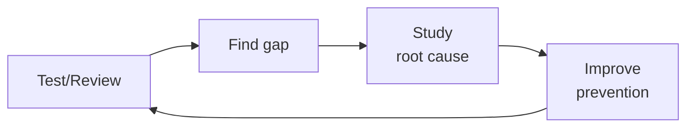

# API Test Suite Builder

Automatically scan API route definitions and generate comprehensive test suites covering auth, input validation, error codes, pagination, file uploads, and rate limiting. Outputs ready-to-run test files for Vitest+Supertest (Node.js) or Pytest+httpx (Python).

## Route the Request
<!-- QUICK: 30s -- auto-route first, then intent-route -->

### Auto-Route (No User Input Required)
Evaluate these file-system conditions in order. First match wins — jump immediately.

| # | Condition | Action |
|---|-----------|--------|
| A1 | `file_contains("*", "jest\|vitest\|mocha\|playwright\|supertest\|cypress")` AND `file_contains("*", "test\(")|"\.spec\.\|\.test\.\|__tests__"` | This is your skill. Jump to **Core Workflow** — Phase 1 (Route Detection). |
| A2 | `file_contains("*", "OpenAPI\|swagger\.json\|openapi\.json\|openapi\.yaml")` OR `file_exists("openapi.yaml\|openapi.json\|swagger.json")` | Jump to **Core Workflow** — Phase 3 (Batch Generation from Spec). |
| A3 | `file_contains("*", "mutation.*test\|Stryker\|PIT\|mutmut")` OR `file_contains("*", "surviving.*mutant\|mutation.*score")` | Jump to **Error Decoder** — Mutation Testing section. |
| A4 | `file_contains("*", "auth.*middleware\|auth.*guard\|require_auth\|authenticate\|JWT\|OAuth")` AND `file_contains("*", "role\|permission\|RBAC\|authorize")` | Jump to **Decision Trees** — Auth Test Matrix. |
| A5 | `file_contains("*", "pagination\|limit=\|offset=\|cursor\|page=\|per_page")` OR `file_contains("*", "sort=\|order=\|orderBy")` | Jump to **Production Checklist** — AT6 (Boundary Tests). |
| A6 | `file_contains("*", "Stryker\|mutation\|mutant.*surviv\|kill.*rate")` OR `file_contains("*", "mutation.*testing\|mutation.*coverage")` | Jump to **Core Workflow** — Phase 4 (Mutation Testing). |
| A7 | `file_contains("*", "rate.*limit\|rateLimit\|throttle\|429\|Too Many Requests")` | Jump to **Production Checklist** — AT8 (Rate Limit Tests). |
| A8 | `file_contains("*", "validation\|zod\|joi\|yup\|class-validator\|express-validator")` AND `file_contains("*", "required\|minLength\|maxLength\|pattern\|enum")` | Jump to **Core Workflow** — Phase 2 (Input Validation Matrix). |

### Intent Route (Ask the User)
If no auto-route matched, use this intent tree:

```
Request: "Generate API tests for..."
├── ...a specific endpoint? → Jump to Core Workflow Phase 1 (Route Detection)
├── ...the entire project? → Jump to Core Workflow Phase 3 (Batch Generation)
├── ...auth endpoints only? → Use auth test matrix in Decision Trees
├── ...a legacy API with no tests? → Jump to Error Decoder (Legacy API)
└── Don't know where to start?
    → Run: find your route files first. I'll help you scan.
```

## Ground Rules — Read Before Anything Else
<!-- STANDARD: 3min -->

1. **Error paths first, happy paths second.** 80% of bugs live in error handling, not the golden path. Every endpoint gets auth matrix + input validation matrix before the success case.
2. **Test behavior, not implementation.** Assert what the API returns (status codes, response shape, headers), not how the handler achieves it. Tests survive refactors when they assert outcomes.
3. **No hardcoded test data.** Use factories or fixtures for IDs, tokens, and test entities. Tests that pass against one database instance fail against another.
4. **One describe block per endpoint.** Isolation makes failures instantly diagnosable. No scrolling through a 500-line test file guessing which endpoint broke.
5. **Rate limit tests go last.** They interfere with parallel test execution. Run them in a separate suite or mark them with a `@pytest.mark.slow` equivalent.


## The Expert's Mindset

Master API test suite builders know that tests are not about coverage percentages — they're about **making contract violations impossible to ship.** The best test suite is the one that fails exactly when the API behavior changes in a way that would break consumers.

| Cognitive Bias | Mitigation |
|----------------|------------|
| **Happy-path coverage trap** — 95% test coverage that only tests success responses and misses edge cases | Audit your test suite: what percentage test error responses, auth failures, rate limiting, and malformed inputs? If it's under 30%, you have a coverage illusion. |
| **Mock-everything syndrome** — mocking databases, caches, queues, and external services until the tests test nothing real | Every test suite needs at least one integration test that hits real dependencies. Mocks lie; contracts don't. |
| **Snapshot-creep** — auto-approving snapshot changes without understanding what changed and why | Every snapshot diff must be reviewed by a human who can explain why the output changed. If nobody knows, the test is testing luck. |
| **Flaky-test normalization** — accepting that "those 3 tests always fail on CI, just re-run" | Flaky tests are production bugs in your test infrastructure. Every flake gets 1 hour of investigation before it's quarantined. Zero-tolerance after 3 occurrences. |

### What Masters Know That Others Don't
- **The 5 API contracts that, if broken, cause the most consumer incidents** — these get contract tests with the strictest validation, not just schema checks but semantic assertions (response time, idempotency, ordering)
- **That test data is as important as test logic** — realistic, diverse test data finds more bugs than clever test scenarios with trivial data. Invest in data factories that generate edge cases automatically.
- **When to delete a test** — tests have a half-life. A test written 2 years ago for a feature that's been refactored 4 times is testing historical behavior, not current expectations. Delete tests that don't map to current contracts.

### When to Break Your Own Rules
- **Skip tests for a throwaway prototype that will be rebuilt.** But write the contract test first — it documents the API shape even if the implementation changes.
- **Relax coverage gates for generated code or thin proxies.** 100% coverage on a generated gRPC stub is noise. 100% coverage on hand-written business logic is table stakes.
## Operating at Different Levels

| Level | Scope | You... |
|-------|-------|--------|
| **L1** | Single test/review | Execute defined quality procedures; follow checklists |
| **L2** | Feature quality | Own quality for a feature area; write custom test strategies |
| **L3** | System quality | Design quality strategy for a system; define gates and thresholds; mentor |
| **L4** | Org quality | Define org-wide quality standards; make investment cases for quality tooling |
| **L5** | Industry quality | Create quality methodologies adopted across the industry |

**Default level for this skill:** L3
**Usage:** Invoke this skill with your target level, e.g., "as an L3 api test suite builder, review..."

For full level definitions, see `skills/00-framework/skill-levels/SKILL.md`.

## When to Use
<!-- QUICK: 30s — scan the bullet list to decide if this skill fits -->

- New API added — generate test scaffold before writing implementation (TDD)
- Legacy API with zero test coverage — scan and generate baseline
- API contract review — verify existing tests match current route definitions
- Pre-release regression check — ensure every route has at least smoke tests
- Security audit prep — generate adversarial input tests
- Onboarding new team members — auto-generated tests document expected API behavior

## Decision Trees
<!-- STANDARD: 3min -->

### Test Framework Selection

```
What language is the API written in?
├── TypeScript/JavaScript (Node.js)
│   ├── Next.js App Router? → Vitest + Supertest
│   ├── Express? → Vitest + Supertest
│   └── Other (Hono, Fastify)? → Vitest + built-in test client
├── Python
│   ├── FastAPI? → Pytest + httpx (async)
│   ├── Django REST? → Pytest + Django test client
│   └── Flask? → Pytest + Flask test client
└── Go / Rust / Java?
    → Use the framework's native test runner. Same matrices apply.
```

### Test Depth by Endpoint Criticality

```
How critical is this endpoint?
├── Auth / Payments / PHI access (P0)
│   → Full matrix: auth × 6, validation × 11, error codes, pagination, rate limiting
├── Core CRUD / Business logic (P1)
│   → Standard: auth × 4, validation × 8, error codes
└── Utility / Health check / Metadata (P2)
    → Smoke: auth × 2, happy path, 404 check
```

### Coverage Mode Selection

```
What's the goal?
├── Baseline coverage (legacy API, no tests) → Scan all routes, generate smoke tests for every endpoint
├── TDD (new feature) → Generate test scaffold from spec/OpenAPI, write tests before implementation
├── Audit (existing tests) → Compare route definitions against test files, flag uncovered endpoints
└── Pre-release (regression gate) → Verify every route has at minimum: auth test + happy path + 400/401/404
```

## Core Workflow
<!-- STANDARD: 5min -->

### Phase 1: Route Detection (5 min)

Scan the codebase to extract all API endpoints with their HTTP methods, paths, and auth requirements.

**Next.js App Router:**
```bash
find ./app/api -name "route.ts" | while read f; do
  route=$(echo $f | sed 's|./app||' | sed 's|/route.ts||')
  methods=$(grep -oE "export (async )?function (GET|POST|PUT|PATCH|DELETE)" "$f" | grep -oE "(GET|POST|PUT|PATCH|DELETE)")
  echo "$methods $route"
done
```

**Express:**
```bash
grep -rn "router\.\(get\|post\|put\|delete\|patch\)\|app\.\(get\|post\|put\|delete\|patch\)" src/ --include="*.ts" | grep -oE "(get|post|put|delete|patch)\(['\"][^'\"]*['\"]"
```

**FastAPI:**
```bash
grep -rn "@\(app\|router\)\.\(get\|post\|put\|delete\|patch\)" . --include="*.py" | grep -oE "@(app|router)\.(get|post|put|delete|patch)\(['\"][^'\"]*['\"]"
```

**Django REST:**
```bash
grep -rn "router\.register\|DefaultRouter\|SimpleRouter" . --include="*.py"
```

### Phase 2: Read Route Handlers (10 min)

For each detected route, read the handler to understand:
- Expected request body schema (fields, types, required vs optional)
- Auth requirements (middleware, decorators, token validation)
- Return types and status codes (200, 201, 204, etc.)
- Business rules (ownership checks, role requirements, rate limits)
- File upload expectations (max size, allowed MIME types)

### Phase 3: Generate Test Files (15 min)

Generate one test file per route group with this structure:

```typescript
// tests/api/users.test.ts — Vitest + Supertest
import { describe, it, expect, beforeAll, afterAll } from 'vitest';
import request from 'supertest';
import { createTestApp } from '../helpers/app';
import { createTestUser, getAuthToken } from '../helpers/auth';

describe('POST /api/v1/users', () => {
  let app: Express;
  let adminToken: string;
  let userToken: string;

  beforeAll(async () => {
    app = await createTestApp();
    adminToken = await getAuthToken({ role: 'admin' });
    userToken = await getAuthToken({ role: 'user' });
  });

  // ── Auth Matrix ──────────────────────────────
  it('returns 401 when no Authorization header', async () => {
    const res = await request(app).post('/api/v1/users').send({ name: 'Test' });
    expect(res.status).toBe(401);
  });

  it('returns 401 when token is expired', async () => {
    const res = await request(app)
      .post('/api/v1/users')
      .set('Authorization', `Bearer ${EXPIRED_TOKEN}`)
      .send({ name: 'Test' });
    expect(res.status).toBe(401);
  });

  it('returns 403 when user lacks admin role', async () => {
    const res = await request(app)
      .post('/api/v1/users')
      .set('Authorization', `Bearer ${userToken}`)
      .send({ name: 'Test', email: 'test@example.com' });
    expect(res.status).toBe(403);
  });

  it('returns 401 when token is from deleted user', async () => {
    const res = await request(app)
      .post('/api/v1/users')
      .set('Authorization', `Bearer ${DELETED_USER_TOKEN}`)
      .send({ name: 'Test' });
    expect(res.status).toBe(401);
  });

  // ── Input Validation Matrix ──────────────────
  it('returns 422 when body is empty', async () => {
    const res = await request(app)
      .post('/api/v1/users')
      .set('Authorization', `Bearer ${adminToken}`)
      .send({});
    expect(res.status).toBe(422);
  });

  it('returns 422 when required field "email" is missing', async () => {
    const res = await request(app)
      .post('/api/v1/users')
      .set('Authorization', `Bearer ${adminToken}`)
      .send({ name: 'Test' });
    expect(res.status).toBe(422);
    expect(res.body.errors).toContainEqual(
      expect.objectContaining({ field: 'email' })
    );
  });

  it('returns 422 when email format is invalid', async () => {
    const res = await request(app)
      .post('/api/v1/users')
      .set('Authorization', `Bearer ${adminToken}`)
      .send({ name: 'Test', email: 'not-an-email' });
    expect(res.status).toBe(422);
  });

  it('returns 422 when name exceeds max length', async () => {
    const res = await request(app)
      .post('/api/v1/users')
      .set('Authorization', `Bearer ${adminToken}`)
      .send({ name: 'x'.repeat(256), email: 'test@example.com' });
    expect(res.status).toBe(422);
  });

  it('sanitizes SQL injection in name field', async () => {
    const res = await request(app)
      .post('/api/v1/users')
      .set('Authorization', `Bearer ${adminToken}`)
      .send({ name: "'; DROP TABLE users; --", email: 'test@example.com' });
    expect(res.status).toBe(422); // or 201 if sanitized
  });

  it('sanitizes XSS payload in name field', async () => {
    const res = await request(app)
      .post('/api/v1/users')
      .set('Authorization', `Bearer ${adminToken}`)
      .send({ name: '<script>alert(1)</script>', email: 'test@example.com' });
    expect(res.status).toBe(422);
  });

  // ── Happy Path ───────────────────────────────
  it('returns 201 with user object on valid request', async () => {
    const res = await request(app)
      .post('/api/v1/users')
      .set('Authorization', `Bearer ${adminToken}`)
      .send({ name: 'Jane Doe', email: 'jane@example.com' });
    expect(res.status).toBe(201);
    expect(res.body).toMatchObject({
      id: expect.any(String),
      name: 'Jane Doe',
      email: 'jane@example.com',
    });
    expect(res.body).not.toHaveProperty('password_hash');
  });

  // ── Duplicate Detection ──────────────────────
  it('returns 409 when email already exists', async () => {
    await request(app)
      .post('/api/v1/users')
      .set('Authorization', `Bearer ${adminToken}`)
      .send({ name: 'Existing', email: 'dup@example.com' });

    const res = await request(app)
      .post('/api/v1/users')
      .set('Authorization', `Bearer ${adminToken}`)
      .send({ name: 'Duplicate', email: 'dup@example.com' });
    expect(res.status).toBe(409);
  });
});
```

### Phase 4: Validate and Integrate (5 min)

- Run tests: `npm test -- --coverage` or `pytest --cov`
- Verify all tests pass (or fail for the right reasons in TDD mode)
- Add to CI pipeline: `npm test` gate in GitHub Actions
- Generate coverage baseline for future comparison

## Cross-Skill Coordination
<!-- STANDARD: 3min -->

| Upstream Skill | What to Expect | Communication Trigger |
|---------------|----------------|---------------------|
| `api-designer` | OpenAPI spec, endpoint contracts, request/response schemas | When spec changes — regenerate test matrices |
| `backend-developer` | Route handler implementations, middleware, auth patterns | When new endpoint is added — auto-detect and generate tests |
| `fullstack-developer` | API consumption patterns, real-world usage edge cases | When frontend discovers API edge case — add test case |
| `qa-engineer` | Test strategy, coverage thresholds, test pyramid decisions | When QA defines new quality gates — update test depth matrices |
| `security-reviewer` | Adversarial input patterns, security test scenarios | When new vulnerability class is identified — add to validation matrix |

| Downstream Skill | What to Deliver | Communication Trigger |
|-----------------|-----------------|---------------------|
| `ci-cd-builder` | Test scripts for CI pipeline, coverage thresholds | When new test suite is generated — provide CI integration YAML |
| `code-reviewer` | Test coverage report, uncovered endpoints list | When PR is opened — report test coverage delta |
| `qa-engineer` | Generated test suites, coverage reports, route-to-test mapping | When coverage drops below threshold — escalate |

## Proactive Triggers
<!-- STANDARD: 2min — surface these WITHOUT being asked -->

- **Route without tests** → An endpoint exists in the codebase but has zero test coverage. Flag the file and method. 🔴
- **Test only covers happy path** → An endpoint has auth and validation tests missing. Generate the missing matrices. 🟡
- **Hardcoded test data** → Test uses a literal ID, token, or entity that will break in a different environment. Flag for fixture replacement. 🟡
- **Missing error code coverage** → Endpoint has 200 tests but no 400/401/403/404/409/422 tests. 80% of bugs live here. 🟡
- **Shared mutable state** → Tests modify global state without cleanup. Flag `afterEach`/`afterAll` gaps. 🟡
- **Rate limit tests in main suite** → Rate limit tests that sleep/wait will slow down the entire suite. Move to separate suite. 🟠
- **Outdated test vs route** → Route handler changed (new params, different auth) but tests weren't updated. Flag drift. 🔴
- **Sensitive field leaked in response** → Test asserts success but doesn't verify password_hash, secret, or internal fields are absent. Flag. 🔴

## Best Practices
<!-- STANDARD: 3min -->

1. **One describe block per endpoint** — failures are instantly diagnosable. No scrolling.
2. **Seed minimal data** — create only what the test needs in `beforeAll`. Don't load the entire database.
3. **Assert response shape, not just status code** — a 200 with a missing field is a bug. Validate the full response schema.
4. **Use parametrized tests for validation matrices** — `it.each` (Vitest) or `@pytest.mark.parametrize` reduces 11 validation tests to 5 lines.
5. **Test that sensitive fields are ABSENT** — `expect(res.body).not.toHaveProperty('password_hash')` is as important as asserting presence.
6. **Always test the "missing header" case separately from "invalid token"** — they trigger different code paths and return different errors.
7. **Name tests descriptively** — `"returns 401 when token is expired"` not `"auth test 3"`. Test names are documentation.
8. **Use factories for test entities** — `createTestUser({ role: 'admin' })` not `{ id: 1, name: 'Admin' }`. Factories survive schema changes.

## Anti-Patterns
<!-- DEEP: 5min -- each anti-pattern includes machine-detectable patterns -->

| ❌ Anti-Pattern | ✅ Do This Instead | 🔍 Detect (grep / lint) | 🛡️ Auto-Prevent |
|-----------------|---------------------|--------------------------|-------------------|
| Testing only happy paths — "it works" | Auth matrix + validation matrix + error codes first. Happy path is the LAST test you write. 80% of bugs in error handling. | `grep -rn "test\|it\|describe\|expect.*200\|expect.*201" **/*.test.* \| grep -v "expect.*40[0-9]\|expect.*50[0-9]\|expect.*error\|expect.*fail" \| wc -l` → if error expectation count < happy-path count, violation | CI: `grep -c "expect.*200" **/*.test.*` vs `grep -c "expect.*40[0-9]\|expect.*50[0-9]"` → error assertions must be ≥ 30% of total. |
| Hardcoding IDs: `userId: 1`, `orderId: 42` | Use `createTestUser()` factory. IDs change between environments and test runs. Hardcoded IDs = fragile tests. | `grep -rn ":\s*[0-9]\+,\|=\s*[0-9]\+\b" **/*.test.* \| grep -v "expect\|status\|toEqual\|toBe\|port\|timeout"` → finds hardcoded IDs in test setup | eslint rule: ban numeric literals > 0 in test data. Require factory functions: `const user = await createTestUser()` |
| Shared state between tests — test B depends on test A's side effect | Always clean up in `afterEach`/`afterAll`. Tests must be independently runnable. Random test order must pass. | `grep -rn "beforeAll\|afterAll\|beforeEach\|afterEach" **/*.test.* \| grep -v "clean\|delete\|remove\|clear\|reset\|truncate\|rollback"` → finds setup without teardown | CI: run test suite in random order 5 times (`jest --randomize`). If any test fails inconsistently → shared state. Flag as broken build. |
| Testing implementation: `expect(service.createUser).toHaveBeenCalled()` | Test behavior: `expect(res.status).toBe(201)` and `expect(res.body.email).toBe('test@example.com')`. Implementation tests break on every refactor. | `grep -rn "toHaveBeenCalled\|toHaveBeenCalledWith\|spyOn\|jest\.fn()\|mockImplementation" **/*.test.* \| wc -l` → > 20% of assertions = violation | CI: `grep -c "toHaveBeenCalled" **/*.test.*` as % of total assertions. Alert if > 20%. Replace with HTTP-level assertions. |
| Skipping boundary tests — testing values 1-10 but not 0 and 11 | Always test min-1 and max+1. Off-by-one errors are the #1 production bug in paginated APIs. | `grep -rn "page.*=\|limit.*=\|offset.*=" **/*.test.* \| grep -v "0\|undefined\|null\|max\|min\|boundary" \| wc -l` → pagination tests without edge values = violation | CI: for every paginated endpoint, assert test file contains: `page: 1`, `page: lastPage`, `limit: 0`, `limit: max + 1` |
| Not testing token expiry separately from invalid tokens | Expired = 401 with `token_expired` code. Invalid = 401 with `invalid_token` code. Different bugs, different root causes. | `grep -rn "expect.*401\|status.*401" **/*.test.* -A 2 \| grep -v "expired\|invalid\|revoked\|malformed" \| wc -l` → 401 assertions without specific error code = violation | Assert `expect(res.body.error.code).toBe('token_expired')` for expired, `expect(res.body.error.code).toBe('invalid_token')` for invalid. CI: check that all 401 assertions include error code. |
| Ignoring Content-Type validation | APIs must reject `application/xml` when expecting `application/json`. Content-Type mismatches are a real injection vector. | `grep -rn "Content-Type\|content-type\|contentType" **/*.test.* \| grep -v "application/xml\|text/plain\|multipart" \| wc -l` → tests that verify Content-Type rejection < 1 per POST endpoint = violation | CI: generate Content-Type test for every POST/PUT/PATCH: send `Content-Type: application/xml` → expect 415 Unsupported Media Type. |
| Rate limit tests mixed with functional tests — `sleep(1000)` poisons parallel runs | Move rate limit tests to separate file with `--runInBand`. Mark with `@pytest.mark.slow` or `test.slow()`. | `grep -rn "sleep\|setTimeout\|wait\|delay" **/*.test.* \| grep -v "rate.*limit\|throttle\|slow" \| wc -l` → sleeps outside rate limit context = isolation issue | CI: run `*.slow.test.*` or `*.rate-limit.test.*` files with `--runInBand`. Fail if any `sleep()` appears in non-slow test files. |

## Error Decoder
<!-- QUICK: 15s -- grep the log, match → fix, auto-recover -->

| 🖥️ Console Match | Symptom | Root Cause | Fix | 🔄 Auto-Recovery Loop |
|---|---|---|---|---|
| `grep "ENOTFOUND\|ECONNREFUSED\|connect.*refused\|bind.*address"` | All tests pass locally, fail in CI — `ECONNREFUSED 127.0.0.1:5432` | Hardcoded database IDs or environment-specific tokens. Test DB URL points to localhost but CI runs in Docker with different hostname. | Replace all hardcoded IDs with factories. Use `process.env.TEST_DATABASE_URL \|\| 'postgres://localhost:5432/test'`. Every test creates its own data. | 1. `grep -rn "localhost\|127\.0\.0\.1\|[0-9]\{1,3\}\.[0-9]\{1,3\}\.[0-9]\{1,3\}\.[0-9]\{1,3\}" **/*.test.*` → find hardcoded hosts 2. Replace with `process.env.TEST_DATABASE_URL` 3. CI: add `TEST_DATABASE_URL=postgres://test-db:5432/test` 4. Verify all tests use factories, not hardcoded IDs |
| `grep "500.*Internal\|status.*500\|unexpected.*200.*error"` | Test "passes" but API actually returns 500 — test only checked `res.status` is not 500, response body has `{ error: "internal" }` | Assertion only checked status code. 200 response with `{ error: "internal" }` passes. Status codes lie — validate response body. | Assert full response shape: `expect(res.body).toMatchObject({ id: expect.any(String), name: 'Jane' })`. Never just check status code. | 1. `grep -rn "expect.*status\|\.toBe(20[0-9])" **/*.test.* -A 1 \| grep -v "body\|toEqual\|toMatchObject\|property"` → finds status-only assertions 2. Replace with `expect(res.status).toBe(201); expect(res.body).toMatchObject({ id: expect.any(String) })` 3. CI: percentage of tests with body assertions must be ≥ 90% |
| `grep "coverage.*90%\|90%.*coverage.*but\|coverage.*high.*bugs"` | Coverage shows 90% but bugs in error paths — coverage measures execution, not verification | Error handler was called (line coverage) but test didn't assert the error MESSAGE. 100% line coverage ≠ good tests. | Add specific error message assertions: `expect(res.body.errors[0].message).toContain('required')`. Use mutation testing to catch weak assertions. | 1. `npx stryker run --mutate error-handlers/**/*.ts` 2. For every surviving mutant, add assertion on the mutated code path 3. CI: `npx stryker run --threshold-high 85 --threshold-break 70` on P0 endpoints 4. File ticket for every surviving mutant |
| `grep "test.*timed.*out\|parallel.*timeout\|test.*runner.*timeout"` | Rate limit tests cause other tests to fail — `sleep(1000)` in rate limit test delays entire suite | Rate limit tests use `sleep()`/`wait()`. Parallel runner times out waiting. Suite takes 12 min instead of 3 min. | Move rate limit tests to separate file with `--runInBand`. Mark with `test.slow()` or `@pytest.mark.slow`. Never mix with functional tests. | 1. `grep -rn "sleep\|setTimeout\|wait.*[0-9]\{4,}" **/*.test.* -l` → find slow tests 2. Move to `*.rate-limit.test.*` or `*.slow.test.*` 3. CI: `jest --runInBand --testPathPattern='rate-limit\|slow'` 4. Assert unit test suite completes in < 5 min |
| `grep "additionalProperties.*true\|schema.*pass.*but.*leaked\|undocumented.*field"` | Response schema validation passed for 6 months — but `/api/export` leaked `password_hash` because validator used `additionalProperties: true` | OpenAPI default is `additionalProperties: true`. Tests validated required fields present but didn't fail when UNEXPECTED fields appeared. | Set `additionalProperties: false` on all response schemas. Add sensitive field leak test: `const blocklist = ['password_hash', 'secret', 'token', 'ssn']`. | 1. `grep -rn "additionalProperties.*true\|additionalProperties:\s*true" openapi.* -l` → find permissive schemas 2. Change to `additionalProperties: false` (default explicit) 3. CI: for every response, `expect(Object.keys(res.body)).toEqual(expect.arrayContaining(documentedFields))` — fail on undocumented fields 4. Sensitive field scan: `expect(JSON.stringify(res.body)).not.toMatch(/password_hash\|secret\|token\|ssn/)` |
| `grep "generat.*test.*passed\|auth.*matrix.*admin\|auth.*matrix.*single.*role"` | Generated test suite passed 100% — 847 tests, zero failures — missed DELETE endpoint had no authorization because generator only tested with admin credentials | Generator seeded auth matrix with single admin user. All auth tests authenticated as admin. Non-admin could also delete users — RBAC was missing but tests didn't catch it. | Seed auth matrix with multiple roles: unauthenticated, authenticated-unauthorized (wrong role), authenticated-authorized, expired token. Flag endpoints where all roles get same response. | 1. `grep -rn "admin\|role.*=.*'admin'\|createAdmin\|adminUser" **/*.test.* \| wc -l` → count admin-only test users 2. If admin tests > 80% of auth tests: add matrix with `['anonymous', 'user', 'admin', 'expired']` 3. For each endpoint, assert: different roles get different responses (or flag potential missing RBAC) 4. CI: `grep "DELETE\|PUT\|PATCH" routes/ -l \| while read f; do grep -q "role.*test\|auth.*matrix" tests/$f; done` — every mutating endpoint needs multi-role auth tests |

## Production Checklist
<!-- AUDIT: every item has an executable validation command -->

| ID | Item | Validation Command | Auto-Fix |
|----|------|--------------------|----------|
| AT1 | Route detection script runs in CI — zero uncovered endpoints | `diff <(find routes/ -name "*.ts" -o -name "*.js" \| sort) <(find tests/ -name "*.test.*" -o -name "*.spec.*" \| sed 's/tests\///;s/\.test\..*//' \| sort) \| grep "^<" \| wc -l` → must be 0 | CI: `for f in $(find routes/ -name '*.ts'); do test_file="tests/${f#routes/}"; if [ ! -f "${test_file%.ts}.test.ts" ]; then echo "Missing: $test_file"; exit 1; fi; done` |
| AT2 | Auth matrix: 6+ cases per authenticated endpoint | `grep -rn "describe.*auth\|it.*unauthenticated\|it.*expired\|it.*wrong.*role" tests/ -l \| wc -l` → must cover all authenticated route files | Generate matrix: `['anonymous', 'authenticated-expired', 'authenticated-wrong-role', 'authenticated-correct-role', 'admin', 'deleted-user']` |
| AT3 | Input validation matrix: 11+ cases per POST/PUT/PATCH | `grep -rn "required\|minLength\|maxLength\|pattern\|enum\|type.*error\|format.*error" tests/**/*.test.* -c \| tail -1` → must be ≥ 11 per mutating endpoint | Generate: `[missing-required, wrong-type, too-short, too-long, invalid-pattern, invalid-enum, null, empty-string, extra-fields, invalid-email, XSS-payload]` |
| AT4 | Error code coverage: 400, 401, 403, 404, 409, 422 tested per endpoint | `grep -rn "expect.*\.toBe(40[01349]\|422)" tests/ \| grep -oP '40[01349]\|422' \| sort -u \| wc -l` → must be ≥ 6 per endpoint file | CI: for every endpoint test file, assert contains all of `[400, 401, 403, 404, 409, 422]` or file a coverage gap ticket |
| AT5 | Sensitive field leak test: `password_hash`, `secret`, `token`, `ssn` absent from every response | `grep -rn "password_hash\|secret\|token\|ssn\|internal_notes" tests/**/*.test.* \| grep "expect\|assert\|toEqual" \| wc -l` → must have leak assertion in every test file | Add global leak test: `afterEach(() => { expect(JSON.stringify(res.body)).not.toMatch(/password_hash\|secret\|token\|ssn\|internal/); })` |
| AT6 | Boundary tests for all paginated endpoints: first page, last page, empty, oversized | `grep -rn "page.*0\|page.*last\|limit.*0\|limit.*999\|offset.*-1" tests/ \| wc -l` → must be ≥ 4 per paginated endpoint | Test: `GET /api/items?page=0`, `GET /api/items?page=lastPage+1`, `GET /api/items?limit=0`, `GET /api/items?limit=10000` |
| AT7 | File upload tests: valid file, oversized, wrong MIME, empty file | `grep -rn "multipart\|upload\|form-data\|attach" tests/ \| grep -v "valid\|oversized\|wrong.*type\|empty\|MIME" \| wc -l` → must be 0 (all upload tests cover all 4 cases) | Template: `describe('POST /upload', () => { it('accepts valid PDF', ...); it('rejects >10MB', ...); it('rejects text/plain', ...); it('rejects empty file', ...); })` |
| AT8 | Rate limit tests isolated in separate suite with `--runInBand` | `grep -rn "rate.*limit\|throttle\|Too Many Requests\|429" tests/ -l \| grep -v "slow\|rate-limit" \| wc -l` → must be 0 (all rate limit tests in dedicated files) | Move rate limit tests to `tests/rate-limit/` dir. CI: `jest --runInBand tests/rate-limit/` |
| AT9 | Test factories used for all entities — zero hardcoded IDs | `grep -rn ":\s*[0-9]\+,\|=\s*[0-9]\+," tests/ \| grep -v "expect\|toEqual\|status\|port" \| wc -l` → must be 0 | Replace `userId: 1` with `userId: (await createTestUser()).id` |
| AT10 | Coverage threshold enforced in CI (≥80% lines, ≥70% branches) | `npx jest --coverage \| grep "All files" \| awk '{print $4}'` → Lines ≥ 80. `npx jest --coverage \| grep "All files" \| awk '{print $6}'` → Branches ≥ 70 | `jest.config.js: coverageThreshold: { global: { lines: 80, branches: 70, functions: 70, statements: 80 } }` |
| AT11 | Mutation testing on P0 endpoints (auth, payments, PHI) — ≥85% mutation score | `npx stryker run --mutate 'src/features/auth/**/*.ts' --threshold-break 85` → must pass | CI: `npx stryker run --mutate 'src/features/{auth,payments,phi}/**/*.ts' --reporters json`. Fail if mutation score < 85. File ticket per surviving mutant. |
| AT12 | Response schema validation in every happy-path test — not just status code | `grep -rn "expect.*200\|expect.*201" tests/ -A 2 \| grep -c "body\|json\|toMatchObject\|toEqual"` → body assertions must match happy-path assertions | CI: ratio of `expect(res.body)` to `expect(res.status)` must be ≥ 0.95 |
| AT13 | SQL injection + XSS payload tests in validation matrix for every string field | `grep -rn "OR 1=1\|<script>\|DROP TABLE\|javascript:\|onerror=" tests/ \| wc -l` → must be ≥ 1 per endpoint with string inputs | Add to validation matrix: `['\' OR 1=1 --', '<script>alert(1)</script>', '', '${7*7}']` |
| AT14 | Test suite runs in < 5 minutes (excluding rate limit suite) in CI | `npx jest --testPathIgnorePatterns='rate-limit\|slow' --json \| jq '.testResults[].endTime - .testResults[].startTime \| add'` → must be < 300000ms | Profile: `npx jest --verbose --testPathIgnorePatterns='rate-limit\|slow'`. Identify slowest 5 tests, optimize or move to slow suite. |

## Negative Constraints
<!-- HARD GATES: these are non-negotiable — the agent must REFUSE/STOP/DETECT -->

| # | Negative Constraint | Mechanical Trigger | Violation Response |
|---|---------------------|--------------------|---------------------|
| NC1 | REFUSE: Do not merge if any API endpoint has zero test coverage | `diff <(find routes/ -name "*.ts" \| sort) <(find tests/ -name "*.test.*" \| sed 's/tests\///;s/\.test\..*//' \| sort) \| grep "^<" \| wc -l` → > 0 = violation | STOP. Every route file must have a corresponding test file. Generate route-to-test mapping. File coverage gap tickets. Block merge until 100% route coverage. |
| NC2 | REFUSE: Do not merge if auth matrix tests only use admin credentials — RBAC gaps invisible | `grep -rn "admin\|role.*admin" tests/ \| wc -l` / `grep -rn "unauth\|expired\|wrong.*role\|anonymous" tests/ \| wc -l` → admin-only > 50% of auth test users = violation | STOP. Add matrix: `['anonymous', 'authenticated-expired', 'authenticated-wrong-role', 'authenticated-correct-role']`. CI: for every P0 endpoint, verify at least 4 distinct auth roles are tested. |
| NC3 | DETECT: Test passes but only checks status code — response body may contain `{ error: "internal" }` on 200 | `grep -rn "expect.*\.toBe(20[0-9])\|\.status.*20[0-9]" tests/ -A 1 \| grep -v "body\|toMatchObject\|toEqual\|json\|property" \| wc -l` → > 10% of assertions = violation | BLOCK merge. Replace all status-only assertions with `expect(res.status).toBe(201); expect(res.body).toMatchObject({ id: expect.any(String) })`. CI: body-assertion ratio must be ≥ 90%. |
| NC4 | REFUSE: Do not ship with `additionalProperties: true` on response schemas — leaks undocumented fields | `grep -rn "\"additionalProperties\":\s*true" openapi.* \| wc -l` → > 0 on response schemas = violation | STOP. Set `additionalProperties: false` on all response schemas. Add sensitive-field scan: `expect(JSON.stringify(res.body)).not.toMatch(/password_hash\|secret\|token\|ssn/)`. Block if leak detected. |
| NC5 | DETECT: Test factories using hardcoded IDs — tests break on different DB state | `grep -rn ":\s*[0-9]\{1,5\},\|=\s*[0-9]\{1,5\};" tests/ \| grep -v "expect\|toEqual\|status\|port\|timeout\|sleep\|wait" \| wc -l` → > 0 = violation | BLOCK merge. Replace all hardcoded numeric IDs with `(await createTestEntity()).id`. eslint rule: `no-magic-numbers` in test files (with exceptions for status codes, timeout values). |
| NC6 | DETECT: Rate limit tests mixed with functional tests — `sleep()` poisons parallel execution | `grep -rn "sleep\|setTimeout.*[0-9]\{4,\}\|wait.*[0-9]\{4,\}" tests/ -l \| grep -v "rate-limit\|slow\|\.rate-limit\." \| wc -l` → > 0 = violation | BLOCK merge. Move all tests with `sleep()`, `setTimeout()`, or `wait()` to `tests/rate-limit/` directory. CI: functional suite must complete in < 5 min with `--maxWorkers=4`. |
| NC7 | REFUSE: Do not merge if mutation score on P0 endpoints < 85% — weak assertions survive mutants | `npx stryker run --mutate 'src/features/{auth,payments,phi}/**/*.ts' --threshold-break 85` → mutation score < 85 = violation | STOP. For every surviving mutant: (1) identify the code path that wasn't tested, (2) add a test that kills the mutant, (3) re-run Stryker. File ticket per surviving mutant. Block merge until score ≥ 85. |

## Calibration — How to Know Your Level
<!-- STANDARD: 3min — honest self-assessment rubric -->

| You Know You're Stuck at L1 When... | You Know You've Reached L2 When... | You Know You're L3 When... |
|---|---|---|
| You run the test generator, see green, and merge — you don't read any of the generated tests | You audit every generated test suite: you identify which scenarios the generator missed, add manual tests for those gaps, and verify the assertions are testing behavior, not just status codes | You've built custom generators that encode your organization's specific threat model — auth roles, sensitive fields, business rules — and the generated suites catch bugs before human review |
| You configure coverage thresholds but never look at WHAT is covered — "85% lines" is your only metric | You run mutation testing on every PR and can explain why each surviving mutant escaped: "This mutant survived because we don't test what happens when the payment service returns a 504 after 3 retries" | You've reduced the escape rate of P0 bugs from your API by >50% — and you can prove it with 12 months of production incident data correlated to test suite changes |
| Your test data is a single JSON fixture with 3 users named "test1", "test2", "test3" | Your test factories generate realistic, varied data — different roles, edge-case values (null, empty, Unicode, 10MB payloads) — and every test creates its own isolated data | Developers add new endpoints and the tests are generated, reviewed, and passing within 10 minutes — and your framework is adopted by 3+ teams in the org |

**The Litmus Test:** Given an OpenAPI spec with 50+ endpoints, can you identify 3 categories of bugs that schema-based test generation will ALWAYS miss — and describe the manual tests you'd write to catch them? If your answer is only "business logic errors," you're not thinking deep enough. (Hint: race conditions, behavioral contracts, and resource lifecycle bugs.)

## Scale Depth: Solo → Small → Medium → Enterprise
<!-- STANDARD: 3min -->

### Solo (1 developer, MVP)
**Description:** Single API, < 20 endpoints, no existing tests.
**Approach:** Run route detection. Generate smoke tests for every endpoint (auth × 2 + happy path). Target 60% coverage. Don't over-engineer — the API will change rapidly.
**Time investment:** 2-4 hours for full baseline coverage.

### Small Team (2-10 developers, active development)
**Description:** Growing API, 20-100 endpoints, some tests exist but coverage is spotty.
**Approach:** Run route-to-test gap analysis. Prioritize P0 endpoints (auth, payments, core business logic). Add validation matrices for new endpoints. Integrate coverage gate into CI. Generate regression test suite for pre-release.
**Time investment:** 1-2 days to close P0 gaps. Ongoing: 15 min per new endpoint.

### Medium Team (10-50 developers, multiple services)
**Description:** Multiple APIs, 100-500 endpoints, dedicated QA team, CI/CD pipeline.
**Approach:** Standardize test structure across services. Add mutation testing to P0 endpoints. Contract testing between services (Pact or similar). Performance test suite for critical paths. Test data factories as shared library. Coverage dashboards per service.
**Time investment:** 1-2 weeks to standardize. Ongoing: automated in CI.

### Enterprise (50+ developers, microservices, compliance requirements)
**Description:** 500+ endpoints across 10+ services, regulatory compliance (SOC 2, HIPAA, PCI), multiple teams.
**Approach:** Centralized test infrastructure team. Cross-service integration tests with synthetic data. Compliance-specific test suites (PHI access audit, encryption verification, data retention). Chaos testing for API resilience. Automated test generation from OpenAPI specs on every deploy. Coverage and mutation score SLAs per service.
**Time investment:** Ongoing investment. Dedicated test infrastructure team.

## What Good Looks Like
<!-- STANDARD: 3min -->

Every endpoint has tests covering auth, validation, error codes, and a happy path — generated, not hand-crafted. When a developer adds a new route, CI fails until tests exist. When a spec changes, tests flag the drift before code reaches review. Coverage sits at 85%+ but the real win is that zero critical bugs reach production — because the error paths (the 80% where bugs hide) are tested as thoroughly as the golden path. The test suite runs in under 5 minutes in CI. Rate limit tests are isolated. A new team member can understand every endpoint's expected behavior by reading the test descriptions alone.

## Deliberate Practice



| Level | Practice | Frequency |
|-------|----------|-----------|
| **Novice** | Review your own work from 3 months ago; catalog everything you'd now flag | Monthly |
| **Competent** | Shadow a more senior reviewer; compare their findings to yours; study the delta | Weekly |
| **Expert** | Design a new quality gate; measure false positive/negative rates; tune for 6 months | Quarterly |
| **Master** | Create a training module that teaches others your quality intuition; measure their improvement | Quarterly |

**The One Highest-Leverage Activity:** Keep a "mistakes journal." Every time you miss something, write down: what you missed, why you missed it, and what rule would have caught it.

## References
<!-- STANDARD: 3min -->

- **qa-engineer** — for test pyramid strategy, coverage goals, and quality metrics framework
- **api-designer** — for OpenAPI 3.1 specs and endpoint contracts that drive test generation
- **security-reviewer** — for adversarial input patterns and security-specific test scenarios
- **ci-cd-builder** — for integrating test suites into CI/CD pipelines with quality gates
- **code-reviewer** — for reviewing generated tests for assertion quality and coverage completeness
