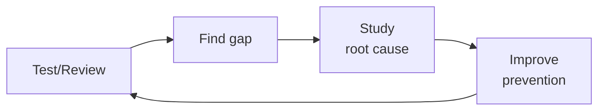

# API Test Suite Builder

Automatically scan API route definitions and generate comprehensive test suites covering auth, input validation, error codes, pagination, file uploads, and rate limiting. Outputs ready-to-run test files for Vitest+Supertest (Node.js) or Pytest+httpx (Python).

## Route the Request
<!-- QUICK: 30s — pick your path, skip the rest -->

```
Request: "Generate API tests for..."
├── ...a specific endpoint? → Jump to Core Workflow Phase 1 (Route Detection)
├── ...the entire project? → Jump to Core Workflow Phase 3 (Batch Generation)
├── ...auth endpoints only? → Use auth test matrix in Decision Trees
├── ...a legacy API with no tests? → Jump to Error Decoder (Legacy API)
└── Don't know where to start?
    → Run: find your route files first. I'll help you scan.
```

## Ground Rules — Read Before Anything Else
<!-- STANDARD: 3min -->

1. **Error paths first, happy paths second.** 80% of bugs live in error handling, not the golden path. Every endpoint gets auth matrix + input validation matrix before the success case.
2. **Test behavior, not implementation.** Assert what the API returns (status codes, response shape, headers), not how the handler achieves it. Tests survive refactors when they assert outcomes.
3. **No hardcoded test data.** Use factories or fixtures for IDs, tokens, and test entities. Tests that pass against one database instance fail against another.
4. **One describe block per endpoint.** Isolation makes failures instantly diagnosable. No scrolling through a 500-line test file guessing which endpoint broke.
5. **Rate limit tests go last.** They interfere with parallel test execution. Run them in a separate suite or mark them with a `@pytest.mark.slow` equivalent.


## The Expert's Mindset

Master API test suite builders know that tests are not about coverage percentages — they're about **making contract violations impossible to ship.** The best test suite is the one that fails exactly when the API behavior changes in a way that would break consumers.

| Cognitive Bias | Mitigation |
|----------------|------------|
| **Happy-path coverage trap** — 95% test coverage that only tests success responses and misses edge cases | Audit your test suite: what percentage test error responses, auth failures, rate limiting, and malformed inputs? If it's under 30%, you have a coverage illusion. |
| **Mock-everything syndrome** — mocking databases, caches, queues, and external services until the tests test nothing real | Every test suite needs at least one integration test that hits real dependencies. Mocks lie; contracts don't. |
| **Snapshot-creep** — auto-approving snapshot changes without understanding what changed and why | Every snapshot diff must be reviewed by a human who can explain why the output changed. If nobody knows, the test is testing luck. |
| **Flaky-test normalization** — accepting that "those 3 tests always fail on CI, just re-run" | Flaky tests are production bugs in your test infrastructure. Every flake gets 1 hour of investigation before it's quarantined. Zero-tolerance after 3 occurrences. |

### What Masters Know That Others Don't
- **The 5 API contracts that, if broken, cause the most consumer incidents** — these get contract tests with the strictest validation, not just schema checks but semantic assertions (response time, idempotency, ordering)
- **That test data is as important as test logic** — realistic, diverse test data finds more bugs than clever test scenarios with trivial data. Invest in data factories that generate edge cases automatically.
- **When to delete a test** — tests have a half-life. A test written 2 years ago for a feature that's been refactored 4 times is testing historical behavior, not current expectations. Delete tests that don't map to current contracts.

### When to Break Your Own Rules
- **Skip tests for a throwaway prototype that will be rebuilt.** But write the contract test first — it documents the API shape even if the implementation changes.
- **Relax coverage gates for generated code or thin proxies.** 100% coverage on a generated gRPC stub is noise. 100% coverage on hand-written business logic is table stakes.
## Operating at Different Levels

| Level | Scope | You... |
|-------|-------|--------|
| **L1** | Single test/review | Execute defined quality procedures; follow checklists |
| **L2** | Feature quality | Own quality for a feature area; write custom test strategies |
| **L3** | System quality | Design quality strategy for a system; define gates and thresholds; mentor |
| **L4** | Org quality | Define org-wide quality standards; make investment cases for quality tooling |
| **L5** | Industry quality | Create quality methodologies adopted across the industry |

**Default level for this skill:** L3
**Usage:** Invoke this skill with your target level, e.g., "as an L3 api test suite builder, review..."

For full level definitions, see `skills/00-framework/skill-levels/SKILL.md`.

## When to Use
<!-- QUICK: 30s — scan the bullet list to decide if this skill fits -->

- New API added — generate test scaffold before writing implementation (TDD)
- Legacy API with zero test coverage — scan and generate baseline
- API contract review — verify existing tests match current route definitions
- Pre-release regression check — ensure every route has at least smoke tests
- Security audit prep — generate adversarial input tests
- Onboarding new team members — auto-generated tests document expected API behavior

## Decision Trees
<!-- STANDARD: 3min -->

### Test Framework Selection

```
What language is the API written in?
├── TypeScript/JavaScript (Node.js)
│   ├── Next.js App Router? → Vitest + Supertest
│   ├── Express? → Vitest + Supertest
│   └── Other (Hono, Fastify)? → Vitest + built-in test client
├── Python
│   ├── FastAPI? → Pytest + httpx (async)
│   ├── Django REST? → Pytest + Django test client
│   └── Flask? → Pytest + Flask test client
└── Go / Rust / Java?
    → Use the framework's native test runner. Same matrices apply.
```

### Test Depth by Endpoint Criticality

```
How critical is this endpoint?
├── Auth / Payments / PHI access (P0)
│   → Full matrix: auth × 6, validation × 11, error codes, pagination, rate limiting
├── Core CRUD / Business logic (P1)
│   → Standard: auth × 4, validation × 8, error codes
└── Utility / Health check / Metadata (P2)
    → Smoke: auth × 2, happy path, 404 check
```

### Coverage Mode Selection

```
What's the goal?
├── Baseline coverage (legacy API, no tests) → Scan all routes, generate smoke tests for every endpoint
├── TDD (new feature) → Generate test scaffold from spec/OpenAPI, write tests before implementation
├── Audit (existing tests) → Compare route definitions against test files, flag uncovered endpoints
└── Pre-release (regression gate) → Verify every route has at minimum: auth test + happy path + 400/401/404
```

## Core Workflow
<!-- STANDARD: 5min -->

### Phase 1: Route Detection (5 min)

Scan the codebase to extract all API endpoints with their HTTP methods, paths, and auth requirements.

**Next.js App Router:**
```bash
find ./app/api -name "route.ts" | while read f; do
  route=$(echo $f | sed 's|./app||' | sed 's|/route.ts||')
  methods=$(grep -oE "export (async )?function (GET|POST|PUT|PATCH|DELETE)" "$f" | grep -oE "(GET|POST|PUT|PATCH|DELETE)")
  echo "$methods $route"
done
```

**Express:**
```bash
grep -rn "router\.\(get\|post\|put\|delete\|patch\)\|app\.\(get\|post\|put\|delete\|patch\)" src/ --include="*.ts" | grep -oE "(get|post|put|delete|patch)\(['\"][^'\"]*['\"]"
```

**FastAPI:**
```bash
grep -rn "@\(app\|router\)\.\(get\|post\|put\|delete\|patch\)" . --include="*.py" | grep -oE "@(app|router)\.(get|post|put|delete|patch)\(['\"][^'\"]*['\"]"
```

**Django REST:**
```bash
grep -rn "router\.register\|DefaultRouter\|SimpleRouter" . --include="*.py"
```

### Phase 2: Read Route Handlers (10 min)

For each detected route, read the handler to understand:
- Expected request body schema (fields, types, required vs optional)
- Auth requirements (middleware, decorators, token validation)
- Return types and status codes (200, 201, 204, etc.)
- Business rules (ownership checks, role requirements, rate limits)
- File upload expectations (max size, allowed MIME types)

### Phase 3: Generate Test Files (15 min)

Generate one test file per route group with this structure:

```typescript
// tests/api/users.test.ts — Vitest + Supertest
import { describe, it, expect, beforeAll, afterAll } from 'vitest';
import request from 'supertest';
import { createTestApp } from '../helpers/app';
import { createTestUser, getAuthToken } from '../helpers/auth';

describe('POST /api/v1/users', () => {
  let app: Express;
  let adminToken: string;
  let userToken: string;

  beforeAll(async () => {
    app = await createTestApp();
    adminToken = await getAuthToken({ role: 'admin' });
    userToken = await getAuthToken({ role: 'user' });
  });

  // ── Auth Matrix ──────────────────────────────
  it('returns 401 when no Authorization header', async () => {
    const res = await request(app).post('/api/v1/users').send({ name: 'Test' });
    expect(res.status).toBe(401);
  });

  it('returns 401 when token is expired', async () => {
    const res = await request(app)
      .post('/api/v1/users')
      .set('Authorization', `Bearer ${EXPIRED_TOKEN}`)
      .send({ name: 'Test' });
    expect(res.status).toBe(401);
  });

  it('returns 403 when user lacks admin role', async () => {
    const res = await request(app)
      .post('/api/v1/users')
      .set('Authorization', `Bearer ${userToken}`)
      .send({ name: 'Test', email: 'test@example.com' });
    expect(res.status).toBe(403);
  });

  it('returns 401 when token is from deleted user', async () => {
    const res = await request(app)
      .post('/api/v1/users')
      .set('Authorization', `Bearer ${DELETED_USER_TOKEN}`)
      .send({ name: 'Test' });
    expect(res.status).toBe(401);
  });

  // ── Input Validation Matrix ──────────────────
  it('returns 422 when body is empty', async () => {
    const res = await request(app)
      .post('/api/v1/users')
      .set('Authorization', `Bearer ${adminToken}`)
      .send({});
    expect(res.status).toBe(422);
  });

  it('returns 422 when required field "email" is missing', async () => {
    const res = await request(app)
      .post('/api/v1/users')
      .set('Authorization', `Bearer ${adminToken}`)
      .send({ name: 'Test' });
    expect(res.status).toBe(422);
    expect(res.body.errors).toContainEqual(
      expect.objectContaining({ field: 'email' })
    );
  });

  it('returns 422 when email format is invalid', async () => {
    const res = await request(app)
      .post('/api/v1/users')
      .set('Authorization', `Bearer ${adminToken}`)
      .send({ name: 'Test', email: 'not-an-email' });
    expect(res.status).toBe(422);
  });

  it('returns 422 when name exceeds max length', async () => {
    const res = await request(app)
      .post('/api/v1/users')
      .set('Authorization', `Bearer ${adminToken}`)
      .send({ name: 'x'.repeat(256), email: 'test@example.com' });
    expect(res.status).toBe(422);
  });

  it('sanitizes SQL injection in name field', async () => {
    const res = await request(app)
      .post('/api/v1/users')
      .set('Authorization', `Bearer ${adminToken}`)
      .send({ name: "'; DROP TABLE users; --", email: 'test@example.com' });
    expect(res.status).toBe(422); // or 201 if sanitized
  });

  it('sanitizes XSS payload in name field', async () => {
    const res = await request(app)
      .post('/api/v1/users')
      .set('Authorization', `Bearer ${adminToken}`)
      .send({ name: '<script>alert(1)</script>', email: 'test@example.com' });
    expect(res.status).toBe(422);
  });

  // ── Happy Path ───────────────────────────────
  it('returns 201 with user object on valid request', async () => {
    const res = await request(app)
      .post('/api/v1/users')
      .set('Authorization', `Bearer ${adminToken}`)
      .send({ name: 'Jane Doe', email: 'jane@example.com' });
    expect(res.status).toBe(201);
    expect(res.body).toMatchObject({
      id: expect.any(String),
      name: 'Jane Doe',
      email: 'jane@example.com',
    });
    expect(res.body).not.toHaveProperty('password_hash');
  });

  // ── Duplicate Detection ──────────────────────
  it('returns 409 when email already exists', async () => {
    await request(app)
      .post('/api/v1/users')
      .set('Authorization', `Bearer ${adminToken}`)
      .send({ name: 'Existing', email: 'dup@example.com' });

    const res = await request(app)
      .post('/api/v1/users')
      .set('Authorization', `Bearer ${adminToken}`)
      .send({ name: 'Duplicate', email: 'dup@example.com' });
    expect(res.status).toBe(409);
  });
});
```

### Phase 4: Validate and Integrate (5 min)

- Run tests: `npm test -- --coverage` or `pytest --cov`
- Verify all tests pass (or fail for the right reasons in TDD mode)
- Add to CI pipeline: `npm test` gate in GitHub Actions
- Generate coverage baseline for future comparison

## Cross-Skill Coordination
<!-- STANDARD: 3min -->

| Upstream Skill | What to Expect | Communication Trigger |
|---------------|----------------|---------------------|
| `api-designer` | OpenAPI spec, endpoint contracts, request/response schemas | When spec changes — regenerate test matrices |
| `backend-developer` | Route handler implementations, middleware, auth patterns | When new endpoint is added — auto-detect and generate tests |
| `fullstack-developer` | API consumption patterns, real-world usage edge cases | When frontend discovers API edge case — add test case |
| `qa-engineer` | Test strategy, coverage thresholds, test pyramid decisions | When QA defines new quality gates — update test depth matrices |
| `security-reviewer` | Adversarial input patterns, security test scenarios | When new vulnerability class is identified — add to validation matrix |

| Downstream Skill | What to Deliver | Communication Trigger |
|-----------------|-----------------|---------------------|
| `ci-cd-builder` | Test scripts for CI pipeline, coverage thresholds | When new test suite is generated — provide CI integration YAML |
| `code-reviewer` | Test coverage report, uncovered endpoints list | When PR is opened — report test coverage delta |
| `qa-engineer` | Generated test suites, coverage reports, route-to-test mapping | When coverage drops below threshold — escalate |

## Proactive Triggers
<!-- STANDARD: 2min — surface these WITHOUT being asked -->

- **Route without tests** → An endpoint exists in the codebase but has zero test coverage. Flag the file and method. 🔴
- **Test only covers happy path** → An endpoint has auth and validation tests missing. Generate the missing matrices. 🟡
- **Hardcoded test data** → Test uses a literal ID, token, or entity that will break in a different environment. Flag for fixture replacement. 🟡
- **Missing error code coverage** → Endpoint has 200 tests but no 400/401/403/404/409/422 tests. 80% of bugs live here. 🟡
- **Shared mutable state** → Tests modify global state without cleanup. Flag `afterEach`/`afterAll` gaps. 🟡
- **Rate limit tests in main suite** → Rate limit tests that sleep/wait will slow down the entire suite. Move to separate suite. 🟠
- **Outdated test vs route** → Route handler changed (new params, different auth) but tests weren't updated. Flag drift. 🔴
- **Sensitive field leaked in response** → Test asserts success but doesn't verify password_hash, secret, or internal fields are absent. Flag. 🔴

## Best Practices
<!-- STANDARD: 3min -->

1. **One describe block per endpoint** — failures are instantly diagnosable. No scrolling.
2. **Seed minimal data** — create only what the test needs in `beforeAll`. Don't load the entire database.
3. **Assert response shape, not just status code** — a 200 with a missing field is a bug. Validate the full response schema.
4. **Use parametrized tests for validation matrices** — `it.each` (Vitest) or `@pytest.mark.parametrize` reduces 11 validation tests to 5 lines.
5. **Test that sensitive fields are ABSENT** — `expect(res.body).not.toHaveProperty('password_hash')` is as important as asserting presence.
6. **Always test the "missing header" case separately from "invalid token"** — they trigger different code paths and return different errors.
7. **Name tests descriptively** — `"returns 401 when token is expired"` not `"auth test 3"`. Test names are documentation.
8. **Use factories for test entities** — `createTestUser({ role: 'admin' })` not `{ id: 1, name: 'Admin' }`. Factories survive schema changes.

## Anti-Patterns
<!-- STANDARD: 2min -->

| ❌ Anti-Pattern | ✅ Do This Instead |
|----------------|-------------------|
| Testing only happy paths — "it works" | Test auth matrix + validation matrix + error codes first. Happy path is the LAST test you write. |
| Hardcoding IDs: `userId: 1` | Use `createTestUser()` factory. IDs change between environments and test runs. |
| Shared state between tests | Always clean up in `afterEach`/`afterAll`. Tests must be independently runnable. |
| Testing implementation: `expect(service.createUser).toHaveBeenCalled()` | Test behavior: `expect(res.status).toBe(201)` and `expect(res.body.email).toBe('test@example.com')`. |
| Skipping boundary tests — testing values 1-10 but not 0 and 11 | Always test min-1 and max+1. Off-by-one errors are the most common production bug. |
| Not testing token expiry separately from invalid tokens | Expired tokens return 401 with a specific error code. Invalid tokens return 401 with a different error. These are different bugs. |
| Ignoring Content-Type validation | Test that the API rejects `application/xml` when it expects `application/json`. Content-Type mismatches are a real attack vector. |
| Rate limit tests mixed with functional tests | Rate limit tests often need `sleep()` calls. Isolate them in a dedicated suite with `--runInBand` to avoid poisoning parallel runs. |

## Error Decoder
<!-- STANDARD: 3min -->

| Symptom | Root Cause | Fix | Lesson |
|---------|-----------|-----|--------|
| All tests pass locally, fail in CI | Hardcoded database IDs or environment-specific tokens | Replace all hardcoded IDs with factories. Use `process.env.TEST_DATABASE_URL` with fallback. | Tests that depend on specific database state are fragile. Every test should create its own data. |
| Test "passes" but API actually returns 500 | Test only checks `res.status` is not 500, but the 200 response has `{ error: "internal" }` | Assert full response shape: `expect(res.body).toMatchObject({ id: expect.any(String), name: 'Jane' })`. Never just check status code. | Status codes lie. Always validate the response body structure in happy-path tests. |
| Coverage shows 90% but bugs in error paths | Coverage measures execution, not verification. Error handler was called but test didn't assert the error message. | Add specific error message assertions: `expect(res.body.errors[0].message).toContain('required')`. | 100% line coverage != good tests. Mutation testing catches weak assertions — use Stryker/PIT/mutmut on P0 endpoints. |
| Rate limit tests cause other tests to fail | `sleep(1000)` in rate limit test delays the entire suite. Parallel runner times out waiting. | Move rate limit tests to a separate file with `--runInBand` flag. Mark with `@pytest.mark.slow` or `describe.skip` in CI unless explicitly requested. | Infrastructure tests (rate limits, timeouts, retries) need isolation from functional tests. |
| New endpoint added, tests silently missing | Route detection wasn't automated. Manual process missed it. | Add route-to-test mapping to CI: `find routes | compare with test files | fail if uncovered`. Generate a coverage gap report on every PR. | Automation is the only reliable way to ensure test coverage keeps pace with API growth. |

## Production Checklist
<!-- STANDARD: 3min -->

| ID | Item | Status |
|----|------|--------|
| AT1 | Route detection script runs in CI — no uncovered endpoints | ☐ |
| AT2 | Auth matrix generated for every authenticated endpoint (6 cases minimum) | ☐ |
| AT3 | Input validation matrix generated for every POST/PUT/PATCH (11 cases minimum) | ☐ |
| AT4 | Error code coverage: 400, 401, 403, 404, 409, 422 tested per endpoint | ☐ |
| AT5 | Sensitive field leak test: password_hash, secret, token, internal fields verified absent in every response | ☐ |
| AT6 | Boundary tests for all paginated endpoints (first page, last page, empty, oversized page) | ☐ |
| AT7 | File upload tests: valid file, oversized, wrong MIME, empty file | ☐ |
| AT8 | Rate limit tests isolated in separate suite (not mixed with functional tests) | ☐ |
| AT9 | Test factories used for all entities — zero hardcoded IDs | ☐ |
| AT10 | Coverage threshold enforced in CI (≥80% lines, ≥70% branches) | ☐ |
| AT11 | Mutation testing run on P0 endpoints (auth, payments, PHI access) — ≥85% mutation score | ☐ |
| AT12 | Response schema validation in every happy-path test — not just status code | ☐ |
| AT13 | SQL injection + XSS payload tests in validation matrix for every string field | ☐ |
| AT14 | Test suite runs in < 5 minutes (excluding rate limit suite) in CI | ☐ |

## Footguns
<!-- DEEP: 10+min — war stories from production API testing -->

| Footgun | What Happened | Root Cause | How to Prevent |
|---------|---------------|------------|----------------|
| Generated test suite passed 100% — 847 tests, zero failures — but missed that the `/api/users/:id` DELETE endpoint had no authorization check because the generator only tested with admin credentials | The test generator auto-discovered 34 endpoints across 3 services and generated auth matrix tests. But the auth matrix was seeded with a single admin user — every test authenticated as admin. The `DELETE /api/users/:id` endpoint returned 200 for admin, so the test passed. Any authenticated non-admin user could also delete any user — the endpoint checked authentication but not authorization. A disgruntled contractor discovered this and deleted 47 user accounts over a weekend before anyone noticed. | The generator inferred auth requirements from the existing code's decorators — the code had `@require_auth` but no `@require_role('admin')`. The generator couldn't detect that role-based access control was missing because it tested what the code DID, not what it SHOULD do. | **Seed the auth matrix with multiple roles, not just one.** Generated auth matrices must include: unauthenticated, authenticated-but-unauthorized (wrong role), authenticated-authorized (correct role), and expired/revoked token. The generator should flag endpoints where all roles get the same response (potential missing RBAC). Add a manual review step: for every endpoint returning 2xx for unauthenticated requests, file a security ticket. |
| Response schema validation passed for 6 months — every test checked status codes and response structure — but a `/api/export` endpoint leaked password hashes because the validator used `additionalProperties: true` | The OpenAPI schema defined the response shape but used `additionalProperties: true` (the OpenAPI default). The generated tests validated that all REQUIRED fields were present — `id`, `name`, `email`, `created_at` — but didn't fail when unexpected fields appeared. The backend team added a `password_hash` field to the User model for an internal migration and forgot to mark it `@JsonIgnore`. The field leaked in the API response for 6 months. The security audit discovered it — 14,000 hashes had been exposed. | The OpenAPI spec allowed extra fields by default. The test assertion was "response matches schema" but the schema was permissive. No test checked "response contains ONLY the documented fields." | **Set `additionalProperties: false` on all response schemas.** This forces the validator to reject any field not explicitly documented. If you need extensibility, use explicit `x-extensible: true` on specific schemas. Add a "sensitive field leak" test: define a blocklist (`password_hash`, `secret`, `token`, `internal_notes`, `ssn`) and assert that no response body anywhere contains any field name matching the blocklist. Run this test in CI against a database seeded with production-like data. |
| Mutation testing scored 92% — but 100% of surviving mutants were in error-handling code that the tests never exercised because the generator only tested the happy path and standard error codes | The team ran Stryker mutator on the API codebase. It reported 92% mutation score — 8% of mutants survived. The surviving mutants were all in `catch` blocks: a mutated `>=` to `>` in a retry counter, a removed `rollback()` call in a database error handler, a swapped `400` to `500` in an error response factory. These mutants survived because the test suite had 100% happy-path coverage but sparse error-path coverage. The retry counter bug caused infinite loops under load 2 weeks later. | The generator prioritized happy-path scenarios because they're easier to infer from OpenAPI specs. Error scenarios (what happens when the database is down? when an upstream service returns 500? when a webhook payload is malformed?) require domain knowledge the generator doesn't have. | **Run mutation testing specifically on error-handling code paths.** Extract error-handling modules into pure functions and test them independently. Use fault injection in integration tests: configure Toxiproxy or WireMock to simulate upstream failures (timeout, 500, malformed response). Set a CI threshold: "no surviving mutants in error-handling code for P0 endpoints." File a ticket for every surviving mutant. |
| Test factories shared a global mutable database seed — 14 tests were flaky for 3 months because test ordering changed the seed state | The test suite used a shared PostgreSQL container seeded with test factories. 14 tests were marked `@Flaky` in CI. Root cause investigation kept finding "works on my machine." The actual cause: tests 47-53 in the test order relied on a User with `id=42` having `role=admin`, but test 31 (a rate limit test) sometimes updated User 42's role as a side effect. When tests ran in a different order (parallel CI workers), tests 47-53 passed. When they ran sequentially, they failed. | Test factories used a single shared database with hardcoded IDs. The `UserFactory.create(id=42)` call in test 31 reused an existing row instead of creating a new one. Test isolation was broken by design. | **Every test creates its own data and cleans up after itself.** Use transaction rollback (pytest-django's `transactional_db`, Rails' `use_transactional_tests`) or unique IDs per test run (`uuid4()` instead of `id=42`). Never hardcode IDs in test factories. Add a CI check: run the test suite in random order 5 times — if any test fails in any order, mark the suite as broken. This catches shared state issues that "works on my machine" misses. |
| Generated contract tests caught schema drift but missed behavioral drift — the `/api/search` endpoint started returning results in a different sort order and nobody noticed for 4 weeks | The OpenAPI spec defined the response schema as `{ results: Array<SearchResult> }`. The contract test validated that the response matched the schema — it did. But a backend optimization changed the default sort order from `relevance DESC` to `created_at DESC` without updating the spec. The schema was identical. The frontend relied on the old sort order to display "best matches first" — customers started complaining that search was "broken" but couldn't articulate why. | The contract test compared structure, not behavior. Schema validation (`type: array`) passed regardless of element order. The spec didn't document the sort order as a behavioral contract — only as a comment in the OpenAPI description field. | **Add semantic contract tests beyond schema validation.** For list endpoints, test: (1) default sort order is documented and matches, (2) pagination returns non-overlapping pages, (3) filter combinations return correct subsets. Use property-based testing: "for any valid sort parameter, results must be monotonic in that field." Document sort order as a test assertion, not just a spec comment. |

## Calibration — How to Know Your Level
<!-- STANDARD: 3min — honest self-assessment rubric -->

| You Know You're Stuck at L1 When... | You Know You've Reached L2 When... | You Know You're L3 When... |
|---|---|---|
| You run the test generator, see green, and merge — you don't read any of the generated tests | You audit every generated test suite: you identify which scenarios the generator missed, add manual tests for those gaps, and verify the assertions are testing behavior, not just status codes | You've built custom generators that encode your organization's specific threat model — auth roles, sensitive fields, business rules — and the generated suites catch bugs before human review |
| You configure coverage thresholds but never look at WHAT is covered — "85% lines" is your only metric | You run mutation testing on every PR and can explain why each surviving mutant escaped: "This mutant survived because we don't test what happens when the payment service returns a 504 after 3 retries" | You've reduced the escape rate of P0 bugs from your API by >50% — and you can prove it with 12 months of production incident data correlated to test suite changes |
| Your test data is a single JSON fixture with 3 users named "test1", "test2", "test3" | Your test factories generate realistic, varied data — different roles, edge-case values (null, empty, Unicode, 10MB payloads) — and every test creates its own isolated data | Developers add new endpoints and the tests are generated, reviewed, and passing within 10 minutes — and your framework is adopted by 3+ teams in the org |

**The Litmus Test:** Given an OpenAPI spec with 50+ endpoints, can you identify 3 categories of bugs that schema-based test generation will ALWAYS miss — and describe the manual tests you'd write to catch them? If your answer is only "business logic errors," you're not thinking deep enough. (Hint: race conditions, behavioral contracts, and resource lifecycle bugs.)

## Scale Depth: Solo → Small → Medium → Enterprise
<!-- STANDARD: 3min -->

### Solo (1 developer, MVP)
**Description:** Single API, < 20 endpoints, no existing tests.
**Approach:** Run route detection. Generate smoke tests for every endpoint (auth × 2 + happy path). Target 60% coverage. Don't over-engineer — the API will change rapidly.
**Time investment:** 2-4 hours for full baseline coverage.

### Small Team (2-10 developers, active development)
**Description:** Growing API, 20-100 endpoints, some tests exist but coverage is spotty.
**Approach:** Run route-to-test gap analysis. Prioritize P0 endpoints (auth, payments, core business logic). Add validation matrices for new endpoints. Integrate coverage gate into CI. Generate regression test suite for pre-release.
**Time investment:** 1-2 days to close P0 gaps. Ongoing: 15 min per new endpoint.

### Medium Team (10-50 developers, multiple services)
**Description:** Multiple APIs, 100-500 endpoints, dedicated QA team, CI/CD pipeline.
**Approach:** Standardize test structure across services. Add mutation testing to P0 endpoints. Contract testing between services (Pact or similar). Performance test suite for critical paths. Test data factories as shared library. Coverage dashboards per service.
**Time investment:** 1-2 weeks to standardize. Ongoing: automated in CI.

### Enterprise (50+ developers, microservices, compliance requirements)
**Description:** 500+ endpoints across 10+ services, regulatory compliance (SOC 2, HIPAA, PCI), multiple teams.
**Approach:** Centralized test infrastructure team. Cross-service integration tests with synthetic data. Compliance-specific test suites (PHI access audit, encryption verification, data retention). Chaos testing for API resilience. Automated test generation from OpenAPI specs on every deploy. Coverage and mutation score SLAs per service.
**Time investment:** Ongoing investment. Dedicated test infrastructure team.

## What Good Looks Like
<!-- STANDARD: 3min -->

Every endpoint has tests covering auth, validation, error codes, and a happy path — generated, not hand-crafted. When a developer adds a new route, CI fails until tests exist. When a spec changes, tests flag the drift before code reaches review. Coverage sits at 85%+ but the real win is that zero critical bugs reach production — because the error paths (the 80% where bugs hide) are tested as thoroughly as the golden path. The test suite runs in under 5 minutes in CI. Rate limit tests are isolated. A new team member can understand every endpoint's expected behavior by reading the test descriptions alone.

## Deliberate Practice



| Level | Practice | Frequency |
|-------|----------|-----------|
| **Novice** | Review your own work from 3 months ago; catalog everything you'd now flag | Monthly |
| **Competent** | Shadow a more senior reviewer; compare their findings to yours; study the delta | Weekly |
| **Expert** | Design a new quality gate; measure false positive/negative rates; tune for 6 months | Quarterly |
| **Master** | Create a training module that teaches others your quality intuition; measure their improvement | Quarterly |

**The One Highest-Leverage Activity:** Keep a "mistakes journal." Every time you miss something, write down: what you missed, why you missed it, and what rule would have caught it.

## References
<!-- STANDARD: 3min -->

- **qa-engineer** — for test pyramid strategy, coverage goals, and quality metrics framework
- **api-designer** — for OpenAPI 3.1 specs and endpoint contracts that drive test generation
- **security-reviewer** — for adversarial input patterns and security-specific test scenarios
- **ci-cd-builder** — for integrating test suites into CI/CD pipelines with quality gates
- **code-reviewer** — for reviewing generated tests for assertion quality and coverage completeness
